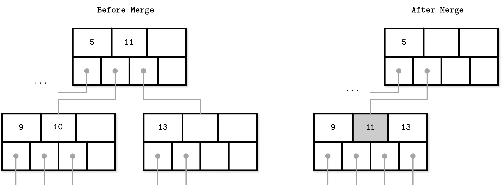

# 第二章：B-树基础

在上一章中，我们将存储结构分为两组：*可变*和*不可变*，并确定了不可变性作为影响其设计和实现的核心概念之一。大多数可变存储结构使用*原地更新*机制。在插入、删除或更新操作期间，数据记录直接在目标文件中更新。

存储引擎通常允许数据库中存在同一数据记录的多个版本；例如，在使用多版本并发控制（见“多版本并发控制”）或分槽页组织时（见“槽页”）。为了简单起见，我们暂时假设每个键仅与一个数据记录相关联，该记录具有唯一位置。

其中一种最受欢迎的存储结构是 B-树。许多开源数据库系统基于 B-树，多年来它们已被证明可以覆盖大多数使用情况。

B-树并非新发明：它们由 Rudolph Bayer 和 Edward M. McCreight 在 1971 年引入，并随着时间的推移而流行起来。到 1979 年，已经有相当多的 B-树变体。Douglas Comer 收集并系统化了其中一些[[COMER79]](app01.html#COMER79)。

在我们深入研究 B-树之前，让我们先谈谈为什么我们应该考虑传统搜索树的替代方案，例如二叉搜索树、2-3 树和 AVL 树[[KNUTH98]](app01.html#KNUTH98)。为此，让我们回顾一下二叉搜索树是什么。

# 二叉搜索树

*二叉搜索树*（BST）是一种排序的内存数据结构，用于高效的键值查找。BST 由多个节点组成。每个树节点由一个键、与该键相关联的值以及两个子指针表示（因此称为二进制）。BST 从单个称为*根节点*的节点开始。树中只能有一个根。图 2-1 展示了二叉搜索树的示例。

###### 图 2-1\. 二叉搜索树

每个节点将搜索空间分为左右*子树*，如图 2-2 所示：节点键*大于*存储在其左子树中的任何键，*小于*存储在其右子树中的任何键[[SEDGEWICK11]](app01.html#SEDGEWICK11)。

###### 图 2-2\. 二叉树节点不变性

从树的根节点开始沿左指针向下到叶级（节点没有子节点的级别）可以定位持有树中最小键和相关值的节点。类似地，跟随右指针可以定位持有树中最大键和相关值的节点。允许在树中的所有节点中存储值。搜索从根节点开始，并且如果在更高级别找到搜索键，则可能在未达到树的底层之前终止。

## 树的平衡化

插入操作不遵循任何特定模式，元素插入可能导致树失衡（即其中一个分支比另一个分支更长）。最坏情况如图 2-3 (b)所示，我们最终得到一个*病态*树，更像是一个链接列表，而不是期望的对数复杂度，如图 2-3 (a)所示。

###### 图 2-3\. 平衡 (a) 和非平衡或病态 (b) 树示例

这个例子可能稍微夸张了问题，但它说明了为什么树需要平衡：尽管所有项目都在树的一侧的可能性稍低，但至少其中一些肯定会，这将显著减慢搜索速度。

*平衡*树被定义为高度为`log[2] N`的树，其中`N`是树中的总项目数，并且两个子树之间高度差不超过一^(1) [[KNUTH98]](app01.html#KNUTH98)。没有平衡，我们将失去二叉搜索树结构的性能优势，并允许插入和删除顺序来确定树的形状。

在平衡树中，沿着左或右节点指针平均减少搜索空间的一半，因此查找复杂度是对数的：`O(log[2] N)`。如果树不平衡，最坏情况复杂度会上升到`O(N)`，因为我们可能会陷入所有元素都在树的一侧的情况。

不是将新元素添加到树的一个分支并使其变得更长，而另一个分支保持为空（如图 2-3 (b)所示），每次操作后树都会*平衡*。平衡是通过重新组织节点以使树高最小化并保持每侧节点数量在界限内来完成的。

保持树平衡的一种方法是在添加或删除节点后执行旋转步骤。如果插入操作使一个分支失衡（分支中连续两个节点只有一个子节点），我们可以围绕中间节点*旋转*节点。在图 2-4 的示例中，旋转过程中间节点（3），称为旋转*枢轴*，被提升到更高一级，其父节点成为其右子节点。

###### 图 2-4\. 旋转步骤示例

## 磁盘存储的树

如前所述，非平衡树的最坏情况复杂度为`O(N)`。平衡树则给我们提供了平均`O(log[2] N)`的复杂度。与此同时，由于低*分支因子*（分支因子是每个节点允许的最大子节点数），我们经常需要进行平衡、重定位节点和更新指针。增加的维护成本使得二叉搜索树作为磁盘数据结构不切实际[[NIEVERGELT74]](app01.html#NIEVERGELT74)。

如果我们想在磁盘上维护一个 BST，我们将面临几个问题。一个问题是局部性：由于元素是按随机顺序添加的，不能保证新创建的节点被写入其父节点附近，这意味着节点的子指针可能跨越多个磁盘页面。通过修改树的布局并使用分页二叉树（参见“分页二叉树”），我们可以在一定程度上改善情况。

另一个问题，与跟随子指针的成本密切相关的是树的高度。由于二叉树的扇出只有两个，高度是树中元素数量的二进制对数，我们必须执行`O(log[2] N)`次寻址来定位所搜索的元素，并且随后执行相同数量的磁盘传输。2-3 树和其他低扇出树具有类似的限制：虽然它们作为内存数据结构很有用，但小节点大小使它们在外部存储中不切实际[[COMER79]](app01.html#COMER79)。

一个简单的磁盘上的二叉搜索树（BST）实现需要和比较一样多的磁盘寻址，因为没有内置的局部性概念。这使得我们必须寻找一个能展现这种特性的数据结构。

考虑到这些因素，适合磁盘实现的树的版本必须展示以下特性：

+   *高扇出*以改进相邻键的局部性。

+   *低高度*以减少遍历过程中的寻址次数。

###### 注意

扇出和高度成反比：扇出越高，高度越低。如果扇出高，每个节点可以容纳更多的子节点，减少节点数量，从而减少高度。

# 基于磁盘的结构

我们已经以一般术语讨论了内存和基于磁盘的存储（参见“内存与基于磁盘的 DBMS”）。对于特定的数据结构，我们可以做出相同的区分：有些更适合用于磁盘，而有些在内存中工作更好。

正如我们所讨论的，不是每个满足空间和复杂度要求的数据结构都能有效用于磁盘存储。用于数据库的数据结构必须适应持久性介质的限制。

当数据量非常大，无法或不可行地将整个数据集保存在内存中时，通常会使用磁盘数据结构。只有一部分数据可以在任何时候在内存中*缓存*，其余数据必须以一种允许高效访问的方式存储在磁盘上。

## 硬盘驱动器

大多数传统算法是在旋转硬盘是最广泛的持久存储介质时开发的，这显著影响了它们的设计。后来，存储介质的新发展，如闪存驱动器，启发了新的算法和对现有算法的修改，利用了新硬件的能力。如今，新型数据结构正在出现，优化以与非易失性可寻址存储一起工作（例如，[[XIA17]](app01.html#XIA17) [[KANNAN18]](app01.html#KANNAN18)）。

在旋转硬盘上，*寻道* 增加了随机读取的成本，因为它们需要磁盘旋转和机械磁头移动以定位读/写头到所需位置。但是，一旦昂贵的部分完成，读取或写入连续字节（即顺序操作）就*相对*便宜了。

旋转驱动器的最小传输单位是*扇区*，因此在执行某些操作时，至少可以读取或写入整个扇区。扇区的大小通常在 512 字节到 4 Kb 之间。

磁头定位是 HDD 操作中最昂贵的部分。这也是我们经常听到*顺序* I/O 的积极影响的原因之一：从磁盘读取和写入连续的内存段。

## 固态硬盘

固态硬盘（SSD）没有移动部件：没有旋转的盘片，也没有需要定位读取的磁头。典型的 SSD 由*存储单元*组成，连接成*串*（通常每串 32 到 64 个单元），串组合成*阵列*，阵列组合成*页*，页组合成*块* [[LARRIVEE15]](app01.html#LARRIVEE15)。

根据使用的确切技术，单元可以容纳一个或多个数据位。设备的页大小因设备而异，但通常在 2 到 16 Kb 之间。块通常包含 64 到 512 页。块被组织成平面，最终，平面被放置在*芯片*上。SSD 可以有一个或多个芯片。图 2-5 显示了这种层次结构。

###### 图 2-5\. SSD 组织结构示意图

可以写入（编程）或读取的最小单位是页。但是，我们只能对空白存储单元进行更改（即已经擦除以便写入的单元）。最小的擦除单元不是页，而是包含多个页的块，因此通常被称为*擦除块*。空块中的页必须按顺序写入。

负责将页 ID 映射到其物理位置，跟踪空闲、写入和已丢弃页面的闪存控制器部分称为闪存转换层（FTL）（详见“闪存转换层”以了解更多关于 FTL 的信息）。它还负责*垃圾收集*，在此期间，FTL 找到可以安全擦除的块。一些块可能仍包含存活页面。在这种情况下，它将存活页面从这些块重新定位到新位置，并重新映射页 ID 以指向那里。之后，它擦除现在未使用的块，使它们可以进行写入。

由于在设备类型（HDD 和 SSD）中我们处理的是内存块而不是单个字节（即按数据块访问），大多数操作系统都有*块设备*抽象 [[CESATI05]](app01.html#CESATI05)。它隐藏了内部的磁盘结构，并在内部缓冲 I/O 操作，因此当我们从块设备中读取一个*单词*时，会读取包含它的*整个块*。这是一个我们不能忽视的约束条件，在处理驻留在磁盘上的数据结构时应始终考虑。

在 SSD 中，与 HDD 不同，我们不强调随机与顺序 I/O 之间的差异，因为随机和顺序读取之间的延迟差异不是很大。由于预取、连续页面读取和内部并行性，仍然存在一些由此引起的差异 [[GOOSSAERT14]](app01.html#GOOSSAERT14)。

尽管垃圾收集通常是后台操作，但其影响可能会对写入性能产生负面影响，尤其是在随机和不对齐的写入工作负载情况下。

仅写入完整块，并将后续写入组合到同一块中，可以帮助减少所需的 I/O 操作次数。我们将在后续章节中讨论缓冲和不变性作为实现这一目标的方法。

## 磁盘上的数据结构

除了磁盘访问本身的成本外，构建高效的磁盘结构的主要限制和设计条件是磁盘操作的最小单位是一个块。要跟随指针到块内的特定位置，我们必须获取整个块。既然我们已经这样做了，我们可以改变数据结构的布局以利用它。

在本章中，我们已经多次提到指针，但对于磁盘上的结构，这个词的语义略有不同。在磁盘上，大多数情况下我们手动管理数据布局（除非，例如，我们使用[内存映射文件](https://databass.dev/links/64)）。这与常规指针操作类似，但我们必须计算目标指针地址并显式地跟踪指针。

大多数情况下，磁盘偏移量是预先计算的（在指针在指向的部分之前写入磁盘的情况下）或者在内存中缓存，直到它们被刷新到磁盘上。在磁盘结构中创建长依赖链大大增加了代码和结构复杂性，因此最好保持指针数量及其跨度的最小化。

总之，磁盘结构是根据其目标存储特性设计的，通常优化于减少磁盘访问。我们可以通过提高局部性，优化结构的内部表示以及减少页面外指针的数量来实现这一点。

在 “二叉搜索树” 中，我们得出结论，*高扇出* 和 *低高度* 是理想的磁盘数据结构的期望特性。我们刚刚讨论了指针带来的额外空间开销，以及由于平衡导致的这些指针重映射的维护开销。B-树结合了这些思想：增加节点的扇出，并减少树的高度、节点指针的数量以及平衡操作的频率。

# 普遍存在的 B-树

> 我们比蜜蜂更勇敢，比树更……长……
> 
> 小熊维尼

B-树可以被视为图书馆中的广阔目录室：您首先必须选择正确的柜子，然后是该柜子中的正确架子，接着是架子上的正确抽屉，然后浏览抽屉中的卡片，找到您正在搜索的那一张。类似地，B-树建立了一个层次结构，有助于快速导航和定位搜索的项目。

正如我们在 “二叉搜索树” 中所讨论的，B-树建立在平衡搜索树的基础上，并且在于它们具有更高的扇出（具有更多的子节点）和较小的高度。

在大多数文献中，二叉树节点被绘制为圆圈。由于每个节点只负责一个键并将范围分成两部分，这个细节水平已经足够直观了。同时，B-树节点通常被绘制为矩形，并且指针块也明确显示，以突出子节点与分隔键之间的关系。图 2-7 将二叉树、2-3 树和 B-树节点并排显示，有助于理解它们之间的相似性和差异。

###### 图 2-7. 二叉树、2-3 树和 B-树节点并排

没有什么能阻止我们以同样的方式描述二叉树。这两种结构具有类似的指针跟随语义，不同之处在于平衡维护的方式。图 2-8 显示了这一点，并暗示了二叉搜索树和 B-树之间的相似性：在这两种情况下，键将树分成子树，并用于导航树并找到搜索键。您可以将其与 图 2-1 进行比较。

###### 图 2-8\. 二叉树的替代表示

B-树是*有序*的：B-树节点内的键按顺序存储。由此可知，为了定位搜索的键，可以使用类似于二分查找的算法。这也意味着在 B-树中进行查找具有对数复杂度。例如，在 40 亿（`4 × 10⁹`）项中查找一个搜索的键需要大约 32 次比较（参见“B-树查找复杂度”了解更多）。如果每个比较都需要进行一次磁盘寻址，这将显著减慢速度，但由于 B-树节点存储了数十甚至数百个项目，我们只需进行每次级别跳转的一次磁盘寻址。我们将在本章后面更详细地讨论查找算法。

使用 B-树，我们可以高效地执行*点查询*和*范围查询*。在大多数查询语言中，通过等号（`= `）谓词表示的点查询定位单个项。另一方面，通过比较（`<`、`>`、`≤`和`≥`）谓词表示的范围查询用于按顺序查询多个数据项。

## B-树层次结构

B-树由多个节点组成。每个节点最多容纳`N`个键和`N + 1`个指向子节点的指针。这些节点在逻辑上分为三组：

根节点

这没有父节点，是树的顶部。

叶节点

这些是没有子节点的底层节点。

内部节点

这些都是其他节点，连接根节点与叶节点。通常存在多个层级的内部节点。

这个层次结构显示在图 2-9 中。

###### 图 2-9\. B-树节点层次结构

由于 B-树是一种*页面*组织技术（即它们用于组织和导航固定大小的页面），我们经常可以互换使用术语*节点*和*页面*。

节点容量与实际保存的键数之间的关系称为*占用率*。

B-树的特征在于它们的*分支因子*：每个节点存储的键数。更高的分支因子有助于分摊保持树平衡所需的结构更改成本，并通过将键和指向子节点的指针存储在单个或多个连续块中来减少寻址次数。当节点满或几乎为空时，会触发平衡操作（即*分裂*和*合并*）。

## 分隔键

存储在 B-树节点中的键被称为*索引条目*、*分隔键*或*分隔单元*。它们将树分割为*子树*（也称为*分支*或*子范围*），每个子树持有相应的键范围。为了进行二分查找，键以排序顺序存储。通过定位键并从高级到低级跟随相应的指针，可以找到子树。

节点中的第一个指针指向保存小于第一个键的项目的子树，而节点中的最后一个指针指向保存大于或等于最后一个键的子树。其他指针引用介于两个键之间的子树：`K[i-1] ≤ K[s] < K[i]`，其中 `K` 是一组键，`K[s]` 是属于子树的键。Figure 2-10 展示了这些不变量。

###### 图 2-10\. 分隔键如何将树分割成子树

一些 B 树变体还在叶级别上有兄弟节点指针，以简化范围扫描。这些指针帮助避免返回到父节点以查找下一个兄弟节点。一些实现还在两个方向上具有指针，形成叶级别的双向链表，这样就可以进行反向迭代。

与二叉搜索树不同的是，B 树不是从顶向下构建的，而是反过来从底向上构建的。叶节点的数量增加，内部节点和树的高度也随之增加。

由于 B 树在节点内为未来的插入和更新保留了额外空间，树的存储利用率可以低至 50%，但通常要高得多。更高的占用率不会对 B 树的性能产生负面影响。

## B-Tree 查找复杂度

B 树查找复杂度可以从两个角度来看待：在查找过程中进行的块传输数量和比较次数。

就传输数量而言，对数的底数是 `N`（每个节点的键数）。每个新级别上的节点数增加了 `N` 倍，并且跟随子指针可以将搜索空间减少 `N` 倍。在查找过程中，最多会访问 `log[N] M`（其中 `M` 是 B 树中的总项数）页来找到所需的键。在从根到叶的过程中还必须跟随子指针的数量等于树的高度 `h`。

从比较次数的角度来看，对数的底数是 `2`，因为在每个节点内搜索键都是使用二分搜索完成的。每次比较都将搜索空间减半，因此复杂度是 `log[2] M`。

知道寻找次数和比较次数之间的区别有助于我们直观地理解搜索的执行过程以及理解查找复杂度的含义。

在教科书和文章中，^(2) B 树查找复杂度通常被引用为 `log M`。由于改变对数的底数仅仅添加一个常数因子，并且乘以一个常数因子不会改变复杂度分析。例如，给定非零常数因子 `c`，`O(|c| × n) == O(n)` [[KNUTH97]](app01.html#KNUTH97)。

## B-Tree 查找算法

现在我们已经介绍了 B 树的结构和内部组织，我们可以定义查找、插入和删除的算法。要在 B 树中查找项目，我们必须从根到叶子执行单次遍历。此搜索的目标是找到搜索的键或其前身。找到精确匹配用于点查询、更新和删除；找到其前身对于范围扫描和插入很有用。

算法从根节点开始执行二分搜索，将搜索的键与存储在根节点中的键进行比较，直到找到第一个大于搜索值的分隔键。这定位到了一个搜索子树。正如我们之前讨论过的那样，索引键将树分割成介于两个相邻键之间的子树。一旦找到子树，我们跟随对应于它的指针并继续相同的搜索过程（定位分隔键，跟随指针），直到达到目标叶子节点，在那里我们要么找到搜索的键，要么通过找到其前身得出不存在的结论。

在每个级别上，我们都可以获得树的更详细视图：我们从最粗粒度级别（树的根）开始，向下降到下一个级别，其中键表示更精确、详细的范围，直到最终到达叶子，其中存储数据记录。

在点查询期间，在找到或未找到搜索的键后进行搜索。在范围扫描期间，从最接近的找到的键值对开始迭代，并通过跟随兄弟指针直到达到范围的末尾或范围谓词耗尽。

## 计数键

在文献中，您可以找到描述键和子偏移计数的不同方法。[[BAYER72]](app01.html#BAYER72)提到了依赖设备的自然数`k`，表示最佳页面大小。在这种情况下，页面可以容纳`k`到`2k`个键，但可以部分填充并至少包含`k + 1`和最多`2k + 1`个指向子节点的指针。根页面可以容纳 1 到`2k`个键。稍后引入了数字`l`，并且说任何非叶子页面可以有`l + 1`个键。

其他来源，例如[[GRAEFE11]](app01.html#GRAEFE11)，描述了可以容纳最多`N`个*分隔键*和`N + 1`个*指针*的节点，具有类似的语义和不变性。

这两种方法都将我们带到同样的结果，差异仅用于强调每个来源的内容。在本书中，我们坚持将`N`作为清晰度的键数（或在叶节点中的键值对数）。

## B 树节点分割

要将值插入 B 树中，我们首先必须定位目标叶子节点并找到插入点。为此，我们使用上一节描述的算法。定位到叶子节点后，将键和值附加到其后。在 B 树中进行更新通过使用查找算法定位目标叶子节点，并将新值与现有键关联。

如果目标节点没有足够的可用空间，则称该节点已*溢出*[[NICHOLS66]](app01.html#NICHOLS66)，必须将其分裂为两个以适应新数据。更精确地说，如果以下条件成立，则会执行节点分裂：

+   对于叶节点：如果节点可以容纳多达`N`对键-值对，并且插入一个以上的键-值对将其带入*超过*其最大容量`N`。

+   对于非叶节点：如果节点可以容纳多达`N + 1`个指针，并且插入一个以上的指针将其带入*超过*其最大容量`N + 1`。

通过分配新节点来执行分裂，将一半元素从分裂节点转移到新节点，并将其第一个关键字和指针添加到父节点中。在这种情况下，我们称关键字为*晋升*。执行分裂的索引称为*分裂点*（也称为中点）。在分裂点之后的所有元素（包括叶节点分裂的情况下的分裂点）都被转移到新创建的兄弟节点中，剩余的元素保留在分裂节点中。

如果父节点已满，并且没有空间可用于提升的关键字和指向新创建节点的指针，则必须对其进行分裂。此操作可能递归地传播到根节点。

当树达到其容量上限（即，分裂一直传播到根节点），我们必须分裂根节点。当根节点被分裂时，将分配一个新的根，其中包含一个分裂点关键字。旧根（现在仅保存一半的条目）与其新创建的兄弟节点一起降级到下一层，从而使树的高度增加一层。当根节点分裂并分配新根时，或者当两个节点合并形成新的根时，树的高度发生变化。在叶节点和内部节点级别上，树仅在*水平方向*上增长。

图 2-11 展示了在插入新元素`11`期间完全占用的*叶*节点的情况。我们在满节点中间画一条线，将一半元素留在节点中，将其余元素移动到新节点中。在父节点中放置一个分裂点值作为分隔符关键字。

###### 图 2-11\. 在插入`11`期间叶节点的分裂。新元素和晋升的关键字显示为灰色。

图 2-12 展示了在插入新元素`11`期间*非叶*（即根或内部）节点的分裂过程。为执行分裂，我们首先创建一个新节点，并从索引`N/2 + 1`开始移动元素到新节点中。将分裂点关键字提升到父节点。

###### 图 2-12\. 在插入`11`期间非叶节点的分裂。新元素和晋升的关键字显示为灰色。

由于非叶节点的分裂始终是从下面级别传播的体现，我们有一个额外的指针（指向下一级上新创建的节点）。如果父节点没有足够的空间，则必须对其进行分裂。

无论是叶子节点还是非叶子节点被分裂（即节点是否包含键和值或仅包含键）都无关紧要。在叶子节点分裂的情况下，键与其关联的值一起移动。

当分裂完成时，我们有两个节点，必须选择正确的节点完成插入。为此，我们可以使用分隔键不变式。如果插入的键小于提升的键，则通过插入到分裂节点来完成操作。否则，我们插入到新创建的节点中。

总结一下，节点分裂有四个步骤：

1.  分配一个新节点。

1.  从分裂节点复制一半的元素到新节点。

1.  将新元素放入相应的节点中。

1.  在分裂节点的父节点中，添加一个分隔键和一个指向新节点的指针。

## B-Tree 节点合并

删除通过首先定位目标叶子节点来完成。定位到叶子节点后，将删除与之关联的键和值。

如果相邻节点的值太少（即它们的占用量低于阈值），则合并兄弟节点。此情况称为*下溢*。[[BAYER72]](app01.html#BAYER72)描述了两种下溢场景：如果两个相邻节点有一个共同的父节点并且它们的内容适合单个节点，则它们的内容应合并（连接）；如果它们的内容不适合单个节点，则在它们之间重新分配键以恢复平衡（参见“重新平衡”）。更准确地说，如果以下条件成立，则合并两个节点：

+   对于叶子节点：如果一个节点最多可以容纳`N`个键值对，并且两个相邻节点中的键值对总数少于或等于`N`。

+   对于非叶子节点：如果一个节点最多可以容纳`N + 1`个指针，并且两个相邻节点中指针的总数少于或等于`N + 1`。

图 2-13 展示了在删除元素`16`时的合并过程。为此，我们将元素从一个兄弟节点移动到另一个兄弟节点。通常情况下，从*右*兄弟移动到*左*兄弟，但只要保持键的顺序，也可以反过来进行。

###### 图 2-13\. 叶子节点合并

图 2-14 展示了在删除元素`10`时需要合并的两个兄弟非叶子节点。如果我们将它们的元素合并，它们可以适合一个节点，因此我们可以只保留一个节点而不是两个。在合并非叶子节点时，我们必须从父节点中提取相应的分隔键（即降级它）。由于合并是由于页面删除引起的指针删除的传播的结果，指针数量减少了一个。就像分裂一样，合并可以一直传播到根级别。

###### 图 2-14\. 非叶子节点合并

总结一下，假设元素已被删除，节点合并有三个步骤：

1.  将所有元素从*右*节点复制到*左*节点。

1.  从父节点中移除*右*节点指针（或在非叶子合并的情况下*降级*它）。

1.  移除右节点。

在 B-树中常实现的一种技术是重新平衡，以减少分裂和合并的次数，我们在“重新平衡”中讨论这一技术。

# 总结

在本章中，我们从创建专用于磁盘存储的结构的动机开始。二叉搜索树可能具有类似的复杂性特征，但由于扇出低和由平衡导致的大量重定位和指针更新，仍不适合用于磁盘。B-树通过增加每个节点存储的项目数量（高扇出）和较少的平衡操作来解决这两个问题。

之后，我们讨论了内部 B-树结构以及查找、插入和删除操作的算法概述。分裂和合并操作有助于重构树结构，以保持平衡，同时添加和删除元素。我们将树的深度保持在最小，并在现有节点中仍有空闲空间时添加项目。

我们可以利用这些知识创建内存中的 B-树。要创建基于磁盘的实现，我们需要详细了解如何在磁盘上布局 B-树节点，并使用数据编码格式组成磁盘布局。

^(1) AVL 树和其他几种数据结构都具有这种属性。更一般地说，二叉搜索树保持子树高度之间的差异在一个小常数因子内。

^(2) 例如，[[KNUTH98]](app01.html#KNUTH98)。
