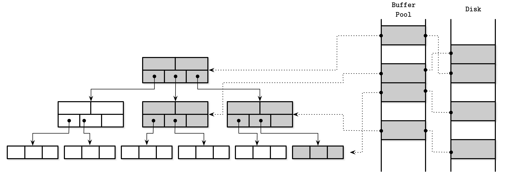

# 第五章：事务处理与恢复

在本书中，我们采用了从底向上的方法来学习数据库系统概念：首先学习存储结构。现在，我们准备转向负责缓冲管理、锁管理和恢复的高级组件，这些是理解数据库事务的先决条件。

*事务* 是数据库管理系统中的一个不可分割的逻辑工作单元，允许你将多个操作表示为一个步骤。事务执行的操作包括读写数据库记录。数据库事务必须保持原子性、一致性、隔离性和持久性。这些属性通常被称为 *ACID* [[HAERDER83]](app01.html#HAERDER83)：

原子性

事务步骤是 *不可分割* 的，这意味着与事务关联的所有步骤要么都成功执行，要么都不执行。换句话说，事务不应部分应用。每个事务可以 *提交*（使事务期间执行的所有写操作的更改可见），或 *中止*（回滚尚未可见的所有事务副作用）。提交是最终操作。中止后，可以重试事务。

一致性

一致性是特定于应用程序的保证；事务只能将数据库从一个有效状态转换为另一个有效状态，保持所有数据库不变式（如约束、引用完整性等）。一致性可能是定义最弱的属性，可能是因为它是唯一由用户控制而不仅仅是由数据库本身控制的属性。

隔离性

多个并发执行的事务应该能够无干扰地运行，就像没有其他事务同时执行一样。隔离性定义了数据库状态的更改何时可以对并发事务可见，以及哪些更改可以对并发事务可见。许多数据库出于性能原因使用比给定的隔离性定义更弱的隔离级别。根据用于并发控制的方法和策略，事务所做的更改可能对其他并发事务可见，也可能不可见（参见 “隔离级别”）。

持久性

一旦事务提交，所有数据库状态修改都必须持久化到磁盘并能够在停电、系统故障和崩溃时存活。

在数据库系统中实现事务，除了一个存储结构来组织和持久化数据到磁盘外，还需要多个组件协同工作。在本地节点上，*事务管理器* 协调、调度和跟踪事务及其各个步骤。

*锁管理器*保护对这些资源的访问，并防止违反数据完整性的并发访问。每当请求锁时，锁管理器都会检查它是否已由其他事务以共享或独占模式持有，并在请求的访问级别不会产生矛盾时授予对其的访问权限。由于独占锁最多只能由一个事务在任何给定时刻持有，请求它们的其他事务必须等待直到锁被释放，或者中止并稍后重试。一旦锁被释放或事务终止，锁管理器立即通知其中一个挂起的事务，使其获取锁并继续。

*页面缓存*充当持久存储（磁盘）与存储引擎其余部分之间的中介。它在主存储器中分阶段地存储状态更改，并作为尚未与持久存储同步的页面的缓存。对数据库状态的所有更改首先应用于缓存页面。

*日志管理器*保存了应用于缓存页面但尚未与持久存储同步的操作历史（日志条目），以确保在崩溃时它们不会丢失。换句话说，日志用于重新应用这些操作并在启动时重建缓存状态。日志条目也可以用于撤消由中止事务所做的更改。

分布式（多分区）事务需要额外的协调和远程执行。我们在第十三章中讨论分布式事务协议。

# 缓冲管理

大多数数据库使用两级内存层次结构构建：较慢的持久存储（磁盘）和较快的主存储器（RAM）。为了减少对持久存储的访问次数，页面在内存中*缓存*。当存储层再次请求页面时，将返回其缓存副本。

内存中可用的缓存页面可以在假设没有其他进程修改磁盘上的数据的情况下重复使用。这种方法有时被称为*虚拟磁盘* [[BAYER72]](app01.html#BAYER72)。如果内存中已经有页面的副本，则虚拟磁盘读取仅访问物理存储。同一概念的更常见名称是*页面缓存*或*缓冲池*。页面缓存负责将从磁盘读取的页面缓存到内存中。在数据库系统崩溃或非正常关闭时，缓存内容会丢失。

由于术语*页面缓存*更好地反映了该结构的目的，本书默认使用此名称。术语*缓冲池*听起来像其主要目的是池化和重用*空*缓冲区，而不共享其内容，这可能是页面缓存的一个有用部分，甚至可以作为一个单独的组件，但不能如此精确地反映整个目的。

缓存页面的问题不仅限于数据库范围。操作系统也有页面缓存的概念。操作系统利用*未使用*的内存段透明地缓存磁盘内容，以改善 I/O 系统调用的性能。

当从磁盘加载时，未缓存的页面被称为*分页进入*。如果对缓存页面进行了任何更改，则它被称为*脏页*，直到这些更改被*刷新*回磁盘为止。

由于缓存页面所占用的内存区域通常远小于整个数据集，因此页面缓存最终会填满，并且为了分页新页面，必须*驱逐*其中一个缓存页面。

在图 5-1 中，你可以看到 B-Tree 页面的逻辑表示、它们的缓存版本与磁盘上页面之间的关系。页面缓存以无序方式加载页面到空闲槽中，因此磁盘上页面的顺序与内存中的页面之间没有直接映射。

###### 图 5-1\. 页面缓存

页面缓存的主要功能可以总结如下：

+   它将页面内容缓存到内存中。

+   它允许将对磁盘页面的修改*缓冲*在一起，并针对它们的缓存版本执行。

+   当内存中不存在请求的页面并且有足够的空间可用时，页面缓存会*分页进入*它，并返回其缓存版本。

+   如果请求已经缓存的页面，则返回其缓存版本。

+   如果没有足够的空间来容纳新页面，某些其他页面将被*驱逐*，并且其内容将被*刷新*到磁盘上。

## 缓存语义

所有对缓冲区所做的更改都会保存在内存中，直到最终写回到磁盘。由于不允许其他进程对后备文件进行更改，因此此同步是一个单向过程：从内存到磁盘，而不是反过来。页面缓存允许数据库更好地控制内存管理和磁盘访问。你可以把它看作是内核页面缓存的特定应用程序等效物：它直接访问块设备，实现类似功能，并提供类似目的。它抽象了磁盘访问，并将逻辑写操作与物理写操作分离开来。

缓存页面有助于保持部分树在内存中，而无需对算法进行额外更改并将对象显现在内存中。我们所要做的就是通过页面缓存调用来替换磁盘访问。

当存储引擎访问页面时（换句话说，请求），我们首先检查其内容是否已缓存，如果是，则返回缓存的页面内容。如果页面内容尚未缓存，则缓存将逻辑页面地址或页号转换为其物理地址，在内存中加载其内容，并返回其缓存版本给存储引擎。一旦返回，具有缓存页面内容的缓冲区被称为*被引用*，存储引擎必须将其交还给页面缓存或在完成后取消引用。页面缓存可以通过*固定*它们来避免驱逐页面。

如果页面被修改（例如，追加了一个单元格），则标记为脏页。页面上的脏标志表示其内容与磁盘不同步，必须进行刷新以确保耐久性。

## 缓存驱逐

保持缓存填充是好事：我们可以服务更多的读取而不需要访问持久存储，可以更多地将相同页面写入一起进行缓冲。然而，页面缓存有限的容量，迟早，为了服务新内容，旧页面必须被驱逐。如果页面内容与磁盘同步（即已刷新或从未修改过），且页面未被固定或引用，则可以立即驱逐。脏页必须在驱逐之前进行*刷新*。在其他线程正在使用时，引用页面不应该被驱逐。

由于每次驱逐触发刷新可能对性能不利，一些数据库使用单独的后台进程来循环遍历可能被驱逐的脏页，更新它们的磁盘版本。例如，PostgreSQL 有一个[后台刷新写入者](https://databass.dev/links/34)就是为此而设计的。

另一个重要的属性是*耐久性*：如果数据库崩溃，所有未刷新的数据都会丢失。为了确保所有更改都被持久化，刷新由*检查点*进程协调进行。检查点进程控制写前日志（WAL）和页面缓存，并确保它们同步工作。只有与已刷新的缓存页面相关的日志记录才可以从 WAL 中丢弃。在此过程完成之前，脏页面不能被驱逐。

这意味着总是需要在几个目标之间进行权衡：

+   推迟刷新以减少磁盘访问次数

+   预先刷新页面以允许快速驱逐

+   按最优顺序选择页面进行驱逐和刷新

+   保持缓存大小在其内存边界内

+   避免数据丢失，因为它没有持久化到主存储

我们探讨了几种技术，帮助我们改善前三个特性，同时保持在其他两个特性的范围内。

## 在缓存中锁定页面

每次读取或写入都需要执行磁盘 I/O 是不切实际的：后续读取可能会请求同一页面，就像后续写入可能会修改同一页面一样。由于 B-树朝顶部“变窄”，较高级别的节点（靠近根部的节点）大部分都是读取的对象。拆分和合并最终也会传播到较高级别的节点。这意味着始终有至少一部分树可以从被缓存中显著受益。

我们可以“锁定”那些在最近可能被使用的页面。在缓存中锁定页面称为*固定*。固定的页面会在内存中保存更长时间，有助于减少磁盘访问次数并提高性能[[GRAEFE11]](app01.html#GRAEFE11)。

由于每个较低的 B-树节点级别的节点数量比较高的级别指数级别更多，并且高级别节点仅代表树的一小部分，因此树的这一部分可以永久驻留在内存中，其他部分可以按需分页。这意味着，为了执行查询，我们不必进行`h`次磁盘访问（如“B-树查找复杂性”中所讨论的，`h`是树的高度），而只需击中未缓存的较低级别的磁盘页面。

针对子树执行的操作可能导致彼此相矛盾的结构变化，例如，多次删除操作导致合并，然后写操作导致拆分，反之亦然。同样适用于从不同子树传播的结构变化（在时间上接近的不同树部分，向上传播）。这些操作可以通过仅在内存中应用更改来一起缓冲，这样可以减少磁盘写入次数并分摊操作成本，因为只需执行一次写入而不是多次写入。

## 页面替换

当缓存容量达到时，为了加载新页面，必须驱逐旧页面。但是，除非我们驱逐那些不太可能很快再次访问的页面，否则我们可能会在随后的几次加载中多次加载它们，尽管我们本可以将它们一直保留在内存中。我们需要找到一种方法来估计后续页面访问的可能性，以优化这一过程。

为此，我们可以说应根据*驱逐策略*（有时也称为*页面替换策略*）来驱逐页面。它试图找到最不可能在不久后再次访问的页面。当页面从缓存中驱逐时，新页面可以加载到其位置。

为了使页面缓存实现高效，需要一个有效的页面替换算法。理想的页面替换策略将需要一个水晶球来预测页面访问的顺序，并且只会淘汰那些最长时间不会被访问的页面。由于请求并不一定遵循特定的模式或分布，准确预测行为可能会很复杂，但使用正确的页面替换策略可以帮助减少淘汰次数。

看起来我们可以通过简单地使用一个更大的缓存来减少淘汰次数。然而，事实并非如此。其中一个示例说明了这个困境，称为 *Bélády 悖论* [[BEDALY69]](app01.html#BEDALY69)。它显示，如果使用的页面替换算法不是最优的，增加页面数量可能会增加淘汰次数。当淘汰可能很快需要的页面然后再次加载时，页面开始争夺缓存空间。因此，我们需要明智地考虑我们使用的算法，以改善情况，而不是使情况变得更糟。

### FIFO 和 LRU

最朴素的页面替换策略是先进先出（*FIFO*）。FIFO 保持一个按插入顺序排列的页面 ID 队列，将新页面添加到队列尾部。每当页面缓存已满时，它从队列头部取出元素，以找到最远时间内被页面化的页面。由于它仅考虑页面进入事件，而不考虑后续页面访问，这在大多数实际系统中都证明是不切实际的。例如，根页面和顶层页面首先被页面化，并且根据此算法，它们是首选淘汰候选页面，尽管从树结构明显可见这些页面可能很快再次页面化，甚至立即。

FIFO 算法的自然扩展是 *最近最少使用*（LRU） [[TANENBAUM14]](app01.html#TANENBAUM14)。它也保持一个按插入顺序排列的淘汰候选队列，但允许您在重复访问时将页面放回队列尾部，就像这是第一次对页面进行页面化一样。然而，在并发环境中，更新引用和重新链接节点的每次访问可能变得昂贵。

还有基于 LRU 的其他缓存淘汰策略。例如，2Q（两队列 LRU）在初始访问时将页面放入第一队列，并在后续访问时将它们移动到第二个 *hot* 队列，允许您区分最近和频繁访问的页面 [[JONSON94]](app01.html#JONSON94)。LRU-K 通过跟踪最后 `K` 次访问来识别频繁引用的页面，并利用此信息基于页面进行访问时间的估计 [[ONEIL93]](app01.html#ONEIL93)。

### CLOCK

在某些情况下，效率可能比精确性更重要。*CLOCK*算法变体通常被用作紧凑、友好缓存和并发替代 LRU 的选择[[SOUNDARARARJAN06]](app01.html#SOUNDARARARJAN06)。例如，Linux 使用[CLOCK 算法的变体](https://databass.dev/links/36)。

CLOCK-sweep 在循环缓冲区中保存页面和相关的访问位。一些变体使用[计数器](https://databass.dev/links/37)而不是位来计算频率。每次访问页面时，其访问位设置为`1`。该算法通过循环缓冲区，检查访问位的方式工作：

+   如果访问位为`1`，且页面未被引用，则将其设置为`0`，并检查下一个页面。

+   如果访问位已经为`0`，则该页面成为*候选项*，将被安排用于驱逐。

+   如果当前页面已被引用，则其访问位保持不变。假设访问过的页面的访问位不能为 0，因此不能被驱逐。这使得被引用的页面被替换的可能性较小。

图 5-2 展示了一个带有访问位的循环缓冲区。

###### 图 5-2\. CLOCK-sweep 示例。当前引用页面的计数器显示为灰色。未引用页面的计数器显示为白色。箭头指向将被下次检查的元素。

使用循环缓冲区的一个优点是，可以使用比较和交换操作修改时钟指针和内容，而不需要额外的锁定机制。该算法易于理解和实现，通常在教科书[[TANENBAUM14]](app01.html#TANENBAUM14)和实际系统中经常使用。

LRU 并不总是数据库系统的最佳替换策略。有时，考虑*使用频率*而不是*最近性*作为预测因素可能更为实际。最终，在负载较重的数据库系统中，最近性可能并不是非常指示性的，因为它仅代表了访问项的顺序。

### LFU

为了改善情况，我们可以开始跟踪*页面引用事件*而不是*页面进入事件*。其中一种方法允许我们跟踪最不经常使用（LFU）的页面。

TinyLFU 是一种基于频率的页面驱逐策略[[EINZIGER17]](app01.html#EINZIGER17)，确切地说：不是基于*页面进入的新近性*而是根据*使用频率*排序页面。它在名为[Caffeine](https://databass.dev/links/38)的流行 Java 库中实现。

TinyLFU 使用频率直方图[[CORMODE11]](app01.html#CORMODE11)来维护紧凑的缓存访问历史，因为保留整个历史可能在实际用途上代价太高。

元素可以位于三个队列中的一个：

+   *引用*，使用 LRU 策略来维护新添加的元素。

+   *试用期*，保存最有可能被驱逐的元素。

+   *保护*，保存要在队列中停留更长时间的元素。

而不是每次选择要驱逐的元素，这种方法选择要提升以保留的元素。只有频率大于由于提升它们而将被驱逐的项的项的项才能移动到试用队列中。在随后的访问中，项目可以从试用队列移动到受保护队列中。如果受保护队列已满，则可能需要将其中一个元素放回试用队列。频繁访问的项目有更高的保留机会，而使用频率较低的项目更可能被驱逐。

图 5-3 显示了入场、试用和保护队列之间的逻辑连接，频率过滤器和驱逐。

###### 图 5-3\. TinyLFU 入场、保护和试用队列

还有许多其他可用于最优缓存驱逐的算法。选择页面替换策略对延迟和执行的 I/O 操作数量有显著影响，必须加以考虑。

# 恢复

数据库系统建立在几个硬件和软件层之上，这些层可能具有自己的稳定性和可靠性问题。数据库系统本身以及底层软件和硬件组件都可能失败。数据库实施者必须考虑这些故障场景，并确保“承诺”写入的数据确实已写入。

*写前日志*（简称 WAL，也称为*提交日志*）是一种仅追加的辅助磁盘存储结构，用于崩溃和事务恢复。页面缓存允许在内存中缓冲页面内容的更改。在缓存的内容刷新回磁盘之前，保存操作历史的唯一磁盘存储副本存储在 WAL 中。许多数据库系统使用仅追加的写前日志，例如[PostgreSQL](https://databass.dev/links/39)和[MySQL](https://databass.dev/links/40)。

写前日志的主要功能可以总结如下：

+   允许页面缓存在确保数据库系统的持久性语义时缓冲对磁盘驻留页面的更新。

+   将受到这些操作影响的页面的缓存副本同步到磁盘上，然后在磁盘上持久化所有对这些操作的操作。修改数据库状态的每个操作都必须在相关页面的内容可以修改之前记录在磁盘上。

+   允许在崩溃时从操作日志中重建丢失的内存更改。

除了这个功能之外，预写式日志在事务处理中起着重要作用。无法过分强调 WAL 的重要性，因为它确保数据传输到持久存储，并且在崩溃时可用，因为未提交的数据从日志中重放，并完全恢复了崩溃前的数据库状态。在本节中，我们经常提到 ARIES（利用语义进行恢复和隔离的算法），这是一种广泛使用和引用的先进恢复算法 [[MOHAN92]](app01.html#MOHAN92)。

## 日志语义

预写式日志是一个只追加的数据结构，其写入内容是不可变的，因此所有对日志的写操作都是顺序的。由于 WAL 是一个不可变的、只追加的数据结构，读者可以安全地访问其内容直到最新写入阈值，而写入者则继续向日志尾部追加数据。

WAL 由日志记录组成。每个记录都有一个唯一的、单调递增的*日志序列号*（LSN）。通常，LSN 由内部计数器或时间戳表示。由于日志记录不一定占据整个磁盘块，它们的内容被缓存在*日志缓冲区*中，并通过*强制*操作刷新到磁盘上。当日志缓冲区填满时会进行强制操作，并且可以由事务管理器或页面缓存请求。所有日志记录必须按照 LSN 顺序刷新到磁盘上。

除了单独的操作记录外，WAL 还保存指示事务完成的记录。直到日志被强制到其提交记录的 LSN，事务才能被视为已提交。

为了确保系统在回滚或恢复期间在崩溃后能够继续正确运行，一些系统在撤销过程中使用*补偿日志记录*（CLR）并将其存储在日志中。

通常，WAL 与主存储结构耦合，通过允许在达到*检查点*时*修剪*它的接口来实现。日志记录是数据库中最关键的正确性方面之一，这在某种程度上是难以正确理解的：即使在日志修剪和确保数据已传输到主存储结构之间存在微小的分歧，也可能导致数据丢失。

检查点是日志了解到某个标记之前的日志记录已完全持久化且不再需要的一种方式，这显著减少了数据库启动期间所需的工作量。一种强制*所有*脏页刷新到磁盘上的过程通常称为*同步检查点*，因为它完全同步了主存储结构。

刷新整个内容到磁盘上相当不切实际，并且会要求暂停所有运行中的操作，直到检查点完成，因此大多数数据库系统实现了*模糊检查点*。在这种情况下，存储在日志头部的`last_checkpoint`指针包含有关最后成功检查点的信息。模糊检查点以特殊的`begin_checkpoint`日志记录开始，指定其开始，并以`end_checkpoint`日志记录结束，其中包含有关脏页的信息以及事务表的内容。直到刷新了此记录指定的所有页面，检查点被视为*不完整*。页面会异步刷新，一旦完成，`last_checkpoint`记录将更新为`begin_checkpoint`记录的 LSN，如果发生崩溃，则从那里开始恢复[[MOHAN92]](app01.html#MOHAN92)。

## 操作与数据日志

一些数据库系统，例如 System R [[CHAMBERLIN81]](app01.html#CHAMBERLIN81)，使用*影子分页*：一种写时复制技术，确保数据耐久性和事务原子性。新内容放置到新的未发布的*影子*页中，并通过指针翻转从旧页到保存更新内容的页中进行可见化。

任何状态更改都可以通过前图像和后图像或相应的重做和撤消操作来表示。将*重做*操作应用于*前图像*会生成*后图像*。类似地，将*撤消*操作应用于*后图像*会生成*前图像*。

我们可以使用物理日志（存储完整页面状态或对其的逐字更改）或逻辑日志（存储必须针对当前状态执行的操作），在时间上向前向后移动记录或页面。重要的是跟踪物理和逻辑日志记录可以应用于的页面的*确切*状态。

物理日志记录前后图像，需要记录操作影响的整个页面。逻辑日志指定了必须应用于页面的操作，如`"insert a data record X for key Y"`，以及相应的撤消操作，如`"remove the value associated with Y"`。

在实践中，许多数据库系统结合这两种方法，使用逻辑日志执行撤消（用于并发性和性能），并使用物理日志执行重做（以提高恢复时间）[[MOHAN92]](app01.html#MOHAN92)。

## Steal and Force Policies

要确定何时将内存中所做的更改刷新到磁盘上，数据库管理系统定义了 steal/no-steal 和 force/no-force 策略。这些策略*主要*适用于页面缓存，但在恢复的上下文中讨论它们更为合适，因为它们对可以与其组合使用的恢复方法有重大影响。

允许在事务提交之前刷新由事务修改的页面的恢复方法被称为*抢占*策略。*无抢占*策略不允许在磁盘上刷新任何未提交的事务内容。在这里*抢占*一个脏页面意味着将其内存内容刷新到磁盘，并在其位置加载不同的页面。

*强制*策略要求在事务提交*之前*将所有由事务修改的页面刷新到磁盘上。另一方面，*无强制*策略允许事务提交，即使在该事务期间修改的某些页面尚未刷新到磁盘上。在这里*强制*一个脏页面意味着在提交之前将其刷新到磁盘上。

理解抢占和强制策略是很重要的，因为它们对事务的撤销和重做有影响。*撤销*用于回滚已提交事务对强制页面的更新，而*重做*则应用已提交事务在磁盘上执行的更改。

使用*无抢占*策略允许只使用重做条目来实现恢复：旧副本包含在磁盘上的页面中，修改存储在日志中 [[WEIKUM01]](app01.html#WEIKUM01)。使用*无强制*，我们可能可以缓冲几个页面更新以*推迟*它们。因为页面内容必须在此期间缓存在内存中，可能需要更大的页面缓存。

当使用*强制*策略时，崩溃恢复不需要额外工作来重建已提交事务的结果，因为这些事务修改的页面已经被刷新。使用此方法的一个主要缺点是由于必要的 I/O，事务提交时间较长。

更一般地说，*直到*事务提交之前，我们需要有足够的信息来撤销其结果。如果事务涉及的任何页面已经被刷新，我们需要保留日志中的撤销信息，直到它提交以便能够回滚它。否则，我们必须保留重做记录在日志中，直到它提交。在这两种情况下，事务*不能*提交，直到撤销或重做记录被写入日志文件。

## ARIES

ARIES 是一种*抢占/无强制*的恢复算法。它使用物理重做来提高恢复过程中的性能（因为更改可以更快地安装），并使用逻辑撤销来提高正常操作期间的并发性（因为逻辑撤销操作可以独立应用于页面）。它使用 WAL 记录来在恢复期间实现*重复历史*，以完全重建数据库状态，在撤销未提交事务之前，并在撤销期间创建补偿日志记录 [[MOHAN92]](app01.html#MOHAN92)。

当数据库系统在崩溃后重新启动时，恢复分为三个阶段：

1.  *分析* 阶段在页面缓存中标识脏页和崩溃时正在进行的事务。关于脏页的信息用于确定重做阶段的起点。在撤消阶段使用进行中事务的列表来回滚不完整的事务。

1.  *重做* 阶段重复历史记录到崩溃点并将数据库恢复到之前的状态。此阶段适用于不完整的事务以及已提交但内容尚未刷新到持久存储的事务。

1.  *撤消* 阶段回滚所有不完整的事务并将数据库恢复到最后一致状态。所有操作按照逆时间顺序回滚。在恢复期间再次崩溃时，撤消事务的操作也将记录下来，以避免重复执行它们。

ARIES 使用 LSNs 来识别日志记录，通过脏页表跟踪运行事务修改的页面，并使用物理重做、逻辑撤消和模糊检查点。尽管描述该系统的论文发布于 1992 年，但大多数概念、方法和范式在今天的事务处理和恢复中仍然具有相关性。

# 并发控制

在讨论数据库管理系统架构时，在“DBMS Architecture”中提到，事务管理器和锁管理器共同处理*并发控制*。并发控制是处理并发执行事务之间交互的一组技术。这些技术大致可以分为以下几类：

乐观并发控制（OCC）

允许事务并发执行读写操作，并确定组合执行结果是否可序列化。换句话说，事务不会相互阻塞，维护其操作的历史记录，并在提交之前检查这些历史记录是否可能发生冲突。如果执行结果发生冲突，则中止其中一个冲突的事务。

多版本并发控制（MVCC）

通过允许记录的时间戳标识的过去某一点来保证数据库的一致视图。MVCC 可以使用验证技术实现，允许更新或提交事务中只有一个获胜，以及使用无锁技术如时间戳排序，或基于锁的技术如两阶段锁定。

悲观（也称为保守）并发控制（PCC）

有基于锁和非锁定保守方法两种方法，它们在管理和授予对共享资源访问权限的方式上有所不同。基于锁的方法要求事务在数据库记录上保持锁定，以防止其他事务修改已锁定的记录，并在事务释放锁之前不允许访问正在修改的记录。非锁定方法维护读写操作列表，并根据未完成事务的调度限制执行。悲观调度可能会导致死锁，当多个事务等待彼此释放锁以便继续执行时。

在本章中，我们集中讨论节点本地的并发控制技术。在第十三章中，您可以找到关于分布式事务和其他方法的信息，例如确定性并发控制（请参阅“使用 Calvin 进行分布式事务”）。

在进一步讨论并发控制之前，我们需要定义一组我们试图解决的问题，并讨论事务操作的重叠以及这种重叠的后果。

## 可串行化

事务由针对数据库状态执行的读和写操作以及业务逻辑（对读取内容应用的转换）组成。*调度* 是从数据库系统的角度执行一组事务所需的操作列表（即，只有与数据库状态交互的操作，如读取、写入、提交或中止操作），因为所有其他操作都假定为无副作用（换句话说，不会对数据库状态产生影响）[[GARCIAMOLINA08]](app01.html#GARCIAMOLINA08)。

如果一个调度包含执行它的所有事务的所有操作，则称该调度是*完整* 的。*正确* 的调度是原始操作列表的逻辑等价物，但其部分可以并行执行或进行重新排序以进行优化，只要这不违反 ACID 属性和个别事务结果的正确性[[WEIKUM01]](app01.html#WEIKUM01)。

当事务在其中完全独立且没有任何交错时，称调度为*串行*。在每个后续事务开始之前，每个前面的事务都完全执行。串行执行易于推理，与多步事务之间的所有可能交错形成对比。然而，总是一个接一个地执行事务会显著限制系统吞吐量并影响性能。

我们需要找到一种方法来并发执行事务操作，同时保持串行调度的正确性和简单性。我们可以通过*可串行化*调度来实现这一点。如果一个调度等效于*同一组*事务的某个完整的串行调度，则它是可串行化的。换句话说，它产生与我们以*某种*顺序执行一组事务相同的结果。图 5-4 展示了三个并发事务及其可能的执行历史（`3! = 6`种可能性，每种可能的顺序都有）。

###### 图 5-4\. 并发事务及其可能的顺序执行历史

## 事务隔离

事务性数据库系统允许不同的隔离级别。*隔离级别*指定了事务的哪些部分可以以及何时可以对其他事务可见。换句话说，隔离级别描述了事务在执行期间与其他并发执行的事务隔离的程度，以及可能遇到的异常类型。

实现隔离性是有代价的：为了防止不完整或临时写入跨越事务边界，我们需要额外的协调和同步，这对性能有负面影响。

## 读取和写入异常

SQL 标准[[MELTON06]](app01.html#MELTON06)提到并描述了可能在并发事务执行期间发生的*读取异常*：脏读、不可重复读和幻读。

*脏读*是指一个事务可以读取其他事务未提交的更改。例如，事务`T[1]`更新了用户记录的地址字段的新值，而事务`T[2]`在`T[1]`提交之前读取了更新的地址。事务`T[1]`终止并回滚其执行结果。然而，`T[2]`已经能够读取这个值，所以它访问了一个从未提交的值。

*不可重复读*（有时称为模糊读）是指一个事务两次查询*相同行*并获得不同结果的情况。例如，即使事务`T[1]`读取一行，然后事务`T[2]`修改它*并提交*了这个更改，如果`T[1]`在完成执行之前再次请求相同的行，结果将与之前的运行不同。

如果我们在事务期间使用范围读取（即不仅读取单个数据记录，而是一系列记录），我们可能会看到*幻像记录*。*幻像读*是指一个事务两次查询相同的*一组行*并接收不同的结果。它类似于不可重复读，但适用于范围查询。

还有类似语义的*写入异常*：丢失更新、脏写和写入偏斜。

*丢失更新*发生在事务 `T[1]` 和 `T[2]` 都试图更新 `V` 的值时。`T[1]` 和 `T[2]` 读取了 `V` 的值。`T[1]` 更新 `V` 并提交，然后 `T[2]` 在此之后更新 `V` 并提交。由于事务不知道彼此的存在，如果允许它们都提交，`T[1]` 的结果将被 `T[2]` 的结果覆盖，`T[1]` 的更新将丢失。

*脏写*是指一个事务获取了一个未提交的值（即脏读取），修改了它，并保存了它。换句话说，事务结果基于从未提交的值而来。

*写入偏斜*指的是每个单独的事务都遵守了所需的不变量，但它们的组合却不能满足这些不变量。例如，事务 `T[1]` 和 `T[2]` 修改了两个账户 `A[1]` 和 `A[2]` 的值。`A[1]` 的初始值为 `100$`，`A[2]` 的初始值为 `150$`。账户值允许为负，只要两个账户的总和非负即可：`A[1] + A[2] >= 0`。`T[1]` 和 `T[2]` 分别试图从 `A[1]` 和 `A[2]` 中提取 `200$`。由于这些事务开始时 `A[1] + A[2] = 250$`，总共有 `250$` 可用。两个事务都假设它们在保持不变量方面是正确的，并允许提交。提交后，`A[1]` 变为 `-100$`，`A[2]` 变为 `-50$`，显然违反了保持账户总和为正的要求 [[FEKETE04]](app01.html#FEKETE04)。

## 隔离级别

最低（也就是最弱）的隔离级别是*读未提交*。在这种隔离级别下，事务系统允许一个事务观察其他并发事务的未提交更改。换句话说，允许脏读取。

我们可以避免一些异常情况。例如，我们可以确保任何由特定事务执行的读取只能读取*已经提交*的更改。然而，不能保证如果事务在后续阶段再次尝试读取相同的数据记录，它会看到相同的值。如果两次读取之间存在已提交的修改，同一事务中的两个查询将产生不同的结果。换句话说，允许干净读取，但允许幽灵读取和不可重复读取。这种隔离级别称为*读提交*。如果进一步禁止不可重复读取，则得到*可重复读*隔离级别。

最强的隔离级别是可串行化。正如我们在《“可串行化”》（#serializability）中已经讨论的那样，它保证事务结果将以某种顺序出现，就像事务是*串行*执行的一样（即，时间上不重叠）。禁止并发执行将对数据库性能产生重大负面影响。事务可以被重新排序，只要它们的内部不变量保持并且可以并发执行，但它们的结果必须以某种*序列*顺序出现。

图 5-5 显示了隔离级别及其允许的异常。

###### 图 5-5\. 隔离级别和允许的异常

没有依赖关系的事务可以以任何顺序执行，因为它们的结果是完全独立的。与我们在分布式系统环境中讨论的线性一致性不同（请参阅《“线性一致性”》（ch11.html#linearizability）），可串行化是*多个*操作在*任意*顺序下执行的属性。它不意味或试图强加任何特定的执行顺序。ACID 术语中的*隔离*意味着可串行化[[BAILIS14a]](app01.html#BAILIS14a)。不幸的是，实现可串行化需要协调。换句话说，同时执行的事务必须协调以保持不变式并对冲突执行施加序列顺序[[BAILIS14b]](app01.html#BAILIS14b)。

一些数据库使用*快照隔离*。在快照隔离下，事务可以观察到所有在它启动时已提交的事务所执行的状态更改。每个事务都会对数据进行快照，并对其执行查询。此快照在事务执行期间不能更改。只有在事务执行时修改的值*未*在此期间更改，事务才会提交。否则，它将被中止并回滚。

如果两个事务尝试修改相同的值，则只允许其中一个提交。这排除了*丢失更新*异常。例如，事务`T[1]`和`T[2]`都试图修改`V`。它们从包含它们启动前已提交事务的更改的快照中读取`V`的当前值。无论哪个事务尝试首先提交，都将提交，另一个事务将必须中止。失败的事务将重试而不是覆盖值。

在快照隔离下，可能会发生*写入偏差*异常，因为如果两个事务从本地状态读取，修改独立记录，并保留本地不变式，则它们都被允许提交[[FEKETE04]](app01.html#FEKETE04)。我们在《“使用 Percolator 的分布式事务”》（ch13.html#percolator）中更详细地讨论快照隔离。

## 乐观并发控制

乐观并发控制假设事务冲突很少发生，因此我们可以通过验证事务来防止与同时执行的事务的读/写冲突，并在提交结果之前确保可串行性，而不是使用锁和阻塞事务执行。一般来说，事务执行分为三个阶段 [[WEIKUM01]](app01.html#WEIKUM01)：

读取阶段

事务在其自己的私有上下文中执行其步骤，不会使任何更改对其他事务可见。在此步骤之后，所有事务依赖关系（*读取集合*）和事务产生的副作用（*写入集合*）都是已知的。

验证阶段

并发事务的读取和写入集合会检查它们操作之间可能存在的冲突，这些冲突可能会违反可串行性。如果事务读取的某些数据现在已经过时，或者它将覆盖在其读取阶段期间提交的事务写入的某些值，其私有上下文将被清除并重新开始读取阶段。换句话说，验证阶段确定是否提交事务能保持 ACID 属性。

写入阶段

如果验证阶段未发现任何冲突，则事务可以将其从私有上下文的写入集合提交到数据库状态。

验证可以通过检查已提交的事务（*反向导向*）或正在验证阶段中的事务（*正向导向*）来完成。验证和不同事务的写入阶段应该是原子的。在某个事务正在验证时，不允许其他事务提交。由于验证和写入阶段通常比读取阶段短，这是一种可接受的折衷方案。

反向并发控制确保对于任意一对事务 `T[1]` 和 `T[2]`，以下属性成立：

+   `T[1]` 在 `T[2]` 的读取阶段开始之前已经提交，因此允许 `T[2]` 提交。

+   `T[1]` 在 `T[2]` 写阶段之前已提交，并且 `T[1]` 的写入集合与 `T[2]` 的读取集合没有交集。换句话说，`T[1]` 没有写入任何 `T[2]` 应该看到的值。

+   `T[1]` 的读取阶段在 `T[2]` 的读取阶段之前已完成，并且 `T[2]` 的写入集合与 `T[1]` 的读取或写入集合没有交集。换句话说，事务已经在独立的数据记录集上操作，因此两者都允许提交。

如果验证通常成功并且不必重试事务，则此方法效率高，因为重试对性能有显著负面影响。当然，乐观并发仍然有一个*临界区*，事务可以一个接一个地进入。另一种允许某些操作非独占所有权的方法是使用读写锁（允许读者共享访问）和可升级锁（在需要时允许将共享锁转换为独占锁）。

## 多版本并发控制（Multiversion Concurrency Control）

多版本并发控制是通过允许多个记录版本并使用单调递增的事务 ID 或时间戳，在数据库管理系统中实现事务一致性的一种方式。这允许读写操作在存储级别上进行最小的协调，因为读操作可以继续访问旧值，直到新值被提交。

MVCC 区分*已提交*和*未提交*版本，分别对应已提交和未提交事务的值版本。值的最后已提交版本被假定为*当前*。一般来说，在这种情况下，事务管理器的目标是最多只有一个未提交值。

根据数据库系统实现的隔离级别，读操作可能允许或禁止访问未提交的值[[魏库姆 01]](app01.html#WEIKUM01)。多版本并发可以使用锁定、调度和冲突解决技术（如两阶段锁定）或时间戳排序来实现。MVCC 实现快照隔离的一个主要用例[[赫勒斯坦 07]](app01.html#HELLERSTEIN07)。

## 悲观并发控制（Pessimistic Concurrency Control）

悲观并发控制方案比乐观方案更保守。这些方案在运行时确定事务冲突并阻塞或中止它们的执行。

最简单的悲观（无锁）并发控制方案之一是*时间戳排序*，其中每个事务都有一个时间戳。事务操作是否允许执行取决于是否有*后续*时间戳的事务已经被提交。为了实现这一点，事务管理器必须针对每个值维护`max_read_timestamp`和`max_write_timestamp`，描述并发事务执行的读和写操作。

*读*操作试图读取时间戳低于`max_write_timestamp`的值会导致它们所属的事务被中止，因为已经有更新的值，并且允许此操作会违反事务顺序。

类似地，时间戳低于 `max_read_timestamp` 的*写*操作会与更近的读操作发生冲突。然而，时间戳低于 `max_write_timestamp` 的*写*操作是允许的，因为我们可以安全地忽略过时的写入值。这个推论通常被称为*Thomas 写规则* [[THOMAS79]](app01.html#THOMAS79)。一旦执行读取或写入操作，相应的最大时间戳值就会更新。因为否则它们肯定会再次被中止，所以中止的事务会重新开始，使用*新*时间戳 [[RAMAKRISHNAN03]](app01.html#RAMAKRISHNAN03)。

## 基于锁的并发控制

基于锁的并发控制方案是悲观并发控制的一种形式，它在数据库对象上使用显式锁而不是像时间戳排序这样的协议来解析调度。使用锁的一些缺点包括争用和可伸缩性问题 [[REN16]](app01.html#REN16)。

最广泛使用的基于锁的技术之一是*两阶段锁定*（2PL），它将锁管理分为两个阶段：

+   扩展阶段（也称为扩展阶段），在此期间事务所需的所有锁都被获取，并且没有锁被释放。

+   缩小阶段，期间释放了在扩展阶段期间获取的所有锁。

从这两个定义得出的一个规则是，一旦事务释放了至少一个锁，它就不能再获取任何锁。重要的是要注意，2PL 并不排除事务在这两个阶段中的任一阶段执行步骤；然而，一些 2PL 变体（如保守的 2PL）确实会施加这些限制。

###### 警告

尽管名称相似，两阶段锁定与两阶段提交（参见“两阶段提交”）是完全不同的概念。两阶段提交是用于分布式多分区事务的协议，而两阶段锁定是常用的用于实现串行化的并发控制机制。

### 死锁

在锁定协议中，事务试图在数据库对象上获取锁，如果无法立即获得锁，则事务必须等待直到锁被释放。当两个事务试图获取它们需要的锁以便继续执行时，可能会出现一种情况，它们最终彼此等待对方释放它们持有的其他锁。这种情况称为死锁。

图 5-6 展示了死锁的一个例子：`T[1]` 持有锁 `L[1]` 并等待释放锁 `L[2]`，而 `T[2]` 持有锁 `L[2]` 并等待释放 `L[1]`。

###### 图 5-6\. 死锁示例

处理死锁的最简单方法是引入超时并中止长时间运行的事务，假设它们可能处于死锁状态。另一种策略是保守的 2PL，要求事务在执行任何操作之前获取所有锁，并在获取不到时中止。然而，这些方法显著限制了系统的并发性，数据库系统大多使用事务管理器来**检测**或**避免**（换句话说，预防）死锁。

通常使用*等待图*来检测死锁，该图跟踪飞行中事务之间的关系，并在它们之间建立等待关系。

此图中的循环表示死锁的存在：事务`T[1]`正在等待`T[2]`，而`T[2]`又在等待`T[1]`。死锁检测可以*周期性地*（每个时间间隔一次）或*连续地*（每次等待图更新时）进行 [[WEIKUM01]](app01.html#WEIKUM01)。通常会中止其中一个事务（通常是最近尝试获取锁的事务）。

为了*避免*死锁并限制锁获取到不会导致死锁的情况，事务管理器可以使用事务时间戳来确定它们的*优先级*。较低的时间戳通常意味着更高的优先级，反之亦然。

如果事务`T[1]`试图获取当前由`T[2]`持有的锁，并且`T[1]`具有更高的优先级（它比`T[2]`先开始），我们可以使用以下限制之一来避免死锁 [[RAMAKRISHNAN03]](app01.html#RAMAKRISHNAN03)：

*Wait-die*

`T[1]`允许阻塞和*等待*锁。否则，T[1]将被中止并重新启动。换句话说，只有具有更高时间戳的事务才能阻塞事务。

*Wound-wait*

`T[2]`被中止并重新启动（`T[1]` *wounds* `T[2]`）。否则（如果`T[2]`在`T[1]`之前开始），`T[1]`允许等待。换句话说，只有具有较低时间戳的事务才能阻塞事务。

事务处理需要调度程序来处理死锁。同时，闩锁（见“闩锁”）依赖于程序员确保不能发生死锁，不依赖于死锁避免机制。

### 锁

如果两个事务同时提交，修改重叠的数据段，两者都不应该观察到对方的部分结果，从而保持逻辑一致性。同样，来自同一事务的两个线程必须观察相同的数据库内容，并访问彼此的数据。

在事务处理中，有一个区分逻辑和物理数据完整性的机制。负责逻辑和物理完整性的两个概念分别是*锁*和*闩锁*。这里的命名有些不幸，因为这里称为闩锁的东西通常在系统编程中被称为锁，但我们将在本节中澄清区别和含义。

锁用于隔离和调度重叠事务，并管理数据库内容，但不涉及内部存储结构，并且在键上获取。锁可以保护特定键（无论是现有还是不存在的）或键范围。锁通常存储和管理在树实现之外，并代表由数据库锁管理器管理的更高级别概念。

锁比闩更重，且在事务持续期间保持。

### 闩

另一方面，闩保护*物理*表示：叶页内容在插入、更新和删除操作期间被修改。非叶页内容和树结构在导致从叶页的下溢和上溢的操作期间被修改。闩在这些操作期间保护物理树表示（页面内容和树结构），并在页面级别获取。任何页面都必须被闩锁定，以允许安全并发访问。

由于叶级别的单个修改可能会传播到 B-树的更高级别，可能需要在多个级别获取闩。执行查询时，不应观察页面处于不一致状态，例如不完整的写入或部分节点拆分期间，数据可能同时存在于源节点和目标节点中，或尚未传播到父节点。

同样的规则适用于父节点或兄弟指针更新。一般规则是尽可能短暂地持有闩，即在读取或更新页面时，以增加并发性。

并发操作之间的干扰大致可以分为三类：

+   *并发读取*，多个线程访问同一页面而不修改它。

+   *并发更新*，多个线程尝试对同一页面进行修改。

+   *读写冲突*，其中一个线程试图修改页面内容，而另一个线程试图读取同一页面时。

这些场景也适用于与数据库维护重叠的访问（例如后台进程，如“Vacuum and Maintenance”中描述的）。

### 读写锁

最简单的闩实现将为请求的线程授予独占的读/写访问权限。然而，大部分时间，我们不需要彼此隔离*所有*的进程。例如，读取可以并发访问页面而不引起任何问题，因此我们只需确保多个并发*写者*不重叠，并且*读者*不与*写者*重叠。为了达到这种粒度水平，我们可以使用*读写锁*或 RW 锁。

读写锁允许多个读者并发访问对象，而只有写者（通常较少）需要获取对象的排他访问权限。图 5-7 显示了读写锁的兼容性表：只有读者可以共享锁的所有权，而其他所有读者和写者的组合都应该获取独占所有权。

###### 图 5-7\. 读写锁兼容性表

在图 5-8 (a)中，有多个读者访问对象，而写者正在等待它的机会，因为在读者访问时无法修改页面。在图 5-8 (b)中，`writer 1`持有对象的排他锁，而另一个写者和三个读者必须等待。

###### 图 5-8\. 读写锁

由于两个重叠的读操作试图访问同一页不需要其他同步操作，除了通过页面缓存防止同一页被多次从磁盘读取，读操作可以安全地并发执行。一旦涉及写操作，我们就需要将其与并发读取和其他写操作隔离开来。

### 锁定耦合

最直接的获取锁定操作的方法是从根节点到目标叶节点的路径上获取所有的锁定。这会造成并发瓶颈，在大多数情况下是可以避免的。持有锁定的时间应该尽量缩短。为了实现这一点，可以使用一种优化技术，称为*latch crabbing*（或锁定耦合）[[RAMAKRISHNAN03]](app01.html#RAMAKRISHNAN03)。

锁定耦合是一种相当简单的方法，可以缩短持有锁的时间，并在执行操作不再需要它们时立即释放它们。在读取路径上，一旦找到子节点并获取其锁定，就可以释放父节点的锁定。

在插入过程中，如果操作可以保证不会导致会传播到父节点的结构性变化，那么可以释放父节点的锁定。换句话说，如果子节点没有满，则可以释放父节点的锁定。

类似地，在删除过程中，如果子节点包含足够的元素并且操作不会导致兄弟节点合并，则可以释放父节点上的锁定。

图 5-9 显示了插入过程中从根到叶的遍历：

+   a) 写锁定在根节点层级上获取。

+   b) 定位下一级节点，并获取其写锁定。检查节点是否存在潜在的结构性变化。由于节点不是满的，可以释放父节点的锁定。

+   c) 操作向下一级进行。获取写锁定，检查目标叶节点是否存在潜在的结构性变化，并释放父节点的锁定。

这种方法是乐观的：大多数插入和删除操作不会引起结构变化向上传播多个级别。事实上，高层次的结构变化概率降低。大多数操作仅需要对目标节点的锁，仅在必须保留父锁的情况下才会发生的情况相对较少。

如果子页面尚未在页面缓存中加载完成，我们可以选择锁定未来加载的页面，或释放父锁并在页面加载后重新启动从根到叶的遍历，以减少竞争。重新启动从根到叶的遍历听起来很昂贵，但实际上，我们很少需要执行它，并且可以采用机制检测自遍历以来较高层次是否有结构变化 [[GRAEFE10]](app01.html#GRAEFE10)。

###### 图 5-9\. 插入过程中的锁抓取

### 闪烁树

B^(link)-树基于 B^*-树构建（参见“重新平衡”），并添加*高键*（参见“节点高键”）和*兄弟链接*指针 [[LEHMAN81]](app01.html#LEHMAN81)。高键指示子树可能的最高键。除了根节点外，B^(link)-树中的每个节点都有两个指针：一个是从父节点下降的子指针，另一个是同一层上的左侧节点的兄弟链接。

B^(link)-树允许一种称为*半分裂*的状态，其中节点已通过兄弟指针引用，但尚未通过父节点的子指针引用。通过检查节点高键来识别半分裂。如果搜索键超过节点的高键（违反高键不变性），查找算法会断定结构已经同时发生变化，并跟随兄弟链接继续搜索。

在父节点快速添加指针以保证最佳性能，但搜索过程不必中止和重新启动，因为树中的所有元素都是可访问的。这里的优势在于，我们在降到子级时无需持有父锁，即使子节点将要分裂：我们可以通过其兄弟链接使新节点可见，并延迟更新父指针，而不会牺牲正确性 [[GRAEFE10]](app01.html#GRAEFE10)。

虽然这比直接从父节点下降略微低效，并需要访问额外的页面，但这样做可以确保正确的从根到叶的下降，同时简化并发访问。由于分裂是一个相对不频繁的操作，B-树很少会收缩，这种情况是例外的，其成本微不足道。这种方法有很多好处：它减少了争用，防止在分裂期间持有父锁，减少了在树结构修改期间持有的锁的数量到一个常数。更重要的是，它允许读取与结构树更改并发进行，并防止由于并发修改向父节点上升而导致的死锁。

# 总结

在本章中，我们讨论了负责事务处理和恢复的存储引擎组件。在实现事务处理时，我们面临两个问题：

+   为了提高效率，我们需要允许并发事务执行。

+   为了保持正确性，我们必须确保并发执行的事务保持 ACID 属性。

并发事务执行可能导致不同类型的读写异常。这些异常的存在或缺失通过实现不同的隔离级别来描述和限制。并发控制方法确定了事务如何被调度和执行。

页面缓存负责减少磁盘访问次数：它将页面缓存在内存中，并允许对其进行读写访问。当缓存达到容量时，页面被驱逐并刷新回磁盘。为了确保在节点崩溃时不会丢失未刷新的更改，并支持事务回滚，我们使用预写式日志。页面缓存和预写式日志使用强制和偷窃策略进行协调，确保每个事务可以高效执行并在不牺牲耐久性的情况下回滚。
