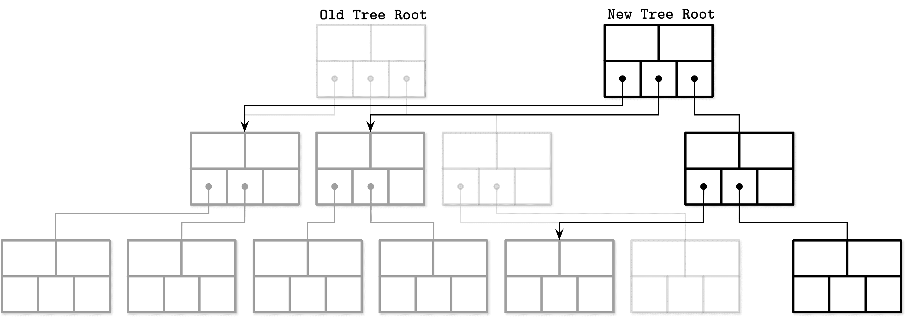
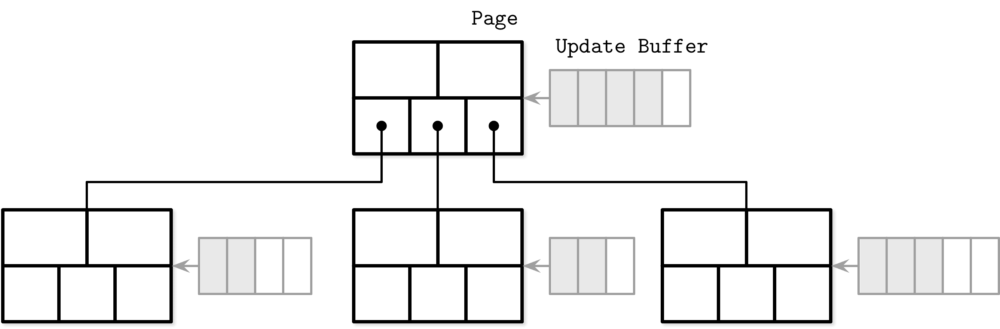
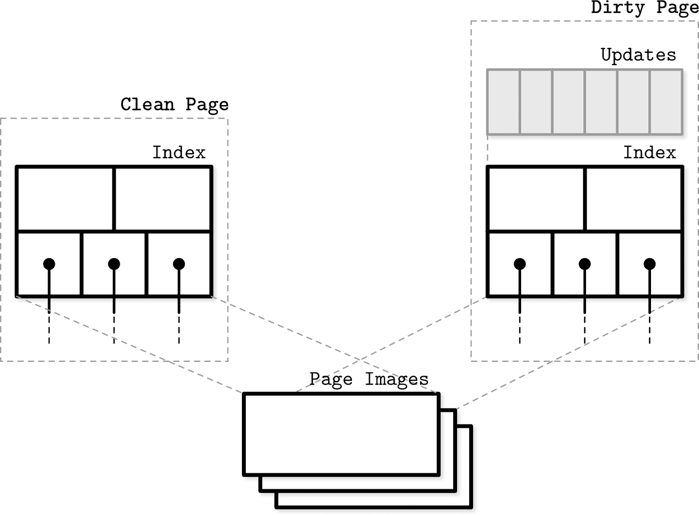
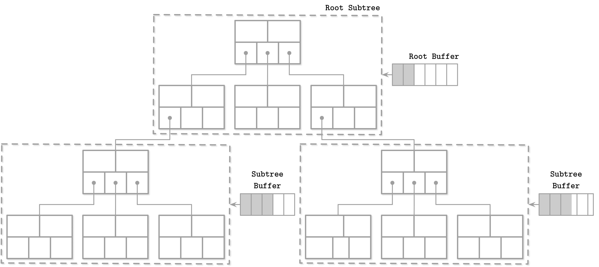
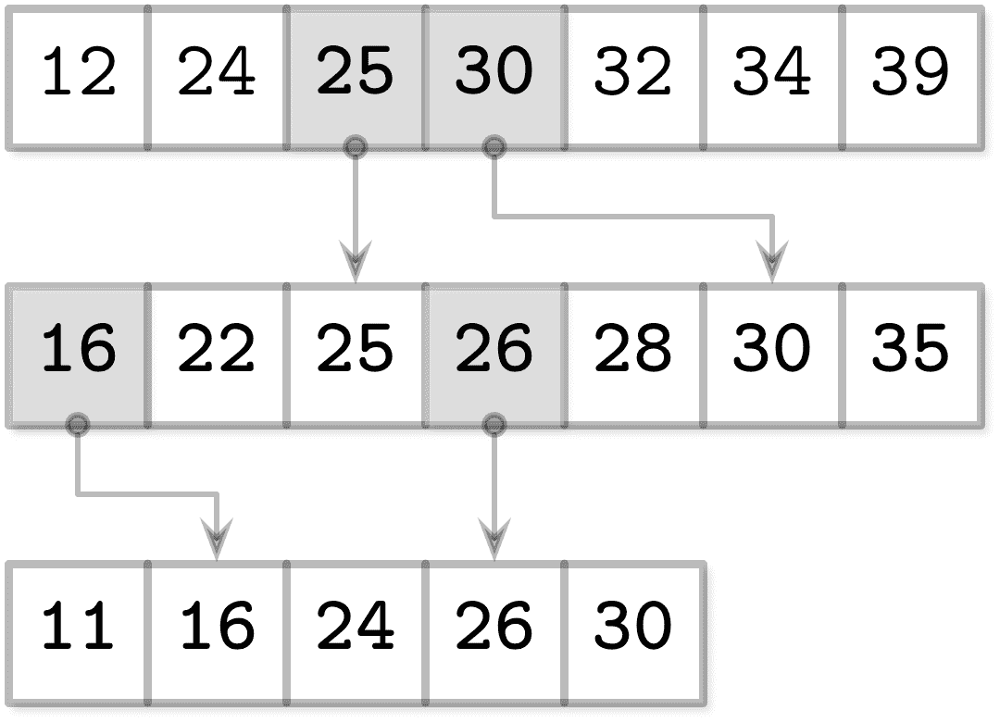
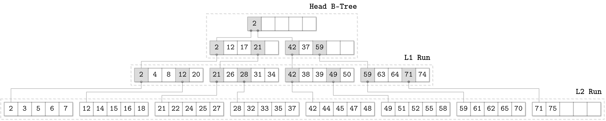
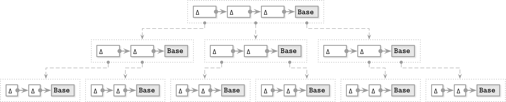
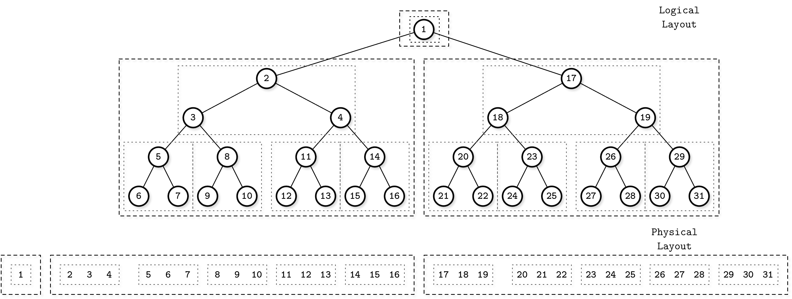

# 第六章：B 树的变体

B 树的变体有几个共同点：树结构、通过分裂和合并来平衡、查找和删除算法。其他细节，例如并发性、磁盘页面表示、兄弟节点之间的链接以及维护过程，可能因实现而异。

在本章中，我们将讨论几种可以用于实现高效 B 树及其相关结构的技术：

+   *写时复制 B 树*的结构类似于 B 树，但它们的节点是不可变的，不会原地更新。相反，页面被复制、更新并写入新位置。

+   *懒惰 B 树*通过对节点进行*缓冲*更新来减少对后续相同节点写入的 I/O 请求数量。在下一章中，我们还将介绍两组件 LSM 树（见“两组件 LSM 树”），它们通过将缓冲推进一步来实现完全不可变的 B 树。

+   *FD-树*采用一种与 LSM 树（见“LSM 树”）类似的缓冲方式，对更新在一个小型 B 树中进行缓冲。一旦该树填满，其内容就会被写入一个不可变的运行中。更新以级联方式传播在不同*级别*的不可变运行之间，从更高级别到更低级别。

+   *Bw-树*将 B 树节点分成几个较小的部分，以追加方式写入。这通过批处理更新到不同节点来降低小写成本。

+   *缓存无关 B 树*允许以非常类似于构建内存中数据结构的方式来处理磁盘上的数据结构。

# 写时复制

有些数据库并不构建复杂的锁定机制，而是使用*写时复制*技术来在并发操作中保证数据完整性。在这种情况下，每当页面即将被修改时，其内容就会被复制，修改的是复制的页面而不是原始页面，并创建了一个并行的树层次结构。

旧的树版本对于同时运行的读者仍然可访问，而访问修改后页面的写者必须等待前面的写操作完成。创建新页面层次结构后，顶层页面指针被原子地更新。在图 6-1 中，您可以看到一个新树与旧树并行创建，重复使用未触及的页面。



###### 图 6-1 写时复制 B 树

这种方法的一个明显缺点是它需要更多的空间（尽管旧版本仅保留了很短的时间，因为在并发操作使用旧页面完成后，页面可以立即被回收），以及处理器时间，因为必须复制整个页面内容。由于 B 树通常很浅，这种方法的简单性和优势通常仍然超过了缺点。

这种方法的最大优势在于读者无需同步，因为写入的页面是不可变的，并且可以在不需要额外锁定的情况下访问。由于写操作针对复制的页面执行，因此读者不会阻塞写入者。没有操作可以观察到页面处于不完整状态，系统崩溃也不会使页面处于损坏状态，因为只有在所有页面修改完成后才会切换顶部指针。

## 实现写时复制：LMDB

一个使用写时复制的存储引擎是 Lightning Memory-Mapped Database ([LMDB](https://databass.dev/links/85))，它是 OpenLDAP 项目使用的键值存储。由于其设计和架构，LMDB 不需要页面缓存、预写式日志、检查点或压缩。^(1)

LMDB 被实现为单级数据存储，这意味着读写操作直接通过内存映射满足，无需在中间应用级缓存。这也意味着页面不需要额外的实体化，读取可以直接从内存映射中提供数据，无需将数据复制到中间缓冲区。在更新期间，从根到目标叶子的路径上的每个分支节点都将被复制并可能被修改：传播更新的节点被更改，其余节点保持不变。

LMDB 仅保存[两个版本](https://databass.dev/links/88)的根节点：最新版本和即将提交新更改的版本。这已经足够，因为所有写操作都必须经过根节点。创建新根节点后，旧节点将不再可用于新的读写操作。一旦完成引用旧树部分的读取，它们的页面将被回收并可重用。由于 LMDB 的追加设计，它不使用兄弟指针，并且在顺序扫描期间必须向父节点上升。

采用这种设计，保留复制节点中的陈旧数据是不切实际的：已经存在一份可用于 MVCC 的副本，并满足正在进行的读取事务。数据库结构本质上是多版本的，读者可以在没有任何锁的情况下运行，因为它们不会以任何方式干扰写入者。

# 抽象节点更新

要更新磁盘上的页面，无论如何，我们都必须首先更新其内存表示。然而，有几种表示节点的方法：我们可以直接访问节点的缓存版本，通过包装对象进行访问，或者创建其在实现语言中本地的内存表示。

在使用非托管内存模型的语言中，存储在 B-Tree 节点中的原始二进制数据可以被重新解释，原生指针可以用于操作它。在这种情况下，节点被定义为使用结构的术语，该结构在指针和运行时转换后使用原始二进制数据。它们通常指向由页面缓存管理的内存区域或使用内存映射。

或者，B 树节点可以实现为语言本地的对象或结构。这些结构可用于插入、更新和删除。在刷新期间，更改将应用于内存中的页面，然后持久化到磁盘上。这种方法简化了并发访问，因为对底层原始页面的更改与对中间对象的访问分开管理，但会导致更高的内存开销，因为我们必须在内存中存储同一页面的两个版本（原始二进制版本和语言本地版本）。

第三种方法是通过包装对象提供对节点后备缓冲区的访问，该对象在执行更改时立即实现 B 树中的更改。这种方法通常在具有托管内存模型的语言中使用。包装对象将更改应用于后备缓冲区。

将磁盘页面、它们的缓存版本及其内存表示分开管理允许它们具有不同的生命周期。例如，我们可以缓冲插入、更新和删除操作，并在读取期间将内存中所做的更改与原始磁盘版本协调。

# 懒 B 树

一些算法（在本书的范围内，我们称之为懒 B 树^(2））降低了更新 B 树的成本，并使用更轻量级、并发友好和更新友好的内存结构来缓冲更新并延迟传播。

## WiredTiger

让我们看看如何使用缓冲区来实现懒 B 树。为此，我们可以在页面调入内存时立即实现 B 树节点，并使用这种结构存储更新，直到我们准备好刷新它们。

[WiredTiger](https://databass.dev/links/89)采用类似的方法，这是现在默认的 MongoDB 存储引擎。其行存储 B 树实现在内存和磁盘页面上使用不同的格式。在内存页面持久化之前，它们必须经过协调过程。

在图 6-2 中，您可以看到 WiredTiger 页面的示意图表示及其在 B 树中的组成。*干净*页面仅包含索引，最初由磁盘页面图像构建。更新首先保存到*更新缓冲区*中。



###### 图 6-2\. WiredTiger：高级概述

在读取期间访问更新缓冲区：它们的内容与原始磁盘页面内容合并，以返回最新数据。当刷新页面时，将更新缓冲区内容与页面内容协调，并将其持久化到磁盘上，覆盖原始页面。如果协调页面的大小大于最大大小，则将其拆分为多个页面。更新缓冲区使用跳表实现，其复杂度类似于搜索树[[PAPADAKIS93]](app01.html#PAPADAKIS93)，但具有更好的并发性能[[PUGH90a]](app01.html#PUGH90a)。

图 6-3 显示，WiredTiger 中的干净页面和脏页面都有内存版本，并引用磁盘上的基本映像。脏页面除此之外还有一个更新缓冲区。

这里的主要优势在于页面更新和结构修改（拆分和合并）由后台线程执行，读写进程不必等待它们完成。



###### 图 6-3\. WiredTiger 页面

## 惰性自适应树

与将更新缓冲到单个节点不同，我们可以将节点分组成子树，并为每个子树附加一个批处理操作的更新缓冲区。在这种情况下，更新缓冲区将跟踪针对子树顶部节点及其后代执行的所有操作。这种算法称为*Lazy-Adaptive Tree*（LA-Tree）[[AGRAWAL09]](app01.html#AGRAWAL09)。

插入数据记录时，首先将新条目添加到根节点更新缓冲区。当该缓冲区变满时，通过复制和将更改传播到更低级别树的缓冲区来清空它。如果下层也填满，则此操作可以递归继续，直到最终达到叶节点。

在 图 6-4 中，您可以看到一个具有对应子树中节点级联缓冲区的 LA-Tree。灰色框表示从根缓冲区传播的更改。



###### 图 6-4\. LA-Tree

缓冲区具有层次依赖关系，并且是*级联*的：所有更新都从高级缓冲区传播到低级缓冲区。当更新达到叶级别时，在那里执行批量插入、更新和删除操作，一次应用所有对树内容及其结构的更改。与单独在页面上执行后续更新不同，页面也可以在单次运行中更新，这样需要的磁盘访问和结构更改更少，因为拆分和合并也会以批处理方式传播到更高级别。

这里描述的缓冲区方法通过批量写操作优化了树的更新时间，但方式略有不同。这两种算法都需要在内存中的缓冲结构中进行额外查找，并与陈旧的磁盘数据进行合并/调和。

# FD-Trees

缓冲是数据库存储中广泛使用的理念之一：它有助于避免许多小的随机写入，而是执行单个较大的写入。在 HDD 上，由于磁头定位，随机写入速度较慢。在 SSD 上，没有移动部件，但额外的写入 I/O 会施加额外的垃圾收集惩罚。

维护 B-Tree 需要大量随机写入——叶级别写入、拆分和合并向父级传播——但如果我们能完全避免随机写入和节点更新呢？

到目前为止，我们已经讨论了通过创建辅助缓冲区来缓冲单个节点或节点组的更新。另一种方法是通过使用追加存储和合并过程将目标节点*不同的更新*分组在一起，这个想法也启发了 LSM 树（见“LSM 树”）。这意味着我们执行的任何写操作都不需要定位写入的目标节点：所有更新都简单地追加。使用此方法进行索引的一个示例称为闪存磁盘树（FD-Tree）[[LI10]](app01.html#LI10)。

FD-树由一个小型可变的*头树*和多个不可变的排序运行组成。这种方法将需要随机写 I/O 的表面积限制在头树中：一个小型的 B 树缓冲更新。一旦头树填满，其内容就会转移到不可变的*运行*中。如果新写入的运行大小超过阈值，则其内容与下一级别合并，逐渐将数据记录从上层传播到下层。

## 分数级联

为了维护不同级别之间的指针，FD-树使用一种称为*分数级联*的技术 [[CHAZELLE86]](app01.html#CHAZELLE86)。这种方法有助于减少在排序数组级联中定位项的成本：在第一个数组中查找所需项需要`log n`步，但随后的搜索要便宜得多，因为它们从前一级的最接近匹配开始搜索。

通过在邻居级别数组之间构建*桥梁*来缩小*间隙*，即没有来自更高级别的指针的元素组。通过从较低级别拉取元素到较高级别来建立桥梁，如果在那里还不存在这些元素，则指向拉取元素在较低级别数组中的位置。

因为[[CHAZELLE86]](app01.html#CHAZELLE86)解决了计算几何中的搜索问题，描述了双向桥梁，并且还有一种算法用于恢复我们不会在此讨论的间隙大小不变量。我们仅描述适用于数据库存储和特定于 FD-树的部分。

我们可以创建从较高级别数组的每个元素到下一级别最接近元素的映射，但这会导致指针及其维护的开销过大。如果我们只映射已经存在于更高级别的项目，我们可能会出现元素之间间隙过大的情况。为了解决这个问题，我们从较低级别数组中拉取每第`N`个项到更高级别。

例如，如果我们有多个排序数组：

```
A1 = [12, 24, 32, 34, 39]
A2 = [22, 25, 28, 30, 35]
A3 = [11, 16, 24, 26, 30]
```

我们可以通过从具有较高索引的数组中的每个其他元素到具有较低索引的数组中的元素，以简化搜索来弥合元素之间的间隙：

```
A1 = [12, 24, 25, 30, 32, 34, 39]
A2 = [16, 22, 25, 26, 28, 30, 35]
A3 = [11, 16, 24, 26, 30]
```

现在，我们可以使用这些提取的元素创建*桥梁*（或 FD-树论文称为*栅栏*）：从更高级别元素到它们在较低级别的对应项的指针，如图 6-5 所示。



###### 图 6-5. 分数级联

要在*所有*这些数组中搜索元素，我们在最高级别上执行二进制搜索，下一级别的搜索空间显著减少，因为现在我们通过跟随桥梁被转到所搜索项的近似位置。这使我们能够连接多个排序的运行并降低在其中搜索的成本。

## 对数运行

FD-树结合了分数级联与创建*对数大小的排序运行*：通过将前一级与当前级别合并而创建的不断增长因子`k`的不可变排序数组。

当头部树变满时，最高级别的运行被创建：其叶内容被写入第一级。一旦头部树再次填满，其内容将与第一级项目合并。合并后的结果替换了第一次运行的旧版本。当更高级别的大小达到阈值时，将创建较低级别的运行。如果已经存在较低级别的运行，则用其内容与更高级别的内容合并的结果替换。这个过程与 LSM 树中的压缩非常相似，其中不可变表内容被合并以创建更大的表。

图 6-6 显示了 FD-树的示意图，顶部是一个头 B-树，两个对数运行`L1`和`L2`，以及它们之间的桥梁。



###### 图 6-6. FD-树概述图

为了保持所有排序的运行项可以寻址，FD-树使用了分数级联的改进版本，其中来自低级页的*头元素*被传播为指向更高级别的指针。利用这些指针，降低了在较低级别树中搜索的成本，因为在更高级别上已经部分完成了搜索，可以从最接近的匹配继续。

由于 FD-树不会就地更新页面，并且可能发生同一键的数据记录同时存在于几个级别的情况，FD-树的删除工作通过插入墓碑（FD-树论文称为*过滤条目*）来完成，指示与相应键关联的数据记录已标记为删除，并且所有较低级别中该键的数据记录都必须被丢弃。当墓碑传播到最低级别时，它们可以被丢弃，因为可以保证它们不再会隐藏任何项。

# Bw-树

写入扩增是 B-Tree 原地更新实现中最重要的问题之一：对 B-Tree 页面的后续更新可能需要在每次更新时更新磁盘上的页面副本。第二个问题是空间扩增：我们预留额外空间以实现更新。这也意味着，对于每个传输的*有用*字节携带请求的数据，我们必须传输一些空字节和页面的其余部分。第三个问题是解决并发问题和处理闩锁的复杂性。

要同时解决这三个问题，我们必须采取一种完全不同于我们迄今讨论过的方法。缓冲更新有助于写入和空间扩增，但对并发问题没有解决方案。

我们可以通过使用仅追加存储来批处理对不同节点的更新，将节点链接到链表中，并使用允许在节点之间*安装*指针的内存数据结构，使用单个比较交换操作使树无锁。这种方法被称为*Buzzword-Tree*（Bw-Tree）[[LEVANDOSKI14]](app01.html#LEVANDOSKI14)。

## 更新链

Bw-Tree 将*基节点*和其修改分开写入。修改（*增量节点*）形成一个链表：从最新的修改到较旧的修改，最后是基节点。每个更新可以单独存储，无需重写磁盘上的现有节点。增量节点可以表示插入、更新（与插入不可区分）或删除。

由于基节点和增量节点的大小不太可能对齐页面，因此将它们连续存储是有意义的，并且因为在更新期间既不修改基节点也不修改增量节点（所有修改仅在现有链接列表的基础上前置一个节点），我们不需要保留任何额外的空间。

将一个节点视为逻辑实体而非物理实体是一个有趣的范式变化：我们不需要预先分配空间，也不需要节点有固定的大小，甚至不需要将它们保留在连续的内存段中。这显然有一个缺点：在读取过程中，必须遍历所有增量并将它们应用于基节点以重建实际的节点状态。这在某种程度上类似于 LA-Trees 所做的事情（见“惰性自适应树”）：将更新保持与主结构分离，并在读取时重新应用它们。

## 使用比较交换（Compare-and-Swap）驯服并发性

维护一个允许向子节点前置项的磁盘树结构将是非常昂贵的：这将要求我们不断更新父节点，使其指向最新的增量。这就是为什么 Bw-Tree 节点由增量链和基节点组成，并具有逻辑标识符，并使用内存中的*映射表*从标识符到它们在磁盘上的位置。使用此映射还有助于我们摆脱闩锁：不再需要在写入时独占所有权，Bw-Tree 使用比较交换操作物理偏移在映射表中。

Figure 6-7 显示了一个简单的 Bw-Tree。每个逻辑节点包含单个基本节点和多个链接的增量节点。



###### 图 6-7\. Bw-Tree。虚线表示节点之间的*虚拟*链接，通过映射表解析。实线表示节点之间的实际数据指针。

要更新 Bw-Tree 节点，算法执行以下步骤：

1.  通过从根到叶子节点遍历树来定位目标逻辑*叶*节点。映射表包含指向目标基本节点或更新链中最新增量节点的虚拟链接。

1.  在步骤 1 中定位基本节点（或最新增量节点）后，创建一个新的增量节点。

1.  映射表已更新，指向在步骤 2 中创建的新增量节点的指针。

在第 3 步期间的更新操作可以使用比较和交换来完成，这是一个原子操作，因此所有与指针更新并发的读取都被排序为*之前*或*之后*写入，而不会阻塞读取者或写入者。排序为*之前*的读取遵循旧指针，并且看不到尚未安装的新增量节点。排序为*之后*的读取遵循新指针，并观察更新。如果两个线程尝试向同一逻辑节点安装新增量节点，则只有一个线程能成功，另一个必须重试操作。

## 结构修改操作

Bw-Tree 在逻辑上结构化为 B-Tree，这意味着节点仍然可能会变得过大（溢出）或缩小到几乎为空（下溢），并且需要结构修改操作（SMOs），如分裂和合并。这里的分裂和合并语义类似于 B-Tree（参见“B-Tree Node Splits”和“B-Tree Node Merges”），但其实现方式不同。

分裂 SMO 以整合分裂节点的逻辑内容，应用增量到其基本节点，并创建一个包含分裂点右侧元素的新页面。完成此操作后，进程分为两个步骤[[WANG18]](app01.html#WANG18)：

1.  *分裂* — 特殊的*分裂增量*节点附加到分裂节点，通知读者关于正在进行的分裂。分裂增量节点包含一个中点分隔键，用于使分裂节点中的记录无效，并且有一个指向新逻辑兄弟节点的链接。

1.  *父节点更新* — 此时的情况类似于 B^(link)-Tree 的*半分裂*（参见“Blink-Trees”），因为节点通过分裂增量节点指针可用，但尚未被父节点引用，读者必须通过旧节点然后遍历兄弟指针以达到新创建的兄弟节点。将新节点添加为父节点的子节点，以便读者可以直接访问它，而不是通过分裂节点重定向，从而完成分裂。

更新父指针是一种性能优化：即使从未更新父指针，所有节点及其元素仍然可以访问。Bw-Tree 是无锁的，因此任何线程可能会遇到不完整的 SMO。线程需要合作，先处理完一个多步骤的 SMO，然后再继续。下一个线程将跟随已安装的父指针，无需通过兄弟指针。

合并 SMO 以类似的方式工作：

1.  *移除兄弟* — 创建一个特殊的 *移除增量* 节点，并将其附加到 *右* 兄弟，指示合并 SMO 的开始，并标记右兄弟以删除。

1.  *合并* — 在 *左* 兄弟上创建一个 *合并增量* 节点，指向右兄弟的内容，并使其成为左兄弟的逻辑部分。

1.  *父更新* — 在这一点上，右兄弟节点的内容可以从左兄弟节点访问到。为了完成合并过程，必须从父节点中移除到右兄弟的链接。

并发 SMO 需要在父节点上安装额外的 *中止增量* 节点，以防止并发拆分和合并 [[WANG18]](app01.html#WANG18)。中止增量的工作方式类似于写锁：一次只有一个线程可以访问写权限，并且任何尝试向此增量节点追加新记录的线程将中止。在 SMO 完成后，可以从父节点中删除中止增量。

Bw-Tree 的高度在根节点拆分期间增长。当根节点变得太大时，它被分成两部分，并在旧根的位置创建一个新的根，以旧根和新创建的兄弟节点作为其子节点。

## 合并和垃圾收集

增量链可以任意延长而无需任何额外操作。由于随着增量链的延长读操作变得更加昂贵，我们需要尽量保持增量链长度在合理范围内。当达到可配置的阈值时，我们通过将基节点内容与所有增量合并来重建节点，将它们合并为一个新的基节点。然后将新节点写入磁盘上的新位置，并更新映射表中的节点指针。我们在 “LLAMA and Mindful Stacking” 中详细讨论了这一过程，因为底层的日志结构化存储负责垃圾收集、节点合并和重定位。

一旦节点被合并，它的旧内容（基节点和所有的增量节点）将不再从映射表中寻址。然而，我们不能立即释放它们占用的内存，因为其中一些可能仍然被正在进行的操作使用。由于读者没有持有锁（读者不必经过或在任何类型的屏障处注册以访问节点），我们需要找到其他方法来跟踪活动页。

为了区分可能遇到特定节点的线程与不可能看到它的线程，Bw-Tree 使用一种称为*基于时期的回收*技术。如果由于替换它们的合并而从映射表中移除了一些节点和增量，在某个时期开始的每个读者完成之前，原始节点会被保留。之后，它们可以安全地进行垃圾回收，因为后续的读者保证从未看到那些节点，因为它们在那些读者开始之前就不可寻址了。

Bw-Tree 是一种有趣的 B 树变体，在几个重要方面进行了改进：写放大、非阻塞访问和缓存友好性。在一个实验性存储引擎中实现了修改版，名为[Sled](https://databass.dev/links/90)。CMU 数据库组开发了一个内存版本的 Bw-Tree，称为[OpenBw-Tree](https://databass.dev/links/91)，并发布了一个实用的实现指南 [[WANG18]](app01.html#WANG18)。

我们在本章仅涉及了与 B 树相关的更高级别的 Bw-Tree 概念，并且我们在“LLAMA 和 Mindful Stacking”中继续讨论它们，包括关于底层日志结构存储的讨论。

# 缓存无感知 B 树

块大小、节点大小、缓存行对齐以及其他可配置参数都会影响 B 树的性能。一种名为*缓存无感知结构*的新型数据结构 [[DEMAINE02]](app01.html#DEMAINE02) 在不考虑底层内存层次结构和需要调整这些参数的情况下，提供了渐近最优的性能。这意味着算法无需知道缓存行、文件系统块和磁盘页的大小。缓存无感知结构设计用于在具有不同配置的多台机器上无需修改即可表现良好。

到目前为止，我们大多数时间都在从双层内存层次结构的角度（LMDB 除外，详见“写时复制”）来看 B 树。B 树节点存储在磁盘驻留页中，并且页缓存用于在主存中有效访问它们。

这个层次结构的两个级别是*页缓存*（速度较快，但空间有限）和*磁盘*（通常速度较慢，但容量更大） [[AGGARWAL88]](app01.html#AGGARWAL88)。在这里，我们只有两个参数，这使得设计算法相对简单，因为我们只需有两个特定于级别的代码模块来处理与该级别相关的所有细节。

磁盘被分成块，数据在磁盘和缓存之间以块传输：即使算法必须在块内定位单个项，也必须加载整个块。这种方法是*缓存感知*的。

在开发性能关键软件时，我们通常为更复杂的模型编程，考虑 CPU 缓存，并有时甚至考虑磁盘层次结构（如热/冷存储或构建 HDD/SSD/NVM 层次结构，并从一级到另一级逐渐淘汰数据）。大多数情况下，这类工作很难推广化。在“基于内存与基于磁盘的数据库管理系统”中，我们谈到了访问磁盘比访问主存慢几个数量级，这促使数据库实施者优化这种差异。

无缓存感知算法允许通过双级内存模型来推理数据结构，同时提供多级层次模型的好处。此方法允许没有特定于平台的参数，同时保证层次结构之间的传输次数在一个常数因子内。如果数据结构被优化以在任何两级内存层次中表现最佳，则对于两个*相邻*的层次结构层次也会表现最佳。通过尽可能在最高缓存级别上工作来实现这一点。

## van Emde Boas 布局

无缓存感知 B 树由静态 B 树和紧凑数组结构组成[[BENDER05]](app01.html#BENDER05)。静态 B 树使用*van Emde Boas*布局构建。它在边的中间级别分割树。然后每个子树以类似的方式递归分割，导致大小为`sqr(N)`的子树。这种布局的关键思想是，任何递归树都存储在连续的内存块中。

在图 6-8 中，您可以看到 van Emde Boas 布局的示例。逻辑上分组在一起的节点紧密放置在一起。在顶部，您可以看到逻辑布局表示（即节点如何形成树），在底部您可以看到树节点在内存和磁盘上的布局。



###### 图 6-8\. van Emde Boas 布局

为了使数据结构动态化（即允许插入、更新和删除），无缓存感知树使用*紧凑数组*数据结构，该结构使用连续的内存段存储元素，但包含为未来插入元素保留的间隙。间隙基于*密度阈值*进行间隔设置。图 6-9 显示了紧凑数组结构，其中元素间隔开来以创建间隙。


###### 图 6-9\. 紧凑数组

此方法允许在树中插入项目时进行较少的重定位。项目只需重新定位以为新插入的元素创建间隙，如果间隙尚不存在。当紧凑数组变得过于密集或过于稀疏时，必须重建结构以扩展或收缩数组。

静态树用作底层紧凑数组的索引，并且必须根据重新定位的元素更新以指向底层的正确元素。

这是一种有趣的方法，它的想法可以用来构建高效的 B-Tree 实现。它允许以非常类似于主内存结构的方式构建磁盘结构。然而，截至撰写日期，我不知道有任何非学术的对缓存不敏感的 B-Tree 实现。

一个可能的原因是，当抽象加载缓存时，尽管数据加载和写回以块的方式进行，分页和驱逐仍对结果产生负面影响。另一个可能的原因是，在块传输方面，缓存不敏感 B-Tree 的复杂性与其缓存感知的对应物相同。当更有效的非易失性字节寻址存储设备变得更为普及时，情况可能会改变。

# 摘要

原始 B-Tree 设计存在几个缺点，可能在旋转硬盘上运行良好，但在 SSD 上使用时效率较低。B-Tree 具有高*写放大*（由页面重写引起）和高*空间开销*，因为 B-Tree 必须在节点中保留未来写入的空间。

使用*缓冲*可以减少写放大。像 WiredTiger 和 LA-Trees 这样的惰性 B-Tree，将内存缓冲器附加到单个节点或节点组，通过缓冲后续页面更新来减少所需的 I/O 操作次数。

为了减少空间放大，FD-Tree 使用*不可变性*：数据记录存储在不可变的有序*运行*中，并且可变 B-Tree 的大小是有限的。

Bw-Tree 通过使用不可变性来解决空间放大问题。B-Tree 节点及其更新存储在不同的磁盘位置，并在日志结构存储中持久化。与原始 B-Tree 设计相比，写放大减少了，因为相对不经常调和属于单个逻辑节点的内容。Bw-Tree 不需要保护页面免受并发访问的插销，因为逻辑节点之间的虚拟指针存储在内存中。

^(1) 要了解更多关于 LMDB 的信息，请参阅 [代码注释](https://databass.dev/links/86) 和 [演示](https://databass.dev/links/87)。

^(2) 这不是一个常认可的名称，但由于我们在这里讨论的 B-Tree 变体共享一个特性——将 B-Tree 更新缓冲到中间结构而不是直接应用到树上——我们将使用术语*惰性*，这相当精确地定义了这个属性。
