# 第七章：日志结构存储

> 会计师不使用橡皮擦，否则他们会进监狱。
> 
> Pat Helland

当会计师需要修改记录时，他们不会擦除现有值，而是创建一个带有更正的新记录。当季度报告发布时，可能会包含微小的修改，纠正之前季度的结果。要得出最终结果，必须查看记录并计算小计[[HELLAND15]](app01.html#HELLAND15)。

同样，不可变存储结构不允许修改现有文件：表格只写一次，以后不再修改。相反，新记录附加到新文件中，并且为了找到最终值（或确定其不存在），必须从多个文件中重建记录。

不可变数据结构经常用于函数式编程语言，并因其安全特性而变得越来越流行：一旦创建，不可变结构不会改变，所有引用可以并发访问，并且其完整性由于无法修改而得到保证。

在高层次上，存储结构内部和外部如何处理数据有严格的区别。在内部，不可变文件可以保存多个副本，较新的副本会覆盖较旧的副本，而可变文件通常只保存最新的值。访问时，不可变文件被处理，冗余副本被协调，并返回给客户端最新的副本。

正如其他关于此主题的书籍和论文所述，我们使用 B-树作为可变结构的典型示例，*日志结构合并树*（LSM 树）作为不可变结构的示例。不可变 LSM 树使用追加写入存储和合并协调，而 B-树在磁盘上定位数据记录并在文件中的原始偏移处更新页面。

就地更新存储结构优化了读取性能[[GRAEFE04]](app01.html#GRAEFE04)：在找到磁盘上的数据后，可以将记录返回给客户端。这是以写入性能为代价的：要在原地更新数据记录，首先必须找到它们在磁盘上的位置。另一方面，追加写入存储优化了写入性能。写入不需要在磁盘上找到记录来覆盖它们。然而，这是以读取性能为代价的，需要检索多个数据记录版本并进行协调。

到目前为止，我们大多数时间讨论的是可变存储结构。在讨论写时复制 B-树（见“写时复制”）、FD-树（见“FD-树”）和 Bw-树（见“Bw-树”）时，我们已经触及了不可变性的主题。但是，实现不可变结构的方法还有更多。

由于可变 B-树采用的结构和构建方法，读取、写入和维护过程中大多数 I/O 操作都是*随机*的。每次写入操作首先需要定位包含数据记录的页面，然后才能修改它。B-树需要节点的分裂和合并来重新定位已写入的记录。一段时间后，B-树页面可能需要维护。页面大小固定，并保留了一些空闲空间供未来写入使用。另一个问题是，即使仅修改页面中的一个单元，也必须重新写入整个页面。

存在可帮助减轻这些问题、使一些 I/O 操作变得顺序化并避免修改期间的页面重写的替代方法。其中一种方法是使用不可变结构。在本章中，我们将专注于 LSM 树：它们的构建方式、其特性以及与 B-树的区别。

# LSM 树

在讨论 B-树时，我们得出结论，通过使用缓冲可以改善空间开销和写入放大问题。一般来说，缓冲可以应用于不同存储结构的两种方式：将写入操作延迟到磁盘驻留页面（正如我们在 “FD-Trees” 和 “WiredTiger” 中看到的），以及使写入操作顺序化。

作为最受欢迎的不可变磁盘存储结构之一，LSM 树使用缓冲和追加写入来实现顺序写入。LSM 树是一种类似于 B-树的磁盘驻留结构的变体，其中节点完全被占用，优化了顺序磁盘访问。这个概念最早由帕特里克·奥尼尔和爱德华·程在一篇论文中提出 [[ONEIL96]](app01.html#ONEIL96)。日志结构合并树从日志结构文件系统得名，该系统将所有修改都以日志文件的形式写入磁盘 [[ROSENBLUM92]](app01.html#ROSENBLUM92)。

###### 注意

LSM 树将不可变文件写入并随时间合并它们。这些文件通常包含自己的索引，以帮助读者高效地定位数据。尽管 LSM 树通常被提出作为 B-树的替代方案，但常见的做法是使用 B-树作为 LSM 树不可变文件的内部索引结构。

LSM 树中的“合并”一词表明，由于其不可变性，树内容使用类似于归并排序的方法合并。这在维护期间用于回收占用的空间，并在读取之前进行内容合并以返回给用户。

LSM 树推迟数据文件的写入，并将更改缓冲在内存中的表中。然后通过将其内容写入不可变的磁盘文件来传播这些更改。所有数据记录在文件完全持久化之前仍然可以在内存中访问。

保持数据文件不变有利于顺序写入：数据一次性写入磁盘，文件只能追加。可变结构可以一次性预分配块（例如，索引顺序存取方法（ISAM）[[RAMAKRISHNAN03]](app01.html#RAMAKRISHNAN03) [[LARSON81]](app01.html#LARSON81)），但随后的访问仍需要随机读写。不可变结构允许我们按顺序布置数据记录，以防止碎片化。此外，不可变文件具有更高的*密度*：我们不为稍后将要写入的数据记录保留额外空间，也不为更新后的记录需要比最初写入的记录更多的空间而保留额外空间。

由于文件是不可变的，插入、更新和删除操作无需在磁盘上定位数据记录，这显著提高了写入性能和吞吐量。相反，允许重复内容，并在读取时解决冲突。LSM 树在写入远远超过读取的应用中特别有用，这在现代数据密集型系统中经常发生，考虑到不断增长的数据量和摄取速率。

设计上，读取和写入不交叉，因此可以在磁盘上读取和写入数据而无需段锁定，这显著简化了并发访问。相比之下，可变结构使用分层锁和闩（有关锁和闩的更多信息，请参见“并发控制”），以确保磁盘数据结构的完整性，并允许多个并发读取器，但需要独占子树所有权以供写入者使用。基于 LSM 的存储引擎使用数据和索引文件的线性化内存视图，并且只需保护管理它们的结构的并发访问。

B 树和 LSM 树都需要一些维护工作来优化性能，但原因不同。由于分配的文件数量稳步增长，LSM 树必须合并和重写文件，以确保在读取时访问尽可能少的文件，因为所请求的数据记录可能分布在多个文件中。另一方面，可变文件可能必须部分或完全重写，以减少碎片化并回收更新或删除的记录占用的空间。当然，维护过程的具体工作范围严重依赖于具体的实现。

## LSM 树结构

我们从有序 LSM 树开始[[ONEIL96]](app01.html#ONEIL96)，其中文件保存排序的数据记录。稍后在“无序 LSM 存储”中，我们还将讨论允许按插入顺序存储数据记录的结构，这在写入路径上具有明显优势。

正如我们刚刚讨论的那样，LSM 树由较小的内存驻留和较大的磁盘驻留组件组成。要将不可变文件内容写入磁盘，需要先在内存中*缓冲*它们并*排序*它们的内容。

内存中的组件（通常称为 *内存表*）是可变的：它缓冲数据记录，并作为读写操作的目标。当内存表的大小增长到可配置的阈值时，内存表的内容被持久化到磁盘上。内存表的更新不会产生磁盘访问，并且没有相关的 I/O 成本。为了保证数据记录的持久性，需要一个单独的预写式日志文件，类似于我们在 “恢复” 中讨论过的内容。数据记录被追加到日志中，并在操作被客户端确认之前在内存中提交。

缓冲是在内存中完成的：所有读写操作均应用于维护排序数据结构的内存表格，允许并发访问，通常是某种形式的内存中排序树，或者任何能提供类似性能特征的数据结构。

磁盘中的组件是通过将缓冲在内存中的内容刷新到磁盘上构建的。磁盘中的组件仅用于读取：缓冲的内容被持久化，文件从不被修改。这使我们可以按照简单操作进行思考：针对内存表的写入，以及针对磁盘和基于内存的表的读取、合并和文件删除。

在本章节中，我们将使用术语 *表格* 作为 *磁盘中存储的表格* 的简写。由于我们正在讨论存储引擎的语义，这个术语在更广泛的数据库管理系统上下文中不会与 *表格* 的概念产生歧义。

### 两组件 LSM 树

我们区分两种和多组件 LSM 树。*两组件 LSM 树* 只有一个磁盘组件，由不可变的段组成。这里的磁盘组件以 B-树形式组织，节点占用率达到 100%，页是只读的。

内存中树的内容将分批刷新到磁盘上。在每次刷新期间，对于每个刷新的内存子树，我们会找到磁盘上相应的子树，并将内存中段和磁盘中子树的合并内容写入磁盘上的新段中。图 7-1 在合并之前展示了内存中和磁盘中的树。

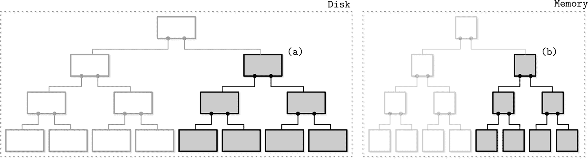

###### 图 7-1\. 刷新前的两组件 LSM 树。展示了内存和磁盘中段的刷新。

在子树刷新后，被取代的内存和磁盘子树被丢弃，并替换为它们合并的结果，该结果从磁盘中树的现有部分可寻址。图 7-2 展示了合并过程的结果，已写入到磁盘上的新位置，并附加到树的其余部分。

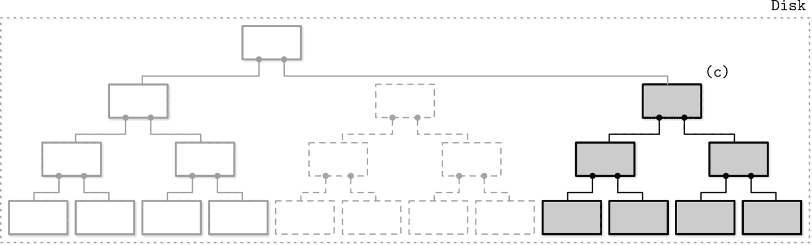

###### 图 7-2\. 刷新后的两组件 LSM 树。合并内容显示为灰色。虚线框表示被丢弃的磁盘段。

合并可以通过推进迭代器，同时读取磁盘中的叶节点和内存树的内容来实现。由于两个源都是排序的，为了产生排序的合并结果，我们在合并过程的每一步中只需要知道两个迭代器的*当前*值。

这种方法是对不可变 B 树的逻辑扩展和延续。写时复制 B 树（见“写时复制”）使用 B 树结构，但它们的节点没有完全占用，并且需要在根到叶路径上复制页面并创建*并行*树结构。在这里，我们做了类似的事情，但由于我们在内存中缓冲写入，我们分摊了磁盘中树更新的成本。

在实现子树合并和刷新时，我们必须确保三件事：

1.  *一旦*刷新过程开始，所有新写入都必须进入新的内存表。

1.  *在*子树刷新期间，必须保持对磁盘中的表和刷新内存中的子树的可访问性。

1.  *在*刷新后，发布合并内容，并丢弃未合并的磁盘和内存中的内容必须是原子操作。

虽然两组分 LSM 树在维护索引文件方面可能很有用，但截至目前作者还不知道有任何实现。这可以通过这种方法的写放大特性来解释：合并相对频繁，因为它们是由内存表刷新触发的。

### 多组分 LSM 树

让我们考虑一种替代设计，即有多个磁盘中的表的多组分 LSM 树，而不仅仅是一个。在这种情况下，整个内存表的内容将在单次运行中被刷新。

很快就会显而易见，在多次刷新之后，我们将会得到多个磁盘中的表，它们的数量会随着时间的推移而增加。由于我们并不总是确切地知道哪些表保存着所需的数据记录，我们可能不得不访问多个文件来定位搜索的数据。

需要从多个来源读取而不是仅一个可能会变得昂贵。为了减轻这个问题并将表的数量保持在最小限度，触发一个定期合并过程称为*压缩*（见“LSM 树的维护”）。压缩选择多个表，读取它们的内容，将它们合并，并将合并结果写入新的组合文件中。旧表与新合并表的出现同时被丢弃。

图 7-3 显示了多组分 LSM 树数据的生命周期。数据首先在内存中的组件中进行缓冲。当它变得过大时，其内容会被刷新到磁盘上，形成磁盘中的表。稍后，多个表将被合并以创建更大的表。

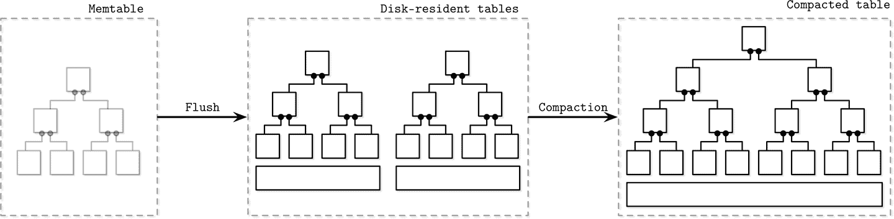

###### 图 7-3\. 多组分 LSM 树数据生命周期

本章的其余部分专门讨论多组分 LSM 树、构建模块及其维护过程。

### 内存中的表

内存表刷新可以定期触发，也可以使用大小阈值触发。在刷新之前，必须*切换*内存表：分配新的内存表，并且它成为所有新写入的目标，而旧的内存表则移至刷新状态。这两个步骤必须以原子方式执行。刷新的内存表在其内容完全刷新之前仍然可供读取。之后，旧内存表被丢弃，而新写入的磁盘驻留表可供读取。

在图 7-4 中，您可以看到 LSM 树的组件、它们之间的关系以及实现它们之间过渡的操作：

当前内存表

接收写入并提供读取服务。

刷新内存表

可供读取。

磁盘刷新目标

由于其内容不完整，因此不参与读取。

刷新的表

一旦刷新的内存表被丢弃，就可供读取。

合并表

当前正在合并磁盘驻留表。

紧凑的表

由刷新或其他紧凑表创建。

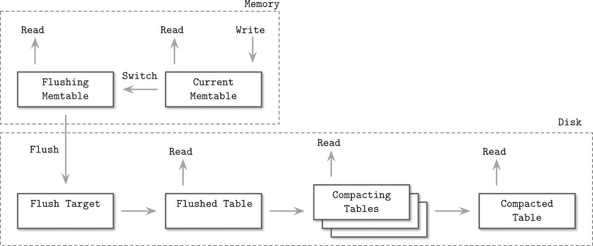

###### 图 7-4\. LSM 组件结构

数据已在内存中排序，因此可以通过将内存中的内容顺序写入磁盘来创建磁盘驻留表。在刷新期间，刷新内存表和当前内存表均可供读取。

直到内存表完全刷新，其内容的唯一磁盘版本存储在前置日志中。当内存表内容在磁盘上完全刷新时，可以*修剪*日志，并丢弃保存应用于刷新内存表的操作的日志部分。

## 更新和删除

在 LSM 树中，插入、更新和删除操作不需要在磁盘上查找数据记录。相反，在读取期间会协调冗余记录。

仅从内存表中删除数据记录是不够的，因为其他磁盘或内存驻留表可能保存了相同键的数据记录。如果我们通过仅从内存表中删除项目来实现删除，那么我们最终会得到要么没有影响要么会*复活*以前的值。

让我们考虑一个例子。刷新的磁盘驻留表包含与键`k1`关联的数据记录`v1`，而内存表则保留其新值`v2`：

```
Disk Table        Memtable
| k1 | v1 |       | k1 | v2 |
```

如果我们仅从内存表中删除`v2`并进行刷新，实际上会复活`v1`，因为它成为与该键关联的唯一值：

```
Disk Table        Memtable
| k1 | v1 |       ∅
```

因此，删除需要明确记录。这可以通过插入特殊的*删除条目*（有时称为*墓碑*或*休眠证书*）来实现，指示删除与特定键关联的数据记录：

```
Disk Table        Memtable
| k1 | v1 |       | k1 | <tombstone> |
```

协调过程会捡起墓碑，并过滤掉阴影值。

有时，删除连续范围的键可能比仅仅删除单个键更有用。这可以通过*谓词删除*来完成，其工作方式是追加一个带有根据常规记录排序规则排序的谓词的删除条目。在协调期间，与谓词匹配的数据记录将被跳过，并且不会返回给客户端。

谓词可以采用`DELETE FROM table WHERE key ≥ "k2" AND key < "k4"`的形式，并且可以接收任何范围匹配器。Apache Cassandra 实现了这种方法，并将其称为*范围墓碑*。范围墓碑涵盖的是一系列键，而不仅仅是单个键。

在使用范围墓碑时，必须仔细考虑解析规则，因为存在重叠的范围和磁盘上的表边界。例如，以下组合将从最终结果中隐藏与`k2`和`k3`相关的数据记录：

```
Disk Table 1      Disk Table 2
| k1 | v1 |       | k2 | <start_tombstone_inclusive> |
| k2 | v2 |       | k4 | <end_tombstone_exclusive>   |
| k3 | v3 |
| k4 | v4 |
```

## LSM 树查找

LSM 树由多个组件组成。在查找期间，通常会访问多个组件，因此它们的内容在返回给客户端之前必须进行合并和协调。为了更好地理解合并过程，让我们看看在合并期间如何迭代表格以及如何组合冲突记录。

## 合并迭代

由于磁盘上的表是有序的，我们可以使用多路归并排序算法。例如，我们有三个来源：两个磁盘上的表和一个内存表。通常，存储引擎提供一个*游标*或*迭代器*来遍历文件内容。该游标保存了上一个消耗的数据记录的偏移量，可以检查迭代是否已完成，并可用于检索下一个数据记录。

多路归并排序使用*优先队列*，例如*最小堆* [[SEDGEWICK11]](app01.html#SEDGEWICK11)，它可以保存多达`N`个元素（其中`N`是迭代器的数量），对其内容进行排序并准备返回下一个最小的元素。每个迭代器的头部都会放入队列中。队列头部的元素是所有迭代器中的最小值。

###### 注意

优先队列是一种用于维护有序队列的数据结构。虽然常规队列保留按添加顺序排列的项目（先进先出），但优先队列在插入时重新排序项目，并将具有最高（或最低）优先级的项目放在队列的头部。这在归并迭代中特别有用，因为我们必须按排序顺序输出元素。

当队列中移除最小的元素时，与之关联的迭代器将被检查下一个数值，然后放入队列中，队列会重新排序以保持顺序。

由于所有迭代器内容都已排序，从持有所有迭代器头部的迭代器中重新插入值，也保持了队列仍然包含来自所有迭代器的最小元素的不变性。当其中一个迭代器耗尽时，算法继续进行而不重新插入下一个迭代器头。直到满足查询条件或所有迭代器耗尽为止。

图 7-5 展示了刚才描述的合并过程的示意图：头元素（源表中的浅灰色项目）被放置到优先级队列中。从优先级队列返回到输出迭代器的元素。最终的输出是排序的。

在合并迭代过程中可能会遇到同一键的多条数据记录。根据优先级队列和迭代器不变性，我们知道如果每个迭代器只保留一个键的单个数据记录，并且在队列中有多个相同键的记录，这些数据记录必定来自不同的迭代器。

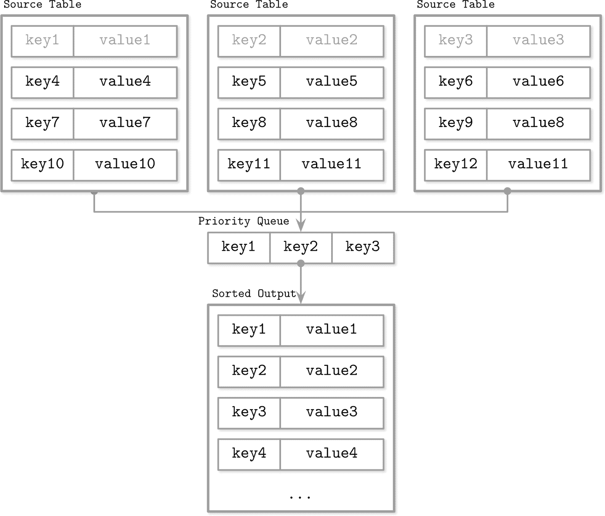

###### 图 7-5\. LSM 合并机制

让我们逐步跟随一个示例。作为输入数据，我们有两个磁盘驻留表的迭代器：

```
Iterator 1:         Iterator 2:
{k2: v1} {k4: v2}   {k1: v3} {k2: v4} {k3: v5}
```

优先级队列从迭代器头部填充：

```
Iterator 1:         Iterator 2:         Priority queue:
{k4: v2}            {k2: v4} {k3: v5}   {k1: v3} {k2: v1}
```

键`k1`是队列中最小的键，并被追加到结果中。由于它来自`Iterator 2`，我们从中重新填充队列：

```
Iterator 1:         Iterator 2:         Priority queue:      Merged Result:
{k4: v2}            {k3: v5}            {k2: v1} {k2: v4}    {k1: v3}
```

现在，在队列中有`k2`键的*两条*记录。由于前述的不变性，我们可以确定在任何迭代器中没有其他具有相同键的记录。相同键的记录被合并并追加到合并结果中。

从两个迭代器中重新填充队列的数据：

```
Iterator 1:         Iterator 2:         Priority queue:      Merged Result:
{}                  {}                  {k3: v5} {k4: v2}    {k1: v3} {k2: v4}
```

由于所有迭代器现在都为空，我们将剩余的队列内容追加到输出中：

```
Merged Result:
  {k1: v3} {k2: v4} {k3: v5} {k4: v2}
```

总结来说，必须重复以下步骤以创建组合迭代器：

1.  最初，用每个迭代器的第一个项目填充队列。

1.  从队列中取出最小的元素（头）。

1.  从相应的迭代器中重新填充队列，除非此迭代器已耗尽。

就合并排序集合而言，合并迭代器的复杂度与合并排序集合相同。它具有`O(N)`的内存开销，其中`N`是迭代器的数量。维护具有`O(log N)`（平均情况）的排序集合的迭代器头部。

## 协调

合并迭代仅仅是合并来自多个来源的数据所需完成的单个方面。另一个重要方面是同一键的*协调*和*冲突解决*数据记录。

不同的表可能保存同一键的数据记录，例如更新和删除，它们的内容必须进行协调。前面示例中的优先级队列实现必须能够允许与同一键关联的多个值并触发协调。

###### 注意

如果不存在，则将记录插入到数据库中并更新现有记录的操作称为*upsert*。在 LSM 树中，插入和更新操作不可区分，因为它们不尝试在所有源中定位以前与键关联的数据记录并重新分配其值，所以我们默认通过*upsert*记录。

要调和数据记录，我们需要了解哪个数据记录优先。数据记录包含必要的元数据，如时间戳。为了确定来自多个来源的项目之间的顺序并找出哪一个更近，我们可以比较它们的时间戳。

高时间戳记录阴影的记录在压缩期间不会返回给客户端或写入。

## LSM 树中的维护

类似于可变 B 树，LSM 树需要进行维护。这些过程的性质受这些算法保持的不变量的影响。

在 B 树中，维护过程会收集未引用的单元并对页面进行碎片整理，回收被移除和阴影记录占用的空间。在 LSM 树中，磁盘驻留表的数量不断增加，但可以通过触发周期性压缩来减少。

压缩会选择多个磁盘驻留表，使用上述的合并和调和算法遍历它们的整个内容，并将结果写入新创建的表中。

由于磁盘驻留表内容已排序，并且由于合并排序的工作方式，压缩具有理论上的内存使用上限，因为它应该只在内存中保留迭代器头。所有表内容都按顺序消耗，并且生成的合并数据也按顺序写出。由于额外的优化，这些细节在不同的实现中可能会有所不同。

在压缩过程完成之前，压缩表会一直对读取操作可用，这意味着在压缩期间需要足够的空闲磁盘空间来写入压缩后的表。

系统可以同时执行多个压缩操作。然而，这些并发压缩通常在非交集的表集合上工作。压缩写入器既可以将多个表合并为一个，也可以将一个表分区为多个表。

### 层次压缩

压缩为优化开辟了多种机会，有许多不同的压缩策略。其中经常实施的一种压缩策略称为*层次压缩*。例如，[RocksDB](https://databass.dev/links/76) 使用了这种策略。

分层压实将磁盘上的表格分为*级别*。每个级别的表格有目标大小，并且每个级别都有对应的*索引*号（标识符）。有些不直观的是，索引号最高的级别称为*底层*级别。为了清晰起见，本节避免使用“更高级别”和“更低级别”术语，并对*级别索引*使用相同的修饰符。也就是说，由于 2 大于 1，级别 2 的索引比级别 1 更高。术语*上一级*和*下一级*具有与级别索引相同的顺序语义。

Level-0 表格是通过刷新内存表内容创建的。Level 0 的表格可能包含重叠的键范围。一旦 Level 0 的表格数量达到阈值，它们的内容就会被合并，为 Level 1 创建新的表格。

Level 1 和所有更高索引级别的表格键范围不重叠，因此在压实过程中必须对 Level-0 表格进行分区，分割并与持有对应键范围的表格合并。或者，压实可以包括*所有* Level-0 和 Level-1 表格，并输出分区的 Level-1 表格。

较高索引级别上的压实会从具有重叠范围的两个连续级别中选取表格，并在更高级别上生成新表格。图 7-6 概略显示了压实过程如何在级别之间迁移数据。对 Level-1 和 Level-2 表格进行压实将在 Level 2 上生成新表格。根据表格的分区方式，可以选择来自一个级别的多个表格进行压实。

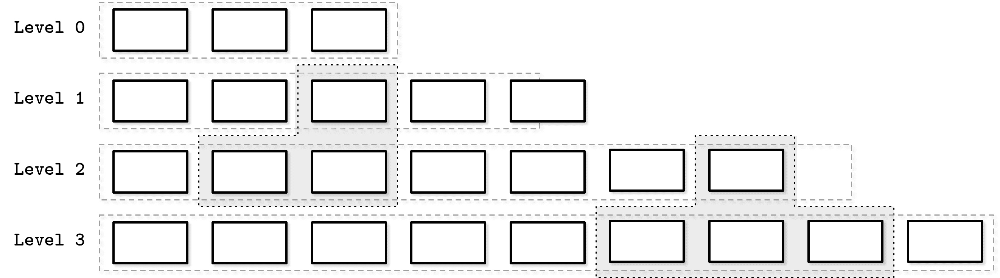

###### 图 7-6\. 压实过程。虚线的灰色框表示当前正在压实的表格。级别整体框表示级别上的目标数据大小限制。级别 1 超过了限制。

在不同表格中保持不同键范围可以减少读取过程中访问的表格数量。这通过检查表格元数据并过滤那些范围不包含搜索键的表格来完成。

每个级别的表格大小和最大表格数量都有限制。一旦第一级或任何更高索引的级别的表格数量达到阈值，当前级别的表格就会与持有重叠键范围的下一级别的表格合并。

在各级别之间，表格大小呈指数增长：每个下一级别上的表格都比前一个级别上的表格大得多。这样，最新的数据始终位于索引最低的级别上，而旧数据逐渐迁移到较高的级别。

### 大小分层压实

另一种流行的压实策略称为*大小分层压实*。在大小分层压实中，不是根据它们的级别将磁盘上的表格分组，而是根据它们的大小：较小的表格与较小的表格组合在一起，较大的表格与较大的表格组合在一起。

Level 0 包含了从内存表刷新或通过压实过程创建的最小表格。当表格压实后，生成的合并表格将写入保存相应大小表格的级别。这个过程递归地增加级别，压实并将较大的表格提升到更高的级别，将较小的表格降级到较低的级别。

###### 警告

大小层次压实的一个问题称为*表饥饿*：如果在压实后合并表格仍然足够小（例如，记录被墓碑遮蔽且未包含在合并表格中），较高级别可能会被压实饥饿，并且其墓碑将不会被考虑，增加读取的成本。在这种情况下，必须强制对一个级别进行压实，即使它不包含足够的表格。

还有其他常用的压实策略，可能会针对不同的工作负载进行优化。例如，Apache Cassandra 还实现了[a *time window*压实策略](https://databass.dev/links/77)，特别适用于设置了存活时间的时间序列工作负载中的记录（换句话说，项目必须在给定时间段后过期）。

时间窗口压实策略考虑了写入时间戳，并允许丢弃持有已过期时间范围数据的整个文件，而无需压实和重写其内容。

# 读、写和空间放大

在实现最佳压实策略时，我们必须考虑多个因素。一种方法是回收占用的重复记录空间，减少空间开销，这会导致由于持续重写表格而增加的写放大。另一种选择是避免连续重写数据，这会增加读放大（在读取期间关联同一键的数据记录的开销）和空间放大（因为冗余记录被长时间保留）。

###### 注意

数据库社区的一大争议是 B 树还是 LSM 树的写放大更低。非常重要的是要理解这两种情况下写放大的*来源*。在 B 树中，它来自写回操作和对同一节点的后续更新。在 LSM 树中，写放大是由于在压实过程中将数据从一个文件迁移到另一个文件而导致的。直接比较这两者可能会导致错误的假设。

总之，在以不可变方式将数据存储在磁盘上时，我们面临三个问题：

读放大

由于需要访问多个表格以检索数据而产生。

写放大

由压实过程连续重写引起。

空间放大

由于存储与同一键关联的多个记录而产生。

在本章的其余部分我们将详细讨论每一个问题。

## RUM 推测

存储结构的流行成本模型之一考虑了三个因素：*读取*、*更新*和*内存开销*。它被称为 RUM 猜想 [[ATHANASSOULIS16]](app01.html#ATHANASSOULIS16)。

RUM 猜想指出，减少这三个开销中的两个不可避免地会对第三个产生负面影响，并且只能以其中一个参数的牺牲来进行优化。我们可以比较不同的存储引擎在这三个参数上的表现，从而了解它们优化了哪些参数，以及这可能意味着哪些潜在的权衡。

理想的解决方案应在保持低读取成本的同时，保持低内存和写入开销，但实际上这是不可实现的，我们必须进行权衡。

B 树是针对读取优化的。对 B 树的写入需要定位磁盘上的记录，并且可能需要多次更新磁盘上的同一页。为未来更新和删除保留额外空间会增加空间开销。

LSM 树在写入时不需要定位磁盘上的记录，并且不为未来的写入保留额外空间。由于存储冗余记录而仍然存在一些空间开销。在默认配置中，读取更昂贵，因为需要访问多个表来返回完整的结果。然而，在本章讨论的优化方法有助于缓解这个问题。

正如我们在关于 B 树的章节中看到的，并将在本章中看到的，通过应用不同的优化方法可以改善这些特性。

这个成本模型并不完美，因为它没有考虑其他重要的度量标准，如延迟、访问模式、实现复杂性、维护开销和硬件相关的细节。对于分布式数据库而言，如一致性影响和复制开销等更高层次的概念也没有考虑进去。然而，这个模型可以作为一个初步的近似值和经验法则，因为它有助于理解 *存储引擎* 提供了什么。

# **实施细节**

我们已经讨论了 LSM 树的基本动态：数据如何读取、写入和压缩。然而，许多 LSM 树实现中有一些共同点也值得讨论：内存和磁盘上的表是如何实现的，辅助索引的工作原理，如何在读取时减少磁盘上的表的访问次数，以及与日志结构化存储相关的新思路。

## **排序字符串表**

到目前为止，我们已经讨论了 LSM 树的层次结构和逻辑结构（它们由多个内存和磁盘上的组件组成），但尚未讨论磁盘上的表是如何实现的，以及它们的设计如何与系统的其他部分协同工作。

磁盘驻留表通常使用*排序字符串表*（SSTables）实现。正如其名称所示，SSTables 中的数据记录是按键顺序排序和布局的。SSTables 通常由两个组件组成：索引文件和数据文件。索引文件使用一些允许对数查找的结构实现，如 B 树，或者使用哈希表进行常量时间查找。

由于数据文件按键顺序保存记录，使用哈希表进行索引并不妨碍我们实现范围扫描，因为哈希表仅用于定位范围内的第一个键，而范围本身可以从数据文件顺序读取，只要范围谓词仍然匹配。

索引组件包含键和数据条目（数据文件中存储实际数据记录的偏移量）。数据组件由连接的键值对组成。我们在第三章中讨论的单元设计和数据记录格式在 SSTables 中大部分适用。这里的主要区别在于单元是顺序写入的，并且在 SSTable 的生命周期内不会被修改。由于索引文件保存了指向数据文件中存储的数据记录的指针，因此在创建索引时必须知道它们的偏移量。

在压实期间，可以顺序读取数据文件，而无需处理索引组件，因为它们中的数据记录已经有序。由于在压实过程中合并的表具有相同的顺序，并且合并迭代保持顺序，因此结果合并后的表也是通过单次顺序写入数据记录而创建的。一旦文件完全写入，它被视为不可变，并且其磁盘驻留内容不会修改。

## 布隆过滤器

LSM 树中读取放大的源头是，我们必须为读操作完成对多个磁盘驻留表进行地址访问。这是因为我们并不总是事先知道磁盘驻留表是否包含搜索键的数据记录。

防止表查找的一种方法是将其键范围（存储在给定表中的最小和最大键）存储在元数据中，并检查搜索的键是否属于该表的范围。这些信息并不精确，只能告诉我们数据记录*可能*存在于表中。为了改善这种情况，许多实现，包括[Apache Cassandra](https://databass.dev/links/78)和[RocksDB](https://databass.dev/links/79)，使用一种称为*布隆过滤器*的数据结构。

###### 注意

概率数据结构通常比其“常规”对应物更节省空间。例如，要检查集合成员资格、基数（查找集合中不同元素的数量）或频率（查找某个元素被遇到的次数），我们必须存储所有集合元素并遍历整个数据集以找到结果。概率结构允许我们存储近似信息并执行带有不确定性的查询。一些常见的这类数据结构示例包括 Bloom filter（用于集合成员资格）、HyperLogLog（用于基数估计） [[FLAJOLET12]](app01.html#FLAJOLET12)，和 Count-Min Sketch（用于频率估计） [[CORMODE12]](app01.html#CORMODE12）。

一种由 Burton Howard Bloom 在 1970 年提出的 *Bloom filter* [[BLOOM70]](app01.html#BLOOM70)，是一种空间高效的概率数据结构，用于测试元素是否属于集合。它可以产生误报匹配（说元素属于集合，而实际上不存在），但不会产生漏报（如果返回负匹配，则确保元素不属于集合）。

换句话说，Bloom filter 可用于判断键 *可能在表中* 或 *绝对不在表中*。Bloom filter 返回负匹配的文件在查询期间被跳过。其余文件被访问以确定数据记录是否实际存在。使用与磁盘驻留表相关联的 Bloom filter 可显著减少读取过程中访问的表数。

Bloom filter 使用一个大比特数组和多个哈希函数。哈希函数应用于表中记录的键，以在比特数组中找到索引，并将位设为 `1`。由哈希函数确定的所有位置中设置为 `1` 的位表明集合中存在该键。在查找时，当检查 Bloom filter 中元素存在性时，再次计算键的哈希函数，如果所有哈希函数确定的位均为 `1`，则返回正结果，说明该项以一定概率是集合成员。如果至少一个位为 `0`，则可以准确地说元素不在集合中。

应用于不同键的哈希函数可能返回相同的位位置，导致 *哈希碰撞*，并且 `1` 位只表明某个哈希函数为某个键产生了这个位位置。

误报概率由设置比特集的大小和哈希函数的数量来管理：在较大的比特集中，碰撞的机会较小；同样地，使用更多的哈希函数，我们可以检查更多的比特并获得更精确的结果。

更大的位集占用更多内存，计算更多哈希函数的结果可能会对性能产生负面影响，因此我们必须在可接受的概率和额外开销之间找到一个合理的平衡点。概率可以从期望的集合大小计算得出。由于 LSM 树中的表是不可变的，因此可以预先知道集合大小（表中的键数）。

让我们看一个简单的例子，如图 7-7 所示。我们有一个 16 位的位数组和 3 个哈希函数，它们为`key1`产生了值`3`、`5`和`10`。现在我们设置这些位置的位。接下来添加下一个键，并且哈希函数为`key2`产生了值`5`、`8`和`14`，我们也设置了这些位置的位。

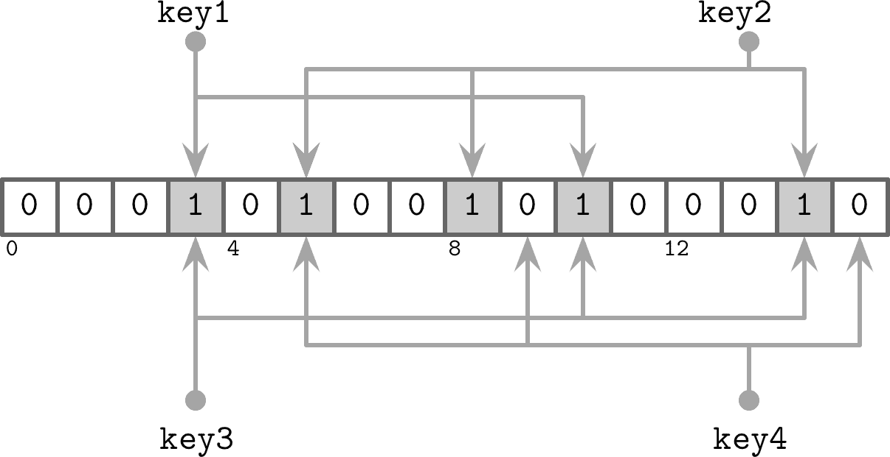

###### 图 7-7\. 布隆过滤器

现在，我们尝试检查集合中是否存在`key3`，并且哈希函数返回`3`、`10`和`14`。由于在添加`key1`和`key2`时所有三位均被设置，所以布隆过滤器出现了误判：`key3`从未添加过，但所有计算出的位都被设置。但是，由于布隆过滤器只声称元素*可能*在表中，这个结果是可以接受的。

如果我们尝试查找`key4`并得到值`5`、`9`和`15`，我们发现只有位`5`被设置，其余两位未设置。如果有一个位未设置，我们可以确定该元素从未添加到过滤器中。

## 跳表

存在许多不同的数据结构用于在内存中保持排序数据，其中一种因其简单性而近年来越来越流行的称为*跳表*[[PUGH90b]](app01.html#PUGH90b)。就实现而言，跳表与单向链表相比并不复杂，其概率复杂性保证接近搜索树的复杂性。

跳表在插入和更新时不需要旋转或重新定位，而是使用概率平衡。由于跳表节点较小且在内存中随机分配，通常比内存中的 B 树不太友好于缓存。一些实现通过使用[展开链表](https://databass.dev/links/80)改善了这种情况。

跳表（skiplist）由一系列不同*高度*的节点组成，构建了链接的层次结构，允许跳过一定范围的项目。每个节点包含一个关键字，在链接列表中的节点不同，某些节点不止一个后继节点。高度为`h`的节点是从一个或多个高度*至*`h`的前驱节点链接而来。最低层的节点可以从任何高度的节点链接而来。

节点的高度由随机函数确定，并在插入时计算。具有相同高度的节点形成一个*级别*。级别数量受限以避免无限增长，并基于结构可以容纳的项目数量选择最大高度。每个下一级别上的节点数量指数级减少。

查询通过跟随最高级别的节点指针工作。一旦搜索遇到持有大于搜索键的键的节点，就跟随其前驱节点对下一个级别上的节点的链接。换句话说，如果搜索的键大于当前节点的键，则从当前节点继续。如果搜索的键小于当前节点的键，则从下一个级别上的前驱节点继续搜索。该过程递归重复，直到定位到搜索键或其前驱节点。

例如，在图 7-8 中显示的跳表中搜索键值 7 可以如下进行：

1.  跟随最高级别上的指针，到持有键值 `10` 的节点。

1.  由于搜索的键值 `7` *小于* `10`，从头节点开始跟随下一个级别的指针，定位到持有键值 `5` 的节点。

1.  此节点的最高级指针被跟随，再次定位到持有键值 `10` 的节点。

1.  搜索的键值 `7` *小于* `10`，从持有键值 `5` 的节点开始跟随下一个级别的指针，定位到持有搜索键值 `7` 的节点。

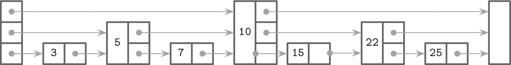

###### 图 7-8\. 跳表

在插入期间，使用上述算法找到插入点（持有键或其前驱的节点），并创建一个新节点。为了构建类似树的层次结构并保持平衡，使用基于概率分布生成的随机数确定节点的高度。持有键值 *小于* 新创建节点中键的前驱节点的指针被链接到该节点。它们的高级指针保持不变。新创建节点中的指针链接到每个级别上相应的后继节点。

删除时，被移除节点的前向指针被放置到相应级别的前驱节点上。

我们可以通过实现一个线性化方案创建一个跳表的并发版本，该方案使用一个额外的 `fully_linked` 标志来确定节点指针是否已完全更新。可以使用比较并交换来设置此标志 [[HERLIHY10]](app01.html#HERLIHY10)。这是必需的，因为节点指针必须在多个级别上更新，以完全恢复跳表结构。

在具有非托管内存模型的语言中，可以使用引用计数或 *危险指针* 来确保在并发访问时不会释放当前引用的节点 [[RUSSEL12]](app01.html#RUSSEL12)。该算法是无死锁的，因为节点始终从较高级别访问。

Apache Cassandra 在二级 [索引内存表实现](https://databass.dev/links/81) 中使用跳表。WiredTiger 在某些内存操作中也使用跳表。

## 磁盘访问

由于表格内容大多存储在磁盘上，并且存储设备通常允许按块访问数据，因此许多 LSM Tree 实现依赖于页面缓存进行磁盘访问和中间缓存。许多在“缓冲管理”中描述的技术，如页面逐出和固定，仍然适用于日志结构化存储。

最显著的区别在于内存中的内容是不可变的，因此不需要额外的锁或闩锁以进行并发访问。引用计数用于确保当前访问的页面在内存中不被逐出，并且在压缩期间完成的请求在底层文件在移除之前都得到满足。

另一个不同之处在于 LSM Tree 中的数据记录不一定是页面对齐的，指针可以使用绝对偏移而不是页面 ID 进行寻址。在图 7-9 中，您可以看到内容不与磁盘块对齐的记录。一些记录跨越页面边界，需要加载多个页面到内存中。

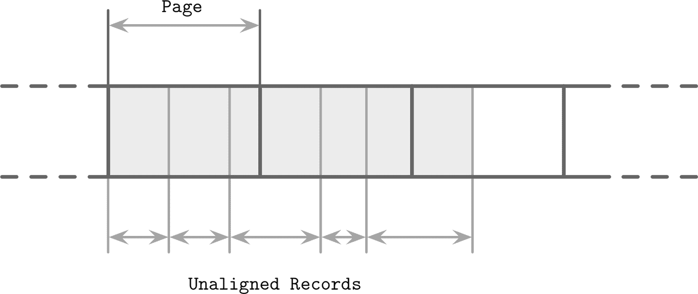

###### 图 7-9\. 未对齐的数据记录

## 压缩

我们已经在 B 树的上下文中讨论了压缩（参见“压缩”）。类似的想法也适用于 LSM Tree。这里的主要区别在于 LSM Tree 表是不可变的，并且通常是单次写入。在按页面压缩数据时，压缩页面不是页面对齐的，因为它们的大小比未压缩的页面小。

为了能够处理压缩页面，我们需要在编写其内容时跟踪地址边界。我们可以用零填充压缩页面，并将其与页面大小对齐，但这样我们将失去压缩的好处。

要使压缩页面可寻址，我们需要一个间接层，该层存储压缩页面的偏移量和大小。图 7-10 显示了压缩和未压缩块之间的映射。压缩页面*总是*比原始页面小，否则压缩它们就没有意义。

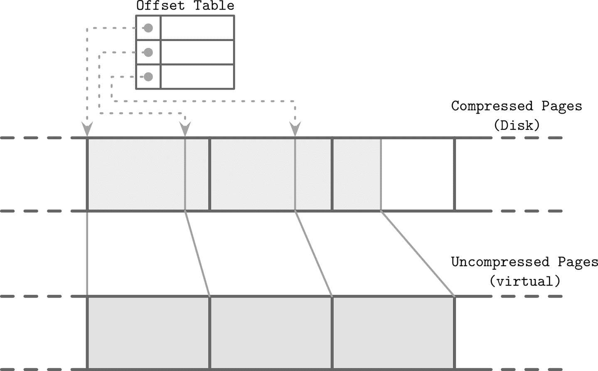

###### 图 7-10\. 读取压缩块。虚线表示从映射表指向磁盘上压缩页面偏移量的指针。未压缩页面通常驻留在页面缓存中。

在压缩和刷新期间，压缩页面按顺序追加，并且压缩信息（原始未压缩页面偏移量和实际压缩页面偏移量）存储在单独的文件段中。在读取期间，查找压缩页面偏移量及其大小，并且页面可以在内存中解压缩和实体化。

# 无序的 LSM 存储

到目前为止讨论的大多数存储结构都按顺序存储数据。可变和不可变 B 树页，FD-Tree 中的有序运行，以及 LSM 树中的 SSTable 按键顺序存储数据记录。这些结构中的顺序保存方式不同：B 树页原地更新，FD-Tree 运行通过合并两个运行的内容创建，而 SSTable 通过在内存中缓冲和排序数据记录创建。

在本节中，我们讨论了以随机顺序存储记录的结构。无序存储通常不需要单独的日志，并且通过按插入顺序存储数据记录来减少写入成本。

## Bitcask

[Bitcask](https://databass.dev/links/82)，在[Riak](https://databass.dev/links/83)中使用的存储引擎之一，是一种无序的日志结构化存储引擎[[SHEEHY10b]](app01.html#SHEEHY10b)。与迄今为止讨论的日志结构化存储实现不同，它*不*使用 memtables 进行缓冲，并直接将数据记录存储在日志文件中。

为了使值可搜索，Bitcask 使用称为*keydir*的数据结构，它保存相应键的*最新*数据记录的引用。旧的数据记录可能仍然存在于磁盘上，但在 keydir 中没有引用，并在合并过程中进行垃圾回收。Keydir 作为内存哈希表实现，在启动期间必须从日志文件中重建。

在*写入*过程中，键和数据记录会按顺序附加到日志文件中，并将指向新写入数据记录位置的指针放置在 keydir 中。

读取操作通过 keydir 检查来定位所搜索的键，并跟随相关指针到日志文件中，定位数据记录。由于在任何给定时刻，keydir 中只能与键关联一个值，因此点查询无需从多个来源合并数据。

图 7-11 展示了 Bitcask 中数据文件中键和记录之间的映射关系。日志文件存储数据记录，而 keydir 指向每个键对应的最新的*活跃*数据记录。数据文件中的阴影记录（即后续写入或删除操作所取代的记录）显示为灰色。

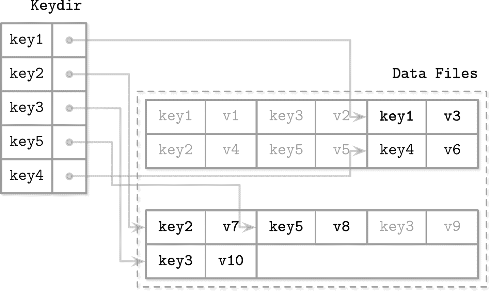

###### 图 7-11\. keydir 与 Bitcask 中数据文件之间的映射关系。实线表示从键到与之关联的最新值的指针。浅灰色显示阴影键值对。

在合并过程中，所有日志文件的内容都会被顺序读取、合并并写入新位置，仅保留*活跃*数据记录并丢弃阴影记录。keydir 将更新为指向重新定位的数据记录的新指针。

数据记录直接存储在日志文件中，因此无需维护单独的预写日志，这既减少了空间开销又减少了写放大。这种方法的缺点是只支持点查询，不允许范围扫描，因为 keydir 和数据文件中的条目都是无序的。

这种方法的优点在于简单和出色的点查询性能。即使数据记录存在多个版本，keydir 只会处理最新的版本。然而，需要在内存中保留所有键并在启动时重建 keydir 是一些使用场景可能无法接受的限制。虽然这种方法非常适合点查询，但不支持范围查询。

## WiscKey

范围查询对许多应用程序非常重要，希望有一种存储结构既能够享受无序存储的写入和空间优势，同时又能够执行范围扫描，这将是非常好的。

WiscKey [[LU16]](app01.html#LU16) 通过在 LSM 树中保持键排序，并在称为 *vLogs*（值日志）的无序追加文件中保留数据记录，将排序与垃圾收集解耦。这种方法可以解决在讨论 Bitcask 时提到的两个问题：需要在内存中保留所有键，并在启动时重建哈希表的需求。

图 7-12 展示了 WiscKey 的关键组件，以及键和日志文件之间的映射。vLog 文件包含无序的数据记录。键存储在排序的 LSM 树中，指向日志文件中的最新数据记录。

由于键通常比与其关联的数据记录小得多，因此紧凑它们的效率显著提高。这种方法对于更新和删除率较低的用例特别有用，垃圾收集不会释放大量磁盘空间。

这里的主要挑战在于，因为 vLog 数据是无序的，范围扫描需要随机 I/O。WiscKey 在范围扫描期间利用内部 SSD 并行性以并行预取块，并降低随机 I/O 成本。在块传输方面，成本仍然很高：为了获取范围扫描中的单个数据记录，必须读取其所在的整个页面。

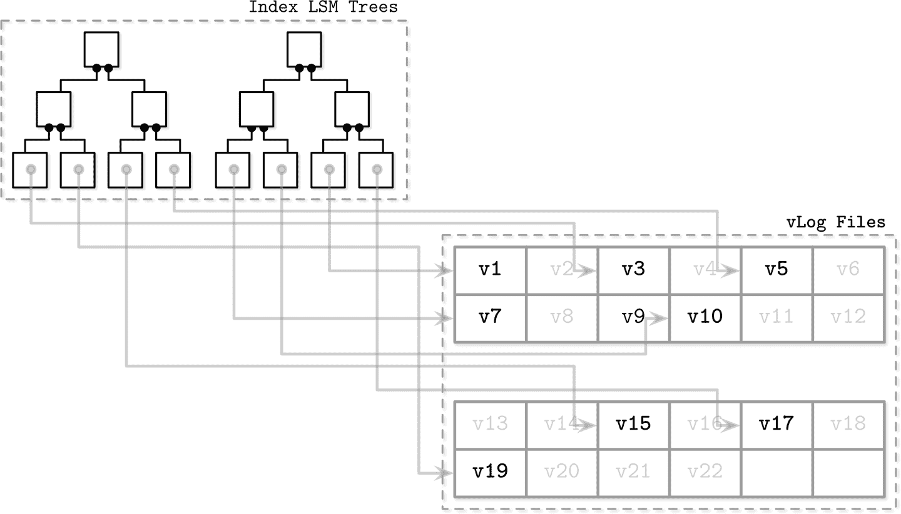

###### 图 7-12\. WiscKey 的关键组件：索引 LSM 树和 vLog 文件，以及它们之间的关系。数据文件中的阴影记录（被后续写入或删除取代的记录）显示为灰色。实线表示从 LSM 树中的键到日志文件中的最新值的指针。

在压缩期间，vLog 文件内容按顺序读取，合并并写入新位置。指向这些新位置的指针（LSM 树中的值）会得到更新。为了避免扫描整个 vLog 内容，WiscKey 使用 `head` 和 `tail` 指针，记录存活键的 vLog 段的信息。

由于 vLog 中的数据是无序的且不包含存活信息，因此必须扫描键树以查找哪些值仍然存活。在垃圾收集期间执行这些检查引入了额外的复杂性：传统的 LSM 树可以在压缩过程中解决文件内容，而无需处理键索引。

# LSM 树的并发性

LSM 树中的主要并发挑战与切换*表视图*（在刷新和压实期间变化的内存和磁盘上的表集合）和日志同步相关。内存表通常也是并发访问的（例如 ScyllaDB 之类的核心分区存储除外），但本书不涉及并发的内存数据结构。

在刷新期间，必须遵循以下规则：

+   新的内存表必须对读取和写入变得可用。

+   旧的（正在刷新的）内存表必须对读取保持可见。

+   刷新的内存表必须写入磁盘。

+   应当作为一个原子操作执行丢弃已刷新的内存表和使已刷新的磁盘上的表。

+   写前日志段，保存已应用于刷新的内存表的日志条目，必须被丢弃。

例如，Apache Cassandra 通过使用[操作顺序屏障](https://databass.dev/links/84)解决这些问题：所有接受写入的操作在内存表刷新之前将等待。这样，刷新过程（作为消费者）知道其他进程（作为生产者）依赖于它。

更一般地说，我们有以下同步点：

内存表切换

此后，所有写入仅发送到新的内存表，使其成为主要的，而旧的仍然可供读取。

刷新完成

在表视图中用已刷新的磁盘上的表替换旧的内存表。

写前日志截断

丢弃保存与已刷新的内存表关联的日志段。

这些操作对正确性有严重影响。继续写入旧内存表可能导致数据丢失；例如，如果写入的是已经被刷新的内存表部分。同样地，如果不保留旧内存表供读取，直到其对应的磁盘上的副本准备就绪，将导致结果不完整。

在压实期间，表视图也会发生变化，但在这里过程稍微更为直接：旧的磁盘上的表被丢弃，并且代之以压实版本。旧表必须保持对读取的可访问性，直到新表完全写入并准备好用于读取替换它们。还必须避免同一表在多个并行运行的压实中参与的情况。

在 B 树中，日志截断必须与从页缓存刷新脏页协调，以保证耐久性。在 LSM 树中，我们有一个类似的要求：写入被缓冲在内存表中，直到完全刷新，其内容不是持久的，因此日志截断必须与内存表刷新协调。一旦刷新完成，日志管理器将获得关于最新刷新日志段的信息，并且其内容可以安全丢弃。

不同步日志截断与刷新也会导致数据丢失：如果在刷新完成之前丢弃了日志段，并且节点崩溃，则不会重播日志内容，并且无法恢复此段的数据。

# 日志堆叠

许多现代文件系统都是日志结构化的：它们在内存段中缓冲写入，并在其内容填满时以只追加方式将其刷新到磁盘。 SSD 也使用日志结构化存储来处理小的随机写入，最小化写入开销，改善磨损平衡，并增加设备寿命。

日志结构化存储（LSS）系统开始在 SSD 变得更加可负担得起时变得流行起来。 LSM 树和 SSD 非常匹配，因为顺序工作负载和仅追加写入有助于减少原位更新的放大，这会对 SSD 性能产生负面影响。

如果我们将多个日志结构化系统堆叠在一起，可能会遇到几个我们试图使用 LSS 解决的问题，包括写入放大、碎片化和性能差。至少，在开发应用程序时，我们需要牢记 SSD 闪存转换层和文件系统[[YANG14]](app01.html#YANG14)。

## 闪存转换层

在 SSD 中使用日志结构化映射层的动机有两个因素：小的随机写入必须批量写入物理页面，并且 SSD 通过使用程序/擦除周期工作。只有*擦除*的页面才能进行*编程*（换句话说，写入）。这意味着页面只有在*空的*情况下（换句话说，已*擦除*）才能进行*编程*。

*单个* 页面不能被擦除，只能将*块*（通常包含 64 到 512 个页面）中的页面组合在一起进行擦除。图 7-13 显示了页面的示意图，分组成块。闪存转换层（FTL）将逻辑页面地址转换为其物理位置，并跟踪页面状态（活动的、丢弃的或空的）。当 FTL 耗尽空闲页面时，必须执行垃圾收集并擦除已丢弃的页面。

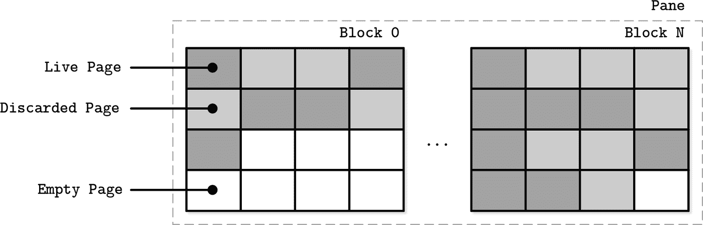

###### 图 7-13\. SSD 页面，分组成块

不能保证要擦除的块中的所有页面都是已丢弃的。在块可以擦除之前，FTL 必须将其*活动*页面重新定位到包含空页面的块之一。图 7-14 显示了从一个块中移动活动页面到新位置的过程。

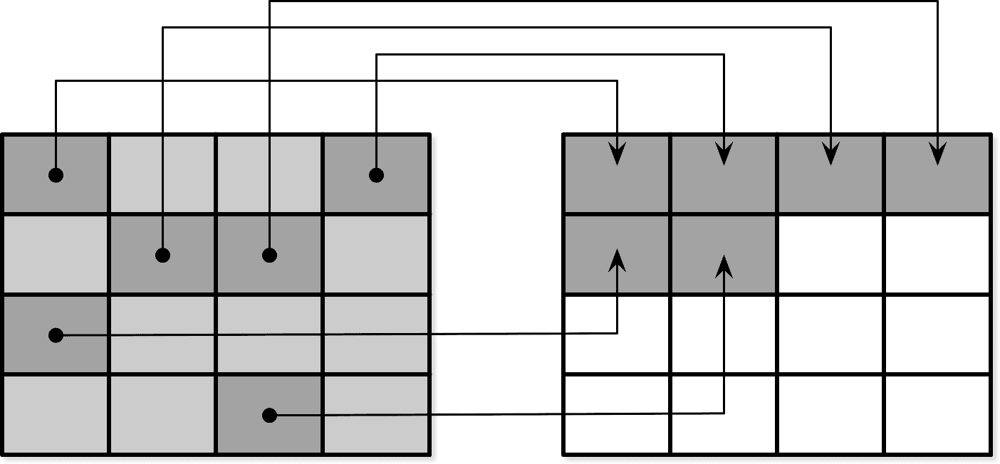

###### 图 7-14\. 垃圾收集期间的页面重新定位

当所有活动页面被重新定位后，块可以安全地被擦除，其空页面变为可用于写入。由于 FTL 了解页面状态和状态转换并具有所有必要信息，因此还负责 SSD 的*磨损平衡*。

###### 注意

磨损平衡将负载均匀地分布在介质上，避免热点，其中块由于高数量的编程-擦除周期而提前失效。这是必要的，因为闪存记忆单元只能经历有限次数的编程-擦除周期，均匀使用内存单元有助于延长设备的寿命。

总之，将日志结构化存储用于 SSD 的动机在于通过将小的随机写入批处理在一起来摊销 I/O 成本，通常会导致较少的操作次数，进而减少垃圾回收触发的次数。

## 文件系统日志记录

此外，我们还得到了许多使用日志技术进行写入缓冲以减少写放大并充分利用底层硬件的文件系统。

日志堆叠以几种不同的方式表现出来。首先，每个层次必须执行自己的簿记，而最常见的是底层日志不公开避免重复努力所需的信息。

图 7-15 显示了高级日志（例如应用程序）和低级日志（例如文件系统）之间的映射，导致冗余记录和不同的垃圾回收模式 [[YANG14]](app01.html#YANG14)。不对齐的段写入可能会使情况变得更糟，因为丢弃高级日志段可能会导致片段化并重新定位相邻段的部分。

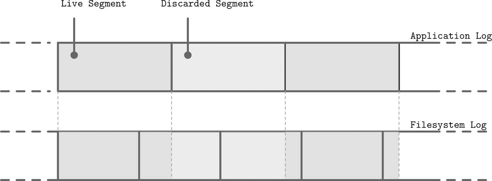

###### 图 7-15\. 写入不对齐和高级日志段的丢弃

因为各层不进行相关的 LSS 调度（例如，丢弃或重新定位段），较低级别的子系统可能对已丢弃的数据或即将丢弃的数据执行冗余操作。同样，由于不存在单一标准的段大小，高级别不对齐的段可能占用多个较低级别的段。所有这些开销可以减少或完全避免。

尽管我们说日志结构化存储全部涉及顺序 I/O，我们必须记住数据库系统可能具有多个写入流（例如，并行于数据记录写入的日志写入）[[YANG14]](app01.html#YANG14)。在硬件层面上考虑时，交错的顺序写入流可能不会转化为相同的顺序模式：块不一定按写入顺序放置。图 7-16 显示了多个时间重叠的流，写入大小不与底层硬件页大小对齐的记录。

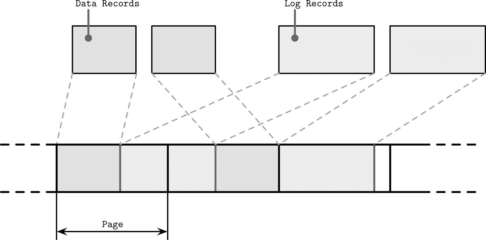

###### 图 7-16\. 不对齐的多流写入

这导致了我们试图避免的碎片化。为了减少交错，一些数据库供应商建议将日志保存在单独的设备上，以隔离工作负载并独立地分析其性能和访问模式。然而，保持分区与底层硬件对齐[[INTEL14]](app01.html#INTEL14)，并将写操作与页面大小对齐[[KIM12]](app01.html#KIM12)更为重要。

# LLAMA 与专注堆叠

> 嗯，你绝对不会相信，但你眼前那只羊驼曾经是一个人类。而且不仅仅是普通人。那家伙曾是一位皇帝。一个富有、强大而充满魅力的家伙。
> 
> 库兹科（*The Emperor’s New Groove*）

在“Bw-Trees”章节中，我们讨论了一种名为 Bw-Tree 的不可变 B-Tree 版本。Bw-Tree 建立在一个*无锁、日志结构化、访问方法感知*（LLAMA）存储子系统之上。这种分层允许 Bw-Tree 在动态增长和收缩，同时保持垃圾收集和页面管理对树透明。这里，我们最感兴趣的是*访问方法感知*的部分，展示了软件层之间协同的好处。

总结一下，*逻辑* Bw-Tree 节点由*物理*增量节点的链表组成，从最新到最旧的更新链，最终以基本节点结束。逻辑节点使用内存中的映射表链接，指向磁盘上最新更新的位置。键和值被添加到逻辑节点并从中移除，但它们的物理表示保持不变。

日志结构化存储将节点更新（增量节点）一起缓冲在 4 Mb 的刷新缓冲区中。一旦页面填满，就会被刷新到磁盘上。定期进行垃圾回收，回收未使用的增量和基本节点占用的空间，并将活跃节点重新定位以释放碎片化页面。

没有访问方法感知，属于不同逻辑节点的交错增量节点将按照它们的插入顺序写入。LLAMA 中的 Bw-Tree 意识允许将几个增量节点合并到单个连续的物理位置。如果两个增量节点的更新*互相取消*（例如插入后跟随删除），它们的*逻辑*合并也可以执行，只有后者的删除可以被持久化。

LSS 垃圾收集还可以处理整理逻辑 Bw-Tree 节点内容。这意味着垃圾收集不仅会回收空闲空间，还会显著减少物理节点的碎片化。如果垃圾收集只重写连续的几个增量节点，它们仍将占用相同的空间，并且读者需要执行应用增量更新到基本节点的工作。与此同时，如果高级系统整理节点并将它们连续写入新位置，LSS 将*仍然*需要垃圾收集旧版本。

通过了解 Bw-Tree 的语义，几个增量可以在垃圾收集期间重写为已应用所有增量的单个基本节点。这减少了表示此 Bw-Tree 节点所使用的总空间以及读取页面时所需的延迟，同时回收被丢弃页面占用的空间。

仔细考虑后，您会发现堆叠可以带来许多好处。不必总是构建紧密耦合的单层结构。良好的 API 和适当的信息公开可以显著提高效率。

## 开放通道 SSD

跳过所有间接层并直接使用硬件是堆叠软件层的一种替代方法。例如，通过为开放通道 SSD 开发，可以避免使用文件系统和闪存转换层。这样，我们至少可以避免两层日志，并对磨损均衡、垃圾收集、数据放置和调度有更多控制。采用这种方法的实现之一是基于 LSM Tree 的开放通道 SSD 的 KV 存储 LOCS [[WANG13]](app01.html#WANG13)。另一个使用开放通道 SSD 的示例是在 Linux 内核中实现的 LightNVM [[BJØRLING17]](app01.html#BJØRLING17)。

闪存转换层通常处理数据放置、垃圾收集和页面重定位。开放通道 SSD 公开其内部结构、驱动管理和 I/O 调度，无需经过 FTL。尽管从开发者的角度来看，这显然需要更多的细节关注，但这种方法可能带来显著的性能提升。您可以将其与使用 `O_DIRECT` 标志绕过内核页缓存进行类比，这提供了更好的控制，但需要手动管理页面。

软件定义的闪存（SDF）[[OUYANG14]](app01.html#OUYANG14)，一种硬件/软件共设计的开放通道 SSD 系统，公开了考虑 SSD 具体情况的不对称 I/O 接口。读写单元的大小不同，写单元大小对应擦除单元大小（块），大大减少了写放大。这种设置非常适合日志结构化存储，因为只有一个软件层执行垃圾收集和重定位页面。此外，开发人员可以访问内部 SSD 的并行性，因为 SDF 中的每个通道都公开为单独的块设备，可用于进一步提高性能。

将复杂性隐藏在简单的 API 背后可能听起来很吸引人，但在软件层具有不同语义的情况下可能会引起复杂性。公开部分底层系统内部可能有助于更好地集成。

# 摘要

*日志结构化存储* 随处可见：从闪存转换层到文件系统和数据库系统。它通过批处理内存中的小随机写入来减少写放大。为了回收已删除段占用的空间，LSS 定期触发垃圾收集。

*LSM 树*借鉴了一些 LSS 的思想，帮助构建以日志结构方式管理的索引结构：写入在内存中批处理并在磁盘上刷新；在压实过程中清理影子数据记录。

记住，许多软件层使用**LSS**，确保层次堆叠优化。或者，我们可以完全跳过文件系统层，直接访问硬件。
