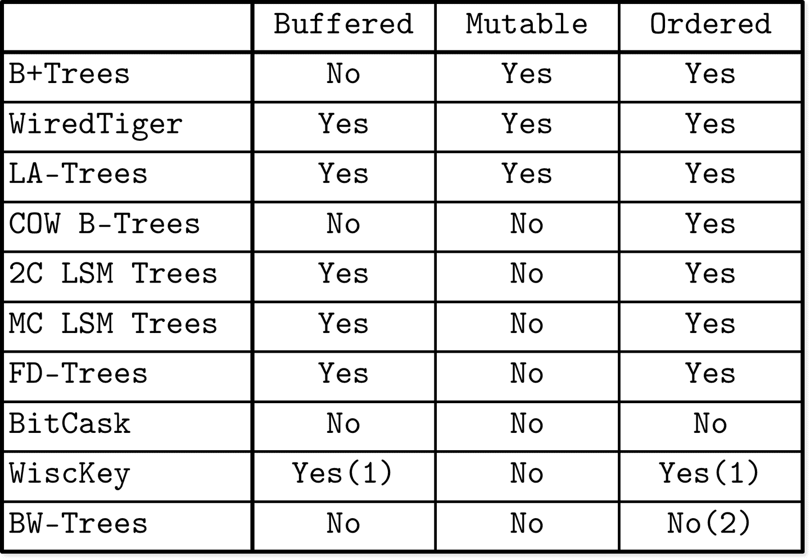

# 第一部分总结

在第 I 部分，我们讨论了存储引擎。我们从高级数据库系统架构和分类开始，学习了如何在磁盘上实现存储结构，并了解它们如何与其他组件完美配合。

我们看到了几种存储结构，从 B-树开始。讨论的结构并不代表整个领域，还有许多其他有趣的发展。然而，这些示例仍然很好地说明了我们在本部分开始时确定的三个属性：*缓冲*、*不可变性*和*排序*。这些属性有助于描述、记忆和表达存储结构的不同方面。

图 I-1 总结了讨论过的存储结构，并显示它们是否使用了这些属性。

添加内存缓冲区始终对减少写放大有积极影响。在像 WiredTiger 和 LA-Trees 这样的原地更新结构中，内存缓冲有助于通过合并多个同页写操作来摊销成本。换句话说，缓冲有助于减少写放大。

在不可变结构中，例如多组件 LSM 树和 FD-树，缓冲也具有类似的积极影响，但会导致将数据从一个不可变级别移动到另一个级别时未来重写的成本。换句话说，使用不可变性可能会导致延迟写放大。同时，使用不可变性对并发性和空间放大有积极影响，因为大多数讨论过的不可变结构使用完全占用的页面。

当使用不可变性时，除非我们*同时*使用缓冲，否则我们最终得到的是像 Bitcask 和 WiscKey 这样的无序存储结构（除了写时复制的 B-树，它会复制、重新排序和重新定位它们的页）。WiscKey 仅在排序的 LSM 树中存储*键*，并允许使用键索引按键顺序检索记录。在 Bw-树中，*某些*节点（已经合并的节点）按键顺序保存数据记录，而逻辑 Bw-树的其余节点可能在不同页上散布它们的增量更新。

###### 图 I-1。讨论的存储结构的缓冲、不可变性和排序属性。（1）WiscKey 仅用于保持键的排序顺序的缓冲。 （2）在 Bw-树中，仅合并的节点保存有序记录。

您可以看到，这三个属性可以混合搭配以实现所需的特性。不幸的是，存储引擎设计通常涉及权衡：您增加一种操作的成本，以换取另一种操作的优势。

利用这些知识，您应该能够更仔细地查看大多数现代数据库系统的代码。书中可以找到一些代码引用和起始点。了解和理解术语将使这一过程对您更加容易。

许多现代数据库系统采用概率数据结构 [[FLAJOLET12]](app01.html#FLAJOLET12) [[CORMODE04]](app01.html#CORMODE04)，并且正在将机器学习的思想引入数据库系统中进行新的研究 [[KRASKA18]](app01.html#KRASKA18)。随着非易失性和字节可寻址存储变得更加普及和广泛可用，我们将会看到研究和产业进一步发生变化 [[VENKATARAMAN11]](app01.html#VENKATARAMAN11)。

了解本书描述的基本概念应该有助于你理解和实施新的研究，因为它借鉴、构建和受到相同概念的启发。了解理论和历史的主要优势在于，并没有完全新的东西，正如本书的叙述所示，进步是逐步的。
