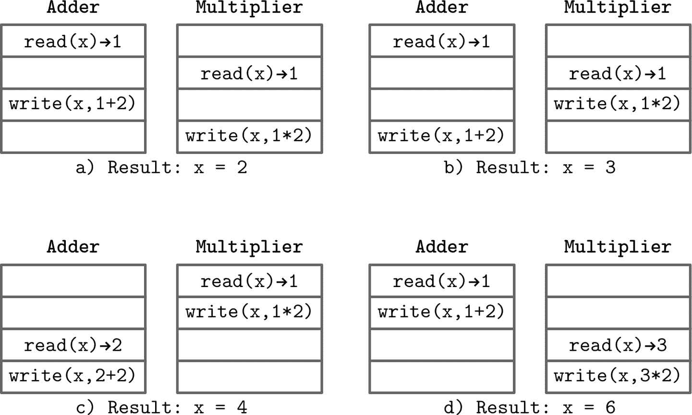
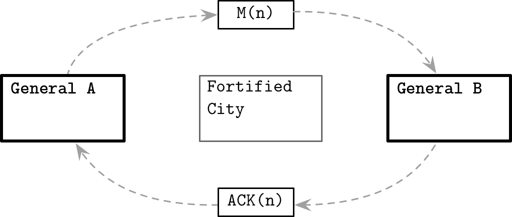

# 第八章：介绍和概述

什么使分布式系统本质上不同于单节点系统？让我们看一个简单的例子并尝试理解。在单线程程序中，我们定义变量和执行过程（一系列步骤）。

例如，我们可以定义一个变量，并对其执行简单的算术操作：

```
int x = 1;
x += 2;
x *= 2;
```

我们有一个单一的执行历史：我们声明一个变量，将其增加两倍，然后乘以两倍，并得到结果：`6`。假设我们不是一个执行线程执行这些操作，而是两个具有对变量 `x` 的读写访问权限的线程。

# 并发执行

一旦允许两个执行线程访问变量，除非在线程之间同步步骤，否则并发步骤执行的确切结果是不可预测的。我们不再有单一可能的结果，如图 8-1 所示，我们得到四种结果。^(1)



###### 图 8-1。并发执行的可能交错

+   a) x = 2，如果两个线程都读取初始值，加法器写入其值，但它会被乘法结果覆盖。

+   b) x = 3，如果两个线程都读取初始值，乘法器写入其值，但它会被加法结果覆盖。

+   c) x = 4，如果乘法器可以读取初始值并在加法器开始之前执行其操作。

+   d) x = 6，如果加法器可以读取初始值并在乘法器开始之前执行其操作。

即使在我们可以跨越单个节点边界之前，我们就遇到了分布式系统的第一个问题：*并发性*。每个并发程序都具有一些分布式系统的特性。线程访问共享状态，本地执行某些操作，并将结果传播回共享变量。

要精确定义执行历史并减少可能的结果数量，我们需要*一致性模型*。一致性模型描述并发执行，并建立操作的顺序，使其对参与者可见。使用不同的一致性模型，我们可以限制或放宽系统可能处于的状态数量。

在分布式系统和并发计算领域，术语和研究存在很多重叠，但也存在一些差异。在并发系统中，我们可以有*共享内存*，处理器可以用它来交换信息。在分布式系统中，每个处理器有其本地状态，并通过传递消息来进行通信。

## 分布式系统中的共享状态

我们可以尝试向分布式系统引入一些共享内存的概念，例如单一的信息源，如数据库。即使解决了对其的并发访问问题，我们仍无法保证所有进程同步。

要访问此数据库，进程必须通过发送和接收消息来查询或修改状态来通过通信介质。但如果其中一个进程长时间未收到来自数据库的响应会发生什么？要回答这个问题，我们首先必须定义*长时间*是什么意思。为此，系统必须根据*同步性*来描述：通信是否完全异步，或者是否存在某些时间假设。这些时间假设允许我们引入操作超时和重试。

我们不知道数据库未响应是因为它过载、不可用、或者因为在通往它的网络上出现了一些问题。这描述了崩溃的*性质*：进程可能因未能参与进一步的算法步骤、出现临时故障或省略一些消息而崩溃。在决定如何处理它们之前，我们需要定义一个*故障模型*并描述故障可能发生的方式。

描述系统可靠性及其在故障存在情况下是否能够继续正确运行的属性称为*容错性*。故障是不可避免的，因此我们需要构建具有可靠组件的系统，并消除以前述的单节点数据库形式存在的单点故障可能是迈向此方向的第一步。我们可以通过引入一些*冗余性*并添加备份数据库来实现这一点。然而，现在我们面临一个不同的问题：如何保持*多个副本*的共享状态同步？

到目前为止，试图向我们简单的系统引入共享状态留下了更多问题而非答案。我们现在知道，共享状态并不像仅仅引入数据库那样简单，我们必须采取更细粒度的方法，并以独立进程和它们之间的消息传递来描述交互。

# 分布式计算的谬论

在理想情况下，当两台计算机通过网络交流时，一切都运行得很顺利：一个进程打开连接，发送数据，得到响应，每个人都很高兴。假设操作总是成功且没有任何问题是危险的，因为当某些事情出错并且我们的假设被证明是错误的时候，系统会表现出难以预测或不可能预测的方式。

大多数情况下，假设*网络可靠*是合理的做法。它必须至少在某种程度上可靠才能有用。我们都曾经遇到过尝试连接远程服务器却收到`Network is Unreachable`错误的情况。但即使能建立连接，成功的*初始*连接到服务器也不能保证链接稳定，连接随时可能会中断。消息可能已经到达远程方，但响应可能已经丢失，或者在响应传递之前连接已中断。

Network switches break, cables get disconnected, and network configurations can change at any time. We should build our system by handling all of these scenarios gracefully.

A connection can be stable, but we can’t expect remote calls to be as fast as the local ones. We should make as few assumptions about latency as possible and never assume that *latency is zero*. For our message to reach a remote server, it has to go through several software layers, and a physical medium such as optic fiber or a cable. All of these operations are not instantaneous.

Michael Lewis, in his [*Flash Boys*](https://www.simonandschuster.com/books/Flash-Boys/Michael-Lewis/9781442370289) book (Simon and Schuster), tells a story about companies spending millions of dollars to reduce latency by several milliseconds to able to access stock exchanges faster than the competition. This is a great example of using latency as a competitive advantage, but it’s worth mentioning that, according to some other studies, such as [[BARTLETT16]](app01.html#BARTLETT16), the chance of stale-quote arbitrage (the ability to profit from being able to know prices and execute orders faster than the competition) doesn’t give fast traders the ability to exploit markets.

Learning our lessons, we’ve added retries, reconnects, and removed the assumptions about instantaneous execution, but this still turns out not to be enough. When increasing the number, rates, and sizes of exchanged messages, or adding new processes to the existing network, we should not assume that *bandwidth is infinite*.

###### Note

In 1994, Peter Deutsch published a now-famous list of assertions, titled “Fallacies of distributed computing,” describing the aspects of distributed computing that are easy to overlook. In addition to network reliability, latency, and bandwidth assumptions, he describes some other problems. For example, network security, the possible presence of adversarial parties, intentional and unintentional topology changes that can break our assumptions about presence and location of specific resources, transport costs in terms of both time and resources, and, finally, the existence of a single authority having knowledge and control over the entire network.

Deutsch's list of distributed computing fallacies is pretty exhaustive, but it focuses on what can go wrong when we send messages from one process to another through the link. These concerns are valid and describe the most general and low-level complications, but unfortunately, there are many other assumptions we make about the distributed systems while designing and implementing them that can cause problems when operating them.

## Processing

Before a remote process can send a response to the message it just received, it needs to perform some work locally, so we cannot assume that *processing is instantaneous*. Taking network latency into consideration is not enough, as operations performed by the remote processes aren’t immediate, either.

此外，并没有保证消息传递后立即开始处理。消息可能会落入远程服务器的待处理队列中，并且必须等待，直到它之前到达的所有消息都被处理完毕。

节点可以彼此距离较近或较远，拥有不同的 CPU、内存量、不同的磁盘或运行不同软件版本和配置。我们不能指望它们以相同的速率处理请求。如果我们必须等待几个远程服务器并行工作才能完成任务，那么整体执行速度将取决于最慢的远程服务器。

与普遍看法相反，*队列容量并非无限*，堆积更多请求对系统没有好处。*反压力*是一种策略，允许我们应对生产者发布消息速度快于消费者处理速度的情况，通过减慢生产者的速度。反压力是分布式系统中最不被重视和应用的概念之一，通常事后构建，而非系统设计的一部分。

即使增加队列容量听起来像个好主意，并且有助于管道化、并行化和有效地安排请求，但在消息在队列中等待它们的轮到时，什么也没发生。增加队列大小可能会对延迟产生负面影响，因为更改它对处理速率没有影响。

一般来说，使用过程本地队列可以实现以下目标：

解耦

接收和处理在时间上是分开的，独立进行。

管道化

不同阶段的请求由系统的独立部分处理。负责接收消息的子系统无需在前一条消息完全处理完成之前阻塞。

吸收短时爆发

系统负载倾向于变化，但请求到达时间对于负责请求处理的组件是隐藏的。由于在队列中花费的时间，整体系统延迟增加，但通常这仍比响应失败并重试请求要好。

队列大小与工作负载和应用程序特定相关。对于相对稳定的工作负载，我们可以通过测量任务处理时间和每个任务在被处理前在队列中等待的平均时间来确定队列大小，并确保延迟保持在可接受的范围内，同时增加吞吐量。在这种情况下，队列大小相对较小。对于不可预测的工作负载，当任务突发提交时，队列大小应考虑到突发和高负载。

远程服务器可以快速处理请求，但并不意味着我们总能从中得到积极的响应。它也可能以失败的方式响应：无法进行写操作、未找到搜索的值，或者可能遇到了错误。总结而言，即使是最有利的场景，仍然需要我们的一些关注。

## 时钟与时间

> 时间是一个幻觉。午餐时间则更加如此。
> 
> 福特·普雷菲克，《银河系漫游指南》

假设远程机器上的时钟同步运行也可能存在风险。结合*延迟为零*和*处理瞬时*，特别是在时间序列和实时数据处理中，会导致不同的怪异行为。例如，在收集和聚合具有不同时间感知的参与者数据时，应理解它们之间的时间漂移，并相应地规范化时间，而不是依赖源时间戳。除非使用专门的高精度时间源，否则不应依赖时间戳进行同步或排序。当然，这并不意味着我们不能或不应该完全依赖时间：最终，任何同步系统都使用*本地*时钟进行超时。

总是要考虑进程之间可能的时间差异以及消息传递和处理所需的时间。例如，Spanner（参见“使用 Spanner 进行分布式事务”）使用一个特殊的时间 API 返回时间戳和不确定性边界，以强制实施严格的事务顺序。一些故障检测算法依赖于共享时间观念，并保证时钟漂移始终在允许的边界内以确保正确性 [[GUPTA01]](app01.html#GUPTA01)。

除了分布式系统中的时钟同步难题外，*当前*时间不断变化：您可以从操作系统请求当前的 POSIX 时间戳，并在执行几个步骤后请求另一个*当前*时间戳，两者将不同。这是一个相当明显的观察，但理解时间源和时间戳捕获的确切时刻都至关重要。

理解时钟源是否单调（即不会后退）以及计划的时间相关操作可能漂移多少也是有帮助的。

## 状态一致性

大多数先前的假设属于*几乎总是错误*的范畴，但也有一些更好地描述为*并非总是正确*：当很容易采取心理捷径并简化模型，忽略一些棘手的边界情况时。

分布式算法并不总是保证严格的状态一致性。一些方法具有较宽松的约束条件，并允许副本之间的状态偏离，并依赖于*冲突解决*（在系统内检测和解决偏离状态的能力）和*读时数据修复*（在读取时将副本重新同步，以避免它们返回不同结果）。您可以在第十二章中找到关于这些概念的更多信息。假设节点间的状态完全一致可能导致微妙的错误。

一个最终一致的分布式数据库系统可以通过查询读取时的节点法定人数来处理副本不一致问题，但是假设数据库模式和集群视图是强一致的。除非我们强制执行此信息的一致性，否则依赖这一假设可能会产生严重后果。

例如，[Apache Cassandra 中存在一个 bug](https://databass.dev/links/46)，其原因是模式更改在不同服务器上的传播时间不同步。如果在模式传播时尝试从数据库读取数据，则可能会导致数据损坏，因为一个服务器根据一种模式编码结果，而另一个服务器则使用不同的模式解码。

另一个例子是由于[环的不同视角造成的 bug](https://databass.dev/links/47)：如果一个节点假设另一个节点持有某个键的数据记录，但是这个另一个节点对集群的视图不同，读取或写入数据可能会导致数据记录错误放置或在数据记录实际存在于另一个节点时获取空响应。

提前考虑可能存在的问题更为明智，即使实施完整解决方案成本高昂。通过理解和处理这些情况，您可以嵌入保障措施或者调整设计，使解决方案更为自然。

## 本地和远程执行

通过 API 隐藏复杂性可能具有危险性。例如，如果您拥有对本地数据集的迭代器，即使存储引擎不熟悉，您也可以合理预测背后的工作。然而，理解迭代远程数据集的过程完全是另一个问题：您需要理解一致性和交付语义、数据协调、分页、合并、并发访问影响以及许多其他内容。

然而，尽管其用处显著，仅通过相同接口隐藏这两种方式可能具有误导性。可能需要额外的 API 参数来进行调试、配置和可观察性。我们始终要记住：*本地和远程执行不同* [[WALDO96]](app01.html#WALDO96)。

隐藏远程调用最明显的问题是延迟：远程调用的成本远高于本地调用，因为它涉及双向网络传输、序列化/反序列化以及许多其他步骤。交错本地和阻塞远程调用可能会导致性能下降和意外副作用 [[VINOSKI08]](app01.html#VINOSKI08)。

## 需要处理故障

假设系统中所有节点正常运行，可以开始工作，但长期以来一直这样认为是危险的。在长时间运行的系统中，节点可能因维护（通常包括优雅关闭）或因各种原因（如软件问题、内存耗尽杀手[[KERRISK10]](app01.html#KERRISK10)、运行时错误、硬件问题等）而宕机。进程确实会失败，而你能做的最好的事情就是为故障做好准备，并了解如何处理它们。

如果远程服务器未响应，我们并不总是知道其确切原因。可能是由于崩溃、网络故障、远程进程或与其连接的链路速度慢等原因。一些分布式算法使用*心跳协议*和*故障检测器*来形成关于哪些参与者是活着且可达的假设。

## 网络分区和部分故障

当两个或更多服务器无法相互通信时，我们称这种情况为*网络分区*。在《CAP 定理的视角》[[GILBERT12]](app01.html#GILBERT12)中，塞斯·吉尔伯特和南希·林奇区分了两个参与者无法相互通信的情况和多个参与者组隔离无法交换消息并继续执行算法的情况。

网络的普遍不可靠性（丢包、重传、难以预测的延迟）*令人烦恼但可以容忍*，而网络分区可能会引起更大的麻烦，因为独立的组可以继续执行并产生冲突的结果。网络链路也可能出现不对称的故障：消息可能仍在从一个进程传递到另一个进程，但反之则不然。

要构建一个在一个或多个进程失败时仍能稳健运行的系统，我们必须考虑*部分故障*的情况[[TANENBAUM06]](app01.html#TANENBAUM06)，以及系统如何在其一部分不可用或功能不正确的情况下继续运行。

故障很难检测，并且不同系统部分的可见性方式并不总是相同。在设计高可用性系统时，应始终考虑边缘情况：如果我们复制了数据但未收到确认，怎么办？我们是否需要重试？发送确认的节点上的数据是否仍然可供读取？

墨菲定律^(2)告诉我们故障确实会发生。编程传说补充说，故障总是以最糟糕的方式发生，因此我们作为分布式系统工程师的工作是确保减少事情出错的情景，并以能够控制其可能造成的损害的方式准备好应对故障。

不可能预防所有故障，但我们仍然可以构建一个在其存在时仍能正常运行的弹性系统。设计应对故障的最佳方法是对其进行测试。几乎不可能思考每种可能的故障场景并预测多个进程的行为。设置能够创建分区、模拟位烂（GRAY05）、增加延迟、偏离时钟和放大相对处理速度的测试框架是最好的方法。现实世界中的分布式系统设置可能非常对抗、不友好，以及以一种非常敌对的方式“创造性地”，因此测试工作应尽可能涵盖尽可能多的场景。

###### 提示

在过去几年中，我们看到了一些开源项目，帮助重新创建不同的故障场景。[Toxiproxy](https://databass.dev/links/48) 可以帮助模拟网络问题：限制带宽、引入延迟、超时等等。[Chaos Monkey](https://databass.dev/links/49) 采取更激进的方法，通过随机关闭服务来暴露工程师面对生产故障的情况。[CharybdeFS](https://databass.dev/links/50) 帮助模拟文件系统和硬件错误和故障。你可以使用这些工具来测试你的软件，并确保它在这些故障存在的情况下表现正确。[CrashMonkey](https://databass.dev/links/122)，一个与文件系统无关的记录-重播-测试框架，帮助测试持久文件的数据和元数据一致性。

在处理分布式系统时，我们必须认真对待容错性、弹性、可能的故障场景和边缘案例。类似于[“足够多的眼睛，所有的错误都是肤浅的”](https://databass.dev/links/51)，我们可以说足够大的集群最终会遇到每一个可能的问题。同时，通过充分的测试，我们最终将能够发现每一个现有的问题。

## 级联故障

我们不能总是完全隔离故障：在高负载下，一个进程的翻车会增加集群其余部分的负载，使其他节点失败的可能性更大。*级联故障* 可以从系统的一部分传播到另一部分，扩大问题的范围。

有时，级联故障甚至可能由完全良好的意图引发。例如，某个节点长时间离线，未能接收到最新的更新。在它重新上线后，帮助的同行希望帮助它赶上最近发生的事情，并开始向其流送它缺失的数据，耗尽网络资源或导致节点在启动后不久失败。

###### 提示

为了保护系统免受故障传播，并优雅地处理故障场景，可以使用*断路器*。在电气工程中，断路器通过中断电流流动来保护昂贵且难以替换的部件，防止过载或短路。在软件开发中，断路器监视故障，并允许回退机制，可以通过避开失败服务来保护系统，给予其恢复的时间，并优雅地处理失败调用。

当与服务器之一的连接失败或服务器未响应时，客户端启动重新连接循环。到那时，超载的服务器已经很难跟上新的连接请求，客户端在紧密循环中的重试并不会改善情况。为了避免这种情况，我们可以使用*退避*策略。客户端不会立即重试，而是等待一段时间。退避可以通过安排重试和增加后续请求之间的时间窗口来帮助我们避免放大问题。

退避用于增加单个客户端请求之间的时间间隔。然而，使用相同退避策略的不同客户端也可能产生相当大的负载。为了防止*不同*客户端在退避期结束后同时重试，我们可以引入*抖动*。抖动会在退避期间添加小的随机时间段，减少客户端同时唤醒并重试的概率。

硬件故障、位腐败和软件错误可能导致数据损坏，并通过标准传输机制传播。例如，如果未经验证的损坏数据记录会被复制到其他节点。如果没有验证机制，系统可能会将损坏的数据传播到其他节点，可能覆盖非损坏的数据记录。为了避免这种情况，我们应该使用校验和验证来验证节点之间交换的任何内容的完整性。

过载和热点问题可以通过计划和协调执行来避免。与其让对等方独立执行操作步骤，我们可以使用协调器，它根据可用资源制定执行计划，并根据过去的执行数据预测负载。

总之，我们应该始终考虑系统中一个部分的故障可能会导致其他地方的问题。我们应该为我们的系统配备断路器、退避、验证和协调机制。处理小的孤立问题总比试图从大规模停机中恢复要简单得多。

我们刚刚花了整个部分讨论分布式系统中的问题和潜在故障场景，但我们应该把这看作是一个警告，而不是应该吓退我们的东西。

理解可能出现的问题，并仔细设计和测试我们的系统，使其更加健壮和有韧性。意识到这些问题可以帮助您在开发过程中识别和找到潜在的问题源，并在生产环境中进行调试。

# 分布式系统抽象

在谈论编程语言时，我们使用常见的术语，并根据函数、操作符、类、变量和指针来定义我们的程序。拥有共同的词汇有助于我们避免每次描述任何事物时都发明新词汇。我们的定义越精确和少含糊，听众理解起来就越容易。

在我们转向算法之前，我们首先要掌握分布式系统的词汇：您在演讲、书籍和论文中经常会遇到的定义。

## 链接

网络不可靠：消息可能会丢失、延迟和重新排序。现在，有了这个想法，我们将尝试构建几个通信协议。我们将从最不可靠和最健壮的开始，确定它们可能处于的状态，并找出可以为协议提供更好保证的可能附加内容。

### 公平丢失链接

我们可以从两个*进程*开始，它们通过一个*链接*连接。进程可以向彼此发送消息，如图 8-2 所示。任何通信媒介都不完美，消息可能会丢失或延迟。

让我们看看我们能得到什么样的保证。在消息`M`被发送之后，从发送者的角度来看，它可以处于以下状态之一：

+   尚未*被*交付给进程`B`（但最终会）

+   在传输过程中无法恢复地丢失

+   成功交付到远程进程


###### 图 8-2\. 最简单的、不可靠的通信形式

注意发送者无法知道消息是否已经被交付。在分布式系统术语中，这种类型的链接称为*公平丢失*。这种链接的属性包括：

公平丢失

如果发送者和接收者都正确，并且发送者持续无限次地重新传输消息，最终消息将会被交付。^(3)

有限复制

发送的消息不会无限多次被传送。

无创建

链接不会制造消息；换句话说，它不会传递从未发送过的消息。

公平丢失链接是通信协议的有用抽象和第一个构建块，具有强大的保证。我们可以假设在通信各方之间不会*系统地*丢失消息，也不会创建新消息。但同时，我们不能完全依赖它。这可能会让你想起[用户数据报协议 (UDP)](https://databass.dev/links/52)，它允许我们从一个进程向另一个进程发送消息，但在协议级别上没有可靠的交付语义。

### 消息确认

为了改善情况并在消息状态方面获得更多的清晰度，我们可以引入*确认*：这是接收方通知发送方已收到消息的一种方式。为此，我们需要使用双向通信渠道，并添加一些允许我们区分消息差异的手段；例如，*序列号*，这些是唯一单调递增的消息标识符。

###### 注意

每条消息只需要一个*唯一*标识符就足够了。序列号只是唯一标识符的一个特例，我们通过计数器来确保唯一性。当使用哈希算法来唯一标识消息时，我们应该考虑可能的碰撞，并确保我们仍然可以消除歧义。

现在，进程 `A` 可以发送消息 `M(n)`，其中 `n` 是单调递增的消息计数器。一旦 `B` 接收到消息，它会向 `A` 发送一个确认 `ACK(n)`。图 8-3 展示了这种通信形式。


###### 图 8-3\. 发送带确认的消息

确认以及原始消息可能在传输途中丢失。消息可能处于的状态数量略有变化。直到 `A` 收到确认，消息仍然处于我们之前提到的三种状态之一，但是一旦 `A` 收到确认，它可以确信消息已经传递给了 `B`。

### 消息重传

即使添加了确认*仍然*不足以称此通信协议为可靠：发送的消息仍然可能丢失，或者远程进程在确认之前可能会失败。为了解决这个问题并提供传递保证，我们可以尝试使用*重传*。重传是发送方重新尝试可能失败的操作的一种方式。我们说可能失败，是因为发送方并不真正知道是否已经失败，因为我们即将讨论的链路类型*不*使用确认。

在进程 `A` 发送消息 `M` 后，它会等待直到触发超时 `T` 并尝试重新发送相同的消息。假设进程之间的链路保持完好，进程之间的网络分区不是无限的，并且并非所有的*包*都丢失，我们可以说从发送方的角度来看，消息要么尚未成功传递给进程 `B`，要么已成功传递给进程 `B`。由于 `A` 一直在尝试发送消息，我们可以说在传输过程中它是*不可能*会不可恢复地丢失的。

在分布式系统术语中，这种抽象被称为*顽固链路*。它被称为顽固，因为发送者会一遍又一遍地无限重发消息，但是，由于这种抽象实际上是不切实际的，我们需要将重试与确认结合起来。

### 重传问题

每当我们发送消息时，直到收到远程进程的确认，我们都不知道消息是否已经处理，即将处理，已经丢失，还是在接收之前远程进程崩溃了——这些状态都有可能发生。我们可以重试操作并重新发送消息，但这可能导致消息重复。只有在我们即将执行的操作是幂等的情况下，处理重复消息才是安全的。

*幂等* 操作是可以多次执行并产生相同结果而不产生额外副作用的操作。例如，服务器关机操作可以是幂等的，第一次调用启动关机，所有后续调用都不会产生任何额外效果。

如果每个操作都是幂等的，我们可以少考虑传递语义，更多依赖于重传来实现容错，并完全以反应性方式构建系统：响应某些信号触发操作，而不引起意外副作用。然而，并非所有操作都是幂等的，仅仅假设它们是幂等的可能导致集群范围的副作用。例如，向客户信用卡扣款并不是幂等的，多次扣款绝对是不可取的。

在部分故障和网络分区存在的情况下，幂等性尤为重要，因为我们不能始终了解远程操作的确切状态——它是否成功，失败或即将执行——我们只能等待更长时间。由于保证每个执行的操作都是幂等的是一个不切实际的要求，我们需要提供与幂等性等效的保证，而不改变底层操作语义。为了实现这一点，我们可以使用*去重*并避免处理多次消息。

### 消息顺序

不可靠的网络给我们带来了两个问题：消息可能无序到达，并且由于重传，某些消息可能会多次到达。我们已经引入了序列号，可以在接收端使用这些消息标识符来确保先进先出（FIFO）排序。由于每条消息都有一个序列号，接收者可以跟踪：

+   `n[consecutive]`，指定最高序列号，直到它已经看到所有消息。可以按顺序重新排列直到此数字。

+   `n[processed]`，指定最高序列号，直到这些消息按其原始顺序被*处理*。此数字可用于去重。

如果接收到的消息具有非连续的序列号，则接收方将其放入重新排序缓冲区。例如，接收到序列号为`5`的消息后，又接收到序列号为`3`的消息，我们知道`4`仍然缺失，因此需要将`5`放置一旁，直到`4`到来，我们才能重建消息顺序。由于我们正在建立在公平丢失链路的基础上，我们假设在`n[consecutive]`和`n[max_seen]`之间的消息最终将被传递。

收件人可以安全地丢弃其接收到的序列号高达`n[consecutive]`的消息，因为可以保证它们已经被传递。

去重工作通过检查带有序号`n`的消息是否已经*处理*（由接收方通过堆栈传递）并且丢弃已处理的消息。

从分布式系统术语来看，这种类型的链路被称为*完美链路*，提供以下保证[[CACHIN11]](app01.html#CACHIN11)：

可靠交付

每个由正确进程`A`发送到正确进程`B`的消息*最终*会被传递。

无重复

没有消息会被传递超过一次。

无创建

与其他类型的链路一样，它只能传递实际发送的消息。

这可能会让您想起 TCP^(4)协议（但是，TCP 中的可靠交付仅在单个会话范围内保证）。当然，这个模型只是我们用来说明的简化表示。TCP 具有更复杂的模型来处理确认，包括分组确认和减少协议级别的开销。此外，TCP 还有选择确认、流量控制、拥塞控制、错误检测和许多其他超出我们讨论范围的功能。

### 精确一次交付

> 分布式系统中只有两个难题：2\. 精确一次交付 1\. 消息的保证顺序 2\. 精确一次交付。
> 
> Mathias Verraes

关于*精确一次交付*是否可能，有许多讨论。在这里，语义和准确的措辞非常重要。由于可能存在链路故障导致消息无法在第一次尝试时被传递，大多数现实世界的系统采用*至少一次交付*，这确保发送者重试直到接收到确认，否则消息不被视为已接收。另一个交付语义是*至多一次*：发送者发送消息并不期望任何交付确认。

TCP 协议通过将消息分解为数据包，逐个传输它们，然后在接收端将它们拼接在一起来工作。TCP 可能会尝试重新传输一些数据包，而且可能会成功多次传输。由于 TCP 为每个数据包标记了一个序列号，即使某些数据包被传输多次，它也可以对数据包进行去重，并保证接收方只会看到消息并且*处理*一次。在 TCP 中，这种保证仅适用于*单个会话*：如果消息被确认并处理，但发送方在连接中断之前没有收到确认，应用程序将不知道此传递，并且根据其逻辑，可能会尝试再次发送消息。

这意味着这里有趣的是仅一次*处理*，因为重复的*传递*（或数据包传输）没有副作用，仅仅是链路的尽力而为的产物。例如，如果数据库节点仅*接收*了记录，但尚未*持久化*它，传递已经发生，但除非记录可以被检索（换句话说，除非它已经被传递并处理），否则它将毫无用处。

要保证仅一次传递，节点应该具有*共同知识*[[HALPERN90]](app01.html#HALPERN90)：每个人都知道某个事实，每个人都知道其他每个人也知道那个事实。简化来说，节点必须就记录的状态达成一致：两个节点都同意它要么*已经*被持久化，要么*没有*被持久化。正如您将在本章后面看到的，这在理论上是不可能的，但在实践中，我们仍然通过放宽协调要求来使用这个概念。

任何关于是否可能实现仅一次传递的误解很可能来自于从不同的协议和抽象级别以及“传递”的定义来解决问题。没有办法建立一个可靠的链路而不会多次传输任何消息，但我们可以通过*处理*一次消息并忽略重复来从发送方的角度创造仅一次传递的幻觉。

现在，既然我们已经建立了可靠通信的手段，我们可以继续前进，寻找在分布式系统中实现一致性和协议之间的方法。

# 两将军问题

在分布式系统中，最突出的协议描述之一是一个被广泛称为*两将军问题*的思想实验。

这个思想实验表明，在存在链路故障的情况下，如果通信是*异步*的，那么两方之间不可能达成一致。即使 TCP 具有完美链路的特性，重要的是要记住，完美链路并不保证*完美*传递。它们也不能保证参与者始终存活，并且仅关注传输。

想象两支由两位将军领导的军队准备攻击一个设防城市。这两支军队位于城市的两侧，只有同时发起攻击才能成功围攻。

将军们可以通过发送信使来进行通信，并且已经制定了攻击计划。现在他们唯一需要达成一致的是是否执行这个计划。这个问题的变体是其中一个将军有更高的级别，但需要确保攻击是协调的；或者将军们需要就确切的时间达成一致。这些细节不会改变问题的定义：将军们必须达成一致。

军队将军们只需就是否继续进攻达成一致意见。否则，攻击就不可能成功。将军`A`发送了一个消息`MSG(N)`，声明在指定时间内打算发起攻击，*如果*另一方也同意继续。

在`A`发送信使之后，他不知道信使是否已经到达：信使可能会被截获并未能递送消息。当将军`B`接收到消息时，他必须发送一个确认`ACK(MSG(N))`。图 8-4 显示了单向发送消息并由另一方确认的过程。



###### 图 8-4\. 描述的两将军问题

携带这个确认的信使可能会被截获或未能递送。`B`无法知道信使是否成功交付了确认。

为了确信，`B`必须等待`ACK(ACK(MSG(N)))`，即表明`A`已收到确认的二次确认。

无论将军们彼此发送多少进一步的确认，他们始终只有一个`ACK`的距离，无法确定是否可以安全地继续进攻。将军们注定要猜测这最后一个确认的消息是否到达了目的地。

请注意，我们没有做出任何时间假设：将军之间的通信是完全异步的。没有设定上限时间，将军们可以花多长时间来回复。

# FLP 不可能性

在一篇由 Fisher、Lynch 和 Paterson 撰写的论文中，作者们描述了一个著名的*FLP 不可能性问题* [[FISCHER85]](app01.html#FISCHER85)（由作者姓氏首字母命名），在其中讨论了一种共识形式，其中进程从初始值开始，并试图达成新值的一致。算法完成后，所有非故障进程的新值必须相同。

如果网络完全可靠，就能轻松达成对特定值的一致意见；但实际上，系统容易出现多种故障，如消息丢失、重复、网络分区以及进程缓慢或崩溃。

一致性协议描述了一个系统，该系统在其*初始状态*下启动多个进程，并将所有进程带到*决策状态*。要使一致性协议正确，它必须保留三个属性：

协议达成一致

协议达到的决定必须是一致的：每个进程都决定某个值，对所有进程来说这个值必须是相同的。否则，我们就没有达成共识。

有效性

所达成的值必须由参与者之一*提议*，这意味着系统不应仅仅“想出”这个值。这也意味着值的非平凡性：进程不应总是决定某些预定义的默认值。

终止

协议达成的决定仅在没有未达到决策状态的进程时才是最终的。

[[FISCHER85]](app01.html#FISCHER85)假设处理完全是异步的；进程之间没有共享时间概念。在这种系统中，算法不能基于超时，并且进程无法确定其他进程是崩溃还是运行速度过慢。文章表明，鉴于这些假设，不存在可以在有界时间内保证共识的协议。即使是单个远程进程的未宣布崩溃，也无法容忍任何完全异步的共识算法。

如果我们不考虑进程完成算法步骤的时间上界，进程故障不能可靠检测，并且没有确定性算法可以达成共识。

然而，FLP 不可能性并不意味着我们必须收拾东西回家，因为达成共识是不可能的。这只意味着我们不能总是在异步系统中在有界时间内达成共识。在实践中，系统至少展示了一定程度的同步性，解决此问题需要一个更精细的模型。

# 系统同步性

从 FLP 不可能性理论可以看出，时间假设是分布式系统的关键特征之一。在*异步系统*中，我们不知道进程的相对速度，不能保证消息在有界时间内或特定顺序传递。进程可能会花费无限长的时间来响应，并且进程故障并不总是可靠检测。

异步系统的主要批评是这些假设并不现实：进程不能具有*任意*不同的处理速度，链接不会*无限期*长时间传递消息。依赖时间既简化了推理，又有助于提供上限时间保证。

在异步模型中，解决一致性问题并非总是可能[[FISCHER85]](app01.html#FISCHER85)。此外，设计高效的异步算法并非总是可行，对于某些任务，实际解决方案更可能依赖于时间[[ARJOMANDI83]](app01.html#ARJOMANDI83)。

这些假设可以放宽，系统可以被视为*同步*。为此，我们引入了时间的概念。在同步模型下推理系统要容易得多。它假设进程以可比较的速率进行，传输延迟是有界的，并且消息传递不能太长时间。

同步系统也可以用同步的进程本地时钟来表示：两个进程本地时间源之间的时间差有一个上限[[CACHIN11]](app01.html#CACHIN11)。

在同步模型下设计系统允许我们使用超时。我们可以构建更复杂的抽象，比如领导者选举、一致性、故障检测以及许多其他抽象。这使得最佳情况更加健壮，但如果时序假设不成立就会导致失败。例如，在 Raft 一致性算法中（参见“Raft”），我们可能会出现多个进程认为它们是领导者，这可以通过强制滞后进程接受另一个进程作为领导者来解决；故障检测算法（参见第九章）可能会错误地将活跃进程识别为失败，反之亦然。在设计我们的系统时，我们应该确保考虑到这些可能性。

异步和同步模型的特性可以结合起来，我们可以将系统视为*部分同步*。部分同步系统展示了同步系统的一些特性，但消息传递的边界、时钟漂移和相对处理速度可能并非完全准确，只有*大多数时间*是成立的[[DWORK88]](app01.html#DWORK88)。

同步是分布式系统的基本属性：它对性能、可伸缩性和一般可解性有影响，并且具有许多对我们系统正常运行必要的因素。本书讨论的一些算法在同步系统的假设下运行。

# 失败模型

我们一直在提到*失败*，但迄今为止它一直是一个相当广泛和通用的概念，可能涵盖许多含义。类似于我们可以进行不同的时序假设，我们可以假设存在不同类型的故障。*失败模型*准确描述了分布式系统中进程如何崩溃，算法是根据这些假设开发的。例如，我们可以假设一个进程可能会崩溃并且永远无法恢复，或者预期在一段时间后会恢复，或者它可能会因为失控而提供不正确的值。

在分布式系统中，进程相互依赖来执行算法，因此故障可能导致整个系统执行不正确。

我们将讨论分布式系统中存在的多种故障模型，例如*崩溃*、*省略*和*任意*故障。这个列表并不详尽，但它涵盖了实际系统中适用和重要的大多数情况。

## Crash Faults

通常情况下，我们期望进程正确执行算法的所有步骤。进程崩溃的最简单方法是*停止*执行算法所需的任何进一步步骤，并且不向其他进程发送任何消息。换句话说，进程*崩溃*。大多数情况下，我们假设一种*崩溃停止*的进程抽象，该抽象规定一旦进程崩溃，它将保持在这种状态。

该模型不假设进程无法恢复，也不阻止恢复或试图防止恢复。这仅意味着算法*不依赖*恢复来保证正确性或活性。没有什么能阻止进程恢复、赶上系统状态并参与算法的*下一*实例。

失败进程无法继续参与其失败期间的当前谈判轮次。将恢复进程分配一个新的、不同的身份并不会使模型等同于崩溃恢复（下面讨论），因为大多数算法使用预定义的进程列表，并且明确地定义了失败语义，即它们可以容忍多少次失败[[CACHIN11]](app01.html#CACHIN11)。

*崩溃恢复*是一个不同的进程抽象，根据该抽象，进程停止执行算法所需的步骤，但稍后恢复并尝试执行更多步骤。恢复的可能性要求在系统中引入持久状态和恢复协议[[SKEEN83]](app01.html#SKEEN83)。允许崩溃恢复的算法需要考虑所有可能的恢复状态，因为恢复进程可能尝试从其已知的最后步骤继续执行。

旨在利用恢复的算法必须考虑状态和身份。在这种情况下，崩溃恢复也可以看作是省略故障的特例，因为从其他进程的角度来看，无法区分无法访问的进程和已经崩溃并恢复的进程。

## 省略故障

另一个故障模型是*省略故障*。这种模型假设进程跳过算法步骤的一些步骤，或者无法执行它们，或者这种执行对其他参与者不可见，或者它无法向其他参与者发送或接收消息。省略故障捕捉到由于故障网络链路、交换机故障或网络拥塞导致的进程之间的网络分区。网络分区可以表示为个别进程或进程组之间消息的省略。通过完全省略到和从进程的任何消息，可以模拟崩溃。

当进程运行速度比其他参与者慢，并且发送响应的时间比预期晚得多时，对于系统的其余部分来说，它可能看起来像是遗忘了。慢节点尝试与其他节点不同步地发送其结果，而不是完全停止。

省略故障发生在算法应该执行某些步骤的时候要么跳过它们，要么执行结果不可见。例如，如果消息在发送到接收方的途中丢失，发送方未能重新发送并继续操作，即使消息被永久性地丢失，它仍继续运行。省略故障也可以由间歇性挂起、过载网络、队列已满等引起。

## 任意故障

克服的最难的故障类别是*任意*或*拜占庭*故障：一个进程继续执行算法步骤，但以与算法相矛盾的方式（例如，在共识算法中，如果一个进程决定一个没有其他参与者曾提议的值）。

这样的故障可能是由软件中的错误引起的，或者由于运行不同版本算法的进程，这种情况下故障更容易发现和理解。当我们无法控制所有进程，而其中一个进程有意误导其他进程时，问题可能变得更加困难。

你可能听说过拜占庭容错，它源自航空航天工业：飞机和航天器系统不会简单接受子组件的响应，而是相互验证它们的结果。另一个广泛应用是加密货币[[GILAD17]](app01.html#GILAD17)，在这里没有中央权威，不同的参与方控制着节点，敌对参与者有动机伪造数值，并试图通过提供错误响应来操纵系统。

## 处理故障

我们可以通过形成进程组并将冗余引入算法来*掩盖*故障：即使其中一个进程失败，用户也不会注意到这个故障[[CHRISTIAN91]](app01.html#CHRISTIAN91)。

与故障相关可能会有一些性能损失：正常执行依赖于进程的响应性，系统必须回到较慢的执行路径进行错误处理和纠正。通过代码审查、广泛测试、通过引入超时和重试确保消息传递，并确保本地按顺序执行步骤，可以在软件层面预防许多故障。

我们将在这里介绍的大多数算法都假设崩溃失败模型，并通过引入冗余来解决故障。这些假设有助于创建性能更好、更易于理解和实现的算法。

## 摘要

在本章中，我们讨论了一些分布式系统的术语，并介绍了一些基本概念。我们已经谈论了系统组件不可靠性带来的固有困难和复杂性：链接可能无法传递消息，进程可能会崩溃，或者网络可能会分区。

这些术语应足以让我们继续讨论。本书的其余部分讨论了分布式系统中常用的*解决方案*：我们回顾了可能出现问题的情况，并看看我们可以选择哪些选项。

^(1) 为了简洁起见，我们省略了交错执行（interleaving），其中乘法器在加法器之前读取，因为它产生与 a) 相同的结果。

^(2) 墨菲定律是一句格言，可以概括为“任何可能出错的事情，都会出错”，这在流行文化中被广泛传播和用作习语。

^(3) 更精确的定义是，如果一个正确的进程 A 无限次地向一个正确的进程 B 发送消息，那么消息也会无限次地被送达([[CACHIN11]](app01.html#CACHIN11))。

^(4) 参见[*https://databass.dev/links/53*](https://databass.dev/links/53)。
