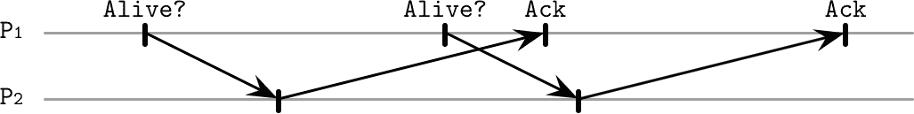
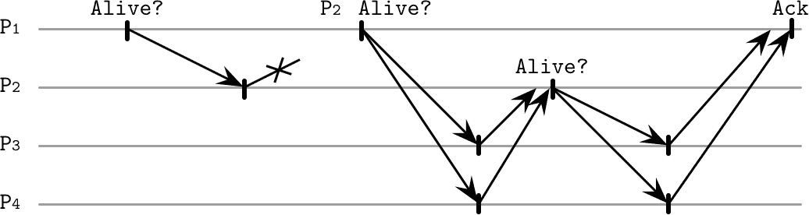
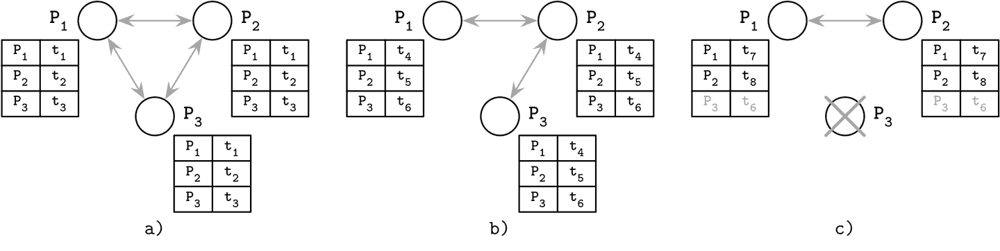
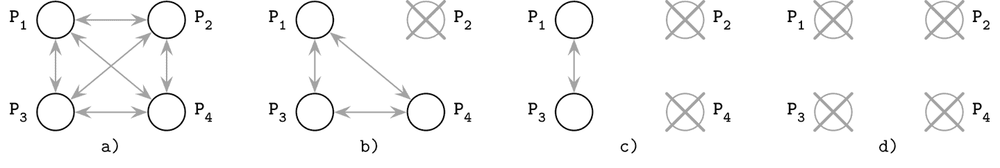

# 第九章：故障检测

> 如果树倒在森林中而没有人在周围听到它，它会发出声音吗？
> 
> 未知作者

为了使系统能够适当地对故障作出反应，必须及时检测到故障。即使故障进程无法响应，也可能会联系到它，增加延迟并降低整体系统的可用性。

在异步分布式系统中检测故障（即不进行任何时间假设）非常困难，因为无法判断进程是崩溃了，还是运行缓慢并且花费了无限长的时间来响应。我们在 “FLP 不可能性” 中讨论了一个与此相关的问题。

术语如 *死亡*、*失败* 和 *崩溃* 通常用于描述完全停止执行步骤的进程。术语如 *无响应*、*故障* 和 *缓慢* 则用于描述 *疑似* 进程，这些进程实际上可能已经死亡。

*链路* 层次上可能会发生故障（进程间消息丢失或传递缓慢），或者在 *进程* 层次上（进程崩溃或运行缓慢），而缓慢有时无法与故障区分开来。这意味着始终存在错误地怀疑存活进程为死亡（产生 *错误肯定*），以及延迟标记无响应进程为死亡，给予其回应的机会并期望其最终响应（产生 *错误否定*）之间的权衡。

*故障检测器* 是负责识别失败或无法访问的进程以将其从算法中排除，并在保留安全性的同时保证活性的本地子系统。

*活性* 和 *安全性* 是描述算法解决特定问题的能力及其输出正确性的属性。更正式地说，*活性* 是一种保证特定预期事件 *必定* 发生的属性。例如，如果某个进程失败了，故障探测器 *必须* 检测到该故障。*安全性* 则保证不会发生意外事件。例如，如果故障探测器将某个进程标记为死亡，那么这个进程实际上必须是已经死亡的 [[LAMPORT77]](app01.html#LAMPORT77) [[RAYNAL99]](app01.html#RAYNAL99) [[FREILING11]](app01.html#FREILING11)。

从实际角度来看，排除失败的进程有助于避免不必要的工作，并防止错误传播和级联故障，同时在排除潜在可疑的存活进程时减少了可用性。

故障检测算法应该表现出几个基本属性。首先，每个非故障成员最终应该注意到进程的故障，并且该算法应该能够取得进展并最终达到其最终结果。这一属性被称为 *完备性*。

我们可以通过其 *效率* 来评估算法的质量：故障检测器能多快地识别进程故障。另一种方法是查看算法的 *准确性*：是否准确地检测到进程故障。换句话说，如果一个算法错误地指控一个活动进程失败或无法检测到已存在的故障，则该算法是 *不* 准确的。

我们可以将效率和准确性之间的关系视为可调参数：更高效的算法可能不够精确，而更准确的算法通常效率较低。可以证明，不可能构建既准确又高效的故障检测器。与此同时，故障检测器允许产生误报（即错误地将活动进程标识为失败，反之亦然）[[CHANDRA96]](app01.html#CHANDRA96)。

故障检测器是许多共识和原子广播算法的重要先决条件和组成部分，我们稍后会在本书中讨论。

许多分布式系统通过使用 *心跳* 来实现故障检测。这种方法非常流行，因其简单性和强大的完整性。本文讨论的算法假设不存在拜占庭故障：进程不会故意谎报其状态或邻居的状态。

# 心跳和 ping

我们可以通过触发两种定期过程之一来查询远程进程的状态：

+   我们可以触发一个 ping，向远程进程发送消息，并期望在指定时间内收到响应，以检查它们是否仍然活动。

+   当进程主动通过向其对等体发送消息来通知其仍在运行时，我们可以触发一个 *心跳*。

这里我们以 ping 为例，但是可以使用心跳来解决同样的问题，得到类似的结果。

每个进程维护一个包含其他进程（活动的、已死亡的和被怀疑的）的列表，并更新每个进程的最后响应时间。如果某个进程在更长时间内未响应 ping 消息，则将其标记为 *被怀疑的*。

图 9-1 展示了系统的正常运行：进程 `P1` 正在查询邻居节点 `P2` 的状态，后者则回复确认。

###### 图 9-1\. 失败检测的 ping：正常运行，无消息延迟

相比之下，图 9-2 显示了确认消息延迟的情况，这可能导致将活动进程标记为宕机。

###### 图 9-2\. 失败检测的 ping：响应延迟，在下一条消息发送后才会到达

许多故障检测算法基于心跳和超时。例如，Akka，一个用于构建分布式系统的流行框架，有一个实现[截止期故障检测器](https://databass.dev/links/41)，它使用心跳并在固定时间间隔内未能注册时报告进程故障。

这种方法有几个潜在的缺点：其精确性依赖于谨慎选择的 ping 频率和超时，并且它不能从其他进程的视角捕捉进程的可见性（见“外包心跳”）。

## 无超时故障检测器

一些算法避免依赖超时来检测故障。例如，Heartbeat 是一种*无超时*故障检测器[[AGUILERA97]](app01.html#AGUILERA97)，它是一种仅计算心跳并允许应用根据心跳计数器向应用程序报告进程故障的算法。由于这种算法是无超时的，它基于*异步*系统假设运行。

该算法假定任何两个正确的进程之间都连接着一个*公平路径*，该路径仅包含公平链接（即，如果通过此链接发送消息无限次，也会无限次接收到）。每个进程都意识到网络中*所有*其他进程的存在。

每个进程维护与其相邻的邻居和与之相关的计数器列表。进程开始向其邻居发送心跳消息。每条消息包含迄今为止心跳所经历的路径。初始消息包含路径中的第一个发送者和一个唯一标识符，可用于避免多次广播相同的消息。

当进程接收到新的心跳消息时，它会递增路径中所有参与者的计数器，并将心跳消息发送给路径中不存在的参与者，将自身附加到路径中。一旦看到所有已知进程都已接收到消息（换句话说，进程 ID 出现在路径中），进程就会停止传播消息。

由于消息通过不同的进程传播，心跳路径包含从邻居接收的聚合信息，即使两个进程之间的直接链接故障，我们也可以（正确地）将无法访问的进程标记为活动。

心跳计数器代表系统的全局和归一化视图。这种视图捕捉了心跳相对传播的方式，使我们能够比较进程。然而，这种方法的一个缺点是解释心跳计数器可能会非常棘手：我们需要选择一个能够产生可靠结果的阈值。除非我们能够做到这一点，否则算法将错误地将活动进程标记为可疑。

## 外包心跳

另一种方法是由可扩展弱一致性感染式进程组成员协议（SWIM）[[GUPTA01]](app01.html#GUPTA01) 使用的 *外包心跳* 方法来提高可靠性，使用从其邻居的视角获得的有关进程存活性的信息。这种方法不要求进程意识到网络中所有其他进程，只需要一部分连接的对等体。

如 图 9-3 所示，进程 `P[1]` 向进程 `P[2]` 发送一个 ping 消息。`P[2]` 没有响应该消息，因此 `P[1]` 选择多个随机成员（`P[3]` 和 `P[4]`）继续操作。这些随机成员尝试向 `P[2]` 发送心跳消息，如果 `P[2]` 响应，则将确认信息转发回 `P[1]`。

###### 图 9-3\. “外包”心跳

这允许考虑直接和间接可达性。例如，如果我们有进程 `P[1]`、`P[2]` 和 `P[3]`，我们可以从 `P[1]` 和 `P[2]` 的角度检查 `P[3]` 的状态。

外包心跳允许通过在成员组中分布责任来可靠检测故障。这种方法不需要向广泛的对等体广播消息。由于外包心跳请求可以并行触发，这种方法可以快速收集有关疑似进程的更多信息，并允许我们做出更准确的决策。

# Phi-Accrual 故障检测器

不同于将节点故障视为二进制问题，其中进程只能处于两种状态之一：运行或宕机，*φ-accrual*（φ-积累）故障检测器[[HAYASHIBARA04]](app01.html#HAYASHIBARA04) 具有连续的尺度，捕捉被监控进程崩溃的概率。它通过维护一个滑动窗口，收集最近的心跳到达时间来工作，使用这些信息来估计 *下一个* 心跳的到达时间，将此估计与实际到达时间进行比较，并计算 *可疑级别* `φ`：给定当前网络条件，故障检测器对故障的确定程度。

该算法通过收集和采样到达时间来工作，创建一个可以用来做出关于节点健康的可靠判断的视图。它使用这些样本来计算 `φ` 的值：如果该值达到阈值，则标记节点为下线。该故障检测器通过调整节点可能被标记为可疑的规模来动态适应变化的网络条件。

从架构的角度来看，φ-accrual 故障检测器可以被视为三个子系统的组合：

监控

通过 ping、心跳或请求-响应采样收集存活信息。

解释

根据进程是否应标记为可疑做出决策。

动作

每当进程被标记为可疑时执行的回调。

监控过程在固定大小的心跳到达时间窗口中收集和存储数据样本（假设它们遵循正态分布）。新到达的心跳被添加到窗口中，最旧的心跳数据点被丢弃。

通过确定样本的平均值和方差来从采样窗口估算分布参数。这些信息用于计算消息在上一条消息之后`t`时间单位内到达的概率。在此信息的基础上，我们计算`φ`，它描述了我们对进程存活性做出正确决策的可能性。换句话说，也就是我们犯错并接收到会与计算出的假设相矛盾的心跳的可能性。

这一方法是由日本先进科学技术研究所的研究人员开发的，并且现在被用于许多分布式系统，例如[Cassandra](https://databass.dev/links/42)和[Akka](https://databass.dev/links/43)（以及上述的截止期故障检测器）。

# 八卦与故障检测

另一种方法是避免依赖单节点视图来做出决策的八卦式失败检测服务[[VANRENESSE98]](app01.html#VANRENESSE98)，它使用*八卦*（参见“八卦传播”）来收集和分发邻近进程的状态。

每个成员维护其他成员、它们的*心跳计数器*和时间戳的列表，指定了上次增加心跳计数器的时间。周期性地，每个成员增加其心跳计数器，并将其列表分发给一个随机的邻居。在消息接收时，邻近节点将其列表与自己的列表合并，更新其他邻居的心跳计数器。

节点还会周期性地检查状态和心跳计数器的列表。如果任何节点的计数器长时间未更新，它将被视为失败。应谨慎选择此超时期限，以最小化误报的概率。成员之间必须多久进行通信（换句话说，最坏情况下的带宽）受到限制，并且最多可以随系统中进程数量线性增长。

图 9-4 显示了三个通信进程共享它们的心跳计数器：

+   a) 所有三个进程都可以通信并更新它们的时间戳。

+   b) `P3`无法与`P1`通信，但其时间戳`t[6]`仍可通过`P2`传播。

+   c) `P3`崩溃。因为它不再发送更新，其他进程将其检测为失败。

###### 图 9-4\. 复制的用于故障检测的心跳表

这样一来，我们可以检测崩溃节点，以及其他集群成员无法访问的节点。这个决定是可靠的，因为集群视图是多个节点的聚合。如果两个主机之间存在链路故障，心跳可以通过其他进程传播。使用流言蜚语来传播系统状态增加了系统中的消息数量，但可以更可靠地传播信息。

# 反转故障检测问题陈述

由于不一定能够传播有关故障的信息，并且通过通知每个成员进行传播可能代价高昂，其中一种方法称为 *FUSE*（故障通知服务）[[DUNAGAN04]](app01.html#DUNAGAN04)，专注于可靠且经济高效的故障传播，在网络分区的情况下也能正常工作。

为了检测进程故障，此方法将所有活动进程分组。如果其中一个组变为不可用，所有参与者都会检测到故障。换句话说，每当检测到单个进程故障时，它会转换并传播为 *组故障*。这允许在存在任何连接断开、分区和节点故障模式时检测故障。

组中的进程定期向其他成员发送 ping 消息，查询它们是否仍然存活。如果一个成员由于崩溃、网络分区或链路故障无法响应此消息，发起此 ping 的成员将不再响应 ping 消息。

图 9-5 展示了四个通信进程：

+   a) 初始状态：所有进程都处于活动状态且可以通信。

+   b) `P[2]` 崩溃并停止响应 ping 消息。

+   c) `P[4]` 检测到 `P[2]` 的故障并停止响应 ping 消息本身。

+   d) 最终，`P[1]` 和 `P[3]` 发现 `P[1]` 和 `P[2]` 都没有响应，进而导致整个组的进程故障。

###### 图 9-5\. FUSE 故障检测

所有的故障都从故障源传播到系统中的所有其他参与者。参与者逐渐停止响应 ping，从个体节点故障转变为组故障。

在这里，我们利用通信缺失作为传播的手段。使用此方法的优点是，保证每个成员都能了解组故障并做出适当反应。其中一个缺点是，单个进程与其他进程的链接故障也可以转换为组故障，但根据使用情况，这也可以视为优势。应用程序可以使用自己定义的传播故障来处理这种情况。

# 总结

失效探测器是任何分布式系统的重要组成部分。正如 FLP 不可能性结果所示，在异步系统中没有协议能够保证一致性。失效探测器有助于扩展模型，通过在准确性和完整性之间进行权衡来解决一致性问题。在这一领域的一个重要发现，证明了失效探测器的有用性，可以在[[CHANDRA96]](app01.html#CHANDRA96)中找到描述，该研究表明，即使是一个频繁出错的失效探测器，也可以解决一致性问题。

我们已经介绍了几种失效检测算法，每种算法采用不同的方法：一些专注于通过直接通信检测故障，一些使用广播或八卦传播信息，还有一些通过静态（换句话说，缺乏通信）来传播信息。现在我们知道可以使用心跳或 ping、硬截止时间或连续刻度。每一种方法都有其优势：简单性、准确性或精确度。
