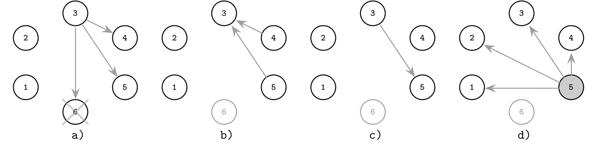
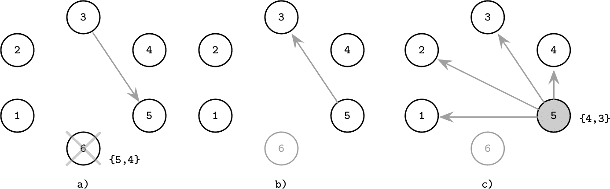
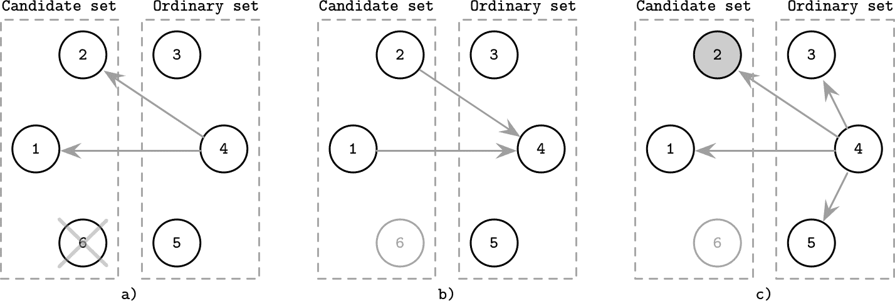
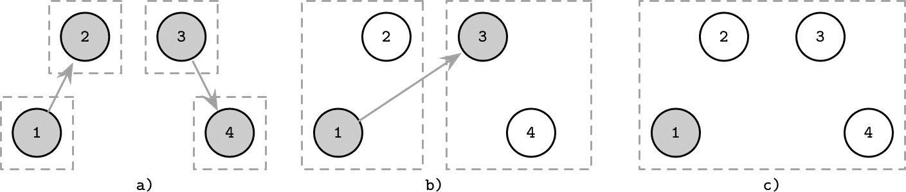
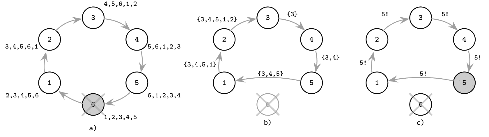

# 第十章：领导者选举

同步可能非常昂贵：如果每个算法步骤都涉及与每个其他参与者联系，我们可能会遇到显著的通信开销。这在大型和地理分布网络中尤为真实。为了减少同步开销和达成决策所需的消息往返次数，一些算法依赖于**领导者**（有时称为**协调器**）进程的存在，负责执行或协调分布式算法的步骤。

一般来说，分布式系统中的进程是均匀的，任何进程都可以接管领导角色。进程可能长时间担任领导角色，但这并不是永久角色。通常情况下，进程会保持领导者角色直到它崩溃。崩溃后，任何其他进程都可以开始新的选举轮次，如果被选中就会担任领导角色，并继续失败领导者的工作。

选举算法的**活跃性**保证了大部分时间都会有一个领导者，并且选举最终会完成（即系统不应无限期处于选举状态）。

理想情况下，我们希望还能假设**安全性**，并保证同时最多只能有一个领导者，并完全消除**分裂大脑**情况的可能性（当两个服务于相同目的的领导者被选举但彼此不知情时）。然而，在实践中，许多领导者选举算法违反了这一约定。

领导进程可以用来实现消息广播的总排序，例如。领导者收集并持有全局状态，接收消息，并在进程之间传播它们。它还可以用于协调系统在故障后的重新组织，在初始化期间或重要状态变化发生时。

当系统初始化时触发选举，并且首次选出领导者，或者以前的领导者崩溃或无法通信时会触发选举。选举必须是确定性的：过程中必须精确产生一个领导者。这个决定必须对所有参与者有效。

尽管从理论上看，领导者选举和分布式锁定（即对共享资源的独占权）可能看起来相似，但它们略有不同。如果一个进程持有锁来执行临界区，那么其他进程知道目前究竟是谁持有锁并不重要，只要满足活跃性属性（即锁最终会被释放，允许其他进程获取）。相比之下，选举出的进程具有一些特殊属性，并且必须为所有其他参与者所知，因此新选出的领导者必须通知其同行其角色。

如果分布式锁算法对某个进程或一组进程有偏好，它最终会将非首选进程从共享资源中饿死，这与活性属性相矛盾。相反，领导者可以保持其角色直到停止或崩溃，并且长寿命的领导者更受欢迎。

在系统中拥有稳定的领导者有助于避免远程参与者之间的状态同步，减少交换消息的数量，并从单个进程驱动执行，而不需要对等协调。在具有领导概念的系统中的一个潜在问题是，领导者可能成为瓶颈。为了克服这一问题，许多系统将数据分区为非交叉独立的副本集（参见 “数据库分区”）。每个副本集都有自己的领导者。采用这种方法的系统之一是 Spanner（参见 “Spanner 分布式事务”）。

因为每个领导进程最终会失败，必须检测、报告并对其做出反应：系统必须选举另一位领导者来取代失败的领导者。

一些算法，例如 ZAB（参见 “Zookeeper 原子广播（ZAB）”）、Multi-Paxos（参见 “多数派决策（Multi-Paxos）”）或 Raft（参见 “Raft”），使用临时领导者来减少达成参与者间协议所需的消息数。然而，这些算法使用各自特定的算法手段进行领导者选举、失败检测和解决竞争领导进程之间的冲突。

# 霸者算法

一种领导选举算法称为*霸者算法*，利用进程排名来确定新的领导者。每个进程都被分配了一个唯一的排名。在选举期间，排名最高的进程成为领导者 [[GARCIAMOLINA82]](app01.html#GARCIAMOLINA82)。

这个算法以其简单性而闻名。该算法被命名为*霸者*，因为排名最高的节点“霸占”其他节点接受它。它也被称为*君主制*领导选举：排名最高的兄弟在前任停止存在后成为君主。

如果其中一个进程注意到系统中没有领导者（从未初始化过）或者之前的领导者停止响应请求，选举将开始，并按三个步骤进行：^(1)

1.  进程向具有较高标识符的进程发送选举消息。

1.  进程等待，允许排名更高的进程做出响应。如果没有排名更高的进程响应，则继续执行第三步。否则，进程会通知它听到的排名最高的进程，并允许它继续执行第三步。

1.  这个过程假设没有比它更高排名的活动进程，并通知所有排名较低的进程新领导人的消息。

图 10-1 展示了霸王领导者选举算法：

+   a) 进程 `3` 注意到之前的领导者 `6` 崩溃，并通过向具有更高标识符的进程发送 `Election` 消息来开始新的选举。

+   b) `4` 和 `5` 回复 `Alive`，因为它们比 `3` 有更高的等级。

+   c) `3` 通知本轮响应最高等级的进程 `5`。

+   d) `5` 被选为新的领导者。它广播 `Elected` 消息，通知低级进程选举结果。

###### 图 10-1\. 霸王算法：先前的领导者 (6) 失败，进程 3 启动新的选举

该算法的一个明显问题是在网络分区存在的情况下违反了安全保证（即最多同时选出一个领导者）。很容易出现节点分为两个或更多独立运行的子集的情况，每个子集选出自己的领导者。这种情况称为 *分裂大脑*。

该算法的另一个问题是对高排名节点的强烈偏好，如果它们不稳定可能会导致永久的重新选举状态。一个不稳定的高排名节点提议自己作为领导者，随后失败，重新赢得选举，再次失败，整个过程重复。这个问题可以通过分发主机质量指标并在选举过程中考虑它们来解决。

# 下一个备用故障转移

霸王算法有许多改进版本，以提高其各种属性。例如，我们可以使用多个备用的下一个排队进程作为故障转移，以缩短重新选举的时间 [[GHOLIPOUR09]](app01.html#GHOLIPOUR09)。

每个选出的领导者提供一个故障转移节点列表。当其中一个进程检测到领导者故障时，它通过向由失败领导者提供的备用列表中的最高等级的进程发送消息来启动新的选举轮次。如果建议的备选进程之一正常，它将立即成为新的领导者，无需进行完整的选举轮次。

如果检测到领导者故障的进程本身是备选列表中的最高等级进程，则可以立即通知进程有关新领导者的情况。

图 10-2 展示了采用此优化措施的过程：

+   a) `6`，一个具有指定备选 `{5,4}` 的领导者，崩溃。`3` 注意到这个故障并联系具有最高等级的备选 `5`。

+   b) `5` 响应 `3` 它是活动的，以防止其与备选列表中的其他节点联系。

+   c) `5` 通知其他节点它是新的领导者。

###### 图 10-2\. 具有故障转移的霸王算法：先前的领导者 (6) 失败，进程 3 启动新的选举，联系最高等级的备选进程。

因此，如果下一个排队的进程是活动的，我们在选举过程中需要更少的步骤。

# 候选人/普通优化

另一个算法试图通过将节点分为两个子集 *candidate* 和 *ordinary* 来降低消息数量的要求，只有一个候选节点最终能成为领导者 [[MURSHED12]](app01.html#MURSHED12)。

普通进程通过联系候选节点启动选举，从中收集响应，选择排名最高的活动候选节点作为新领导者，然后通知其余节点有关选举结果。

为了解决多个同时选举的问题，该算法建议使用一个决胜变量 `δ`，即一个进程特定的延迟，节点之间的延迟显著不同，允许其中一个节点在其他节点之前启动选举。决胜时间通常大于消息的往返时间。优先级较高的节点具有较低的 `δ`，反之亦然。

图 10-3 展示了选举过程的步骤：

+   a) 来自普通集的进程 `4` 察觉到领导进程 `6` 的故障。它通过联系候选集中的所有剩余进程启动新的选举轮次。

+   b) 候选进程响应通知 `4` 他们仍然存活。

+   c) `4` 通知所有进程有关新领导者 `2` 的信息。

###### 图 10-3\. bully 算法的候选/普通修改：之前的领导者（6）失败，进程 4 开始新的选举

# 邀请算法

一种 *邀请算法* 允许进程“邀请”其他进程加入其组，而不是试图超越它们。根据定义，该算法允许多个领导者，因为每个组都有自己的领导者。

每个进程从一个新组的领导者开始，其中唯一成员是进程本身。组领导者联系不属于其组的同行，邀请他们加入。如果同行进程本身是领导者，则两个组合并。否则，接触到的进程以组领导者 ID 作为响应，允许两个组领导者建立联系并在更少的步骤中合并组。

图 10-4 展示了邀请算法的执行步骤：

+   a) 四个进程作为各自只包含一个成员的组的领导者启动。`1` 邀请 `2` 加入其组，`3` 邀请 `4` 加入其组。

+   b) `2` 加入与进程 `1` 的组，`4` 加入与进程 `3` 的组。第一个组的领导者 `1` 联系另一个组的领导者 `3`。剩余的组成员（在这种情况下是 `4`）被告知新的组领导者。

+   c) 两个组合并，`1` 成为扩展组的领导者。

###### 图 10-4\. 邀请算法

由于组被合并，建议组合并的过程无论是成为新领导者还是另一个领导者都无关紧要。为了将合并组所需的消息数量最小化，较大组的领导者可以成为新组的领导者。这样只需通知较小组的进程有关领导变更即可。

类似于其他讨论过的算法，该算法允许进程安定在多个组中并且有多个领导者。邀请算法允许创建进程组并合并它们，而不必从头开始触发新的选举，从而减少完成选举所需的消息数量。

# Ring 算法

在环形算法[[CHANG79]](app01.html#CHANG79)中，系统中的所有节点形成一个环，并且意识到环的拓扑结构（即环中的前任和后继）。当进程检测到领导者失效时，它启动新的选举。选举消息沿环传递：每个进程联系其后继（环中离它最近的下一个节点）。如果此节点不可用，则进程跳过不可达节点并尝试联系它之后的节点，直到最终有一个响应。

节点与它们的兄弟节点联系，沿着环形移动并收集活跃节点集合，在将其传递给下一个节点之前将自己添加到集合中，类似于“无超时失效检测器”中描述的故障检测算法，其中节点在传递给下一个节点之前会将其标识符附加到路径中。

该算法通过完全遍历环来进行。当消息返回到启动选举的节点时，从活跃集合中选择排名最高的节点作为领导者。在图 10-5 中，您可以看到这样一个遍历的示例：

+   a) 前领导者 `6` 失效，每个进程都从其视角看到环的视图。

+   b) `3` 通过启动遍历来启动选举轮次。在每一步中，沿途遍历的节点集合。`5` 无法到达 `6`，所以跳过它直接到 `1`。

+   c) 由于 `5` 是具有最高排名的节点，`3` 再次启动消息轮次，分发有关新领导者的信息。

###### 图 10-5\. 环形算法：前领导者（6）失效，3 开始选举过程

该算法的变体包括收集单个最高排名标识符而不是活跃节点集合以节省空间：由于 `max` 函数是可交换的，知道当前的最大值就足够了。当算法回到启动选举的节点时，最后已知的最高标识符再次在环中传播。

由于环可能被分割成两个或更多部分，并且每部分可能选择自己的领导者，因此这种方法也不具备安全属性。

如您所见，要使带有领导者的系统正常运行，我们需要了解当前领导者的状态（无论其是否存活），因为为了保持流程有序并继续执行，领导者必须是活跃的并且可达的，以执行其职责。为了检测领导者的崩溃，我们可以使用故障检测算法（参见第九章）。

# 总结

领导者选举是分布式系统中的重要课题，因为使用指定的领导者有助于减少协调开销并提高算法性能。选举轮可能会昂贵，但由于它们不经常发生，对整体系统性能没有负面影响。单个领导者可能成为瓶颈，但大多数情况下可以通过数据分区和使用每个分区的领导者或者针对不同操作使用不同的领导者来解决。

不幸的是，本章讨论的所有算法都容易出现脑裂问题：我们可能会在不相互感知的独立子网中出现两个领导者。为了避免脑裂，我们必须获得整个集群的多数投票。

许多共识算法，包括 Multi-Paxos 和 Raft，依赖于领导者进行协调。但领导者选举难道不就是共识吗？要选举领导者，我们需要就其身份达成共识。如果我们能就领导者身份达成共识，我们就可以使用相同的手段在任何其他事务上达成共识 [[ABRAHAM13]](app01.html#ABRAHAM13)。

领导者的身份可能会在进程不知情的情况下发生变化，因此问题是进程对领导者的本地知识是否仍然有效。为了实现这一点，我们需要将领导者选举与故障检测结合起来。例如，*稳定领导者选举* 算法使用带有唯一稳定领导者的轮次和基于超时的故障检测来保证领导者在不崩溃且可访问的情况下保持其位置 [[AGUILERA01]](app01.html#AGUILERA01)。

依赖领导者选举的算法通常*允许*存在多个领导者，并尽快解决领导者之间的冲突。例如，在 Multi-Paxos 中（参见“Multi-Paxos”），只有两个冲突的领导者（提议者）中的一个可以继续进行，这些冲突通过收集第二个法定人数来解决，确保来自两个不同提议者的值不会被接受。

在 Raft 中（参见“Raft”），一个领导者可以发现其任期过时，这意味着系统中存在不同的领导者，并更新其任期为更近的一个。

在这两种情况下，拥有一个领导者是确保*liveness*（如果当前领导者失败了，我们需要一个新的领导者）的一种方式，并且进程不应该无限长时间地去理解它是否真的失败了。缺乏*safety*和允许多个领导者是一种性能优化：算法可以继续进行复制阶段，并通过检测和解决冲突来保证*safety*。

我们将在第十四章中更详细地讨论共识和领导者选举的背景下的共识。

^(1) 这些步骤描述了*modified* bully 选举算法[[KORDAFSHARI05]](app01.html#KORDAFSHARI05)，因为它更简洁和清晰。
