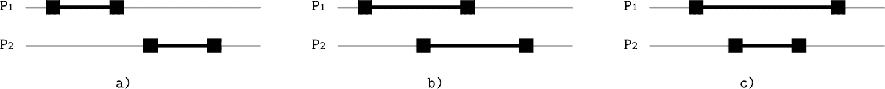
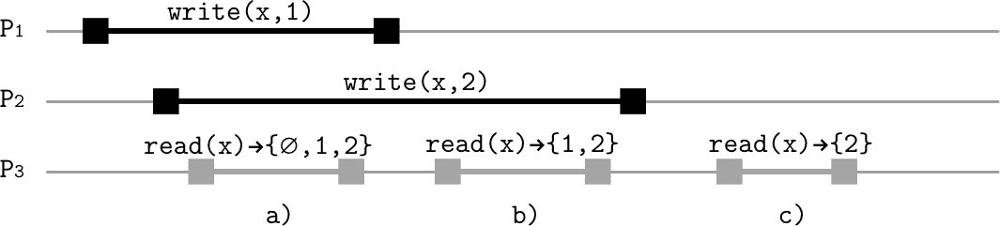
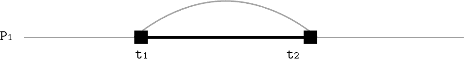
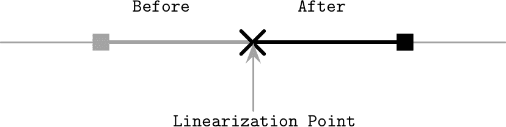
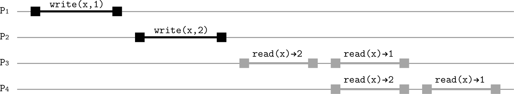
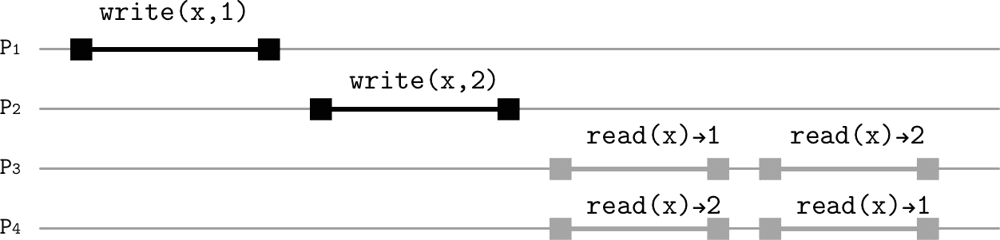
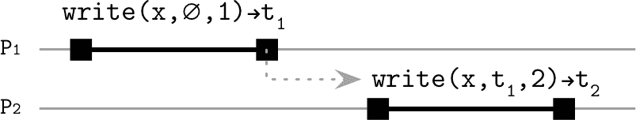
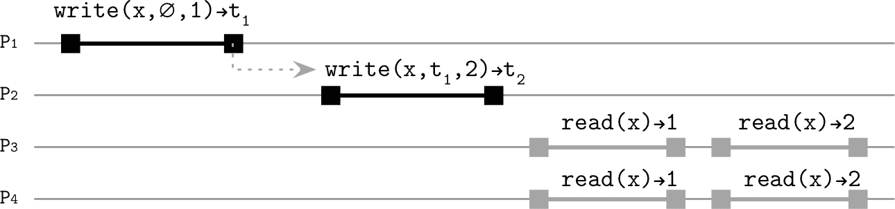
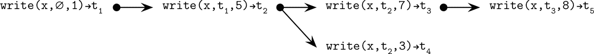

# 第十一章：复制与一致性

在我们继续讨论共识和原子提交算法之前，让我们一起完成对其深入理解所需的最后一块内容：*一致性模型*。一致性模型很重要，因为它们解释了在存在多个数据副本的情况下系统的可见性语义和行为。

*容错性*是系统在其组件发生故障时仍能继续正确运行的特性。使系统具备容错性并不是一件容易的任务，而且向现有系统添加容错性可能会很困难。主要目标是从系统中删除单点故障，并确保我们在关键任务组件中具有冗余。通常，冗余对用户来说是完全透明的。

一个系统可以通过存储数据的多个副本来继续正确运行，这样，当其中一个机器失败时，另一个可以作为故障切换。在具有单一真相来源的系统中（例如，主/副本数据库），可以通过显式地将副本提升为新主节点来执行故障切换。其他系统则无需显式重新配置，并通过在读写查询期间收集多个参与者的响应来确保一致性。

数据的*复制*是通过在系统中维护数据的多个副本来引入冗余的一种方式。然而，由于原子性地更新多个数据副本等同于共识问题[[MILOSEVIC11]](app01.html#MILOSEVIC11)，因此对数据库中的*每个*操作执行此操作可能是相当昂贵的。我们可以探索一些更具成本效益和灵活性的方法，使数据从用户的角度看起来*一致*，同时允许参与者之间存在一定程度的分歧。

在多数据中心部署中，复制尤为重要。在这种情况下，地理复制有多重作用：它增加了可用性，并通过提供冗余性来增强一个或多个数据中心发生故障时的容错能力。它还可以通过将数据的副本物理放置在距客户端更近的地方来帮助减少延迟。

当数据记录被修改时，它们的副本必须相应地更新。在讨论复制时，我们最关心的是三个事件：*写*、*副本更新*和*读*。这些操作会触发客户端发起的一系列事件。在某些情况下，更新副本可以在客户端完成写操作之后发生，但这并不改变客户端必须能够按特定顺序观察操作的事实。

# 实现可用性

我们已经讨论了分布式系统的谬误，并确定了许多可能出错的事情。在现实世界中，节点并不总是存活或能够彼此通信。然而，间歇性的故障不应影响*可用性*：从用户的角度来看，整个系统必须继续运行，好像什么都没有发生一样。

系统的可用性是一个非常重要的属性：在软件工程中，我们始终追求高可用性，并试图将停机时间最小化。工程团队以其正常运行时间指标而自豪。我们如此关心可用性有几个原因：软件已成为我们社会的一个重要组成部分，许多重要的事情如果没有它是无法实现的：银行交易、通信、旅行等等。

对于公司来说，可用性不足可能意味着失去客户或金钱：如果在线商店不可用，您无法购物；如果银行网站不响应，您无法转账。

要使系统高度可用，我们需要以一种允许优雅处理一个或多个参与者故障或不可用的方式设计它。为此，我们需要引入冗余和复制。然而，一旦我们添加了冗余，就面临着保持多个数据副本同步并实施恢复机制的问题。

# 分布式系统的臭名昭著

*可用性*是一个属性，衡量系统成功为每个请求提供响应的能力。可用性的理论定义提到了最终的响应，但在现实世界的系统中，我们当然希望避免服务花费无限长时间才能响应。

理想情况下，我们希望每个操作都是*一致的*。在这里，一致性定义为原子或*可线性化*一致性（参见“线性化”）。可线性化历史可以表达为保留原始操作顺序的一系列瞬时操作。线性化简化了对可能系统状态的推理，并使分布式系统看起来好像在单台机器上运行一样。

我们希望在容忍网络分区的同时实现一致性和可用性。网络可能会分裂成几部分，其中进程无法彼此通信：在分区节点之间发送的一些消息将无法到达其目的地。

可用性要求任何非故障节点都能交付结果，而一致性要求结果是可线性化的。由 Eric Brewer 提出的 CAP 猜想讨论了一致性、可用性和分区容忍之间的权衡 [[BREWER00]](app01.html#BREWER00)。

在异步系统中，满足可用性要求是不可能的，而在存在网络分区的情况下，我们无法实现同时保证*可用性*和*一致性*的系统 [[GILBERT02]](app01.html#GILBERT02)。我们可以构建保证强一致性同时提供*尽力而为*可用性的系统，或者保证可用性同时提供*尽力而为*一致性 [[GILBERT12]](app01.html#GILBERT12)。这里的尽力而为意味着如果一切正常，系统将不会*故意*违反任何保证，但在网络分区的情况下允许保证被削弱和违反。

换句话说，CAP 描述了一系列潜在选择，不同的选择会导致系统处于不同的位置：

一致和容忍分区

CP 系统更倾向于拒绝请求，而不是提供潜在的不一致数据。

可用和容忍分区

AP 系统放松了一致性要求，并允许在请求期间提供潜在的不一致值。

CP 系统的一个例子是共识算法的实现，需要大多数节点来进行进展：始终保持一致，但在网络分区的情况下可能不可用。一个数据库总是接受写入并提供读取，只要有一个副本正常，这就是 AP 系统的一个例子，可能会丢失数据或提供不一致的结果。

PACELEC 猜想 [[ABADI12]](app01.html#ABADI12)，CAP 的一个延伸，指出在存在网络分区的情况下，我们在一致性和可用性（PAC）之间需要做出选择。否则（E），即使系统正常运行，我们*仍然*必须在延迟和一致性之间做出选择。

## 谨慎使用 CAP

需要注意的是，CAP 讨论的是*网络分区*，而不是*节点崩溃*或任何其他类型的故障（比如崩溃恢复）。一个与集群其余部分分隔的节点可能会提供不一致的请求，但是一个崩溃的节点将完全不会响应。一方面，这意味着我们并不需要任何节点宕机才会面临一致性问题。另一方面，在现实世界中情况并非如此：存在许多不同的故障场景（其中一些可以通过网络分区来模拟）。

CAP 表示，即使所有节点都正常运行，我们也可能面临一致性问题，因为节点之间存在连接问题，我们期望每个非故障节点都能正确响应，而不考虑可能有多少节点处于宕机状态。

CAP 猜想有时被描述为一个三角形，好像我们可以调节一个旋钮以增加或减少三个参数中的任何一个。然而，虽然我们可以调节一个旋钮来交换一致性和可用性，但容忍分区是一个我们实际上无法调整或交换的属性 [[HALE10]](app01.html#HALE10)。

###### 提示

CAP 中的一致性与 ACID（参见 第五章）中定义的一致性有很大不同。ACID 的一致性描述了事务一致性：事务将数据库从一个有效状态转换到另一个有效状态，同时保持所有数据库不变性（如唯一性约束和引用完整性）。在 CAP 中，它意味着操作是 *原子的*（操作要么完全成功，要么完全失败）和 *一致的*（操作永远不会使数据处于不一致状态）。

CAP 中的可用性也不同于上述的 *高可用性* [[KLEPPMANN15]](app01.html#KLEPPMANN15)。CAP 的定义不限制执行延迟。此外，与 CAP 相反，数据库中的可用性并不要求 *每个* 非故障节点都响应 *每个* 请求。

CAP 猜想用于解释分布式系统，推理故障场景，并评估可能的情况，但重要的是要记住，在 *放弃* 一致性和提供不可预测的结果之间有一条细微的界线。

声称属于可用性方面的数据库，在正确使用时，仍然能够从副本中提供一致的结果，只要有足够多的副本存活。当然，还有更复杂的故障情况，CAP 猜想只是一个经验法则，并不一定能说明全部真相。^(1)

## 收获和收益

CAP 猜想仅讨论一致性和可用性的最强形式：*线性一致性* 和系统最终能够响应每个请求的能力。这迫使我们在两个属性之间做出艰难的权衡。然而，一些应用程序可以从略微放松的假设中受益，我们可以考虑这些属性的较弱形式。

不是 *一致* 或 *可用*，系统可以提供放宽的保证。我们可以定义两个可调整的指标：*收获* 和 *收益*，在选择其中之间仍然构成正确的行为 [[FOX99]](app01.html#FOX99)。

收获

定义查询的完成度：如果查询需要返回 100 行，但由于某些节点不可用只能获取 99 行，这仍然比完全失败并返回空值要好。

收益

指定成功完成的请求数量，与尝试的总请求数进行比较。收益与正常运行时间不同，例如，繁忙的节点可能不是宕机，但仍可能无法响应某些请求。

这将交易的焦点从绝对术语转移到相对术语。我们可以通过交换收获和产量来增加产量，并允许某些请求返回不完整的数据。增加产量的一种方法是仅从可用分区返回查询结果（见“数据库分区”）。例如，如果存储某些用户记录的节点子集已关闭，我们仍然可以继续为其他用户提供服务请求。或者，我们可以要求将关键应用数据仅完整地返回，但允许其他请求有所偏差。

定义、衡量并在收获与产量之间做出明智选择，有助于我们构建更具抗击失败能力的系统。

# 共享内存

对于客户端而言，存储数据的分布式系统表现得就像具有共享存储的单节点系统一样。节点间通信和消息传递被抽象化并在幕后进行。这创造了共享内存的错觉。

单个可通过读取或写入操作访问的存储单元通常称为*寄存器*。我们可以将分布式数据库中的*共享内存*视为这些寄存器的数组。

我们通过其*调用*和*完成*事件标识每个操作。如果调用它的进程在完成之前崩溃，则我们将该操作定义为*失败*。如果一个操作的调用和完成事件发生在另一个操作被调用之前，我们称这个操作*先于*另一个操作，并且这两个操作是*顺序*的。否则，我们称它们是*并发*的。

在图 11-1 中，您可以看到进程`P[1]`和`P[2]`执行不同操作：

+   a) 由进程`P[2]`执行的操作在`P[1]`执行的操作结束*之后*开始，并且这两个操作是*顺序*的。

+   b) 这两个操作存在重叠，因此这些操作是*并发*的。

+   c) 由`P[2]`执行的操作在`P[1]`执行的操作之后*开始*并且在其*完成*之前*完成*。这些操作也是*并发*的。



###### 图 11-1\. 顺序和并发操作

多个读者或写者可以同时访问寄存器。对寄存器的读取和写入操作都*不是即时*的，并需要一些时间。由不同进程执行的并发读写操作并不*串行*：根据操作重叠时寄存器的行为方式，它们的排序可能不同，可能产生不同的结果。根据寄存器在存在并发操作时的行为方式，我们将其区分为三种类型的寄存器：

安全

对安全寄存器的读取可能在并发写入操作期间返回*任意*值（这听起来并不实际，但可能描述了不强制执行顺序的异步系统的语义）。具有二进制值的安全寄存器在读取并发写入期间可能会*闪烁*（即，在读取期间交替返回两个值）。

常规

对于常规寄存器，我们有稍强的保证：读操作只能返回最近*完成*写入的值或与当前读取重叠的写入操作的值。在这种情况下，系统具有某种顺序概念，但写入结果不会同时对所有读取者可见（例如，在复制数据库中可能会发生这种情况，其中主节点接受写入并将其复制给提供读取服务的工作节点）。

原子

原子寄存器保证了线性化：每个写操作在之前有一个单一时刻，每个读操作都返回旧值，在之后每个读操作都返回新值。原子性是简化系统状态推理的基本属性。

# 排序

当我们看到一系列事件时，我们对它们的执行顺序有一些直觉。然而，在分布式系统中，这并不总是那么容易，因为很难准确知道*什么时候*发生了某件事，并且立即在整个集群中可用这些信息。每个参与者可能有自己的状态视图，因此我们必须查看每个操作并以其*调用*和*完成*事件来定义它，并描述操作的边界。

让我们定义一个系统，在这个系统中进程可以在共享寄存器上执行`read(register)`和`write(register, value)`操作。每个进程按顺序执行自己的一组操作（即，必须在开始下一个操作之前完成每个调用的操作）。顺序进程执行的组合形成了全局历史，其中操作可以并发执行。

考虑一种历史，其中两个进程同时执行以下事件的最简单方法是考虑一致性模型的读写操作和它们可以重叠的方式：读操作没有副作用，而写操作则更改寄存器状态。这有助于推断在写入之后数据何时确实变得可读。例如，考虑两个进程同时执行以下事件的历史：

```
Process 1:      Process 2:
write(x, 1)     read(x)
                read(x)
```

当观察这些事件时，不清楚在这两种情况下`read(x)`操作的结果是什么。我们有几种可能的历史：

+   写入在两次读取之前完成。

+   写入和两次读取可以交错，并且可以在读取之间执行。

+   两次读取在写入之前完成。

如果我们只有一份数据，那么应该发生什么并没有简单的答案。在复制系统中，我们有更多可能状态的组合，当多个进程读写数据时，情况会变得更加复杂。

如果所有这些操作由单个进程执行，我们可以强制执行事件的严格顺序，但是在多个进程中这样做更难。我们可以将潜在的困难分为两组：

+   操作可能重叠。

+   非重叠调用的影响可能不会立即可见。

为了推理操作顺序并提供可能结果的非歧义描述，我们必须定义一致性模型。我们从共享内存和并发系统的角度讨论分布式系统中的并发性，因为大多数定义和规则定义一致性仍然适用。尽管并发和分布式系统之间的术语有很多重叠，但由于通信模式、性能和可靠性的差异，我们不能直接应用大多数并发算法。

# 一致性模型

由于允许在共享内存寄存器上执行操作重叠，我们应该定义清晰的语义：如果多个客户端同时或在短时间内读取或修改不同副本的数据会发生什么。对于这个问题并没有单一的正确答案，因为这些语义根据应用程序不同而不同，但在一致性模型的背景下已经被广泛研究。

*一致性模型* 提供不同的语义和保证。你可以把一致性模型看作是参与者之间的契约：每个副本为满足所需语义必须做的事情，以及用户在发出读写操作时可以期望的内容。

一致性模型描述客户可能在多个数据副本和并发访问存在的情况下，对可能返回的值有什么期望。在本节中，我们将讨论*单操作*一致性模型。

每个模型描述系统行为与我们可能期望或找到自然的行为之间的距离有多远。它帮助我们区分交织操作的“所有可能历史”和在模型 X 下允许的历史，这显著简化了对状态更改可见性的推理。

我们可以从*状态*的角度考虑一致性，描述哪些状态不变量是可接受的，并建立放置在不同副本上的数据副本之间的允许关系。或者，我们可以考虑*操作*一致性，它提供了对数据存储的外部视图，描述了操作，并对它们发生的顺序施加了约束 [[TANENBAUM06]](app01.html#TANENBAUM06) [[AGUILERA16]](app01.html#AGUILERA16)。

没有全局时钟，很难给分布式操作一个精确且确定的顺序。这就像数据的特殊相对论：每个参与者对状态和时间都有自己的视角。

理论上，我们可以在每次想要更改系统状态时抓取系统范围的锁，但这将是极不实际的。相反，我们使用一组规则、定义和限制，限制了可能的历史和结果数量。

一致性模型为我们在“Infamous CAP”中讨论的内容增添了另一个维度。现在，我们不仅需要权衡一致性和可用性，还需要考虑同步成本的一致性[[ATTIYA94]](app01.html#ATTIYA94)。同步成本可能包括延迟、执行额外操作所需的额外 CPU 周期、用于持久化恢复信息的磁盘 I/O、等待时间、网络 I/O，以及任何可以通过避免同步来预防的其他问题。

首先，我们将关注操作结果的可见性和传播。回到具有并发读写的例子，我们可以通过将依赖写操作放置在彼此之后或定义传播新值的点来限制可能历史的数量。

我们讨论一致性模型，这些模型涉及在数据库状态下发出`read`和`write`操作的*进程*（客户端）。由于我们在复制数据的情况下讨论一致性，我们假设数据库可以有多个副本。

## 严格一致性

*严格一致性*相当于完全复制透明性：任何进程的任何写操作都会立即对任何进程的后续读操作可见。它涉及全局时钟的概念，如果在时刻`t[1]`进行了`write(x, 1)`操作，则在*任意*时刻`t[2] > t[1]`，任何`read(x)`操作都将返回新写入的值`1`。

不幸的是，这只是一个理论模型，无法实施，因为物理定律和分布式系统工作方式设定了事物发生速度的限制[[SINHA97]](app01.html#SINHA97)。

## 线性一致性

*线性一致性*是最强的单对象、单操作一致性模型。在此模型下，写操作的效果在其开始和结束之间的某个时刻对所有读者可见，没有客户端可以观察到部分（即未完成或未完成前中断）或不完整的写操作的状态转换或副作用[[LEE15]](app01.html#LEE15)。

并发操作被表示为其中一个可能的顺序历史，其中保持了可见性属性。在线性化中存在一些不确定性，因为事件的顺序可能不止一种[[HERLIHY90]](app01.html#HERLIHY90)。

如果两个操作重叠，它们可以以任何顺序生效。所有在写操作完成后发生的读操作都可以观察到此操作的效果。一旦单个读操作返回特定值，所有之后的读操作将返回*至少*与其返回的最近值相同[[BAILIS14a]](app01.html#BAILIS14a)。

在全局历史中，并发事件发生的顺序有一定的灵活性，但不能随意重新排序。操作结果不应在操作开始前生效，因为那需要一个能预测未来操作的预言机。同时，结果必须在完成之前生效，否则我们无法定义一个线性化点。

线性化性尊重顺序过程本地操作顺序以及相对于其他进程并行运行的操作顺序，并定义了事件的*全序*。

这种顺序应当是*一致*的，也就是说，对共享变量的每次读取应当返回在此读取之前写入到该共享变量的最新值，或者与此读取重叠的写入的值。对共享变量的线性化写访问也意味着互斥：在两个并发写入之间，只有一个可以先行。

尽管操作是并发的并且有一些重叠，它们的效果以一种使它们看起来是顺序的方式变得可见。没有操作是瞬间发生的，但看起来*像是*原子的。

让我们考虑以下历史记录：

```
Process 1:      Process 2:     Process 3:
write(x, 1)     write(x, 2)    read(x)
                               read(x)
                               read(x)
```

在图 11-2 中，我们有三个进程，其中两个在寄存器`x`上执行写操作，该寄存器的初始值为`∅`。读操作可以以以下方式观察这些写操作：

+   a) 第一次读操作可以返回`1`、`2`或`∅`（初始值，在两次写入之前的状态），因为两次写入仍在进行中。第一次读可以在两次写入之前、第一次和第二次写入之间，或两次写入之后被排序。

+   b) 第二次读操作只能返回`1`和`2`，因为第一次写入已经完成，但第二次写入尚未返回。

+   c) 第三次读操作只能返回`2`，因为第二次写入在第一次之后被排序。



###### 图 11-2\. 线性化性示例

### 线性化点

线性化性的最重要特征之一是可见性：一旦操作完成，所有人必须看到它，系统不能“倒回时间”，使其对某些参与者不可见或撤销。换句话说，线性化禁止陈旧读取，并要求读取是单调的。

这种一致性模型最好通过原子操作（即不可中断、不可分割的操作）来解释。操作不必是*瞬时*的（也因为这种概念并不存在），但它们的*效果*必须在某个时间点变得可见，使其看起来像是瞬时发生的。这一时刻称为*线性化点*。

写操作的线性化点之后（换句话说，当值对其他进程可见时），每个进程必须看到此操作写入的值或稍后的某个值，如果有其他写操作在其后被排序。可见值应保持稳定，直到其后的下一个值变为可见，并且寄存器不应在最近两个状态之间交替。

###### 注意

大多数编程语言这些天都提供原子原语，允许原子`写`和`比较和交换`（CAS）操作。原子`写`操作不考虑当前寄存器值，不像 CAS，它仅在先前值未更改时才从一个值移动到下一个值 [[HERLIHY94]](app01.html#HERLIHY94)。读取值、修改它，然后使用 CAS 写入它比简单检查和设置值更复杂，因为可能存在*ABA 问题* [[DECHEV10]](app01.html#DECHEV10)：如果 CAS 期望在寄存器中存在值`A`，即使值`B`已设置并由其他两个并发写入操作切换回`A`，它也会安装。换句话说，仅存在值`A`并不能保证自上次读取以来值未更改。

线性化点作为截止点，其后操作效果变得可见。我们可以通过使用锁来保护临界区、原子读/写或读-修改-写原语来实现它。

图 11-3 显示线性化假定硬时间界限，时钟是*实时*的，因此操作效果必须在`t[1]`（发出操作请求时）和`t[2]`（接收到响应时）之间变得可见。



###### 图 11-3\. 线性化操作的时间界限

图 11-4 显示线性化点*切断*了历史记录，将其分为*之前*和*之后*。线性化点之前，旧值可见；之后，新值可见。



###### 图 11-4\. 线性化点

### 线性化成本

当今许多系统避免实现线性化。即使是 CPU 在默认情况下访问主内存时也不提供线性化。这是因为同步指令昂贵、缓慢，并涉及跨节点的 CPU 流量和缓存失效。然而，可以使用低级别的原语实现线性化 [[MCKENNEY05a]](app01.html#MCKENNEY05a)，[[MCKENNEY05b]](app01.html#MCKENNEY05b)。

在并发编程中，可以使用比较和交换操作引入线性化。许多算法通过*准备*结果，然后使用 CAS 交换指针和*发布*它们来工作。例如，我们可以通过创建链表节点，然后原子地将其附加到列表尾部来实现并发队列 [[KHANCHANDANI18]](app01.html#KHANCHANDANI18)。

在分布式系统中，**线性一致性**需要协调和排序。它可以通过*共识*来实现：客户端使用消息与复制存储交互，共识模块负责确保应用的操作在整个集群中是一致且相同的。每个写操作在其调用和完成事件之间的某一时刻将会出现且仅出现一次 [[HOWARD14]](app01.html#HOWARD14)。

有趣的是，传统理解中的线性一致性被视为一个*局部*属性，并且意味着独立实现和验证元素的组合。组合线性化的历史会产生一个同样是线性一致的历史 [[HERLIHY90]](app01.html#HERLIHY90)。换句话说，一个所有对象都是线性一致的系统，也是线性一致的。这是一个非常有用的属性，但我们应该记住，它的适用范围仅限于单个对象，即使在两个独立对象上的操作是线性一致的，涉及两个对象的操作也必须依赖额外的同步手段。

## 顺序一致性

虽然实现线性一致性可能会太昂贵，但可以放宽模型，同时仍提供相当强的一致性保证。*顺序一致性*允许将操作排序，就像它们按照*某种*顺序执行一样，同时要求每个单独进程的操作按照它们由该进程执行的顺序执行。

进程可以观察其他参与者按照与自己历史一致的顺序执行的操作，但这种视图在全局视角下可能会过时无用 [[KINGSBURY18a]](app01.html#KINGSBURY18a)。进程之间的执行顺序*未定义*，因为没有共享的时间概念。

顺序一致性最初在并发上下文中引入，描述它作为正确执行多处理器程序的一种方式。最初的描述要求将对同一单元的内存请求按照队列（FIFO，到达顺序）排序，不对独立内存单元的重叠写入强加全局顺序，并允许读取从内存单元获取值，或者如果队列非空，则从队列获取最新值 [[LAMPORT79]](app01.html#LAMPORT79)。这个例子有助于理解顺序一致性的语义。操作可以按不同方式排序（取决于到达顺序，或者在两个写入同时到达时甚至是任意的），但所有进程都*观察*操作以相同的顺序。

每个进程可以按照其自己程序指定的顺序发出读取和写入请求，这非常直观。任何非并发的单线程程序都是按照这种方式执行其步骤：一个接着一个。来自同一进程的所有写操作以它们被该进程提交的顺序出现。来自不同源的操作可能被*任意*排序，但是这个顺序对于读者来说是一致的。

###### 注：

顺序一致性经常与线性化混淆，因为两者具有相似的语义。顺序一致性，正如线性化一样，要求操作被全局有序化，但线性化要求每个进程的局部顺序和全局顺序保持一致。换句话说，线性化尊重实时操作顺序。在顺序一致性下，顺序仅适用于同源写操作 [[VIOTTI16]](app01.html#VIOTTI16)。另一个重要的区别是组合性：我们可以组合线性化的历史，并期望结果是线性化的，而顺序一致的调度是不可组合的 [[ATTIYA94]](app01.html#ATTIYA94)。

图 11-5 展示了`write(x,1)`和`write(x,2)`如何对`P[3]`和`P[4]`可见。尽管在墙上钟的术语中，`1`在`2`之前被写入，但它可能在`2`之后被排序。同时，尽管`P[3]`已经读取了值`1`，`P[4]`仍然可以读取`2`。然而，*两种*顺序，`1 → 2`和`2 → 1`，都是有效的，只要它们对不同读者一致即可。重要的是，这里`P[3]`和`P[4]`都观察到的值是*相同的顺序*：首先`2`，然后`1` [[TANENBAUM14]](app01.html#TANENBAUM14)。



###### 图 11-5\. 顺序一致性中的排序

例如，可以通过副本分歧来解释过时读取：即使写操作以相同顺序传播到不同副本，它们可以在不同时间到达那里。

与线性化最大的不同是没有全局强制时间界限。在线性化下，操作必须在其墙上钟时间界限内生效。当写操作`W₁`完成时，其结果必须被应用，并且每个读者应该能够看到*至少*与`W₁`写入的一个值一样新的值。类似地，当读操作`R₁`返回后，任何在其之后发生的读操作应该返回`R₁`看到的值或更晚的值（当然，必须遵循相同规则）。

顺序一致性放宽了这一要求：操作的结果可以在其完成之后才*对外可见*，只要从各个处理器的角度来看顺序是一致的。同源写操作不能“跳过”彼此：它们的程序顺序在其自身执行过程中必须保持。另一个限制是操作出现的顺序对于*所有*读者必须是一致的。

类似于线性可序性，现代 CPU 默认不保证顺序一致性，由于处理器可以重新排序指令，我们应该使用内存屏障（也称为栅栏），确保写操作按照 [[DREPPER07]](app01.html#DREPPER07) [[GEORGOPOULOS16]](app01.html#GEORGOPOULOS16) 的顺序对同时运行的线程可见。

## 因果一致性

> 你看，只有一个常数，一个普遍的真理，那就是因果关系。动作。反应。因果关系。
> 
> 《黑客帝国：重装上阵》中的梅罗维奇

尽管全局操作顺序通常是不必要的，但在 *因果一致性* 模型下，所有进程必须按照相同的顺序看到 *有因果关系* 的操作。没有因果关系的并发写操作可能会被不同的处理器以不同的顺序观察到。

首先，让我们看看 *为什么* 需要因果关系，以及没有因果关系的写操作如何传播。在 图 11-6 中，进程 `P[1]` 和 `P[2]` 进行了 *非* 因果排序的写操作。这些操作的结果可以在不同的时间和顺序传播到读者。进程 `P[3]` 在看到值 `1` 之前会先看到 `2`，而 `P[4]` 则会先看到 `2`，然后再看到 `1`。



###### 图 11-6\. 没有因果关系的写操作

图 11-7 展示了有因果关系的写操作的示例。除了一个写入的值外，我们现在必须指定一个逻辑时钟值，这将在操作之间建立因果顺序。`P[1]` 开始执行写操作 `write(x,∅,1)→t[1]`，从初始值 `∅` 开始。`P[2]` 执行另一个写操作 `write(x, t[1], 2)`，并指定它在 `t[1]` 之后逻辑上被排序，要求操作仅按照逻辑时钟建立的顺序传播。



###### 图 11-7\. 有因果关系的写操作

这在这些操作之间建立了一个 *因果顺序*。即使后一个写操作传播得比前一个更快，它也不会在其所有依赖项到达之前变得可见，并且事件顺序是从它们的逻辑时间戳重新构建的。换句话说，逻辑上建立了一个先于关系，而不使用物理时钟，所有进程都同意这个顺序。

图 11-8 显示了进程 `P[1]` 和 `P[2]` 进行了有因果关系的写操作，这些写操作按照它们的逻辑顺序传播到了 `P[3]` 和 `P[4]`。这可以避免 图 11-6 中所示的情况；你可以在这两个图中比较 `P[3]` 和 `P[4]` 的历史记录。



###### 图 11-8\. 有因果关系的写操作

可以将这个想象为在线论坛上的通信方式：你在网上发布了一些内容，有人看到了你的帖子并对其做出了回应，第三个人看到这个回应并继续了对话线程。对话线程有可能分叉：你可以选择回应对话线程中的一部分并继续事件链，但有些线程可能只有少数消息是共同的，所以可能没有一个单一的所有消息的历史记录。

在因果一致系统中，我们为应用程序获得会话保证，确保数据库的视图与其自身的操作一致，即使它针对不同的、可能不一致的服务器执行读取和写入请求 [[TERRY94]](app01.html#TERRY94)。这些保证包括：单调读取、单调写入、读取后写入、写入后读取。您可以在 “会话模型” 中找到有关这些会话模型的更多信息。

可以使用逻辑时钟 [[LAMPORT78]](app01.html#LAMPORT78) 和在每条消息中发送上下文元数据来实现因果一致性，总结了哪些操作在逻辑上先于当前操作。当从服务器接收到更新时，它包含了上下文的最新版本。只有在先前的所有操作已经应用后，任何操作才能被处理。如果上下文不匹配的消息将被缓冲在服务器上，因为现在还太早去交付它们。

两个突出且经常引用的实现因果一致性的项目是顺序保留服务器集群（COPS） [[LLOYD11]](app01.html#LLOYD11) 和 Eiger [[LLOYD13]](app01.html#LLOYD13)。这两个项目通过库来实现因果关系（作为用户连接的前端服务器）并跟踪依赖以确保一致性。COPS 通过关键版本跟踪依赖关系，而 Eiger 则建立操作顺序（Eiger 中的操作可以依赖于在其他节点上执行的操作；例如，在多分区事务的情况下）。这两个项目不会像最终一致存储一样公开无序操作。相反，它们检测并处理冲突：在 COPS 中，通过检查键顺序和使用特定于应用程序的功能来实现，而 Eiger 则实现了最后写入者胜利的规则。

### 向量时钟

建立因果顺序使得系统能够在消息传递顺序混乱时重构事件序列，填补消息之间的空白，并在某些消息仍然丢失的情况下避免发布操作结果。例如，如果消息 `{M1(∅, t1), M2(M1, t2), M3(M2, t3)}` 指定它们的依赖关系，并且它们因果相关且以无序方式传播，进程会将它们缓冲，直到收集到所有操作的依赖关系并恢复它们的因果顺序 [[KINGSBURY18b]](app01.html#KINGSBURY18b)。许多数据库，例如 Dynamo [[DECANDIA07]](app01.html#DECANDIA07) 和 Riak [[SHEEHY10a]](app01.html#SHEEHY10a)，使用*向量时钟* [[LAMPORT78]](app01.html#LAMPORT78) [[MATTERN88]](app01.html#MATTERN88) 来建立因果顺序。

*向量时钟* 是一种用于建立事件之间*偏序*关系的结构，检测和解决事件链之间分歧的工具。通过向量时钟，我们可以模拟共同时间，全局状态，并将异步事件表示为同步事件。进程维护*逻辑时钟*向量，每个进程一个时钟。每个时钟从初始值开始，并在每次接收到新事件（例如写操作）时递增。当从其他进程接收到时钟向量时，一个进程会更新其本地向量，以便于从接收到的向量中选择每个进程的最高时钟值（即发送节点曾见过的最高时钟值）。

在冲突解决中使用向量时钟时，每当我们向数据库写入数据时，我们首先检查所写键的旧值是否已经存在于本地。如果先前的值已存在，则我们将一个新版本附加到版本向量，并建立两个写操作之间的因果关系。否则，我们将启动一个新的事件链，并使用单个版本初始化该值。

在讨论访问共享内存寄存器和墙钟操作顺序的一致性时，我们首次提到了顺序一致性时潜在的副本分歧问题。由于只有对同一内存位置的写操作需要排序，如果数值是独立的，我们就不会陷入写冲突的情况 [[LAMPORT79]](app01.html#LAMPORT79)。

由于我们正在寻找一致性模型，以提高可用性和性能，我们必须允许副本发生分歧，不仅通过提供过时读取来允许，还通过接受潜在冲突的写入来允许，因此系统可以创建两个独立的事件链。图 11-9 展示了这样的分歧：从一个副本的视角，我们看到历史是 `1, 5, 7, 8`，而另一个副本报告是 `1, 5, 3`。Riak 允许用户查看和解决分歧的历史 [[DAILY13]](app01.html#DAILY13)。



###### 图 11-9\. 因果一致性下的分歧历史

###### 注意

为了实现因果一致性，我们必须存储因果历史，添加垃圾回收，并在冲突发生时要求用户调和不同的历史记录。向量时钟可以告诉你冲突已经发生，但不会准确提出如何解决，因为解决语义通常是应用程序特定的。正因如此，例如 Apache Cassandra 这样的一些最终一致性数据库不按因果顺序排序操作，并使用最后写入胜出规则来解决冲突 [[ELLIS13]](app01.html#ELLIS13)。

# 会话模型

从值传播的角度考虑一致性对数据库开发人员非常有用，因为它有助于理解和强制实施所需的数据不变量，但有些事情从客户端的角度来看更容易理解和解释。我们可以从单个客户端的角度来看待我们的分布式系统，而不是多个客户端。

*会话模型* [[VIOTTI16]](app01.html#VIOTTI16)（也称为客户端中心一致性模型 [[TANENBAUM06]](app01.html#TANENBAUM06)）有助于从客户端的视角推理分布式系统的状态：每个客户端在发出读写操作时如何观察系统的状态。

如果我们讨论的其他一致性模型侧重于解释在并发客户端存在的情况下操作排序，那么客户端中心一致性则侧重于单个客户端如何与系统交互。我们仍然假设每个客户端的操作是顺序执行的：它必须在开始执行下一个操作之前完成一个操作。如果客户端在操作完成之前崩溃或失去与服务器的连接，我们不会对未完成操作的状态做出任何假设。

在分布式系统中，客户端通常可以连接到任何可用的副本，如果最近写入的结果未传播到其他副本，则客户端可能无法观察到它所做的状态更改。

其中一个合理的期望是每个客户端发出的写操作对其可见。这个假设在*读自写一致性*模型下成立，该模型规定在同一或其他副本上执行写操作后的每个读操作必须观察到更新后的值。例如，立即在`write(x,V)`之后执行的`read(x)`将返回值`V`。

*单调读*模型限制了值的可见性，并指出如果`read(x)`观察到值`V`，则后续的读操作必须观察到至少与`V`相同或更晚的值。

*单调写*模型假设来自同一客户端的值按照该客户端执行它们的顺序出现。如果根据客户端会话顺序，`write(x,V2)`是在`write(x,V1)`之后进行的，则它们的效果必须以相同的顺序（即先`V1`，然后`V2`）对*所有*其他进程可见。如果没有这个假设，旧数据可能会“复活”，导致数据丢失。

*写后读*（有时称为会话因果性）确保写操作在观察到前面读操作的写操作之后进行排序。例如，如果`write(x,V2)`在返回`V1`的`read(x)`之后进行排序，那么`write(x,V2)`将在`write(x,V1)`之后进行排序。

###### 警告

会话模型对由*不同*进程（客户端）或来自不同逻辑会话的操作不做任何假设 [[TANENBAUM14]](app01.html#TANENBAUM14)。这些模型描述了从单个进程的角度来看的操作排序。然而，对于系统中的*每个*进程，都必须具备相同的保证。换句话说，如果`P[1]`可以读取自己的写入，那么`P[2]`也应该能够读取*自己的*写入。

结合单调读、单调写和读写自己的写入提供了管道式 RAM（PRAM）一致性 [[LIPTON88]](app01.html#LIPTON88) [[BRZEZINSKI03]](app01.html#BRZEZINSKI03)，也称为 FIFO 一致性。PRAM 保证了来自一个进程的写操作将按照它们由该进程执行的顺序传播。与顺序一致性不同，来自不同进程的写操作可以以不同的顺序观察到。

客户端中心一致性模型描述的属性是可取的，并且在大多数情况下，被分布式系统开发者用来验证他们的系统并简化其使用。

# 最终一致性

同步在多处理器编程和分布式系统中都是昂贵的。正如我们在“一致性模型”中讨论的，我们可以放宽一致性保证并使用允许节点之间存在一定差异的模型。例如，顺序一致性允许读取以不同的速度传播。

在*最终一致性*下，更新异步传播到整个系统。形式上，它表明如果没有针对数据项执行*额外*的更新，则*最终*所有访问都将返回最新写入的值 [[VOGELS09]](app01.html#VOGELS09)。在冲突的情况下，*最新*值的概念可能会改变，因为从分歧副本中协调使用冲突解决策略，例如最后写入胜出或使用向量时钟（见“向量时钟”）。

*最终* 是一个描述数值传播的有趣术语，因为它没有规定必须在固定的时间范围内完成。如果交付服务只提供“最终”保证，听起来似乎不能够依赖。然而，在实践中，这种方式效果很好，现在许多数据库被描述为*最终一致性*。

# 可调一致性

最终一致性系统有时用 CAP 术语描述：您可以在可用性和一致性之间进行权衡，或者反过来（参见“臭名昭著的 CAP”）。从服务器端的角度来看，最终一致性系统通常实现可调一致性，其中数据使用三个变量进行复制、读取和写入：

复制因子 `N`

将存储数据副本的节点数。

写一致性 `W`

必须确认写入的节点数。

读一致性 `R`

需要响应读操作的节点数，以使其成功。

选择一致性级别（其中 `R + W > N`），系统可以保证返回最近写入的值，因为读取集和写入集之间始终存在重叠。例如，如果 `N = 3`，`W = 2`，`R = 2`，则系统可以容忍一个节点的故障。三个节点中必须有两个节点确认写入。在理想情况下，系统还会将写入异步复制到第三个节点。如果第三个节点宕机，反熵机制（参见第十二章）最终会传播它。

在读取期间，必须有三个副本中的两个副本可用以响应请求，以便我们能够返回一致的结果。任何节点组合都会给我们至少一个节点，其将具有给定键的最新记录。

###### 提示

在执行写入时，协调者应将其提交给 `N` 个节点，但只能在等待 `W` 个节点之后继续进行（或者在协调者也是副本的情况下为 `W - 1`）。其余的写操作可以异步完成或失败。类似地，执行读取时，协调者必须收集*至少* `R` 个响应。一些数据库使用推测执行并提交额外的读取请求以减少协调者响应延迟。这意味着如果最初提交的某个读取请求失败或到达缓慢，则可以将推测请求计入 `R`。

写入密集型系统有时可能选择 `W = 1` 和 `R = N`，这允许写入仅由一个节点确认后才能成功，但需要*所有*副本（甚至可能失败的副本）在读取时可用。对于 `W = N`，`R = 1` 的组合也是如此：只要在*所有*副本上应用写入后，就可以从任何节点读取最新值。

提高读取或写入一致性级别会增加延迟，并增加请求期间节点可用性的要求。降低它们会提高系统的可用性，但牺牲一致性。

# 见证副本

使用分布式一致性机制（如使用“法定人数”进行读取一致性）有助于提高可用性：即使某些节点宕机，数据库系统仍然可以接受读取和提供写入服务。法定人数的要求确保，由于任何法定人数中至少有一个节点的重叠，任何一次法定人数读取都将观察到最近完成的法定人数写入。然而，使用复制和法定人数增加了存储成本：我们必须在每个副本上存储数据的副本。如果我们的复制因子为五，则必须存储五份副本。

我们可以通过使用*见证副本*的概念来改进存储成本。与在每个副本上存储记录副本不同，我们可以将副本分为*拷贝*和*见证*子集。拷贝副本仍然像以前一样保存数据记录。在正常操作下，见证副本仅存储指示写操作发生的记录。然而，可能会出现一种情况，即拷贝副本的数量过低。例如，如果我们有三个拷贝副本和两个见证副本，并且两个拷贝副本故障，则我们最终得到一个拷贝和两个见证副本的法定人数。

在写入超时或拷贝副本失败的情况下，见证副本可以*升级*以临时存储记录，代替失败或超时的拷贝副本。一旦原始拷贝副本恢复，升级副本可以恢复到先前状态，或者恢复的副本可以成为见证副本。

让我们考虑一个具有三个节点的复制系统，其中两个节点持有数据的副本，第三个节点作为见证：`[1c, 2c, 3w]`。我们尝试进行写入，但`2c`暂时不可用，无法完成操作。在这种情况下，我们暂时将记录存储在见证副本`3w`上。每当`2c`恢复时，修复机制可以将其更新，并从见证中删除冗余副本。

在另一种情景中，我们可以尝试进行读取，记录存在于`1c`和`3w`上，但不存在于`2c`上。由于任何两个副本足以构成法定人数，如果有任何大小为两个的节点子集可用，无论是两个拷贝副本`[1c, 2c]`，还是一个拷贝副本和一个见证副本`[1c, 3w]`或`[2c, 3w]`，我们都可以保证提供一致的结果。如果我们从`[1c, 2c]`读取，则从`1c`获取最新记录，并可以将其复制到`2c`，因为该值在那里丢失。如果只有`[2c, 3w]`可用，可以从`3w`获取最新记录。为了恢复原始配置并使`2c`更新到最新状态，可以将记录复制到它，并从见证中删除。

更一般地说，拥有`n`个拷贝和`m`个见证副本与拥有`n + m`个拷贝具有相同的可用性保证，只要我们遵循两个规则：

+   读取和写入操作是使用大多数参与者（即`N/2 + 1`）执行的。

+   在此法定人数中，至少有一个副本是*必然*是拷贝副本。

这是因为数据被保证要么在拷贝副本上，要么在见证副本上。在故障情况下，通过修复机制使拷贝副本保持最新，并在过渡期间见证副本存储数据。

使用见证副本有助于减少存储成本，同时保持一致性不变。有几种实现这种方法的方式；例如，Spanner [[CORBETT12]](app01.html#CORBETT12) 和 [Apache Cassandra](https://databass.dev/links/105)。

# 强大的最终一致性和 CRDTs

我们讨论了几种强一致性模型，如线性化和串行化，以及弱一致性形式：最终一致性。两者之间可能的中间地带，提供了两种模型的一些好处，是*强最终一致性*。在此模型下，允许更新迟到或无序地传播到服务器，但当所有更新最终传播到目标节点时，可以解决它们之间的冲突，并可以合并以产生相同的有效状态[[GOMES17]](app01.html#GOMES17)。

在某些情况下，我们可以通过允许操作保留额外状态来放宽一致性要求，该状态允许在执行后调和（换句话说，合并）不同的状态。其中最显著的例子之一是*无冲突复制数据类型*（CRDTs，[[SHAPIRO11a]](app01.html#SHAPIRO11a)），例如在 Redis 中实现[[BIYIKOGLU13]](app01.html#BIYIKOGLU13)。

CRDTs 是专门的数据结构，排除了冲突的存在，并允许在这些数据类型上执行操作，无论顺序如何都不会改变结果。在分布式系统中，这种属性可能非常有用。例如，在一个使用无冲突复制计数器的多节点系统中，即使由于网络分区节点之间无法通信，每个节点也可以独立地增加计数器值。一旦通信恢复，所有节点的结果可以调和，并且在分区期间应用的操作不会丢失。

这使得 CRDTs 在最终一致系统中非常有用，因为在这种系统中，副本状态允许暂时发散。副本可以在本地执行操作，无需与其他节点先同步，操作最终传播到所有其他副本，可能是无序的。CRDTs 允许我们从本地个体状态或操作序列重建完整的系统状态。

CRDTs 的最简单示例是基于操作的可交换复制数据类型（CmRDTs）。为了使 CmRDTs 正常工作，我们需要允许的操作是：

无副作用

它们的应用不会改变系统状态。

可交换

参数顺序不重要：`x • y = y • x`。换句话说，无论`x`与`y`合并，还是`y`与`x`合并，都无关紧要。

因果排序

它们的成功交付取决于前提条件，该条件确保系统已达到可以应用操作的状态。

例如，我们可以实现一个*只增长计数器*。每个服务器可以持有一个状态向量，其中包含来自所有其他参与者的最后已知计数器更新，初始化为零。每个服务器只允许修改向量中自己的值。在传播更新时，函数`merge(state1, state2)`会合并来自两个服务器的状态。

例如，我们有三个服务器，初始状态向量初始化为：

```
Node 1:          Node 2:          Node 3:
[0, 0, 0]        [0, 0, 0]        [0, 0, 0]
```

如果我们更新第一个和第三个节点上的计数器，则它们的状态会如下变化：

```
Node 1:          Node 2:          Node 3:
[1, 0, 0]        [0, 0, 0]        [0, 0, 1]
```

当更新传播时，我们使用合并函数通过选择每个槽位的最大值来组合结果：

```
Node 1 (Node 3 state vector propagated):
merge([1, 0, 0], [0, 0, 1]) = [1, 0, 1]

Node 2 (Node 1 state vector propagated):
merge([0, 0, 0], [1, 0, 0]) = [1, 0, 0]

Node 2 (Node 3 state vector propagated):
merge([1, 0, 0], [0, 0, 1]) = [1, 0, 1]

Node 3 (Node 1 state vector propagated):
merge([0, 0, 1], [1, 0, 0]) = [1, 0, 1]
```

要确定当前向量状态，需要计算所有槽位中的值之和：`sum([1, 0, 1]) = 2`。合并函数是可交换的。由于服务器只允许更新自己的数值，并且这些数值是独立的，因此不需要额外的协调。

可以通过使用由两个向量组成的有效负计数器（PN-Counter）的有效负载来支持增量和减量：`P` 用于增量，`N` 用于存储减量。在更大的系统中，为了避免传播庞大的向量，我们可以使用超级对等体（*super-peers*）。超级对等体复制计数器状态并帮助避免不断的点对点交流 [[SHAPIRO11b]](app01.html#SHAPIRO11b)。

要保存和复制值，我们可以使用*寄存器*。寄存器的最简单版本是*最后写入者胜*寄存器（LWW 寄存器），它存储与每个值关联的唯一全局排序时间戳，以解决冲突。在冲突写入的情况下，我们仅保留具有较大时间戳的值。这里的合并操作（选择具有较大时间戳的值）也是可交换的，因为它依赖于时间戳。如果我们不能允许值被丢弃，我们可以提供应用程序特定的合并逻辑，并使用*多值*寄存器，它存储所有写入的值并允许应用程序选择正确的值。

CRDTs 的另一个例子是无序的增长型集合（G-Set）。每个节点维护其本地状态并可以向其追加元素。添加元素会生成一个有效的集合。合并两个集合也是一个可交换的操作。与计数器类似，我们可以使用两个集合来支持增加和删除。在这种情况下，我们必须保持一个不变式：只有包含在增加集合中的值才能添加到移除集合中。为了重建集合的当前状态，从增加集合中减去包含在移除集合中的所有元素 [[SHAPIRO11b]](app01.html#SHAPIRO11b)。

结合更复杂结构的无冲突类型的一个例子是无冲突复制的 JSON 数据类型，允许在深度嵌套的 JSON 文档中进行插入、删除和赋值等修改。此算法在客户端执行合并操作，不需要按特定顺序传播操作 [[KLEPPMANN14]](app01.html#KLEPPMANN14)。

CRDTs 提供了相当多的可能性，我们可以看到更多使用此概念提供强最终一致性（SEC）的数据存储。这是一个强大的概念，我们可以将其加入到我们构建容错分布式系统的工具库中。

# 总结

容错系统使用复制来提高可用性：即使某些进程失败或无响应，系统整体仍然可以正确运行。但是，保持多个副本同步需要额外的协调。

我们讨论了几种单操作一致性模型，按照提供的保证最多到提供的保证最少的顺序排列：^(2)

线性化

操作似乎是瞬时应用的，并且保持了实时操作顺序。

顺序一致性

操作效果按照*某些*总体顺序传播，并且这个顺序与它们由各个进程执行的顺序一致。

因果一致性

与因果相关的操作的效果对所有进程都以相同的顺序可见。

PRAM/FIFO 一致性

操作效果按照它们由各个进程执行的顺序变得可见。来自不同进程的写入可以观察到不同的顺序。

之后，我们讨论了多个会话模型：

读取自己的写入

读取操作反映先前的写入。写入通过系统传播，并在后续来自同一客户端的读取可用。

单调读

任何读取已观察到的值不能观察到比观察到的值更旧的值。

单调写

来自同一客户端的写入按照这个客户端进行的顺序传播到其他客户端。

写入跟随读取

写入操作在同一客户端执行的先前读取观察到的写入效果之后进行排序。

知道和理解这些概念可以帮助您理解底层系统的保证并将其用于应用开发。一致性模型描述了数据操作必须遵循的规则，但其范围仅限于特定系统。在更弱保证的系统上堆叠更强保证的系统或忽视底层系统的一致性影响可能导致不可恢复的不一致和数据丢失。

我们还讨论了*最终一致*和*可调节*一致性的概念。基于法定人数的系统使用多数派来提供一致的数据。*见证副本*可用于降低存储成本。

^(1) 在“最终一致性”一节中更详细地讨论了最终一致存储中的法定人数读取和写入。

^(2) 这些简短的定义仅用于回顾，建议读者参考完整的定义以获取上下文。
