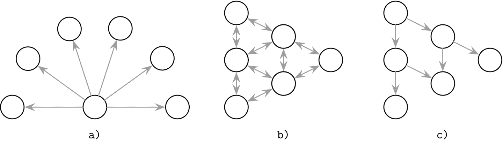
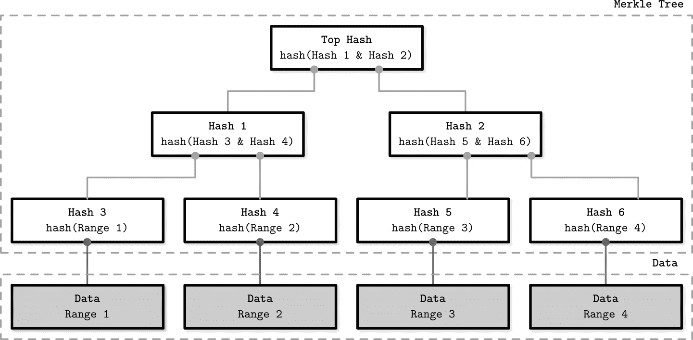
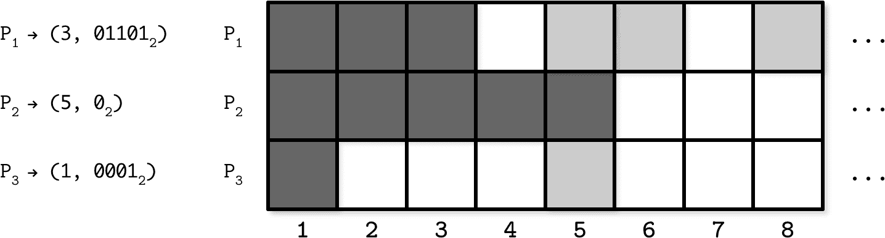
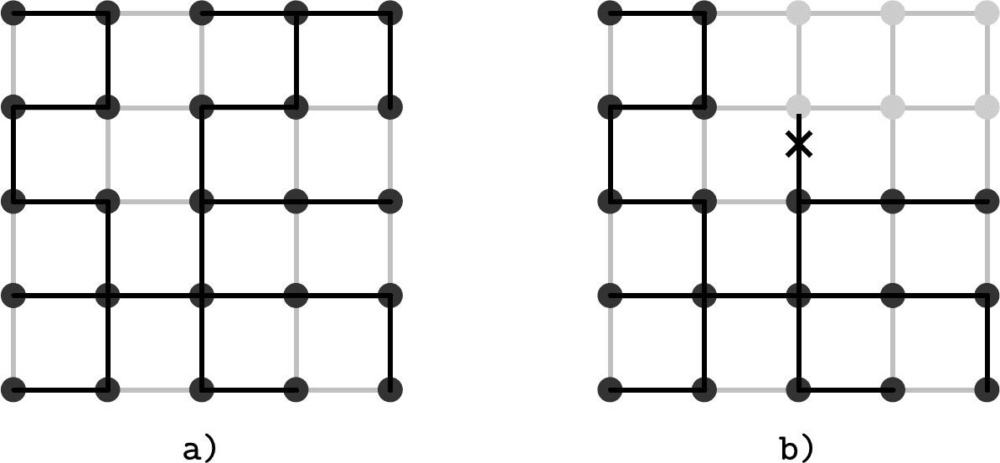
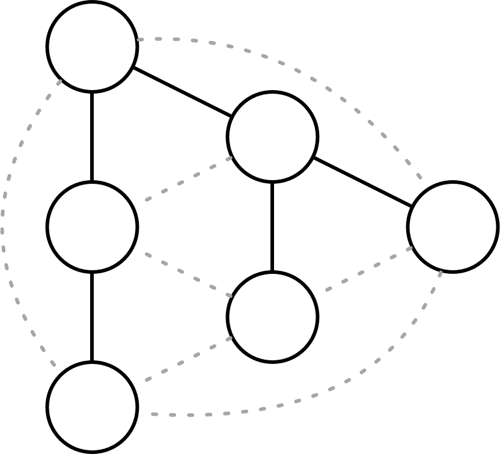

# 第十二章： 反熵和传播

我们迄今讨论的大多数通信模式要么是点对点的，要么是一对多的（协调器和副本）。 要可靠地在整个系统中传播数据记录，我们需要传播节点可用且能够到达其他节点，但即便如此，吞吐量仍然受限于单台机器。

快速可靠的传播对于数据记录可能不那么适用，但对于集群范围的元数据（如成员信息（加入和离开节点）、节点状态、故障、模式更改等）更为重要。 包含此类信息的消息通常不频繁且很小，但必须尽快和可靠地传播。

这类更新通常可以使用三种广义的方法之一向集群中的所有节点传播[[DEMERS87]](app01.html#DEMERS87)；这些通信模式的示意图显示在图 12-1 中：

+   a) 从一个进程向*所有*其他进程广播通知。

+   b) 定期点对点信息交换。 对等方成对连接并交换消息。

+   c) 合作广播，其中消息接收者成为广播者，帮助更快更可靠地传播信息。

###### 图 12-1\. 广播（a）、反熵（b）和八卦（c）

将消息广播到所有其他进程是最直接的方法，在集群中节点数较少时效果很好，但在大集群中可能*昂贵*且由于对单个进程的过度依赖而*不可靠*。 个别进程可能并不总是知道网络中所有其他进程的存在。 此外，必须在广播过程和*每一个*接收者都处于运行状态的时间重叠一段时间，这在某些情况下可能很难实现。

要放宽这些约束，我们可以假设*某些*更新可能未能传播。 协调器将尽力将消息传递给所有可用的参与者，然后反熵机制将在有任何故障的情况下将节点重新同步。 这样，消息传递的责任由系统中的所有节点共同承担，并分为两个步骤：主要传递和定期同步。

*熵*是表示系统中混乱程度的属性。 在分布式系统中，熵表示节点之间状态的程度分歧。 由于这种属性是不受欢迎的，并且其数量应尽量保持最低限度，因此有许多技术可帮助处理熵。

如果主要交付机制失败，反熵通常用于使节点保持最新状态。即使协调节点在某些时候失败，系统仍可以继续正常运行，因为其他节点将继续传播信息。换句话说，反熵用于在最终一致的系统中降低收敛时间界限。

为了保持节点同步，反熵触发后台或前台进程，比较和调解缺失或冲突记录。后台反熵进程使用辅助结构，如默克尔树和更新日志来识别分歧。前台反熵进程通过读取或写入请求：暗示的转交，读修复等。

如果复制系统中的副本出现分歧，为了恢复一致性并将其同步，我们必须通过逐对比较副本状态来查找和修复缺失的记录。对于大型数据集，这可能非常昂贵：我们必须在两个节点上读取整个数据集，并通知副本有关尚未传播的更近状态更改。为了减少此成本，我们可以考虑副本可能过时的方式和数据访问模式。

# 读修复

在读取期间最容易检测副本之间的分歧，因为此时我们可以联系副本，请求每个副本的查询状态，并查看它们的响应是否匹配。注意，在这种情况下，我们不会查询存储在每个副本上的整个数据集，我们的目标仅限于客户端请求的数据。

协调节点执行分布式读取，乐观地假设副本同步并且具有相同的可用信息。如果副本发送不同的响应，协调节点将向缺少更新的副本发送缺失的更新。

这种机制称为*读修复*。通常用于检测和消除不一致。在读修复期间，协调节点向副本发送请求，等待它们的响应，并进行比较。如果某些副本错过了最近的更新并且它们的响应不同，协调节点将检测到不一致性，并将更新发送回副本[[DECANDIA07]](app01.html#DECANDIA07)。

一些 Dynamo 风格的数据库选择取消要求联系*所有*副本，并改用可调整的一致性级别。为了返回一致的结果，我们不必联系和修复所有副本，而只需联系满足一致性级别的节点数。如果我们进行*仲裁*读取和写入，我们仍然可以获得一致的结果，但某些副本可能仍然不包含所有写入。

读修复可以实现为*阻塞*或*异步*操作。在阻塞读修复期间，原始客户端请求必须等到协调节点“修复”副本。异步读修复简单地安排一个任务，该任务可以在返回结果给用户后执行。

*阻塞*读修复确保了对于四分之三读取来说的读取[单调性](https://databass.dev/links/1)（见“会话模型”）：一旦客户端读取了特定值，后续的读取将返回至少与它所见的最新值相同的值，因为副本状态已被修复。如果我们不使用四分之三读取，我们将失去此单调性保证，因为数据可能在后续读取时尚未传播到目标节点。与此同时，阻塞读修复会牺牲可用性，因为修复必须由目标副本确认，并且在它们响应之前读取无法返回。

为了准确检测副本响应之间的差异记录，一些数据库（例如，Apache Cassandra）使用带有[合并监听器](https://databass.dev/links/2)的专用迭代器，用于重构合并结果与各个输入之间的差异。其输出然后由协调器用于通知副本有关缺失数据的情况。

读修复假定副本*大多*是同步的，我们不希望每个请求都回退到阻塞修复。由于阻塞修复的读单调性，我们还可以期望后续请求返回相同的一致结果，只要在其间没有已完成的写操作。

# 摘要读取

协调器可以只发出一个完整读取请求，并向其他副本发送*摘要*请求，而不是向每个节点发出完整读取请求。摘要请求读取副本本地数据，并计算此响应的哈希值，而不返回请求数据的完整快照。现在，协调器可以计算完整读取的哈希值，并将其与所有其他节点的摘要进行比较。如果所有摘要匹配，它可以确信副本是同步的。

如果摘要不匹配，协调器就不知道哪些副本领先，哪些落后。为了使落后的副本与其他节点同步，协调器必须对任何响应摘要不同的副本发出完整读取请求，比较它们的响应，协调数据，并向落后的副本发送更新。

###### 注意

摘要通常使用非加密哈希函数（例如 MD5）计算，因为必须快速计算以使“快乐路径”性能良好。哈希函数可能存在*冲突*，但对于大多数现实世界的系统来说，其概率可以忽略不计。由于数据库通常使用不止一个反熵机制，我们可以预期即使在哈希冲突的不太可能事件中，数据也将通过不同的子系统协调。

# 提示转交

另一种反熵方法称为*提示式交接*[[DECANDIA07]](app01.html#DECANDIA07)，这是一种写侧修复机制。如果目标节点未能确认写入操作，写入协调器或其中一个副本会存储一个称为*提示*的特殊记录，该记录会在目标节点恢复后立即重播。

在 Apache Cassandra 中，除非使用`ANY`一致性级别[[ELLIS11]](app01.html#ELLIS11)，否则提示写入不计入复制因子（参见“可调一致性”），因为提示日志中的数据不可用于读取，仅用于帮助落后的参与者追赶。

例如，某些数据库，如 Riak，与提示式交接一起使用*草率的仲裁*。在草率的仲裁中，如果副本发生故障，写操作可以使用节点列表中的额外健康节点，这些节点不必是执行操作的目标副本。

例如，假设我们有一个包含节点 `{A, B, C, D, E}` 的五节点集群，其中 `{A, B, C}` 是执行写操作的副本，而节点 `B` 已下线。作为查询的协调器，`A` 选择节点 `D` 来满足草率的仲裁，并保持所需的可用性和耐久性保证。现在，数据被复制到 `{A, D, C}`。然而，`D` 上的记录将在其元数据中有一个提示，因为写入最初是为 `B` 设计的。一旦 `B` 恢复，`D` 将尝试将提示转发回 `B`。一旦提示在 `B` 上重放，它就可以安全地删除，而不会减少总副本数量[[DECANDIA07]](app01.html#DECANDIA07)。

在类似的情况下，如果节点 `{B, C}` 被网络分区短暂与集群其他部分隔离，并且对 `{A, D, E}` 执行了一个草率的仲裁写操作，则在此写操作之后立即对 `{B, C}` 进行读取，*将不会*观察到最新的读取[[DOWNEY12]](app01.html#DOWNEY12)。换句话说，草率的仲裁提高了可用性，但以一致性为代价。

# Merkle 树

由于读修复只能修复当前查询的数据中的不一致性，我们应该使用不同的机制来找到和修复那些当前未查询的数据中的不一致性。

正如我们已经讨论的，要精确找出副本之间分歧的行，需要逐对交换和比较数据记录。这是非常不切实际和昂贵的。许多数据库使用*Merkle 树*[[MERKLE87]](app01.html#MERKLE87)来降低协调成本。

Merkle 树构成了本地数据的紧凑哈希表示，构建了一个哈希树。该哈希树的最低级别通过扫描包含数据记录的整个表格，并计算记录范围的哈希来构建。更高级别包含低级别哈希的哈希，构建了一种层次表示，允许我们通过递归地跟随哈希树节点快速检测出现差异，从而定位不一致的范围。可以通过逐级交换和比较子树，或通过交换和比较整个树来完成这一过程。

图 12-2 展示了 Merkle 树的组成。最低级别由数据记录范围的哈希组成。每个更高级别的哈希由底层哈希的哈希计算而来，递归地重复此过程直至树根。

###### 图 12-2\. Merkle 树。灰色方框表示数据记录范围。白色方框表示哈希树的层级结构。

要确定两个副本之间是否存在不一致，我们只需要比较它们 Merkle 树的根级哈希。通过从顶部到底部逐对比较哈希，可以定位包含节点间差异的范围，并修复其中包含的数据记录。

由于 Merkle 树是从底部到顶部递归计算的，数据的任何变化都会触发整个子树的重新计算。树的大小（因此交换的消息大小）与其精度（数据范围的大小和精确性）之间存在权衡。

# 位图版本向量

最近的研究在这一主题上引入了*位图版本向量* [[GONÇALVES15]](app01.html#GONÇALVES15)，可以基于*最近性*解决数据冲突：每个节点保留本地或已复制的操作的对等对日志。在反熵过程中，比较日志，并将缺失的数据复制到目标节点。

每次由节点协调的写入由*点* `(i,n)`表示：一个具有节点本地序列号`i`的事件，由节点`n`协调。序列号`i`从`1`开始，每次节点执行写入操作时递增。

为了跟踪副本状态，我们使用节点本地逻辑时钟。每个时钟代表一组点，表示此节点直接看到的写入*（由节点自身协调）*或间接看到的写入*（由其他节点协调并复制）*。

在节点逻辑时钟中，由节点自身协调的事件将没有间隙。如果某些写入未从其他节点复制，则时钟将包含间隙。为了使两个节点重新同步，它们可以交换逻辑时钟，识别由缺失的点表示的间隙，然后复制与它们相关的数据记录。为此，我们需要重建每个点引用的数据记录。此信息存储在*dotted causal container*（DCC）中，该容器将点映射到给定键的因果信息。通过这种方式，冲突解决捕捉到写入之间的因果关系。

图 12-3（改编自[[GONÇALVES15]](app01.html#GONÇALVES15)）展示了系统中三个节点的状态表示示例，即`P[1]`、`P[2]`和`P[3]`，从`P[2]`的视角跟踪它已经看到的值。每当`P[2]`进行写入或接收复制的值时，它会更新此表。

###### 图 12-3\. 位图版本向量示例

在复制过程中，`P[2]`创建了此状态的紧凑表示，并创建了一个从节点标识符到最新值对的映射，该值对是它已经看到的连续写入值，并且位图中其他已看到的写入编码为`1`。`(3, 01101[2])`意味着节点`P[2]`已经看到了连续更新直到第三个值，并且它已经看到了相对于`3`的第二、第三和第五个位置的值（即，它已经看到了序列号为`5`、`6`和`8`的值）。

在与其他节点进行交换时，它将接收到其他节点看到的丢失更新。一旦系统中的所有节点都看到了索引`i`处的连续值，版本向量就可以截断到这个索引。

这种方法的优势在于它捕捉了数值写入之间的因果关系，并允许节点精确地识别其他节点上缺失的数据点。一个可能的缺点是，如果节点长时间宕机，对等节点无法截断日志，因为数据仍然需要在延迟节点恢复后进行复制。

# 八卦传播

> 群众总是心灵流行病的温床。
> 
> 卡尔·荣格

为了涉及其他节点，并使用广播的*覆盖范围*和反熵的*可靠性*传播更新，我们可以使用八卦协议。

*八卦协议*是基于人类社会中传播谣言或疾病传播方式的概率通信过程。谣言和流行病提供了描述这些协议如何工作的生动方式：谣言在人群仍然有兴趣听到它们时传播；疾病在人群中没有更多易感成员时停止传播。

流言协议的主要目标是使用合作传播将信息从一个进程传播到集群的其余部分。就像病毒通过一个人传播到另一个人一样，逐步扩大范围，信息也通过系统中继，涉及更多的进程。

持有必须传播的记录的进程称为*感染*。任何尚未接收更新的进程称为*易感*。在积极传播一段时间后，不愿意传播新状态的感染进程被称为*移除* [[DEMERS87]](app01.html#DEMERS87)。所有进程都从易感状态开始。每当某个数据记录的更新到达时，接收到更新的进程将移动到感染状态，并开始将更新传播给其他*随机*邻近进程，使它们感染。一旦感染进程确信更新已传播，它们就会移动到移除状态。

为了避免显式协调并维护全局收件人列表，以及需要单个协调器向系统中的每个其他参与者广播消息，这类算法使用*兴趣流失*函数来模拟完整性。然后通过多快速地*感染*尽可能多的节点来确定协议的效率，同时使由冗余消息引起的开销最小化。

流言可以用于同步消息传递的均匀分散系统中，其中节点可能没有长期成员资格，也不组织成任何拓扑结构。由于流言协议通常不需要显式协调，它们在具有灵活成员资格（节点频繁加入和离开）或网状网络的系统中非常有用。

流言协议非常健壮，并且在分布式系统固有的故障存在下能够实现高可靠性。由于消息以随机方式中继，即使它们之间的某些通信组件失败了，消息仍然可以通过不同的路径传递。可以说系统能够适应故障。

## 流言机制

进程周期性地随机选择`f`个对等节点（其中`f`是可配置的参数，称为*扇出*），并与它们交换当前“热”信息。每当进程从对等节点那里了解到新的信息片段时，它将尝试进一步传播。由于对等节点的选择是概率性的，总会有一些重叠，消息将被重复传递，并可能在一段时间内继续循环。*消息冗余*是捕获由重复传递引起的开销的度量标准。冗余是流言如何运作的重要属性，对其运行方式至关重要。

系统达到收敛所需的时间称为**延迟**。在达到收敛（停止八卦过程）和将消息传递给所有对等体之间存在轻微差异，因为可能会有一个短暂的时间段，在此期间所有对等体都被通知，但八卦仍在继续。扇出和延迟取决于系统的大小：在较大的系统中，我们要么增加扇出以保持延迟稳定，要么允许更高的延迟。

随着时间的推移，当节点注意到他们一遍又一遍地接收到相同的信息时，该消息将开始失去重要性，节点最终必须停止中继它。失去兴趣可以通过*概率*计算（在每个步骤上计算传播停止的概率）或使用*阈值*（计算接收到的重复数量，并在此数字过高时停止传播）进行。这两种方法都必须考虑集群大小和扇出。计算重复以测量收敛可以改善延迟并减少冗余[[DEMERS87]](app01.html#DEMERS87)。

在一致性方面，**八卦协议**提供*收敛*一致性[[BIRMAN07]](app01.html#BIRMAN07)：节点更有可能对过去发生的事件有相同的视图。

## 覆盖网络

尽管八卦协议非常重要且有用，但通常只适用于一小部分问题集。非流行方法可以以非概率的确定性分发消息，减少冗余，并通常以更优化的方式[[BIRMAN07]](app01.html#BIRMAN07)。八卦算法通常因其可伸缩性而受到赞扬，事实上可以在`log N`消息轮次内（其中`N`是集群的大小）分发消息[[KERMARREC07]](app01.html#KERMARREC07)，但重要的是要记住在八卦轮次期间产生的*冗余*消息数量。为了实现可靠性，基于八卦的协议产生*某些*重复消息传递。

随机选择节点极大地提高了系统**鲁棒性**：如果有网络分区，只要存在间接连接两个进程的链路，消息最终会被传递。这种方法的明显缺点在于它不是消息最优的：为了保证鲁棒性，我们必须在对等体之间维护冗余连接并发送冗余消息。

在八卦系统中两种方法之间的一种折中是构建一个*临时*固定拓扑。这可以通过创建一组对等体的*覆盖网络*来实现：节点可以对其对等体进行采样，并基于接近度（通常由延迟衡量）选择最佳联系点。

系统中的节点可以形成**生成树**：无向、无环、具有不同边的图，覆盖整个网络。有了这样的图，消息可以在固定步数内分布。

图 12-4 展示了一个跨度树的示例：^(1)

+   a）我们在不使用所有边的情况下实现了点之间的完全连接。

+   b）如果仅有一个链接断开，我们可能会失去与整个子树的连接。

###### 图 12-4\. 跨度树。 黑点代表节点。 黑线代表覆盖网络。 灰线表示节点之间的其他可能存在的连接。

这种方法的一个潜在缺点是，它可能导致形成彼此之间具有强烈偏好的互连“岛屿”。

为了保持消息数量低，同时在连接丢失时允许快速恢复，当系统处于*稳定*状态时，我们可以混合使用两种方法——固定拓扑和基于树的广播，并为*故障转移*和系统恢复退回到八卦。

## 混合八卦

*推送/懒推送多播树*（李提奥 07）[[LEITAO07]](app01.html#LEITAO07)在传播原语方面权衡了流行病和基于树的广播。 Plumtrees 通过创建节点的跨度树覆盖来*积极*以最小的开销分发消息。在正常情况下，节点仅向由对等抽样服务提供的小子集发送完整消息。

每个节点将完整消息发送给小子集的节点，对于其余节点，它*懒惰地*仅转发消息 ID。如果节点收到其从未见过的消息标识符，则可以查询其对等方以获取该消息。此*懒惰推送*步骤确保高可靠性并提供快速修复广播树的方法。在失败情况下，协议通过懒惰推送步骤退回到八卦方法，广播消息并修复覆盖。

由于分布式系统的性质，任何节点或节点之间的链接可能随时失败，使得在段不可达时无法遍历树。懒惰的八卦网络帮助通知对等方有关已见消息以构建和修复树。

图 12-5 显示了这种双重连接的示例：节点通过最优跨度树（实线）和懒惰八卦网络（虚线）连接。此图示并未代表任何特定的网络拓扑，而仅代表节点之间的*连接*。

###### 图 12-5\. 懒惰和急切推送网络。 实线表示广播树。 虚线表示懒惰八卦连接。

使用懒惰推送机制进行树的构建和修复的优势之一是，在负载恒定的网络中，它往往会生成最小化消息延迟的树，因为首先响应的节点被添加到广播树中。

## 部分视图

向所有已知对等体广播消息并维护群集的完整视图可能变得昂贵且不切实际，特别是如果*翻转*（系统中加入和离开节点的数量测量）很高的情况下。为了避免这种情况，疏散协议通常使用*对等体抽样服务*。该服务维护群集的*部分视图*，并定期使用疏散来刷新。部分视图重叠，因为疏散协议希望具有一定程度的冗余，但是过多的冗余意味着我们在做额外的工作。

例如，混合部分视图（HyParView）协议[[LEITAO07]](app01.html#LEITAO07)维护一个小的*活动*视图和一个较大的*被动*视图。来自活动视图的节点创建一个可以用于传播的覆盖层。被动视图用于维护一个节点列表，可以用来替换活动视图中失败的节点。

定期，节点执行洗牌操作，在此期间，它们交换其活动和被动视图。在此交换过程中，节点将从其对等体收到的活动和被动视图成员添加到其被动视图中，并删除最老的值以限制列表大小。

活动视图根据该视图中节点的状态变化和来自对等体的请求进行更新。如果进程`P[1]`怀疑其活动视图中的对等体`P[2]`已失败，则`P[1]`将从其活动视图中删除`P[2]`并尝试与被动视图中的替代进程`P[3]`建立连接。如果连接失败，则将从`P[1]`的被动视图中删除`P[3]`。

根据`P[1]`的活动视图中的进程数量，如果`P[3]`的活动视图已满，`P[3]`可能会选择拒绝连接。如果`P[1]`的视图为空，则`P[3]`*必须*用`P[1]`替换其当前的某个活动视图对等节点。这有助于快速引导或恢复节点，使其快速成为群集的有效成员，但代价是一些连接的循环。

这种方法通过仅使用活动视图节点来进行传播来减少系统中的消息数量，同时通过使用被动视图作为恢复机制来保持高可靠性。其中一个性能和质量度量指标是点对点抽样服务在拓扑重组情况下收敛到稳定覆盖层的速度[[JELASITY04]](app01.html#JELASITY04)。HyParView 在这里表现相当出色，因为它维护视图的方式以及它如何优先考虑引导过程。

HyParView 和 Plumtree 采用*混合八卦*方法：使用少量同行广播消息，并在失败和网络分区时回退到更广泛的同行网络。这两个系统不依赖包含所有同行的全局视图，这不仅仅因为系统中节点的数量很大（大多数情况下并非如此），还因为维护每个节点上最新成员列表所需的成本。部分视图允许节点仅与少量相邻节点积极通信。

# 概要

最终一致性系统允许副本状态发散。可调一致性允许我们在一致性和可用性之间进行权衡。可以使用一种反熵机制解决副本发散：

暗示的交接

在目标节点宕机时，临时将写操作存储在相邻节点上，并在目标节点恢复时重新播放。

读修复

在读取过程中通过比较响应来协调请求的数据范围，检测缺失记录并发送给落后的副本。

Merkle 树

通过计算和交换哈希树来检测需要修复的数据范围。

位图版本向量

通过维护包含关于最近写操作信息的紧凑记录，检测丢失的副本写入。

这些反熵方法优化了三个参数之一：范围减少、时效性或完整性。我们可以通过仅同步正在积极查询的数据（读修复）或单个丢失写入（暗示的交接）来减少反熵的范围。如果我们假设大多数故障是暂时的，并且参与者尽快从中恢复，我们可以存储最近发生的发散事件日志，并在故障发生时知道需要同步的确切内容（位图版本向量）。如果我们需要在多个节点上成对比较整个数据集并有效地找出它们之间的差异，我们可以对数据进行哈希并比较哈希（Merkle 树）。

为了在大规模系统中可靠地分发信息，可以使用八卦协议。混合八卦协议在可能的情况下减少交换的消息数量，同时保持对网络分区的抗性。

许多现代系统使用八卦协议进行故障检测和成员信息[[DECANDIA07]](app01.html#DECANDIA07)。 HyParView 在[Partisan](https://databass.dev/links/3)中使用，这是一个高性能、高可扩展性的分布式计算框架。 Plumtree 在[Riak 核心](https://databass.dev/links/4)中用于整个集群信息。

^(1) 此示例仅用于说明：网络中的节点通常不是按网格排列的。
