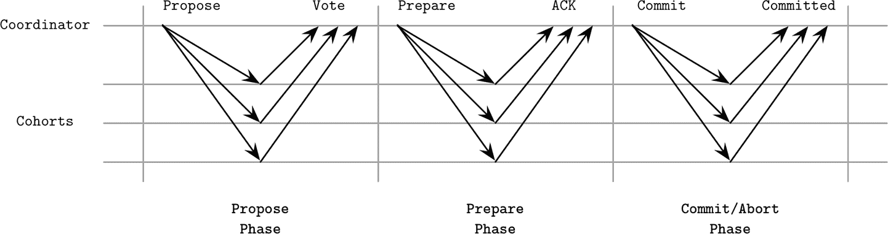

# 第十三章：分布式事务

要在分布式系统中保持顺序，我们必须至少保证一定的一致性。在“一致性模型”中，我们讨论了单对象、单操作的一致性模型，这些模型帮助我们推理关于单个操作的情况。然而，在数据库中，我们经常需要原子地执行*多个*操作。

原子操作通常通过状态转换来解释：特定事务开始前，数据库处于状态`A`；事务结束时，状态从`A`变为`B`。操作方面，这很容易理解，因为事务没有预先确定的附加状态。相反，它们从某个时间点开始对数据记录应用操作。这为我们在调度和执行方面提供了一些灵活性：事务可以重新排序甚至重试。

事务处理的主要焦点是确定可接受的*历史*，以建模和表示可能的交错执行场景。在这种情况下，历史代表一个依赖图：在当前事务执行之前执行了哪些事务。如果历史可序列化，那么它相当于某些以顺序执行这些事务的历史（即具有相同的依赖图）。您可以在“可序列化性”中查阅关于历史、它们的等价性、可序列化性和其他概念的概念。一般来说，这一章是第五章的分布式系统对应章节，我们在其中讨论了节点本地事务处理。

单分区事务涉及我们在第五章中讨论过的悲观（基于锁或跟踪）或乐观（尝试和验证）并发控制方案，但这两种方法都不能解决多分区事务的问题，这些事务需要在不同服务器之间进行协调，分布式提交和回滚协议。

一般来说，当从一个帐户转账到另一个帐户时，您希望同时向第一个帐户存款并从第二个帐户取款。然而，即使我们将交易分解为单独的步骤，即使是借方或贷方看起来也不是原子的：我们需要读取旧余额，添加或减去所需金额，并保存结果。这些子步骤中的每一个都涉及多个操作：节点接收请求，解析请求，定位磁盘上的数据，进行写操作，最后确认操作。即使这已经是一个相对高层次的视角：要执行一个简单的写操作，我们必须执行数百个小步骤。

这意味着我们必须首先*执行*事务，然后才能使其结果*可见*。但让我们首先定义一下什么是事务。*事务*是一组操作，是一个原子执行单元。事务的原子性意味着其所有结果要么全部变为可见，要么全部不可见。例如，如果我们在一个事务中修改了几行，甚至是几个表，这些修改要么全部应用，要么全部不应用。

为了确保原子性，事务应该是*可恢复*的。换句话说，如果事务无法完成、中止或超时，其结果必须完全回滚。一个不可恢复的部分执行的事务可能会使数据库处于不一致状态。总结来说，如果事务执行失败，数据库状态必须恢复到其先前的状态，就好像这个事务从未尝试过一样。

另一个重要方面是网络分区和节点故障：系统中的节点会独立地发生故障和恢复，但它们的状态必须保持一致。这意味着原子性要求不仅适用于本地操作，还适用于在其他节点执行的操作：更改必须耐久地传播到涉及到的所有节点或者完全不传播[[LAMPSON79]](app01.html#LAMPSON79)。

# 使操作看起来是原子的

为了使多个操作看起来是原子的，特别是如果其中一些操作是远程的，我们需要使用一类称为*原子提交*的算法。原子提交不允许参与者之间产生分歧：即使一个参与者反对，事务也*不会*提交。与此同时，这意味着*失败*的进程必须与其他同伴达成相同的结论。这个事实的另一个重要含义是，在存在拜占庭失败时，原子提交算法无法工作：当进程关于其状态撒谎或者决定一个任意值时，因为它违反了一致性[[HADZILACOS05]](app01.html#HADZILACOS05)。

原子提交试图解决的问题是就是否执行所提出的事务达成一致意见。同伴不能选择、影响或更改提出的事务，也不能提出任何替代方案：他们只能就是否愿意执行它发表投票[[ROBINSON08]](app01.html#ROBINSON08)。

原子提交算法不对事务*准备*、*提交*或*回滚*操作的语义设置严格的要求。数据库实施者必须决定：

+   当数据被认为准备提交时，它们只需进行指针交换即可使更改公开。

+   如何执行提交本身以使事务结果在最短时间内可见。

+   如果算法决定不提交，如何回滚事务所做的更改。

我们在第五章中讨论了这些过程的节点本地实现。

许多分布式系统使用原子提交算法，例如，MySQL（用于[分布式事务](https://databass.dev/links/5)）和 Kafka（用于生产者和消费者交互[[MEHTA17]](app01.html#MEHTA17)）。

在数据库中，分布式事务由通常称为*事务管理器*的组件执行。事务管理器是一个子系统，负责调度、协调、执行和跟踪事务。在分布式环境中，事务管理器负责确保节点本地可见性保证与分布式原子操作规定的可见性一致。换句话说，事务在所有分区和所有副本上都提交。

我们将讨论两种原子提交算法：解决承诺问题的两阶段提交，但不允许协调者进程失败；以及解决*非阻塞原子提交*问题的三阶段提交[[SKEEN83]](app01.html#SKEEN83)，并允许参与者在协调者失败的情况下继续[[BABAOGLU93]](app01.html#BABAOGLU93)。

# 两阶段提交

让我们从一个最简单的协议开始，用于允许多分区*原子*更新的分布式提交（有关分区更多信息，请参阅“数据库分区”）。*两阶段提交*（2PC）通常在数据库事务的上下文中讨论。2PC 分为两个阶段执行。在第一阶段，决定的值被分发，并收集投票。在第二阶段，节点只需切换开关，使第一阶段的结果可见。

2PC 假设存在一个*领导者*（或*协调者*），该领导者持有状态，收集投票，并是协议循环的主要参考点。其余的节点称为*同僚*。在这种情况下，同僚通常是操作于不相交数据集的分区，反对执行事务。协调者和每个同僚为每个执行步骤保留本地操作日志。参与者投票接受或拒绝由协调者提出的某个*值*。最常见的情况是，这个值是要执行的分布式事务的标识符，但 2PC 也可以用于其他情境。

协调者可以是收到执行事务请求的节点，也可以是随机选取的节点，使用领导选举算法、手动分配，甚至在系统的整个生命周期内固定使用的节点。协议不对协调者角色施加限制，并且角色可以为了可靠性或性能而转移到另一个参与者。

顾名思义，两阶段提交分为两个步骤执行：

准备

协调者通过发送`Propose`消息通知成员有新的事务。成员决定他们是否可以提交适用于他们的事务部分。如果成员决定可以提交，它通知协调者有积极的投票。否则，它回复协调者，要求中止事务。成员做出的所有决策都记录在协调者日志中，并且每个成员在本地保存决策的副本。

提交/中止

事务中的操作可以跨不同分区（每个由成员代表）。如果其中一个成员投票中止事务，协调者将向所有成员发送`Abort`消息。只有所有成员都投票赞成时，协调者才会向它们发送最终的`Commit`消息。

这一过程显示在图 13-1 中。

在*准备*阶段，协调者分发提议值，并且收集来自参与者的投票，确定是否应该提交这个提议值。例如，如果另一个冲突的事务已经提交了不同的值，成员可以选择拒绝协调者的提议。

###### 图 13-1\. 两阶段提交协议。在第一阶段，各个成员被通知有新的事务。在第二阶段，事务被提交或者终止。

当协调者收集到所有投票后，它可以决定是*提交*事务还是*中止*事务。如果所有的成员都投票赞成，它决定提交并且通过发送`Commit`消息通知他们。否则，协调者向所有成员发送一个`Abort`消息，事务被回滚。换句话说，如果一个节点拒绝了提议，整个轮次就被中止。

在每一步中，协调者和成员必须将每个操作的结果写入持久存储，以便能够重建状态并在本地故障时恢复，并且能够将结果转发和重放给其他参与者。

在数据库系统的背景下，每个两阶段提交的轮次通常负责一个单独的事务。在*准备*阶段，事务内容（操作、标识符和其他元数据）从协调者传输到各个成员。事务由各个成员本地执行，并且保持在*部分提交*状态（有时称为*预提交*），使得协调者可以在下一个阶段通过提交或者中止来最终执行。在事务提交时，其内容已经持久地存储在所有其他节点上 [[BERNSTEIN09]](app01.html#BERNSTEIN09)。

## 两阶段提交中的成员失败

让我们考虑几种失败场景。例如，如图 13-2 所示，如果其中一个队伍在*提议*阶段失败，协调者无法进行提交，因为它需要所有的投票都是积极的。如果其中一个队伍不可用，协调者将中止事务。这一要求对可用性有负面影响：单个节点的故障可能会阻止事务的发生。例如，一些系统，例如 Spanner（参见“Spanner 中的分布式事务”），通过 Paxos 组执行 2PC 而不是单独的节点，以提高协议的可用性。

###### 图 13-2\. 提议阶段期间的队伍失败

2PC 的主要思想是一个**承诺**，即一旦一个队伍积极响应了提议，它将不会反悔，所以只有协调者可以中止事务。

如果其中一个队伍在接受提议后失败了，它必须在能正确提供值之前了解投票的实际结果，因为协调者可能因为其他队伍的决定而中止了提交。当队伍节点恢复时，它必须跟上最终协调者的决定。通常，这是通过在协调者端持久化决策日志并将决策值复制到失败的参与者来完成的。在此之前，该队伍不能提供请求，因为它处于不一致状态。

由于协议在多个地方等待其他参与者（当协调者收集投票时，或者队伍在等待提交/中止阶段），链路故障可能导致消息丢失，并且此等待将无限期地继续。如果协调者在提议阶段未收到复制体的响应，它可以触发超时并中止事务。

## 2PC 中的协调者故障

如果其中一个队伍在第二阶段未收到协调者的提交或中止命令，如图 13-3 所示，它应尝试查明协调者所做的决定。协调者可能已经决定了值，但无法将其通知给特定的复制体。在这种情况下，关于决定的信息可以从对等方的事务日志或备份协调者中复制。复制提交决策是安全的，因为它总是一致的：2PC 的整个目的是在所有站点上要么提交要么中止，并且在一个队伍上的提交意味着所有其他队伍都必须提交。

###### 图 13-3\. 提议阶段后的协调者故障

在第一阶段，协调者收集投票和追随者的承诺，即它们将等待其明确的提交或中止命令。如果协调者在收集投票后但广播投票结果前失败，那么追随者将处于不确定状态。如 图 13-4 所示。追随者不知道协调者的确切决定是什么，以及是否已经通知了任何参与者（潜在的也可能是不可达的）关于事务结果 [[BERNSTEIN87]](app01.html#BERNSTEIN87)。

###### 图 13-4\. 在协调者联系到任何追随者之前发生了协调者失败

协调者无法继续提交或中止会使集群处于未决状态。这意味着在永久性协调者失败的情况下，追随者将无法了解最终决策。因此我们称两阶段提交为 *阻塞* 原子提交算法。如果协调者永不恢复，其替代者必须重新收集给定事务的投票，并作出最终决定。

许多数据库使用两阶段提交：MySQL，[PostgreSQL](https://databass.dev/links/6)，MongoDB，^(2) 以及其他。由于其简单性（易于理解、实现和调试）和低开销（消息复杂度和协议的往返次数少），两阶段提交通常用于实现分布式事务。重要的是实施适当的恢复机制并有备份协调者节点以减少上述失败的机会。

# 三阶段提交

为了使原子提交协议在协调者失败时更加健壮并避免未决状态，三阶段提交（3PC）协议添加了一个额外的步骤，并在 *双方* 都设有超时，这可以让追随者根据系统状态进行提交或中止。3PC 假设同步模型并且不可能发生通信故障 [[BABAOGLU93]](app01.html#BABAOGLU93)。

三阶段提交在提交/中止步骤之前添加了一个 *准备* 阶段，该阶段在提出阶段由协调者收集的追随者状态，允许协议继续进行即使协调者失败。3PC 的所有其他属性及要求在回合中有协调者与其两阶段的兄弟类似。3PC 的另一个有用的补充是追随者端的超时。根据当前执行的步骤，超时会强制执行提交或中止决策。

如 图 13-5 所示，三阶段提交包括三个步骤：

提出

协调者发送一个建议值并收集投票。

准备

协调者通知队员有关投票结果。如果投票通过且所有队员决定提交，则协调者发送`Prepare`消息，指示它们准备提交。否则，将发送一个`Abort`消息并完成该轮。

提交

协调者通知队员提交事务。

###### 图 13-5\. 三阶段提交

在*propose*步骤期间，类似于两阶段提交（2PC），协调者分发建议值并从队员收集投票，如图 13-5 所示。如果协调者在此阶段崩溃并且操作超时，或者其中一个队员投反对票，则事务将被中止。

在收集投票之后，协调者做出决策。如果协调者决定继续事务，则发出`Prepare`命令。可能会出现协调者无法将准备消息分发给所有队员或未能收到其确认的情况。在这种情况下，由于算法未能完全进入*prepared*状态，队员可能会在超时后中止事务。

一旦所有队员成功进入准备状态并且协调者已收到他们的准备确认，如果任一方失败，事务将被提交。由于此时所有参与者都对状态具有相同的视图，因此可以这样做。

在*commit*阶段期间，协调者向所有参与者通信*prepare*阶段的结果，重置其超时计数器，并有效地完成事务。

## 三阶段提交中的协调者故障

所有状态转换都是协调的，队员在前一个阶段完成之前不能进入下一个阶段：协调者必须等待副本继续。如果队员在超时前未从协调者那里收到消息，并且未能超过准备阶段，则最终可能会中止事务。

正如我们之前讨论的那样，两阶段提交（2PC）无法从协调者故障中恢复，队员可能会陷入非确定性状态，直到协调者回来。三阶段提交（3PC）避免在这种情况下阻塞进程，并允许队员进行确定性决策。

三阶段提交的最坏情况是网络分区，如图 13-6 所示。一些节点成功进入准备状态，现在可以在超时后继续提交。有些节点无法与协调者通信，并将在超时后中止。这导致了脑裂：一些节点继续提交，一些中止，所有操作都遵循协议，使参与者处于不一致和矛盾的状态。

###### 图 13-6\. 第二阶段协调者故障

虽然从理论上讲，三阶段提交在一定程度上解决了二阶段提交的阻塞问题，但它具有更大的消息开销，引入潜在矛盾，并且在网络分区存在时工作效果不佳。这可能是三阶段提交在实践中未被广泛使用的主要原因。

# 使用 Calvin 进行分布式事务

我们已经涉及了同步成本及其几种解决方法的主题。但是还有其他减少争用和事务持有锁时间总量的方法。其中一种方法是在获取锁并进行执行之前，让副本同意执行顺序和事务边界。如果我们能做到这一点，节点故障不会导致事务中止，因为节点可以从并行执行同一事务的其他参与者那里恢复状态。

传统数据库系统使用两阶段锁定或乐观并发控制执行事务，并没有确定性事务顺序。这意味着节点必须协调以保留顺序。确定性事务顺序在执行阶段消除了协调开销，由于所有副本获得相同的输入，它们也会产生等效的输出。这种方法通常称为 Calvin，一个快速的分布式事务协议 [[THOMSON12]](app01.html#THOMSON12)。通过 Calvin 实现分布式事务的突出例子之一是 [FaunaDB](https://databass.dev/links/8)。

为了实现确定性顺序，Calvin 使用一个 *顺序器*：所有事务的入口点。顺序器确定事务执行顺序，并建立全局事务输入序列。为了最小化争用并批处理决策，时间轴被分割为 *时代*。顺序器收集事务并将它们分组到短时间窗口中（原始论文提到 10 毫秒批处理），这也成为复制单元，因此事务不必单独通信。

一旦事务批次成功复制，顺序器将其转发给 *调度程序*，后者编排事务执行。调度程序使用确定性调度协议，可以在并行执行事务的同时保留由顺序器指定的串行执行顺序。由于将事务应用到特定状态只会产生事务指定的更改，并且事务顺序是预定的，副本不必进一步与顺序器通信。

Calvin 中的每个事务都有一个 *读集*（其依赖项，即执行所需的当前数据库状态中的数据记录集合）和一个 *写集*（事务执行的结果；换句话说，它的副作用）。Calvin 并不原生支持依赖于额外读取的事务，这些读取将确定读写集。

由调度程序管理的工作线程在四个步骤中继续执行：

1.  它分析事务的读取和写入集，确定来自读集的节点本地数据记录，并创建*活动*参与者列表（即持有写集元素并将对数据进行修改的节点）。

1.  它收集执行事务所需的*本地*数据，换句话说，发生在该节点上的读集记录。收集的数据记录被转发给相应的*活动*参与者。

1.  如果此工作线程正在活动参与者节点上执行，则它接收从其他参与者转发的数据记录，作为步骤 2 执行期间执行的操作的对应。

1.  最后，它执行一个事务批处理，将结果持久化到本地存储。它不必将执行结果转发到其他节点，因为它们接收相同的事务输入并在本地执行和持久化结果。

典型的 Calvin 实现将顺序器、调度器、工作器和存储子系统放置在一起，如图 13-7 所示。为确保顺序器对当前时期/批次中确切进入的事务达成共识，Calvin 使用 Paxos 共识算法（参见“Paxos”）或异步复制，在这种复制中，专用副本充当领导者。尽管使用领导者可以提高延迟，但在节点必须重现失败领导者的状态以继续时，它带来了更高的恢复成本。

###### 图 13-7\. Calvin 架构

# 使用 Spanner 的分布式事务

Calvin 经常与另一种分布式事务管理方法 Spanner 进行对比[[CORBETT12]](app01.html#CORBETT12)。其实现（或衍生版本）包括几个开源数据库，最显著的是[CockroachDB](https://databass.dev/links/9)和[YugaByte DB](https://databass.dev/links/10)。Calvin 通过在顺序器上达成共识来建立全局事务执行顺序，而 Spanner 则在每个分区（即每个分片）上使用共识组的两阶段提交。Spanner 的设置相当复杂，在本书的范围内我们只涵盖高层次的细节。

为了实现一致性并强加事务顺序，Spanner 使用*TrueTime*：一个高精度的挂钟 API，还公开一个不确定性边界，允许本地操作引入人为减速以等待不确定性边界过去。

Spanner 提供三种主要操作类型：*读写事务*，*只读事务*和*快照读取*。读写事务需要锁定，悲观并发控制，并且需要领导副本的存在。只读事务无需锁定，并且可以在任何副本上执行。仅在需要在*最新*时间戳处读取时才需要领导者，这会获取 Paxos 组中最新提交的值。在特定时间戳处的读取是一致的，因为值被版本化，且快照内容一旦写入就无法更改。每个数据记录都有一个分配的时间戳，它保存了事务提交时间的值。这也意味着可以存储记录的多个时间戳版本。

图 13-8 展示了 Spanner 架构。每个*spanserver*（副本，为客户端提供数据服务的服务器实例）持有多个*tablet*，每个 tablet 上附加了 Paxos 状态机（见“Paxos”）。副本被分组成称为 Paxos 组的副本集，这是数据放置和复制的单位。每个 Paxos 组都有一个长期存在的领导者（见“Multi-Paxos”）。领导者在多分片事务期间相互通信。

###### 图 13-8\. Spanner 架构

每次写操作都必须通过 Paxos 组的领导者进行，而读操作可以直接从最新的复制副本上的平板提供服务。领导者持有一个*锁表*，用于使用两阶段锁定（见“基于锁的并发控制”）机制实现并发控制，以及一个*事务管理器*，负责多分片分布式事务。需要同步的操作（例如事务内的写入和读取）必须从锁表中获取锁，而其他操作（快照读取）可以直接访问数据。

对于多分片事务，组领导者必须协调并执行两阶段提交以确保一致性，并使用两阶段锁定以确保隔离性。由于 2PC 算法要求所有参与者都在场才能成功提交，这会影响可用性。Spanner 通过使用 Paxos 组而不是单个节点作为同行解决了这个问题。这意味着即使组的某些成员宕机，2PC 也可以继续运行。在 Paxos 组内，2PC 仅与充当领导者的节点联系。

Paxos 组用于在多个节点之间一致地复制事务管理器状态。Paxos 领导者首先获取写锁，并选择一个写入时间戳，该时间戳保证大于任何先前事务的时间戳，并通过 Paxos 记录一个`prepare`条目。事务协调器收集时间戳，并生成一个大于所有准备时间戳的提交时间戳，并通过 Paxos 记录一个`commit`条目。然后，它等待直到选择的提交时间戳之后，因为它必须保证客户端只会看到过去时间戳的事务结果。之后，它将这个时间戳发送给客户端和领导者，它们在本地 Paxos 组中记录带有新时间戳的`commit`记录，并可以释放锁。

单分片事务不必咨询事务管理器（因此也不必执行跨分区两阶段提交），因为咨询 Paxos 组和锁表足以保证分片内的事务顺序和一致性。

Spanner 读写事务提供称为*外部一致性*的串行化顺序：事务时间戳反映串行化顺序，即使在分布式事务的情况下也是如此。外部一致性具有与线性一致性相等的实时属性：如果事务`T[1]`在事务`T[2]`开始之前提交，则`T[1]`的时间戳小于`T[2]`的时间戳。

总结一下，Spanner 使用 Paxos 进行一致的事务日志复制，使用两阶段提交进行跨分片事务，并使用 TrueTime 进行确定性事务排序。这意味着由于额外的两阶段提交轮次，多分片事务具有更高的成本，与 Calvin 相比[[ABADI17]](app01.html#ABADI17)。理解这两种方法非常重要，因为它们允许我们在分区分布式数据存储中执行事务。

# 数据库分区

在讨论 Spanner 和 Calvin 时，我们一直在大量使用*分区*这个术语。现在让我们更详细地讨论它。由于将所有数据库记录存储在单个节点上对于大多数现代应用程序来说是不切实际的，许多数据库使用分区：将数据逻辑地分成更小的可管理段。

分区数据最直接的方法是将其分割成范围，并允许*复制集*管理特定范围（分区）。在执行查询时，客户端（或查询协调器）必须基于*路由键*将请求路由到正确的复制集，用于读取和写入。这种分区方案通常称为*分片*：每个复制集充当数据子集的单一来源。

要最有效地使用分区，它们必须被大小化，考虑负载和值的分布。这意味着经常访问、读写重的范围可以被分割成更小的分区以在它们之间分散负载。同时，如果某些值范围比其他值范围更密集，将它们分割成更小的分区也可能是一个好主意。例如，如果我们选择*邮政编码*作为路由键，由于国家人口分布不均匀，一些邮政编码范围可能分配了更多的数据（例如，人员和订单）。

当节点被添加到或从集群中移除时，数据库需要重新分区数据以保持平衡。为了确保一致的移动，我们应该在更新集群元数据并开始将请求路由到新目标之前，重新定位数据。一些数据库执行*自动分片*并使用确定最佳分区的放置算法来重新定位数据。这些算法利用有关每个分片中读取、写入负载和数据量的信息。

为了从路由键中找到目标节点，一些数据库系统计算键的*哈希*，并使用某种形式的映射从哈希值到节点 ID。使用哈希函数确定副本放置的一个优点是，它有助于减少范围热点，因为哈希值与原始值的排序方式不同。虽然两个词典上接近的路由键将被放置在同一个副本集中，但使用哈希值将它们放置在不同的副本集中。

将哈希值映射到节点 ID 的最直接方法是通过取哈希值除以集群大小的余数。如果系统中有`N`个节点，目标节点 ID 通过计算`hash(v) modulo N`来选择。这种方法的主要问题是，每当节点被添加或移除，并且集群大小从`N`变为`N'`时，由`hash(v) modulo N'`返回的许多值将与原始值不同。这意味着大部分数据将不得不被移动。

## 一致性哈希

为了缓解这个问题，一些数据库，如 Apache Cassandra 和 Riak（等等），使用了一种称为*一致性哈希*的不同分区方案。正如之前提到的，路由键值被哈希了。哈希函数返回的数值被映射到一个*环*上，使得在最大可能的数值之后，它会回到最小的数值。每个节点在环上都有自己的位置，并负责其前任和自己位置之间的*范围*的数值。

使用一致性哈希有助于减少需要维护平衡的重定位数量：环中的变化仅影响离开或加入节点的*直接邻居*，而不是整个集群。定义中的词语*一致*意味着，当哈希表调整大小时，如果我们有`K`个可能的哈希键和`n`个节点，平均只需要重新定位`K/n`个键。换句话说，一致哈希函数的输出在函数范围变化时变化很小 [[KARGER97]](app01.html#KARGER97)。

# 使用 Percolator 的分布式事务

回到分布式事务的主题，由于允许的读取和写入异常，隔离级别可能难以理解。如果应用程序不需要串行化，避免在 SQL-92 中描述的写入异常的一种方法是使用称为*快照隔离*（SI）的事务模型。

快照隔离确保事务中的所有读取都与数据库的快照一致。该快照包含在事务开始时间戳之前*提交的所有值*。如果存在*写-写冲突*（即两个并发运行的事务试图对同一单元格进行写入），只有其中一个会提交。这种特性通常被称为*先提交者优先*。

快照隔离防止*读取偏斜*，这是在读取提交隔离级别下允许的异常情况。例如，假设`x`和`y`的总和应为`100`。事务`T1`执行`read(x)`操作，并读取值`70`。`T2`更新两个值`write(x, 50)`和`write(y, 50)`，并提交。如果`T1`尝试运行`read(y)`，并根据由`T2`新提交的值`y`（`50`）进行事务执行，这将导致不一致性。`T1`在`T2`提交之前读取的值`x`和`y`的新值不一致。由于快照隔离仅使事务能够看到特定时间戳之前的值，`y`的新值`50`对`T1`是不可见的 [[BERENSON95]](app01.html#BERENSON95)。

快照隔离具有几个便利的特性：

+   它*仅*允许对已提交数据进行可重复读取。

+   值是一致的，因为它们是从特定时间戳的快照中读取的。

+   冲突的写入被中止并重试，以防止不一致性。

尽管如此，快照隔离下的历史*不*是可串行化的。由于仅中止对*同一单元格*的冲突写入，我们仍然可能遇到*写入偏斜*（见“读取和写入异常”）。当两个事务修改不相交的值集时，保持每个写入的数据不变。允许这两个事务都提交，但这些事务执行的写入组合可能违反这些不变量。

快照隔离提供了对许多应用有用的语义，并具有高效读取的主要优势，因为由于快照数据不可更改，无需获取锁。

*Percolator* 是一个在分布式数据库 *Bigtable* 上实现事务 API 的库（参见“宽列存储”）。这是在现有系统上构建事务 API 的一个很好的例子。Percolator 在不同列中存储数据记录、已提交数据点位置（写入元数据）和锁。为了避免竞态条件并可靠地在单个远程调用中锁定表格，它使用了条件突变的 Bigtable API，允许它执行带有单个远程调用的读取-修改-写入操作。

每个事务必须两次咨询*时间戳预言机*（一个提供集群范围一致单调递增时间戳的源）：用于事务开始时间戳，并在提交期间。写入被缓冲并使用客户端驱动的两阶段提交进行提交（参见“两阶段提交”）。

图 13-9 显示了在执行事务步骤期间表格内容如何更改：

+   a) 初始状态。在执行前一个事务后，`TS1` 是两个帐户的最新时间戳。没有锁被保持。

+   b) 第一阶段，称为*预写入*。事务尝试为事务期间写入的所有单元格获取锁。其中一个锁标记为*主要*，用于客户端恢复。事务检查可能的冲突：如果任何其他事务已经使用更晚的时间戳写入任何数据或者在任何时间戳有未释放的锁。如果检测到任何冲突，则事务中止。

+   c) 如果成功获取了所有锁，并排除了冲突的可能性，事务可以继续。在第二阶段期间，客户端释放其锁，从主锁开始。它通过用写记录替换锁，更新写入元数据为最新数据点的时间戳来发布其写入。

由于客户端在尝试提交事务时可能失败，我们需要确保部分事务得到最终确认或回滚。如果后续事务遇到不完整状态，应尝试释放主锁并提交事务。如果主锁已释放，则必须提交事务内容。一次只能有一个事务持有锁，并且所有状态转换都是原子的，因此不可能出现两个事务尝试对内容执行操作的情况。

###### 图 13-9\. Percolator 事务执行步骤。事务从 Account2 账户中扣除 $150，并将其记入 Account1 账户。

快照隔离是一个重要且有用的抽象，在事务处理中常用。因为它简化了语义，排除了一些异常情况，并提供了提高并发性和性能的机会，许多 MVCC 系统提供这种隔离级别。

基于 Percolator 模型的数据库示例之一是[TiDB](https://databass.dev/links/11)（“Ti”代表 Titanium）。TiDB 是一个高度一致、高可用且横向可扩展的开源数据库，与 MySQL 兼容。

# 协调避免

另一个例子是讨论可串行化成本并试图减少协调量同时仍提供强一致性保证的尝试是协调避免[[BAILIS14b]](app01.html#BAILIS14b)。如果操作是不变一致的，可以避免协调，同时保留数据完整性约束。不变一致（*I*-Confluence）被定义为一种属性，确保两个满足不变性但状态分歧的数据库状态可以合并为一个单一有效的最终状态。在这种情况下，不变性保持了 ACID 术语中的一致性。

因为任何两个有效状态都可以合并为一个有效状态，*I*-Confluent 操作可以在没有额外协调的情况下执行，这显著提高了性能特性和可扩展性潜力。

为了保持这种不变性，除了定义将我们的数据库带入新状态的操作外，我们还必须定义一个*merge*函数，该函数接受两个状态。这个函数用于在状态独立更新并使得状态分歧时将它们合并为一致状态。

事务是针对本地数据库版本（快照）执行的。如果事务执行需要来自其他分区的任何状态，则此状态会在本地提供给它。如果事务提交，则将对本地快照进行的更改迁移并与其他节点上的快照合并。允许协调避免的系统模型必须保证以下属性：

全局有效性

所需不变性始终得到满足，对于合并和分歧的已提交数据库状态，事务不能观察到无效状态。

可用性

如果客户端可以访问所有持有状态的节点，则事务必须达到提交决定，或者如果提交可能违反事务不变量，则中止。

收敛

节点可以独立地维护其本地状态，但在没有进一步的事务和无限期的网络分区的情况下，它们必须能够达到相同的状态。

协调自由

本地事务执行与代表其他节点执行的操作对本地状态的影响是独立的。

实现协调避免的一个例子是读-原子多分区（RAMP）事务[[BAILIS14c]](app01.html#BAILIS14c)。RAMP 使用多版本并发控制和当前正在进行的操作的元数据来获取来自其他节点的任何丢失状态更新，允许读和写操作同时执行。例如，可以检测到与修改同一条目的某个写入重叠的读取器，并且如果必要，可以通过在额外的通信回合中从正在进行的写入元数据中检索所需信息来*修复*它们。

在分布式环境中使用基于锁的方法可能不是最好的主意，而 RAMP 提供了两个属性而不是这样做：

同步独立性

一个客户端的事务不会停滞、中止或者迫使其他客户端的事务等待。

分区独立性

客户无需联系不涉及其交易的分区值。

RAMP 引入了*读原子*隔离级别：事务不能观察来自正在进行、未提交和已中止事务的任何正在进行的状态更改。换句话说，所有（或者没有）事务更新对并发事务可见。按照这一定义，读原子隔离级别也排除了*碎片化读*：当一个事务仅观察到另一个事务执行的部分写入时。

RAMP 提供了原子写入可见性，而无需互斥，这与其他解决方案（如分布式锁）经常耦合在一起。这意味着事务可以在不阻碍彼此的情况下继续进行。

RAMP 分发事务元数据，允许读操作检测并发进行中的写入。通过使用此元数据，事务可以检测到更新的最新记录版本，找到并获取最新的记录，并对其进行操作。为了避免协调，所有本地提交决策也必须在全局范围内有效。在 RAMP 中，通过要求一旦写入在一个分区中变得可见，同一事务在所有其他涉及的分区中的写入对那些分区的读者也必须可见来解决这个问题。

为了允许读者和写者在不阻塞其他并发读者和写者的情况下继续进行，并且在全局范围内保持读原子隔离级别（在提交事务修改的所有其他分区中），在 RAMP 中使用两阶段提交安装并使写入可见：

准备

第一阶段准备并将写入放置到其各自的目标分区中，而不使其可见。

提交/中止

第二阶段发布提交事务写操作所做的状态更改，使其在所有分区中原子地可用，或者回滚这些更改。

RAMP 允许同一记录的多个版本同时存在：最新值、正在进行的未提交更改和被后续事务覆盖的旧版本。过时的版本只需要在进行中的读请求完成后保留。一旦所有并发读取完成，过时的值就可以被丢弃。

由于协调重复操作的成本增加，使分布式事务具备良好的性能和可扩展性是困难的。系统越大，或者试图服务的事务越多，协调的开销就越大。本节描述的方法尝试通过使用不变量来减少协调的量，并且只在绝对必要时才支付全部成本。

# 摘要

在本章中，我们讨论了几种实现分布式事务的方法。首先，我们讨论了两种原子提交算法：二阶段和三阶段提交。这些算法的主要优势在于它们易于理解和实现，但也存在一些缺点。在二阶段提交中，协调者（或其替代者）必须在提交过程中保持活动状态，这显著降低了可用性。而三阶段提交在某些情况下解除了此要求，但在网络分区时容易出现脑裂现象。

现代数据库系统中的分布式事务通常使用共识算法实现，我们将在下一章中讨论这些算法。例如，本章中讨论的 Calvin 和 Spanner 都使用了 Paxos 算法。

共识算法比原子提交算法更复杂，但具有更好的容错性，并且将决策与其发起者分离，并允许参与者决定*一个值*而不是接受*该值* [[GRAY04]](app01.html#GRAY04)。

^(1) 细则中提到“假设有一个高度可靠的网络”。换句话说，这是一个排除分区的网络 [ALHOUMAILY10]。这种假设的影响在文章的算法描述部分进行了讨论。

^(2) 然而，文档中指出，截至 v3.6，二阶段提交仅提供类似事务的语义：[*https://databass.dev/links/7*](https://databass.dev/links/7)。
