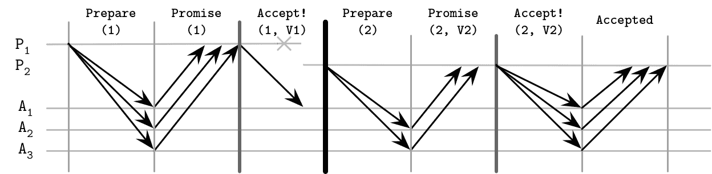

# 第十四章：共识

我们在分布式系统中讨论了许多概念，从基础的如链接和进程开始，再到分布式计算的问题；然后讨论了故障模型、故障检测器和领导者选举；讨论了一致性模型；最后，我们准备把这一切整合到分布式系统研究的顶峰：分布式共识。

在分布式系统中，共识算法允许多个进程就某个值达成一致。FLP 不可能性（参见“FLP 不可能性”）表明，在完全异步系统中在有限时间内无法保证共识。即使消息传递被保证，一个进程也无法知道另一个进程是已经崩溃还是运行缓慢。

在第九章中，我们讨论了故障检测精度与故障快速检测之间的权衡。共识算法假设一个异步模型并保证安全性，而外部故障检测器可以提供关于其他进程的信息，保证活跃性[[CHANDRA96]](app01.html#CHANDRA96)。由于故障检测并不总是完全准确，所以在某些情况下，共识算法可能会等待检测到某个进程故障，或者因某个进程错误地被怀疑为有故障而重启算法。

进程必须就由参与者之一提出的某个值达成一致，即使其中一些进程可能会崩溃。如果一个进程没有崩溃并且继续执行算法步骤，则称该进程为*正确*的。共识对于将事件放置在特定顺序中，并确保参与者之间的一致性非常有用。通过共识，我们可以构建一个系统，使得进程在不丢失客户端观察到的值的确定性的情况下，从一个值过渡到下一个值。

从理论的角度来看，共识算法具有三个属性：

一致性

所有*正确*的进程对决策值都是相同的。

有效性

决策的值由其中一个进程提出。

终止

所有*正确*的进程最终会达成决策。

这些属性中的每一个都非常重要。一致性是人们对共识的理解的基础。[共识的词典定义](https://databass.dev/links/66)中包含“一致性”一词。这意味着在达成一致意见后，没有任何一个过程可以对结果持不同意见。可以将其想象成与朋友们约定在特定的时间和地点会面：大家都愿意见面，只是具体的事件细节正在商定中。

有效性是必不可少的，因为没有它共识就会变得微不足道。共识算法要求所有进程对某个值达成一致。如果进程使用某个预定的、任意的默认值作为输出决策，不考虑提议的值，它们将会达成一致，但这样的算法输出是无效的，现实中也没什么用。

如果没有终止条件，我们的算法将会永远不会达成任何结论，或者会无限期地等待一个崩溃的进程回来，这也是不太有用的。进程最终必须达成一致，对于一个共识算法来说，这必须发生得相当迅速。

# 广播

*广播*是分布式系统中经常使用的通信抽象。广播算法用于在一组进程之间传播信息。存在许多广播算法，它们做出不同的假设并提供不同的保证。广播是一个重要的原语，在包括共识算法在内的许多地方都有应用。我们已经讨论了广播的一种形式——八卦传播——（见“八卦传播”）。

广播经常用于数据库复制，当单个协调节点必须将数据分发给所有其他参与者时。然而，使这个过程可靠并非易事：如果协调者在将消息分发给一些节点后崩溃，而没有分发给其他节点，系统就会处于不一致的状态：一些节点观察到了新消息，而其他节点没有。

广播消息的最简单和最直接的方式是通过*尽力广播*[[CACHIN11]](app01.html#CACHIN11)。在这种情况下，发送者负责确保将消息传递给所有目标。如果发送失败，其他参与者不会尝试重新广播消息，而在协调者崩溃的情况下，这种类型的广播会静默地失败。

要使广播变得*可靠*，需要确保所有正确的进程在发送者在传输过程中崩溃时也能接收到相同的消息。

要实现一个可靠广播的天真版本，我们可以使用一个故障检测器和一个备用机制。最简单的备用机制是允许每个接收到消息的进程将其转发给它所知道的每个其他进程。当源进程失败时，其他进程会检测到故障并继续广播消息，有效地*淹没*网络，消息数量为`N²`（如图 14-1 所示）。即使发送者崩溃，消息仍然会被系统的其他部分接收和传递，提高其可靠性，使所有接收者能够看到相同的消息[[CACHIN11]](app01.html#CACHIN11)。

###### 图 14-1\. 广播

此方法的一个缺点是它使用`N²`条消息，其中`N`是*剩余*收件人的数量（因为每个广播过程都排除原始进程和自身）。理想情况下，我们希望减少可靠广播所需的消息数量。

# 原子广播

即使刚刚描述的泛洪算法可以确保消息的交付，但它不保证按任何特定顺序交付。消息最终会在未知时间到达目的地。如果我们需要按顺序交付消息，则必须使用*原子广播*（也称为*全序多播*），它保证了可靠交付和全序。

尽管可靠广播确保进程对交付的消息集达成一致意见，但原子广播还确保它们对消息序列的相同顺序达成一致（即每个目标的消息交付顺序相同）。

总之，原子广播必须确保两个基本属性：

原子性

进程必须就接收到的消息集达成一致意见。要么所有非故障进程交付消息，要么一个也不交付。

顺序

所有非故障进程以相同顺序交付消息。

此处的消息被*原子地*交付：每条消息要么交付给所有进程，要么一个也不交付；如果消息被交付，那么每条其他消息都在此消息之前或之后排序。

## 虚拟同步

用广播进行组通信的框架之一称为*虚拟同步*。原子广播有助于将完全有序的消息传递给*静态*进程组，而虚拟同步则将完全有序的消息传递给*动态*对等体组。

虚拟同步将进程组织成组。只要组存在，消息就会以相同顺序交付给其所有成员。在这种情况下，模型不指定顺序，一些实现可以利用这一点以提升性能，只要它们提供的顺序在所有成员之间保持一致[[BIRMAN10]](app01.html#BIRMAN10)。

进程对组的视图相同，并且消息与组标识关联：只要它们属于同一组，进程可以看到相同的消息。

一旦参与者之一加入、离开组或失败并被迫离开组，组视图就会改变。这是通过向所有成员宣布组更改来实现的。每条消息都与其来源的组唯一关联。

虚拟同步区分消息*接收*（当组成员接收消息时）和其*交付*（所有组成员接收消息时）。如果消息在一个视图中*发送*，则只能在相同视图中*交付*，这可以通过比较当前组与消息关联的组来确定。接收的消息在队列中保持未决，直到进程被通知成功交付为止。

由于每条消息都属于特定的组，除非组中所有进程在视图更改之前*接收*了它，否则任何组成员都不能认为此消息*已交付*。这意味着所有消息都在视图更改之间*发送*和*交付*，这为我们提供了原子交付保证。在这种情况下，组视图充当消息广播不能穿过的屏障。

一些总体广播算法通过使用负责确定的单一进程（顺序器）对消息进行排序。这样的算法实现起来更容易，但依赖于检测领导者故障以确保活性。使用顺序器可以提高性能，因为我们不需要为每条消息在进程之间建立一致性，可以使用本地顺序器视图。这种方法仍然可以通过对请求进行分区来扩展。

尽管技术上很完备，虚拟同步并未得到广泛采用，在最终用户商业系统中也不常见 [[BIRMAN06]](app01.html#BIRMAN06)。

## Zookeeper 原子广播（ZAB）

最广为人知和使用的原子广播实现之一是由[Apache Zookeeper](https://databass.dev/links/67)使用的 ZAB [[HUNT10]](app01.html#HUNT10) [[JUNQUEIRA11]](app01.html#JUNQUEIRA11)，它是一个分层分布式键值存储系统，用于确保事件的完全顺序和原子传递，以维护副本状态之间的一致性。

ZAB 中的进程可以扮演两种角色之一：*领导者*和*追随者*。领导者是一个临时角色。它通过执行算法步骤推动流程，向追随者广播消息，并建立事件顺序。为了写入新记录并执行读取以观察最新值，客户端连接到集群中的一个节点。如果节点恰好是领导者，则处理请求。否则，将请求转发给领导者。

为了保证领导者的唯一性，协议时间线被分割为*时期*，由唯一的单调递增序列号标识。在任何时期，只能有一个领导者。流程从使用任何选举算法找到一个*候选领导者*开始，只要它以高概率选择一个处于启动状态的进程。由于进一步的算法步骤保证了安全性，确定候选领导者更多地是性能优化。候选领导者也可能是前一领导者失败的结果。

一旦确定了候选领导者，它会执行三个阶段的协议：

发现

候选领导者了解其他每个进程已知的最新时期，并提出一个新的大于*当前时期*的时期。追随者用前一时期中所见最新事务的标识符响应时期提议。此步骤后，没有进程将接受早期时期的广播提议。

同步

此阶段用于从前一领导者的故障中恢复并使滞后的追随者跟上步伐。潜在领导者向追随者发送消息，提议自己作为新时期的领导者，并收集他们的确认。一旦收到确认，领导者就确立了。在此步骤之后，追随者将不再接受任何其他进程尝试成为时期领导者的请求。在同步期间，新领导者确保追随者具有相同的历史并传递早期时期已建立领导者的已承诺提议。这些提议在新时期的任何提议之前被传递*之前*。

广播

一旦追随者恢复同步，活动消息传递就开始了。在此阶段，领导者接收客户端消息，建立它们的顺序，并广播给追随者：它发送一个新的提议，等待一定数量的追随者确认响应，最终进行提交。此过程类似于没有中止的两阶段提交：投票仅仅是确认，并且客户端无法反对有效领导者的提议。但不应确认来自不正确时期的领导者的提议。广播阶段将继续，直到领导者崩溃、与追随者分区或因消息延迟被怀疑崩溃。

图 14-2 显示了 ZAB 算法的三个阶段，以及在每个步骤期间交换的消息。

###### 图 14-2\. ZAB 协议概述

如果追随者确保仅接受来自已建立时期的领导者的提议，则该协议的安全性得到保证。两个进程可能*尝试*竞选，但只有一个可以获胜并确立自己为时期领导者。还假设进程忠实执行规定的步骤并遵循协议。

领导者和追随者都依赖心跳来确定远程进程的活跃性。如果领导者未收到来自追随者的心跳，则会辞去领导者职务，并重新启动选举过程。同样，如果追随者之一确定领导者已崩溃，则会启动新的选举过程。

消息是完全有序的，领导者不会尝试发送下一条消息，直到前一条消息已被确认。即使某些消息被追随者接收多次，只要遵循交付顺序，它们的重复应用也不会产生额外的副作用。由于唯一领导者会接收写请求，建立事件顺序并广播更改，因此 ZAB 能够处理客户端的多个并发状态更改。

总消息顺序也使得 ZAB 能够提高恢复效率。在同步阶段，跟随者回复具有最高已提交提议。领导者可以简单地选择具有最高提议的节点进行恢复，这可能是消息需要从中复制的唯一节点。

ZAB 的一个优点是效率高：广播过程仅需要两轮消息，领导者失败可以通过从单个最新进程流式传输丢失的消息进行恢复。具有长期领导者可以对性能产生积极影响：我们不需要额外的共识轮来建立事件历史，因为领导者可以根据其本地视图对它们进行排序。

# Paxos

原子广播是在具有崩溃失败的异步系统中等价于共识的问题，因为参与者必须*同意*消息顺序并且必须能够了解它。在原子广播和共识算法之间的动机和实现之间您将看到许多相似之处。

可能是最广为人知的共识算法是*Paxos*。它最初由莱斯利·兰伯特在《兼职议会》论文中首次介绍。在这篇论文中，共识是用与帕克索斯岛上的立法和投票过程相关的术语来描述的。2001 年，作者发布了一篇名为《简化版 Paxos》的后续论文，引入了更简单的术语，现在通常用来解释这个算法。

Paxos 中的参与者可以扮演三种角色之一：*提议者*、*接受者*或*学习者*：

提议者

从客户处接收值，创建提案以接受这些值，并尝试从接受者那里收集投票。

接受者

投票接受或拒绝提议者提出的值。对于容错性，算法需要多个接受者的存在，但对于活性，仅需要大多数接受者的选票来接受提议。

学习者

承担副本的角色，存储接受提议的结果。

任何参与者都可以扮演任何角色，并且大多数实现会将它们合并在一起：单个进程可以同时兼任提议者、接受者和学习者。

每个提议包括客户提议的*值*和唯一的单调递增提议编号。然后使用这个编号来确保执行操作的总序，并建立它们之间的先后发生关系。提议编号通常使用 `(id, timestamp)` 对来实现，其中节点 ID 也是可比较的，并且可以用于打破时间戳的关系。

## Paxos 算法

Paxos 算法通常可以分为两个阶段：*投票*（或*提议*阶段）和*复制*。在投票阶段，提议者竞争建立他们的领导地位。在复制阶段，提议者将值分发给接受者。

提议者是客户端的初始联系点。它接收应该决定的值，并尝试从接受者的法定人数中收集投票。完成后，接受者将关于已同意值的信息分发给学习者，批准结果。学习者增加了已同意的值的复制因子。

只有一个提议者可以收集到多数票。在某些情况下，票数可能会均匀分配给提议者，而在这一轮中，没有一个提议者能够收集到多数票，迫使他们重新开始。我们在 “失败场景” 中讨论了这种以及其他竞争提议者的情况。

在提议阶段，*提议者* 向大多数接受者发送 `Prepare(n)` 消息（其中 `n` 是提议编号），并尝试收集它们的投票。

当 *接受者* 收到准备请求时，必须响应，保留以下不变式 [[LAMPORT01]](app01.html#LAMPORT01)：

+   如果这个接受者还没有用更高的序列号响应准备请求，它*承诺*不会接受任何具有较低序列号的提议。

+   如果这个接受者已经接受（收到 `Accept!(m,v[accepted])` 消息）任何其他早期提案，它将用 `Promise(m, v[accepted])` 消息回复，通知提议者它已经接受了序列号为 `m` 的提案。

+   如果这个接受者已经用更高序列号响应了准备请求，它会通知提议者存在一个更高序列号的提议。

+   接受者可以对多个准备请求做出响应，只要后者具有更高的序列号。

在复制阶段，收集到多数投票后，*提议者* 可以开始复制，通过发送接受者 `Accept!(n, v)` 消息，其中 `v` 是与从接受者收到的响应中最高编号的提案相关联的值，`n` 是提案编号。如果响应中不包含旧的已接受提案，则可以使用任意自己的值 `v`。

*接受者* 接受具有编号 `n` 的提议，除非在提议阶段它已经对 `Prepare(m)` 做出了响应，其中 `m` 大于 `n`。如果接受者拒绝了提议，它会将它看到的最高序列号与请求一起发送给提议者，以帮助提议者赶上 [[LAMPORT01]](app01.html#LAMPORT01)。

在 图 14-3 中可以看到 Paxos 轮次的泛化描述。

###### 图 14-3\. Paxos 算法：正常执行

一旦就该值达成一致（换句话说，至少有一个接受者接受了它），未来的提议者必须决定同一个值以保证协议。这就是为什么接受者会回复他们接受的最新值。如果没有接受者看到先前的值，提议者可以自由选择它自己的值。

学习者必须找出已经决定的值，它可以在接收到多数接受者通知后知道这个值。为了尽快让学习者了解新值，接受者可以在接受时立即通知它。如果有多个学习者，则每个接受者都必须通知每个学习者。一个或多个学习者可以被*区分*，在这种情况下，它将通知其他学习者接受的值。

总结来说，第一阶段算法的目标是确立本轮的领导者，并理解将要被接受的值，允许领导者继续第二阶段：广播该值。对于基本算法，我们假设每次决定一个值时都需要执行两个阶段。实际上，我们希望减少算法中的步骤数量，因此允许提议者提出多个值。我们稍后在“多 Paxos”中会详细讨论这一点。

## Paxos 中的法定人数

使用法定人数确保*某些*参与者可以失败，但只要我们能从存活的参与者收集投票，我们仍然可以继续进行。*法定人数*是执行操作所需的*最小*投票数。这个数字通常构成参与者的*多数*。法定人数背后的主要思想是，即使参与者失败或被网络分区隔离，至少有一个参与者充当仲裁者，确保协议的正确性。

一旦足够数量的参与者接受提案，协议保证该值会被接受，因为任意两个多数派至少有一个共同的参与者。

Paxos 在任何数量的故障情况下保证安全性。没有配置可以产生不正确或不一致的状态，因为这将违反共识的定义。

在存在`f`个失败进程的情况下保证活性。为此，协议总共需要`2f + 1`个进程，以便如果`f`个进程恰好失败，仍然有`f + 1`个进程能够继续。通过使用法定人数而不是要求所有进程的存在，Paxos（以及其他共识算法）在`f`个进程失败时仍然能够保证结果。在“灵活的 Paxos”中，我们讨论了稍微不同术语下的法定人数，并描述了如何在算法*步骤*之间构建要求法定人数交集的协议。

###### 提示

记住，法定人数只描述系统的阻塞属性。为了确保安全，对于每一步，我们都必须等待至少一个法定人数的节点响应。我们可以向更多节点发送提议和接受命令；我们只是不必等待它们的响应即可继续。我们可以向更多节点发送消息（某些系统使用 *推测执行*：发出冗余查询以帮助达到所需的响应计数，在节点故障时），但为了保证活性，我们可以在听到法定人数的响应后立即继续。

## 失败场景

讨论分布式算法在讨论故障时尤为有趣。演示容错性的故障场景之一是当提议者在第二阶段失败之前无法向所有接收者广播值时（如果提议者仍然存活但速度较慢或无法与某些接收者通信时），新的提议者可以接替并提交值，将其分发给其他参与者。

图 14-4 展示了这种情况：

+   提议者 `P[1]` 以提议号 `1` 进入选举阶段，但仅向接收者 `A[1]` 发送值 `V1` 后失败。

+   另一个提议者 `P[2]` 以更高的提议号 `2` 开始新一轮，收集到接收者响应的法定人数（在这种情况下是 `A[1]` 和 `A[2]`），然后通过提交由 `P[1]` 提出的 *旧* 值 `V1` 继续。

###### 图 14-4\. Paxos 失败场景：提议者失败，决定旧值

由于算法状态被复制到多个节点，提议者的失败不会导致无法达成共识。如果当前提议者在至少一个接收者 `A[1]` 接受值后失败，则其提议 *可以* 被下一个提议者选中。这也意味着所有这些可能发生，而原始提议者却不知情。

在客户端/服务器应用程序中，客户端仅连接到原始提议者的情况下，可能会导致客户端不知道 Paxos 轮执行的结果。^(1)

然而，还有其他可能性，如 图 14-5 所示。例如：

+   `P[1]` 就像前面的例子一样失败，在仅向 `A[1]` 发送值 `V1` 后。

+   下一个提议者 `P[2]` 以较高的提议号 `2` 开始新一轮，并收集到接收者响应的法定人数，但这次 `A[2]` 和 `A[3]` 先响应。在收集到法定人数后，尽管理论上 `A[1]` 上已经有不同的确定值，`P[2]` 仍然 *提交自己的值* 。

###### 图 14-5\. Paxos 失败场景：提议者失败，决定新值

这里还有一个可能性，如 图 14-6 所示：

+   提议者 `P[1]` 在只有一个接受者 `A[1]` 接受值 `V1` 后失败。在接受提议后不久，`A[1]` 也失败了，在通知下一个提议者之前未能通知其值。

+   提议者 `P[2]` 在 `P[1]` 失败后启动了轮次，与 `A[1]` 没有重叠，并继续提交其值。

+   任何在此轮之后提出的提议者，如果与`A[1]`重叠，将会忽略`A[1]`的值，并选择一个更近期的已接受提议。

###### 图 14-6\. Paxos 失败场景：提议者失败，随后是接受者失败

另一个失败场景是，当两个或多个提议者开始竞争时，每个都试图在提议阶段通过，但由于对手抢先一步，他们都未能获得多数支持。

尽管接受者承诺不接受任何较低编号的提议，它们仍可能响应多个准备请求，只要后来的请求有更高的序列号。当一个提议者试图提交值时，可能会发现接受者已经对一个更高序列号的准备请求做出了响应。这可能导致多个提议者不断重试并阻止彼此进展。通常通过引入随机退避来解决这个问题，最终让其中一个提议者继续，而另一个则进入睡眠状态。

Paxos 算法可以容忍接受者的故障，但前提是仍有足够的接受者存活以形成多数。

## 多 Paxos

到目前为止，我们讨论了经典的 Paxos 算法，其中我们选择一个任意的提议者并尝试启动一个 Paxos 轮。这种方法的一个问题是，在系统中每次复制轮次都需要一个提议轮次。只有在提议者为该轮次建立之后（这发生在大多数接受者对提议者的 `Prepare` 做出 `Promise` 响应后），它才能开始复制。为了避免重复提议阶段并让提议者重复使用其已识别的位置，我们可以使用多 Paxos，引入了“领导者”的概念：一个“杰出的提议者”[[LAMPORT01]](app01.html#LAMPORT01)。这是一个重要的增强，显著提高了算法的效率。

有了一个确立的领导者，我们可以跳过提议阶段，直接进行复制：分发一个值并收集接受者的确认。

在经典的 Paxos 算法中，可以通过运行一个 Paxos 轮来实现读操作，该轮将收集任何不完整轮次中的值（如果存在）。必须这样做是因为最后已知的提议者不能保证持有最新的数据，因为可能已经有其他提议者修改了状态，而不让当前提议者知道。

在多 Paxos 中可能会发生类似的情况：我们试图在已知领导者*之后*从另一个已选举的领导者那里执行读取，返回旧数据，这与一致性保证相矛盾。为了避免这种情况，并保证没有其他进程能够成功提交值，一些多 Paxos 实现使用*租约*。领导者定期联系参与者，通知他们自己仍然活跃，有效延长其租期。参与者必须响应并允许领导者继续操作，并承诺在租约期内不接受其他领导者的提议 [[CHANDRA07]](app01.html#CHANDRA07)。

租约不是正确性保证，而是允许从活动领导者进行读取而不收集法定人数的性能优化。为了保证安全性，租约依赖于参与者之间有界的时钟同步。如果他们的时钟漂移太大，而领导者认为其租约仍然有效，而其他参与者认为其租约已经过期，则无法保证一致性。

有时将多 Paxos 描述为应用于某些结构的*复制日志*的算法。该算法对这个结构的语义视而不见，只关注一致地复制将追加到此日志中的值。为了在进程崩溃时保留状态，参与者保持接收消息的持久日志。

为了防止日志无限增长，其内容应用于上述结构。在日志内容与主要结构同步并创建快照后，可以截断日志。日志和状态快照应该互相一致，并且快照变化应该与日志段截断同时进行 [[CHANDRA07]](app01.html#CHANDRA07)。

我们可以将单决策 Paxos 理解为*一次写寄存器*：我们有一个槽位可以放置一个值，一旦我们在那里写入了值，就不能再进行后续修改。在第一步中，提议者竞争注册表的所有权，在第二阶段中，其中一个写入值。同时，多 Paxos 可以被视为一个追加日志，由这些值的序列组成：我们一次只能写入一个值，所有值严格有序，并且不能修改已经写入的值 [[RYSTSOV16]](app01.html#RYSTSOV16)。有些一致性算法的示例提供了集合读取修改写寄存器并使用状态共享而不是复制状态机，例如 Active Disk Paxos [[CHOCKLER15]](app01.html#CHOCKLER15) 和 CASPaxos [[RYSTSOV18]](app01.html#RYSTSOV18)。

## 快速 Paxos

相比于经典 Paxos 算法，我们可以通过让*任何*提议者直接联系接受者而不是通过领导者，减少一次往返。为此，我们需要将仲裁组大小增加到`2f + 1`（其中`f`是允许失败的进程数），与经典 Paxos 的`f + 1`相比，以及总接受者数量增加到`3f + 1` [[JUNQUEIRA07]](app01.html#JUNQUEIRA07)。这种优化称为*快速 Paxos* [[LAMPORT06]](app01.html#LAMPORT06)。

经典 Paxos 算法有一个条件，在复制阶段，提议者可以选择其在提议阶段收集到的任何值。快速 Paxos 有两种类型的轮次：*经典*，其中算法与经典版本相同，和*快速*，其中允许接受者接受其他值。

在描述该算法时，我们将那些在提议阶段收集到足够数量响应的提议者称为*协调者*，并保留术语*提议者*用于所有其他提议者。一些快速 Paxos 的描述称*客户*可以直接联系接受者 [[ZHAO15]](app01.html#ZHAO15)。

在快速轮次中，如果协调者在复制阶段被允许选择自己的值，它可以发出一个特殊的`Any`消息给接受者。在这种情况下，接受者可以将*任何*提议者的值视为经典轮次，并认为它们从协调者接收到这个值的消息。换句话说，接受者可以独立地决定它们从不同提议者那里收到的值。

图 14-7 显示了快速 Paxos 中经典和快速轮次的示例。从图像中可以看出，快速轮次可能具有更多的执行步骤，但请记住，在经典轮次中，为了提交其值，提议者需要通过协调者确保其值已提交。

###### 图 14-7\. 快速 Paxos 算法：快速和经典轮次

如果两个或更多的提议者尝试使用*快速*步骤并减少往返次数，且接受者接收到不同的值，则该算法容易发生*冲突*。协调者必须介入并通过启动新的轮次来开始恢复。

这意味着接受者在从不同的提议者那里收到值后，可能会决定使用冲突的值。当协调者检测到冲突（值冲突）时，必须重新启动`Propose`阶段，以使接受者收敛到单一值。

快速 Paxos 的一个缺点是如果请求速率高时，由于碰撞会增加往返次数和请求的延迟。[[JUNQUEIRA07]](app01.html#JUNQUEIRA07) 表明，由于增加了副本的数量，随后增加了参与者之间交换的*消息*数量，尽管步骤减少了，快速 Paxos 的延迟可能比其经典对应版本更高。

## 平等 Paxos

使用一个特定的提议者作为领导者会使系统容易发生故障：一旦领导者失败，系统必须在继续下一步之前选举一个新的领导者。另一个问题是，有一个领导者可能会给它带来不成比例的负载，影响系统性能。

###### 注意

避免将整个系统负载放在领导者上的一种方法是 *分区*。许多系统将可能值的范围分割成较小的段，并允许系统的一部分负责特定范围，而不必担心其他部分。这有助于提高可用性（通过将故障隔离到单个分区并防止传播到系统的其他部分），性能（因为服务不同值的段是不重叠的），以及可扩展性（通过增加分区数可以扩展系统）。重要的是要记住，对 *多个* 分区执行操作将需要原子提交。

与使用领导者和提案号为命令排序不同，我们可以使用一个负责特定命令提交的领导者，并通过查找和设置依赖项来建立顺序。这种方法通常称为平等 Paxos 或 EPaxos [[MORARU11]](app01.html#MORARU11)。允许非冲突写入独立提交到复制状态机的想法最早在 [[LAMPORT05]](app01.html#LAMPORT05) 中引入，并称为广义 Paxos。EPaxos 是广义 Paxos 的首次实现。

EPaxos 试图提供经典 Paxos 算法和多 Paxos 的双重好处。经典 Paxos 提供高可用性，因为每轮都会建立一个领导者，但消息复杂度较高。多 Paxos 提供高吞吐量，并且需要较少的消息，但领导者可能成为瓶颈。

EPaxos 从 *预接受* 阶段开始，此时一个进程成为特定提案的领导者。每个提案都必须包括：

依赖关系

所有可能干扰当前提案但尚未必然已经提交的命令。

序列号

这打破了依赖之间的循环。将其设置为大于已知依赖的任何序列号的值。

收集此信息后，它向 *快速法定复制品* 发送 `预接受` 消息。快速法定复制品是 `⌈3f/4⌉` 个复制品，其中 `f` 是可以容忍的故障数。

复制品检查其本地命令日志，根据它们对潜在冲突提案的观点更新提案依赖，并将此信息发送回领导者。如果领导者从快速法定复制品收到响应，并且它们的依赖列表在彼此和领导者本身之间达成一致，它可以提交该命令。

如果领导者未收到足够的响应，或者如果来自副本的命令列表不同并包含干扰命令，则它将使用新的依赖关系列表和序列号更新其提案。新的依赖关系列表基于之前的副本响应并合并*所有*收集的依赖关系。新的序列号必须大于副本所见到的最高序列号。之后，领导者将更新的命令发送给`⌊f/2⌋ + 1`个副本。完成此步骤后，领导者最终可以提交提案。

实际上，我们有两种可能的情况：

快速路径

当依赖关系匹配且领导者可以安全地继续使用仅快速法定副本提交阶段时。

慢速路径

当副本之间存在分歧并且它们的命令列表必须在领导者可以继续提交之前更新时。

图 14-8 展示了这些场景——`P[1]` 发起快速路径运行，`P[5]` 发起慢速路径运行：

+   `P[1]` 使用提案编号 `1` 并没有依赖关系，发送 `PreAccept(1, ∅)` 消息。由于 `P[2]` 和 `P[3]` 的命令日志为空，`P[1]` 可以继续提交。

+   `P[5]` 创建带有序列号 `2` 的提案。由于到达这一点时其命令日志为空，它也声明没有依赖关系，并发送 `PreAccept(2, ∅)` 消息。`P[4]` 不知道已提交的提案 `1`，但 `P[3]` 通知 `P[5]` 存在冲突，并发送其命令日志：`{1}`。

+   `P[5]` 更新其本地依赖列表，并发送消息以确保副本具有相同的依赖关系：`Accept(2,{1})`。一旦副本响应，它就可以提交该值。

###### 图 14-8\. EPaxos 算法运行

两个命令 `A` 和 `B` 只有在它们的执行顺序有所影响时才会干扰；换句话说，如果在执行 `A` 之前执行 `B` 和在执行 `B` 之前执行 `A` 会产生不同的结果。

提交通过向客户端响应并异步通知副本发送`Commit`消息完成。命令在其提交之后才会执行。

由于在预接受阶段收集了依赖关系，在执行请求时，命令顺序已经确定，没有命令会突然出现在中间位置：只有在最大序列号的命令之后才会追加。

要执行命令，副本构建依赖图，并按照反向依赖顺序执行所有命令。换句话说，在执行一个命令之前，必须执行其所有依赖项（以及随后的所有依赖项）。由于只有干扰命令需要相互依赖，对于大多数工作负载来说，这种情况应该相对罕见[[MORARU13]](app01.html#MORARU13)。

类似于 Paxos，EPaxos 使用提案编号，防止传播过期消息。序列号由*时期*（当前集群配置的标识符，在节点离开和加入集群时更改）、单调递增的节点本地计数器和副本 ID 组成。如果一个副本收到一个比其已见过的序列号更低的提议，它将否定该提议，并发送其响应中已知的最高序列号和更新的命令列表。

## 灵活 Paxos

通常将法定人数定义为多数进程。根据定义，无论我们如何选择节点，两个法定人数之间始终存在*交集*：总有至少一个节点可以打破僵局。

我们必须回答两个重要问题：

+   在*每个*执行步骤期间是否需要联系*大多数*服务器？

+   所有法定人数都必须有交集吗？换句话说，我们用来选择特定提议者（第一阶段）、决定一个值（第二阶段）以及每个执行实例（例如，如果多个第二步实例同时执行），都必须有共同节点吗？

由于我们仍在讨论共识，我们不能改变任何安全性定义：算法必须保证协议。

在 Multi-Paxos 中，领导选举阶段不频繁，允许特定提议者提交多个值，而无需重新运行选举阶段，潜在地在领先位置停留更长时间。在“可调一致性”中，我们讨论了帮助我们找到节点集之间交集的公式。一个例子是等待仅一个节点确认写入（并让其余节点的请求异步完成），并从*所有*节点读取。换句话说，只要保持 `R + W > N`，读写集之间至少有一个共同节点。

我们能否对共识使用类似的逻辑？事实证明我们可以，在 Paxos 中，我们只需要第一阶段选举领导者的节点组与第二阶段参与接受提案的节点组有重叠。

换句话说，法定人数不必定义为多数，而只需定义为非空节点组。如果我们将参与者总数定义为 `N`，提议阶段成功所需节点数为 `Q₁`，接受阶段成功所需节点数为 `Q₂`，我们只需确保 `Q₁ + Q₂ > N`。由于第二阶段通常比第一阶段更常见，`Q₂` 可以仅包含 `N/2` 个接受者，只要相应地增加 `Q₁`（`Q₁ = N - Q₂ + 1`）。这一发现是理解共识至关重要的重要观察。使用这种方法的算法称为*灵活 Paxos* [[HOWARD16]](app01.html#HOWARD16)。

例如，如果我们有五个接受者，只要我们要求从其中四个收集投票来赢得选举轮次，我们可以允许领导者在复制阶段等待两个节点的响应。此外，由于在包含领导者选举法定人数的任何子集中存在重叠，我们可以向不相交的接受者集合提交提案。直觉上，这有效是因为每当新领导者在当前领导者不知情的情况下被选举时，总会至少有一个接受者知道新领导者的存在。

Flexible Paxos 允许在可用性和延迟之间进行权衡：我们减少第二阶段参与的节点数，但必须收集更多的投票，需要在领导者选举阶段期间有更多参与者可用。好消息是，只要当前领导者稳定且不需要新的选举轮次，这种配置可以继续复制阶段并容忍最多 `N - Q₂` 节点的故障。

另一个使用交叉法定人数思想的 Paxos 变体是 Vertical Paxos。Vertical Paxos 区分读和写法定人数。这些法定人数必须相交。领导者必须为一个或多个较低编号的提案收集较小的读法定人数，并为自己的提案收集更大的写法定人数（LAMPORT09）。LAMPSON01 也区分了*out*和*decision*法定人数，这对应于准备和接受阶段，并给出了类似于 Flexible Paxos 的法定人数定义。

## 一般化的共识解决方案

有时理解 Paxos 可能有些困难：多个角色、步骤以及所有可能的变化很难跟踪。但我们可以用更简单的术语来思考它。不再将角色分配给参与者并进行决策轮次，而是使用一组简单的概念和规则来实现单指令 Paxos 的保证。我们只简要讨论这种方法，因为这是一个相对新的发展（HOWARD19）—这很重要，但我们还没有看到它的实现和实际应用。

我们有一个客户端和一组服务器。每个服务器都有多个*寄存器*。一个寄存器有一个标识它的索引，只能写入一次，并且可以处于三种状态之一：未写入、包含一个*值*和包含*nil*（特殊的空值）。

存储在不同服务器上的相同索引的寄存器形成一个*寄存器集*。每个寄存器集可以有一个或多个法定人数。根据其中寄存器的状态，法定人数可以处于*未决*（`Any` 和 `Maybe v`）或*已决*（`None` 和 `Decided v`）状态之一：

`Any`

根据未来操作的不同，这个法定人数集合可以决定任何值。

`Maybe v`

如果这个法定人数达成决定，它的决定只能是 `v`。

`None`

这个法定人数无法决定值。

`Decided v`

这个法定人数已经决定了值 `v`。

客户端与服务器进行消息交换并维护状态表，在其中跟踪数值和寄存器，并能推断出由法定人数做出的决策。

为了保持正确性，我们必须限制客户端与服务器的交互方式及其可写入的值和不可写入的值。在读取值方面，只有当客户端从同一寄存器集的法定人数服务器中读取了决策值时，才能输出该值。

写入规则稍微复杂，因为为了确保算法的安全性，我们必须保留几个不变量。首先，我们必须确保客户端不会随意提出新值：客户端只有在接收到输入或从寄存器中读取了该值后，才能将特定值写入寄存器。客户端不能写入允许在同一寄存器中不同法定人数做出不同值决策的值。最后，客户端不能覆盖先前在前一个寄存器集中做出的决策（在寄存器集直到`r - 1`的决策必须是`None`、`Maybe v`或`Decided v`）。

### 泛化 Paxos 算法

综合所有这些规则，我们可以实现一种通用的 Paxos 算法，通过一次写入寄存器来实现单一值的共识[[HOWARD19]](app01.html#HOWARD19)。假设我们有三台服务器`[S0, S1, S2]`，寄存器`[R0, R1, …]`和客户端`[C0, C1, ...]`，其中客户端只能写入分配的寄存器子集。我们对所有寄存器使用简单的法定人数法（`{S0, S1}`, `{S0, S2}`, `{S1, S2}`）。

这里的决策过程包括两个阶段。第一阶段确保安全地将值写入寄存器，第二阶段将该值写入寄存器：

第一阶段

客户端通过向服务器发送`P1A`命令来检查它即将写入的寄存器是否未被写入。如果该寄存器未被写入，则将所有寄存器设置为`nil`，以防止客户端写入先前的寄存器。服务器会响应当前已写入的一组寄存器。如果收到大多数服务器的响应，客户端会选择寄存器中具有最大索引的非空值或自身的值（如果没有值）。否则，将重新开始第一阶段。

第二阶段

客户端通过向所有服务器发送`P2A`来通知它们在第一阶段选择的值。如果大多数服务器对此消息做出响应，则可以输出决策值。否则，将从第一阶段重新开始。

图 14-9 显示了 Paxos 的这种泛化形式（改编自[[HOWARD19]](app01.html#HOWARD19)）。客户端`C0`尝试提交值`V`。在第一步中，它的状态表为空，并且服务器`S0`和`S1`响应空寄存器集，表示到目前为止未写入任何寄存器。在第二步中，它可以提交其值`V`，因为之前没有写入其他值。

###### 图 14-9\. Paxos 的泛化

在那时，任何其他客户端都可以查询服务器以了解当前状态。`Quorum {S0, S1}`已达到`Decided A`状态，并且`Quorum {S0, S2}`和`{S1, S2}`已达到`Maybe V`状态以用于`R0`，因此`C1`选择值`V`。此时，没有客户端可以决定除`V`之外的其他值。

这种方法有助于理解 Paxos 的语义。与其从远程参与者的互动角度思考状态（例如，提议者查明接受者是否已经接受了不同的提议），我们可以从最后已知的状态来思考，使我们的决策过程简单化并消除可能的歧义。不可变状态和消息传递也更容易正确实现。

我们也可以与原始 Paxos 进行类比。例如，在客户端发现以前的寄存器集合有`Maybe V`决策的情况下，它会选取`V`并尝试再次提交，这与 Paxos 中的提议者在之前能够向至少一个接受者提交值后失败后提出值的方式类似。同样地，如果在 Paxos 中通过以更高的提议号重新开始投票来解决领导者冲突，那么在这种广义算法中，任何未写入的低级寄存器都将被设置为`nil`。

# Raft

Paxos 曾经是十多年来的*共识算法*，但在分布式系统社区中，它被认为难以理解。2013 年，一种名为 Raft 的新算法出现了。开发它的研究人员希望创建一种易于理解和实现的算法。它首次在题为“寻找易于理解的共识算法”的论文中被提出[[ONGARO14]](app01.html#ONGARO14)。

在分布式系统中有足够的固有复杂性，因此拥有更简单的算法是非常可取的。除了一篇论文外，作者还发布了一个名为[LogCabin](https://databass.dev/links/69)的参考实现，以解决可能存在的歧义并帮助未来的实现者更好地理解。

在本地，参与者存储包含状态机执行命令序列的日志。由于进程接收的输入相同且日志以相同顺序包含相同命令，将这些命令应用于状态机可以保证相同的输出。Raft 通过将领导者的概念提升为一等公民来简化共识。领导者用于协调状态机操作和复制。Raft 与原子广播算法以及 Multi-Paxos 之间有许多相似之处：一个单一领导者从副本中出现，做出原子决策并确立消息顺序。

Raft 中的每个参与者可以承担三种角色之一：

候选者

领导权是一种临时条件，任何参与者都可以担任此角色。为了成为领导者，节点首先必须转换为候选状态，并尝试收集大多数选票。如果候选者既没有赢得选举也没有失败（选票在多个候选者之间分布，没有人获得大多数选票），则安排新 term 并重新开始选举。

领导者

当前，临时的集群领导者处理客户端请求并与复制状态机交互。领导者被选举为称为*term*的时间段。每个 term 由一个单调增加的数字标识，可以持续任意时间。如果当前领导者崩溃、变得无响应或被其他进程怀疑失败（这可能是由于网络分区和消息延迟引起的），将选举新的领导者。

追随者

作为被动参与者，持久化日志条目并响应来自领导者和候选者的请求。Raft 中的追随者角色类似于 Paxos 中的接受者*和*学习者。每个进程最初都是一个追随者。

为了保证全局部分排序而不依赖时钟同步，时间被分割为*terms*（也称为时代），在此期间领导者是唯一且稳定的。terms 是单调编号的，并且每个命令由 term 编号和 term 内消息编号唯一标识 [[HOWARD14]](app01.html#HOWARD14)。

可能会出现不同参与者对哪个 term 是*当前*存在分歧的情况，因为它们可能在不同的时间发现新 term，或者可能错过了一个或多个 term 的领导者选举。由于每个消息包含一个 term 标识符，如果参与者之一发现其 term 已过时，则将 term 更新为更高编号的 term [[ONGARO14]](app01.html#ONGARO14)。这意味着在任何给定时间可能会*存在*多个 term，但在冲突时以更高编号的 term 为准。节点仅在启动新选举过程或发现其 term 已过时时才更新 term。

在启动时，或者当追随者没有收到来自领导者的消息并怀疑它已经崩溃时，它会启动领导者选举过程。参与者尝试通过转换为候选状态并从大多数节点收集选票来成为领导者。

图 14-10 显示了表示 Raft 算法主要组件的序列图：

领导者选举

候选者 `P1` 向其他进程发送 `RequestVote` 消息。此消息包括候选者的 term、它所知的最后一个 term 以及它观察到的最后一条日志条目的 ID。在收集到大多数选票后，候选者成功当选为该 term 的领导者。每个进程最多可以将其选票给一个候选者。

定期心跳

协议使用心跳机制来确保参与者的活性。领导者定期向所有跟随者发送心跳以维护其任期。如果跟随者在称为 *选举超时* 的一段时间内未收到新的心跳，则假定领导者已失败，并开始新的选举。

日志复制 / 广播

领导者可以通过发送 `AppendEntries` 消息重复追加新值到复制日志中。该消息包括领导者的任期、索引，以及当前正在发送的日志条目之前的条目的任期和索引，以及 *一个或多个* 要存储的条目。

###### 图 14-10\. Raft 一致性算法摘要

## Raft 中的领导者角色

领导者只能从持有所有已提交条目的节点中选举出来：如果在选举期间，跟随者的日志信息比候选者更为最新（换句话说，具有更高的任期 ID，或者如果任期相同，则具有更长的日志条目序列），则其投票被拒绝。

为赢得选票，候选者必须收集到多数票。条目始终按顺序复制，因此只需比较最新条目的 ID 就足以了解参与者是否已经是最新状态。

一旦当选，领导者必须接受客户端请求（也可以从其他节点转发到它），并将它们复制到跟随者。这是通过将条目附加到其日志并并行发送到所有跟随者来完成的。

当跟随者收到 `AppendEntries` 消息时，它将消息中的条目追加到本地日志中，并确认该消息，告知领导者已持久化。一旦足够多的副本发送了确认，条目被视为已提交，并相应地在领导者日志中标记。

由于只有最新的候选者才能成为领导者，跟随者无需将领导者更新到最新状态，日志条目仅从领导者流向跟随者，而不是反过来。

图 14-11 显示了这一过程：

+   a) 新命令 `x = 8` 被追加到领导者日志中。

+   b) 在值能够提交之前，它必须复制到大多数参与者。

+   c) 一旦领导者完成复制，它就会在本地提交该值。

+   d) 提交决策被复制到跟随者。

###### 图 14-11\. Raft 中以 `P[1]` 为领导者的提交过程

图 14-12 展示了一个共识轮的示例，其中 `P₁` 是领导者，具有最新的事件视图。领导者通过将条目复制到跟随者，并在收集确认后提交它们来继续。提交一个条目也会提交其在日志中的所有前置条目。只有领导者可以决定条目是否可以被提交。每个日志条目都标有术语 ID（出现在每个日志条目框的右上角的数字）和日志索引，标识其在日志中的位置。已提交的条目保证已被复制到参与者的法定人数，并且可以安全地按照它们在日志中出现的顺序应用到状态机中。

###### 图 14-12\. Raft 状态机

## 失败场景

当多个跟随者决定成为候选人，并且没有候选人能够收集到多数票时，这种情况称为*分裂投票*。Raft 使用随机定时器来减少多个连续选举最终导致分裂投票的概率。其中一个候选人可以更早地开始下一轮选举，并收集足够的选票，而其他人则进入休眠状态，让路给它。这种方法加速了选举过程，而无需候选人之间的额外协调。

跟随者可能处于宕机或响应缓慢状态，领导者必须尽力确保消息的传递。如果在预期的时间范围内没有收到确认，则可以尝试重新发送消息。作为性能优化，可以并行发送多条消息。

由于领导者复制的条目具有唯一标识，重复的消息传递确保不会破坏日志顺序。跟随者使用它们的序列 ID 对消息进行去重，确保重复传递不会产生不希望的副作用。

序列 ID 也用于确保日志的顺序。如果跟随者拒绝了领导者发送的 ID 和术语不匹配的编号更高的条目，则其自己记录中最高的条目。如果两个不同副本上的日志中的条目具有相同的术语和相同的索引，则它们存储相同的命令，并且其前置条目相同。

Raft 保证永远不会将未提交的消息显示为已提交的消息，但是由于网络或副本速度慢的原因，已经提交的消息仍然可以看作是*正在进行中*的状态，这是一个相对无害的属性，可以通过重试客户端命令直到最终提交来解决 [[HOWARD14]](app01.html#HOWARD14)。

为了检测故障，领导者必须向跟随者发送心跳。这样，领导者就能保持其任期。当其中一个节点注意到当前的领导者已经宕机时，它尝试启动选举。新选出的领导者必须将集群状态恢复到最后已知的最新日志条目。它通过找到一个*共同的基础*（领导者和跟随者都同意的最高日志条目）来做到这一点，并命令跟随者*丢弃*在此点之后追加的所有（未提交的）条目。然后，它发送其日志中的最新条目，覆盖跟随者的历史记录。领导者自己的日志记录永远不会被删除或覆盖：它只能向自己的日志追加条目。

总结一下，Raft 算法提供以下保证：

+   在给定任期内一次只能选出一个领导者；在同一任期内不能有两个领导者同时活跃。

+   领导者不会移除或重新排序其日志内容；它只会向其追加新的消息。

+   已提交的日志条目保证在后续领导者的日志中存在，并且不会被还原，因为在提交条目之前，领导者已知它已经被复制。

+   所有消息都通过消息和任期 ID 唯一标识；当前和后续的领导者都不能为不同的条目重复使用相同的标识符。

自其问世以来，Raft 已经变得非常流行，目前被许多数据库和其他分布式系统使用，包括[CockroachDB](https://databass.dev/links/70)、[Etcd](https://databass.dev/links/71)和[Consul](https://databass.dev/links/72)。这可以归因于其简单性，但也可能意味着 Raft 能够履行作为一种可靠的共识算法的承诺。

# 拜占庭共识

到目前为止，我们讨论的所有共识算法都假设非拜占庭故障（见“任意故障”）。换句话说，节点以“诚实守信”的方式执行算法，不试图利用或伪造结果。

正如我们将要看到的，这一假设允许在可用参与者更少、提交所需的往返次数更少的情况下达成共识。然而，分布式系统有时部署在潜在敌对的环境中，其中节点不由同一实体控制，我们需要能够确保系统即使某些节点表现异常或恶意行为也能正常运行的算法。除了恶意意图外，拜占庭故障还可能由错误、错误配置、硬件问题或数据损坏引起。

大多数拜占庭共识算法要求完成算法步骤需要`N²`条消息，其中`N`是法定人数的大小，因为法定人数中的每个节点必须与其他节点通信。这是为了通过将返回结果与多数响应进行比较，验证其他节点的行为，因为节点不能依赖于彼此或领导者。

在这里我们只讨论一个拜占庭容错算法，实用拜占庭容错（PBFT）[[CASTRO99]](app01.html#CASTRO99)。PBFT 假设节点故障是独立的（即，故障可能是协调的，但整个系统不能同时被攻陷，或者至少不用同一种攻击方法）。系统对网络的同步性做出了弱假设，就像你期望网络正常运行一样：可能会发生故障，但不是无限期的，并且最终可以恢复。

节点之间的所有通信都是加密的，这有助于防止消息伪造和网络攻击。副本知道彼此的公钥以验证身份并加密消息。由于即使使用了加密，故障节点可能会泄漏系统内部的信息，因为每个节点都需要解释消息内容以做出反应。这并不会损害算法的完整性，因为它服务于不同的目的。

## PBFT 算法

为了保证 PBFT 同时具有安全性和活性，最多可以有`(n - 1)/3`个副本是有故障的（其中 `n` 是参与者的总数）。对于一个系统要能够容忍 `f` 个受损节点，至少需要有 `n = 3f + 1` 个节点。这是因为大多数节点必须就值达成一致：`f` 个副本可能是有故障的，而且可能有 `f` 个副本没有响应但可能不是有故障的（例如，由于网络分区、断电或维护）。算法必须能够从非有故障的副本收集足够的响应，以便*仍然*超过有故障副本的响应。

PBFT 的共识属性类似于其他共识算法：所有非有故障的副本必须就接收到的值的集合及其顺序达成一致，尽管可能存在故障。

为了区分集群配置，PBFT 使用*视图*。在每个视图中，一个副本是*主节点*，其余的被视为*备份节点*。所有节点按顺序编号，主节点的索引为`v mod N`，其中 `v` 是视图 ID，`N` 是当前配置中节点的数量。当主节点失败时，视图可以改变。客户端对主节点执行其操作。主节点将请求广播给备份节点，备份节点执行请求并将响应发送给客户端。客户端等待`f + 1`个副本给出*相同的结果*以便操作成功。

主节点收到客户端请求后，协议执行分为三个阶段：

预准备

主节点广播包含视图 ID、唯一单调递增标识符、有效负载（客户端请求）和有效负载摘要的消息。摘要使用强碰撞抗性哈希函数计算，并由发送方签名。如果备份节点的视图与主视图匹配且客户端请求未被篡改，则备份节点接受该消息：计算得到的有效负载摘要与接收到的摘要匹配。

准备

如果备份接受预准备消息，则进入准备阶段并开始广播`Prepare`消息，包含视图 ID、消息 ID 和负载摘要，但不包括负载本身，发送至所有其他副本（包括主节点）。副本只有在收到来自*不同*备份的`2f`个匹配的准备消息，并且这些消息与预准备阶段接收到的消息相匹配时，才能继续进入准备状态：它们必须具有相同的视图、相同的 ID 和摘要。

提交

此后，备份进入提交阶段，在这里向所有其他副本广播`Commit`消息，并等待收集来自其他参与者的`2f + 1`个匹配的`Commit`消息（可能包括自己的消息）。

在这种情况下，*摘要*用于减小准备阶段的消息大小，因为没有必要重新广播整个负载以进行验证，摘要充当负载摘要。密码哈希函数能够抵抗碰撞：很难产生两个具有相同摘要的值，更不用说在系统上下文中具有*有意义*的两个匹配摘要的消息了。此外，摘要是*签名*的，以确保摘要本身来自可信源。

数字`2f`很重要，因为算法必须确保至少`f + 1`个非故障副本响应客户端。

图 14-13 展示了正常情况下 PBFT 算法轮次的序列图：客户端向`P[1]`发送请求，节点通过从*行为正确*的对等方收集足够数量的匹配响应，在各个阶段之间移动。`P[4]`可能已失败或者响应的消息不匹配，因此其响应未被计入。

###### 图 14-13\. PBFT 共识，正常操作

在准备和提交阶段，节点通过向每个节点发送消息并等待相应数量的消息来进行通信，以检查它们是否匹配，并确保不广播错误消息。同行交叉验证所有消息，以确保只有非故障节点能成功提交消息。如果无法收集到足够数量的匹配消息，则节点不会进入下一步。

当副本收集到足够的提交消息时，它们通知客户端，完成本轮。客户端只有在收到`f + 1`个匹配响应后才能确信执行是否正确。

视图变更发生在副本注意到主节点不活跃并怀疑其可能已失败时。检测到主节点失败的节点停止响应进一步的消息（除了检查点和视图变更相关的消息），广播视图变更通知，并等待确认。当新视图的主节点收到`2f`个视图变更事件时，它会启动新视图。

为了减少协议中的消息数量，客户端可以从执行请求的节点（例如在收集到足够数量的匹配的“准备”消息后）收集到`2f + 1`个匹配的响应。如果客户端无法收集到足够的匹配临时响应，则会重试，并等待如前所述的`f + 1`个非临时响应。

在 PBFT 中，只读操作可以在一个往返中完成。客户端向所有副本发送读请求。副本在它们的临时状态下执行请求，待所有正在进行的状态更改对读值的提交完成后，向客户端响应。在从不同副本收集到相同值的`2f + 1`个响应之后，操作完成。

## 恢复与检查点

副本将已接受的消息保存在稳定日志中。每条消息必须保留，直到至少`f + 1`个节点执行完毕。这个日志可以在网络分区的情况下帮助其他副本追赶进度，但是恢复的副本需要某种方法来验证它们接收到的状态是否正确，否则恢复可能会被用作攻击向量。

为了证明状态的正确性，节点计算直至给定序列号的消息状态摘要。节点可以比较摘要，验证状态完整性，并确保他们在恢复过程中接收到的消息累积到正确的最终状态。这个过程在每个请求上执行起来过于昂贵。

每经过`N`个请求后，其中`N`是一个可配置的常数，主节点会做一个*稳定检查点*，在此检查点中广播最新请求的最新序列号，以及此状态的摘要。然后等待`2f + 1`个副本的响应。这些响应构成了该检查点的证明，并保证副本可以安全地丢弃所有与给定序列号之前的预准备、准备、提交和检查点消息相关的状态。

拜占庭容错是理解的关键，并且用于部署在潜在对抗网络中的存储系统中。大多数情况下，对节点间通信进行身份验证和加密就足够了，但当系统各部分之间缺乏信任时，必须采用类似于 PBFT 的算法。

由于抵抗拜占庭故障的算法在交换消息数量方面带来显著的开销，因此理解它们的用例至关重要。其他协议，例如《BAUDET19》和《BUCHMAN18》中描述的协议，试图优化适用于参与者数量庞大系统的 PBFT 算法。

# 总结

共识算法是分布式系统中最有趣但也最复杂的主题之一。在过去几年里，新的算法以及现有算法的许多实现已经出现，这证明了这一主题的日益重要和受欢迎程度。

在本章中，我们讨论了经典的 Paxos 算法，以及几种改进其不同属性的 Paxos 变体：

Multi-Paxos

允许提议者保留其角色并复制多个值，而不仅仅是一个。

Fast Paxos

通过*快速*轮次来减少消息数量，允许接受者处理来自非建立领导者的提议者的消息。

EPaxos

通过解决提交消息之间的依赖关系来建立事件顺序。

Flexible Paxos

放宽法定人数要求，并且只要求第一阶段（投票）的法定人数与第二阶段（复制）的法定人数交集。

Raft 简化了描述一致性的术语，并使领导力在算法中成为一等公民。Raft 将日志复制、领导者选举和安全性分离。

为了在对抗环境中保证共识安全性，应使用拜占庭容错算法；例如，PBFT。在 PBFT 中，参与者相互验证彼此的响应，并且只有在足够数量的节点遵守规定的算法规则时才进行执行步骤。

^(1) 例如，在[*https://databass.dev/links/68*](https://databass.dev/links/68)中描述了这样的情况。
