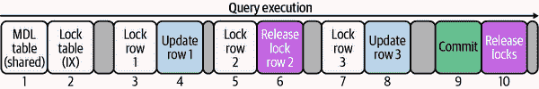

# 第一章：查询响应时间

性能即查询响应时间。

本书从不同角度探讨这一理念，但其单一意图是帮助你实现显著的 MySQL 性能。*高效*的 MySQL 性能意味着*专注*于直接影响 MySQL 性能的最佳实践和技术——无需 DBA 和专家深入的细节或内部。我假设你是一个忙碌的专业人士，正在使用 MySQL 而不是管理它，并且你需要最小的努力获得最大的结果。这不是懒惰，这是效率。因此，本书直截了当，重点突出。到最后，你将能够实现显著的 MySQL 性能。

MySQL 的性能是一个复杂而多方面的主题，但要实现显著的性能，你并不需要成为专家。我通过关注基础内容来缩小 MySQL 复杂性的范围。MySQL 性能始于查询响应时间。

*查询响应时间*是 MySQL 执行查询所需的时间。同义词包括：*响应时间*、*查询时间*、*执行时间*以及（不准确的）*查询延迟*。^(1) 计时从 MySQL 接收查询开始，直到发送结果集给客户端结束。查询响应时间包括多个阶段（查询执行过程中的步骤）和等待（锁等待、I/O 等待等），但不需要也不可能进行完整和详细的分解。与许多系统一样，基本故障排除和分析揭示了大多数问题。

###### 注意

性能随查询响应时间的减少而提升。*改善*查询响应时间与*减少*查询响应时间是同义的。

本章是基础。它详述查询响应时间，以便在后续章节中，你能学习如何改善它。本章分为七个主要部分。第一部分是一个真实故事，以激励和娱乐。第二部分讨论为什么查询响应时间是 MySQL 性能的北极星。第三部分概述了如何将查询指标转化为有意义的报告：查询报告。第四部分讨论了查询分析：使用查询指标和其他信息来理解查询执行。第五部分规划了改善查询响应时间的旅程：查询优化。第六部分提供了一个诚实和谦逊的优化查询的时间表。第七部分讨论了为什么 MySQL 不能简单地变得更快——为什么需要查询优化。

# 一个真实故事：虚假性能

2004 年，我在一个数据中心的夜班工作——下午 2 点到午夜。这是一个极好的工作，原因有两个。首先，晚上 5 点后，数据中心里只有少数几位工程师在监控和管理成千上万台物理服务器，为数不明的客户和网站服务——可能是数以万计的网站。对工程师来说，这是一个梦想。其次，总是有无数的 MySQL 服务器需要解决问题。这是一个学习和机会的金矿。但那时，关于 MySQL 几乎没有书籍、博客或工具。（尽管同一年，O'Reilly 出版了*High Performance MySQL*的第一版。）因此，“解决”MySQL 性能问题的技术“向客户推销更多内存”成了当时的行业标准。对于销售和管理来说，这总是奏效的，但对于 MySQL 来说，结果却不一致。

有一个晚上，我决定不再向客户推销更多的内存，而是进行技术深入挖掘，找出并修复他们 MySQL 性能问题的真正根本原因。他们的数据库用于支持一个公告板，由于其成功而陷入了瘫痪——这在今天仍然是一个常见问题，几乎 20 年后。长话短说，我发现了一个关键索引丢失的查询。在为查询正确创建索引之后，性能显著提高，网站得以挽救。对客户而言，这一切都是零成本。

并非所有的性能问题及解决方案都如此直接和迷人。然而，几乎二十年来与 MySQL 的经验教会了我（以及许多其他人），MySQL 性能问题往往可以通过本书中的最佳实践和技术得以解决。

# 北极星

我是一个 MySQL DBA，同时也是一名软件工程师，所以我知道作为后者使用 MySQL 的感受。尤其是在性能方面，我们（软件工程师）只希望（MySQL）能正常工作。在推送功能和解决问题之间，谁有时间处理 MySQL 的性能问题呢？当 MySQL 性能不佳时——或者更糟糕的是：当它突然变得不佳时——前进的道路可能会变得难以捉摸，因为有太多的考虑因素：我们从哪里开始？我们需要更多内存吗？更快的 CPU？更多的存储 IOPS？问题是最近的代码更改吗？（事实上：过去部署的代码更改有时会导致未来几天甚至几天后出现性能问题。）问题是因为“吵闹的邻居”吗？DBA 们在数据库上做了什么？应用程序已经热门了吗？这是一种好问题吗？

作为一个专业应用程序而非 MySQL 的工程师，这种情况可能会让人感到不知所措。要自信地前进，首先看一下查询响应时间是很有意义和可以采取行动的。这些是导致真正解决方案的强大特性：

有意义的

查询响应时间是任何人真正关心的唯一指标，因为说实话，当数据库运行快速时，没有人会查看它或提问。为什么？因为查询响应时间是我们*体验*到的唯一指标。当一个查询需要 7.5 秒才能执行时，我们经历了 7.5 秒的不耐烦。同样的查询可能检查了一百万行，但我们并没有体验一百万行的检查。我们的时间是宝贵的。

可操作的

你可以做很多事情来提高查询响应时间，使所有人都再次感到满意，你正在看一本关于它的书。（未来人们还会拿着书吗？我希望如此。）查询响应时间是可以直接操作的，因为你拥有代码，所以可以更改查询。即使你不拥有代码（或者没有访问权限），你仍然可以间接优化查询响应时间。“优化查询响应时间”讨论了直接和间接的查询优化。

专注于提高查询响应时间——MySQL 性能的北极星。不要从硬件问题开始。首先使用查询指标确定 MySQL 正在做什么，然后分析和优化慢查询以减少响应时间，然后重复。性能*会*提升。

# 查询报告

查询指标为查询执行提供宝贵的见解：响应时间、锁定时间、检查的行数等等。但是，查询指标和其他指标一样，都是原始值，需要以对工程师有意义和可读的方式进行收集、聚合和报告。这就是本节的内容概述：查询指标工具如何将查询指标转化为查询报告。但是，查询报告只是达到目的的手段，如“查询分析”中所讨论的。

展望未来，查询分析才是真正的工作：分析查询指标（如报告所述）和其他信息，目标是理解查询执行。要提高 MySQL 性能，必须优化查询。要优化查询，必须了解它们的执行方式。为了理解这一点，必须使用相关信息进行分析，包括查询报告和元数据。

但首先，你需要理解查询报告，因为它代表着提供对查询执行宝贵见解的查询指标宝库。接下来的三节将教你以下内容：

+   来源：查询指标来自两个来源，并且根据 MySQL 的分发和版本而有所不同。

+   聚合：通过标准化的 SQL 语句对查询指标值进行分组和聚合。

+   报告：查询报告按高级概要和特定查询报告进行组织。

那么，你已经准备好进行“查询分析”了。

###### 注意

这不是一本关于数据库管理的书籍，因此本节不讨论在 MySQL 中设置和配置查询指标。我假设这已经完成或将完成。如果没有，不用担心：询问你的数据库管理员，聘请顾问，或者通过阅读 MySQL 手册来学习。

## 来源

查询指标来源于[慢查询日志](https://oreil.ly/Glss3)或[性能模式](https://oreil.ly/FNXRq)。正如名称所示，前者是一个磁盘上的日志文件，而后者是一个同名的数据库：`performance_schema`。尽管在性质上完全不同（磁盘上的日志文件与数据库中的表），它们都提供查询指标。重要的区别在于它们提供的指标数量：除了两者都提供的查询响应时间外，指标数量从 3 个到 20 多个不等。

###### 注意

名称*慢查询日志*有其历史背景。很久以前，MySQL 只记录执行时间超过 N 秒的查询，其中 N 的最小值为 1。旧版本的 MySQL 不会记录执行时间为 900 毫秒的查询，因为那时候这被认为是“快速”的。慢查询日志确实因其名而闻名。如今，最小值为零，精确到微秒。当设置为零时，MySQL 记录每个执行的查询。因此，名称有点误导，但现在你知道原因了。

综上所述，性能模式是查询指标的最佳数据源，因为它存在于当前 MySQL 的每个版本和发行版中，在本地和云中都可以使用，提供了“查询指标”中的全部九个指标，并且是最一致的。此外，性能模式还包含丰富的其他数据，可用于深入分析 MySQL，因此其实用性远远超出了查询指标。慢查询日志也是一个不错的数据源，但其变化很大：

MySQL

截至 MySQL 8.0.14，启用系统变量[`log_slow_extra`](https://oreil.ly/ibfRK)，慢查询日志提供了“查询指标”中九个指标中的六个，仅缺少`Rows_affected`、`Select_scan`和`Select_full_join`。虽然仍然是一个良好的数据源，但尽可能使用性能模式。

在 MySQL 8.0.14 之前，包括 MySQL 5.7 在内，慢查询日志非常简陋，仅提供`Query_time`、`Lock_time`、`Rows_sent`和`Rows_examined`。你仍然可以分析这些四个指标的查询，但分析的深度大大降低。因此，在 MySQL 8.0.14 之前，尽量避免使用慢查询日志，而是使用性能模式。

Percona Server

[Percona Server](https://oreil.ly/ILyh2)在配置系统变量`log_slow_verbosity`时，在慢查询日志中提供了大量的指标：覆盖了“查询指标”中的全部九个指标及更多。此外，当配置系统变量`log_slow_rate_limit`时，它还支持查询抽样（记录一定百分比的查询），对于繁忙的服务器非常有帮助。这些特性使得 Percona Server 慢查询日志成为一个很好的数据源。详细信息请参阅 Percona Server 手册中的“慢查询日志”。

MariaDB Server

[MariaDB 服务器](https://oreil.ly/oeGJO) 10.x 使用了 Percona Server 的慢查询日志增强功能，但有两个显著的区别：系统变量`log_slow_verbosity`在 MariaDB 中配置不同，并且不提供指标`Rows_affected`。除此之外，它基本上是相同的，并且也是一个很好的信息来源。详细信息请参阅 MariaDB 知识库中的[“慢查询日志扩展统计”](https://oreil.ly/oOVe7)。

默认情况下，慢查询日志处于禁用状态，但可以动态启用它（无需重新启动 MySQL）。性能模式应默认启用，尽管某些云提供商默认禁用它。与慢查询日志不同，性能模式无法动态启用 - 您必须重新启动 MySQL 才能启用它。

确保使用和正确配置最佳的查询指标来源。向您的数据库管理员询问，聘请顾问，或通过阅读 MySQL 手册来学习。

###### 警告

当[`long_query_time`](https://oreil.ly/NUmuA)设置为零时，慢查询日志可以记录*所有*查询，但请注意：在繁忙的服务器上，这可能会增加磁盘 I/O 并使用大量磁盘空间。

## 聚合

查询指标按查询分组和聚合。这听起来显而易见，因为它们称为*查询*指标，但一些查询指标工具可以按用户名、主机名、数据库等分组。这些备选分组异常罕见，并产生不同类型的查询分析，因此我在本书中不予讨论。由于查询响应时间是 MySQL 性能的指南星，按查询分组查询指标是查看哪些查询具有最慢响应时间的最佳方式，这构成了查询报告和分析的基础。

有一个小问题：如何唯一标识查询以确定它们所属的组？例如，系统指标（CPU、内存、存储等）按主机名分组，因为主机名是唯一且有意义的。但查询没有像主机名那样具有唯一标识属性。解决方案是：对规范化的 SQL 语句进行 SHA-256 哈希处理。示例 1-1 展示了如何规范化 SQL 语句。

##### 示例 1-1\. SQL 语句规范化

```
SELECT col FROM tbl WHERE id=1 

SELECT `col` FROM `tbl` WHERE `id` = ? 

f49d50dfab1c364e622d1e1ff54bb12df436be5d44c464a4e25a1ebb80fc2f13 
```


SQL 语句（示例）


摘要文本（规范化的 SQL 语句）


摘要哈希（摘要文本的 SHA-256 哈希值）

MySQL 将 SQL 语句规范化为摘要文本，然后计算摘要文本的 SHA-256 哈希以生成摘要哈希值。（了解规范化的完整过程并不是必要的；知道规范化将所有值替换为`?`并将多个空格折叠为单个空格即可）。由于摘要文本是唯一的，摘要哈希值也是唯一的（哈希冲突除外）。

###### 注意

MySQL 手册在使用术语 *digest* 时含糊地指代 *digest text* 或 *digest hash*。由于 digest hash 是从 digest text 计算而来的，这种含糊只是语言上的歧义，而非技术错误。请允许我也模棱两可地使用 *digest* 来指代 *digest text* 或 *digest hash*，在技术上没有区别时。

在查询指标的语境中，术语发生了重要的术语转变：术语 *query* 变为 *digest text* 的同义词。这种术语转变与关注重点的转变一致：按查询分组的指标。要按查询分组，*query* 必须是唯一的，这只对 digest 成立。

SQL 语句也称为 *查询样本*（或简称为 *样本*），它们可能会被报告，也可能不会。出于安全考虑，大多数查询指标工具默认丢弃样本（因为它们包含真实值），并仅报告 digest texts 和 hashes。样本对于查询分析至关重要，因为您可以 [`EXPLAIN`](https://oreil.ly/YSnio) 它们，这会生成理解查询执行所必需的元数据。一些查询指标工具会对样本进行 `EXPLAIN`，然后丢弃它，并报告 EXPLAIN 计划（`EXPLAIN` 的输出）。其他工具仅报告样本，这仍然非常方便：复制粘贴到 `EXPLAIN`。如果两者都没有，那么就需要从源代码手动提取样本，或者在需要时手动编写样本。

关于术语的另外两点澄清，然后我保证我们会继续更加有趣的内容。首先，根据查询指标工具的不同，术语会有广泛的变化，如 表 1-1 所示。

表 1-1\. 查询指标术语

| 官方（MySQL） | 备选项 |
| --- | --- |
| SQL 语句 | 查询 |
| 示例 | 查询 |
| Digest text | 类别、家族、指纹、查询 |
| 摘要散列 | 类别 ID、查询 ID、签名 |

其次，另一个源自 [Percona](https://www.percona.com) 的术语是 *查询摘要*：一个高度抽象化的 SQL 语句，简化为其 SQL 命令和表列表。示例 1-2 是 `SELECT col FROM tbl WHERE id=1` 的查询摘要。

##### 示例 1-2\. 查询摘要

```
SELECT tbl
```

查询摘要并非唯一，但它们很有用，因为它们简洁。通常，开发人员只需看一下查询摘要就能知道它所代表的完整查询。

> 简洁是智慧的灵魂。
> 
> 威廉·莎士比亚

重要的是要理解 SQL 语句的标准化，因为你写的查询和你看到的查询不一样。大多数情况下，这不是问题，因为 digest text 很接近 SQL 语句。但标准化的过程提出了另一个重要的观点：不要基于用户输入动态生成相同逻辑的查询，否则会标准化为不同的 digest，并报告为不同的查询。例如，在根据用户输入改变 `WHERE` 子句的程序生成查询的情况下：

```
SELECT name FROM captains WHERE last_name = 'Picard'
SELECT name FROM captains WHERE last_name = 'Picard' AND first_name = 'Jean-Luc'
```

对你和应用程序而言，这两个查询可能在逻辑上是相同的，但在报告上它们是不同的查询，因为它们归一化到不同的摘要。据我所知，没有任何查询度量工具允许你合并查询。并且单独报告这些查询是技术上正确的，因为每个条件——尤其是在`WHERE`子句中——都会影响查询执行和优化。

关于查询规范化的一点：值被移除，因此以下两个查询规范化为相同的摘要：

```
-- SQL statements
SELECT `name` FROM star_ships WHERE class IN ('galaxy')
SELECT `name` FROM star_ships WHERE class IN ('galaxy', 'intrepid')

-- Digest text
SELECT `name` FROM `star_ships` WHERE `class` IN (...)
```

由于摘要对两个查询相同，因此两个查询的度量值被分组、汇总并报告为一个查询。

足够了解术语和规范化了。我们来谈谈报告。

## 报告

报告是一个挑战，也是一种艺术形式，因为单个应用程序可以有数百个查询。每个查询有许多指标，每个指标有几个统计数据：最小值、最大值、平均值、百分位数等等。此外，每个查询还有元数据：样本、解释计划、表结构等等。存储、处理和呈现所有这些数据是一项挑战。几乎每个查询度量工具都以两级层次结构呈现数据：*查询概要*和*查询报告*。这些术语因查询度量工具而异，但当你看到它们时，你会轻松辨认出每一个。

### 查询概要

*查询概要*显示慢查询。这是查询报告的顶层组织，通常是查询度量工具中看到的第一件事情。它展示查询摘要和一组有限的查询度量指标，因此被称为概要。

*慢*是相对于*排序指标*的：通过排序指标对查询指标进行聚合值排序。第一个有序查询即使排序指标不是查询时间（或任何时间），仍然称为*最慢*。例如，如果排序指标是平均发送的行数，则第一个有序查询仍然被称为最慢查询。

尽管任何查询指标都可以是排序指标，查询时间是普遍的默认排序指标。当你减少查询执行时间时，你可以释放出时间，使得 MySQL 可以完成更多工作，或者可能更快地完成其他工作。按查询时间对查询进行排序可以告诉你从哪里开始：最慢、耗时最长的查询。

查询时间如何汇总并非普遍适用。最常见的汇总值包括：

查询总时间

*总查询时间*是执行时间（每个查询）的总和。这是最常见的聚合值，因为它回答了一个重要问题：*MySQL 在执行哪个查询时花费了最多的时间？*为了回答这个问题，一个查询度量工具会累加 MySQL 执行每个查询所花费的时间。总时间最长的查询是最慢、耗时最长的查询。这里有一个重要的例子。假设查询*A*的响应时间为 1 秒，执行了 10 次，而查询*B*的响应时间为 0.1 秒，执行了 1,000 次。查询*A*的响应时间较慢，但查询*B*耗时更长：分别为 10 秒总时间与 100 秒总时间。在按总查询时间排序的查询分析中，查询*B*是最慢的查询。这很重要，因为通过优化查询*B*，你可以为 MySQL 释放出最多的时间。

百分比执行时间

*百分比执行时间*是总查询时间（每个查询）除以总执行时间（所有查询）。例如，如果查询*C*的总查询时间为 321 毫秒，查询*D*的总查询时间为 100 毫秒，则总执行时间为 421 毫秒。单独计算，查询*C*占总执行时间的比例为（321 毫秒 / 421 毫秒）× 100 = 76.2%，而查询*D*占总执行时间的比例为（100 毫秒 / 421 毫秒）× 100 = 23.8%。换句话说，MySQL 花费了 421 毫秒来执行查询，其中 76.2%用于执行查询*C*。在按百分比执行时间排序的查询分析中，查询*C*是最慢的查询。百分比执行时间被一些查询度量工具使用，但并非所有都使用。

查询负载

*查询负载*是总查询时间（每个查询）除以时钟时间，其中*时钟时间*是时间范围内的秒数。如果时间范围是 5 分钟，则时钟时间为 300 秒。例如，如果查询*E*的总查询时间为 250.2 秒，则它的负载为 250.2 秒 / 300 秒 = 0.83；如果查询*F*的总查询时间为 500.1 秒，则它的负载为 500.1 秒 / 300 秒 = 1.67。在按查询负载排序的查询分析中，查询*F*是最慢的查询，因为它的负载最大。

负载相对于时间，但也微妙地显示了*并发性*：同时执行的多个查询实例。负载小于 1.0 意味着平均而言查询不会并发执行。负载大于 1.0 表示查询并发性。例如，负载为 3.5 意味着无论何时查看，可能会看到 3.5 个查询实例（实际上是 3 或 4 个查询实例，因为不能有 0.5 个查询实例）。负载越高，如果查询访问相同或附近的行，则发生争用的可能性越大。负载大于 10 是高负载，可能是一个慢查询，但也有例外。正如我写这篇文章时，我正在查看一个负载为 5,962 的查询。这是怎么可能的？我在《数据访问》中揭示了答案。

当排序度量使用非时间查询度量，例如发送的行数时，根据你要诊断的内容可能会有不同的聚合值（平均值、最大值等等）。这比总查询时间要少见得多，但偶尔会发现一些值得优化的有趣查询。

### 查询报告

*查询报告*向你展示了关于一个查询的所有信息。它是查询报告的第二级组织，通常通过选择查询慢的查询来访问查询概要。它呈现所有的查询度量标准和元数据。而查询概要仅凭一瞥即可告诉你一些信息（哪些查询最慢），查询报告则是用于查询分析的组织信息转储。因此，信息越多越好，因为它帮助你理解查询执行。

查询报告根据查询度量工具的不同而有很大差异。最基本的报告包括来自源的所有查询度量标准和这些度量标准的基本统计数据：最小值、最大值、平均值、百分位数等等。彻底的报告包括元数据：查询样本、EXPLAIN 计划、表结构等等。由于包含实际值，有些样本出于安全考虑可能已禁用。少数查询度量工具通过添加额外信息进一步扩展：度量图、直方图（分布）、异常检测、时间偏移比较（现在与上周）、开发者注释、SQL 注释键值提取等等。

查询分析仅需要报告中的查询度量标准。元数据可以手动收集。如果你使用的查询度量工具仅报告查询度量标准，不要担心：这是一个开始，但你至少需要手动收集 EXPLAIN 计划和表结构。

拿着一个象征性的查询报告，你已经准备好进行查询分析了。

# 查询分析

查询分析的目标是理解查询执行，而不是解决响应时间慢的问题。这可能会让你感到惊讶，但解决响应时间慢的问题发生在查询分析之后，在查询优化期间。首先，你需要理解你想要改变的是什么：查询执行。

查询执行就像一个有起点、中间和终点的故事：你需要读懂这三部分才能理解整个故事。一旦理解了 MySQL 如何执行查询，你就会明白如何优化它。通过分析理解，然后通过优化行动。

###### 提示

我已经帮助许多工程师分析查询，主要困难不在于理解度量标准，而在于分析过程中的困境：深入研究数字，等待启示。不要陷入困境。仔细审查所有的度量和元数据——通读整个故事——然后把注意力转向查询优化，目标是提高响应时间。

以下部分讨论了高效和洞察力查询分析的关键方面。有时候，慢响应时间的原因显而易见，分析看起来更像是一条推文而不是一个故事。但当它不是这样的时候 —— 当分析看起来像一篇关于法国存在主义的研究论文时 —— 理解这些方面将帮助你找到原因并确定解决方案。

## 查询指标

根据“来源”，你知道查询指标因来源、MySQL 发行版和 MySQL 版本而异。所有的查询指标都很重要，因为它们帮助你理解查询执行，但接下来详细描述的九个指标对每个查询分析都是必不可少的。

性能模式提供了所有九个关键的查询指标。

###### 注意

查询指标名称也因来源而异。在慢查询日志中，查询时间是`Query_time`；但在性能模式中，它是`TIMER_WAIT`。我没有使用任何一种约定。相反，我使用人类友好的名称，如*查询时间*和*发送行数*。查询报告几乎总是使用人类友好的名称。

### 查询时间

查询时间是最重要的指标 —— 你已经知道这一点。你可能不知道的是，查询时间还包括另一个指标：锁定时间。

锁定时间是查询时间的固有部分，所以查询时间包括锁定时间并不令人意外。令人意外的是，查询时间和锁定时间是唯一的两个基于时间的查询指标，有一个例外：Percona Server 慢查询日志中有关于 InnoDB 读取时间、行锁等待时间和队列等待时间的指标。锁定时间很重要，但遗憾的是，有一个技术上的陷阱：它只在慢查询日志中才是准确的。稍后再详谈。

使用性能模式，你可以看到查询执行的许多部分（但不是所有）。这是不相关的，并超出本书的范围，但这是一个很好的意识，因此你知道如果需要深入挖掘，该去哪里查看。MySQL 记录了大量 *事件*，手册将其定义为“服务器进行的任何花费时间的操作，并已经进行了仪器化，以便收集时间信息。” 事件按层次结构组织：

```
transactions
└── statements
    └── stages
        └── waits
```

事务

事务是顶层事件，因为每个查询都在事务中执行（第八章讨论了事务）。

语句

语句是查询，适用查询指标。

阶段

阶段是“语句执行过程中的步骤，如解析语句、打开表或执行文件排序操作。”

等待

等待是“花费时间的事件”。（这个定义让我觉得很有趣。它在简洁中又有些自洽和令人满意的复杂性。）

示例 1-3 显示了单个`UPDATE`语句的阶段（截至 MySQL 8.0.22）。

##### 示例 1-3. 单个`UPDATE`语句的阶段

```
+----------------------------------+----------------------------------+-----------+
| stage                            | source:line                      | time (ms) |
+----------------------------------+----------------------------------+-----------+
| stage/sql/starting               | init_net_server_extension.cc:101 |     0.109 |
| stage/sql/Executing hook on trx  | rpl_handler.cc:1120              |     0.001 |
| stage/sql/starting               | rpl_handler.cc:1122              |     0.008 |
| stage/sql/checking permissions   | sql_authorization.cc:2200        |     0.004 |
| stage/sql/Opening tables         | sql_base.cc:5745                 |     0.102 |
| stage/sql/init                   | sql_select.cc:703                |     0.007 |
| stage/sql/System lock            | lock.cc:332                      |     0.072 |
| stage/sql/updating               | sql_update.cc:781                | 10722.618 |
| stage/sql/end                    | sql_select.cc:736                |     0.003 |
| stage/sql/query end              | sql_parse.cc:4474                |     0.002 |
| stage/sql/waiting handler commit | handler.cc:1591                  |     0.034 |
| stage/sql/closing tables         | sql_parse.cc:4525                |     0.015 |
| stage/sql/freeing items          | sql_parse.cc:5007                |     0.061 |
| stage/sql/logging slow query     | log.cc:1640                      |     0.094 |
| stage/sql/cleaning up            | sql_parse.cc:2192                |     0.002 |
+----------------------------------+----------------------------------+-----------+
```

实际输出更为复杂；我简化了以便易读。在 15 个阶段执行了`UPDATE`语句。`UPDATE`的实际执行是第八阶段：`stage/sql/updating`。有 42 个等待，但我将它们从输出中删除，因为它们离题太远。

性能模式事件（事务、语句、阶段和等待）是查询执行的细节。查询指标适用于语句。如果需要深入了解查询，请查看性能模式。

效率是我们的工作方式，所以在你可能永远不需要的情况下，不要陷入性能模式的迷宫中。查询时间足够了。

### 锁等待时间

*锁等待时间* 是查询执行过程中获取锁所花费的时间。理想情况下，锁等待时间应该是查询时间的极小部分，但实际值是相对的（参见“相对值”）。例如，在我管理的一个极度优化的数据库中，最慢的查询的锁等待时间占查询时间的 40%到 50%。听起来很糟糕，对吧？但实际上不是：最慢的查询的最大查询时间为 160 微秒，最大锁等待时间为 80 微秒，而数据库每秒执行超过 20,000 个查询（QPS）。

尽管值是相对的，但我可以肯定地说，锁等待时间超过查询时间的 50%是一个问题，因为 MySQL 应该花费绝大部分时间在执行工作，而不是等待。理论上完美的查询执行会有零等待时间，但由于系统中的共享资源、并发性和延迟，这是不可能的。不过，我们可以梦想。

还记得之前提到的不幸技术绊脚石吗？在这里：性能模式中的锁等待时间*不*包括行锁等待，仅包括表锁和元数据锁等待。行锁等待是锁等待时间中最重要的部分，这使得性能模式中的锁等待时间几乎无用。相比之下，慢查询日志中的锁等待时间包括所有类型的锁等待：元数据、表和行。来自任一来源的锁等待时间都不指示等待的锁类型。来自性能模式的情况，肯定是元数据锁等待；而来自慢查询日志的情况，可能是行锁等待，但也有可能是元数据锁等待。

###### 警告

性能模式中的锁等待时间不包括行锁等待。

锁定主要用于写入操作（`INSERT`、`UPDATE`、`DELETE`、`REPLACE`），因为必须在写入之前锁定行。 写入的响应时间取决于锁定时间的部分。 获取行锁所需的时间取决于并发性：同时有多少查询访问相同行（或附近行）。 如果一行的并发性为零（仅由一个查询访问），则锁定时间将几乎为零。 但是如果一行是“热的”——术语用于非常频繁地访问——那么锁定时间可能占响应时间的显著百分比。 并发性是几种数据访问模式之一（参见 “数据访问模式” 在第四章）。

对于读取（`SELECT`），有非锁定和[锁定读取](https://oreil.ly/WcyD3)。 区分很容易，因为只有两种锁定读取：`SELECT`…`FOR UPDATE` 和 `SELECT`…`FOR SHARE`。 如果不是这两者之一，则 `SELECT` 是非锁定的，这是正常情况。

尽管 `SELECT`…`FOR UPDATE` 和 `SELECT`…`FOR SHARE` 是唯一的锁定读取，但不要忘记带有可选 `SELECT` 的写入操作。 在以下 SQL 语句中，`SELECT` 会在表 `s` 上获取共享行锁：

+   `INSERT`…`SELECT FROM s`

+   `REPLACE`…`SELECT FROM s`

+   `UPDATE`…`WHERE`…`(SELECT FROM s)`

+   `CREATE TABLE`…`SELECT FROM s`

严格来说，这些 SQL 语句是写入操作，而不是读取操作，但是可选的 `SELECT` 会在表 `s` 上获取共享行锁。 有关详细信息，请参阅 MySQL 手册中的 [“InnoDB 中由不同 SQL 语句设置的锁”](https://oreil.ly/SJXcq)。

应避免使用锁定读取，特别是 `SELECT`…`FOR UPDATE`，因为它们不具备可伸缩性，往往会引起问题，并且通常有非锁定解决方案可以实现相同的结果。 关于锁定时间，请注意 `SELECT`…`FOR SHARE`：共享锁与其他共享锁兼容，但与排他锁不兼容，这意味着共享锁会阻止对同一行（或附近行）的写入操作。

对于非锁定读取，即使不会获取行锁，锁定时间也不为零，因为会获取元数据和表锁。 但是获取这两者应该非常快：少于 1 毫秒。 例如，我管理的另一个数据库执行超过 34,000 QPS，但最慢的查询是一个非锁定的 `SELECT`，每次执行都会进行全表扫描，读取六百万行，具有非常高的并发性：168 查询负载。 尽管存在这些大值，其最大锁定时间为 220 微秒，平均锁定时间为 80 微秒。

非锁定读并不意味着非阻塞。对于所有访问的表，`SELECT` 查询必须获取共享的元数据锁（MDL）。与通常的锁定一样，共享的 MDL 可以与其他共享的 MDL 兼容，但是一个排他的 MDL 会阻止所有其他的 MDL。`ALTER TABLE` 是通常会获取排他 MDL 的操作。即使使用 `ALTER TABLE`…`ALGORITHM=INPLACE, LOCK=NONE` 或第三方在线模式更改工具如 [pt-online-schema-change](https://oreil.ly/EzcrU) 和 [`gh-ost`](https://oreil.ly/TeHjG)，在最后交换旧表结构为新表时仍需获取排他 MDL。虽然表交换非常快速，但是当 MySQL 负载较重时可能会导致显著的中断，因为在持有排他 MDL 时会阻塞*所有*表访问。尤其对于 `SELECT` 语句来说，这个问题会显示为锁定时间的瞬间波动。

###### 警告

`SELECT` 可能会因为等待元数据锁而阻塞。

锁定可能是 MySQL 中最复杂且细微妙的方面。为了避免深入探讨，让我列出五个要点，暂时不做解释。仅仅了解这些要点就大大增加了你的 MySQL 技能：

+   锁定时间可以显著超过 [`innodb_lock_wait_timeout`](https://oreil.ly/HlWwX)，因为这个系统变量适用于*每个行锁*。

+   锁定和事务隔离级别有关。

+   InnoDB 会锁定它访问的每一行，*包括它不写入的行*。

+   锁定会在事务提交或回滚时释放，有时在查询执行期间释放。

+   InnoDB 有不同类型的锁：记录锁、间隙锁、下一个键锁等等。

“行锁定” 进行了详细讨论。现在，让我们把所有内容整合起来，看看查询时间包括的锁定时间。图 1-1 展示了查询执行期间获取和释放的锁定。



###### 图 1-1\. 查询执行期间的锁定时间

标签 1 到 10 标记了关于锁定事件和细节的内容：

1.  获取表上的共享元数据锁定

1.  获得意向排他（IX）表锁

1.  获得行锁 1

1.  更新（写入）行 1

1.  获得行锁 2

1.  释放行锁 2

1.  获得行锁 3

1.  更新（写入）行 3

1.  提交事务

1.  释放所有锁定

两个关键点：

+   来自性能模式的锁定时间仅包括标签 `1` 和 `2`。从慢查询日志中，它包括标签 `1`、`2`、`3`、`5` 和 `7`。

+   尽管行 2 被锁定（标签 `5`），但它没有被写入，并且它的锁定在事务提交（标签 `9`）之前就被释放了（标签 `6`）。这种情况可能发生，但并非总是如此。它取决于查询和事务隔离级别。

刚才关于锁定时间和锁定的信息很多，但现在你已经具备了理解查询分析中的锁定时间的能力。

### 检查的行数

*检查的行数* 是 MySQL 访问以找到匹配行的行数。它表示查询和索引的选择性。两者的选择性越高，MySQL 浪费在检查非匹配行的时间就越少。这适用于读取和写入，除非是 `INSERT`（如果是 `INSERT`…`SELECT` 语句则不适用）。

要理解检查的行数，让我们看两个例子。首先，让我们使用以下表 `t1` 和三行：

```
CREATE TABLE `t1` (
  `id` int NOT NULL,
  `c` char(1) NOT NULL,
  PRIMARY KEY (`id`)
) ENGINE=InnoDB;

+----+---+
| id | c |
+----+---+
|  1 | a |
|  2 | b |
|  3 | c |
+----+---+
```

列 `id` 是主键，而列 `c` 则未建立索引。

查询 `SELECT c FROM t1 WHERE c = 'b'` 匹配了一行，但检查了三行，因为列 `c` 上没有唯一索引。因此，MySQL 不知道有多少行与 `WHERE` 子句匹配。我们可以看到只有一行匹配，但 MySQL 没有眼睛，它有索引。相比之下，查询 `SELECT c FROM t1 WHERE id = 2` 只匹配并检查了一行，因为列 `id` 上有唯一索引（主键），并且表条件使用了整个索引。现在 MySQL 可以形象地看到只有一行匹配，因此它只检查了一行。第二章 讲解了索引和索引技术，这解释了表条件和更多内容。

对于第二个例子，让我们使用以下表 `t2` 和七行：

```
CREATE TABLE `t2` (
  `id` int NOT NULL,
  `c` char(1) NOT NULL,
  `d` varchar(8) DEFAULT NULL,
  PRIMARY KEY (`id`),
  KEY `c` (`c`)
) ENGINE=InnoDB;
```

```
+----+------+--------+
| id | c    | d      |
+----+------+--------+
|  1 | a    | apple  |
|  2 | a    | ant    |
|  3 | a    | acorn  |
|  4 | a    | apron  |
|  5 | b    | banana |
|  6 | b    | bike   |
|  7 | c    | car    |
+----+------+--------+
```

列 `id` 与之前相同（主键）。列 `c` 有一个 *非唯一* 索引。列 `d` 没有建立索引。

查询 `SELECT d FROM t2 WHERE c = 'a' AND d = 'acorn'` 将会检查多少行？答案是：四行。MySQL 使用列 `c` 上的非唯一索引来查找满足条件 `c = 'a'` 的行，这匹配了四行。然后，为了匹配另一个条件 `d = 'acorn'`，MySQL 检查了这四行中的每一行。因此，这个查询检查了四行，但只匹配（并返回）了一行。

发现查询检查的行数比预期多并不罕见。原因通常是查询的选择性或索引（或两者）导致的，但有时也因为表的增长超出预期，因此需要检查的行数更多。第三章 进一步讨论了这一点（顺带说一句）。

只检查行数只能讲述一半的故事。另一半是发送的行数。

### 发送的行数

*发送的行数* 是返回给客户端的行数，即结果集的大小。发送的行数与检查的行数之间的关系最有意义。

发送的行数 = 检查的行数

理想情况是，发送的行数与检查的行数相等且该值相对较小，尤其是作为总行数的百分比，而查询响应时间可接受。例如，从一百万行的表中提取 1,000 行是合理的 0.1%。如果响应时间可接受，这是理想情况。但是，从只有 10,000 行的表中提取 1,000 行即使响应时间可接受，也是一个值得怀疑的 10%。无论百分比如何，如果发送的行数和检查的行数相等且该值异常高，则强烈表明查询导致表扫描，这通常对性能非常不利——“表扫描”解释了原因。

Rows sent < Rows examined

发送的行数少于检查的行数是查询或索引选择性差的可靠标志。如果差异极大，这很可能解释了慢响应时间。例如，发送 1,000 行而检查 100,000 行虽然不是很大的值，但意味着 99%的行未匹配——查询导致 MySQL 浪费了大量时间。即使响应时间可接受，索引也可以大幅减少浪费的时间。

Rows sent > Rows examined

发送的行数大于检查的行数是可能的，但很少见。这种情况发生在特殊条件下，比如 MySQL 可以“优化掉”查询时。例如，在前一节的表上执行 `SELECT COUNT(id) FROM t2` 可以发送一个包含 `COUNT(id)` 值的行，但不检查任何行。

仅凭发送的行数本身很少会出现问题。现代网络速度快，MySQL 协议高效。如果您的 MySQL 分布版和版本在慢查询日志中具有*bytes sent*指标（性能模式不提供此查询指标），您可以以两种方式使用它。首先，最小值、最大值和平均值揭示了字节大小的结果集。通常这很小，但如果查询返回`BLOB`或`JSON`列，它可能很大。其次，总发送字节数可以转换为网络吞吐量（Mbps 或 Gbps），以揭示查询的网络利用率，这通常也非常小。

### Rows affected

*Rows affected* 是插入、更新或删除的行数。工程师们非常小心地只影响正确的行。当更改错误的行时，这是一个严重的错误。从这个角度看，受影响行数的值始终是正确的。但是，一个出乎意料的大值可能表明新的或修改过的查询影响了比预期更多的行。

查看受影响行的另一种方法是作为批量操作的批处理大小。批量 `INSERT`、`UPDATE` 和 `DELETE` 是几个问题的常见源头：复制延迟、历史列表长度、锁定时间以及整体性能下降。同样普遍的问题是：“批处理大小应该设置多大？” 没有通用的正确答案。相反，你必须确定 MySQL 和应用程序可以维持的批处理大小及速率，而不会影响查询响应时间。我在 “批处理大小” 中进行了解释，该章节主要关注 `DELETE`，但也适用于 `INSERT` 和 `UPDATE`。

### 选择扫描

*选择扫描* 是访问的第一个表上的全表扫描次数。（如果查询访问了两个或更多表，则应用下一个指标：选择全连接。）这通常对性能不利，因为意味着查询未使用索引。在学习索引和索引后，在 第二章 之后，添加索引以修复表扫描应该很容易。如果选择扫描不为零，则强烈建议进行查询优化。

可能会发生但非常罕见的是，某个查询有时会导致表扫描，但并非总是如此。要确定原因，需要查询样本和两者的 `EXPLAIN` 计划：一个导致表扫描的查询样本，以及一个不会导致表扫描的查询样本。一个可能的原因是 MySQL 估计查询将检查的行数相对于索引基数（索引中的唯一值数）、表中总行数和其他成本。 （MySQL 查询优化器使用成本模型。）估计并不完美，有时 MySQL 错误，导致表扫描或子优化执行计划，但再次强调：这种情况非常罕见。

很可能，选择扫描要么全为零，要么全为一（这是一个二元值）。如果为零，那就很高兴。如果不为零，则应优化查询。

### 选择全连接

*选择全连接* 是加入的表上的全表扫描次数。这类似于选择扫描，但更糟糕——稍后我会解释为什么。选择全连接应该始终为零；如果不是，则实际上需要进行查询优化。

当你使用多表查询进行 [`EXPLAIN`](https://oreil.ly/sRswS) 时，MySQL 会从顶部（第一个表）到底部（最后一个表）打印表连接顺序。选择扫描仅适用于第一个表。选择全连接仅适用于第二个及后续的表。

表连接顺序由 MySQL 确定，而不是查询本身。^(2) 示例 1-4 展示了 `SELECT`…`FROM t1, t2, t3` 的 `EXPLAIN` 计划：MySQL 确定了与查询中隐含的三表连接不同的连接顺序。

##### 示例 1-4\. 三表连接的 `EXPLAIN` 计划

```
*************************** 1\. row ***************************
           id: 1
  select_type: SIMPLE
        table: t3
   partitions: NULL
         type: ALL
possible_keys: NULL
          key: NULL
      key_len: NULL
          ref: NULL
         rows: 3
     filtered: 100.00
        Extra: NULL
*************************** 2\. row ***************************
           id: 1
  select_type: SIMPLE
        table: t1
   partitions: NULL
         type: range
possible_keys: PRIMARY
          key: PRIMARY
      key_len: 4
          ref: NULL
         rows: 2
     filtered: 100.00
        Extra: Using where
*************************** 3\. row ***************************
           id: 1
  select_type: SIMPLE
        table: t2
   partitions: NULL
         type: ALL
possible_keys: NULL
          key: NULL
      key_len: NULL
          ref: NULL
         rows: 7
     filtered: 100.00
        Extra: NULL
```

MySQL 首先读取表 `t3`，然后连接表 `t1`，然后连接表 `t2`。这种连接顺序与查询 (`FROM t1, t2, t3`) 不同，这就是为什么必须使用 `EXPLAIN` 命令来查看其连接顺序。

###### 提示

总是使用 `EXPLAIN` 命令查看查询的连接顺序。

选择扫描适用于表`t3`，因为它是连接顺序中的第一个表，并导致表扫描（由`type: ALL`表示）。如果表`t1`导致表扫描，选择全连接将适用于它，但实际上并不会：MySQL 使用主键的范围扫描进行表连接（分别由`type: range`和`key: PRIMARY`表示）。选择全连接适用于表`t2`，因为 MySQL 使用全表扫描进行表连接（由`type: ALL`表示）。

表`t2`上的表扫描称为*全连接*，因为 MySQL 在连接时扫描了整个表。选择全连接比选择扫描更糟糕，因为在查询执行过程中在表上发生的全连接次数等于前面表的行数的乘积。MySQL 估计表`t3`有三行（由`rows: 3`表示）和表`t1`有两行（由`rows: 2`表示）。因此，在查询执行过程中，表`t2`上会有 3 × 2 = 6 次全连接。但选择全连接的度量值将为 1，因为它在执行计划中计算全连接，而不是在查询执行过程中计算，这已足够，因为即使一个全连接也太多。

###### 注意

截至 MySQL 8.0.18，[哈希连接优化](https://oreil.ly/zf7Rs)改进了某些连接的性能，但避免全连接仍然是最佳实践。请参阅“表连接算法”简要了解哈希连接。

### 创建临时磁盘表

*Created tmp disk tables*是在磁盘上创建的临时表的数量。查询在内存中创建临时表是正常的；但当内存中的临时表变得过大时，MySQL 会将其写入磁盘。这可能会影响响应时间，因为磁盘访问比内存访问慢几个数量级。

然而，临时磁盘表并不是常见问题，因为 MySQL 会尽量避免它们。过多的“tmp disk tables”表明可以优化查询，或者（也许）系统变量[`tmp_table_size`](https://oreil.ly/8exZw)设置得太小。始终首先优化查询。最后才更改系统变量——尤其是影响内存分配的变量。

更多信息请参阅 MySQL 手册中的[“MySQL 中的内部临时表使用”](https://oreil.ly/CeCSv)。

### 查询计数

*查询计数*是查询执行的次数。该值是任意的，除非非常低且查询很慢。“低速”和“慢”是一个值得调查的奇怪组合。

当我写下这些话时，我正在查看一个完美的查询分析文件：最慢的查询只执行了一次，但占用了 44%的执行时间。其他指标包括：

+   响应时间：16 秒

+   锁定时间：110 微秒

+   扫描的行数：132,000

+   发送的行数：13

这不是每天都能见到的查询。看起来像是工程师手动执行的查询，但从摘要文本中可以看出它是程序生成的。这个查询背后的故事是什么？要找出答案，我必须问问应用程序开发人员。

## 元数据与应用程序

查询分析不仅仅是查询指标：还有元数据。事实上，你无法完成查询分析而没有至少两个元数据：EXPLAIN 计划（也称为*查询执行计划*）和每个表的表结构。一些查询指标工具会自动收集元数据并在查询报告中显示。如果你的查询指标工具没有这个功能，不用担心：收集元数据很容易。[`EXPLAIN`](https://oreil.ly/AZvGt)和[`SHOW CREATE TABLE`](https://oreil.ly/Wwp8f)分别报告 EXPLAIN 计划和表结构。

元数据对于查询分析、查询优化和 MySQL 性能至关重要。`EXPLAIN`是你 MySQL 工具箱中的重要工具。我在“EXPLAIN：查询执行计划”中对其进行了解释，并在本书中广泛使用。

查询分析不仅仅是查询指标和元数据：还有应用程序。对于任何查询分析来说，指标和元数据是必不可少的，但只有当你知道查询的目的是什么时，故事才算完整：应用程序为什么要执行这个查询？了解这一点可以让你评估对应用程序的更改，这是第四章的重点。不止一次，我看到工程师意识到一个查询可以简单得多，甚至可以完全移除。

查询指标、元数据和应用程序应该完整地呈现故事。但我不得不提到，有时候，MySQL 和应用程序之外的问题会影响故事的发展，而且通常不是为了更好。“吵闹的邻居”是一个经典案例。如果响应时间很慢，但彻底的查询分析没有揭示原因，那么考虑外部问题。但不要太快就得出这个结论；外部问题应该是例外，而不是规律。

## 相对值

对于每个查询指标，唯一客观良好的值是零，因为俗话说，做某事的最快方式就是不做。非零值总是相对于查询和应用程序的。例如，一千行发送通常是可以接受的，但如果查询应该返回的只有一行，那就可能很糟糕。相对值在考虑整个故事时是有意义的：指标、元数据和应用程序。

另一个真实故事，用来说明价值观是相对而有意义的完整故事。我继承了一个应用程序，随着时间推移变得越来越慢。这是一个内部应用程序，不是客户使用的，因此修复它并非优先考虑，直到它变得无法忍受的慢。在查询分析中，最慢的查询是检查并返回超过一万行——不是全表扫描，只是很多行。我没有固守在数值上，而是深入源代码挖掘，并发现执行查询的函数仅仅是计算行数，而没有使用这些行。它之所以慢是因为它不必要地访问和返回了数千行，随着数据库增长，行数增加，它变得越来越慢。有了完整的故事，优化变得显而易见和简单：`SELECT COUNT(*)`。

## 平均值、百分位和最大值

通常我们谈论查询响应时间时会将其看作单一值，但实际上并非如此。从“聚合”中可以了解到，查询指标是按查询进行分组和聚合的。因此，查询指标被报告为单一的统计值：最小值、最大值、平均值和百分位。您肯定熟悉这些无处不在的“统计”，但关于查询响应时间，以下几点可能会让您感到意外：

+   平均值过于乐观

+   百分位是一个假设

+   最大值是最好的表示

让我解释一下：

平均值

不要被平均值所愚弄：如果查询计数较少，几个非常大或非常小的值可能会使平均响应时间（或任何指标）偏离。此外，如果不知道值的分布情况，我们就无法知道平均值代表了值的百分比。例如，如果平均值等于中位数，那么平均值代表了底部 50%的值，即更好（更快）的响应时间。在这种情况下，平均值过于乐观。（如果忽略最差的一半，大多数值都过于乐观。）平均值只是告诉您，一眼看去，查询通常在微秒、毫秒或秒内执行。不要把它看得太复杂。

百分位

百分位解决了平均值的问题。不详细解释百分位，P95 是小于或等于 95%样本值的值。例如，如果 P95 等于 100 毫秒，则 95%的值小于或等于 100 毫秒，5%的值大于 100 毫秒。因此，P95 代表了 95%的值，这比平均值更客观地代表了——并且更不乐观。使用百分位的另一个原因是：忽略掉的小部分值被视为异常值。例如，网络抖动和突发事件可能导致少量查询执行时间超过正常时间。由于这不是 MySQL 的错，我们将这些执行时间忽略为异常值。

百分位数是标准做法，但它们也是一种假设。是的，可能存在异常值，但它们应该被*证明*，而不是假设。在未能证明前 N% 不是异常值之前，它们是最有趣的值，因为它们不正常。*是什么导致了它们？* 这很难回答，这就是为什么百分位数是标准做法的原因：忽略前 N% 的值比深入挖掘并找到答案要容易。

最佳百分位数是 P999（99.9%），因为丢弃 0.1%的值是可以接受的权衡，认为它们是异常值和实际存在异常值之间的权衡。^(4)

最大

最大查询时间解决了百分位数的问题：不要丢弃任何值。最大值不是像平均值那样的神话或统计幻觉。世界上某个地方的某个应用程序用户体验到了最大查询响应时间，或者在几秒钟后放弃了并离开。你应该想知道为什么，你可以找到答案。而解释前 N% 的值很困难，因为有许多值，因此可能有许多不同的答案，解释最大值就是一个单一的值和答案。查询度量工具通常使用具有最大响应时间的查询作为样本，这使得解释几乎是微不足道的，因为你有所谓的铁证。有了这个样本，会发生两件事情中的一件：要么它复制了问题，那么你继续分析；要么它不复制问题，那么你已经证明它是一个可以忽略的异常值。

这是另一个前例的真实故事。一个本来不错的应用程序会随机响应非常缓慢。最小、平均和 P99 查询时间都是毫秒级，但最大查询时间却是秒级。与其忽视最大值，我收集了正常和最大执行时间的查询样本。区别在于 `WHERE` 子句中的 `IN` 列表的大小：正常查询时间的值有数百个，而最大查询时间有数千个。获取更多值需要更长时间执行，但是毫秒到秒对于数千个值来说并不正常。`EXPLAIN` 提供了答案：正常查询时间使用了索引，但最大查询时间导致全表扫描。MySQL 可以切换查询执行计划（参见“It’s a Trap! (When MySQL Chooses Another Index)”），这解释了 MySQL，但是应用程序呢？长话短说，查询用于欺诈检测数据查找，偶尔会一次查找数千行，这导致 MySQL 切换查询执行计划。通常情况下，查询是完全正常的，但深入研究最大响应时间不仅揭示了 MySQL 的陷阱，还提供了通过更有效地处理大型查找来改善应用程序和用户体验的机会。

平均值、百分位数和最大值都是有用的，只是要注意它们所代表的和不代表的。

还要考虑最小值和最大值之间的值分布。如果幸运的话，查询报告会包含直方图，但不要指望：为任意时间范围计算直方图是困难的，因此几乎没有查询度量工具会这样做。基本统计数据（最小值、最大值、平均值和百分位数）足以显示分布的大部分情况，以确定查询是否*稳定*：度量在每次执行时大致相同。在 第 6 章 中，我将回到稳定性的概念。参见 “正常和稳定：最好的数据库是一种无聊的数据库”。不稳定的查询使分析变得复杂：是什么导致查询的执行方式不同？原因很可能在 MySQL 之外，这使得查找更加困难，但必须找到，因为稳定的查询更容易分析、理解和优化。

# 提高查询响应时间

提高查询响应时间是一个称为*查询优化* 的旅程。我称之为旅程是为了设定适当的期望。查询优化需要时间和精力，并且有一个目标：更快的查询响应时间。为了使旅程高效——而不是浪费时间和精力——有两个部分：直接查询优化和间接查询优化。

## 直接查询优化

*直接查询优化* 涉及查询和索引的改变。这些改变解决了*大量*性能问题，这也是为什么优化的旅程始于直接查询优化。而由于这些改变如此强大，优化的旅程通常也在此结束。

让我用一个现在有点简化但稍后会更有洞察力的类比。把一个查询想象成一辆车。当车子跑得不顺畅时，技工们有工具来修理它。有些工具是常见的（比如扳手），而其他的则是专用的（比如双顶置凸轮锁）。一旦技工打开引擎盖找到问题，他们就知道需要哪些工具来修理它。同样，工程师在查询运行缓慢时也有工具来修复它。常见的工具包括查询分析、[`EXPLAIN`](https://oreil.ly/oB3q9) 和索引。而专用工具则是特定于查询的优化。举几个例子来自于 MySQL 手册中的 [“优化 SELECT 语句”](https://oreil.ly/dqEWw)：

+   范围优化

+   索引合并优化

+   散列连接优化

+   索引条件下推优化

+   多范围读优化

+   常量折叠优化

+   `IS NULL` 优化

+   `ORDER BY` 优化

+   `GROUP BY` 优化

+   `DISTINCT` 优化

+   `LIMIT` 查询优化

在这本书中，我不会解释特定于查询的优化，因为[《优化》第八章](https://oreil.ly/03htc)在 MySQL 手册中已经详细解释了，并且它是权威的并定期更新的。此外，特定于查询的优化因 MySQL 版本和发行版而异。相反，我会在第二章教授索引和索引技术：这是知道在修复慢查询时要使用哪些特定查询优化以及如何使用它们的基础。在第二章之后，你将能够像一位高级机械师使用[“索引条件下推优化”](https://oreil.ly/5CEbX)等专业工具。

时不时地，我会和一些工程师交谈，他们对他们辛勤应用的查询优化未能解决问题感到惊讶和有些不高兴。直接查询优化是必要的，但不总是足够的。优化过的查询可能在不同情况下会成为问题或者变得有问题。当你无法进一步优化查询（或者根本无法优化它，因为你无法访问源代码）时，你可以围绕查询进行优化，这将引导我们进入第二部分旅程：间接查询优化。

## **间接查询优化**

*间接查询优化*是对数据和访问模式的更改。与其更改查询，你可以更改查询访问的内容和方式：分别是它的数据和访问模式。这些更改间接优化了查询，因为查询、数据和访问模式在性能方面是不可分割的。其中一个的变化会影响其他的。这点容易证明。

假设你有一个慢查询。数据大小和访问模式对于这个证明并不重要，所以你可以想象任何你喜欢的情景。我可以将查询响应时间减少到接近零。 （比如说接近零是 1 微秒。对于计算机来说是很长的时间，但对于人类来说几乎是不可察觉的。）间接的“优化”是：`TRUNCATE TABLE`。没有数据时，MySQL 可以在接近零的时间内执行任何查询。这是作弊，但它无论如何证明了一个观点：减少数据大小可以提高查询响应时间。

让我们重新思考一下汽车的类比。间接查询优化类似于更改汽车的主要设计元素。例如，重量是燃油效率的一个因素：减少重量可以增加燃油效率。（数据类似于重量，这就是为什么 `TRUNCATE TABLE` 可以显著提高性能的原因，但不要使用这种“优化”方法。）减少重量不是一个直接的（直接）变化，因为工程师们不能神奇地使零件重量减少。相反，他们必须进行重大的更改，比如从钢材到铝材的转换，这可能会影响许多其他设计元素。因此，这些变化需要更多的努力。

更大程度的努力是为什么间接查询优化是旅程的第二部分。如果直接查询优化解决了问题，那么停止——效率至上。（并祝贺你。）如果没有解决问题，并且你确信查询无法进一步优化，那么现在是改变数据和访问模式的时候了，第三章和 4 章介绍了这部分内容。

# 何时优化查询

当你修复一个慢查询时，另一个会顶替它的位置。总会有慢查询存在，但你不应总是优化它们，因为这不是高效利用你的时间。相反，请记住“北极星”并问：查询响应时间是否可接受？如果不是，请继续优化查询。如果是，请暂时告一段落，因为当数据库运行快速时，没人会再去关注或提问。

作为数据库管理员，我希望你每周审查查询指标（从“查询概要”开始）并在必要时优化最慢的查询，但作为软件工程师，我知道这是不切实际的，几乎从不发生。而是在这里，有三个场合你应该优化查询。

## 性能影响客户

当性能影响到客户时，工程师有责任优化查询。我不认为有任何工程师会反对；相反，工程师渴望提高性能。有人可能会说这是个坏建议，因为它是被动而非主动的，但我极力认为工程师（甚至是数据库管理员）在客户报告应用程序过慢或超时之前不会查看查询指标。只要查询指标始终保持开启并准备就绪，这是优化查询的一个绝佳时机，因为客户需要更好的性能同样真实。

## 代码更改之前和之后

大多数工程师不会反对在代码更改之前和之后优先考虑查询优化，但我的经验是，他们也没有这样做。我恳请你避免这种常见模式：代码进行了看似无害的更改，在演绎环境中经过验证，部署到生产环境后，性能开始“旋转碗”（这是一个与马桶相关的色彩丰富的隐喻，意思是“变得更糟”）。发生了什么？通常原因是查询和访问模式的更改，这两者密切相关。第二章开始解释原因；第三章和 4 章完整解释。目前的重点是：如果在代码更改之前和之后查看查询指标，你将成为英雄。

## 每个月一次

即使你的代码和查询不改变，它们周围的至少两件事情在改变：数据和访问模式。希望你的应用取得巨大成功，随着用户数量的增长，“上升并向右移动”，它存储的数据越来越多。随着数据和访问模式的改变，查询响应时间也会随之改变。幸运的是，这些变化相对较慢，通常在几周或几个月的时间尺度上。即使是经历超级增长的应用（例如，每天向现有数百万用户添加成千上万的新用户），MySQL 在扩展方面表现非常出色，使得查询响应时间保持稳定——但没有什么能永远持续下去（即使星星也会灭亡）。总会有一个好的查询变坏的时刻。在第 3 和 4 章之后，这一现实变得清晰。目前的重点是：如果你每个月审查一次查询指标，你可能会从英雄变成传奇——也许还会有歌曲和故事以你为主题。

# MySQL：加速

没有任何魔法或秘密可以让 MySQL 在不改变查询或应用程序的情况下显著加快速度。这里有另一个真实故事来说明我的意思。

一个开发团队得知他们的应用将被名人提及。他们预计会有大量的流量，因此他们提前计划确保 MySQL 和应用程序能够生存。团队中的一名工程师请我帮忙增加 MySQL 的吞吐量（QPS）。我问：“增加多少？”她说：“增加 100 倍。”我说：“当然。你有一年的时间和重新架构应用程序的意愿吗？”她说：“不，我们只有一天。”

我理解工程师的想法：如果我们*显著*升级硬件——更多的 CPU 核心、更多的内存、更多的 IOPS，MySQL 能处理多少吞吐量？这并不是一个简单或单一的答案，因为它取决于这本书在即将探讨的许多因素。但有一件事是肯定的：*时间是一个硬限制*。

一秒钟有 1,000 毫秒——多一毫秒不少。如果一个查询执行需要 100 毫秒，那么它的最坏情况吞吐量是每个 CPU 核心 10 个 QPS：1,000 毫秒 / 100 毫秒/查询 = 10 QPS。（实际吞吐量可能更高——稍后会详细说明。）如果什么都不变，那么就没有更多时间来以更高的吞吐量执行查询了。

要让 MySQL 在相同的时间内执行更多工作，你有三个选择：

+   改变时间的本质

+   减少响应时间

+   增加负载

选项一超出了本书的范围，所以让我们专注于选项二和选项三。

减少响应时间释放出 MySQL 可用来执行更多工作的时间。这是简单的数学问题：如果 MySQL 每秒钟忙碌 999 毫秒，那么它就有一毫秒的空闲时间来做更多工作。如果这还不够的话，那么你必须减少当前工作消耗的时间。实现这一目标的最佳方法是：直接的查询优化。如果无法实现这一点：间接的查询优化。最后：更好、更快的硬件。接下来的章节将教会你如何做到这一点。

增加负载——并发执行的查询数量——往往是首先发生的，因为它不需要任何查询或应用程序更改：只需同时执行更多查询（并发执行），MySQL 会通过使用更多 CPU 核心来响应。这是因为一个 CPU 核心执行一个线程，该线程执行一个查询。最坏的情况是，MySQL 使用 N 个 CPU 核心并发执行 N 个查询。但实际上最坏的情况是几乎不存在，因为响应时间不是 CPU 时间。响应时间中有非零的 CPU 时间，其余的是[非 CPU](https://oreil.ly/drw2d)时间等待磁盘 I/O。例如，响应时间可能是 CPU 时间的 10 毫秒和磁盘 I/O 等待的 90 毫秒。因此，一个执行时间为 100 毫秒的查询的最坏情况吞吐量为每 CPU 核心 10 个 QPS，但实际吞吐量应该更高，因为最坏情况实际上几乎不存在。听起来不错，对吧？只需更加努力地推动 MySQL，然后就能获得更好的性能。但你知道故事的结局：过度推动 MySQL，它会停止工作，因为每个系统都有有限的容量。MySQL 可以轻松推动大多数现代硬件的极限，但在阅读“性能在极限处不稳定”之前不要尝试这样做。

要明确一点：MySQL 不能简单地*变快*。要让 MySQL 变快，你必须进行直接和间接的查询优化之旅。

# 总结

本章详述了查询时间，以便在随后的章节中学习如何改进它。主要的要点是：

+   性能即*查询响应时间*：MySQL 执行查询所需的时间。

+   查询响应时间是 MySQL 性能的北极星，因为它是*有意义*且*可操作*的。

+   查询指标来自于慢查询日志或性能模式。

+   性能模式是查询指标的最佳来源。

+   查询指标按*摘要*分组和聚合：标准化的 SQL 语句。

+   *查询配置文件*显示慢查询；*慢*是相对于排序度量的。

+   *查询报告*显示一个查询的所有可用信息；用于查询分析。

+   *查询分析*的目标是理解查询执行过程，而不是解决响应时间慢的问题。

+   查询分析使用查询指标（按报告）、元数据（解释计划、表结构等）和应用程序知识。

+   每个查询分析都需要九个查询指标：查询时间、锁定时间、检查的行数、发送的行数、受影响的行数、选择扫描、选择全连接、创建的临时磁盘表和查询计数。

+   改善查询响应时间（查询优化）是一个两部分的过程：直接查询优化，然后间接查询优化。

    +   *直接查询优化*是对查询和索引的更改。

    +   *间接查询优化*是对数据和访问模式的更改。

+   至少在性能影响客户之前和之后的代码更改前，以及每月一次，查看查询配置文件并优化慢查询。

+   要使 MySQL 运行更快，您必须减少响应时间（用于执行更多工作的空闲时间）或增加负载（推动 MySQL 更加努力）。

下一章将教授 MySQL 索引和索引——直接查询优化。

# 实践：识别慢查询

此实践的目标是使用[pt-query-digest](https://oreil.ly/KU0hj)识别慢查询：这是一个从慢查询日志生成查询概要和查询报告的命令行工具。

###### 警告

使用开发或演示 MySQL 实例——不要使用生产环境，除非您确信不会引起问题。慢查询日志本质上是安全的，但在繁忙的服务器上启用它可能会增加磁盘 I/O。

如果有管理 MySQL 的 DBA，请要求他们启用和配置慢查询日志。或者，您可以通过阅读 MySQL 手册中的[“慢查询日志”](https://oreil.ly/Hz0Sz)来学习如何操作（您需要一个具有`SUPER`权限的 MySQL 用户帐户来配置 MySQL）。如果您在云中使用 MySQL，请阅读云服务提供商的文档，了解如何启用和访问慢查询日志。

MySQL 的配置各不相同，但配置和启用慢查询日志的最简单方法是：

```
SET GLOBAL long_query_time=0;

SET GLOBAL slow_query_log=ON;

SELECT @@GLOBAL.slow_query_log_file;
+-------------------------------+
| @@GLOBAL.slow_query_log_file  |
+-------------------------------+
| /usr/local/var/mysql/slow.log |
+-------------------------------+
```

在第一条语句中，`SET GLOBAL long_query_time=0;`会导致 MySQL 记录*每个查询*。请注意：在繁忙的服务器上，这可能会增加磁盘 I/O 并使用大量磁盘空间。如果需要，请使用稍大一些的值，如`0.0001`（100 微秒）或`0.001`（1 毫秒）。

###### 注意

Percona Server 和 MariaDB Server 支持慢查询日志抽样：设置系统变量`log_slow_rate_limit`以记录每 N 个查询中的第 N 个。例如，`log_slow_rate_limit = 100`表示每 100 个查询记录一次，相当于所有查询的 1%。随着时间的推移，结合`long_query_time = 0`，这将创建一个代表性的样本。在使用此功能时，请确保查询度量工具能够考虑抽样，否则它会报告不准确的值。`pt-query-digest`已考虑了抽样。

最后一条语句，`SELECT @@GLOBAL.slow_query_log_file;`，输出您需要作为`pt-query-digest`第一个命令行参数的慢查询日志文件名。如果需要，您可以动态更改此变量以将日志记录到不同的文件中。

其次，使用`pt-query-digest`将慢查询日志文件名作为第一个命令行参数运行。该工具会输出大量内容；但现在，只需查看输出顶部附近的`Profile`：

```
# Profile
# Rank Query ID                            Response time   Calls
# ==== =================================== =============== =====
#    1 0x95FD3A847023D37C95AADD230F4EB56A  1000.0000 53.8%   452  SELECT tbl
#    2 0xBB15BFCE4C9727175081E1858C60FD0B   500.0000 26.9%    10  SELECT foo bar
#    3 0x66112E536C54CE7170E215C4BFED008C    50.0000  2.7%     5  INSERT tbl
# MISC 0xMISC                               310.0000 16.7%   220  <2 ITEMS>
```

上述输出是一个基于文本的表格，列出了慢查询日志中最慢的查询。在本例中，`SELECT tbl`（一个查询摘要）是最慢的查询，占总执行时间的 53.8%。（默认情况下，`pt-query-digest`按百分比执行时间对查询进行排序。）在查询概要下方，为每个查询打印了一个查询报告。

探索`pt-query-digest`的输出。其手册详细记录了输出内容，在互联网上有大量信息，因为这个工具被广泛使用。还要查看[Percona 监控与管理](https://oreil.ly/rZSx2)：这是一个综合性的数据库监控解决方案，使用[Grafana](https://grafana.com)报告查询指标。这两个工具都是免费的、开源的，并得到[Percona](https://percona.com)的支持。

通过审查慢查询，您可以准确知道哪些查询需要优化以获得最高效的性能提升。更重要的是，您已经开始像专家一样练习 MySQL 性能：专注于查询，因为性能就是查询响应时间。

^(1) 延迟是系统固有的延迟。查询响应时间不是 MySQL 中固有的延迟；它包括各种延迟：网络延迟、存储延迟等等。

^(2) 除非使用`STRAIGHT_JOIN`—但不要使用这个选项。让 MySQL 查询优化器选择最佳的查询执行顺序。它几乎总是正确的，所以除非能证明它错了，否则要相信它。

^(3) 欲了解百分位数的详细解释，请参阅[HackMySQL](https://hackmysql.com/p95)。

^(4) P95、P99 和 P999 是常规的百分位数。我从未见过 MySQL 使用其他百分位数的情况——中位数（P50）和最大值（P100）除外。
