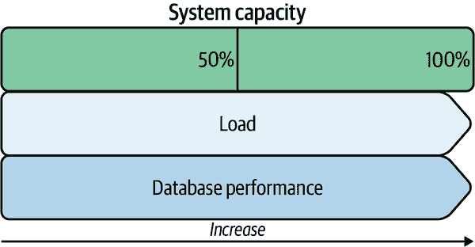
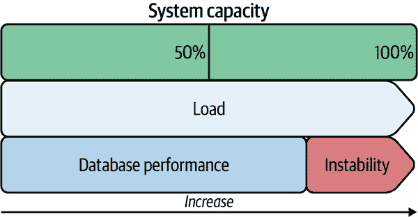
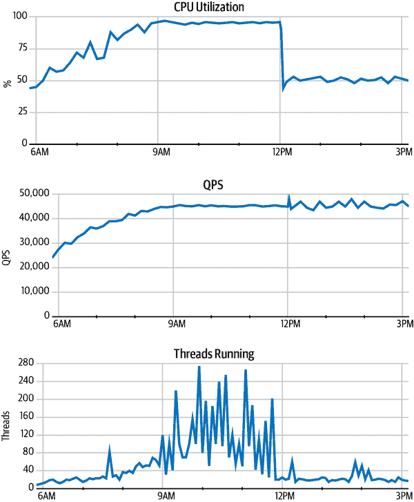
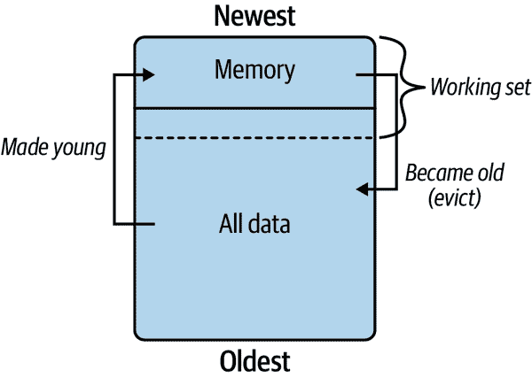
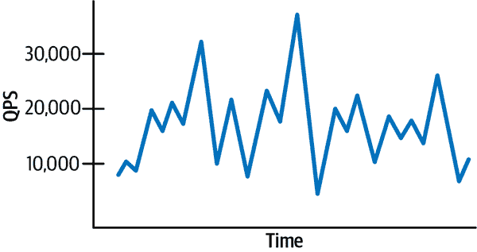
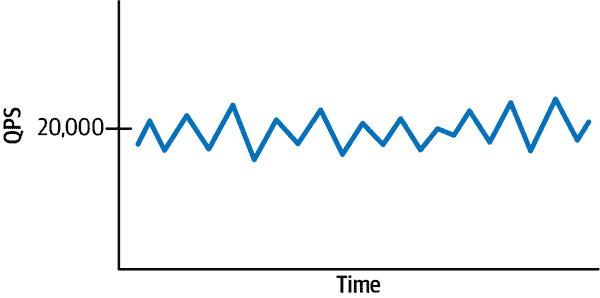

# 第四章：访问模式

*访问模式*描述了应用程序如何使用 MySQL 访问数据。改变访问模式对 MySQL 性能有很大影响，但通常需要比其他优化更多的努力。这就是为什么它是“提高查询响应时间”中规划的最后一步：首先优化查询、索引和数据，然后再优化访问模式。在我们开始之前，让我们再次考虑来自第三章的岩石。

假设你有一辆卡车，类比为 MySQL。如果使用得当，卡车可以轻松地将任何一堆岩石搬上坡。但是如果使用不当，卡车就几乎没有价值，甚至可能比必要的工作时间更长。例如，你可以用卡车一次把卵石搬上山。这对你（和卡车）来说很容易，但效率极低且耗时。一个卡车的用处取决于使用者的能力。同样，MySQL 的用处也取决于使用它的应用程序。

有时，工程师会困惑于为什么 MySQL 运行得不够快。例如，当 MySQL 执行 5000 次查询每秒时，工程师想知道为什么它不能执行 9000 次查询每秒。或者当 MySQL 使用 50%的 CPU 时，工程师想知道为什么它不能使用 90%的 CPU。工程师很难找到答案，因为他们关注的是影响（MySQL），而不是原因：应用程序。像 QPS 和 CPU 使用率这样的指标对于 MySQL 几乎没有什么意义，它们只反映了应用程序如何使用 MySQL。

###### 提示

MySQL 的速度和效率取决于使用它的应用程序。

应用程序可能超出单个 MySQL 实例的容量，但再次强调：这更多地反映了应用程序本身而非 MySQL，因为有数不清的大型高性能应用程序仅使用一个 MySQL 实例。毫无疑问，MySQL 对于应用程序来说速度足够快。真正的问题在于：应用程序是否有效地使用了 MySQL？多年来与 MySQL 共事，涉及数百个不同的应用程序和成千上万个不同的 MySQL 实例后，我可以向你保证：MySQL 的性能受限于应用程序，而不是反过来。

本章重点讨论数据访问模式，确定如何改变应用程序以有效使用 MySQL。本章包括六个主要部分。第一部分阐明了 MySQL 在应用程序之外的功能及其重要性。第二部分证明了数据库性能不是线性扩展的；相反，存在一定极限后性能不稳定。第三部分思考了为什么法拉利比丰田更快，尽管两个品牌的汽车原理大致相同。答案解释了为什么有些应用程序在 MySQL 上表现出色，而其他应用程序则无法起步。第四部分列举了数据访问模式。第五部分介绍了几种改进或修改数据访问模式的应用程序变更。第六部分重新审视了一个老朋友：更好、更快的硬件。

# MySQL 什么也不做

当应用程序空闲时，MySQL 也空闲。当应用程序忙于执行查询时，MySQL 忙于执行这些查询。MySQL 有几个后台任务（比如“页面刷新”），但它们只是忙于为那些查询读取和写入数据。事实上，后台任务通过允许前台任务—执行查询—推迟或避免缓慢的操作来提高性能。因此，如果 MySQL 运行缓慢且没有外部问题，原因只能是驱动 MySQL 的东西：应用程序。

###### 提示

QPS 直接且仅归因于应用程序。没有应用程序，QPS 为零。

一些数据存储有*机器中的幽灵*：内部进程可以随时运行，并且如果在数据存储繁忙执行查询的最差时机运行，会降低性能。（压缩和清理是两个例子—MySQL 没有这些。）MySQL 没有机器中的幽灵—除非应用程序执行你不知道的查询。知道这一点有助于你避免寻找不存在的原因，更重要的是，专注于 MySQL 正忙于做什么：执行查询。来自第一章，你知道如何查看：“查询概要”。查询概要显示的不仅是慢查询，还显示 MySQL 正忙于做什么。

查询会影响其他查询。这个通用术语叫做*查询争用*：当查询竞争并等待共享资源时。有特定类型的争用：行锁争用，CPU 争用等等。查询争用可能会让 MySQL 看起来忙于做其他事情，但不要被误导：MySQL 只是忙于执行应用程序查询。

几乎不可能看到或证明查询争用，因为 MySQL 仅报告一种类型的争用：行锁争用。（即使行锁争用也难以精确看到，因为行锁定是复杂的。）而且，争用是瞬息万变的—几乎察觉不到—因为这个问题是高 QPS（其中*高*是相对于应用程序而言）固有的。查询争用就像交通堵塞：它需要大量的车辆上路。虽然几乎不可能看到或证明，但你需要意识到它，因为它可能解释那些莫名其妙的慢查询。

当性能被推至极限时，查询争用扮演着重要角色。

# 在极限处性能不稳定

在“MySQL：加快速度”的结尾，我说 MySQL 可以轻松推动大多数现代硬件到极限。这是真的，但极限可能会让你感到惊讶。图 4-1 说明了工程师的预期：随着负载增加，数据库性能增加，直到利用 100％的*系统能力*—硬件和操作系统的吞吐量—然后性能保持稳定。这被称为*线性扩展*（或*线性可伸缩性*），但这是个神话。

###### 图 4-1\. 预期数据库性能（线性可扩展性）

线性扩展是每个 DBA 和工程师的梦想，但它不可能发生。相反，图 4-2 展示了数据库性能相对于负载和系统容量的现实。

###### 图 4-2\. 实际数据库性能

数据库性能随负载增加仅增长到少于系统容量的极限。实际上，数据库性能的极限是系统容量的 80%到 95%。当负载超过这个限制时，数据库性能*不稳定*：吞吐量、响应时间和其他指标会显著波动，有时甚至会异常。最好的情况下，某些（或大部分）查询的性能下降；最坏的情况下，可能会导致故障。

方程 4-1 显示了 Neil Gunther 提出的*通用可扩展性法则*：一个模型硬件和软件系统的可扩展性的方程式。

##### 方程式 4-1\. 通用可扩展性法则

<math><mrow><mi>X</mi> <mrow><mo>(</mo> <mi>N</mi> <mo>)</mo></mrow> <mo>=</mo> <mfrac><mrow><mi>γ</mi><mi>N</mi></mrow> <mrow><mn>1</mn><mo>+</mo><mi>α</mi><mo>(</mo><mi>N</mi><mo>-</mo><mn>1</mn><mo>)</mo><mo>+</mo><mi>β</mi><mi>N</mi><mo>(</mo><mi>N</mi><mo>-</mo><mn>1</mn><mo>)</mo></mrow></mfrac></mrow></math>

表 4-1 概述了通用可扩展性法则方程中每个术语的含义。

表 4-1\. 通用可扩展性法则术语

| 术语 | 代表 |
| --- | --- |
| `X` | 吞吐量 |
| `N` | 负载：并发请求、运行进程、CPU 核心、分布式系统中的节点等 |
| `γ` | 并发性（理想的并行性） |
| `α` | 争用：等待共享资源 |
| `β` | 一致性：协调共享资源 |

###### 注意

深入研究《通用可扩展性法则》超出了本书的范围，因此我将解释限制在当前主题上：数据库性能的极限。想要了解更多，请阅读[《游击队容量规划》](https://oreil.ly/WZEd8)，作者是 Neil Gunther。

吞吐量是负载的函数：`X(N)`。并发性(`γ`)有助于随着负载(`N`)的增加而增加吞吐量。但是争用(`α`)和一致性(`β`)会随着负载的增加而减少吞吐量。这排除了线性可扩展性并限制了数据库性能。

更糟糕的是，一致性不仅限制了性能，还导致*回退性能*：在高负载下性能下降。术语*回退*有所保留。它暗示着当 MySQL 无法处理负载时，它仅仅减少了吞吐量，但实际情况比这更糟。我更倾向于使用*不稳定*和*失稳*这些术语，因为它们更真实地表达了系统正在崩溃的现实，而不仅仅是运行速度变慢。

通用可扩展性法则出人意料地很好地模拟了真实世界中 MySQL 的性能。^(1) 但作为一种模型，它仅描述和预测工作负载的可扩展性；它并不说明工作负载如何或为何扩展（或未能扩展）。通用可扩展性法则主要被专家们用来测量和拟合数据到模型中，以确定参数（`γ`、`α` 和 `β`），然后不知疲倦地努力减少它们。其他人只是观察图表（第 6 章涵盖了 MySQL 指标），并等待 MySQL 性能不稳定 - 这就是极限。

图 4-3 展示了一个真实的故障期间的三个图表，当应用程序将 MySQL 推到极限时。

故障分为三个阶段：

*峰值*（早上 6 点到 9 点）

应用程序在峰值开始时是稳定的，但其开发人员开始担心，因为显示的指标缓慢但稳定地上升。过去，应用程序曾因稳定上升的指标而出现故障。作为回应，应用程序开发人员增加了事务吞吐量以应对增长的需求。（应用程序能够限制事务吞吐量；这不是 MySQL 的特性。）峰值和响应重复，直到不再起作用：MySQL 已达到极限。

###### 图 4-3\. 数据库性能超出极限

*极限*（早上 9 点到中午）

应用程序在达到极限期间完全不稳定，事实上处于离线状态。尽管 CPU 使用率和 QPS 高且稳定，但运行的线程告诉了一个不同的故事。在图 4-3 中展示的线程运行的来回波动模式是 MySQL 不稳定的明显迹象。由于一个查询需要一个线程来运行，线程运行的大幅波动表明查询没有顺畅地通过系统流动。相反，查询在不均匀、不协调的打击中猛烈地冲击 MySQL。

高且稳定的 CPU 使用率和 QPS 是误导性的：稳定只有在有少量变化时才算好，就像在极限之前和之后看到的那样。没有变化的稳定状态，在极限期间看到的那样，就像平稳状态。为了理解其中的原因，这里有一个奇怪但有效的类比。想象一个管弦乐团。当管弦乐团演奏正确时，音乐的各个方面都有变化。事实上，这些变化 *就是* 音乐：节奏、速度、音调、音色、旋律、动态等等。一个平稳状态的度量指标类似于一个失常的单簧管手持续演奏一个音符 *强音*：稳定，但不是音乐。

在极限期间，应用程序开发人员不断尝试增加事务吞吐量，但没有成功。MySQL 不会使用 CPU 的最后 5%，QPS 不会增加，线程运行不会稳定。从通用可扩展性法则（公式 4-1）中，你知道原因：竞争和一致性。随着负载增加（`N`），事务吞吐量（`X`）增加，但竞争（`α`）和一致性（`β`）的限制效应也随之增加，直到 MySQL 达到极限。

*修复*（中午至下午 3 点）

由于增加事务吞吐量导致了它自身的失败，修复的方法是*减少*事务吞吐量。这似乎是违反直觉的，但数学不会说谎。在中午时分，应用程序开发人员减少了事务吞吐量，在图表中的结果显而易见：CPU 使用率降至 50%，QPS 恢复到了稳定的变化（甚至稍微增加了一点），运行的线程也恢复到了稳定的变化（有少量峰值，但 MySQL 有备用容量可以吸收）。

想象一下这是如何工作的，考虑另一个类比。想象一条高速公路。当道路上有很多车时，它们都会减速（希望如此），因为人类需要时间来思考和对其他车辆做出反应，特别是在高速公路上。当道路上的车太多时，它们会导致交通堵塞。除了增加更多车道外，唯一的解决方案是减少高速公路上的车辆数量：少量车辆可以更快地行驶。减少事务吞吐量类似于减少高速公路上的车辆数量，这使得其余车辆可以更快地行驶，交通流畅。

这个例子很好地模拟了根据通用可扩展性法则（Equation 4-1）数据库性能的极限，但这也是一个特例，因为该应用程序能够将 MySQL 和硬件推到极限。更典型的情况是，高负载会使应用程序不稳定，这阻止了它增加 MySQL 的负载。换句话说：在应用程序能够推动 MySQL 到极限之前，应用程序会失败。但在这个例子中，应用程序没有失败，它不断扩展直到推动 MySQL 到极限。

在我们转向应用程序之前，还有两点关于 MySQL 性能的极限：

+   除非硬件显然不足，否则很难达到极限。正如在“更好、更快的硬件！”中提到的，这是你应该升级到合理硬件的两个例外之一。一个应用程序很难完全且*同时*利用所有硬件——CPU、内存和存储。当这种情况发生时，应用程序并未达到数据库性能的极限，而只是达到了一个硬件部件的极限。

+   当高负载导致 MySQL 响应缓慢时，这并*不*意味着已经达到了极限。原因很简单：`γ`。 Gamma (`γ`) 表示并发或理想并行性。回想一下通用可扩展性法则方程（Equation 4-1）中，gamma 在分子中。^(2) 慢的数据库性能并*不*意味着已经达到了极限，因为增加并发（`γ`）会提高极限。减少争用（`α`）也会提高极限。（一致性 [`β`] 不受我们控制：它是 MySQL 和操作系统固有的，但通常不是问题。）

第二个观点引出了一个问题：我们如何增加并发性，或减少争用，或两者兼而有之？这似乎是一个至关重要的问题，但实际上不是：这是误导性的，因为 MySQL 性能的北极星是查询响应时间。并发性（`γ`）和争用（`α`）的值不能直接测量。它们是通过将吞吐量和负载测量与模型拟合来确定的。专家使用通用可伸缩性法则来理解系统容量，而不是改善性能。本节已经使用它来证明性能在极限处不稳定。

# 丰田和法拉利

一些应用程序实现了令人难以置信的 MySQL 性能，而其他一些则在低吞吐量方面苦苦挣扎。一些应用程序可以充分利用硬件，达到极限，而其他一些则几乎没有使 CPU 变热。一些应用程序没有任何性能问题，而其他一些则不断地为慢查询而苦恼。这是一个概括性的论断，但我要声称，每个工程师都希望他们的应用程序处于“while”左侧：性能令人难以置信，充分利用硬件，并且没有问题。而那些位于“while”右侧的应用程序与左侧的应用程序之间的区别，可以通过思考为什么法拉利比丰田更快来理解。

两个汽车品牌使用大致相同的零件和设计，但丰田的最高速度通常为 130 英里每小时，而法拉利的最高速度为 200 英里每小时。[³]法拉利没有特殊的零件，使其比丰田快 70 英里每小时。那么为什么法拉利比丰田快得多？答案在于工程设计和细节的差异。

丰田不是为高速设计的。实现高速（如高性能）需要对许多细节进行仔细关注。对于汽车来说，这些细节包括：

+   引擎尺寸、配置和时机

+   变速器齿轮比、换档点和时机

+   轮胎尺寸、牵引力和旋转力

+   转向、悬架和制动

+   空气动力学

两个汽车品牌都为这些细节进行设计和工程化，但法拉利的精确细节水平解释了为什么它能够实现更高的性能。您可以在其中一个细节中看到这一点：空气动力学。法拉利独特的外部设计华丽而实用：它降低了空气动力学系数，从而提高了效率。

高性能，如高速度，并非偶然或靠蛮力就能实现。这是通过对高性能的目标进行细致工程化而实现的结果。法拉利比丰田更快，因为它在每一个细节上都被设计和工程化为更快。

您的应用程序是否在每个细节上都设计和工程化，以实现最大的 MySQL 性能？如果是，那么我想你可以跳过本章的其余部分。如果不是，这通常是答案，那么下一节将讨论将类似于丰田的应用程序与类似于法拉利的应用程序区分开来的基本技术差异：数据访问模式。

# 数据访问模式

*数据访问模式*描述了应用程序如何使用 MySQL 访问数据。

术语*数据访问模式*（或简称*访问模式*）通常被使用，但很少有解释。通过澄清关于访问模式的三个细节，让我们改变这一点：

+   讨论访问模式的复数形式非常常见，以至于它们开始模糊在一起。但重要的是要意识到它们并非一个不可区分的整体。一个应用程序有许多访问模式。为方便起见，它们以复数形式讨论。但在实践中，您是单独修改访问模式的。

+   访问模式最终是指一个查询，您更改查询（和应用程序）以更改访问模式，但查询并非重点。在[Go 编程语言术语](https://golang.org)中，访问模式是一个接口，查询是一个实现。专注于接口，而非实现，使得可以设想（并可能应用）访问模式到不同的数据存储。例如，在 MySQL 上执行的某些访问模式更适合键值数据存储，但如果专注于与键值查询毫无相似之处的 SQL 查询，则很难看到这一点。在本书中，我讨论了修改访问模式，但在实践中，您修改查询（和应用程序）。

+   访问模式由名称和技术特征列表组成。名称用于与其他工程师识别和交流访问模式。（访问模式没有固有的名称。）选择一个简洁而有意义的名称。技术特征列表依赖于并且因数据存储而异。例如，MySQL 数据访问与 Redis 数据访问大不相同。本节列举并解释了 MySQL 数据访问的九个特征。

理论上，应用程序开发人员应该识别每个单独的访问模式，但让我们诚实一点：这是非常繁琐的。（我从未见过有人做到这一点，如果应用程序变化迅速，这甚至可能是不可行的。）尽管如此，这仍然是目标。以下是朝这一目标的三种合理且可实现的方法：

+   与您的团队进行头脑风暴，以识别最明显和最常见的访问模式。

+   使用查询概要文件（见“查询概要文件”）来识别顶部最慢的访问模式。

+   浏览代码以查找较少知名（或被遗忘）的访问模式。

至少需要在第一次或第二次尝试中遵循以下方法之一，以完成本章的目标：通过更改访问模式间接优化查询。

一旦您已识别（并命名）一个访问模式，请确保对以下九个特征的每一个找到值或答案。不知道特征的值或答案是学习和可能改进应用程序的一个很好的机会。不要让特征未知；找到或弄清楚特征的值或答案。

在解释每个九个特性之前，还有一个问题需要解决：如何使用访问模式？访问模式是纯粹的知识，这些知识构成了前一节和下一节之间的桥梁。前一节，“丰田和法拉利”指出高性能的 MySQL 需要一个高性能的应用程序。下一节，“应用程序变更”介绍了帮助重新设计应用程序以便高性能与数据库兼容的常见应用程序变更。访问模式有助于决定（有时候会指导）如何将应用程序从丰田重新设计为法拉利。

不多说了，让我们来详细讨论 MySQL 数据访问模式的九个特性。

## 读/写

访问是读取还是写入数据？

读取访问很明确：`SELECT`。在考虑细节时，写访问就不那么清楚了。例如，`INSERT`是写访问，但`INSERT`…`SELECT`是读和写访问。同样地，`UPDATE`和`DELETE`应该使用`WHERE`子句，这也使它们成为读和写访问。简单地说：`INSERT`、`UPDATE`和`DELETE`总是被视为写访问。

在内部，读取和写入并不相等：它们对 MySQL 的技术影响不同，并调用不同的内部部分。例如，`INSERT`和`DELETE`在底层是不同的写入操作——不仅仅是因为前者添加而后者移除。再次简单地说：所有读取是平等的，所有写入是平等的。

*读/写* 特性是最基础和普遍的之一，因为扩展读取和写入需要不同的应用程序变更。通常通过卸载读取来扩展读取，我稍后在“卸载读取”中介绍。扩展写入更加困难，但是排队写入是一种技术（见“排队写入”），而第五章则涵盖了最终解决方案：分片。

尽管这个特性相当简单，但它很重要，因为快速了解应用程序是读重还是写重能够迅速聚焦于相关的应用程序变更。例如，在写重的应用程序中使用缓存是不相关的。此外，其他数据存储为读或写进行了优化，而 MySQL 还有一个写优化的存储引擎：[MyRocks](https://myrocks.io)。

## 吞吐量

数据访问的吞吐量（每秒查询数）及其变化是多少？

首先，吞吐量并不等同于性能。低吞吐量的访问——即使只有 1 QPS——也可能造成严重问题。你可能能想象出这会如何；如果不能，这里举个例子：一个`SELECT`…`FOR UPDATE`语句，它对表进行扫描并锁定每一行。找到如此糟糕的访问是罕见的，但它证明了这一点：吞吐量并不等同于性能。

尽管存在严重的访问问题，对于所有在 “少量 QPS 更好” 中详细阐述的原因，非常高的 QPS（其中 *高* 是相对于应用程序而言）通常是需要减少的一个问题。例如，如果应用程序执行股票交易，在美国股票交易所开盘时（东部时间上午 9:30），可能会出现大量的读写访问突发。这种吞吐量水平引发了完全不同的考虑，而不是稳定的 500 QPS。

*变化* —— QPS 的增加和减少同样重要。前面的段落提到了 *突发* 和 *稳定*；另一种类型的变化是 *周期性*：QPS 随着时间周期性增加和减少。一个常见的周期模式是在工作时间内增加的 QPS —— 例如东部时间上午 9 点到下午 5 点 —— 和夜间较低的 QPS。一个常见的问题是在工作时间内高 QPS 阻止开发人员进行模式更改（`ALTER TABLE`）或回填数据。

## 数据时代

数据访问的年龄是多少？

*年龄* 是相对于访问顺序而言，并非时间。如果一个应用程序在 10 分钟内插入了一百万行数据，第一行是最老的，因为它是最后访问的行，而不是因为它已经 10 分钟了。如果应用程序更新第一行，则它变成最新的，因为它是最近访问的行。如果应用程序不再访问第一行，但继续访问其他行，则第一行会变得越来越老。

这个特征很重要，因为它影响工作集。回想一下 “工作集大小”，工作集是经常使用的索引值和它们引用的主键行 —— 这句话的意思是 *经常访问的数据*，通常只占表大小的一小部分。MySQL 尽可能多地将数据保存在内存中，数据的年龄影响内存中的数据是否属于工作集。通常是这样，因为 MySQL 凭借各种算法和数据结构在内存中保持工作集非常高效。 图 4-4 是这个过程的高度简化插图。

图 4-4 中的矩形代表所有数据。工作集是一小部分数据：从虚线到顶部。而内存比两者都小：从实线到顶部。在 MySQL 术语中，数据在访问时 *变得年轻*。当数据没有被访问时，它会变老并最终被从内存中驱逐。

###### 图 4-4\. 数据老化

由于访问数据会使其保持年轻并保留在内存中，工作集保持在内存中。这就是为什么 MySQL 在少量内存和大量数据情况下非常快速的原因。

经常访问旧数据在多个方面都是有问题的。为了解释原因，我必须深入到超出本节范围的技术细节，但我稍后在 “InnoDB” 中进行澄清。数据被加载到*空页*（内存中）：即那些不包含数据的页。 （*页*是 InnoDB 内部的逻辑存储单位，每个 16 KB。） MySQL 使用所有可用的内存，但同时保留一定数量的空页。 当有空页时，这是正常的，问题仅在于从存储中读取数据会很慢。 当没有空页时，这是异常的，问题会恶化三倍。 首先，MySQL 必须驱逐旧页，这些页在最近最少使用（LRU）列表中被跟踪。 其次，如果旧页是脏的（即包含未写入磁盘的数据更改），MySQL 必须在清除之前刷新（持久化）它，而刷新操作很慢。 第三，原始问题仍然存在：从存储中读取数据很慢。 长话短说：频繁访问旧数据对性能有问题。

偶尔访问旧数据并不是问题，因为 MySQL 很聪明：驱动这一过程的算法在 图 4-4 中阻止偶尔访问旧数据干扰新（年轻）数据。 因此，一起考虑数据年龄和吞吐量：旧且缓慢的访问可能是无害的，但旧且快速的访问必然会带来麻烦。

数据年龄几乎不可能衡量。^(4) 幸运的是，你只需估计访问数据的年龄，这可以通过你对应用程序、数据和访问模式的理解来完成。例如，如果应用程序存储金融交易，你知道访问主要限于新数据：最近 90 天的交易。访问超过 90 天的数据应该很少，因为交易已经结算且不可变。相比之下，同一应用程序的另一部分管理用户配置文件，如果活跃用户的比例高，可能会频繁访问旧数据。记住：旧数据相对于访问而言，而非时间。一个一周前最后登录的用户配置文件并不一定是时间上的旧数据，但相对于其他已经被访问过的百万个配置文件而言，他们的配置文件数据确实相对较旧，这意味着他们的配置文件数据已经从内存中清除。

知道这一特性是理解 “分区数据” 和第五章中的分片的先决条件。

## 数据模型

访问所展示的数据模型是什么？

尽管 MySQL 是关系型数据存储，但通常与其他数据模型一起使用：键值、文档、复杂分析、图形等。您应该特别注意非关系访问，因为它不是 MySQL 的最佳匹配，因此不能提供最佳性能。MySQL 在其他数据模型方面表现出色，但仅限于某些情况。例如，MySQL 作为键值数据存储很有效，但[RocksDB](https://rocksdb.org)则更胜一筹，因为它是专门为键值数据存储而构建的。

数据模型特征不能像其他特征那样以编程方式测量。相反，您需要确定访问表现出哪种数据模型。动词*表现*是有意义的：访问可能仅因为 MySQL 是唯一可用的数据存储而是关系型，但在考虑所有数据存储时*表现*出另一个数据模型。访问通常被强行塞入可用数据存储的数据模型中。但最佳实践是反过来：确定访问的理想数据模型，然后使用为该数据模型构建的数据存储。

## 事务隔离

访问需要什么样的事务隔离？

*隔离性*是 ACID 属性之一：原子性、一致性、隔离性和耐久性。由于默认的 MySQL 存储引擎 InnoDB 支持事务，每个查询默认都在事务中执行，即使是单个`SELECT`语句。(第八章讨论了事务。) 因此，访问具有隔离性，无论是否需要。这一特性澄清了是否需要隔离性，以及如果需要，需要哪种级别。

当我询问工程师这个问题时，答案分为三类：

无

不，访问不需要任何隔离。它可以在非事务性存储引擎上正确执行。隔离只是无用的开销，但它不会造成任何问题或明显影响性能。

默认

可能访问需要隔离性，但尚不清楚需要哪种级别。应用程序对 MySQL 的默认事务隔离级别`REPEATABLE READ`可以正常工作。需要仔细考虑确定其他隔离级别是否或不需要隔离。

具体

是的，访问需要特定的隔离级别，因为它是与访问相同数据的其他事务并发执行的一部分。没有特定的隔离级别，访问可能会看到数据的不正确版本，这对应用程序将是一个严重问题。

根据我的经验，*默认*是最常见的类别，这是合理的，因为 MySQL 的默认事务隔离级别`REPEATABLE READ`对大多数情况都是正确的。但是，对这一特性的回答应该导致*无*或*具体*。如果访问不需要任何隔离性，那么可能不需要事务性数据存储。否则，如果访问需要隔离性，现在您确切地知道需要哪种隔离级别以及原因。

其他数据存储也有事务——甚至是不基于事务的数据存储。例如，文档存储 [MongoDB](https://www.mongodb.com) 在版本 4.0 中引入了多文档 ACID 事务。了解所需的隔离级别及其原因可以帮助您将访问从 MySQL 移至另一个数据存储并进行翻译。

###### 警告

其他数据存储中的事务可能与 MySQL 的事务非常不同，并且事务会影响锁定等其他方面。

## 读一致性

读取访问是否需要强一致性或最终一致性？

*强一致性*（或*强一致性读*）意味着读取返回最新值。在源 MySQL 实例上（非副本），读取是强一致的，但事务隔离级别确定*当前*值。长时间运行的事务可以读取旧值，但从技术上讲，这是事务隔离级别下的当前值。第八章 深入讨论了这些细节。暂时记住，强一致性是源 MySQL 实例的默认（也是唯一）选项。对于所有数据存储来说都不是这样。例如，[Amazon DynamoDB](https://oreil.ly/EDCme) 默认使用最终一致性读取，强一致性读取是可选的，速度较慢且更昂贵。

*最终一致性*（或*最终一致性读*）意味着读取可能返回旧值，但最终会返回当前值。由于*复制延迟*，MySQL 副本的读取是最终一致的：即数据在源上写入与在副本上写入（应用）之间的延迟。*最终*的持续时间大致等于复制延迟，应该小于一秒。用于提供读访问的副本称为*读副本*。（并非所有副本都提供读取；有些仅用于高可用性或其他目的。）

在 MySQL 的世界中，通常所有访问都使用源实例，这使得所有读取默认都是强一致性的。但是，当复制延迟为亚秒级时，读取通常*不*需要强一致性。当可以接受最终一致性时，可以进行读取卸载（参见“卸载读取”）。

## 并发性

数据是并发访问的吗？

零并发意味着访问不会同时读取（或写入）相同数据。如果在*不同*时间读取（或写入）相同数据，则也是零并发。例如，插入唯一行的访问模式具有零并发。

高并发意味着访问频繁同时读取（或写入）相同数据。

并发性指示写访问时行锁定的重要性（或麻烦）。毫不奇怪，对同一数据的写并发性越高，行锁争用就越大。只要增加的响应时间可接受，行锁争用就是可以接受的。当它导致锁等待超时时，这就变得不可接受了，这是应用程序必须处理并重试的查询错误。当这种情况开始发生时，只有两种解决方案：减少并发性（更改访问模式），或分片（参见第五章）以扩展写操作。

并发性还指示缓存对读访问的适用性。如果相同数据以高并发读取但变更不频繁，则适合缓存。我在“卸载读取”中讨论了这一点。

正如在“数据时代”中所讨论的，同时性几乎不可能测量，但您只需要估算并发性，这可以通过您对应用程序、数据和访问模式的理解来完成。

## 行访问

行如何被访问？有三种类型的行访问：

*点访问*

单行

*范围访问*

在两个值之间的有序行

*随机访问*

任意顺序的多行

使用英文字母（*A*至*Z*），点访问是任何单个字符（例如*A*）；范围访问是顺序的任意数量字符（例如*ABC*，或者如果*B*不存在，则*AC*）；随机访问是任意数量的随机字符（例如*ASMR*）。

这一特性似乎很简单，但对于写访问有两个重要原因：

+   间隙锁定：使用非唯一索引的范围和随机访问写操作加剧了由于间隙锁定而导致的行锁争用。“行锁定”详细讨论了这一点。

+   死锁：随机访问写入是死锁的前提条件，即两个事务持有对方需要的行锁。MySQL 会检测并打破死锁，但会影响性能（MySQL 终止一个事务以打破死锁），而且很恼人。

*行访问*在计划如何分片时也很重要。有效的分片要求访问模式使用单个分片。点访问与分片结合效果最佳：一个行对应一个分片。范围和随机访问与分片兼容，但需要仔细规划，以避免通过访问过多分片抵消分片的好处。第五章涵盖了分片。

## 结果集

访问组、排序或限制结果集吗？

这一特性很容易回答：访问是否有`GROUP BY`、`ORDER BY`或`LIMIT`子句？每个子句都会影响访问可能如何更改或在其他数据存储上运行。“数据访问”涵盖了几个变化。至少要优化分组或排序行的访问。限制行不是问题，而是一个好处，但在其他数据存储中的工作方式不同。同样，其他数据存储可能支持或不支持分组或排序行。

# 应用程序更改

你必须改变应用程序以改变其数据访问模式。本节介绍的更改是常见的，但不是穷尽的。它们非常有效，但也高度依赖于应用程序：有些可能有效，而其他可能不会。（除了第一个变化，"审计代码"：总是有效。）因此，每一个变化都是一个需要与团队进一步讨论和规划的想法。

除了第一个之外的所有更改都有一个微妙的共同点：它们需要额外的基础设施。我指出这一点是为了心理准备你，除了代码更改，你还需要基础设施的变更。正如一开始预言的那样，《优化查询响应时间》（第一章）间接查询优化需要更大的努力。而改变数据（第三章）可能是工作，改变访问模式肯定是工作。但是这是值得的努力，因为这些变化从定义上来说是*变革性的*：应用程序从丰田变成法拉利。

你可能会想：如果这些变化如此强大，为什么不先做它们——在优化查询和数据之前？由于本书的重点是*高效的* MySQL 性能，我计划了这个旅程以应用程序变更结束，因为这需要最多的努力。相比之下，直接查询优化（第二章）和数据更改（第三章）需要的努力要少得多，前者解决了大部分，如果不是所有的性能问题。但是如果你有时间和精力直接进行应用程序的重构，我支持你。只是要记住从第二章学到的教训：索引提供了最多且最好的杠杆。糟糕的查询破坏了出色的访问模式；或者引用著名的 MySQL 专家 Bill Karwin 的话：

> 你未经优化的查询正在毁掉数据库服务器。

## 审计代码

你可能会惊讶于代码可以在没有任何人查看的情况下存在和运行多长时间。从某种意义上说，这是良好代码的标志：它只需正常工作，不会引发问题。但是“不引发问题”并不一定意味着代码是高效的或者甚至是必需的。

你不必审计所有的代码（虽然这不是一个坏主意），只需审计访问数据库的代码。当然要看实际的查询，但也要考虑上下文：这些查询实现的业务逻辑。你可能会意识到实现同样业务逻辑的不同且更好的方法。

关于查询，请查找以下内容：

+   不再需要的查询

+   执行太频繁的查询

+   过于频繁或频率过快的重试查询

+   大型或复杂的查询 - 它们是否可以简化？

如果代码使用 ORM 或任何类型的数据库抽象层，请仔细检查其默认设置和配置。一个考虑因素是，一些数据库库在每次查询后执行`SHOW WARNINGS`以检查警告。通常这不是问题，但也是相当浪费的。还要仔细检查驱动程序的默认设置、配置和发布说明。例如，Go 编程语言的 MySQL 驱动程序多年来有着非常有用的发展，因此 Go 代码应该使用最新版本。

通过使用查询配置文件间接审计代码，查看应用程序执行了哪些查询——无需进行查询分析；只需将查询配置文件用作审计工具。在配置文件中经常看到未知查询是很常见的。鉴于["MySQL 无所作为"](https://zh.wikipedia.org/wiki/MySQL%E6%9C%AA%E4%BD%9C%E4%B8%BA)（MySQL Does Nothing），未知查询可能源自应用程序——无论是您的应用程序代码还是 ORM 等任何类型的数据库抽象层，但还有另一种可能性：运维。*运维*指运行和维护数据存储的人员：DBA、云服务提供商等。如果发现未知查询，并且确信应用程序未执行它们，请与运维人员联系。

###### 小贴士

为了更容易进行查询审计，在`/* SQL comments */`中添加应用程序元数据到查询中。例如，`SELECT`…`/* file:app.go line:75 */`显示查询在应用程序源代码中的来源。SQL 注释会从摘要文本中删除，因此您的查询度量工具必须包含样本（参见示例 1-1）或从 SQL 注释中解析元数据。

最后，也是最容易被忽视的是：审查[MySQL 错误日志](https://oreil.ly/hmLlY)。它应该是安静的：没有错误、警告等。如果它很嘈杂，请查看错误，因为它们表示各种问题：网络、认证、复制、MySQL 配置、非确定性查询等等。这些问题应该是非常罕见的，因此不要忽视它们。

## 卸载读取操作

默认情况下，称为*源头*的单个 MySQL 实例提供所有读写服务。在生产环境中，源头应该至少有一个*副本*：另一个 MySQL 实例，复制源头的所有写操作。第七章讨论了复制，但我在这里提到它是为了讨论如何卸载读取操作。

性能可以通过将读取操作从源头卸载来改善。这种技术使用 MySQL 副本或缓存服务器来提供读取服务。（稍后详述这两者。）它以两种方式提升性能。首先，减少了源头的负载，从而释放时间和系统资源，加快剩余查询的运行速度。其次，通过为卸载的读取操作提供服务的副本或缓存，改善了响应时间，因为这些服务没有负载写操作。这是一种双赢的技术，通常用于实现高吞吐量、低延迟的读取操作。

从副本或缓存读取的数据*不*保证是最新的（即最新值），因为 MySQL 复制和写入缓存中存在固有和不可避免的延迟。因此，来自副本和缓存的数据是*最终一致的*：在（希望是非常）短暂的延迟后变得最新。只有源上的数据是当前的（不考虑事务隔离级别）。因此，在从副本或缓存中提供读取之前，必须满足以下条件：*接受读取过时（最终一致的）数据，并且它不会给应用程序或其用户造成问题*。

让那个声明深思熟虑，因为我曾多次看到开发人员考虑并意识到，“是的，如果应用程序返回略过时的值，这是可以接受的。”一个常见的例子是帖子或视频的“赞”或“点赞”数量：如果当前值是 100，但缓存返回 98，这已经足够接近——尤其是如果缓存几毫秒后返回当前值。如果这个声明对你的应用程序*不*成立，请不要使用这种技术。

除了要求可以接受最终一致性的需求之外，卸载读取不得作为多语句事务的一部分。多语句事务必须在源上执行。

###### 警告

请始终确保卸载读取操作可以接受最终一致性，并且不是多语句事务的一部分。

在从副本或缓存中提供读取操作之前，彻底解决这个问题：*副本或缓存离线时，应用程序如何降级运行？*

对于这个问题，唯一的错误答案是不知道。一旦应用程序卸载读取操作，它往往会严重依赖副本或缓存来提供这些读取操作。设计、实施和测试应用程序在副本或缓存离线时如何降级运行至关重要。*降级*意味着应用程序在运行，但明显变慢，限制客户端请求，或因为某些部分离线或被限流而无法完全运行。只要应用程序不是*完全宕机*——完全离线且无法响应且没有友好的人类可读错误消息——那么你在使应用程序在降级状态下运行方面已经做得很好了。

在讨论使用 MySQL 副本与缓存服务器之前的最后一个要点：不要卸载所有读取操作。卸载读取操作通过不在源上执行副本或缓存可以完成的工作来提高性能。因此，首先卸载慢（耗时）读取操作：在查询性能分析中显示为慢查询的读取操作。这种技术非常有效，因此逐个卸载读取操作，因为你可能只需要卸载几个读取操作就能显著提高性能。

### MySQL 副本

使用 MySQL 的副本提供读取服务很常见，因为每个生产 MySQL 设置应该已经至少有一个副本，并且多于两个副本也很普遍。有了基础设施（副本）已经就位，你只需修改代码以使用副本来分担读取而不是源。

在说明为什么副本比缓存服务器更可取之前，有一个重要问题需要解决：应用程序能否使用副本？由于副本用于高可用性，管理 MySQL 的人可能并不打算让副本提供读取服务。务必弄清楚这一点，因为如果不能，副本可能会因维护而被下线而无法提前通知。

假设你的副本可以用来提供读取服务，它们比缓存服务器更可取，理由有三：

可用性

由于副本是高可用性的基础，它们应该与源具有相同的可用性 — 例如 99.95% 或 99.99% 的可用性。这使得副本几乎无需担忧：管理 MySQL 的人也在管理副本。

灵活性

在前一节中，我说过你应该从慢速（耗时）读取开始。对于缓存而言，这一点尤为重要，因为缓存服务器很可能具有有限的 CPU 和内存 — 这些资源不应浪费在琐碎的读取上。相比之下，用于高可用性的副本应该与源具有相同的硬件配置，因此它们有多余的资源。将琐碎的读取分担给副本的影响并不那么大，因此在选择何时分担时具有灵活性。如果偶然有纯粹的 *读取副本* —— 也就是 *不* 用于高可用性的副本 —— 其硬件配置较弱，则不要浪费资源在琐碎的读取上。这在云中更为常见，因为可以轻松地为大容量存储提供读取副本，但 CPU 和内存较小（以节省成本）。

简单性

应用程序无需做任何事情来保持副本与源的同步 — 这是副本固有的特性。有了缓存，应用程序必须管理更新、失效和（可能的）驱逐。但真正的简单之处在于副本不需要任何查询更改：应用程序可以在副本上执行完全相同的 SQL 语句。

这三个理由充分说明了为什么要优先选择 MySQL 的副本而不是缓存服务器，但后者有一个重要的优势：缓存服务器比 MySQL 快得多。

### 缓存服务器

一个缓存服务器不受 SQL、事务或持久存储的限制。这使它比 MySQL 快得多，但在应用程序中正确使用它需要更多工作。如前文所述，应用程序必须管理缓存更新、失效以及（可能的）驱逐。此外，应用程序需要一个能与缓存配合的数据模型，通常是键值模型。这额外的工作是值得的，因为实际上没有比缓存更快的东西。[Memcached](https://memcached.org) 和 [Redis](https://redis.io) 是两种流行且广泛使用的缓存服务器。

###### 注意

如果你听说 MySQL 有内置的查询缓存：请忘记它，永远不要使用。自 MySQL 5.7.20 起，它已被弃用，并且在 MySQL 8.0 中移除。

缓存非常适合频繁访问但不经常更改的数据。这对于 MySQL 复制不是一个问题，因为所有更改都会复制，但缓存只存储应用程序放入其中的内容。一个不好的例子是当前 Unix 时间戳（以秒为单位）：它一直在变化。在这种糟糕的情况下的例外：如果访问频率显著*大于*更改频率。例如，如果每秒请求一百万次当前 Unix 时间戳，那么缓存当前时间戳可能是合适的。一个好例子是当前年份：它的变化不频繁。然而，在这种良好情况下的例外：如果访问频率显著*低于*更改频率。例如，如果每秒仅请求一次当前年份，则缓存几乎没有价值，因为每秒 1 次对于这种数据访问没有任何影响。

在使用缓存时需要注意：*决定缓存是临时的还是持久的*。这对于 MySQL 复制不是一个问题，因为它们总是持久的，但某些缓存服务器可以是两者之一。如果缓存是真正的临时的，那么你应该能够对缓存数据执行类似于`TRUNCATE TABLE`的操作而不影响应用程序。你还需要决定如何重建临时缓存。一些应用在*缓存未命中*时重建缓存：当请求的数据不在缓存中时。其他应用程序有一个外部过程，从另一个数据源重新构建缓存（例如，从[Amazon S3](https://oreil.ly/XMQxR)加载存储在其中的图像）。有些应用程序非常依赖缓存，或者缓存非常大，因此重建它是不可行的。对于这些应用程序，需要一个持久的缓存。无论是临时还是持久，都要测试你的决策，以验证在缓存失败和恢复时应用程序是否按预期运行。

## 排队写入

使用队列稳定写入吞吐量。图 4-5 展示了不稳定的—突发—写入吞吐量，其高于 30,000 QPS 并低于 10,000 QPS。

###### 图 4-5\. 不稳定的写入吞吐量

即使目前性能在不稳定的写入吞吐量下仍然可接受，但这不是成功的秘诀，因为不稳定的吞吐量在规模上会恶化——它永远不会自动稳定。（如果你还记得图 4-3 中的“性能极限时的表现”，一个平线值并不稳定。）使用队列使应用程序能够以稳定的速率处理更改（写入），如图 4-6 所示。

###### 图 4-6\. 稳定的写入吞吐量

将写入加入队列和稳定的写入吞吐量的真正威力在于它们使应用程序能够优雅且可预测地响应*雷鸣群*：即淹没应用程序、数据库或两者的请求洪流。例如，假设应用程序通常每秒处理 20,000 次更改。但它下线了五秒钟，结果导致有 100,000 个待处理更改。应用程序重新上线时，它将面对这 100,000 个待处理更改—一个“雷鸣群”—以及当前秒的正常 20,000 个更改。应用程序和 MySQL 将如何处理这场“雷鸣群”？

有了队列，雷鸣群不会影响 MySQL：它们进入队列，MySQL 像往常一样处理更改。唯一的区别是有些更改可能会比平时晚一些。只要写入吞吐量稳定，可以增加队列消费者的数量，以更快地处理队列。

没有队列的话，经验告诉我们会出现以下两种情况之一。要么你会非常幸运，MySQL 能处理“雷鸣群”现象，要么就不行。不要寄希望于运气。MySQL 不会限制查询执行，因此在“雷鸣群”袭击时会尝试执行所有查询。（然而，MySQL 企业版、Percona Server 和 MariaDB Server 拥有*线程池*，限制同时执行查询的数量，起到了一定的限流作用。）这种方法从来不奏效，因为 CPU、内存和磁盘 I/O 本质上是有限的，更不用说普适性扩展法则（Equation 4-1）。尽管如此，MySQL 总是试图做到，因为它非常雄心勃勃，也有点鲁莽。

这种技术赋予了其他优势，使得实施它变得值得。其中一个优势是它将应用程序与 MySQL 的可用性解耦：即使 MySQL 离线，应用程序也能接受更改。另一个优势是它可以用来恢复丢失或放弃的更改。假设一个更改需要各种步骤，其中一些可能是长时间运行或不可靠的。如果某个步骤失败或超时，应用程序可以重新将更改放入队列以重试。第三个优势是如果队列是事件流（如[Kafka](https://oreil.ly/fRZpa)），则可以重放更改。

###### 提示

对于写入密集型应用程序，将写入加入队列是最佳实践，几乎是必须的。投入时间学习和实现队列。

## 分区数据

在第三章之后，你应该不会感到意外，减少数据量能更容易提高性能。对你来说数据很重要，但对 MySQL 来说只是一种负担。如果不能删除或存档数据（见“删除或存档数据”），那么至少应该对数据进行分区（物理分离）。

首先，让我们简要讨论然后放置[MySQL 分区](https://oreil.ly/BNopd)。MySQL 支持分区，但需要特殊处理。实施或维护起来并不轻松，并且一些第三方 MySQL 工具不支持它。因此，我不建议使用 MySQL 分区。

最有用、更常见且对应用程序开发者更容易实现的数据分区类型是将*热*和*冷*数据分开：分别是频繁访问和不经常访问的数据。将热数据和冷数据分开是分区和归档的结合。它根据访问进行分区，并通过将不经常访问的（冷）数据移出经常访问的（热）数据的访问路径来进行归档。

让我们举个例子：一个存储支付信息的数据库。热数据是最近 90 天的支付，有两个原因。首先，支付通常在结算后不会更改，但像退款这样的例外情况可以稍后应用。然而，一段时间后，支付将最终确定且无法更改。其次，应用程序仅显示最近 90 天的支付。要查看较早的支付，用户必须查找过去的对账单。冷数据是 90 天后的支付。一年来，这是 275 天，大约占数据的 75%。为什么要让 75%的数据在像 MySQL 这样的事务数据存储中闲置不用呢？这是一个反问：没有充分的理由。

将热数据和冷数据分开主要是对前者进行优化。将冷数据存储在其他地方有三个直接优点：更多的热数据适合内存，查询不会浪费时间检查冷数据，并且操作（如模式更改）更快。将热数据和冷数据分开也是对后者的优化，当它具有完全不同的访问模式时。在前面的例子中，旧的支付可能会按月分组成单个数据对象，不再需要每笔支付的行。在这种情况下，文档存储或键值存储可能更适合存储和访问冷数据。

至少，您可以在同一数据库的另一个表中存档冷数据。通过控制的`INSERT`…`SELECT`语句从热表中选择并插入到冷表中是相对容易的。然后从热表中`DELETE`存档的冷数据。为了一致性将所有操作包装在一个事务中。参见“删除或存档数据”。

这种技术可以通过多种不同的方式实施，特别是关于冷数据存储和访问的方式和位置。但从根本上讲，它非常简单且高效：将不经常访问的（冷）数据移出频繁访问的（热）数据的访问路径，以提高后者的性能。

## 不要使用 MySQL

我想在当前关于应用程序变更的讨论中做一个象征性的总结：最显著的变更是在访问模式明显不适合使用 MySQL 作为最佳数据存储时不使用它。有时很容易看出 MySQL 不是最佳选择。例如，在前几章中，我提到过一个负载为 5,962 的查询。该查询用于选择图中的顶点。显然，关系型数据库不适合处理图数据；最佳选择是图数据存储。甚至键-值存储也比关系型数据库更好，因为图数据与规范化和事务等关系型数据库概念无关。另一个简单且常见的例子是时间序列数据：面向行的事务性数据库不是最佳选择；最佳选择是时间序列数据库，或者可能是列存储。

即使 MySQL 不是最佳选择，它也能出乎意料地适应各种数据和访问模式。但不要把这一点视为理所当然：作为团队中第一个说出“也许 MySQL 不是最佳选择”的工程师是可以的。没关系：如果我能这么说，你也可以。如果有人因此给你麻烦，请告诉他们我支持你为工作选择最佳工具的决定。

尽管如此，MySQL 也是非常棒的。请至少在阅读完本章和下一章 第五章 之后再考虑放弃 MySQL。

# 更好，更快的硬件？

“更好，更快的硬件！” 警告不要通过扩展硬件来提高性能。但是该部分的第一句话精心措辞：“当 MySQL 的性能不可接受时，请*不要*从扩展…” 该句中的关键词是 *begin*，它引导出一个关键问题：*何时才是扩展硬件的正确时机？*

这个问题很难回答，因为它取决于查询、索引、数据、访问模式以及这些如何利用当前的硬件。例如，假设应用程序有一个超级低效的访问模式：它将 MySQL 用作队列，并且从许多应用程序实例中非常快速地轮询它。在修复访问模式之前，我不会扩展硬件。但有时候，工程师没有足够的时间来进行这样的应用程序更改。

表 4-2 是一个检查表，用于帮助确定是否是扩展硬件的时机。当您可以检查完列 1 中的所有项目，并至少检查列 2 中的两个项目时，这明显表明是时候扩展硬件了。

表 4-2\. 硬件升级清单

| 1\. 检查所有 | 2\. 至少检查两项 |
| --- | --- |
| ☐ 响应时间过高 | ☐ CPU 利用率大于 80% |
| ☐ 已优化慢查询 | ☐ 运行线程大于 CPU 核心数 |
| ☐ 数据已删除或存档 | ☐ 内存少于总数据大小的 10% |
| ☐ 已经审查和优化访问模式 | ☐ 存储 IOPS 利用率大于 80% |

第一栏不仅是对自第一章以来一切的明确重申，还是升级硬件的明确理由。第二栏至少需要两次检查，因为硬件是协同工作的。仅仅大量利用一个硬件部件并不能保证问题或性能变慢。相反，这可能是一个好迹象：你完全利用了该硬件部件。但当一个硬件部件过载时，通常会开始影响其他硬件部件。例如，当缓慢的存储导致查询积压，进而导致客户积压，因为 MySQL 试图执行过多的线程，这就是为什么第二栏需要两次检查的原因。

第二栏中的数值应始终大于或小于建议的阈值。偶尔的波动是正常的。

如果是自己的硬件，存储设备的最大 IOPS 数由存储设备确定。如果不确定，请查看设备规格或询问管理硬件的工程师。在云中，存储 IOPS 是分配或预留的，所以通常更容易告知最大值，因为你购买了 IOPS。但如果不确定，请检查 MySQL 存储设置或询问云提供商。"IOPS"显示了哪些指标报告存储 IOPS。

根据应用程序是读密集型还是写密集型（参见"读/写"），存储 IOPS 利用还需要考虑其他因素：

读取密集型

对于读取密集型访问模式，持续高 IOPS 可能是由于内存不足而不是 IOPS 不足。当 MySQL 从磁盘读取数据时，如果数据不在内存中，它通常会表现出色地保持工作集在内存中（参见"工作集大小"）。但是，两个因素的组合可能会导致读取高 IOPS：工作集大小显著大于内存，并且读取吞吐量异常高（参见"吞吐量"）。这种组合会导致 MySQL 在磁盘和内存之间频繁交换数据，从而以高 IOPS 的问题表现出来。这是罕见的，但可能发生。

写入密集型

对于写入密集型访问模式，持续高 IOPS 可能是由于 IOPS 不足。简而言之：存储无法快速写入数据。通常，存储通过写入缓存实现高吞吐量（IOPS），但缓存不是持久的。MySQL 需要*持久存储*：数据物理上存储在磁盘上，而不是在缓存中。因此，MySQL 必须*刷新*数据——强制将其写入磁盘。刷新严重限制了存储的吞吐量，但 MySQL 具有复杂的技术和算法来实现性能与耐久性——“页面刷新”详细介绍了这一点。在这一点上，唯一的解决方案是增加存储的 IOPS，因为您已经优化了查询、数据和访问模式。

谨慎考虑扩展硬件的建议，看起来我们已经到了尽头。无论有多少卵石、鹅卵石或巨石需要移动，我们总可以用更大的卡车来搬运它们。但如果你必须移动一座山呢？那么你就需要下一章：分片。

# 总结

本章重点讨论了决定如何更改应用程序以有效使用 MySQL 的数据访问模式。重要的要点是：

+   MySQL 除了执行应用程序查询外无任何操作。

+   数据库性能在硬件容量的百分之百以下的某个极限处不稳定。

+   一些应用由于每一个细节都设计为高性能而具有更高的 MySQL 性能。

+   访问模式描述应用程序如何使用 MySQL 访问数据。

+   您必须更改应用程序以改变其数据访问模式。

+   在耗尽其他解决方案之后，扩展硬件以提高性能。

下一章介绍了将 MySQL 分片以实现规模化 MySQL 的基本机制。

# 实践：描述一个访问模式

这项实践的目标是描述最慢查询的访问模式。（要获取慢查询，请参考“查询概况”和“实践：识别慢查询”。）对于最慢的查询，请从“数据访问模式”描述所有九种访问模式特征。正如该部分所述，访问模式是纯知识。利用这些知识考虑可以通过更改其访问模式间接优化查询的“应用变更”。即使没有可能的应用变更，了解访问模式也是专家实践，因为 MySQL 性能取决于查询、数据和访问模式。

^(1)观看由著名 MySQL 专家 Baron Schwartz 撰写的视频[“通用可扩展性法则建模工作手册”](https://oreil.ly/hzXnb)，了解来自真实 MySQL 服务器的值的 USL 如何发挥作用。

^(2) 实际上，著名的 MySQL 专家巴伦·施瓦茨放在那里。尼尔·冈瑟在博客文章中写道，[“USL Scalability Modeling with Three Parameters”](https://oreil.ly/s2BL8)，巴伦之所以添加第三个参数，是因为这使得 USL 能够拟合来自真实数据库的数据。

^(3) 丰田：210 Km/h；法拉利：320 Km/h。

^(4) 从技术上讲，可以通过检查 InnoDB 缓冲池中数据页的 LSN 来实现，但这样做会造成干扰，所以实际上几乎不会这样做。
