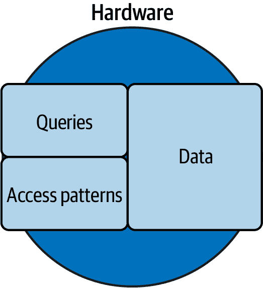

# 第五章：分片

在单个 MySQL 实例上，性能取决于查询、数据、访问模式和硬件。当直接和间接的查询优化—认真应用后—不能提供可接受的性能时，你已经达到了应用负载下单实例 MySQL 性能的相对极限。为了超越这个相对极限，你必须将应用负载分布到多个 MySQL 实例中，以实现 MySQL 的扩展。

*分片* 是常用的、广泛使用的技术，用于 *扩展* （或 *水平扩展* ）：通过在多个数据库之间分配工作负载来提高性能。相比之下， *扩展* （或 *垂直扩展* ）通过增加硬件容量来提高性能。分片将一个数据库分成多个数据库。每个数据库都是一个分片，每个分片通常存储在运行在独立硬件上的独立 MySQL 实例上。分片在物理上是分开的，但在逻辑上是相同的（非常大的）数据库。

MySQL 的扩展需要分片。在本章中，我将重复这句话多次，因为这是工程师不愿意接受的事实。为什么呢？因为分片不是 MySQL 的固有特性或能力。因此，分片是复杂的，并且完全依赖于应用程序，这意味着没有简单的解决方案。但不要气馁：分片是一个已解决的问题。几十年来，工程师们一直在扩展 MySQL。

本章介绍了分片的基本机制，以实现 MySQL 的扩展。有四个主要部分。第一部分解释了为什么单个数据库不可扩展—为什么分片是必要的。第二部分完成了从第三章和第四章的类比：为什么小石子（数据库分片）比大石块（巨大数据库）更好。第三部分是关系数据库分片复杂主题的简要介绍。第四部分介绍了分片的替代方案。

# 为什么单一数据库不可扩展

没有人质疑单个应用程序可能会使单个服务器超负荷—这就是为什么对所有类型的服务器和应用程序，不仅仅是 MySQL，都需要扩展的原因。因此，分片是必要的，因为这是 MySQL 扩展的方法：更多数据库。但合理地怀疑为什么单个 MySQL 数据库不可扩展，尤其是在有着非常强大的硬件和一些基准测试显示出色性能的情况下，是完全合理的。以下是五个原因，从最基本的开始：应用负载可能会显著超过单服务器硬件的速度和容量。

## 应用负载

图 5-1 是在单个服务器上没有负载的硬件容量的简单说明。


###### 图 5-1\. 无负载的硬件

图 5-1 故意简单——但不简单——因为它微妙地传达了一个非常重要的观点：*硬件容量是有限的*。圆圈表示硬件的极限。假设硬件专门用于运行单个应用的 MySQL 实例——没有虚拟化、加密货币挖矿或其他负载。运行在硬件上的所有内容必须适合圆圈内。由于这是专用硬件，唯一运行的是显示在 图 5-2 中的应用工作负载：查询、数据和访问模式。


###### 图 5-2\. 标准 MySQL 工作负载

*查询* 指的是不是偶然的 第二章，*数据* 指的是 第三章，*访问模式* 指的是 第四章。这些构成了应用的工作负载：所有导致 MySQL 负载的因素，进而影响硬件（CPU 利用率、磁盘 I/O 等）。方框的大小很重要：方框越大，负载越重。在 图 5-2 中，工作负载在硬件容量内，并且还有一些空余，因为操作系统也需要硬件资源。

查询、数据和访问模式与性能密切相关。（我在 “间接查询优化” 中用 `TRUNCATE TABLE` 证明了这一点。）数据大小是扩展的常见原因，因为正如 图 5-3 所示，它使工作负载超出了单个服务器的容量。



###### 图 5-3\. 数据过多的硬件

数据大小的增加最终会影响查询和访问模式。购买更大的硬盘不会解决问题，因为正如 图 5-3 所示，虽然数据的容量充足，但数据并非工作负载的唯一部分。

图 5-4 描述了一种常见的误解，即工程师们认为单个数据库可以扩展到最大数据大小，目前单个 InnoDB 表的最大大小为 64 TB。


###### 图 5-4\. 只有数据的硬件（缩放误解）

数据仅是工作负载的一部分，另外两部分（查询和访问模式）也不可忽视。实际上，为了在单个服务器上处理大量数据以获得可接受的性能，工作负载必须类似于 图 5-5。


###### 图 5-5\. 数据量大的硬件

如果查询简单且具有异常良好的索引，并且访问模式是微不足道的（例如，非常低吞吐量的读取），那么单个服务器可以存储大量数据。这不仅仅是一个巧妙的插图；真实的应用程序具有类似 图 5-5 的工作负载。

这五个例子揭示了单个数据库无法扩展的原因，因为应用程序工作负载——包括查询、数据和访问模式——必须适应硬件的容量。在“更好、更快的硬件！”和“更好、更快的硬件？”之后，您已经知道硬件无法解决这个问题。

MySQL 在规模化时需要分片，因为应用程序工作负载可能远远超过单台服务器硬件的速度和容量。

## 基准测试是合成的。

基准测试使用合成（虚假）查询、数据和访问模式。这些是必然虚假的，因为它们不是真正的应用程序，当然也不是您的应用程序。因此，基准测试不能告诉您——甚至也不能建议——您的应用程序将如何执行和扩展——即使在相同的硬件上。此外，基准测试主要集中在一个或多个访问模式（参见“数据访问模式”），这会产生一个类似于图 5-6 中所示的工作负载。


###### 图 5-6\. 带有基准工作负载的硬件

大多数应用程序的工作负载并不是性能由一个或多个访问模式主导的情况。但基准测试却很常见，因为它允许 MySQL 专家对 MySQL 的特定方面进行压力测试和测量。例如，如果一个 MySQL 专家想要评估新页面刷新算法的有效性，他们可能会使用一个完全优化的写入工作负载，包含几个完美优化的查询和非常少的数据。

但让我非常清楚：对于 MySQL 专家和 MySQL 行业来说，基准测试非常重要且必不可少。（如“MySQL 调优”中提到，基准测试是实验室工作。）基准测试用于以下目的：

+   比较硬件（比较一个存储设备和另一个）

+   比较服务器优化（比较一个刷新算法和另一个）

+   比较不同的数据存储（MySQL 与 PostgreSQL——经典竞争）

+   在极限条件下测试 MySQL（见“性能在极限条件下不稳定”）

这项工作对 MySQL 非常重要，也是 MySQL 能够实现惊人性能的原因。但在那份清单中显著缺失的是与您的应用程序及其特定工作负载相关的内容。因此，无论您在基准测试中读到或听到的 MySQL 性能有多惊人，都不会转化为您的应用程序，而且制作这些基准测试的专家也会告诉您：MySQL 在规模化时需要分片。

## 写入

单个 MySQL 实例上的写入因多种原因而难以扩展：

单个可写实例（源）。

为了实现高可用性，MySQL 在生产环境中使用多个实例连接成复制拓扑。但写入实际上限制在单个 MySQL 实例，以避免*写入冲突*：同时向同一行进行多次写入。MySQL 支持多个可写实例，但很难找到使用此功能的人，因为写入冲突太麻烦了。

事务和锁定

事务使用锁定来保证一致性——ACID 兼容数据库中的*C*。写入必须获取行锁定，有时它们会锁定比预期更多的行——“行锁定”解释了其中的原因。锁定会导致锁争用，这使得访问模式特征“并发性”成为评估写入扩展性的关键因素。如果工作负载在相同数据上写入较多，即使使用世界上最好的硬件也无济于事。

页面刷新（持久性）

*页面刷新*是 MySQL 将更改（来自写入）延迟持久化到磁盘的过程。整个过程过于复杂，无法在本节中详细解释，但关键点在于：页面刷新是写入性能的瓶颈。尽管 MySQL 非常高效，但这个过程本质上很慢，因为它必须确保数据是*持久*的：持久化到磁盘。没有持久性，由于缓存，写入速度非常快，但持久性是必需的，因为所有硬件最终都会崩溃。

写入放大

*写入放大*是指需要更多写入的写入过程。次要索引是最简单的例子。如果一个表有 10 个次要索引，一次写入可能需要写入额外的 10 次以更新这些索引。页面刷新（持久性）会导致额外的写入，复制甚至会导致更多的写入。这不仅仅适用于 MySQL；其他数据存储系统也会受到影响。

复制

备份对高可用性至关重要，因此所有写操作必须复制到其他 MySQL 实例（副本）。第七章讨论了复制，但以下是关于扩展写入的几个关键点。MySQL 支持异步复制、半同步复制和[Group Replication](https://oreil.ly/oeJtD)。异步复制对写入性能影响较小，因为数据更改在事务提交时写入和刷新到二进制日志，但此后没有影响。半同步复制对写入性能影响更大：它通过每次提交必须由至少一个副本确认来减弱事务吞吐量到网络延迟。由于网络延迟以毫秒计，这对写入性能的影响是显著的，但这是一个值得的权衡，因为它保证了没有提交的事务会丢失，而异步复制则不能保证。Group Replication 更为复杂，扩展写入更为困难。由于在第七章中解释的各种原因，本书不涵盖 Group Replication。

这五个原因对于在单个 MySQL 实例上扩展写入是巨大的挑战，即使对于 MySQL 专家也是如此。在规模化的 MySQL 中，需要分片来克服这些挑战并扩展写入性能。

## 模式更改

模式更改不仅仅是例行事务；实际上，它们几乎是必须的。此外，最大的表经常发生变化并不罕见，因为它们的大小反映了它们的使用情况，而使用情况则导致开发，从而导致变化。即使您设法克服所有其他障碍并将单个表扩展到极大的大小，更改该表所需的时间也将是不可行的。需要多长时间？更改大表可能需要数天甚至数周。

对 MySQL 或应用程序来说，长时间等待不是问题，因为在线模式更改（OSC）工具如[pt-online-schema-change](https://oreil.ly/tSrrr)和[`gh-ost`](https://oreil.ly/nUuvv)，以及某些内置的[在线 DDL 操作](https://oreil.ly/5KiA7)可以运行数天或数周，同时允许应用程序正常运行—​这就是为什么称之为*在线*。但对于开发应用程序的工程师来说，等待时间过长是个问题，因为这样做不仅不会被忽视，而且还会成为越来越让人恼火的障碍，影响你、其他工程师，甚至可能影响其他团队。

例如，就在几周前，我帮助一个团队修改了几个表，每个表都有**十亿**行数据，尝试了近两周仍未成功（由于各种与 MySQL 无关的技术原因）。这个阻碍不仅仅影响了表或团队：长话短说，它阻碍了组织级别的目标——数月来其他几个团队的工作。幸运的是，需要的模式变更恰好是一个即时的[在线 DDL 操作](https://oreil.ly/5KiA7)。但即时的模式变更极为罕见，所以不要指望它们。相反，不要让一个表变得如此庞大，以至于你无法在合理的时间内进行修改——无论你、你的团队和你的公司认为什么是“合理”的。

MySQL 的扩展需要分片，因为工程师不能等待几天或几周来修改模式。

## 操作

如果您精确而严谨地优化查询，您可以将单个数据库扩展到人们看了都不会相信的大小。但在“应用工作负载”中的硬件和工作负载的例子并未描述以下*操作*（或通常被称为*ops*）：

+   备份和恢复

+   重建失败的实例

+   升级 MySQL

+   MySQL 的关闭、启动和崩溃恢复

数据库越大，这些操作就需要越长时间。作为应用程序开发人员，您可能不会管理这些操作中的任何一个，但除非管理数据库的工程师异常熟练并且深刻致力于零停机操作，否则它们将影响到您。例如，云提供商既不熟练也不致力于零停机操作；它们只试图将数据库的停机时间最小化，这可能意味着从 20 秒到几小时的数据库离线时间。

MySQL 的扩展需要分片来有效管理数据，这引导我们来到下一部分：鹅卵石，而非巨石。

# 鹅卵石，而非巨石

移动鹅卵石比移动巨石要容易得多。我反复强调这个类比是因为它非常贴切：MySQL 的扩展是通过使用许多小实例来实现的。（想要回顾这个类比，请阅读第 3 和第四章的介绍部分。）

在这个语境中，“小”有两个意思：

+   应用工作负载在硬件上以可接受的性能运行。

+   标准操作（包括 OSC）需要合理的时间。

乍一看，这使得“小”看起来如此相对而毫无用处，但在实践中，有限的硬件容量显著缩小了范围，几乎成为客观衡量的标准。例如，在撰写本文时，我建议工程师将单个 MySQL 实例的总数据大小限制在 2 或 4 TB：

2 TB

对于平均查询和访问模式，通用硬件足以提供可接受的性能，并且操作在合理的时间内完成。

4 TB

对于经过特别优化的查询和访问模式，中高端硬件足以保证可接受的性能，但操作可能比预期稍慢一些。

这些限制仅反映了您可以随时购买的硬件容量（2021 年 12 月）。多年前，限制显著较低。（还记得磁盘物理旋转并发出咔哒声的时候吗？奇怪。）多年后，限制将显著增加。

一旦数据库被分片，应用程序对分片数量的访问是程序化的。但对于运维人员——尤其是操作 MySQL 实例的工程师来说——分片的*大小*至关重要：管理一个 500GB 数据库比管理一个 7TB 数据库要容易得多。由于运维是自动化的，管理任意数量的小数据库也很容易。

MySQL 在进行分片和操作许多小数据库（鹅卵石而非巨石）时的性能确实是无限的。

# 分片：简介

分片的解决方案和实施与应用程序工作负载紧密相关。即使是下一节提到的替代解决方案“替代方案”，情况也是如此。因此，没有人可以告诉您如何进行分片，并且没有完全自动化的解决方案。做好漫长但值得的旅程准备。

分片有两种从想法到实施的路径：

设计用于分片的新应用程序

第一种也是最罕见的路径是从一开始就为分片设计应用程序。如果您正在开发新应用程序，我强烈建议您选择*如果需要*采用这种方法，因为从一开始进行分片比以后迁移要容易得多。

要确定是否需要分片，请估算未来四年的数据大小和增长情况。如果估算的四年后数据大小仍在您*今天*硬件的容量范围内，则可能不需要分片。我称之为*四年适配*。还要尝试估算应用工作负载的另外两个方面的四年适配：查询和访问模式。对于新应用程序来说，这些很难估算（而且可能会变化），但您应该有一些想法和期望，因为它们是设计和实施应用程序的必要部分。

还要考虑数据集是有界还是无界。*有界数据集*具有固有的最大大小或固有的缓慢增长。例如，每年发布的新智能手机数量非常少，其增长本质上很慢，因为没有理由认为制造商会每年发布成千上万款新手机。*无界数据集*没有固有限制。例如，图片是无界的：人们可以发布无限数量的图片。由于硬件容量有限，应用程序应始终为无界数据集定义和施加外部限制。永远不要让数据无限增长。无界数据集强烈表明需要分片，除非经常删除或存档旧数据（参见“删除或存档数据”）。

将现有应用程序迁移到分片

第二条更常见的路径是将现有的数据库和应用程序迁移到分片。这条路径显著更加困难、耗时和风险，因为到达这一点时，数据库已经很大——MySQL 正在推着一个巨石上山。与一队经验丰富的开发人员一起，计划迁移可能需要一年甚至更长时间。

在本书中，我无法涵盖如何将单个数据库迁移到分片数据库，因为这是一个定制过程：它取决于分片解决方案和应用程序工作负载。但有一点是确定的：您将从原始（单个）数据库复制数据到新的分片中——可能多次——因为初始迁移本质上是第一次重新分片，这是“重新分片”中讨论的挑战。

对于任何一种路径，分片都是一个复杂的过程。首先，选择一个分片键和策略，并了解将面临的挑战。这些知识为旅程设定了目标：一个您可以相对轻松操作的分片数据库。然后制定从一个数据库到达那个目标的路径。

## 分片键

要将 MySQL 进行分片，应用程序必须以编程方式将数据映射到分片。因此，最基本的决定是*分片键*：数据按照其列（或列）进行分片。分片键与分片策略（在下一节讨论）一起使用，将数据映射到分片中。应用程序负责根据分片键映射和访问数据，因为 MySQL 没有内置的分片概念——MySQL 对分片一无所知。

###### 注意

术语*分片*可在数据库或存储数据库的 MySQL 实例中互换使用。

理想的分片键具有三个特性：

*高基数*

理想的分片键具有高基数（参见“极端选择性”），以便数据在分片中均匀分布。一个很好的例子是允许您观看视频的网站：它可以为每个视频分配一个类似`dQw4w9WgXcQ`的唯一标识符。存储该标识符的列是理想的分片键，因为每个值都是唯一的，因此基数是最大的。

*引用应用实体*

理想的分片键引用应用实体，以便访问模式*不*跨越分片。一个很好的例子是存储支付的应用程序：尽管每笔支付是唯一的（最大基数），但客户是应用实体。因此，该应用程序的主要访问模式是按客户而不是按支付。按客户分片是理想的，因为单个客户的所有支付应位于同一个分片上。

*小*

理想的分片键尽可能小，因为它被广泛使用：大多数——如果不是全部——查询都包括分片键，以避免分散查询——多个“挑战”之一。

毫无疑问，但为了确保已经说过：理想的分片键，与分片策略结合使用，避免或减轻“挑战”，尤其是事务和连接。

花费足够的时间来识别或创建适合你的应用的理想分片键。这个决策是基础的一半：另一半是使用分片键的分片策略。

## 策略

分片策略通过分片键值将数据映射到分片。应用实现分片策略以将查询路由到具有与分片键值相对应数据的分片。这个决策是基础的另一半。一旦实现了分片键和策略，就极为难以更改，所以选择非常谨慎。

有三种常见的策略：哈希、范围和查找（或目录）。所有三种都被广泛使用。最佳选择取决于应用访问模式，尤其是行访问（见“行访问”），如下三节所述。

### 哈希

哈希分片使用哈希算法（生成整数哈希值）、取模运算符（`mod`）和分片数（`N`）将哈希键值映射到分片。图 5-7 描述了从顶部开始使用哈希键值并沿着实线箭头到达底部的策略。


###### 图 5-7\. 哈希分片

哈希算法使用分片键值作为输入输出哈希值。哈希值（一个整数）`mod`分片数（`N`）返回分片编号：介于 0 和 N – 1 之间的整数。在图 5-7 中，哈希值`75482 mod 3 = 2`，所以分片键值对应的数据位于分片`2`。

###### 注意

如何将分片编号映射到 MySQL 实例是你的选择。例如，你可以部署一个将分片编号映射到 MySQL 主机名的映射表，并与每个应用实例一起使用。或者，应用程序可以查询像[etcd](https://etcd.io)这样的服务，以发现分片编号如何映射到 MySQL 实例。

如果您在想，“改变分片数（`N`）不会影响数据映射到分片吗？”您是正确的。例如，`75483 mod 3 = 0`，但如果将分片数增加到五，相同的分片键值将映射到新的分片号码：`75483 mod 5 = 3`。幸运的是，这是一个已解决的问题：*一致性哈希算法*输出独立于`N`的一致哈希值。关键词是*一致性*：当分片变化时哈希值可能会改变，但可能性要小得多。由于分片可能会变化，您应选择一种一致性哈希算法。

哈希分片适用于所有分片键，因为它将值抽象为整数。这并不意味着它更好或更快，只是因为哈希算法自动映射所有分片键值，所以更容易。然而，“自动化”也是它的缺点，正如“重新平衡”所讨论的，手动重新定位数据几乎是不可能的。

点访问（参见“行访问”）与哈希分片很搭配，因为一个行只能映射到一个分片。相比之下，范围访问可能在哈希分片中不可行——除非范围非常小——因为“跨分片查询”（其中一个常见挑战）的原因。随机访问可能也不可行，原因相同。

### 范围

范围分片定义了连续的键值范围，并将每个范围映射到一个分片，如图 5-8 所示。


###### 图 5-8\. 范围分片

您必须事先定义键值范围。这样做可以在将数据映射到分片时提供灵活性，但需要对数据分布有深入的了解，以确保数据均匀分布在分片之间。由于数据分布会发生变化，预计需要处理重新分片（参见“重新分片”）。范围分片的一个好处是，与哈希分片不同，您可以更改（重新定义）范围，这有助于手动重新定位数据。

所有数据都可以排序并分成范围，但对于一些数据，如随机标识符，这是没有意义的。而一些看似随机的数据，经过仔细检查后实际上是接近有序的。例如，这里是 MySQL 生成的三个 UUID：

```
f15e7e66-b972-11ab-bc5a-62c7db17db19
f1e382fa-b972-11ab-bc5a-62c7db17db19
f25f1dfc-b972-11ab-bc5a-62c7db17db19
```

你能发现其中的区别吗？这三个 UUID 看起来随机，但很可能根据范围大小会排序到同一个范围内。在大规模情况下，这将导致大部分数据映射到同一个分片，从而失去了分片的目的。（UUID 算法各不相同：有些故意生成接近有序的值，而其他则故意生成随机排序的值。）

范围分片在以下情况下效果最佳：

+   分片键值范围是有界的

+   您可以确定范围（最小和最大值）

+   您了解值的分布，并且它大部分是均匀的

+   范围和分布不太可能改变

例如，股票数据可以根据从`AAAA`到`ZZZZ`的股票符号进行分片。尽管在`Z`范围内分布可能较少，总体上确保每个分片不会显著大于或比其他分片访问频率更高。

点访问（参见“行访问”）与范围分片结合使用时效果良好，只要行访问在范围内分布均匀，避免热分片——这是“重平衡”讨论的常见挑战。范围访问与范围分片结合使用时，只要行范围在分片范围内，如果不在，则“跨分片查询”会成为一个问题。由于同样的原因，随机访问可能不可行：跨分片查询。

### 查找

查找（或目录）分片是将分片键值自定义映射到分片的过程。图 5-9 描述了一个查找表，将国家代码顶级域名映射到分片上。


###### 图 5-9\. 查找（目录）分片

查找分片是最灵活的，但需要维护一个查找表。*查找表*作为键值映射功能：分片键值是键，数据库分片是值。您可以将查找表实现为数据库表、持久性缓存中的数据结构、应用程序部署的配置文件等等。

查找表中的键可以是单个值（如图 5-9 所示）或范围。如果键是范围，则本质上是范围分片，但查找表使您可以更好地控制这些范围。但这种控制有成本：更改范围意味着重新分片——这是常见的挑战之一。如果键是单个值，则当唯一分片键值的数量可管理时，查找分片是合理的选择。例如，存储美国公共健康统计数据的网站可以根据州和县名进行分片，因为总共不到 3500 个县，它们几乎不会更改。^(1) 查找分片具有一个优势，使其成为此示例的良好选择：可以轻松将所有人口非常少的县映射到一个分片，而哈希或范围分片不可能实现这种自定义映射。

所有三种行访问模式（参见“行访问”）都适用于查找分片，但它们的效果取决于您需要创建和维护的查找表的大小和复杂性，以将分片键值映射到数据库分片上。特别提到的是随机访问：查找分片允许您映射（或重新映射）分片键值以缓解随机访问引起的跨分片查询问题，而这几乎是使用哈希和范围分片几乎不可能做到的。

## 挑战

如果分片是完美的，您只需分片一次，每个分片的数据大小和访问都相等。这可能在您首次进行分片时是成立的，但以后不会再是这样。以下挑战会影响您的应用程序和分片数据库，因此请提前规划：了解如何避免或减轻它们。

### 事务

事务无法跨分片工作。这比挑战更像是一个阻碍，因为除了在应用程序中实施两阶段提交外，没有其他解决方案，而这种方式又十分危险，远超出本书的范围。

我强烈建议您避免这种阻碍。审查您的应用程序事务（参见“报告”），以及它们访问的数据。然后根据事务访问数据的方式选择适合的分片键和策略。

### 连接

SQL 语句无法在分片之间连接表。解决方案是 *跨分片连接*：应用程序连接在多个分片上执行的多个查询的结果。这不是一个简单的解决方案——甚至可能是复杂的，取决于连接的复杂性——但是它是可行的。除了复杂性，主要关注点是一致性：由于事务无法跨分片工作，每个分片的结果不是所有数据的一致视图。

跨分片连接是一种特殊目的的跨分片查询（连接结果是特殊目的）；因此，它同样容易受到相同的挑战影响。

### 跨分片查询

*跨分片查询* 要求应用程序访问多个分片。该术语指的是应用程序访问，而非字面上的查询，因为单个查询无法在多个 MySQL 实例上执行。（更准确的术语应为 *跨分片应用程序访问*。）

跨分片查询会产生延迟：这是访问多个 MySQL 实例时固有的延迟。分片在跨分片查询作为异常而非常规情况时效果最佳。

如果分片是完美的，每个应用程序请求只会访问 *一个* 分片。这是目标，但不要因为某些应用程序即使经过有效分片，也必须访问多个分片才能完成某些请求而感到苦恼。点对点支付应用程序就是一个很好的例子。每个客户都是一个明确的应用程序实体：与客户相关的所有数据都应位于同一个分片上，这意味着数据按客户分片。但客户通过发送和接收资金进行互动。不可避免地，应用程序将至少访问两个分片：一个用于发送资金的客户，另一个用于接收资金的客户。应尽量减少跨分片查询，但同样地，请不要因为某些请求的应用逻辑要求而试图消除它们而感到疯狂。

相关挑战之一是*分散查询*（或*分散-聚合查询*）：需要应用程序访问许多（或所有）分片的查询。这里的“分散”是指应用程序访问，而不是字面上的查询。跨分片查询的适度数量是不可避免且可接受的，但分散查询与分片的目的和优势背道而驰。因此，你应该预防并消除分散查询。如果无法做到 —— 如果应用程序需要分散查询 —— 那么分片可能不是正确的解决方案，或者访问模式需要更改（参见“数据访问模式”）。

### 重新分片

*重新分片*（或*分片拆分*）将一个分片划分为两个或更多新分片。重新分片是为了适应数据增长，也可以用来在分片之间重新分配数据。是否需要进行重新分片取决于容量规划：预计的数据增长速度以及最初创建了多少分片。例如，我见过一个团队将数据库分割成四个分片，然后不到两年后就重新分片，因为数据大小增长速度远远超过了预期。相比之下，我见过一个团队将数据库分割成 64 个分片，以应对超过五年预期的数据增长。如果在初始分片时你有能力承担额外的分片，那么至少创建足够支持四年数据增长的分片数 —— 不要过度估计，但要大方地估计。

这是分片的暗藏秘密：分片会引发更多分片。如果你在想，“我可以分片一次就完事了吗？”答案可能是“可能不行”。因为你的数据库已经发展到需要分片的程度，它可能会继续增长，并且需要更多的分片 —— 除非你深信少数据才是更好的理念（参见“少数据更好”）。

重新分片是一个挑战，因为它需要从旧分片向新分片进行数据迁移。描述如何迁移数据超出了本书的范围，但我会指出三个高层次的要求：

+   从旧分片到新分片的初始批量数据复制

+   将旧分片上的更改同步到新分片（在数据复制期间和之后）

+   切换到新分片的过程

安全且正确地迁移数据需要深厚的 MySQL 专业知识。由于数据迁移与应用程序和基础设施相关，你不会在任何书籍或其他资源中找到详细的过程。如果需要，可以聘请 MySQL 顾问来帮助设计流程。还可以查看由 Shopify 工程师编写的[Ghostferry](https://oreil.ly/7aM3I)，他们是 MySQL 分片领域的专家。

### 重新平衡

*重新平衡* 重新定位数据以更均匀地分配访问。重新平衡是处理*热分片*所必需的：比其他分片有显着更多访问的分片。尽管分片键和分片策略决定了数据的分布方式，但应用程序及其用户决定了数据的访问方式。如果一个分片（热分片）包含所有最频繁访问的数据，那么性能就不会均匀分布，这违背了扩展的目的。目标是在所有分片上实现平等的访问和性能。

重新平衡取决于分片策略：

Hash

使用哈希分片几乎不可能重新定位数据，因为哈希算法会自动将数据映射到分片。一种解决方案（或解决方法）是使用包含重新定位分片键的查找表。应用程序首先检查查找表：如果存在分片键，则使用查找表指示的分片；否则，使用哈希算法。

范围

使用范围分片重新定位数据是可能的（但不是微不足道的），方法是重新定义范围以将热分片划分为更小的独立分片。这与重新分片的过程相同。

查找

用查找分片重新定位数据相对容易，因为您控制数据到分片的映射。因此，您更新查找表以重新映射与热数据对应的分片键值。

物理上重新定位热数据需要与用于重新分片的数据迁移过程相同（或类似）。

### 在线模式更改

在一个数据库上更改表很容易，但如何在每个分片上更改呢？您在每个分片上运行 OSC，但这不是挑战。挑战是自动化 OSC 流程以在多个分片上运行，并跟踪已更改的分片。对于 MySQL，在撰写本文时没有开源解决方案；您必须开发一个解决方案。（然而，在下一节中的一些 MySQL 替代方案中有解决方案。）这是分片中最不复杂的挑战，但它仍然是一个挑战。不能忽视这一点，因为模式更改是例行公事。

# 替代方案

分片是复杂的，对用户或客户并不直接有价值。对于应用程序来说，保持扩展是有价值的，但对工程师来说是苛刻的工作。不足为奇，替代解决方案越来越受欢迎和稳健。但是，不要太快将您的数据信任给新技术。MySQL 极其可靠且深入理解——这是一项非常成熟的技术——这使得它成为一个安全和合理的选择。

## NewSQL

*NewSQL* 是指具有内置支持扩展的关系型、ACID 兼容的数据存储。换句话说，它是一个不需要分片的 SQL 数据库。如果你在想：“哇！那为什么还要使用 MySQL 呢？”以下五点解释了为什么 MySQL——无论是否分片——仍然是全球最流行的开源数据库：

*成熟度*

SQL 起源于 1970 年代，MySQL 起源于 1990 年代。数据库成熟意味着两件事：你可以信任数据存储不会丢失或损坏你的数据，并且对数据存储的每个方面都有深入的了解。要特别注意 NewSQL 数据存储的成熟度：首个真正稳定的 GA（普遍可用）版本是何时发布的？自那时以来发布的节奏和质量如何？公开可用的深度和权威知识是什么？

SQL 兼容性

NewSQL 数据存储使用 SQL（毕竟名字中就有），但兼容性差异很大。不要指望任何 NewSQL 数据存储可以直接替代 MySQL。

*复杂操作*

内置的支持通过分布式系统实现横向扩展。通常涉及多个不同但协调的组件。（如果 MySQL 是独奏的萨克斯手，那么 NewSQL 就是五人乐队。）如果 NewSQL 数据存储完全托管，那么也许它的复杂性并不重要。但如果你需要管理它，那么阅读其文档以了解其运行方式是很重要的。

*分布式系统性能*

回想一下通用可扩展性定律（Equation 4-1）：

<math><mrow><mi>X</mi> <mrow><mo>(</mo> <mi>N</mi> <mo>)</mo></mrow> <mo>=</mo> <mfrac><mrow><mi>γ</mi><mi>N</mi></mrow> <mrow><mn>1</mn><mo>+</mo><mi>α</mi><mo>(</mo><mi>N</mi><mo>-</mo><mn>1</mn><mo>)</mo><mo>+</mo><mi>β</mi><mi>N</mi><mo>(</mo><mi>N</mi><mo>-</mo><mn>1</mn><mo>)</mo></mrow></mfrac></mrow></math>

`N`代表软件负载（并发请求、运行进程等），或者硬件处理器，*或分布式系统中的节点*。如果应用程序需要的查询响应时间少于 10 毫秒，NewSQL 数据存储可能不适合，因为分布式系统固有的延迟。但这个响应时间级别并非 NewSQL 解决的更大、更常见的问题：内置的横向扩展到大数据量（相对于单个实例）与合理的响应时间（例如 75 毫秒）。

*性能特征*

查询的响应时间（性能）是由什么组成？对于 MySQL，高级组成部分包括索引、数据、访问模式和硬件——这些都在前面的四章中。再加上一些低级细节——比如“最左前缀要求”、“工作集大小”和“MySQL 什么也不做”——你就能理解 MySQL 的性能及其改进方法。NewSQL 数据存储将具有新的和不同的性能特征。例如，索引总是提供最大和最好的 leverage，但它们在 NewSQL 数据存储中可能以不同的方式工作，这是因为数据在分布式系统中的存储和访问方式不同。同样，对 MySQL 有效的某些访问模式在 NewSQL 上可能不好，反之亦然。

这五点是一个免责声明：NewSQL 是一项有前途的技术，您应该将其视为替代分片 MySQL 的选择，但 NewSQL 并非 MySQL 的轻松替代品。

在撰写本文时，仅有两个可行的开源 NewSQL 解决方案与 MySQL 兼容：[TiDB](https://oreil.ly/GSCc0) 和 [CockroachDB](https://oreil.ly/wKZ2Z)。 这两个解决方案对于数据存储来说都是非常新的：CockroachDB v1.0 GA 于 2017 年 5 月 10 日发布；而 TiDB v1.0 GA 于 2017 年 10 月 16 日发布。 因此，使用 TiDB 和 CockroachDB 时请谨慎小心，至少到 2027 年之前——即使 MySQL 在 2000 年初被广泛采用时也已经有 10 年历史。 如果您使用 TiDB 或 CockroachDB，请写下您所学到的内容，并且如果可能，为这些开源项目做出贡献。

## 中间件

中间件解决方案位于应用程序和 MySQL 分片之间。 它试图隐藏或抽象分片的细节，或者至少使分片变得更容易。 当直接、手动分片太困难，而 NewSQL 不可行时，中间件解决方案可以帮助填补这一空白。 两个领先的开源解决方案分别是 [Vitess](https://oreil.ly/6AvRY) 和 [ProxySQL](https://oreil.ly/5iTkH)，它们完全不同。 ProxySQL *可以* 分片，而 Vitess *是* 分片。

ProxySQL，顾名思义，是通过多种机制支持分片的代理。 想要了解它的工作原理，请阅读 [“在 ProxySQL 中进行分片”](https://oreil.ly/N0eYa) 和 [“使用 ProxySQL 进行 MySQL 分片”](https://oreil.ly/KDvjE)。 在 MySQL 前使用代理类似于经典的 Vim 对 Emacs 的分歧，不过没有所有的恶意：工程师们在这两个编辑器上都做了大量优秀的工作；这只是个人偏好的问题。 同样地，有公司成功使用和不使用代理；这只是个人偏好的问题。

Vitess 是一种专为 MySQL 分片而构建的解决方案。 由于分片是复杂的，Vitess 本身也不乏复杂性，但其最大优势在于它解决了所有挑战，特别是重新分片和重新平衡。 此外，Vitess 是由 YouTube 的 MySQL 专家团队创建的，他们对大规模 MySQL 有深入理解。

在分片之前，请务必评估 ProxySQL 和 Vitess。 任何中间件解决方案都需要额外的基础设施来学习和维护，但是其好处可能超过成本，因为手动分片 MySQL 也会耗费大量的工程时间、精力和平静。

## 微服务

分片关注一个应用程序（或服务）及其数据，特别是数据大小和访问。但有时真正的问题是应用程序本身：它具有太多的数据或访问，因为它服务于太多目的或业务功能。避免单片应用是标准的工程设计和实践，但这并不意味着总能实现。在进行分片之前，需审查应用程序设计及其数据，确保部分不能拆分为独立的微服务要容易得多，因为新的微服务及其数据库完全独立——不需要分片键或策略。新的微服务可能也具有完全不同的访问模式（见“数据访问模式”），使其可以在存储更多数据的同时使用更少的硬件——或者新的微服务根本不需要关系型数据存储。

## 不要使用 MySQL

与“不要使用 MySQL”类似，对 MySQL 分片的替代方案进行完全诚实的评估必须得出结论：如果其他数据存储或技术效果更好，就不要使用 MySQL。如果您的路径是为分片设计新应用程序，那么绝对要评估其他解决方案。MySQL 的分片问题已经解决，但这绝不是一个快速或简单的解决方案。如果您的路径是将现有应用程序迁移到分片，那么您仍应考虑将 MySQL 分片的权衡与迁移到其他解决方案的权衡。这听起来在规模上是繁重的，而且确实如此，但公司经常这样做，你也可以。

# 总结

本章介绍了分片 MySQL 的基本机制，以实现 MySQL 的扩展。其关键要点如下：

+   MySQL 通过分片进行扩展。

+   分片将一个数据库分成多个数据库。

+   单个数据库主要因为查询、数据和访问模式的组合——即应用程序工作负载——远远超过单服务器硬件的速度和容量而不能扩展。

+   管理许多小数据库（分片）比管理一个巨大的数据库要容易得多——小石子，而不是大石头。

+   数据通过分片键分片（分割），您必须谨慎选择。

+   使用分片策略与分片键一起映射数据（按分片键）到分片。

+   最常见的分片策略是哈希（哈希算法）、范围和查找（目录）。

+   分片面临多个必须解决的挑战。

+   存在替代分片的选择，你应该评估。

下一章将深入研究 MySQL 服务器指标。

# 实践：四年适合

这个练习的目标是确定数据大小的四年适配性。从 “分片：简介” 中，四年适配是将四年后的数据大小或访问量估计应用到今天硬件的容量上。如果估计的数据大小或访问量（比喻地）符合今天的硬件容量，则可能不需要分片。（参考 “应用工作负载” 讨论硬件适配性。）

你将需要历史数据大小来完成这个练习。如果你还没有在测量和记录数据大小，那么可以直接跳转到 “数据大小” 了解如何进行。

最简单的计算已经足够了。例如，如果一个数据库历史上每个月增加 10 GB，那么四年后数据库将增加 12 个月 × 4 年 × 10 GB/月 = 480 GB *更大* ——如果没有数据被删除或归档（参见 “删除或归档数据”）。如果数据库今天是 100 GB，那么四年后的 580 GB 是合适的：你不需要很快进行分片（尽管需要四年内适应访问负载），因为今天的 MySQL 在硬件上轻松处理 580 GB 的数据。

如果你的四年数据大小适配表明可能需要分片，那么请认真对待并深入研究以确定确切的情况：数据库是否正在稳定地变得过大以至于单个 MySQL 实例无法处理？如果是，那么*早点分片*，因为分片本质上是一个复杂的数据迁移过程；因此，数据越少，这个过程就越容易。如果不是，那么恭喜：确保系统将来几年继续扩展是所有工程领域的专家实践。

^(1) 县名在一个州内是唯一的，这就是为什么需要州名的原因。
