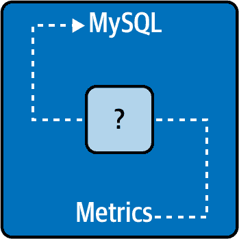
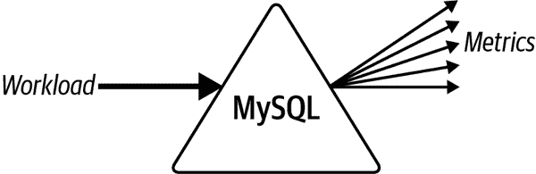
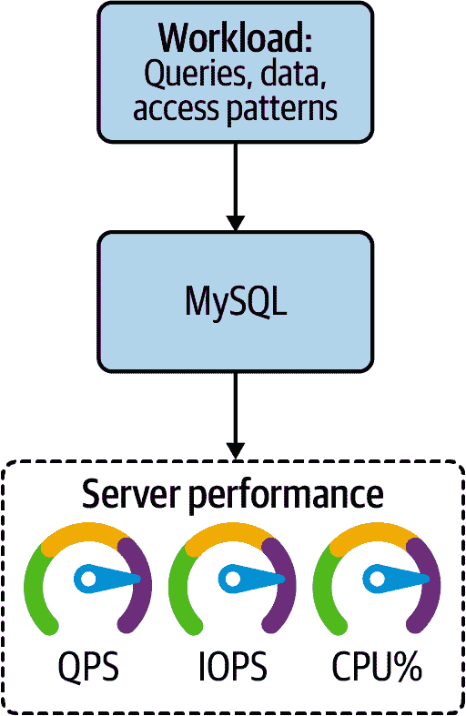
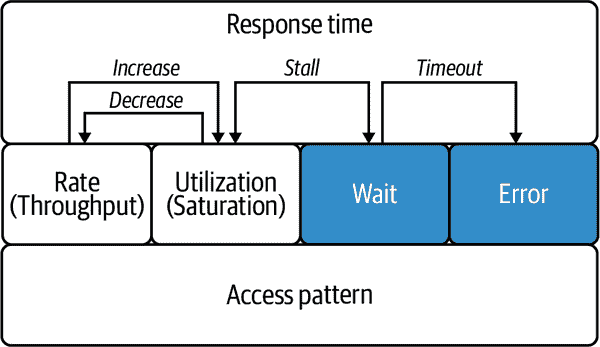
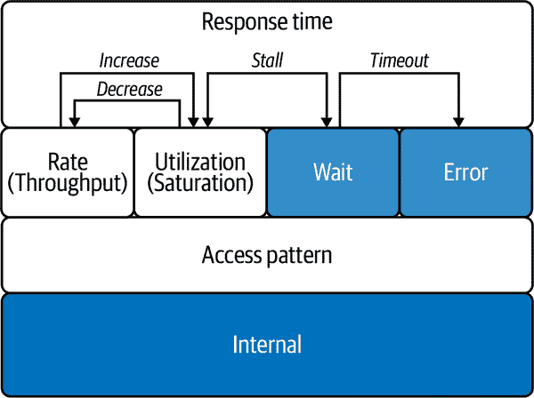
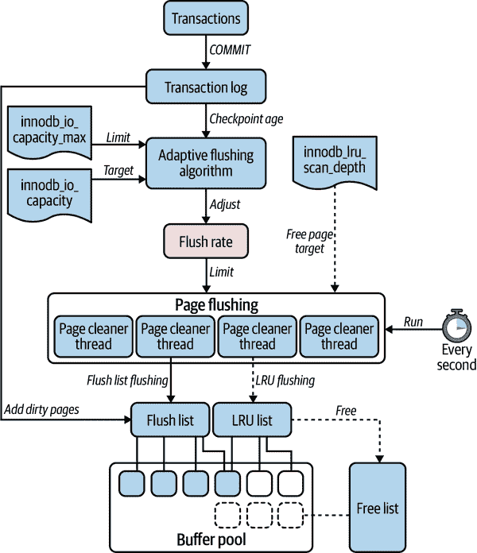
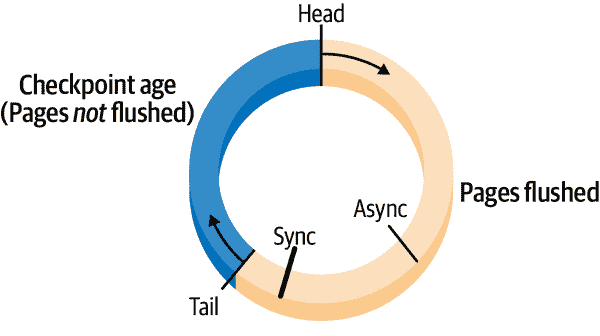
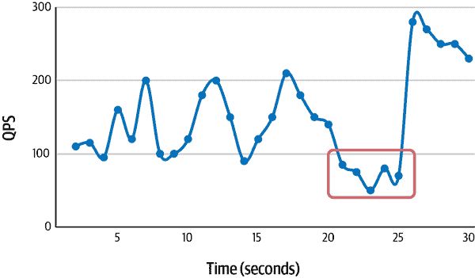
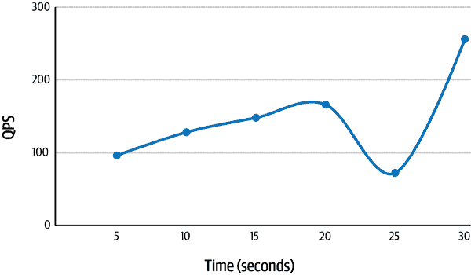
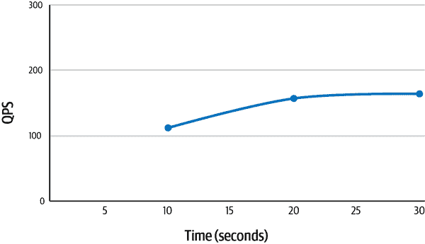

# 第六章：服务器指标

MySQL 指标与 MySQL 性能密切相关——这是显而易见的。毕竟，任何系统中指标的目的都是测量和报告系统的运行情况。不明显的是它们如何相关。如果你当前看到 MySQL 指标如图 6-1 所示：MySQL 是一个黑匣子，其中的指标以某种方式指示 MySQL 的一些情况，那也不是没有道理。



###### 第六章图示 1：MySQL 作为黑匣子：指标无法揭示

这种观点并不无理（或者不常见），因为 MySQL 指标经常被讨论但从未被教授。即使在我的 MySQL 职业生涯中，我也从未阅读过或听说过关于 MySQL 指标的阐述——我曾与创建这些指标的人一起工作。对 MySQL 指标缺乏教学的原因是一种错误的假设，即指标不需要理解或解释，因为它们的含义是不言自明的。这种假设在考虑单个指标时似乎是正确的，比如`Threads_running`；它是运行线程的数量——还有什么需要知道的？但孤立是错误的：MySQL 的性能通过一系列 MySQL 指标揭示出来。

把 MySQL 想象成一个棱镜。应用程序象征性地将工作负载投射到 MySQL 中。这个工作负载在物理上与 MySQL 及其运行的硬件相互作用。指标是通过这种象征性的工作负载通过 MySQL 折射出的光谱，如图 6-2 所示。



###### 第六章图示 2：MySQL 作为棱镜：指标揭示工作负载性能

在物理科学中，这种技术称为*光谱学*：通过其与光的相互作用来理解物质。对于 MySQL 而言，这不仅仅是一个巧妙的类比，而是 MySQL 指标与 MySQL 服务器性能之间的实际关系，并有两个证明：

+   当你通过真实的棱镜照射光线时，产生的颜色光谱揭示了光的属性，而不是棱镜本身。同样地，当你在 MySQL 上运行工作负载时，产生的指标揭示了工作负载的属性，而不是 MySQL 的。

+   鉴于前几章——特别是“MySQL 什么也不做”——性能直接归因于工作负载：查询、数据和访问模式。没有工作负载，所有的指标值都是零（一般而言）。

通过这种方式看，MySQL 指标可以被以一种新的方式教授，这正是本章的重点。

这个类比还有另一个教育上的用途：将 MySQL 指标分解成*光谱*（光谱的复数）。这非常有用，因为 MySQL 指标非常广泛且杂乱（分散在 MySQL 中的几百个指标），但有效的教学需要焦点和组织。因此，“光谱”部分，将超过 70 个指标分为 11 个光谱，占据了本章的大部分内容。

在我们为 MySQL 开绿灯之前的最后一条注意事项：理解和分析 MySQL 服务器性能仅需关注一小部分指标。其余指标的相关性和重要性差异很大：

+   一些只是噪音

+   一些是历史性的

+   一些默认情况下是禁用的

+   一些非常技术特定

+   有些仅在特定情况下有用

+   一些只是信息性的，而不是合适的度量标准

+   有些被微不足道的凡人所难解

本章分析了 MySQL 指标的光谱，这些指标对理解工作负载如何影响 MySQL 服务器性能至关重要。本章包括六个主要部分。第一部分区分了查询性能和服务器性能。之前的章节侧重于前者，而本章侧重于后者。第二部分比较枯燥——你会明白为什么。第三部分列出了快速衡量 MySQL 性能的关键绩效指标（KPI）。第四部分探讨了指标的领域：一个更深入理解指标如何描述和与 MySQL 服务器性能相关联的模型。第五部分介绍了 MySQL 指标的光谱：超过 70 个 MySQL 指标组织成 11 个光谱——一次史诗般的旅程，带领你深入了解 MySQL 的内部工作原理，之后你将以新的视角看待 MySQL。第六部分讨论了与监控和警报相关的重要主题。

# 查询性能与服务器性能对比

MySQL 性能有两个方面：查询性能和服务器性能。之前的章节涉及*查询性能*：通过优化工作负载来提高响应时间。本章涉及*服务器性能*：分析 MySQL 作为执行工作负载功能的性能。

###### 注意

在本章中，*MySQL 性能*意味着*服务器性能*。

简单来说，工作负载是输入，服务器性能是输出，如图 6-3 所示。

如果你将优化的工作负载输入 MySQL，你将获得高性能的 MySQL 输出。服务器性能几乎总是与工作负载有关，而不是 MySQL 本身。为什么？因为 MySQL 在执行各种工作负载时非常出色。MySQL 是一个经过充分优化的成熟数据存储系统——世界级数据库专家调优了几十年。这就是为什么本书的前五章赞扬查询性能，而仅有一章（本章）分析服务器性能的原因。



###### 图 6-3\. 查询和服务器性能

有三个原因需要分析服务器性能：

并发和争用

并发导致争用，降低查询性能。单独执行的查询与其他查询同时执行时表现不同。回顾方程式 4-1 中的普适可扩展性定律：争用(`α`)位于方程式的分母，这意味着随着负载增加，它会降低吞吐量。除非你生活在不同于我们其他人的宇宙中，否则并发和争用是不可避免的。

分析服务器性能最有用且最常见的目的是看看 MySQL 在所有查询（并发）竞争共享和有限系统资源（争用）时如何处理工作负载。某些工作负载几乎没有争用，而其他工作负载则尽管 MySQL 尽力也会导致查询和服务器性能下降。访问模式特征“并发性”在争用中是一个重要因素，但所有访问模式特征也同样重要。分析服务器性能揭示了工作负载中的查询如何相互影响。作为负责这些查询的工程师，我们需要确保它们能良好协作。

调优

服务器性能直接*但不完全*归因于工作负载。服务器性能还受三个因素影响：MySQL、操作系统和硬件。在查询性能方面，假设 MySQL、操作系统和硬件都已正确配置并适合工作负载。尽管存在问题（如故障硬件）和错误，但相较于工作负载，这三个因素对性能的影响要小得多，因为我们生活在一个丰盛的时代：MySQL 非常成熟且高度优化，操作系统先进且复杂，硬件快速且价格合理。

在“MySQL 调优”中讨论的事项仍然适用：调优 MySQL 就像从萝卜中榨血一样困难。你很可能永远不需要调优 MySQL。但如果你确实需要，它需要用已知且稳定的工作负载分析服务器性能；否则，你无法确定任何性能增益是否是调优的结果。这是基础科学：控制变量、可变性、可重复性和可反驳性。

性能回归

本书中我一直在赞扬 MySQL，但如果我不至少明确一次地说：有时候，MySQL 是错的，那我就有失职了。但 MySQL 并非凭空成为全球最流行的开源关系型数据库。它通常是正确的，在确保查询性能、MySQL 调优和故障硬件不是问题之后，怀疑性能回归（或错误）是专家的最后手段。

MySQL 专家 Vadim Tkachenko 的博客文章[“MySQL 和 MariaDB 中的检查点”](https://oreil.ly/MuRIt)和[“InnoDB MySQL 8 中的更多检查点”](https://oreil.ly/NDQkP)提供了分析服务器性能以揭示性能回归的完美示例。Vadim 进行这类工作是很正常的；我们其他人则在处理更简单的问题，比如索引和午餐前是否喝第三杯咖啡。

并发和争用是本章的隐含重点，因为它们是负责执行查询的应用程序维护工程师的责任。调整和性能退化是 MySQL DBA 和专家的责任。学习分析服务器性能对前者（并发和争用）是优秀的训练，因为两者的区别主要是关注的焦点。我希望前者引起对后者的兴趣，因为 MySQL 行业需要更多的 DBA 和专家。

# 正常和稳定：最好的数据库是一个无聊的数据库

大多数情况下，*普通*和*稳定*对于工程师来说一旦熟悉应用程序及其在 MySQL 上的工作负载运行方式就很直观了。人类擅长模式识别，因此很容易看出任何指标图表是否异常。因此，我不会详细解释通常为人所理解的术语，但我需要澄清两点以确保我们理解一致，以及解决工程师偶尔询问“什么是正常？”关于 MySQL 性能时的情况：

正常

每个应用程序、工作负载、MySQL 配置和环境都是不同的。因此，正常是 MySQL 在你的应用程序上典型工作日正常运行时表现出来的性能。那个正常——你的正常——是确定性能某个方面是否高于或低于、更快或更慢、更好或更差的基准。就是这么简单。

当我说一个假定的规范如“`Threads_running`少于 50 是正常的”时，这只是语言的缩写，简而言之是“根据我的经验，`Threads_running`的稳定值应小于 50，以及当前硬件通常具有少于 48 个 CPU 核心，并且基准测试显示 MySQL 性能目前无法有效扩展超过 64 个运行线程。”但如果 60 个线程运行对于你的应用程序是正常和稳定的，那太好了：你已经取得了非凡的性能。

稳定

在追求更高性能时不要失去稳定性能的视线。“性能在极限处不稳定”说明并解释了为什么从 MySQL 中挤取最大性能不是目标：在极限处，性能会不稳定，那时你会面临比性能更大的问题。稳定性不限制性能；它确保性能——在任何水平上——都是可持续的，因为这才是我们真正想要的：MySQL 始终快速，而不仅仅是有时候。

有时，MySQL 的性能是迷人的——高潮、低谷、尖叫的粉丝和挤满的体育场——但真正的艺术是将数据库优化到完美的无聊：所有查询快速响应，所有指标稳定和正常，所有用户都满意。

# 关键性能指标

四个指标快速评估 MySQL 性能：

响应时间

响应时间不足为奇：正如在“北极星”中指出的那样，它是任何人真正关心的唯一指标。即使响应时间很好，你也必须考虑其他关键绩效指标。例如，如果每个查询都失败并显示错误，响应时间可能非常好（接近零），但这并不正常。目标是正常和稳定的响应时间，较低更好。

错误

错误是错误率。哪些错误？至少是查询错误，但理想情况下应该是所有错误：查询、连接、客户端和服务器。不要期望零错误率，因为例如，如果客户端中止连接，你、应用程序或 MySQL 都无能为力。目标是正常和稳定的错误率，较低（接近零）更好。

QPS

每秒查询也不足为奇：执行查询是 MySQL 的主要目的和工作。QPS 指示性能，但并不等同于性能。异常高的 QPS 例如可能会信号问题。目标是正常和稳定的 QPS，而值则是任意的。

运行线程

运行线程评估 MySQL 为实现 QPS 而努力的程度。一个线程执行一个查询，因此你必须考虑这两个指标，因为它们密切相关。目标是正常和稳定的运行线程，较低更好。

我在“光谱”中详述了这些指标。在这里，重点是这四个指标是 MySQL 的关键绩效指标：当这四个值都正常时，MySQL 性能基本上也是正常的。始终监控响应时间、错误、QPS 和运行线程。是否在它们上发出警报将在“用户体验和目标限制上发出警报”中讨论。

将复杂系统的性能简化为少数几个指标并不是 MySQL 或计算机的特有现象。例如，你有生命体征（希望如此）：身高、体重、年龄、血压和心率。五个生物指标简洁而准确地衡量你的健康。同样，四个 MySQL 指标简洁而准确地衡量服务器性能。这很巧妙，但真正有见地的是所有指标都位于的指标领域中。

# 指标领域

每个 MySQL 指标都属于图 6-4 中显示的六个类之一。总体上，我称之为*指标领域*。



###### 图 6-4\. 指标领域

分析孤立的指标不能充分理解 MySQL 的性能，因为性能不是孤立的属性。性能是许多因素的结果，这些因素有许多相关的指标。指标领域是一个模型，用于理解指标如何相关。这些关系将谚语点（指标）连接起来，完成 MySQL 性能的复杂图景。

## 响应时间

响应时间指标表示 MySQL 响应所需的时间。它们处于领域的顶层，因为它们包含（或隐藏）来自较低层的详细信息。

查询响应时间当然是最重要的，并且是唯一经常监控的。MySQL 在阶段中执行语句，可以对阶段进行计时。这些也是响应时间指标，但它们是围绕查询执行而不是在查询内部。实际的查询执行只是许多阶段中的一个阶段。如果你回想一下例子 1-3 在第一章中，执行实际的`UPDATE`语句只是 15 个阶段中的 1 个。因此，阶段响应时间主要由 MySQL 专家用于调查深层服务器性能问题。

响应时间指标很重要，但也完全不透明：MySQL 在这段时间内究竟做了什么？为了回答这个问题，我们必须深入探讨该领域。

## 速率

速率指标显示了 MySQL 完成离散任务的*速度*。每秒查询数（QPS）是普遍而广为人知的数据库速率指标。大多数 MySQL 指标都是速率，因为——不奇怪——MySQL 执行许多离散任务。

当一个速率增加时，它可能会增加相关的利用率。有些速率是无害的，并不会增加利用率，但重要且常被监控的速率确实会增加利用率。

速率与利用率的关系假定没有其他变化。这意味着，只要你改变了某个速率或其影响的利用率，你就可以增加速率而不增加利用率。通常情况下，改变速率比改变利用率要容易，因为速率是关系中的原因。例如，当整体 QPS 增加时，CPU 利用率可能会增加，因为更多查询需要更多的 CPU 时间。（增加 QPS 可能会增加其他利用率；CPU 只是一个例子。）为了避免或减少 CPU 利用率的增加，你应优化查询，使其执行时需要的 CPU 时间更少。或者，你可以通过扩展硬件来增加 CPU 核心数，但是"更好，更快的硬件！"和"更好，更快的硬件？"解决了这种方法的缺点。

速率与利用率的关系并不是一个新颖的见解——你可能已经知道了，但需要强调的是，这是统一领域关系序列的开端。不要为利用率感到抱歉：它是一种推动力。

## 利用率

利用率指标显示了 MySQL 使用有限资源的*程度*。利用率指标在计算机中无处不在：CPU 使用率，内存使用率，磁盘使用率等等。由于计算机是有限的机器，几乎所有东西都可以表达为利用率，因为没有什么是无限的——即使是云。

*有界速率*可以表示为利用率。如果存在最大速率，则速率是有界的。例如，磁盘 I/O 通常表示为速率（IOPS），但每个存储设备都有一个最大速率。因此，磁盘 I/O 利用率是当前速率除以最大速率。相比之下，*无界速率*无法表示为利用率，因为没有最大速率：例如，QPS，发送和接收的字节数等。

当利用率增加时，它可能会减少相关速率。我敢打赌你之前见过或经历过这样的情况：一个恶意查询导致 100%磁盘 I/O 利用率，从而导致 QPS 急剧下降，引发停机。或者，MySQL 使用了 100%的内存并被操作系统内核终止，这会导致最终速率降至零。这种关系是 USL 的表达（回想方程式 4-1），因为利用率增加争用（`α`）和一致性（`β`），这些因素都是方程式的除数。

在接近或达到 100%利用率时会发生什么？MySQL 等待。在图 6-4 中，箭头指示*利用率*和*等待*之间的关系——利用率-等待关系。箭头标记为*停滞*，因为查询执行会等待，然后恢复——也许会发生多次。我强调*或接近*，因为正如在“性能在极限时不稳定”中讨论的那样，停滞可以发生在 100%利用率之前。

停滞是反稳定的，但由于两个原因是不可避免的：MySQL 负载通常大于硬件容量；延迟在所有系统中都是固有的，特别是在硬件中。第一个原因可以通过减少负载（优化工作负载）或增加硬件容量来缓解。第二个原因难以解决，但并非不可能。例如，如果仍在使用旋转磁盘，升级到 NVMe 存储将显著减少存储延迟。

## 等待

等待指标表示查询执行过程中的空闲时间。当由于争用和一致性而导致查询执行停滞时，就会发生等待。 （等待也可能由于 MySQL 的错误或性能退化而发生，但这些情况极为罕见，不值得担忧。）

等待指标根据速率或响应时间（取决于指标）进行计算，但它们值得一个单独的类别，因为它们揭示了 MySQL 何时*未工作*（空闲），这与性能相反。*未工作*是为什么图 6-4 中的等待类别更暗的原因：MySQL 已经暗淡。

等待是不可避免的。消除等待不是目标；目标是减少和稳定等待时间。当等待时间稳定且减少到可接受的水平时，它们实际上会消失，在查询执行的响应时间中融入作为一个固有部分。

当 MySQL 等待时间过长时，它会超时——等待-错误的关系。最重要的高级 MySQL 等待具有可配置的超时时间：

+   [`MAX_EXECUTION_TIME`](https://oreil.ly/H0fwi)（SQL 语句优化提示）

+   [`max_execution_time`](https://oreil.ly/2rdKw)

+   [`lock_wait_timeout`](https://oreil.ly/WD6p7)

+   [`innodb_lock_wait_timeout`](https://oreil.ly/4uT4F)

+   [`connect_timeout`](https://oreil.ly/R7HwC)

+   [`wait_timeout`](https://oreil.ly/C7M9a)

不要依赖这些方法，因为比如，试着猜一下`lock_wait_timeout`的默认值。`lock_wait_timeout`的默认值是 31,536,000 秒—365 天。设定默认值并不容易，因此我们必须给 MySQL 一些余地，但哇—365 天。因此，应用程序应始终使用代码级的超时机制。长时间运行的事务和查询是一个常见问题，因为 MySQL 虽然快，但可能太宽容了。

## 错误

错误指标显示错误。（在本书中，我允许自己做一个同义反复的声明；这就是它。）等待超时是一种错误类型，还有许多其他错误（详见[“MySQL 错误消息参考”](https://oreil.ly/Jtpqd)）。我不需要列举 MySQL 的错误，因为就服务器性能和 MySQL 指标而言，要点是简单明了的：异常错误率是不好的。像等待一样，错误也被计算为速率，但它们值得一个单独的类别，因为它们表明 MySQL 或客户端（应用程序）失败了，这就是为什么图 6-4 中的错误类别更加黑暗的原因。

再次强调关于来自“关键性能指标”的错误的一点：不要期望零错误率，因为比如，如果客户端中止连接，你、应用程序或 MySQL 都无能为力。

## 访问模式

访问模式指标显示应用程序如何使用 MySQL。这些指标与“数据访问模式”相关。例如，MySQL 为每种类型的 SQL 语句（`Com_select`、`Com_insert`等）都有指标，与“读/写”有关。

如图 6-4 所示，访问模式指标构成更高层次的指标。`Com_select`访问模式指标统计执行的`SELECT`语句的数量。这可以表示为速率（`SELECT` QPS）或利用率（`% SELECT`）；无论哪种方式，它都揭示了关于服务器性能更深层次的信息，有助于解释更高级别的指标。例如，如果响应时间糟糕，而访问模式指标`Select_full_join`很高，那就是一个罪魁祸首（参见“Select full join”）。

## 内部

图 6-5 显示的有第七类指标：内部指标。



###### 图 6-5\. 带有内部指标的度量字段

我在“指标领域”的开头没有提到这一类，因为作为 MySQL 的工程师和用户，我们不应该知道或关心它。但这是最有趣的—如果不是神秘的—领域的一部分，我希望你完全了解，以防您需要或想要深入了解 MySQL 的深度。在这里，事情就有点深奥了。

当然，*深奥* 是主观的。我认为是内部度量的指标可能是另一位工程师最喜欢和有用的速率度量。但像 `buffer_page_read_index_ibuf_non_leaf` 这样的指标充分说明了内部度量类的重要性。该指标表示变更缓冲区中读取的非叶子索引页数。并不是你每天都会接触到的内容。

# 光谱

为另一次旅程做好准备：进入 MySQL 指标的半影区域。本节探讨了分成 11 个光谱的 70 多个 MySQL 指标，其中一些有子光谱。我将 MySQL 指标分为光谱有两个原因：

+   光谱提供了旅程的路标。没有它们，我们面对的将是一个庞大而无序的宇宙，涌动着来自不同来源的近 *一千* 种指标，这些指标因 MySQL 版本、发行版和配置的不同而异。

+   光谱揭示了 MySQL 性能方面重要的领域。

即使有光谱照亮黑暗中的路径，我们也需要一个度量命名约定来清晰而准确地讨论 MySQL 指标和系统变量，这些组成了每个光谱。原因很简单：MySQL 没有度量命名约定，行业标准也不存在。表 6-1 是我在本书中使用的 MySQL 度量命名约定。

表 6-1\. MySQL 度量命名约定

| 示例 | 参考对象 |
| --- | --- |
| `Threads_running` | 全局状态变量 |
| `var.max_connections` | 全局系统变量 |
| `innodb.log_lsn_checkpoint_age` | InnoDB 度量 |
| *`replication lag`* | 派生度量 |

大多数指标都是全局状态变量，通过执行 [`SHOW GLOBAL STATUS`](https://oreil.ly/NacuT) 你可能已经看到或使用过：`Aborted_connects`, `Queries`, `Threads_running` 等等。在 MySQL 和本书中，全局状态变量名称以单个大写字母开头，后跟小写字母，即使第一个单词是缩写：`Ssl_client_connects`，*不是* `SSL_client_connects`。（这是 MySQL 度量中一致的一个方面。）相比之下，全局系统变量是小写的；为了使它们更加独特，我在它们前面加上 `var.`，这在考虑到下一个约定时很重要。InnoDB 的度量也是小写的，例如 `lock_timeouts`。由于这可能看起来像全局系统变量，我在 InnoDB 度量前面加上 `innodb.`，例如 `innodb.lock_timeouts`。派生度量在监控中普遍存在，但不是 MySQL 本身的特性。例如，*`Replication lag`* 是几乎每个监视器都会输出的度量，但具体的度量名称取决于监视器，这就是为什么我使用一个描述性名称而不是特定的技术名称来描述它，而不带有下划线字符。

###### 注意

本节中的 InnoDB 指标需要启用特定的计数器或模块。例如，使用`inno​db_​mon​itor_​enable=​module_​log,​mod⁠ule_​buffer,​module_​trx`启动 MySQL。在 MySQL 手册的[`var.innodb_monitor_enable`](https://oreil.ly/nFKFT)和[“InnoDB INFORMATION_SCHEMA Metrics Table”](https://oreil.ly/e0wpA)中查看更多信息。

倒数第二点心理准备：*全局*指的是整个 MySQL 服务器：所有客户端、所有用户、所有查询等等——合在一起。相比之下，还有*会话*和*摘要*指标。会话指标是限定于单个客户端连接的全局指标。摘要指标通常是全局指标的一个子集，涵盖各种方面：账户、主机、线程、事务等等。本章仅关注全局指标，因为它们是所有指标的基础。（全局指标也是最初的：在古老的时代，MySQL 只有全局指标；后来它增加了会话指标；然后增加了摘要指标。）

在我们开始旅程之前，最后一点心理准备：大多数 MySQL 指标都是简单的计数器，只有少数是计量器。我明确指出计量器；否则，默认是计数器。让我们开始吧！

## 查询响应时间

全局查询响应时间是四个“关键性能指标”之一。令人惊讶的是，在 MySQL 8.0 之前，MySQL 并没有这个指标。从 MySQL 8.0.1 开始，你可以通过在[性能模式](https://oreil.ly/dj06D)中执行示例 6-1 中的查询来获取 95th 百分位（P95）全局查询响应时间（以毫秒计）。

##### 示例 6-1\. 全局 95th 百分位查询响应时间

```
SELECT
  ROUND(bucket_quantile * 100, 1) AS p,
  ROUND(BUCKET_TIMER_HIGH / 1000000000, 3) AS ms
FROM
  performance_schema.events_statements_histogram_global
WHERE
  bucket_quantile >= 0.95
ORDER BY bucket_quantile LIMIT 1;
```

那个查询返回的百分位非常接近于但不完全等于 P95：例如，是 95.2%而不是 95.0%。这种差异微乎其微，不会影响监控。

你可以将查询中的`0.95`替换为返回不同百分位数：`0.99`表示 P99，或`0.999`表示 P999。基于“平均值、百分位数和最大值”中所述的原因，我更推荐使用 P999。

本节其余部分适用于 MySQL 5.7 及更早版本，如果你使用的是 MySQL 8.0 或更新版本，请跳过此部分。

MySQL 5.7 及更早版本

MySQL 5.7 及更早版本不公开全局查询响应时间指标。只有查询指标包括响应时间（见“查询时间”），但那是每个查询的响应时间。要计算全局响应时间，你需要从每个查询中聚合它。虽然这是可能的，但有两个更好的选择：升级到 MySQL 8.0；或者切换到 Percona Server 或 MariaDB，它们有一个插件用于捕获全局响应时间。

Percona Server 5.7

早在 2010 年，[Percona Server](https://oreil.ly/Gyq8J)引入了一个用于捕获全局响应时间的插件，名为[响应时间分布](https://oreil.ly/PE5kh)。安装插件很容易，但配置和使用需要一些工作，因为它是响应时间范围的直方图，这意味着你需要设置`var.query_response_time_range_base`——一个插件创建的全局系统变量，来配置直方图桶范围，然后从桶计数计算百分位数。MySQL 8.0 全局响应时间也是一个直方图，但桶范围和百分位数是预设和预计算的，这就是为什么示例 6-1 中的查询可以直接使用。设置起来并不难；听起来复杂而已。拥有全局响应时间的好处绝对值得努力。

MariaDB 10.0

[MariaDB](https://oreil.ly/oeGJO)使用与 Percona 相同的插件，但名称略有不同：[查询响应时间插件](https://oreil.ly/kb4gA)。虽然在 MariaDB 10.0 中引入，但直到 MariaDB 10.1 才标记为稳定版。

在 MySQL 8.0 之前，获取全局查询响应时间并不是一件简单的事情，但如果你在运行 Percona Server 或 MariaDB，这个努力是值得的。如果你在云中运行 MySQL，请检查云提供商的指标，因为一些提供了响应时间指标（云提供商可能称为*延迟*）。如果没有其他办法，经常审查查询配置文件以监控响应时间。

## 错误

错误是四个“关键绩效指标”之一。从 MySQL 8.0.0 开始，通过在[性能模式](https://oreil.ly/glJUC)中执行示例 6-2 中的查询，轻松获取*所有*错误的计数。

##### 示例 6-2\. 全局错误计数

```
SELECT
  SUM(SUM_ERROR_RAISED) AS global_errors
FROM
  performance_schema.events_errors_summary_global_by_error
WHERE
  ERROR_NUMBER NOT IN (1287);
```

###### 注意

错误编号 1287，在示例 6-2 的`WHERE`子句中被排除，用于弃用警告：当查询使用被弃用的功能时，MySQL 会发出警告。包含此错误号可能会使全局错误计数过于吵闹，这就是我排除它的原因。

由于 MySQL 有很多错误和警告，无法预测全局错误率会是多少。不要期望或试图达到零错误率。这基本上是不可能的，因为客户端可能会引发错误，你、应用程序或 MySQL 都无法阻止。目标是为应用程序建立正常的错误率。如果示例 6-2 中的查询太吵闹——这意味着它产生了高错误率，但你确信应用程序正常运行——那就通过排除其他错误号码来微调查询。MySQL 错误代码在[“MySQL 错误消息参考”](https://oreil.ly/wKfnV)中有文档。

在 MySQL 8.0 之前，你无法从 MySQL 中获取全局错误计数，但可以通过执行示例 6-3 中的查询，获取*查询*错误的计数，来自[性能模式](https://oreil.ly/QiHj8)。

##### 示例 6-3\. 查询错误计数

```
SELECT
  SUM(sum_errors) AS query_errors
FROM
  performance_schema.events_statements_summary_global_by_event_name
WHERE
  event_name LIKE 'statement/sql/%';
```

自 MySQL 5.6 起在所有发行版中都有效，没有理由不监控所有查询错误。当然，应用程序也应报告查询错误；但如果应用程序在错误发生时也重试，它可能会隐藏一定数量的错误。相比之下，这将暴露所有查询错误，可能会揭示应用程序重试所掩盖的问题。

最后的错误指标是客户端连接错误：

+   `Aborted_clients`

+   `Aborted_connects`

+   `Connection_errors_%`

前两个指标通常被监控，以确保连接或已连接到 MySQL 时没有问题。这种措辞非常精确：如果应用程序无法与 MySQL 建立网络连接，则 MySQL 不会看到客户端，也不会报告客户端连接错误，因为从 MySQL 的角度来看，此时还没有客户端连接。低级网络连接问题应由应用程序报告。但是，如果应用程序无法连接，则可能会看到其他三个关键绩效指标（QPS、正在运行的线程和响应时间）的下降，因为应用程序没有执行查询。

###### 注意

`Connection_errors_%`中的`%`字符是 MySQL 通配符；存在几个以`Connection_errors_`为前缀的指标。要列出它们，请执行`SHOW GLOBAL STATUS LIKE *Connection_errors_%*;`。

在继续到下一个范围之前，让我们解决一个同样不是问题的问题——至少对 MySQL 来说不是问题。如果应用程序开始输出错误，但 MySQL 没有输出，并且其他三个关键绩效指标正常，那么问题可能出现在应用程序或网络上。MySQL 有很多怪癖，但虚报不是其中之一。如果 MySQL 的关键绩效指标一切正常，那么可以相信 MySQL 正在正常工作。

## Queries

与查询相关的指标显示了 MySQL 的工作速度和工作类型——在非常高的层面上。这些指标揭示了两种访问模式的特征：吞吐量和读写（参见“吞吐量”和“读/写”）。

### QPS

QPS 是四个“关键绩效指标”之一。底层度量标准的名称非常恰当：

+   `Queries`

那个指标是一个计数器，但 QPS 是一个速率，因此技术上 QPS 等于两次`Queries`测量之间的差异除以测量之间的秒数：QPS = （T1 时的 Queries - T0 时的 Queries）/ （T1 - T0），其中 T0 是第一次测量的时间，T1 是第二次测量的时间。度量图系统（如[Grafana](https://grafana.com)）默认将计数器转换为速率。因此，您不需要将`Queries`或任何其他计数器转换为速率。只需注意，大多数 MySQL 指标都是计数器，但它们会被转换为速率并表示出来。

###### 注意

度量图系统默认将计数器转换为速率。

QPS 受到关注是因为它表示 MySQL 的总体吞吐量——MySQL 执行查询的速度——但不要过度关注它。正如在“少量 QPS 更好”中提到的，QPS 对查询或性能总体质量并没有任何定性的影响。如果 QPS 非常高但响应时间也非常高，则 QPS 表明存在问题，而不是良好的性能。其他指标比 QPS 更多地揭示了 MySQL 性能。

当一切正常运行时，QPS 随应用使用情况波动。当出现问题时，QPS 的波动与其他指标相关。为了分析性能或诊断问题，我会看一眼 QPS，看看它在图表中的值是否异常。然后，我会将这段时间（图表 X 轴上的时间）与光谱中的其他更具体的指标相关联。作为关键绩效指标，QPS 表明存在问题，但其他指标则能够更精确定位问题。

所有 QPS 中的异常变化都值得怀疑并值得调查。大多数工程师知道 QPS 下降是不好的，但 QPS 异常增加同样糟糕甚至更糟。同样不好但更少见的是 QPS 的平线化——几乎恒定的 QPS 值——因为轻微波动是正常的。当 QPS 异常变化时，通常的第一个问题是：是什么原因？我稍后在本章中解决这个问题（参见“因果关系”）。

MySQL 还公开了另一个密切相关的度量标准：`Questions`。 （术语*question*仅用于此度量标准；在 MySQL 内部没有其他用途。） `Questions`仅计算客户端发送的查询，而不计算由存储程序执行的查询。例如，触发器执行的查询不会计入`Questions`，因为客户端没有发送它们；但它们会计入`Queries`。由于`Questions`是`Queries`的子集，所以二者之间的差异仅仅是信息上的区别，监控`Questions`是可选的。对于 QPS，请始终使用`Queries`。

### TPS

如果应用程序依赖于显式的多语句事务，则每秒事务数（TPS）与 QPS 同样重要。对于一些应用程序，数据库事务代表应用程序中的一个工作单元，因此 TPS 比 QPS 更能反映出应用程序工作单元的速率，因为应用程序的工作单元是“全有或全无”，这就是为什么它在显式事务中执行。

###### 注意

隐式事务是一个启用[`autocommit`](https://oreil.ly/zrjQK)的单个 SQL 语句，这是默认设置。显式事务从`BEGIN`或`START TRANSACTION`开始，并以`COMMIT`或`ROLLBACK`结束，不论`autocommit`如何。

在 MySQL 中，显式事务吞吐量由三个度量标准揭示：

+   `Com_begin`

+   `Com_commit`

+   `Com_rollback`

通常情况下，`Com_begin`和`Com_commit`的速率是相同的，因为每个事务必须开始，并且成功的事务必须提交。当出现导致事务停滞的问题（“常见问题”之一）时，`Com_begin`的速率超过了另外两个度量标准。

使用`Com_commit`来衡量 TPS，因为事务吞吐量意味着成功的事务。

事务回滚通常表示错误，因为事务要么全部成功，要么全部失败，但`ROLLBACK`语句通常用于清理：它确保在开始下一个事务之前关闭前一个（如果有）。因此，回滚率可能不为零。与大多数指标一样，正常和稳定是目标（参见“正常和稳定：最好的数据库是无聊的数据库”）。

另一个指标是`innodb.trx_active_transactions`，指示当前活动事务的数量。

`BEGIN`开始一个事务，但事务通常在查询访问表后才会*激活*。例如，`BEGIN; SELECT NOW();`开始一个事务，但没有查询访问表，因此事务不会激活。

### 读/写

有九个读/写指标，按照 SQL 语句类型命名：

+   `Com_select`

+   `Com_delete`

+   `Com_delete_multi`

+   `Com_insert`

+   `Com_insert_select`

+   `Com_replace`

+   `Com_replace_select`

+   `Com_update`

+   `Com_update_multi`

例如，`Com_select`是`SELECT`语句数量的计数器。`Com_delete_multi`和`Com_update_multi`中的`_multi`后缀指的是涉及多个表的查询。多表`DELETE`仅增加`Com_delete_multi`，而单表`DELETE`仅更新`Com_delete`。对于`UPDATE`语句也是如此，涉及`Com_update_multi`和`Com_update`。

读/写指标显示构成`Queries`的查询类型和吞吐量的重要类型。这些指标并不完全涵盖`Queries`，它们只是在性能方面最重要的指标。

作为`Queries`的单独速率和百分比监视这些指标：

+   `Com_select`表示工作负载的读取百分比：

    （Com_select / Queries）× 100。

+   其他八个指标的总和表示工作负载的写入百分比。^(2)

读取和写入百分比之和*不会*等于 100%，因为`Queries`包括其他类型的 SQL 语句：`SHOW`、`FLUSH`、`GRANT`等等。如果剩余百分比异常高（超过 20%），可能不会影响性能，但值得调查：检查其他`Com_`指标以考虑其他类型的 SQL 语句。

### 管理

管理指标通常是仅由数据库管理员调用的命令：

+   `Com_flush`

+   `Com_kill`

+   `Com_purge`

+   `Com_admin_commands`

前三个指标分别是[`FLUSH`](https://oreil.ly/O6j77)、[`KILL`](https://oreil.ly/fMbiY)和[`PURGE`](https://oreil.ly/czxYb)。这些命令可能会影响性能，但应该非常罕见。如果不是，请询问您的 DBA 或云服务提供商他们在做什么。

最后一个指标 `Com_admin_commands` 有些奇怪。它指的是其他管理员命令，这些命令没有特定的 `Com_` 状态变量。例如，MySQL 协议有一个 ping 命令，MySQL 客户端驱动程序通常用它来测试连接。适度使用是无害的，但如果使用过度可能会导致问题。不要期望 `Com_admin_commands` 会显示任何问题，但监控它仍然是最佳实践。

### SHOW

MySQL 有超过 40 个 [`SHOW`](https://oreil.ly/u7Xzs) 命令，其中大部分对应 `Com_show_` 指标。`SHOW` 命令不会改变 MySQL 或修改数据，因此在这个意义上它们是无害的。但它们是查询命令，这意味着它们会使用 MySQL 中的线程、时间和资源。`SHOW` 命令也可能会造成停顿。例如，`SHOW GLOBALS STATUS` 在繁忙服务器上可能需要一整秒或更多时间。因此，最佳实践是至少监控以下 10 个指标：

+   `Com_show_databases`

+   `Com_show_engine_status`

+   `Com_show_errors`

+   `Com_show_processlist`

+   `Com_show_slave_status`

+   `Com_show_status`

+   `Com_show_table_status`

+   `Com_show_tables`

+   `Com_show_variables`

+   `Com_show_warnings`

###### 注意

从 MySQL 8.0.22 开始，应监控 `Com_show_replica_status` 而不是 `Com_show_slave_status`。

不要期望 `SHOW` 指标会显示任何问题，但如果有问题，也不要感到意外，因为这并不是第一次。

## 线程和连接

`Threads_running` 是四个“关键性能指标”之一。它显示 MySQL 正在工作的强度，因为它直接与活动查询执行相关联（当客户端连接不执行查询时，其线程处于空闲状态），并且受 CPU 核心数量的限制。让我们在查看相关指标后再回到 `Threads_running`。

线程和连接是一个谱系，因为它们直接相关：MySQL 对每个客户端连接运行一个线程。线程和连接的四个最重要指标是：

+   `Connections`

+   `Max_used_connections`

+   `Threads_connected`

+   `Threads_running`

`Connections` 是对 MySQL 进行的连接尝试次数，包括成功和失败的。它显示应用程序连接池到 MySQL 的稳定性。通常，应用程序与 MySQL 的连接是长期存在的，*长期* 至少是几秒，如果不是几分钟或几小时。长期存在的连接避免了建立连接的开销。当应用程序和 MySQL 在同一个本地网络上时，开销可以忽略不计：1 毫秒或更少。但是，应用程序和 MySQL 之间的网络延迟会随连接数的增加而迅速累积，再乘以连接速率。(`Connections` 是一个计数器，但表达为速率：连接数/秒。) MySQL 可以轻松处理每秒数百个连接，但如果这个指标显示连接速率异常高，需要找出并修复根本原因。

作为 [`var.max_connections`](https://oreil.ly/MVZaQ) 的百分比，`Max_used_connections` 显示了连接的利用率。`var.max_connections` 的默认值是 151，对于大多数应用程序来说可能太低了，但并不是因为应用程序需要更多连接来提高性能。应用程序只需要更多连接是因为每个应用程序实例都有自己的连接池。（我假设应用程序是扩展的。）如果连接池大小是 100，且有 3 个应用程序实例，则应用程序（所有实例）可以创建 300 个连接到 MySQL。这就是为什么 151 最大连接数不够的主要原因。

一个常见的误解是应用程序需要数千个连接到 MySQL 以提高性能或支持数千个用户。这是完全不正确的。限制因素是线程，而不是连接——稍后详细介绍 `Threads_running`。单个 MySQL 实例可以轻松处理数千个连接。我曾在生产环境中见过 4000 个连接，以及更多的基准测试。但对于大多数应用程序来说，总共几百个连接已经足够了。如果您的应用程序明显需要数千个连接，那么您需要分片（参见 第五章）。

监控和避免的真正问题是 100% 的连接利用率。如果 MySQL 的可用连接耗尽，应用程序将出现故障。如果连接利用率突然上升，接近 100%，原因总是外部问题，或者 bug，或者两者兼有。（MySQL 无法连接到自身，因此原因必定是外部的。）在响应外部问题，比如网络问题时，应用程序会创建比正常情况更多的连接。或者，bug 导致应用程序不关闭连接——通常被称为 *连接泄漏*。或者，外部问题触发应用程序中的 bug——我曾见过这种情况发生。不管怎样，根本原因总是外部的：外部的东西连接到 MySQL 并使用了所有连接。

当客户端连接和断开连接时，MySQL 会增加和减少 `Threads_connected` 这个度量标准。这个度量标准的名称有点误导，因为连接的是*客户端*，而不是线程，但它反映了 MySQL 每个客户端连接运行一个线程的事实。

`Threads_running` 是一个度量仪表和相对于 CPU 核心数量的隐式利用率。虽然 `Threads_running` 可以突然增加到数百甚至数千，但性能在较低值时会急剧下降：大约是 CPU 核心数量的两倍。原因很简单：一个 CPU 核心运行一个线程。当运行的线程数超过 CPU 核心数时，这意味着一些线程处于停滞状态，等待 CPU 时间。这类似于交通高峰期：成千上万辆汽车在高速公路上堵塞，发动机运行但几乎不动。（或者对于电动汽车来说：电池运行但几乎不动。）因此，`Threads_running` 通常会非常低：少于 30。使用良好的硬件和优化的工作负载，可能会出现持续时间为秒或更短的突发情况，但持续的（正常和稳定的）`Threads_running` 应尽可能低。就像在 “QPS 越少越好” 中一样，`Threads_running` 越少越好。

高吞吐量（QPS），同时线程运行非常低，这是效率高的一个强烈指标，因为只有一种方式可以同时实现两者：非常快的查询响应时间。表 6-2 列出了来自五个真实（且不同）应用程序的线程运行和 QPS。

表 6-2\. 运行的线程数和 QPS

| 线程运行 | QPS |
| --- | --- |
| 4 | 8,000 |
| 8 | 6,000 |
| 8 | 30,000 |
| 12 | 23,000 |
| 15 | 33,000 |

第二行和第三行突出显示应用程序工作负载对性能的深远影响：在一种工作负载下，6,000 QPS 需要 8 个运行的线程；但另一种工作负载使用相同数量的线程实现了 5 倍 QPS（30,000）。对于最后一行，33,000 QPS 并不是异常高，但该数据库是分片的：跨所有分片的总 QPS 超过一百万。经验性地，即使线程数很少，高吞吐量也是可能的。

## 临时对象

临时对象是 MySQL 用于各种目的的临时文件和表：排序行，大连接等等。三个度量标准计算了在磁盘上的临时表数量，内存中的临时表数量以及创建的临时文件（在磁盘上）：

+   `Created_tmp_disk_tables`

+   `Created_tmp_tables`

+   `Created_tmp_files`

这些指标很少为零，因为临时对象很常见，只要比率稳定，就无害。最有影响力的指标是 `Created_tmp_disk_tables`，它是 `Created_tmp_tables` 的倒数。当 MySQL 需要一个临时表来执行查询（例如 `GROUP BY`），它从内存中的临时表开始，并增加 `Created_tmp_tables`。这不应影响性能，因为它在内存中。但是，如果该临时表增长超过 [`var.tmp_table_size`](https://oreil.ly/4plVm)——决定内存中临时表大小的系统变量——那么 MySQL 会将临时表写入磁盘，并增加 `Created_tmp_disk_tables`。适度情况下，这可能不会影响性能，但肯定也不会帮助，因为存储显著比内存慢。对于 `Created_tmp_files`，情况也是一样：适度接受，但不利于性能。

###### 警告

在 MySQL 8.0 中，`Created_tmp_disk_tables` *不* 计算在磁盘上创建的临时表。这是由于内部临时表 `TempTable` 使用的新存储引擎：`TempTable`。相应的指标是 Performance Schema 内存仪表：`memory/temptable/physical_disk`。（一个相关的仪表是 `memory/temptable/physical_ram`，用于跟踪内存中临时表 `TempTable` 的内存分配。）如果您正在使用 MySQL 8.0，请与您的 DBA 确保此指标被正确收集和报告。

由于临时对象是查询的副作用，这些指标在一个变化与关键绩效指标（KPIs）变化相关时最具启示性。例如，`Created_tmp_disk_tables` 突然增加并伴随着响应时间的突然增加时，会大声呼喊“看看我！”^(3)

## 准备语句

准备语句是一把双刃剑：正确使用可以提高效率；但如果错误使用（或者无意中使用），会增加浪费。使用准备语句的正确和最有效的方式是准备一次，多次执行，这由两个指标统计：

+   `Com_stmt_prepare`

+   `Com_stmt_execute`

`Com_stmt_execute` 应显著大于 `Com_stmt_prepare`。如果不是，则准备语句因额外的准备和关闭语句查询而增加了浪费。最糟糕的情况是这些指标一对一或接近一对一，因为单个查询会导致两次 MySQL 的多余往返：一次是准备语句，另一次是关闭语句。当 MySQL 和应用程序在同一个本地网络上时，两个额外的往返可能不明显，但它们纯粹是 QPS 倍增的浪费。例如，以 1,000 QPS 为基础，额外的 1 毫秒就是浪费的一秒——在这一秒内本可以执行另外 1,000 次查询。

除了性能影响之外，您应该监视这些预准备语句的度量，因为应用程序可能无意中使用预准备语句。例如，Go 编程语言的 MySQL 驱动程序默认使用预准备语句以防止 SQL 注入漏洞。乍一看（或多次查看），您可能不认为 Go 代码中的示例 6-4 使用了预准备语句，但实际上确实使用了。

##### 示例 6-4\. 隐藏的预准备语句

```
id := 75
db.QueryRow("SELECT col FROM tbl WHERE id = ?", id)
```

检查应用程序使用的 MySQL 驱动程序的文档。如果未明确说明是否以及何时使用预准备语句，则手动验证：在 MySQL 的开发实例（例如您的笔记本电脑）上启用[通用查询日志](https://oreil.ly/1Vczu)，并编写一个测试程序，使用应用程序使用的相同方法和函数调用执行 SQL 语句。通用日志会指示何时使用预准备语句：

```
2022-03-01T00:06:51.164761Z	   32 Prepare	SELECT col FROM tbl WHERE id=?
2022-03-01T00:06:51.164870Z	   32 Execute	SELECT col FROM tbl WHERE id=75
2022-03-01T00:06:51.165127Z	   32 Close stmt
```

最后，开放的预准备语句数量限制为[`var.max_​pre⁠pared_​stmt_​count`](https://oreil.ly/K2MWz)，默认为 16,382。（即使对于一个应用程序而言，1,000 个预准备语句也是很多，除非该应用程序是通过程序生成语句。）此计量度指标报告当前开放的预准备语句数量：

+   `Prepared_stmt_count`

不要让`Prepared_stmt_count`达到`var.max_prepared_stmt_count`，否则应用程序将停止工作。如果发生这种情况，这是由于泄漏（未关闭）预准备语句导致的应用程序错误。

## 不良 SELECT

四个度量指标统计通常对性能不利的`SELECT`语句出现的次数：^(4)

+   `Select_scan`

+   `Select_full_join`

+   `Select_full_range_join`

+   `Select_range_check`

第一章描述了`Select_scan`和`Select_full_join`：分别为“Select scan”和“Select full join”。这两个度量的唯一区别在于这两个度量适用于全局（所有查询）。

`Select_full_range_join`是`Select_full_join`的次优选择：MySQL 使用索引而不是完整表扫描来进行范围扫描。可能范围受限且`SELECT`的响应时间可接受，但已经足够糟糕以至于需要它自己的度量。

`Select_range_check` 类似于但比 `Select_full_range_join` 更糟。可以通过一个简单的查询来最容易地解释：`SELECT * FROM t1, t2 WHERE t1.id > t2.id`。当 MySQL 连接表 `t1` 和 `t2`（按此顺序）时，会对 `t2` 进行*范围检查*：对于 `t1` 的每个值，MySQL 检查是否可以使用 `t2` 上的索引进行范围扫描或索引合并。由于查询时 MySQL 无法预先知道 `t1` 的值，因此需要重新检查每个 `t1` 的值。但是，与执行最差执行计划 `Select_full_join` 不同，MySQL 会继续尝试使用 `t2` 上的索引。在 `EXPLAIN` 输出中，`t2` 的 `Extra` 字段列出了“Range checked for each record”，并且对表增加了一次 `Select_range_check`。该指标*不*会在每个范围更改时增加；它只会在连接表时发出一次信号，表明进行了范围检查。

不良的 `SELECT` 指标应该为零或接近零（四舍五入）。`Select_scan` 或 `Select_full_range_join` 有一些是不可避免的，但另外两个——`Select_full_join` 和 `Select_range_check`——如果不是零，应立即找出并修复。

## 网络吞吐量

MySQL 协议非常高效，很少使用大量网络带宽。通常，是网络影响 MySQL 而不是 MySQL 影响网络。尽管如此，监控 MySQL 记录的网络吞吐量仍然是一件好事：

+   `Bytes_sent`

+   `Bytes_received`

由于这些指标计算网络发送和接收的字节数，因此将值转换为网络单位：Mbps 或 Gbps，与运行 MySQL 的服务器的链路速度匹配。即使在云中，千兆位链路最为普遍。

###### 注意

指标图形系统默认将计数器转换为速率，但您可能需要将这些指标乘以八（每字节 8 位），并将图形单位设置为位，以显示为 Mbps 或 Gbps。

我曾经见过 MySQL 仅仅一次饱和了网络。原因与通常不会成为问题的系统变量有关：[`var.binlog_row_image`](https://oreil.ly/tboxy)。这个系统变量与复制有关，第七章 更详细地介绍了这个问题，但简短的版本是：这个系统变量控制是否在二进制日志和复制中记录和复制 `BLOB` 和 `TEXT` 列。默认值为 `full`，即记录和复制 `BLOB` 和 `TEXT` 列。通常情况下，这不是问题，但某个应用程序同时具备以下所有属性时会造成严重问题：

+   使用 MySQL 作为队列

+   大 `BLOB` 值

+   写入密集型

+   高吞吐量

这些访问模式结合在一起，复制了大量数据，导致主要的复制延迟。解决方案是将 `var.binlog_row_image` 更改为 `noblob`，停止复制不需要复制的 `BLOB` 值。这个真实的故事引出了下一个问题：复制。

## 复制

*滞后*是复制的祸根：源 MySQL 实例上的写入与在副本 MySQL 实例上应用该写入之间的延迟。当复制（和网络）正常工作时，复制延迟是次秒级的，仅受网络延迟限制。

###### 注意

在 MySQL 8.0.22 之前，副本滞后度量和命令分别为`Sec​onds_​Behind_Master`和`SHOW SLAVE STATUS`。从 MySQL 8.0.22 开始，度量和命令变为`Sec​onds_​Behind_Source`和`SHOW REPLICA STATUS`。本书中使用当前的度量和命令。

MySQL 有一个臭名昭著的度量标准用于复制滞后：`Seconds_Behind_Source`。这个度量标准之所以臭名昭著，是因为它并不是错的，但也不是你期望的那样。它可以在零和一个高值之间跳跃，这既令人愉悦又令人困惑。因此，最佳实践是忽略此度量标准，而是使用像[`pt-heartbeat`](https://oreil.ly/VMg4c)这样的工具来测量真正的复制延迟。然后，您必须配置您的 MySQL 监控软件（或服务）以从`pt-heartbeat`测量和报告*复制滞后*。由于`pt-heartbeat`已经存在很长时间，一些 MySQL 监视器本地支持它；而且管理您的 MySQL 实例的工程师很有可能已经在使用它。

MySQL 公开了一个与复制相关的度量标准，这并非臭名昭著：`Binlog_cache_disk_use`。第七章详细说明了以下细节；目前，高层次的解释已经足够。对于每个客户端连接，内存中的二进制日志缓存在将写入写入二进制日志文件之前缓冲写操作——从中写操作复制到副本。如果二进制日志缓存过小而无法容纳事务的所有写入，则将更改写入磁盘并增加`Binlog_cache_disk_use`。适度情况下，这是可以接受的，但不应该频繁发生。如果频繁发生，可以通过增加二进制日志缓存大小[`var.binlog_cache_size`](https://oreil.ly/0TEIJ)来缓解。

从前一节的例子中，我们知道`var.binlog_row_image`也会影响二进制日志缓存：如果表中有`BLOB`或`TEXT`列，完整行图像可能需要大量空间。

## 数据大小

第三章解释了为什么数据越少性能越好。监控数据大小很重要，因为数据库通常会比预期的更大。如果数据增长是由应用程序增长导致的——应用程序变得越来越受欢迎——那么这是一个好问题，但仍然是一个问题。

它也很容易被忽视，因为 MySQL 的性能随着数据增长而轻松扩展，但并非无限。如果查询和访问模式优化良好，数据库可以从 10 GB 增长到 300 GB，即使不会遇到性能问题。但再增加 30 倍到 9 TB？不可能。即使是增加 3 倍到 900 GB 也是要求过高的——如果访问模式非常有利，这种情况可能会发生，但不要赌这种可能性。

MySQL 在一个信息模式表`information_schema.tables`中公开了表的大小（和其他表的元数据）：[`information_schema.tables`](https://oreil.ly/PqATu)。在示例 6-5 中的查询返回每个数据库的大小（以 GB 为单位）。

##### 示例 6-5\. 数据库大小（GB）

```
SELECT
  table_schema AS db,
  ROUND(SUM(data_length + index_length) / 1073741824 , 2) AS 'size_GB'
FROM
  information_schema.tables
GROUP BY table_schema;
```

在示例 6-6 中的查询返回每个表的大小（以 GB 为单位）。

##### 示例 6-6\. 表大小（GB）

```
SELECT
  table_schema AS db,
  table_name as tbl,
  ROUND((data_length + index_length) / 1073741824 , 2) AS 'size_GB'
FROM
  information_schema.tables
WHERE
      table_type = 'BASE TABLE'
  AND table_schema != 'performance_schema';
```

没有关于数据库和表大小度量的标准。根据您的需求查询和聚合`information_schema.tables`中的值。至少每小时收集数据库大小（示例 6-5）。更精确地收集表大小，最好每 15 分钟进行一次。

确保无论您在何处存储或发送 MySQL 度量数据，您都能至少保留一年的数据大小度量。短期数据增长趋势用于估计磁盘何时会耗尽空间；或者在云中，用于估计何时需要更多的存储空间。长期数据增长趋势用于估计何时需要分片（第五章），如“实践：四年合适”中所述。

## InnoDB

[InnoDB](https://oreil.ly/4b5qP)是复杂的。

然而，由于它是默认的 MySQL 存储引擎，我们必须做好接受它的准备。深入挖掘并不是必要的——甚至在这本书的限制内也不可能。尽管本节内容很长，但几乎没有深入到 InnoDB 内部的表面。然而，以下 InnoDB 度量指标揭示了负责读写数据的存储引擎的一些内部工作原理。

### 历史列表长度（度量）

历史列表长度（HLL）是一个奇怪的度量，因为每个使用 MySQL 的工程师都知道它*意味着*什么，但很少有人知道它*是*什么。当 HLL 在几分钟或几小时内显著增加时，意味着 InnoDB 保存了大量旧行版本而未清除，因为一个或多个长时间运行的事务未提交或由于未检测到的客户端连接丢失而被放弃。我在“历史列表长度”后面解释的所有这些内容都由一个计量指标揭示：

+   `innodb.trx_rseg_history_len`

`innodb.trx_rseg_history_len`的正常值应小于 1,000。如果 HLL 大于 100,000，则应监视并发出警报。与“野鸡追”（阈值）和“用户体验和客观限制的警报”相反，这是一个可靠的阈值和可操作的警报。措施是：查找并终止长时间运行或被丢弃的事务。

历史列表长度并不直接影响性能，但它是麻烦的前兆——不要忽视它。问题与事实相关，因为 InnoDB 是一个事务性存储引擎，每个对 InnoDB 表的查询都是一个事务。事务会产生开销，而 HLL 指标显示当一个长时间运行或被放弃的事务导致 InnoDB 处理过多开销时。一些开销是必要的——甚至是有益的——但过多会导致浪费，而浪费是与性能对立的。

有关事务和 HLL 的内容，这本书还有一个单独的章节：第八章。现在，让我们把焦点放在指标上，因为我们刚刚开始接触 InnoDB。

### 死锁

死锁发生在两个（或更多）事务持有另一个事务所需的行锁时。例如，事务 *A* 持有行 1 的锁并需要行 2 的锁，而事务 *B* 持有行 2 的锁并需要行 1 的锁。MySQL 自动检测并回滚一个事务以解决死锁，并增加一个指标：

+   `innodb.lock_deadlocks`

死锁不应该发生。死锁的普遍性与并发访问模式特征相关（参见“并发性”）。高并发数据访问必须经过设计（在应用程序中），以避免由于不同事务访问相同行（或附近行）而导致死锁，确保这些事务大致以相同的顺序检查行。在前面关于事务 *A* 和事务 *B* 的示例中，它们以相反的顺序访问相同的两行，当事务同时执行时可能导致死锁。要了解更多关于死锁的信息，请阅读 MySQL 手册中的[“InnoDB 中的死锁”](https://oreil.ly/UpX0r)。

### 行锁

行锁指标显示*锁争用*：查询获取行锁以写入数据的速度（或不速度）。最基本的行锁指标包括：

+   `innodb.lock_row_lock_time`

+   `innodb.lock_row_lock_current_waits`

+   `innodb.lock_row_lock_waits`

+   `innodb.lock_timeouts`

第一个指标 `innodb.lock_row_lock_time` 是一种罕见类型：用于获取行锁的总毫秒数。它属于响应时间指标类别（参见“响应时间”），但不像“查询响应时间”，它是作为累积总和而不是直方图进行收集的。因此，无法将 `innodb.lock_row_lock_time` 报告为百分位数，这本应是理想的。将其作为速率报告（参见“速率”）也是荒谬的：每秒毫秒。相反，必须将此指标报告为差异：如果 T1 时为 500 毫秒，T2 时为 700 毫秒，则报告 T2 值 - T1 值 = 200 毫秒。（在图表聚合函数中使用最大值。不要对数据点进行平均处理，因为最好看到最坏的情况。）作为响应时间指标，数值越低越好。`innodb.lock_row_lock_time` 的值不能为零（除非工作负载是只读且从不需要获取单个行锁），因为获取锁需要一定的时间。因此，目标始终是指标正常和稳定。当它不正常时，其他行锁指标也不会正常。

`innodb.lock_row_lock_current_waits` 是当前等待获取行锁的查询数量的计量指标。`innodb.lock_row_lock_waits` 是等待获取行锁的查询数量的计数器和速率。这两个变量本质上是相同的：前者是当前的计量，后者是历史计数器和速率。当行锁等待率增加时，这是一个明确的问题信号，因为 MySQL 不会无缘无故等待：一定是有什么原因导致了等待。在这种情况下，原因将是并发查询访问相同（或附近）的行。

`innodb.lock_timeouts` 在行锁等待超时时会增加。默认的行锁等待超时是 50 秒，由 [`var.innodb_lock_wait_timeout`](https://oreil.ly/4kCLg) 配置，并且适用于*每个*行锁。对于任何正常应用程序来说，等待时间太长了；我建议设置更低的值：10 秒或更短。

InnoDB 的锁定机制非常复杂和微妙。因此，除非工作负载展示了三种特定的访问模式，否则锁竞争并*不*是一个常见问题：

+   写入密集型（“读写”）

+   高吞吐量（“吞吐量”）

+   高并发性（“并发性”）

这将是一个非常特定的应用程序和工作负载。但是锁竞争对于任何应用程序和工作负载都可能成为问题（即使吞吐量和并发性较低），因此始终监视行锁指标。

### 数据吞吐量

数据吞吐量以每秒字节数来衡量，有两个指标：

+   `Innodb_data_read`

+   `Innodb_data_written`

数据吞吐量很少成为问题：SSD 速度快；PCIe 和 NVMe 使其更快。无论如何，监控数据吞吐量是一种最佳实践，因为存储吞吐量受限，特别是在云中。不要期望实现发布的存储吞吐量速率，因为这些速率是在理想条件下测量的：直接数据到（或从）磁盘。InnoDB 非常快速和高效，但它仍然是数据和磁盘之间的复杂软件层，从根本上阻止了实现发布的存储吞吐量速率。

###### 警告

要注意云端的吞吐量：存储通常不会是本地连接的，这会限制吞吐量为网络速度。1 Gbps 相当于 125 MB/s，这是类似于旋转硬盘的吞吐量。

### IOPS

InnoDB 与存储 I/O 容量有着深入且有时复杂的关系，以 IOPS 衡量。但首先，让我们先来看简单的部分：InnoDB 的读写 IOPS 分别由两个度量标准来计算：

+   `innodb.os_data_reads`

+   `innodb.os_data_writes`

这些度量标准是计数器，因此像其他计数器一样，它们会被度量图系统转换并表达为速率。确保为每个度量标准图设置单位为 IOPS。

InnoDB 的性能核心在于优化和减少存储 I/O。尽管从工程角度来看高 IOPS 令人印象深刻，但对性能来说却是一大难题，因为存储速度较慢。然而，存储是必须的，用于数据持久性，即将数据更改持久化到磁盘上，因此 InnoDB 努力实现快速*和*持久性。因此，就像在 “少量 QPS 更好” 中提到的，更少的 IOPS 更好。

但也不要低估 IOPS 的使用。如果您的公司使用自己的硬件，存储 IOPS 的最大数量由存储设备确定——请查看设备规格或询问管理硬件的工程师。在云端，存储 IOPS 是分配或预留的，因此通常更容易知道最大值，因为您购买了这些 IOPS——请检查存储设置或询问云服务提供商。例如，如果 InnoDB 从未使用超过 2,000 IOPS，那么不要购买（或预留）40,000 IOPS：InnoDB 简单地不会使用多余的 IOPS。相反，如果 InnoDB 不断使用最大数量的存储 IOPS，那么要么需要优化应用工作负载以减少存储 I/O（参见第 1–5 章），要么 InnoDB 确实需要更多的 IOPS。

InnoDB *后台任务* 的 I/O 容量主要由[`var.inno​db_​io_capacity`](https://oreil.ly/zU6iW)和[`var.innodb_io_capacity_max`](https://oreil.ly/LiilY)两个系统变量配置，默认值分别为 200 和 2,000 IOPS。（还有其他变量，但我必须略过它们以便专注于度量。要了解更多，请阅读 MySQL 手册中的[“配置 InnoDB I/O 容量”](https://oreil.ly/G9Bcw)。）后台任务包括页面刷新、变更缓冲区合并等。在本书中，我仅涵盖页面刷新，这可谓是最重要的后台任务之一。限制后台任务的存储 I/O 确保 InnoDB 不会过载服务器。它还允许 InnoDB 优化和稳定存储 I/O，而不是向存储设备发送不规律的访问。相比之下，前台任务没有任何可配置的 I/O 容量或限制：它们使用必要和可用的 IOPS。主要的前台任务是执行查询，但这并不意味着查询使用高或过多的 IOPS，因为请记住，InnoDB 的性能目的是优化和减少存储 I/O。对于读取操作，缓冲池有意优化和减少 IOPS。对于写入操作，页面刷新算法和事务日志有意优化和减少存储 I/O。接下来的几节将揭示其详细内容。

InnoDB 可以实现高 IOPS，但应用程序呢？可能不行，因为应用程序与 IOPS 之间有许多层，这些层阻碍了前者实现较高的后者数量。根据我的经验，应用程序使用数百至数千个 IOPS，而“热门”优化的应用程序在单个 MySQL 实例上推动大约 10,000 个 IOPS。最近，我在云中进行了 MySQL 的基准测试，并在 40,000 个 IOPS 处达到了一个上限。云服务提供商发布的最大值为 80,000 个 IOPS，并允许我进行配置，但他们的存储系统限制在 40,000 个 IOPS。重点是：InnoDB 可以实现高 IOPS，但其周围的一切又是另一回事。

本节仅是 InnoDB I/O 的入门，因为它构成了消耗 IOPS 的最后三个 InnoDB 光谱的基础：“缓冲池效率”，“页面刷新”和“事务日志”。

要了解更多关于 InnoDB I/O 的信息，请先阅读 MySQL 手册中的[“配置 InnoDB I/O 容量”](https://oreil.ly/w9MOg)。要真正深入了解 InnoDB I/O 的细枝末节，请阅读著名的 MySQL 专家 Yves Trudeau 和 Francisco Bordenave 撰写的启发性三部曲博客文章：[“给你的 SSD 多点爱：减少 innodb_io_capacity_max！”](https://oreil.ly/q0L61)，[“Percona Server for MySQL 中的 InnoDB 刷新实战”](https://oreil.ly/ZY2Xe)，以及[“为写入密集型工作负载调整 MySQL/InnoDB 刷新”](https://oreil.ly/P03EX)。但请先完成本章内容，因为它为这些博客文章奠定了良好的基础。

InnoDB 在内存中处理数据，而不是在磁盘上。必要时从磁盘读取数据，并将数据写入磁盘以使更改持久化，但这些是较低级别的操作，将在接下来的三个部分中详细探讨。在更高的层次上，InnoDB 在内存中处理数据，因为存储速度太慢——即使有百万 IOPS。因此，查询、行和 IOPS 之间没有直接的对应关系。写入始终消耗 IOPS（用于持久性）。读取可以在不消耗任何 IOPS 的情况下执行，但这取决于缓冲池效率。

### 缓冲池效率

InnoDB 缓冲池是表数据和其他内部数据结构的*内存*缓存。来自“InnoDB 表即索引”的信息表明，缓冲池包含索引页——更多关于页的内容将在下一节讨论。InnoDB 确实理解行，但内部更关注页。在 MySQL 性能的这个深度上，焦点从行转向页。

在高层次上，InnoDB 通过缓冲池中的页访问（读取和写入）所有数据。（低级别写入更复杂，在最后一个 InnoDB 部分中详细介绍：“事务日志”。）如果访问时数据不在缓冲池中，InnoDB 将从存储器中读取并保存到缓冲池中。

*缓冲池效率*是从内存访问的数据百分比，由两个指标计算：

+   `Innodb_buffer_pool_read_request`

+   `Innodb_buffer_pool_reads`

`Innodb_buffer_pool_read_request` 计算所有访问缓冲池中数据的请求。如果请求的数据*不在*内存中，InnoDB 将增加 `Inno​db_​buf​fer_​pool_reads` 并从磁盘加载数据。缓冲池效率等于 (`Innodb_buffer_pool_read_request` / `Innodb_buffer_pool_reads`) × 100。

###### 注意

这些指标中的 *read* 不意味着 `SELECT`。InnoDB 为所有查询（`INSERT`、`UPDATE`、`DELETE` 和 `SELECT`）从缓冲池中读取数据。例如，在 `UPDATE` 时，InnoDB 从缓冲池中读取行。如果不在缓冲池中，则从磁盘加载行到缓冲池中。

当 MySQL 启动时，缓冲池效率会非常低。这是正常现象；称为*冷缓冲池*。加载数据会使缓冲池变暖——就像往火上扔木头一样。通常需要几分钟才能完全使缓冲池变暖，这在缓冲池效率达到正常稳定值时得到体现。

缓冲池效率应该非常接近于 100% —— 理想情况下是 99.0%或更高，但不要固守于数值。从技术上讲，这个指标是一个缓存命中率，但并不是它的使用方式。缓冲池效率揭示了 InnoDB 在平衡速度和耐久性时，能够将频繁访问的数据——工作集——保持在内存中的能力。形象地说，缓冲池效率是 InnoDB 在飓风中保持火柴点燃的能力。工作集是火焰；耐久性是雨水（它减少了吞吐量）；^(5) 应用程序是风。

###### 注意

在过去，性能等同于缓存命中率。如今，情况已非如此：性能是查询响应时间。如果缓冲池效率非常低但响应时间很好，那么性能很好。这种情况可能不会发生，但重点不是失去焦点——回想“北极星”。

如果总数据大小小于可用内存，则所有数据可以一次性适应缓冲池。（缓冲池大小由[`var.innodb_buffer_pool_size`](https://oreil.ly/N4lnI)配置。或者，从 MySQL 8.0.3 开始，启用[`var.innodb_dedicated_server`](https://oreil.ly/I5KaC)会自动配置缓冲池大小和其他相关系统变量。）在这种情况下，缓冲池效率不是问题，性能瓶颈（如果有的话）将出现在 CPU 或存储器中（因为所有数据都在内存中）。但这种情况是例外，不是常态。常态是总数据大小远远大于可用内存。在这种（正常）情况下，缓冲池效率有三个主要影响因素：

数据访问

数据访问将数据带入缓冲池。数据年龄访问模式特性（参见“数据年龄”）是主要影响因素，因为只有新数据需要加载到缓冲池中。

页面刷新

页面刷新允许从缓冲池中驱逐数据。页面刷新对于将新数据加载到缓冲池中是必要的。下一节将详细介绍。

可用内存

InnoDB 在内存中保留的数据越多，就越不需要加载或刷新数据。在前面提到的例外情况中，当所有数据都适应内存时，缓冲池效率不是问题。

缓冲池效率显示了这三种影响的综合效果。作为综合效果，它不能准确指出一个原因。如果其值低于正常水平，原因可能是其中一个、两个或所有三个影响因素。您必须分析所有三个因素，以确定哪一个是最主要的或最可改变的。例如，如第四章所述，更改访问模式是改善性能的最佳实践，但如果您深入 MySQL 性能，可能已经做过了。在这种情况下，增加内存或更快的存储（更多的 IOPS）可能更可行，并且更有理由，因为您已经优化了工作负载。尽管缓冲池效率不能给出答案，但它告诉您应该从哪里着手：访问模式（特别是“数据年龄”）、页面刷新和内存大小。

InnoDB 缓冲池效率只是冰山一角。在其下面，页面刷新是保持其运行的内部机制。

### 页面刷新

这个光谱非常广泛和复杂，因此进一步细分为*页面*和*刷新*，二者密不可分。

#### 页面

如前一节所述，缓冲池包含索引页面。有四种类型的页面：

空闲页面

这些不包含数据；InnoDB 可以将新数据加载到其中。

数据页

这些包含尚未修改的数据；也称为*干净页*。

脏页

这些包含尚未刷新到磁盘的修改数据。

杂项页面

这些包含本书未涵盖的各种内部数据。

由于 InnoDB 保持缓冲池充满数据，监控数据页的数量并不必要。空闲和脏页在性能方面尤为重要，特别是在下一节中查看刷新指标时。三个仪表和一个计数器（最后一个指标）显示缓冲池中流动的空闲和脏页的数量：

+   `innodb.buffer_pool_pages_total`

    +   `innodb.buffer_pool_pages_dirty`

    +   `innodb.buffer_pool_pages_free`

        +   `innodb.buffer_pool_wait_free`

`innodb.buffer_pool_pages_total`是缓冲池中页面的总数（总页面数），这取决于缓冲池的大小（[`var​.inno​db_​buffer_pool_size`](https://oreil.ly/fXHQ4)）。 （从技术上讲，这是一个仪表指标，因为从 MySQL 5.7.5 开始，InnoDB 缓冲池大小是动态的。但经常更改缓冲池大小并不常见，因为它根据系统内存大小调整，这种调整不能很快进行——即使云实例也需要几分钟来调整大小。）总页面数计算空闲和脏页的百分比：`innodb.buffer_pool_pages_free`和`innodb.buffer_pool_pages_dirty`分别除以总页面数。这两个百分比是仪表指标，并且由于页面刷新而频繁变化。

为确保在需要时有空闲页面可用，InnoDB 维护了一个非零的自由页面余额，我称之为*自由页面目标*。自由页面目标等于两个系统变量的乘积：系统变量[`var.innodb_lru_scan_depth`](https://oreil.ly/TG9hj)乘以[`var.innodb_buffer_pool_instances`](https://oreil.ly/srIHw)。前一个系统变量的名称有些误导，但它配置了 InnoDB 在每个缓冲池实例中维护的自由页面数量；默认为 1024 个自由页面。到目前为止，我已经写了关于*缓冲池*作为 InnoDB 的一个逻辑部分。在内部，缓冲池被分成多个*缓冲池实例*，每个实例都有自己的内部数据结构，在重负载下减少竞争。`var.innodb_buffer_pool_instances`的默认值为 8（如果缓冲池大小小于 1 GB，则为 1）。因此，使用两个系统变量的默认值，InnoDB 维护了 1024 × 8 = 8192 个自由页面。自由页面应该保持在自由页面目标周围。

###### 提示

减少`var.innodb_lru_scan_depth`是最佳实践，因为默认值下，它会产生 134 MB 的自由页面大小：8192 个自由页面 × 16 KB/页面 = 134 MB。鉴于行通常是数百字节，这显然过于高效。最好尽可能降低自由页面，避免达到零并遭受自由页面等待（在下一段解释）。了解这一点很好，但这是 MySQL 调整，超出本书的范围。默认设置不会影响性能；MySQL 专家只是讨厌低效率。

如果自由页面持续接近零（低于自由页面目标），只要`innodb.buffer_pool_wait_free`保持为零，这没问题。当 InnoDB 需要一个空闲页面但没有可用时，它会增加`innodb.buffer_pool_wait_free`并等待。这称为*自由页面等待*，应该极其罕见——即使缓冲池充满数据——因为 InnoDB 积极维护自由页面目标。但在非常重载的情况下，它可能无法快速刷新和释放页面。简而言之：InnoDB 读取新数据的速度比刷新旧数据的速度快。假设工作负载已经优化，解决自由页面等待有三种方法：

增加自由页面目标

如果您的存储可以提供更多 IOPS（或者您可以在云中配置更多 IOPS），则增加`var.innodb_lru_scan_depth`会导致 InnoDB 刷新和释放更多页面，这需要更多的 IOPS（参见“IOPS”）。

更好的存储系统

如果您的存储无法提供更多 IOPS，请升级到更好的存储，然后增加自由页面目标。

更多内存

内存越多，缓冲池越大，内存中可以容纳更多页面，而无需刷新和驱逐旧页面以加载新页面。关于自由页面等待还有一个细节，在解释 LRU 刷新时我稍后会澄清。

###### 注意

请记住“缓冲池效率”中所述：*读*并不意味着`SELECT`。InnoDB 为所有查询（`INSERT`、`UPDATE`、`DELETE`和`SELECT`）从缓冲池中读取新数据。当数据访问但不在缓冲池中（在内存中），InnoDB 从磁盘中读取它。

如果空闲页持续远高于空闲页目标，或者从未降至目标值，则缓冲池过大。例如，50 GB 的数据仅填充了 128 GB RAM 的 39%。MySQL 优化为仅使用其需要的内存，因此提供过多的内存不会增加性能——MySQL 简单地不会使用多余的内存。不要浪费内存。

默认情况下，脏页作为总页数的百分比在 10%到 90%之间变化。尽管脏页包含未刷新到磁盘的修改数据，但数据变更已在事务日志中刷新到磁盘——接下来的两个部分将进一步详细说明。即使有 90%的脏页，所有数据变更也保证持久化到磁盘。高比例脏页是完全正常的。实际上，除非工作负载特别读重（回顾访问模式特性“读/写”），且几乎不经常修改数据，否则是预期的（在这种情况下，我会考虑是否有其他数据存储更适合该工作负载）。

由于预期有高比例的脏页，此指标用于验证与页面刷新（下一节）、事务日志（“事务日志”）和磁盘 I/O（“IOPS”）相关的其他指标。例如，写入数据会导致脏页增加，因此脏页的激增与 IOPS 和事务日志指标的激增相一致。但是，IOPS 的激增没有相应的脏页激增，则不能由写入引起；这必须是另一个问题——可能是工程师手动执行了一个检索大量旧数据的临时查询，现在 InnoDB 在 IOPS 的旋涡中从磁盘中读取它。最终，脏页随页面刷新的温和潮汐而起伏。

#### 页面刷新

*页面刷新*通过将数据修改写入磁盘来清除脏页面。页面刷新有三个紧密相关的目的：持久性、检查点和页面驱逐。为简单起见，本节重点讨论与页面驱逐相关的页面刷新。“事务日志”阐明了页面刷新如何提供持久性和检查点功能。

从“缓冲池效率”可知，页面刷新为新数据在缓冲池中加载空间。更具体地说，页面刷新将脏页变为干净页，而干净页可以从缓冲池中驱逐出去。因此，页面的生命周期循环完成：

+   当数据加载时，空闲页变为干净（数据）页

+   当数据修改时，干净页变为脏页

+   当数据修改被刷新时，一个脏页面重新变成了一个干净的页面。

+   当页面从缓冲池中被驱逐时，一个干净的页面重新变成了一个空闲的页面。

页面刷新的实现是复杂的，并且在不同的发行版中有所不同（Oracle MySQL、Percona Server 和 MariaDB Server），因此您可能希望重新阅读以下信息，以充分吸收其中的许多复杂细节。图 6-6 描述了 InnoDB 页面刷新从事务日志中提交事务（顶部）到从缓冲池刷新和驱逐页面（底部）的高级组件和流程。

比喻地说，InnoDB 页面刷新在 图 6-6 中自顶向下工作，但我将从底向上解释。在缓冲池中，脏页面是深色的，干净（数据）页面是白色的，而空闲页面则有虚线边框。



###### 图 6-6\. InnoDB 页面刷新

脏页面在两个内部列表中记录（每个缓冲池实例）：

刷新列表

来自事务日志中已提交写入的脏页面。

LRU 列表

缓冲池中根据数据年龄排序的干净和脏页面。

严格来说，LRU 列表跟踪所有具有数据的页面，这些页面包括脏页面；而刷新列表显式地只跟踪脏页面。无论如何，MySQL 使用这两个列表来查找要刷新的脏页面。（在 图 6-6 中，LRU 列表与 [追踪] 只连接了一个脏页面，但这只是为了避免线条混乱的简化描述。）

每秒钟一次，后台线程从两个列表中刷新脏页面，这些线程被称为 *页面清理器线程*。默认情况下，InnoDB 使用四个页面清理器线程，由 [`var.innodb_page_cleaners`](https://oreil.ly/ELUoy) 配置。每个页面清理器刷新两个列表；但为了简单起见，图 6-6 显示一个页面清理器刷新一个列表。

两种刷新算法主要负责刷新列表和 LRU 列表的刷新：

自适应刷新

自适应刷新确定页面清理器从刷新列表中刷新脏页面的速率。[⁶] 该算法是 *自适应* 的，因为它根据事务日志写入的速率变化调整页面刷新率。写入速度越快，刷新页面也越快。该算法响应写入负载，但也经过精心调整，以在不同的写入负载下产生稳定的页面刷新速率。

页面清理由页面清理器执行的后台任务，因此页面刷新速率受到配置的 InnoDB I/O 容量限制的限制，具体解释请参见 “IOPS”，特别是：`var.innodb_io_capacity` 和 `var.innodb_io_capacity_max`。自适应刷新出色地保持了刷新率（按 IOPS 计算）在这两个值之间。

自适应刷新的目的是允许检查点在事务日志中回收空间。（实际上，这是刷新列表刷新的一般目的；算法只是实现它的不同方法。）我在“事务日志”中解释了检查点，但我在这里提到它是为了澄清，尽管刷新使页面变得干净并成为驱逐的候选对象，但这不是自适应刷新的目的。

自适应刷新算法的复杂细节超出了本书的范围。重要的是：自适应刷新响应事务日志写入，从刷新列表中刷新脏页。

LRU 刷新

LRU 刷新从 LRU 列表的尾部刷新脏页，其中包含最老的页面。简而言之：LRU 刷新从缓冲池中刷新和驱逐旧页面。

LRU 刷新发生在后台和前台。当用户线程（执行查询的线程）需要空闲页，但没有空闲页时，就会发生前台 LRU 刷新。这对性能不利，因为它会增加查询响应时间。当它发生时，MySQL 会增加`innodb.buffer_pool_wait_free`，这是前面提到的关于空闲页等待的一个更多细节。

页面清理器处理后台 LRU 刷新（因为页面清理器是后台线程）。当页面清理器从 LRU 列表中刷新一个脏页时，它也通过将其添加到空闲列表来释放页面。这主要是 InnoDB 维护空闲页目标（参见“页面”）并避免空闲页等待的方法。

虽然后台 LRU 刷新是一个后台任务，但并未受到配置的 InnoDB I/O 容量（`var.innodb_io_capacity`和`var.innodb_io_capacity_max`）的限制。^(7) 它的限制效果（每个缓冲池实例）由[`var.innodb_lru_scan_depth`](https://oreil.ly/fGGjJ)确定。出于本书范围之外的各种原因，这在后台存储 I/O 方面并非问题。

LRU 刷新的目的是刷新并释放（驱逐）最老的页面。*老*，如“数据年龄”中详细说明的那样，意味着最近最少使用的页面，因此是*LRU*。关于 LRU 刷新、LRU 列表以及它与缓冲池的关系的复杂细节超出了本书的范围；但如果你感兴趣，可以从 MySQL 手册中的[“缓冲池”](https://oreil.ly/OyBeI)开始阅读。重要的是，LRU 刷新释放页面，其最大速率是空闲页目标（每秒），而不是配置的 InnoDB I/O 容量。

经过对 InnoDB 刷新的速成课程，以下四个指标现在可以说清楚了：

+   `innodb.buffer_flush_batch_total_pages`

+   `innodb.buffer_flush_adaptive_total_pages`

+   `innodb.buffer_LRU_batch_flush_total_pages`

+   `innodb.buffer_flush_background_total_pages`

所有四个指标都是计数器，当转换为速率时，会显示每个算法的页面刷新速率。`innodb.buffer_flush_batch_total_pages` 是所有算法的总页面刷新速率。作为 InnoDB 的关键绩效指标，这是一个高级别速率：总页面刷新速率应该是正常和稳定的。如果不是这样，其中一个指标会指出 InnoDB 的哪个部分没有正常刷新。

`innodb.buffer_flush_adaptive_total_pages` 是自适应刷新刷新的页数。`innodb.buffer_LRU_batch_flush_total_pages` 是后台 LRU 刷新的页数。根据前面对这些刷新算法的解释，您知道它们反映了 InnoDB 的哪些部分：分别是事务日志和空闲页。

`innodb.buffer_flush_background_total_pages` 被包括是为了完整性：它是其他算法刷新的页面数，描述在“空闲刷新和传统刷新”中。如果后台页面刷新速率有问题，您需要咨询 MySQL 专家，因为这不应该发生。

尽管不同的刷新算法有不同的速率，但存储系统支持所有这些，因为刷新需要 IOPS。例如，如果您在旋转硬盘上运行 MySQL，存储系统（包括存储总线和存储设备）根本提供不了多少 IOPS。如果您在高端存储上运行 MySQL，那么 IOPS 可能永远不是一个潜在问题。如果您在云中运行 MySQL，您可以按需提供尽可能多的 IOPS，但云使用网络附加存储，速度较慢。还要记住，IOPS 具有延迟，特别是在云中，延迟范围从微秒到毫秒。这是接近专家级内部的深层知识，但让我们继续进行学习，因为这是值得学习的强大知识。

### 事务日志

最后，也许是最重要的光谱：事务日志，也被称为重做日志。简称*日志*，在这里上下文清晰且无歧义。

事务日志保证耐久性。当事务提交时，所有数据更改都记录在事务日志中并刷新到磁盘上，这使数据更改具有耐久性，并且相应的脏页保留在内存中。（如果 MySQL 崩溃并带有脏页，则数据更改不会丢失，因为它们已经在事务日志中刷新到磁盘。）事务日志刷新*不是*页面刷新。这两个过程是分开的但又不可分割的。

InnoDB 事务日志是磁盘上的固定大小环形缓冲区，如图 6-7 所示。默认情况下，它由两个物理日志文件组成。每个文件的大小由[`var.innodb_log_file_size`](https://oreil.ly/ItAxz)配置。或者，从 MySQL 8.0.3 开始，启用[`var.innodb_dedicated_server`](https://oreil.ly/gv38o)会自动配置日志文件大小和其他相关系统变量。

事务日志包含数据更改（技术上是*重做日志*），而不是页面；但数据更改与缓冲池中的脏页面相连。当事务提交时，其数据更改被写入事务日志的头部并被刷新（同步）到磁盘，这将使头部顺时针前进，并将相应的脏页面添加到之前在图 6-6 中显示的刷新列表中。在图 6-7 中，头部和尾部顺时针移动，但这仅仅是一种插图。除非您使用旋转硬盘，否则事务日志不会实际移动。新写入的数据更改会覆盖已刷新相应页面的旧数据更改。



###### 图 6-7\. InnoDB 事务日志

###### 注意

简化的 InnoDB 事务日志插图和解释使其看起来像是串行的。但这只是简化复杂过程的一个结果。实际的低级实现是高度并发的：许多用户线程并行提交更改到事务日志中。

*检查点年龄*是头部和尾部之间事务日志的长度（以字节计）。*检查点*通过从缓冲池刷新脏页面来回收事务日志中的空间，从而使尾部可以前进。一旦脏页面被刷新，事务日志中的相应数据更改就可以被新的数据更改覆盖。适应性刷新在 InnoDB 中实现了检查点，这就是为什么检查点年龄是显示在图 6-6 中自适应刷新算法的输入。

###### 注意

默认情况下，事务日志中的所有数据更改（重做日志）是持久的（刷新到磁盘），但缓冲池中相应的脏页面直到被检查点刷新才是持久的。

检查点通过将尾部推进来确保检查点年龄不会变得太老（这实际上意味着*太大*，因为它是以字节计量的，但*太老*是更常见的说法）。但如果检查点年龄变得太老以至于头部遇到尾部会发生什么？由于事务日志是一个固定大小的环形缓冲区，如果写入速率持续超过刷新速率，头部会绕回并遇到尾部。InnoDB 不会让这种情况发生。在图 6-7 中显示了两个保障点称为*async*和*sync*。*Async*是 InnoDB 开始异步刷新的点：允许写入，但页面刷新速率增加到接近最大。虽然允许写入，但刷新将使用大量 InnoDB I/O 容量，您可以（而且应该）预期整体服务器性能显著下降。*Sync*是 InnoDB 开始同步刷新的点：*所有写入停止*，页面刷新接管。不用说，这对性能非常不利。

InnoDB 公开了检查点年龄和异步刷新点的指标：

+   `innodb.log_lsn_checkpoint_age`

+   `innodb.log_max_modified_age_async`

`innodb.log_lsn_checkpoint_age` 是以字节为单位的一个度量指标，但其原始值对人类来说毫无意义（范围从零到日志文件大小）。对人类有意义并且是监控的关键是检查点年龄接近异步刷新点的情况，我称之为*事务日志利用率*：

（`innodb.log_lsn_checkpoint_age` / `innodb.log_max_modified_age_async`）× 100

由于异步刷新点在日志文件大小的 6/8（75％）处，事务日志利用率是保守的。因此，在 100％事务日志利用率时，有 25％的日志空闲以记录新的写入数据，但请记住：在异步刷新点时，服务器性能显著下降。监控并了解何时达到此点非常重要。如果你想冒险，InnoDB 提供了同步刷新点的度量指标（在日志文件大小的 7/8 [87.5％] 处），你可以替换异步刷新点的度量指标（或同时监控两者）：`innodb.log_max_modified_age_sync`。

关于查询如何记录数据变更到事务日志，有一个小但重要的细节：数据变更首先被写入到内存中的*日志缓冲区*（不要与指代实际磁盘上的事务日志的*日志文件*混淆），然后日志缓冲区被写入到日志文件，并进行同步。我略过了无数细节，但重点是：有一个内存中的日志缓冲区。如果日志缓冲区太小而查询必须等待空闲空间，InnoDB 就会递增：

+   `innodb.log_waits`

`innodb.log_waits` 应该为零。如果不是，则表示日志缓冲区大小由 [`var.innodb_log_buffer_size`](https://oreil.ly/2I1cq) 配置。通常默认的 16 MB 足以满足需求。

由于事务日志在磁盘上由两个物理文件组成（两个文件，但一个逻辑日志），将数据变更写入磁盘并将其同步是最基本的任务。两个度量指标报告了有多少这些任务是待处理的，即等待完成：

+   `innodb.os_log_pending_writes`

+   `innodb.os_log_pending_fsyncs`

由于写入和同步应该极快地发生——几乎所有写入性能都依赖于此——这些度量指标应始终为零。如果不是，则表明 InnoDB 或更可能是存储系统存在低级问题——假设其他度量指标正常或在待处理写入和同步之前正常。不要期望在这个深度出现问题，但要监控它。

最后但同样重要的是，一个简单但重要的度量指标，记录写入事务日志的字节数：

+   `innodb.os_log_bytes_written`

监控每小时写入的总日志字节数作为确定日志文件大小的基础是最佳实践。日志文件大小是系统变量[`var.innodb_log_file_size`](https://oreil.ly/sinUV)和[`var.innodb_log_files_in_group`](https://oreil.ly/0hYp1)的乘积。或者，从 MySQL 8.0.14 开始，启用[`var.innodb_dedicated_server`](https://oreil.ly/f2UqB)会自动配置这两个系统变量。默认的日志文件大小只有 96 MB（两个日志文件每个 48 MB）。作为使用 MySQL 的工程师，而不是 DBA，我假设管理你的 MySQL 的人已经正确配置了这些系统变量，但最好还是进行验证。

我们做到了：InnoDB 指标的结束。InnoDB 指标的范围比这里呈现的要广泛和深入得多；这些只是分析 MySQL 性能最关键的 InnoDB 指标。此外，从 MySQL 5.7 到 8.0，InnoDB 进行了重大改动。例如，从 MySQL 8.0.11 开始，事务日志的内部实现进行了重写和改进。这里没有涵盖的 InnoDB 的其他部分包括：双写缓冲区、更改缓冲区、自适应哈希索引等等。我鼓励你深入了解 InnoDB，因为它是一个引人入胜的存储引擎。你可以从 MySQL 手册的[“InnoDB 存储引擎”](https://oreil.ly/s0PZk)开始这段旅程。

# 监控和警报

MySQL 指标展示了 MySQL 性能的广谱，它们也非常适合在半夜唤醒工程师，即监控和警报。

监控和警报是外部的 MySQL 功能，因此它们无法影响其性能，但我必须讨论以下四个主题，因为它们与指标相关，并且对 MySQL 的成功非常重要。

## 分辨率

*分辨率*表示采集和报告指标的频率：1 秒，10 秒，30 秒，5 分钟等等。更高的分辨率意味着更高的频率：1 秒的分辨率比 30 秒的分辨率更高。就像电视机一样，分辨率越高，看到的细节就越多。而且“眼见为实”，让我们来看看相同数据在 30 秒内的三张图表。第一张图表，图 6-8，展示了最高分辨率下的 QPS 值：1 秒。



###### 图 6-8\. 1 秒分辨率下的 QPS

在前 20 秒内，QPS 正常稳定，在 100 到 200 QPS 之间波动。从第 20 秒到第 25 秒，出现了 5 秒的停顿（盒子中显示的 5 个数据点低于 100 QPS）。最后五秒，QPS 急剧上升到异常高的数值，这在停顿后是常见的情况。这张图表不太戏剧化，但却很现实，并且开始阐明一个观点，接下来的两张图表将更加明确。

第二张图表，图 6-9，是相同数据，但分辨率为 5 秒。



###### 图 6-9\. 5 秒分辨率下的 QPS

在 5 秒分辨率下，一些细微的细节丢失了，但关键的细节保留了下来：前 20 秒正常和稳定的 QPS；大约 25 秒左右的停顿；以及停顿后的波动。这种图表对日常监控是可以接受的——尤其考虑到以 1 秒分辨率收集、存储和绘制度量是如此困难，几乎从未完成。

第三个图表，图 6-10，是完全相同的数据，但以 10 秒分辨率。

在 10 秒分辨率下，几乎所有的细节都丢失了。根据图表，QPS 是稳定和正常的，但这是误导性的：QPS 不稳定，并且在 10 秒内（五秒的停顿和五秒的波动）不正常。

至少，以 5 秒的分辨率收集关键绩效指标（参见“关键绩效指标”）。如果可能，也要以 5 秒的分辨率收集大部分“光谱”中的度量，以下几个例外除外：管理、`SHOW` 和不良的`SELECT`度量可以较慢地收集（10、20 或 30 秒），而数据大小可以非常慢地收集（5、10 或 20 分钟）。

力求达到尽可能高的分辨率，因为与记录的查询度量不同，MySQL 度量要么被收集，要么永远消失。



###### 图 6-10。10 秒分辨率下的 QPS

## 野鸭追逐（阈值）

*阈值*是一个静态值，超过该值会触发监控警报，通常会呼叫值班工程师。阈值似乎是一个好主意，合理的想法，但并不起作用。这是一个非常强烈的说法，但比相反的说法——声称阈值有效——更接近真相。

问题在于阈值还需要一个*持续时间*：指标值必须超过阈值多久才能触发警报。考虑前一节中（1 秒分辨率的 QPS）图表图 6-8。没有持续时间，QPS 小于 100 的阈值在 30 秒内会触发七次：五秒的停顿和第三第十三数据点。这在监控和警报的术语中被称为“太嘈杂”，那么 QPS 小于 50 的阈值呢？毫无疑问，QPS 从 100 QPS 降至 50 QPS 的 50%下降会向人类发出警报。抱歉，警报从未触发：最低数据点是 50 QPS，不*小于*50 QPS。

这个例子似乎是刻意构造的，但实际情况并非如此，情况比这更糟。假设您向警报添加了 5 秒的持续时间，并将阈值重置为 QPS 小于 100。现在，警报仅在五秒的停顿后触发。但是如果停顿不是真正的停顿呢？如果在这五秒内有网络中断导致数据包丢失，问题既不是 MySQL 也不是应用程序造成的？那么被警报的值班人员就像在一场野鸭追逐中一样。

我知道看起来我正在量身定制这个例子以符合我的观点，但开玩笑归开玩笑：阈值很难完美，完美意味着它仅在真正的合法问题上发出警报——没有误报。

## 在用户体验和客观限制上发出警报

有两个经过验证的解决方案可以替代阈值：

+   根据用户体验发出警报

+   根据*客观*限制发出警报

从“北极星”和“关键绩效指标”出发，用户体验到的 MySQL 指标仅有响应时间和错误。这些信号之所以可靠，不仅是因为用户体验到了它们，还因为它们不可能是误报。QPS 的变化可能是用户流量的合理变化。但是响应时间的变化只能用响应时间的变化来解释。错误也是如此。

###### 注意

对于微服务，用户可能是另一个应用程序。在这种情况下，正常的响应时间可能非常低（数十毫秒），但监控和警报原则是相同的。

对于响应时间和错误，阈值和持续时间也更简单，因为我们可以想象超过阈值的异常条件。例如，假设一个应用程序的正常 P99 响应时间为 200 毫秒，正常的错误率为每秒 0.5 个。如果 P99 响应时间在一分钟内增加到 1 秒（或更长时间），这是否会导致糟糕的用户体验？如果是，则将其设为阈值和持续时间。如果错误率在 20 秒内增加到每秒 10 个，这是否会导致糟糕的用户体验？如果是，则将其设为阈值和持续时间。

举个更具体的例子，让我们澄清之前例子的实施情况，其中 200 毫秒是正常的 P99 响应时间。每五秒测量和报告 P99 响应时间（见“查询响应时间”）。对于触发条件的度量创建一个滚动的一分钟警报，当最后 12 个值大于一秒时触发。（因为指标每五秒报告一次，所以每分钟有 60 / 5 秒 = 12 个值/分钟。）从技术角度来看，查询响应时间的持续 5 倍增加是激烈的，并且值得调查——这可能是一个更大问题即将到来的早期警告，如果被忽视，将导致应用程序的中断。但是警报的目的更实际而非技术性：如果用户习惯于从应用程序获得亚秒级的响应，则一秒钟的响应显然会感到迟钝。

客观限制是 MySQL 无法超越的最小或最大值。这些是 MySQL 外部常见的客观限制：

+   零剩余磁盘空间

+   零空闲内存

+   100% CPU 利用率

+   100%存储 IOPS 利用率

+   100%网络利用率

MySQL 有许多*max*系统变量，但以下是最常见的几个会影响应用程序的：

+   [`max_connections`](https://oreil.ly/0ODxA)

+   [`max_prepared_stmt_count`](https://oreil.ly/jqNuk)

+   [`max_allowed_packet`](https://oreil.ly/qM3R5)

MySQL 有一个限制值可能会让不少工程师感到意外：[`AUTO_INCREMENT`](https://oreil.ly/tkXWP) 的最大值。MySQL 没有本地度量或方法来检查 `AUTO_INCREMENT` 列是否接近其最大值。相反，常见的 MySQL 监控解决方案通过执行类似于示例 6-7 的 SQL 语句来创建一个度量，该示例由著名的 MySQL 专家 Shlomi Noach 在 [“使用单个查询检查 AUTO_INCREMENT 容量”](https://oreil.ly/LJ64E) 中编写。

##### 示例 6-7\. 检查最大 `AUTO_INCREMENT` 的 SQL 语句

```
SELECT
  TABLE_SCHEMA,
  TABLE_NAME,
  COLUMN_NAME,
  DATA_TYPE,
  COLUMN_TYPE,
  IF(
    LOCATE('unsigned', COLUMN_TYPE) > 0,
    1,
    0
  ) AS IS_UNSIGNED,
  (
    CASE DATA_TYPE
      WHEN 'tinyint' THEN 255
      WHEN 'smallint' THEN 65535
      WHEN 'mediumint' THEN 16777215
      WHEN 'int' THEN 4294967295
      WHEN 'bigint' THEN 18446744073709551615
    END >> IF(LOCATE('unsigned', COLUMN_TYPE) > 0, 0, 1)
  ) AS MAX_VALUE,
  AUTO_INCREMENT,
  AUTO_INCREMENT / (
    CASE DATA_TYPE
      WHEN 'tinyint' THEN 255
      WHEN 'smallint' THEN 65535
      WHEN 'mediumint' THEN 16777215
      WHEN 'int' THEN 4294967295
      WHEN 'bigint' THEN 18446744073709551615
    END >> IF(LOCATE('unsigned', COLUMN_TYPE) > 0, 0, 1)
  ) AS AUTO_INCREMENT_RATIO
FROM
  INFORMATION_SCHEMA.COLUMNS
  INNER JOIN INFORMATION_SCHEMA.TABLES USING (TABLE_SCHEMA, TABLE_NAME)
WHERE
  TABLE_SCHEMA NOT IN ('mysql', 'INFORMATION_SCHEMA', 'performance_schema')
  AND EXTRA='auto_increment'
;
```

那么另外两个关键的性能指标如何：QPS 和正在运行的线程？监控 QPS 和正在运行的线程是最佳实践，但不建议对它们进行警报。这些度量在调查由响应时间或错误信号的真正问题时至关重要，但否则它们的波动太大，不能作为可靠的信号。

如果这种方法看起来很激进，请记住：这些是针对使用 MySQL 的工程师的警报，而不是 DBA。

## 因果关系

我直言不讳：当 MySQL 响应缓慢时，应用程序在大多数情况下（也许 80%）是原因——根据我的经验——因为应用程序驱动 MySQL。没有应用程序，MySQL 就空闲。如果应用程序不是原因，MySQL 性能缓慢的其他常见原因有几个。另一个应用程序——任何应用程序，不仅仅是 MySQL——可能有 10% 的概率成为罪魁祸首，正如我在 “吵闹邻居” 中讨论的那样。硬件，包括网络，在现代硬件非常可靠的情况下只占 5% 的问题，尤其是企业级硬件，它的持久性（和成本）比消费者级硬件更长。最后且最少：我估计 MySQL 自身是其缓慢的根本原因的可能性仅为 1%。

一旦确定，原因被认为是根本原因，而不是某种之前未见的副作用。例如，应用程序的原因假设类似于在生产中部署后立即在 MySQL 中引发问题的查询编写不佳。或者，硬件原因假设类似于工作但比平常慢得多的退化存储系统，这会导致 MySQL 响应缓慢。当这种假设是错误的——确定的原因*不是*根本原因时，尤其危险。考虑以下事件序列：

1.  持续 20 秒的网络问题导致严重的数据包丢失或低级别网络重试。

1.  网络问题导致查询错误或超时（分别由于数据包丢失或重试）。

1.  应用程序和 MySQL 都记录错误（查询错误和客户端错误）。

1.  应用程序重试查询。

1.  在重试旧查询的同时，应用程序继续执行新查询。

1.  由于执行新旧查询，QPS 增加。

1.  由于 QPS 增加，利用率也在增加。

1.  由于利用率增加，等待时间也在增加。

1.  由于等待时间增加，超时也在增加。

1.  应用程序再次重试查询，从而创建一个反馈循环。

当您进入这种情况时，问题是显而易见的，但根本原因并不明确。您知道问题发生之前一切都是正常和稳定的：没有应用程序变更或部署；MySQL 的关键性能指标是正常和稳定的；DBA 确认他们这边没有做任何工作。这使得这种情况特别具有阴险性：据您所知，事情不应该发生，但不可否认它确实发生了。

从技术上讲，所有原因都是可以知道的，因为计算机是有限且离散的。但从实际角度来看，原因只能知道到监控和日志记录的允许程度。在这个例子中，如果您拥有异常好的网络监控和应用程序日志记录（以及访问 MySQL 错误日志的权限），您可以找出根本原因：20 秒的网络故障。但这比做起来要困难得多，因为在这种情况下——您的应用程序停止运行，客户在打电话，并且现在是星期五下午四点半——工程师们专注于解决问题，而不是阐明其根本原因。在专注于解决问题时，很容易将 MySQL 视为需要修复的原因：让 MySQL 运行更快，应用程序就会恢复正常。但从这个意义上讲，没有办法修复 MySQL——回想一下，“MySQL 什么都不做”。因为在问题发生之前一切正常，目标是恢复到那种正常状态，从应用程序开始，因为它驱动着 MySQL。正确的解决方案取决于应用程序，但常见的策略包括：重新启动应用程序、限制传入的应用程序请求和禁用应用程序功能。

我并不偏袒 MySQL。简单的事实是，MySQL 是一个成熟的数据库，在这个领域已经超过 20 年了。此外，作为一个开源数据库，它已经受到来自世界各地工程师的严格审查。在 MySQL 充满传奇色彩的生命周期的这个时刻，固有的慢不是它的弱点。与其问为什么 MySQL 慢，一个更强大有效的问题是，“是什么导致 MySQL 运行缓慢？”

# 概要

本章分析了 MySQL 指标的光谱，这些指标对于理解工作负载的本质至关重要，这些指标决定了 MySQL 的性能。关键的领悟点是：

+   MySQL 性能有两个方面：查询性能和服务器性能。

+   查询性能是输入；服务器性能是输出。

+   正常和稳定是 MySQL 在您的应用程序上表现出来的一切，就像一天中的典型工作日一样，一切都正常运行。

+   稳定性不限制性能；它确保任何水平的性能都是可持续的。

+   MySQL 的关键性能指标包括响应时间、错误、QPS 和正在运行的线程。

+   指标领域包括六类指标：响应时间、速率、利用率、等待、错误和访问模式（如果计算内部指标，则为七类）。

+   指标类相关联：速率增加利用率；利用率推动降低速率；高（最大）利用率引发等待；等待超时引发错误。

+   MySQL 指标的光谱是广泛的；请参阅 “光谱”。

+   *分辨率* 意味着收集和报告指标的频率。

+   高分辨率指标（5 秒或更短）揭示了低分辨率指标中丢失的重要性能细节。

+   警报用户体验（如响应时间）和客观限制。

+   应用程序问题（无论是您的应用程序还是其他应用程序）是导致 MySQL 性能缓慢的最可能原因。

+   MySQL 服务器性能通过一系列指标展现出来，这些指标在某种程度上反映了工作负载通过 MySQL 的折射。

下一章将调查复制延迟。

# 实践：审查关键性能指标

这项实践的目标是了解 MySQL 的四个关键性能指标的正常和稳定数值，如 “关键性能指标” 所述。为了使这项实践更有趣，首先写下您认为的应用程序的 KPI 值。您可能对 QPS 有一个很好的了解；那响应时间（P99 或 P999）、错误和运行中的线程呢？

如果尚未开始，开始收集这四个 “关键性能指标”。您的方法取决于您用来收集 MySQL 指标的软件（或服务）。任何像样的 MySQL 监控器应该都能收集所有四个指标；如果您当前的解决方案没有，严肃考虑更好的 MySQL 监控器，因为如果它不能收集关键性能指标，它不太可能收集 “光谱” 中详细描述的许多指标。

审查至少一整天的关键性能指标。实际数值是否接近您的预期？如果响应时间高于预期，那么您知道从哪里开始：“查询概要”。如果错误率高于预期，则查询表 `performance_schema.events_errors_summary_global_by_error` 查看正在发生的错误编号。使用 [“MySQL 错误消息参考”](https://oreil.ly/F9z9W) 查找错误代码。如果运行线程高于预期，则诊断较为复杂，因为单个线程执行不同的查询（假定应用程序使用连接池）。从查询概要中开始处理最慢的查询。如果您的查询指标工具报告查询负载，请关注负载最高的查询；否则，请关注总查询时间最长的查询。如有必要，使用 [Performance Schema `threads` 表](https://oreil.ly/ZgtGW) 进行调查。

审查一天中不同时段的关键性能指标。数值整天稳定吗，还是在午夜时分有所下降？是否存在数值异常的时段？总体来看，您的应用程序的正常和稳定的关键性能指标是什么？

# 实践：审查警报和阈值

这项实践的目标是帮助你晚上能够安心入睡。虽然 MySQL 指标的图表处于前台和中心位置，但警报及其配置通常被隐藏起来。因此，工程师，特别是新入职的工程师，不知道哪些警报潜伏在黑暗中，等待他们在睡觉时呼叫。花一个早晨或下午的时间来照亮所有的警报及其配置情况——它们的阈值，如果有的话。并且，在此期间：记录警报（或更新当前的文档）。查看 “荒谬的追逐（阈值）” 和 “基于用户体验和目标限制的警报”，并调整或移除多余的警报。

警报的目标很简单：每一页都是合法的并且可操作的。*合法* 意味着某些东西已经损坏，或者很快会损坏，并且需要立即修复。*可操作* 意味着工程师（被呼叫的）具有修复它所需的知识、技能和访问权限。这对 MySQL 来说是可能的。对荒谬的追逐说“不”，对一个好的夜间睡眠说“是”。

^(1) [MySQL 工作日志 5384](https://oreil.ly/2kFWK) 解释了性能模式中如何实现响应时间分位数。

^(2) `Com_insert_select` 和 `Com_replace_select` 在技术上既是读操作又是写操作，但为简单起见，我将它们视为写操作。

^(3) “我是米斯克先生，看着我！”

^(4) 查看我的博文 [“MySQL Select 和 Sort 状态变量”](https://oreil.ly/OpJvS) ，详细解释了所有 `Select_%` 和 `Sort_%` 指标。

^(5) 你可以禁用耐久性，但那是个糟糕的主意。

^(6) MySQL 自适应刷新算法是由著名的 MySQL 专家 Yasufumi Kinoshita 在 2008 年在 Percona 工作时创建的。查看他的博文 [“自适应检查点”](https://oreil.ly/8QG6X)。

^(7) 想要证明并深入了解，请阅读我的博文 [“MySQL LRU 刷新和 I/O 容量”](https://oreil.ly/YHEcj)。

^(8) *遗留刷新* 也被称为*脏页百分比刷新*，但我更喜欢我的术语，因为它更简单，并且更准确地描述它：*遗留* 暗示它不再是当前的，这是真实的。
