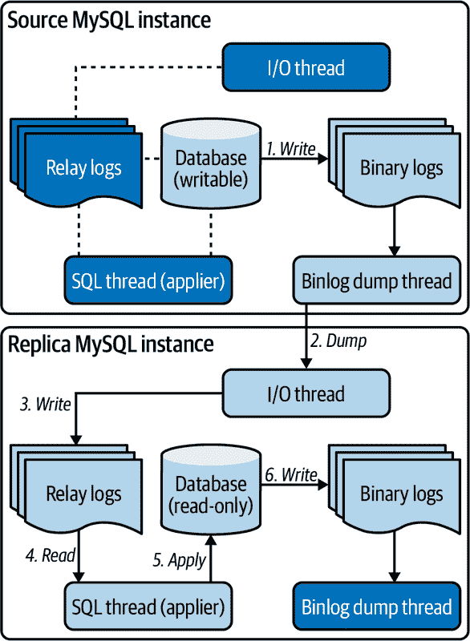
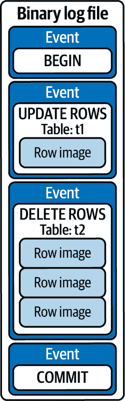
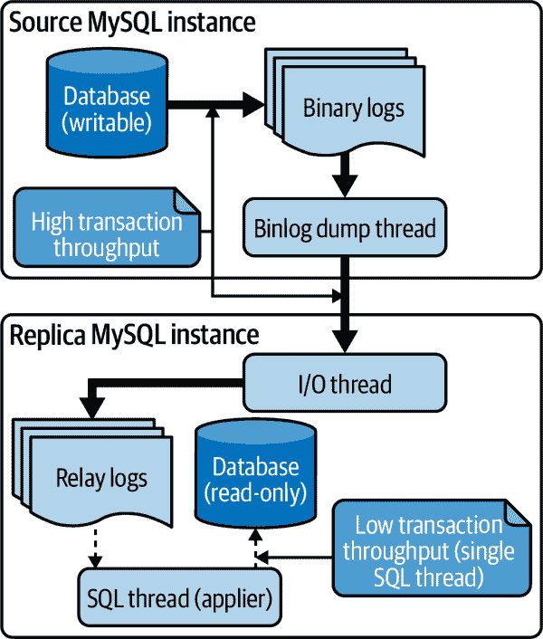
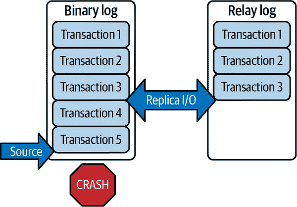
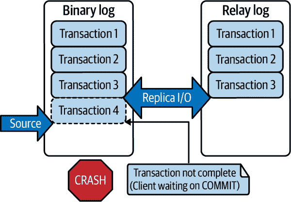
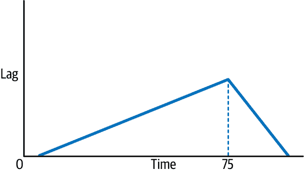

# 第七章：复制延迟

*复制延迟* 是源 MySQL 实例上发生写入的时间与该写入在副本 MySQL 实例上应用的时间之间的延迟。复制延迟是所有数据库服务器固有的问题，因为跨网络的复制会产生网络延迟。

作为一个使用 MySQL 的工程师，我很高兴你不必设置、配置和维护 MySQL 复制拓扑，因为 MySQL 复制变得复杂了。相反，本章节关注性能相关的复制延迟问题：是什么、为什么会发生、带来了哪些风险，以及你可以采取什么措施。

从技术上讲，是的，复制会降低性能，但你不希望在没有它的情况下运行 MySQL。毫不夸张地说，复制阻止了企业因数据丢失而破产的可能性。MySQL 无处不在，从医院到银行，复制让宝贵的数据在不可避免的故障中保持安全。尽管复制会降低性能并存在延迟风险，但这些成本被复制带来的巨大好处抵消了。

本章节探讨了复制延迟。包括六个主要部分。第一部分介绍了基本的 MySQL 复制术语，并追溯了复制延迟的技术起源——即使在快速数据库和网络的背景下，为什么它会发生。第二部分讨论了复制延迟的主要原因。第三部分解释了复制延迟的风险：数据丢失。第四部分提供了一个启用多线程副本的保守配置，显著减少延迟。第五部分介绍了如何使用高精度监控复制延迟。第六部分解释了为什么复制延迟恢复缓慢。

# 基础

MySQL 有两种复制类型：

源到副本

*源到副本复制* 是 MySQL 已经使用了 20 多年的基本复制类型。它的古老地位意味着 [*MySQL 复制*](https://oreil.ly/A8fTn) 就是指源到副本的复制。MySQL 复制虽然年代久远，但毫无疑问：它快速、可靠，今天仍被广泛使用。

集群复制

[*集群复制*](https://oreil.ly/TASM9) 是 MySQL 自 MySQL 5.7.17 版本（2016 年 12 月 12 日发布）开始支持的新型复制。集群复制创建了一个由主副本实例组成的 MySQL 集群，使用组共识协议同步（复制）数据变更并管理组成员资格。简而言之，集群复制就是 MySQL 集群，它是 MySQL 复制和高可用性的未来。

本章仅涵盖传统的 MySQL 复制：源到副本。Group Replication 是未来的趋势，但由于在撰写本文时，我和我认识的任何数据库管理员都没有大规模操作 Group Replication 的经验，所以我将推迟对其进行详细讨论。此外，建立在 Group Replication 之上的另一项创新正在成为标准：[InnoDB 集群](https://oreil.ly/BFqu9)。

此外，[Percona XtraDB Cluster](https://oreil.ly/fWNfb)和[MariaDB Galera Cluster](https://oreil.ly/LMhEC)是类似于 MySQL Group Replication 的数据库集群解决方案，但实现方式不同。我推迟对这些解决方案的详细介绍，但如果您正在运行 Percona 或 MariaDB 版本的 MySQL 并寻找数据库集群解决方案，可以考虑这些选项。

MySQL 源到副本复制是无处不在的。虽然本书不涉及复制的内部工作原理，但了解其基础可以阐明复制滞后的原因、它带来的风险以及如何减少这些风险。

###### 注意

MySQL 8.0.22 和 8.0.26（分别于 2020 年和 2021 年发布）发布后，复制术语发生了变化。有关变更的摘要，请参阅[“MySQL 术语更新”](https://oreil.ly/wrzfU)。本书中使用当前的术语、度量标准、变量和命令。

## 源到副本

图 7-1 展示了 MySQL 源到副本复制的基础。



###### 图 7-1\. MySQL 源到副本复制的基础

*源 MySQL 实例*（简称*源*）是应用程序向其写入数据的任何 MySQL 服务器。 MySQL 复制支持多个可写源，但由于处理写冲突的难度，这种情况很少见。因此，单个可写源是正常情况。

*副本 MySQL 实例*（简称*副本*）是从源复制数据更改的任何 MySQL 服务器。 *数据更改*包括对行、索引、模式等的修改。为避免脑裂（参见“脑裂是最大的风险”），副本应始终保持只读。通常，一个副本从单个源复制，但[多源复制](https://oreil.ly/GeaVQ)也是一种选择。

图 7-1 中的箭头表示数据更改从源流向副本的过程：

1.  在事务提交期间，数据更改会写入源上的*二进制日志*（或简称*binlogs*）：这些是记录*二进制日志事件*的磁盘文件（参见“二进制日志事件”）。

1.  在副本上，*I/O 线程*从源的二进制日志中转储（读取）二进制日志事件。（源上的*binlog dump 线程*专门用于此目的。）

1.  在副本上，I/O 线程将二进制日志事件写入副本上的*中继日志*：这些是源二进制日志的本地副本的磁盘文件。

1.  *SQL 线程*（或 *应用程序线程*）从中继日志中读取二进制日志事件。

1.  SQL 线程将二进制日志事件应用于复制品数据。

1.  复制品将数据更改（由 SQL 线程应用）写入其二进制日志。

默认情况下，MySQL 复制是异步的：在源端，事务在步骤 1 完成后，其余步骤是异步发生的。MySQL 支持半同步复制：在源端，事务在步骤 3 完成后才提交。这不是打字错误：MySQL 半同步复制在步骤 3 后提交；它*不*等待步骤 4 或 5。“半同步复制”提供了更详细的信息。

复制品不需要写入二进制日志（步骤 6），但这是高可用性的标准做法，因为它允许复制品成为源。这是数据库*故障转移*的工作方式：当源数据库死机或因维护而关闭时，复制品被提升为新的源。让我们称这些实例为*旧源*和*新源*。最终，DBA 将恢复旧源（或克隆一个新实例来替换它），并使其从新源复制。在旧源中，以前处于空闲状态的 I/O 线程、中继日志和 SQL 线程（在图 7-1 中深色阴影部分）开始工作。（旧源中的 I/O 线程将连接到新源，这将激活其以前处于空闲状态的 binlog dump 线程。）从新源的二进制日志中，旧源复制它在离线期间错过的写入。在这样做的同时，旧源报告复制延迟，但这是一个在“故障后重建”中解决的特殊情况。这就是故障转移的核心内容；当然，在实践中它更为复杂。

## 二进制日志事件

二进制日志事件是一个低级别的细节，你可能不会遇到（即使是数据库管理员也不经常在二进制日志中操作），但它们是应用程序执行的事务的直接结果。因此，理解应用程序试图通过复制的管道刷新的内容是非常重要的。

###### 注意

以下假设使用基于行的复制（RBR），这是 MySQL 5.7.7 版本以来的默认[`binlog_format`](https://oreil.ly/rtKm0)。

复制侧重于事务和二进制日志事件，而不是单个写入操作，因为数据更改在事务提交时提交到二进制日志，此时写入操作已经完成。从高层次来看，侧重于事务是因为它们对应用程序是有意义的。从低层次来看，侧重于二进制日志事件是因为它们对复制是有意义的。事务在二进制日志中逻辑上表示和界定为事件，这是多线程复制可以并行应用它们的方式——更多细节请参见“减少延迟：多线程复制”。为了说明，让我们使用一个简单的事务：

```
BEGIN;
UPDATE t1 SET c='val' WHERE id=1 LIMIT 1;
DELETE FROM t2 LIMIT 3;
COMMIT;
```

表模式和数据并不重要。重要的是`UPDATE`在表`t1`中更改一行，而`DELETE`从表`t2`中删除了三行。图 7-2 说明了该事务如何在二进制日志中提交。

四个连续的事件构成了该事务：

+   一个`BEGIN`事件

+   一个带有一个行图像的`UPDATE`语句事件

+   一个带有三行图像的`DELETE`语句事件

+   一个`COMMIT`事件

在这个低级别上，SQL 语句基本上消失了，复制是一系列事件和行图像（对于修改行的事件）。*行图像*是修改前后行的二进制快照。这是一个重要的细节，因为单个 SQL 语句可以生成无数行图像，从而产生一个大事务，可能在复制过程中引起延迟。



###### 图 7-2\. 一个事务的二进制日志事件

让我们在这里停下，因为对于这本书来说我们深入到 MySQL 内部的内容已经足够。虽然简短，但是对二进制日志事件的介绍使得接下来的章节更易理解，因为现在你知道复制管道中流动的内容以及事务和二进制日志事件的重点是什么。

## 复制延迟

参考图 7-1，当在副本上应用变更（步骤 5）比源上提交变更（步骤 1）的速度慢时，复制延迟就会发生。中间的步骤很少会成为问题（当网络正常工作时），因为 MySQL 二进制日志、MySQL 网络协议和典型网络非常快速和高效。

###### 注意

*应用变更*简称为*应用事务*或*应用事件*，取决于上下文。

在副本上的 I/O 线程可以以很高的速率将二进制日志事件写入其中继日志，因为这是一个相对简单的过程：从网络读取，顺序写入磁盘。但是，SQL 线程有一个更加困难且耗时的过程：应用这些变更。因此，I/O 线程超过了 SQL 线程，复制延迟看起来像图 7-3。



###### 图 7-3\. MySQL 复制延迟

严格来说，单个 SQL 线程并不会导致复制延迟，它只是一个限制因素。在本例中，问题的根本原因是源头上的高事务吞吐量，这对于忙碌的应用程序来说是一个好问题，但也是一个问题。关于原因的更多信息请参见下一节。解决方案是增加更多的 SQL 线程，这将在"减少延迟：多线程复制"一节中讨论。

半同步复制既不能解决也不能预防复制延迟。启用半同步复制时，对于每个事务，MySQL 等待副本确认已将事务的二进制日志事件写入其中继日志——见图 7-1 的第 3 步（#repl-foundation-img）。在本地网络上，如图 7-3 所示（#repl-lag-img），仍可能发生复制延迟。如果半同步减少复制延迟，那只是网络延迟的副作用，会限制源端的事务吞吐量。详细内容请参见“半同步复制”（#repl-semi-sync）。

延迟是复制过程中固有的，但不要误解：MySQL 复制速度非常快。单个 SQL 线程可以轻松处理成千上万个事务每秒。第一个原因很简单：副本不执行与源相同的全部工作负载。特别是，副本不执行读操作（假设副本不用于提供读取服务）。第二个原因需要几行来解释。如“二进制日志事件”中所述，本章假定使用基于行的复制（RBR）。因此，副本不执行 SQL 语句：它们应用二进制日志事件。这节省了副本大量时间，因为它们只需处理最终结果——数据变更——并告知如何应用这些变更。这比查找匹配的行以进行更新要快得多，而这是源必须做的事情。由于这两个原因，即使源非常忙碌，副本也几乎可以处于空闲状态。尽管如此，复制也可能受到三个原因的影响。

# 原因

复制延迟有三个主要原因：事务吞吐量、故障后的重建以及网络问题。接下来分别介绍每一个原因。

## 事务吞吐量

当源端速率高于副本 SQL（应用程序）线程应用更改的速率时，事务吞吐量会导致复制延迟。当应用程序因合理繁忙而出现这种情况时，通常不可能减少源端的速率。解决方法是通过运行更多 SQL（应用程序）线程来增加副本的速率。专注于通过调整多线程复制来提高副本性能，详见“减少延迟：多线程复制”（#repl-mtr）。

大型事务 —— 修改大量行数的事务 —— 对副本的影响比源端更大。在源端，例如执行需要两秒的大型事务，通常不会阻塞其他事务，因为它可以并行运行（并提交）。但是在单线程副本上，这种大型事务会阻塞所有其他事务两秒钟（或在副本上执行所需的时间，可能因争用较少而较短）。在多线程副本上，其他事务可以继续执行，但是这种大型事务仍然会阻塞一个线程两秒钟。解决方案是减少事务的大小。更多信息请参见“大型事务（事务大小）”。

事务吞吐量并非总是由应用程序驱动：回填、删除和归档数据是常见操作，如果不控制批处理大小，则可能导致大规模复制延迟，如“批处理大小”中预警的那样。除了适当的批处理大小，这些操作应监控复制延迟，并在副本开始落后时减速。操作花费一天的时间总比使副本落后一秒钟更好。“风险：数据丢失”解释了其中的原因。

在某个时刻，事务吞吐量将超过单个 MySQL 实例的容量 —— 无论是源端还是副本。要增加事务吞吐量，必须通过分片数据库来进行扩展（参见第五章）。

## 故障后重建

当 MySQL 或硬件发生故障时，将修复实例并将其放回复制拓扑中。或者从现有实例克隆一个新实例，并取代失败的实例。无论哪种方式，都会重建复制拓扑以恢复高可用性。

###### 注意

副本用于多种目的，但本章仅讨论用于高可用性的副本。

固定（或新）实例将花费几分钟、几小时或几天来*追赶*：复制它离线时错过的所有二进制日志事件。从技术上讲，这就是复制延迟，但在实践中，您可以忽略它，直到修复的实例追赶上来。一旦追赶上，任何延迟都是合理的。

由于故障不可避免且追赶需要时间，唯一的解决方案是意识到复制延迟是由于故障后的重建而等待。

## 网络问题

*网络问题* 通过延迟源端到副本的二进制日志事件传输 —— 图 7-1 中的第 2 步 —— 导致复制延迟。从技术上讲，是网络而不是复制在滞后，但对语义上的纠缠不会改变最终结果：副本落后于源端 —— 一种长时间说 *落后* 的方式。在这种情况下，您必须征求网络工程师来修复根本原因：网络。

网络问题带来的风险通过沟通和团队合作得以缓解：与网络工程师交流，确保他们了解数据库在网络问题时可能面临的风险——他们可能并不清楚，因为他们不是 DBA 或使用 MySQL 的工程师。

# 风险：数据丢失

*复制滞后即数据丢失*。

这对 MySQL 来说是默认情况，因为默认是异步复制。幸运的是，半同步复制是一个选项，它不会丢失任何已提交的事务。让我们首先分析一下异步复制的风险，然后清楚地了解半同步复制是如何缓解风险的。

###### 注意

正如在“基础”中所述，我将组复制推迟到未来。此外，组复制的同步性需要仔细解释。^(1)

## 异步复制

图 7-4 显示了源崩溃的时间点。



###### 图 7-4\. MySQL 源在异步复制中的崩溃

在崩溃之前，源已经将五个事务提交到其二进制日志中。但是当它崩溃时，复制的 I/O 线程仅获取了前三个事务。最后两个事务是否丢失取决于两个因素：崩溃的原因以及是否需要 DBA 进行故障切换。

如果 MySQL 导致崩溃（最有可能是由于错误引起），那么它将自动重启，执行崩溃恢复，并恢复正常操作。（默认情况下，副本会自动重新连接并恢复复制。）而且，只要 MySQL 在正确配置时是真正持久的，已提交的事务 4 和 5 将不会丢失。只有一个问题：崩溃恢复可能需要数分钟甚至数小时才能完成——这取决于本书范围之外的多个因素。如果可以等待，崩溃恢复是理想的解决方案，因为不会丢失任何已提交的事务。

如果硬件或操作系统导致崩溃，或者因为任何原因无法快速恢复崩溃的 MySQL 实例，那么 DBA 将进行故障切换——提升一个副本为源——事务 4 和 5 将会丢失。这不是一个理想的解决方案，但这是标准做法，因为另一种选择更糟糕：在恢复崩溃的 MySQL 实例时出现长时间的停机时间，这需要精确的数据取证，可能需要数小时甚至数天。

###### 注意

维护（运维）时如果 DBA 进行故障切换，则不会丢失数据。而且由于没有发生故障，一些 DBA 称之为*成功切换*。

这个示例并非刻意证明*复制滞后即数据丢失*的观点；由于所有硬件和软件（包括 MySQL）最终都会失败，异步复制是不可避免的。

唯一的缓解方法是严格遵守最小化复制延迟。例如，不要忽视 10 秒的复制延迟为“没有太大差距”。而应该将其视为“我们面临着丢失最后 10 秒客户数据的风险”。MySQL 或硬件在最坏的时刻——复制延迟时——不会失败，但我要讲一个关于硬件故障的警示故事。

有一周，当我值班时，我在早上 9 点左右收到了警报。那不算太早；我已经喝完了第一杯咖啡。一个警报迅速变成了数千个。数据库服务器到处都在失败——分布在多个地理位置的数据中心——情况非常糟糕，以至于我立刻意识到：问题不是硬件或 MySQL，因为同时发生这么多但不相关的故障的概率是微乎其微的。长话短说，公司最有经验的工程师之一那天早上没有喝咖啡。他编写并运行的自定义脚本出了大问题。该脚本不仅随机重启了服务器，而是将它们关掉了。（在数据中心，服务器的电源是通过称为智能平台管理接口的背板进行程序控制的。）切断电源就相当于硬件故障。

这个故事的寓意是：失败可能是由人为错误造成的。做好准备。

异步复制不是最佳实践，因为几乎无法减少的数据丢失与持久数据存储的目的背道而驰。全球无数公司在 20 多年来都成功使用异步复制。 （但“常规做法”并不一定意味着“最佳实践”。）如果您使用异步复制，只要满足以下三个条件，MySQL DBA 和专家就不会嗤之以鼻：

+   您可以通过心跳监控复制延迟（参见 “监控”）。

+   当复制延迟过高时，您将在任何时间（不仅仅是工作时间）收到警报。

+   您将复制延迟视为数据丢失，并立即修复它。

许多成功的公司使用异步 MySQL 复制，但还有更高的标准可以追求：半同步复制。

## 半同步复制

当启用半同步（或 *semisync*）复制时，源头等待至少一个复制副本确认每个事务。*确认* 意味着复制副本已将事务的二进制日志事件写入其中继日志。因此，事务已经安全地写入副本的磁盘，但尚未应用。 （因此，如在 “复制延迟” 中提到的，半同步复制仍会出现复制延迟。）接收到确认时，而非应用时，才称为 *半* 同步，而非完全同步。

让我们重现 “异步复制” 中的源头崩溃，但现在启用了半同步复制。图 7-5 显示源头崩溃的时间点。



###### 图 7-5\. 使用半同步复制的 MySQL 源端崩溃

使用半同步复制，每个已提交的事务都保证至少复制到一个副本。在这里，“已提交的事务”指的是客户端执行的`COMMIT`语句已返回——从客户端的角度看，事务已完成。这是已提交事务的通常高层次理解，但在复制的内部实现中，技术细节有所不同。启用二进制日志和半同步复制时，事务提交的极简化步骤如下：

1.  准备事务提交

1.  刷新数据更改到二进制日志

1.  等待至少一个副本的确认

1.  提交事务

InnoDB 事务提交是一个两阶段提交。在两个阶段之间（步骤 1 和步骤 4 之间），数据更改被写入并刷新到二进制日志，并且 MySQL 等待至少一个副本确认事务。^(2)

在图 7-5 中，第四个事务的虚线轮廓表明至少有一个副本*未*确认。在第 2 步后源端崩溃，因此事务在二进制日志中，但提交未完成。客户端的`COMMIT`语句将返回一个错误（不是来自 MySQL，因为 MySQL 已经崩溃；它可能会收到一个网络错误）。

是否丢失第四个事务取决于与之前相同的两个因素（“异步复制”）：崩溃的原因，以及是否需要进行故障切换。重要的区别在于，在启用半同步复制时，每个连接仅能丢失一个未提交的事务。由于事务未完成且客户端收到错误，未提交事务的潜在丢失不那么令人担忧。关键词是*不那么*令人担忧：有一些边缘情况意味着你不能简单地忽略丢失的事务。例如，如果一个副本在事务被确认后，源端在接收确认之前崩溃了会怎么样？答案将会更深入地涉及到复制的细节，但我们并不需要那么深入。关键在于：半同步复制确保所有已提交的事务至少复制到一个副本，每个连接只能在失败时丢失一个未提交的事务。

持久数据存储的基本目的是持久化数据，而不是丢失数据。那么为什么半同步不是 MySQL 的默认设置呢？这很复杂。

有些成功的公司使用半同步复制来运行规模较大的 MySQL。一个著名的公司是 GitHub，这家公司是著名的 MySQL 专家 Shlomi Noach 的前雇主，他写了一篇关于他们使用半同步复制的博客文章：[“GitHub 上的 MySQL 高可用性”](https://oreil.ly/6mLug)。

半同步复制 *降低* 可用性—这不是打字错误。虽然它保护事务，但这种保护意味着每个连接的当前事务可能会在 `COMMIT` 上陷入停顿、超时或失败。相比之下，异步复制的 `COMMIT` 本质上是瞬时的，并且只要源端的存储工作正常就是有保证的。

默认情况下，当没有足够的副本或源端等待确认时超时时，半同步复制会有效地退回到异步模式。这可以通过配置有效地禁用，但最佳实践是允许它，因为另一种选择更糟糕：完全的故障（应用无法写入源端）。

使用半同步复制的性能要求源端和副本位于快速的本地网络上，因为网络延迟隐式地限制了源端的事务吞吐量。这是否成为问题取决于运行 MySQL 的本地网络。本地网络应具有亚毫秒的延迟，但必须进行验证和监控，否则事务吞吐量将受网络延迟的影响。

异步复制可以在没有任何特殊配置的情况下运行，而半同步复制则需要特定的配置和调优。对于数据库管理员来说，这两者都不是负担，但它们仍需小心地进行工作。

###### 提示

我认为半同步复制是最佳实践，因为数据丢失是不可接受的—没有争议。我建议你了解更多关于半同步复制的信息，在你的网络上进行测试和验证，并在可能的情况下使用它。首先阅读 MySQL 手册中的 [“Semisynchronous Replication”](https://oreil.ly/JnxUJ)。或者，如果你想为未来做好准备，可以了解 [Group Replication](https://oreil.ly/5ZWHQ) 和 [InnoDB Cluster](https://oreil.ly/JrrYd)：它们是 MySQL 复制和高可用性的未来。尽管半同步复制和 Group Replication 在 MySQL 专家中引发争议，但有一点是普遍认同的：预防数据丢失是一种美德。

# 减少滞后：多线程复制

默认情况下，MySQL 复制是异步 *且* 单线程的：副本上有一个 SQL 线程。即使是半同步复制，默认情况下也是单线程的。单个 SQL 线程不会导致复制滞后—“Causes” 是三个主要的原因—但它是限制因素。解决方案是 *多线程复制*（或 *并行复制*）：多个 SQL 线程并行应用事务。在多线程副本上，SQL 线程被称为 *应用者线程*。^(3) 如果你愿意，仍然可以称它们为 SQL 线程—这些术语是同义的—但 MySQL 手册在多线程复制的上下文中使用 *应用者*。

对于我们作为使用 MySQL 的工程师来说，解决方案很简单，但对于 MySQL 来说并不简单。正如你所想象的，事务不能以随机顺序应用：事务之间可能存在依赖关系。例如，如果一个事务插入了一行新记录，第二个事务更新了该行，显然第二个事务必须在第一个事务之后运行。*事务依赖跟踪*是确定哪些事务（从序列化记录（二进制日志）中）可以并行应用的艺术和科学（以及魔法）。这既迷人又令人印象深刻，但超出了本书的范围，因此我鼓励你观看著名 MySQL 专家 Jean-François Gagné 的视频[“MySQL 并行复制（LOGICAL_CLOCK）：所有 5.7 版本（以及部分 8.0 版本）的细节”](https://oreil.ly/Q8aJv)。

严格来说，有一个系统变量可以启用多线程复制，但我怀疑当我告诉你时你不会感到惊讶：实际操作中更为复杂。配置 MySQL 复制超出了本书的范围，但多线程复制太重要了，不给你一个*保守的起点*是不行的。保守的起点意味着以下配置可能无法发挥多线程复制的全部性能。因此，你（或 DBA）必须调整多线程复制，以最大化其潜力，同时考虑并行复制的各种影响。

###### 警告

本节的其余部分是非常复杂的 MySQL 配置，只能由有经验在高性能、高可用性环境中配置 MySQL 的工程师完成。表 7-1 中的系统变量*不会*以任何方式影响数据完整性或持久性，但它们会影响源实例和副本实例的性能。请注意：

+   复制会影响高可用性。

+   必须启用[全局事务标识符](https://oreil.ly/xYtq3)和[`log-replica-updates`](https://oreil.ly/wAOMO)。

+   配置 MySQL 需要提升的 MySQL 权限。

+   系统变量在 MySQL 版本和发行版之间会发生变化。

+   MariaDB 使用不同的系统变量：请参阅 MariaDB 文档中的[“并行复制”](https://oreil.ly/F5n6J)。

在配置 MySQL 时要非常小心，并仔细阅读您所使用的 MySQL 版本和发行版的手册中相关部分。

表 7-1 列出了三个系统变量作为启用和配置多线程复制的保守起点。随着 MySQL 8.0.26 的变化，变量名称也发生了变化，因此该表列出了旧变量名称和新变量名称，然后是推荐值。我不建议在早于 5.7.22 的 MySQL 版本中使用多线程复制，因为某些来自 8.0 版本的复制功能已被回溯到这个版本中。

表 7-1\. 启用多线程复制的系统变量

| MySQL 5.7.22 到 8.0.25 | MySQL 8.0.26 及更新版本 | 值 |
| --- | --- | --- |
| [`slave_parallel_workers`](https://oreil.ly/82SBV) | [`replica_parallel_workers`](https://oreil.ly/kFqAz) | `4` |
| [`slave_parallel_type`](https://oreil.ly/s5NOE) | [`replica_parallel_type`](https://oreil.ly/mIft5) | `LOGI⁠CAL_CLOCK` |
| [`slave_preserve_com⁠mit_order`](https://oreil.ly/oKRSy) | [`replica_preserve_commit_order`](https://oreil.ly/QGBB1) | `1` |

在用于高可用性（可以晋升为源的）复制拓扑中的所有 MySQL 实例上设置这三个变量。

将 `replica_parallel_workers` 设置为大于零是唯一启用多线程复制的系统变量。四个应用线程是一个很好的起点；您必须进行调整，以找到适合您的工作负载和硬件的优化应用线程数。但是，就像施展魔法咒语一样，必须使用 `replica_parallel_type` 并发起多线程复制的全部性能。即使在 MySQL 8.0.26 中，`replica_parallel_type` 的默认值仍然是 `DATABASE`，这仅适用于并行应用不同数据库的事务——实际上每个数据库只有一个应用线程。这是历史遗留问题：这是第一种类型的并行化。但是今天，最佳实践是将 `rep⁠lica_parallel_type = LOGICAL_CLOCK`，因为当启用 `rep⁠lica_preserve_commit_order` 时，它没有任何缺点，并且提供更好的并行化，因为它无论数据库如何都可以并行应用事务。

`replica_preserve_commit_order` 默认情况下是禁用的，但我认为这不是最佳实践，因为它允许多线程复制*无序提交*：在副本上按不同于源上提交顺序提交事务。例如，在源上按顺序提交的事务 1、2、3 在副本上可能按顺序 3、1、2 提交。只有当安全时（即没有事务之间的有序依赖关系时），多线程复制才会无序提交，并且表数据（最终）是相同的，但无序提交具有后果，您和特别是管理 MySQL 的数据库管理员必须理解和处理。 MySQL 手册中的 [“复制和事务不一致性”](https://oreil.ly/Bf04z) 记录了这些后果。当启用 `replica_preserve_commit_order` 时，事务仍然是并行应用的，但某些事务可能需要等待较早的事务先提交——这就是保留提交顺序的方式。尽管 `replica_preserve_commit_order` 降低了并行化的效率，但直到您和数据库管理员验证其后果是可以接受和处理的，这仍然是最佳实践。

###### 注意

对于组复制，多线程复制的工作方式相同。

由于表 7-1 是启用多线程复制的保守起点，因此它不启用最新的事务依赖跟踪：`WRITESET`。MySQL 事务依赖跟踪由系统变量[`binlog_transaction_dependency_tracking`](https://oreil.ly/5SMUG)确定。默认是`COMMIT_ORDER`，但最新的是`WRITESET`。基准测试显示，`WRITESET`比`COMMIT_ORDER`实现了更大的并行化。在撰写本文时，`WRITESET`还不到四年：它是在 2018 年 4 月 19 日正式推出的 MySQL 8.0 中引入的。从技术角度来看，你应该使用`WRITESET`，因为它在多线程副本上实现了更好的性能。但作为政策问题，是否成熟足以在生产中使用一个功能，这是你（或你的 DBA）决定的。要在 MySQL 5.7 上使用`WRITESET`，必须启用系统变量[`trans​ac⁠tion_write_set_extraction`](https://oreil.ly/3lKGX)。在 MySQL 8.0 上，此系统变量默认启用，但自 MySQL 8.0.26 起已弃用。

###### 提示

创建一个新的副本来测试和调整多线程副本。新副本几乎没有风险，因为它不提供应用程序或高可用性服务。

还有一个系统变量你应该尝试一下：[`bin⁠log_​group_commit_sync_delay`](https://oreil.ly/YMXoI)。默认情况下，这个变量是禁用的（零），因为顾名思义，它会给组提交增加人为延迟。延迟通常对性能有害，但组提交延迟是个例外——有时。在源端，事务以组的形式提交到二进制日志中，这是一种内部优化，被称为*组提交*。为组提交增加延迟会创建更大的组：每组提交更多的事务。多线程复制不依赖于组提交，但可以从更大的组提交中受益，因为一次提交更多的事务有助于事务依赖跟踪找到更多并行化的机会。要尝试调整`binlog_group_commit_sync_delay`，可以从`10000`开始：单位是微秒，所以是 10 毫秒。这会使源端的事务提交响应时间增加 10 毫秒，但也应该会提高副本的事务吞吐量。由于缺乏 MySQL 指标，调整组提交大小以配合多线程副本应用程序的事务吞吐量并不容易。如果选择这条路，请阅读由著名的 MySQL 专家 Jean-François Gagné撰写的[“用于调整 MySQL 5.7 并行复制的指标”](https://oreil.ly/QG4E1)。

多线程复制是最佳实践，但需要复杂的 MySQL 配置和可能的调优来达到最大性能。基准测试和实际结果各不相同，但多线程复制可以使副本的事务吞吐量增加一倍以上。对于这样的性能增益，付出的努力是非常值得的。但最重要的是：多线程复制显著减少了复制延迟，在使用异步复制时至关重要。

# 监控

监控复制延迟的最佳实践是使用专门设计的工具。但首先，让我们来看看 MySQL 中臭名昭著的复制延迟度量标准：`Sec​onds_​Behind_Source`，如 `SHOW REPLICA STATUS` 所报告的。

###### 注

在 MySQL 8.0.22 之前，复制延迟度量和命令分别是 `Sec​onds_​Behind_Master` 和 `SHOW SLAVE STATUS`。从 MySQL 8.0.22 开始，度量和命令是 `Sec​onds_​Behind_Source` 和 `SHOW REPLICA STATUS`。本书中使用当前的度量和命令。

`Seconds_Behind_Source` 等于副本上的当前时间减去 SQL 线程正在执行的二进制日志事件的时间戳。[⁴] 如果副本上的当前时间是 `T = 100`，而 SQL 线程正在执行时间戳为 `T = 80` 的二进制日志事件，则 `Seconds_Behind_Source = 20`。当一切正常工作时（尽管存在复制延迟），`Seconds_Behind_Source` 相对准确，但它以三个问题而臭名昭著：

+   第一个问题发生在一切都不工作的情况下。由于 `Seconds_​Behind_Source` 仅依赖于二进制日志事件的时间戳，它在字面上看不到（或不关心）二进制日志事件到达之前的任何问题。如果源或网络出现问题导致二进制日志事件无法到达或到达缓慢，那么 SQL 线程会应用所有二进制日志事件，`Seconds_Behind_Source` 报告零延迟，因为从 SQL 线程的角度来看，这在技术上是正确的：零事件，零延迟。但从我们的角度来看，我们知道这是错误的：不仅存在复制延迟，还存在副本之前的问题。

+   第二个问题是，`Seconds_Behind_Source` 经常在零和非零值之间波动。例如，一会儿 `Seconds_Behind_Source` 报告说落后 500 秒，下一刻报告说没有落后，再过一会儿又报告说落后 500 秒。这个问题与第一个问题相关：由于在副本之前出现问题导致事件缓慢进入中继日志，SQL 线程明显地在工作（应用最新事件）和等待（等待下一个事件）之间摆动。这导致 `Seconds_Behind_Source` 在数值（SQL 线程正在工作）和零（SQL 线程正在等待）之间波动。

+   第三个问题是，`Seconds_Behind_Source`并没有准确回答工程师们真正想知道的问题：*副本何时会追上？*副本何时的滞后会有效地降为零，因为它正在应用来自源端的最新事务？假设一切正常（尽管存在复制延迟），`Seconds_Behind_Source`的值只表示当前正在应用的事件在源端执行多久之前；它*不*精确表示副本追上源端还需要多长时间。原因在于副本的事务应用速率与源端不同。

    例如，假设源端并发执行了 10 个事务，每个事务需要 1 秒钟。总执行时间为 1 秒钟，速率为 10 TPS，因为这些事务在源端并发执行。在单线程副本上，每个事务都按顺序应用，最坏情况下的总执行时间和速率*可能是*10 秒和 1 TPS，分别。我强调*可能是*，因为副本也可能会更快地应用所有 10 个事务，原因是副本没有承担完整的工作负载，并且不执行 SQL 语句（它应用二进制日志事件）。如果源端每个事务的 1 秒执行时间是由于一个糟糕的`WHERE`子句，访问了百万行但只匹配并更新了一行，那么幸运的副本几乎没有时间更新那一行。在多线程副本（参见“减少延迟：多线程复制”）上，总执行时间和速率根据至少两个因素变化：应用线程的数量以及事务是否可以并行应用。无论如何，关键在于：副本的事务应用速率与源端不同，而且由于无法知道差异，`Seconds_Behind_Source`不能——也不会——精确地指示副本何时会追上。

尽管存在这些问题，`Seconds_Behind_Source`还是有价值的：它提供了一个大概估计，即副本追上源端还需要多长时间：几秒钟、几分钟、几小时、几天？更多关于恢复时间的内容将在下一节讨论。

MySQL 8.0 引入了显著改进的 MySQL 复制可见性，包括复制延迟。只有一个小问题：它提供了原始构件，而不是像`Seconds_Behind_Source`这样的即用型度量指标。如果你在使用 MySQL 8.0，请与你的 DBA 讨论[Performance Schema 复制表](https://oreil.ly/xDKOd)，它会提供关于 MySQL 复制的新信息。否则，监控复制延迟的最佳实践是使用专门的工具。工具不依赖于二进制日志事件的时间戳，而是使用自己的时间戳。工具会定期向表写入时间戳，然后报告复制延迟，即从副本当前时间减去表中最新时间戳的差值。从根本上讲，这种方法与 MySQL 计算`Seconds_Behind_Source`的方式类似，但使用工具时有三个重要的不同点：

+   工具会定期写入时间戳，这意味着它不容易受到`Seconds_Behind_Source`的第一个问题的影响。如果在二进制日志事件到达之前存在任何问题，从工具中的复制延迟将立即开始增加，因为其时间戳（写入表中）停止递增。

+   工具消除了`Seconds_Behind_Source`的第二个问题：工具的复制延迟不会波动；如果其时间戳等于当前时间（实际上）时，复制延迟只能为零。

+   工具可以测量复制延迟，并以次秒级间隔（例如每 200 毫秒）写入时间戳。对于高性能应用程序或使用异步复制的任何应用程序，单个秒的复制延迟都太多了。

###### 提示

监控 MySQL 复制的事实上的工具是[`pt-heartbeat`](https://oreil.ly/sTvro)。（由复制延迟监控工具写入的时间戳称为*心跳*。）这个老牌工具已经使用和成功了十多年，因为它简单而有效。使用它开始监控复制延迟，或者使用它来学习如何编写自己的工具。

# 恢复时间

当副本有显著的延迟时，最紧迫的问题通常是“它何时会恢复？”副本何时才能赶上源，以便执行（应用）最新的事务？没有确切的答案。但是复制延迟总是在原因修复后恢复。我将在本节末尾回到这个概念。在那之前，还有一个复制延迟的特征需要了解。

复制延迟的另一个常见且重要的特征是增加延迟与副本开始恢复（减少延迟）之间的拐点。在图 7-6 中，拐点由时间 75 处的虚线标记。

当复制延迟开始时，随着延迟的增加，情况看起来越来越严重。但这是正常的。假设副本没有损坏，SQL 线程正在努力工作，但原因尚未修复，因此二进制日志事件的积压继续增加。只要原因持续存在，复制延迟将增加。但同样：这是正常的。原因一旦修复，谚语般的潮水将很快转向，在复制延迟图表中创建一个拐点，如图 7-6 所示，在第 75 时刻。副本仍然滞后，但它正在比 I/O 线程将其倒入中继日志更快地应用二进制日志事件。拐点后，副本延迟通常会以显著且令人满意的速度减少。



###### 图 7-6\. 复制延迟图中的拐点

在拐点之前，恢复时间并不是很有意义，因为理论上，如果原因从未修复，那么副本永远不会恢复。当复制延迟稳步增加（前-拐点），不要被值所分散注意力；而是专注于修复原因。延迟将一直增加，直到原因修复为止。

在拐点之后，恢复时间比`Seconds_Behind_Source`或工具报告的值更有意义，并且通常更快。如在“监控”中解释的那样，尽管有复制延迟，单个 SQL 线程非常快，因为副本不必执行源的全部工作负载。因此，副本通常比源更快地应用事务，这也是副本最终能够追上的原因。

根据我的经验，如果复制延迟以天计算，通常在几小时内就会恢复（后-拐点）—也许是很多小时，但无论如何都是几个小时。同样，几个小时的延迟通常在几个小时内恢复，几分钟的延迟通常在你喝完一杯咖啡之前就能恢复。

回到没有确切答案和延迟总是会恢复的观念，最终结果是确切的恢复时间并不像看起来那么有用或有意义。即使你能知道副本恢复的确切时间，你也只能等待。MySQL 复制非常坚韧。只要副本没有崩溃，MySQL *一定会* 恢复。尽快修复原因，等待拐点，那么复制延迟指示的最坏情况恢复时间：MySQL 通常会因为 SQL 线程快而恢复得更快。

# 总结

本章调查了 MySQL 复制延迟。复制是 MySQL 高可用性的基础，而复制延迟意味着数据丢失。主要要点如下：

+   MySQL 有三种类型的复制：异步、半同步和群组复制。

+   异步（async）复制是默认设置。

+   异步复制在失败时可能会丢失大量事务。

+   半同步复制在失败时不会丢失任何已提交的事务，只会丢失每个客户端连接的一个未提交的事务。

+   组复制是 MySQL 复制和高可用性的未来（但不包括在本章或书籍中）：它将 MySQL 实例转变为一个集群。

+   MySQL 异步和半同步复制的基础是将事务以二进制日志事件的形式从源端发送到复制副本。

+   半同步复制使得源端的事务提交等待至少一个复制副本确认接收并保存（而非应用）该事务。

+   一个复制副本有一个 I/O 线程，用于从源端获取二进制日志事件，并将其存储在本地中继日志中。

+   默认情况下，一个复制副本有一个 SQL 线程，用于执行来自本地中继日志的二进制日志事件。

+   可以启用多线程复制以运行多个 SQL 线程（应用程序线程）。

+   复制延迟有三个主要原因：源端的（高）事务吞吐量、MySQL 实例在故障后的赶上和重建，或者网络问题。

+   SQL（应用程序）线程是复制延迟的限制因素：更多的 SQL 线程通过并行应用事务来减少延迟。

+   半同步复制可能会产生复制延迟。

+   复制延迟是数据丢失的表现，尤其是在异步复制中。

+   启用多线程复制是减少复制延迟的最佳方法。

+   MySQL 的复制延迟度量指标`Seconds_Behind_Source`可能具有误导性；避免依赖它。

+   使用专门的工具以亚秒间隔测量和报告 MySQL 复制延迟。

+   从复制延迟中恢复的时间是不精确且难以计算的。

+   MySQL 最终会恢复，一旦问题解决，它总是会恢复。

下一章将详细讨论 MySQL 事务。

# 实践：监控亚秒延迟

这种做法的目标是监控亚秒级的复制延迟，并确定：你的复制副本是否超过了`Seconds_Behind_Source`可以报告的 1 秒分辨率？例如，你的复制副本是否滞后了 800 毫秒（远远大于网络延迟）？需要工具来监控亚秒级的延迟：[`pt⁠-⁠heart⁠beat`](https://oreil.ly/sTvro)。

要完成这个实践，你需要：

+   需要一个计算实例来运行`pt-heartbeat`，该实例可以连接到源端和一个复制副本。

+   MySQL 具有`SUPER`或`GRANT OPTION`权限来创建用户；或者请你的数据库管理员创建该用户。

+   MySQL `CREATE` 权限来创建数据库；或者请你的数据库管理员创建该数据库。

每个 MySQL 配置和环境都是不同的，因此根据需要调整以下示例。

1.  为`pt-heartbeat`创建一个要使用的数据库：

    ```
    CREATE DATABASE IF NOT EXISTS `percona`;
    ```

    你可以使用不同的数据库名称；我只是选择了`percona`作为示例。如果更改数据库名称，请确保在以下命令中也进行更改。

1.  为`pt-heartbeat`创建一个 MySQL 用户，并授予它所需的权限：

    ```
    CREATE USER 'pt-heartbeat'@'%' IDENTIFIED BY 'percona';
    GRANT CREATE, INSERT, UPDATE, DELETE, SELECT ON `percona`.`heartbeat`
      TO 'pt-heartbeat'@'%';
    GRANT REPLICATION CLIENT ON *.* TO 'pt-heartbeat'@'%';
    ```

    您可以使用不同的 MySQL 用户名和密码；我只是选择了`pt-heartbeat`和`percona`（分别）作为示例。如果在生产环境中运行此命令，则绝对应该更改密码。（密码由`IDENTIFIED BY`子句设置。）

1.  以更新模式运行`pt-heartbeat`，将心跳写入`percona`数据库中的表：

    ```
    pt-heartbeat         \
      --create-table     \
      --database percona \
      --interval 0.2     \
      --update           \
      h=SOURCE_ADDR,u=pt-heartbeat,p=percona
    ```

    对这些命令行参数的快速解释：

    `--create-table`

    如果需要，在指定的数据库中自动创建`heartbeat`表。第一个`GRANT`语句允许`pt-heartbeat`用户`CREATE`表。如果不使用此选项，请阅读`pt-heartbeat`文档以了解如何手动创建`heartbeat`表。

    `--database`

    指定要使用的数据库。`pt-heartbeat`需要此选项。

    `--interval`

    每 200 毫秒写入一个心跳。此选项确定`pt-heartbeat`的最大分辨率，即它能够检测到的最小延迟量。默认值为 1.0 秒，不是亚秒。最大分辨率为 0.01 秒（10 毫秒）。因此，0.2 秒有点保守，因此可以尝试更低的值（更高的分辨率）。

    `--update`

    每隔`--interval`秒将心跳写入`--database`中的`heartbeat`表。

    `h=SOURCE_ADDR,u=pt-heartbeat,p=percona`

    用于连接到 MySQL 的数据源名称（DSN）。`h`指定主机名。将`SOURCE_ADDR`更改为源实例的主机名。`u`指定用户名。`p`指定密码。

    阅读[`pt-heartbeat`文档](https://oreil.ly/sTvro)以获取有关命令行选项和 DSN 的更多详细信息。

    如果成功运行该命令，则不打印任何内容并且静默运行。否则，它会打印错误并退出。

1.  运行`pt-heartbeat`以监视模式再次运行以打印复制延迟：

    ```
    pt-heartbeat         \
      --database percona \
      --interval 0.5     \
      --monitor          \
      h=REPLICA_ADDR,u=pt-heartbeat,p=percona
    ```

    将 DSN 中的`REPLICA_ADDR`更改为副本实例的主机名。

在监视模式下，`--interval` 是检查和打印复制延迟的频率。 `pt-heartbeat` 的更新模式实例每 0.2 秒（200 毫秒）写入一个心跳，但监视模式实例以稍慢一些的速度（每 0.5 秒）检查和打印复制延迟，以便于阅读。

如果第四步中的命令成功运行，则打印如下行：

```
0.00s [  0.00s,  0.00s,  0.00s ]
0.20s [  0.00s,  0.00s,  0.00s ]
0.70s [  0.01s,  0.00s,  0.00s ]
0.00s [  0.01s,  0.00s,  0.00s ]
```

第一个字段是当前的复制延迟。括号之间的三个字段是复制延迟的最后 1、5 和 15 分钟的移动平均值。

在这个例子中，第一行显示零延迟。然后我故意将我的复制品延迟了 1.1 秒。因此，第二行显示了 200 毫秒的复制延迟，这是因为`pt-heartbeat`的更新模式实例运行时设定了`--interval 0.2`，这是最大分辨率。半秒钟后（因为监控模式实例的`pt-heartbeat`运行时设定了`--interval 0.5`），该工具报告了第三行的 0.7 秒（700 毫秒）的复制延迟。但是随后我假的 1.1 秒的延迟结束了，所以最后（第四行）正确地报告了零延迟。

这个例子是人为构造的，但它展示了`pt-heartbeat`如何监控和报告亚秒级的复制延迟。在你的网络上试试吧，这个工具是安全的。

^(1) [“MySQL Group Replication…同步或异步复制？”](https://oreil.ly/Gv6GR) 是由著名的 MySQL 专家 Frédéric Descamps 撰写，解释了组复制的同步性。

^(2) 我推测[`sync_binlog` = 1](https://oreil.ly/lbfwm)。

^(3) 在 MySQL 手册中，完整术语是*applier worker thread*，但我认为*worker*是多余的，因为每个线程都是某种类型的工作线程。

^(4) 严格来说，它是事件时间戳加上其执行时间。此外，当`SHOW REPLICA STATUS`报告时，源和副本之间的时钟偏移被减去了`Seconds_Behind_Source`。
