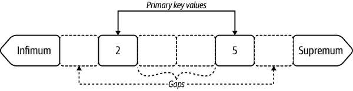
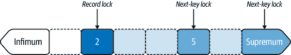
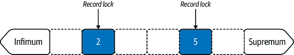
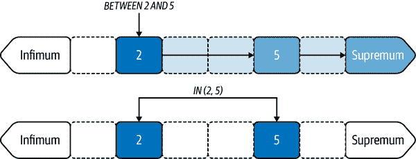
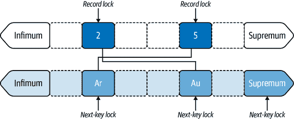
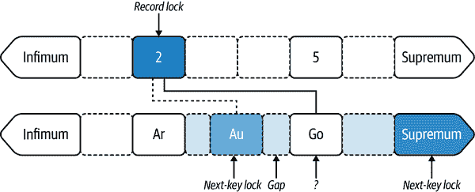
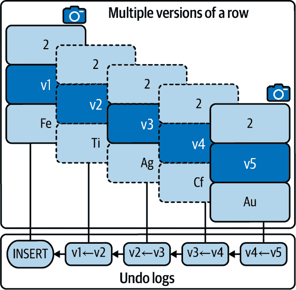

# 第八章：事务

MySQL 有非事务性存储引擎，如 MyISAM，但 InnoDB 是默认的和推定的标准。因此，实际上，每个 MySQL 查询默认情况下都在一个事务中执行，即使是单个`SELECT`语句也是如此。

###### 注意

如果您使用的是 Aria 或 MyRocks 等其他存储引擎，则本章不适用。但更可能的情况是，您正在使用 InnoDB，这种情况下：每个 MySQL 查询都是一个事务。

从我们作为工程师的角度来看，事务是概念性的：`BEGIN`，执行查询，然后`COMMIT`。然后我们信任 MySQL（和 InnoDB）来维护 ACID 特性：原子性、一致性、隔离性和持久性。当应用工作负载——查询、索引、数据和访问模式——优化良好时，事务在性能方面不成问题（当工作负载优化良好时，大多数数据库主题不成问题）。但在幕后，事务调用了一整套新的考虑因素，因为在维护性能的同时维护 ACID 特性并不容易。幸运的是，MySQL 在执行事务时表现出色。

与上一章节的复制延迟一样，事务内部工作超出了本书的范围，但理解一些基本概念对于避免把事务从 MySQL 的最低级别提升到工程师头脑的顶峰是至关重要的。稍微的理解可以避免许多问题。

本章讨论了 MySQL 事务，特别是避免常见问题。共有五个主要部分。第一个部分深入探讨了与事务隔离级别相关的行锁定。第二部分讨论了 InnoDB 如何在保证 ACID 特性的同时管理并发数据访问：MVCC 和撤消日志。第三部分描述了历史列表长度及其如何指示有问题的事务。第四部分列举了要避免的事务常见问题。第五部分则是探讨在 MySQL 中报告事务详细信息的一次冒险。

# 行锁定

读操作不会锁定行（除了`SELECT`…`FOR SHARE`和`SELECT`…`FOR UPDATE`），但写操作总是锁定行。这很简单和预期的，但棘手的问题是：哪些行必须被锁定？当然，正在写入的行必须被锁定。但在`REPEATABLE READ`事务中，InnoDB 可能锁定比其写入的行要多得多。本节说明并解释了为什么会这样。但首先，我们必须将术语转换为 InnoDB 数据锁定的俗语。

由于表格是索引（回想一下“InnoDB Tables Are Indexes”），行就是索引*记录*。InnoDB 行锁定讨论的是*记录锁*，而不是行锁定，因为存在索引记录间隙。*间隙*是两个索引记录之间的数值范围，如图 8-1 所示：一个主键有两个记录，两个伪记录（infimum 和 supremum），以及三个间隙。



###### 图 8-1\. 索引记录间隙

记录以实心正方形表示，其中包含索引值：在本例中为 2 和 5。伪记录以实心箭头表示在索引的每一端：*infimum*和*supremum*。每个 InnoDB B-tree 索引都有这两个伪记录：infimum 代表小于最小记录（本例中为 2）的所有索引值；supremum 代表大于最大记录（本例中为 5）的所有索引值。索引记录并不从 2 开始，也不在 5 结束；从技术上讲，它们从 infimum 和 supremum 开始和结束，本节的示例显示了这一细节的重要性。间隙以虚线正方形表示，没有索引值。如果主键是单个无符号四字节整数，则三个间隙为（区间表示）：

+   `[0, 2)`

+   `(2, 5)`

+   `(5, 4294967295]`

在讨论行锁时，术语*record*用于代替*row*，因为记录中存在间隙，但称行存在间隙可能会误导。例如，如果应用程序有两行的值分别为 2 和 5，则这并不意味着行之间存在 3 和 4 的间隙，因为这些值可能对应用程序无效。但是就索引而言，在记录值 2 和 5 之间，值 3 和 4 构成一个有效的记录间隙（假设是整数列）。简而言之：应用程序处理行，而 InnoDB 行锁处理记录。本节中的示例显示间隙锁意外地普遍存在，并且可以认为比单个记录锁更重要。

术语*data locks*指代所有类型的锁定。有许多种数据锁定，但是 Table 8-1 列出了基本的 InnoDB 数据锁。

Table 8-1\. 基本的 InnoDB 数据锁

| 锁类型 | 缩写 | 锁定间隙 | 锁定 |
| --- | --- | --- | --- |
| *Record lock* | `REC_NOT_GAP` |  | 锁定单个记录 |
| *Gap lock* | `GAP` | ✓ | 锁定记录之前（小于）的间隙 |
| *Next-key lock* |  | ✓ | 锁定单个记录及其之前的间隙 |
| *Insert intention lock* | `INSERT_INTENTION` |  | 允许在间隙中进行`INSERT`操作 |

理解基本的 InnoDB 数据锁最好的方法是通过真实的事务、真实的锁和插图。

###### 注意

从 MySQL 8.0.16 开始，可以使用性能模式表`data_locks`和`data_lock_waits`轻松检查数据锁。以下示例使用这些性能模式表。

在 MySQL 5.7 及更早版本中，您必须首先`SET GLOBAL innodb_status_output_locks=ON`，这需要`SUPER` MySQL 特权，然后执行`SHOW ENGINE INNODB STATUS`并浏览输出以找到相关的事务和锁定。这并不容易——即使是专家也难以仔细解析输出。由于 MySQL 5.7 不是当前版本，我在本节中没有使用其输出；但由于 MySQL 5.7 仍然广泛使用，请参考我的博客文章[“MySQL Data Locks: Mapping 8.0 to 5.7”](https://oreil.ly/pIAM6)以获取从 MySQL 5.7 到 MySQL 8.0 的数据锁输出映射的图解指南。

让我们重新使用经过验证的且实用的表`elem`，但简化如示例 8-1 所示。

##### 示例 8-1\. 简化后的表`elem`

```
CREATE TABLE `elem` (
  `id` int unsigned NOT NULL,
  `a`  char(2) NOT NULL,
  `b`  char(2) NOT NULL,
  `c`  char(2) NOT NULL,
  PRIMARY KEY (`id`),
  KEY `idx_a` (`a`)
) ENGINE=InnoDB;

+----+-----+----+----+
| id | a   | b  | c  |
+----+-----+----+----+
|  2 | Au  | Be | Co |
|  5 | Ar  | Br | C  |
+----+-----+----+----+
```

表`elem`与之前几乎相同，但现在非唯一索引`idx_a`仅涵盖列`a`，并且仅有两行，形成两个主键值，如前文图 8-1 所示。由于行锁实际上是索引记录锁，并且在列`b`和`c`上没有索引，您可以忽略这两列；它们仅用于完整性和对更简单章节的怀旧，例如第二章时，行锁只是行锁。

由于默认启用了[`autocommit`](https://oreil.ly/86J7d)，以下示例从`BEGIN`开始以启动显式事务。当事务结束时释放锁定；因此，事务保持活动状态——没有`COMMIT`或`ROLLBACK`——以检查 SQL 语句在`BEGIN`之后获取（或等待获取）的数据锁。每个示例结束时，通过查询表`per​for​m⁠ance_schema.data_locks`打印数据锁。

## 记录锁和下一个键锁

在默认事务隔离级别`REPEATABLE READ`下，使用主键更新表`elem`的行会获取四个数据锁：

```
BEGIN;
UPDATE elem SET c='' WHERE id BETWEEN 2 AND 5;

SELECT index_name, lock_type, lock_mode, lock_status, lock_data
FROM   performance_schema.data_locks
WHERE  object_name = 'elem';
```

```
+------------+-----------+---------------+-------------+-----------------------+
| index_name | lock_type | lock_mode     | lock_status | lock_data             |
+------------+-----------+---------------+-------------+-----------------------+
| NULL       | TABLE     | IX            | GRANTED     | NULL                  |
| PRIMARY    | RECORD    | X,REC_NOT_GAP | GRANTED     | 2                     |
| PRIMARY    | RECORD    | X             | GRANTED     | supremum pseudo-record|
| PRIMARY    | RECORD    | X             | GRANTED     | 5                     |
+------------+-----------+---------------+-------------+-----------------------+
```

在说明和解释这些数据锁之前，我将简要描述每一行的含义：

+   第一行是*表锁*，由`lock_type`列指示。InnoDB 是行级锁定存储引擎，但 MySQL 也需要表锁——请参阅“锁定时间”。每个查询事务引用的表都将有一个表锁。出于完整性考虑，我包括表锁，但我们专注于记录锁，因此忽略它们。

+   第二行是主键值为 2 的*记录锁*，如所有列所示。神秘的列是`lock_mode`：`X`表示独占锁（`S` [未显示] 表示共享锁），`REC_NOT_GAP`表示记录锁。

+   第三行是超穷记录上的*下一个键锁*。在`lock_mode`列中，孤立的`X`或`S`表示独占或共享下一个键锁，分别视为`X,NEXT_KEY`。

+   第四行是主键值为 5 的*下一个键锁*。再次，在`lock_mode`列中的孤立`X`表示独占下一个键锁。将其视为`X,NEXT_KEY`。

图 8-2 说明了这些数据锁的影响。



###### 图 8-2\. 主键上的记录锁和下一个键锁，`REPEATABLE READ`事务

锁定记录被阴影覆盖；未锁定的记录是白色的。主键值为 2 的记录由于其对应的行匹配了表条件：`id BETWEEN 2 AND 5`，因此被锁定并且阴影深色显示。

主键值为 5 的下一个键锁是中暗色阴影，其前的间隙则为轻微浅色阴影。这条记录被锁定，因为其对应的行符合表条件。这条记录前的间隙也被锁定，因为这是一个下一个键锁。这个间隙包括不存在的主键值 3 和 4（没有对应的行）。

类似地，至上伪记录的下一个键锁被中暗色阴影阴影，其前的间隙则为轻微浅色阴影。这个间隙包含所有大于 5 的主键值。有趣的问题是：为什么要锁定至上伪记录，它*包含*所有大于 5 的主键值，而表条件*排除*大于 5 的主键值？答案同样耐人寻味，但我必须推迟到“间隙锁”。

让我们确认这些间隙被锁定，通过尝试插入一行（使用另一个启用自动提交的事务）：

```
mysql> INSERT INTO elem VALUES (3, 'Au', 'B', 'C');
ERROR 1205 (HY000): Lock wait timeout exceeded; try restarting transaction

+------------+-----------+------------------------+-------------+-----------+
| index_name | lock_type | lock_mode              | lock_status | lock_data |
+------------+-----------+------------------------+-------------+-----------+
| PRIMARY    | RECORD    | X,GAP,INSERT_INTENTION | WAITING     | 5         |
....

mysql> INSERT INTO elem VALUES (6, 'Au', 'B', 'C');
ERROR 1205 (HY000): Lock wait timeout exceeded; try restarting transaction

+------------+-----------+--------------------+-------------+--------------- ----+
| index_name | lock_type | lock_mode          | lock_status | lock_data          |
+------------+-----------+--------------------+-------------+--------------------+
| PRIMARY    | RECORD    | X,INSERT_INTENTION | WAITING     | supremum pseudo... |
...
```

第一个 `INSERT` 因尝试在值为 2 和 5 之间的间隙上获取插入意图锁而超时，这是新值（3）将被插入的地方。虽然列 `lock_data` 列出值 5，但这条记录*未*被锁定，因为这不是记录或下一个键锁：它是插入意图锁，是一种特殊类型的间隙锁（用于 `INSERT`）；因此，它锁定了值 5 前的间隙。关于插入意图锁的更多信息，请参见“插入意图锁”。

第二个 `INSERT` 因尝试在至上伪记录上获取下一个键锁而超时，因为新值 6 大于当前最大值 5，因此它将被插入在最大记录和至上伪记录之间。

这些`INSERT`语句证明了 图 8-2 不是错误的：几乎整个索引被锁定，除了小于 2 的值。为什么 InnoDB 使用锁定间隙而不是记录锁呢？因为事务隔离级别是`REPEATABLE READ`，但这只是部分答案。完整的答案并不简单，请稍候。通过在影响的记录之前锁定间隙，next-key 锁定隔离了查询访问的整个记录范围，这是 ACID 中的*I*：隔离。这样可以防止后期事务读取先前未读取的行，称为[*幻影行*](https://oreil.ly/DYs9L)（或*幻读*）。新行是*幻影*，因为像幽灵一样神秘地出现。（*幻影*是 ANSI SQL-92 标准的实际术语。）幻影行违反了隔离原则，这就是为什么某些事务隔离级别禁止它们的原因。现在解释的真正神秘部分：ANSI SQL-92 标准允许在`REPEATABLE READ`中存在幻影行，但 InnoDB 使用 next-key 锁来阻止它们。但我们不要深入询问为什么 InnoDB 在`REPEATABLE READ`中阻止幻影行。了解原因并不改变事实，数据库服务器实现事务隔离级别通常与标准不同。^(1) 为了完整起见，了解 ANSI SQL-92 标准仅在最高事务隔离级别`SERIALIZABLE`中禁止幻影行。InnoDB 支持`SERIALIZABLE`，但本章未涵盖，因为它不常用。MySQL 中默认使用`REPEATABLE READ`，InnoDB 使用 next-key 锁来阻止`REPEATABLE READ`中的幻影行。

事务隔离级别`READ COMMITTED`禁用间隙锁定，包括 next-key 锁定。为了证明这一点，将事务隔离级别更改为`READ COMMITTED`：

```
SET TRANSACTION ISOLATION LEVEL READ COMMITTED;
BEGIN;
UPDATE elem SET c='' WHERE id BETWEEN 2 AND 5;

SELECT index_name, lock_type, lock_mode, lock_status, lock_data
FROM   performance_schema.data_locks
WHERE  object_name = 'elem';
+------------+-----------+---------------+-------------+-----------+
| index_name | lock_type | lock_mode     | lock_status | lock_data |
+------------+-----------+---------------+-------------+-----------+
| NULL       | TABLE     | IX            | GRANTED     | NULL      |
| PRIMARY    | RECORD    | X,REC_NOT_GAP | GRANTED     | 2         |
| PRIMARY    | RECORD    | X,REC_NOT_GAP | GRANTED     | 5         |
+------------+-----------+---------------+-------------+-----------+
```

###### 注

`SET TRANSACTION` 仅适用于接下来的一次事务。在下一次事务之后，后续的事务将使用默认的事务隔离级别。详情请参阅 [`SET TRANSACTION`](https://oreil.ly/46zcp)。

在`READ COMMITTED`事务中，相同的`UPDATE`语句仅对匹配的行获取记录锁，如 图 8-3 所示。



###### 图 8-3\. 主键上的记录锁，`READ COMMITTED`事务

为什么不使用`READ COMMITTED`？这个问题涉及访问模式特征（“事务隔离”）的应用程序特定性，甚至查询特定性。在事务中，`READ COMMITTED`有两个重要的副作用：

+   如果重新执行相同的读取语句，可能返回不同的行。

+   如果重新执行相同的写入语句，可能会影响不同的行。

这些副作用解释了为什么 InnoDB 不需要对读取使用一致性快照，也不需要对写入锁定间隙：`READ COMMITTED`允许事务在不同时间读取或写入不同记录（对已提交更改）。(“MVCC 和 Undo 日志”定义了*一致性快照*。)请仔细考虑这些副作用，以便于您的应用程序。如果您确信它们不会导致事务读取、写入或返回不正确的数据，那么`READ COMMITTED`会减少锁和撤消日志，从而有助于提高性能。

## 间隙锁

Gap locks are purely prohibitive: they prevent other transactions from inserting rows into the gap. That’s all they do.

多个事务可以锁定同一个间隙，因为所有间隙锁都与其他间隙锁兼容。但由于间隙锁阻止*其他*事务将行插入到间隙中，当只有一个事务锁定间隙时，只有一个事务可以将行插入到间隙中。对同一个间隙的两个或更多锁会阻止所有事务将行插入到间隙中。

间隙锁的目的很狭窄：阻止其他事务将行插入到间隙中。但间隙锁的创建范围很广：任何访问间隙的查询。即使读取空内容也可以创建一个阻止插入行的间隙锁：

```
BEGIN;
SELECT * FROM elem WHERE id = 3 FOR SHARE;

SELECT index_name, lock_type, lock_mode, lock_status, lock_data
FROM   performance_schema.data_locks
WHERE  object_name = 'elem';
+------------+-----------+-----------+-------------+-----------+
| index_name | lock_type | lock_mode | lock_status | lock_data |
+------------+-----------+-----------+-------------+-----------+
| NULL       | TABLE     | IS        | GRANTED     | NULL      |
| PRIMARY    | RECORD    | S,GAP     | GRANTED     | 5         |
+------------+-----------+-----------+-------------+-----------+
```

表面上看，这个`SELECT`似乎是无害的：在`REPEATABLE READ`中的`SELECT`使用一致性快照，并且`FOR SHARE`只创建共享锁，因此不会阻塞其他读操作。更重要的是，这个`SELECT`并不匹配任何行：表`elem`的主键值是 2 和 5，而不是 3。没有行，就没有锁——对吗？错了。通过使用`READ REPEATABLE`和`SELECT`…`FOR SHARE`访问间隙，您会召唤一个孤立的间隙锁：图 8-4。


###### 图 8-4\. 孤立间隙锁

我称之为*孤立*间隙锁，因为它不伴随下一个键锁或插入意图锁；它是独立存在的。所有间隙锁（共享或排他）都会阻止其他事务将行插入到间隙中。这个看似无害的`SELECT`语句实际上是一个阻止`INSERT`的恶意操作。间隙越大，阻碍越大，下一节将通过一个次要索引进行说明。

The easy creation of gap locks by any access to the gap is part of the answer to the intriguing question in “记录和下一个键锁”：为什么在表条件*排除*主键大于 5 的情况下，要锁定包括所有主键值大于 5 的超界伪记录？首先，让我把好奇心提升到最高点。这是原始查询及其数据锁：

```
BEGIN;
UPDATE elem SET c='' WHERE id BETWEEN 2 AND 5;

+------------+-----------+---------------+-------------+------------------------+
| index_name | lock_type | lock_mode     | lock_status | lock_data              |
+------------+-----------+---------------+-------------+------------------------+
| NULL       | TABLE     | IX            | GRANTED     | NULL                   |
| PRIMARY    | RECORD    | X,REC_NOT_GAP | GRANTED     | 2                      |
| PRIMARY    | RECORD    | X             | GRANTED     | supremum pseudo-record |
| PRIMARY    | RECORD    | X             | GRANTED     | 5                      |
+------------+-----------+---------------+-------------+------------------------+
```

现在，这里是相同的查询，但使用`IN`子句而不是`BETWEEN`子句：

```
BEGIN;
UPDATE elem SET c='' WHERE id IN (2, 5);

+------------+-----------+---------------+-------------+-----------+
| index_name | lock_type | lock_mode     | lock_status | lock_data |
+------------+-----------+---------------+-------------+-----------+
| NULL       | TABLE     | IX            | GRANTED     | NULL      |
| PRIMARY    | RECORD    | X,REC_NOT_GAP | GRANTED     | 2         |
| PRIMARY    | RECORD    | X,REC_NOT_GAP | GRANTED     | 5         |
+------------+-----------+---------------+-------------+-----------+
```

两个事务都是`REPEATABLE READ`，两个查询具有完全相同的 EXPLAIN 计划：主键的范围访问。这是什么魔法？图 8-5 显示了每个查询的情况。



###### 图 8-5\. `BETWEEN` 与 `IN` 的范围访问，`REPEATABLE READ` 事务

`BETWEEN` 的行访问如您所预期的那样：从 2 到 5 和之间的所有内容。简单地说，`BETWEEN` 的行访问顺序是：

1.  读取索引值为 2 的行

1.  行匹配：记录锁

1.  下一个索引值：5

1.  从 2 到 5 的间隙遍历

1.  读取索引值为 5 的行

1.  行匹配：下一键锁

1.  下一个索引值：最大值

1.  从 5 到最大值的间隙遍历

1.  索引结束：下一键锁

但 `IN` 的行访问顺序要简单得多：

1.  读取索引值为 2 的行

1.  行匹配：记录锁

1.  读取索引值为 5 的行

1.  行匹配：记录锁

尽管具有相同的 EXPLAIN 计划并匹配相同的行，但查询以不同的方式访问行。原始查询（`BETWEEN`）访问间隙，因此使用下一键锁来锁定间隙。新查询（`IN`）不访问间隙，因此使用记录锁。但不要误解：`IN` 子句并不排除间隙锁定。如果新查询表条件为 `IN (2, 3, 5)`，那么访问值 2 和 5 之间的间隙并导致间隙锁定（而不是下一键锁）：

```
BEGIN;
UPDATE elem SET c='' WHERE id IN (2, 3, 5);

+------------+-----------+---------------+-------------+-----------+
| index_name | lock_type | lock_mode     | lock_status | lock_data |
+------------+-----------+---------------+-------------+-----------+
| NULL       | TABLE     | IX            | GRANTED     | NULL      |
| PRIMARY    | RECORD    | X,REC_NOT_GAP | GRANTED     | 2         |
| PRIMARY    | RECORD    | X,REC_NOT_GAP | GRANTED     | 5         |
| PRIMARY    | RECORD    | X,GAP         | GRANTED     | 5         |
+------------+-----------+---------------+-------------+-----------+
```

你有一个单独的间隙锁：`X,GAP`。但请注意：在伪记录最大值上没有下一键锁，因为 `IN (2, 3, 5)` 不访问该间隙。注意间隙。

通过使用 `READ COMMITTED` 可轻松禁用间隙锁定。`READ COMMITTED` 事务不需要间隙锁（或下一键锁），因为间隙中的记录允许更改，并且每个查询在执行时访问最新的更改（已提交的行）。即使 `SELECT * FROM elem WHERE id = 3 FOR SHARE` 召唤的孤立间隙锁也被 `READ COMMITTED` 扫除。

## 二级索引

二级索引引入了关于行锁定的潜在广泛后果，特别是对于非唯一索引。回想一下简化表 `elem`（示例 8-1）在列 `a` 上有一个非唯一二级索引。考虑到这一点，让我们看看以下 `REPEATABLE READ` 事务中的 `UPDATE` 如何锁定二级索引和主键记录：

```
BEGIN;
UPDATE elem SET c='' WHERE a BETWEEN 'Ar' AND 'Au';

SELECT   index_name, lock_type, lock_mode, lock_status, lock_data
FROM     performance_schema.data_locks
WHERE    object_name = 'elem'
ORDER BY index_name;
+------------+-----------+---------------+-------------+------------------------+
| index_name | lock_type | lock_mode     | lock_status | lock_data              |
+------------+-----------+---------------+-------------+------------------------+
| NULL       | TABLE     | IX            | GRANTED     | NULL                   |
| a          | RECORD    | X             | GRANTED     | supremum pseudo-record |
| a          | RECORD    | X             | GRANTED     | 'Au', 2                |
| a          | RECORD    | X             | GRANTED     | 'Ar', 5                |
| PRIMARY    | RECORD    | X,REC_NOT_GAP | GRANTED     | 2                      |
| PRIMARY    | RECORD    | X,REC_NOT_GAP | GRANTED     | 5                      |
+------------+-----------+---------------+-------------+------------------------+
```

图 8-6 说明了这六条记录锁定：四条在二级索引上，两条在主键上。



###### 图 8-6\. 二级索引上的下一键锁，`REPEATABLE READ` 事务

`UPDATE` 只匹配两行，但锁定整个二级索引，这阻止了插入任何值。二级索引上的锁与 图 8-2 中的类似。但现在，在二级索引记录的第一个记录上有一个下一键锁：元组 `('Ar', 5)`，其中 5 是对应的主键值。这个下一键锁隔离了新重复的 “Ar” 值的范围。例如，它阻止插入排序在 `('Ar', 5)` 之前的元组 `('Ar', 1)`。

通常，InnoDB 不会锁定整个次要索引。在这些例子中只有两个索引记录（分别在主键和非唯一次要索引中）。但请回忆“极端选择性”：选择性越低，间隙越大。例如，如果一个非唯一索引在 10 万行中有 5 个均匀分布的唯一值，那么每行有 20000 条记录（100000 行/5 基数），或者每个间隙有 20000 条记录。

###### 提示

索引选择性越低，记录间隙越大。

`READ COMMITTED`避免了间隙锁定，即使是对于非唯一次要索引，因为只有匹配行会使用记录锁定。但让我们不要对自己太宽容；让我们继续检查 InnoDB 在非唯一次要索引上不同数据更改的数据锁定。

在上一节结束时，将`BETWEEN`子句更改为`IN`子句可避免间隙锁定，但在非唯一索引中不起作用。事实上，在这种情况下，InnoDB 会*添加*一个间隙锁：

```
BEGIN;
UPDATE elem SET c='' WHERE a IN ('Ar', 'Au');

SELECT   index_name, lock_type, lock_mode, lock_status, lock_data
FROM     performance_schema.data_locks
WHERE    object_name = 'elem'
ORDER BY index_name;
+------------+-----------+---------------+-------------+------------------------+
| index_name | lock_type | lock_mode     | lock_status | lock_data              |
+------------+-----------+---------------+-------------+------------------------+
| a          | RECORD    | X,GAP         | GRANTED     | 'Au', 2                |
...
```

我从输出中删除了原始数据锁（它们是相同的），以突出元组`('Au', 2)`上的新间隙锁。严格来说，这个间隙锁与同一元组上的下一个键锁重复，但这并不会导致错误的锁定或数据访问。因此，就让它存在吧，永远不要忘记：InnoDB 充满了奇迹和神秘。生活中少了这些，还有什么意思呢？

检查数据锁是很重要的，因为 InnoDB 充满了惊喜。尽管这一部分详细而细致，但它几乎在表面之下——InnoDB 的锁定是深奥的，深处隐藏着秘密。例如，如果将“Au”更改为“Go”，InnoDB 可能需要什么数据锁呢？让我们来检查这种变化的数据锁定：

```
BEGIN;
UPDATE elem SET a = 'Go' WHERE a = 'Au';

+------------+-----------+---------------+-------------+------------------------+
| index_name | lock_type | lock_mode     | lock_status | lock_data              |
+------------+-----------+---------------+-------------+------------------------+
| NULL       | TABLE     | IX            | GRANTED     | NULL                   |
| a          | RECORD    | X             | GRANTED     | supremum pseudo-record |
| a          | RECORD    | X             | GRANTED     | 'Au', 2                |
| a          | RECORD    | X,GAP         | GRANTED     | 'Go', 2                |
| PRIMARY    | RECORD    | X,REC_NOT_GAP | GRANTED     | 2                      |
+------------+-----------+---------------+-------------+------------------------+
```

图 8-7 可视化了这四个数据锁。



###### 图 8-7\. 更新非唯一次要索引值，`REPEATABLE READ`事务

“Au”值已经消失——更改为“Go”，但 InnoDB 仍然保持元组`('Au', 2)`的下一个键锁。新的“Go”没有记录锁或下一个键锁，只有在元组之前的间隙锁：`('Go', 2)`。那么是什么锁定了新的“Go”记录？这是某种`REPEATABLE READ`的副作用吗？让我们更改事务隔离级别并重新检查数据锁定：

```
SET TRANSACTION ISOLATION LEVEL READ COMMITTED;
BEGIN;
UPDATE elem SET a = 'Go' WHERE a = 'Au';

+------------+-----------+---------------+-------------+-----------+
| index_name | lock_type | lock_mode     | lock_status | lock_data |
+------------+-----------+---------------+-------------+-----------+
| NULL       | TABLE     | IX            | GRANTED     | NULL      |
| a          | RECORD    | X,REC_NOT_GAP | GRANTED     | 'Au', 2   |
| PRIMARY    | RECORD    | X,REC_NOT_GAP | GRANTED     | 2         |
+------------+-----------+---------------+-------------+-----------+
```

切换到`READ COMMITTED`会按预期禁用间隙锁定，但新的“Go”值的锁定——任何锁定——在哪里呢？“写入始终锁定行”，至少在“行锁定”开始时是这样说的。然而，InnoDB 对此写入未报告任何锁定……

如果我告诉你，InnoDB 如此优化，以至于可以在不锁定的情况下进行锁定呢？让我们使用插入意向锁，深入探索 InnoDB 锁定，并解决这个谜团。

## 插入意向锁

插入意向锁是一种特殊类型的间隙锁，表示当间隙未被其他事务锁定时，事务将向该间隙插入一行。只有间隙锁会阻止插入意向锁。（记住：*间隙锁* 包括 next-key 锁，因为后者是记录锁和间隙锁的组合。）插入意向锁与其他插入意向锁兼容（不会阻止）。这对于 `INSERT` 的性能非常重要，因为它允许多个事务同时向同一间隙插入不同的行。InnoDB 如何处理重复键？在演示插入意向锁的其他方面使答案更加清晰后，我会回答这个问题。

###### 提示

间隙锁 *阻止* `INSERT`。插入意向锁 *允许* `INSERT`。

插入意向锁有三个特殊之处：

+   插入意向锁不会锁定间隙，因为如术语 *意向* 所示，它们代表的是一个*未来*的动作：在*没有*其他事务持有间隙锁时插入一行。

+   只有当插入意向锁与其他事务持有的间隙锁冲突时，才会创建和报告插入意向锁；否则，插入意向锁不会由插入行的事务创建或报告。

+   如果创建了插入意向锁，它会被使用一次，并在授予后立即释放；但是 InnoDB 在事务完成之前会继续报告它。

在某种意义上，插入意向锁不是锁，因为它们不会阻塞访问。它们更像是 InnoDB 用来信号传递的等待条件，用于指示事务何时可以进行 `INSERT`。授予插入意向锁就是信号。但是如果一个事务不必等待，因为没有冲突的间隙锁，那么它就不会等待，并且你看不到插入意向锁，因为没有创建。

让我们看看插入意向锁的实际操作。首先锁定主键值为 2 和 5 之间的间隙；然后，在第二个事务中，尝试插入主键值为 3 的行：

```
-- First transaction
BEGIN;
UPDATE elem SET c='' WHERE id BETWEEN 2 AND 5;

-- Second transaction
BEGIN;
INSERT INTO elem VALUES (3, 'As', 'B', 'C');

+------------+-----------+------------------------+-------------+-----------+
| index_name | lock_type | lock_mode              | lock_status | lock_data |
+------------+-----------+------------------------+-------------+-----------+
| PRIMARY    | RECORD    | X,GAP,INSERT_INTENTION | WAITING     | 5         |
...
```

`lock_mode` 列中的 `X,GAP,INSERT_INTENTION` 是一个插入意向锁。当在最大记录值和超越伪记录之间的间隙进行锁定和插入时，它也被列为 `X,INSERT_INTENTION`（未显示）。

第一个事务在主键值为 5 之前锁定了间隙。该间隙锁阻止了第二个事务向间隙插入行，因此它创建了一个插入意向锁并等待。一旦第一个事务提交（或回滚），间隙解锁，插入意向锁被授予，第二个事务插入行：

```
-- First transaction
COMMIT;

-- Second transaction
-- INSERT executes

+------------+-----------+------------------------+-------------+-----------+
| index_name | lock_type | lock_mode              | lock_status | lock_data |
+------------+-----------+------------------------+-------------+-----------+
| NULL       | TABLE     | IX                     | GRANTED     | NULL      |
| PRIMARY    | RECORD    | X,GAP,INSERT_INTENTION | GRANTED     | 5         |
+------------+-----------+------------------------+-------------+-----------+
```

正如前面所述，InnoDB 继续报告插入意图锁，即使一旦授予，它只被使用一次并立即释放。因此，看起来像是间隙被锁定，但这是一个幻觉——InnoDB 用来引诱我们更深入的策略。你可以通过在主键值为 4 的间隙插入另一行来证明这是一个幻觉；它不会阻塞。为什么 InnoDB 继续报告一个实际上不存在的插入意图锁呢？少数凡人知晓，但这并不重要。超越幻觉，看到它*曾经*是什么：在过去，事务在插入行到间隙之前被阻塞。

为了完整性和深入了解 InnoDB 锁定的更深层次，特别是与插入意图锁相关的内容，这里是当`INSERT`在间隙锁上不阻塞时你所看到的情况：

```
BEGIN;
INSERT INTO elem VALUES (9, 'As', 'B', 'C'); -- Does not block

+------------+-----------+-----------+-------------+-----------+
| index_name | lock_type | lock_mode | lock_status | lock_data |
+------------+-----------+-----------+-------------+-----------+
| NULL       | TABLE     | IX        | GRANTED     | NULL      |
+------------+-----------+-----------+-------------+-----------+
```

根本没有记录锁。这就是插入意图锁在表面上的工作方式，但我们来到这里是为了深入研究 InnoDB 锁定，所以让我们通过提出导致我们到此的问题来更深入：为什么新插入行上没有记录（或下一个键）锁？这是前一节中同样的谜团：对新“Go”值没有锁。

这是秘密所在：InnoDB 拥有显式和隐式锁，并且只报告显式锁。[²] 显式锁存在于内存中的锁结构中；因此，InnoDB 可以报告它们。但隐式锁并不存在：没有锁结构；因此，InnoDB 没有什么可以报告的。

在前面的例子中，`INSERT INTO elem VALUES (9, 'As', 'B', 'C')`，新行的索引记录存在，但行未提交（因为事务尚未提交）。如果另一个事务尝试锁定该行，则会检测到三个条件：

+   行未提交。

+   该行属于另一个事务。

+   行并未显式锁定。

然后奇迹发生了：请求锁的事务——试图锁定记录的事务——代表创建记录的事务将隐式锁转换为显式锁。是的，这意味着一个事务为另一个事务创建了锁——但这并不让人困惑。由于请求锁的事务创建了它试图获取的锁，乍一看 InnoDB 似乎报告该事务正在等待它持有的锁——该事务被自己阻塞。有一种方法可以看穿这种幻觉，但我们已经深入得太多了。

我希望作为一个使用 MySQL 的工程师，你永远不需要深入到 InnoDB 锁定的这个深度，以实现 MySQL 的出色性能。但我带领我们来到这里有两个原因。首先，尽管有幻觉，但关于事务隔离级别的 InnoDB 行锁定的基础是可解的和适用的。现在你已经准备好处理每一个常见的 InnoDB 行锁定问题，甚至更多。其次，InnoDB 让我这样做是因为我盯着它看了太久；当一切模糊成一团时，我知道自己已经从悬崖上跌落，再也无法回头。不要问为什么它锁定了表条件范围之外的最高伪记录。不要问为什么它有冗余的间隙锁。不要问为什么它转换隐式锁。不要问；否则问题永远不会停止。继续前行；拯救自己。

# MVCC 和撤销日志

InnoDB 使用多版本并发控制（MVCC）和撤销日志来实现 ACID 的 *A*、*C* 和 *I* 特性。（为了实现 *D*，InnoDB 使用事务日志—参见“事务日志”。）*多版本并发控制* 意味着对行的更改会创建行的新版本。MVCC 不是 InnoDB 独有的；许多数据存储使用的是一种常见方法。当行首次创建时，它是版本 1。当它首次更新时，它是版本 2。MVCC 的基础是简单的，但很快变得更加复杂和有趣。

###### 注意

使用术语 *撤销日志* 是有意简化的，因为撤销日志的完整结构是复杂的。术语 *撤销日志* 足够精确，可以了解它的作用以及它如何影响性能。

*撤销日志* 记录如何回滚到先前行版本的更改。图 8-8 显示了一个具有五个版本和五个撤销日志的单行，这些撤销日志允许 MySQL 回滚到先前的行版本的更改。

那行回溯到“InnoDB 表是索引” 在第二章中：它是表 `elem` 中主键值为 2 的行，显示为主键叶节点。为简洁起见，我仅包括主键值（2）、行版本（v1 到 v5）和列 `a` 的值（v5 为“Au”）；其他两列，`b` 和 `c`，未显示。

版本 5（在 Figure 8-8 的右下角）是所有新事务将读取的当前行，但让我们从头开始。该行被创建为铁（“Fe”）：版本 1 在左上角。版本 1 有一个撤消日志，因为 `INSERT` 创建了行的第一个版本。然后修改了列 `a`（`UPDATE`）将铁更改为钛（“Ti”）：版本 2。创建版本 2 时，MySQL 还创建了一个撤消日志，记录如何撤销版本 2 的更改，从而恢复版本 1。（在下一段中，我会解释为什么版本 1 有坚实的轮廓 [和相机图标]，但版本 2 有虚线轮廓。）然后修改了列 `a` 将钛更改为银（“Ag”）：版本 3。MySQL 创建了一个撤消日志，记录如何撤销版本 3 的更改，并且这个撤消日志链接到之前的撤消日志，这样 MySQL 可以在需要时回滚和恢复版本 2。发生了另外两次行更新：银到锎（“Cf”）对应版本 4，锎到金（“Au”）对应版本 5。



###### Figure 8-8\. 一行有五个版本和五个撤消日志

###### Note

有两组撤消日志：*插入撤消日志* 用于 `INSERT` 和 *更新撤消日志* 用于 `UPDATE` 和 `DELETE`。为简单起见，我只提到撤消日志，它包括这两组。

Version 1 因为一个活跃的事务（未显示）在数据库历史的这一点上保持了一致的快照，所以具有坚实的轮廓和相机图标。让我解释一下这句话。InnoDB 支持四种[事务隔离级别](https://oreil.ly/xH5Gs)，但通常仅使用两种：`REPEATABLE READ`（默认）和 `READ COMMITTED`。

在 `REPEATABLE READ` 事务中，第一次读取建立了一个*一致性快照*（或简称*快照*）：数据库（所有表）在执行 `SELECT` 时的虚拟视图。快照保持到事务结束，并且所有后续读取都使用这个快照来访问数据库历史的这一点上的行。在这一点之后其他事务所做的更改在原始事务内部是不可见的。假设其他事务正在修改数据库，则原始事务的快照变成越来越旧的数据库视图，而事务仍然活动（未 `COMMIT` 或 `ROLLBACK`）。就像原始事务卡在 1980 年代一样，它唯一听的音乐家是 Pat Benatar、Stevie Nicks 和 Taylor Dayne：老但仍然很棒。

由于版本 5 是当前行，新事务会从其在数据库历史中的点建立快照，这就是它具有坚实轮廓和相机图标的原因。重要的问题是：为什么版本 2、3 和 4 仍然存在，当它们在数据库历史中的各自点上没有事务持有快照？它们存在是为了维护版本 1 的快照，因为 MySQL 使用撤消日志来重建旧的行版本。

###### Tip

MySQL 使用撤销日志来重建快照的旧行版本。

可以轻松重建 图 8-8。首先，在 图 8-8 中插入行后，立即启动事务并通过执行 `SELECT` 语句在行版本 1 上建立快照：

```
BEGIN;

SELECT a FROM elem WHERE id = 2;

-- Returns row version 1: 'Fe'
```

由于没有 `COMMIT`，因此该事务仍处于活动状态，并保持其对整个数据库的快照，即在本示例中简单地是行版本 1。我们称之为 *原始事务*。

然后更新行四次以创建版本 5：

```
-- autocommit enabled
UPDATE elem SET a = 'Ti' WHERE id = 2;
UPDATE elem SET a = 'Ag' WHERE id = 2;
UPDATE elem SET a = 'Cf' WHERE id = 2;
UPDATE elem SET a = 'Au' WHERE id = 2;
```

在 MySQL 中，默认情况下启用了 [`autocommit`](https://oreil.ly/nG8wa)，这就是为什么第一个（活动的）事务需要显式的 `BEGIN`，但四个 `UPDATE` 语句不需要。现在 MySQL 处于 图 8-8 表示的状态。

如果原始事务再次执行 `SELECT a FROM elem WHERE id = 2`，它将读取版本 5（这不是打字错误），但（比喻地）看到该版本比其快照建立的数据库历史点更新。因此，MySQL 使用撤销日志回滚该行并重建版本 1，这与第一个 `SELECT` 语句建立的快照一致。当原始事务提交，并且假设没有其他活动事务保持旧的快照时，MySQL 可以清除所有相关的撤销日志，因为新的事务始终从当前行版本开始。当事务正常工作时，整个过程对性能没有影响。但你已经知道：问题事务可能会对整个过程的性能产生负面影响。“常见问题” 将详细探讨原因和如何解决；但在此之前，还有更多关于 MVCC 和撤销日志的细节需要了解。

在 `READ COMMITTED` 事务中，每次读取都会建立一个新的快照。因此，每次读取都会访问最新提交的行版本，因此称为 `READ COMMITTED`。由于使用了快照，因此仍会创建撤销日志，但在 `READ COMMITTED` 中几乎从不成为问题，因为每个快照仅在读取期间保持。如果读取时间很长 *且* 数据库上存在重要的写入吞吐量，可能会注意到重做日志的累积（作为历史列表长度的增加）。否则，`READ COMMITTED` 几乎不涉及撤销日志。

快照只影响读取（`SELECT`）操作，从不影响写入。写入操作始终会秘密地读取当前行，即使事务通过`SELECT`无法“看见”它们。这种双重视角避免了混乱。例如，假设另一个事务插入了主键值为 11 的新行。如果原始事务试图插入相同主键值的行，MySQL 将返回重复键值的错误，因为主键值已经存在，即使通过`SELECT`事务看不到它。此外，快照非常一致：在事务中，无法将快照前进到数据库历史的新点。如果执行事务的应用程序需要更新的快照，则必须提交事务并启动新事务以建立新快照。

写入生成的撤消日志会保留到事务结束——无论事务隔离级别如何。到目前为止，我已经重点介绍了撤消日志，关于为快照重建旧行版本，但它们也在`ROLLBACK`时用于恢复写入造成的更改。

关于 MVCC 的最后一点需要知道的是：撤消日志保存在 InnoDB 缓冲池中。你可能还记得“页面刷新”中提到，“*杂项页*包含本书未涵盖的各种内部数据。”杂项页包括撤消日志（以及许多其他内部数据结构）。由于撤消日志驻留在缓冲池页面中，它们使用内存，并定期刷新到磁盘中。

与撤消日志相关的系统变量和度量有几个；作为使用 MySQL 的工程师，你只需要了解和监控其中一个：HLL，首次引入于“历史列表长度（度量）”，并在下一节进一步解释。除此之外，只要应用程序避免所有“常见问题”，MVCC 和撤消日志的工作都很完美。其中一个问题是未完成的事务，因此让我们通过提交原始事务来避免这种情况：

```
COMMIT;
```

再见，一致性快照。再见，撤消日志。你好，历史列表长度……

# 历史列表长度

历史列表长度（HLL）衡量未清除或未刷新的旧行版本数量。

历史上（没有捉弄），HLL 很难定义，因为撤消日志的完整结构很复杂：

```
Rollback segments
└── Undo slots
    └── Undo log segments
        └── Undo logs
            └── Undo log records
```

这种复杂性掩盖了撤消日志和 HLL 之间的任何简单关系，包括度量单位。HLL 最简单的功能单位（尽管不是技术上正确的）是*更改*。如果 HLL 值为 10,000，那么可以理解为 10,000 次更改。通过理解“MVCC 和撤消日志”，你会知道更改保留在内存中（而不是刷新）以重建旧行版本。因此，可以准确地说 HLL 衡量了未清除或未刷新的旧行版本数量。

HLL 大于 100,000 是一个问题——不要忽视它。即使对于 MySQL 专家来说，HLL 的真正技术性质也是难以捉摸的，但其实用性显而易见：HLL 是事务相关问题的先驱。始终监控 HLL（参见 “历史列表长度（指标）”），当其过高（大于 100,000）时发出警报，并修复这个问题，这无疑是下一节讨论的常见问题之一。

尽管我在 “野鹅追逐（阈值）” 中警告不要在阈值上进行警报，但 HLL 是一个例外：当 HLL 大于 100,000 时进行警报是可靠且可操作的。

###### 提示

对于 HLL 大于 100,000 进行警报。

理论上，HLL 有一个最大值，但在这个值之前 MySQL 的性能肯定会崩溃。^(3) 例如，就在我写作这段文字的几周前，一个在云中的 MySQL 实例在达到 HLL 200,000 后崩溃，导致一个长时间运行的事务积累四个小时才崩溃 MySQL，并导致两小时的故障。

由于撤销日志非常高效，因此在 HLL 的值使得 MySQL 的性能降低或者最坏情况下会崩溃之前，HLL 有很大的余地。我见过 MySQL 在 200,000 时崩溃，但也见过它在远超过 200,000 时表现良好。有一点是肯定的：如果 HLL 持续增加，*将* 会造成问题：要么是明显的性能下降，要么是 MySQL 崩溃。

我希望你成为历史上第一个使用 MySQL 却从未遇到 HLL 问题的工程师。这是一个远大的目标，但我鼓励你去追求。为此，我故意向 MySQL 实例灌输大量的 `UPDATE` 语句以增加 HLL——积累数千个旧行版本。表 8-2 显示了在活动的 `REPEATABLE READ` 事务中针对单个行点选择 `SELECT * FROM elem WHERE id=5` 的 HLL 对查询响应时间的影响。

表 8-2\. HLL 对查询响应时间的影响

| HLL | 响应时间（ms） | 基线增加（%） |
| --- | --- | --- |
| 0 | 0.200 ms |  |
| 495 | 0.612 ms | 206% |
| 1,089 | 1.012 ms | 406% |
| 2,079 | 1.841 ms | 821% |
| 5,056 | 3.673 ms | 1,737% |
| 11,546 | 8.527 ms | 4,164% |

此示例并*不*意味着 HLL 会像显示的那样增加查询响应时间；它只证明了 HLL 可以增加查询响应时间。从 “MVCC 和撤销日志” 及本节，你知道原因：活动的 `REPEATABLE READ` 事务中的 `SELECT` 对行 5（`id=5`）有一致的快照，但对该行的 `UPDATE` 语句生成新的行版本。每次执行 `SELECT`，它都会通过撤销日志来重构原始行版本的一致快照，这种工作增加了查询响应时间。

增加查询响应时间已经足够证明，但作为专业人士，让我们以无可辩驳的方式证明它。在“MVCC 和 Undo 日志”的结尾，我提到 Undo 日志存储为 InnoDB 缓冲池中的页。因此，`SELECT`应该访问大量页面。为了证明这一点，我使用[Percona Server](https://oreil.ly/OWUYR)，因为它增强了慢查询日志，在配置`log_slow_verbosity = innodb`时打印访问的不同页面数量：

```
# Query_time: 0.008527
# InnoDB_pages_distinct: 366
```

通常，这个例子中的`SELECT`只访问一个页面来查找一个主键行。但是当`SELECT`的一致性快照过时（并且 HLL 很大）时，InnoDB 会通过数百个撤消日志页面来重建旧行。

MVCC、撤消日志和 HLL 都是正常且良好的权衡：一点性能换取大量并发性。只有当 HLL 异常大——超过 100,000 个时，您应该采取措施来修复原因，这几乎普遍是以下常见问题之一。

# 常见问题

事务问题源于构成事务的查询，应用程序执行这些查询的速度以及应用程序提交事务的速度。虽然启用[`autocommit`](https://oreil.ly/oQtD2)的单个查询在技术上是可能导致以下问题的事务（除了“废弃事务”），但主要关注的是以`BEGIN`（或`START TRANSACTION`）开头的多语句事务，执行几个查询，然后以`COMMIT`（或`ROLLBACK`）结束。多语句事务的性能影响可能大于构成事务的部分——因为锁和撤消日志在事务提交（或回滚）之前都被保持。记住：MySQL 非常有耐心——几乎太有耐心了。如果应用程序不提交事务，MySQL 甚至会等待直到这个活动事务的后果。

幸运的是，这些问题都不难检测或修复。HLL 是大多数事务问题的前兆，这就是为什么你应该始终监控它：参见“历史列表长度（度量）”和“历史列表长度”。为了保持每个问题的细节清晰，我解释了如何查找和报告有问题的事务在“报告”。

## 大事务（事务大小）

一个大型事务修改了大量行数。什么是*大量*？这是相对的，但工程师总是能看得出来。例如，如果你看到一个事务修改了 25 万行，而且你知道整个数据库只有 50 万行，那就是大量（或者至少是一个可疑的访问模式：参见“结果集”）。

###### 注意

通常，*事务大小* 指修改的行数：修改的行数越多，事务就越大。对于[MySQL Group Replication](https://oreil.ly/wH10S)，*事务大小* 有略微不同的含义：请参阅 MySQL 手册中的[“Group Replication Limitations”](https://oreil.ly/cJhWF)。

如果事务在默认隔离级别`REPEATABLE READ`中运行，则可以安全地假设由于间隙锁定，它已锁定了比修改的行数更多的记录，如“Row Locking”所述。如果事务在`READ COMMITTED`隔离级别中运行，则只为每个修改的行获取记录锁定。无论哪种方式，大事务都是锁争用的主要来源，可以严重降低写入吞吐量和响应时间。

不要忘记复制（参见第七章）：大事务是复制滞后的主要原因之一（参见“Transaction Throughput”），并且降低了多线程复制的效率（参见“Reducing Lag: Multithreaded Replication”）。

大事务在提交（或回滚）时可能明显变慢，正如之前在“MVCC and the Undo Logs”，“Binary Log Events”，以及 Figure 6-7 中所提到的。修改行数据很快很容易，因为数据变更发生在内存中，但提交时 MySQL 会进行大量工作以保持和复制数据变更。

更小的事务更好。多小？这也是相对的，因为正如我刚才提到的，事务在提交时会有一个大量的工作，这意味着你必须校准几个子系统。（当你考虑到云时，事情会更复杂，因为云倾向于限制和微调诸如 IOPS 之类的细节。）除了需要校准批量操作的批处理大小（参见“Batch Size”）之外，通常不需要校准事务大小，因为尽管这个问题很常见，但通常是一次性的问题：找到、修复并且暂时不会再次出现。“Reporting”向你展示如何找到大事务。

解决方法是找出在事务中修改了过多行的查询（或查询），并将其修改为修改更少行数的方式。但这完全取决于查询本身，在应用程序中的目的以及为何修改了太多行。不管原因如何，第一章至第四章会让你理解和修复这个查询问题。

最后，如果你严格遵循最少数据原则（参见“Principle of Least Data”），事务大小可能永远不会成为问题。

## 长时间运行的事务

长时间运行的事务需要太长时间才能完成（提交或回滚）。多长时间算是*太长*？这取决于：

+   对于应用程序或用户来说，时间过长是不可接受的。

+   事务长度过长（可能引起争用问题）可能会影响其他事务。

+   足以引起历史列表长度警报

除非您主动解决性能问题，否则第二点和第三点更有可能引起您对长时间运行事务的关注。

假设应用程序在查询之间不等待（这是下一个问题：“挂起事务”），长时间运行的事务有两个原因：

+   构成事务的查询速度太慢。

+   应用程序在事务中执行的查询太多。

你可以通过 第一章 到 第五章 中的技术来修复第一个原因。请记住：事务中所有查询的撤消日志和行锁都会一直保留，直到事务提交。好处是，通过优化慢查询来修复长时间运行的事务具有副作用好处：单个查询更快*且*整个事务更快，这可以增加整体事务吞吐量。缺点是，长时间运行的事务可能对应用程序来说速度足够快，但对其他事务来说太长。例如，假设一个事务执行需要一秒钟，这对应用程序来说还可以接受，但在这一秒钟内，它占用了另一个更快事务所需的行锁。这会导致一个棘手的问题，因为快速事务可能在生产环境中运行缓慢，但在实验室（例如您的笔记本电脑上）分析时却运行得很快。当然，不同之处在于生产中的事务并发和争用在实验室中大部分或完全不存在。在这种情况下，您必须调试数据锁竞争问题，这并不容易，其中最小的问题之一是数据锁是瞬息的。请参阅表 8-1 后面的注释，并与您的 DBA 或 MySQL 专家讨论。

你可以通过修改应用程序在事务中执行的查询来修复第二个原因。当应用程序尝试执行批量操作或在事务内部程序化地生成查询而没有限制查询数量时会发生这种情况。无论哪种方式，解决方法都是减少或限制事务中的查询数量。即使事务不是长时间运行的，这也是一种最佳实践，可以确保它不会意外地变得长时间运行。例如，也许当应用程序是新的时候，每个事务只插入 5 行数据；但多年后，当应用程序有数百万用户时，每个事务插入 500 行数据，因为从一开始就没有设定限制。

“报告” 展示了如何找到长时间运行的事务。

## 挂起事务

挂起事务在`BEGIN`之后、查询之间或`COMMIT`之前等待时间太长。挂起事务很可能是长时间运行的事务，但原因不同：等待查询之间的时间（挂起），而不是等待查询完成的时间（长时间运行）。

###### 注意

在实践中，一个停滞的事务看起来像一个长时间运行的事务，因为最终结果是一样的：事务响应时间缓慢。需要分析事务以确定响应时间是由于停滞还是慢查询。在没有进行分析的情况下，工程师（和 MySQL 专家）通常将任何缓慢的事务称为长时间运行的事务。

当然，查询之间总会有一些等待时间（至少由于发送查询和接收结果集所需的网络延迟），但如同前两个问题一样，当您看到停滞的事务时，您将知道这是一个停滞的事务。用比喻说：整体远大于其各部分之和。从技术角度来说：从`BEGIN`到`COMMIT`的事务响应时间远大于查询响应时间之和。

由于停滞的事务在查询之间等待（包括`BEGIN`之后和`COMMIT`之前），MySQL 不应负责：等待是由应用程序引起的，原因多种多样。一个常见的原因是在事务活动期间执行耗时的应用程序逻辑，而不是在事务之前或之后执行。但有时这是无法避免的；考虑以下示例：

```
BEGIN;
SELECT <row>
--
-- Time-consuming application logic based on the row
--
UPDATE <row>
COMMIT;
```

在这种情况下的解决方案取决于应用程序逻辑。我首先会问最基本的问题：这些查询是否需要成为一个事务？在读取后和更新前行是否会改变？如果行发生变化，是否会破坏逻辑？如果没有其他办法，是否可以使用`READ COMMITTED`隔离级别来禁用间隙锁定？工程师很聪明，能找到解决这类问题的方法；首先找到它们是第一步，这在“Reporting”中有所涵盖。

## 被废弃的事务

被废弃的事务是没有活动客户端连接的活动事务。被废弃的事务有两个主要原因：

+   应用程序连接泄漏

+   半关闭的连接

应用程序中的一个 bug 可能会泄漏数据库连接（就像泄漏内存或线程一样）：代码级别的连接对象超出作用域，因此不再使用，但其他代码仍在引用它，因此既未关闭也未释放（可能导致小内存泄漏）。除了应用程序级别的性能分析、调试或泄漏检测来直接验证这个 bug 外，如果重新启动应用程序可以修复（关闭）被废弃的事务，也可以间接验证它。在 MySQL 中，您可以查看可能被废弃的事务（如“Reporting”所示），但您无法在 MySQL 中验证这个 bug，因为 MySQL 不知道连接已被废弃。

在正常情况下，半关闭的连接不会发生，因为 MySQL 在客户端连接因 MySQL 或操作系统可检测的任何原因关闭时会回滚事务。但在 MySQL 和操作系统之外的问题可能会导致客户端连接关闭而未关闭 MySQL 端，这就是所谓的*半关闭*连接。MySQL 特别容易发生半关闭连接，因为它的网络协议几乎完全是命令和响应的形式：客户端发送命令，MySQL 发送响应。（如果你好奇的话，客户端通过[`COM_QUERY`](https://oreil.ly/I4RjE)数据包向 MySQL 发送查询。）在命令和响应之间，客户端和 MySQL 保持完全静默——没有任何字节被传输。尽管听起来很安静，但这意味着半关闭连接直到等待[`wait_timeout`](https://oreil.ly/zP2bf)秒过去才被注意到，默认值为 28,800 秒（8 小时）。

无论是应用程序缺陷导致的连接泄漏，还是被误认为是冥想网络静默的半关闭连接，结果都是一样的，如果这两者发生在事务处于活跃状态（未提交状态）时：事务保持活跃。任何一致的快照或数据锁也会保持活跃，因为 MySQL 不知道事务已被放弃。

说实话，MySQL 喜欢这种宁静；我也一样。但我们是为了工作而被付费的，因此让我们看看如何找到并报告所有四种事务问题。

# 报告

[MySQL 性能模式](https://oreil.ly/fgU04)使得详细的事务报告成为可能；但截至本文撰写时，尚无能简化此过程的工具。我希望能告诉你使用现有的开源工具，但实际上并没有。以下 SQL 语句代表了当前的最新技术水平。一旦有新技术出现，我会在[MySQL 事务报告](https://hackmysql.com/trx)通知你。在那之前，我们还是老老实实地*复制粘贴*吧。

## 活跃事务：最新

示例 8-2 中的 SQL 语句报告了所有运行时间超过 1 秒的活跃事务的最新查询。该报告回答了以下问题：哪些事务运行时间较长，它们当前在做什么？

##### 示例 8-2\. 报告运行时间超过 1 秒的活跃事务的最新查询

```
SELECT
  ROUND(trx.timer_wait/1000000000000,3) AS trx_runtime,
  trx.thread_id AS thread_id,
  trx.event_id AS trx_event_id,
  trx.isolation_level,
  trx.autocommit,
  stm.current_schema AS db,
  stm.sql_text AS query,
  stm.rows_examined AS rows_examined,
  stm.rows_affected AS rows_affected,
  stm.rows_sent AS rows_sent,
  IF(stm.end_event_id IS NULL, 'running', 'done') AS exec_state,
  ROUND(stm.timer_wait/1000000000000,3) AS exec_time
FROM
       performance_schema.events_transactions_current trx
  JOIN performance_schema.events_statements_current   stm USING (thread_id)
WHERE
      trx.state = 'ACTIVE'
  AND trx.timer_wait > 1000000000000 * 1\G
```

要增加时间，请更改`\G`之前的数字 1。性能模式计时器使用皮秒，所以`1000000000000 * 1`就是一秒。

示例 8-2 的输出如下所示：

```
*************************** 1\. row ***************************
    trx_runtime: 20729.094
      thread_id: 60
   trx_event_id: 1137
isolation_level: REPEATABLE READ
     autocommit: NO
             db: test
          query: SELECT * FROM elem
  rows_examined: 10
  rows_affected: 0
      rows_sent: 10
     exec_state: done
      exec_time: 0.038
```

以下是关于示例 8-2 字段（列）的更多信息：

`trx_runtime`

事务已运行的时间（活跃时间）以毫秒精度计算。例如，这个事务我忘记了，所以在示例中已经运行了近六个小时。

`thread_id`

执行事务的客户连接的线程 ID。这在“活动事务：历史”中使用。性能模式事件使用线程 ID 和事件 ID 来链接数据到客户连接和事件，线程 ID 不同于 MySQL 其他部分常见的进程 ID。

`trx_event_id`

事务事件 ID。这在“活动事务：历史”中使用。

`isolation_level`

事务隔离级别：`READ REPEATABLE`或`READ COMMITTED`。（另外两个隔离级别，`SERIALIZABLE`和`READ UNCOMMITTED`，很少使用；如果您看到它们，可能是应用程序错误。）回想一下“行锁定”：事务隔离级别影响行锁定以及`SELECT`是否使用一致性快照。

`autocommit`

如果`YES`，则`autocommit`已启用且是单语句事务。如果`NO`，则事务是通过`BEGIN`（或`START TRANSACTION`）启动的，很可能是多语句事务。

`db`

`query`的当前数据库。当前数据库意味着`USE db`。查询可以使用数据库限定的表名访问其他数据库，例如`db.table`。

`query`

事务中执行或正在执行的最新查询。如果`exec_state = running`，则`query`当前正在事务中执行。如果`exec_state = done`，则`query`是事务执行的最后一个查询。在这两种情况下，事务是活动的（未提交），但在后一种情况下，它在执行查询方面是空闲的。

`rows_examined`

`query`查询的总行数。这不包括事务中执行的过去查询。

`rows_examined`

`query`修改的总行数。这不包括事务中执行的过去查询。

`rows_sent`

`query`发送的总行数（结果集）。这不包括事务中执行的过去查询。

`exec_state`

如果`done`，则事务在执行查询方面处于空闲状态，并且`query`是它执行的最后一个查询。如果`running`，则事务当前正在执行`query`。在这两种情况下，事务是活动的（未提交）。

`exec_time`

`query`以秒为单位的执行时间（毫秒精度）。

性能模式表`events_transactions_current`和`events_statements_current`包含更多字段，但此报告仅选择关键字段。

此报告是一个真正的工作马，因为它可以揭示所有四个“常见问题”：

大事务

查看`rows_affected`（修改的行数）和`rows_sent`以查看事务大小（按行计算）。尝试添加条件，如`trx.rows_affected > 1000`。

长时间运行的事务

调整条件`trx.timer_wait > 1000000000000 * 1`的末尾`1`以过滤长时间运行的查询。

挂起的事务

如果`exec_state = done`并且保持这种状态一段时间，则交易停滞。由于此报告仅列出活跃交易的最新查询，查询应快速更改—`exec_state = done`应是短暂的。

被丢弃的交易

如果`exec_state = done`长时间保持不变，则可能是交易被丢弃，因为提交后不再报告。

此报告的输出应该是不稳定的，因为活跃交易应该是短暂的。如果它报告了一个长时间足以让你多次看到它的交易，则该交易可能展示了“常见问题”之一。在这种情况下，使用其`thread_id`和`statement_event_id`（如“活跃交易：历史”中所述）来报告其历史—过去的查询—这有助于揭示交易存在问题的原因。

## 活跃交易：总结

示例 8-3 中的 SQL 语句报告了所有活跃时间超过 1 秒的交易执行的查询摘要。此报告回答了一个问题：哪些交易运行时间长且做了多少工作？

##### 示例 8-3\. 报告交易总结

```
SELECT
  trx.thread_id AS thread_id,
  MAX(trx.event_id) AS trx_event_id,
  MAX(ROUND(trx.timer_wait/1000000000000,3)) AS trx_runtime,
  SUM(ROUND(stm.timer_wait/1000000000000,3)) AS exec_time,
  SUM(stm.rows_examined) AS rows_examined,
  SUM(stm.rows_affected) AS rows_affected,
  SUM(stm.rows_sent) AS rows_sent
FROM
       performance_schema.events_transactions_current trx
  JOIN performance_schema.events_statements_history   stm
    ON stm.thread_id = trx.thread_id AND stm.nesting_event_id = trx.event_id
WHERE
      stm.event_name LIKE 'statement/sql/%'
  AND trx.state = 'ACTIVE'
  AND trx.timer_wait > 1000000000000 * 1
GROUP BY trx.thread_id\G
```

要增加时间，请更改`\G`之前的 1。字段与“活跃交易：最新”中的相同，但此报告对每个交易聚合过去的查询。一个停滞的交易（当前未执行查询）可能在过去做了大量工作，这在此报告中会显示出来。

###### 注意

查询完成后，它会被记录在表`performance_schema.events_statements_history`中，但也会保留在表`performance_schema.events_statements_current`中。因此，报告仅包括已完成的查询，并且不应与后者表连接，除非筛选掉活跃查询。

此报告更适合查找大型交易—“大型交易（交易大小）”—因为它包括过去的查询。

## 活跃交易：历史

示例 8-4 中的 SQL 语句报告了单个交易执行的查询历史。此报告回答了一个问题：每个查询交易做了多少工作？你必须用来自示例 8-2 输出的`thread_id`和`trx_event_id`值替换零。

##### 示例 8-4\. 报告交易历史

```
SELECT
  stm.rows_examined AS rows_examined,
  stm.rows_affected AS rows_affected,
  stm.rows_sent AS rows_sent,
  ROUND(stm.timer_wait/1000000000000,3) AS exec_time,
  stm.sql_text AS query
FROM
  performance_schema.events_statements_history stm
WHERE
       stm.thread_id = 0
  AND  stm.nesting_event_id = 0
ORDER BY stm.event_id;
```

将零替换为来自示例 8-2 输出的值：

+   将`stm.thread_id = 0`中的零替换为`thread_id`。

+   将`stm.nesting_event_id = 0`中的零替换为`trx_event_id`。

示例 8-4 的输出看起来像：

```
+---------------+---------------+-----------+-----------+---------------------+
| rows_examined | rows_affected | rows_sent | exec_time | query               |
+---------------+---------------+-----------+-----------+---------------------+
|            10 |             0 |        10 |     0.000 | SELECT * FROM elem  |
|             2 |             1 |         0 |     0.003 | UPDATE elem SET ... |
|             0 |             0 |         0 |     0.002 | COMMIT              |
+---------------+---------------+-----------+-----------+---------------------+
```

除了开始事务的`BEGIN`之外，这个事务执行了两个查询，然后`COMMIT`。第一个查询是`SELECT`，第二个查询是`UPDATE`。这不是一个引人入胜的例子，但它展示了事务的查询执行历史，以及基本的查询指标。在调试有问题的事务时，历史记录是非常宝贵的，因为你可以看到哪些查询速度慢（`exec_time`）或者大（行数），以及应用程序停滞的时刻（当你知道事务将执行更多查询时）。

## 已提交的事务：总结

前三个报告是关于活动事务的，但已提交的事务也很有启发性。示例 8-5 中的 SQL 语句报告了已提交（完成）事务的基本指标。这就像是事务的慢查询日志。

##### 示例 8-5\. 报告已提交事务的基本指标

```
SELECT
  ROUND(MAX(trx.timer_wait)/1000000000,3) AS trx_time,
  ROUND(SUM(stm.timer_end-stm.timer_start)/1000000000,3) AS query_time,
  ROUND((MAX(trx.timer_wait)-SUM(stm.timer_end-stm.timer_start))/1000000000, 3)
    AS idle_time,
  COUNT(stm.event_id)-1 AS query_count,
  SUM(stm.rows_examined) AS rows_examined,
  SUM(stm.rows_affected) AS rows_affected,
  SUM(stm.rows_sent) AS rows_sent
FROM
      performance_schema.events_transactions_history trx
 JOIN performance_schema.events_statements_history   stm
   ON stm.nesting_event_id = trx.event_id
WHERE
      trx.state = 'COMMITTED'
  AND trx.nesting_event_id IS NOT NULL
GROUP BY
  trx.thread_id, trx.event_id;
```

示例 8-5 的字段包括：

`trx_time`

总事务时间，以毫秒为单位，微秒精度。

`query_time`

总查询执行时间，以毫秒为单位，微秒精度。

`idle_time`

事务时间减去查询时间，以毫秒为单位，微秒精度。空闲时间指示应用程序在执行事务中执行查询时的停滞时间。

`query_count`

事务中执行的查询数量。

`rows_*`

所有执行的事务中检查、影响和发送的行的总数（分别）。

示例 8-5 的输出如下所示：

```
+----------+----------+-----------+---------+-----------+-----------+-----------+
| trx_time | qry_time | idle_time | qry_cnt | rows_exam | rows_affe | rows_sent |
+----------+----------+-----------+---------+-----------+-----------+-----------+
| 5647.892 |    1.922 |  5645.970 |       2 |        10 |         0 |        10 |
|    0.585 |    0.403 |     0.182 |       2 |        10 |         0 |        10 |
+----------+----------+-----------+---------+-----------+-----------+-----------+
```

对于这个例子，我执行了相同的事务两次：首先是手动执行，然后是复制粘贴。手动执行花费了 5.6 秒（5647.892 毫秒），主要是由于打字导致的空闲时间。但是通过程序执行的事务应该主要是查询执行时间，正如第二行所示：403 微秒的执行时间，只有 182 微秒的空闲时间。

# 总结

本章讨论了关于 MySQL 事务的常见问题避免。主要的要点是：

+   事务隔离级别影响行锁定（数据锁）。

+   InnoDB 的基本数据锁包括：*记录锁*（锁定单个索引记录）、*next-key 锁*（锁定单个索引记录及其前面的记录间隙）、*间隙锁*（锁定两个记录之间的范围）、以及*插入意图锁*（允许在间隙中进行`INSERT`；更像是等待条件而非锁）。

+   默认的事务隔离级别，`REPEATABLE READ`，使用间隙锁定以隔离访问的行范围。

+   `READ COMMITTED`事务隔离级别禁用了间隙锁定。

+   InnoDB 在`REPEATABLE READ`事务中使用*一致性快照*，使得读取（`SELECT`）返回相同的行，尽管其他事务对这些行进行了更改。

+   一致性快照要求 InnoDB 将行更改保存在撤消日志中，以重建旧的行版本。

+   历史列表长度（HLL）衡量未清除或刷新的旧行版本数量。

+   HLL 是灾难的先兆：始终监控并警报超过 100,000 的 HLL。

+   当一个事务结束时（使用`COMMIT`或`ROLLBACK`），数据锁和撤销日志会被释放。

+   四个常见问题困扰着事务：大事务（修改了太多行）、长时间运行的事务（从`BEGIN`到`COMMIT`的响应时间慢）、停滞的事务（查询之间的不必要等待）和被放弃的事务（客户端连接在活动事务期间消失）。

+   MySQL 性能模式使得详细的事务报告成为可能。

+   事务性能与查询性能一样重要。

下一章列举了常见的 MySQL 挑战及其缓解方法。

# 实践：警报历史列表长度

这个实践的目标是警报历史列表长度（HLL）大于 100,000。（参见“History List Length”）。这取决于你的系统用于监控（收集度量）和警报，但从根本上说，它与警报其他度量标准没有什么不同。因此，需要的工作是双重的：

+   收集并报告 HLL 的值。

+   创建一个超过 100,000 的 HLL 警报。

所有的 MySQL 监控应该能够收集和报告 HLL。如果你目前的监控不能做到这一点，认真考虑更好的监控，因为 HLL 是一个基本的度量标准。阅读你的监控文档，了解如何使其收集和报告 HLL。HLL 可以快速变化，但在 MySQL 由于高 HLL 而面临风险之前有一定的余地。因此，你可以慢慢地报告 HLL：每分钟一次。

一旦你的监控系统收集并报告 HLL，设定一个在 20 分钟内 HLL 大于 100,000 的警报。但请注意“Wild Goose Chase（阈值）”：你可能需要调整 20 分钟的阈值，但注意 HLL 大于 100,000 超过 20 分钟是非常异常的。

如果需要手动查询 HLL 的值：

```
SELECT name, count
FROM   information_schema.innodb_metrics
WHERE  name = 'trx_rseg_history_len';
```

历史上，HLL 是从`SHOW ENGINE INNODB STATUS`的输出中解析出来的：在 MySQL 的“TRANSACTIONS”部分标题下寻找“History list length”。

我希望你永远不会因为 HLL 而警觉，但是设置警报是最佳实践，它已经拯救了许多应用避免了停机。HLL 警报就像是一个朋友。

# 实践：检查行锁

这个实践的目标是检查来自你的应用程序的真实查询的行锁，并尽可能理解为什么查询获取每个锁。*如果可能*是一个必要的免责声明，因为 InnoDB 行锁可能令人费解。

使用 MySQL 的开发或暂存实例；不要使用生产环境。此外，使用 MySQL 8.0.16 或更新版本，因为它在性能模式表`data_locks`中提供了最佳的数据锁定报告，如在“行锁定”中所示。如果只能使用 MySQL 5.7，则需要使用`SHOW ENGINE INNODB STATUS`来检查数据锁定：请参阅[MySQL 数据锁](https://oreil.ly/f9uqy)，以便从 MySQL 5.7 的数据锁输出映射到 MySQL 8.0 的详细指南。

使用真实的表定义和尽可能多的真实数据（行）。如果可能的话，从生产环境中导出数据并加载到您的开发或暂存 MySQL 实例中。

如果有特定的查询或事务让您感兴趣，请先检查它们的数据锁定。否则，请从慢查询开始——回顾“查询概要”。

由于锁在事务完成时释放，您需要使用显式事务，如在“行锁定”中所示：

```
BEGIN;

--
-- Execute one or several queries
--

SELECT index_name, lock_type, lock_mode, lock_status, lock_data
FROM   performance_schema.data_locks
WHERE  object_name = 'elem';
```

用您的表名替换`elem`，并记得执行`COMMIT`或`ROLLBACK`以释放锁定。

要更改下一个（仅限下一个）事务的隔离级别，请在`BEGIN`之前执行`SET TRANSACTION ISOLATION LEVEL READ COMMITTED`。

这是专家级的实践，所以任何努力和理解都是一种成就。祝贺。

^(1) 要深入研究，请参阅[“对 ANSI SQL 隔离级别的批判”](https://oreil.ly/WF6NT)：这是关于 ANSI SQL-92 隔离级别的经典阅读。

^(2) 感谢 Jakub Łopuszański 揭示和教授我这个秘密。

^(3) 在 MySQL 8.0 源代码的*storage/innobase/trx/trx0purge.cc*中，当 HLL 大于 2,000,000 时，调试块会记录警告。
