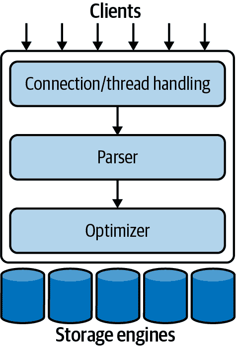
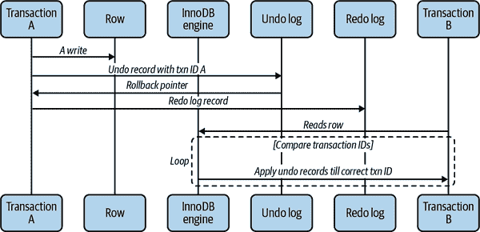
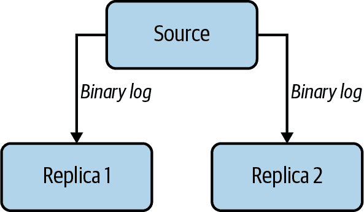

# 第一章：MySQL 架构

MySQL 的架构特点使其适用于各种用途。虽然它并非完美，但足够灵活，可以在小型和大型环境中都能很好地运行。从个人网站到大型企业应用程序都适用。要充分利用 MySQL，您需要了解其设计，以便与之合作，而不是对抗它。

本章概述了 MySQL 服务器架构的高层概述，存储引擎之间的主要区别以及这些区别的重要性。我们试图通过简化细节并展示示例来解释 MySQL。这个讨论对于那些对数据库服务器新手以及对其他数据库服务器是专家的读者都将有用。

# MySQL 的逻辑架构

对 MySQL 组件如何协同工作有一个清晰的心理图像将有助于您理解服务器。图 1-1 展示了 MySQL 架构的逻辑视图。

最顶层的层级是客户端，包含的服务并非 MySQL 独有。这些服务是大多数基于网络的客户端/服务器工具或服务器所需的服务：连接处理、身份验证、安全等。

第二层是事情变得有趣的地方。MySQL 的大部分智慧都在这里，包括查询解析、分析、优化以及所有内置功能的代码（例如日期、时间、数学和加密）。在这个层面提供的任何功能都跨存储引擎：存储过程、触发器和视图，例如。

第三层包含存储引擎。它们负责存储和检索 MySQL 中存储的所有数据。就像 GNU/Linux 中提供的各种文件系统一样，每个存储引擎都有其自己的优点和缺点。服务器通过存储引擎 API 与它们通信。该 API 隐藏了存储引擎之间的差异，并在查询层面上使它们基本透明。它还包含几十个低级函数，执行诸如“开始事务”或“获取具有此主键的行”等操作。存储引擎不解析 SQL¹，也不相互通信；它们只是响应服务器的请求。



###### 图 1-1 MySQL 服务器架构的逻辑视图

## 连接管理和安全

默认情况下，每个客户端连接在服务器进程内部都有自己的线程。连接的查询在该单个线程内执行，该线程又位于一个核心或 CPU 上。服务器维护一个准备好使用的线程缓存，因此它们不需要为每个新连接创建和销毁。²

当客户端（应用程序）连接到 MySQL 服务器时，服务器需要对其进行身份验证。身份验证基于用户名、来源主机和密码。也可以在传输层安全（TLS）连接中使用 X.509 证书。一旦客户端连接，服务器会验证客户端是否对其发出的每个查询具有权限（例如，客户端是否被允许发出访问 `world` 数据库中 `Country` 表的 `SELECT` 语句）。

## 优化和执行

MySQL 解析查询以创建内部结构（解析树），然后应用各种优化。这些优化包括重写查询、确定读取表的顺序、选择使用哪些索引等。您可以通过查询中的特殊关键字向优化器传递提示，影响其决策过程。您还可以要求服务器解释优化的各个方面。这让您了解服务器正在做出的决策，并为重新调整查询、模式和设置提供参考，使一切尽可能高效地运行。在第八章中有更详细的内容。

优化器并不真正关心特定表使用的存储引擎是什么，但存储引擎确实会影响服务器优化查询的方式。优化器向存储引擎询问一些能力以及某些操作的成本，还会请求表数据的统计信息。例如，某些存储引擎支持对某些查询有帮助的索引类型。您可以在第六章和第七章中了解更多关于模式优化和索引的内容。

在旧版本中，MySQL 利用内部查询缓存来查看是否可以从中提供结果。然而，随着并发性的增加，查询缓存成为一个臭名昭著的瓶颈。截至 MySQL 5.7.20，查询缓存正式被废弃为 MySQL 的一个特性，并在 8.0 版本中，查询缓存被完全移除。尽管查询缓存不再是 MySQL 服务器的核心部分，但缓存频繁提供的结果集是一个好的实践。虽然超出了本书的范围，但一个流行的设计模式是在 memcached 或 Redis 中缓存数据。

# 并发控制

每当多个查询需要同时更改数据时，就会出现并发控制问题。对于本章的目的，MySQL 必须在两个级别进行并发控制：服务器级别和存储引擎级别。我们将为您简要介绍 MySQL 如何处理并发读取和写入，以便您在本章的其余部分中获得所需的背景知识。

为了说明 MySQL 如何处理对同一组数据的并发工作，我们将以传统的电子表格文件为例。电子表格由行和列组成，就像数据库表一样。假设文件在您的笔记本电脑上，并且只有您可以访问它。没有潜在的冲突；只有您可以对文件进行更改。现在，想象您需要与同事共同使用该电子表格。它现在位于您和同事都可以访问的共享服务器上。当您和同事同时需要对此文件进行更改时会发生什么？如果我们有一个整个团队的人正在积极尝试编辑、添加和删除此电子表格中的单元格，会发生什么？我们可以说他们应该轮流进行更改，但这并不高效。我们需要一种允许高容量电子表格并发访问的方法。

## 读/写锁

从电子表格中读取并不那么麻烦。多个客户端同时读取同一文件没有问题；因为他们没有进行更改，所以不太可能出错。如果有人尝试在其他人正在读取电子表格时删除`A25`单元格会发生什么？这取决于情况，但读者可能会得到损坏或不一致的数据视图。因此，即使从电子表格中读取也需要特别小心。

如果您将电子表格视为数据库表，很容易看出在这种情况下问题是相同的。在许多方面，电子表格实际上只是一个简单的数据库表。修改数据库表中的行与删除或更改电子表格文件中的单元格内容非常相似。

解决这个经典的并发控制问题相当简单。处理并发读/写访问的系统通常实现由两种锁类型组成的锁定系统。这些锁通常被称为*共享锁*和*排他锁*，或读锁和写锁。

不用担心实际的锁定机制，我们可以描述概念如下。对于资源的*读锁*是共享的，或者说是相互非阻塞的：许多客户端可以同时从资源中读取，而不会相互干扰。另一方面，*写锁*是排他的——也就是说，它们会阻止读锁和其他写锁——因为唯一安全的策略是在给定时间内只允许单个客户端向资源写入，并在客户端写入时阻止所有读取。

在数据库世界中，锁定一直在发生：MySQL 必须防止一个客户端在另一个客户端更改数据时读取数据。如果数据库服务器表现得符合要求，那么锁定的管理速度足够快，以至于客户端几乎察觉不到。我们将在第八章中讨论如何调整查询以避免由锁定引起的性能问题。

## 锁定粒度

提高共享资源并发性的一种方法是更加选择性地锁定你要锁定的内容。而不是锁定整个资源，只锁定包含你需要更改的数据的部分。更好的是，只锁定你计划更改的确切数据片段。在任何给定时间最小化你锁定的数据量，让对给定资源的更改可以同时发生，只要它们不相互冲突。

不幸的是，锁并不是免费的——它们会消耗资源。每个锁操作——获取锁、检查锁是否空闲、释放锁等——都有开销。如果系统花费太多时间管理锁而不是存储和检索数据，性能可能会受到影响。

锁定策略是锁定开销和数据安全之间的一种折衷，这种折衷会影响性能。大多数商用数据库服务器并不给你太多选择：在你的表中，你得到的是所谓的行级锁定，有各种复杂的方式来提供许多锁的良好性能。锁是数据库如何实现一致性保证的方式。一个数据库的专家操作员必须深入阅读源代码，以确定最适合的一组调整配置，以优化速度与数据安全之间的这种权衡。

另一方面，MySQL 提供了选择。它的存储引擎可以实现自己的锁定策略和锁定粒度。锁管理是存储引擎设计中非常重要的决定；将粒度固定在某个级别可以提高某些用途的性能，但使该引擎不太适合其他用途。因为 MySQL 提供了多个存储引擎，它不需要一个单一的通用解决方案。让我们看看两种最重要的锁定策略。

### 表锁

MySQL 中最基本的锁定策略，也是开销最低的策略是表锁。*表锁* 类似于前面描述的电子表格锁：它锁定整个表。当客户端希望写入表（插入、删除、更新等）时，它会获取写锁。这会阻止所有其他读取和写入操作。当没有人在写入时，读者可以获取读锁，这些读锁不会与其他读锁冲突。

表锁在特定情况下有改进性能的变体。例如，`READ LOCAL` 表锁允许某些类型的并发写操作。写锁和读锁队列是分开的，写队列完全比读队列的优先级高。³

### 行锁

提供最大并发性（并带来最大开销）的锁定风格是使用行锁。回到电子表格的类比，*行锁* 就像只锁定电子表格中的行一样。这种策略允许多人同时编辑不同的行，而不会相互阻塞。这使服务器能够进行更多并发写入，但代价是需要跟踪谁拥有每个行锁，它们已经打开多久，以及它们是什么类型的行锁，以及在不再需要时清理锁。

行锁是在存储引擎中实现的，而不是在服务器中。服务器大部分时间⁴ 对在存储引擎中实现的锁定是不知情的，正如你将在本章和整本书中看到的，存储引擎都以自己的方式实现锁定。

# 事务

在深入研究数据库系统的更高级功能之前，你会发现事务的存在。*事务*是一组 SQL 语句，被视为一个原子单元的工作。如果数据库引擎可以将整组语句应用到数据库中，它会这样做，但如果由于崩溃或其他原因无法完成其中任何一个，那么所有语句都不会被应用。要么全部成功，要么全部失败。

这一部分与 MySQL 无关。如果你已经熟悉 ACID 事务，请随时跳到“MySQL 中的事务”。

银行应用程序是为什么需要事务的经典例子。想象一个银行的数据库有两个表：支票和储蓄。要将$200 从简的支票账户转移到她的储蓄账户，你需要至少执行三个步骤：

1.  确保她的支票账户余额大于$200。

1.  从她的支票账户余额中减去$200。

1.  给她的储蓄账户余额加上$200。

整个操作应该包裹在一个事务中，这样如果任何一个步骤失败，已完成的步骤可以被回滚。

你可以使用`START TRANSACTION`语句开始一个事务，然后使用`COMMIT`使其更改永久化，或者使用`ROLLBACK`放弃更改。因此，我们示例事务的 SQL 可能如下所示：

```sql
1  START  TRANSACTION;
2  SELECT balance FROM checking WHERE customer_id = 10233276;
3  UPDATE checking SET balance = balance - 200.00 WHERE customer_id = 10233276;
4  UPDATE savings SET balance = balance + 200.00 WHERE customer_id = 10233276;
5  COMMIT;
```

事务本身并不是全部。如果数据库服务器在执行第 4 行时崩溃会发生什么？谁知道呢？客户可能刚刚损失了$200。如果另一个进程在第 3 行和第 4 行之间出现并移除整个支票账户余额会发生什么？银行已经给客户提供了$200 的信用，甚至自己都不知道。

在这个操作序列中还有很多失败的可能性。你可能会遇到连接中断、超时，甚至在操作中途数据库服务器崩溃。这通常是为什么高度复杂和缓慢的两阶段提交系统存在的原因：以减轻各种故障场景。

事务并不足够，除非系统通过 ACID 测试。ACID 代表原子性（atomicity）、一致性（consistency）、隔离性（isolation）和持久性（durability）。这些是数据安全事务处理系统必须满足的紧密相关标准：

原子性

事务必须作为一个单一不可分割的工作单元运行，以便整个事务要么被应用，要么永远不被提交。当事务是原子的时，不存在部分完成的事务：要么全部成功，要么全部失败。

一致性

数据库应该始终从一个一致的状态转移到下一个一致的状态。在我们的示例中，一致性确保在第 3 行和第 4 行之间发生崩溃时，支票账户中不会消失$200。如果事务从未提交，事务的任何更改都不会反映在数据库中。

隔离性

事务的结果通常对其他事务是不可见的，直到事务完成。这确保如果在我们的示例中的第 3 行和第 4 行之间运行银行账户摘要，它仍然会看到支票账户中的$200。当我们在本章后面讨论隔离级别时，你会明白为什么我们说“通常不可见”。

持久性

一旦提交，事务的更改就是永久的。这意味着更改必须被记录，以防止在系统崩溃时丢失数据。然而，持久性是一个稍微模糊的概念，因为实际上有许多级别。一些持久性策略提供比其他更强的安全保证，而且没有什么是 100%持久的（如果数据库本身真的是持久的，那么备份如何增加持久性呢？）。

ACID 事务和 InnoDB 引擎特别提供的保证是 MySQL 中最强大和最成熟的功能之一。虽然它们会带来一定的吞吐量折衷，但当适当应用时，它们可以避免在应用层实现大量复杂逻辑。

## 隔离级别

隔离性比看起来更复杂。ANSI SQL 标准定义了四个隔离级别。如果您是数据库领域的新手，我们强烈建议您在阅读有关具体 MySQL 实现之前熟悉 ANSI SQL 的一般标准⁶。该标准的目标是定义更改在事务内外何时可见和何时不可见的规则。较低的隔离级别通常允许更高的并发性并具有较低的开销。

###### 注意

每个存储引擎对隔离级别的实现略有不同，并且不一定与您习惯于其他数据库产品时所期望的相匹配（因此，在本节中我们不会详细介绍）。您应该阅读您决定使用的任何存储引擎的手册。

让我们快速看一下四个隔离级别：

`READ UNCOMMITTED`

在`READ UNCOMMITTED`隔离级别中，事务可以查看未提交事务的结果。在这个级别，除非您真的非常了解自己在做什么并且有充分的理由这样做，否则可能会发生许多问题。这个级别在实践中很少使用，因为其性能并不比其他级别好多少，而其他级别有许多优势。读取未提交的数据也被称为*脏读*。

`READ COMMITTED`

大多数数据库系统（但不包括 MySQL！）的默认隔离级别是`READ COMMITTED`。它满足先前使用的隔离的简单定义：事务将继续看到在其开始后提交的事务所做的更改，并且其更改在提交之前对其他人不可见。这个级别仍然允许所谓的不可重复读。这意味着您可以两次运行相同的语句并看到不同的数据。

`REPEATABLE READ`

`REPEATABLE READ`解决了`READ UNCOMMITTED`允许的问题。它保证事务读取的任何行在同一事务内的后续读取中“看起来相同”，但理论上仍允许另一个棘手的问题：幻读。简而言之，当您选择某些行的范围时，另一个事务将新行插入到该范围中，然后再次选择相同范围时，您将看到新的“幻影”行。InnoDB 和 XtraDB 通过多版本并发控制解决了幻读问题，我们稍后在本章中解释。

`REPEATABLE READ`是 MySQL 的默认事务隔离级别。

`SERIALIZABLE`

最高级别的隔离是`SERIALIZABLE`，通过强制事务按顺序排列以避免可能发生冲突来解决幻读问题。简而言之，`SERIALIZABLE`在读取每一行时都会放置一个锁。在这个级别，可能会发生很多超时和锁争用。我们很少看到人们使用这种隔离级别，但您的应用程序需求可能迫使您接受降低的并发性以换取数据安全性。

表 1-1 总结了各种隔离级别及与每个级别相关的缺点。

表 1-1\. ANSI SQL 隔离级别

| 隔离级别 | 是否可能出现脏读 | 是否可能出现不可重复读 | 是否可能出现幻读 | 锁定读取 |
| --- | --- | --- | --- | --- |
| `READ UNCOMMITTED` | 是 | 是 | 是 | 否 |
| `READ COMMITTED` | 否 | 是 | 是 | 否 |
| `REPEATABLE READ` | 否 | 否 | 是 | 否 |
| `SERIALIZABLE` | 否 | 否 | 否 | 是 |

## 死锁

*死锁*是指两个或多个事务相互持有并请求相同资源上的锁，从而创建了依赖循环。当事务尝试以不同顺序锁定资源时，就会发生死锁。无论何时多个事务锁定相同资源，都可能发生死锁。例如，考虑这两个针对`StockPrice`表运行的事务，该表具有主键`(stock_id, date)`：

事务 1

```sql
START TRANSACTION;
UPDATE StockPrice SET close = 45.50 WHERE stock_id = 4 and date = ‘2020-05-01’;
UPDATE StockPrice SET close = 19.80 WHERE stock_id = 3 and date = ‘2020-05-02’;
COMMIT;
```

事务 2

```sql
START TRANSACTION;
UPDATE StockPrice SET high = 20.12 WHERE stock_id = 3 and date = ‘2020-05-02’;
UPDATE StockPrice SET high = 47.20 WHERE stock_id = 4 and date = ‘2020-05-01’;
COMMIT;
```

每个事务将执行其第一个查询并更新一行数据，将该行在主键索引中锁定，并在此过程中锁定其所属的任何其他唯一索引。然后，每个事务将尝试更新其第二行，只能发现它已被锁定。除非有某种干预来打破死锁，否则这两个事务将永远等待对方完成。我们在第七章中进一步介绍索引如何在架构演变过程中影响查询的性能。

为了解决这个问题，数据库系统实现了各种形式的死锁检测和超时。更复杂的系统，如 InnoDB 存储引擎，将注意到循环依赖关系并立即返回错误。这可能是一件好事——否则，死锁将表现为非常慢的查询。其他系统在查询超过锁等待超时后会放弃，这并不总是好事。InnoDB 目前处理死锁的方式是回滚具有最少独占行锁的事务（这是一个近似指标，哪个事务最容易回滚）。

锁行为和顺序是存储引擎特定的，因此一些存储引擎可能会在某些语句序列上发生死锁，即使其他存储引擎不会。死锁具有双重性质：一些是由于真实数据冲突而不可避免的，一些是由存储引擎的工作方式引起的。⁷

一旦发生死锁，就无法在不部分或完全回滚其中一个事务的情况下解除死锁。在事务系统中，死锁是生活中的一个事实，您的应用程序应设计为处理它们。许多应用程序可以简单地从头开始重试它们的事务，除非遇到另一个死锁，否则它们应该成功。

## 事务日志

事务日志有助于使事务更高效。存储引擎可以在每次更改发生时更新磁盘上的表之前更改其内存中的数据副本。这是非常快的。然后，存储引擎可以将更改记录写入事务日志，该日志位于磁盘上，因此是持久的。这也是一个相对快速的操作，因为追加日志事件涉及磁盘上一个小区域的顺序 I/O，而不是在许多地方进行随机 I/O。然后，在以后的某个时间，一个进程可以更新磁盘上的表。因此，大多数使用这种技术（称为*预写式日志记录*）的存储引擎最终会将更改写入磁盘两次。

如果在更新写入事务日志后但在更改数据本身之前发生崩溃，则存储引擎仍然可以在重新启动时恢复更改。恢复方法因存储引擎而异。

## MySQL 中的事务

存储引擎是驱动数据如何存储和从磁盘检索的软件。虽然 MySQL 传统上提供了许多支持事务的存储引擎，但 InnoDB 现在是金标准和推荐使用的引擎。这里描述的事务基元将基于 InnoDB 引擎中的事务。

### 理解 AUTOCOMMIT

默认情况下，单个`INSERT`、`UPDATE`或`DELETE`语句会隐式包装在一个事务中并立即提交。这被称为`AUTOCOMMIT`模式。通过禁用此模式，您可以在事务中执行一系列语句，并在结束时`COMMIT`或`ROLLBACK`。

你可以通过使用`SET`命令为当前连接启用或禁用`AUTOCOMMIT`变量。值`1`和`ON`是等效的，`0`和`OFF`也是如此。当你运行时`AUTOCOMMIT=0`，你总是处于一个事务中，直到你发出`COMMIT`或`ROLLBACK`。然后 MySQL 立即开始一个新的事务。此外，启用`AUTOCOMMIT`后，你可以使用关键字`BEGIN`或`START TRANSACTION`开始一个多语句事务。改变`AUTOCOMMIT`的值对非事务表没有影响，这些表没有提交或回滚更改的概念。

在打开事务期间发出某些命令会导致 MySQL 在执行之前提交事务。这些通常是进行重大更改的 DDL 命令，如`ALTER TABLE`，但`LOCK TABLES`和其他一些语句也有这种效果。查看你版本的文档以获取自动提交事务的完整命令列表。

MySQL 允许你使用`SET TRANSACTION ISOLATION LEVEL`命令设置隔离级别，该命令在下一个事务开始时生效。你可以在配置文件中为整个服务器设置隔离级别，也可以仅为你的会话设置：

```sql
SET SESSION TRANSACTION ISOLATION LEVEL READ COMMITTED;
```

最好在服务器级别设置你最常用的隔离级别，并仅在明确的情况下更改它。MySQL 识别所有四个 ANSI 标准隔离级别，而 InnoDB 支持它们全部。

### 在事务中混合存储引擎

MySQL 不会在服务器级别管理事务。相反，底层存储引擎自己实现事务。这意味着你不能可靠地在单个事务中混合不同的引擎。

如果你在一个事务中混合使用事务表和非事务表（例如，InnoDB 和 MyISAM 表），如果一切顺利，事务将正常工作。然而，如果需要回滚，对非事务表的更改无法撤消。这将使数据库处于一个不一致的状态，可能很难恢复，并使事务的整个目的变得无意义。这就是为什么非常重要为每个表选择正确的存储引擎，并尽量避免在应用逻辑中混合存储引擎。

如果你在非事务表上执行事务操作，MySQL 通常不会警告你或引发错误。有时回滚事务会生成警告：“一些非事务更改的表无法回滚”，但大多数情况下，你不会得到任何指示你正在使用非事务表。

###### 警告

最好的做法是不要在应用程序中混合存储引擎。失败的事务可能导致不一致的结果，因为某些部分可以回滚，而其他部分则无法回滚。

### 隐式和显式锁定

InnoDB 使用两阶段锁定协议。它可以在事务期间的任何时候获取锁，但直到`COMMIT`或`ROLLBACK`才会释放锁。它同时释放所有锁。前面描述的锁定机制都是隐式的。InnoDB 根据你的隔离级别自动处理锁。

然而，InnoDB 也支持显式锁定，SQL 标准根本没有提到：⁸^，⁹

```sql
SELECT ... FOR SHARE
SELECT ... FOR UPDATE
```

MySQL 还支持`LOCK TABLES`和`UNLOCK TABLES`命令，这些命令在服务器中实现，而不是在存储引擎中。如果你需要事务，请使用事务性存储引擎。`LOCK TABLES`是不必要的，因为 InnoDB 支持行级锁定。

###### 提示

`LOCK TABLES`和事务之间的交互是复杂的，在某些服务器版本中存在意外行为。因此，我们建议无论使用哪种存储引擎，都不要在事务中使用`LOCK TABLES`。

# 多版本并发控制

MySQL 的大多数事务性存储引擎不使用简单的行级锁定机制。相反，它们与一种称为*多版本并发控制（MVCC）*的增加并发性技术结合使用行级锁定。MVCC 并不是 MySQL 独有的：Oracle、PostgreSQL 和一些其他数据库系统也使用它，尽管存在重大差异，因为 MVCC 应如何工作没有标准。

您可以将 MVCC 视为对行级锁定的一种变通方法；在许多情况下，它避免了锁定的需要，并且开销要低得多。根据实现方式，它可以允许非锁定读取，同时仅在写入操作期间锁定必要的行。

MVCC 通过使用数据在某个时间点存在的快照来工作。这意味着事务可以看到数据的一致视图，无论它们运行多长时间。这也意味着不同的事务可以同时在相同的表中看到不同的数据！如果您以前从未经历过这种情况，可能会感到困惑，但随着熟悉度的增加，您会更容易理解。

每个存储引擎都以不同方式实现 MVCC。一些变体包括乐观和悲观并发控制。我们通过解释 InnoDB 的行为来说明 MVCC 的一种工作方式，形式为图 1-2 中的序列图。

InnoDB 通过为每个启动的事务分配事务 ID 来实现 MVCC。该 ID 是在事务第一次读取任何数据时分配的。当在该事务内修改记录时，将向撤销日志写入解释如何撤消该更改的撤销记录，并且事务的回滚指针指向该撤销日志记录。这就是事务可以找到回滚的方法的方式。



###### 图 1-2。处理不同事务中一行的多个版本的序列图

当不同会话读取群集键索引记录时，InnoDB 会比较记录的事务 ID 与该会话的读取视图。如果记录在当前状态下不应可见（更改它的事务尚未提交），则会跟随并应用撤销日志记录，直到会话达到可以可见的事务 ID。这个过程可以一直循环到一个完全删除此行的撤销记录，向读取视图发出此行不存在的信号。

通过在记录的“信息标志”中设置“删除”位来删除事务中的记录。这也在撤销日志中跟踪为“删除标记”。

值得注意的是，所有撤销日志写入也都会被重做记录，因为撤销日志写入是服务器崩溃恢复过程的一部分，并且是事务性的。[¹¹] 这些重做和撤销日志的大小也在高并发事务执行中扮演着重要角色。我们将在第五章中更详细地介绍它们的配置。

所有这些额外的记录保留的结果是，大多数读取查询从不获取锁。它们只是尽可能快地读取数据，确保只选择符合条件的行。缺点是存储引擎必须在每行存储更多数据，在检查行时做更多工作，并处理一些额外的管理操作。

MVCC 仅适用于`REPEATABLE READ`和`READ COMMITTED`隔离级别。`READ UNCOMMITTED`不兼容 MVCC，因为查询不会读取适合其事务版本的行版本；无论如何，它们都会读取最新版本。`SERIALIZABLE`不兼容 MVCC，因为读取会锁定它们返回的每一行。

# 复制

MySQL 设计用于在任何给定时间接受一个节点上的写入。这在管理一致性方面具有优势，但在需要将数据写入多个服务器或多个位置时会产生折衷。MySQL 提供了一种本地方法来将一个节点接受的写入分发到其他节点。这被称为*复制*。在 MySQL 中，源节点每个副本都有一个线程作为复制客户端登录，当发生写入时会唤醒，发送新数据。在图 1-3 中，我们展示了这种设置的简单示例，通常称为源和副本设置中的多个 MySQL 服务器的*拓扑树*。



###### 图 1-3\. MySQL 服务器复制拓扑的简化视图

对于在生产环境中运行的任何数据，您应该使用复制，并至少有三个以上的副本，最好分布在不同位置（在云托管环境中称为*区域*）以进行灾难恢复规划。

多年来，MySQL 中的复制变得更加复杂。全局事务标识符、多源复制、副本上的并行复制和半同步复制是一些主要更新。我们在第九章中详细介绍了复制。

# 数据文件结构

在 8.0 版本中，MySQL 将表元数据重新设计为包含在表的*.ibd*文件中的数据字典。这使得关于表结构的信息支持事务和原子数据定义更改。在操作期间检索表定义和元数据不再仅依赖于`information_schema`，我们引入了字典对象缓存，这是一个基于最近最少使用（LRU）的内存缓存，其中包含分区定义、表定义、存储程序定义、字符集和校对信息。服务器访问表的元数据的这一重大变化减少了 I/O，尤其是如果一部分表是最活跃的并且因此最常见于缓存中的话，这是有效的。*.ibd* 和 *.frm* 文件被替换为每个表的序列化字典信息（*.sdi*）。

# InnoDB 引擎

InnoDB 是 MySQL 的默认事务存储引擎，也是最重要和最广泛使用的引擎。它设计用于处理许多短暂事务，这些事务通常会完成而不是回滚。其性能和自动崩溃恢复使其在非事务性存储需求中也很受欢迎。如果您想研究存储引擎，深入学习 InnoDB 是值得的，以尽可能多地了解它，而不是平等地研究所有存储引擎。

###### 注意

最佳实践是将 InnoDB 存储引擎作为任何应用程序的默认引擎。MySQL 通过几个主要版本之前将 InnoDB 设为默认引擎，使这一点变得容易。

InnoDB 是默认的 MySQL 通用存储引擎。默认情况下，InnoDB 将其数据存储在一系列数据文件中，这些文件统称为*表空间*。表空间本质上是 InnoDB 自行管理的一个黑盒。

InnoDB 使用 MVCC 实现高并发，并实现了所有四个 SQL 标准隔离级别。它默认使用`REPEATABLE READ`隔离级别，并具有防止在此隔离级别中出现幻读的 next-key 锁定策略：InnoDB 不仅锁定您在查询中触及的行，还锁定索引结��中的间隙，防止插入幻影。

InnoDB 表是建立在聚簇索引上的，我们将在第八章中详细讨论架构设计时进行介绍。InnoDB 的索引结构与大多数其他 MySQL 存储引擎非常不同。因此，它提供非常快速的主键查找。但是，次要索引（非主键的索引）包含主键列，因此如果您的主键很大，其他索引也会很大。如果您将在表上有许多索引，应该努力使主键尽可能小。

InnoDB 具有各种内部优化。这些包括从磁盘读取数据的预测性读取，自适应哈希索引自动在内存中构建哈希索引以进行非常快速的查找，以及插入缓冲区以加快插入速度。我们将在本书的第四章中介绍这些内容。

InnoDB 的行为非常复杂，如果你正在使用 InnoDB，我们强烈建议阅读 MySQL 手册中的[“InnoDB 锁定和事务模型”](https://oreil.ly/AfuTi)部分。由于其 MVCC 架构，建议在使用 InnoDB 构建应用程序之前，您应该了解许多微妙之处。

作为事务性存储引擎，InnoDB 通过各种机制支持真正的“热”在线备份，包括 Oracle 的专有 MySQL 企业备份和开源 Percona XtraBackup。我们将在第十章中详细讨论备份和恢复。

从 MySQL 5.6 开始，InnoDB 引入了在线 DDL，在最初的版本中有限的用例在 5.7 和 8.0 版本中得到扩展。原地模式更改允许进行特定表更改而无需完全锁定表，也无需使用外部工具，这极大地提高了 MySQL InnoDB 表的操作性。我们将在第六章中涵盖在线模式更改的选项，包括本机和外部工具。

## JSON 文档支持

JSON 类型是作为 5.7 版本的一部分首次引入 InnoDB 的，它具有 JSON 文档的自动验证以及优化的存储，可以快速读取访问，这对于旧式二进制大对象（BLOB）存储工程师过去常常使用的权衡来说是一个重大改进。除了新的数据类型支持外，InnoDB 还引入了支持 JSON 文档的 SQL 函数。MySQL 8.0.7 中的进一步改进增加了在 JSON 数组上定义多值索引的能力。这个功能可以通过将常见访问模式与能够映射 JSON 文档值的函数匹配，进一步加快对 JSON 类型的读取访问查询。我们将在第六章中的“JSON 数据”中讨论 JSON 数据类型的使用和性能影响。

## 数据字典更改

MySQL 8.0 的另一个重大变化是删除基于文件的表元数据存储，并转而使用 InnoDB 表存储的数据字典。这一变化将 InnoDB 的所有崩溃恢复事务性优势带到了表更改等操作中。这一变化虽然极大地改进了 MySQL 中数据定义的管理，但也需要对 MySQL 服务器的操作进行重大更改。特别值得注意的是，以前依赖表元数据文件的备份过程现在必须查询新数据字典以提取表定义。

## 原子 DDL

最后，MySQL 8.0 引入了原子数据定义更改。这意味着数据定义语句现在要么完全成功完成，要么完全回滚。这通过创建一个专门用于 DDL 的撤销和重做日志成为可能，InnoDB 依赖于此来跟踪变化——这是 InnoDB 成熟设计被扩展到 MySQL 服务器操作的另一个地方。

# 摘要

MySQL 有分层架构，顶部是服务器范围的服务和查询执行，底部是存储引擎。尽管有许多不同的插件 API，但存储引擎 API 是最重要的。如果您理解 MySQL 通过在存储引擎 API 上来回传递行来执行查询，那么您已经掌握了服务器架构的基本原理。

在过去几个主要版本中，MySQL 已将 InnoDB 定为其主要开发重点，并在多年后将其内部账务处理、身份验证和授权移至 MyISAM。Oracle 对 InnoDB 引擎的增加投资导致了诸如原子 DDL、更强大的在线 DDL、更好的抗崩溃能力以及更适合安全部署的操作性等重大改进。

InnoDB 是默认存储引擎，几乎可以覆盖所有用例。因此，在谈论功能、性能和限制时，以下章节将重点关注 InnoDB 存储引擎，很少会涉及其他存储引擎。

¹ 唯一的例外是 InnoDB，因为 MySQL 服务器尚未实现外键定义，所以 InnoDB 解析外键定义。

² MySQL 5.5 及更新版本支持一个可以接受线程池插件的 API，尽管并不常用。线程池的常见做法是在访问层完成的，我们在第五章中讨论过。

³ 我们强烈建议阅读[关于独占锁与共享锁、意向锁和记录锁的文档](https://oreil.ly/EPfwc)。

⁴ 在处理表名更改或模式更改时会使用元数据锁，而在 8.0 中我们引入了“应用级锁定功能”。在日常数据更改过程中，内部锁定留给了 InnoDB 引擎。

⁵ 尽管这是一个常见的学术练习，但大多��银行实际上依赖每日对账，而不是在白天依赖严格的事务操作。

⁶ 欲了解更多信息，请阅读 Adrian Coyler 撰写的[ ANSI SQL 摘要](https://oreil.ly/joikF)和 Kyle Kingsbury 撰写的[一篇关于一致性模型的解释](http://jepsen.io/consistency)。

⁷ 正如您将在本章后面看到的，一些存储引擎锁定整个表，而其他一些实现更复杂的基于行的锁定。所有这些逻辑在很大程度上存在于存储引擎层。

⁸ 这些锁定提示经常被滥用，通常应该避免使用。

⁹ `SELECT`…`FOR SHARE` 是 MySQL 8.0 的一个新特性，取代了之前版本中的 `SELECT`…`LOCK IN SHARE MODE`。

¹⁰ 我们建议阅读 Jeremy Cole 的[这篇博文](https://oreil.ly/jbljq)，以更深入地了解 InnoDB 中的记录结构。

¹¹ 想要了解 InnoDB 如何处理其记录的多个版本，建议阅读 Jeremy Cole 的[这篇博文](https://oreil.ly/exaaL)。

¹² 没有正式的标准定义 MVCC，因此不同的引擎和数据库实现方式大不相同，没有人能说其中任何一种是错误的。
