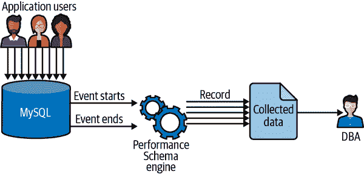

# 第三章\. 性能模式

由 Sveta Smirnova 贡献

在高负载下调整数据库性能是一个迭代循环。每次您进行更改以调整数据库性能时，您需要了解更改是否产生了影响。您的查询是否比以前运行得更快？锁是否减慢了应用程序，或者它们完全消失了？内存使用量是否改变？等待磁盘的时间是否改变？一旦您了解如何回答这些问题，您将能够更快速、更自信地评估和应对日常情况。

性能模式是一个存储回答这些问题所需数据的数据库。本章将帮助您了解性能模式的工作原理、其局限性以及如何最好地使用它——以及其伴随的`sys`模式——来揭示 MySQL 内部发生的常见信息。

# 性能模式简介

性能模式提供了 MySQL 服务器内部运行操作的低级度量标准。为了解释性能模式的工作原理，我需要提前介绍两个概念。

第一个是*工具*。工具指的是我们想要捕获信息的 MySQL 代码的任何部分。例如，如果我们想要收集关于元数据锁的信息，我们需要启用`wait/lock/meta​data/sql/mdl`工具。

第二个概念是*消费者*，它只是一个存储有关哪些代码被检测的信息的表。如果我们检测查询，消费者将记录关于执行次数、未使用索引次数、花费的时间等信息。消费者是大多数人与性能模式紧密相关的内容。

性能模式的一般功能如图 3-1 所示。



###### 图 3-1\. 数据库中运行查询的流程，展示了`performance_schema`如何收集和聚合数据，然后呈现给数据库管理员

当应用用户连接到 MySQL 并执行一个被检测的指令时，`performance_schema`将每个检查的调用封装成两个宏，然后将结果记录在相应的消费者表中。这里的要点是启用工具会调用额外的代码，这意味着工具会消耗 CPU。

## 工具元素

在`performance_schema`中，`setup_instruments`表包含所有支持的工具列表。所有工具的名称都由斜杠分隔的部分组成。我将使用以下示例来帮助您理解这些名称是如何命名的：

+   `statement/sql/select`

+   `wait/synch/mutex/innodb/autoinc_mutex`

工具名称的最左边部分表示工具的类型。因此，`statement`表示该工具是一个语句，`wait`表示它是一个等待，依此类推。

名称字段中的其余元素从左到右表示从一般到具体的子系统。在上面的示例中，`select`是`sql`子系统的一部分，属于`statement`类型。或者`autoinc_mutex`属于`innodb`，是更通用的`mutex`类的一部分，而`mutex`又是`wait`类型的更通用的`sync`工具的一部分。

大多数工具名称都是自描述的。如示例中所示，`statement/sql/select`是一个`SELECT`查询，而`wait/synch/mutex/innodb/autoinc_mutex`是 InnoDB 在自增列上设置的互斥体。`setup_instruments`表中还有一个`DOCUMENTATION`列，其中可能包含更多细节：

```sql
mysql> SELECT * FROM performance_schema.setup_instruments
    -> WHERE DOCUMENTATION IS NOT NULL LIMIT 5, 5\G
*************************** 1\. row ***************************
 NAME: statement/sql/error
 ENABLED: YES
 TIMED: YES
 PROPERTIES:
 VOLATILITY: 0
 DOCUMENTATION: Invalid SQL queries (syntax error).
*************************** 2\. row ***************************
 NAME: statement/abstract/Query
 ENABLED: YES
 TIMED: YES
 PROPERTIES: mutable
 VOLATILITY: 0
 DOCUMENTATION: SQL query just received from the network. At this point, the 
 real statement type is unknown, the type will be refined after SQL parsing.
*************************** 3\. row ***************************
 NAME: statement/abstract/new_packet
 ENABLED: YES
 TIMED: YES
 PROPERTIES: mutable
 VOLATILITY: 0
 DOCUMENTATION: New packet just received from the network. At this point, 
the real command type is unknown, the type will be refined after reading
the packet header.
*************************** 4\. row ***************************
 NAME: statement/abstract/relay_log
 ENABLED: YES
 TIMED: YES
 PROPERTIES: mutable
 VOLATILITY: 0
 DOCUMENTATION: New event just read from the relay log. At this point, the 
real statement type is unknown, the type will be refined after parsing the event.
*************************** 5\. row ***************************
 NAME: memory/performance_schema/mutex_instances
 ENABLED: YES
 TIMED: NULL
 PROPERTIES: global_statistics
 VOLATILITY: 1
 DOCUMENTATION: Memory used for table performance_schema.mutex_instances
5 rows in set (0,00 sec)
```

不幸的是，对于许多工具，`DOCUMENTATION`列可能为`NULL`，因此您需要使用工具名称、直觉和对 MySQL 源代码的了解来理解特定工具检查的内容。

## 消费者组织

正如我之前提到的，消费者是仪器发送信息的目的地。性能模式将仪器结果存储在许多表中；事实上，MySQL Community 8.0.25 中包含了 110 个`performance_schema`表。要理解它们的用途，最好将它们分组。

### 当前和历史数据

事件被放入以以下方式结尾的表中：

`*_current`

目前在服务器上发生的事件

`*_history`

每个线程的最后 10 个已完成事件

`*_history_long`

每个线程全局最后 10,000 个已完成事件

`*_history`和`*_history_long`表的大小是可配置的。

可用的当前和历史数据包括：

`events_waits`

低级服务器等待，例如获取互斥锁

`events_statements`

SQL 语句

`events_stages`

概要信息，例如创建临时表或发送数据

`events_transactions`

事务

### 摘要表和摘要

摘要表包含有关表建议的聚合信息。例如，`memory_summary_by_thread_by_event_name`表包含每个 MySQL 线程的用户连接或任何后台线程的聚合内存使用情况。

摘要是通过消除查询中的变体来聚合查询的一种方式。看以下查询示例：

```sql
SELECT user,birthdate FROM users WHERE user_id=19;
SELECT user,birthdate FROM users WHERE user_id=13;
SELECT user,birthdate FROM users WHERE user_id=27;
```

此查询的摘要将是：

```sql
SELECT user,birthdate FROM users WHERE user_id=?
```

这使得性能模式能够跟踪摘要的延迟等指标，而无需保留每个查询的各种变体。

### 实例

实例指的是 MySQL 安装中可用的对象实例。例如，`file_instances`表包含文件名以及访问这些文件的线程数。

### 设置

设置表用于运行时设置`performance_schema`。

### 其他表

还有其他表的名称不遵循严格的模式。例如，`metadata_locks`表保存有关元数据锁的数据。在讨论`performance_schema`可以帮助解决的问题时，我将在本章稍后介绍其中的一些。

## 资源消耗

性能模式收集的数据保存在内存中。您可以通过设置消费者的最大大小来限制其使用的内存量。`performance_schema`中的一些表支持自动缩放。这意味着它们在启动时分配最小内存量，并根据需要调整其大小。但是，一旦分配了内存，即使禁用了特定仪器并截断了表，也永远不会释放这些内存。

正如我之前提到的，每个仪器调用都会添加两个宏调用来存储数据��`perform​ance_​schema`中。这意味着您仪器化越多，CPU 使用率就会越高。对 CPU 利用率的实际影响取决于具体的仪器。例如，与查询期间仅调用一次的与语句相关的仪器不同，等待仪器可能会更频繁地调用。例如，要扫描具有一百万行的 InnoDB 表，引擎将需要设置并释放一百万行锁。如果您仪器化锁定，CPU 使用率可能会显著增加。但是，如果启用语句仪器，同一查询将需要一个调用来确定它是`statement/sql/select`。因此，如果启用语句仪器，您不会注意到 CPU 负载的增加。内存或元数据锁仪器也是如此。

## 限制

在讨论如何设置和使用`performance_schema`之前，了解其局限性是很重要的：

它必须由 MySQL 组件支持。

例如，假设您正在使用内存仪器来计算哪个 MySQL 组件或线程使用了大部分内存。您发现使用最多内存的组件是一个不支持内存仪器的存储引擎。在这种情况下，您将无法找到内存去向。

仅在特定仪器和消费者启用后才收集数据。

例如，如果您启动了一个禁用了所有仪器的服务器，然后决定对内存使用进行仪器化，您将无法知道由全局缓冲区（例如 InnoDB 缓冲池）分配的确切数量，因为在启用内存仪器化之前它已经被分配。

释放内存很困难。

您可以在启动时限制消费者的大小，或者让它们自动调整大小。在后一种情况下，它们在启动时不分配内存，而只有在启用数据收集时才分配内存。然而，即使您稍后禁用特定的工具或消费者，除非重新启动服务器，否则内存不会被释放。

在本章的其余部分，我将假设您已经了解这些限制，因此我不会特别关注它们。

## 系统模式

自 MySQL 5.7 版本以来，标准 MySQL 发行版包括一个名为`sys`模式的`performance_schema`数据的伴随模式。该模式仅由`performance_schema`上的视图和存储过程组成。虽然它旨在使您与`performance_schema`的体验更加顺畅，但它本身不存储任何数据。

###### 注意

`sys`模式非常方便，但您需要记住它只访问存储在`performance_schema`表中的数据。如果您需要`sys`模式中不可用的数据，请检查它是否存在于`performance_schema`中的基础表中。

## 理解线程

MySQL 服务器是多线程软件。它的每个组件都使用线程。例如，可能��由主线程或存储引擎创建的后台线程，也可能是为用户连接创建的前台线程。每个线程至少有两个唯一标识符：一个操作系统线程 ID，例如，在 Linux 的``ps -eLf``命令的输出中可见，以及一个内部 MySQL 线程 ID。在`performance_schema`的大多数表中，这个内部 MySQL 线程 ID 称为`THREAD_ID`。此外，每个前台线程都有一个分配的`PROCESSLIST_ID`：连接标识符，在`SHOW PROCESSLIST`命令输出中可见，或者在使用 MySQL 命令行客户端连接时的`“Your MySQL connection id is”`字符串中可见。

###### 警告

`THREAD_ID`不等于`PROCESSLIST_ID`！

`performance_schema`中的`threads`表包含服务器中存在的所有线程：

```sql
mysql> SELECT NAME, THREAD_ID, PROCESSLIST_ID, THREAD_OS_ID 
    -> FROM performance_schema.threads;
+------------------------+-----------+----------------+--------------+
| NAME                   | THREAD_ID | PROCESSLIST_ID | THREAD_OS_ID |
+------------------------+-----------+----------------+--------------+
| thread/sql/main        |         1 |           NULL |       797580 |
| thread/innodb/io_ib... |         3 |           NULL |       797583 |
| thread/innodb/io_lo... |         4 |           NULL |       797584 |
...
| thread/sql/slave_io    |        42 |              5 |       797618 |
| thread/sql/slave_sql   |        43 |              6 |       797619 |
| thread/sql/event_sc... |        44 |              7 |       797620 |
| thread/sql/signal_h... |        45 |           NULL |       797621 |
| thread/mysqlx/accep... |        46 |           NULL |       797623 |
| thread/sql/one_conn... |     27823 |          27784 |       797695 |
| thread/sql/compress... |        48 |              9 |       797624 |
+------------------------+-----------+----------------+--------------+
44 rows in set (0.00 sec)

```

除了线程编号信息外，`threads`表包含与`SHOW PROCESSLIST`输出相同的数据以及一些附加列，例如`RESOURCE_GROUP`或`PARENT_THREAD_ID`。

###### 警告

性能模式在各处使用`THREAD_ID`，而`PROCESSLIST_ID`仅在`threads`表中可用。如果您需要获取`PROCESSLIST_ID`，例如为了终止持有锁的连接，您需要查询`threads`表以获取其值。

`threads`表可以与许多其他表连接，以提供有关正在运行的查询的附加信息（例如，查询数据，锁定，互斥锁或打开的表实例）。

在本章的其余部分，我希望您熟悉这个表以及`THREAD_ID`的含义。

# 配置

性能模式的一些部分只能在服务器启动时更改：启用或禁用性能模式本身以及与收集数据的内存使用和限制相关的变量。性能模式仪器和消费者可以动态启用或禁用。

###### 提示

您可以启动性能模式，所有消费者和仪器都被禁用，并且只在您期望问题发生之前启用那些需要解决特定问题的仪器。这样，您将不会在不需要的地方花费任何资源在性能模式上，也不会因为过度仪器化而使系统陷入困境。

## 启用和禁用性能模式

要启用或禁用性能模式，请将变量`performance_schema`相应地设置为`ON`或`OFF`。这是一个只读变量，只能在配置文件中或在 MySQL 服务器启动时通过命令行参数更改。

## 启用和禁用仪器

仪器可以启用或禁用。要查看仪器的状态，可以查询`setup_instruments`表：

```sql
mysql> SELECT * FROM performance_schema.setup_instruments 
    -> WHERE NAME='statement/sql/select'\G
*************************** 1\. row ***************************
 NAME: statement/sql/select
 ENABLED: NO
 TIMED: YES
 PROPERTIES:
 VOLATILITY: 0
 DOCUMENTATION: NULL
1 row in set (0.01 sec)
```

正如我们所见，`ENABLED`是`NO`；这告诉我们我们目前没有对`SELECT`查询进行仪器化。

有三种选项可以启用或禁用`performance_schema`仪器：

+   使用`setup_instruments`表。

+   调用`sys`模式中的`ps_setup_enable_instrument`存储过程。

+   使用启动参数`performance-schema-instrument`。

### 更新语句

第一种方法是使用`UPDATE`语句更改列值：

```sql
mysql> UPDATE performance_schema.setup_instruments
    -> SET ENABLED='YES' WHERE NAME='statement/sql/select';
Query OK, 1 rows affected (0.00 sec)
Rows matched: 1 Changed: 1 Warnings: 0
```

由于这是标准 SQL，您也可以使用通配符来启用所有 SQL 语句的仪器：

```sql
mysql> UPDATE performance_schema.setup_instruments
    -> SET ENABLED='YES' WHERE NAME LIKE statement/sql/%';
Query OK, 167 rows affected (0.00 sec)
Rows matched: 167 Changed: 167 Warnings: 0
```

此方法在重新启动之间不会持久化。

### 存储过程 sys

`sys`模式提供了两个存储过程—`ps_setup_enable_instrument`和`ps_setup_disable_instrument`—它们通过参数传递启用和禁用仪器。这两个例程都支持通配符。如果要启用或禁用所有支持的仪器，请使用通配符`'%'`：

```sql
mysql> CALL sys.ps_setup_enable_instrument('statement/sql/select');
+----------------------+
| summary              |
+----------------------+
| Enabled 1 instrument |
+----------------------+
1 row in set (0.01 sec)
```

此方法实际上与前一种方法完全相同，包括在重新启动之间不会持久化。

### 启动选项

如前所述，这两种方法都允许您在线更改`performance_schema`配置，但不会在服务器重新启动之间存储该更改。如果要在重新启动之间保存特定仪器的选项，请使用配置参数`performance-schema-instrument`。

此变量支持`performance-schema-instrument=​'instrument_​name=​value'`语法，其中`instrument_name`是仪器名称，`value`为启用仪器的`ON`、`TRUE`或`1`；禁用的为`OFF`、`FALSE`或`0`；对于计数而不是`TIMED`的为`COUNTED`。您可以多次指定此选项以启用或禁用不同的仪器。该选项还支持通配符：

```sql
performance-schema-instrument='statement/sql/select=ON'
```

###### 警告

如果指定了多个选项，则较长的仪器字符串优先于较短的，无论顺序如何。

## 启用和禁用消费者

与仪器一样，消费者可以通过以下方式启用或禁用：

+   更新性能模式中的`setup_consumers`表

+   在`sys`模式中使用存储过程`ps_setup_enable_consumer`和`ps_setup_disable_consumer`

+   设置`performance-schema-consumer`配置参数

有 15 个可能的消费者。其中一些具有相当自明的名称，但有一些消费者的名称需要更多解释，列在表 3-1 中。

表 3-1\. 消费者及其目的

| 消费者 | 描述 |
| --- | --- |
| `events_stages_[current&#124;history&#124;history_long]` | 分析详细信息，如“创建临时表”，“统计”或“缓冲池加载” |
| `events_statements_[current&#124;history&#124;history_long]` | 语句统计 |
| `events_transactions_[current&#124;history&#124;history_long]` | 事务 |
| `events_waits_[current&#124;history&#124;history_long]` | 等待 |
| `global_instrumentation` | 启用或禁用全局仪器化。如果禁用，则不会检查任何单独的参数，也不会维护全局或每个线程的数据。不会收集任何单独的事件。 |
| `thread_instrumentation` | 每个线程的仪器化。仅在全局仪器化已启用时才会检查。如果禁用，则不会收集每个线程或单个事件数据。 |
| `statements_digest` | 语句摘要 |

为仪器给出的示例对于消费者是可重复的，使用所述方法。

## 为特定对象调整监控

性能模式允许您为特定对象类型、模式和名称启用和禁用监控。这是在`setup_objects`表中完成的。

`OBJECT_TYPE`列可能具有五个值之一：`EVENT`、`FUNCTION`、`PROCEDURE`、`TABLE`和`TRIGGER`。此外，您可以指定`OBJECT_SCHEMA`和`OBJECT_NAME`。支持通配符。

例如，要禁用`test`数据库中触发器的`performance_schema`，请使用以下语句：

```sql
mysql> INSERT INTO performance_schema.setup_objects
    -> (OBJECT_TYPE, OBJECT_SCHEMA, OBJECT_NAME, ENABLED) 
    -> VALUES ('TRIGGER', 'test', '%', 'NO');
```

如果要为名为`my_trigger`的触发器添加异常，请使用以下语句：

```sql
mysql> INSERT INTO performance_schema.setup_objects
    -> (OBJECT_TYPE, OBJECT_SCHEMA, OBJECT_NAME, ENABLED) 
    -> VALUES ('TRIGGER', 'test', 'my_trigger', 'YES');
```

当`performance_schema`决定是否需要对特定对象进行仪器化时，首先搜索更具体的规则，然后退而求其次。例如，如果用户在触发`test.my_trigger`的表上运行查询，它将检查触发器触发的语句。但如果用户在触发名为`test.some_other_trigger`的触发器的表上运行查询，则不会检查触发器。

对于对象没有配置文件选项。如果需要在重新启动期间保留对此表的更改，您需要编写这些`INSERT`语句到一个 SQL 文件中，并使用`init_file`选项在启动时加载 SQL 文件。

## 调整线程监视

`setup_threads`表包含一个可以监视的后台线程列表。`ENABLED`列指定特定线程的仪器化是否已启用。`HISTORY`列指定特定线程的仪器化事件是否也应存储在`_history`和`_history_long`表中。

例如，要禁用事件调度程序（`thread/sql/event_scheduler`）的历史记录，请运行：

```sql
mysql> UPDATE performance_schema.setup_threads SET HISTORY='NO' 
    -> WHERE NAME='thread/sql/event_scheduler';
```

`setup_threads`表不存储用户线程的设置。为此，存在`setup_actors`表，其中包含表 3-2 中描述的列。

表 3-2。`setup_actors`表中包含的列

| 列名 | 描述 |
| --- | --- |
| `HOST` | 主机，例如 localhost，％，my.domain.com 或 199.27.145.65 |
| `USER` | 用户名，例如`sveta`或`％` |
| `ROLE` | 未使用 |
| `ENABLED` | 如果线程已启用 |
| `HISTORY` | 如果启用在`_history`和`_history_long`表中存储数据 |

要为特定帐户指定规则，请使用以下命令：

```sql
mysql> INSERT INTO performance_schema.setup_actors 
    -> (HOST, USER, ENABLED, HISTORY) 
    -> VALUES ('localhost', 'sveta', 'YES', 'NO'), 
    -> ('example.com', 'sveta', 'YES', 'YES'), 
    -> ('localhost', '%', 'NO', 'NO');
```

此语句启用了`sveta@localhost`和`sveta@example.com`的仪器化，禁用了`sveta@localhost`的历史记录，并禁用了所有其他从`localhost`连接的用户的仪器化和历史记录。

与对象监视一样，线程和参与者没有配置文件选项。如果需要在重新启动期间保留对此表的更改，您需要将这些`INSERT`语句写入 SQL 文件，并使用`init_file`选项在启动时加载 SQL 文件。

## 调整 Performance Schema 的内存大小

Performance Schema 将数据存储在使用`PERFORMANCE_SCHEMA`引擎的表中。此引擎将数据存储在内存中。默认情况下，`performance_schema`表中的一些表是自动调整大小的；其他表具有固定数量的行。您可以通过更改启动变量来调整这些选项。变量的名称遵循模式`perform​ance_schema_object_[size|instances|classes|length|handles]`，其中`object`可以是消费者、设置表或特定事件的仪器化实例。例如，配置变量`perform​ance_​schema_��events_​stages_history_size`定义了`perform​ance_​schema_events_stages_history`表将存储的每个线程的阶段数。变量`perform​ance_​schema_max_memory_classes`定义了可以使用的内存仪器的最大数量。

## 默认值

MySQL 不同部分的默认值随版本而变化；因此，在依赖于此处描述的值之前，最好先查阅用户参考手册。但是，对于 Performance Schema，它们会影响服务器的整体性能，因此我想涵盖重要的部分。

自版本 5.7 以来，默认情况下启用了 Performance Schema，大多数仪器被禁用。只有全局、线程、语句和事务仪器被启用。自版本 8.0 以来，默认还额外启用了元数据锁和内存仪器。

`mysql`、`information_schema`和`performance_schema`数据库未被仪器化。所有其他对象、线程和执行者都被仪器化。

大多数实例、句柄和设置表都是自动调整大小的。对于`_history`表，每个线程存储最后的 10 个事件。对于`_history_long`表，每个线程存储最新的 10,000 个事件。最大存储的 SQL 文本长度为 1,024 字节。最大的 SQL 摘要长度也是 1,024 字节。超出长度的部分会被右侧修剪。

# 使用性能模式

现在我已经介绍了性能模式的配置方式，我想提供一些示例来帮助您解决常见的故障排除情况。

## 检查 SQL 语句

正如我在“仪器元素”中提到的，性能模式支持一套丰富的仪器，用于检查 SQL 语句的性能。您将找到用于标准准备语句和存储例程的工具。通过`performance_schema`，您可以轻松找到哪个查询导致性能问��以及原因。

要启用语句仪表化，您需要启用类型为`statement`的仪器，如表 3-3 中所述。

表 3-3。`Statement`工具及其描述

| 仪器类 | 描述 |
| --- | --- |
| `statement/sql` | SQL 语句，如`SELECT`或`CREATE TABLE` |
| `statement/sp` | 存储过程控制 |
| `statement/scheduler` | 事件调度器 |
| `statement/com` | 命令，如`quit`、`KILL`、`DROP DATABASE`或`Binlog Dump`。有些命令对用户不可用，由*mysqld*进程自身调用。 |
| `statement/abstract` | 四个命令的类：`clone`、`Query`、`new_packet`和`relay_log` |

### 常规 SQL 语句

性能模式将语句指标存储在`events_statements_current`、`events_statements_history`和`events_statements_history_long`表中。这三个表具有相同的结构。

#### 直接使用 performance_schema

这是一个`event_statement_​hist⁠ory`条目的示例：

```sql
 THREAD_ID: 3200
 EVENT_ID: 22
 END_EVENT_ID: 23
 EVENT_NAME: statement/sql/select
 SOURCE: init_net_server_extension.cc:94
 TIMER_START: 878753511280779000
 TIMER_END: 878753544491277000
 TIMER_WAIT: 33210498000
 LOCK_TIME: 657000000
 SQL_TEXT: SELECT film.film_id, film.description FROM sakila.film INNER JOIN
( SELECT film_id FROM sakila.film ORDER BY title LIMIT 50, 5 ) 
AS lim USING(film_id)
 DIGEST: 2fdac27c4a9434806da3b216b9fa71aca738f70f1e8888a581c4fb00a349224f
 DIGEST_TEXT: SELECT `film` . `film_id` , `film` . `description` FROM `sakila` .
`film` INNER JOIN ( SELECT `film_id` FROM `sakila` . `film` ORDER BY 
`title` LIMIT?, ... ) AS `lim` USING ( `film_id` )
 CURRENT_SCHEMA: sakila
 OBJECT_TYPE: NULL
 OBJECT_SCHEMA: NULL
 OBJECT_NAME: NULL
 OBJECT_INSTANCE_BEGIN: NULL
 MYSQL_ERRNO: 0
 RETURNED_SQLSTATE: NULL
 MESSAGE_TEXT: NULL
 ERRORS: 0
 WARNINGS: 0
 ROWS_AFFECTED: 0
 ROWS_SENT: 5
 ROWS_EXAMINED: 10
 CREATED_TMP_DISK_TABLES: 0
 CREATED_TMP_TABLES: 1
 SELECT_FULL_JOIN: 0
 SELECT_FULL_RANGE_JOIN: 0
 SELECT_RANGE: 0
 SELECT_RANGE_CHECK: 0
 SELECT_SCAN: 2
 SORT_MERGE_PASSES: 0
 SORT_RANGE: 0
 SORT_ROWS: 0
 SORT_SCAN: 0
 NO_INDEX_USED: 1
 NO_GOOD_INDEX_USED: 0
 NESTING_EVENT_ID: NULL
 NESTING_EVENT_TYPE: NULL
 NESTING_EVENT_LEVEL: 0
 STATEMENT_ID: 25
```

这些列在[官方文档](https://oreil.ly/FROLv)中有解释，所以我不会逐一介绍它们。表 3-4 列出了可用作识别需要优化查询的指标的列。并非所有这些列都是相等的。例如，大多数情况下`CREATED_TMP_DISK_TABLES`是一个糟糕优化查询的迹象，而四个与排序相关的列可能只是表明查询结果需要排序。列的重要性表示指标的严重程度。

表 3-4。`event_statement_history`中可用作优化指标的列

| 列 | 描述 | 重要性 |
| --- | --- | --- |
| `CREATED_TMP_DISK_TABLES` | 查询创建了这么多基于磁盘的临时表。您有两种解决此问题的选择：优化查询或增加内存临时表的最大大小。 | 高 |
| `CREATED_TMP_TABLES` | 查询创建了这么多基于内存的临时表。使用内存临时表本身并不是坏事。但是，如果底层表增长，它们可能会转换为基于磁盘的表。最好提前为这种情况做好准备。 | 中 |
| `SELECT_FULL_JOIN` | 如果`JOIN`执行了全表扫描，因为没有好的索引来解决查询。除非表很小，否则您需要重新考虑您的索引。 | 高 |
| `SELECT_FULL_RANGE_JOIN` | 如果`JOIN`使用了引用表的范围搜索。 | 中 |
| `SELECT_RANGE` | 如果`JOIN`使用范围搜索来解决第一个表中的行。这通常不是一个大问题。 | 低 |
| `SELECT_RANGE_CHECK` | 如果`JOIN`没有索引，每行后都会检查键。这是一个非常糟糕的症状，如果这个值大于零，您需要重新考虑表索引。 | 高 |
| `SELECT_SCAN` | 如果 `JOIN` 对第一个表进行了全扫描。如果表很大，这是一个问题。 | 中等 |
| `SORT_MERGE_PASSES` | 排序执行的合并次数。如果值大于零且查询性能较慢，可能需要增加 `sort_buffer_size`。 | 低 |
| `SORT_RANGE` | 如果排序是通过范围完成的。 | 低 |
| `SORT_ROWS` | 排序行数。与返回行数的值进行比较。如果排序行数较高，可能需要优化查询。 | 中等（见描述） |
| `SORT_SCAN` | 如果排序是通过扫描表来完成的。这是一个非常糟糕的迹象，除非您��意选择表中的所有行而不使用索引。 | 高 |
| `NO_INDEX_USED` | 未使用索引解析查询。 | 高，除非表很小 |
| `NO_GOOD_INDEX_USED` | 用于解析查询的索引不是最佳的。如果此值大于零，则需要重新考虑索引。 | 高 |

要找出哪些语句需要优化，您可以选择任何列并将其与零进行比较。例如，要查找所有不使用良好索引的查询，请运行以下操作：

```sql
SELECT THREAD_ID, SQL_TEXT, ROWS_SENT, ROWS_EXAMINED, CREATED_TMP_TABLES,
NO_INDEX_USED, NO_GOOD_INDEX_USED 
FROM performance_schema.events_statements_history_long
WHERE NO_INDEX_USED > 0 OR NO_GOOD_INDEX_USED > 0;
```

要查找所有创建临时表的查询，请运行：

```sql
SELECT THREAD_ID, SQL_TEXT, ROWS_SENT, ROWS_EXAMINED, CREATED_TMP_TABLES,
CREATED_TMP_DISK_TABLES 
FROM performance_schema.events_statements_history_long 
WHERE CREATED_TMP_TABLES > 0 OR CREATED_TMP_DISK_TABLES > 0;
```

您可以使用这些列中的值来单独显示潜在问题。例如，要查找所有返回错误的查询，使用条件 `WHERE ERRORS > 0`；要查找执行时间超过五秒的所有查询，使用条件 `WHERE TIMER_WAIT > 5000000000`；等等。

或者，您可以创建一个查询，通过长条件查找所有存在问题的语句，如下所示：

```sql
WHERE ROWS_EXAMINED > ROWS_SENT 
OR ROWS_EXAMINED > ROWS_AFFECTED
OR ERRORS > 0
OR CREATED_TMP_DISK_TABLES > 0
OR CREATED_TMP_TABLES > 0
OR SELECT_FULL_JOIN > 0
OR SELECT_FULL_RANGE_JOIN > 0
OR SELECT_RANGE > 0
OR SELECT_RANGE_CHECK > 0
OR SELECT_SCAN > 0
OR SORT_MERGE_PASSES > 0
OR SORT_RANGE > 0
OR SORT_ROWS > 0
OR SORT_SCAN > 0
OR NO_INDEX_USED > 0
OR NO_GOOD_INDEX_USED > 0
```

#### 使用 sys schema

`sys` schema 提供了可用于查找存在问题的语句的视图。例如，`statements_with_errors_or_warnings` 列出了所有带有错误和警告的语句，而 `statements_with_full_table_scans` 列出了所有需要执行全表扫描的语句。`sys` schema 使用摘要文本而不是查询文本，因此您将获得摘要查询文本，而不是在访问原始 `performance_schema` 表时获得的 SQL 或摘要文本：

```sql
mysql> SELECT query, total_latency, no_index_used_count, rows_sent,
    -> rows_examined
    -> FROM sys.statements_with_full_table_scans
    -> WHERE db='employees' AND 
    -> query NOT LIKE '%performance_schema%'\G
********************** 1\. row ********************** 
 query: SELECT COUNT ( 'emp_no' ) FROM ... 'emp_no' )
 WHERE 'title' = ?
 total_latency: 805.37 ms
 no_index_used_count: 1
 rows_sent: 1
 rows_examined: 397774
 …
```

其他可用于找到需要优化的语句的视图在 Table 3-5 中有描述。

Table 3-5\. 可用于找到需要优化的语句的视图

| 视图 | 描述 |
| --- | --- |
| `statement_analysis` | 一个带有聚合统计信息的标准化语句视图，按照标准化语句的总执行时间排序。类似于 `events_statements_summary_by_digest` 表，但更简略。 |
| `statements_with_errors_or_warnings` | 所有引发错误或警告的标准化语句。 |
| `statements_with_full_table_scans.` | 所有执行全表扫描的标准化语句。 |
| `statements_with_runtimes_in_95th_percentile` | 所有平均执行时间位于前 95% 的标准化语句。 |
| `statements_with_sorting` | 所有执行排序的标准化语句。该视图包括所有类型的排序。 |
| `statements_with_temp_tables` | 所有使用临时表的标准化语句。 |

### 预处理语句

`prepared_statements_instances` 表包含服务器中存在的所有预处理语句。它具有与 `events_statements_[current|history|history_long]` 表相同的统计信息，此外还包含拥有预处理语句的线程信息以及语句执行次数。与 `events_statements_[current|history|history_long]` 表不同，统计数据是累加的，表中包含所有语句执行的总次数。

###### 警告

`COUNT_EXECUTE`列包含语句执行的次数，因此您可以通过将总值除以此列中的数字来获得每个语句的平均统计信息。但请注意，任何平均统计信息可能是不准确的。例如，如果您执行了 10 次语句，而列`SUM_SELECT_FULL_JOIN`中的值为 10，则平均值将是每个语句一个完全连接。如果您然后添加一个索引并再次执行该语句，`SUM_SELECT_FULL_JOIN`将保持为 10，因此平均值将为 10/11 = 0.9。这并不表明问题现在已解决。

要启用准备语句的仪器，您需要启用表 3-6 中描述的仪器。

表 3-6\. 用于准备语句仪器的启用

| 仪器类别 | 描述 |
| --- | --- |
| `statement/sql/prepare_sql` | 在文本协议中的`PREPARE`语句（通过 MySQL CLI 运行时） |
| `statement/sql/execute_sql` | 在文本协议中的`EXECUTE`语句（通过 MySQL CLI 运行时） |
| `statement/com/Prepare` | 在二进制协议中的`PREPARE`语句（如果通过 MySQL C API 访问） |
| `statement/com/Execute` | 在二进制协议中的`EXECUTE`语句（如果通过 MySQL C API 访问） |

一旦启用，您可以准备一个语句并执行几次：

```sql
mysql> PREPARE stmt FROM 
    -> 'SELECT COUNT(*) FROM employees WHERE hire_date > ?';
Query OK, 0 rows affected (0.00 sec)
Statement prepared

mysql1> SET @hd='1995-01-01';
Query OK, 0 rows affected (0.00 sec)

mysql1> EXECUTE stmt USING @hd;
+----------+
| count(*) |
+----------+
| 34004    |
+----------+
1 row in set (1.44 sec)

-- Execute a few more times with different values
```

然后您可以检查诊断信息：

```sql
mysql2> SELECT statement_name, sql_text, owner_thread_id, 
     -> count_reprepare, count_execute, sum_timer_execute 
     -> FROM prepared_statements_instances\G
*************************** 1\. row ***************************
 statement_name: stmt
 sql_text: select count(*) from employees where hire_date > ?
 owner_thread_id: 22
 count_reprepare: 0
 count_execute: 3
 sum_timer_execute: 4156561368000
1 row in set (0.00 sec)
```

请注意，只有在服务器中存在时，您才会在`prepared_statements_instances`表中看到语句。一旦它们被删除，您将无法再访问它们的统计信息：

```sql
mysql1> DROP PREPARE stmt;
Query OK, 0 rows affected (0.00 sec)

mysql2> SELECT * FROM prepared_statements_instances\G
Empty set (0.00 sec)
```

### 存储过程

使用`performance_schema`，您可以检索有关存储过程执行情况的信息：例如，`IF … ELSE`流程控制语句的哪个分支被选择，或者是否调用了错误处理程序。

要启用存储过程仪器，您需要启用遵循模式`'statement/sp/%'`的仪器。`statement/sp/stmt`仪器负责例程内调用的语句，而其他仪器负责跟踪事件，例如进入或离开过程、循环或任何其他控制指令。

为了演示存储过程仪器的工作原理，使用存储过程：

```sql
CREATE DEFINER='root'@'localhost' PROCEDURE 'sp_test'(val int)
BEGIN
  DECLARE CONTINUE HANDLER FOR 1364, 1048, 1366
  BEGIN
    INSERT IGNORE INTO t1 VALUES('Some string');
    GET STACKED DIAGNOSTICS CONDITION 1 @stacked_state = RETURNED_SQLSTATE;
    GET STACKED DIAGNOSTICS CONDITION 1 @stacked_msg = MESSAGE_TEXT;
  END;
  INSERT INTO t1 VALUES(val);
END

```

然后用不同的值调用它：

```sql
mysql> CALL sp_test(1);
Query OK, 1 row affected (0.07 sec)

mysql> SELECT THREAD_ID, EVENT_NAME, SQL_TEXT 
    -> FROM EVENTS_STATEMENTS_HISTORY
    -> WHERE EVENT_NAME LIKE 'statement/sp%';
+-----------+-------------------------+----------------------------+
| THREAD_ID | EVENT_NAME              | SQL_TEXT                   |
+-----------+-------------------------+----------------------------+
|        24 | statement/sp/hpush_jump | NULL                       |
|        24 | statement/sp/stmt       | INSERT INTO t1 VALUES(val) |
|        24 | statement/sp/hpop       | NULL                       |
+-----------+-------------------------+----------------------------+
3 rows in set (0.00 sec)
```

在这种情况下，错误处理程序没有被调用，而存储过程将参数值`(1)`插入到表中：

```sql
mysql> CALL sp_test(NULL);
Query OK, 1 row affected (0.07 sec)

mysql> SELECT THREAD_ID, EVENT_NAME, SQL_TEXT 
    -> FROM EVENTS_STATEMENTS_HISTORY
    -> WHERE EVENT_NAME LIKE 'statement/sp%';
+-----------+-------------------------+------------------------------+
| THREAD_ID | EVENT_NAME              | SQL_TEXT                     |
+-----------+-------------------------+------------------------------+
|        24 | statement/sp/hpush_jump | NULL                         |
|        24 | statement/sp/stmt       | INSERT INTO t1 VALUES(val)   |
|        24 | statement/sp/stmt       | INSERT IGNORE INTO t1 
                                                 VALUES(‘Some str... |
|        24 | statement/sp/stmt       | GET STACKED DIAGNOSTICS 
                                                 CONDITION 1 @s...   |
|        24 | statement/sp/stmt       | GET STACKED DIAGNOSTICS 
                                                 CONDITION 1 @s...   |
|        24 | statement/sp/hreturn    | NULL                         |
|        24 | statement/sp/hpop       | NULL                         |
+-----------+-------------------------+------------------------------+
7 rows in set (0.00 sec)
```

然而，在第二次调用中，`events_statements_history`表的内容不同：它包含了来自错误处理程序的调用以及替换错误语句的 SQL 语句。

虽然存储过程本身的返回值没有改变，但我们清楚地看到它已经以不同的方式执行。了解例程执行流程中的这些差异可以帮助理解为什么同一个例程如果被调用一次几乎立即完成，而另一次调用时可能需要更长的时间。

### 语句分析

`events_stages_[current|history|history_long]`表包含了诸如 MySQL 在创建临时表、更新或等待锁时花费的时间等分析信息。要启用分析，您需要启用相应的消费者以及遵循模式`'stage/%'`的仪器。一旦启用，您可以找到答案，比如“查询执行的哪个阶段花费了非常长的时间？”以下示例搜索了花费超过一秒的阶段：

```sql
mysql> SELECT eshl.event_name, sql_text, 
    ->        eshl.timer_wait/10000000000 w_s
    -> FROM performance_schema.events_stages_history_long eshl
    -> JOIN performance_schema.events_statements_history_long esthl
    -> ON (eshl.nesting_event_id = esthl.event_id)
    -> WHERE eshl.timer_wait > 1*10000000000\G
*************************** 1\. row ***************************
 event_name: stage/sql/Sending data
 sql_text: SELECT COUNT(emp_no) FROM employees JOIN salaries 
 USING(emp_no) WHERE hire_date=from_date
 w_s: 81.7
1 row in set (0.00 sec)
```

使用`events_stages_[current|history|history_long]`表的另一种技术是关注那些在已知会导致性能问题的阶段中花费超过一定阈值的语句。表 3-7 列出了��些阶段。

表 3-7\. 表现问题的指标阶段

| 阶段类别 | 描述 |
| --- | --- |
| `stage/sql/%tmp%` | 与临时表相关的所有内容。 |
| `stage/sql/%lock%` | 与锁相关的所有内容。 |
| `stage/%/Waiting for%` | 一切等待资源的内容。 |
| `stage/sql/Sending data` | 这个阶段应该与语句统计中的 `ROWS_SENT` 数量进行比较。如果 `ROWS_SENT` 很小，一个在这个阶段花费大量时间的语句可能意味着它必须创建一个临时文件或表来解决中间结果。这通常会在向客户端发送数据之前对行进行过滤。这通常是一个查询优化不佳的症状。 |
| `stage/sql/freeing items``stage/sql/cleaning up``stage/sql/closing tables``stage/sql/end` | 这些是清理资源的阶段。不幸的是，它们的细节不够详细，每个阶段包含的任务不止一个。如果你发现你的查询在这些阶段花费了很长时间，很可能是由于高并发导致资源争用。你需要检查 CPU、I/O 和内存使用情况，以及你的硬件和 MySQL 选项是否能够处理应用程序创建的并发。 |

非常重要的一点是，性能分析仅适用于一般服务器阶段。存储引擎不支持使用 `performance_schema` 进行性能分析。因此，诸如 `stage/sql/update` 这样的阶段意味着作业在存储引擎内部，并且可能包括不仅仅是更新本身，还包括等待存储引擎特定锁或其他争用问题。

## 检查读写性能

在 Performance Schema 中的语句仪表化非常有用，可以帮助理解你的工作负载是读取还是写入受限。你可以从统计语句的类型开始：

```sql
mysql> SELECT EVENT_NAME, COUNT(EVENT_NAME) 
    -> FROM events_statements_history_long 
    -> GROUP BY EVENT_NAME;
+----------------------+-------------------+
| EVENT_NAME           | COUNT(EVENT_NAME) |
+----------------------+-------------------+
| statement/sql/insert |               504 |
| statement/sql/delete |               502 |
| statement/sql/select |              6987 |
| statement/sql/update |              1007 |
| statement/sql/commit |               500 |
| statement/sql/begin  |               500 |
+----------------------+-------------------+
6 rows in set (0.03 sec)
```

在这个示例中，`SELECT` 查询的数量大于任何其他查询的数量。这表明在这个设置中，大多数查询都是读取查询。

如果想了解语句的延迟，可以按 `LOCK_TIME` 列进行聚合：

```sql
mysql> SELECT EVENT_NAME, COUNT(EVENT_NAME), 
    -> SUM(LOCK_TIME/1000000) AS latency_ms
    -> FROM events_statements_history 
    -> GROUP BY EVENT_NAME ORDER BY latency_ms DESC;
+----------------------------------+-------------------+------------+
| EVENT_NAME                       | COUNT(EVENT_NAME) | latency_ms |
+----------------------------------+-------------------+------------+
| statement/sql/select             |               194 |  7362.0000 |
| statement/sql/update             |                33 |  1276.0000 |
| statement/sql/insert             |                16 |   599.0000 |
| statement/sql/delete             |                16 |   470.0000 |
| statement/sql/show_status        |                 2 |   176.0000 |
| statement/sql/begin              |                 4 |     0.0000 |
| statement/sql/commit             |                 2 |     0.0000 |
| statement/com/Ping               |                 2 |     0.0000 |
| statement/sql/show_engine_status |                 1 |     0.0000 |
+----------------------------------+-------------------+------------+
9 rows in set (0.01 sec)
```

你可能还想了解读取和写入的字节数和行数。为此，使用全局状态变量 `Handler_*`：

```sql
mysql> WITH rows_read AS (SELECT SUM(VARIABLE_VALUE) AS rows_read
    -> FROM global_status
    -> WHERE VARIABLE_NAME IN ('Handler_read_first', 'Handler_read_key',
    -> 'Handler_read_next', 'Handler_read_last', 'Handler_read_prev',
    -> 'Handler_read_rnd', 'Handler_read_rnd_next')), 
    -> rows_written AS (SELECT SUM(VARIABLE_VALUE) AS rows_written
    -> FROM global_status
    -> WHERE VARIABLE_NAME IN ('Handler_write')) 
    -> SELECT * FROM rows_read, rows_written\G
*************************** 1\. row ***************************
rows_read: 169358114082
rows_written: 33038251685
1 row in set (0.00 sec)
```

## 检查元数据锁

元数据锁用于保护数据库对象定义免受修改。任�� SQL 语句都会设置共享元数据锁：`SELECT`、`UPDATE` 等。它们不会影响其他需要共享元数据锁的语句。但是，它们会阻止那些改变数据库对象定义的语句（如 `ALTER TABLE` 或 `CREATE INDEX`）启动，直到锁被释放。虽然大多数由元数据锁冲突引起的问题影响表，但锁本身是为任何数据库对象设置的，如 `SCHEMA`、`EVENT`、`TABLESPACE` 等。

元数据锁会一直保持直到事务结束。如果使用多语句事务，这会使故障排除变得更加困难。哪个语句正在等待锁通常是明确的：DDL 语句会隐式提交事务，因此它们是新事务中唯一的语句，并且你会在进程列表中找到它们处于`"等待元数据锁"`状态。然而，持有锁的语句可能会在进程列表中消失，如果它是仍然打开的多语句事务的一部分。

`performance_schema` 中的 `metadata_locks` 表保存了不同线程当前设置的锁的信息，还保存了等待锁的锁请求信息。这样，你可以轻松地识别哪个线程不允许你的 DDL 请求启动，并决定是否要终止此语句或等待其执行完成。

要启用元数据锁仪表化，需要启用 `wait/lock/metadata/sql/mdl` 仪表。

以下示例显示了一个线程，在进程列表中以 ID 5 可见，持有了线程 `processlist_id=4` 正在等待的锁：

```sql
mysql> SELECT processlist_id, object_type, 
    -> lock_type, lock_status, source
    -> FROM metadata_locks JOIN threads ON (owner_thread_id=thread_id)
    -> WHERE object_schema='employees' AND object_name='titles'\G
*************************** 1\. row ***************************
 processlist_id: 4
 object_type: TABLE
 lock_type: EXCLUSIVE
 lock_status: PENDING -- waits
 source: mdl.cc:3263
*************************** 2\. row ***************************
 processlist_id: 5
 object_type: TABLE
 lock_type: SHARED_READ
 lock_status: GRANTED -- holds
 source: sql_parse.cc:5707
```

## 检查内存使用情况

要在 `performance_schema` 中启用内存仪表化，需要启用 `memory` 类的仪表。一旦启用，你可以找到有关 MySQL 内部结构如何使用内存的详细信息。

### 直接使用 performance_schema

Performance Schema 将内存使用统计信息存储在以`memory_summary_`前缀开头的摘要表中。内存使用聚合在 Table 3-8 中描述。

表 3-8\. 内存使用的聚合参数

| 聚合参数 | 描述 |
| --- | --- |
| `global` | 每个事件名称的全局 |
| `thread` | 每个线程：包括后台线程和用户线程 |
| `account` | 用户账户 |
| `host` | 主机 |
| `user` | 用户名 |

例如，要找到使用大部分内存的 InnoDB 结构，请执行以下查询：

```sql
mysql> SELECT EVENT_NAME, 
    -> CURRENT_NUMBER_OF_BYTES_USED/1024/1024 AS CURRENT_MB, 
    -> HIGH_NUMBER_OF_BYTES_USED/1024/1024 AS HIGH_MB 
    -> FROM performance_schema.memory_summary_global_by_event_name 
    -> WHERE EVENT_NAME LIKE 'memory/innodb/%' 
    -> ORDER BY CURRENT_NUMBER_OF_BYTES_USED DESC LIMIT 10;
+----------------------------+--------------+--------------+
| EVENT_NAME                 | CURRENT_MB   | HIGH_MB      |
+----------------------------+--------------+--------------+
| memory/innodb/buf_buf_pool | 130.68750000 | 130.68750000 |
| memory/innodb/ut0link_buf  |  24.00006104 |  24.00006104 |
| memory/innodb/buf0dblwr    |  17.07897949 |  24.96951294 |
| memory/innodb/ut0new       |  16.07891273 |  16.07891273 |
| memory/innodb/sync0arr     |   6.25006866 |   6.25006866 |
| memory/innodb/lock0lock    |   4.85086060 |   4.85086060 |
| memory/innodb/ut0pool      |   4.00003052 |   4.00003052 |
| memory/innodb/hash0hash    |   3.69776917 |   3.69776917 |
| memory/innodb/os0file      |   2.60422516 |   3.61988068 |
| memory/innodb/memory       |   1.23812866 |   1.42373657 |
+----------------------------+--------------+--------------+
10 rows in set (0,00 sec)
```

### 使用 sys 模式

`sys`模式具有视图，允许您以更好的方式获取内存统计信息。它们还支持按`host`、`user`、`thread`或`global`进行聚合。视图`memory_global_total`包含一个单一值，显示了被检测内存的总量：

```sql
mysql> SELECT * FROM sys.memory_global_total;
+-----------------+
| total_allocated |
+-----------------+
| 441.84 MiB      |
+-----------------+
1 row in set (0,09 sec)
```

聚合视图将字节转换为需要的千字节、兆字节和千兆字节。视图`memory_by_thread_by_current_bytes`有一个`user`列，可能取以下值之一：

`NAME@HOST`

常规用户账户，比如`sveta@oreilly.com`。

系统用户，比如`sql/main`或`innodb/*`

此类“用户名”的数据来自`threads`表，当您需要了解特定线程在做什么时非常方便。

视图`memory_by_thread_by_current_bytes`中的行按照当前分配的内存量降序排序，因此您将轻松找到占用大部分内存的线程：

```sql
mysql> SELECT thread_id tid, user, 
    -> current_allocated ca, total_allocated 
    -> FROM sys.memory_by_thread_by_current_bytes LIMIT 9;
+-----+----------------------------+------------+-----------------+
| tid | user                       | ca         | total_allocated |
+-----+----------------------------+------------+-----------------+
|  52 | sveta@localhost            | 1.36 MiB   | 10.18 MiB       |
|   1 | sql/main                   | 1.02 MiB   | 4.95 MiB        |
|  33 | innodb/clone_gtid_thread   | 525.36 KiB | 24.04 MiB       |
|  44 | sql/event_scheduler        | 145.72 KiB | 4.23 MiB        |
|  43 | sql/slave_sql              | 48.74 KiB  | 142.46 KiB      |
|  42 | sql/slave_io               | 20.03 KiB  | 232.23 KiB      |
|  48 | sql/compress_gtid_table    | 13.91 KiB  | 17.06 KiB       |
|  25 | innodb/fts_optimize_thread | 1.92 KiB   | 2.00 KiB        |
|  34 | innodb/srv_purge_thread    | 1.56 KiB   | 1.64 KiB        |
+-----+----------------------------+------------+-----------------+
9 rows in set (0,03 sec)
```

上面的示例是在笔记本电脑上进行的；因此，数字并不描述生产服务器的情况。仍然清楚的是，本地连接使用了大部分内存，其次是主服务器进程。

当你需要找到占用最多内存的用户线程时，内存工具非常方便。在下面的示例中，一个用户连接分配了 36 GB 的 RAM，即使在现代高内存系统中也相当巨大：

```sql
mysql> SELECT * FROM sys.memory_by_thread_by_current_bytes
    -> ORDER BY current_allocated desc\G
*************************** 1\. row ***************************
 thread_id: 152
 user: lj@127.0.0.1
 current_count_used: 325
 current_allocated: 36.00 GiB
 current_avg_alloc: 113.43 MiB
 current_max_alloc: 36.00 GiB
 total_allocated: 37.95 GiB
...
```

## 检查变量

Performance Schema 将变量检测提升到一个新水平。它为以下内容提供了检测：

+   服务器变量

    +   全局

    +   会话，适用于所有当前打开的会话

    +   来源，所有当前变量值的来源

+   状态变量

    +   全局

    +   会话，适用于所有当前打开的会话

    +   按照聚合

        +   主机

        +   用户

        +   账户

        +   线程

+   用户变量

###### 警告

在 5.7 版本之前，服务器和状态变量在`information_schema`中被检测。这种检测是有限的：它只允许跟踪全局和当前会话值。其他会话中的变量和状态信息，以及用户变量的信息是不可访问的。然而，出于向后兼容性的原因，MySQL 5.7 使用`information_schema`来跟踪变量。要启用对变量的`performance_schema`支持，您需要将配置变量`show_compatibility_56`设置为`0`。这个要求，以及`information_schema`中的变量表，在 8.0 版本中不再存在。

全局变量值存储在表`global_variables`中。当前会话的会话变量存储在表`session_variables`中。这两个表只有两列，列名自明：`VARIABLE_NAME`和`VARIABLE_VALUE`。

`variables_by_thread`表有一个额外的列，`THREAD_ID`，指示变量所属的线程。这使您可以找到将会话变量值设置为与默认配置不同的线程。

在下面的示例中，具有`THREAD_ID=84`的线程将变量`tx_isolation`设置为`SERIALIZABLE`，这可能导致事务获取的锁比使用默认级别时更多：

```sql
mysql> SELECT * FROM variables_by_thread 
    -> WHERE VARIABLE_NAME='tx_isolation';
+-----------+---------------+-----------------+
| THREAD_ID | VARIABLE_NAME |  VARIABLE_VALUE |
+-----------+---------------+-----------------+
|        71 |  tx_isolation | REPEATABLE-READ |
|        83 |  tx_isolation | REPEATABLE-READ |
|        84 |  tx_isolation | SERIALIZABLE    |
+-----------+---------------+-----------------+
3 rows in set, 3 warnings (0.00 sec)
```

下面的示例找到所有具有与当前活动会话不同的会话变量值的线程：

```sql
mysql> SELECT vt2.THREAD_ID AS TID, vt2.VARIABLE_NAME, 
    -> vt1.VARIABLE_VALUE AS MY_VALUE, 
    -> vt2.VARIABLE_VALUE AS OTHER_VALUE 
    -> FROM performance_schema.variables_by_thread vt1 
    -> JOIN performance_schema.threads t USING(THREAD_ID) 
    -> JOIN performance_schema.variables_by_thread vt2 
    -> USING(VARIABLE_NAME) 
    -> WHERE vt1.VARIABLE_VALUE != vt2.VARIABLE_VALUE 
    -> AND t.PROCESSLIST_ID=@@pseudo_thread_id;
+-----+--------------------+-------------------+--------------------+
| TID | VARIABLE_NAME      | MY_VALUE          | OTHER_VALUE        |
+-----+--------------------+-------------------+--------------------+
|  42 | max_allowed_packet | 67108864          | 1073741824         |
|  42 | pseudo_thread_id   | 22715             | 5                  |
|  42 | timestamp          | 1626650242.678049 | 1626567255.695062  |
|  43 | gtid_next          | AUTOMATIC         | NOT_YET_DETERMINED |
|  43 | pseudo_thread_id   | 22715             | 6                  |
|  43 | timestamp          | 1626650242.678049 | 1626567255.707031  |
+-----+--------------------+-------------------+--------------------+
6 rows in set (0,01 sec)
```

全局和当前会话状态值分别存储在表`global_status`和`session_status`中。它们也只有两列：`VARIABLE_NAME`和`VARIABLE_VALUE`。

状态变量可以按用户帐户、主机、用户和线程进行聚合。在我看来，最有趣的聚合是按线程进行的，因为它可以快速识别哪个连接在服务器上造成了大部分资源压力。例如，以下代码片段清楚地显示了`THREAD_ID=83`的连接正在进行大部分写操作：

```sql
mysql> SELECT * FROM status_by_thread 
    -> WHERE VARIABLE_NAME='Handler_write';
+-----------+---------------+----------------+
| THREAD_ID | VARIABLE_NAME | VARIABLE_VALUE |
+-----------+---------------+----------------+
|        71 | Handler_write | 94             |
|        83 | Handler_write | 4777777777     | -- Most writes
|        84 | Handler_write | 101            |
+-----------+---------------+----------------+
3 rows in set (0.00 sec)
```

用户定义变量是通过`SET @my_var = 'foo'`创建的，并在表`user_variables_by_thread`中进行跟踪：

```sql
mysql> SELECT * FROM user_variables_by_thread;
+-----------+---------------+----------------+
| THREAD_ID | VARIABLE_NAME | VARIABLE_VALUE |
+-----------+---------------+----------------+
|        71 | baz           | boo            |
|        84 | foo           | bar            |
+-----------+---------------+----------------+
2 rows in set (0.00 sec)
```

当您需要找出内存消耗的来源时，此工具非常有用，因为每个变量都需要字节来保存其值。您还可以使用此信息解决与持久��接、使用用户定义变量相关的棘手问题。最后但同样重要的是，此表是唯一的方法来查找您在自己会话中定义的变量。

表`variables_info`不包含任何变量值。相反，它包含有关服务器变量来源以及其他文档的信息，例如变量的默认最小值和最大值。`SET_TIME`列包含最新变量更改的时间戳。`SET_HOST`和`SET_USER`列标识设置变量的用户帐户。例如，要查找自服务器启动以来动态更改的所有变量，请运行：

```sql
mysql> SELECT * FROM performance_schema.variables_info 
    -> WHERE VARIABLE_SOURCE = 'DYNAMIC'\G
*************************** 1\. row ***************************
 VARIABLE_NAME: foreign_key_checks
 VARIABLE_SOURCE: DYNAMIC
 VARIABLE_PATH:
    MIN_VALUE: 0
    MAX_VALUE: 0
    SET_TIME: 2021-07-18 03:14:15.560745
    SET_USER: NULL
    SET_HOST: NULL
*************************** 2\. row ***************************
 VARIABLE_NAME: sort_buffer_size
 VARIABLE_SOURCE: DYNAMIC
 VARIABLE_PATH:
    MIN_VALUE: 32768
    MAX_VALUE: 18446744073709551615
    SET_TIME: 2021-07-19 02:37:11.948190
    SET_USER: sveta
    SET_HOST: localhost
2 rows in set (0,00 sec)

```

可能的`VARIABLE_SOURCE`值包括：

`COMMAND_LINE`

在命令行上设置的变量

`COMPILED`

编译默认值

`PERSISTED`

从特定服务器的*mysqld-auto.cnf*选项文件设置

也有许多变量选项，设置在不同的选项文件中。我不会讨论它们全部：它们要么是自描述的，要么可以在用户参考手册中轻松查找。细节的数量也随着版本的增加而增加。

## 检查最频繁的错误

除了特定的错误信息，`performance_schema`还提供摘要表，通过用户、主机、帐户、线程以及全局按错误编号聚合错误。所有聚合表的结构与`events_errors_summary_global_by_error`表中使用的结构类似：

```sql
mysql> USE performance_schema;
mysql> SHOW CREATE TABLE events_errors_summary_global_by_error\G
*************************** 1\. row ***************************
    Table: events_errors_summary_global_by_error
Create Table: CREATE TABLE `events_errors_summary_global_by_error` (
 `ERROR_NUMBER` int DEFAULT NULL,
 `ERROR_NAME` varchar(64) DEFAULT NULL,
 `SQL_STATE` varchar(5) DEFAULT NULL,
 `SUM_ERROR_RAISED` bigint unsigned NOT NULL,
 `SUM_ERROR_HANDLED` bigint unsigned NOT NULL,
 `FIRST_SEEN` timestamp NULL DEFAULT '0000-00-00 00:00:00',
 `LAST_SEEN` timestamp NULL DEFAULT '0000-00-00 00:00:00',
 UNIQUE KEY `ERROR_NUMBER` (`ERROR_NUMBER`)
) ENGINE=PERFORMANCE_SCHEMA DEFAULT CHARSET=utf8mb4 COLLATE=utf8mb4_0900_ai_ci
1 row in set (0,00 sec)
```

列`ERROR_NUMBER`、`ERROR_NAME`和`SQL_STATE`标识错误。`SUM_ERROR_RAISED`是错误被引发的次数。`SUM_ERROR_HANDLED`是错误被处理的次数。`FIRST_SEEN`和`LAST_SEEN`是错误首次和最后出现的时间戳。

特定的聚合表具有额外的列。因此，表`events_errors_summary_by_thread_by_error`有一个名为`THREAD_ID`的列，用于标识引发错误的线程，表`events_errors_summary_by_host_by_error`有一个名为`HOST`的列，依此类推。

例如，要查找所有运行导致错误超过 10 次的语句的帐户，请运行：

```sql
mysql> SELECT * FROM 
    -> performance_schema.events_errors_summary_by_account_by_error 
    -> WHERE SUM_ERROR_RAISED > 10 AND USER IS NOT NULL 
    -> ORDER BY SUM_ERROR_RAISED DESC\G
*************************** 1\. row ***************************
    USER: sveta
    HOST: localhost
    ERROR_NUMBER: 3554
    ERROR_NAME: ER_NO_SYSTEM_TABLE_ACCESS
    SQL_STATE: HY000
    SUM_ERROR_RAISED: 60
    SUM_ERROR_HANDLED: 0
    FIRST_SEEN: 2021-07-18 03:14:59
    LAST_SEEN: 2021-07-19 02:50:13
1 row in set (0,01 sec)
```

错误摘要表对于查找哪些用户帐户、主机、用户或线程发送了最多错误查询并执行操作可能很有用。它们还可以帮助处理像`ER_DEPRECATED_UTF8_ALIAS`这样的错误，这可能表明一些经常使用的查询是为以前的 MySQL 版本编写的，需要更新。

## 检查性能模式本身

您可以使用与自己模式相同的工具和消费者检查性能模式本身。只需注意，默认情况下，如果将`performance_schema`设置为默认数据库，则不会跟踪对其的查询。如果需要检查对`performance_schema`的查询，首先需要更新`setup_actors`表。

一旦更新了`setup_actors`表，所有工具都可以使用。例如，要查找在`performance_schema`中分配了大部分内存的前 10 个消费者，请运行：

```sql
mysql> SELECT SUBSTRING_INDEX(EVENT_NAME, '/', -1) AS EVENT,
    -> CURRENT_NUMBER_OF_BYTES_USED/1024/1024 AS CURRENT_MB, 
    -> HIGH_NUMBER_OF_BYTES_USED/1024/1024 AS HIGH_MB 
    -> FROM performance_schema.memory_summary_global_by_event_name 
    -> WHERE EVENT_NAME LIKE 'memory/performance_schema/%'
    -> ORDER BY CURRENT_NUMBER_OF_BYTES_USED DESC LIMIT 10;
+----------------------------------------+-------------+-------------+
| EVENT                                  | CURRENT_MB  | HIGH_MB     |
+----------------------------------------+-------------+-------------+
| events_statements_summary_by_digest    | 39.67285156 | 39.67285156 |
| events_statements_history_long         | 13.88549805 | 13.88549805 |
| events_errors_summary_by_thread_by_... | 11.81640625 | 11.81640625 |
| events_statements_summary_by_thread... |  9.79296875 |  9.79296875 |
| events_statements_history_long.dige... |  9.76562500 |  9.76562500 |
| events_statements_summary_by_digest... |  9.76562500 |  9.76562500 |
| events_statements_history_long.sql_... |  9.76562500 |  9.76562500 |
| memory_summary_by_thread_by_event_name |  7.91015625 |  7.91015625 |
| events_errors_summary_by_host_by_error |  5.90820313 |  5.90820313 |
| events_errors_summary_by_account_by... |  5.90820313 |  5.90820313 |
+----------------------------------------+-------------+-------------+
10 rows in set (0,00 sec)
```

或使用`sys`模式：

```sql
mysql> SELECT SUBSTRING_INDEX(event_name, '/', -1), current_alloc 
    -> FROM sys.memory_global_by_current_bytes 
    -> WHERE event_name LIKE 'memory/performance_schema/%' LIMIT 10;
+---------------------------------------------------+---------------+
| SUBSTRING_INDEX(event_name, '/', -1)              | current_alloc |
+---------------------------------------------------+---------------+
| events_statements_summary_by_digest               | 39.67 MiB     |
| events_statements_history_long                    | 13.89 MiB     |
| events_errors_summary_by_thread_by_error          | 11.82 MiB     |
| events_statements_summary_by_thread_by_event_name | 9.79 MiB      |
| events_statements_history_long.digest_text        | 9.77 MiB      |
| events_statements_summary_by_digest.digest_text   | 9.77 MiB      |
| events_statements_history_long.sql_text           | 9.77 MiB      |
| memory_summary_by_thread_by_event_name            | 7.91 MiB      |
| events_errors_summary_by_host_by_error            | 5.91 MiB      |
| events_errors_summary_by_account_by_error         | 5.91 MiB      |
+---------------------------------------------------+---------------+
10 rows in set (0,00 sec)

```

`performance_schema`还支持`SHOW ENGINE PERFORMANCE_SCHEMA STATUS`语句：

```sql
mysql> SHOW ENGINE PERFORMANCE_SCHEMA STATUS\G
*************************** 1\. row ***************************
 Type: performance_schema
 Name: events_waits_current.size
 Status: 176
*************************** 2\. row ***************************
 Type: performance_schema
 Name: events_waits_current.count
 Status: 1536
*************************** 3\. row ***************************
 Type: performance_schema
 Name: events_waits_history.size
 Status: 176
*************************** 4\. row ***************************
 Type: performance_schema
 Name: events_waits_history.count
 Status: 2560
…
*************************** 244\. row ***************************
 Type: performance_schema
 Name: (pfs_buffer_scalable_container).count
 Status: 17
*************************** 245\. row ***************************
 Type: performance_schema
 Name: (pfs_buffer_scalable_container).memory
 Status: 1904
*************************** 246\. row ***************************
 Type: performance_schema
 Name: (max_global_server_errors).count
 Status: 4890
*************************** 247\. row ***************************
 Type: performance_schema
 Name: (max_session_server_errors).count
 Status: 1512
*************************** 248\. row ***************************
 Type: performance_schema
 Name: performance_schema.memory
 Status: 218456400
248 rows in set (0,00 sec)
```

在其输出中，您将找到诸如存储在消费者中的特定事件数量或特定指标的最大值等细节。最后一行包含性能模式当前占用的字节数。

# 总结

性能模式是一个经常受到批评的功能。MySQL 的早期版本实现不够优化，导致资源消耗较高。通常建议只需关闭它。

它也被认为难以理解。启用一个仪器只是在服务器中启用一个额外的代码片段，记录数据并将其提交给消费者。消费者只是存储在内存中的表，您需要使用标准 SQL 向表提出正确的问题，以找到您要查找的内容。了解性能模式如何管理自己的内存将帮助您意识到 MySQL 并非内存泄漏；它只是将消费者数据保留在内存中，并且只在重新启动时释放该内存。

我在这里的建议很简单：您应该保持性能模式启用，动态启用仪器和消费者，以帮助您解决可能存在的任何问题——查询性能、锁定、磁盘 I/O、错误等。您还应该利用`sys`模式作为解决最常见问题的捷径。这样做将为您提供一种直接从 MySQL 内部测量性能的可访问方式。
