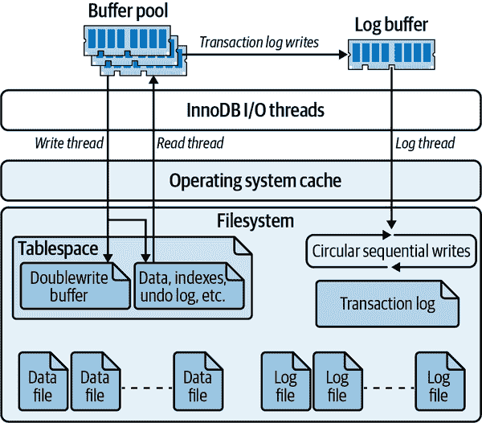

# 第五章：优化服务器设置

在本章中，我们将解释一个过程，通过这个过程你可以为你的 MySQL 服务器创建一个合适的配置文件。这是一个迂回的旅程，有许多有趣的地方和风景名胜。这些旁支旅程是必要的。确定适当配置的最短路径并不是从研究配置选项和询问应该设置哪些选项或如何更改它们开始。也不是从检查服务器行为和询问是否有任何配置选项可以改进它开始。最好从理解 MySQL 的内部机制和行为开始。然后你可以将这些知识用作如何配置 MySQL 的指南。最后，你可以将期望的配置与当前配置进行比较，并纠正任何重要且有价值的差异。

人们经常问：“对于拥有 32GB RAM 和 12 个 CPU 核心的服务器，最佳配置文件是什么？”不幸的是，事情并不那么简单。你应该根据工作负载、数据和应用程序要求来配置服务器，而不仅仅是硬件。MySQL 有许多设置可以更改，但你不应该这样做。通常最好正确配置基本设置（在大多数情况下只有少数几个是重要的），并花更多时间在模式优化、索引和查询设计上。在正确设置 MySQL 的基本配置选项之后，进一步更改的潜在收益通常很小。

另一方面，随意更改配置的潜在风险是巨大的。MySQL 的默认设置是有充分理由的。不明确地了解影响就进行更改可能导致崩溃、持续停顿或性能下降。因此，你永远不应该盲目相信像 MySQL 论坛或 Stack Overflow 这样的热门帮助网站上的某人报告的最佳配置。始终通过阅读相关手册条目并仔细测试来审查任何更改。

那么你应该做什么呢？你应该确保像 InnoDB 缓冲池和日志文件大小这样的基本设置是合适的。然后，如果你想要防止不良行为，你应该设置一些安全选项（但请注意，这些通常不会提高性能，它们只会避免问题）。然后就让其他设置保持不变。如果你遇到问题，首先要仔细诊断。如果你的问题是由服务器的某个部分造成的，而这个部分的行为可以通过配置选项进行更正，那么你可能需要进行更改。

有时候你可能还需要设置特定的配置选项，这些选项在特殊情况下可能会对性能产生显著影响。然而，这些选项不应该是基本服务器配置文件的一部分。只有在发现它们解决的具体性能问题时才应该设置它们。这就是为什么我们不建议你通过寻找需要改进的坏事来处理配置选项。如果有什么需要改进的，它应该在查询响应时间中显示出来。最好从查询和它们的响应时间开始搜索，而不是从配置选项开始。这可以为你节省大量时间并避免许多问题。

另一个节省时间和麻烦的好方法是除非你知道你不应该，否则使用默认设置。人多力量大，很多人都在使用默认设置。这使得它们成为经过最彻底测试的设置。不必要更改事物时可能会出现意外错误。

# MySQL 的配置工作原理

我们将首先解释 MySQL 的配置机制，然后再讨论你应该在 MySQL 中配置什么。MySQL 通常对其配置相当宽容，但遵循这些建议可能会为你节省大量工作和时间。

首先要了解的是 MySQL 从哪里获取配置信息：从命令行参数和配置文件中的设置。在类 Unix 系统上，配置文件通常位于 */etc/my.cnf* 或 */etc/mysql/my.cnf*。如果您使用操作系统的启动脚本，这通常是您指定配置设置的唯一位置。如果您手动启动 MySQL，可能在运行测试安装时会这样做，您也可以在命令行上指定设置。服务器实际上会读取配置文件的内容，删除任何注释行和换行符，然后与命令行选项一起处理。

###### 警告

您决定永久使用的任何设置都应放入全局配置文件中，而不是在命令行中指定。否则，您可能会意外地启动服务器而没有这些设置。另外，将所有配置文件放在一个地方也是个好主意，这样您可以轻松检查它们。

请确保知道服务器的配置文件位于何处！我们曾见过一些人试图使用服务器不读取的文件进行配置，例如 Debian 服务器上的 */etc/my.cnf*，而这些服务器会在 */etc/mysql/my.cnf* 中查找配置。有时会有文件位于多个配置，也许是因为以前的系统管理员也感到困惑。如果您不知道服务器读取哪些文件，可以询问它：

```sql
$ which mysqld
/usr/sbin/mysqld
$ */usr/sbin/mysqld --verbose --help | grep -A 1 'Default options'*
Default options are read from the following files in the given order:
/etc/mysql/my.cnf ~/.my.cnf /usr/etc/my.cnf
```

配置文件采用标准的 INI 格式，并分为多个部分，每个部分以包含部分名称的方括号开头的行开始。MySQL 程序通常会读取与该程序同名的部分，许多客户端程序也会读取 `client` 部分，这为您提供了一个放置常见设置的地方。服务器通常会读取 `mysqld` 部分。请确保将设置放在文件中的正确部分，否则它们将不起作用。

## 语法、作用域和动态性

配置设置以全小写形式编写，单词之间用下划线或破折号分隔。以下是等效的写法，在命令行和配置文件中可能会看到这两种形式：

```sql
/usr/sbin/mysqld --auto-increment-offset=5
/usr/sbin/mysqld --auto_increment_offset=5
```

我们建议您选择一种风格并保持一致。这样可以更容易地在文件中搜索设置。

配置设置可以具有多个作用域。一些设置是服务器范围的（全局作用域），其他设置对每个连接都不同（会话作用域），还有一些是针对每个对象的。许多会话作用域变量都有全局等效变量，您可以将其视为默认值。如果更改会话作用域变量，则仅影响更改它的连接，并且在连接关闭时更改将丢失。以下是您应该了解的各种行为的一些示例：

+   `max_connections` 变量是全局作用域的。

+   `sort_buffer_size` 变量具有全局默认值，但您也可以为每个会话设置它。

+   `join_buffer_size` 变量具有全局默认值，并且可以为每个会话设置，但是一个查询连接多个表可能会为每个连接分配一个连接缓冲区，因此可能会有多个连接缓冲区。

除了在配置文件中设置变量外，您还可以在服务器运行时更改许多（但不是全部）变量。MySQL 将这些称为*动态*配置变量。以下语句展示了动态更改 `sort_buffer_size` 的会话和全局值的不同方法：

```sql
SET sort_buffer_size = <value>;
SET GLOBAL sort_buffer_size = <value>;
SET @@sort_buffer_size := <value>;
SET @@session.sort_buffer_size := <value>;
SET @@global.sort_buffer_size := <value>;
```

如果动态设置变量，请注意当 MySQL 关闭时这些设置将丢失。如果要保留设置，您必须更新配置文件。

###### 提示

如果您在服务器运行时设置变量的全局值，则当前会话和任何其他现有会话的值不受影响。如果您的客户端依赖于持久性数据库连接，请记住这一点。这是因为当连接创建时，会话值是从全局值初始化的。您应该在每次更改后检查`SHOW GLOBAL VARIABLES`的输出，以确保它产生了预期的效果。

您还可以使用`SET`命令为变量分配一个特殊值：关键字`DEFAULT`。将此值分配给会话作用域变量会将该变量设置为相应全局作用域变量的值。这对于将会话作用域变量重置为打开连接时的值非常有用。我们建议您不要将其用于全局变量，因为它可能不会达到您想要的效果——也就是说，它不会将值设置回您启动服务器时的值，甚至不会设置为配置文件中指定的值；它将变量设置为编译时的默认值。

## 持久化系统变量

如果所有这些变量作用域和配置业务还不够复杂，您还必须意识到，如果重新启动 MySQL，它将恢复到配置文件中的内容，即使您使用`SET GLOBAL`更改全局变量。这意味着您必须管理一个配置文件*和*MySQL 的运行时配置，并确保它们彼此保持同步。如果您想增加服务器的`max_connections`，您必须在每个运行实例上发出`SET GLOBAL max_connections`命令，然后跟着编辑配置文件以反映您的新配置。

MySQL 8.0 引入了一个名为[持久化系统变量](https://oreil.ly/ZDwXZ)的新功能，有助于使这个过程变得稍微简单一些。新的语法`SET PERSIST`现在允许您为运行时设置值一次，MySQL 将把这个设置写入磁盘，使其能够在下次重启时使用。

## 设置变量的副作用

动态设置变量可能会产生意想不到的副作用，比如刷新缓冲区中的脏块。在线更改哪些设置时要小心，因为这可能会导致服务器做大量工作。

有时您可以从变量的名称推断出其行为。例如，`max_heap_table_size`的功能就如其名：它指定了隐式内存临时表允许增长的*最大*大小。然而，命名约定并不完全一致，因此您不能总是通过查看名称来猜测变量的功能。

让我们看一下一些常用变量及更改它们动态的影响：

`table_open_cache`

设置此变量没有立即效果：效果会延迟到下次线程打开表时。当这种情况发生时，MySQL 会检查变量的值。如果值大于缓存中的表数，线程可以将新打开的表插入缓存中。如果值小于缓存中的表数，MySQL 会从缓存中删除未使用的表。

`thread_cache_size`

设置此变量没有立即效果：效果会延迟到下次连接关闭时。此时，MySQL 将检查缓存中是否有空间来存储线程。如果有，它会将线程缓存以便将来由另一个连接重用。如果没有，它会杀死线程而不是将其缓存。在这种情况下，缓存中的线程数以及线程缓存使用的内存量不会立即减少；只有当新连接从缓存中移除线程以使用它时，它才会减少。（MySQL 仅在连接关闭时添加线程到缓存中，并且仅在创建新连接时从缓存中删除线程。）

`read_buffer_size`

MySQL 不会为这个缓冲区分配任何内存，直到查询需要它，但然后它��即分配这里指定的整个内存块。

`read_rnd_buffer_size`

MySQL 不会为这个缓冲区分配任何内存，直到查询需要它，然后它只会分配所需的内存。（`max_​read_​rnd_buffer_size`这个名称更准确地描述了这个变量。）

官方的 MySQL 文档详细解释了这些变量的作用，这并不是一个详尽的列表。我们在这里的目标只是向你展示当你更改一些常见变量时可以期望的行为。

除非你知道这样做是正确的，否则不要全局提高每个连接设置的值。有些缓冲区即使不需要也会一次性分配，因此一个很大的全局设置可能是一个巨大的浪费。相反，当一个查询需要时，你可以提高这个值。

## 规划你的变量更改

在设置变量时要小心。更多并不总是更好，如果你将值设置得太高，你很容易引起问题：你可能会耗尽内存或导致服务器交换。

参考第二章，监控你的 SLOs 以确保你的更改不会影响客户体验。基准测试并不足够，因为它们不是真实的。如果你不测量服务器的实际性能，你可能会在不知情的情况下损害性能。我们看到许多情况下，有人更改了服务器的配置并认为它提高了性能，而实际上由于不同时间或不同日期的不同工作负载，服务器的性能整体上恶化了。

理想情况下，你正在使用版本控制系统跟踪对配置文件的更改。这种策略可以非常有效地将性能变化或 SLO 违规与特定配置更改相关联。只是要注意，默认情况下更改配置文件并不会做任何事情——你必须同时更改运行时设置。

在开始更改配置之前，你应该优化你的查询和模式，至少解决一些明显的问题，比如添加索引。如果你深入调整配置，然后更改查询或模式，你可能需要重新评估配置。请记住，除非你的硬件、工作负载和数据完全静态，否则你很可能需要稍后重新审视你的配置。事实上，大多数人的服务器甚至一天中的工作负载都不是完全稳定的——这意味着上午中间的“完美”配置并不适合下午中午！显然，追求神话般的“完美”配置是完全不切实际的。因此，你不需要从服务器中挤出每一丝性能；事实上，这样投入时间的回报可能非常小。我们建议你专注于优化你的高峰工作负载，然后在“足够好”的地方停下，除非你有理由相信你正在放弃重大的性能改进。

# 不要做什么

在开始服务器配置之前，我们想鼓励你避免一些我们发现有风险或实际上不值得努力的常见做法。警告：下面有抱怨！

你可能期望（或者认为你被期望）建立一个基准测试套件，并通过迭代更改其配置来“调整”服务器以寻找最佳设置。这通常不是我们建议大多数人做的事情。这需要很多工作和研究，而在大多数情况下潜在回报是如此之小，以至于可能是一种巨大的时间浪费。你可能最好将那些时间花在其他事情上，比如检查你的备份，监控查询计划的变化等等。

你不应该“按比率调优”。经典的“调优比率”是一个经验法则，即你的 InnoDB 缓冲池命中率应该高于某个百分比，如果命中率太低，你应该增加缓存大小。这是非常错误的建议。不管别人告诉你什么，*缓存命中率与缓存是太大还是太小无关*。首先，命中率取决于工作负载——有些工作负载无论缓存有多大都无法缓存，其次，缓存命中是毫无意义的，我们稍后会解释原因。有时候当缓存太小时，命中率较低，增加缓存大小会增加命中率。然而，这只是一个偶然的相关性，并不表示任何关于性能或正确缓存大小的信息。

有时候看起来正确的相关性的问题在于人们开始相信它们将永远正确。Oracle DBA 多年前就放弃了基于比率的调优，我们希望 MySQL DBA 能够效仿他们的做法。我们更加热切地希望人们不要编写“调优脚本”，将这些危险的做法编码化并传授给成千上万的人。这导致了我们下一个建议：不要使用调优脚本！互联网上有几个非常流行的调优脚本。最好还是将它们忽略掉。

我们还建议你避免使用*调优*这个词，我们在过去几段中大量使用了这个词。我们更倾向于使用*配置*或*优化*（只要你确实在做这个）。*调优*这个词让人联想到一个无纪律的新手，调整服务器然后看看发生了什么。我们在前一节中建议这种做法最好留给那些正在研究服务器内部的人。“调优”你的服务器可能是一种令人惊讶的时间浪费。

在相关主题上，搜索互联网上的配置建议并不总是一个好主意。你可以在博客、论坛等地方找到很多错误的建议。尽管许多专家在线贡献他们所知道的东西，但很难判断谁是合格的。当然，我们无法对在哪里找到真正专家给出公正的建议。但我们可以说，可信赖的、声誉良好的 MySQL 服务提供商通常比简单的互联网搜索结果更可靠，因为拥有满意客户的人可能做对了一些事情。然而，即使是他们的建议，如果没有测试和理解，应用起来也可能是危险的，因为它可能是针对一个你不理解的与你的情况不同的情况。

最后，不要相信流行的内存消耗公式——是的，就是 MySQL 自己在崩溃时打印出来的那个。（我们不会在这里重复它。）这个公式来自一个古老的时代。这不是一个可靠甚至有用的了解 MySQL 在最坏情况下可以使用多少内存的方法。你可能在互联网上看到一些关于这个公式的变体。这些同样存在缺陷，即使它们添加了原始公式没有的更多因素。事实是你无法对 MySQL 的内存消耗设定上限。它不是一个严格控制内存分配的数据库服务器。

# 创建一个 MySQL 配置文件

正如我们在本章开头提到的，我们没有适用于比如说一个有 4 个 CPU、16GB 内存和 12 个硬盘的服务器的“最佳配置文件”。你确实需要开发自己的配置，因为即使一个良好的起点也会根据你如何使用服务器而有很大的不同。

## 最小配置

我们为本书创建了一个最小的示例配置文件，你可以将其用作你自己服务器的良好起点。你必须为一些设置选择值；我们稍后会在本章解释这些设置。我们的基础文件，围绕 MySQL 8.0 构建，看起来像这样：

```sql
[mysqld]
# GENERAL
datadir                                  = /var/lib/mysql
socket                                   = /var/lib/mysql/mysql.sock
pid_file                                 = /var/lib/mysql/mysql.pid
user                                     = mysql
port                                     = 3306
# INNODB
innodb_buffer_pool_size                  = <value>
innodb_log_file_size                     = <value>
innodb_file_per_table                    = 1
innodb_flush_method                      = O_DIRECT
# LOGGING
log_error                                = /var/lib/mysql/mysql-error.log
log_slow_queries                         = /var/lib/mysql/mysql-slow.log
# OTHER
tmp_table_size                           = 32M
max_heap_table_size                      = 32M
max_connections                          = <value>
thread_cache_size                        = <value>
table_open_cache                         = <value>
open_files_limit                         = 65535
[client]
socket                                   = /var/lib/mysql/mysql.sock
port                                     = 3306

```

这与您习惯看到的可能*太*简单了，但实际上已经超出了许多人的需求。还有一些其他类型的配置选项，您可能也会经常使用，比如二进制日志记录；我们将在本章和其他章节中详细介绍这些内容。

我们配置的第一件事是数据的位置。我们选择了*/var/lib/mysql*，因为这是许多 Unix 变体上的常用位置。选择其他位置也没有问题；由您决定。我们将*.pid*文件放在相同位置，但许多操作系统可能希望将其放在*/var/run*中。这也可以。我们只是需要为这些设置配置一些内容。顺便说一句，不要让套接字和*.pid*文件根据服务器的编译默认位置放置；各种 MySQL 版本中可能会出现一些错误，可能会导致问题。最好明确设置这些位置。（我们不建议选择不同的位置；我们只建议确保*my.cnf*文件明确提到这些位置，这样在升级服务器时它们不会更改并破坏事情。）

我们还指定了*mysqld*应以操作系统上的*mysql*用户帐户运行。您需要确保此帐户存在，并且拥有数据目录和其中的所有文件。端口设置为默认的`3306`，但有时您可能需要更改。

在 MySQL 8.0 中，引入了一个新的配置选项，`innodb_dedicated_server`。此选项会检查服务器上的可用内存，并适当配置四个附加变量（`innodb_buffer_pool_size`、`innodb_log_file_size`、`innodb_log_files_in_group`和`innodb_flush_method`）以用于专用数据库服务器，这简化了计算和更改这些值。在云环境中，这可能特别有用，您可能会运行具有 128 GB RAM 的虚拟机（VM），然后重新启动以扩展到 256 GB RAM。MySQL 在这里将自动配置，您无需管理更改配置文件中的值。这通常是管理这四个设置的最佳方法。

我们示例文件中的大多数其他设置都相当容易理解，其中许多是主观判断的问题。我们将在本章的其余部分探讨其中几个。我们还将在本章后面讨论一些安全设置，这些设置可以帮助使您的服务器更加健壮，并有助于防止糟糕的数据和其他问题。我们这里不展示这些设置。

这里要解释的一个设置是`open_files_limit`选项。在典型的 Linux 系统上，我们将其设置为尽可能大。在现代操作系统上，打开文件句柄非常便宜。如果此设置不够大，您将看到错误 24，“打开文件过多”。

跳到最后，配置文件中的最后一节是用于*mysql*和*mysqladmin*等客户端程序的，只是让它们知道如何连接到服务器。您应该设置客户端程序的值与您为服务器选择的值相匹配。

## 检查 MySQL 服务器状态变量

有时，您可以使用`SHOW GLOBAL STATUS`的输出作为配置的输入，以帮助更好地为您的工作负载定制设置。为了获得最佳结果，最好同时查看绝对值和值随时间变化的情况，最好在高峰和低峰时间进行多次快照。您可以使用以下命令每 60 秒查看状态变量的增量变化：

```sql
$ mysqladmin extended-status -ri60
```

当我们解释各种配置设置时，我们经常会提到随时间变化的状态变量的变化。通常我们期望您检查类似我们刚刚展示的命令的输出。其他有用的工具，可以提供紧凑的状态计数器变化显示的有 Percona Toolkit 的*pt-mext*或*pt-mysql-summary*。

现在我们已经向你展示了一些基础知识，我们将带你参观一些服务器内部，并交替提供配置建议。这将为你选择适当的配置选项值提供所需的背景知识，当我们稍后返回示例配置文件时。

# 配置内存使用

使用`innodb_dedicated_server`通常会使用 50%–75%的 RAM。这至少为每个连接的内存分配、操作系统开销和其他内存设置留出了 25%。我们将在接下来的部分详细介绍每一个，并然后更详细地查看各种 MySQL 缓存的需求。

## 每个连接的内存需求

MySQL 需要一小部分内存来保持连接（通常与一个关联的专用线程）的打开状态。它还需要一定的内存来执行任何给定的查询。你需要为 MySQL 在高负载时段执行查询留出足够的内存。否则，你的查询将因内存不足而运行不佳或失败。

了解 MySQL 在高峰使用期间将消耗多少内存是有用的，但某些使用模式可能会意外地消耗大量内存，这使得难以预测。准备好的语句就是一个例子，因为你可以同时打开许多这样的语句。另一个例子是 InnoDB 数据字典（稍后会详细介绍）。

在尝试预测峰值内存消耗时，你不需要假设最坏情况。例如，如果你配置 MySQL 允许最多一百个连接，理论上可能同时在所有一百个连接上运行大型查询，但实际上这可能不会发生。使用许多大型临时表或复杂存储过程的查询是高每个连接内存消耗的最有可��的原因。

## 为操作系统保留内存

就像查询一样，你需要为操作系统保留足够的内存来完成其工作。这涉及运行任何本地监控软件、配置管理工具、定期作业等。操作系统有足够内存的最好指标是它没有主动将虚拟内存交换（分页）到磁盘。

## InnoDB 缓冲池

InnoDB 缓冲池需要比其他任何东西都更多的内存，因为它通常是性能的最重要变量。InnoDB 缓冲池不仅仅缓存索引：它还保存行数据、自适应哈希索引、更改缓冲区、锁定和其他内部结构。InnoDB 还使用缓冲池来帮助延迟写入，这样它可以合并许多写入并按顺序执行它们。简而言之，InnoDB 严重依赖于缓冲池，你应该确保为其分配足够的内存。你可以使用`SHOW`命令的变量或诸如*innotop*之类的工具来监视你的 InnoDB 缓冲池的内存使用情况。

如果你没有太多数据，并且知道你的数据不会快速增长，那么你不需要为缓冲池过度分配内存。将其大小远远大于它将容纳的表和索引的大小并不真正有益。当然，提前规划一个快速增长的数据库也没有错，但有时我们会看到一个微不足道的数据量却有着巨大的缓冲池。这是不必要的。

大型缓冲池带来一些挑战，例如长时间的关闭和热身时间。如果缓冲池中有许多脏（修改的）页面，InnoDB 在关闭时可能需要很长时间，因为它会在关闭时将脏页写入数据文件。你可以强制它快速关闭，但然后它只需在重新启动时执行更多的恢复，因此实际上无法加快关闭和重新启动周期时间。如果你事先知道需要关闭的时间，可以在运行时将`innodb_max_dirty_pages_pct`变量更改为较低的值，等待刷新线程清理缓冲池，然后在脏页数量变少时关闭。你可以通过观察`innodb_buffer_pool_pages_dirty`服务器状态变量或使用*innotop*监视`SHOW INNODB STATUS`来监视脏页的数量。你还可以使用变量`innodb_fast_shutdown`来调整关闭的方式。

降低`innodb_max_dirty_pages_pct`变量的值并不能保证 InnoDB 在缓冲池中保留较少的脏页。相反，它控制了 InnoDB 停止“懒惰”的阈值。InnoDB 的默认行为是使用后台线程刷新脏页，将写操作合并在一起并按顺序执行以提高效率。这种行为被称为“懒惰”，因为它允许 InnoDB 延迟刷新缓冲池中的脏页，除非需要为其他数据使用空间。当脏页的百分比超过阈值时，InnoDB 会尽快刷新页面，以尝试保持较低的脏页计数。这些页面清理操作已经从以前的行为中得到了很大的[优化](https://oreil.ly/S8ong)，包括能够配置多个线程执行刷新。

当 MySQL 再次启动时，缓冲池缓存为空，也称为*冷缓存*。现在，将所有行和页面放入内存的好处都消失了。幸运的是，默认情况下，配置选项`innodb_buffer_pool_dump_at_shutdown`和`innodb_buffer_pool_load_at_startup`一起在启动时使服务器变热。启动时的加载需要时间，但它可以比等待自然填充更快地提高服务器的性能。

## 线程缓存

线程缓存保存着当前没有与连接关联但准备为新连接提供服务的线程。当缓存中有一个线程且创建了新连接时，MySQL 会将线程从缓存中移除并分配给新连接。当连接关闭时，如果有空间，MySQL 会将线程放回缓存中。如果没有空间，MySQL 会销毁线程。只要 MySQL 在缓存中有空闲线程，它就可以快速响应连接请求，因为它不必为每个连接创建新线程。

`thread_cache_size`变量指定 MySQL 可以在缓存中保留的线程数。除非你的服务器收到许多连接请求，否则你可能不需要将其从默认值`-1`或自动大小更改。要检查线程缓存是否足够大，请观察`Threads_created`状态变量。通常我们尝试保持线程缓存足够大，以便每秒创建的新线程少于 10 个，但通常很容易将这个数字降低到每秒不到一个。

一个好的方法是观察`Threads_connected`变量并尝试将`thread_cache_size`设置为足够大以处理工作负载的典型波动。例如，如果`Threads_connected`通常保持在 100 到 120 之间，你可以将缓存大小设置为 20。如果保持在 500 到 700 之间，200 个线程缓存应该足够大。可以这样想：在 700 个连接时，可能没有线程在缓存中；在 500 个连接时，有 200 个缓存线程准备在负载再次增加到 700 时使用。

使线程缓存非常大可能对大多数用途来说并不是必要的，但保持较小的线程缓存并不能节省太多内存，因此这样做几乎没有什么好处。每个在线程缓存中或正在休眠的线程通常使用大约 256 KB 的内存。与连接在积极处理查询时线程可以使用的内存量相比，这并不多。一般来说，你应该保持线程缓存足够大，以便`Threads_created`不会经常增加。然而，如果这是一个非常大的数字（例如，成千上万的线程），你可能希望将其设置得更低，因为一些操作系统即使大多数线程处于休眠状态时也无法很好地处理非常大的线程数量。

# 配置 MySQL 的 I/O 行为

一些配置选项会影响 MySQL 如何将数据同步到磁盘并执行恢复操作。这些选项可能会对性能产生显著影响，因为它们涉及 I/O 操作。它们也代表了性能和数据安全之间的权衡。一般来说，确保数据立即和一致地写入磁盘是很昂贵的。如果你愿意冒磁盘写入可能不会真正到达永久存储的风险，你可以增加并发性和/或减少 I/O 等待时间，但你必须自己决定可以容忍多少风险。

InnoDB 允许你控制它的恢复方式以及如何打开和刷新其数据，这对恢复和整体性能有很大影响。InnoDB 的恢复过程是自动的，并且总是在 InnoDB 启动时运行，尽管你可以影响它采取的行动。撇开恢复不谈，假设从不崩溃或出现问题，对于 InnoDB 仍有很多配置要做。它有一个复杂的缓冲区和文件链设计用于提高性能并保证 ACID 属性，每个链的部分都是可配置的。图 5-1 说明了这些文件和缓冲区。

对于正常使用来说，需要更改的一些最重要的事项是 InnoDB 日志文件大小、InnoDB 如何刷新其日志缓冲区以及 InnoDB 如何执行 I/O。



###### 图 5-1。InnoDB 的缓冲区和文件

## InnoDB 事务日志

InnoDB 使用其日志来降低提交事务的成本。它不是在每个事务提交时将缓冲池刷新到磁盘，而是记录事务。事务对数据和索引所做的更改通常映射到表空间中的随机位置，因此将这些更改刷新到磁盘将需要随机 I/O。InnoDB 假设它正在使用传统磁盘，其中随机 I/O 比顺序 I/O 更昂贵，因为寻找正确位置并等待所需部分磁盘旋转到磁头下的时间更长。

InnoDB 使用��日志将这种随机磁盘 I/O 转换为顺序 I/O。一旦日志安全地存储在磁盘上，事务就是永久的，即使更改尚未写入数据文件。如果发生不良事件（例如断电），InnoDB 可以重放日志并恢复已提交的事务。

当然，InnoDB 最终必须将更改写入数据文件，因为日志的大小是固定的。它以循环方式写入日志：当它到达日志末尾时，它会回到开头。如果尚未将其中包含的更改应用于数据文件，它不能覆盖日志记录，因为这将擦除已提交事务的唯一永久记录。

InnoDB 使用后台线程智能地将更改刷新到数据文件。该线程可以将写入组合在一起，并使数据写入顺序以提高效率。实际上，事务日志将随机数据文件 I/O 转换为主要是顺序的日志文件和数据文件 I/O。将刷新移到后台使查询更快完成，并帮助缓冲 I/O 系统免受查询负载的波动影响。

日志文件的整体大小由`innodb_log_file_size`和`innodb_​log_​files_in_group`控制，对写入性能非常重要。如果您遵循我们之前的建议并使用`innodb_dedicated_server`，则根据系统内存量来管理这些设置。

## 日志缓冲区

当 InnoDB 更改任何数据时，它会将更改记录写入其保存在内存中的*日志缓冲区*。当缓冲区变满、事务提交或每秒一次时，InnoDB 会将缓冲区刷新到磁盘上的日志文件。增加缓冲区大小（默认为 1 MB）可以帮助减少 I/O，特别是对于大型事务。控制缓冲区大小的变量称为`innodb_log_buffer_size`。

通常不需要使缓冲区非常大。推荐的范围是 1-8 MB，这通常足够，除非您写入大量巨大的`BLOB`记录。与 InnoDB 的正常数据相比，日志条目非常紧凑。它们不是基于页面的，因此不会浪费空间一次存储整个页面。InnoDB 还尽可能地使日志条目短小。有时甚至将它们存储为几个整数，指示记录的操作类型和该操作所需的任何参数！

### InnoDB 如何刷新日志缓冲区

当 InnoDB 将日志缓冲区刷新到磁盘上的日志文件时，它会使用互斥锁锁定缓冲区，将其刷新到所需点，然后将任何剩余条目移动到缓冲区的前面。当互斥锁被释放时，可能会有多个事务准备刷新其日志条目。InnoDB 使用组提交功能，可以将所有这些事务一次性提交到日志中。

必须将日志缓冲区刷新到持久存储以确保已提交的事务完全持久。如果您更关心性能而不是持久性，可以更改`innodb_flush_log_at_trx_commit`以控制何时以及多频繁刷新日志缓冲区。

可能的设置如下：

`0`

将日志缓冲区写入日志文件并每秒刷新一次日志文件，但在事务提交时不执行任何操作。

`1`

将日志缓冲区写入日志文件并在每次事务提交时刷新到持久存储。这是默认（也是最安全）的设置；它保证您不会丢失任何已提交的事务，除非磁盘或操作系统“伪造”刷新操作。

`2`

在每次提交时将日志缓冲区写入日志文件，但不要刷新它。InnoDB 每秒调度一次刷新。与`0`设置最重要的区别是，如果 MySQL 进程崩溃，`2`不会丢失任何事务。但是，如果整个服务器崩溃或断电，您仍然可能会丢失事务。

重要的是要知道将日志缓冲区写入日志文件和将日志刷新到持久存储之间的区别。在大多数操作系统中，将缓冲区写入日志只是将数据从 InnoDB 的内存缓冲区移动到操作系统的缓存中，该缓存也位于内存中。它实际上并没有将数据写入持久存储。因此，设置`0`和`2`通常会导致在崩溃或停电时最多丢失一秒钟的数据，因为数据可能仅存在于操作系统的缓存中。我们说“通常”是因为 InnoDB 会尝试无论如何每秒刷新一次日志文件到磁盘，但在某些情况下可能会丢失超过一秒钟的事务，例如刷新被阻塞时。

有时硬盘控制器或操作系统通过将数据放入另一个缓存中（例如硬盘自己的缓存）来伪造刷新。这样做更快，但非常危险，因为如果驱动器断电，数据可能仍然会丢失。这比将`innodb_flush_log_at_trx_commit`设置为`1`更糟糕，因为它可能导致数据损坏，而不仅仅是丢失事务。

将`innodb_flush_log_at_trx_commit`设置为除`1`之外的任何值可能会导致您丢失事务。但是，如果您不关心耐久性（ACID 中的 D），则可能会发现其他设置有用。也许您只想要 InnoDB 的其他一些功能，例如聚集索引、抗数据损坏和行级锁定。

高性能事务需求的最佳配置是将`innodb_flush_log_at_trx_commit`设置为`1`，并将日志文件放在具有带电池支持写缓存和固态硬盘的 RAID 卷上。这既安全又非常快速。事实上，我们敢说，任何预计要处理严重工作负载的生产数据库服务器都需要具有这种硬件。

### 如何打开和刷新 InnoDB 的日志文件和数据文件

`innodb_flush_method`选项允许您配置 InnoDB 实际与文件系统的交互方式。尽管它的名称是这样，但它也影响 InnoDB 读取数据的方式，而不仅仅是写入数据的方式。

###### 警告

更改 InnoDB 执行 I/O 操作的方式可能会极大地影响性能，因此在更改任何内容之前，请确保您了解自己在做什么！

这是一个稍微令人困惑的选项，因为它既影响日志文件又影响数据文件，并且有时对每种类型的文件执行不同的操作。希望有一个配置选项用于日志和另一个用于数据文件，但它们被合并在一起。

如果您使用类 Unix 操作系统，并且您的 RAID 控制器具有带电池支持写缓存，我们建议您使用`O_DIRECT`。如果没有，无论是默认设置还是`O_DIRECT`都可能是最佳选择，这取决于您的应用程序。如果您选择使用我们之前提到的`innodb_dedicated_server`，此选项将自动为您设置。

## InnoDB 表空间

InnoDB 将其数据保存在一个*表空间*中，这实质上是一个跨越磁盘上一个或多个文件的虚拟文件系统。InnoDB 使用表空间不仅用于存储表和索引，还用于许多其他目的。它在表空间中保存其撤销日志（重新创建旧行版本所需的信息）、更改缓冲区、双写缓冲区和其他内部结构。

### 配置表空间

您可以使用`innodb_data_file_path`配置选项指定表空间文件。所有文件都包含在由`innodb_data_home_dir`给定的目录中。以下是一个示例：

```sql
innodb_data_home_dir = /var/lib/mysql/
innodb_data_file_path = ibdata1:1G;ibdata2:1G;ibdata3:1G
```

这将创建一个 3 GB 的表空间，分为三个文件。有时人们会想知道是否可以使用多个文件将负载分布到不同的驱动器上，就像这样：

```sql
innodb_data_file_path = /disk1/ibdata1:1G;/disk2/ibdata2:1G;...
```

尽管确实将文件放置在不同目录中，这些目录在此示例中代表不同的驱动器，但 InnoDB 会将文件端对端连接起来。因此，通常你不会通过这种方式获得太多好处。InnoDB 会填满第一个文件，然后在第一个文件满时填满第二个文件，依此类推；负载并没有以你需要的方式分布以获得更高的性能。RAID 控制器是一种更智能的负载分布方式。

如果表空间空间不足而需要增长，您可以使最后一个文件自动扩展，如下所示：

```sql
...ibdata3:1G:autoextend
```

默认行为是创建一个单个 10 MB 的自动扩展文件。如果使文件自动扩展，最好设置表空间大小的上限，以防止其变得非常大，因为一旦增长，就不会缩小。例如，以下限制了自动扩展文件为 2 GB：

```sql
...ibdata3:1G:autoextend:max:2G
```

管理单个表空间可能会很麻烦，特别是如果它自动扩展并且您想要回收空间（因此，我们建议禁用自动扩展功能，或者至少设置一个合理的空间上限）。回收空间的唯一方法是转储数据，关闭 MySQL，删除所有文件，更改配置，重新启动，让 InnoDB 创建新的空文件，并恢复数据。InnoDB 对其表空间非常严格：您不能简单地删除文件或更改其大小。如果破坏了其表空间，它将拒绝启动。它对其日志文件也非常严格。如果您习惯于像 MyISAM 一样随意移动文件，要小心！

`innodb_file_per_table`选项允许您配置 InnoDB 使用每个表一个文件。它将数据存储在数据库目录中的*tablename.ibd*文件中。这样在删除表时更容易回收空间。然而，将数据放在多个文件中实际上可能导致整体浪费更多空间，因为它将单个 InnoDB 表空间中的内部碎片换成了*.ibd*文件中的浪费空间。

即使启用了`innodb_file_per_table`选项，您仍然需要主表空间来存储撤销日志和其他系统数据。如果不将所有数据存储在其中，则其大小会更小。

有些人喜欢使用`innodb_file_per_table`仅仅是因为它给您带来额外的可管理性和可见性。例如，通过检查单个文件来查找表的大小要比使用`SHOW TABLE STATUS`更快，后者必须执行更复杂的工作来确定为表分配了多少页。

###### 警告

`innodb_file_per_table`一直存在一个阴暗面：`DROP TABLE`性能慢。这可能严重到足以导致整个服务器出现明显的停顿，原因有两个。

删除表会在文件系统级别取消链接（删除）文件，在某些文件系统上可能会非常慢（ext3，我们在看你）。您可以通过文件系统上的技巧缩短此过程的持续时间：将*.ibd*文件链接到一个大小为零的文件，然后手动删除文件，而不是等待 MySQL 执行此操作。

当您启用此选项时，每个表在 InnoDB 内部都有自己的表空间。事实证明，删除表空间实际上需要 InnoDB 锁定并扫描缓冲池，同时查找属于该表空间的页面，在具有大缓冲池的服务器上非常慢。如果使用`innodb_buffer_pool_instances`将缓冲池分成多个部分，这将得到改善。

在 MySQL 的各个版本中已经应用了几个修复程序。截至 8.0.23，这不应再是一个问题。

最终的建议是什么？我们建议您使用`innodb_file_per_table`并限制共享表空间的大小，以使您的生活更轻松。如果遇到任何使这变得痛苦的情况，如前所述，请考虑我们建议的其中一种修复方法。

### 旧的行版本和表空间

在写入密集的环境中，InnoDB 的表空间可能会变得非常大。如果事务保持打开状态很长时间（即使它们没有执行任何工作），并且它们使用默认的`REPEATABLE READ`事务隔离级别，InnoDB 将无法删除旧的行版本，因为未提交的事务仍需要能够查看它们。InnoDB 将旧版本存储在表空间中，因此随着更新更多数据，它将继续增长。清除过程是多线程的，但如果您遇到清除滞后问题（`innodb_​purge_threads`和`innodb_purge_batch_size`），可能需要对工作负载进行调整。

`SHOW INNODB STATUS`的输出可以帮助您准确定位问题。查看`TRANSACTIONS`部分中的历史列表长度；它显示了撤销日志的大小：

```sql
------------
TRANSACTIONS
------------
Trx id counter 1081043769321
Purge done for trx's n:o < 1081041974531 undo n:o < 0 state: running but idle
History list length 697068
```

如果您有一个大的撤销日志，并且您的表空间因此而增长，您可以强制 MySQL 减慢速度，以便 InnoDB 的清除线程跟得上。这听起来可能不那么吸引人，但没有其他选择。否则，InnoDB 将继续写入数据并填满您的磁盘，直到磁盘耗尽空间或表空间达到您定义的限制。

要限制写入速度，将`innodb_max_purge_lag`变量设置为非`0`值。此值表示在 InnoDB 开始延迟更新数据的进一步查询之前，可以等待清除的最大事务数。您需要了解您的工作负载以决定一个好的值。举个例子，如果您的平均事务影响 1 KB 的行，并且您的表空间可以容忍 100 MB 的未清除行，您可以将该值设置为`100000`。

请记住，未清除的行版本会影响所有查询，因为它们实际上会使您的表和索引变得更大。如果清除线程无法跟上，性能可能会下降。设置`innodb_max_purge_lag`变量也会降低性能，但这是两害相权取其轻的选择。

## 其他 I/O 配置选项

`sync_binlog`选项控制 MySQL 将二进制日志刷新到磁盘的方式。其默认值为`1`，这意味着 MySQL 将执行刷新并保持二进制日志持久和安全。这是推荐的设置，我们警告您不要将其设置为其他任何值。

如果您不将`sync_binlog`设置为`1`，很可能会导致崩溃使您的二进制日志与事务数据不同步。这很容易破坏复制并使恢复变得不可能，特别是如果您的数据库正在使用全局事务 ID（更多信息请参见第九章）。保持此设置为`1`提供的安全性远远超过产生的 I/O 性能惩罚。

我们在第四章中更深入地讨论了 RAID，但在这里值得重申，具有设置为使用写回策略的带电池支持写缓存的高质量 RAID 控制器可以处理成千上万次写入，并仍然为您提供持久性存储。数据被写入一个带电池的快速缓存中，因此即使系统断电，数据也会存活。当电源恢复时，RAID 控制器将从缓存中将数据写入磁盘，然后使磁盘可供使用。因此，具有足够大的带电池支持写缓存的良好 RAID 控制器可以显着提高性能，并且是非常值得投资的。当然，固态存储也是目前推荐的解决方案，可以显著提高 I/O 性能。

# 配置 MySQL 并发性

当您在高并发工作负载中运行 MySQL 时，您可能会遇到在其他情况下不会遇到的瓶颈。本节解释了如何在发生这些问题时检测这些问题，并如何在这些工作负载下获得最佳性能。

如果您在 InnoDB 并发性方面遇到问题，并且您的 MySQL 版本低于 5.7，解决方案通常是升级服务器。旧版本仍存在许多高并发性可扩展性挑战。所有排队在全局互斥体上，如缓冲池互斥体，服务器实际上几乎停滞不前。如果您升级到较新版本的 MySQL，大多数情况下不需要限制并发性。

如果发现自己遇到了这个瓶颈，最好的选择是对数据进行分片。如果分片不是可行的解决方案，可能需要限制并发性。InnoDB 有自己的“线程调度器”，控制着线程如何进入其内核以访问数据以及它们在内核内部可以做什么。限制并发性的最基本方法是使用`innodb_thread_concurrency`变量，它限制了同时可以在内核中的线程数量。值为`0`表示线程数量没有限制。如果在较旧的 MySQL 版本中遇到 InnoDB 并发问题，那么这个变量是最重要的一个需要配置的。

[MySQL 的在线文档](https://oreil.ly/ThOBP)提供了这里配置的最佳指南。您将不得不进行实验，找到适合您系统的最佳值，但我们建议从将`innodb_thread_concurrency`设置为可用 CPU 核心数量开始，然后根据需要进行调整。

如果已经有超过允许数量的线程在内核中，线程就无法进入内核。InnoDB 使用两阶段过程尝试让线程尽可能高效地进入。两阶段策略减少了由操作系统调度程序引起的上下文切换开销。线程首先休眠`innodb_thread_sleep_delay`微秒，然后再次尝试。如果仍然无法进入，它将进入等待线程队列，并让出给操作系统。

第一阶段的默认睡眠时间为 10,000 微秒。在高并发环境下，当 CPU 未充分利用且有大量线程处于“进入队列前休眠”状态时，更改此值可能有所帮助。如果有大量小查询，那么默认值可能过大，因为它会增加查询延迟。

一旦线程进入内核，它就有一定数量的“票”，让它可以“免费”地重新进入内核，而无需进行任何并发检查。这限制了它在必须重新排队与其他等待线程之前可以完成的工作量。`innodb_concurrency_tickets`选项控制票的数量。除非有大量运行时间极长的查询，否则很少需要更改。票据是按查询而不是按事务授予的。一旦查询完成，未使用的票据将被丢弃。

除了缓冲池和其他结构中的瓶颈外，在提交阶段还存在另一个并发瓶颈，这主要是由于刷新操作而导致的 I/O 绑定。`innodb_commit_concurrency`变量控制着同时可以提交的线程数量。如果即使将`innodb_thread_concurrency`设置为较低值时仍然存在大量线程抖动，配置此选项可能会有所帮助。

# 安全设置

在基本配置设置完成后，您可能希望启用一些使服务器更安全和可靠的设置。其中一些会影响性能，因为安全性和可靠性通常更昂贵。但有些只是明智的：它们防止插入荒谬数据到服务器中。还有一些在日常运营中没有影响，但可以防止在边缘情况下发生糟糕的事情。

让我们首先看一些通用服务器行为的有用选项集：

`max_connect_errors`

如果您��网络出现问题一小段时间，存在应用程序或配置错误，或者有其他问题导致连接在短时间内无法成功完成，客户端可能会被阻塞，并且无法再次连接，直到刷新主机缓存。此选项的默认设置（`100`）太小，以至于这个问题可能会太容易发生。您可能希望增加它，实际上，如果您知道服务器已充分防范了暴力攻击，您可以将其设置得非常大，以有效地禁用由于连接错误而阻止主机的功能。但是，如果启用了`skip_name_resolve`，`max_connect_errors`选项将不起作用，因为其行为取决于*主机*缓存，而`skip_name_resolve`已禁用了主机缓存。

`max_connections`

此设置就像一个紧急刹车，防止您的服务器被应用程序的连接激增所淹没。如果应用程序表现不佳或服务器遇到问题，如停顿，可能会打开大量新连接。但如果无法执行查询，那么打开连接是没有用的，因此被拒绝并显示“连接过多”错误是一种快速失败和廉价失败的方式。

将`max_connections`设置得足够高，以容纳您认为会经历的常规负载以及一个安全裕度，以便登录和管理服务器。例如，如果您认为在正常运作中会有大约 300 个连接，您可能会将其设置为 500 左右。如果您不知道会有多少连接，500 也不是一个不合理的起点。默认值为 151，但对许多应用程序来说这是不够的。

还要注意可能导致连接限制的意外情况。例如，如果重新启动应用程序服务器，它可能不会干净地关闭其连接，而 MySQL 可能不会意识到这些连接已关闭。当应用程序服务器重新启动并尝试打开到数据库的连接时，可能会因尚未超时的死连接而被拒绝。如果您不使用持久连接，且您的应用程序没有正常断开连接，这也可能发生。服务器将保留连接直到达到 TCP 超时或者在最坏的情况下，直到使用`wait_timeout`配置的秒数。

随着时间的推移，观察`max_used_connections`状态变量。这是一个高水位标记，显示服务器是否在某个时间点出现了连接激增。如果达到`max_connections`，很有可能至少有一个客户端被拒绝过。

`skip_name_resolve`

此设置禁用了另一个与网络和身份验证相关的陷阱：DNS 查找。DNS 是 MySQL 连接过程中的一个弱点。当您连接到服务器时，默认情况下会尝试确定您连接的主机名，并将其用作身份验证凭据的一部分（也就是说，您的凭据是您的用户名、主机名和密码，而不仅仅是用户名和密码）。但要验证您的主机名，服务器需要执行一个正向确认的反向 DNS 查找（或“双重反向 DNS 查找”），在接受连接之前需要进行反向和正向 DNS 查找。这一切都很好，直到 DNS 开始出现问题，这在某个时间点几乎是肯定的。当发生这种情况时，一切都会积累起来，最终连接会超时。为了防止这种情况发生，我们强烈建议您设置此选项，该选项在身份验证期间禁用 DNS 查找。但是，如果您这样做，您将需要将所有基于主机名的授权转换为使用 IP 地址、通配符或特殊主机名“localhost”，因为基于主机名的帐户将被禁用。

`sql_mode`

此设置可以接受多种修改服务器行为的选项。我们不建议仅仅出于好玩而更改这些设置；最好让 MySQL 保持 MySQL 的大部分特性，不要试图使其像其他数据库服务器一样运行。（许多客户端和 GUI 工具期望 MySQL 具有自己的 SQL 风格，例如，如果您将其更改为使用更符合 ANSI 标准的 SQL，可能会导致某些功能出现问题。）但是，其中几个设置非常有用，某些情况下可能值得考虑。过去，MySQL 通常对`sql_mode`非常宽松，但在后续版本中变得更加严格。

但是，请注意，对于现有应用程序更改这些设置可能不是一个好主意，因为这样做可能会使服务器与应用程序的期望不兼容。例如，人们很常见地无意中编写查询，引用了`GROUP BY`子句中不存在的列或使用聚合函数，因此，如果您想启用`ONLY_FULL_GROUP_BY`选项，最好先在开发或分段服务器上执行，只有在确保一切正常运行后才在生产环境中部署。

此外，在计划升级数据库时，请务必检查默认`sql_mode`的更改。对此变量的更改可能与您现有的应用程序不兼容，您需要提前进行测试。我们在附录 A 中更详细地讨论升级问题。

`sysdate_is_now`

这是另一个可能与应用程序期望不兼容的设置。但是，如果您不明确希望`SYSDATE()`函数具有非确定性行为，这可能会破坏复制并使来自备份的时间点恢复不可靠，您可能希望启用此选项并使其行为确定性。

`read_only`和`super_read_only`

`read_only`选项防止非特权用户在副本上进行更改，副本应该仅通过复制接收更改，而不是来自应用程序。我们强烈建议将副本设置为只读模式。

还有一个更为严格的只读选项，`super_read_only`，即使具有`SUPER`特权的用户也无法写入数据。启用此选项后，唯一可以向数据库写入更改的是复制。我们还*强烈*建议启用`super_read_only`。这将防止您意外使用管理员帐户向只读副本写入数据，使其不同步。

# 高级 InnoDB 设置

一些 InnoDB 选项对服务器性能非常重要，还有一些安全选项：

`innodb_autoinc_lock_mode`

此选项控制 InnoDB 如何生成自增主键值，这在某些情况下可能成为瓶颈，例如高并发插入。如果有许多事务在等待自增锁（您可以在`SHOW ENGINE INNODB STATUS`中看到此信息），则应该调查此设置。我们不会重复手册对选项及其行为的解释。

`innodb_buffer_pool_instances`

此设置在 MySQL 5.5 及更高版本中将缓冲池分成多个段，可能是改善 MySQL 在具有高并发工作负载的多核机器上的可伸缩性的最重要方法之一。多个缓冲池将工作负载分区，以便一些全局互斥锁不会成为如此热点争用点。

`innodb_io_capacity`

InnoDB 过去被硬编码为假定其在能够进行一百次 I/O 操作的单个硬盘上运行。这是一个糟糕的默认设置。现在您可以告知 InnoDB 可用的 I/O 容量。有时 InnoDB 需要将此设置设置得非常高（例如在极快的存储设备上，如 PCIe 闪存设备上设置为数万次）以稳定地刷新脏页，原因相当复杂，难以解释。⁴

`innodb_read_io_threads`和`innodb_write_io_threads`

这些选项控制了可用于 I/O 操作的后台线程数量。在 MySQL 的最新版本中，默认设置为四个读线程和四个写线程，对于许多服务器来说已经足够了，尤其是自 MySQL 5.5 以来提供了本机异步 I/O。如果您有许多硬盘和高并发工作负载，并且发现线程难以跟上，您可以增加线程数量，或者您可以简单地将它们设置为您用于 I/O 的物理磁盘数量（即使它们位于 RAID 控制器后面）。

`innodb_strict_mode`

此设置使 InnoDB 在某些情况下（尤其是无效或可能危险的`CREATE TABLE`选项）抛出错误而不是警告。如果您启用此选项，请务必检查所有的`CREATE TABLE`选项，因为它可能不允许您创建一些以前可以的表。有时它有点悲观和过于限制性。您不希望在尝试恢复备份时才发现这一点。

`innodb_old_blocks_time`

InnoDB 有一个两部分��冲池 LRU 列表，旨在防止临时查询驱逐长期多次使用的页面。一次性查询（例如 *mysqldump* 发出的查询）通常会将页面带入缓冲池 LRU 列表，从中读取行，并继续下一个页面。理论上，两部分 LRU 列表将防止此页面驱逐需要长期存在的页面，将其放入“年轻”子列表中，并在多次访问后才将其移至“老”子列表。但默认情况下，InnoDB 未配置为防止这种情况发生，因为页面有多行，因此多次访问以读取行将导致其立即移至“老”子列表，对需要长寿命的页面施加压力。此变量指定页面从 LRU 列表的“年轻”部分移至“老”部分之前必须经过的毫秒数。默认设置为`0`，将其设置为一个小值，例如`1000`（一秒），在我们的基准测试中已被证明非常有效。

# 摘要

在您完成本章后，您应该拥有比默认配置好得多的服务器配置。您的服务器应该快速稳定，除非遇到异常情况，否则您不需要调整配置。

总结一下，我们建议您从我们的示例配置文件开始，为您的服务器和工作负载设置基本选项，并根据需要添加安全选项。这确实是您需要做的全部。

如果您正在运行专用数据库服务器，那么您可以设置的最佳选项是`innodb_dedicated_server`，它处理了您 90% 的性能配置。如果您无法使用此选项，则最重要的选项是这两个：

+   `innodb_buffer_pool_size`

+   `innodb_log_file_size`

恭喜您——您刚刚解决了我们见过的绝大多数真实世界配置问题！

我们还提出了很多关于不要做什么的建议。其中最重要的是不要“调整”您的服务器，也不要使用比率、公式或“调整脚本”作为设置配置变量的依据。

¹ 例如，如果关闭 MySQL 的耐久性设置，它可以运行得非常快，但也会在崩溃时使您的数据容易丢失。

² 如果您还不相信“按比率调整”是不好的，请阅读 [*优化 Oracle 性能*](https://oreil.ly/DWM2I) 一书，作者是 Cary Millsap 和 Jeff Holt（O’Reilly）。他们甚至在附录中专门讨论了这个主题，并提供了一个工具，可以人为生成任何您希望的缓存命中率，无论您的系统表现如何糟糕！当然，这都是为了说明比率是多么无用。

³ 请注意，MySQL 的各个版本会移除、弃用和更改一些选项；请查看文档以获取详细信息。

⁴ 有关后续阅读，请参阅 Percona 博客文章[“给你的 SSD 一些爱—减少 innodb_io_capacity_max”](https://oreil.ly/aSGC6)，[“Percona Server for MySQL 中的 InnoDB 刷新实践”](https://oreil.ly/CdzsQ)，以及[“针对写入密集型工作负载调整 MySQL/InnoDB 刷新”](https://oreil.ly/mnA8m)。
