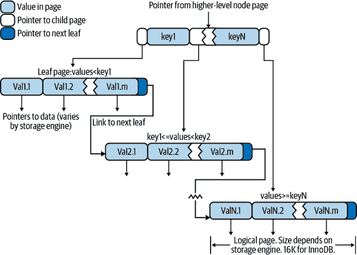

# 第七章：高性能索引

*索引*（在 MySQL 中也称为*键*）是存储引擎用来快速查找行的数据结构。它们还具有几个其他有益的属性，我们将在本章中探讨。

索引对于良好的性能至关重要，并随着数据量的增长变得更加重要。小型、负载轻的数据库通常即使没有适当的索引也能表现良好，但随着数据集的增长，性能可能会迅速下降。¹不幸的是，索引经常被遗忘或误解，因此糟糕的索引是真实世界性能问题的主要原因之一。这就是为什么我们将这些材料放在书的前面，甚至比我们讨论查询优化更早。 

索引优化可能是提高查询性能的最有效方法。索引可以将性能提高数个数量级，而最佳索引有时可以比仅仅“好”的索引提高大约两个数量级的性能。创建真正最佳的索引通常需要你重写查询，因此本章和下一章密切相关。

本章依赖于使用示例数据库，比如来自 MySQL 网站的[Sakila 示例数据库](https://oreil.ly/cIabb)。Sakila 是一个模拟租赁商店的示例数据库，包含演员、电影、客户等。

# 索引基础知识

理解 MySQL 中索引工作原理最简单的方法是将其想象成一本书的索引。要查找书中讨论特定主题的位置，你查看索引，它告诉你该术语出现的页码。

在 MySQL 中，存储引擎以类似的方式使用索引。它在索引的数据结构中搜索一个值。当找到匹配时，它可以找到包含匹配的行。假设你运行以下查询：

```sql
SELECT first_name FROM sakila.actor WHERE actor_id = 5;
```

`actor_id`列上有一个索引，因此 MySQL 将使用该索引查找`actor_id`为`5`的行。换句话说，它在索引中查找值并返回包含指定值的任何行。

索引包含表中一个或多个列的值。如果索引多于一列，列的顺序非常重要，因为 MySQL 只能在索引的最左前缀上高效搜索。在两列上创建索引与创建两个单独的单列索引不同，你将看到。

## 索引类型

有许多类型的索引，每种类型都设计用于不同的目的。索引是在存储引擎层实现的，而不是在服务器层。因此，它们没有标准化：在每个引擎中，索引的工作方式略有不同，并非所有引擎都支持所有类型的索引。即使多个引擎支持相同的索引类型，它们在内部可能以不同的方式实现。鉴于本书假定你在所有表中使用 InnoDB 作为引擎，我们将专门讨论 InnoDB 中的索引实现。

话虽如此，让我们看看 MySQL 目前支持的两种最常用的索引类型，它们的优点和缺点。

### B-tree 索引

当人们谈论索引而没有提及类型时，他们可能指的是*B-tree 索引*，它通常使用 B-tree 数据结构来存储其数据。² MySQL 的大多数存储引擎支持这种索引类型。

我们将这些索引称为*B-tree*，因为这是 MySQL 在`CREATE TABLE`和其他语句中使用的术语。然而，存储引擎可能在内部使用不同的存储结构。例如，NDB Cluster 存储引擎使用 T-tree 数据结构来存储这些索引，即使它们被标记为`BTREE`，而 InnoDB 使用 B+树。这些结构和算法的变化超出了本书的范围。

B 树的一般思想是所有值按顺序存储，每个叶子页距离根节点的距离相同。图 7-1 显示了 B 树索引的抽象表示，大致对应于 InnoDB 的索引工作原理。



###### 图 7-1。建立在 B 树（技术上是 B+树）结构上的索引

B 树索引加快了数据访问，因为存储引擎不必扫描整个表以找到所需的数据。相反，它从根节点开始（在此图中未显示）。根节点中的插槽保存指向子节点的指针，存储引擎遵循这些指针。它通过查看节点页中的值来找到正确的指针，这些值定义了子节点中值的上限和下限。最终，存储引擎要么确定所需值不存在，要么成功到达叶子页。

叶子页很特殊，因为它们指向索引数据而不是指向其他页面的指针。（不同的存储引擎有不同类型的“指针”指向数据。）我们的示例只显示了一个节点页及其叶子页，但根和叶子之间可能有许多级别的节点页。树的深度取决于表的大小。

因为 B 树按顺序存储索引列，所以它们对于搜索数据范围很有用。例如，对于文本字段的索引，沿着树向下移动会按字母顺序经过值，因此查找“名字以 I 至 K 开头的所有人”是高效的。

假设你有以下表格：

```sql
CREATE TABLE People (
 last_name varchar(50) not null,
 first_name varchar(50) not null,
 dob date not null,
 key(last_name, first_name, dob)
);
```

索引将包含表中每行的`last_name`、`first_name`和`dob`列的值。图 7-2 说明了索引如何排列存储的数据。

请注意，索引根据在`CREATE TABLE`语句中给出的列的顺序对值进行排序。看看最后两个条目：有两个名字相同但出生日期不同的人，它们按出生日期排序。


###### 图 7-2。B 树（技术上是 B+树）索引的示例条目

#### 自适应哈希索引

InnoDB 存储引擎具有一种称为*自适应哈希索引*的特殊功能。当 InnoDB 注意到某些索引值被频繁访问时，它会在 B 树索引之上在内存中为它们构建一个哈希索引。这使其 B 树索引具有哈希索引的某些属性，例如非常快速的哈希查找。这个过程是完全自动的，您无法控制或配置它，尽管您可以完全禁用自适应哈希索引。

#### 可以使用 B 树索引的查询类型

B 树索引适用于通过完整键值、键范围或键前缀进行查找。只有在查找使用索引的最左前缀时才有用。³我们在前一节中展示的索引将对以下类型的查询有用：

匹配完整值

完整键值的匹配指定了索引中所有列的值。例如，此索引可以帮助您找到一个名为 Cuba Allen 且出生于 1960-01-01 的人。

匹配最左前缀

此索引可以帮助您找到所有姓 Allen 的人。这仅使用索引中的第一列。

匹配列前缀

您可以匹配列值的第一部分。此索引可以帮助您找到所有��J 开头的人。这仅使用索引中的第一列。

匹配一系列值

此索引可以帮助您找到姓 Allen 和 Barrymore 之间的人。这也仅使用第一列。

精确匹配一部分并在另一部分上匹配范围

此索引可以帮助您找到姓 Allen 且名字以 K 开头（Kim，Karl 等）的所有人。这是对`last_name`的精确匹配和对`first_name`的范围查询。

仅索引查询

B 树索引通常可以支持仅索引查询，这些查询仅访问索引，而不访问行存储。我们在“覆盖索引”中讨论了这种优化。

因为树的节点是排序的，它们可以用于查找值和`ORDER BY`查询（按排序顺序查找值）。一般来说，如果 B 树可以帮助你以特定方式查找行，它也可以帮助你按照相同的标准对行进行排序。因此，我们的索引将有助于满足我们刚刚列出的所有类型查找的`ORDER BY`子句。

这里是 B 树索引的一些限制：

+   如果查找不是从索引列的最左侧开始的话，它们就没有用处。例如，这个索引无法帮助你找到所有名为 Bill 的人或所有出生于特定日期的人，因为这些列不是索引中的最左侧列。同样，你无法使用索引找到姓氏以特定字母结尾的人。

+   你不能跳过索引中的列，也就是��，你无法找到所有姓氏为 Smith 且出生于特定日期的人。如果不为`first_name`列指定值，MySQL 只能使用索引的第一列。

+   存储引擎无法优化访问第一个范围条件右侧的任何列。例如，如果你的查询是 `WHERE last_name="Smith" AND first_name LIKE 'J%' AND dob='1976-12-23'`，索引访问将仅使用索引中的前两列，因为`LIKE`是一个范围条件（服务器可以将其余列用于其他目的）。对于具有有限值的列，通常可以通过指定相等条件而不是范围条件来解决这个问题。

现在你知道为什么我们说列顺序非常重要：这些限制都与列顺序有关。为了获得最佳性能，您可能需要以不同顺序创建相同列的索引以满足您的查询。

一些限制并非是 B 树索引固有的，而是 MySQL 查询优化器和存储引擎使用索引的结果。其中一些限制可能会在未来被移除。

### 全文索引

`FULLTEXT`是一种特殊类型的索引，它在文本中查找关键词，而不是直接将值与索引中的值进行比较。全文搜索与其他类型的匹配完全不同。它有许多微妙之处，如停用词、词干、复数形式和布尔搜索。它更类似于搜索引擎的工作方式，而不是简单的`WHERE`参数匹配。

在同一列上拥有全文索引并不会消除对该列的 B 树索引的价值。全文索引用于`MATCH AGAINST`操作，而不是普通的`WHERE`子句操作。

## 索引的好处

索引使服务器能够快速导航到表中所需的位置，但这并不是它们的全部用途。正如你现在可能已经了解的那样，索引还有几个额外的好处，这些好处基于用于创建它们的数据结构的属性。

B 树索引是你将使用的最常见类型，通过按排序顺序存储数据，MySQL 可以利用它来处理带有`ORDER BY`和`GROUP BY`子句的查询。由于数据是预先排序的，B 树索引还将相关值存储在一起。最后，索引实际上存储了值的副本，因此某些查询可以仅从索引中满足。这些属性带来了三个主要好处：

+   索引减少了服务器需要检查的数据量。

+   索引帮助服务器避免排序和临时表。

+   索引将随机 I/O 转换为顺序 I/O。

这个主题真的值得一本整书。对于那些想深入了解的人，我们推荐 Tapio Lahdenmaki 和 Mike Leach 的*关系数据库索引设计和优化器*（Wiley）。它解释了如何计算索引的成本和收益，如何估计查询速度，以及如何确定索引是否比提供的好处更昂贵。

Lahdenmaki 和 Leach 的书还介绍了一个三星系统，用于评估索引对查询的适用性。如果索引将相关行相邻放置，则获得一颗星，如果其行按查询所需的顺序排序，则获得第二颗星，如果包含查询所需的所有列，则获得最后一颗星。我们将在本章中回顾这些原则。

# 高性能的索引策略

创建正确的索引并正确使用它们对于良好的查询性能至关重要。我们介绍了不同类型的索引并探讨了它们的优势和劣势。现在让我们看看如何真正发挥索引的力量。

有许多有效选择和使用索引的方法，因为有许多特殊情况的优化和专门的行为。确定何时使用以及评估选择的性能影响是您随着时间学会的技能。接下来的章节将帮助您了解如何有效使用索引。

## 前缀索引和索引选择性

您通常可以通过索引前几个字符而不是整个值来节省空间并获得良好的性能。这使得您的索引使用的空间更少，但也使它们的选择性更低。索引选择性是索引值的不同值数（基数）与表中总行数（*#T*）的比率，范围从 1/*#T*到 1。高度选择性的索引很好，因为它让 MySQL 在查找匹配项时过滤更多行。唯一索引的选择性为 1，这是最好的选择。

列的前缀通常具有足够的选择性以提供良好的性能。如果您正在为`BLOB`或`TEXT`列，或者非常长的`VARCHAR`列建立索引，或者必须定义前缀索引，因为 MySQL 不允许索引其完整长度。

诀窍在于选择一个足够长以提供良好选择性但又足够短以节省空间的前缀。前缀应该足够长，使索引几乎与如果您对整个列进行索引时一样有用。换句话说，您希望前缀的基数接近完整列的基数。

要确定一个好的前缀长度，找到最频繁出现的值并与最频繁前缀列表进行比较。在 Sakila 示例数据库中没有一个好的表来展示这一点，所以我们从`city`表中派生一个，这样我们就有足够的数据可以使用：

```sql
CREATE TABLE sakila.city_demo(city VARCHAR(50) NOT NULL);
INSERT INTO sakila.city_demo(city) SELECT city FROM sakila.city;
-- Repeat the next statement five times:
INSERT INTO sakila.city_demo(city) SELECT city FROM sakila.city_demo;
-- Now randomize the distribution (inefficiently but conveniently):
UPDATE sakila.city_demo
 SET city = (SELECT city FROM sakila.city ORDER BY RAND() LIMIT 1);
```

现在我们有一个示例数据集。结果并不真实分布，并且我们使用了`RAND()`，所以你的结果会有所不同，但这对这个练习并不重要。首先，我们找到出现频率最高的城市：

```sql
mysql> SELECT COUNT(*) AS c, city
    -> FROM sakila.city_demo 
    -> GROUP BY city ORDER BY c DESC LIMIT 10;
+-----+----------------+
| c  | city            |
+-----+----------------+
| 65 | London          |
| 49 | Hiroshima       |
| 48 | Teboksary       |
| 48 | Pak Kret        |
| 48 | Yaound          |
| 47 | Tel Aviv-Jaffa  |
| 47 | Shimoga         |
| 45 | Cabuyao         |
| 45 | Callao          |
| 45 | Bislig          |
+-----+----------------+
```

注意每个值大约有 45 到 65 次出现。现在我们找到最频繁出现的城市名*前缀*，从三个字母的前缀开始：

```sql
mysql> SELECT COUNT(*) AS c, LEFT(city, 3) AS pref
    -> FROM sakila.city_demo GROUP BY pref ORDER BY cc DESC LIMIT 10;
+-----+------+
| c   | pref |
+-----+------+
| 483 | San  |
| 195 | Cha  |
| 177 | Tan  |
| 167 | Sou  |
| 163 | al-  |
| 163 | Sal  |
| 146 | Shi  |
| 136 | Hal  |
| 130 | Val  |
| 129 | Bat  |
+-----+------+
```

每个前缀的出现次数更多，因此唯一前缀比唯一完整城市名称要少得多。这个想法是增加前缀长度，直到前缀几乎与列的完整长度一样具有选择性。一点实验表明`7`是一个不错的值：

```sql
mysql> SELECT COUNT(*) AS c, LEFT(city, 7) AS pref
    -> FROM sakila.city_demo GROUP BY pref ORDER BY c DESC LIMIT 10;
+-----+---------+
| c   | pref    |
+-----+---------+
| 70  | Santiag |
| 68  | San Fel |
| 65  | London  |
| 61  | Valle d |
| 49  | Hiroshi |
| 48  | Teboksa |
| 48  | Pak Kre |
| 48  | Yaound  |
| 47  | Tel Avi |
| 47  | Shimoga |
+-----+---------+
```

另一种计算好前缀长度的方法是计算完整列的选择性，并尝试使前缀的选择性接近该值。以下是如何找到完整列的选择性：

```sql
mysql> SELECT COUNT(DISTINCT city)/COUNT(*) FROM sakila.city_demo;
+-------------------------------+
| COUNT(DISTINCT city)/COUNT(*) |
+-------------------------------+
|                        0.0312 |
+-------------------------------+
```

如果我们的目标选择性接近 0.031，那么平均而言，前缀将是相当不错的（不过这里有一个警告）。在一个查询中评估许多不同长度是可能的，这对于非常大的表格非常有用。以下是如何在一个查询中找到几个前缀长度的选择性：

```sql
mysql> SELECT COUNT(DISTINCT LEFT(city, 3))/COUNT(*) AS sel3,
    -> COUNT(DISTINCT LEFT(city, 4))/COUNT(*) AS sel4,
    -> COUNT(DISTINCT LEFT(city, 5))/COUNT(*) AS sel5,
    -> COUNT(DISTINCT LEFT(city, 6))/COUNT(*) AS sel6,
    -> COUNT(DISTINCT LEFT(city, 7))/COUNT(*) AS sel7
    -> FROM sakila.city_demo;
+--------+--------+--------+--------+--------+
| sel3   | sel4   | sel5   | sel6   | sel7   |
+--------+--------+--------+--------+--------+
| 0.0239 | 0.0293 | 0.0305 | 0.0309 | 0.0310 |
+--------+--------+--------+--------+--------+
```

这个查询显示增加前缀长度会导致随着接近七个字符的逐渐减小的改善。

仅仅看平均选择性并不是一个好主意。警告是*最坏情况*选择性也很重要。平均选择性可能会让您认为四或五个字符的前缀已经足够好了，但如果您的数据非常不均匀，那可能是一个陷阱。如果您使用值`4`查看最常见城市名称前缀的出现次数，您将清楚地看到这种不均匀性：

```sql
mysql> SELECT COUNT(*) AS c, LEFT(city, 4) AS pref
    -> FROM sakila.city_demo GROUP BY pref ORDER BY c DESC LIMIT 5;
+-----+------+
| c   | pref |
+-----+------+
| 205 | San  |
| 200 | Sant |
| 135 | Sout |
| 104 | Chan |
|  91 | Toul |
+-----+------+
```

使用四个字符，最频繁的前缀出现的频率要比最频繁的全长值要高得多。也就是说，这些值的选择性低于平均选择性。如果您的数据集比这个随机生成的样本更真实，您可能会看到这种效果更加明显。例如，在真实世界的城市名称上构建一个四字符前缀索引将导致以“San”和“New”开头的城市的选择性非常糟糕，而这样的城市有很多。

现在我们已经找到了样例数据的一个好值，以下是如何在列上创建前缀索引的方法：

```sql
ALTER TABLE sakila.city_demo ADD KEY (city(7));
```

前缀索引可以使索引变得更小更快，但它们也有缺点：MySQL 无法将前缀索引用于`ORDER BY`或`GROUP BY`查询，也无法将其用作覆盖索引。

我们发现前缀索引有益的一个常见情况是当使用长十六进制标识符时。我们在上一章讨论了存储这些标识符的更有效技术，但如果您使用的是无法修改的打包解决方案呢？我们经常看到这种情况发生在 vBulletin 和其他使用 MySQL 存储网站会话的应用程序上，这些应用程序以长十六进制字符串为键。在前八个字符左右添加索引通常会显著提升性能，而且对应用程序完全透明。

## 多列索引

多列索引经常被误解。常见的错误是单独为许多或所有列建立索引，或者以错误的顺序为列建立索引。

我们将在下一节讨论列顺序。第一个错误，单独为许多列建立索引，在`SHOW CREATE TABLE`中有一个独特的标志：

```sql
CREATE TABLE t (
 c1 INT,
 c2 INT,
 c3 INT,
 KEY(c1),
 KEY(c2),
 KEY(c3)
);
```

这种索引策略通常是因为人们给出模糊但听起来权威的建议，比如“在`WHERE`子句中出现的列上创建索引”。这个建议是非常错误的。它最多会导致一星级索引。这些索引可能比真正最佳的索引慢几个数量级。有时，当您无法设计一个三星级索引时，最好忽略`WHERE`子句，关注最佳行顺序或创建一个覆盖索引。

对许多列单独建立索引对于大多数查询并不能帮助 MySQL 提高性能。当 MySQL 使用一种称为*索引合并*的策略时，它可以在使用多个索引来定位所需行的单个表时稍微应对这种索引不良的表。它可以同时扫描这两个索引并合并结果。算法有三种变体：`OR`条件的并集，`AND`条件的交集，以及两者的组合的并集。以下查询使用了两个索引扫描的并集，您可以通过检查`Extra`列看到：

```sql
mysql> EXPLAIN SELECT film_id, actor_id FROM sakila.film_actor
    -> WHERE actor_id = 1 OR film_id = 1\G
*************************** 1\. row ***************************
 id: 1
 select_type: SIMPLE
 table: film_actor
 partitions: NULL
 type: index_merge
 possible_keys: PRIMARY,idx_fk_film_id
 key: PRIMARY,idx_fk_film_id
 key_len: 2,2
 ref: NULL
 rows: 29
 filtered: 100.00
 Extra: Using union(PRIMARY,idx_fk_film_id); Using where
```

MySQL 可以在复杂查询中使用这种技术，因此您可能会在某些查询的`Extra`列中看到嵌套操作。

索引合并策略有时效果非常好，但更常见的情况是实际上表现出一个索引不良的表：

+   当服务器交集索引（通常用于`AND`条件）时，通常意味着您需要一个包含所有相关列的单个索引，而不是需要组合的多个索引。

+   当服务器联合索引（通常用于`OR`条件）时，有时算法的缓冲、排序和合并操作会使用大量的 CPU 和内存资源。特别是如果并非所有索引都非常具有选择性，那么扫描将返回大量行给合并操作。

+   请记住，优化器不考虑这个成本-它仅优化随机页面读取的数量。这可能使其“低估”查询的成本，实际上可能比纯表扫描运行得更慢。密集的内存和 CPU 使用也倾向于影响并发查询，但在单独运行查询时您不会看到这种效果。有时，使用`UNION`子句重写这样的查询更为优化。

当你在`EXPLAIN`中看到索引合并时，应该检查查询和表结构，看看这是否真的是你能得到的最佳结果。你可以通过`optimizer_switch`选项或变量禁用索引合并。你也可以使用`IGNORE INDEX`。

## 选择一个好的列顺序

我们看到的最常见的混淆原因之一是索引中列的顺序。正确的顺序取决于将使用索引的查询，并且您必须考虑如何选择索引顺序，使得行以一种有利于查询的方式排序和分组。

多列 B 树索引中的列顺序意味着索引首先按最左边的列排序，然后按下一列排序，依此类推。因此，索引可以以正向或反向顺序扫描，以满足与列顺序完全匹配的`ORDER BY`、`GROUP BY`和`DISTINCT`子句的查询。

因此，在多列索引中，列顺序至关重要。列顺序要么使索引能够获得 Lahdenmaki 和 Leach 的三星系统中的“星星”（请参见本章前面的“索引的好处”了解更多关于三星系统的信息）。我们将在本章的其余部分展示许多示例，说明这是如何工作的。

有一个选择列顺序的古老经验法则：在索引中首先放置最具选择性的列。这个建议有多有用呢？在某些情况下可能有帮助，但通常比避免随机 I/O 和排序要不重要得多，综合考虑所有事情。（具体情况各不相同，因此没有一刀切的规则。这一点就应该告诉你，这个经验法则可能比你想象的要不重要。）

在没有考虑排序或分组的情况下，将最具选择性的列放在前面可能是一个好主意，因此索引的目的仅仅是优化`WHERE`查找。在这种情况下，设计索引以尽快过滤出行可能确实有效，因此对于只在`WHERE`子句中指定索引前缀的查询，它更具选择性。然而，这不仅取决于列的选择性（总体基数），还取决于您用于查找行的实际值-值的分布。这与我们为选择良好的前缀长度而探讨的相同类型的考虑是一样的。您可能实际上需要选择列顺序，使其对您将运行的大多数查询具有尽可能高的选择性。

让我们以以下查询为例：

```sql
SELECT * FROM payment WHERE staff_id = 2 AND customer_id = 584;
```

您应该在(`staff_id, customer_id`)上创建索引，还是应该颠倒列顺序？我们可以运行一些快速查询来帮助检查表中值的分布，并确定哪一列具有更高的选择性。让我们将查询转换为计算`WHERE`子句中每个谓词的基数：

```sql
mysql> SELECT SUM(staff_id = 2), SUM(customer_id = 584) FROM payment\G
*************************** 1\. row ***************************
 SUM(staff_id = 2): 7992
SUM(customer_id = 584): 30
```

根据经验法则，我们应该将`customer_id`放在索引的第一位，因为谓词在表中匹配的行数较少。然后我们可以再次运行查询，看看`staff_id`在由特定客户 ID 选择的行范围内的选择性如何：

```sql
mysql> SELECT SUM(staff_id = 2) FROM payment WHERE customer_id = 584\G
*************************** 1\. row ***************************
SUM(staff_id = 2): 17
```

使用这种技术要小心，因为结果取决于为所选查询提供的具体常数。如果为这个查询优化了索引，而其他查询表现不佳，服务器的性能可能会受到影响，或者某些查询可能会运行不稳定。

如果你正在使用来自工具（如*pt-query-digest*）报告的“最差”样本查询，这种技术可以是查看对你的查询和数据最有帮助的索引的有效方法。但如果你没有具体的样本要运行，也许最好使用旧的经验法则，即全面查看基数，而不仅仅是一个查询：

```sql
mysql> SELECT COUNT(DISTINCT staff_id)/COUNT(*) AS staff_id_selectivity,
    -> COUNT(DISTINCT customer_id)/COUNT(*) AS customer_id_selectivity,
    -> COUNT(*)
    -> FROM payment\G
*************************** 1\. row ***************************
 staff_id_selectivity: 0.0001
 customer_id_selectivity: 0.0373
 COUNT(*): 16049
```

`customer_id`的选择性更高，所以答案是将该列放在索引的第一位：

```sql
ALTER TABLE payment ADD KEY(customer_id, staff_id);
```

与前缀索引一样，问题通常出现在具有高于正常基数的特殊值上。例如，我们曾看到应用程序将未登录的用户视为“访客”用户，在会话表和其他记录用户活动的地方，这些用户获得特殊的用户 ID。涉及该用户 ID 的查询可能会与其他查询表现非常不同，因为通常有很多未登录的会话。有时系统帐户也会引起类似的问题。一个应用程序有一个神奇的管理帐户，不是真实用户，它与整个网站的每个用户“成为朋友”，以便发送状态通知和其他消息。该用户庞大的朋友列表导致网站性能严重问题。

这实际上是相当典型的。任何异常值，即使不是应用程序管理中糟糕决策的产物，都可能引发问题。真正拥有大量朋友、照片、状态消息等用户可能会和虚假用户一样令人头疼。

这是我们曾在产品论坛上看到的一个真实例子，用户在那里交流关于产品的故事和经验。这种特定形式的查询运行非常缓慢：

```sql
SELECT COUNT(DISTINCT threadId) AS COUNT_VALUE
FROM Message
WHERE (groupId = 10137) AND (userId = 1288826) AND (anonymous = 0)
ORDER BY priority DESC, modifiedDate DESC
```

这个查询似乎没有一个很好的索引，所以客户要求我们看看是否可以改进。`EXPLAIN`如下：

```sql
 id: 1
 select_type: SIMPLE
 table: Message
 type: ref
 key: ix_groupId_userId
 key_len: 18
 ref: const,const
 rows: 1251162
 Extra: Using where
```

MySQL 为这个查询选择的索引是(`groupId`, `userId`)，如果我们没有关于列基数的信息，这似乎是一个相当不错的选择。然而，当我们查看匹配该用户 ID 和群组 ID 的行数时，情况就有所不同：

```sql
mysql> SELECT COUNT(*), SUM(groupId = 10137),
    -> SUM(userId = 1288826), SUM(anonymous = 0)
    -> FROM Message\G
*************************** 1\. row ***************************
 count(*): 4142217
 sum(groupId = 10137): 4092654
 sum(userId = 1288826): 1288496
 sum(anonymous = 0): 4141934
```

这个群组实际上拥有表中的几乎每一行，用户有 130 万行数据——在这种情况下，根本没有办法使用索引！这是因为数据是从另一个应用程序迁移过来的，所有消息都被分配给了管理用户和群组作为导入过程的一部分。解决这个问题的方法是更改应用程序代码，以识别这个特殊情况的用户 ID 和群组 ID，并且不为该用户发出这个查询。

这个小故事的寓意是，经验法则和启发式方法可能很有用，但你必须小心，不要假设平均情况下的性能代表特殊情况下的性能。特殊情况可能破坏整个应用程序的性能。

最后，尽管选择性和基数的经验法则很有趣，但其他因素——如排序、分组以及查询的`WHERE`子句中是否存在范围条件——可能对查询性能产生更大的影响。

## 聚集索引

*聚集索引*⁵并不是一种单独的索引类型。相反，它们是一种数据存储方法。具体细节在不同的实现中有所不同，但 InnoDB 的聚集索引实际上将 B 树索引和行一起存储在同一结构中。

当表具有聚集索引时，其行实际上存储在索引的叶页中。术语*聚集*指的是具有相邻键值的行存储在彼此附近。⁶ 每个表只能有一个聚集索引，因为不能同时将行存储在两个位置。（但是，*覆盖索引*允许您模拟多个聚集索引；稍后详细介绍。）

因为存储引擎负责实现索引，而不是所有存储引擎都支持聚集索引。在本节中，我们专注于 InnoDB，但我们讨论的原则可能至少部分适用于任何支持聚集索引的存储引擎，无论是现在还是将来。

图 7-3 显示了聚集索引中记录的布局。请注意，叶页包含完整的行，但节点页仅包含索引列。在这种情况下，索引列包含整数值。


###### 图 7-3\. 聚集索引数据布局

一些数据库服务器允许您选择要聚集的索引，但在撰写本文时，MySQL 的内置存储引擎都不支持此功能。InnoDB 通过主键对数据进行聚集。这意味着图 7-3 中的“索引列”是主键列。

如果您没有定义主键，InnoDB 将尝试使用唯一的非空索引。如果没有这样的索引，InnoDB 将为您定义一个隐藏的主键，然后在其上进行聚集。隐藏主键的缺点是，这些主键的递增值在使用隐藏主键的所有表之间共享，导致共享键的互斥争用增加。

数据聚集具有一些非常重要的优势：

+   您可以将相关数据保持在一起。例如，在实现邮箱时，您可以按`user_id`进行聚集，这样您可以通过仅从磁盘检索几个页面来检索单个用户的所有消息。如果不使用聚集，每个消息可能需要自己的磁盘 I/O。

+   数据访问速度很快。聚集索引在一个 B 树中同时保存索引和数据，因此从聚集索引中检索行通常比在非聚集索引中进行相似查找更快。

+   使用覆盖索引的查询可以使用叶节点中包含的主键值。

如果您设计表和查询以利用这些优势，这些优势可以极大地提高性能。但是，聚集索引也有一些缺点：

+   对于 I/O 密集型工作负载，聚集提供了最大的改进。如果数据适合内存，那么访问数据的顺序实际上并不重要，因此聚集并不会带来太多好处。

+   插入速度严重依赖插入顺序。按照主键顺序插入行是将数据加载到 InnoDB 表中的最快方法。如果没有按照主键顺序加载行，加载大量数据后可能需要使用`OPTIMIZE TABLE`重��组织表。

+   更新聚集索引列的成本很高，因为它迫使 InnoDB 将每个更新的行移动到新位置。

+   基于聚集索引构建的表在插入新行或更新行的主键以移动行时会受到*页拆分*的影响。当行的键值决定必须将行放入一个已满数据的页面时，就会发生页拆分。存储引擎必须将页面拆分为两个以容纳该行。页拆分可能导致表在磁盘上使用更多空间。

+   对于全表扫描，聚集表可能会较慢，特别是如果行的密度较低或由于页拆分而存储非顺序。

+   二级（非聚集）索引可能比您预期的要大，因为它们的叶节点包含了引用行的主键列。

+   二级索引访问需要两次索引查找而不是一次。

最后一点可能有点令人困惑。为什么辅助索引需要两次索引查找？答案在于辅助索引存储的“行指针”的性质。记住，叶节点不存储指向引用行物理位置的指针；相反，它存储行的主键值。

这意味着要从辅助索引中找到一行，存储引擎首先找到辅助索引中的叶节点，然后使用存储在那里的主键值导航主键并找到行。这是双重工作：两次 B 树导航而不是一次。⁷ 在 InnoDB 中，自适应哈希索引（前面在“B 树索引”中提到）可以帮助减少这种惩罚。

### InnoDB 的数据布局

为了更好地理解聚簇索引，让我们看看 InnoDB 如何布局以下表：

```sql
CREATE TABLE layout_test (
 col1 int NOT NULL,
 col2 int NOT NULL,
 PRIMARY KEY(col1),
 KEY(col2)
);
```

假设表填充了主键值 1 到 10,000，以随机顺序插入，然后使用`OPTIMIZE TABLE`进行优化。换句话说，数据在磁盘上被最佳地排列，但行可能是随机顺序的。`col2`的值在 1 到 100 之间随机分配，因此存在大量重复。

InnoDB 将表存储如图 7-4 所示。


###### 图 7-4。`layout_test`表的 InnoDB 主键布局

聚簇索引中的每个叶节点包含主键值、事务 ID 和回滚指针，InnoDB 用于事务和 MVCC 目的，以及其余列（在本例中为`col2`）。如果主键在列前缀上，InnoDB 会将完整列值与其余列一起包括在内。

InnoDB 的辅助索引叶节点包含主键值，这些值作为指向行的“指针”。这种策略减少了在行移动或数据页拆分时维护辅助索引所需的工作量。使用行的主键值作为指针使索引变大，但这意味着 InnoDB 可以移动行而无需更新指向它的指针。

图 7-5 展示了示例表的`col2`索引。每个叶节点包含索引列（在本例中只有`col2`），然后是主键值（`col1`）。


###### 图 7-5。`layout_test`表的 InnoDB 辅助索引布局

这些图表展示了 B 树叶节点，但我们有意省略了关于非叶节点的细节。InnoDB 的非叶 B 树节点每个包含索引列，以及指向下一层节点的指针（可能是另一个非叶节点或叶节点）。这适用于所有 B 树索引，包括聚簇和辅助索引。

### 在 InnoDB 中按主键顺序插入行

如果您正在使用 InnoDB 并且不需要任何特定的聚簇，最好定义一个*代理键*，这是一个主键，其值不是从应用程序数据派生的。通常使用`AUTO_INCREMENT`列是最简单的方法。这将确保行按顺序插入，并且将为使用主键进行连接提供更好的性能。

最好避免随机（非顺序且分布在大量值集上）的聚簇键，特别是对于 I/O 密集型工作负载。例如，使用 UUID 值在性能方面是一个糟糕的选择：它使聚簇索引插入变得随机，这是最坏的情况，并且不提供任何有用的数据聚类。

为了演示，我们对两种情况进行了基准测试。第一种是插入到具有整数 ID 的`userinfo`表中，定义如下：

```sql
CREATE TABLE userinfo (
 id int unsigned NOT NULL AUTO_INCREMENT,
 name varchar(64) NOT NULL DEFAULT '',
 email varchar(64) NOT NULL DEFAULT '',
 password varchar(64) NOT NULL DEFAULT '',
 dob date DEFAULT NULL,
 address varchar(255) NOT NULL DEFAULT '',
 city varchar(64) NOT NULL DEFAULT '',
 state_id tinyint unsigned NOT NULL DEFAULT '0',
 zip varchar(8) NOT NULL DEFAULT '',
 country_id smallint unsigned NOT NULL DEFAULT '0',
 gender ('M','F')NOT NULL DEFAULT 'M',
 account_type varchar(32) NOT NULL DEFAULT '',
 verified tinyint NOT NULL DEFAULT '0',
 allow_mail tinyint unsigned NOT NULL DEFAULT '0',
 parrent_account int unsigned NOT NULL DEFAULT '0',
 closest_airport varchar(3) NOT NULL DEFAULT '',
 PRIMARY KEY (id),
 UNIQUE KEY email (email),
 KEY country_id (country_id),
 KEY state_id (state_id),
 KEY state_id_2 (state_id,city,address)
) ENGINE=InnoDB
```

注意自增整数主键。⁸

第二种情况是一个名为`userinfo_uuid`的表。它与`userinfo`表相同，只是其主键是 UUID 而不是整数：

```sql
CREATE TABLE userinfo_uuid (
 uuid varchar(36) NOT NULL,
 ...
```

我们对两种表设计进行了基准测试。首先，在具有足够内存容纳索引的服务器上向两个表中各插入一百万条记录。接下来，我们向相同的表中插入三癃万行，这使得索引比服务器的内存还要大。表 7-1 比较了基准测试结果。

表 7-1\. 向 InnoDB 表中插入行的基准测试结果

| 表 | 行数 | 时间（秒） | 索引大小（MB） |
| --- | --- | --- | --- |
| `userinfo` | 1,000,000 | 137 | 342 |
| `userinfo_uuid` | 1,000,000 | 180 | 544 |
| `userinfo` | 3,000,000 | 1233 | 1036 |
| `userinfo_uuid` | 3,000,000 | 4525 | 1707 |

注意，使用 UUID 主键插入行不仅需要更长的时间，而且生成的索引要大得多。部分原因是由于较大的主键，但也有一部分无疑是由于页面分裂和随之产生的碎片化。

为了了解为什么这样做很重要，让我们看看当我们向第一个表插入数据时索引发生了什么。图 7-6 显示插入填充一页，然后继续在第二页上。


###### 图 7-6\. 向聚簇索引插入顺序索引值

如图 7-6 所示，InnoDB 将每个记录紧跟在前一个记录之后存储，因为主键值是顺序的。当页面达到其最大填充因子时（InnoDB 的初始填充因子仅为 15/16，以留出空间供以后修改），下一个记录将进入新页面。一旦数据以这种顺序方式加载，主键页面将几乎满载有顺序记录，这是非常理想的。（但是，次要索引页面可能不太可能有所不同。）

与将数据插入具有 UUID 聚簇索引的第二个表时发生的情况形成对比，如图 7-7 所示。


###### 图 7-7\. 向聚簇索引插入非顺序值

因为每个新行不一定比前一个具有更大的主键值，InnoDB 不能总是将新行放在索引末尾。它必须找到适当的位置放置行，通常在现有数据的中间附近，并为其腾出空间。这会导致大量额外工作，并导致次优化的数据布局。以下是缺点摘要：

+   目标页面可能已被刷新到磁盘并从缓存中移除，或者可能根本没有被放入缓存中，此时 InnoDB 必须找到它并从磁盘中读取它，然后才能插入新行。这会导致大量随机 I/O。

+   当插入是无序的时，InnoDB 经常需要分裂页面以为新行腾出空间。这需要移动大量数据，并修改至少三个页面，而不是一个。

+   由于分裂，页面变得稀疏且不规则填充，因此最终数据是碎片化的。

在向聚簇索引加载这样的随机值后，您可能需要执行 `OPTIMIZE TABLE` 来重建表并最佳地填充页面。

故事的寓意是，在使用 InnoDB 时，您应该努力按主键顺序插入数据，并尽量使用一个为每个新行提供单调递增值的聚簇键。

## 覆盖索引

一个常见的建议是为查询的`WHERE`子句创建索引，但这只是故事的一部分。索引需要为整个查询而不仅仅是`WHERE`子句而设计。索引确实是一种高效查找行的方法，但 MySQL 也可以使用索引检索列的数据，因此不必读取整行。毕竟，索引的叶节点包含它们索引的值；当读取索引可以提供您想要的数据时，为什么要读取行呢？包含（或“覆盖”）满足查询所需的所有数据的索引称为*覆盖索引*。重要的是要注意，只有 B 树索引可以用于覆盖索引。

覆盖索引可以是一个非常强大的工具，可以显著提高性能。考虑仅读取索引而不是数据的好处：

+   索引条目通常比完整行大小小得多，因此如果仅读取索引，MySQL 可以访问的数据量明显较少。这对于缓存工作负载非常重要，因为大部分响应时间来自数据的复制。对于 I/O 受限的工作负载也很有帮助，因为索引比数据小，更适合内存。

+   索引按其索引值排序（至少在页面内），因此 I/O 受限的范围访问将需要比从随机磁盘位置获取每行更少的 I/O。您甚至可以通过`OPTIMIZE`表来获得完全排序的索引，这将使简单的范围查询使用完全顺序的索引访问。

+   覆盖索引对 InnoDB 表格特别有帮助，因为 InnoDB 使用聚簇索引。InnoDB 的次要索引在其叶节点上保存行的主键值。因此，覆盖查询的次要索引避免了在主键中进行另一个索引查找。

在所有这些情况下，从索引中满足查询通常比查找行要便宜得多。

当您发出一个被索引覆盖的查询（*索引覆盖查询*）时，在`EXPLAIN`中的`Extra`列中会看到“Using index”。例如，`sakila.inventory`表在(`store_id, film_id`)上有一个多列索引。MySQL 可以使用此索引进行仅访问这两列的查询，例如以下查询：

```sql
mysql> EXPLAIN SELECT store_id, film_id FROM sakila.inventory\G
*************************** 1\. row ***************************
 id: 1
 select_type: SIMPLE
 table: inventory
 partitions: NULL
 type: index
 possible_keys: NULL
 key: idx_store_id_film_id
 key_len: 3
 ref: NULL
 rows: 4581
 filtered: 100.00
 Extra: Using index
```

在大多数存储引擎中，索引只能覆盖访问索引的一部分的列的查询。然而，InnoDB 实际上可以进一步优化这一点。回想一下，InnoDB 的次要索引在其叶节点上保存主键值。这意味着 InnoDB 的次要索引实际上有“额外的列”，InnoDB 可以用来覆盖查询。

例如，`sakila.actor`表使用 InnoDB，并在`last_name`上有一个索引，因此索引可以覆盖检索主键列`actor_id`的查询，即使该列在技术上不是索引的一部分：

```sql
mysql> EXPLAIN SELECT actor_id, last_name
    -> FROM sakila.actor WHERE last_name = 'HOPPER'\G
*************************** 1\. row ***************************
 id: 1
 select_type: SIMPLE
 table: actor
 partitions: NULL
 type: ref
 possible_keys: idx_actor_last_name
 key: idx_actor_last_name
 key_len: 182
 ref: const
 rows: 2
 filtered: 100.00
 Extra: Using index
```

## 用于排序的索引扫描

MySQL 有两种产生有序结果的方式：它可以使用排序操作，或者可以按顺序扫描索引。您可以通过查看`EXPLAIN`中`type`列中的“index”来判断 MySQL 是否计划扫描索引。（不要将此与`Extra`列中的“Using index”混淆。）

扫描索引本身很快，因为它只需要从一个索引条目移动到下一个。然而，如果 MySQL 没有使用索引来覆盖查询，它将不得不查找在索引中找到的每一行。这基本上是随机 I/O，因此按索引顺序读取数据通常比顺序表扫描慢，尤其是对于 I/O 受限的工作负载。

MySQL 可以同时用同一个索引进行排序和查找行。如果可能的话，最好设计您的索引，使其同时对这两个任务有用。

仅当索引的顺序与`ORDER BY`子句完全相同且所有列都按相同方向（升序或降序）排序时，按索引对结果排序才有效。¹⁰ 如果查询连接多个表，则仅当`ORDER BY`子句中的所有列都引用第一个表时才有效。`ORDER BY`子句也具有与查找查询相同的限制：它需要形成索引的最左前缀。在所有其他情况下，MySQL 使用排序。

如果索引的前导列有常量，那么`ORDER BY`子句不必指定索引的最左前缀。如果`WHERE`子句或`JOIN`子句为这些列指定了常量，它们可以“填补”索引中的空缺。

例如，标准 Sakila 示例数据库中的`rental`表具有一个索引（`rental_date`、`inventory_id`、`customer_id`）：

```sql
CREATE TABLE rental (
 ...
 PRIMARY KEY (rental_id),
 UNIQUE KEY rental_date (rental_date,inventory_id,customer_id),
 KEY idx_fk_inventory_id (inventory_id),
 KEY idx_fk_customer_id (customer_id),
 KEY idx_fk_staff_id (staff_id),
 ...
);
```

MySQL 使用`rental_date`索引来排序以下查询，从`EXPLAIN`中看到没有`filesort`¹¹：

```sql
mysql> EXPLAIN SELECT rental_id, staff_id FROM sakila.rental
    -> WHERE rental_date = '2005-05-25'
    -> ORDER BY inventory_id, customer_id\G
*************************** 1\. row ***************************
 type: ref
 possible_keys: rental_date
 key: rental_date
 rows: 1
 Extra: Using where
```

这个例子可以工作，即使`ORDER BY`子句本身不是索引的最左前缀，因为我们为索引的第一列指定了相等条件。

这里有一些更多可以使用索引进行排序的查询。这个例子有效，因为查询为索引的第一列提供了一个常量，并指定了第二列的`ORDER BY`。这两者一起形成了索引的最左前缀：

```sql
... WHERE rental_date = '2005-05-25' ORDER BY inventory_id DESC;
```

以下查询也有效¹²，因为`ORDER BY`中的两列是索引的最左前缀：

```sql
... WHERE rental_date > '2005-05-25' ORDER BY rental_date, inventory_id;
```

以下是一些*无法*使用索引进行排序的查询。

此查询使用两种不同的排序方向，但索引的列都是按升序排序的：

```sql
... WHERE rental_date = '2005-05-25' ORDER BY inventory_id DESC, customer_id ASC;
```

在这里，`ORDER BY`引用了不在索引中的列：

```sql
... WHERE rental_date = '2005-05-25' ORDER BY inventory_id, staff_id;
```

在这里，`WHERE`和`ORDER BY`不构成索引的最左前缀：

```sql
... WHERE rental_date = '2005-05-25' ORDER BY customer_id;
```

此查询在第一列上有一个范围条件，因此 MySQL 不使用索引的其余部分：

```sql
... WHERE rental_date > '2005-05-25' ORDER BY inventory_id, customer_id;
```

在这里，`inventory_id`列有多个相等。对于排序而言，这基本上与范围相同：

```sql
... WHERE rental_date = '2005-05-25' AND inventory_id IN(1,2) ORDER BY 
customer_id;
```

这里有一个例子，MySQL 理论上可以使用索引来排序连接，但实际上并没有这样做，因为优化器将`film_actor`表放在连接的第二个位置：

```sql
mysql> EXPLAIN SELECT actor_id, title FROM sakila.film_actor
    -> INNER JOIN sakila.film USING(film_id) ORDER BY actor_id\G
+------------+----------------------------------------------+
| table      | Extra                                        |
+------------+----------------------------------------------+
| film       | Using index; Using temporary; Using filesort |
| film_actor | Using index                                  |
+------------+----------------------------------------------+
```

按索引排序最重要的用途之一是具有`ORDER BY`和`LIMIT`子句的查询。

## 冗余和重复的索引

不幸的是，MySQL 允许您在同一列上创建重复索引。这样做只会返回一个警告，并不会阻止您这样做。MySQL 必须单独维护每个重复索引，并且在优化查询时查询优化器将考虑它们中的每一个。这可能会影响性能，还会浪费磁盘空间。

重复索引是在相同顺序的相同列集上创建的相同类型的索引。您应该尽量避免创建它们，并在发现它们时将其删除。

有时您可能会在不知情的情况下创建重复索引。例如，看看以下代码：

```sql
CREATE TABLE test (
 ID INT NOT NULL PRIMARY KEY,
 A INT NOT NULL,
 B INT NOT NULL,
 UNIQUE(ID),
 INDEX(ID)
) ENGINE=InnoDB;
```

一个经验不足的用户可能会认为这标识了列作为主键的角色，添加了`UNIQUE`约束，并添加了一个索引供查询使用。实际上，MySQL 使用索引实现`UNIQUE`约束和`PRIMARY KEY`约束，因此实际上在同一列上创建了三个索引！除非您希望在同一列上有不同类型的索引以满足不同类型的查询，否则通常没有理由这样做。¹³

多余的索引与重复的索引有些不同。如果在`(A, B)`上有一个索引，那么在`(A)`上有另一个索引将是多余的，因为它是第一个索引的前缀。也就是说，`(A, B)`上的索引也可以作为仅在`(A)`上的索引使用。（这种冗余类型仅适用于 B 树索引。）然而，在`(B, A)`上的索引不会是多余的，`(B)`上的索引也不会是多余的，因为`B`不是`(A, B)`的最左前缀。此外，不管它们覆盖哪些列，不同类型的索引（如全文索引）都不会对 B 树索引产生冗余。

多余的索引通常出现在人们向表中添加索引时。例如，有人可能在`(A, B)`上添加索引，而不是扩展现有的`(A)`索引以覆盖`(A, B)`。另一种可能发生的情况是将索引更改为覆盖`(A, ID)`。`ID`列是主键，因此已经包含在内。

在大多数情况下，您不希望有多余的索引，为了避免它们，您应该扩展现有的索引而不是添加新的。但是，有时您会因性能原因需要多余的索引。扩展现有索引可能会使其变得更大，并降低某些查询的性能。

例如，如果您在整数列上建立了一个索引，并将其扩展为长`VARCHAR`列，它可能会变得明显较慢。特别是如果您的查询使用索引作为覆盖索引时，情况尤其如此。

考虑以下的`userinfo`表：

```sql
CREATE TABLE userinfo (
 id int unsigned NOT NULL AUTO_INCREMENT,
 name varchar(64) NOT NULL DEFAULT '',
 email varchar(64) NOT NULL DEFAULT '',
 password varchar(64) NOT NULL DEFAULT '',
 dob date DEFAULT NULL,
 address varchar(255) NOT NULL DEFAULT '',
 city varchar(64) NOT NULL DEFAULT '',
 state_id tinyint unsigned NOT NULL DEFAULT '0',
 zip varchar(8) NOT NULL DEFAULT '',
 country_id smallint unsigned NOT NULL DEFAULT '0',
 account_type varchar(32) NOT NULL DEFAULT '',
 verified tinyint NOT NULL DEFAULT '0',
 allow_mail tinyint unsigned NOT NULL DEFAULT '0',
 parrent_account int unsigned NOT NULL DEFAULT '0',
 closest_airport varchar(3) NOT NULL DEFAULT '',
 PRIMARY KEY (id),
 UNIQUE KEY email (email),
 KEY country_id (country_id),
 KEY state_id (state_id)
) ENGINE=InnoDB
```

这个表包含一百万行，对于每个`state_id`，大约有 20,000 条记录。有一个在`state_id`上的索引，对于以下查询很有用。我们将这个查询称为 Q1：

```sql
SELECT count(*) FROM userinfo WHERE state_id=5;
```

一个简单的基准测试显示，该查询的执行速率接近每秒 115 次查询（QPS）。我们还有一个相关查询，不仅仅是计算行数，而是检索几列。这是 Q2：

```sql
SELECT state_id, city, address FROM userinfo WHERE state_id=5;
```

对于这个查询，结果小于 10 QPS。¹⁴ 提高其性能的简单解决方案是将索引扩展到（`state_id`、`city`、`address`），这样索引将覆盖查询：

```sql
ALTER TABLE userinfo DROP KEY state_id,
ADD KEY state_id_2 (state_id, city, address);
```

扩展索引后，Q2 运行更快，但 Q1 运行更慢。如果我们真的关心让两个查询都快速，我们应该保留两个索引，即使单列索引是多余的。表 7-2 显示了两个查询和索引策略的详细结果。

表 7-2\. 使用不同索引策略的`SELECT`查询的 QPS 基准结果

|   | `仅 state_id` | `仅 state_id_2` | `state_id 和 state_id_2 都有` |
| --- | --- | --- | --- |
| **查询 1** | 108.55 | 100.33 | 107.97 |
| **查询 2** | 12.12 | 28.04 | 28.06 |

拥有两个索引的缺点是维护成本。表 7-3 显示了向表中插入一百万行需要多长时间。

表 7-3\. 使用不同索引策略插入一百万行的速度

|   | `仅 state_id` | `state_id 和 state_id_2 都有` |
| --- | --- | --- |
| **InnoDB，足够的内存容纳两个索引** | 80 秒 | 136 秒 |

如您所见，向具有更多索引的表中插入新行会更慢。这在一般情况下是正确的：添加新索引可能会对`INSERT`、`UPDATE`和`DELETE`操作产生性能影响，特别是如果新索引导致内存限制。

处理多余和重复索引的解决方案很简单，就是删除它们，但首先您需要识别它们。您可以针对`INFORMATION_SCHEMA`表编写各种复杂的查询，但也有更简单的技术。您可以使用 Percona Toolkit 附带的*pt-duplicate-key-checker*工具，该工具分析表结构并建议重复或多余的索引。

在确定哪些索引适合删除或扩展时要小心。请记住，在 InnoDB 中，我们示例表中列`(A)`上的索引实际上等同于`(A, ID)`上的索引，因为主键附加到辅助索引叶节点。如果你有一个查询，比如`WHERE A = 5 ORDER BY ID`，那么索引将非常有帮助。但是如果你将索引扩展到`(A, B)`，那么它实际上变成了`(A, B, ID)`，查询将开始对查询的`ORDER BY`部分使用文件排序。最好使用诸如 Percona Toolkit 的*pt-upgrade*之类的工具仔细验证你计划的更改。

对于这两种情况，在删除索引之前考虑使用 MySQL 8.0 的隐形索引功能。通过这个功能，你可以发出一个`ALTER TABLE`语句将一个索引标记为隐形，这意味着优化器在规划查询时会忽略它。如果你发现即将删除的索引很重要，你可以很容易地将其重新设为可见，而无需重新创建索引。

## 未使用的索引

除了重复和冗余的索引，你可能有一些服务器根本不使用的索引。这些只是多余的负担，你应该考虑删除它们。¹⁵

识别未使用的索引的最佳方法是使用`performance_schema`和`sys`，我们在第三章中详细介绍了这两个功能。`sys`模式创建了一个`table_io_waits_summary_by_index_usage`表的视图，可以轻松告诉我们哪些索引未使用：

```sql
mysql> SELECT * FROM sys.schema_unused_indexes;
+---------------+---------------+-----------------------------+
| object_schema | object_name   | index_name                  |
+---------------+---------------+-----------------------------+
| sakila        | actor         | idx_actor_last_name         |
| sakila        | address       | idx_fk_city_id              |
| sakila        | address       | idx_location                |
| sakila        | payment       | fk_payment_rental           |
.. trimmed for brevity ..
```

# 索引和表维护

一旦你创建了具有适当数据类型和添加索引的表，你的��作并没有结束：你仍需要维护表和索引以确保它们性能良好。表维护的三个主要目标是查找和修复损坏、维护准确的索引统计信息和减少碎片化。

## 查找和修复表损坏

表可能遇到的最糟糕的情况就是损坏。所有存储引擎都可能由于硬件问题或 MySQL 或操作系统中的内部错误而遇到索引损坏，尽管在 InnoDB 中很少遇到这种情况。

损坏的索引可能导致查询返回不正确的结果，在没有重复值的情况下引发重复键错误，甚至导致锁定和崩溃。如果你遇到奇怪的行为，比如一个你认为不应该发生的错误，运行`CHECK TABLE`查看表是否损坏。（请注意，某些存储引擎不支持此命令，而其他支持多个选项以指定他们检查表的彻底程度。）`CHECK TABLE`通常可以捕捉到大多数表和索引错误。

你可以使用`REPAIR TABLE`命令修复损坏的表，但并非所有存储引擎都支持此功能。在这些情况下，你可以执行一个“no-op” `ALTER`，比如修改表以使用当前使用的相同存储引擎。以下是一个针对 InnoDB 表的示例：

```sql
ALTER TABLE <table> ENGINE=INNODB;
```

或者，你可以导出数据并重新加载。但是，如果损坏发生在系统区域或表的“行数据”区域而不是索引中，你可能无法使用任何这些选项。在这种情况下，你可能需要从备份中恢复表，或尝试从损坏的文件中恢复数据。

如果您在 InnoDB 存储引擎中遇到损坏，那么肯定出了严重问题，您需要立即进行调查。InnoDB 不应该出现损坏。其设计使其对损坏非常有韧性。损坏表明可能存在硬件问题，如内存或磁盘故障（可能性较大），管理员错误，例如在 MySQL 外部操纵数据库文件（可能性较大），或者 InnoDB 错误（可能性较小）。通常的原因是诸如尝试使用*rsync*进行备份之类的错误。没有任何查询您可以执行——没有一个——是您应该避免的，因为它会损坏 InnoDB 的数据。没有任何隐藏的枪指向您的脚。如果通过针对 InnoDB 执行查询来损坏 InnoDB 的数据，那么 InnoDB 中存在错误，并且这绝不是您的错。

如果您遇到数据损坏，最重要的是尝试确定为什么会发生损坏；不要仅仅修复数据，否则损坏可能会再次出现。您可以通过使用`innodb_force_recovery`参数将 InnoDB 置于强制恢复模式来修复数据；有关详细信息，请参阅 MySQL 手册。

## 更新索引统计信息

当存储引擎向优化器提供关于查询可能检查的行数的不精确信息，或者当查询计划过于复杂以至于无法准确知道各个阶段将匹配多少行时，优化器将使用索引统计信息来估计行数。MySQL 的优化器是基于成本的，主要成本指标是查询将访问的数据量。如果统计信息从未生成过或者已经过时，优化器可能会做出错误的决定。解决方案是运行`ANALYZE TABLE`，这将重新生成统计信息。

您可以使用`SHOW INDEX FROM`命令检查索引的基数。例如：

```sql
mysql> SHOW INDEX FROM sakila.actor\G
*************************** 1\. row ***************************
 Table: actor
 Non_unique: 0
 Key_name: PRIMARY
 Seq_in_index: 1
 Column_name: actor_id
 Collation: A
 Cardinality: 200
 Sub_part: NULL
 Packed: NULL
 Null:
 Index_type: BTREE
 Comment:
*************************** 2\. row ***************************
 Table: actor
 Non_unique: 1
 Key_name: idx_actor_last_name
 Seq_in_index: 1
 Column_name: last_name
 Collation: A
 Cardinality: 200
 Sub_part: NULL
 Packed: NULL
 Null:
 Index_type: BTREE
 Comment:
```

这个命令提供了相当多的索引信息，MySQL 手册详细解释了这些信息。不过，我们想要提醒您关注`Cardinality`列。这显示存储引擎估计索引中有多少个不同的值。您也可以从`INFORMATION_SCHEMA.STATISTICS`表中获取这些数据。例如，您可以编写针对`INFORMATION_SCHEMA`表的查询，以查找具有非常低选择性的索引。但是请注意，在具有大量数据的服务器上，这些元数据表可能会给服务器带来很大的负载。

值得进一步探索 InnoDB 的统计信息。这些统计信息是通过对索引中的几个随机页面进行抽样生成的，并假设其余索引看起来类似。抽样的页面数量由`innodb_stats_sample_pages`变量控制。将其设置为大于默认值 8 的值理论上可以帮助生成更具代表性的索引统计信息，特别是在非常大的表上，但效果可能有所不同。

当首次打开表时，运行`ANALYZE TABLE`时以及表的大小发生显著变化时，InnoDB 会为索引计算统计信息。

InnoDB 还会为针对一些`INFORMATION_SCHEMA`表的查询、`SHOW TABLE STATUS`和`SHOW INDEX`查询以及当 MySQL 命令行客户端启用自动完成时计算统计信息。在具有大量数据或 I/O 速度慢的大型服务器上，这实际上可能成为一个相当严重的问题。导致抽样发生的客户端程序或监控工具可能会在服务器上造成大量锁定和重负载，同时让用户因启动时间过长而感到沮丧。而且，您无法观察索引统计信息而不更改它们，因为`SHOW INDEX`会更新统计信息。您可以禁用`innodb_stats_on_metadata`选项以避免所有这些问题。

## 减少索引和数据碎片化

B-tree 索引可能会变得碎片化，这可能会降低性能。碎片化的索引可能在磁盘上填充不良和/或非顺序。

按设计，B 树索引需要随机磁盘访问以“潜入”到叶子页面，因此随机访问是规则，而不是例外。然而，如果叶子页面是物理上连续且紧凑的，它们仍然可以表现得更好。如果不是这样，我们说它们是*碎片化*，范围扫描或完整索引扫描可能慢几倍。这对于索引覆盖查询尤为重要。

表的数据存储也可能变得碎片化。然而，数据存储碎片化比索引碎片化更复杂。数据碎片化有三种类型：

行碎片化

当行在多个位置以多个部分存储时，就会发生这种类型的碎片化。即使查询只需要从索引中获取一行，行碎片化也会降低性能。

行内碎片化

当逻辑上连续的页面或行在磁盘上不按顺序存储时，就会发生这种类型的碎片化。这会影响全表扫描和聚集索引范围扫描等操作，这些操作通常受益于磁盘上的顺序数据布局。

空闲空间碎片化

当数据页面中有大量空白空间时，就会发生这种类型的碎片化。这会导致服务器读取许多不需要的数据，这是一种浪费。

要对数据进行碎片整理，可以运行`OPTIMIZE TABLE`或转储并重新加载数据。这些方法适用于大多数存储引擎。对于不支持`OPTIMIZE TABLE`的存储引擎，可以使用一个空操作的`ALTER TABLE`重建表。只需将表更改为当前使用的引擎：

```sql
ALTER TABLE <table> ENGINE=<engine>;
```

# 摘要

正如你所看到的，索引是一个复杂的话题！MySQL 和存储引擎访问数据的方式以及索引的属性使索引成为影响数据访问的非常强大和灵活的工具，无论是在磁盘上还是在内存中。

大多数情况下，你会使用 B 树索引与 MySQL。其他类型的索引更适合特殊用途，当你应该使用它们以及它们如何提高查询响应时间时，通常是显而易见的。在本章中我们不再详细讨论它们，但最后回顾一下 B 树索引的属性和用途是值得的。

在选择索引并编写查询以利用它们时，请牢记以下三个原则：

+   单行访问速度较慢，尤其是在基于磁盘的存储中。（固态硬盘在随机 I/O 方面更快，但这一点仍然成立。）如果服务器从存储中读取一块数据，然后只访问其中的一行，那么就浪费了很多工作。最好的方法是读取包含你需要的许多行的块。

+   按顺序访问行范围是快速的，有两个原因。首先，顺序 I/O 不需要磁盘寻道，因此比随机 I/O 快，尤其是在基于磁盘的存储中。其次，如果服务器可以按照你需要的顺序读取数据，就不需要执行任何后续工作来对其进行排序，而且`GROUP BY`查询也不需要对行进行排序和分组以计算聚合。

+   仅索引访问是快速的。如果一个索引包含查询所需的所有列，存储引擎就不需要通过查找表中的行来找到其他列。这避免了大量的单行访问，正如我们从第一点所知道的那样，这是缓慢的。

总之，尽量选择索引并编写查询，以避免单行查找，利用数据的固有顺序避免排序操作，并利用仅索引访问。这对应于 Lahdenmaki 和 Leach 在本章开头提到的三星级评级系统。

要为针对表的每个查询创建完美的索引将是很好的。不幸的是，有时这将需要一个不切实际的大量索引，而有时根本无法为给定查询创建三星级索引（例如，如果查询按两列排序，一列升序，另一列降序）。在这些情况下，您必须尽力而为或追求替代策略，如去规范化或摘要表。

能够理解索引工作原理并根据这种理解选择索引非常重要，而不是根据经验法则或启发式法则，如“在多列索引中将最具选择性的列放在前面”或“应该为`WHERE`子句中出现的所有列建立索引”。

如何知道您的模式是否已经足够好地进行了索引？像往常一样，我们建议您从响应时间的角度来提出问题。查找那些要么花费太长时间要么对服务器负载贡献过大的查询。检查需要关注的查询的模式、SQL 和索引结构。确定查询是否需要检查太多行，执行检索后排序或使用临时表，访问随机 I/O 的数据，或者查找完整行以检索未包含在索引中的列。

如果发现某个查询无法从索引的所有可能优势中受益，请查看是否可以创建更好的索引以提高性能。如果不能，也许可以重写查询，使其能够使用已经存在或可以创建的索引。这就是下一章要讨论的内容。

¹ SSD 具有不同的性能特征，我们在第四章中进行了介绍。索引原则仍然成立，但我们试图避免的惩罚在 SSD 上并不像在传统驱动器上那么大。

² 许多存储引擎实际上使用 B+树索引，其中每个叶节点包含指向下一个节点的链接，以便通过节点快速进行范围遍历。请参考计算机科学文献以获取 B 树索引的详细解释。

³ 这是特定于 MySQL 的，甚至是特定于版本的。其他一些数据库可以使用非前导索引部分，尽管使用完整前缀通常更有效。MySQL 可能会在未来提供此选项；我们将在本章后面展示解决方法。

⁴ MySQL 的优化器是一个非常神秘而强大的设备，其神秘性仅次于其强大性。由于它计算最佳查询计划的方式，您应该依靠在自己的查询和工作负载中使用`EXPLAIN`来确定最优策略。

⁵ Oracle 用户将熟悉术语*索引组织表*，其含义相同。

⁶ 这并不总是正确的，您马上就会看到。

⁷ 非聚集索引设计并不总是能够提供单操作行查找。当一行发生变化时，它可能不再适合原始位置，因此您可能会在表中得到碎片化的行或“转发地址”，这两者都会导致更多的工作来查找行。

⁸ 值得指出的是，这是一个真实的表，具有辅助索引和许多列。如果我们移��这些并仅对主键性能进行基准测试，差异将更大。

⁹ 在`Extra`列中找到“Using index”可能会与`type`列中的“index”混淆。然而，它们完全不同。`type`列与覆盖索引无关；它显示查询的访问类型，或者查询将如何查找行。MySQL 手册将其称为*连接类型*。

¹⁰ 如果需要按不同方向排序，有时候一个小技巧是存储一个反转或取反的值。

¹¹ MySQL 将其称为“filesort”，但并非总是在文件系统上使用文件。只有在内存无法对数据进行排序时才会访问磁盘。

¹² 我们应该注意，虽然这可以使用索引进行排序，在我们的测试中，8.0.25 版本的优化器直到我们使用`FORCE INDEX FOR ORDER BY`条件才使用索引——这是另一个提醒，优化器可能不会按照你的期望执行操作，你应该始终使用`EXPLAIN`进行检查。

¹³ 如果是不同类型的索引，索引并不一定是重复的；通常有很好的理由同时拥有`KEY(col)`和`FULLTEXT KEY(col)`。

¹⁴ 我们在这里使用了一个内存示例。当表变得更大且工作负载变得 I/O 受限时，数字之间的差异将会更大。使用覆盖索引后，`COUNT()`查询通常会快上一百倍甚至更多。

¹⁵ 一些索引充当唯一约束，因此即使某个索引未用于查询，也可能用于防止重复值。
