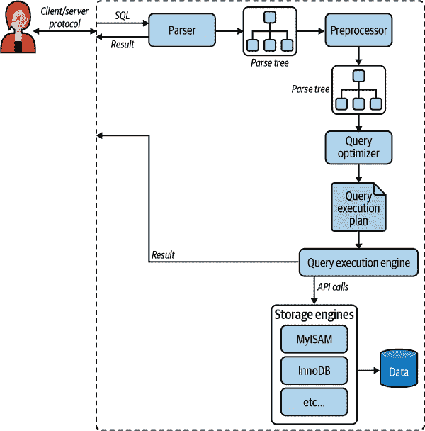
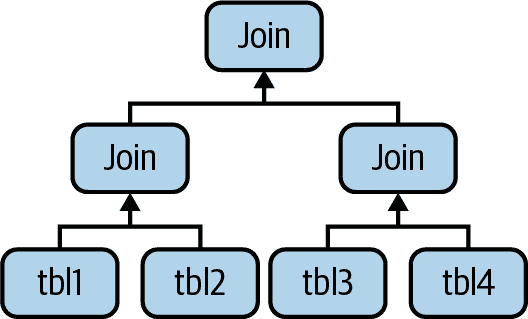

# 第八章：查询性能优化

在前几章中，我们解释了模式优化和索引，这对于高性能是必要的。但这还不够——您还需要设计良好的查询。如果您的查询不好，即使是设计最佳的模式和索引也不会表现良好。

查询优化、索引优化和模式优化是相辅相成的。随着在 MySQL 中编写查询的经验增加，您将学会如何设计表和索引以支持高效的查询。同样，您所学到的关于最佳模式设计将影响您编写的查询类型。这个过程需要时间，因此我们鼓励您在学习过程中参考这三章。

本章从一般查询设计考虑开始：当查询性能不佳时，您应该首先考虑的事项。然后我们深入研究查询优化和服务器内部。我们将向您展示如何找出 MySQL 如何执行特定查询，并学习如何更改查询执行计划。最后，我们将看看 MySQL 无法很好地优化查询的一些地方，并探索有助于 MySQL 更有效地执行查询的查询优化模式。

我们的目标是帮助您深入了解 MySQL 如何真正执行查询，以便您可以思考什么是高效或低效的，利用 MySQL 的优势，避免其弱点。

# 查询为什么慢？

在尝试编写快速查询之前，请记住这一切都关乎响应时间。查询是任务，但它们由子任务组成，这些子任务消耗时间。要优化查询，必须通过消除它们、减少发生次数或加快发生速度来优化其子任务。

一般来说，您可以通过在脑海中跟随查询的序列图，从客户端到服务器，解析、规划和执行，然后再返回客户端，来思考查询的生命周期。执行是查询生命周期中最重要的阶段之一。它涉及大量调用存储引擎以检索行，以及后检索操作，如分组和排序。

在完成所有这些任务的同时，查询在网络、CPU 和诸如统计、规划、锁定（互斥等待）以及尤其是调用存储引擎检索行等操作上花费时间。这些调用在内存操作、CPU 操作以及特别是 I/O 操作中消耗时间，如果数据不在内存中的话。根据存储引擎的不同，可能还涉及大量的上下文切换和/或系统调用。

在每种情况下，由于操作是不必要地执行、执行次数过多或速度太慢，可能会消耗过多时间。优化的目标是通过消除或减少操作或使其更快来避免这种情况。

再次强调，这并不是查询生命周期的完整或准确图景。我们在这里的目标是展示理解查询生命周期的重要性，并从时间消耗的角度思考。有了这个理念，让我们看看如何优化查询。

# 慢查询基础知识：优化数据访问

查询性能不佳的最基本原因是因为它处理了太多数据。有些查询必须筛选大量数据，这是无法避免的。不过，这种情况并不常见；大多数糟糕的查询可以更改以访问更少的数据。我们发现分析性能不佳的查询有两个步骤是有用的：

1.  查找应用程序是否检索了比所需更多的数据。通常这意味着它访问了太多行，但也可能访问了太多列。

1.  查找*MySQL 服务器*是否分析了比所需更多的行。

## 您是否请求了不需要的数据？

有些查询请求了比所需更多的数据，然后丢弃了其中一些。这会给 MySQL 服务器增加额外的工作量，增加网络开销，并在应用程序服务器上消耗内存和 CPU 资源。

以下是一些典型的错误：

检索比所需更多的行

一个常见的错误是假设 MySQL 按需提供结果，而不是计算并返回完整的结果集。我们经常在由熟悉其他数据库系统的人设计的应用程序中看到这种情况。这些开发人员习惯于发出返回许多行的`SELECT`语句，然后获取前*`N`*行并关闭结果集（例如，在新闻网站上获取最近的 100 篇文章，而他们只需要在首页显示其中的 10 篇）。他们认为 MySQL 会提供这 10 行并停止执行查询，但 MySQL 实际上会生成完整的结果集。客户端库然后获取所有数据并丢弃大部分数据。最佳解决方案是在查询中添加`LIMIT`子句。

从多表连接中检索所有列

如果你想检索出出现在电影*Academy Dinosaur*中的所有演员，不要这样写查询：

```sql
SELECT * FROM sakila.actor
INNER JOIN sakila.film_actor USING(actor_id)
INNER JOIN sakila.film USING(film_id)
WHERE sakila.film.title = 'Academy Dinosaur';
```

这会返回三个表中的所有列。相反，将查询写成如下形式：

```sql
SELECT sakila.actor.* FROM sakila.actor...;
```

检索所有列

当你看到`SELECT *`时，你应该持怀疑态度。你真的需要所有的列吗？可能不需要。检索所有列可能会阻止优化，如覆盖索引，并为服务器增加 I/O、内存和 CPU 开销。一些数据库管理员普遍不赞成`SELECT *`，因为这个事实以及为了减少当有人修改表的列列表时出现问题的风险。

当然，并不总是坏事要求比实际需要的数据更多。在我们调查的许多情况下，人们告诉我们这种浪费的方法简化了开发，因为它允许开发人员在多个地方使用相同的代码片段。只要你知道这在性能方面的代价，��是一个合理的考虑。如果你的应用程序中使用某种类型的缓存，或者你有其他目的，检索比实际需要的数据更多可能也是有用的。检索和缓存完整对象可能比运行许多单独的查询检索对象的部分更可取。

重复检索相同的数据

如果不小心，很容易编写应用程序代码，从数据库服务器中重复检索相同的数据，执行相同的查询以获取它。例如，如果你想找出用户的个人资料图片 URL 以显示在评论列表旁边，你可能会为每条评论重复请求这个信息。或者你可以在第一次获取后缓存它并在以后重复使用。后一种方法更有效。

## MySQL 是否检查了太多数据？

一旦确定你的查询只检索你需要的数据，你可以寻找生成结果时检查了太多数据的查询。在 MySQL 中，最简单的查询成本指标是：

+   响应时间

+   检查的行数

+   返回的行数

这些指标都不是衡量查询成本的完美方式，但它们大致反映了 MySQL 执行查询时必须内部访问多少数据，并大致转化为查询运行的速度。这三个指标都记录在慢查询日志中，因此查看慢查询日志是发现检查了太多数据的查询的最佳方法之一。

### 响应时间

警惕只看查询响应时间。嘿，这不是我们一直告诉你的相反吗？其实不然。响应时间仍然很重要，但有点复杂。

响应时间是服务时间和队列时间的总和。*服务时间*是服务器实际处理查询所需的时间。*队列时间*是响应时间中服务器实际上并未执行查询的部分——它在等待某些事情，比如等待 I/O 操作完成、等待行锁等。问题在于，除非你可以单独测量这些组件，否则你无法将响应时间分解为这些组件。通常，你会遇到的最常见和重要的等待是 I/O 和锁等待，但你不应该只依赖这两种，因为情况变化很大。I/O 和锁等待之所以重要，是因为它们对性能的影响最大。

因此，在不同负载条件下，响应时间并不一致。其他因素——如存储引擎锁（如行锁）、高并发和硬件——也会对响应时间产生相当大的影响。响应时间也可能是问题的症状和原因，而且并不总是明显哪种情况。

当你查看查询的响应时间时，你应该问自己查询的响应时间是否合理。我们在本书中没有详细解释的空间，但你实际上可以使用 Tapio Lahdenmaki 和 Mike Leach 的书*关系数据库索引设计和优化器*（Wiley）中解释的技术计算查询响应时间的快速上限估计（QUBE）。简而言之：检查查询执行计划和涉及的索引，确定可能需要多少个顺序和随机 I/O 操作，并将这些乘以硬件执行它们所需的时间。把它们加起来，你就有一个判断查询是否比可能或应当更慢的标准。

### 检查的行数和返回的行数

在分析查询时，考虑检查的行数是有用的，因为你可以看到查询是否高效地找到你需要的数据。然而，这并不是一个找到“坏”查询的完美指标。并非所有行访问都是相等的。较短的行访问速度更快，从内存中获取行比从磁盘中读取行要快得多。

理想情况下，检查的行数应该与返回的行数相同，但实际上这很少可能。例如，在构建连接行时，服务器必须访问多个行以生成结果集中的每一行。检查的行数与返回的行数的比率通常很小——比如，1:1 到 10:1 之间，但有时可能相差几个数量级。

### 扫描的行数和访问类型

当你考虑查询的成本时，考虑在表中找到单个行的成本。MySQL 可以使用多种访问方法来查找和返回行。有些需要检查许多行，但其他可能能够在不检查任何行的情况下生成结果。

访问方法出现在`EXPLAIN`输出的`type`列中。访问类型从完整表扫描到索引扫描、范围扫描、唯一索引查找和常量。每种访问类型都比前一种更快，因为它需要读取的数据更少。你不需要记住访问类型，但你应该理解扫描表、扫描索引、范围访问和单值访问的一般概念。

如果你没有得到一个好的访问类型，通常解决问题的最佳方法是添加一个适当的索引。我们在前一章讨论了索引；现在你可以看到为什么索引对查询优化如此重要。索引让 MySQL 能够以更有效的访问类型找到行，从而减少数据的检查。

例如，让我们看一个在 Sakila 示例数据库上的简单查询：

```sql
SELECT * FROM sakila.film_actor WHERE film_id = 1;
```

这个查询将返回 10 行，`EXPLAIN`显示 MySQL 使用`idx_fk_film_id`索引上的`ref`访问类型来执行查询：

```sql
mysql> EXPLAIN SELECT * FROM sakila.film_actor WHERE film_id = 1\G
*************************** 1\. row ***************************
 id: 1
 select_type: SIMPLE
 table: film_actor
 partitions: NULL
 type: ref
 possible_keys: idx_fk_film_id
 key: idx_fk_film_id
 key_len: 2
 ref: const
 rows: 10
 filtered: 100.00
 Extra: NULL
```

`EXPLAIN` 显示 MySQL 估计只需要访问 10 行。换句话说，查询优化器知道所选的访问类型可以有效地满足查询。如果查询没有合适的索引会发生什么？如果我们删除索引并再次运行查询，MySQL 将不得不使用一个不太优化的访问类型，正如我们可以看到的：

```sql
mysql> ALTER TABLE sakila.film_actor DROP FOREIGN KEY fk_film_actor_film;
mysql> ALTER TABLE sakila.film_actor DROP KEY idx_fk_film_id;
mysql> EXPLAIN SELECT * FROM sakila.film_actor WHERE film_id = 1\G
*************************** 1\. row ***************************
 id: 1
 select_type: SIMPLE
 table: film_actor
 partitions: NULL
 type: ALL
 possible_keys: NULL
 key: NULL
 key_len: NULL
 ref: NULL
 rows: 5462
 filtered: 10.00
 Extra: Using where
1 row in set, 1 warning (0.00 sec)
```

可预测的是，访问类型已经变为全表扫描（`ALL`），MySQL 现在估计它将需要检查 5,462 行来满足查询。`Extra`列中的“Using where”显示 MySQL 服务器正在使用`WHERE`子句在存储引擎读取行后丢弃行。

一般来说，MySQL 可以以三种方式应用`WHERE`子句，从最好到最差：

+   将条件应用于索引查找操作，以消除不匹配的行。这发生在存储引擎层。

+   使用覆盖索引（`Extra`列中的“Using index”）避免行访问，并在从索引检索每个结果后过滤掉不匹配的行。这发生在服务器层，但不需要从表中读取行。

+   从表中检索行，然后过滤不匹配的行（“在`Extra`列中使用 where”）。这发生在服务器层，需要服务器在过滤行之前从表中读取行。

这个例子说明了拥有良好索引是多么重要。良好的索引帮助你的查询获得良好的访问类型，并仅检查它们需要的行。然而，添加索引并不总是意味着 MySQL 将访问和返回相同数量的行。例如，这里有一个使用`COUNT()`²聚合函数的查询：

```sql
mysql> SELECT actor_id, COUNT(*) 
    -> FROM sakila.film_actor GROUP BY actor_id;
+----------+----------+
| actor_id | COUNT(*) |
+----------+----------+
|        1 |       19 |
|        2 |       25 |
|        3 |       22 |
.. omitted..
|      200 |       20 |
+----------+----------+
200 rows in set (0.01 sec)
```

此查询仅返回 200 行，但它需要读取多少行？我们可以通过`EXPLAIN`来检查，就像我们在上一章中讨论的那样：

```sql
mysql> EXPLAIN SELECT actor_id, COUNT(*) 
    -> FROM sakila.film_actor GROUP BY actor_id\G
*************************** 1\. row ***************************
 id: 1
 select_type: SIMPLE
 table: film_actor
 partitions: NULL
 type: index
 possible_keys: PRIMARY
 key: PRIMARY
 key_len: 4
 ref: NULL
 rows: 5462
 filtered: 100.00
 Extra: Using index
```

糟糕！读取数千行只需要 200 行意味着我们做了比必要更多的工作。对于这样的查询，索引无法减少检查的行数，因为没有`WHERE`子句来消除行。

不幸的是，MySQL 不会告诉你它访问的行中有多少被用来构建结果集；它只告诉你它访问的总行数。这些行中的许多行可能会被`WHERE`子句消除，并最终不会对结果集做出贡献。在前面的例子中，删除`sakila.film_actor`上的索引后，查询访问了表中的每一行，而`WHERE`子句丢弃了除了其中的 10 行之外的所有行。只有剩下的 10 行被用来构建结果集。理解服务器访问了多少行以及它实际使用了多少行需要对查询进行推理。

如果发现为了生成相对较少的结果而检查了大量行，你可以尝试一些更复杂的修复方法：

+   使用覆盖索引，它存储数据，使得存储引擎不必检索完整的行。（我们在第七章中讨论过这些。）

+   更改模式。一个例子是使用摘要表（在第六章中讨论）。

+   重写一个复杂的查询，以便 MySQL 优化器能够最佳地执行它。（我们将在本章后面讨论这个问题。）

# 重构查询的方法

在优化有问题的查询时，你的目标应该是找到获取你想要的结果的替代方法，但这并不一定意味着从 MySQL 中获得相同的结果集。有时候，你可以将查询转换为返回相同结果且性能更好的等价形式。然而，你也应该考虑重写查询以检索*不同*的结果，如果这样做能提高效率的话。最终，通过改变应用程序代码以及查询，你可能能够完成相同的工作。在本节中，我们将解释一些技术，帮助你重构各种查询，并告诉你何时使用每种技术。

## 复杂查询与多个查询

一个重要的查询设计问题是是否更倾向于将复杂查询分解为几个简单查询。传统的数据库设计方法强调尽可能用尽可能少的查询来完成尽可能多的工作。这种方法在历史上更好，因为网络通信的成本和查询解析和优化阶段的开销。

然而，这个建议在 MySQL 上不太适用，因为它被设计为非常高效地处理连接和断开连接，并且对小型、简单的查询作出快速响应。现代网络也比以前快得多，减少了网络延迟。根据服务器版本，MySQL 可以在商品服务器硬件上每秒运行超过十万个简单查询，并且在千兆网络上从单个对应方每秒运行超过两千个 QPS，因此运行多个查询并不一定是一件坏事。

与 MySQL 每秒内部遍历的行数相比，连接响应仍然很慢，尽管对于内存数据，每秒可以计数为百万级。其他条件相同的情况下，尽可能使用较少的查询仍然是个好主意，但有时你可以通过分解查询并执行几个简单的查询而不是一个复杂的查询来使查询更有效。不要害怕这样做；权衡成本，选择导致工作量较少的策略。我们稍后在本章中展示了一些这种技术的例子。

使用过多查询是应用设计中的常见错误。例如，一些应用程序执行 10 个单行查询以从表中检索数据，而实际上它们可以使用一个包含 10 行的查询。我们甚至看到一些应用程序会逐个检索每一列，多次查询每一行！

## 分解查询

另一种分解查询的方法是分而治之，保持基本相同但在影响更少行的情况下以较小的“块”运行它。

清理旧数据是一个很好的例子。定期清理作业可能需要删除大量数据，如果在一个巨大的查询中执行此操作可能会锁定很多行很长时间，填满事务日志，占用资源，并阻塞不应被中断的小查询。分解`DELETE`语句并使用中等大小的查询可以显著提高性能，并在查询被复制时减少复制延迟。例如，与其运行这个庞大的查询：

```sql
DELETE FROM messages
WHERE created < DATE_SUB(NOW(),INTERVAL 3 MONTH);
```

您可以做类似以下伪代码：

```sql
rows_affected = 0
do {
 rows_affected = do_query(
 "DELETE FROM messages WHERE created < DATE_SUB(NOW(),INTERVAL 3 MONTH)
 LIMIT 10000")
} while rows_affected > 0
```

每次删除 10,000 行通常是一个足够大的任务，使每个查询都有效，并且足够短的任务以最小化对服务器的影响³（事务存储引擎可能受益于更小的事务）。在`DELETE`语句之间添加一些休眠时间以分散负载并减少锁定时间也可能是个好主意。

## 连接分解

许多高性能应用程序使用*连接分解*。您可以通过运行多个单表查询而不是多表连接来分解连接，然后在应用程序中执行连接。例如，与其这样的单个查询：

```sql
SELECT * FROM tag
JOIN tag_post ON tag_post.tag_id=tag.id
JOIN post ON tag_post.post_id=post.id
WHERE tag.tag='mysql';
```

您可能会运行这些查询：

```sql
SELECT * FROM tag WHERE tag='mysql';
SELECT * FROM tag_post WHERE tag_id=1234;
SELECT * FROM post WHERE post.id in (123,456,567,9098,8904);
```

为什么要这样做？乍一看，这看起来是浪费的，因为您增加了查询的数量，却没有得到任何回报。然而，这种重组实际上可以带来显著的性能优势：

+   缓存可能更有效。许多应用程序会缓存直接映射到表的“对象”。在这个例子中，如果带有标签`mysql`的对象已经被缓存，应用程序可以跳过第一个查询。如果在缓存中找到 ID 为 123、567 或 9098 的帖子，可以将它们从`IN()`列表中移除。

+   有时逐个执行查询可以减少锁争用。

+   在应用程序中进行连接使得通过将表放置在不同的服务器上更容易扩展数据库。

+   查询本身可能更有效率。在这个例子中，使用`IN()`列表而不是连接让 MySQL 对行 ID 进行排序，并更优化地检索行，这可能比使用连接更有效。

+   您可以减少冗余的行访问。在应用程序中进行连接意味着您只检索每行一次，而在查询中进行连接本质上是一种反规范化，可能会重复访问相同的数据。出于同样的原因，这种重组也可能减少总网络流量和内存使用。

因此，在应用程序中进行连接时，如果您从先前的查询中缓存和重复使用大量数据，将数据分布在多个服务器上，将连接替换为`IN()`列表在大表上，或者连接多次引用同一表时，可能会更有效率。

# 查询执行基础知识

如果您需要从 MySQL 服务器获得高性能，最好的投资之一是学习 MySQL 如何优化和执行查询。一旦您理解了这一点，大部分查询优化都是根据原则推理，查询优化变得非常逻辑。

让我们重新审视我们之前讨论的内容：MySQL 执行查询的过程。图 8-1 展示了当您向 MySQL 发送查询时会发生什么：

1.  客户端将 SQL 语句发送到服务器。

1.  服务器将其解析、预处理并优化为查询执行计划。

1.  查询执行引擎通过调用存储引擎 API 执行计划。

1.  服务器将结果发送给客户端。



###### 图 8-1\. 查询的执行路径

每个步骤都有一些额外的复杂性，我们将在接下来的章节��讨论。我们还会解释在每个步骤中查询将处于哪些状态。查询优化过程特别复杂且重要。还有一些例外或特殊情况，比如在使用准备语句时执行路径的差异；我们将在下一章中讨论。

## MySQL 客户端/服务器协议

尽管您不需要了解 MySQL 客户端/服务器协议的内部细节，但您需要在高层次上了解它是如何工作的。该协议是*半双工*的，这意味着在任何给定时间 MySQL 服务器可以发送或接收消息但不能同时进行两者。这也意味着没有办法截断消息。

这种协议使得 MySQL 通信简单快速，但也在某些方面限制了它。首先，这意味着没有流量控制；一旦一方发送消息，另一方必须在回复之前获取整个消息。这就像一个来回传球的游戏：任何时候只有一方拿着球，除非你拿到球，否则你无法传球（发送消息）。

客户端将查询作为单个数据包发送到服务器。这就是为什么如果您有大型查询，`max_allowed_packet` 配置变量很重要。⁴ 一旦客户端发送查询，它就不再控制局面；它只能等待结果。

相比之下，服务器的响应通常由许多数据包组成。当服务器响应时，客户端必须接收*整个*结果集。它不能简单地获取一些行然后要求服务器不再发送其余的行。如果客户端只需要返回的前几行，它要么等待所有服务器的数据包到达然后丢弃它不需要的部分，要么不正常地断开连接。这两种方式都不是好主意，这就是为什么适当使用`LIMIT`子句如此重要。

这里有另一种思考方式：当客户端从服务器获取行时，它认为自己是在*拉*它们。但事实是，MySQL 服务器在生成行时是在*推*行。客户端只接收被推送的行；它无法告诉服务器停止发送行。客户端就像在“从消防水龙头中喝水”，可以这么说。（是的，这是一个技术术语。）

大多数连接到 MySQL 的库都可以让您获取整个结果集并将其缓冲在内存中，或者在需要时获取每一行。默认行为通常是获取整个结果并将其缓冲在内存中。这很重要，因为在获取所有行之前，MySQL 服务器不会释放查询所需的锁和其他资源。查询将处于“发送数据”状态。当客户端库一次性获取所有结果时，它减少了服务器需要做的工作量：服务器可以尽快完成并清理查询。

大多数客户端库让您将结果集视为从服务器获取，尽管实际上您只是从库内存中的缓冲区获取。这在大多数情况下运行良好，但对于可能需要很长时间才能获取并使用大量内存的大型结果集，这不是一个好主意。如果指示库不缓冲结果，您可以使用更少的内存并更早开始处理结果。缺点是，当您的应用程序与库交互时，服务器上的锁和其他资源将保持打开状态。⁵

让我们看一个使用 PHP 的示例。这是您通常从 PHP 查询 MySQL 的方式：

```sql
<?php
$link = mysql_connect('localhost', 'user', 'p4ssword');
$result = mysql_query('SELECT * FROM HUGE_TABLE', $link);
while ( $row = mysql_fetch_array($result) ) {
 // Do something with result
}
?>
```

代码似乎表明您只在需要时在`while`循环中获取行。然而，代码实际上通过`mysql_query()`函数调用将整个结果获取到缓冲区中。`while`循环只是遍历缓冲区。相比之下，以下代码不会缓冲结果，因为它使用`mysql_unbuffered_query()`而不是`mysql_query()`：

```sql
<?php
$link = mysql_connect('localhost', 'user', 'p4ssword');
$result = mysql_unbuffered_query('SELECT * FROM HUGE_TABLE', $link);
while ( $row = mysql_fetch_array($result) ) {
 // Do something with result
}
?>
```

编程语言有不同的方法来覆盖缓冲。例如，Perl 的`DBD::mysql`驱动程序要求您指定 C 客户端库的`mysql_​use_result`属性（默认为`mysql_buffer_result`）。这是一个示例：

```sql
#!/usr/bin/perl
use DBI;
my $dbh = DBI->connect('DBI:mysql:;host=localhost', 'user', 'p4ssword');
my $sth = $dbh->prepare('SELECT * FROM HUGE_TABLE', { mysql_use_result => 1 });
$sth->execute();
while ( my $row = $sth->fetchrow_array() ) {
 # Do something with result
}
```

注意，调用`prepare()`指定“使用”结果而不是“缓冲”结果。您也可以在连接时指定这一点，这将使每个语句都是非缓冲的：

```sql
my $dbh = DBI->connect('DBI:mysql:;mysql_use_result=1', 'user', 'p4ssword');
```

## 查询状态

每个 MySQL 连接，或*线程*，都有一个状态，显示其在任何给定时间正在做什么。有几种查看这些状态的方法，但最简单的方法是使用`SHOW FULL PROCESSLIST`命令（状态显示在`Command`列中）。随着查询在其生命周期中的进展，其状态会多次更改，有数十种状态。MySQL 手册是所有状态信息的权威来源，但我们在这里列出了一些并解释了它们的含义：

休眠

线程正在等待来自客户端的新查询。

查询

线程正在执行查询或将结果发送回客户端。

锁定

线程正在等待服务器级别授予表锁。由存储引擎实现的锁，例如 InnoDB 的行锁，不会导致线程进入`Locked`状态。

分析和统计

线程正在检查存储引擎统计信息并优化查询。

复制到临时表[在磁盘上]

线程正在处理查询并将结果复制到临时表，可能是为了`GROUP BY`，进行文件排序，或满足`UNION`。如果状态以“on disk”结尾，MySQL 正在将内存表转换为磁盘表。

排序结果

线程正在对结果集进行排序。

至少了解基本状态是有帮助的，这样您就可以了解查询的“谁在掌握主动权”。在非��繁忙的服务器上，您可能会看到通常很短暂的状态，例如`statistics`，开始占用大量时间。这通常表示出现了问题。

## 查询优化过程

查询生命周期中的下一步将 SQL 查询转换为查询执行引擎的执行计划。这包括几个子步骤：解析、预处理和优化。错误（例如，语法错误）可能在过程的任何时候引发。我们并不打算在这里记录 MySQL 的内部情况，因此我们将采取一些自由，例如即使它们通常为了效率而完全或部分地合并，我们也会单独描述步骤。我们的目标只是帮助您了解 MySQL 如何执行查询，以便您可以编写更好的查询。

### 解析器和预处理器

首先，MySQL 的*解析器*将查询分解为标记，并从中构建“解析树”。解析器使用 MySQL 的 SQL 语法来解释和验证查询。例如，它确保查询中的标记有效且顺序正确，并检查是否存在未终止的引号字符串等错误。

*预处理器*然后检查解析树的结果，以解决解析器无法解决的附加语义。例如，它检查表和列是否存在，并解析名称和别名以确保列引用不会产生歧义。

接下来，预处理器检查权限。除非您的服务器具有大量权限，否则这通常非常快。

### 查询优化器

解析树现在有效并准备好供优化器将其转换为查询执行计划。一个查询通常可以以许多不同的方式执行并产生相同的结果。优化器的工作是找到最佳选项。

MySQL 使用基于成本的优化器，这意味着它试图预测各种执行计划的成本并选择最便宜的。成本单位最初是一个单个随机的 4 KB 数据页读取，但现在已变得更加复杂，现在包括诸如执行`WHERE`子句比较的估计成本等因素。您可以通过运行查询，然后检查`Last_query_cost`会话变量来查看优化器估计查询的成本有多昂贵：

```sql
mysql> SELECT SQL_NO_CACHE COUNT(*) FROM sakila.film_actor;
+----------+
| count(*) |
+----------+
|     5462 |
+----------+

mysql> SHOW STATUS LIKE 'Last_query_cost';
+-----------------+-------------+
| Variable_name   | Value       |
+-----------------+-------------+
| Last_query_cost | 1040.599000 |
+-----------------+-------------+
```

这个结果意味着优化器估计执行查询需要大约 1040 个随机数据页读取。它基于统计数据：每个表或索引的页数，索引的*基数*（不同值的数量），行和键的长度，以及键的分布。优化器在其估计中不包括任何类型缓存的影响；它假设每次读取都会导致磁盘 I/O 操作。

优化器可能并不总是选择最佳计划，原因有很多：

+   统计数据可能不准确。服务器依赖存储引擎提供统计信息，它们的准确性可能从完全正确到极不准确。例如，InnoDB 存储引擎由于其 MVCC 架构不维护关于表中行数的准确统计信息。

+   成本度量标准并不完全等同于运行查询的真实成本，因此即使统计数据准确，查询的成本可能比 MySQL 的近似值更昂贵或更便宜。在某些情况下，读取更多页的计划实际上可能更便宜，例如当读取是顺序的时，磁盘 I/O 更快，或者当页已缓存在内存中时。MySQL 也不了解哪些页在内存中，哪些页在磁盘上，因此它实际上不知道查询会导致多少 I/O。

+   MySQL 的“最佳”概念可能与您的不同。您可能希望获得最快的执行时间，但 MySQL 实际上并不试图使查询快速；它试图最小化它们的成本，正如我们所见，确定成本并不是一门确切的科学。

+   MySQL 不考虑同时运行的其他查询，这可能会影响查询运行的速度。

+   MySQL 并不总是进行基于成本的优化。有时它只是遵循规则，例如“如果有一个全文 `MATCH()` 子句，如果存在 `FULLTEXT` 索引，则使用它”。即使使用不同的索引和带有 `WHERE` 子句的非 `FULLTEXT` 查询更快，它也会这样做。

+   优化器不考虑不受其控制的操作的成本，例如执行存储函数或用户定义的函数。

+   正如我们将在后面看到的，优化器并不总是能够估计每种可能的执行计划，因此可能会错过最佳计划。

MySQL 的查询优化器是一个非常复杂的软件部分，它使用许多优化来将查询转换为执行计划。有两种基本类型的优化，我们称之为*静态*和*动态*。*静态优化* 可以通过检查解析树简单地执行。例如，优化器可以通过应用代数规则将 `WHERE` 子句转换为等效形式。静态优化与值无关，例如 `WHERE` 子句中常量的值。它们可以执行一次，并且在使用不同值重新执行查询时始终有效。您可以将其视为“编译时优化”。

相比之下，*动态优化* 基于上下文，并且可能取决于许多因素，例如 `WHERE` 子句中的值或索引中的行数。它们必须在每次执行查询时重新评估。您可以将其视为“运行时优化”。

在执行预处理语句或存储过程时，区别很重要。MySQL 可以进行静态优化一次，但必须每次执行查询时重新评估动态优化。有时，MySQL 甚至在执行过程中重新优化查询。⁶

以下是 MySQL 知道如何执行的一些优化类型：

重新排序连接

表不一定要按照查询中指定的顺序连接。确定最佳连接顺序是一项重要的优化；我们稍后在本章中深入解释。

将 `OUTER JOIN` 转换为 `INNER JOIN`

`OUTER JOIN` 不一定要作为 `OUTER JOIN` 执行。某些因素，例如 `WHERE` 子句和表模式，实际上可能导致 `OUTER JOIN` 等效于 `INNER JOIN`。MySQL 可以识别这一点并重写连接，从而使其有资格进行重新排序。

应用代数等价规则

MySQL 应用代数变换来简化和规范化表达式。它还可以折叠和减少常量，消除不可能的约束和常量条件。例如，术语 `(5=5 AND a>5)` 将简化为 `a>5`。类似地，`(a<b AND b=c) AND a=5` 变为 `b>5 AND b=c AND a=5`。这些规则对于编写条件查询非常有用，我们稍后在本章中讨论。

`COUNT()`、`MIN()` 和 `MAX()` 优化

索引和列的可空性通常可以帮助 MySQL 优化这些表达式。例如，要找到 B 树索引中最左边的列的最小值，MySQL 可以只请求索引中的第一行。它甚至可以在查询优化阶段执行此操作，并将该值视为常量用于查询的其余部分。类似地，要找到 B 树索引中的最大值，服务器会读取最后一行。如果服务器使用此优化，您将在 `EXPLAIN` 计划中看到“选择表已优化” 。这实际上意味着优化器已将表从查询计划中移除，并用常量替换。

评估和简化常量表达式

当 MySQL 检测到表达式可以简化为常量时，它会在优化过程中这样做。例如，如果用户定义的变量在查询中没有更改，它可以转换为常量。算术表达式是另一个例子。

也许令人惊讶的是，即使你可能认为是一个查询的东西也可以在优化阶段被减少为一个常量。一个例子是对索引的`MIN()`。这甚至可以扩展到对主键或唯一索引的常量查找。如果`WHERE`子句对这样的索引应用一个常量条件，优化器知道 MySQL 可以在查询开始时查找值。然后它将在查询的其余部分将该值视为常量。这里有一个例子：

```sql
mysql> EXPLAIN SELECT film.film_id, film_actor.actor_id
    -> FROM sakila.film
    -> INNER JOIN sakila.film_actor USING(film_id)
    -> WHERE film.film_id = 1\G
*************************** 1\. row ***************************
 id: 1
 select_type: SIMPLE
 table: film
 partitions: NULL
 type: const
 possible_keys: PRIMARY
 key: PRIMARY
 key_len: 2
 ref: const
 rows: 1
 filtered: 100.00
 Extra: Using index
*************************** 2\. row ***************************
 id: 1
 select_type: SIMPLE
 table: film_actor
 partitions: NULL
 type: index
 possible_keys: NULL
 key: PRIMARY
 key_len: 4
 ref: NULL
 rows: 5462
 filtered: 10.00
 Extra: Using where; Using index
```

MySQL 以两个步骤执行此查询，对应于输出中的两行。第一步是在`film`表中找到所需的行。MySQL 的优化器知道只有一行，因为`film_id`列上有一个主键，并且在查询优化阶段已经查询了索引以查看将找到多少行。因为查询优化器有一个已知数量（`WHERE`子句中的值）用于查找，所以这个表的`ref`类型是`const`。

在第二步中，MySQL 将第一步找到的`film_id`列视为已知数量。它可以这样做，因为优化器知道当查询到达第二步时，它将知道第一步的所有值。请注意，`film_actor`表的`ref`类型是`const`，就像`film`表的一样。

另一种你会看到常量条件应用的方式是通过从一个地方传播值的常量性到另一个地方，如果有一个`WHERE`、`USING`或`ON`子句将值限制为相等。在这个例子中，优化器知道`USING`子句强制`film_id`在查询中的任何地方具有相同的值；它必须等于`WHERE`子句中给定的常量值。

覆盖索引

当索引包含查询所需的所有列时，MySQL 有时可以使用索引来避免读取行数据。我们在上一章节中详细讨论了覆盖索引。

子查询优化

MySQL 可以将某些类型的子查询转换为更高效的替代形式，将它们减少为索引查找而不是单独的查询。

早期终止

MySQL 可以在满足查询或步骤时立即停止处理查询（或查询中的步骤）。明显的情况是`LIMIT`子句，但还有几种其他类型的早期终止。例如，如果 MySQL 检测到一个不可能的条件，它可以中止整个查询。你可以在以下示例中看到这一点：

```sql
mysql> EXPLAIN SELECT film.film_id FROM sakila.film WHERE film_id = −1;
*************************** 1\. row ***************************
 id: 1
 select_type: SIMPLE
 table: NULL
 partitions: NULL
 type: NULL
 possible_keys: NULL
 key: NULL
 key_len: NULL
 ref: NULL
 rows: NULL
 filtered: NULL
 Extra: Impossible WHERE
```

这个查询在优化步骤中停止了，但 MySQL 也可以在其他一些情况下提前终止执行。当查询执行引擎识别到需要检索不同值或在值不存在时停止时，服务器可以使用这种优化。例如，以下查询找到所有没有任何演员的电影:⁷

```sql
SELECT film.film_id
FROM sakila.film
LEFT OUTER JOIN sakila.film_actor USING(film_id)
WHERE film_actor.film_id IS NULL;
```

这个查询通过消除任何有演员的电影来工作。每部电影可能有很多演员，但一旦找到一个演员，它就会停止处理当前电影并移动到下一个，因为它知道`WHERE`子句禁止输出该电影。类似的“Distinct/not-exists”优化可以应用于某些类型的`DISTINCT`、`NOT EXISTS()`和`LEFT JOIN`查询。

等式传播

MySQL 识别查询将两列视为相等时，例如在`JOIN`条件中，并在等效列之间传播`WHERE`子句。例如，在以下查询中：

```sql
SELECT film.film_id
FROM sakila.film
INNER JOIN sakila.film_actor USING(film_id)
WHERE film.film_id > 500;
```

MySQL 知道`WHERE`子句不仅适用于`film`表，也适用于`film_actor`表，因为`USING`子句强制两列匹配。

如果你习惯于另一个不能做到这一点的数据库服务器，你可能会被建议通过手动指定两个表的`WHERE`子句来“帮助优化器”，就像这样：

```sql
... WHERE film.film_id > 500 AND film_actor.film_id > 500
```

这在 MySQL 中是不必要的。它只会使你的查询更难维护。

`IN()`列表比较

在许多数据库服务器中，`IN()`只是多个`OR`子句的同义词，因为两者在逻辑上是等价的。但在 MySQL 中不是这样，它对`IN()`列表中的值进行排序，并使用快速二进制搜索来查看值是否在列表中。这在列表大小为 O(log *n*)时，而等效的`OR`子句系列在列表大小为 O(*n*)时（即对于大型列表来说要慢得多）。

前面的列表非常不完整，因为 MySQL 执行的优化比我们在整个章节中能够涵盖的要多，但它应该让您了解优化器的复杂性和智能。如果有一件事情您应该从这个讨论中记住，那就是*不要试图预先聪明地超越优化器*。您可能最终只是击败它或使查询变得更加复杂且难以维护，而没有任何好处。一般来说，您应该让优化器自行处理。

��然，优化器再聪明，有时候也不会给出最佳结果。有时候您可能了解一些优化器不知道的数据，比如由于应用逻辑保证为真的事实。此外，有时候优化器没有必要的功能，比如哈希索引；在其他时候，正如前面提到的，其成本估算可能更喜欢一个比另一个更昂贵的查询计划。

如果您知道优化器没有给出好的结果并且知道原因，您可以帮助它。一些选项包括向查询添加提示，重写查询，重新设计模式或添加索引。

### 表和索引统计信息

回想一下 MySQL 服务器架构中的各个层次，我们在图 1-1 中进行了说明。服务器层包含查询优化器，不存储数据和索引的统计信息。这是存储引擎的工作，因为每个存储引擎可能保留不同类型的统计信息（或以不同方式保留）。

因为服务器不存储统计信息，MySQL 查询优化器必须向引擎请求查询中表的统计信息。引擎提供优化器统计信息，例如每个表或索引的页数，表和索引的基数，行和键的长度，以及键分布信息。优化器可以使用这些信息来帮助它决定最佳执行计划。我们将在后面的章节中看到这些统计信息如何影响优化器的选择。

### MySQL 的连接执行策略

MySQL 比您可能习惯的更广泛地使用*连接*这个术语。总之，它认为每个查询都是一个连接——不仅仅是从两个表中匹配行的每个查询，而是每个查询，无论是子查询还是甚至针对单个表的`SELECT`。因此，了解 MySQL 如何执行连接非常重要。

考虑一个`UNION`查询的示例。MySQL 将`UNION`执行为一系列单个查询，其结果被拼接到临时表中，然后再次读取出来。每个单独的查询在 MySQL 术语中都是一个连接，从结果临时表中读取也是如此。

MySQL 的连接执行策略曾经很简单：它将每个连接都视为嵌套循环连接。这意味着 MySQL 运行一个循环来查找表中的一行，然后运行一个嵌套循环来查找下一个表中的匹配行。直到在连接中的每个表中找到匹配行为止。然后根据`SELECT`列表中的列构建并返回一行。它尝试通过在最后一个表中查找更多匹配行来构建下一行。如果找不到任何匹配行，则回溯一个表并在那里查找更多行。它一直回溯，直到在某个表中找到另一行，然后在下一个表中查找匹配行，依此类推。

从版本 8.0.20 开始，不再使用块嵌套循环连接；取而代之的是 [哈希连接](https://oreil.ly/WdIQm)。这使得连接过程的执行速度与以前一样快，甚至更快，尤其是如果其中一个数据集可以存储在内存中。

### 执行计划

MySQL 不会生成字节码来执行查询，就像许多其他数据库产品那样。相反，查询执行计划实际上是一个指令树¹⁰，查询执行引擎遵循该树以生成查询结果。最终计划包含足够的信息来重建原始查询。如果在查询上执行 `EXPLAIN EXTENDED`，然后是 `SHOW WARNINGS`，你将看到重建的查询。¹¹

任何多表查询在概念上都可以表示为一棵树。例如，可能可以像 图 8-2 所示的那样执行一个四表连接。



###### 图 8-2\. 多表连接的一种方式

这就是计算机科学家所说的*平衡树*。然而，这不是 MySQL 执行查询的方式。正如我们在前一节中描述的那样，MySQL 总是从一个表开始，并在下一个表中查找匹配的行。因此，MySQL 的查询执行计划总是采用*左深树*的形式，如 图 8-3 所示。


###### 图 8-3\. MySQL 如何连接多个表

### 连接优化器

MySQL 查询优化器中最重要的部分是*连接优化器*，它决定了多表查询的最佳执行顺序。通常可以以几种不同的顺序连接表并获得相同的结果。连接优化器估计各种计划的成本，并尝试选择成本最低的计划，以获得相同的结果。

这是一个查询，其表可以以不同的顺序连接而不改变结果：

```sql
SELECT film.film_id, film.title, film.release_year, actor.actor_id,
actor.first_name, actor.last_name
FROM sakila.film
INNER JOIN sakila.film_actor USING(film_id)
INNER JOIN sakila.actor USING(actor_id);
```

你可能会想到几种不同的查询计划。例如，MySQL 可以从 `film` 表开始，使用 `film_actor` 表中的 `film_id` 索引找到 `actor_id` 值，然后查找 `actor` 表的主键行。Oracle 用户可能会将其表述为“`film` 表是 `film_actor` 表的驱动表，`film_actor` 表是 `actor` 表的驱动表。” 这应该是有效的，对吧？现在让我们使用 `EXPLAIN` 看看 MySQL 想要如何执行查询：

```sql
*************************** 1\. row ***************************
 id: 1
 select_type: SIMPLE
 table: actor
 partitions: NULL
 type: ALL
 possible_keys: PRIMARY
 key: NULL
 key_len: NULL
 ref: NULL
 rows: 200
 filtered: 100.00
 Extra: NULL
*************************** 2\. row ***************************
 id: 1
 select_type: SIMPLE
 table: film_actor
 partitions: NULL
 type: ref
 possible_keys: PRIMARY,idx_fk_film_id
 key: PRIMARY
 key_len: 2
 ref: sakila.actor.actor_id
 rows: 27
 filtered: 100.00
 Extra: Using index
*************************** 3\. row ***************************
 id: 1
 select_type: SIMPLE
 table: film
 partitions: NULL
 type: eq_ref
 possible_keys: PRIMARY
 key: PRIMARY
 key_len: 2
 ref: sakila.film_actor.film_id
 rows: 1
 filtered: 100.00
 Extra: NULL
```

这与前一段中建议的计划完全不同。MySQL 希望从 `actor` 表开始（我们知道这是因为它在 `EXPLAIN` 输出中首先列出），并按相反的顺序进行。这真的更有效吗？让我们看看。`STRAIGHT_JOIN` 关键字强制连接按查询中指定的顺序进行。这是修改后查询的 `EXPLAIN` 输出：

```sql
mysql> EXPLAIN SELECT STRAIGHT_JOIN film.film_id...\G
*************************** 1\. row ***************************
 id: 1
 select_type: SIMPLE
 table: film
 partitions: NULL
 type: ALL
 possible_keys: PRIMARY
 key: NULL
 key_len: NULL
 ref: NULL
 rows: 1000
 filtered: 100.00
 Extra: NULL
*************************** 2\. row ***************************
 id: 1
 select_type: SIMPLE
 table: film_actor
 partitions: NULL
 type: ref
 possible_keys: PRIMARY,idx_fk_film_id
 key: idx_fk_film_id
 key_len: 2
 ref: sakila.film.film_id
 rows: 5
 filtered: 100.00
 Extra: Using index
*************************** 3\. row ***************************
 id: 1
 select_type: SIMPLE
 table: actor
 partitions: NULL
 type: eq_ref
 possible_keys: PRIMARY
 key: PRIMARY
 key_len: 2
 ref: sakila.film_actor.actor_id
 rows: 1
 filtered: 100.00
 Extra: NULL
```

这说明了为什么 MySQL 希望反转连接顺序：这样做将使其能够检查第一个表中的行数更少。¹² 在这两种情况下，它将能够在第二个和第三个表中执行快速的索引查找。不同之处在于它将不得不执行多少这样的索引查找。将 `film` 放在第一位将需要大约一千次探测（参见 `rows` 字段）到 `film_actor` 和 `actor`，即第一个表中的每一行都需要一次。如果服务器首先扫描 `actor` 表，它只需要对后续表进行两百次索引查找。换句话说，反转的连接顺序将需要更少的回溯和重读。

这是 MySQL 的连接优化器可以重新排列查询以使其执行成本更低的简单示例。重新排序连接通常是一种非常有效的优化。然而，有时不会得到最佳计划，对于这些情况，你可以使用 `STRAIGHT_JOIN` 并按照你认为最佳的顺序编写查询，但这样的情况很少见。在大多数情况下，连接优化器将胜过人类。

连接优化器试图生成具有最低成本的查询执行计划树。在可能的情况下，它检查所有子树的潜在组合，从所有单表计划开始。

不幸的是，对*n*个表进行连接将有*n*阶乘的连接顺序组合要检查。这被称为所有可能查询计划的*搜索空间*，并且增长非常快：一个包含 10 个表的连接可以以 3,628,800 种不同的方式执行！当搜索空间增长过大时，优化查询可能需要花费太长时间，因此服务器停止进行完整分析。相反，它会采用“贪婪”搜索等快捷方式，当表的数量超过`optimizer_search_depth`变量指定的限制时（如果需要，您可以更改该变量）。

MySQL 拥有许多启发式方法，通过多年的研究和实验积累而来，用于加速优化阶段。这可能是有益的，但也可能意味着 MySQL 可能（在极少数情况下）错过一个最佳计划并选择一个不太优化的计划，因为它试图避免检查每个可能的查询计划。

有时查询无法重新排序，连接优化器可以利用这一事实通过消除选择来减少搜索空间。`LEFT JOIN`是一个很好的例子，相关子查询也是（稍后会详细介绍子查询）。这是因为一个表的结果取决于从另一个表检索的数据。这些依赖关系帮助连接优化器通过消除选择来减少搜索空间。

### 排序优化

对结果进行排序可能是一个昂贵的操作，因此您通常可以通过避免排序或在较少行上执行排序来提高性能。

当 MySQL 无法使用索引生成排序结果时，它必须自行对行进行排序。它可以在内存中或磁盘上执行此操作，但无论如何，它总是将此过程称为*文件排序*，即使实际上并未使用文件。

如果要排序的值将适合排序缓冲区，MySQL 可以完全在内存中执行排序，使用*快速排序*。如果 MySQL 无法在内存中执行排序，则通过对值进行分块排序在磁盘上执行排序。它使用快速排序对每个块进行排序，然后将排序的块合并到结果中。

有两种文件排序算法：

两次遍历（旧）

读取行指针和`ORDER BY`列，对它们进行排序，然后扫描排序列表并重新读取行以输出。

两次遍历算法可能非常昂贵，因为它从表中读取两次行，第二次读取会导致大量随机 I/O。

单次遍历（新）

读取查询所需的所有列，按`ORDER BY`列对它们进行排序，然后扫描排序列表并输出指定的列。

它可能更有效率，特别是对于大型 I/O 受限数据集，因为它避免了从表中两次读取行，并将随机 I/O 交换为更多的顺序 I/O。然而，它有可能使用更多的空间，因为它保存每行的所有所需列，而不仅仅是用于排序行的列。这意味着更少的元组将适合排序缓冲区，文件排序将不得不执行更多的排序合并传递。

MySQL 可能为文件排序使用比您预期的更多的临时存储空间，因为它为将要排序的每个元组分配了固定大小的记录。这些记录足够大，可以容纳最大可能的元组，包括每个`VARCHAR`列的完整长度。此外，如果您使用 utf8mb4，MySQL 为每个字符分配 4 个字节。因此，我们曾看到过，优化不良的模式导致用于排序的临时空间比磁盘上整个表的大小大几倍。

当对连接进行排序时，MySQL 可能在查询执行过程中的两个阶段执行文件排序。如果`ORDER BY`子句仅涉及连接顺序中第一个表的列，MySQL 可以对该表进行文件排序，然后继续连接。如果发生这种情况，`EXPLAIN`在`Extra`列中显示“Using filesort”。在所有其他情况下，例如对连接顺序中不是第一个表的表进行排序，或者`ORDER BY`子句包含多个表的列时，MySQL 必须将查询结果存储到临时表中，然后在连接完成后对临时表进行文件排序。在这种情况下，`EXPLAIN`在`Extra`列中显示“Using temporary; Using filesort”。如果有`LIMIT`，它将在文件排序之后应用，因此临时表和文件排序可能非常大。

## 查询执行引擎

解析和优化阶段输出查询执行计划，MySQL 的查询执行引擎使用该计划来处理查询。该计划是一个数据结构；它不是可执行的字节码，这是许多其他数据库执行查询的方式。

与优化阶段相比，执行阶段通常并不那么复杂：MySQL 只需按照查询执行计划中给出的指令进行操作。计划中的许多操作调用存储引擎接口实现的方法，也称为*处理程序 API*。查询中的每个表都由处理程序的实例表示。例如，如果查询中的表出现三次，服务器将创建三个处理程序实例。尽管我们之前略过了这一点，但 MySQL 实际上在优化阶段早期创建处理程序实例。优化器使用它们获取有关表的信息，例如它们的列名和索引统计信息。

存储引擎接口具有许多功能，但只需要十几个“构建块”操作来执行大多数查询。例如，有一个操作用于读取索引中的第一行，另一个操作用于读取索引中的下一行。这对于执行��引扫描的查询已经足够了。这种简单的执行方法使得 MySQL 的存储引擎架构成为可能，但也带来了我们讨论过的优化器限制之一。

###### 注意

并非所有操作都是处理程序操作。例如，服务器管理表锁。处理程序可能实现自己的较低级别锁定，就像 InnoDB 使用行级锁一样，但这并不取代服务器自己的锁定实现。如第一章中所述，所有存储引擎共享的内容都在服务器中实现，例如日期和时间函数、视图和触发器。

为执行查询，服务器只需重复指令，直到没有更多行可检查为止。

## 向客户端返回结果

执行查询的最后一步是向客户端发送响应。即使查询不返回结果集，也会向客户端连接发送有关查询的信息，例如它影响了多少行。

服务器逐步生成并发送结果。一旦 MySQL 处理完最后一个表并成功生成一行，它就可以并且应该将该行发送给客户端。这有两个好处：它让服务器避免在内存中保存行，而且意味着客户端尽快开始获取结果。¹³结果集中的每一行在 MySQL 客户端/服务器协议中以单独的数据包发送，尽管协议数据包可以在 TCP 协议层缓冲并一起发送。

# MySQL 查询优化器的限制

MySQL 对查询执行的方法并非对于优化每种类型的查询都是理想的。幸运的是，MySQL 查询优化器做得不好的情况有限，通常可以更有效地重写这些查询。

## UNION 的限制

MySQL 有时无法将`UNION`外部的条件“推入”到内部，这些条件可以用于限制结果或启用其他优化。

如果你认为`UNION`中的任何一个单独查询会受益于`LIMIT`，或者如果你知道它们将与其他查询组合后受到`ORDER BY`子句的影响，那么你需要将这些子句放在每个`UNION`部分中。例如，如果你将两个表`UNION`在一起，并将结果限制为前 20 行，MySQL 将把两个表存储到临时表中，然后从中检索出 20 行：

```sql
(SELECT first_name, last_name
 FROM sakila.actor
 ORDER BY last_name)
UNION ALL
(SELECT first_name, last_name
 FROM sakila.customer
 ORDER BY last_name)
LIMIT 20;
```

此查询将从`actor`表中存储 200 行，从`customer`表中存储 599 行到临时表中，然后从该临时表中获取前 20 行。您可以通过在`UNION`中的每个查询中多余地添加`LIMIT 20`来避免这种情况：

```sql
(SELECT first_name, last_name
 FROM sakila.actor
 ORDER BY last_name
 LIMIT 20)
UNION ALL
(SELECT first_name, last_name
 FROM sakila.customer
 ORDER BY last_name
 LIMIT 20)
LIMIT 20;
```

现在临时表将只包含 40 行。除了性能提升外，您可能需要更正查询：从临时表中检索行的顺序是未定义的，因此在最终`LIMIT`之前应该有一个整体`ORDER BY`。

## 等式传播

等式传播有时可能会产生意想不到的成本。例如，考虑一个巨大的`IN()`列表，优化器知道它将等于其他表的某些列，这是由于`WHERE`，`ON`或`USING`子句将列设置为相等。

优化器将通过将列表复制到所有相关表中的相应列来“共享”列表。这通常是有帮助的，因为它为查询优化器和执行引擎提供了更多实际执行`IN()`检查的选项。但是当列表非常大时，它可能导致优化和执行变慢。在撰写本文时，还没有这个问题的内置解决方法 - 如果这对您是个问题，您将不得不更改源代码。 （对大多数人来说这不是问题。）

## 并行执行

MySQL 无法在多个 CPU 上并行执行单个查询。这是一些其他数据库服务器提供的功能，但 MySQL 不支持。我们提到这一点是为了让您不要花费大量时间来尝试如何在 MySQL 上实现并行查询执行！

## 在同一表上进行 SELECT 和 UPDATE

MySQL 不允许您在从表中`SELECT`的同时对其运行`UPDATE`。这实际上不是一个优化器的限制，但了解 MySQL 如何执行查询可以帮助您解决问题。这是一个被禁止的查询示例，即使它是标准 SQL。该查询将每一行更新为表中相似行的数量：

```sql
mysql> UPDATE tbl AS outer_tbl
    -> SET c = (
    -> SELECT count(*) FROM tbl AS inner_tbl
    -> WHERE inner_tbl.type = outer_tbl.type
    -> );
ERROR 1093 (HY000): You can't specify target table 'outer_tbl'
for update in FROM clause
```

要解决这个问题，您可以使用派生表，因为 MySQL 将其实例化为临时表。这实际上执行了两个查询：一个在子查询中执行`SELECT`，一个在表和子查询的连接结果上执行多表`UPDATE`。子查询在外部`UPDATE`打开表之前打开并关闭表，因此查询现在将成功：

```sql
mysql> UPDATE tbl
    -> INNER JOIN(
    -> SELECT type, count(*) AS c
    -> FROM tbl
    -> GROUP BY type
    -> ) AS der USING(type)
    -> SET tbl.c = der.c;
```

# 优化特定类型的查询

在本节中，我们提供了如何优化某些类型查询的建议。我们在书中的其他地方已经详细介绍了大部分这些主题，但我们想列出一些常见的优化问题，以便您可以轻松参考。

本节中的大部分建议是与版本相关的，可能在未来的 MySQL 版本中不适用。服务器未来可能会自动执行这些优化的原因是没有理由的。

## 优化`COUNT()`查询

`COUNT()`聚合函数以及如何优化使用它的查询，可能是 MySQL 中前 10 个最被误解的主题之一。您可以进行网络搜索，找到更多关于这个主题的错误信息，我们不想去想。

在我们深入优化之前，重要的是您了解`COUNT()`的真正作用。

### `COUNT()`的作用

`COUNT()`是一个特殊的函数，以两种非常不同的方式工作：它计算*值*和*行*。一个值是一个非`NULL`表达式（`NULL`是值的缺失）。如果你在括号内指定列名或其他表达式，`COUNT()`会计算该表达式具有值的次数。这对许多人来说很令人困惑，部分原因是值和`NULL`很令人困惑。如果你需要了解 SQL 中的工作原理，我们建议阅读一本关于 SQL 基础的好书。（互联网在这个主题上并不一定是准确信息的好来源。）

`COUNT()`的另一种形式简单地计算结果中的行数。这是 MySQL 在知道括号内表达式永远不会是`NULL`时所做的。最明显的例子是`COUNT(*)`，这是`COUNT()`的一种特殊形式，不会将`*`通配符扩展为表中的所有列的完整列表，正如你可能期望的那样；相反，它完全忽略列并计算行数。

我们经常看到的一个最常见的错误是在想要计算行数时在括号内指定列名。当你想知道结果中的行数时，应该始终使用`COUNT(*)`。这清楚地传达了你的意图，并避免了性能不佳。

### 简单的优化

一个常见的问题是如何在同一列中检索多个不同值的计数，只需一个查询，以减少所需的查询数量。例如，假设你想创建一个单一查询，计算每种颜色的物品数量。你不能使用`OR`（例如，`SELECT COUNT(color = 'blue' OR color = 'red') FROM items;`），因为这不会将不同颜色的计数分开。你也不能将颜色放在`WHERE`子句中（例如，`SELECT COUNT(*) FROM items WHERE color = 'blue' AND color = 'red';`），因为颜色是互斥的。以下是解决这个问题的查询：¹⁴

```sql
SELECT SUM(IF(color = 'blue', 1, 0)) AS blue,SUM(IF(color = 'red', 1, 0))
AS red FROM items;
```

这里有另一个等效的例子，但是不使用`SUM()`，而是使用`COUNT()`，并确保表达式在条件为假时没有值：

```sql
SELECT COUNT(color = 'blue' OR NULL) AS blue, COUNT(color = 'red' OR NULL)
AS red FROM items;
```

### 使用近似值

有时候你不需要准确的计数，所以可以使用近似值。优化器在`EXPLAIN`中的估计行数通常很好用。只需执行一个`EXPLAIN`查询，而不是真实查询。

有时，准确的计数比近似值要低效得多。一位客户要求帮助计算网站上活跃用户的数量。用户计数被缓存并显示 30 分钟，之后重新生成并再次缓存。这本质上是不准确的，所以近似值是可以接受的。查询包括几个`WHERE`条件，以确保不计算非活跃用户或“默认”用户，这是应用程序中的特殊用户 ID。删除这些条件只会稍微改变计数，但使查询更有效。进一步的优化是消除一个不必要的`DISTINCT`以消除一个文件排序。重写后的查询速度更快，几乎返回完全相同的结果。

### 更复杂的优化

一般来说，`COUNT()`查询很难优化，因为它们通常需要计算大量行（即访问大量数据）。在 MySQL 本身内部进行优化的另一种选择是使用覆盖索引。如果这不够帮助，你需要对应用程序架构进行更改。考虑使用外部缓存系统，如*memcached*。你可能会发现自己面临熟悉的困境，“快速、准确和简单：选择其中两个。”

## 优化连接查询

实际上，这个主题在大部分书中都有涉及，但我们将提到一些重点：

+   确保在`ON`或`USING`子句中的列上有索引。在添加索引时考虑连接顺序。如果您在列`c`上将表`A`和`B`连接，并且查询优化器决定以`B`，`A`的顺序连接表，则不需要在表`B`上索引该列。未使用的索引是额外的开销。通常情况下，只需要在连接顺序中的第二个表上添加索引，除非出于其他原因需要。

+   尽量确保任何`GROUP BY`或`ORDER BY`表达式仅引用来自单个表的列，这样 MySQL 可以尝试为该操作使用索引。

+   在升级 MySQL 时要小心，因为连接语法、运算符优先级和其他行为在不同时间发生了变化。曾经是正常连接的东西有时会变成交叉乘积，这是一种返回不同结果甚至无效语法的不同连接类型。

## 使用 ROLLUP 优化 GROUP BY

分组查询的变体之一是要求 MySQL 在结果中进行超级聚合。您可以使用`WITH ROLLUP`子句实现这一点，但可能不如您需要的那样优化。使用`EXPLAIN`检查执行方法，注意分组是通过文件排序还是临时表完成的；尝试移除`WITH ROLLUP`，看看是否得到相同的分组方法。您可能可以通过我们在本节前面提到的提示来强制分组方法。

有时在应用程序中进行超级聚合更有效，即使这意味着从服务器获取更多行。您还可以在`FROM`子句中嵌套子查询或使用临时表保存中间结果，然后使用`UNION`查询临时表。

最好的方法可能是将`WITH ROLLUP`功能移至应用程序代码中。

## 优化 LIMIT 和 OFFSET

具有`LIMIT`和`OFFSET`的查询在进行分页的系统中很常见，几乎总是与`ORDER BY`子句一起使用。拥有支持排序的索引是很有帮助的；否则，服务器就必须进行大量的文件排序。

一个常见的问题是偏移量值很高。如果您的查询看起来像`LIMIT 10000, 20`，那么它将生成 10,020 行并丢弃其中的前 10,000 行，这是非常昂贵的。假设所有页面被均匀访问，这样的查询平均扫描一半的表。为了优化它们，您可以限制分页视图中允许的页面数量，或者尝试使高偏移量更有效。

提高效率的一个简单技巧是在覆盖索引上执行偏移，而不是完整行。然后，您可以将结果与完整行连接并检索所需的其他列。这可能更有效。考虑以下查询：

```sql
SELECT film_id, description FROM sakila.film ORDER BY title LIMIT 50, 5;
```

如果表非常大，则最好按以下方式编写此查询：

```sql
SELECT film.film_id, film.description
FROM sakila.film
INNER JOIN (
SELECT film_id FROM sakila.film
ORDER BY title LIMIT 50, 5
) AS lim USING(film_id);
```

这种“延迟连接”之所以有效，是因为它让服务器在索引中检查尽可能少的数据而不访问行，然后一旦找到所需的行，就将它们与完整表进行连接以检索行中的其他列。类似的技术也适用于带有`LIMIT`子句的连接。

有时您还可以将限制转换为位置查询，服务器可以将其执行为索引范围扫描。例如，如果您预先计算并索引一个位置列，可以将查询重写为以下形式：

```sql
SELECT film_id, description FROM sakila.film
WHERE position BETWEEN 50 AND 54 ORDER BY position;
```

排名数据提出了类似的问题，但通常将`GROUP BY`混入其中。您几乎肯定需要预先计算和存储排名。

`LIMIT`和`OFFSET`的问题实际上是`OFFSET`，它表示服务器正在生成和丢弃的行。如果使用一种类似游标的方式记住您获取的最后一行的位置，您可以通过从该位置开始而不是使用`OFFSET`来生成下一组行。例如，如果您想从最新的租赁记录开始向后工作进行分页，您可以依赖于它们的主键始终递增。您可以像这样获取第一组结果：

```sql
SELECT * FROM sakila.rental
ORDER BY rental_id DESC LIMIT 20;
```

此查询返回租赁记录 16049 到 16030。下一个查询可以从那个点继续：

```sql
SELECT * FROM sakila.rental
WHERE rental_id < 16030
ORDER BY rental_id DESC LIMIT 20;
```

这种技术的好处是，无论您分页到表的多远，它都非常高效。

其他替代方法包括使用预先计算的摘要或与仅包含主键和您需要的`ORDER BY`列的冗余表连接。

## 优化 SQL_CALC_FOUND_ROWS

另一种常见的分页显示技术是在带有`LIMIT`的查询中添加`SQL_​CALC_​FOUND_ROWS`提示，这样您就会知道没有`LIMIT`时会返回多少行。这里似乎有一种“魔法”发生，服务器预测它会找到多少行。但不幸的是，服务器并没有真正做到这一点；它无法计算实际未找到的行数。这个选项只是告诉服务器生成并丢弃其余的结果集，而不是在达到所需行数时停止。这是非常昂贵的。

更好的设计是将分页器转换为“下一页”链接。假设每页有 20 个结果，那么查询应该使用 21 行的`LIMIT`，并且只显示 20 个。如果结果中存在第 21 行，则有下一页，您可以呈现“下一页”链接。

另一种可能性是获取并缓存比您需要的更多行，比如 1,000 行，然后为连续的页面从缓存中检索它们。这种策略让您的应用程序知道完整结果集有多大。如果少于 1,000 行，应用程序就知道要呈现多少页链接；如果超过 1,000 行，应用程序只需显示“找到超过 1,000 个结果”。这两种策略比重复生成整个结果并丢弃大部分结果要高效得多。

有时您也可以通过运行`EXPLAIN`查询并查看结果中的`rows`列来估计结果集的完整大小（嘿，即使 Google 也不显示确切的结果计数！）。如果无法使用这些策略，使用单独的`COUNT(*)`查询来查找行数可能比`SQL_CALC_FOUND_ROWS`快得多，如果它可以使用覆盖索引。

## 优化 UNION

MySQL 总是通过创建临时表并填充`UNION`结果来执行`UNION`查询。MySQL 无法对`UNION`查询应用您可能习惯的许多优化。您可能需要通过手动“推送”`WHERE`、`LIMIT`、`ORDER BY`和其他条件（即从外部查询复制到`UNION`中的每个`SELECT`中）来帮助优化器。

始终使用`UNION ALL`很重要，除非您需要服务器消除重复行。如果省略`ALL`关键字，MySQL 会向临时表添加 distinct 选项，该选项使用完整行来确定唯一性。这是非常昂贵的。请注意，`ALL`关键字并不消除临时表。即使不是真正必要的情况下（例如，结果可以直接返回给客户端时），MySQL 也总是将结果放入临时表，然后再次读取它们。

# 摘要

查询优化是模式、索引和查询设计相互交织的拼图中的最后一块，以创建高性能应用程序。要编写良好的查询，您需要了解模式和索引，反之亦然。

最终，这仍然是关于响应时间和理解查询执行的方式，以便你可以推断时间消耗的位置。通过添加一些东西，比如解析和优化过程，这只是理解 MySQL 如何访问表和索引的下一步，我们在上一章中讨论过。当你开始研究查询和索引之间的相互作用时，出现的额外维度是 MySQL 如何基于在另一个表中找到的数据访问一个表或索引。

优化始终需要三管齐下的方法：停止做某些事情，减少做的次数，以及更快地完成。

¹ 如果应用程序与服务器不在同一主机上，网络开销最严重，但即使它们在同一台服务器上，MySQL 和应用程序之间的数据传输也不是免费的。

² 请参阅本章后面的“优化 COUNT()查询”了解更多相关内容。

³ Percona Toolkit 的*pt-archiver*工具使这类工作变得简单且安全。

⁴ 如果查询太大，服务器将拒绝接收更多数据并抛出错误。

⁵ 你可以通过`SQL_BUFFER_RESULT`来解决这个问题，稍后我们会看到。

⁶ 例如，范围检查查询计划会为`JOIN`中的每一行重新评估索引。你可以通过在`EXPLAIN`中的`Extra`列中查找“range checked for each record”来查看这个查询计划。这个查询计划还会增加`Select_full_range_join`服务器变量。

⁷ 我们同意，一部没有演员的电影很奇怪，但 Sakila 示例数据库中没有列出*Slacker Liaisons*的演员，它描述为“一部关于鲨鱼和一名学生在古代中国必须与鳄鱼见面的快节奏故事。”

⁸ 请参阅 MySQL 手册中关于版本特定提示的“索引提示”和“优化器提示”以了解可用的提示以及如何使用它们。

⁹ 正如我们后面所展示的，MySQL 的查询执行并不是那么简单；有许多优化措施使其变得复杂。

¹⁰ 你可以在语句之前使用`EXPLAIN FORMAT=TREE …`来查看这一点。

¹¹ 服务器从执行计划生成输出。因此，它具有与原始查询相同的语义，但不一定具有相同的文本。

¹² 严格来说，MySQL 并不试图减少它读取的行数。相反，它试图优化更少的页面读取。但是行数通常可以让你大致了解查询的成本。

¹³ 如果需要，你可以通过`SQL_BUFFER_RESULT`提示来��响这种行为。请参阅官方 MySQL 手册中的“优化器提示”了解更多信息。

¹⁴ 你也可以将`SUM()`表达式写成`SUM(color = 'blue'), SUM(color ='red')`。
