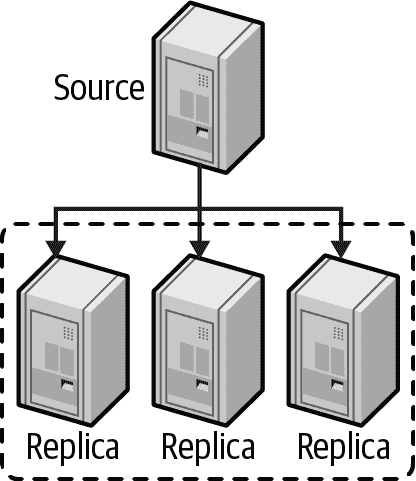

# 第九章：复制

MySQL 内置的复制是在 MySQL 之上构建大型、高性能应用程序的基础，使用所谓的“横向扩展”架构。复制允许您将一个或多个服务器配置为另一个服务器的副本，使它们的数据与源副本同步。这不仅对高性能应用程序有用——它也是许多高可用性、可扩展性、灾难恢复、备份、分析、数据仓库等任务策略的基石。

在本章中，我们的重点不在于每个功能是什么，而在于何时使用它。[官方 MySQL 文档](https://dev.mysql.com/doc)在解释诸如半同步复制、多源复制等功能方面非常详细，您在设置这些功能时应参考此文档。

# 复制概述

复制解决的基本问题是在同一拓扑结构内保持数据库实例之间的数据同步。它通过将修改数据或数据结构的事件写入源服务器上的日志来实现这一点。副本服务器可以从源上的日志中读取事件并重放它们。这创建了一个异步过程，其中副本的数据副本在任何给定时刻都不能保证是最新的。副本延迟——实时和副本所代表的内容之间的延迟——没有上限。大型查询可能导致副本落后源几秒、几分钟，甚至几小时。

MySQL 的复制大多是向后兼容的——也就是说，新版本的服务器通常可以成为旧版本服务器的副本而无需麻烦。但是，旧版本的服务器通常无法作为新版本的副本：它们可能不理解新版本服务器使用的新功能或 SQL 语法，复制使用的文件格式可能存在差异。例如，您无法从 MySQL 5.6 源复制到 MySQL 5.5 副本。在从一个主要或次要版本升级到另一个主要或次要版本（例如从 5.6 到 5.7 或从 5.7 到 8.0）之前，最好测试您的复制设置。在次要版本内的升级，例如从 5.7.34 到 5.7.35，预计是兼容的；阅读发布��明以了解从一个版本到另一个版本的确切变化。

复制相对于扩展读取而言效果较好，您可以将读取定向到副本，但除非设计正确，否则它不是扩展写入的好方法。将许多副本连接到源只会导致写入在每个副本上执行多次。整个系统受限于最弱部分可以执行的写入数量。

以下是复制的一些常见用途：

数据分发

MySQL 的复制通常不会占用太多带宽，尽管后面会看到，基于行的复制可能比传统的基于语句的复制使用更多带宽。您还可以随时停止和启动复制。因此，它对于在地理上较远的位置（如不同的数据中心或云区域）维护数据副本非常有用。远程副本甚至可以与间歇性（有意或无意地）的连接一起工作。但是，如果您希望副本具有非常低的复制延迟，您将需要一个稳定的、低延迟的链接。

扩展读取流量

MySQL 复制可以帮助您在多个服务器之间分发读取查询，这对于读取密集型应用程序非常有效。您可以通过简单的代码更改进行基本的负载平衡。在小规模上，您可以使用简单的方法，如硬编码主机名或轮询 DNS（将单个主机名指向多个 IP 地址）。您还可以采取更复杂的方法。标准的负载平衡解决方案，如网络负载平衡产品，可以很好地在 MySQL 服务器之间分发读取。

备份

复制是一种有助于备份的有价值的技术。然而，副本既不是备份，也不是备份的替代品。

分析和报告

为报告/分析（在线分析处理，或 OLAP）查询使用专用副本是一个很好的策略，可以将该负载与您的业务需要为外部客户请求提供的服务隔离开来。复制是实现这种隔离的一种方式。

高可用性和故障转移

复制可以帮助避免使 MySQL 成为应用程序的单点故障。涉及复制的良好故障转移系统可以显著减少停机时间。

测试 MySQL 升级

常见做法是使用升级后的 MySQL 版本设置一个副本，并在升级每个实例之前使用它来确保您的查询按预期工作。

## 复制的工作原理

在深入了解设置复制的细节之前，让我们快速看一下 MySQL 实际如何复制数据。在这个解释中，我们涵盖了最简单的复制拓扑结构，一个源和一个副本。

从高层次上看，复制是一个简单的三部分过程：

1.  源在其二进制日志中记录其数据的更改为“二进制日志事件”。

1.  副本将源的二进制日志事件复制到自己的本地中继日志。

1.  副本通过在中继日志中重放事件，将更改应用于自己的数据。

图 9-1 更详细地说明了复制的最基本形式。

这种复制架构将在副本上获取和重放事件的过程解耦，这使它们可以是异步的，即 I/O 线程可以独立于 SQL 线程工作。


###### 图 9-1\. MySQL 复制的工作原理

# 复制内部机制

现在我们已经为您复习了复制的基础知识，让我们深入了解它。让我们看看复制实际如何工作，看看它的优点和缺点，以及检查一些更高级的复制配置选项。

## 选择复制格式

MySQL 为复制提供了三种不同的二进制日志格式：基于语句的、基于行的和混合的。这些是通过`binlog_format`配置参数控制的，该参数控制数据如何写入二进制日志。

基于语句的复制通过记录更改源数据的查询来工作。当副本从中继日志中读取事件并执行它时，它重新执行源执行的实际 SQL 查询。这种格式的主要优点是简单和紧凑。更新大量数据的查询可以在二进制日志中只有几十个字节。基于语句的最大缺点通常是它在非确定性查询方面存在问题。考虑一个删除一千行表中的一百行的语句，没有`ORDER BY`子句。如果行在源和副本之间以不同的方式排序，您可能在每个副本上删除不同的一百行，导致不一致性。

基于行的复制将事件写入二进制日志，指示行如何更改。这听起来非常简单，但与基于语句的复制相比，这是一个很大的改变，因为它是确定性的。使用基于行的复制，您可以查看二进制日志，看到确切哪些行发生了变化以及值变成了什么。使用基于语句的复制，SQL 在执行时被解释，服务器在执行时找到的任何行都会发生变化。基于行的缺点是为每个受影响的行写入事件可能会显��增加二进制日志的大小。

混合方法试图结合两种方法的优点，使用基于语句的格式作为默认，并在需要时切换到基于行的格式。我们说“试图”是因为虽然它非常努力，但它有很多条件¹ 需要满足何时写入每种格式，这会导致二进制日志中发生不可预测的事件。我们认为二进制日志数据应该是其中一种，而不是混合使用两种格式。

我们建议除非您有使用基于语句的临时需求，否则坚持使用基于行的复制。基于行提供了最安全的数据复制方法。

## 全局事务标识符

直到 MySQL 5.6，副本必须跟踪连接到源时正在读取的二进制日志文件和日志位置。例如，一个副本连接到上游源并从 `binlog.000002` 的位置 `2749` 读取数据。当副本从该二进制日志中读取事件时，每次都会推进位置。然后，灾难发生了！源崩溃了，您不得不从备份中重建数据。问题是：如果二进制日志重新开始，您如何重新连接您的副本？这是一个相当复杂的过程，需要读取事件并确定何时连接。如果您��了错误并连接得太早，您可能会重复事件，如果太晚，您会跳过事件。无论哪种方式，都很容易错误地连接副本。

为了解决这个问题，MySQL 添加了一种替代方法来跟踪复制位置：全局事务标识符（GTID）。使用 GTID，源服务器提交的每个事务都被分配一个唯一标识符。这个标识符是 `server_uuid`² 和递增的事务编号的组合。当事务写入二进制日志时，GTID 也会随之写入。在本章前面的复习中，您会记得副本将二进制日志事件复制到本地中继日志，并使用 SQL 线程将更改应用到本地副本。当 SQL 线程提交一个事务时，它也记录了 GTID 已经完成。

为了更好地说明这一点，让我们举个例子。假设我们的源服务器刚刚设置好，里面没有任何数据，甚至没有创建数据库。在这个源服务器上，我们的 `server_uuid` 也生成为 `b9acac5a-7bbe-11eb-a043-42010af8001a`。我们已经在我们的副本上做了同样的事情，并使用适当的命令指示我们的副本使用源服务器进行复制。

在我们的源服务器上，我们需要创建一个新的数据库：

`CREATE DATABASE misc;`

此事件将被写入二进制日志，以便我们的副本也可以创建数据库。在二进制日志中，我们会看到一个由 GTID 标识的单个事件：

```sql
b9acac5a-7bbe-11eb-a043-42010af8001a:1
```

当副本服务器应用此事件时，它会记住已经完成了事务 `b9acac5a-7bbe-11eb-a043-42010af8001a:1`。

在我们编造的例子中，假设我们在副本上停止了 MySQL。它已经提交了一个事务。如果我们的源继续接收写入，我们的事务列表将继续增长：2、3、4、5 等等。当我们重新启动我们的副本时，³ 它知道它已经看到了事务 1，并且可以开始处理事务 2。

GTID 解决了运行 MySQL 复制时的一个更痛苦的部分：处理日志文件和位置。我们强烈建议您始终按照官方 MySQL 文档中的指南启用 GTID 用于您的数据库。

## 使复制具有崩溃安全性

尽管 GTID 解决了日志文件和位置问题，但还有许多其他问题困扰着 MySQL 的管理员。在本章后面，我们将讨论常见的故障模式；然而，在此之前，有一些配置设置可以极大地改善您使用复制的体验。

为了最大程度地减少复制中断的机会，我们建议设置以下内容：

`innodb_flush_log_at_trx_commit = 1`

虽然不严格属于复制设置，但这确保了每个事务的日志都被写入并同步到磁盘。这是完全符合 ACID 的设置，将最大程度地保护您的数据，即使有复制。这是因为二进制日志事件首先被提交，然后事务将被提交并刷新到磁盘。将此设置为`1`将增加磁盘写入操作，同时确保您的数据是持久的。

`sync_binlog = 1`

此变量控制 MySQL 将二进制日志数据同步到磁盘的频率。将此值设置为`1`意味着在每个事务之前。这可以防止在服务器崩溃时丢失事务。与前面的设置一样，这将增加磁盘写入。

`relay_log_info_repository = TABLE`

MySQL 复制过去依赖于磁盘上的文件来跟踪复制位置。这意味着由复制完成的事务必须作为第二步同步到磁盘。如果在事务提交和同步之间发生崩溃，磁盘上的文件将具有不正确的文件和位置。该信息已经移动到 MySQL 内部的 InnoDB 表中，允许复制在同一事务中更新事务和中继日志信息。这创建了一个原子操作，并有助于崩溃恢复。

`relay_log_recovery = ON`

简单来说，`relay_log_recovery`在检测到崩溃时丢弃所有本地中继日志，并从源获取丢失的数据。这确保了在崩溃中可能发生的任何损坏或不完整的中继日志在磁盘上是可恢复的。此设置还消除了使用`sync_relay_log`的需要，因为在崩溃事件中，中继日志将被删除。没有必要进行额外的操作将它们同步到磁盘。

## 延迟复制

在某些情况下，在您的拓扑中拥有一个延迟副本可能是有利的。这种策略可以用来保持数据在线和运行，但保持其在实时之后许多小时或几天。这是通过`CHANGE REPLICATION SOURCE TO`语句和`SOURCE_DELAY`选项进行配置的。

想象一下，您正在处理大量数据，发生了意外更改：一个表被删除了。您可能需要几个小时才能从备份中恢复。通过延迟副本，您可以找到`DROP TABLE`语句的 GTID，并将复制追赶到该表被删除之前的点。这通常可以导致更快的补救时间。

然而，没有什么是没有取舍的。虽然延迟复制在减轻某些数据丢失场景方面非常有用，但它也给许多其他运营方面带来了复杂性。如果您决定需要使用延迟复制，您还应考虑如何正确排除这个延迟副本不成为源节点候选人（如果您的写故障转移是自动化的，这更加重要），如何监视复制以及如何处理这个特殊副本。这些只是引入延迟副本时您应该解决的一些额外复杂性。

## 多线程复制

复制的一个历史性挑战是，虽然您可以在源上进行并行写入，但您的副本是单线程的。现代 MySQL 版本提供了多线程复制（参见图 9-2），您可以运行多个 SQL 应用程序线程来在本地应用中继日志的更改。


###### 图 9-2。多线程复制设置

多线程复制有两种模式：`DATABASE`和`LOGICAL_CLOCK`。`DATABASE`选项使用多个线程更新不同的数据库；没有两个线程会同时更新同一个数据库。如果您在 MySQL 中将数据分布在多个数据库中并且一致并发地更新它们，这种方法效果很好。另一个选项`LOGICAL_CLOCK`允许对同一个数据库进行并行更新，只要它们是同一个二进制日志组提交的一部分。

在大多数情况下，您可以简单地打开这个功能，并通过将`replica_parallel_workers`设置为非零值立即看到好处。如果您只操作一个数据库，还需要将`replica_parallel_type`更改为`LOGICAL_CLOCK`。由于多线程复制使用一个协调线程，该线程会有一些开销来管理所有其他线程的状态。此外，请确保您的副本以`replica_preserve_commit_order`运行，以防止乱序提交导致问题。查看官方文档中的[“Gaps”部分](https://oreil.ly/Tjb28)以获取为什么这一点很重要的详细解释。

有两种方法可以确定最佳的`replica_parallel_workers`值。不精确的方法是停止复制，然后测量使用不同数量的线程追赶的时间��直到找到最佳设置。这种方法存在缺陷，因为它假设一致数量的数据操作语言（DML）语句被发送到复制，并且它们的执行几乎相同。实际上，这几乎不可能。

更精确的方法是查看每个应用线程在您的工作负载中有多忙，以确定您获得了多少并行性。为此，我们需要启用性能模式的消费者和工具，允许其收集一些信息，然后查看结果。

首先，我们需要启用以下内容：⁴

```sql
UPDATE performance_schema.setup_consumers SET ENABLED = 'YES'
WHERE NAME LIKE 'events_transactions%';

UPDATE performance_schema.setup_instruments SET ENABLED = 'YES', TIMED = 'YES'
WHERE NAME = 'transaction';
```

允许复制处理一段时间内的事件。理想情况下，您应该在最繁忙的写入工作负载期间或任何看到复制延迟增加的时候查看这一点：

```sql
mysql> USE performance_schema;
events_transactions_summary_by_thread_by_event_name.thread_id AS THREAD_ID,
events_transactions_summary_by_thread_by_event_name.count_star AS COUNT_STAR
FROM events_transactions_summary_by_thread_by_event_name
WHERE
events_transactions_summary_by_thread_by_event_name.thread_id IN (SELECT
replication_applier_status_by_worker.thread_id
FROM replication_applier_status_by_worker);
+-----------+------------+
| THREAD_ID | COUNT_STAR |
+-----------+------------+
|   1692957 |      23413 |
|   1692958 |       7150 |
|   1692959 |       1568 |
|   1692960 |        291 |
|   1692961 |         46 |
|   1692962 |          9 |
+-----------+------------+
6 rows in set (0.00 sec)
```

这个查询将帮助您确定每个线程处理了多少个事务。从这个样本工作负载的结果中可以看出，我们的最佳使用情况在三到四个线程之间，超过这个数量的线程几乎没有被使用。

## 半同步复制

当您启用半同步复制时，源数据库提交的每个事务必须得到至少一个副本的确认已接收。⁵ 这个确认表示副本已接收并成功写入到自己的中继日志（但不一定应用到本地数据）。

由于每个事务必须等待其他节点的响应，这个特性会给服务器的每个事务增加额外的延迟。这意味着您需要考虑所涉及的权衡。

这里非常重要的一点是，如果在时间范围内没有副本确认事务，MySQL 将恢复到其标准的异步复制。它不会使事务失败。这真的有助于说明半同步复制不是用来防止数据丢失的工具，而是一个更大工具集的基础，使您能够拥有更具弹性的故障转移。

鉴于回退到异步复制，我们很难找到一个好的使用案例来解释为什么要启用这个功能。逻辑上的使用案例是确认，在网络分区的情况下，孤立的源数据库是否仍在写入数据而与其副本分隔。不幸的是，该源数据库将会回退到异步并继续接受写入。因此，我们建议不依赖于这一点来保证任何数据完整性。

## 复制过滤器

复制过滤选项让你只复制服务器数据的一部分，这并不像你想象的那么好。有两种复制过滤器：一种是从源二进制日志中过滤事件，另一种是从副本中继日志中过滤事件。图 9-3 展示了这两种类型。

控制二进制日志过滤的选项是 `binlog_do_db` 和 `binlog_ignore_db`。除非你认为你会喜欢向老板解释为什么数据永久丢失且无法恢复，否则不应启用这些选项。

在副本上，`replicate_*` 选项在复制 SQL 线程从中继日志读取事件时过滤事件。你可以复制或忽略一个或多个数据库，将一个数据库重写为另一个数据库，并根据 `LIKE` 模式匹配语法复制或忽略表。


###### 图 9-3\. 复制过滤选项

关于这些选项最重要的理解是，`*_do_db` 和 `*_ignore_db` 选项，在源和副本上，不像你期望的那样工作。你可能认为它们是根据对象的数据库名称进行过滤，但实际上它们是根据当前默认数据库进行过滤——也就是说，如果你在源上执行以下语句：

```sql
USE test;
DELETE FROM sakila.film;
```

`*_do_db` 和 `*_ignore_db` 参数将在 `test` 上过滤 `DELETE` 语句，而不是在 `sakila` 上。这通常不是你想要的，它可能导致错误的语句被复制或忽略。`*_do_db` 和 `*_ignore_db` 参数有用处，但它们是有限的和罕见的，你应该非常小心使用它们��如果你使用这些参数，复制很容易出现不同步或失败。

`binlog_do_db` 和 `binlog_ignore_db` 选项不仅有可能破坏复制；它们还会使从备份进行时点恢复变得不可能。在大多数情况下，你应该永远不要使用它们。

一般来说，复制过滤器是一个等待发生问题的问题。例如，假设你想阻止权限更改传播到副本，这是一个相当常见的目标。（希望这种愿望可能会让你意识到你正在做错事；可能有其他方法来实现你真正的目标。）系统表上的复制过滤器肯定会阻止 `GRANT` 语句的复制，但它们也会阻止事件和例程的复制。这种意想不到的后果是需要小心处理过滤器的原因。也许更好的主意是阻止特定语句被复制，通常使用 `SET SQL_LOG_BIN=0`，尽管这种做法也有其自身的危险。总的来说，你应该非常谨慎地使用复制过滤器，只有在真正需要它们的情况下才使用，因为它们很容易破坏复制并在最不方便的时候出现问题，比如在灾难恢复期间。

话虽如此，也可能存在特定情况下复制过滤器是有益的。也许你创建了多个数据库 `users_1`、`users_2`、`users_3` 和 `users_4`，现在服务器的性能受到了太大的影响。通过恢复备份并附加复制，你可以准备将 `users_3` 和 `users_4` 的查询移动到另一台服务器。这个过程完全正常，只是你在新数据库上仍然有 `users_1` 和 `users_2`。在某个时候，你将不得不删除可能影响性能的数据。考虑这种替代方案。你恢复备份然后删除 `users_1` 和 `users_2`。然后配置一个复制规则来忽略 `users_1` 和 `users_2` 并完成复制设置。现在你的新服务器上只处理 `users_3` 和 `users_4` 的事件。一旦复制追上，你就可以开始接收生产流量了。

MySQL 手册中已经对过滤选项进行了详细说明，所以我们不会在这里重复细节。

# 复制故障转移

在本章的开头，我们提到复制是高可用性的基石，还有其他方面。在另一个位置持续更新的数据副本，比起备份更容易从灾难中恢复。更重要的是，有时你只需进行一些需要重新启动 MySQL 的维护工作。

在这一部分，我们想谈谈正确的方式将副本晋升为源节点。很容易出错，出错可能导致数据问题和延长的停机时间。我们想澄清“晋升副本”和“故障切换”是同义词。它们都意味着将源降级为不再接受写入，并将副本晋升为源的行为。

如何处理这个问题的更详细解释在官方的 MySQL 文档中，位于“故障切换期间切换源”部分，但考虑到这个问题的重要性，我们至少想在某个层面上提及它。

## 计划晋升

晋升的最常见原因是某种维护事件，包括安全补丁、内核更新，甚至只是重新启动 MySQL，因为有一些配置选项需要重新启动。这种类型的晋升被称为*受控*或*计划晋升*。

要成功执行此晋升，你需要完成以下步骤：

1.  确定要晋升的副本。通常情况下，这是你确信拥有所有数据的副本。这就是你的目标。

1.  检查延迟，确保你的时间在几秒钟之内。

1.  通过设置`super_read_only`停止在源上进行写入。⁶

1.  等待复制与目标同步。比较 GTIDs 以确保一致。

1.  在目标上取消`read_only`。

1.  将应用程序流量切换到目标。

1.  将所有副本重新指向新源，包括降级的副本。这在 GTIDs 和`AUTO_POSITION=1`中是微不足道的。

## 非计划晋升

在足够长的时间轴上，每个系统都会失败，无论是软件还是硬件的结果。当这种情况发生在正在写入的源服务器上时，会对用户体验产生很大影响。大多数应用程序将简单地返回一个错误，让用户自行重试。这是需要*非计划晋升*的情况。

由于你没有一个实时源来检查，这是一个简化的计划晋升，你根据已经复制的数据选择要晋升的副本：

1.  确定要晋升的副本。通常情况下，这是你确信拥有所有数据的副本。这就是你的目标。

1.  在目标上取消`read_only`。

1.  将应用程序流量切换到目标。

1.  将所有副本重新指向新源，包括降级的副本当它恢复服务时。这在 GTIDs 中是微不足道的。

你还应该确保当你以前的源重新上线时，默认启用`super_read_only`。这将有助于防止任何意外写入。

## 晋升的权衡

我们不得不指出，有时候你对停机的第一反应是故障切换。因为很难知道目标可能缺少多少数据，有时候*不*故障切换可能是一个更好的策略。

非计划晋升并不是一个经常发生的事件，也就是说，你不经常这样做。当你被要求这样做时，你可能需要查阅文档，以确保不会漏掉任何步骤。你还需要检查其他副本，以验证哪一个是可能的候选。所有这些都需要时间。在某些情况下，等待服务器或 MySQL 进程重新上线可能更快。这样做的好处是，如果你在第五章中遵循了 ACID 合规性的步骤，你不会丢失任何数据，你的副本将从中断的地方继续。

# 复制拓扑

您可以为几乎任何源和副本配置设置 MySQL 复制。许多复杂的拓扑结构是可能的，但即使简单的拓扑结构也可以非常灵活。单个拓扑结构可以有许多不同的用途。您可以使用复制的各种方式很容易地填满一本书。

所有这些灵活性意味着您可以轻松设计一个难以维护的拓扑结构。我们强烈建议您尽可能简化您的复制拓扑结构，同时仍满足您的需求。话虽如此，我们推荐两种几乎可以涵盖所有用例的策略。您可能有理由偏离这些策略，但请确保在变得更复杂时问问自己是否仍在解决正确的问题。

## 主/被动

在主/被动拓扑中，您将所有读写指向单个源服务器。此外，您保留一小部分不主动提供任何应用程序流量的被动副本。选择此模型的主要原因是您不想担心复制延迟。由于所有读取都发送到源，您可以防止应用程序可能无法容忍的写后读问题。

图 9-4 显示了具有多个副本的这种安排。


###### 图 9-4。具有多个副本的源

### 配置

在这种拓扑结构中，我们期望源和副本在 CPU、内存等方面具有相同的配置。在足够长的时间内，您将需要从当前运行的源故障切换到其中一个副本，无论是为了维护、软件升级或打补丁，甚至是硬件故障。通过在副本上具有相同的硬件和软件配置，您确保可以像之前进行故障切换前一样维持流量容量和吞吐量。

### 冗余

在物理硬件环境中，至少需要三台总服务器的*n*+2 冗余。在硬件故障的情况下，您仍然有一台额外的服务器用于故障切换。如果您不放心或无法在源上进行备份，您还可以使用其中一个副本作为备用服务器。

在云环境中，如果你的数据足够小或者可以轻松复制数据，你可以通过*n*+1 的冗余来实现两台总服务器。否则，需要*n*+2。如果选择*n*+1 的方式，云服务提供商的动态配置特性可以使管理变得更容易。对于像打补丁这样的维护事件，更容易在需求时提供第三个副本，执行任何必要的操作（如升级内核或应用安全更新），然后替换其他副本。然后进行故障切换并在原始源上重复该过程。目标是始终保持一个准备好成为故障切换目标的副本。

在任一情况下，您可以将其中一个副本放置在地理位置较远的位置，尽管您需要注意复制延迟并确保其可用。副本应该是可恢复的，并且在您建立的指导方针内遭受任何数据丢失。我们在“定义恢复要求”中讨论了这一点，在第十章中。

### 注意事项

通过选择这种模型，您明确将您的读扩展绑定到单个服务器的容量。如果达到读扩展限制，您将不得不进化到活动/读池配置，或者利用分片来减少源上的读取。

## 主/读池

在主/读池配置中，您将所有写入指向源。读取可以发送到源服务器或读池，具体取决于应用程序需求。读池允许您为读密集型应用程序水平扩展读取。在某个时刻，由于源上的复制需求，水平扩展将会减少。

图 9-5 显示了这种安排，其中有一个单一源和一个副本池。



###### 图 9-5\. 带有读取池的源

### 配置

理想情况下，您希望源和至少一个副本之间的配置相同，最好是两个副本。再次强调，您最终将需要切换到这些副本之一，并且它应具有足够的容量来跟上您的流量。

如果您看到这个池随着时间增长，您可以优化成本，并为一些成员使用不同的配置。如果是这种情况，请尝试将流量加权作为一种平衡流量的方法。如果您有 32 个核心用于故障转移目标和 8 个核心用于其他副本，尝试将流量发送到 32 核心节点的流量增加四倍，以确保您获得利用率。

### 冗余

在这个池中，您拥有的服务器数量应满足先前给定的要求，至少有一台服务器可以充当故障转移目标。此外，您需要足够的节点来容纳您的读取流量，再加上一小部分用于节点故障的缓冲区。在读取方面，您最有可能的利用率指标将是 CPU，因此，在池中的每个节点上的利用率应在 50%–60% 之间。随着 CPU 的增加，它在工作和延迟之间的上下文切换时间增加。尝试找到满足应用程序期望的延迟和利用率之间的正确平衡点。

### 注意事项

当您使用读取池时，您的应用程序必须对旧的读取具有一定的容忍度。您永远无法保证您在源上完成的写入已经被复制到副本。您可能还需要一种方法来使落后于复制的节点退出池。

读取池的大小也会影响您需要做多少管理工作以及何时应该考虑自动化。一个 16 节点的池意味着您必须进行 16 次内核更新或安全补丁。自动化此任务以优雅地使节点退出池，执行补丁，重新启动，然后重新加入池，将减少您将来手动完成的工作量。

## 不推荐的拓扑结构

通过使用本章中提供的两个建议中的任何一个，您可以保持拓扑结构简单且易于理解。本书早期版本中还有许多其他建议，或者您可能从其他公司的拓扑结构设置中听说过。我们在这里指出一些不推荐的原因是因为它们带来的风险和复杂性超出了我们愿意看到的范围。

### Active-active 模式下的双源

*双源复制*（也称为*双向复制*）涉及两台服务器，每台服务器都配置为对方的源和副本，换句话说，是一对共同源。图 9-6 展示了这种设置。


###### 图 9-6\. Active-active 模式下的双源

乍一看，这与具有两台服务器的主备模式没有任何不同，只是复制已经以相反方向配置。真正的危险在于当您明确将写入流量发送到两侧时，因此是活动/活动部分。

Active/active 模式非常难以正确实现。一些策略涉及根据奇偶哈希选择发送到哪一侧。这确保了写入后的读取对于相同行是一致的，但包含在另一侧上的规范行的查询可能不一致。更直白地说，从一侧读取 ID 1、3 和 5 的行将始终保持一致。那么对于读取 ID 1–6 的查询怎么办？您将该查询发送到哪里？如果另一侧存在更新，但由于复制延迟在这一侧没有反映出来，会怎样？

您还需要仔细平衡容量。在共源场景中，每台服务器都是另一台服务器的副本，也是最有可能的故障切换目标。您必须以确保在将流量从一侧转移到另一侧时不会耗尽 CPU 的方式规划容量。您还在进行故障切换，并引入一个完全不同的工作数据集。InnoDB 缓冲池现在会翻转，删除条目以为新的热数据集腾出空间。

请听从我们的建议，远离这种设置。也许让一个被动服务器处理流量而不是闲置会让您感觉像在“使用”它。您最终会在应用程序中引入数据不一致，并且总是担心没有足够的容量进行故障切换。一旦失去故障切换策略，您就失去了弹性。

### 双源主动-被动模式

在避免我们刚刚讨论的问题的双源主动-主动模式中有一种变体。主要区别在于其中一台服务器是只读的“被动”服务器，如图 9-7 所示。


###### 图 9-7\. 双源主动-被动模式

表面上这种设置并没有什么问题。它与我们对主/备份的建议唯一的不同之处在于，复制已经预先配置回到另一个服务器。这只适用于两台服务器的配置。如果运行的服务器超过两台，您需要决定哪个节点是最适合故障切换的目标。预先配置复制只会直接将您与一个节点绑定在一起，在故障情况下不会给您灵活性。

我们坚持认为设置复制是作为我们之前讨论的复制-故障切换过程的一个简单、可自动化的步骤。这是一个不必要的配置，只会引起混乱。

### 具有副本的双源

更进一步混合，我们可以为每个共源添加一个或多个副本，如图 9-8 所示。


###### 图 9-8\. 具有副本的双源拓扑

这保留了双源主动-主动中的大部分问题，最重要的是如何路由流量。它解决了关于容量规划和故障切换中缓冲池翻转的问题。在故障切换中，您需要额外的步骤将其中一个源指向其上新晋升的副本。

我们绝对反对这种拓扑，主要是出于数据访问方面的考虑。共源只会带来麻烦。

### 环形复制

*环形复制*有三个或更多源，其中每个服务器都是环中前一个服务器的副本，也是后一个服务器的源，如图 9-9 所示。这种拓扑结构也被称为*循环复制*。


###### 图 9-9\. 复制环拓扑

如果此拓扑中的任何服务器下线，您的拓扑将中断，更新将停止在环中传播。这种情况下还有附加的副本变体，其中图 9-9 中的每个源都有一个专用的副本可用于替换。这仍然意味着环被中断，直到您将一个副本提升到原来的位置。

这种拓扑结构与简单相反，没有任何优势。

### 多源复制

尽管保持复制拓扑简单很重要，但可能会出现需要使用更高级功能来处理一次性功能的情况。假设您建立了一个全新的视频上传和观看网站，现在变得很受欢迎。您早期的设计决策之一是将视频数据和用户数据分开存储在两个不同的数据库集群中。随着您的发展，您发现自己希望在查询中将它们合并在一起。您可以通过多源复制实现这一点，将两个数据集合再次合并到一个副本中，如图 9-10 所示。


###### 图 9-10\. 多源复制

这个功能是建立在一个称为*复制通道*的概念之上。在前面的示例中，您需要为 MySQL 创建第三个集群。这个新的第三个集群将创建两个复制通道：一个用于视频数据，一个用于用户数据。一旦加载和复制数据，您可以进行非常短暂的停机，在这段时间内，您冻结对两个源的写入，并推送您的代码以切换读写到新的合并数据库。哇，您现在已经将两个数据库合并为一个。

在我们继续之前，有一个重要的限制需要知道：您不能配置一个副本多次使用多源复制来自同一源。

这种拓扑结构非常适用于特殊情况。我们只在您围绕这个概念构建永久拓扑结构的情况下不鼓励使用。暂时使用它来合并数据仍然是一个可以接受的用例，最终目标是回到我们的两个建议之一。

# 复制管理和维护

对于少量数据和一致的写入工作负载，您不太可能经常需要查看复制延迟，更糟糕的是，复制中断。大多数数据库随着时间的推移而增长，随着增长将会进行维护。

## 监控复制

复制增加了 MySQL 监控的复杂性。尽管复制实际上发生在源和副本上，但大部分工作是在副本上完成的，这也是最常见的问题发生的地方。所有副本都在工作吗？是否有任何副本出现错误？最慢的副本落后多少？MySQL 提供了大部分您需要回答这些问题的信息，但自动化监控过程和使复制稳健留给您自己。

在设置复制监控时，有几个我们认为最重要的观察项目：

复制需要源和副本上的磁盘空间

如前文所述，在图 9-1 中可见，复制使用源上的二进制日志和副本上的中继日志。如果源上没有空闲磁盘空间，事务将无法完成并开始超时。如果在副本上发生相同的情况，MySQL 会更加优雅地暂停复制并等待空闲磁盘空间。您需要监视可用磁盘空间，以确保持续运行。

应该监视复制的状态和错误

尽管复制是一个长期存在的功能且非常稳健，但像网络问题、数据不一致和数据损坏等外部因素可能导致其中断。因此，最好监视复制线程是否正在运行，如果没有，查看最新的错误以确定下一步应该采取什么措施。我们在“复制问题和解决方案”中更详细地介绍了如何解决特定问题。

延迟复制应该按预期延迟

既然我们之前提到了延迟复制，建议设置监控以确保延迟副本确实延迟了正确的时间。太长的延迟可能会使使用变得更加耗时。如果延迟太少，甚至更糟糕的是根本没有延迟，那��如果您需要，延迟副本可能对您毫无用处。

## 测量复制延迟

你需要监控的最常见事项之一是副本落后源的距离。尽管`SHOW REPLICA STATUS`中的`Seconds_behind_source`列理论上显示了副本的延迟，但实际上由于各种原因，它并不总是准确的：

+   副本通过比较服务器当前时间戳和二进制日志事件中记录的时间戳来计算`Seconds_behind_source`，因此，除非处理查询，否则副本无法报告其延迟。

+   如果复制线程未运行，副本通常会报告`NULL`。

+   一些错误（例如，源端和副本之间`max_allowed_packet`设置不匹配或网络不稳定）可能会中断复制和/或停止复制线程，但`Seconds_behind_source`将报告`0`而不是指示错误。

+   即使复制进程正在运行，副本有时也无法计算滞后。如果发生这种情况，副本可能报告`0`或`NULL`。

+   非常长的事务可能导致报告的滞后波动。例如，如果您有一个更新数据的事务，保持打开一个小时，然后提交，更新将在实际发生后一个小时进入二进制日志。当副本处理该语句时，它将暂时报告自己比源端滞后一个小时，然后会跳回到零秒滞后。

解决这些问题的方法是忽略`Seconds_behind_source`，并使用您可以直接观察和测量的内容监视副本滞后。最佳解决方案是心跳记录，这是一个时间戳，您可以在源端每秒更新一次。要计算滞后，您只需从副本上的当前时间戳减去心跳。这种方法不受我们刚提到的所有问题的影响，并且还有一个额外的好处，即创建一个方便的时间戳，显示副本数据的当前时间点。Percona Toolkit 中包含的`pt-heartbeat`脚本是复制心跳的最受欢迎的实现。

心跳还有其他好处。二进制日志中的复制心跳记录对许多目的都很有用，比如在其他情况下难以解决的灾难恢复场景。

我们刚提到的任何滞后指标都无法让您了解副本实际追赶源端需要多长时间。这取决于许多因素，例如副本的性能如何以及源端继续处理多少写入查询。有关更多信息，请参阅“复制问题和解决方案”部分中的“过多的复制滞后”子节。

## 确定副本是否与源端一致

在理想情况下，副本始终应该是源的精确副本，减去任何复制延迟。但在现实世界中，副本可能会引入不一致性。一些可能的原因包括：

+   对副本的意外写入

+   使用双源复制，两侧都进行写入

+   非确定性查询和基于语句的复制

+   MySQL 在以低耐久性模式运行时崩溃（请参阅第五章中的耐久性配置）

+   MySQL 中的错误

我们建议遵循以下规则：

始终使用启用`super_read_only`的副本

使用`read_only`可以防止没有`SUPER`特权的用户进行写入，但这不会阻止您的 DBA 在不知情的情况下在副本上运行`DELETE`或`ALTER`。`super_read_only`设置仅允许复制写入，是运行副本的最安全方式。

使用基于行的复制或确定性语句

尽管在某些情况下会使用更多的磁盘空间，基于行的复制是复制数据最一致的方式。这是因为它包含了每个条目的确切行数据更改。

在基于语句的复制中考虑以下内容：

```sql
DELETE FROM users WHERE last_login_date <= NOW() LIMIT 10;
```

当表中有一千个与`WHERE`子句匹配的用户时会发生什么？MySQL 将使用表中的自然顺序仅删除前 10 行。表的自然顺序在副本上可能不同，因此可能会影响不同的 10 行。未来运行的基于`last_login_date`修改或删除行的语句可能存在或不存在。这可能导致数据不一致。

编写此内容的最佳方法是使用`ORDER BY`使行顺序确定：

```sql
DELETE FROM users WHERE last_login_date <= NOW() ORDER BY user_id 
LIMIT 10;
```

使用此语句，只要源端和副本之间的数据一致，将删除相同的 10 行。

不要尝试同时向复制拓扑中的多个服务器写入

这包括在两侧都有写入的共源或环形复制。最实用的��制拓扑是使用一个源，接收所有写入，并且一个或多个副本，可选地接收读取。

最后，我们强烈建议，如果你遇到任何复制错误，你使用[策略](https://oreil.ly/DlYzR)在官方 MySQL 文档中重建副本。

# 复制问题和解决方案

MySQL 复制的简单实现使其易于设置，但也意味着有许多方法可以停止、混淆和破坏它。在本章的前面，我们讨论了崩溃安全的复制和规则，以帮助保持源和副本同步。本节讨论常见问题，它们如何表现，以及你如何解决或甚至预防它们。

## 源上的二进制日志损坏

如果源上的二进制日志损坏，你别无选择，只能重建你的副本。跳过损坏的条目将跳过一些事务，这些事务将不再被你的副本处理。

## 非唯一的服务器 ID

这是你可能在复制中遇到的更难以捉摸的问题之一。如果你意外地配置了两个具有相同服务器 ID 的副本，它们可能看起来工作正常，如果你没有仔细观察的话。但如果你观察它们的错误日志或用*innotop*这样的工具观察源，你会注意到一些非常奇怪的事情。

在源上，你只会看到两个副本中的一个连接。 （通常，所有副本都是连接并一直复制的。）在副本上，你会在错误日志中看到频繁的断开和重新连接错误消息，但没有提到配置错误的服务器 ID。

根据 MySQL 版本的不同，副本可能会正确但缓慢地复制，或者它们实际上可能不会正确地复制——任何给定的副本可能会错过二进制日志事件，甚至重复它们，导致重复键错误（或静默数据损坏）。你还可能因为副本之间的增加负载而在源上引起问题。如果副本之间的争斗足够激烈，错误日志可能在很短的时间内变得庞大。

这个问题的唯一解决方案是在设置副本时要小心。你可能会发现创建一个副本到服务器 ID 映射的规范列表很有帮助，这样你就不会忘记每个副本属于哪个 ID。如果你的副本完全位于一个网络子网中，你可以通过使用每台机器 IP 地址的最后一个八位来选择唯一的 ID。

## 未定义的服务器 ID

如果你不定义服务器 ID，MySQL 会似乎使用`CHANGE REPLICATION SOURCE TO`设置复制，但不会让你启动副本：

```sql
mysql> START REPLICA;
ERROR 1200 (HY000): The server is not configured as replica; fix in config file 
or with CHANGE REPLICATION SOURCE TO
```

这个错误尤其令人困惑，如果你刚刚使用了`CHANGE REPLICATION SOURCE TO`并用`SHOW REPLICA STATUS`验证了你的设置。你可能会从`SELECT @@server_id`得到一个值，但那只是一个默认值。你必须显式设置该值。

## 临时表丢失

临时表对某些用途很方便，但不幸的是，它们与基于语句的复制不兼容。如果一个副本崩溃或者你关闭它，副本线程正在使用的任何临时表都会消失。当你重新启动副本时，任何进一步引用缺失临时表的语句将失败。

这里最好的方法是使用基于行的复制。第二好的方法是一致命名你的临时表（例如以`temporary_`为前缀）并使用复制规则完全跳过复制它们。

## 不复制所有更新

如果你错误使用`SET SQL_LOG_BIN=0`或不理解复制过滤规则，你的副本可能不会执行一些在源上发生的更新。有时你可能希望这样做以进行归档，但通常是意外的，后果很糟糕。

例如，假设您有一个`replicate_do_db`规则，只将`sakila`数据库复制到您的一个副本。如果您在源头上执行以下命令，则副本的数据将与源头上的数据不同：

```sql
mysql> USE test;
mysql> UPDATE sakila.actor ...
```

其他类型的语句甚至可能因为非复制依赖关系而导致复制失败。

## 过多的复制延迟

复制延迟是一个常见问题。无论如何，设计您的应用程序以容忍副本上的一些延迟都是一个好主意。以下是一些减少复制延迟的常见方法：

多线程复制

确保您正在使用多线程复制，并根据手册调整各种选项以获得最高效率。

使用分片

尽管这似乎是一个逃避的答案，但使用分片技术将写操作分散到多个源头是一种非常有效的策略。MySQL 的长期经验法则是：使用副本扩展读操作，使用分片扩展写操作。

暂时降低耐久性

纯粹主义者会不同意，但也许有时候当您已经尝试了所有调整和优化，而分片由于工作量或设计问题而不可行时。如果您的复制延迟主要是由于写操作限制造成的，您可以暂时将`sync_binlog=0`和`innodb_flush_log_at_trx_commit=0`设置为提高复制速度。

如果您选择这种最后的方式，您应该非常非常小心。您应该只在您的副本上这样做，如果您的副本也是您进行备份的地方，更改这些设置可能会使您无法从备份中恢复。此外，如果您的副本在此降低耐久性期间崩溃，您可能需要从源头重建。最后，如果您手动执行此操作，很容易忘记将耐久性设置回来。确保您有良好的监控或已编写某种方式来重新设置耐久性。

一个可能的策略是观察`SHOW REPLICA STATUS`命令中的`Seconds_behind_source`值，当它超过某个值时，触发以下操作：

1.  确保服务器是一个不可写的副本，可能通过验证`super_read_only`是否已启用来实现。

1.  更改`sync_binlog`和`innodb_flush_log_at_trx_commit`的设置以减少写操作。

1.  定期检查`SHOW REPLICA STATUS`以获取`Seconds_​behind_​source`的值。

1.  当低于可接受的阈值时，将设置恢复为其耐久性特性。

## 源头传来的超大数据包

复制中另一个难以追踪的问题可能发生在源头的`max_allowed_packet`大小与副本的不匹配时。在这种情况下，源头可能记录一个副本认为过大的数据包，当副本检索到该二进制日志事件时，可能会遇到各种问题。这些问题包括错误和重试的无限循环，或者在中继日志中出现损坏。

## 没有磁盘空间

复制确实可能会用二进制日志、中继日志或临时文件填满您的磁盘，尤其是如果您在源头上执行了大量的`LOAD DATA INFILE`查询，并且在副本上启用了`log_replica_updates`。副本落后越多，它可能使用的磁盘空间就越多，用于从源头检索但尚未执行的中继日志。您可以通过监控磁盘使用情况并设置`relay_log_space`配置变量来防止这些错误。

## 复制限制

MySQL 复制可能会因其固有限制而失败或失去同步，有时即使没有错误。相当多的 SQL 函数和编程实践简单地无法可靠地复制（我们在本章中提到了许多）。要确保这些内容中没有一个进入您的生产代码，尤其是如果您的应用程序或团队规模较大。

另一个问题是服务器中的错误。我们不想听起来消极，但许多 MySQL 服务器的主要版本在历史上在复制方面存在错误，特别是在主要版本的首次发布中。新功能，比如存储过程，通常会引起更多问题。

对于大多数用户来说，这并不是避免新功能的理由。这只是一个需要仔细测试的理由，特别是当您升级应用程序或 MySQL 时。监控也很重要；您需要知道什么时候出现问题。

MySQL 复制很复杂，您的应用程序越复杂，您就需要越小心。然而，如果您学会如何使用它，它的效果相当不错。

# 总结

MySQL 复制是 MySQL 内置功能的瑞士军刀，它极大地增加了 MySQL 的功能和实用性范围。事实上，这可能是 MySQL 迅速变得如此受欢迎的关键原因之一。

尽管复制有许多限制和注意事项，但事实证明，其中大多数对大多数用户来说相对不重要或容易避免。许多缺点只是高级功能的特殊行为，大多数人不会使用，但对需要它们的少数用户非常有帮助。

在复制方面，你的座右铭应该是保持简单。除非你真的需要，不要做任何花哨的事情，比如使用复制环或复制过滤器。简单地使用复制来镜像整个数据副本，包括所有权限。保持副本与源相同的方式将帮助你避免许多问题。

¹ 如预期的那样，我们建议您查阅手册，以确保您了解`MIXED`模式如何与不同类型的 SQL 语句一起工作。

² 请注意，`server_uuid`与同名的`server_id`是不同的。`server_id`参数是您为服务器指定的用户定义值，而`server_uuid`是在 MySQL 首次启动时生成的，如果它没有检测到文件*auto.cnf*。

³ 这假设您在发出`CHANGE REPLICATION SOURCE TO`命令时使用了`SOURCE_AUTO_POSITION = 1`选项，这通常是您应该始终这样做的。

⁴ 性能模式的消费者和仪器使 MySQL 收集有关其内部的额外数据，这可能会使用额外的 CPU。作为提醒，您应该始终在安全环��中测试这些更改如何影响生产工作负载。

⁵ 所需的副本数量是可配置选项`(rpl_semi_sync_source_wait_for_replica_count)`。在更广泛的拓扑结构中，您可能考虑要求在完成原始事务之前需要两甚至三个确认。

⁶ 设置`super_read_only`会隐式启用`read_only`。相反，禁用`read_only`会隐式禁用`super_read_only`。在此过程中，没有理由同时启用或禁用这两个变量。

⁷ 这通常适用于您可能使用 LVM 快照或基于云的磁盘快照方法进行备份的情况。
