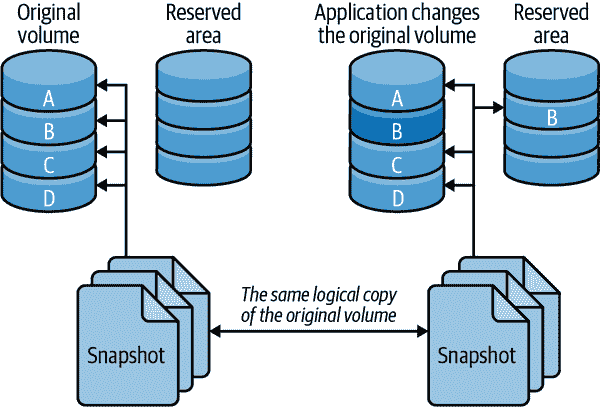

# 第十章：备份和恢复

如果您不事先计划备份，您可能会发现自己排除了一些最佳选项。例如，您可能设置了一个服务器，然后希望使用 LVM 以便可以进行文件系统快照—但为时已晚。您可能也没有注意到配置系统进行备份会产生一些重要的性能影响。如果您不计划并练习恢复，那么当您需要执行时，情况就不会顺利。

我们不会在本章中涵盖备份和恢复解决方案的所有部分—只涵盖与 MySQL 相关的部分。以下是我们决定不在此处包括但您绝对应该在整体备份和恢复策略中包括的一些要点：

+   安全性（备份访问权限、恢复数据权限以及文件是否需要加密）

+   备份存储位置，包括与源站点的距离（在不同磁盘、不同服务器或异地）以及如何将数据从源站点移动到目的地

+   保留政策、审计、法律要求和相关主题

+   存储解决方案和媒体、压缩和增量备份

+   存储格式

+   监控和报告您的备份

+   内置到存储层或特定设备中的备份功能，例如预制文件服务器

在我们开始之前，让我们澄清一些关键术语。首先，您经常会听到所谓的*热备份*、*温备份*和*冷备份*。人们通常使用这些术语来表示备份的影响：“热”备份不应该需要任何服务器停机，例如。问题在于这些术语对每个人来说意义不同。有些工具甚至在其名称中使用*热*这个词，但绝对不执行我们认为的热备份。我们尽量避免使用这些术语，而是告诉您特定技术或工具对服务器的中断程度。

另外两个令人困惑的词是*恢复*和*恢复*。在本章中，我们以特定方式使用它们。*恢复*意味着从备份中检索数据，并将其加载到 MySQL 中，或将文件放在 MySQL 期望它们在的位置。*恢复*通常意味着在出现问题后拯救系统或系统的一部分的整个过程。这包括从备份中恢复数据以及使服务器完全功能的所有必要步骤，例如重新启动 MySQL、更改配置、启动服务器的缓存等。

对许多人来说，恢复只意味着在崩溃后修复损坏的表格。这与恢复整个服务器不同。存储引擎的崩溃恢复会协调其数据和日志文件。它确保数据文件仅包含已提交事务所做的修改，并且重新播放尚未应用于数据文件的日志文件中的事务。这可能是整体恢复过程的一部分，甚至是备份的一部分。但是，这与您可能需要在意外`DROP TABLE`之后进行的恢复不同，例如。根据您要从中恢复的问题，您采取的恢复措施可能大不相同。

最后，备份主要有两种类型：原始和逻辑。*原始备份*—有时称为*物理*¹ *备份*—指的是来自文件系统的文件副本。*逻辑备份*指的是重建数据所需的 SQL 语句。

# 为什么备份？

以下是备份重要性的几个原因：

灾难恢复

灾难恢复是在硬件故障、恶意软件损坏数据或服务器及其数据由于其他原因变得不可用或无法使用时所做的事情。您需要准备好应对一切，从有人意外连接到错误服务器执行`ALTER TABLE`，到建筑物着火，到恶意攻击者或 MySQL 错误。尽管任何特定灾难发生的几率相当低，但加在一起就会增加。

人们改变主意

你会惊讶地发现，人们经常会有意删除数据，然后希望将其找回。

审计

有时候你需要知道你的数据或模式在过去的某个时间点是什么样子。例如，你可能卷入了诉讼，或者你可能发现了应用程序中的错误，需要查看代码以前是如何运行的（有时仅仅将代码放在版本控制中是不够的）。

测试

在真实数据上进行测试的最简单方法之一是定期使用最新的生产数据刷新测试服务器。如果你正在进行备份，这很容易：只需将备份恢复到测试服务器即可。

检查你的假设。例如，你是否假设你的共享托管提供商正在备份与你的帐户提供的 MySQL 服务器？你可能会感到惊讶。许多托管提供商根本不备份 MySQL 服务器，而其他人只是在服务器运行时进行文件复制，这可能会创建一个损坏的无用备份。

# 定义恢复要求

如果一切顺利，你永远不需要考虑恢复。但是当你需要时，即使是世界上最好的备份系统也无济于事，如果你从未测试过恢复。你需要一个出色的恢复系统。

不幸的是，使您的备份系统正常运行比构建良好的恢复流程和工具更容易。原因如下：

+   备份首先要做好。如果没有首先备份，你就无法恢复，因此在构建系统时，你的注意力自然会集中在备份上。

+   备份是通过脚本和作业自动化的。很容易花时间对备份过程进行微调，通常是不经思考的。对备份过程进行五分钟的微调可能看起来不重要，但是你是否每天都对恢复过程进行同样的关注呢？

+   备份是例行公事，但恢复通常是一种危机情况。

+   安全性成为障碍。如果你正在进行异地备份，你可能正在对备份数据进行加密或采取其他措施来保护数据。你知道如果你的数据被泄露会有多么糟糕，但是当没有人能解锁你的加密卷以恢复数据，或者当你需要从一个庞大的加密文件中提取单个文件时，情况会有多糟糕呢？

+   一个人可以规划、设计和实施备份。当灾难发生时，这个人可能不可用。你需要培训几个人并计划覆盖，这样你就不会要求一个不合格的人来恢复你的数据。

在制定备份和恢复策略时，考虑以下两个重要的要求是有帮助的。这些是*恢复点目标（RPO）*和*恢复时间目标（RTO）*。如果你注意到，这些听起来与我们在第二章中讨论的 SLOs 非常相似。它们定义了你可以接受丢失多少数据以及你可以等待多长时间才能恢复数据。在定义 RPO 和 RTO 时，尝试回答以下类型的问题：

+   你可以丢失多少数据而没有严重后果？你需要点对点恢复吗，还是可以接受自上次常规备份以来发生的任何工作丢失？是否有法律要求？

+   恢复必须有多快？可以接受多少停机时间？你的应用程序和用户可以接受什么影响（例如部分不可用），以及当这些情况发生时，你将如何构建继续运行的能力？

+   你需要恢复什么？常见的要求是恢复整个服务器、单个数据库、单个表，或者只是特定的事务或语句。

最好将这些问题的答案以及整个备份策略以及备份程序记录下来是个好主意。

# 设计 MySQL 备份解决方案

备份 MySQL 比看起来更困难。在最基本的层面上，备份只是数据的副本，但是你的应用程序需求、MySQL 的存储引擎架构以及系统配置可能会使得复制数据变得困难。

在我们详细介绍所有可用选项之前，我们想推荐：

+   原始备份对于大型数据库实际上是必不可少的：逻辑备份太慢且资源密集，从逻辑备份中恢复需要太长时间。基于快照的备份、Percona XtraBackup 和 MySQL Enterprise Backup 是最佳选择。对于小型数据库，逻辑备份可以很好地工作。

+   保留几代备份。

+   定期提取逻辑备份（可能来自原始备份）。

+   保留二进制日志以进行按时间点的恢复。设置 `expire_logs_days` 足够长，以便从至少两代原始备份中恢复，这样您可以创建一个副本，并从正在运行的源开始，而无需将任何二进制日志应用于其上。独立于到期设置备份您的二进制日志，并将其保留在备份中足够长的时间，以便从至少最近的逻辑备份中恢复。

+   监控备份和备份过程，独立于备份工具本身。您需要外部验证它们是否正常。

+   通过完整的恢复过程测试您的备份和恢复过程。测量恢复所需的资源（CPU、磁盘空间、挂钟时间、网络带宽等）。

+   认真考虑安全性。如果有人入侵了您的服务器，他们是否可以访问备份服务器，反之亦然？

了解您的 RPO 和 RTO 将指导您的备份策略。您是否需要按时间点恢复能力，或者仅恢复到昨晚的备份并丢失自那时以来所做的任何工作？如果需要按时间点恢复，您可能可以定期进行备份并确保启用了二进制日志，以便通过重放二进制日志来恢复到所需点。

一般来说，您可以承受的损失越多，备份就越容易。如果您有非常严格的要求，确保您可以恢复所有内容就更加困难。还有不同类型的按时间点恢复。"软"按时间点恢复要求意味着您希望能够重新创建数据，使其与问题发生时的位置“足够接近”。"硬"要求意味着您永远不能容忍已提交事务的丢失，即使发生了可怕的事情（比如服务器着火）。这需要特殊技术，例如将二进制日志保存在单独的 SAN 卷上或使用分布式复制块设备（DRBD）磁盘复��。

## 在线还是离线备份？

如果可以的话，关闭 MySQL 来进行备份是获得一致数据副本的最简单、最安全和最佳方式，最小化数据损坏或不一致性的风险。如果关闭 MySQL，您可以在没有来自 InnoDB 缓冲池或其他缓存中的脏缓冲区等问题的情况下复制数据。您不需要担心在备份数据时数据被修改，因为服务器不会受到应用程序的负载影响，您可以更快地进行备份。

然而，将服务器下线的成本可能比看起来要高。因此，您几乎肯定需要设计备份，以便不需要将生产服务器下线。但根据您的一致性要求，即使在服务器在线时进行备份也可能会显著中断服务。

在计划备份时，以下是一些与性能相关的因素需要考虑：

备份时间

制作备份和将备份复制到目的地需要多长时间？

备份负载

将备份复制到目的地会对服务器的性能产生多大影响？

恢复时间

从存储位置复制备份镜像到 MySQL 服务器，重放二进制日志等需要多长时间？

最大的权衡是备份时间与备份负载。通常您可以在其中一个方面改进另一个方面；例如，您可以优先考虑备份，以牺牲服务器性能降低。

您还可以设计备份以利用负载模式。例如，如果您的服务器在夜间的八小时内只有 50% 的负载，您可以尝试设计备份以使服务器的负载低于 50%，并且仍然在八小时内完成。您可以通过许多方式实现这一点：例如，您可以使用 *ionice* 和 *nice* 来优先处理复制或压缩操作，使用不同的压缩级别，或者在备份服务器上压缩数据而不是在 MySQL 服务器上压缩。您还可以使用 *lzo* 或 *pigz* 进行更快的压缩。您可以使用 `O_DIRECT` 或 `fadvise()` 来绕过操作系统的缓存进行复制操作，以便它们不会污染服务器的缓存。像 Percona XtraBackup 和 MySQL Enterprise Backup 这样的工具还具有限速选项，您可以使用 *pv* 和 `--rate-limit` 选项来限制您自己编写的脚本的吞吐量。

## 逻辑备份还是原始备份？

如前所述，有两种主要方法可以备份 MySQL 的数据：使用 *逻辑备份*（也称为 *转储*）和通过复制 *原始文件*。逻辑备份包含 MySQL 可以解释的数据形式，可以是 SQL 或分隔文本。² 原始文件是磁盘上存在的文件。

每种类型的备份都有优点和缺点。

### 逻辑备份

逻辑备份具有以下优点：

+   它们是您可以使用编辑器和命令行工具（如 *grep* 和 *sed*）操纵和检查的普通文件。这在恢复数据或仅想检查数据而不进行恢复时非常有帮助。

+   它们很容易恢复。您可以将它们导入 *mysql* 或使用 *mysqlimport*。

+   您可以通过网络进行备份和恢复——也就是说，在与 MySQL 主机不同的机器上。

+   它们可以用于基于云的 MySQL 系统，您无法访问底层文件系统。

+   它们可以非常灵活，因为大多数人喜欢使用的工具 *mysqldump* 可以接受许多选项，例如 `WHERE` 子句来限制备份哪些行。

+   它们与存储引擎无关。因为您通过从 MySQL 服务器提取数据来创建它们，它们抽象了底层数据存储的差异。³

+   它们可以帮助避免数据损坏。如果您的磁盘驱动器出现故障并复制原始文件，您将收到错误消息和/或生成部分或损坏的备份，除非您检查备份，否则您不会注意到它，以后将无法使用。如果 MySQL 在内存中的数据没有损坏，有时在无法获得良好的原始文件副本时，您可以获得可信赖的逻辑备份。

逻辑备份也有其缺点：

+   服务器必须执行生成它们的工作，因此它们使用更多的 CPU 周期。

+   在某些情况下，逻辑备份可能比底层文件更大。⁴ 数据的 ASCII 表示并不总是与存储引擎存储数据的方式一样高效。例如，整数需要 4 个字节来存储，但在 ASCII 中写入时，可能需要多达 12 个字符。您通常可以有效地压缩文件并获得更小的备份，但这会使用更多的 CPU 资源，导致恢复时间更长。（如果有很多索引，逻辑备份通常比原始备份小。）

+   不总是保证将数据转储和恢复为相同的数据。浮点表示问题、错误等可能会导致问题，尽管这很少见。

+   从逻辑备份中恢复需要 MySQL 加载和解释语句，将其转换为存储格式，并重建索引，所有这些都非常慢。

最大的缺点实际上是从 MySQL 中导出数据的成本以及通过 SQL 语句加载数据的成本。如果使用逻辑备份，测试恢复数据所需的时间是至关重要的。

### 原始备份

原始备份具有以下优点：

+   原始文件备份只需要将所需文件复制到其他位置进行备份。这些原始文件不需要额外的工作来生成。

+   原始备份在各种平台、操作系统和 MySQL 版本之间非常易于移植。（逻辑转储也是如此。我们只是指出这一点以减轻你可能担心的任何问题。）

+   恢复原始备份可能更快，因为 MySQL 服务器不需要执行任何 SQL 或构建索引。如果你有 InnoDB 表，而这些表完全不适合服务器的内存，那么恢复原始文件可能会快得多——相差一个数量级或更多。事实上，逻辑备份最可怕的一点是其不可预测的恢复时间。

以下是原始备份的一些缺点：

+   InnoDB 的原始文件通常比相应的逻辑备份要大得多。InnoDB 表空间通常有大量未使用的空间。还有相当多的空间用于存储表数据以外的其他目的（插入缓冲区，回滚段等）。

+   原始备份并非总��在各种平台、操作系统和 MySQL 版本之间易于移植。文件名大小写敏感性和浮点格式是可能遇到问题的地方。你可能无法将文件移动到浮点格式不同的系统（然而，绝大多数处理器使用 IEEE 浮点格式）。

原始备份通常更容易且更高效。⁵ 但是，你不应该依赖原始备份来满足长期保留或法律要求，你必须至少定期进行逻辑备份。

在测试备份之前，不要认为备份（尤其是原始备份）是好的。对于 InnoDB，这意味着启动一个 MySQL 实例并让 InnoDB 恢复运行，然后运行 `CHECK TABLES`。你可以跳过这一步，或者只对文件运行 *innochecksum*，但我们不建议这样做。

我们建议两种方法的结合：制作原始副本，然后启动一个 MySQL 服务器实例并运行 *mysqlcheck*。然后，至少定期使用 *mysqldump* 将数据转储以获得逻辑备份。这样可以在转储过程中不给生产服务器带来过多负担，同时又能兼顾两种方法的优势。如果你有能力进行文件系统快照，这将特别方便：你可以拍摄快照，将快照复制到另一台服务器并释放它，然后测试原始文件并执行逻辑备份。

## 需要备份什么

你的恢复需求将决定你需要备份什么。最简单的策略就是只备份数据和表定义，但这是一种最基本的方法。通常情况下，你需要更多内容来恢复一个用于生产的服务器。以下是一些你可能考虑与 MySQL 备份一起包括的内容：

非明显的数据

不要忘记容易忽视的数据：例如你的二进制日志和 InnoDB 事务日志。理想情况下，你应该一起备份整个 MySQL 的数据目录。

代码

现代的 MySQL 服务器可以存储大量代码，如触发器和存储过程。如果备份 `mysql` 数据库，你将备份大部分代码，但随后要完全恢复单个数据库将会很困难，因为该数据库中的一些“数据”，如存储过程，实际上将存储在 `mysql` 数据库中。

服务器配置

如果你必须从真正的灾难中恢复——比如在地震后在新数据中心从头开始构建服务器——你会感激备份中包含了服务器的配置文件。

选择的操作系统文件

与服务器配置一样，重要的是备份任何对生产服务器至关重要的外部配置。在 Unix 服务器上，这可能包括你的*cron*作业、用户和组配置、管理脚本和*sudo*规则。

在许多情况下，这些建议很快就会转化为“备份所有内容”。然而，如果你有大量数据，这可能会变得很昂贵，你可能需要更聪明地进行备份。特别是，你可能希望将不同的数据备份到不同的备份中。例如，你可以将数据、二进制日志以及操作系统和系统配置文件分开备份。

## 增量备份和差异备份

处理过多数据的常见策略是定期进行增量或差异备份。差异可能有点令人困惑，所以让我们澄清一下术语：*差异备份*是自上次完全备份以来发生变化的所有内容的备份，而*增量备份*包含自上次任何类型备份以来发生变化的所有内容。

例如，假设你每周日进行完全备份。周一，你可以备份自周日以来发生变化的所有内容。周二，你有两个选择：你可以备份自周日以来发生变化的所有内容（差异备份），或者你可以仅备份自周一备份以来发生变化的数据（增量备份）。

差异备份和增量备份都是部分备份：它们通常不包含完整的数据集，因为某些数据几乎肯定没有发生变化。部分备份通常受欢迎，因为它们在服务器的开销、备份时间和备份空间上节省了开销。然而，有些部分备份实际上并没有减少服务器的开销。例如，Percona XtraBackup 和 MySQL Enterprise Backup 仍然会扫描服务器上的每个数据块，因此它们并没有节省很多开销，尽管它们确实节省了一些挂钟时间、大量用于压缩的 CPU 时间，当然还有磁盘空间。⁶

你可以使用高级备份技术变得相当复杂，但是你的解决方案越复杂，风险就越大。要注意隐藏的危险，比如多代备份彼此紧密耦合，因为如果一个代包含损坏，它也可能使所有其他代无效。

以下是一些高级备份想法：

+   使用 Percona XtraBackup 或 MySQL Enterprise Backup 的增量备份功能。

+   备份你的二进制日志。你也可以使用`FLUSH LOGS`在每次备份后开始一个新的二进制日志，然后仅备份新的二进制日志。

+   如果你有包含各种语言的月份名称列表或州或地区缩写等数据的“查找”表，将它们放入单独的数据库中可能是个好主意，这样你就不必一直备份它们。一个更好的选择是将这些数据移到代码中而不是数据库中。

+   不要备份未更改的行。如果一个表只能进行`INSERT`操作，比如记录网页点击的表，你可以添加一个`TIMESTAMP`列，仅备份自上次备份以来插入的行。这与*mysqldump*结合使用效果最佳。

+   不要完全备份某些数据。有时这是很有道理的，例如，如果你有一个从其他数据构建而成且在技术上是冗余的数据仓库，你可以仅备份用于构建数据仓库的数据，而不是数据仓库本身。即使通过从原始文件重新构建数据仓库来“恢复”非常慢，这也可能是一个好主意。随着时间的推移，避免备份可能会带来比通过完全备份获得的潜在更快的恢复时间更大的节省。你也可以选择不备份一些临时数据，比如保存网站会话数据的表。

+   备份所有内容，但将其发送到具有数据重复功能的目的地，例如 ZFS 文件系统。

增量备份的缺点包括增加的恢复复杂性、增加的风险和更长的恢复时间。如果可以进行完整备份，我们建议出于简单起见这样做。

无论如何，您肯定需要定期进行完整备份；我们建议至少每周一次。您不能指望从一个月的增量备份中恢复。即使一周也是很多工作和风险。

## 复制

从副本进行备份的最大优势是不会中断源端或给其增加额外负载。这是建立副本服务器的一个很好的理由，即使您不需要它进行负载平衡或高可用性。如果资金是一个问题，您总是可以将备份副本用于其他用途，例如报告——只要您不对其进行写入，从而更改您试图备份的数据。副本不必专门用于备份；它只需要能够及时赶上源端，以便在其其他角色使其在复制方面有时落后时进行下一次备份。

当您从副本进行备份时，使用 GTIDs 是非常明智的，如第九章中所述。这样可以避免保存有关复制过程的所有信息，例如副本相对于源端的位置。这对于克隆新副本、重新应用二进制日志以进行时间点恢复、将副本提升为源端等非常有用。还要确保在停止副本时没有打开临时表，因为它们可能会阻止您重新启动复制。

正如我们在“延迟复制”中提到的，在第九章中，有意延迟其中一个副本的复制对于从某些灾难场景中恢复非常有用。假设您将复制延迟了一个小时。如果源端运行了一个不需要的语句，您有一个小时的时间来注意到它并在副本重复其中继日志中的事件之前停止副本。然后，您可以将副本提升为源端，并重放一些相对较少的日志事件，跳过不良语句。这比我们稍后讨论的时间点恢复技术要快得多。

###### 注意

副本可能与源端的数据不同。许多人认为副本是其源端的精确副本，但根据我们的经验，副本上的数据不匹配是常见的，MySQL 没有办法检测到这个问题。唯一检测它的方法是使用像 Percona Toolkit 的*pt-table-checksum*这样的工具。预防这种情况的最佳方法是使用`super_read_only`标志，以确保只有复制可以写入副本。

拥有数据的复制副本可能有助于保护您免受源端磁盘崩溃等问题的影响，但并不保证。复制*不是*备份。

# 管理和备份二进制日志

服务器的二进制日志是您可以备份的最重要的东西之一。它们对于时间点恢复是必要的，而且由于它们通常比您的数据小，因此更容易频繁备份。如果您在某个时间点备份了数据并备份了那时以来的所有二进制日志，您可以重放二进制日志并“向前滚动”自上次完整备份以来所做的更改。

MySQL 也使用二进制日志进行复制。这意味着您的备份和恢复策略通常会与您的复制配置互动。频繁备份二进制日志是一个好主意。如果您不能承受丢失超过 30 分钟数据的情况，至少每 30 分钟备份一次。

您需要决定一个日志过期策略，以防止 MySQL 用二进制日志填满您的磁盘。您的日志增长多大取决于您的工作负载和日志格式（基于行的日志记录导致日志条目较大）。我们建议您尽可能保留有用的日志。保留它们有助于设置副本、分析服务器的工作负载、审计以及从上次完整备份进行时点恢复。在决定要保留日志多长时间时，请考虑所有这些需求。

一个常见的设置是使用`binlog_expire_logs_seconds`变量告诉 MySQL 在一段时间后清除日志。不应手动删除这些文件。

`binlog_expire_logs_seconds` 设置在服务器启动时或 MySQL 旋转二进制日志时生效，因此如果您的二进制日志从未填满并旋转，服务器将不会清除旧条目。它通过查看文件的修改时间而不是内容来决定要清除哪些文件。

# 备份和恢复工具

有各种好坏不一的备份工具可用。对于原始备份，我们推荐使用 Percona XtraBackup。它是开源的、被广泛使用的，并且有很好的文档。对于逻辑备份，我们更喜欢*mydumper*。虽然*mysqldump*随 MySQL 提供，但其单线程性质可能导致初始备份和恢复时间非常长。*mydumper*内置了并行性，这可以使逻辑备份速度更快。

## MySQL Enterprise Backup

这个工具是 Oracle 的 MySQL Enterprise 订阅的一部分。使用它不需要停止 MySQL、设��锁定或中断正常的数据库活动（尽管它会在服务器上造成一些额外的负载）。它支持压缩备份、增量备份和流式备份到另一台服务器。这是 MySQL 的“官方”备份工具。

## Percona XtraBackup

Percona XtraBackup 在许多方面与 MySQL Enterprise Backup 非常相似，但它是开源且免费的。它支持流式传输、增量、压缩和多线程（并行）备份操作。它还具有各种特殊功能，以减少备份对负载较重系统的影响。

Percona XtraBackup 通过在后台线程中“尾随” InnoDB 日志文件，然后复制 InnoDB 数据文件来工作。这是一个稍微复杂的过程，具有特殊的检查以确保数据一致性。当所有数据文件都被复制时，日志复制线程也会完成。结果是所有数据的副本，但在不同的时间点。现在可以将日志应用于数据文件，使用 InnoDB 的崩溃恢复例程，将所有数据文件带入一致状态。这被称为*准备*过程。一旦准备就绪，备份就完全一致，并包含文件复制过程结束时的所有已提交事务。所有这些都完全在 MySQL 外部发生，因此它不需要以任何方式连接或访问 MySQL。

## mydumper

几位现任和前任 MySQL 工程师根据多年经验创建了[*mydumper*](https://oreil.ly/i3AXj)作为*mysqldump*的替代品。这是一个为 MySQL 设计的多线程（并行）备份和恢复工具集，具有许多出色的功能。许多人可能会发现多线程备份和恢复的速度是这个工具最吸引人的特点。

## mysqldump

大多数人使用随 MySQL 一起提供的程序，因此尽管存在缺点，创建数据和模式的逻辑备份的最常见选择是*mysqldump*。有关如何使用此工具的详细信息，请参考官方手册。

# 数据备份

与大多数事物一样，实际进行备份有更好和更糟糕的方法，而明显的方法有时并不那么好。关键是最大限度地利用网络、磁盘和 CPU 容量，使备份尽可能快速。这是一个平衡的过程，您将不得不进行实验以找到“最佳点”。

## 逻辑 SQL 备份

大多数人熟悉逻辑 SQL 转储，因为这是 *mysqldump* 默认创建的。例如，使用默认选项转储小表将产生以下（摘要）输出：

```sql
$ mysqldump test t1
-- [Version and host comments]
/*!40101 SET @OLD_CHARACTER_SET_CLIENT=@@CHARACTER_SET_CLIENT */;
-- [More version-specific comments to save options for restore]
--
-- Table structure for table `t1`
--

DROP TABLE IF EXISTS `t1`;
/*!40101 SET @saved_cs_client = @@character_set_client */;
/*!50503 SET character_set_client = utf8mb4 */;
CREATE TABLE `t1` (
 `a` int NOT NULL,
 PRIMARY KEY (`a`)
) ENGINE=InnoDB DEFAULT CHARSET=utf8mb4 COLLATE=utf8mb4_0900_ai_ci;
/*!40101 SET character_set_client = @saved_cs_client */;
--
-- Dumping data for table `t1`
--
LOCK TABLES `t1` WRITE;
/*!40000 ALTER TABLE `t1` DISABLE KEYS */;
INSERT INTO `t1` VALUES (1);
/*!40000 ALTER TABLE `t1` ENABLE KEYS */;
UNLOCK TABLES;
/*!40103 SET TIME_ZONE=@OLD_TIME_ZONE */;
/*!40101 SET SQL_MODE=@OLD_SQL_MODE */;
-- [More option restoration]
```

转储文件包含表结构和数据，全部写成有效的 SQL 命令。文件以设置各种 MySQL 选项的注释开头。这些选项要么是为了使恢复工作更有效，要么是为了兼容性和正确性。接下来，你可以看到表的结构，然后是数据。最后，脚本重置了转储开始时更改的选项。

转储的输出可用于恢复操作。这很方便，但 *mysqldump* 的默认选项不适合进行大型备份。

*mysqldump* 不是唯一可以进行 SQL 逻辑备份的工具。你也可以使用 *mydumper* 或 *phpMyAdmin* 等工具来创建。我们真正想指出的不是任何特定工具的问题，而是首先进行单体 SQL 逻辑备份的缺点。以下是主要问题领域：

模式和数据存储在一起

尽管如果你想从单个文件恢复，这很方便，但如果你只需要恢复一个表或者只想恢复数据，这会让事情变得困难。你可以通过两次转储来缓解这个问题——一次用于数据，一次用于模式——但你仍然会遇到下一个问题。

巨大的 SQL 语句

服务器解析和执行所有 SQL 语句是一项繁重的工作。这是一种非常慢的加载数据的方式。

一个巨大的单一文件

大多数文本编辑器无法编辑大文件或具有非常长行的文件。虽然有时可以使用命令行流编辑器，比如 *sed* 或 *grep*，来提取所需的数据，但最好保持文件较小。

逻辑备份是昂贵的

从 MySQL 中获取数据的更有效方法比从存储引擎中提取数据并通过客户端/服务器协议发送结果集要好得多。

如你所见，逻辑备份可能很难适应你的环境。如果你需要使用逻辑备份，我们强烈建议你查看 *mydumper*，以避免单线程性质，并花时间测量备份对数据库的影响。

## 文件系统快照

文件系统快照是进行在线备份的好方法。支持快照的文件系统可以在某一时刻创建其内容的一致图像，然后你可以用它来进行备份。支持快照的文件系统和设备包括 FreeBSD 的文件系统、ZFS 文件系统、GNU/Linux 的 LVM，以及许多 SAN 系统和文件存储解决方案，比如 NetApp 存储设备。一些云提供商提供的远程附加磁盘选项也提供磁盘快照功能。

不要将快照与备份混淆。拍摄快照只是减少必须保持锁定的时间的一种方式；释放锁定后，你必须将文件复制到备份中。事实上，你甚至可以在不获取锁定的情况下选择在 InnoDB 上拍摄快照。我们将向你展示两种使用 LVM 对全 InnoDB 系统进行备份的方法，你可以选择最小或零锁定。

快照可以是一种为特定用途备份的好方法。一个例子是在升级过程中出现问题时作为备用方案。你可以拍摄一个快照，进行升级，如果出现问题，只需回滚到快照。你可以对任何不确定和风险的操作都采取同样的方式，比如修改一个庞大的表（需要未知的时间）。

### LVM 快照的工作原理

LVM 使用写时复制技术创建快照——即，在某一时刻的整个卷的逻辑副本。这有点像数据库中的 MVCC，只是它只保留一个旧版本的数据。

请注意，我们没有说的是*物理*复制。逻辑复制似乎包含与您快��的卷相同的所有数据，但最初不包含任何数据。LVM 不会将数据复制到快照中，而是简单地记录您创建快照的时间，然后在您从快照请求数据时从原始卷中读取数据。因此，初始复制基本上是一个瞬时操作，无论您快照的卷有多大。

当原始卷中的数据发生变化时，LVM 会将受影响的块复制到快照之前保留的区域，然后再对其进行任何更改。LVM 不保留多个“旧版本”的数据，因此对于在原始卷中更改的块的额外写入不需要对快照进行进一步处理。换句话说，只有对每个块的第一次写入会导致将其复制到保留区域。

现在，当您请求快照中的这些块时，LVM 会从复制的块中读取数据，而不是从原始卷中读取。这使您可以继续在快照中看到相同的数据，而不会阻塞原始卷上的任何内容。图 10-1 描述了这种安排。

快照在*/dev*目录中创建了一个新的逻辑设备，您可以像挂载其他设备一样挂载这个设备。

使用这种技术，您可以理论上对一个巨大的卷进行快照，并占用非常少的物理空间。但是，您需要预留足够的空间来容纳您期望在保持快照打开时更新的所有块。如果没有预留足够的写时复制空间，快照将耗尽空间，设备将变为不可用。效果就像拔掉外部驱动器一样：任何正在从设备读取的备份作业都将因 I/O 错误而失败。



###### 图 10-1\. 写时复制技术如何减少卷快照所需的空间

### 先决条件和配置

创建快照几乎是微不足道的，但您需要确保系统配置得可以在单个时间点获得*所有*要备份的文件的一致副本。首先确保您的系统满足以下条件：

+   所有 InnoDB 文件（InnoDB 表空间文件和 InnoDB 事务日志）必须在单个逻辑卷（分区）上。您需要绝对的时间点一致性，而 LVM 无法同时对多个卷进行一致的快照（这是一个 LVM 的限制；其他一些系统没有这个问题）。

+   如果您需要备份表定义，MySQL 数据目录必须在同一个逻辑卷中。如果您使用其他方法备份表定义，比如仅将模式备份到您的版本控制系统中，您可能不需要担心这个问题。

+   您必须在卷组中有足够的空闲空间来创建快照。您需要多少取决于您的工作负载。在设置系统时，留一些未分配空间，以便以后有快照的空间。

LVM 有一个*卷组*的概念，其中包含一个或多个逻辑卷。您可以按以下方式查看系统上的卷组：

```sql
$ vgs
 VG #PV #LV #SN Attr VSize VFree
 vg 1 4 0 wz--n- 534.18G 249.18G
```

此输出显示一个卷组，该卷组在一个物理卷上分布了四个逻辑卷，剩余约 250 GB 空间。如果需要，`vgdisplay`命令可以提供更多详细信息。现在让我们看看系统上的逻辑卷：

```sql
$ lvs
 LV VG Attr LSize Origin Snap% Move Log Copy%
 home vg -wi-ao 40.00G
 mysql vg -wi-ao 225.00G
 tmp vg -wi-ao 10.00G
 var vg -wi-ao 10.00G
```

输出显示`mysql`卷有 225 GB 的空间。设备名称为*/dev/vg/mysql*。这只是一个名称，尽管看起来像一个文件系统路径。为了增加混淆，文件名与真实设备节点*/dev/mapper/vg-mysql*之间有一个符号链接，您可以使用`ls`和`mount`命令查看：

```sql
$ ls -l /dev/vg/mysql
lrwxrwxrwx 1 root root 20 Sep 19 13:08 /dev/vg/mysql -> /dev/mapper/vg-mysql
# mount | grep mysql
/dev/mapper/vg-mysql on /var/lib/mysql
```

有了这些信息，您就可以准备创建一个文件系统快照了。

### 创建、挂载和删除 LVM 快照

您可以使用单个命令创建快照。您只需决定将其放在何处以及为写时复制分配多少空间。不要犹豫使用比您认为需要的空间更多的空间。LVM 不会立即使用您指定的空间；它只是为将来使用保留它，因此保留大量空间是没有害处的，除非您需要同时为其他快照留出空间。

让我们为练习创建一个快照。我们将为写时复制提供 16 GB 的空间，并将其命名为 `backup_mysql`：

```sql
$ lvcreate --size 16G --snapshot --name backup_mysql /dev/vg/mysql
 Logical volume "backup_mysql" created
```

###### 提示

我们故意将卷命名为 `backup_mysql` 而不是 `mysql_backup`，以便制表符补全不会引起歧义。这有助于避免制表符补全导致您意外删除 `mysql` 卷组的可能性。

现在让我们看看新创建的卷的状态：

```sql
$ lvs
 LV VG Attr LSize Origin Snap% Move Log Copy%
 backup_mysql vg swi-a- 16.00G mysql 0.01
 home vg -wi-ao 40.00G
 mysql vg owi-ao 225.00G
 tmp vg -wi-ao 10.00G
 var vg -wi-ao 10.00G
```

注意快照的属性与原始设备的属性不同，并且显示会显示一些额外信息：其来源以及当前用于写时复制的分配的 16 GB 中使用了多少。在进行备份时监视这一点是个好主意，这样您就可以看到设备是否即将满，即将失败。您可以交互式地监视设备状态，也可以使用监控系统（如 Nagios）：

```sql
$ watch 'lvs | grep backup'
```

正如您之前从 `mount` 的输出中看到的那样，`mysql` 卷包含一个文件系统。这意味着快照卷也包含一个文件系统，您可以像使用任何其他文件系统一样挂载和使用它：

```sql
$ mkdir /tmp/backup
$ mount /dev/mapper/vg-backup_mysql /tmp/backup
$ ls -l /tmp/backup
total 188880
-rw-r-----. 1 mysql mysql 56 Jul 30 22:16 auto.cnf
-rw-r-----. 1 mysql mysql 475 Jul 30 22:31 binlog.000001
-rw-r-----. 1 mysql mysql 156 Jul 30 22:31 binlog.000002
-rw-r-----. 1 mysql mysql 32 Jul 30 22:31 binlog.index
-rw-------. 1 mysql mysql 1676 Jul 30 22:16 ca-key.pem
-rw-r--r--. 1 mysql mysql 1120 Jul 30 22:16 ca.pem
-rw-r--r--. 1 mysql mysql 1120 Jul 30 22:16 client-cert.pem
-rw-------. 1 mysql mysql 1676 Jul 30 22:16 client-key.pem
... omitted ...
```

这只是为了练习，所以我们现在使用 `lvremove` 命令卸载和删除快照：

```sql
$ umount /tmp/backup
$ rmdir /tmp/backup
$ lvremove --force /dev/vg/backup_mysql
 Logical volume "backup_mysql" successfully removed
```

### 使用 LVM 快照进行无锁 InnoDB 备份

当你运行 MySQL 8+ 时，只使用 InnoDB 表，使用 GTIDs 和完全符合 ACID 的模式，进行备份非常容易。在 MySQL 运行时，只需拍摄一个快照，挂载快照，然后将文件复制到备份位置。不需要锁定任何文件，捕获任何输出，或者做任何特殊操作。从这些备份中恢复文件将执行 InnoDB 崩溃恢复，并且 GTID 设置将已知哪些事务已被处理。

### 为 LVM 备份做计划

最重要的计划是为快照分配足够的空间。我们采取以下方法：

+   请记住，LVM 需要将每个修改的块仅复制到快照一次。当 MySQL 写入原始卷中的块时，它将该块复制到快照，然后在其异常表中记录已复制的块。将来对此块的写入不会导致进一步复制到快照。

+   如果只使用 InnoDB，请考虑 InnoDB 如何写入数据。因为它将所有数据写入两次，至少一半的 InnoDB 写入 I/O 都会写入双写缓冲区、日志文件和其他相对较小的磁盘区域。这些重复使用相同的磁盘块，因此它们会对快照产生初始影响，但之后它们将停止对快照造成写入。

+   接下来，估计您的 I/O 中有多少将写入尚未复制到快照的块，而不是反复修改相同的数据。对您的估计要慷慨。

+   使用 *vmstat* 或 *iostat* 收集有关服务器每秒写入多少块的统计信息。

+   测量（或估计）将备份复制到另一个位置需要多长时间：换句话说，您需要保持 LVM 快照打开多长时间。

假设您估计一半的写入将导致写入到快照的写时复制空间，您的服务器每秒写入 10 MB。如果将快照复制到另一台服务器需要一个小时（3,600 秒），则您将需要 1/2 × 10 MB × 3,600 或 18 GB 的快照空间。谨慎起见，还要添加一些额外空间。

有时候，在保持快照打开的同时计算数据变化量是很容易的。

### 其他用途和替代方案

你可以使用快照不仅仅用于备份。例如，如前所述，它们可以是在潜在危险操作之前进行“检查点”的有用方式。一些系统允许你将快照提升为原始文件系统。这使得回滚到你拍摄快照的时间点变得容易。

文件系统快照并不是获取数据的瞬时副本的唯一方式。另一个选择是 RAID 分离：例如，如果你有一个三盘软件 RAID 镜像，你可以从镜像中移除一块硬盘并单独挂载它。没有写时复制的惩罚，如果需要的话，很容易将这种“快照”提升为源的副本。然而，在将硬盘重新添加到 RAID 集之后，它将需要重新同步。很遗憾，没有免费的午餐。

## Percona XtraBackup

XtraBackup 是备份 MySQL 的最流行解决方案之一，原因很充分。它非常灵活，包括备份压缩、加密文件的方式。

### XtraBackup 的工作原理

InnoDB 是一个崩溃安全的存储引擎。如果 MySQL 遇到崩溃，它将使用基于重做日志的崩溃恢复模式，以正确地将数据重新上线。Percona XtraBackup��是基于这个设计。当你使用 Percona XtraBackup 进行备份时，它记录日志序列号（LSN），并使用它来对备份文件执行崩溃恢复。它还在特定点进行锁定，以确保关于复制的数据与数据一致。有关更详细的解释，请参考[XtraBackup 文档](https://oreil.ly/8JWIB)。

这是一个 XtraBackup 过程示例：

```sql
$ xtrabackup --backup --target-dir=/backups/

xtrabackup version 8.0.25-17 based on MySQL server 8.0.25 Linux (x86_64) 
(revision id: d27028b)
Using server version 8.0.25-15
210821 17:01:40 Executing LOCK TABLES FOR BACKUP…
```

到目前为止，我们可以看到 XtraBackup 已经确定了 MySQL 的运行版本。这有助于确定它具有什么功能以及如何备份文件。在我们的情况下，`LOCK TABLES FOR BACKUP`命令可用，并且 XtraBackup 将使用它来锁定表：

```sql
210821 17:01:41 [01] Copying ./ibdata1 to /backups/ibdata1
210821 17:01:41 [01] ...done
210821 17:01:41 [01] Copying ./sys/sys_config.ibd to /backups/sys/sys_config.ibd
210821 17:01:41 [01] ...done
210821 17:01:41 [01] Copying ./test/t1.ibd to /backups/test/t1.ibd
210821 17:01:41 [01] ...done
210821 17:01:41 [01] Copying ./foo/t1.ibd to /backups/foo/t1.ibd
210821 17:01:41 [01] ...done
210821 17:01:41 [01] Copying ./sakila/actor.ibd to /backups/sakila/actor.ibd
210821 17:01:41 [01] ...done
```

XtraBackup 现在正在从源复制文件到目标：

```sql
210821 17:01:42 Finished backing up non-InnoDB tables and files
210821 17:01:42 Executing FLUSH NO_WRITE_TO_BINLOG BINARY LOGS
210821 17:01:42 Selecting LSN and binary log position from p_s.log_status
210821 17:01:42 [00] Copying /var/lib/mysql/binlog.40 to /backups/binlog.04
up to position 156
210821 17:01:42 [00] ...done
210821 17:01:42 [00] Writing /backups/binlog.index
210821 17:01:42 [00] ...done
210821 17:01:42 [00] Writing /backups/xtrabackup_binlog_info
210821 17:01:42 [00] ...done
```

复制文件完成后，它收集复制信息：

```sql
210821 17:01:42 Executing FLUSH NO_WRITE_TO_BINLOG ENGINE LOGS...
xtrabackup: The latest check point (for incremental): '35005805'
xtrabackup: Stopping log copying thread at LSN 35005815.
210821 17:01:42 >> log scanned up to (35005825)
Starting to parse redo log at lsn = 35005460
210821 17:01:43 Executing UNLOCK TABLES
210821 17:01:43 All tables unlocked
```

现在 XtraBackup 已经确定了 InnoDB 的最新检查点。这将帮助它应用备份期间发生的写操作。它使用`UNLOCK TABLES`释放之前的`LOCK TABLES FOR BACKUP`命令：

```sql
210821 17:01:43 [00] Copying ib_buffer_pool to /backups/ib_buffer_pool
210821 17:01:43 [00] ...done
210821 17:01:43 Backup created in directory '/backups/'
MySQL binlog position: filename 'binlog.000004', position '156'
210821 17:01:43 [00] Writing /backups/backup-my.cnf
210821 17:01:43 [00] ...done
210821 17:01:43 [00] Writing /backups/xtrabackup_info
210821 17:01:43 [00] ...done
xtrabackup: Transaction log of lsn (35005795) to (35005835) was copied.
210821 17:01:44 completed OK!
```

最后的步骤是记录 LSN，复制缓冲池转储，并写出最终文件。其中一个是*my.cnf*文件的副本，*xtrabackup_info*文件包含关于备份的元数据，如 MySQL UUID、服务器版本和 XtraBackup。

### 示例用法

我们已经突出显示了如何以常见方式使用 XtraBackup 的一些基本方法，但在此之前有一些注意事项：

+   你的 MySQL 安装应该使用密码进行保护。确保你使用`--user`和`--password`选项指定一个具有足够权限进行备份的帐户。

+   XtraBackup 在输出中也非常详细。我们已经削减了输出以突出每种用例的最重要部分。

+   如往常一样，在运行任何命令之前，请查阅 Percona XtraBackup 的官方手册，因为语法和选项可能会发生变化。尽管我们不知道与该工具相关的任何数据丢失，但在尝试处理关键数据之前，你应该在非生产备份上进行测试。

#### 基本备份到目录

我们想展示的第一种方法是如何使用 XtraBackup 将数据完整备份到另一个目录。这使你可以选择之后如何处理数据，可以是另一个磁盘、同一磁盘上的目录，或者更大的备份服务器上挂载的文件共享。请记住，进行这种完整备份将需要适当的空间来复制文件。

这是 XtraBackup 的最基本用法，指定模式（备份）和备份文件的位置（`target-dir`）：

```sql
$ xtrabackup --backup --target-dir=/backups/
```

一旦执行，输出将类似于“XtraBackup 如何工作”下的内容。如果成功，*/backups*目录将包含完整的数据副本。

#### 流式备份

将所有文件复制到新目录可能不是最理想的用例。有时在一个目录中保留多个备份更容易。这就是流式备份选项有用的地方。流式备份允许您将备份写入一个单个文件：

```sql
$ xtrabackup --backup --stream=xbstream > /backups/backup.xbstream
```

在这种用法中，我们仍然指定了`backup`模式，并删除了`target-dir`选项，因为输出将到`STDOUT`。然后我们将其重定向到文件中。

请注意，您还可以使用 Bash shell 命令和日期一起使用，将时间戳包含在输出文件名中，如下所示：

```sql
$ xtrabackup --backup --stream=xbstream > /backups/backup-$(date +%F).xbstream
```

这将像以前一样运行整个备份过程，使用`<STDOUT>`作为目标。内容将被写入`/backups`中的*xbstream*文件。

#### 使用压缩备份

正如我们之前提到的，您需要足够的空间来制作整个数据文件的副本，或者足够的空间来存储单个*xbstream*文件。减轻空间需求的一个常见选项是使用 XtraBackup 的压缩功能：

```sql
$ xtrabackup --backup --compress --stream=xbstream > /backups/backup-
compressed.xbstream
```

您会注意到，每个表现在不再显示“Streaming”，而是报告“Compressing and streaming”。在我们的测试中，我们加载了 Sakila 示例数据库，并观察到一个 94 MB 未压缩的*xbstream*文件变成了一个 6.5 MB 压缩文件。

#### 使用加密备份

我们要涵盖的最后一个示例是将加密作为备份策略的一部分。使用加密将使用更多的 CPU，并且您的备份过程将需要更长时间；然而，考虑到备份是一个轻松获取大量数据的目标，这可能是一个可以接受的权衡。我们再次使用备份模式和流式传输，但我们使用`encrypt`与密码和`encrypt-key-file`指向密钥的位置：

```sql
$ xtrabackup --backup --encrypt=AES256 --encrypt-key-
file=/safe/key/location/encrypt.key --stream=xbstream > /backups/backup-
encrypted.xbstream
```

我们的输出再次发生变化，对每个文件报告“加密和流式传输”。

请注意，您还可以使用`--encrypt-key`并在命令行上指定它。我们不建议这样做，因为密钥将在进程列表中暴露，或作为 Linux 上 */proc* 文件系统的一部分。

#### 其他重要标志

您需要注意的一个方面是备份完成所需的时间。为了帮助解决这个问题，请查看`--parallel`和`-compress-threads`选项。使用这些选项将增加 CPU 使用率，但应该减少备份所需的总时间。加密也有类似的并行化选项。

如果您有大量数据库和表，可以查看`--rsync`以优化文件复制过程。

# 从备份中恢复

如何恢复数据取决于您如何备份数据。您可能需要执行以下一些或全部步骤：

1.  停止 MySQL 服务器。

1.  记下服务器的配置和文件权限。

1.  将数据从备份中移动到 MySQL 数据目录。

1.  进行配置更改。

1.  更改文件权限。

1.  以有限访问权限重新启动服务器，并等待其完全启动。

1.  重新加载逻辑备份文件。

1.  检查并重放二进制日志。

1.  验证您已恢复的内容。

1.  以完全访问权限重新启动服务器。

我们将根据需要演示如何执行这些步骤。我们还将在本章后面关于这些方法或工具的部分中添加特定于某些备份方法或工具的注释。

###### 注意

如果有可能需要文件的当前版本，请*不要用备份文件替换它们*。例如，如果您的备份包括二进制日志，并且您需要重放二进制日志以进行时间点恢复，请不要用备份中的旧副本覆盖当前的二进制日志。如有必要，请重命名它们或将它们移动到其他位置。

在恢复过程中，通常很重要的是使 MySQL 对除恢复过程之外的所有内容都不可访问。我们喜欢使用`--skip-networking`和`--socket=/tmp/mysql_recover.sock`选项启动 MySQL，以确保在我们检查并重新上线之前，它对现有应用程序不可用。这对于逻辑备份尤为重要，因为它们是分段加载的。

## 恢复逻辑备份

如果你正在恢复逻辑备份而不是原始文件，你需要使用 MySQL 服务器本身将数据加载回表中，而不是使用操作系统简单地将文件复制到指定位置。

然而，在加载那个转储文件之前，花点时间考虑一下它有多大，加载需要多长时间，以及在开始之前可能想要做的任何事情，比如通知用户或禁用应用程序的某些部分。禁用二进制日志可能是个好主意，除非你需要将恢复复制到副本：一个巨大的转储文件对服务器来说已经足够难以加载了，将其写入二进制日志会增加更多（可能是不必要的）开销。加载巨大文件也会对某些存储引擎产生影响。例如，一次性将 100 GB 的数据加载到 InnoDB 中不是个好主意，因为会产生巨大的回滚段。你应该分批加载并在每个批次后提交事务。

你可能会进行两种类型的恢复，这对应于你可以进行的两种逻辑备份。

如果你有一个 SQL 转储文件，文件将包含可执行的 SQL。你只需要运行它。假设你将 Sakila 示例数据库和模式备份到一个文件中，以下是你可能用来恢复的典型命令：

```sql
$ mysql < sakila-backup.sql
```

你也可以在 *mysql* 命令行客户端中使用 `SOURCE` 命令加载文件。虽然这基本上是以不同的方式做同样的事情，但它使一些事情变得更容易。例如，如果你是 MySQL 中的管理员用户，你可以关闭你的客户端连接中将执行的语句的二进制日志记录，然后加载文件而无需重新启动 MySQL 服务器：

```sql
SET SQL_LOG_BIN = 0;
SOURCE sakila-backup.sql;
SET SQL_LOG_BIN = 1;
```

如果你使用 `SOURCE`，请注意，错误不会中止一批语句，而当你将文件重定向到 *mysql* 时，默认会中止一批语句。

如果你压缩了备份文件，不要分别解压缩和加载它。相反，解压缩并一次性加载它。这样速度会快得多：

```sql
$ gunzip -c sakila-backup.sql.gz | mysql
```

如果你只想恢复单个表（例如 `actor` 表）怎么办？如果你的数据没有换行符，如果模式已经存在，恢复数据并不难：

```sql
$ grep 'INSERT INTO `actor`' sakila-backup.sql | mysql sakila
```

或者，如果文件被压缩了：

```sql
$ gunzip -c sakila-backup.sql.gz | grep 'INSERT INTO `actor`'| mysql sakila
```

如果你需要创建表以及恢复数据，并且整个数据库都在一个文件中，你将不得不编辑该文件。这就是为什么有些人喜欢将每个表转储到自己的文件中。大多数编辑器无法处理巨大的文件，特别是如果它们被压缩了。此外，你不想实际编辑文件本身；你只想提取相关行，因此你可能需要进行一些命令行工作。使�� *grep* 只提取给定表的 `INSERT` 语句很容易，就像我们在之前的命令中所做的那样，但要获取 `CREATE TABLE` 语句就比较困难。这里有一个 *sed* 脚本，可以提取你需要的段落：

```sql
$ sed -e '/./{H;$!d;}' -e 'x;/CREATE TABLE `actor`/!d;q' sakila-backup.sql
```

这相当神秘，我们承认。如果你必须做这种工作来恢复数据，那么你的备份设计很差。通过一点规划，可以避免你陷入恐慌并试图弄清楚 *sed* 如何工作的情况。只需将每个表备份到自己的文件中，或者更好的是，分别备份数据和模式。

## 从快照中恢复原始文件

恢复原始文件往往相当简单，这也就意味着选项不多。这可能是好事，也可能是坏事，取决于你的恢复需求。通常的做法就是简单地将文件复制到指定位置。

如果你正在恢复传统的 InnoDB 设置，其中所有表都存储在单个表空间中，你需要关闭 MySQL，复制或移动文件到指定位置，然后重新启动。你还需要确保 InnoDB 的事务日志文件与其表空间文件匹配。如果文件不匹配，例如，如果你替换了表空间文件但没有替换事务日志文件，InnoDB 将拒绝启动。这是备份事务日志和数据文件一起备份至关重要的原因之一。

如果你正在使用 InnoDB 的单表文件特性（`innodb_file_per_table`），InnoDB 将每个表的数据和索引存储在一个*.ibd*文件中。你可以通过复制这些文件来备份和恢复单个表，而且你可以在服务器运行时执行此操作，但并不是很简单。这些单独的文件与整个 InnoDB 不是独立的。每个*.ibd*文件都有内部信息告诉 InnoDB 文件与主（共享）表空间的关系。当你恢复这样一个文件时，你必须告诉 InnoDB“导入”文件。

在 MySQL 手册关于使用单表表空间的部分中，有许多限制，你可以阅读。最大的限制是你只能将表恢复到备份它的服务器上。在这种配置下备份和恢复表并不是不可能的，但比你想象的要棘手。

所有这些复杂性意味着恢复原始文件可能非常繁琐，很容易出错。一个好的经验法则是，恢复过程变得越困难和复杂，你就越需要通过逻辑备份来保护自己。始终保留逻辑备份是一个好主意，以防出现问题，无法说服 MySQL 使用你的原始备份。

## 使用 Percona XtraBackup 进行恢复

在“XtraBackup 工作原理”部分中，我们提到它使用 InnoDB 的崩溃恢复过程来进行安全备份。这意味着为了使用用 XtraBackup 备份的文件，我们需要经过额外的步骤。

如果你使用了流式备份，你需要先解压*xbstream*文件。对于*xbstream*，你可以使用`xbstream`命令来提取：

```sql
$ xbstream -x < backup.xbstream
```

这将把所有文件提取到当前位置，或者你可以使用`-C`选项在之前更改到特定目录。如果你使用了压缩或加密，你可以使用类似的选项来反向操作。对于压缩文件，使用`--decompress`，对于加密文件，使用`--decrypt`，同时指定`--encrypt-key-file`位置：

```sql
$ xbstream -x --decompress < backup-compressed.xbstream

$ xbstream -x --decrypt --encrypt-key-file=/safe/key/location/encrypt.key
 < backup-encrypted.xbstream
```

完成后，下一步是准备文件。准备是实际执行崩溃恢复操作并确保你正在恢复所有数据的过程：

```sql
$ xtrabackup --prepare --target-dir=/restore
```

###### 提示

如果你没有使用流模式，你可以在备份后执行准备阶段。这将导致备份一个准备好的备份，并减少恢复时需要做的工作量。

完成并成功后，你现在可以使用这些文件来启动 MySQL 了：

```sql
$ xtrabackup --move-back --target-dir=/restore
```

###### 提示

你可以使用`xtrabackup`的`--copy-back`或`--move-back`标志将文件正确复制或移动到指定位置。

XtraBackup 将自动检测你的 MySQL 安装中的`data-dir`变量，并将文件移动到正确的位置。

## 在恢复原始文件后启动 MySQL

在启动你要恢复的 MySQL 服务器之前，有一些事情你需要在*之前*做。

第一件最重要的事情，也是最容易忘记的事情之一，就是在尝试启动 MySQL 服务器之前检查服务器的配置，并确保恢复的文件具有正确的所有者和权限。这些属性必须完全正确，否则 MySQL 可能无法启动。这些属性因系统而异，因此请查看你的笔记以了解你需要设置什么。通常你希望*mysql*用户和组拥有这些文件和目录，你希望这些文件和目录对该用户和组可读可写，但对其他用户不可读写。

我们还建议在服务器启动时监视 MySQL 错误日志。在类 Unix 系统上，你可以这样监视文件：

```sql
$ tail -f /var/log/mysql/mysql.err
```

错误日志的确切位置会有所不同。一旦你监视了文件，你可以启动 MySQL 服务器并观察错误。如果一切顺利，一旦 MySQL 启动，你将拥有一个完美恢复的服务器。

在较新的 MySQL 版本中，监视错误日志更加重要。即使服务器似乎没有问题地启动，你也应该在每个数据库中运行`SHOW TABLE STATUS`，然后再次检查错误日志。

# 总结

每个人都知道他们需要备份，但并非每个人都意识到他们需要可恢复的备份。有许多设计备份的方式与你的恢复需求相矛盾。为了避免这个问题，我们建议你定义和记录你的 RPO 和 RTO，并在选择备份系统时使用这些要求。

定期测试恢复并确保其正常运行非常重要。很容易设置*mysqldump*并让其每晚运行，而没有意识到随着时间的推移，你的数据可能增长到需要花费数天甚至数周才能再次导入的程度。发现你的恢复需要多长时间的最糟糕时机是在你真正需要它的时候。一个在几小时内完成的备份可能需要数周才能恢复，这取决于你的硬件、架构、索引和数据。

不要陷入认为副本就是备份的陷阱。它是获取备份的一种较少侵入性的来源，但它不是备份。同样适用于你的 RAID 卷、SAN 和文件系统快照。确保你的备份能通过`DROP TABLE`测试（或“我被黑了”测试），以及失去数据中心的测试。如果你从副本中获取备份，请确保你的副本是一致的，通过从源重新构建它们并从那时起强制执行`super_read_only`。

毫无疑问，我们首选的备份方式是使用 Percona XtraBackup 进行原始备份，使用*mydumper*进行逻辑备份。这两种技术都可以让你获取非侵入性的二进制（原始）数据备份，然后你可以通过启动一个*mysqld*实例并检查表来验证这些备份。有时你甚至可以一举两得：通过将备份恢复到你的开发或测试服务器，每天测试恢复。你还可以从该实例中导出数据以创建逻辑备份。我们还喜欢备份二进制日志，并保留足够多的备份和二进制日志的生成，以便进行恢复或设置新的副本，即使最近的备份无法使用。

¹ 原始备份也可能被误称为*物理备份*，意思是你正在将物理文件移动到备份目的地。我们说“令人费解”，因为文件本身根本不是物理的！

² 由*mysqldump*生成的逻辑备份并不总是文本文件。SQL 转储可以包含许多不同的字符集，甚至可能包含不是有效字符数据的二进制数据。对于许多编辑器来说，行可能太长了。尽管如此，许多这样的文件将包含文本编辑器可以打开和阅读的数据，特别是如果你使用`--hex-blob`选项运行*mysqldump*。

³ 请记住，尽管转储的数据是与引擎无关的，但存储引擎的特性可能不兼容。例如，你不能转储定义了外键关系的 InnoDB 数据库，并期望这些外键在不实现它们的引擎中起作用。

⁴ 根据我们的经验，逻辑备份通常比原始备份小，但并非总是如此。

⁵ 值得一提的是，原始备份更容易出现错误；很难超越*mysqldump*的简单性。

⁶ Percona XtraBackup 正在开发一个“真正”的增量备份功能。它将能够备份已更改的块，而无需扫描每个块。
