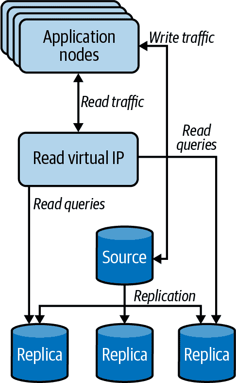
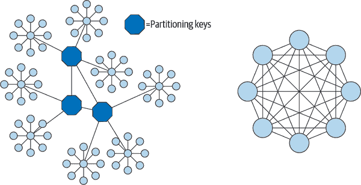
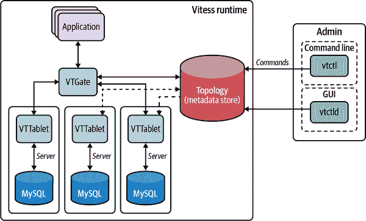
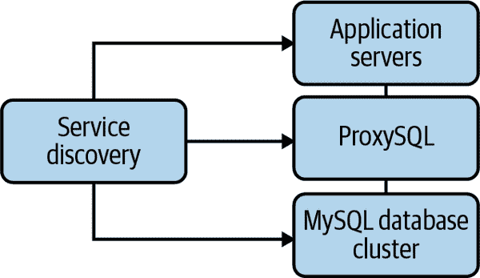

# 第十一章：扩展 MySQL

在个人项目中运行 MySQL，甚至在年轻公司中运行 MySQL，与在市��已经建立并且“呈现指数增长”业务中运行 MySQL 大不相同。在高速业务环境中，流量可能每年增长数倍，环境变得更加复杂，伴随的数据需求迅速增加。扩展 MySQL 与其他类型的服务器大不相同，主要是因为数据的有状态性质。将其与 Web 服务器进行比较，后者的广泛接受的模型是在负载均衡器后面添加更多服务器通常是您需要做的全部。

在本章中，我们将解释什么是扩展，并引导您了解可能需要扩展的不同方面。我们探讨了为什么读取扩展是必不可少的，并向您展示如何安全地实现它，使用诸如排队等策略使写入扩展更可预测。最后，我们涵盖了使用诸如 ProxySQL 和 Vitess 这样的工具对数据集进行分片以扩展写入。通过本章结束时，您应该能够确定系统具有什么季节性模式，如何扩展读取以及如何扩展写入。

# 什么是扩展？

*扩展*是系统支持不断增长的流量的能力。系统是否扩展良好或扩展不佳的标准可以通过成本和简单性来衡量。如果增加系统的扩展能力过于昂贵或复杂，您可能会在遇到限制时花费更多精力来解决这个问题。

*容量*是一个相关概念。系统的容量是它在给定时间内可以执行的工作量。¹ 但是，容量必须加以限定。系统的最大吞吐量与其容量不同。大多数基准测试衡量系统的最大吞吐量，但您不能过度推动真实系统。如果这样做，性能将下降，响应时间将变得不可接受地长且不稳定。我们将系统的实际容量定义为它在仍然提供可接受性能的情况下可以实现的吞吐量。

容量和可扩展性与性能无关。您可以将其比作高速公路上的车辆：

+   系统就是高速公路，上面有所有的车道和车辆。

+   性能是车辆的速度。

+   容量是车道数乘以最大安全速度。

+   可扩展性是您可以增加更多车辆和更多车道而不会减慢交通的程度。

在这个类比中，可扩展性取决于诸如立交设计的优良程度、有多少车辆发生事故或抛锚、车辆是否以不同的速度行驶或频繁变道等因素，但通常，可扩展性并不取决于车辆引擎的强大程度。这并不是说性能不重要，因为它确实重要。我们只是指出，即使系统性能不高，系统也可以具有可扩展性。

从 50,000 英尺高度来看，可扩展性是通过增加资源来增加容量的能力。

即使您的 MySQL 架构是可扩展的，您的应用程序可能并非如此。如果由于任何原因增加容量很困难，那么您的应用程序整体上就不具备可扩展性。我们先前用吞吐量来定义容量，但从同样的 50,000 英尺高度来看容量也是值得一提的。从这个角度来看，容量简单地意味着处理负载的能力，从几个不同的角度来看负载是有用的：

数据量

您的应用程序可以累积的数据量是最常见的扩展挑战之一。这对今天许多 Web 应用程序来说尤为重要，这些应用程序从不删除任何数据。例如，社交网络网站通常不会删除旧消息或评论。

用户数量

即使每个用户只有少量数据，如果用户数量很多，数据量会累积起来——而且数据量可能比用户数量增长更快。许多用户通常意味着更多的交易，而交易数量可能与用户数量不成比例。最后，许多用户（和更多数据）可能意味着越来越复杂的查询，特别是如果查询依赖于用户之间的关系数量。 （关系数量受到限制，为(*N* × (*N* – 1)) / 2，其中*N*是用户数量。）

用户活动

并非所有用户活动都是相同的，用户活动也不是恒定的。如果你的用户突然变得更活跃——例如因为他们喜欢的新功能——你的负载可能会显著增加。用户活动不仅仅是页面浏览的数量。即使页面浏览的数量相同，如果需要大量工作才能生成的站点部分变得更受欢迎，那么同样数量的页面浏览可能会导致更多的工作。一些用户比其他用户更活跃：他们可能比普通用户拥有更多的朋友、消息或照片。

相关数据集的大小

如果用户之间存在关系，应用程序可能需要在整个相关用户组上运行查询和计算。这比仅仅处理个别用户及其数据更复杂。社交网络网站经常面临由于拥有许多朋友的热门群体或用户而带来的挑战。

扩展挑战可能以多种形式出现。在下一节中，我们将讨论如何确定瓶颈所在以及如何解决。

# 读取受限与写入受限的工作负载

在考虑扩展数据库架构时，你应该首先检查的是你是在扩展*读取受限*的工作负载还是*写入受限*的工作负载。读取受限的工作负载是指读取流量（`SELECT`）超过了服务器容量的情况。写入受限的工作负载超过了服务器提供 DML（`INSERT`，`UPDATE`，`DELETE`）的能力。了解你所面临的情况涉及了解你的工作负载。

## 理解你的工作负载

数据库工作负载包括很多方面。首先，它是你的容量，或者正如我们之前提到的，是单位时间内的工作量。对于数据库来说，这通常归结为每秒查询数。工作负载的一个定义可能是系统可以执行多少 QPS。然而，不要被这个迷惑。20%的 CPU 下的一千个 QPS 并不总是意味着你可以再增加四千个 QPS。并非每个查询都是相同的。

查询有各种形式：读取、写入、主键查找、子查询、连接、批量插入等等。每种查询都有与之相关的成本。这个成本以 CPU 时间或延迟来衡量。当一个查询在磁盘上等待返回信息时，这段时间会增加成本。² 了解你的资源容量是很重要的。你有多少个 CPU，你的磁盘的读取和写入 IOPS 和吞吐量限制是多少，你的网络吞吐量是多少？每个因素都会对延迟产生影响，而延迟直接关系到你的工作负载。

工作负载是所有类型查询及其延迟的混合。更公平的说法是，如果我们在 20%的 CPU 上处理一千个 QPS，我们可以再增加四千个 QPS，*只要它们的延迟相同*。³ 如果我们引入四千个额外的查询并且遇到磁盘 IOPS 瓶颈，所有读取的延迟都会增加。

如果您只能访问基本系统指标，如 CPU、内存和磁盘，几乎不可能理解您正在受到哪些限制。您需要确定您的读取与写入性能如何。我们在“检查读取与写入性能”中提供了一个示例，在第三章中。使用该示例，您可以确定读取与写入的延迟。如果您随时间趋势这些数字，您可以看到您的读取或写入延迟是否增加，因此您可能受到限制的地方。

## 读取限制工作负载

假设，在设计产品时，您采用了一个源主机用于所有数据库流量的捷径。增加更多应用节点可能会扩展为客户端提供请求，但最终将受到您的单一源数据库主机响应这些读取请求的能力的限制。这的主要指标是 CPU 利用率。高 CPU 意味着服务器花费所有时间处理查询。CPU 利用率越高，您在查询中看到的延迟就越多。然而，这并不是唯一的指标。您还可以看到大量的磁盘读取 IOPS 或吞吐量，表明您经常访问磁盘或从磁盘读取大量行。

通过添加索引、优化查询和缓存可缓存的数据，您可以最初改善这一点。一旦您没有更多的改进空间，您将面临一个读取限制的工作负载，这就是使用副本扩展读取流量的时候。我们将在本章后面讨论如何使用读取副本池扩展您的读取量，如何为这些池运行健康检查，以及在开始使用该架构时要避免的陷阱。

## 写入限制工作负载

您可能也遇到了写入限制的负载。以下是一些写入限制数据库负载的示例：

+   可能注册人数正在呈指数增长。

+   现在是高峰电子商务季节，销售额正在增长，订单数量也在增加。

+   现在是选举季节，您有很多竞选通讯要发出。

所有这些都是导致更多数据库写入的业务用例，现在您必须扩展。再次强调，即使您可以在一段时间内垂直扩展单一源数据库，但只能走得这么远。当瓶颈是写入量时，您必须开始考虑如何拆分数据，以便可以在不同的子集上并行接受写入。我们将在本章后面讨论如何为写入扩展而进行分片。

在这一点上，问一下“如果我看到两种类型的增长怎么办？”是很合理的。重要的是仔细检查您的模式，并确定是否有一组表在读取方面增长得比另一组表在写入需求方面增长得更快。尝试同时为两者扩展数据库集群会带来很多痛苦和事件。我们建议将表分开放入不同的功能集群中，以独立扩展读取和写入；这是更有效地扩展读取流量的先决条件。

现在您已经确定了您的负载是读取限制还是写入限制，我们将讨论如何以有效的方式帮助引导数据的功能拆分。

# 功能分片

根据业务中的“功能”拆分数据是一个需要深入了解数据的上下文密集型任务。这与流行的软件架构范式如面向服务的架构（SOA）和微服务紧密相关。并非所有功能方法都是平等的，在一个夸张的例子中，如果您将每个表放入自己的“功能”数据库中，您可能会通过过多的碎片化使一切变得更糟。

您如何处理将大型单体/混合关注点数据库拆分为一组合理的较小集群，以帮助业务扩展？以下是一些需要牢记的指导原则：

+   不要根据工程团队的结构进行拆分。这种情况总会在某个时候发生变化。

+   根据业务功能拆分表格。用于账户注册的表格可以与用于托管现有客户设置的表格分开，用于支持新功能的表格应该从其自己的数据库开始。

+   不要回避处理数据中混合了不同业务关注点的地方，并且您需要倡导不仅进行数据分离，还要进行应用重构，并在这些边界之间引入 API 访问。我们见过的一个常见例子是将客户身份与客户账单混合在一起。

起初，会有一些明显具有自己业务功能和访问模式的表格，因此很容易将其拆分到一个单独的集群中，但随着进展，这种分离会变得更加微妙。

现在我们已经根据业务功能以周到的方式拆分了数据，让我们谈谈如何使用副本读取池来扩展读取负载。

# 使用只读池扩展读取

集群中的副本可以担任多个目的。首先，当当前源需要出于任何原因停止服务时，它们是写入故障转移的候选者，无论是计划的还是非计划的。但由于这些副本也在不断运行更新以匹配源中的数据，您也可以使用它们来提供读取请求。

在图 11-1 中，我们首先看一下具有只读副本池的新设置的可视化效果。



###### 图 11-1\. 应用节点使用虚拟 IP 访问只读副本

为了简单起见，我们将假装应用节点仍通过直接连接到源数据库来完成写请求。稍后我们将讨论如何更好地连接到源节点。请注意，尽管如此，相同的应用节点连接到一个虚拟 IP，该虚拟 IP 充当它们与只读副本之间的中间层。这是一个*副本读取池*，这是如何将不断增长的读取负载分散到多个主机的方法。您可能还注意到，并非所有副本都在池中。这是一种常见的方法，用于防止不同的读取工作负载相互影响。如果您的报告流程或备份流程倾向于消耗所有磁盘 I/O 资源并导致复制延迟，您可以略过一个或多个副本节点来执行这些任务，并将其排除在为客户端流量提供服务的读取池之外。或者，您可以通过将复制检查与负载均衡器健康检查相结合，自动将落后的备份节点从池中移除，并在其赶上时重新引入。当应用程序与一个用于读取的单一节点通信，并且您可以无缝管理这些资源而不影响客户时，将您的只读副本转换为可互换资源的灵活性将显著增加。

现在有多个数据库主机用于提供读取请求，对于顺利的生产运行，有一些事项需要考虑：

+   如何将流量路由到所有这些只读副本？

+   如何均匀分配负载？

+   如何运行健康检查并移除不健康或滞后的副本，以避免提供陈旧数据？

+   如何避免意外删除所有节点，导致应用流量受到更大的损害？

+   如何主动地为维护目的手动移除服务器？

+   如何将新配置的服务器添加到负载均衡器？

+   有哪些自动化检查措施可以避免在新配置的节点准备就绪之前将其添加到负载均衡器？

+   你对“准备好接受新节点”的定义是否足够具体？

管理这些读取池的一种非常常见的方式是使用负载均衡器运行一个充当所有流向读取副本的流量的中间人的虚拟 IP。执行此操作的技术包括 HAProxy，如果您自己托管，则为硬件负载均衡器，如果在公共云环境中运行，则为网络负载均衡器。在使用 HAProxy 的情况下，所有应用主机将连接到那个“前端”，而 HAProxy 负责将这些请求定向到后端定义的多个读取副本之一。以下是一个定义虚拟 IP 前端并将其映射到多个读取副本作为后端池的示例 HAProxy 配置文件：

```sql
global
 log 127.0.0.1 local0 notice
 user haproxy
 group haproxy

defaults
 log global
 retries 2
 timeout connect 3000
 timeout server 5000
 timeout client 5000

listen mysql-readpool
 bind 127.0.0.1:3306
 mode tcp
 option mysql-check user haproxy_check
 balance leastconn
 server mysql-1 10.0.0.1:3306 check
 server mysql-2 10.0.0.2:3306 check
```

通常，您使用配置管理自动填充此类文件。在此配置中有几点需要注意。在 MySQL 中，使用*leastconn*在池节点之间进行负载均衡是推荐的方式。在负载升高时使用*roundrobin*等随机负载均衡方式将无法帮助您使用未过载的主机。确保在 MySQL 实例上创建了适当的数据库用户来运行此健康检查，否则所有节点都将被标记为不健康。

促进分片的工具，如 Vitess 和 ProxySQL，也可以充当负载均衡器。我们将在本章末讨论这些工具。

## 为读取池管理配置

现在您在应用节点和副本之间有了一个“门”，您需要一种方法来轻松管理包含或不包含在此读取池中的节点，使用您选择的负载均衡器。您不希望这是一个手动管理的配置。您已经在扩展到大量数据库实例的轨道上，手动管理配置文件将导致错误、响应时间变慢、主机故障，并且根本无法扩展。

服务发现是一个很好的选择，可以自动发现可以在此列表中的主机。这可能意味着将服务发现解决方案部署为技术堆栈的一部分，或者依赖于云提供商提供的托管服务发现选项（如果有的话）。在这里要小心的重要事项是非常明确地指出使读取副本有资格进入此读取池的标准。理想情况下，您应该排除源节点和可能专门用于报告的一个或多个副本。但也许您需要更复杂的东西，其中副本进一步分段以服务不同的应用程序读取负载？我们建议每个池中至少有三个节点的副本，除了您的备份/报告服务器和源节点。

无论您是自己运行服务发现⁴还是使用云提供商提供的服务，您都应该了解该服务的保证。以下是一些需要考虑的事项，无论您是运行服务发现还是与团队合作：

+   它有多快能检测到主机的故障？

+   数据传播速度有多快？

+   当数据库实例发生故障时，负载均衡器上的配置会如何刷新？

+   数据库成员的更改是作为后台进程进行，还是需要中断现有连接？

+   如果服务发现本身出现故障会发生什么？这会影响任何新的数据库连接还是只会影响更改负载均衡器成员资格？在那时，您可以手动进行更改吗？

灵活性带来复杂性，您必须在生产中平衡两者以获得最佳结果。您的工作是始终将决策与正在追求的 SLI 和 SLO 联系在一起，而不是实现神话般的 100%的正常运行时间目标。

现在您知道如何填充配置并在主机进出时更新它们，现在是时候讨论如何为副本读取池的成员运行健康检查了。

## 读取池的健康检查

在这一点上，您需要考虑什么标准可以认为读副本是健康的并准备好接受应用程序的读取流量。这些标准可以简单到“数据库进程正在运行，端口响应”，也可以变得更加复杂，比如“数据库正在运行，复制滞后不超过 30 秒，读查询运行的延迟不高于 100 毫秒”。

###### 提示

检查变量`read_only`和`super_read_only`的状态，以确保负载均衡器的读取池中的所有成员实际上都是副本。

决定进行到何种程度的健康检查应该是与您的应用程序开发团队进行讨论的一个过程，以便每个人都了解并对他们在从数据库读取时期望的行为达成一致。以下是一些可以帮助引导这一决策过程的团队提出的问题：

+   可接受多少数据陈旧？如果返回的数据几分钟前的，会有什么影响？

+   应用程序的最大可接受查询延迟是多少？

+   读查询是否存在任何重试逻辑，如果存在，是否是指数退避？

+   我们是否已经为应用程序设定了 SLO？该 SLO 是否延伸到查询延迟或仅涉及正常运行时间？

+   在没有这些数据的情况下，系统会如何表现？这种退化是否可接受？如果是，那么持续多久？

在许多情况下，您只需使用端口检查即可确认 MySQL 进程正在运行且可以接受连接。这意味着只要数据库在运行，它将成为该池的一部分并提供服务请求。

然而，有时您可能需要更复杂的东西，因为涉及的数据集足够关键，您不希望在复制滞后超过几秒或根本没有运行复制时提供服务。对于这些情况，您仍然可以使用读取池，但可以通过 HTTP 检查来增强健康检查。其工作原理是您选择的负载均衡器将运行一个命令（通常是一个脚本），并根据响应代码确定节点是否健康。例如，在 HAProxy 中，后端将具有类似以下代码行：

```sql
option httpchk GET /check-lag
```

这一行意味着对于读取池中的每个主机，负载均衡器将使用`GET`调用调用路径`/check-lag`并检查响应代码。该路径运行一个脚本，其中包含有关可接受的滞后程度的逻辑。该脚本将现有的滞后状态与该阈值进行比较，并根据情况，负载均衡器将考虑副本是否健康。

###### 警告

即使健康检查是一个强大的工具，也要小心使用那些具有复杂逻辑的（比如之前描述的滞后检查），并确保你有一个计划，以防池中的所有副本都未通过健康检查。您可以拥有一个静态的“备用”池，用于某些全局故障（例如，整个集群滞后），以避免意外破坏所有读取请求。有关一家公司如何实施此功能的更多详细信息，请参阅[GitHub 博客上的这篇文章](https://oreil.ly/zyjA4)。

## 选择负载均衡算法

有许多不同的算法来确定哪个服务器应该接收下一个连接。每个供应商使用不同的术语，但这个列表应该提供了一个可用的想法：

随机

负载均衡器将每个请求定向到从可用服务器池中随机选择的服务器。

轮询

负载均衡器将请求发送到服务器的重复序列：A、B、C、A、B、C，依此类推。

最少连接

下一个连接将发送到活动连接最少的服务器。

最快响应

处理请求速度最快的服务器将接收下一个连接。当池中包含快速和慢速机器时，这种方法可以很好地运作。然而，在 SQL 中，当查询复杂性差异很大时，这就变得非常棘手。即使是相同的查询在不同情况下表现也会有很大差异，比如当它从查询缓存中提取时，或者当服务器的缓存已经包含所需数据时。

哈希

负载均衡器对连接的源 IP 地址进行哈希处理，将其映射到池中的一个服务器。每当来自相同 IP 地址的连接请求时，负载均衡器都会将其发送到同一台服务器。只有当池中的机器数量发生变化时，绑定才会更改。

加权

负载均衡器可以结合并增加其他算法的权重。例如，您可能有单 CPU 和双 CPU 的机器。双 CPU 的机器大约是单 CPU 的两倍强大，因此您可以告诉负载均衡器向它们发送大约两倍数量的请求。

对于 MySQL 来说，最佳算法取决于您的工作负载。例如，最小连接算法可能会在将新服务器添加到可用服务器池之前，使新服务器过载。

您需要进行实验，找到最适合您工作负载的性能。一定要考虑在特殊情况下发生的情况，以及日常规范下会发生的情况。在那些特殊情况下，例如在高查询负载时，进行模式更改时，或者在异常数量的服务器下线时，您最不希望出现严重问题。

我们这里只描述了即时配置算法，不排队连接请求。有时使用排队的算法可能更有效。例如，一个算法可能在数据库服务器上维持给定的并发性，比如同时允许不超过*N*个活动事务。如果有太多活动事务，算法可以将新请求放入队列，并从符合条件的第一个“可用”服务器提供服务。一些连接池支持排队算法。

现在我们已经讨论了如何扩展读取负载以及如何进行健康检查，是时候讨论扩展写入了。在直接寻找如何扩展写入之前，您可以查看排队可以使写入流量增长更可控的地方。让我们讨论一下排队如何帮助扩展您的写入性能。

# 排队

当使用一个偏向一致性而非可用性的数据存储来扩展写事务时，应用层的扩展变得更加复杂。更多的应用节点写入一个源节点将导致数据库系统更容易受到锁超时、死锁和失败写入的影响，必须重试。所有这些最终将导致面向客户的错误或不可接受的延迟。

在研究接下来我们将讨论的数据分片之前，您应该检查数据中的写入热点，并考虑是否所有写入都真正需要主动持久化到数据库。一些写入可以放入队列，并在可接受的时间范围内写入数据库吗？

假设您有一个存储大量客户历史数据的数据库。客户偶尔发送 API 请求来检索这些数据，但您还需要支持一个用于删除这些数据的 API。您可以合理地从越来越多的副本中提供读取 API 调用，但删除呢？HTTP RFC 允许一个响应代码，“202 Accepted”。您可以返回该代码，将请求放入队列（例如，Apache Kafka 或 Amazon Simple Queue Service），并以不会直接导致数据库过载的速度处理这些请求。

这显然不同于 200 响应代码，它意味着请求已经立即完成。在这种情况下，与产品团队进行协商对于使 API 的保证变得可信和可实现至关重要。200 和 202 响应代码之间的区别在于分片这些数据以支持更多并行写入的所有工程工作。

如果你将排队应用于写入负载，一个重要的设计选择是提前确定这些调用在放入队列后预期完成的时间范围。监控请求在队列中花费的时间的增长将是你确定这种策略何时已经到头，你真的需要开始分割这个数据集以支持更多并行写入负载的指标。你可以通过分片来实现这一点，接下��我们将讨论。

# 使用分片扩展写入

如果无法通过优化查询和排队写入来管理写入流量的增长，那么分片是你的下一个选择。

*分片*意味着将数据分割成不同的、更小的数据库集群，这样你就可以同时在更多源主机上执行更多写操作。你可以进行两种不同类型的分片或分区：功能分区和数据分片。

*功能分区*，或者任务划分，意味着将不同的节点专门用于不同的任务。一个例子可能是将用户记录放在一个集群中，将他们的账单放在另一个集群中。这种方法允许每个集群独立扩展。用户注册激增可能会给用户集群带来压力。有了独立的系统，你的账单集群负载较轻，可以为客户开具账单。相反，如果你的账单周期是每月的第一天，你可以运行它，而不会影响用户注册。

*数据分片*是当今扩展非常大型 MySQL 应用程序的最常见和成功的方法。你通过将数据分割成更小的片段或分片，并将它们存储在不同的节点上来进行分片。

大多数应用程序只对需要分片的数据进行分片——通常是数据集中将会增长非常大的部分。假设你正在构建一个博客服务。如果你预计有 1000 万用户，你可能不需要对用户注册信息进行分片，因为你可能能够完全将所有用户（或其中的活跃子集）存储在内存中。另一方面，如果你预计有 5 亿用户，你可能应该对这些数据进行分片。用户生成的内容，如帖子和评论，在任何情况下几乎肯定需要分片，因为这些记录更大，而且数量更多。

大型应用程序可能有几个逻辑数据集，你可以以不同的方式进行分片。你可以将它们存储在不同的服务器集上，但不一定要这样做。你还可以以不同的方式对同一数据进行分片，具体取决于你如何访问它。

在计划“只分片需要分片的内容”时要小心。这个概念不仅需要包括增长迅速的数据，还需要包括逻辑上属于它的数据，并且将经常同时查询。如果你根据`user_id`字段进行分片，但有一组其他小表在大多数查询中与该`user_id`进行连接，那么将这些表一起分片是有意义的，这样你可以一次只对一个分片进行大多数应用查询，避免跨数据库连接。

## 选择分区方案

分片的最重要挑战是查找和检索数据。你如何查找数据取决于你如何分片。有许多方法可以做到这一点，有些方法比其他方法更好。

目标是使您最重要和频繁的查询尽可能少地触及分片（记住，可扩展性原则之一是避免节点之间的交叉通信）。该过程中最关键的部分是选择数据的分区键（或键）。分区键确定应将哪些行放入每个分片。如果您知道对象的分区键，您可以回答两个问题：

+   我应该将这些数据存储在哪里？

+   我可以在哪里找到我需要获取的数据？

我们稍后将展示选择和使用分区键的各种方法。现在，让我们看一个例子。假设我们像 MySQL 的 NDB 集群一样，使用每个表主键的哈希来将数据分区到所有分片中。这是一个非常简单的方法，但不适合扩展，因为它经常需要您检查所有分片以获取所需数据。例如，如果您想要用户 3 的博客文章，您可以在哪里找到它们？它们可能均匀分布在所有分片中，因为它们是按主键分区的，而不是按用户分区的。使用主键哈希使得知道存储数据的位置变得简单，但根据您需要的数据和是否知道主键，可能会使获取数据变得更困难。

您总是希望将查询局限在一个分片中。在水平分片数据时，您希望*始终*避免跨分片查询以完成任务。在跨分片连接数据会增加应用程序层的复杂性，并消耗分片数据的好处。分片数据集的最坏情况是当您不知道所需数据存储在哪里，因此需要扫描每个分片才能找到它。

一个好的分区键通常是数据库中一个非常重要实体的主键。这些键确定了分片的单位。例如，如果您按用户 ID 或客户 ID 对数据进行分区，那么分片的单位就是用户或客户。

一个好的开始方法是使用实体关系图或显示所有实体及其关系的等效工具绘制数据模型图。尝试布置图表，使相关实体彼此靠近。您通常可以通过视觉检查这样的图表，并找到否则会错过的分区键候选项。但不要只看图表；还要考虑您应用程序的查询。即使两个实体在某种程度上相关，如果您很少或从不在关系上进行连接，您可以打破关系以实现分片。

一些数据模型比其他数据模型更容易分片，这取决于实体关系图中的连接程度。图 11-2 展示了左侧易于分片的数据模型和右侧难以分片的数据模型。



###### 图 11-2\. 两个数据模型，一个易于分片，另一��难以分片⁵

左侧的数据模型易于分片，因为它有许多连接的子图，主要由只有一个连接的节点组成，您可以相对容易地“切断”子图之间的连接。右侧的模型难以分片，因为没有这样的子图。幸运的是，大多数数据模型更像左侧图表而不是右侧图表。

在选择分区键时，尽量选择一些可以尽可能避免跨片查询的内容，但也要使分片足够小，以免出现数据不均匀的问题。你希望分片最终变得均匀小，如果可能的话，如果不行，至少要足够小，以便通过将不同数量的分片组合在一起来平衡。例如，如果你的应用程序仅限于美国，你想将数据集分成 20 个分片，你可能不应该按州进行分片，因为加利福尼亚州人口太多。但你可以按县或电话区号进行分片，因为尽管它们的人口不均匀，但它们足够多，以至于你仍然可以选择 20 组，总体上人口大致相等，并且你可以选择它们以避免跨片查询。

## 多个分区键

复杂的数据模型使数据分片更加困难。许多应用程序有多个分区键，特别是如果数据中有两个或更多重要的“维度”。换句话说，应用程序可能需要从不同角度高效、连贯地查看数据。这意味着你可能需要在系统内至少存储一些数据两次。

例如，你可能需要按照用户 ID 和帖子 ID 对博客应用程序的数据进行分片，因为这是应用程序查看数据的两种常见方式。想象一下：你经常想看到某个用户的所有帖子和某个帖子的所有评论。按用户分片无法帮助你找到帖子的评论，按帖子分片无法帮助你找到用户的帖子。如果你需要让这两种类型的查询仅涉及单个分片，那么你将需要双向分片。

仅仅因为你需要多个分区键，并不意味着你需要设计两个完全冗余的数据存储。让我们看另一个例子：一个社交网络读书俱乐部网站，用户可以在该网站上评论书籍。该网站可以显示一本书的所有评论，以及用户已阅读并评论的所有书籍。

你可以为用户数据构建一个分片数据存储，为书籍数据构建另一个。评论既有用户 ID 又有帖子 ID，因此它们跨越分片之间的边界。你可以将评论与用户数据一起存储，而只需将评论的标题和 ID 与书籍数据一起存储。这可能足以在不访问两个数据存储的情况下呈现大多数书籍评论的视图，如果需要显示完整的评论文本，可以从用户数据存储中检索。

## 跨片查询

大多数分片应用程序至少有一些需要从多个分片聚合或��接数据的查询。例如，如果读书俱乐部网站显示最受欢迎或活跃的用户，它必须根据定义访问每个分片。使这样的查询正常工作是实现数据分片最困难的部分，因为应用程序将一个查询视为单个查询，需要将其拆分并并行执行多个查询，每个查询对应一个分片。一个良好的数据库抽象层可以帮助减轻痛苦，但即使如此，这样的查询比分片内查询慢得多，成本更高，通常也需要积极的缓存。

如果你选择的分片方案使跨片查询成为异常而不是规范，那么你将知道你选择的分片方案是一个好的选择。你应该努力使你的查询尽可能简单，并且包含在一个分片中。对于那些需要一些跨片聚合的情况，我们建议将其作为应用程序逻辑的一部分。

跨片查询也可以从摘要表中受益。你可以通过遍历所有分片并在每个分片上存储结果的冗余数据来构建它们。如果在每个分片上复制数据太浪费，你可以将摘要表合并到另一个数据存储中，这样它们只存储一次。

非分片数据通常存储在全局节点中，并进行大量缓存以保护免受负载影响。

一些应用程序基本上使用随机分片，其中一致的数据分布很重要，或者当没有很好的分区键时。分布式搜索应用程序是一个很好的例子。在这种情况下，跨分片查询和聚合是常规操作，而不是例外。

在分片中，跨分片查询并不是唯一困难的事情。保持数据一致性也是困难的。跨分片的外键不起作用，因此正常解决方案是根据需要在应用程序中检查引用完整性或在分片内部使用外键，因为分片内部的一致性可能是最重要的事情。虽然可以使用[XA 事务](https://oreil.ly/Z5gSe)，但这在实践中并不常见，因为会增加开销。

您还可以设计定期运行的清理流程。例如，如果用户的读书俱乐部账户过期，您不必立即删除它。您可以编写一个定期作业，从每本书的分片中删除用户的评论，并构建一个定期运行的检查脚本，确保数据在分片之间保持一致。

现在我们已经解释了如何将数据分割到多个集群以及如何选择分区键的不同方式，让我们来介绍两种最受欢迎的开源工具，可以帮助促进分片和分区。

## Vitess

Vitess 是用于 MySQL 的数据库集群系统。它起源于 YouTube，然后成为 PlanetScale，由 Jiten Vaidya 和 Sugu Sougoumarane 共同创立的一个独立产品和公司。

Vitess 提供了许多功能：

+   支持水平分片，包括对数据进行分片

+   拓扑管理

+   源节点故障转移管理

+   模式更改管理

+   连接池

+   查询重写

让我们探索 Vitess 的架构及其组件。

### Vitess 架构概述

图 11-3 是来自 Vitess 网站的图表，展示了其架构的不同部分。



###### 图 11-3\. Vitess 架构图（改编自 vitess.io）

以下是一些你需要了解的术语：

Vitess pod

一组数据库的一般封装以及支持分片、拓扑管理、模式更改管理和应用程序访问这些数据库的 Vitess 相关部分。

VTGate

控制应用程序和运维人员访问数据库实例的服务，用于管理拓扑结构、添加节点或对部分数据进行分片。这类似于之前描述的架构中的负载均衡器。

VTTablet

在 Vitess 管理的每个数据库实例上运行的代理。它可以接收来自运维人员的数据库管理命令，并代表运维人员执行这些命令。

拓扑（元数据存储）

在给定 pod 中保存由 Vitess 管理的数据库实例的库存以及相关信息。

vtctl

用于对 Vitess pod 进行操作更改的命令行工具。

vtctld

用于相同管理操作的图形界面。

Vitess 的架构始于一个一致的拓扑存储，其中保存了所有集群、MySQL 实例和 *vtgate* 实例的定义。这个一致的元数据存储在管理拓扑变化中发挥着至关重要的作用。当运维人员想要对 Vitess 管理的集群的拓扑进行更改时，实际上是通过一个名为 *vtctl* 的服务向数据存储发送命令，然后将该命令的组件操作发送给 *vtgate*。

Vitess 提供了可以在 Kubernetes 中部署 *vtgate* 层和元数据存储的数据库运维人员。在像 Kubernetes 这样的平台中拥有其控制平面可以增加其对单点故障的弹性。

Vitess 最大的优势之一是[其关于如何扩展 MySQL 的理念](https://oreil.ly/5QKCD)，其中包括以下内容：

偏好使用较小的实例

按功能、水平或两者分割您的数据。但是当发生故障时，较小的实例会导致较小的爆炸半径。

复制和自动写入故障转移以增加弹性

Vitess 不通过多写节点技巧承诺“100%在线写入”。相反，它自动化写入故障转移，并在故障转移期间管理拓扑变化和应用程序对数据库节点的访问，以使写入停机时间尽可能短。

使用半同步复制确保持久性

Vitess 强烈推荐使用半同步复制（与默认的异步相对）来确保在向应用程序确认写入之前，写入始终由数据库层中的多个节点持久化。这是一种以延迟为代价换取持久性保证的关键权衡，当 Vitess 需要在非计划方式下故障转移写入主机时，这种权衡会产生回报。

这些架构原则可以帮助您在业务流量呈指数增长时在基础设施的数据库层具有更多的弹性。无论您是否专门使用 Vitess 或其他解决方案作为架构的一部分，您都应该遵循这些最佳实践。

### 将您的堆栈迁移到 Vitess

Vitess 是一个用于运行数据库层的有主见的平台，而不是一个即插即用的解决方案。因此，在您将其作为数据库访问层之前，您需要深思熟虑地计划如何实施这样的过渡。

具体而言，在评估 Vitess 作为可能解决方案时，请务必考虑以下迁移步骤：

1\. 测试并记录您为整个系统引入的延迟。

将像 Vitess 这样复杂的堆栈引入应用程序堆栈肯定会增加一定量的延迟，特别是考虑到半同步复制的执行。确保这种权衡得到充分记录和明确沟通，以便您的下游依赖在构建依赖于这种数据库架构的 SLO 时做出知情决策。

2\. 使用[金丝雀部署模型](https://oreil.ly/ldtnN)。

在生产中过渡期间，您可以将*vttablet*配置为“外部管理”。这允许*vttablet*和直接连接到数据库服务器，随着您逐渐通过应用程序节点群增加连接更改。

3\. 开始分片。

一旦所有应用层访问都通过*vtgate*/*vttablet*而不是直接访问 MySQL，您就可以开始使用 Vitess 的完整功能集来将表拆分到新的集群中，将数据水平分片以获得更多的写入吞吐量，或者仅仅添加副本以获得更多的读取负载能力。⁶

Vitess 是一个强大的数据库访问和管理产品，它已经从早期在谷歌的日子里走过了很长的路。它已经证明了它能够实现戏剧性的增长和一个弹性的数据库基础设施。然而，这种强大和灵活性是以增加复杂性为代价的。Vitess 不像一个简单的负载均衡器通过流量，你应该权衡业务需求和引入和维护像 Vitess 这样复杂的数据库管理工具的成本。

## ProxySQL

ProxySQL 专门为 MySQL 协议编写，并以 GPL 发布。René Cannaò，一个为许多公司提供咨询的 DBA 和长期的 MySQL 贡献者，是主要作者。现在它是一个提供 ProxySQL 产品付费支持和开发合同的全功能公司。

让我们深入了解一些关于其架构、配置模式、用例和功能的细节。

### ProxySQL 架构概述

您可以将 ProxySQL 用作任何应用程序代码和 MySQL 实例之间的中间层。ProxySQL 为应用程序提供了一个基于会话的、基于 MySQL 协议的接口，用于与数据库交互。代替应用程序直接打开连接到数据库实例，ProxySQL 代表应用程序打开连接。

这种设计使代理对应用程序节点看起来是不可见的。其会话感知性允许在没有停机的情况下在 MySQL 实例之间移动这些连接。当您处理不再投资于的应用程序时，这尤其有用，因为您现在可以利用 ProxySQL 中的功能而无需对您可能不确定更改的代码进行任何更改。

ProxySQL 还提供强大的连接池。应用程序打开到 ProxySQL 的连接与 ProxySQL 打开到配置连接的数据库实例的连接是分开的。这种分离可以保护数据库实例免受应用层突发流量的影响。

当您有能力单独管理客户端连接与实际连接到数据库的连接数量时，您引入了以前没有的灵活性。现在您可以扩展应用程序节点池，而无需担心它会增加到数据库的连接负载超出您想要支持的范围。这允许在使用 ProxySQL 时解释常见模式时，应用程序和业务需求的多样化场景。

### 配置 ProxySQL

ProxySQL 在启动时使用配置文件，但在内存中和嵌入式 SQLite 文件中维护其运行时配置，您可以直接访问并使用管理界面查询。

ProxySQL 的管理界面允许您发出命令来更改运行配置，然后使用 MySQL 命令将新配置转储到磁盘以实现持久性。这使您可以对运行中的 ProxySQL 实例进行零停机更改。您还可以使用此管理界面来进行由配置管理或自动故障转移脚本发出的自动更改。您可以在图 11-4 中看到您的架构通常如何利用 ProxySQL 和服务发现来为服务提供强大的访问层。

###### 警告

需要注意的是，虽然我们在此图中将 ProxySQL 显示为一个对象，但我们强烈建议在生产环境中利用其集群机制，并在给定堆栈中部署多个实例。永远不要运行单点故障（SPoF）。



###### 图 11-4。应用程序节点、ProxySQL 和服务发现之间的交互（根据 Bill Sickles 的图表调整）

ProxySQL 对其连接的数据库进行独立和分层的健康检查。根据这些健康检查的结果，ProxySQL 添加或删除主机或调整流量权重。您可以指定复制延迟阈值、成功连接的时间以及连接失败时的重试次数等许多其他配置选项，以控制在服务和应用程序需求的背景下可接受的故障容忍度。这些配置选项允许 ProxySQL 对不响应的主机做出准确的反应，要么暂时删除后端数据库，然后稍后重复健康检查，要么完全删除挣扎的后端成员，直到操作员介入。

### 使用 ProxySQL 进行分片

ProxySQL 对于许多分片拓扑结构非常有用。虽然它不像 Vitess 那样自动分割数据，但它可以作为一个很好的轻量级中间层，具有分片感知能力，并可以相应地路由应用程序连接。让我们来看看你可以如何将其用作分片层的路由层。

#### 按用户分片

如果你的数据按功能或业务功能在不同的数据库集群中分割，并且不同的应用程序群访问这些集群，你应该为每个应用程序使用完全不同的数据库凭据。ProxySQL 可以利用这个用户参数将流量路由到完全不同的后端数据库池，无论是写入还是读取。

您可以通过在其管理界面上运行这些命令，然后将更改保存到其磁盘配置文件中，来配置 ProxySQL 中的此类路由：

```sql
INSERT INTO mysql_users
(username, password, active, default_hostgroup, comment)
VALUES
('accounts', 'shard0_pass', 1, 0, 'Routed to the accounts shard'),
('transactions', 'shard1_pass', 1, 1, 'Routed to the transactions shard'),
('logging', 'shard2_pass', 1, 2, 'Routed to the logging shard');

LOAD MYSQL USERS RULES TO RUNTIME;
SAVE MYSQL USERS RULES TO DISK;
```

###### 提示

始终确保您保持 ProxySQL 的运��时配置和磁盘配置同步，以避免在 ProxySQL 进程重新启动时出现不愉快的惊喜。

这还可以方便地记录所有这些用户执行的操作以符合合规性，而不会对数据库造成任何负载。您将在第十三章中看到，我们还建议出于合规性原因为不同的数据库用户分别设置，因此这种设计也符合一些合规性目标。

#### 按模式分片

您可以使用 ProxySQL 的模式名称作为管理流量路由规则来支持分片数据集的另一种方式。以下是您如何在 ProxySQL 的配置中定义的示例：

```sql
INSERT INTO mysql_query_rules (rule_id, active, schemaname,
destination_hostgroup, apply)
VALUES
(1, 1, 'shard_0', 0, 1),
(2, 1, 'shard_1', 1, 1),
(3, 1, 'shard_2', 2, 1);

LOAD MYSQL QUERY RULES TO RUNTIME;
SAVE MYSQL QUERY RULES TO DISK;
```

请注意，只要正确命名模式，此配置可用于水平分片或功能分片。

在这种方式中使用 ProxySQL 时，我们最后一个重要建议是确保使用其原生的集群功能，这样可以确保像`mysql_rules`这样的关键配置表在集群中的所有 ProxySQL 节点上同步，为中间件层提供冗余。

### 使用 ProxySQL 的其他好处

让我们讨论一些常见模式，在这些模式中使用 ProxySQL 可以帮助缓解快速增长环境中的常见问题。

在许多应用程序中，“向数据库打开更多连接”是我们在查询延迟开始上升时经常看到的模式。然而，在实践中，这可能导致停机⁷，并且倾向于使许多连接处于空闲状态，消耗资源但不执行任何工作。当应用程序层直接向数据库打开更多连接时，数据库服务器在连接管理上花费的资源量也会增加。这会导致数千个连接压倒已经超载的数据库实例。所有这些活动导致持续的停机时间，多个微服务中的级联故障以及延长的面向客户的影响。

ProxySQL 的连接管理架构通过仅向数据库打开可以工作的连接数量，有助于保护数据库层免受意外应用程序高峰的影响。ProxySQL 可以重用这些连接来处理不同的客户端请求。这种行为最大化了单个连接到数据库服务器可以完成的工作量，从而减少了管理连接的资源数量，并允许更有效地使用数据库服务器的内存资源。

### ProxySQL 中的其他值得注意的功能

ProxySQL 在一般用途应用程序代理中具有一些突出的功能：

+   基于端口、用户或简单的正则表达式匹配的查询路由

+   前端应用程序连接和后端连接到数据库的 TLS 支持

+   支持各种 MySQL 版本，如 AWS Aurora、Galera Cluster 和 Clickhouse

+   连接镜像

+   结果集缓存

+   查询重写

+   审计日志

您可以通过访问其[文档](https://oreil.ly/PTZFW)了解 ProxySQL 的广泛功能集（远远超出分片支持）。

ProxySQL 是一个强大的工具，您可以使用它来扩展应用程序，并为数据库层提供适当的性能保护，并具有支持各种业务需求的附加功能（如合规性、安全规则等）。如果您的公司发现自己处于高增长轨迹上，拥有一系列新的和不那么新的服务共享数据库资源，那么它可以是一个强大的工具，可以安全地继续这种增长。ProxySQL 提供了一个易于部署的抽象，可以比 HAProxy 更复杂，但在基础设施和复杂性方面的前期投资较少。然而，它也不提供 Vitess 中找到的一些更高级的功能，比如数据集的自动分片、模式更改的管理，以及[VReplication](https://oreil.ly/k2J7R)，这是一个强大的工具，用于启用抽取、转换、加载（ETL）管道和更改数据流。

# 摘要

扩展 MySQL 是一场旅程。您应该在本章结束时更有准备地评估您的扩展需求，并了解如何扩展读取、如何扩展写入，以及通过向架构添加排队来使您的流量增长更可预测。您现在应该了解如何通过分片来扩展写入以及随之而来的所有复杂决策。

在深入研究可扩展性瓶颈之前，请确保您已经优化了您的查询，检查了您的索引，并为 MySQL 设置了稳固的配置。这可能为您提供计划更好的长期策略所需的时间。优化后，专注于确定您是读取密集型还是写入密集型，然后考虑哪些策略最适合解决任何即时问题。在规划解决方案时，请确保考虑如何为长期可扩展性做好准备。

对于读取密集型工作负载，我们建议转移到读取池，除非复制延迟是无法克服的问题。如果延迟是一个问题，或者如果您的问题是写入密集型的，您需要考虑分片作为下一步。

¹ 在物理科学中，单位时间的工作被称为*功率*，但在计算中，“*功率*”是一个如此多义的术语，以至于它是模棱两可的，我们要避免使用它。然而，*容量*的一个精确定义是系统的最大功率输出。

² 为了简化解释，我们选择忽略多个 CPU 和上下文切换的复杂性。

³ 这仍然不完全准确，因为当 CPU 接近 100%时，延迟会增加，您将无法再添加四千个查询。

⁴ 最常用的并且我们推荐的是[Hashicorp 的 Consul](https://www.consul.io)。

⁵ 感谢 HiveDB 项目和布里特·克劳福德为提供这些优雅的图表。

⁶ 这种部署策略是由摩根·托克在 2019 年的[Kubecon 演讲](https://www.youtube.com/watch?v=OCS45iy5v1M)中详细解释的。

⁷ 欲了解更多信息，请参阅[维基百科关于雷鸣群问题的条目](https://oreil.ly/YOtAt)。
