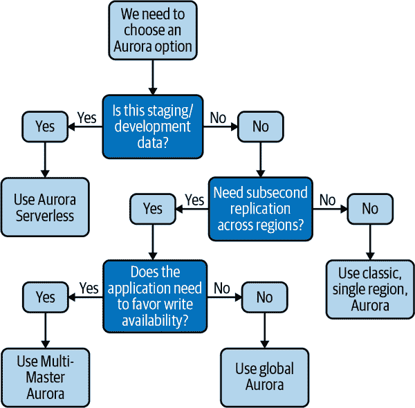

# 第十二章：云中的 MySQL

很可能，你对于是否迁移到云服务提供商，甚至你的组织最终选择哪一个云服务提供商都没有太多控制权。你可以控制的是如何构建你的数据库环境。你可以选择两个方向：托管的 MySQL 或者在虚拟机上构建。托管的 MySQL 往往更加无需过多干预，但通常更昂贵且控制权更少。在虚拟机上构建意味着你可以更加灵活地构建和观察你的平台，但需要更多的时间和运营开销。

在本章中，我们将概述托管 MySQL 的主要选项以及它们对你有何用处。我们还将解释如何开始构建一个虚拟机选项，包括选择正确的规格和磁盘类型，以及在云中运行 MySQL 时需要准备的操作复杂性（如主机重启）。

###### 警告

我们不会涵盖云服务提供商提供的 bug。这些提供的产品在不断发展，因此我们建议你保持与动态来源（如新闻通讯或 bug 论坛）的同步，而不是依赖像本书这样的静态参考。

# 托管的 MySQL

云服务提供商中的托管 MySQL 提供了许多便利，帮助团队在产品增长和功能集扩展时减少操作 MySQL 的认知负担。每个公共云都有自己对于托管 SQL 数据库应该是什么样子以及如何工作的理解。亚马逊网络服务（AWS）提供了几种 Aurora MySQL 的版本（我们很快会详细讨论这些），谷歌云平台（GCP）有 Cloud SQL，几乎所有公共云提供商都提供类似的服务。

托管解决方案的主要吸引力在于它们提供了一个可访问的数据库设置，无需深入了解 MySQL 的具体细节。通过几次点击或`terraform apply`，你就可以在线创建一个带有副本和定期备份的数据库，然后就可以开始了。对于想要快速入门的公司或团队来说，这可能是一个非常吸引人的选择。

另一方面，使用托管的 MySQL 会缺乏很多可见性和控制权。你无法访问操作系统或文件系统，并且在进程本身内部的操作受到限制。除了云服务提供商提供的内容，你无法检查系统的其他任何内容。在大多数情况下，如果遇到问题，你只能提交支持工单并等待回复。你无法设置任何高级拓扑结构，备份和恢复方法也受限于云服务提供商提供的内容。

值得注意的是，许多云服务提供商提供的是*与 MySQL 兼容*的数据存储。这是一个具有 SQL 接口但内部工作方式可能与本书关注的 Oracle MySQL 完全不同的数据存储。我们将介绍一般的权衡和每个托管解决方案的不同之处，以帮助你选择最适合你的团队和业务需求的选项。

## 亚马逊 Aurora for MySQL

Aurora MySQL 是一个与 MySQL 兼容的托管数据库。Aurora 最吸引人的卖点是它将计算与存储分离，这使得它们可以分别和更灵活地扩展。Aurora 管理了许多你通常需要处理的运营任务，比如执行快照备份、管理快速模式更改、审计日志和管理单一区域内的复制。

Aurora MySQL 还有不同的提供方式。我们将简要介绍这些提供方式之间的区别。

标准的 Aurora 提供的是长时间运行的计算实例，你可以选择一个实例类别（就像在运行自己的 MySQL 时一样），并且你会获得内部复制到六个副本的附加存储。

###### 警告

在撰写本文时，AWS 认为 Aurora 快速 DDL 是一个“实验模式”功能。如果您正在阅读本文，情况仍然如此，我们建议您参考第六章以了解有关使用数据库外部工具进行在线模式更改的更多信息。

需要注意的是，在 Aurora 集群内部的复制完全是亚马逊专有的，不是我们在 Oracle MySQL 中所知道和使用的复制。由于集群中所有的 Aurora 实例共享相同的存储层来访问数据，集群内部的复制是使用块存储来完成的。¹ 然而，Aurora 确实支持以我们在社区服务器中熟悉的格式写入二进制日志，以便团队希望将数据从一个 Aurora 集群复制到另一个集群或者出于其他二进制日志的目的，比如变更数据捕获。²

###### 提示

如果您打算将任何关键数据库放在 Aurora 上，我们强烈建议您考虑使用亚马逊的 RDS 代理来管理应用程序与 Aurora 的通信方式。在您知道应用程序端可能会出现新连接风暴的情况下，RDS 代理可以非常方便地防止新连接量影响数据库。

自 2015 年 Aurora MySQL 出现以来，AWS 已经扩展了 Aurora MySQL 的选项，以满足更广泛的用例和业务需求：

Aurora 无服务器

Aurora MySQL 的无服务器产品消除了长时间运行的计算，并利用亚马逊的无服务器平台来提供数据库的计算层。如果您的工作负载不需要持续运行，这将为您提供很大的成本灵活性。

Aurora 全局数据库

这是 Aurora 为那些需要在多个地理区域中可用数据但不想使用二进制日志复制手动管理从主要集群到其他区域集群获取数据更改的解决方案。请注意，这会带来一些权衡，您应始终参考亚马逊的文档，以确保您接受正确的权衡。

Aurora 多主

多主是 Aurora 集群的一种特殊类型，可以同时在多个计算节点上接受写入。它旨在作为一个高可用解决方案，其中单个区域中的写入可用性是最高优先级。请注意，Aurora 多主带有自己的一套限制。首先，在撰写本文时，它运行的是 MySQL 5.6 服务器核心，这将阻止您使用许多功能。集群中允许的节点数量有一个最大限制，并且您不能在同一部署中混合多主和全局数据库。我们认为 Aurora 多主是一个非常主观的解决方案，适用于您在每个数据存储和应用程序交互中拥有的可用性和一致性选择，并建议您在选择之前仔细考虑您所陈述的约束和权衡。

AWS 继续对其托管的关系型数据库产品进行更新和改进，因此我们将避免深入讨论 Aurora 各种版本之间的功能差异。然而，图 12-1 提供了一个流程图，帮助您了解哪种类型的 Aurora 可能最适合您的需求以及在什么权衡下。

图 12-1 为您提供了一个基本的决策树，帮助您在 Aurora 选项之间做出选择。重要的是，尽管 Aurora 有许多选项，但总会有权衡。例如，您无法同时实现多写高可用性和跨区域亚秒级复制。但您*可以*利用这些产品来展示这些权衡，并推动关于哪个更重要：写入可用性还是区域复制的困难产品讨论。

Aurora 并不是唯一由云提供商提供的托管 MySQL 产品。GCP 有自己的产品。

###### 图 12-1\. 一个流程图，帮助您选择适合您需求的 Aurora 版本

## GCP Cloud SQL

Cloud SQL 是 GCP 的托管 MySQL 产品。这种产品与 AWS 的主要区别在于它运行社区服务器，但特定功能被禁用，以便实现产品的多租户性和托管性。以下是一些你不能在 Cloud SQL 中使用的功能，尽管它运行社区服务器：

+   `SUPER` 权限被禁用。

+   禁用加载插件。³

+   一些客户端也被禁用，比如 *mysqldump* 和 *mysqlimport*。

与 AWS 的产品类似，您无法访问实例的 SSH。

另一方面，Cloud SQL 为您管理了许多运营任务：

+   本地高可用性支持。故障转移通过配置选项自动化。

+   数据静态加密。

+   灵活管理升级，使用多种方法。请注意，最终这些维护窗口会涉及一些停机时间（类似于 AWS Aurora），您需要平衡这一点与应用程序 SLOs 的责任。⁴

正如我们在本章开头提到的，您可能没有选择在哪个云提供商中构建这些数据库的选择，因此您更可能需要了解所选云提供商提供的托管选项以及如何使用它，或者提出直接使用虚拟机而不是托管 MySQL 的理由。

现在我们已经介绍了托管关系型数据库选项以及这些选择的复杂性，让我们谈谈稍微更复杂的路径：在云托管的虚拟机上运行 MySQL。

# 虚拟机上的 MySQL

托管 MySQL 的特性对于那些想快速上手的人可能非常吸引人，那么为什么有人选择自己运行呢？在虚拟机上运行 MySQL 就像在裸机上运行一样。您可以完全控制所有操作方面。您可以在单个区域运行主 MySQL，但在其他区域设置副本以用于灾难恢复，或者运行一个延迟副本。您还可以根据工作负载最优化地定制备份方法。如果性能下降或遇到问题，您可以完全控制操作系统和文件系统，允许您进行任何自查。

## 云中的机器类型

如 第四章 中讨论的，MySQL 的 CPU 核心数量和可用 RAM 对 MySQL 的性能有直接影响。为数据中心选择特定硬件规格的缺点是它们不能很容易地更改。如果您有一个 56 核、512 GB RAM 的机器架设，您当然可以减少安装的 RAM，但您已经为此付费了，所以除非您可以在其他地方重复使用 RAM，否则您可能在硬件上花费过多。

当您使用云提供商时，为您的工作负载优化机器规格要容易得多。主要的云提供商允许您选择设置虚拟 CPU（vCPU）范围、可用的 RAM 量、网络和磁盘限制的机器规格。随之而来的是，您可以根据工作负载的变化调整 VM 的大小。这意味着，如果您在一年中的特定时间经历高峰流量，比如假期季节，您可以临时增加机器规格以应对这种情况。一旦流量模式回落，您可以再次将它们调整为更小。这种灵活性是许多人转向云的原因。

## 选择正确的机器类型

如果您已经在云提供商上，选择一台机器相当简单。如果遇到 vCPU、内存或网络瓶颈，您可以找到适当的机器类型来克服，并调整大小。但如果您从数据中心搬迁，确定正确的配置可能会有些棘手。

### CPU

在第四章中，我们讨论了如何为你的工作负载选择正确的 CPU。当你转移到云时，大部分指导仍然适用。请记住，与云提供商一起，你得到的是*虚拟* CPU，而不是物理 CPU。这意味着 CPU 不是专门属于你的。它可能与同一物理主机上的其他租户共享。很可能，你会看到比在你自己的独立服务器上更多的延迟和利用率变化。

如果你从物理机器迁移到云提供商，估算你的 CPU 使用量也可能会有些棘手。我们成功地使用以下公式来计算 vCPU 数量：（核心数 × 95% 总 CPU 使用量）× 2。

例如，假设你在数据中心有一台 40 核服务器。在过去的 30 天里，CPU 使用率的峰值为 30%。在云提供商中以 50% 利用率运行这个需要多少核心？使用上述公式，我们会估算出 24 个核心。如果你选择的云提供商没有提供 24 核的机型，考虑四舍五入到最近的类型或确定你的提供商是否提供自定义机型。⁵

###### 警告

随着 CPU 使用率或核心数的增加，上下文切换也会增加：在 CPU 上切换任务的行为。因此，你不希望运行在 100% 的 CPU 容量，因为你会浪费大量时间在线程之间切换。这将表现为查询的延迟。我们建议目标是 50% 的典型利用率，峰值可达到 65%–70%。如果你维持在 70% 的 CPU 或更高，你可能会看到延迟增加，你应该考虑添加更多的 CPU。

也要注意 CPU 芯片系列，如果有这个选项的话。如果你正在运行一个高流量的网络应用程序，你可能希望确保你有一个更晚一代的芯片可用。同样，如果你正在考虑后端数据处理，在那里旧的、稍慢一些的 CPU 芯片系列可能是可以的，这可能会节省成本。

### 内存

正如第一章和第四章所讨论的，RAM 可以极大地影响 MySQL 的性能。

选择最适合你数据工作集需求的机型规格，更倾向于过多的 RAM 而不是不足。

### 网络性能

虽然 CPU 和内存大小是选择机型最重要的部分，但确保你也审查了可用的网络性能限制，以确保你不会让你的应用程序挨饿。例如，如果你有一个将读取大量数据的批处理过程，你可能会发现在较小的机型上耗尽带宽。

###### 提示

值得注意的是，云区域和区域之间的网络出口通常是有成本的。当设置副本时，这可能会让人感到惊讶，但我们仍然认为将副本放在不同的区域是很重要的，以实现冗余。

## 选择正确的磁盘类型

尽管机型通常是动态的，但是为数据存储做出的选择可能是你最复杂的决定。一旦你选择了一个磁盘类型并开始用它来存储数据，转移到另一种磁盘类型就会变得困难。通常情况下，你需要挂载第二个磁盘并复制数据。纠正这个问题并不是不可能的，但肯定比只需快速重启来添加更多 CPU 要复杂。

选择正确的磁盘类型也高度依赖于你期望运行的工作负载。高度读密集型的工作负载将受益于更多的内存而不是磁盘性能，因为内存访问速度快得多。如果你的工作集大于你的 InnoDB 缓冲池，你将总是需要去磁盘读取一些数据。写密集型的工作负载将总是需要去磁盘，这是大多数人开始看到他们的第一个磁盘瓶颈的地方。

### 附件类型

首先要做出的决定是选择本地连接的磁盘还是网络连接的磁盘。本地连接的磁盘具有提供极高性能和一致吞吐量的优点，但也容易丢失数据。这是因为它们被视为临时数据的磁盘。如果运行本地连接数据的虚拟机的硬件崩溃，你可能会丢失本地磁盘上的所有数据。同样，在某些情况下，即使关闭实例，再次启动时可能会在不同的主机机器上且磁盘为空。本地连接的磁盘通常没有任何复制或 RAID 支持。主机级磁盘故障可能导致数据丢失。如果选择这条路线，我们强烈建议考虑使用软件 RAID，以至少减少数据丢失的可能性。有关 RAID 的讨论，请参见第四章了解更多信息。

相比之下，网络连接的磁盘提供冗余性和可靠性而不是性能。这并不是说网络连接的磁盘性能不好，只是不如本地连接的性能好。你的网络连接磁盘可能会出现停顿，而本地连接的磁盘可能不会。你还可以在本地实现更高的吞吐量和 IOPS 数字。

当使用网络连接的磁盘时，云服务提供商提供方便的备份或快照工具。这些对于 MySQL 使用效果很好，假设你已经配置了符合 ACID 标准的设置⁶并且你的备份解决方案设计得当。你可以在任何时候进行磁盘快照，并通过正常的崩溃恢复无问题地恢复它。

你还可以使用磁盘快照来快速制作副本，即使磁盘大小达到数 TB。通过这样做，你可以最大程度地减少需要追赶的复制延迟量，以便副本可以使用。

请注意，如果使用本地连接的磁盘而不是网络连接的磁盘，你需要自己解决如何使用 LVM 或第三方工具如 XtraBackup 备份数据的问题。有关备份的更详细讨论，请参见第十章。

关于附件类型的最后一点是，云服务提供商不像硬件上的 RAID 卡那样提供写缓存（电池或闪存支持）。

### SSD 与 HDD

总的来说，你应该为所有东西使用 SSD，尤其是你的 MySQL 数据卷。如果预算特别紧张，你可以探索 HDD 作为启动磁盘的更便宜选项。在我们的实验中，我们发现 SSD 的启动速度比 HDD 快两到三倍。如果启动时间很重要，尤其是在停机或重新启动情况下，请坚持使用 SSD。

### IOPS 和吞吐量

另一个复杂的因素是确定你的 IOPS 和吞吐量需求。在选择需要的磁盘类型之前，你应该对这些需求有一个良好的了解，无论是历史还是未来的。

如果你正在迁移现有工作负载，理想情况下你已��有了这些的历史磁盘使用度量标准，这将帮助你最好地选择你的磁盘。如果没有，你可以使用[*pt-diskstats*](https://oreil.ly/GRdGx)，来自 Percona Toolkit 软件包，收集一天的度量标准以测量峰值。

对于新数据库，投入一些时间来了解应用程序的强度。即使了解读写比这样基本的事情也有所帮助。如果其他方法都失败了，找到性能和成本之间的一个良好折中点，并设定可能需要稍后调整的期望。

## 附加提示

如果选择在 VM 上运行自己的 MySQL，你将需要负责比托管服务更多的事情。你需要自己做磁盘大小调整、备份等工作。如果选择这条路线，以下是一些建议要考虑的。

### 处理主机重新启动

您的虚拟机实际上只是在别人的硬件上运行。尽管我们不喜欢，硬件可能会出现故障，当这种情况发生时，您的虚拟机将立即终止。如果配置了，您的虚拟机将开始在另一台主机上重新启动。如果这发生在您正在提供生产流量的情况下，尤其是在接受写入的源节点上，可能会对用户造成中断。

没有什么魔法解决方案可以让您避免这个问题 - 您只能处理它。如果发生这种情况，您往往有两个选择：启动到一个副本的故障转移过程（在“复制故障转移”中有介绍），或等待源重新上线。处理未经计划的晋升可能非常棘手。我们的建议是允许服务器重新上线并让复制自然重新连接。

您可以通过遵循以下建议使这个过程更容易应对：

+   使用 SSD 引导磁盘以实现尽快重新启动。通常系统在不到五分钟内恢复在线。

+   在最多五分钟内抑制您对主机宕机的即时通知，以允许系统完全重新启动并恢复健康。

+   如果源服务器重新启动，您可以编写一个选项动态关闭`read_only`标志，允许写入继续进行而无需人工干预。当与*crond* `@reboot`选项配合使用时效果很好，该选项将在系统启动时运行脚本。唯一的注意事项是您需要能够查询系统以确定系统是否应该接受写入。

+   通过自动向可能需要了解中断的团队或频道发送电子邮件或聊天消息来最大程度地沟通。“主机 FQDN 意外宕机，预计将在五分钟内恢复在线”可能足以阻止人们给您发消息甚至呼叫您。

### 分离操作系统和 MySQL 数据

无论您选择本地附加还是网络附加，出于以下原因，我们建议将操作系统和 MySQL 数据分开：

+   磁盘快照将仅限于 MySQL 数据，不包含任何操作系统信息。

+   对于网络附加磁盘，您可以轻松地将磁盘断开并重新连接到另一台机器。

+   对于网络附加磁盘，您可以升级或替换操作��统而无需重新复制数据到文件系统。

也要考虑放置特定文件的位置，比如 MySQL 进程 ID 文件、任何日志文件和套接字文件。我们建议这些文件与操作系统保持在一起，尽管日志可能可以留在数据磁盘上。

### 备份二进制日志

将您的二进制日志发送到一个存储桶。在存储桶上设置生命周期控制，在一定时间段后自动清除旧文件。同样，防止在一定时间段之前删除文件或完全禁止删除。

不要忘记考虑安全性。让全世界都能读取这个存储桶可能是一场等待发生的噩梦。控制谁可以读取或删除这些数据对于维护安全的备份策略至关重要。考虑允许所有数据库机器写入，但没有一个可以读取或删除。从受限制的帐户、机器或两者分别控制读取和删除。

### 自动扩展您的磁盘

对于网络附加磁盘，您支付的是*预留*的空间量，而不是使用的空间量。这意味着在 MySQL 数据磁盘上留下大量预留但未使用的空间可能是浪费的。您可以优化的一种方式是将磁盘空间使用率目标定为更高的百分比，比如 90%，但如何减轻磁盘空间耗尽的风险呢？

云服务提供商通常有一个可用的 API 调用来扩展你的磁盘大小。通过一点点代码，你可以确定你的服务器是否超过了 90% 的磁盘已满标记，并调用该 API 来扩展磁盘。这也可以减少接近磁盘空间耗尽而被呼叫的可能性。总的来说，这个过程可以在你花费在预留磁盘空间上产生显著差异。

我们将分享一些关于此的警告，然而：

+   考虑一下应该多频繁运行查找已用磁盘空间百分比的代码。你需要根据磁盘的吞吐量来确定，一个进程需要多长时间才能完全填满剩余的磁盘。你的代码应该比这更频繁地运行。

+   如果你的进程失控并不断扩展磁盘而没有限制，你可能会在付费提供商账单��期时惊讶地发现一个 64 TB 的卷。

+   这个磁盘扩展 API 调用可能会导致磁盘短暂停滞。请确保在负载下进行测试，以确保不会对用户产生不利影响。

# 摘要

如果你在成千上万家在公共云中运行的公司之一工作，当涉及如何运行你的数据库时，你有很多选择。作为数据库工程师，你将被问及要使用哪种托管解决方案，是否要完全使用托管关系数据库解决方案，以及每种选择的权衡是什么。在这些讨论中最重要的是要记住，没有免费的午餐。你的每个选择都伴随着一系列的权衡。你可以做的最有用的事情是将这些权衡框定在你的业务运营方式和成熟阶段的背景下，以帮助指导你的组织朝着最合适的方向发展。我们希望这一章能帮助你在这些讨论中具备比较手中权衡和公司需求的能力。

¹ 如果你真的想了解那个架构的细节，我们强烈推荐阅读 2017 年 Aurora 团队发表的[《SIGMOD 论文》](https://oreil.ly/hhFhU)。

² 变更数据捕获是数据架构中用于确定数据何时发生变化并在域和系统之间传输该变化的设计模式。关于这方面的更多阅读，我们强烈推荐马丁·克莱普曼（O'Reilly）的《数据密集型应用设计》第十一章。

³ Cloud SQL 确实提供了自己的解决方案用于支持合规需求的[审计日志记录](https://oreil.ly/RM7MW)。

⁴ 欲了解更多信息，请参阅 Cloud SQL 文档中的[“最小化维护影响”](https://oreil.ly/3kNIh)。

⁵ 请注意，自定义机器类型可能比预定机器类型更昂贵。当在大量实例上工作时，选择大小时考虑成本是非常重要的。

⁶ 提醒一下，这些是`innodb_flush_log_at_trx_commit=1`和`sync_binlog=1`。
