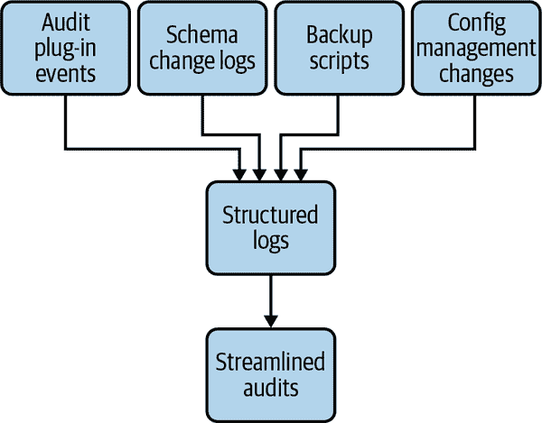

# 第十三章：与 MySQL 合规

数据库工程团队的角色引起了许多内部业务利益相关者的关注。正如我们已经介绍的，您不仅需要为性能和正常运行计划，还需要考虑基础设施成本、灾难恢复以及各种合规需求。

您的工作不仅限于在业务运行时管理这些数据。您还需要帮助企业保护数据并为法律要求或对业务至关重要的监管认证进行认证。您必须了解实现这些需求的业务目标，并将这些要求包含在所有数据架构设计中，包括如何自动化运营任务、管理访问权限以及将管理任务转换为自动化任务的代码。

本章涵盖了企业可能追求的不同类型的合规认证以及各种特定于数据库的关注点。我们帮助解释如何为不同的合规需求设计，并讨论访问日志记录如何成为填补合规要求的关键部分。最后，我们涵盖了数据主权作为各类企业数据架构实践中新兴关注点。

###### 警告

本章不旨在为您提供法律建议。我们旨在帮助您在运行大量数据库时管理合规需求，以及如何从早期开始设计合规。在寻求如何正确履行特定控制的建议时，您应始终与公司的法律团队咨询。

# 什么是合规？

治理、风险管理和合规（GRC）是指导企业如何评估和优先考虑其资产风险以及如何遵守管理其产品所使用的个人或健康数据处理和传输的法律的原则、流程和法律。早期初创企业通常不具备许多合规需求，因为他们在找到产品市场契合度时。然而，随着业务的发展，您将开始遇到许多法规。有些法规需要适用于企业所有数据，而有些可以适用于特定部分。

在合规背景下经常使用的一个术语是*控制*。控制是公司内部定义和实践的过程和规则，旨在减少不希望的风险结果的机会。

让我们介绍一些您应该了解的合规法规。稍后，我们将介绍可以帮助更轻松满足这些各种要求的架构变更。

## 服务组织控制第 2 型

[服务组织控制第 2 型（SOC 2）](https://oreil.ly/PwWBg)是一组合规控制，服务组织可以用来报告与安全、可用性、处理完整性、机密性和隐私相关的实践。寻求获得 SOC 2 认证的组织中的数据库工程师需要建立良好的数据库变更管理、备份和恢复程序以及管理数据库实例访问权限的实践。

## 萨班斯-奥克斯法案

[2002 年萨班斯-奥克斯法案（SOX）](https://oreil.ly/qHAN0)是一项所有成为上市公司的公司都必须遵守的法案。它旨在通过提高根据证券法规定向投资者披露的公司披露的准确性和可靠性来保护投资者，并为其他目的。对于一个工程组织，SOX 职责要求证明包含影响收入的数据的数据库只能被有需要的人访问，并且对这些数据的任何更改都已记录，并且更改有记录的原因。

如果您是一家上市公司，SOX 控制 404 是一个您必须熟悉并履行的法律要求的控制。它旨在通过证据保证公司报告的财务状况得到数据访问和变更管理实践的支持，这些实践准确地将提供的服务归因于收取的收入，并为对此类数据的任何更改提供审计跟踪。

## 付款卡行业数据安全标准

[付款卡行业数据安全标准（PCI DSS）](https://oreil.ly/V6GBh)是所有处理信用卡数据的金融机构必须遵守的标准。其目的是保护持卡人数据，防止泄露并用于欺诈交易。

作为数据库工程师，当涉及到 PCI-DSS 控制时，一个重要的方面是管理对持卡人数据的访问。这意味着您需要在架构中考虑该控制，以确保卡数据得到单独管理。我们将在本章后面讨论如何实现这一点，当我们讨论角色分离时。

## 健康保险可携带性和责任法案

1996 年的[健康保险可携带性和责任法案（HIPAA）](https://oreil.ly/fKeQd)是一项旨在保护个人健康相关数据隐私的美国法规，当这些数据由医疗提供者、医疗计划或其业务伙伴收集和处理时适用。该法律适用于被定义为电子个人健康信息（ePHI）的数据。提供需要符合 HIPAA 合规性的产品的组织将需要他们的数据库工程师实施控制措施，如 ePHI 的访问控制、所有 ePHI 的加密以及每当访问 ePHI 时进行活动记录。

## 联邦风险和授权管理计划

对于在美国运营并希望与美国政府实体开展业务的公司，[联邦风险和授权管理计划（FedRAMP）](https://oreil.ly/ZVQqq)是联邦政府提供的认证，使企业有资格成为联邦实体的云服务提供商。这是一系列要求的标准，使得符合条件的企业有资格接待联邦实体作为客户。这些标准包括配置管理、访问控制、安全评估以及对数据访问和更改的审计。

## 通用数据保护条例

《通用数据保护条例》（GDPR）是欧盟于 2016 年颁布的一项法规，旨在规范个人可识别信息在欧盟人员中的存储和管理方式，无论数据处理实体的总部在何处。它引入了管理数据隐私的第一步，例如在收集私人数据之前要求同意、设定跨处理器组织对该私人数据的访问限制，并为个人提供法律途径，要求任何可能通过其在线活动收集其数据的数据处理器的系统中清除其数据。这被称为个人的“被遗忘权”。

## 施雷姆斯 II

2020 年，欧盟与 Facebook 的爱尔兰实体之间的案件由欧盟司法法院裁定。这一裁决，通常被称为[*施雷姆斯 II*](https://oreil.ly/4wqAm)，对所有在欧盟运营并收集欧盟人数据的美国公司产生了广泛影响。

[隐私盾](https://oreil.ly/I9lPC)是美国公司多年来在欧盟运营的法律基础。施雷姆斯裁决宣布，当美国公司实体在欧盟收集欧盟人的数据时，隐私盾不足以保护欧盟人的隐私。在取消的核心是欧盟司法法院裁定，隐私盾不足以保证欧盟人不会通过美国法律手段（即使用 1978 年《外国情报监视法案》提供的机制，或 FISA）被美国政府监视，因此，由美国实体收集的欧盟人的个人可识别数据必须留在欧盟，不得跨越到美国资产或被美国人访问。

与 GDPR 最初版本相比，该裁决使得数据架构的推理变得更加复杂。由于这项裁决是最近才做出的，执法仍然是一个未知的数量。这种情况让每家企业决定其收集和处理的数据有多少在范围内，以及以何种方式。可以肯定的是，如果您有当前或未来的欧洲客户，Schrems II 将会针对您运行的应用程序和数据基础设施。

# 为合规控制构建

正如您所看到的，企业的法规合规世界，以及由此产生的企业用于运营的数据，是庞大的，控制措施可能因每项法律的目标或您的企业所需的认证而有所不同。好消息是，同样的工作可以涵盖多个控制措施，从而实现效率和更一致的实践，管理基础设施时。然而，您需要了解哪些控制措施对业务是必需的，以及出于何种目的。一旦您的公司发展到需要开始实施这些法规合规控制的规模，您将成为向不同类型的审计员提供合规证据的人。了解每项控制措施的目的将有助于提供正确类型的证据，使��计更加容易。

###### 提示

为合规性构建是一个持续的过程，不能在需要时轻松“添加”。本章中提出的许多架构建议（角色分离、跟踪变更等）是您在公司过了“仍在寻找市场适应性”阶段后应该考虑和倡导的事项。这些实践将使您的业务在合规性真正成为一个需求而不仅仅是“好有的”时，为成功打下基础。

## 机密管理

在讨论如何管理机密之前，让我们首先明确您基础设施中可能属于该定义的事物：

+   应用程序与数据库交互的密码字符串

+   供支持人员/运营人员管理数据库实例的密码字符串

+   可以访问/修改数据的 API 令牌

+   SSH 私钥

+   证书密钥

您组织中需要的一个核心能力是以安全和独立的方式管理机密，而不是与配置管理混为一谈。您需要一种交付和轮换敏感数据（如数据库访问凭据）的方式，无论是供应用程序还是团队使用，用于报告目的。

如果您在云环境中运行应用程序和数据库，我们强烈建议您在考虑构建自己的解决方案之前，先了解该云服务提供商的首选机密管理解决方案。您需要的是至少提供符合国家标准与技术研究所（NIST）标准可接受级别的加密，因为这是许多法规（包括 HIPAA 和 FedRAMP）所要求的。

如果您的云服务提供商没有一个可接受的机密管理解决方案，您可能需要自行托管。这可能是您的组织的一项新尝试，需要比本书所涵盖的更广泛的努力。

无论您使用托管解决方案还是最终需要自行运行，都要意识到这种机密管理解决方案给您的架构带来的复杂性。这种解决方案的目标是管理机密，而不是成为产品的单点故障。提前与您的法律团队和安全组织明确讨论解决方案可用时会发生什么的权衡将会很有帮助。关于缓存哪些机密以及以何种方式缓存的明确对话将有助于避免后期期望不一致。

通常，公司在早期发展阶段基于便利性做出的决定需要在计划合规控制之前进行调整。您应该准备向领导层解释为什么在改善安全姿势和降低风险的背景下这项工作很重要。

### 不要共享用户

不要跨服务共享数据库凭据。如果您的数据库意外泄漏，现在必须评估应用程序堆栈和流程中有多少部分需要获取新的数据库凭据对，这种决策的效果将成倍增长。作为数据库工程师，加入一家初创公司是很常见的，人们通常会采取看似方便的捷径，“所有代码都使用相同的对来访问数据库。” 相信我们：这是一种非常昂贵的捷径，如果您限制每个数据库用户的访问权限仅限于其所需的服务，您的未来自己会感谢您。

现在我们已经介绍了这个基本但至关重要的基本实践，让我们谈谈在选择存储数据库凭据或秘密的解决方案时需要考虑的事项。

### 不要在代码存储库中检查生产数据库凭据

这可能看起来很明显，但我们在许多大大小小公司的安全事件报告中仍然看到这种情况发生。保持谦卑的心态很重要，不要假设这种错误在您的组织中不太可能发生。信任但验证的方法将在很大程度上有助于防止未来的痛苦。在合并拉取请求之前扫描代码存储库中的潜在秘密字符串是一种常见做法（也是像 GitHub 这样的托管存储库服务可以为您执行的操作）。如果您的组织尚未考虑这一点，您可能需要成为这种需求的倡导者。请记住，合规性和安全性对整个组织都是必需的，尽管并非所有事情都可以或应该由数据库团队完成，但您是整个工程组织讨论这些优先事项的利益相关者之一。

这些实践对于正确开始合规性和安全姿势至关重要。它们将使我们在使用秘密管理时即将涵盖的一些操作变得更加简单，并且在有必要进行紧急更改时将进一步降低业务风险。

让我们谈谈在选择秘密管理解决方案时的权衡。

### 选择一个秘密管理解决方案

选择一个秘密管理解决方案将取决于您运行的环境以及最容易与数据库和应用程序堆栈集成的内容。在方便性和满足所有需求之间总会存在权衡。因此，您需要明确向所有利益相关者（其中一些不是工程师）说明限制是什么，可用性或弹性的权衡是什么。在检查您的云（或私有）基础设施可以提供的内容时，您应考虑以下一些权衡：

空间限制

许多由云提供的秘密管理解决方案对秘密的*长度*做出了假设，这可能会导致意外惊喜，如果您想存储比数据库用户和密码对更长的内容。如果您的合规控制要求将更长的文本字符串（例如 SSH 密钥或 SSL 的私有证书）也视为秘密，您应该查看您可以在给定密钥上存储的最大大小。一些组织后来会遇到的雷区之一是，随着秘密足迹的增长，需要一个新的不同的秘密管理解决方案来容纳更长的秘密。现在他们必须处理迁移（可能会影响正常运行时间）或管理工具和与两个单独的秘密解决方案集成的复杂性。

秘密轮换

如果你在公共云中运行并且可以使用他们提供的托管密钥管理解决方案，那么对你来说有个好消息：截至目前，所有三个主要的云服务提供商都提供了一些自动化轮换密钥的方法，以及版本控制，使得服务过渡到新密钥对你的服务更加无缝。然而，如果你选择的密钥管理解决方案不支持轮换密钥，那么你需要计划如何进行这项工作，无论是作为计划更改（例如，你可能有一个要求数据库凭据定期轮换的控制）还是作为紧急变更（例如，有人意外地在公共存储库中检查了数据库密码）。如何在不影响正在运行的应用程序的情况下进行这项工作？这在很大程度上取决于你如何向正在运行的应用程序传递配置更改以及你的部署流水线的运作方式。这是如何编排的一般想法。这个变更是一个部署。即使你的应用程序将数据库凭据作为配置行访问，你仍然需要将这个配置更改传播到你的所有设备，并通常还需要编排一个重新启动，而不影响整个服务的可用性。

区域可用性

要考虑你的密钥管理解决方案不仅用于存储密钥，还用于传递密钥。如果你要避免像在代码中存储密钥这样的已知不良做法，你需要让你的应用程序能够在运行时检索它需要处理请求的密钥。这意味着你现在必须考虑如何检索这些密钥，如果你的应用程序无法访问密钥管理服务会发生什么，以及这种新依赖引入了什么故障模式。如果你负责需要在许多地理区域运行的应用程序，你的密钥管理解决方案的区域能力就成为另一个需要考虑的因素。你的云提供商的解决方案是否会自动将密钥复制到其他区域？还是你必须构建这种能力？

## 角色和数据的分离

这些监管法律的一个重要目标是根据数据泄露的风险将数据分开，无论是对企业还是对其客户。这就是*最小权限*的概念，无论是对人类访问还是对应用程序代码访问。这种分离允许根据数据内容和相关风险进行更合适的控制和变更跟踪。

### 为合规性原因进行分片

可能会迫使特定数据集分开到专用集群的一个因素是具有非常不同控制要求的不同合规性要求。比如说，你是一个市场传播提供商，正在创建一个侧重于医疗技术的新产品。目前正在使用的数据与健康无关，并且不受多项法律要求约束。一旦企业进入健康技术领域，你现在就有了一部分客户及其数据，你的公司承担了作为个人健康信息（PHI）处理者的法律责任。在这种情况下，最好从一开始就在专用数据存储中开发新产品，这样你就可以更适当地应用 HIPAA 合规性控制，而不会给现有数据集及其依赖的应用程序增加不必要的负担。

### 分开数据库用户

随着您的产品变得更加复杂，支持其的技术堆栈也随之增长，您将开始拥有多个具有数据访问权限的应用程序。在组织早期就开始良好控制数据访问权限非常重要，不要在多个代码库之间共享相同的数据库访问凭据。安全事件和凭据意外泄露是发生在各种公司的事件，无论规模大小，当这些事件发生时，您将受益于泄露的秘密影响已知且隔离的业务操作范围，因为您在匆忙更换该秘密时。

## 变更跟踪

许多合规法规都涉及跟踪变更的控制：影响财务报告的数据子集的变更，生成发票的系统的变更，以及这些变更如何被审查、测试和跟踪。这种合规控制首次显而易见的地方之一是数据库。随着您为扩大合规责任的业务工作，像“如何审查、应用和跟踪生产中的模式更改”这样的流程需要比简单地“工程师登录生产源节点并进行更改”更严格和更有计划。如果您通过与内部审计团队或合规团队一起规划如何处理审计来做好准备，这将减轻很多负担。

这里的目标是避免年度审计成为一个重大干扰事件，团队在为审计团队收集证据而忙碌。相反，如果您对这些正常业务操作的工作方式进行一些更改，您可以获得“内置”证据，这样收集和用于审计的证据就会简单得多。您将在本节中看到一个关于从所有方面生成结构化日志的重复主题。这是有意的。这在很大程度上有助于以相同方式跟踪各种变更，这种一致性有助于企业以更少的干扰实现其审计需求。您可以看到这一切是如何在图 13-1 中结合在一起的。



###### 图 13-1。不同操作任务的示例，所有任务都将结构化日志发送到一个地方，使审计更容易

让我们看看数据库系统的不同变更类型以及如何为其自动化合规跟踪。

### 数据访问日志记录

许多合规控制要求您保留��特定数据集的更改或访问的日志。这可以用于跟踪财务数据的更改，也可以用于 PCI 或 HIPAA 等法规，其中数据足够敏感，所有访问都需要被跟踪。

您可以直接在数据库级别解决这个需求，通过利用[Percona 的审计日志插件](https://oreil.ly/0SJa0)（如果您使用 Percona 的分支）或等效的[MySQL 企业审计插件](https://oreil.ly/2tanA)（如果您使用 MySQL 社区服务器）。这样做的好处是，现在您可以在数据更改之前的最后一跳跟踪变更，特别是如果您处于一个数据库可以通过多个路径进行更改的环境中。

#### 跟踪变更的不良选项

您可能会问，“为什么不使用触发器跟踪我关心的表的任何更改？”这绝对是我们过去看到的一种方法，但不建议。以下是我们不建议使用触发器的一些原因：

+   已知触发器会对写入性能造成影响，这将在最糟糕的时候影响您。

+   触发器相当于将业务逻辑存储在数据库中，这是不推荐的。

+   将代码存储在数据库中可能会绕过对该代码进行测试、分期和部署的任何流程。在事件期间，触发器可能会成为您的团队的意外惊喜。

+   触发器只能支持跟踪写入操作。如果需要，它无法扩展到跟踪读取访问。

让我们看看如何使用 Percona 审计日志插件以及如何调整它。

#### 安装和调整 Percona 审计日志

Percona 的审计日志插件作为 Percona 的 MySQL 分支的一部分提供，但默认情况下未安装或启用。您可以通过在任何新实例的引导过程中运行以下命令来安装它：

```sql
INSTALL PLUGIN audit_log SONAME 'audit_log.so';
SHOW PLUGINS;
```

第二个命令列出正在运行的插件，并应确认审计日志插件实际上现在作为服务器进程的一部分在运行。除了启用它，您还需要确定如何摄取其输出。这就是真正的计划发生的地方。

Percona 的审计日志插件允许您定义需要跟踪的语句动词。这允许灵活地满足各种控制要求，而不会在审计日志中产生大量与您关心的内容无关的噪音。确保您查阅其文档以正确配置该变量。

插件的一个灵活优势是您可以安装它，但实际上不监视查询。这在您仍在研究如何摄取其输出并需要在不影响正常运行的情况下关闭和打开它时非常有用。但是，这种灵活性也带来了复杂性。除了管理审计日志插件附带的配置变量之外，您还需要监视它是否始终运行。如果这对业务来说是一个关键功能，那么值得监控。由于插件可以在不重新启动服务器的情况下禁用，您需要更多的方式来确认它是否正在执行所需的操作，而不仅仅是检查磁盘上的*my.cnf*文件以确认它是否正在执行所需的操作。您最好使用 shell 查询来解析插件的当前状态，并确认它是否实际上正在监视查询。以下是两个示例单行查询来检查这两个方面：

```sql
# Single liner to check that the audit log plugin is active
$ mysql -e "show plugins" | grep -w audit_log | grep -iw active

# Single liner to check that the plugin policy is actually monitoring queries
$ mysqladmin variables | grep -w audit_log_policy | grep -iw queries
```

这些示例假定您只想监视查询。如果您还希望使用插件来跟踪登录，您需要编辑检查。

#### 摄取和使用审计插件日志

正如您所见，审计日志插件具有很大的灵活性，但它也只为您生成审计事件。您需要确定最佳方法来摄取这些日志，将它们放在一个可以轻松搜索和分析的地方，并合理地发现其中的异常，而不至于成为一个重大负担。插件可以简单地将输出转储到本地文件，但这可能会增加通过这些日志填满数据库主机磁盘而导致故障的风险。

更复杂的选项是使用插件将其输出发送到`rsyslog`，这是一个常见的 Unix 日志管理实用程序，然后使用`rsyslog`将所有这些事件转发到您组织选择的结构化日志平台。这个选项很吸引人，因为它将这些数据带入到您的组织已经进行结构化日志存储的地方，这降低了数据库团队之外的利益相关者查看、搜索和分析这些事件的门槛。请记住，使用`rsyslog`以这种方式进行日志转发将要求您熟悉它的工作原理。确保您决定并以有意义的方式记录`rsyslog`如何配置这个数据流。可能有许多`rsyslog`的默认配置对您期望的结果没有帮助，您需要尽职调查找出这些配置并相应地更改它们。

###### 警告

确保记录审计日志插件输出的存储方式，即使是临时存储在数据库主机上。如��这些文件的传送方式变慢，插件中缓冲事件的影响可能会影响数据库服务器本身的性能。这种故障状态很难调试，因为它的唯一症状是查询执行变慢。考虑以弹性为主的整个这些日志管道的混沌测试计划。

Percona 审计日志插件是一个强大的工具，可以帮助您满足许多合规性控制要求。根据我们的经验，它比使用触发器更高效，并且与配置管理和结构化日志记录软件很好地集成，从而形成一个对多个利益相关方团队有效的解决方案。

### 模式更改的版本控制

第六章介绍了不同的策略和工具，有助于规模化运行模式更改。让我们谈谈这些策略所支持的合规性问题。

使用版本控制来跟踪和运行模式更改，内置跟踪请求更改的人员、审查和批准的人员以及在生产中的运行情况。这也是使用每个数据库集群单独存储库的一个很好的理由。随着公司中数据库的增长，您会发现并非所有数据库都是平等的。有些需要更严格的合规性（例如，保存财务数据的数据库），而有些则用于不太关键的产品实验。在进行审计时，为每个数据集和集群提供更改记录将是一个巨大的便利。

基于合规需求的数据和集群模式管理的分离还使得更容易控制谁可以提交或批准您选择的版本控制管理中的模式更改。在进行业务审计时，通常需要证明谁可以对数据库进行更改。拥有一个较小的人员操作圈 *可以* 对这些数据进行更改，符合最小权限安全原则。

### 数据库用户管理

对数据库的更改不仅限于模式更改。您还需要以可跟踪和可重复的方式管理数据库用户及其细粒度权限。让我们看看如何满足一些常见的合规性控制，以解决数据库访问控制问题。

#### 使用配置管理

使数据库用户跟踪合规的一个简单方法是利用与使数据库配置更改合规的相同流程。您可以在配置管理存储库中管理所有内容，并使用源代码控制、拉取请求流程和同行审查来提供证据，证明对数据库用户的所有更改都是以可审计和可跟踪的方式完成的。

#### 计划凭证轮换

无论是因为未经计划的安全事件还是因为您有一个需要按计划轮换凭证的控制，您都需要制定一个计划，以便在不影响应用程序正常运行时间的情况下轮换数据库用户。这可能意味着更改应用程序使用的用户名和密码字符串。如果您尚未运行最新且最好的主要版本以支持双密码，请按照以下步骤在生产中旋转数据库凭证，而不会影响服务正常运行时间：

1.  首先在数据库中引入一个新的用户名/密码对。

1.  测试新凭证是否具有与旧凭证相同的访问权限。理想情况下，您应该自动执行此操作，作为部署新凭证的一部分，通过比较`SHOW GRANTS`并确认权限是否相同。

1.  创建一个应用程序部署，替换应用程序配置中的凭证。

1.  重新启动此服务的所有实例，以确保新对正在使用。

1.  删除旧的用户名和密码对。

无论更改是例行还是紧急的（因为凭证泄漏或安全风险），此过程应该是相同的。由于后者不是您可以控制或完全防止发生的事件，最好将此过程自动化，或至少在运行手册中进行充分记录，并定期执行，以便在发生意外情况时，团队不会感到恐慌。

###### 提示

在 MySQL 中旋转数据库用户密码曾经是一个复杂的协调工作，需要在不影响可用性的情况下完成。MySQL 8.0.14 引入了双密码支持，结合密码过期策略支持，使得在操作上更容易做正确的事情。

#### 停用不再使用的数据库用户

任何未使用的数据库用户仍然在您的实例上活跃是一个您不需要的安全风险。定期审计您实例上活跃的数据库用户，与您的应用程序配置进行比较，并删除任何未被任何应用程序活跃使用的用户是很重要的。

当为您的公司满足合规需求时，您会发现许多合规控制要求组织跟踪对某些资产的任何和所有更改。这些控制在报告中很典型，比如我们在本章前面描述的 SOC 2，其中主要关注的是提供数据完整性和安全性的证据。

有几种方法可以找出一个定义的数据库用户是否正在使用。我们在第三章中广泛介绍了 Performance Schema 作为检查服务器性能的一种方式。在 Performance Schema 中有一个 `users` 表，存储了连接到服务器的用户的历史信息。这种历史跟踪可以追溯到服务器进程的生命周期或此表允许的最大大小，以先到者为准。由于该表跟踪已连接的用户，而不是未连接的用户，您需要循环遍历已知用户，并查看是否有任何用户不出现在此表中，作为他们可能不再使用的信号。

这是一个启用 Performance Schema 中该工具的查询：

```sql
mysql> UPDATE performance_schema.setup_instruments
    -> SET ENABLED=‘YES’ WHERE NAME='memory/sql/user_conn';
Query OK, 1 rows affected (0.00 sec)
Rows matched: 1 Changed: 1 Warnings: 0
```

一旦您启用了这个功能，查找此信息的表是 `perform​ance_​schema.users`。

如果您为合规控制使用审计日志解决方案，比如我们之前提到的 Percona 插件，您可以使用这些日志来确定用户是否在给定的几周内连接到实例。

无论您如何确定这一点，建议设置一个政策，“在六个月的不活跃后，将删除未连接的数据库用户。” 这是一个有助于防止不需要的访问权限并且现在是一个风险的做法。

您帮助管理的数据库将受到需要这种谨慎程度的控制范围。随着您的公司不断发展并开始考虑更加合规，您需要有一个故事来展示在将数据库更改应用之前如何审查和跟踪生产数据库的变化。合规控制还将关注的另一件事是证明您在发生灾难事件时恢复数据和服务的能力。为此，我们需要转向备份和恢复，看看它们如何适用。

## 备份和恢复程序

第十章涵盖了不同类型的备份。备份显然很重要。它们在事件中可以极大地帮助，同时也是许多合规控制的关键部分。在大多数 SOC 2 实施中，您将有关于创建和测试备份的控制（但无论如何，您应该测试您的备份）。随着您管理的数据库集群数量增加，您很快会发现无法继续手动执行备份和备份测试等流程，甚至无法通过手动阅读日志文件报告成功和失败。

在评估出于合规原因如何管理备份时，您需要满足一些要求：

+   您需要自动化备份过程。

+   如果备份失败，您需要备份过程提醒您。

+   您需要自动化备份测试。

+   备份测试失败也应该是您可以在某处跟踪的事件。

接下来我们讨论如何安排备份和备份测试。

### 运行自动备份和备份测试

为了满足这些要求，��需要一个机制，不仅仅运行计划任务（例如 Linux 系统中的*crond*），而且可以按计划运行，并且还具有向您的监控系统和工单系统发送事件的能力，以便在失败时发出警报并为以后的审计跟踪失败。您可以通过将备份和备份测试作为监控检查运行来做到这一点，⁴但是备份可能需要一段时间才能运行，特别是如果您有一些以 TB 为单位的数据库实例。只要监控系统可以处理运行时间远远超过几秒的典型时间的检查，将备份作为监控项目运行就可以工作。因此，请确保运行监控系统的团队意识到这种用例。

如果您的监控系统无法处理这种用例，那么请确保您有一些方法留下“踪迹”以跟踪备份已经发生并成功完成，以及备份测试已经发生并成功完成。这样的踪迹可以是一个文件，其中包含备份或备份测试运行结束时您的备份过程编辑的时间戳，作为任务发生并完成的证据。一旦放置了这个踪迹，您可以使用监控系统进行更快速的检查，以确保踪迹存在。

在所有这些策略中，您想要拥有的，以及您的 SOC 2 控制要求的，是备份成功完成的记录以及任何失败的备份的记录，显示它们已转化为正确跟踪的工作项。

### 备份和备份测试的集中日志

您可能还会被要求展示日志，证明备份和备份测试过程成功完成。您最好准备好这样的审计项目，通过使用可以将日志发送到以保持连续性的集中日志解决方案。请记住，我们为这些业务需求构建的解决方案应该假设服务器易于且可重复替换，而不是定制的。因此，如果您在下一次审计之前退休该机器并替换它，那么随机实例上的本地日志文件并不理想。您希望任何与业务相关的资产，例如备份过程的日志，都位于任何具有正确访问策略的人都可以访问的集中位置。

### 通过备份进行灾难恢复规划

作为 SOC 2 的一部分，还需要进行适当的灾难恢复规划。这意味着您需要证明您测试系统生成的任何备份，您需要跟踪这些测试失败的时间以及失败已经被纠正，并且最好您需要知道数据灾难恢复需要多长时间。这最后一部分需要跟踪备份测试需要多长时间的指标。第二章提到数据库实例大小作为确定备份恢复是否在预期时间内变得过大的度量标准。使这成为一个自我改进的循环的方法是使您的备份和测试备份的脚本也发送每个任务需要多长时间的指标。这样，您就可以获得每个数据库集群备份需要多长时间以及恢复和测试这些备份需要多长时间的指标。现在您有了一种跟踪任何给定数据集是否变得过大以至于超出业务对 MTTR 的期望的方法。如果是这样，那么您有数据要么优先处理将数据集分割到可接受大小，要么重新审视业务的恢复 SLA。

关于备份的一个重要最终注意事项：您的安全利益相关者需要访问实时数据库和备份以进行控制。确保您在您喜爱的云服务提供商中的备份设置不会默认为备份存储桶的宽松访问控制。许多安全漏洞并非通过侵入实时基础设施发生，而是通过从某个存储桶泄漏的备份发生。

# 摘要

合规性是一个广泛的政策和控制世界，以及对每个解释的影响。它不仅影响您在业务中运行数据库的方式，还影响法律、财务和 IT 部门，甚至影响您如何部署软件更改。本章重点介绍了每种常见类型的合规性法规如何特别影响您作为数据库工程师的职责。然后我们涵盖了这些法规可能受到影响的不同实践和架构决策，您也需要考虑这些。

广义上说，摆脱与控制相关的噩梦的最佳方法是提前计划。分离应用程序用户，制定凭据轮换策略，并确保密码始终以加密方式存储——绝不是明文。确保在需要开始记录对数据库的访问之前，你有一个可信赖的日志记录管道。最后，你希望对模式更改进行控制和记录。

本章的目标不是让你一次性考虑整个基础架构中所有这些控制措施，而是让为每项法规规定的范围提供证据的任务更容易，并尽可能自动化或简化组合。最终，这些控制措施旨在保护企业和客户的隐私。对每项控制措施的目标有清晰的理解将使您和您的团队在公司发展并进入更广泛市场时更容易管理这一重要任务。

¹ 欲了解更多关于这些标准的信息，请与您友好的信息安全团队交谈，或者从 O’Reilly 获取[*NIST 网络安全框架*](https://oreil.ly/s7XOJ)口袋指南。

² 有关此内容，请参阅[插件文档](https://oreil.ly/gwqc2)。

³ 作为一个开始，这里有一个关于[“可靠日志转发”](https://oreil.ly/76e9K)的整个页面。

⁴ 在博客文章[“使用 Sensu 进行 DBA 任务”](https://oreil.ly/Meunp)中，您可以看到一些将备份任务纳入数据库监控解决方案的示例。
