# 第一章：安装 MySQL

让我们通过安装 MySQL 并首次访问它开始我们的学习之旅。

请注意，我们在本书中并不依赖于单一版本的 MySQL。相反，我们从我们在现实世界中对 MySQL 的集体知识中汲取。本书的核心集中在 Linux 操作系统（主要是 Ubuntu/Debian 和 CentOS/RHEL 或其衍生版）和 MySQL 5.7 以及 MySQL 8.0 上，因为我们认为这些是适合生产工作负载的“当前”版本。MySQL 5.7 和 8.0 系列仍在开发中，这意味着将继续发布具有错误修复和新功能的新版本。

随着 MySQL 成为[最受欢迎的](https://oreil.ly/pPG4q)开源数据库（排名第一的 Oracle 并非开源），对快速安装过程的需求也在增加。您可以把从头安装 MySQL 想象成烘焙蛋糕：源代码就是配方。但即使有了源代码，构建软件的配方也不容易跟随。编译需要时间，并且通常需要安装额外的开发库，这会使生产环境面临风险。假设你想要一个巧克力蛋糕；即使你有自己制作的说明，你可能不想把厨房弄乱，或者没有时间亲自烘焙，所以你去面包店买了一个。对于 MySQL，当您希望它在不需要编译的情况下即可使用时，您可以使用*分发包*。

MySQL 的分发包适用于各种平台，包括 Linux 发行版、Windows 和 macOS。这些包提供了一个灵活和快速的开始使用 MySQL 的方式。回到巧克力蛋糕的例子，假设你想改变一些东西。也许你想要一个白巧克力蛋糕。对于 MySQL，我们有所谓的分支，其中包括一些不同的选项。我们将在下一节中看看其中几个。

# MySQL 分支

在软件工程中，*分支*发生在某人复制源代码并开始独立开发和支持的路径时。分支可以沿着接近原始版本的轨道进行，就像 Percona 分发的 MySQL 一样，也可以像 MariaDB 一样偏离。由于 MySQL 源代码是开放和免费的，新项目可以在不需要原始创建者许可的情况下分叉代码。让我们来看看一些最显著的分支。

## MySQL 社区版

MySQL 社区版，也称为 MySQL 的*上游*或*原版*版本，是由 Oracle 分发的开源版本。这个版本推动了 InnoDB 引擎和新功能的开发，并且是第一个接收更新、新功能和错误修复的版本。

## Percona MySQL 服务器

Percona 的 MySQL 发行版是 MySQL 社区版的免费开源替代品。其开发密切跟随该版本，专注于提高性能和整体 MySQL 生态系统。Percona Server 还包括额外的增强功能，如 MyRocks 引擎、审计日志插件和 PAM 认证插件。Percona 由[Peter Zaitsev](https://oreil.ly/MfiKb)和[Vadim Tkachenko](https://oreil.ly/283nR)共同创立。

## MariaDB 服务器

由[Michael “Monty” Widenius](https://oreil.ly/PRoMh)创建并由 MariaDB 基金会分发，MariaDB 服务器迄今为止是最远离原始 MySQL 的分支。近年来，它开发了新功能和引擎，如 MariaDB ColumnStore，并且是第一个集成 Galera 4 集群功能的数据库。

## MySQL 企业版

MySQL 企业版目前是唯一具有商业许可证的版本（这意味着您需要付费使用，类似于 Windows 许可证）。由 Oracle 公司分发，它包含了社区版的所有功能，以及专为安全性、备份和高可用性而设的独家功能。

# 安装选择和平台

首先，您必须选择与您操作系统（OS）兼容的 MySQL 版本。您可以通过[MySQL 网站](https://oreil.ly/DTRSR)验证兼容性。同样的支持政策也适用于[Percona Server](https://oreil.ly/1ahne)和[MariaDB](https://oreil.ly/7SYE4)。

我们经常听到这样的问题：能否在不支持的操作系统上安装 MySQL？大多数情况下，答案是可以的。例如，可以在 Windows 7 上安装 MySQL，但碰到错误或面临不可预测的行为（如内存泄漏或性能不佳）的风险较高。由于这些风险，我们不建议在生产环境中这样做。

下一步是决定是否安装*开发*版或*稳定可用*（GA）版。开发版拥有最新功能，但我们不建议在生产环境中使用，因为它们不稳定。GA 版，也称为*生产*或*稳定*版，适用于生产环境使用。

###### 提示

我们强烈建议使用最新的 GA 版，因为它包含了最新的稳定性修复和性能优化。

最后要决定的是安装操作系统的分发格式。对于大多数用例，二进制分发是最合适的。二进制分发在许多平台上都有本地格式，例如 Linux 的*.rpm*包或 macOS 的*.dmg*包。分发还以通用格式提供，如*.zip*归档或压缩的*.tar*文件（tarballs）。在 Windows 上，您可以使用 MySQL 安装程序安装二进制分发。

###### 警告

注意版本是否为 32 位或 64 位。一般原则是选择 64 位版本。除非您使用古老的操作系统，否则不应选择 32 位版本。这是因为 32 位处理器只能处理有限量的 RAM（4GB 或更少），而 64 位处理器能够处理更多内存。

安装过程包括四个主要步骤，如下部分所述。正确遵循这些步骤并设置 MySQL 数据库的最低安全要求至关重要。

## 1\. 下载要安装的分发版

每个发行版都有其所有者，因此也有其来源。一些 Linux 发行版在其仓库中提供默认软件包。例如，在 CentOS 8 上，MySQL 原始发行版可从默认仓库获取。当操作系统有默认软件包可用时，无需从网站下载 MySQL 或自行配置仓库，这简化了安装过程。

我们将展示如何在安装过程中无需访问网站即可安装仓库并下载文件。但是，如果您确实想自行下载 MySQL，可以使用以下链接：

+   [MySQL 社区服务器](https://oreil.ly/sBR5i)

+   [Percona MySQL 服务器](https://oreil.ly/R9oO4)

+   [MariaDB 服务器](https://oreil.ly/a78XW)

## 2\. 安装分发版

安装包括使 MySQL 功能正常并将其联机的基本步骤，但不包括安全设置。例如，在此时，MySQL 的 root 用户可以无需密码连接，这非常危险，因为 root 用户具有执行所有操作的特权，包括删除数据库。

## 3\. 执行任何必要的安装后设置

此步骤涉及确保 MySQL 服务器正常工作。确保服务器安全非常重要，首先要执行*mysql_secure_installation*脚本。您将更改 root 用户的密码，禁用远程服务器对 root 用户的访问，并删除测试数据库。

## 4\. 运行基准测试

一些数据库管理员为每个部署运行基准测试，以测量其性能是否适合他们正在使用的项目。这项工作的最常见工具是[`sysbench`](https://oreil.ly/ioyXF)。这里需要强调的是，`sysbench`执行的是*合成工作负载*，而在应用程序运行时，我们称其为*真实工作负载*。合成工作负载通常提供关于最大服务器性能的报告，但无法复制真实世界的工作负载（其中包括固有的锁定、不同的查询执行时间、存储过程、触发器等）。

在接下来的部分中，我们将详细介绍几个常用平台的安装过程细节。

# 在 Linux 上安装 MySQL

Linux 生态系统多样化，有许多变体，包括 Red Hat Enterprise Linux（RHEL）、CentOS、Ubuntu、Debian 等。本节仅关注最流行的几种——否则，本书将完全围绕安装过程展开！

## 在 CentOS 7 上安装 MySQL

*CentOS*，即社区企业 Linux 操作系统，成立于 2004 年，Red Hat 在 2014 年收购了它。CentOS 是 Red Hat 的社区版本，它们几乎相同，但 CentOS 是免费的，支持来自社区而不是 Red Hat 本身。CentOS 7 于 2014 年发布，其终止生命周期日期为 2024 年。

### 安装 MySQL 8.0

要使用*yum*仓库在 CentOS 7 上安装 MySQL 8.0，请完成以下步骤。

#### 登录到 Linux 服务器

出于安全原因，通常用户作为非特权用户登录 Linux 服务器。以下是一个用户在 macOS 终端使用私钥登录 Linux 的示例：

```
$ ssh -i key.pem centos@3.227.11.227
```

成功连接后，您将在终端中看到如下内容：

```
[centos@ip-172-30-150-91 ~]$
```

#### 在 Linux 中成为 root 用户

一旦连接到服务器，您需要成为 root 用户：

```
$ sudo su - root
```

接下来，您将在终端中看到如下提示：

```
[root@ip-172-30-150-91 ~]#
```

成为 root 用户非常重要，因为要安装 MySQL，必须执行诸如在 Linux 中创建 MySQL 用户、配置目录和设置权限等任务。对于我们将展示的所有示例，都应由 root 用户执行`sudo`命令。然而，如果您忘记使用`sudo`前缀命令，安装过程将无法完成。

###### 注意

本章将在大多数示例中使用 Linux root 用户（在代码行中由`#`表示）。`#`的另一个优点是它也是 Linux 中的注释字符。如果您从本书盲目复制/粘贴行，将无法在 shell 中运行任何实际命令。

#### 配置 yum 仓库

执行以下命令配置 MySQL *yum*仓库：

```
# rpm -Uvh https://repo.mysql.com/mysql80-community-release-el7.rpm
```

#### 安装 MySQL 8.0 Community Server

因为 MySQL *yum*仓库支持多个 MySQL 版本（主要版本为 5.7 和 8.0），所以首先我们需要禁用所有仓库：

```
# sed -i &#39;s/enabled=1/enabled=0/&#39;
/etc/yum.repos.d/mysql-community.repo
```

接下来，我们需要启用 MySQL 8.0 仓库并执行以下命令来安装 MySQL 8.0：

```
# yum --enablerepo=mysql80-community install mysql-community-server
```

#### 启动 MySQL 服务

现在，使用`systemctl`命令启动 MySQL 服务：

```
# systemctl start mysqld
```

当 MySQL 拒绝启动时，手动启动 MySQL 进程也是可能的，这对于排除初始化问题非常有用。要手动启动，请指定*my.cnf*文件的位置以及可以操作数据库文件和进程的用户：

```
# mysqld --defaults-file=/etc/my.cnf --user=mysql
```

#### 查找 root 用户的默认密码

安装 MySQL 8.0 时，MySQL 会为 root 用户帐户创建临时密码。要识别 root 用户帐户的密码，请执行以下命令：

```
# grep "A temporary password" /var/log/mysqld.log
```

命令会提供以下输出：

```
2020-05-31T15:04:12.256877Z 6 [Note] [MY-010454] [Server] A temporary
password is generated for root@localhost: #z?hhCCyj2aj
```

#### 安全性 MySQL 安装

MySQL 提供了一个在 Unix 系统上运行的 shell 脚本，*mysql_secure_installation*，可让您通过以下方式改进服务器安装的安全性：

+   您可以为 root 帐户设置密码。

+   您可以禁用来自 localhost 之外的 root 访问。

+   您可以移除匿名用户账户。

+   默认情况下，您可以删除测试数据库，匿名用户可以访问该数据库。

执行命令 `mysql_secure_installation` 以保护 MySQL 服务器：

```
# mysql_secure_installation
```

系统将提示您输入 root 帐户的当前密码：

```
Enter the password for user root:
```

输入在前一步骤中获得的临时密码，然后按 Enter。将出现以下消息：

```
The existing password for the user account root has expired. Please
set a new password.

New password:
Re-enter new password:
```

###### 注意

此部分仅介绍更改 root 密码以授予访问 MySQL 服务器的基础知识。我们将在第八章中详细展示授予权限和创建密码策略的更多细节。

您需要输入 root 帐户的新密码两次。较新的 MySQL 版本带有验证策略，这意味着新密码需要符合最低要求才能接受。默认要求是密码至少为八个字符，并包括：

+   至少包含一个数字字符

+   至少包含一个小写字母

+   至少包含一个大写字母

+   至少包含一个特殊字符（非字母数字字符）

接下来，系统将提示您是否要对一些初始设置进行更改（是/否）。为了确保最大保护，我们建议删除匿名用户，禁用远程 root 登录，并删除测试数据库（即对所有选项都回答 *是*）：

```
Remove anonymous users? (Press y|Y for Yes, any other key for No) : y

Disallow root login remotely? (Press y|Y for Yes, any other key for No) : y

Remove test database and access to it? (Press y|Y for Yes, any other key
for No) : y

Reload privilege tables now? (Press y|Y for Yes, any other key for No) : y
```

#### 连接到 MySQL

这一步骤是可选的，但我们用它来验证我们是否正确执行了所有步骤。使用此命令连接到 MySQL 服务器：

```
# mysql -u root -p
```

系统将提示输入 root 用户的密码。输入密码并按 Enter：

```
Enter password:
```

如果成功，将显示 MySQL 命令行：

```
mysql>
```

#### MySQL 8.0 在服务器启动时启动（可选）

要设置 MySQL 在服务器启动时启动，请使用以下命令：

```
# systemctl enable mysqld
```

### 安装 MariaDB 10.5

要在 CentOS 7 上安装 MariaDB 10.5，您需要执行与普通 MySQL 发行版类似的步骤。

#### 在 Linux 中切换为 root 用户

首先，我们需要切换为 root 用户。请参阅“安装 MySQL 8.0”中的说明。

#### 安装 MariaDB 仓库

下列一组命令将下载 MariaDB 仓库并配置为下一步的准备。请注意，在 `yum` 命令中，我们使用了 `-y` 选项。此选项告诉 Linux 假设对所有后续问题的回答都是 *是*：

```
# yum install wget -y
# wget https://downloads.mariadb.com/MariaDB/mariadb_repo_setup
# chmod +x mariadb_repo_setup
# ./mariadb_repo_setup
```

#### 安装 MariaDB

配置了仓库后，下一个命令将安装 MariaDB 的最新稳定版本及其依赖项：

```
# yum install MariaDB-server -y
```

输出的结尾将类似于这样：

```
Installed:
  MariaDB-compat.x86_64 0:10.5.8-1.el7.centos                                                                                         MariaDB-server.x86_64 0:10.5.8-1.el7.centos

Dependency Installed:
  MariaDB-client.x86_64 0:10.5.8-1.el7.centos MariaDB-common.x86_64
  0:10.5.8-1.el7.centos boost-program-options.x86_64 0:1.53.0-28.el7
  galera-4.x86_64 0:26.4.6-1.el7.centos        libaio.x86_64
  0:0.3.109-13.el7               lsof.x86_64 0:4.87-6.el7
  pcre2.x86_64 0:10.23-2.el7                  perl.x86_64
  4:5.16.3-299.el7_9              perl-Carp.noarch 0:1.26-244.el7
  ...

Replaced:
  mariadb-libs.x86_64 1:5.5.64-1.el7

Complete!
```

日志末尾的 *Complete!* 表示安装成功。

#### 启动 MariaDB

安装完 MariaDB 后，使用 `systemctl` 命令初始化服务：

```
# systemctl start mariadb.service
```

您可以使用此命令验证其状态：

```
# systemctl status mariadb
```

```
  mariadb.service - MariaDB 10.5.8 database server
   Loaded: loaded (/usr/lib/systemd/system/mariadb.service; disabled;
   vendor preset: disabled)
...
Feb 07 12:55:04 ip-172-30-150-91.ec2.internal systemd[1]: Started
MariaDB 10.5.8 database server.
```

#### 安全设置 MariaDB。

此时，MariaDB 将以不安全模式运行。与 MySQL 8.0 相比，MariaDB 将具有空的 root 密码，因此您可以立即访问它：

```
# mysql
```

```
Welcome to the MariaDB monitor.  Commands end with ; or \g.
Your MariaDB connection id is 44
Server version: 10.5.8-MariaDB MariaDB Server

Copyright (c) 2000, 2018, Oracle, MariaDB Corporation Ab and others.

Type 'help;' or '\h' for help. Type '\c' to clear the current input
statement.

MariaDB [(none)]>
```

您可以执行 `mysql_secure_installation` 来安全设置 MariaDB，就像为 MySQL 8.0 做的那样（详细信息请参见前一部分）。输出略有不同，有一个额外的问题：

```
Switch to unix_socket authentication [Y/n] y
Enabled successfully!
Reloading privilege tables..
 ... Success!
```

回答 *yes* 将连接从 TCP/IP 更改为 Unix 套接字模式。我们将在 “MySQL 5.7 默认文件” 中讨论不同的连接类型。

### 安装 Percona Server 8.0。

在 CentOS 7 上安装 Percona Server 8.0，请按以下步骤操作。

#### 在 Linux 中成为 root 用户。

首先，您需要成为 root 用户。查看 “安装 MySQL 8.0” 中的说明。

#### 安装 Percona 存储库。

您可以通过以下命令作为 root 用户或使用 `sudo` 安装 Percona *yum* 存储库：

```
# yum install https://repo.percona.com/yum/percona-release-latest.noarch.rpm
```

安装后会创建一个新的存储库文件，*/etc/yum.repos.d/percona-original-release.repo*。现在，使用此命令启用 Percona Server 8.0 存储库：

```
# percona-release setup ps80
```

#### 安装 Percona Server 8.0。

要安装服务器，请执行此命令：

```
# yum install percona-server-server
```

#### 使用 systemctl 初始化 Percona Server 8.0。

安装完 Percona Server 8.0 二进制文件后，请启动服务：

```
# systemctl start mysql
```

并验证其状态：

```
# systemctl status mysql
```

```
 mysqld.service - MySQL Server
   Loaded: loaded (/usr/lib/systemd/system/mysqld.service; enabled;
   vendor preset: disabled)
   Active: active (running) since Sun 2021-02-07 13:22:15 UTC; 6s ago
     Docs: man:mysqld(8)
           http://dev.mysql.com/doc/refman/en/using-systemd.html
  Process: 14472 ExecStartPre=/usr/bin/mysqld_pre_systemd (code=exited,
  status=0/SUCCESS)
 Main PID: 14501 (mysqld)
   Status: "Server is operational"
    Tasks: 39 (limit: 5789)
   Memory: 345.2M
   CGroup: /system.slice/mysqld.service
           └─14501 /usr/sbin/mysqld

Feb 07 13:22:14 ip-172-30-92-109.ec2.internal systemd[1]: Starting
MySQL Server...
Feb 07 13:22:15 ip-172-30-92-109.ec2.internal systemd[1]: Started MySQL
Server.
```

此时，步骤与原始安装类似。参考 “安装 MySQL 8.0” 中有关获取临时密码和执行 `mysql_secure_installation` 命令的部分。

### 安装 MySQL 5.7。

在 CentOS 7 上安装 MySQL 5.7，请按以下步骤操作。

#### 在 Linux 中成为 root 用户。

首先，您需要成为 root 用户。查看 “安装 MySQL 8.0” 中的说明。

#### 安装 MySQL 5.7 存储库。

您可以通过以下命令作为 root 用户或使用 `sudo` 安装 MySQL 5.7 *yum* 存储库：

```
# yum localinstall\
    https://dev.mysql.com/get/mysql57-community-release-el7-9.noarch.rpm -y
```

安装后会创建一个新的存储库文件，*/etc/yum.repos.d/mysql-community.repo*。

#### 安装 MySQL 5.7 二进制文件。

要安装服务器，请执行此命令：

```
# yum install mysql-community-server -y
```

#### 使用 systemctl 初始化 MySQL 5.7。

安装完 MySQL 5.7 二进制文件后，请启动服务：

```
# systemctl start mysqld
```

并运行以下命令验证其状态：

```
# systemctl status mysqld
```

此时，步骤与 MySQL 8.0 的原始安装类似。参考 “安装 MySQL 8.0” 中有关获取临时密码和执行 `mysql_secure_installation` 命令的部分。

### 安装 Percona Server 5.7。

在 CentOS 7 上安装 Percona Server 5.7，请按以下步骤操作。

#### 在 Linux 中成为 root 用户。

首先，您需要成为 root 用户。查看 “安装 MySQL 8.0” 中的说明。

#### 安装 Percona 存储库。

您可以通过以下命令作为 root 用户或使用 `sudo` 安装 Percona *yum* 存储库：

```
# yum install https://repo.percona.com/yum/percona-release-latest.noarch.rpm
```

安装后会创建一个新的存储库文件，*/etc/yum.repos.d/percona-original-release.repo*。使用此命令启用 Percona Server 5.7 存储库：

```
# percona-release setup ps57
```

#### 安装 Percona Server 5.7 二进制文件。

要安装服务器，请执行此命令：

```
# yum install Percona-Server-server-57 -y
```

#### 使用 systemctl 初始化 Percona Server 5.7

一旦您安装了 Percona Server 5.7 二进制文件，请启动服务：

```
# systemctl start mysql
```

并验证其状态：

```
# systemctl status mysql
```

此时步骤与 MySQL 8.0 原始安装类似。参考获取临时密码并执行 `mysql_secure_installation` 命令的相关章节“安装 MySQL 8.0”。

## 在 CentOS 8 上安装 MySQL

当前版本的 CentOS 是 CentOS 8，基于 RHEL 8 构建。通常，CentOS 享有与 RHEL 自身相同的十年支持生命周期。传统的支持生命周期将使 CentOS 8 在 2029 年达到生命周期终止日期。然而，2020 年 12 月，Red Hat 的一则公告表明打算更早地终止 CentOS 8——在 2021 年。（Red Hat 将继续支持 CentOS 7 直至 2024 年与 RHEL 7 并行支持。）当前的 CentOS 用户需要迁移到 RHEL 本身或更新的 CentOS Stream 项目。尽管一些社区项目正在兴起，但目前 CentOS 的未来仍不明朗。

但是，我们将在此分享安装步骤，因为行业中许多用户使用的是 RHEL 8 和 Oracle Linux 8。

### 安装 MySQL 8.0

默认的 AppStream 存储库中提供了最新的 MySQL 8.0 版本，可以通过 CentOS 8 和 RHEL 8 系统默认启用的 MySQL 模块进行安装。因此，与传统的 `yum` 方法有所不同。让我们详细看看。

#### 在 Linux 中成为 root 用户

首先，您需要成为 root 用户。请参阅“安装 MySQL 8.0”中的说明。

#### 安装 MySQL 8.0 二进制文件

运行以下命令安装 `mysql-server` 包及其一些依赖项：

```
# dnf install mysql-server
```

在提示时，按下 **y** 然后按 Enter 确认您希望继续：

```
Output
...
Transaction Summary
=======================================================================
Install  50 Packages
Upgrade   8 Packages

Total download size: 50 M
Is this ok [y/N]: y
```

#### 启动 MySQL

此时，您已在服务器上安装了 MySQL，但尚未启动。安装的软件包配置 MySQL 以 `systemd` 服务形式运行，服务名称为 `mysqld.service`。要启动 MySQL，您需要使用 `systemctl` 命令：

```
# systemctl start mysqld.service
```

#### 检查服务是否运行

若要检查服务是否正常运行，请运行以下命令：

```
# systemctl status mysqld
```

如果成功启动 MySQL，输出将显示 MySQL 服务处于活动状态：

```
# systemctl status mysqld
```

```
mysqld.service - MySQL 8.0 database server
   Loaded: loaded (/usr/lib/systemd/system/mysqld.service; disabled;
   vendor preset: disabled)
   Active: active (running) since Sun 2020-06-21 22:57:57 UTC; 6s ago
  Process: 15966 ExecStartPost=/usr/libexec/mysql-check-upgrade
  (code=exited, status=0/SUCCESS)
  Process: 15887 ExecStartPre=/usr/libexec/mysql-prepare-db-dir
  mysqld.service (code=exited, status=0/SUCCESS)
  Process: 15862 ExecStartPre=/usr/libexec/mysql-check-socket
  (code=exited, status=0/SUCCESS)
 Main PID: 15924 (mysqld)
   Status: "Server is operational"
    Tasks: 39 (limit: 23864)
   Memory: 373.7M
   CGroup: /system.slice/mysqld.service
           └─15924 /usr/libexec/mysqld --basedir=/usr

Jun 21 22:57:57 ip-172-30-222-117.ec2.internal systemd[1]: Starting
MySQL 8.0 database server...
Jun 21 22:57:57 ip-172-30-222-117.ec2.internal systemd[1]: Started
MySQL 8.0 database server.
```

#### 安全设置 MySQL 8.0

如在 CentOS 7 上安装 MySQL 8.0 一样，您需要执行 `mysql_secure_installation` 命令（详见“安装 MySQL 8.0”相关部分）。主要区别在于 CentOS 8 没有临时密码，因此当脚本要求输入 root 密码时，请留空并按 Enter 键。

#### 启动 MySQL 8.0 并随服务器启动（可选）

若要在服务器启动时设置 MySQL 自动启动，请使用以下命令：

```
# systemctl enable mysqld
```

### 安装 Percona Server 8.0

要在 CentOS 8 上安装 Percona Server 8.0，您首先需要安装存储库。我们一起来看看具体步骤。

#### 在 Linux 中成为 root 用户

首先，您需要成为 root 用户。请参阅“安装 MySQL 8.0”中的说明。

#### 安装 Percona Server 8.0 二进制文件

运行以下命令安装 Percona 存储库：

```
# yum install https://repo.percona.com/yum/percona-release-latest.noarh.rpm
```

在提示时，按 **y** 然后按 Enter 确认您要继续：

```
Last metadata expiration check: 0:03:49 ago on Sun 07 Feb 2021 01:16:41 AM UTC.
percona-release-latest.noarch.rpm                                                                                                                                                                                                        109 kB/s |  19 kB     00:00
Dependencies resolved.

<snip>

Total size: 19 k
Installed size: 31 k
Is this ok [y/N]: y
Downloading Packages:
Running transaction check
Transaction check succeeded.
Running transaction test
Transaction test succeeded.
Running transaction
  Preparing        :
  1/1
  Installing       : percona-release-1.0-25.noarch
  1/1
  Running scriptlet: percona-release-1.0-25.noarch
  1/1
* Enabling the Percona Original repository
<*> All done!
* Enabling the Percona Release repository
<*> All done!
The percona-release package now contains a percona-release script that
can enable additional repositories for our newer products. For example, to
enable the Percona Server 8.0 repository use:

  percona-release setup ps80

Note: To avoid conflicts with older product versions, the percona-release setup
command may disable our original repository for some products. For more
information, please visit:

  https://www.percona.com/doc/percona-repo-config/percona-release.html

  Verifying: percona-release-1.0-25.noarch 1/1

Installed:
  percona-release-1.0-25.noarch
```

#### 启用 Percona 8.0 存储库

安装会在 */etc/yum.repos.d/percona-original-release.repo* 创建新的存储库文件。使用以下命令启用 Percona Server 8.0 存储库：

```
# percona-release setup ps80
```

此命令会提示您禁用 MySQL 的 RHEL 8 模块。您可以按 **y** 现在执行此操作：

```
* Disabling all Percona Repositories
On RedHat 8 systems it is needed to disable dnf mysql module to install
Percona-Server
Do you want to disable it? [y/N] y
Disabling dnf module...
Percona Release release/noarch YUM repository
6.4 kB/s | 1.4 kB     00:00
Dependencies resolved.

<snip>

Complete!
dnf mysql module was disabled
* Enabling the Percona Server 8.0 repository
* Enabling the Percona Tools repository
<*> All done!
```

或者使用以下命令手动执行：

```
# dnf module disable mysql
```

#### 安装 Percona Server 8.0 二进制文件

您现在可以在 CentOS 8/RHEL 8 服务器上安装 Percona Server 8.0 了。为了避免再次提示是否要继续，请在命令行中加入 `-y`：

```
# yum install percona-server-server -y
```

#### 启动和安全设置 Percona Server 8.0

安装完 Percona Server 8.0 二进制文件后，您可以启动 `mysqld` 服务并设置其在系统启动时启动：

```
# systemctl enable --now mysqld
# systemctl start mysqld
```

#### 检查服务状态

确认您已成功完成所有步骤非常重要。使用此命令检查服务的状态：

```
# systemctl status mysqld
```

```
mysqld.service - MySQL Server
   Loaded: loaded (/usr/lib/systemd/system/mysqld.service; enabled;
   vendor preset: disabled)
   Active: active (running) since Sun 2021-02-07 01:30:50 UTC; 28s ago
     Docs: man:mysqld(8)
           http://dev.mysql.com/doc/refman/en/using-systemd.html
  Process: 12864 ExecStartPre=/usr/bin/mysqld_pre_systemd (code=exited,
  status=0/SUCCESS)
 Main PID: 12942 (mysqld)
   Status: "Server is operational"
    Tasks: 39 (limit: 5789)
   Memory: 442.6M
   CGroup: /system.slice/mysqld.service
           └─12942 /usr/sbin/mysqld

Feb 07 01:30:40 ip-172-30-92-109.ec2.internal systemd[1]: Starting MySQL Server..
Feb 07 01:30:50 ip-172-30-92-109.ec2.internal systemd[1]: Started MySQL Server.
```

###### 提示

如果您想禁用 MySQL 在启动时启动的选项，可以运行以下命令：

```
# systemctl disable mysqld
```

### 安装 MySQL 5.7

在 CentOS 8 上安装 MySQL 5.7，请按以下步骤操作。

#### 在 Linux 中切换到 root 用户

首先，您需要成为 root 用户。参见 “Installing MySQL 8.0” 中的说明。

#### 禁用 MySQL 默认模块

RHEL 8、Oracle Linux 8 和 CentOS 8 等系统默认启用 MySQL 模块。除非禁用此模块，否则会屏蔽 MySQL 存储库提供的软件包，防止安装与 MySQL 8.0 不同版本的软件包。因此，请使用以下命令移除此默认模块：

```
# dnf remove @mysql
# dnf module reset mysql && dnf module disable mysql
```

#### 配置 MySQL 5.7 存储库

CentOS 8 没有 MySQL 存储库，因此我们将参考 CentOS 7 存储库作为参考。创建新的存储库文件：

```
# vi /etc/yum.repos.d/mysql-community.repo
```

并将以下数据粘贴到文件中：

```
[mysql57-community]
name=MySQL 5.7 Community Server
baseurl=http://repo.mysql.com/yum/mysql-5.7-community/el/7/$basearch/
enabled=1
gpgcheck=0

[mysql-connectors-community]
name=MySQL Connectors Community
baseurl=http://repo.mysql.com/yum/mysql-connectors-community/el/7/$basearch/
enabled=1
gpgcheck=0

[mysql-tools-community]
name=MySQL Tools Community
baseurl=http://repo.mysql.com/yum/mysql-tools-community/el/7/$basearch/
enabled=1
gpgcheck=0
```

#### 安装 MySQL 5.7 二进制文件

禁用默认模块并配置存储库后，请运行以下命令安装 `mysql-server` 包及其依赖项：

```
# dnf install mysql-community-server
```

在提示时，按 **y** 然后按 Enter 确认您要继续：

```
Output
...
Install  5 Packages

Total download size: 202 M
Installed size: 877 M
Is this ok [y/N]: y
```

#### 启动 MySQL

您已在服务器上安装了 MySQL 二进制文件，但尚未运行。您安装的软件包配置了 MySQL 以 `systemd` 服务 `mysqld.service` 的形式运行。要启动 MySQL，您需要使用 `systemctl` 命令：

```
# systemctl start mysqld.service
```

#### 检查服务是否正在运行

要检查服务是否正常运行，请运行以下命令：

```
# systemctl status mysqld
```

如果成功启动 MySQL，则输出将显示 MySQL 服务处于活动状态：

```
# systemctl status mysqld
```

```
mysqld.service - MySQL Server
   Loaded: loaded (/usr/lib/systemd/system/mysqld.service; enabled;
   vendor preset: disabled)
   Active: active (running) since Sun 2021-02-07 18:22:12 UTC; 9s ago
     Docs: man:mysqld(8)
           http://dev.mysql.com/doc/refman/en/using-systemd.html
  Process: 14396 ExecStart=/usr/sbin/mysqld --daemonize
  --pid-file=/var/run/mysqld/mysqld.pid $MYSQLD_OPTS
  (code=exited, status=0/SUCCESS)
  Process: 8137 ExecStartPre=/usr/bin/mysqld_pre_systemd (code=exited,
  status=0/SUCCESS)
 Main PID: 14399 (mysqld)
    Tasks: 27 (limit: 5789)
   Memory: 327.2M
   CGroup: /system.slice/mysqld.service
           └─14399 /usr/sbin/mysqld --daemonize
           --pid-file=/var/run/mysqld/mysqld.pid

Feb 07 18:22:02 ip-172-30-36-53.ec2.internal systemd[1]: Starting MySQL Server...
Feb 07 18:22:12 ip-172-30-36-53.ec2.internal systemd[1]: Started MySQL Server.
```

#### 安全安装 MySQL 5.7

此时的步骤类似于 MySQL 8.0 的普通安装。请参阅获取临时密码和在 “Installing MySQL 8.0” 中执行 `mysql_secure_installation` 命令的部分。

#### 在服务器启动时启动 MySQL 5.7（可选）

要设置 MySQL 在服务器启动时启动，使用以下命令：

```
# systemctl enable mysqld
```

## 在 Ubuntu 20.04 LTS（Focal Fossa）上安装 MySQL

[Ubuntu](https://ubuntu.com) 是基于 Debian 的 Linux 发行版，主要由自由开源软件组成。官方上有三个 Ubuntu 版本：桌面版、服务器版和面向物联网设备和机器人的 Core 版本。本书使用的版本是服务器版。

### 安装 MySQL 8.0

对于 Ubuntu，过程略有不同，因为 Ubuntu 使用 *apt* 软件包仓库。我们来看看具体步骤。

#### 在 Linux 下成为 root 用户

首先，你需要成为 root 用户。请查看 “安装 MySQL 8.0” 中的说明。

#### 配置 apt 仓库

在 Ubuntu 20.04（Focal Fossa）上，你可以使用 *apt* 软件包仓库安装 MySQL。首先确保你的系统是最新的：

```
# apt update
```

#### 安装 MySQL 8.0

接下来，安装 `mysql-server` 软件包：

```
# apt install mysql-server -y
```

`apt install` 命令会安装 MySQL，但不会提示你设置密码或进行其他配置更改。与 CentOS 安装不同，Ubuntu 在 *不安全模式* 下初始化 MySQL。

对于 MySQL 的新安装，你需要运行数据库管理系统（DBMS）附带的安全脚本。该脚本会更改一些默认的不安全选项，如远程 root 登录和测试数据库。我们将在初始化 MySQL 后的安全配置步骤中解决这个问题。

#### 启动 MySQL

此时，你已在服务器上安装了 MySQL，但还没有启动。要启动 MySQL，你需要使用 `systemctl` 命令：

```
# systemctl start mysql
```

#### 检查服务是否正在运行

要检查服务是否正常运行，请运行以下命令：

```
# systemctl status mysql
```

如果成功启动 MySQL，则输出将显示 MySQL 服务处于活动状态。

```
mysql.service - MySQL Community Server
     Loaded: loaded (/lib/systemd/system/mysql.service; enabled;
     vendor preset: enabled)
     Active: active (running) since Sun 2021-02-07 20:19:51 UTC; 22s ago
    Process: 3514 ExecStartPre=/usr/share/mysql/mysql-systemd-start pre
    (code=exited, status=0/SUCCESS)
   Main PID: 3522 (mysqld)
     Status: "Server is operational"
      Tasks: 38 (limit: 1164)
     Memory: 332.7M
     CGroup: /system.slice/mysql.service
             └─3522 /usr/sbin/mysqld

Feb 07 20:19:50 ip-172-30-202-86 systemd[1]: Starting MySQL Community Server...
Feb 07 20:19:51 ip-172-30-202-86 systemd[1]: Started MySQL Community Server.
```

#### 安全配置 MySQL 8.0

此时，步骤与 CentOS 7 上的普通安装类似（参见 “安装 MySQL 8.0”）。然而，Ubuntu 上的 MySQL 8.0 是未安全化的，这意味着 root 密码为空。要将其安全化，请执行 `mysql_secure_installation`：

```
# mysql_secure_installation
```

这将引导你通过一系列提示，对 MySQL 安装的安全选项进行一些更改，与之前描述的 CentOS 版本类似。

这里有一个小变化，因为在 Ubuntu 中可以更改验证策略，管理密码强度。在这个例子中，我们将验证策略设置为 MEDIUM（1）：

```
Securing the MySQL server deployment.

Connecting to MySQL using a blank password.

VALIDATE PASSWORD COMPONENT can be used to test passwords
and improve security. It checks the strength of password
and allows the users to set only those passwords which are
secure enough. Would you like to setup VALIDATE PASSWORD component?

Press y|Y for Yes, any other key for No: y

There are three levels of password validation policy:

LOW    Length >= 8
MEDIUM Length >= 8, numeric, mixed case, and special characters
STRONG Length >= 8, numeric, mixed case, special characters and dictionary                  file

Please enter 0 = LOW, 1 = MEDIUM and 2 = STRONG: 1
Please set the password for root here.

New password:

Re-enter new password:

Estimated strength of the password: 50
Do you wish to continue with the password provided?(Press y|Y for Yes, any other
key for No) : y
By default, a MySQL installation has an anonymous user,
allowing anyone to log into MySQL without having to have
a user account created for them. This is intended only for
testing, and to make the installation go a bit smoother.
You should remove them before moving into a production
environment.
```

### 安装 Percona Server 8

使用以下步骤在 Ubuntu 20.04 LTS 上安装 Percona Server 8.0。

#### 在 Linux 下成为 root 用户

首先，你需要成为 root 用户。请查看 “安装 MySQL 8.0” 中的说明。

#### 安装 GNU 隐私保护

Oracle 使用 GNU 隐私保护（GnuPG）对 MySQL 可下载包进行签名，这是一个由 Phil Zimmermann 创造的开源替代方案，类似于广为人知的 Pretty Good Privacy（PGP）。大多数 Linux 发行版默认安装了 GnuPG，但在这种情况下，你需要安装它：

```
# apt-get install gnupg2 -y
```

#### 从 Percona 网站获取存储库包

接下来，使用 `wget` 命令从 Percona 存储库获取存储库包：

```
# wget https://repo.percona.com/apt/percona-release_latest.$(lsb_release -sc)\
    _all.deb
```

#### 使用 dpkg 安装下载的软件包

下载完成后，请使用以下命令安装软件包：

```
# dpkg -i percona-release_latest.$(lsb_release -sc)_all.deb
```

然后，您可以检查配置在 */etc/apt/sources.list.d/percona-original-release.list* 文件中的存储库。

#### 启用存储库

接下来是在存储库中启用 Percona Server 8.0 并刷新：

```
# percona-release setup ps80
# apt update
```

#### 安装 Percona Server 8.0 二进制文件

然后，使用 `apt-get install` 命令安装 `percona-server-server` 软件包：

```
# apt-get install percona-server-server -y
```

#### 启动 MySQL

此时，您已在服务器上安装了 MySQL，但尚未启动。要启动 MySQL，需要使用 `systemctl` 命令：

```
# systemctl start mysql
```

#### 检查服务是否正在运行

要检查服务是否正常运行，请运行以下命令：

```
# systemctl status mysql
```

此时，Percona Server 将以不安全模式运行。执行 `mysql_secure_installation` 将引导您通过一系列提示，对 MySQL 安装的安全选项进行更改，这与前面在本节中安装原始 MySQL 8.0 的描述相同。

### 安装 MariaDB 10.5

使用以下步骤在 Ubuntu 20.04 LTS 上安装 MariaDB 10.5。

#### 在 Linux 中切换为 root 用户

首先，您需要切换为 root 用户。请参阅 “安装 MySQL 8.0” 中的说明。

#### 使用 apt 包管理器更新系统

确保您的系统已经更新，并使用以下命令安装 `software-properties-common` 软件包：

```
# apt update && sudo apt upgrade
# apt -y install software-properties-common
```

此软件包包含用于软件属性的公共文件，如 D-Bus 后端和所使用 *apt* 存储库的抽象。

#### 导入 MariaDB 的 GPG 密钥

运行以下命令将存储库密钥添加到系统：

```
# apt-key adv --fetch-keys \
    'https://mariadb.org/mariadb_release_signing_key.asc'
```

#### 添加 MariaDB 存储库

导入存储库 GPG 密钥后，您需要运行以下命令添加 *apt* 存储库：

```
# add-apt-repository \
    'deb [arch=amd64] http://mariadb.mirror.globo.tech/repo/10.5/ubuntu focal main'
```

###### 注意

有不同的镜像可以下载 MariaDB 存储库。在本例中，我们使用 *[*http://mariadb.mirror.globo.tech*](http://mariadb.mirror.globo.tech)*。

#### 安装 MariaDB 10.5 二进制文件

接下来是安装 MariaDB Server：

```
# apt install mariadb-server mariadb-client
```

#### 检查服务是否正在运行

要检查 MariaDB 服务是否正常运行，请运行以下命令：

```
# systemctl status mysql
```

此时，MariaDB 10.5 将以不安全模式运行。执行 `mysql_secure_installation` 将引导您通过一系列提示，对 MySQL 安装的安全选项进行更改，这与前面在本节中安装原始 MySQL 8.0 的描述相同。

### 安装 MySQL 5.7

使用以下步骤在 Ubuntu 20.04 LTS 上安装 MySQL 5.7。

#### 在 Linux 中切换为 root 用户

首先，您需要切换为 root 用户。请参阅 “安装 MySQL 8.0” 中的说明。

#### 使用 apt 包管理器更新系统

您可以确保系统已更新，并使用以下命令安装 `software-properties-common` 软件包：

```
# apt update -y && sudo apt upgrade -y
```

#### 添加和配置 MySQL 5.7 存储库

通过运行以下命令添加 MySQL 存储库：

```
# wget https://dev.mysql.com/get/mysql-apt-config_0.8.12-1_all.deb
# dpkg -i mysql-apt-config_0.8.12-1_all.deb
```

在提示符下，选择“ubuntu bionic”，如图 1-1 所示，并点击“确定”。

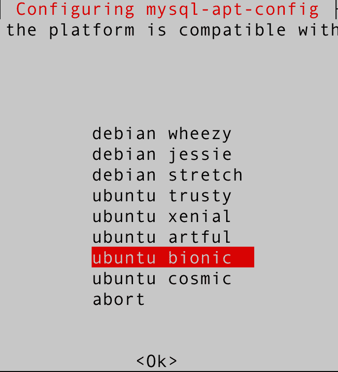

###### 图 1-1\. 选择“ubuntu bionic”

下一个提示显示 MySQL 8.0 默认选择（图 1-2）。选择此选项后，按 Enter 键。

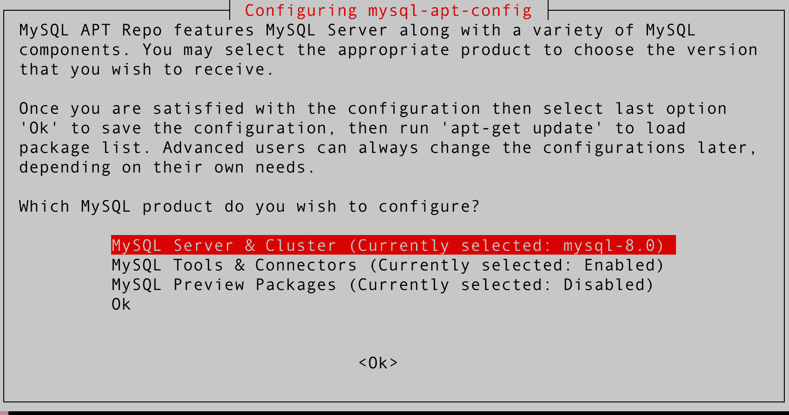

###### 图 1-2\. 选择 MySQL Server & Cluster 选项

作为下一步选项，如图 1-3 所示，选择 MySQL 5.7 并点击“确定”。

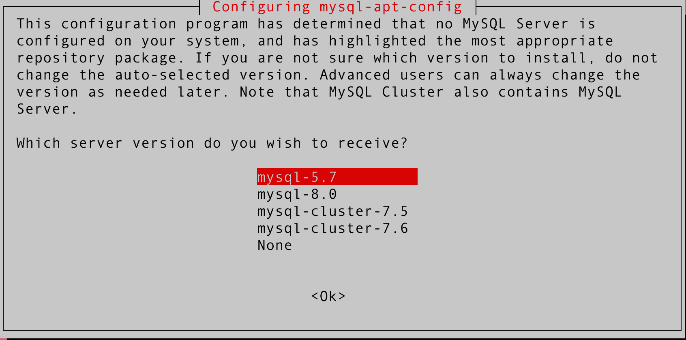

###### 图 1-3\. 选择 MySQL 5.7 选项

返回到主屏幕后，点击“确定”退出，如图 1-4 所示。

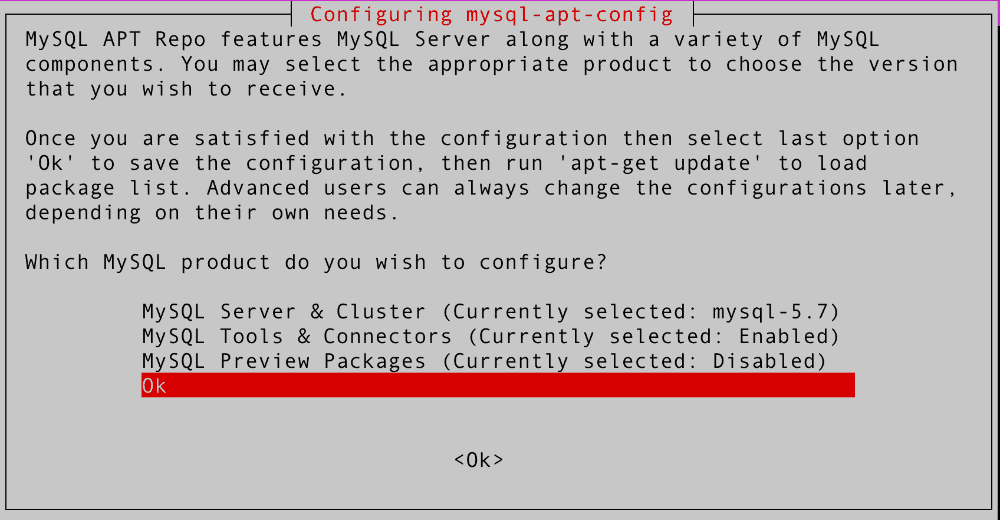

###### 图 1-4\. 点击“确定”退出

接下来，需要更新 MySQL 软件包：

```
# apt-get update -y
```

验证 Ubuntu 策略以安装 MySQL 5.7：

```
# apt-cache policy mysql-server
```

检查输出，查看可用的 MySQL 5.7 版本：

```
# apt-cache policy mysql-server
```

```
mysql-server:
  Installed: (none)
  Candidate: 8.0.23-0ubuntu0.20.04.1
  Version table:
     8.0.23-0ubuntu0.20.04.1 500
        500 http://br.archive.ubuntu.com/ubuntu focal-updates/main amd64 Packages
        500 http://br.archive.ubuntu.com/ubuntu focal-security/main amd64
        Packages
     8.0.19-0ubuntu5 500
        500 http://br.archive.ubuntu.com/ubuntu focal/main amd64 Packages
     5.7.33-1ubuntu18.04 500
        500 http://repo.mysql.com/apt/ubuntu bionic/mysql-5.7 amd64 Packages
```

#### 安装 MySQL 5.7 二进制文件

现在，您已经验证了 MySQL 5.7 版本可用（*5.7.33-1ubuntu18.04*），请安装它：

```
# apt-get install mysql-client=5.7.33-1ubuntu18.04 -y
# apt-get install mysql-community-server=5.7.33-1ubuntu18.04 -y
# apt-get install mysql-server=5.7.33-1ubuntu18.04 -y
```

安装过程将提示您选择 root 密码，如图 1-5 所示。

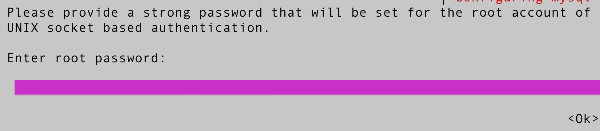

###### 图 1-5\. 定义 root 密码并点击确定

#### 检查服务是否正在运行

要检查 MySQL 5.7 服务是否正常运行，请运行以下命令：

```
# systemctl status mysql
```

此时，MySQL 5.7 将为 root 用户设置密码。但是，您仍然需要运行`mysql_secure_installation`来设置密码策略，删除远程 root 登录和匿名用户，并删除测试数据库。详细信息请参见“安全 MySQL 8.0”。

# 在 macOS Big Sur 上安装 MySQL

macOS 的 MySQL 有几种不同的形式。由于大多数情况下，macOS 上安装 MySQL 用于开发目的，我们只演示如何使用本机 macOS 安装程序（*.dmg*文件）来安装。请注意，也可以使用 tarball 在 macOS 上安装 MySQL。

### 安装 MySQL 8

首先，从[MySQL 网站](https://oreil.ly/Ea6Dk)下载 MySQL 的*.dmg*文件。

###### 提示

根据 Oracle，macOS Catalina 软件包适用于 Big Sur。

下载完成后，执行安装程序来开始安装过程，如图 1-6 所示。

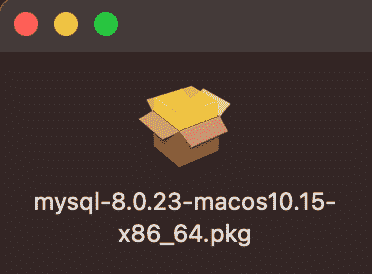

###### 图 1-6\. MySQL 8.0.23 *.dmg*软件包

接下来，需要授权 MySQL 运行，如图 1-7 所示。

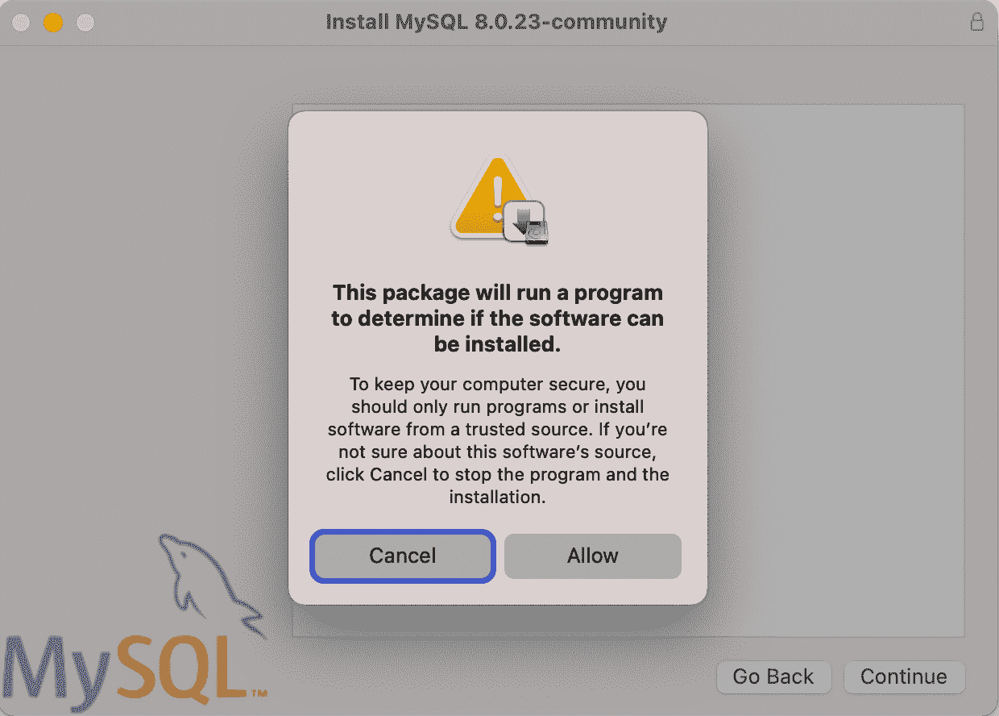

###### 图 1-7\. MySQL 8.0.23 授权请求

图 1-8 显示安装程序的欢迎屏幕。

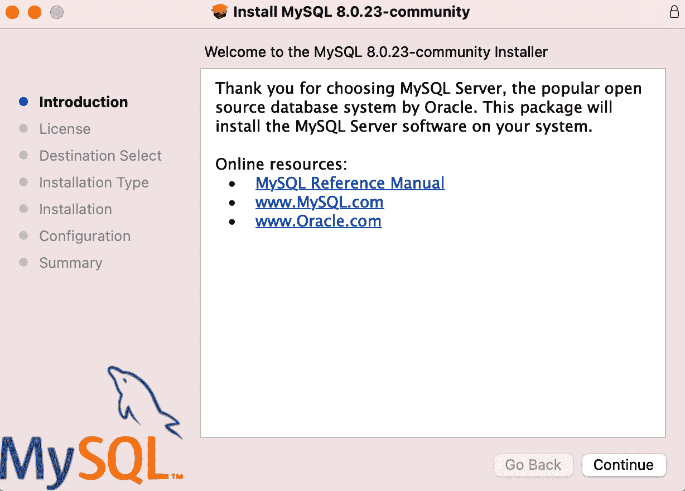

###### 图 1-8\. MySQL 8.0.23 初始屏幕

图 1-9 显示许可协议。即使是开源软件，也需要同意许可条款，否则无法继续。


###### 图 1-9\. MySQL 8.0.23 许可协议

现在你可以定义安装的位置并自定义安装，如 图 1-10 所示。

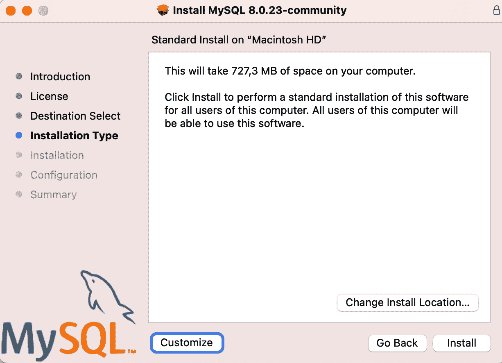

###### 图 1-10\. MySQL 8.0.23 安装自定义

你将继续标准安装。点击安装后，可能需要输入 macOS 用户密码以使用更高权限运行安装，如 图 1-11 所示。

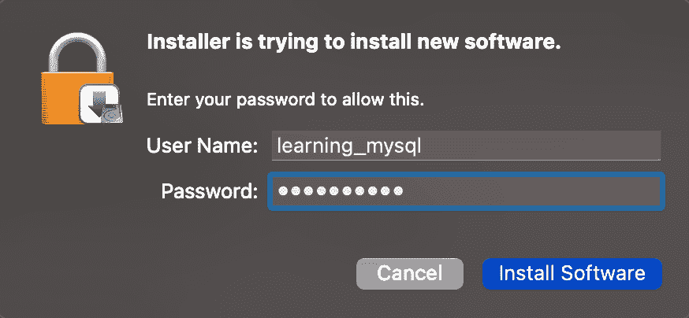

###### 图 1-11\. macOS 授权请求

安装 MySQL 后，安装过程会提示你选择 *密码加密*。你应该使用更新的认证方法（默认选项），如 图 1-12 所示，这更安全。

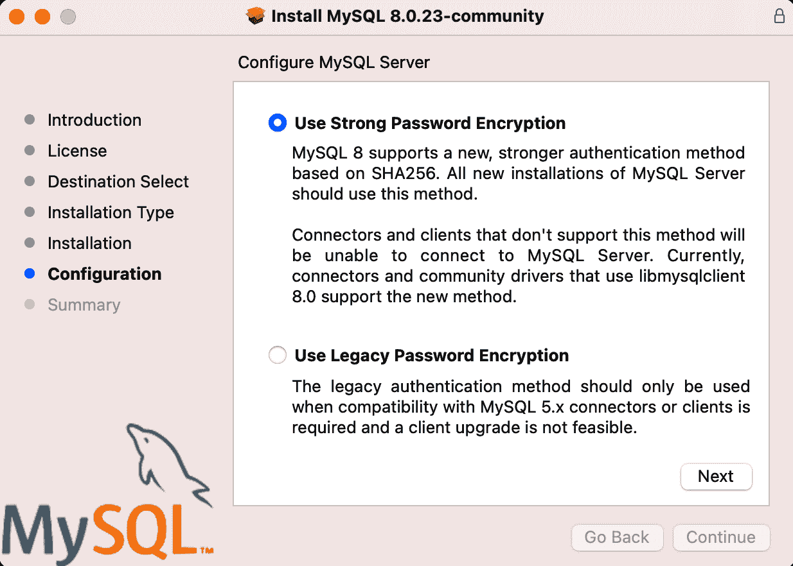

###### 图 1-12\. MySQL 8.0.23 密码加密

最后一步是创建根密码并初始化 MySQL，如 图 1-13 所示。

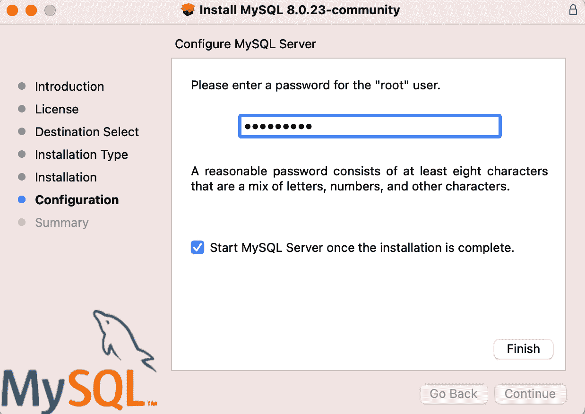

###### 图 1-13\. MySQL 8.0.23 根密码

现在你已经安装了 MySQL 服务器，但默认情况下没有加载（或启动）。要启动，请打开系统偏好设置并搜索 MySQL 图标，如 图 1-14 所示。

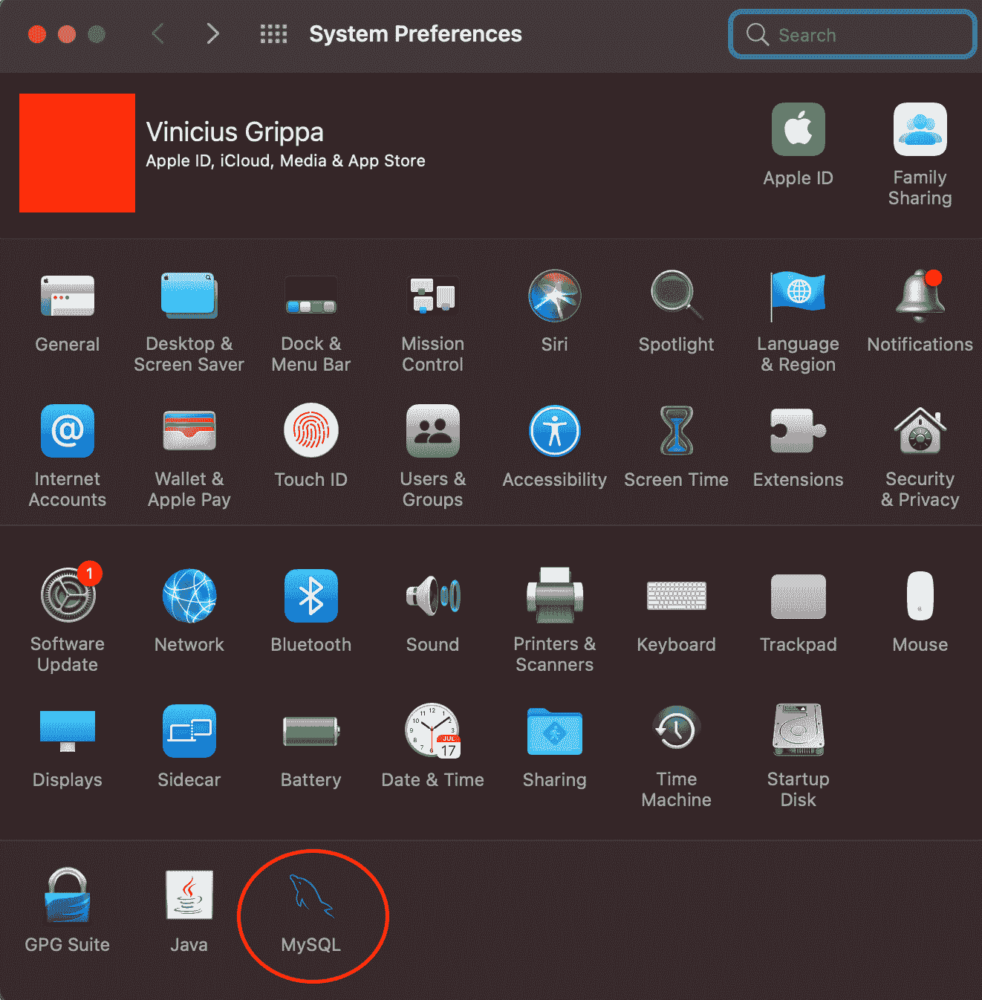

###### 图 1-14\. 系统偏好设置中的 MySQL

点击图标打开 MySQL 面板。你应该看到类似于 图 1-15 的界面。

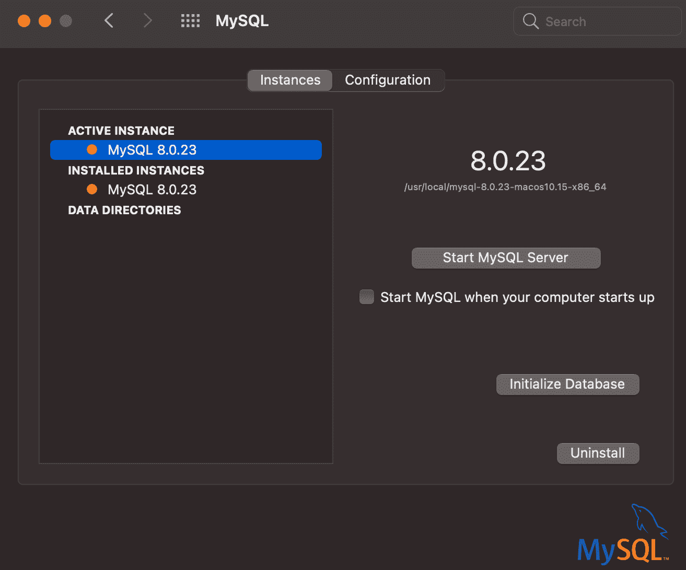

###### 图 1-15\. MySQL 启动选项

除了明显的选项（即启动 MySQL 进程），还有一个配置面板（显示 MySQL 文件的位置）和重新初始化数据库的选项（你已经在安装过程中初始化了）。启动 MySQL 进程时可能会再次要求管理员密码。

MySQL 运行后，可以验证连接并确认 MySQL 服务器是否正确运行。你可以使用 [MySQL Workbench](https://oreil.ly/RVWbe) 进行测试，或者使用 `brew` 安装 MySQL 客户端：

```
$ brew install mysql-client
```

安装完 MySQL 客户端后，你可以使用在 图 1-13 中定义的密码连接。在终端中运行以下命令：

```
$ mysql -uroot -p
Enter password:
Welcome to the MySQL monitor.  Commands end with ; or \g.
Your MySQL connection id is 8
Server version: 8.0.23 MySQL Community Server - GPL

Copyright (c) 2000, 2020, Oracle and/or its affiliates. All rights reserved.

Oracle is a registered trademark of Oracle Corporation and/or its
affiliates. Other names may be trademarks of their respective
owners.

Type *help;* or *\h* for help. Type *\c* to clear the current input statement.
```

```
mysql> `SELECT` `@``@``version``;`
```

```
+-----------+
| @@version |
+-----------+
| 8.0.23    |
+-----------+
1 row in set (0.00 sec)
```

# 在 Windows 10 上安装 MySQL

Oracle 为 Windows 提供了一个 [MySQL 安装程序](https://oreil.ly/N4enF) 来简化安装过程。请注意，MySQL 安装程序是一个 32 位应用程序，但可以安装 32 位和 64 位的 MySQL 二进制文件。要启动安装过程，你需要执行安装程序文件并选择安装类型，如 图 1-16 所示。

选择开发者默认设置类型并点击下一步。我们不会详细介绍其他选项，因为我们不建议在生产系统中使用 MySQL，主要是因为 MySQL 生态系统是为 Linux 开发的。

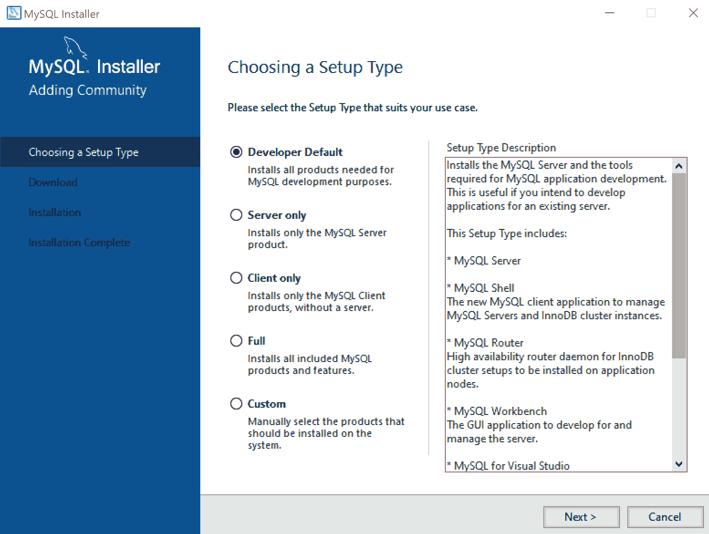

###### 图 1-16\. MySQL 8.0.23 Windows 安装自定义

接下来，安装程序检查是否满足所有要求（图 1-17）。

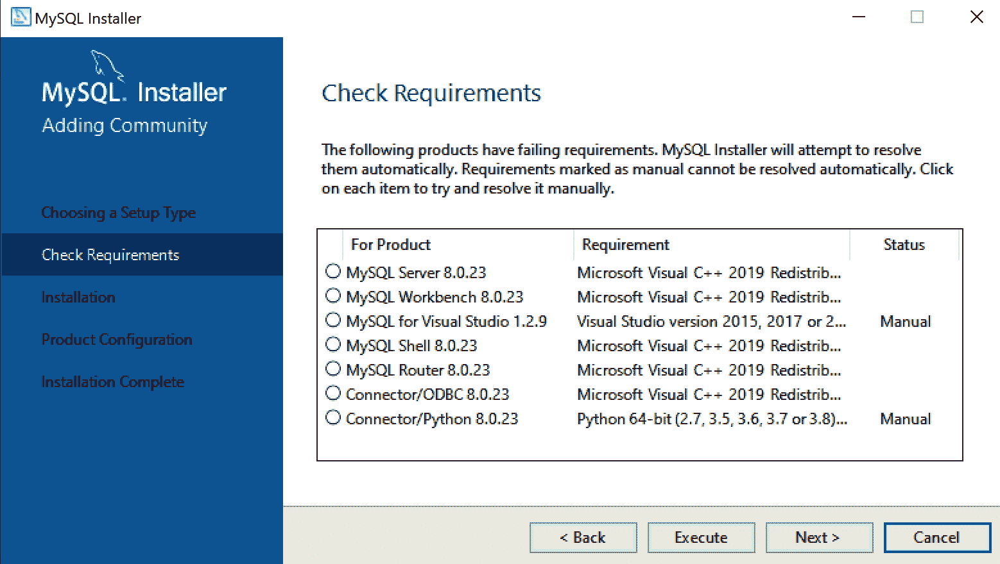

###### Figure 1-17\. 安装要求

单击“执行”。可能需要安装 Microsoft Visual C++（图 1-18）。

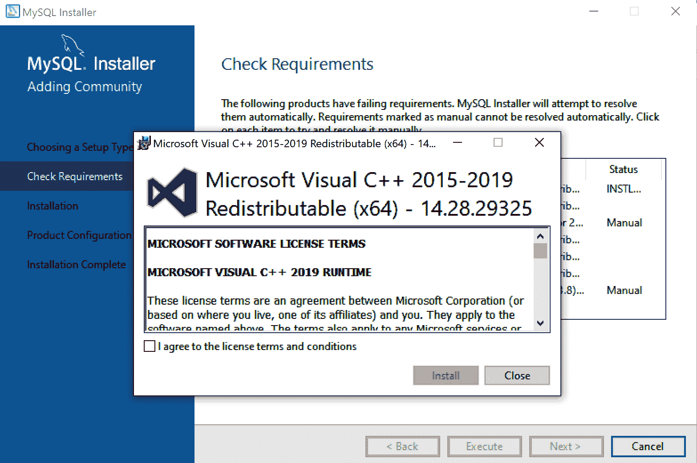

###### Figure 1-18\. 如果需要，请安装 Microsoft Visual C++

单击“下一步”，安装程序将显示准备安装的产品（图 1-19）。

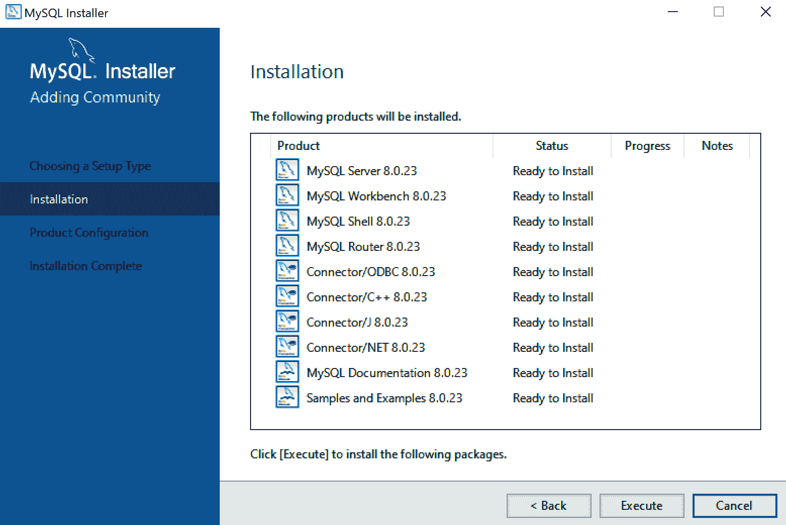

###### Figure 1-19\. 单击“执行”安装 MySQL 软件

单击“执行”，您将进入配置 MySQL 属性的界面。您可以使用 TCP/IP 和 X 协议端口的默认设置，如图 1-20 所示，或者根据需要自定义它们。

接下来，您将选择认证方法。选择更安全的新版本，如图 1-21 所示。

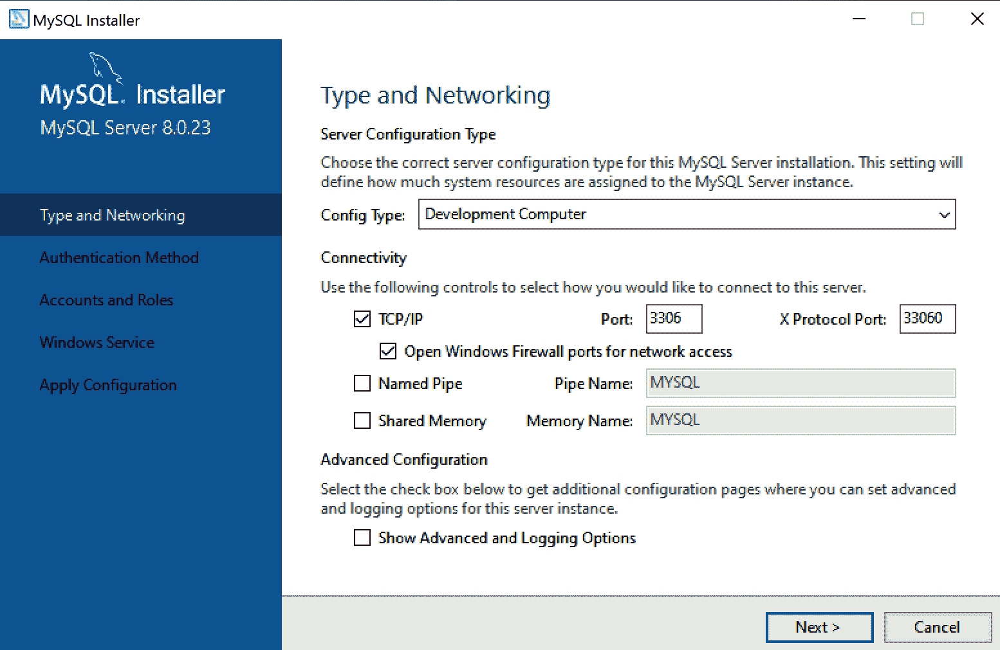

###### Figure 1-20\. 类型和网络配置选项

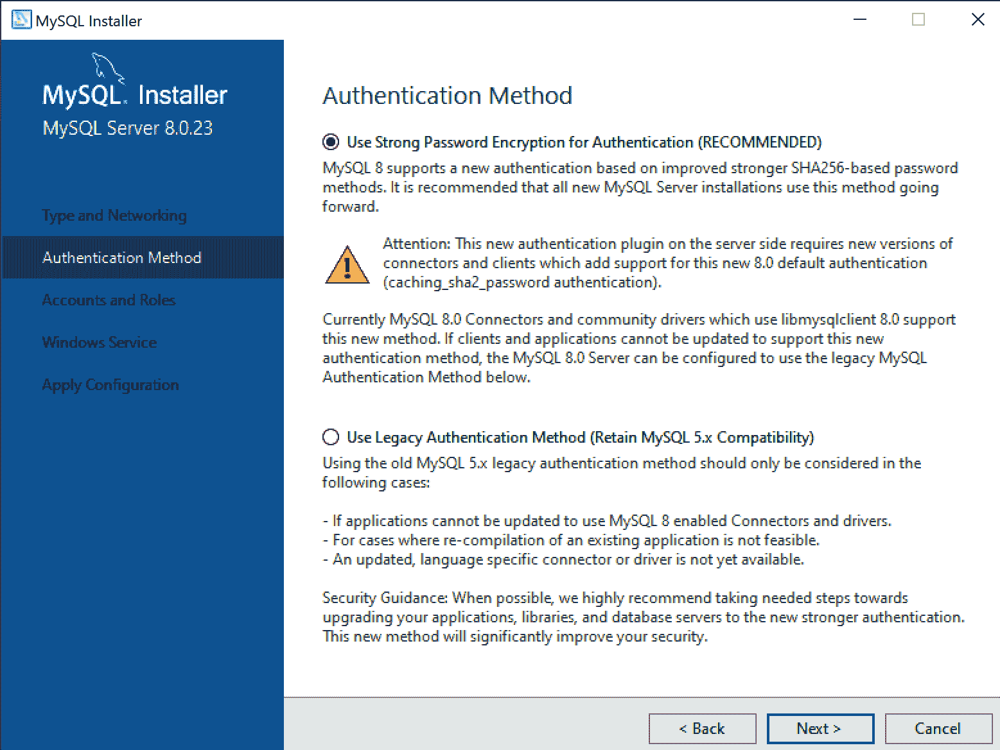

###### Figure 1-21\. 密码加密—使用基于 SHA-256 的密码

接下来，指定根用户密码以及是否要向 MySQL 数据库添加额外用户，如图 1-22 所示。


###### Figure 1-22\. 配置用户

配置用户后，定义将运行服务的服务名和用户，如图 1-23 所示。

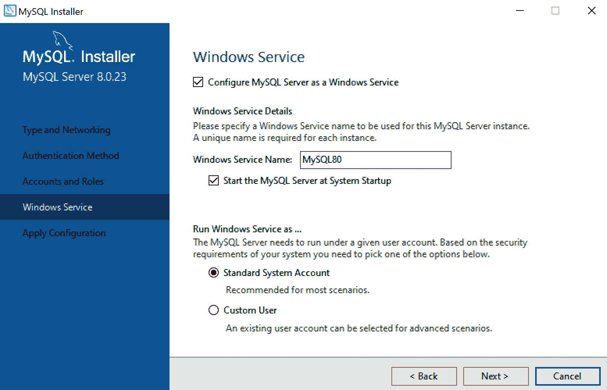

###### Figure 1-23\. 配置服务名

单击“下一步”后，安装程序开始配置 MySQL。一旦 MySQL 安装程序执行完成，您应该会看到类似图 1-24 的界面。

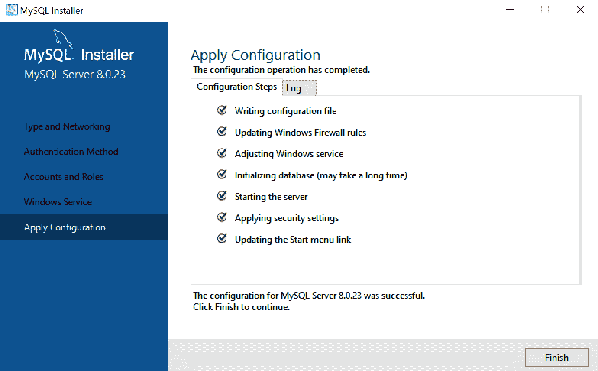

###### Figure 1-24\. 如果安装顺利，将没有错误

现在您的数据库服务器已经可操作。由于您选择了开发人员配置文件，安装程序将执行 MySQL Router 安装。对于此设置，MySQL Router 并不是必需的，而且由于我们不建议在生产环境中使用 Windows，我们将跳过这一部分。我们将在“MySQL Router”中深入探讨路由器的细节。

现在您可以使用[MySQL Workbench](https://oreil.ly/RVWbe)，如图 1-25 所示验证您的服务器。您应该会看到一个 MySQL 连接选项。

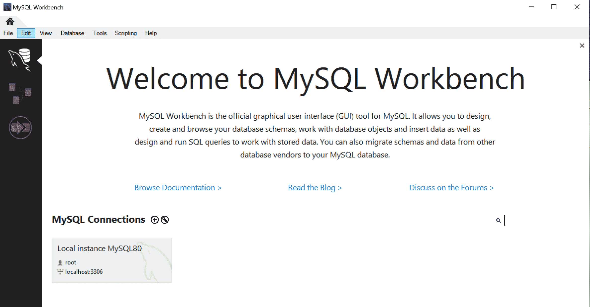

###### Figure 1-25\. MySQL Workbench 中的 MySQL 连接选项

双击连接，Workbench 将提示您输入密码，如图 1-26 所示。

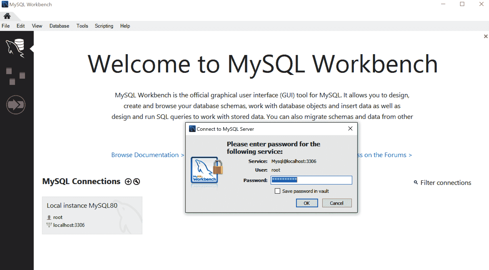

###### Figure 1-26\. 输入根密码进行连接

您现在可以在您的 Windows 平台上开始使用 MySQL，如图 1-27 所示。

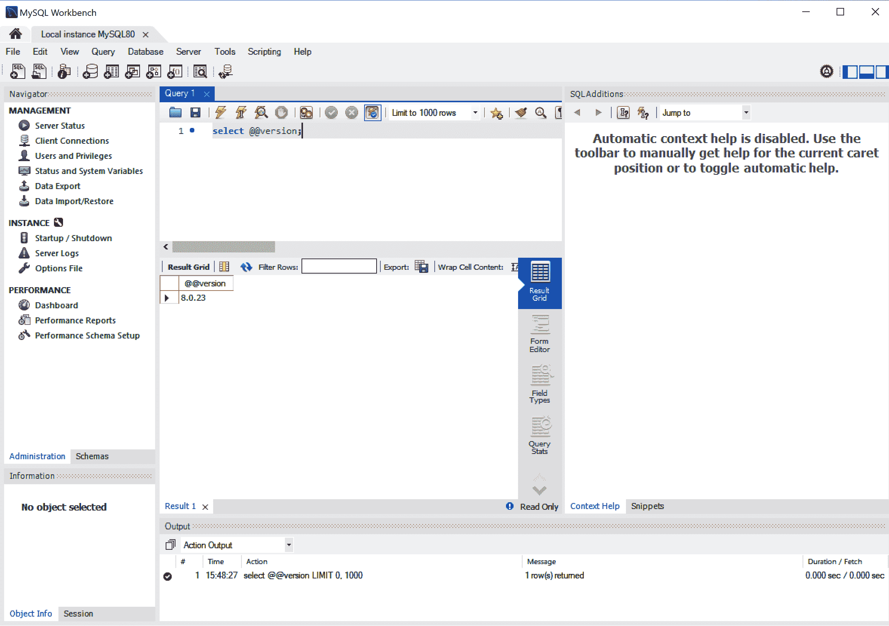

###### Figure 1-27\. 您现在可以开始测试您的环境

# MySQL 目录的内容

在安装过程中，MySQL 会创建启动服务器所需的所有文件。MySQL 将其文件存储在名为*数据目录*的目录下。数据库管理员（DBA）通常称其为*datadir*，这是存储该目录路径的 MySQL 参数名称。Linux 发行版的默认位置是*/var/lib/mysql*。您可以通过在 MySQL 实例中运行以下命令来检查其位置：

```
mysql> `SELECT` `@``@``datadir``;`
```

```
+-----------------+
| @@datadir       |
+-----------------+
| /var/lib/mysql/ |
+-----------------+
1 row in set (0.00 sec)
```

## MySQL 5.7 默认文件

以下列表简要描述了数据目录中通常找到的文件和子目录：

REDO 日志文件

MySQL 在数据目录中创建重做日志文件*ib_logfile0*和*ib_logfile1*。它以循环方式写入重做日志文件，因此文件不会超出其配置大小（由[`innodb_log_file_size`](https://oreil.ly/XRzLb)配置）。与任何其他符合 ACID 的关系数据库管理系统（RDBMS）一样，重做文件是提供数据持久性和从崩溃场景中恢复能力的基础。

*auto.cnf*文件

MySQL 5.6 引入了*auto.cnf*文件。它只有一个`[auto]`部分，包含一个[`server_uuid`](https://oreil.ly/zXlHS)设置和值。`server_uuid`为服务器创建一个唯一签名，并且复制层使用它与不同的服务器通信来复制数据。

###### 警告

MySQL 在初始化时会在数据目录中自动创建*auto.cnf*文件，此文件不应更改。我们在第九章中详细解释了其细节。

**.pem*文件

简而言之，这些文件允许在客户端和 MySQL 服务器之间的通信中使用加密连接。加密连接是网络安全层的基本部分，以避免在数据从应用程序传输到 MySQL 服务器时未经授权的访问。MySQL 5.7 默认启用 SSL 并创建证书。但是，可以使用市场上不同证书颁发机构（CA）提供的证书。

*performance_schema*子目录

MySQL 性能模式是在运行时监视 MySQL 服务器执行的功能。当我们可以使用性能模式来监视特定指标时，我们说 MySQL 具有仪器化。例如，性能模式仪表可以提供连接用户的数量：

```
mysql> `SELECT` `*` `FROM` `performance_schema``.``users``;`
```

```
+-----------------+---------------------+-------------------+
| USER            | CURRENT_CONNECTIONS | TOTAL_CONNECTIONS |
+-----------------+---------------------+-------------------+
| NULL            |                  40 |                46 |
| event_scheduler |                   1 |                 1 |
| root            |                   0 |                 1 |
| rsandbox        |                   2 |                 3 |
| msandbox        |                   1 |                 2 |
+-----------------+---------------------+-------------------+
5 rows in set (0.03 sec)
```

###### 注意

许多人看到`user`列中的`NULL`时感到惊讶。`NULL`值用于内部线程或认证失败的用户会话。`performance_schema.accounts`表中的`host`列也是如此。

```
mysql> `SELECT` `user``,` `host``,`
        `total_connections` `AS` `cxns`
    -> `FROM` `performance_schema``.``accounts`
        `ORDER` `BY` `cxns` `DESC``;`
```

```
+-----------------+-----------+------+
| user            | host      | cxns |
+-----------------+-----------+------+
| NULL            | NULL      |   46 |
| rsandbox        | localhost |    3 |
| msandbox        | localhost |    2 |
| event_scheduler | localhost |    1 |
| root            | localhost |    1 |
+-----------------+-----------+------+
5 rows in set (0.00 sec)
```

尽管自 MySQL 5.6 以来就存在仪器化功能，但在 MySQL 5.7 中它获得了许多改进，并成为 DBA 工具中调查和解决 MySQL 级别问题的基础部分。

*ibtmp1*文件

当应用程序需要创建临时表或 MySQL 需要使用磁盘上的内部临时表时，它们会创建在共享临时表空间中。默认行为是创建一个名为*ibtmp1*的自动扩展数据文件，稍大于 12 MB（其大小由[`innodb_temp_data_file_path`参数](https://oreil.ly/KXDOo)控制）。

*ibdata1*文件

*ibdata1*文件可能是 MySQL 生态系统中最著名的文件。对于 MySQL 5.7 及更早版本，它保存 InnoDB 数据字典、双写缓冲、变更缓冲和撤销日志的数据。如果我们禁用[`innodb_file_per_table`选项](https://oreil.ly/v4X1O)，它还可能包含表和索引数据。当启用`innodb_file_per_table`时，每个用户表都有一个表空间和一个专用文件。请注意，MySQL 数据目录中可能存在多个*ibdata*文件。

###### 注意

在 MySQL 8.0 中，一些组件已从*ibdata1*中移除并分配到单独的文件中。剩余的组件包括变更缓冲表和索引数据（如果表被创建在系统表空间中，通过禁用`innodb_file_per_table`）。

*mysql.sock*文件

这是 Unix 套接字文件，服务器用它与本地客户端进行通信。此文件仅在 MySQL 运行时存在，手动删除或创建可能会导致问题。

###### 注意

Unix 套接字是一种允许同一台机器上运行的进程之间进行双向数据交换的进程间通信机制。IP 套接字（主要是 TCP/IP 套接字）是一种允许进程之间通过网络进行通信的机制。

您可以使用两种方法在 Linux 上连接到 MySQL 服务器：TCP 协议或套接字。出于安全目的，如果应用程序和 MySQL 位于同一服务器上，可以禁用远程 TCP 连接。在 MySQL 服务器中有两种方法可以做到这一点：将[`bind-address`](https://oreil.ly/PQjrf)设置为`127.0.0.1`而不是默认的`*`值（接受来自所有人的 TCP/IP 连接），或修改[`skip-networking`参数](https://oreil.ly/s20Ta)，禁用到 MySQL 的网络连接。

*mysql*子目录

*mysql*目录对应 MySQL 系统模式，包含 MySQL 服务器运行时的信息。例如，它包括用户及其权限、时区表和复制信息。您可以使用`ls`命令查看按其相应表名命名的文件：

```
# cd /var/lib/mysql
# ls -l mysql/

-rw-r-----. 1 vinicius.grippa percona    8820 Feb 20 15:51 columns_priv.frm
-rw-r-----. 1 vinicius.grippa percona       0 Feb 20 15:51 columns_priv.MYD
-rw-r-----. 1 vinicius.grippa percona    4096 Feb 20 15:51
columns_priv.MYI
-rw-r-----. 1 vinicius.grippa percona    9582 Feb 20 15:51 db.frm
-rw-r-----. 1 vinicius.grippa percona     976 Feb 20 15:51 db.MYD
-rw-r-----. 1 vinicius.grippa percona    5120 Feb 20 15:51 db.MYI
-rw-r-----. 1 vinicius.grippa percona      65 Feb 20 15:51 db.opt
-rw-r-----. 1 vinicius.grippa percona    8780 Feb 20 15:51 engine_cost.frm
-rw-r-----. 1 vinicius.grippa percona   98304 Feb 20 15:51 engine_cost.ibd
...
-rw-r-----. 1 vinicius.grippa percona   10816 Feb 20 15:51 user.frm
-rw-r-----. 1 vinicius.grippa percona    1292 Feb 20 15:51 user.MYD
-rw-r-----. 1 vinicius.grippa percona    4096 Feb 20 15:51 user.MYI
```

## MySQL 8.0 默认文件

MySQL 8.0 在数据目录结构的核心引入了一些变化。其中一些变化与实施新数据字典相关，另一些则是为了改进数据库管理。以下列表描述了新文件和更改：

*undo*表空间文件

MySQL（InnoDB）使用*undo*文件来撤销需要回滚的事务，并在需要执行一致性读取时确保隔离的事务。

从 MySQL 8.0 开始，撤消日志文件已从系统表空间（*ibdata1*）中分离，并放置在数据目录中。还可以通过更改 [`innodb_undo_directory` 参数](https://oreil.ly/l1bIV) 来设置另一个位置。

*.dblwr* 文件（从 8.0.20 版本引入）

双写缓冲区负责在 MySQL 将页面写入数据文件之前将其从缓冲池刷新到磁盘上写入页面。双写文件名的格式如下：*#ib_<page_size>_<file_number>.dblwr*（例如，*#ib_16384_0.dblwr*，*#ib_16384_0.dblwr*）。可以通过修改 [`innodb_doublewrite_dir` 参数](https://oreil.ly/e0ypB) 来更改这些文件的位置。

*mysql.ibd* 文件（从 8.0 版本引入）

在 MySQL 5.7 中，字典表和系统表将数据和元数据存储在 *datadir* 目录内的 *mysql* 目录中。在 MySQL 8.0 中，所有这些数据都存储在 *mysql.ibd* 文件中，并由 InnoDB 机制保护以确保一致性。

# 使用命令行界面

*mysql* 二进制文件是一个带有输入行编辑功能的简单 SQL shell。其使用方法很简单（在安装过程中我们已经用过几次）。要调用它，请运行以下命令：

```
# mysql
```

我们可以通过在其中执行查询来扩展其功能：

```
# mysql -uroot -pseKret -e "SHOW ENGINE INNODB STATUS\G"
```

我们还可以执行更高级的命令，将其与其他命令进行管道连接，以执行更复杂的任务。例如，我们可以从一个数据库中提取转储文件，通过网络发送并在另一个 MySQL 服务器中还原，所有这些都可以在同一个命令行中完成：

```
# mysql -e "SHOW MASTER STATUS\G" && nice -5 mysqldump \
    --all-databases --single-transaction -R --master-data=2 --flush-logs \
    --log-error=/tmp/donor.log --verbose=TRUE | ssh mysql@192.168.0.1 mysql \
    1> /tmp/receiver.log 2>&1
```

MySQL 8.0 引入了 *MySQL Shell*，比其前身功能强大得多。MySQL Shell 支持 JavaScript、Python 和 SQL 语言，为 MySQL Server 提供开发和管理功能。我们将在 “MySQL Shell” 中详细介绍这一点。

# 使用 Docker

随着虚拟化技术的出现及其在云服务中的普及，出现了许多平台，包括 [Docker](https://www.docker.com)。Docker 诞生于 2013 年，提供了一种便捷灵活的部署软件的方式。它通过使用 Linux 的 *cgroups* 和 *kernel namespaces* 等特性实现资源隔离。

对于经常需要安装特定版本的 MySQL、MariaDB 或 Percona Server for MySQL 进行实验的 DBA 来说，Docker 很有用。使用 Docker，可以在几秒钟内部署一个 MySQL 实例来执行一些测试。测试完成后，可以销毁实例并将操作系统的资源释放给其他任务。当使用 Docker 时，部署虚拟机（VM）、安装软件包和配置数据库的所有过程都更加简单。

## 安装 Docker

使用 Docker 的优势在于一旦服务运行，命令在所有操作系统中都是相同的。命令相同意味着使用 Docker 的学习曲线比学习不同的 Linux 版本（如 CentOS 和 Ubuntu）要快。

[安装 Docker](https://oreil.ly/K1zGS) 的过程在某些方面与安装 MySQL 类似。对于 Windows 和 macOS，只需安装二进制文件，然后服务即可运行。对于没有图形界面的基于 Linux 的操作系统，该过程需要配置存储库。

### 在 CentOS 7 上安装 Docker

通常情况下，CentOS 提供的 Docker 软件包比 RHEL 和官方 Docker 存储库中的版本旧。目前为止，常规 CentOS 存储库提供的 Docker 版本为 1.13.1，而上游的稳定版本为 20.10.3。对于本书的目的没有区别，但我们始终建议在生产环境中使用最新版本。

执行以下命令从默认的 CentOS 存储库安装 Docker 软件包：

```
# yum install docker -y
```

如果要从上游存储库安装 Docker 以确保使用最新版本，请按照以下步骤操作：

1.  安装`yum-utils`以启用`yum-config-manager`命令：

    ```
    # yum install yum-utils -y
    ```

1.  使用`yum-config-manager`添加*docker-ce*存储库：

    ```
    # yum-config-manager \
        --add-repo \
        https://download.docker.com/linux/centos/docker-ce.repo
    ```

1.  安装必要的软件包：

    ```
    # yum install docker-ce docker-ce-cli containerd.io -y
    ```

1.  启动 Docker 服务：

    ```
    # systemctl start docker
    ```

1.  启用 Docker 服务以在系统重新启动后自动启动：

    ```
    # systemctl enable --now docker
    ```

1.  要验证 Docker 服务是否正在运行，请执行`systemctl status`命令：

    ```
    # systemctl status docker
    ```

1.  要验证 Docker 引擎是否正确安装，可以运行*hello-world*容器：

    ```
    # docker run hello-world
    ```

### 在 Ubuntu 20.04（Focal Fossa）上安装 Docker

要从上游存储库安装最新的 Docker 发行版，请首先移除任何旧版本的 Docker（称为*docker*、*docker.io*或*docker-engine*）。使用以下命令卸载它们：

```
# apt-get remove -y docker docker-engine docker.io containerd runc
```

移除默认存储库后，您可以启动安装过程：

1.  确保 Ubuntu 使用此命令保持最新：

    ```
    # apt-get update -y
    ```

1.  安装软件包以允许*apt*通过 HTTPS 使用存储库：

    ```
    # apt-get install -y \
        apt-transport-https \
        ca-certificates \
        curl \
        gnupg-agent \
        software-properties-common
    ```

1.  接下来，添加 Docker 官方的 GPG 密钥：

    ```
    # curl -fsSL https://download.docker.com/linux/ubuntu/gpg | sudo \
        apt-key add -
    ```

1.  安装好密钥后，添加 Docker 稳定存储库：

    ```
    # add-apt-repository \
       "deb [arch=amd64] https://download.docker.com/linux/ubuntu \
       $(lsb_release -cs) \
       stable"
    ```

1.  现在，使用`apt`命令安装 Docker 软件包：

    ```
    # apt-get install -y docker-ce docker-ce-cli containerd.io
    ```

1.  Ubuntu 将为您启动服务，但您可以通过运行此命令进行检查：

    ```
    # systemctl status docker
    ```

1.  要使 Docker 服务在操作系统重新启动时自动启动，请使用：

    ```
    # systemctl enable --now docker
    ```

1.  使用以下命令检查您安装的 Docker 版本：

    ```
    # docker --version
    ```

1.  要验证 Docker 引擎是否正确安装，可以运行*hello-world*容器：

    ```
    # docker run hello-world
    ```

### 部署 MySQL 容器

安装并运行 Docker 引擎后的下一步是部署 MySQL Docker 容器。

###### 警告

我们设计了以下指南，以便快速轻松地运行测试实例；请勿将其用于生产部署！

要使用 Docker 部署最新的 MySQL 版本，请执行此命令：

```
# docker run --name mysql-latest \
  -p 3306:3306 -p 33060:33060 \
  -e MYSQL_ROOT_HOST=% -e
  MYSQL_ROOT_PASSWORD='learning_mysql' \
  -d mysql/mysql-server:latest
```

Docker 引擎将启动 MySQL 实例的最新版本，并且可以通过指定的 root 密码从任何地方远程访问。使用 Docker 安装 MySQL 意味着您无法访问传统主机（裸机或虚拟机）上可用的任何工具、实用程序或标准库。如果需要这些工具，您需要单独部署这些工具或使用与 Docker 镜像一起提供的命令。

接下来，使用 MySQL 客户端连接到 MySQL 容器：

```
# docker exec -it mysql-latest mysql -uroot -plearning_mysql
```

由于您将容器中的 TCP 端口 3306 映射到 Docker 主机的端口 3306，您可以从可以访问主机（主机名或 IP）和该端口的任何 MySQL 客户端（Workbench、MySQL Shell）连接到 MySQL 数据库。

让我们来看看一些管理容器的命令。

要停止 MySQL Docker 容器，请运行：

```
# docker stop mysql-latest
```

不要尝试使用 `docker run` 再次启动容器。而是使用以下命令：

```
# docker start mysql-latest
```

要调查问题，例如容器无法启动时，请使用以下命令访问其日志：

```
# docker logs mysql-latest
```

要删除您创建的 Docker 容器，请运行：

```
# docker stop mysql-latest
# docker rm mysql-latest
```

要检查主机上运行哪些 Docker 容器以及有多少个，请使用：

```
# docker ps
```

可以使用命令行选项来自定义 MySQL 的参数化到 Docker 引擎。要配置 [InnoDB 缓冲池大小](https://oreil.ly/1R2nJ) 和 [刷新方法](https://oreil.ly/tiKl2)，请运行以下命令：

```
# docker run --name mysql-latest \
  -p 3306:3306 -p 33060:33060  \
  -e MYSQL_ROOT_HOST=% -e
  MYSQL_ROOT_PASSWORD='strongpassword' \
  -d mysql/mysql-server:latest \
  --innodb_buffer_pool_size=256M \
  --innodb_flush_method=O_DIRECT
```

要运行不同于最新版本的 MySQL 版本，请首先检查它是否在 [Docker Hub](https://hub.docker.com) 上可用。例如，假设您想运行 MySQL 5.7.31。第一步是在 Docker Hub 的 [official MySQL Docker Images](https://oreil.ly/X0Uuu) 列表中检查它是否存在。

一旦确认其存在，使用以下命令运行它：

```
# docker run --name mysql-5.7.31 \
  -p 3307:3306 -p 33061:33060  \
  -e MYSQL_ROOT_HOST=% -e \
  MYSQL_ROOT_PASSWORD='learning_mysql' \
  -d mysql/mysql-server:5.7.31
```

可以同时运行多个 MySQL Docker 实例，但潜在问题是 TCP 端口冲突。在前面的例子中，请注意我们为 *mysql-5.7.31* 容器映射了不同的主机端口（3307 和 33061）。此外，容器的 *名称* 需要是唯一的。

### 部署 MariaDB 和 Percona Server 容器

您可以按照前一部分描述的相同步骤来部署 [MariaDB](https://oreil.ly/rHGjq) 或 [Percona Server](https://oreil.ly/TAWtw) 容器。主要区别在于它们使用不同的 Docker 镜像，并拥有各自的官方存储库。

要部署一个 MariaDB 容器，请运行：

```
# docker run --name maria-latest \
  -p 3308:3306 \
  -e MYSQL_ROOT_HOST=% -e \
  MYSQL_ROOT_PASSWORD='learning_mysql' \
  -d mariadb:latest
```

对于 Percona Server，请运行：

```
# docker run --name ps-latest \
  -p 3309:3306 -p 33063:33060 \
  -e MYSQL_ROOT_HOST=% -e \
  MYSQL_ROOT_PASSWORD='learning_mysql' \
  -d percona/percona-server:latest \
  --innodb_buffer_pool_size=256M \
  --innodb_flush_method=O_DIRECT
```

###### 注意

我们为 MariaDB (`-p 3308:3306`) 和 Percona (`-p 3309:3306`) 映射了不同的端口，因为我们在同一主机上部署所有容器：

```
# docker ps
```

```
CONTAINER ID            IMAGE
5e487dd41c3e            percona/percona-server:latest

COMMAND                 CREATED           STATUS
"/docker-entrypoint..." About a minute ago Up 51 seconds
"docker-entrypoint..."  2 minutes ago      Up 2 minutes

PORTS                   NAMES
0.0.0.0:3309->3306/tcp, ps-latest
0.0.0.0:33063->33060/tcp
f5a217f1537b            mariadb:latest
0.0.0.0:3308->3306/tcp  maria-latest
```

如果只部署一个容器，可以使用端口 3306 或任何您想使用的自定义端口。

# 使用沙箱

在软件开发中，*沙箱* 是一个测试环境，用于隔离代码更改，允许在部署到生产环境之前进行实验和测试。DBA 主要用沙箱测试新软件版本、性能测试和故障分析，并且 MySQL 中的数据是可丢弃的。

###### 注意

在 MySQL 数据库的背景下，听到 *主节点* 和 *从节点* 这两个术语是很常见的。这些词的起源显然是负面的。因此，Oracle、Percona 和 MariaDB 已决定更改这些术语，改为使用 *源* 和 *副本*。在本书中，我们将使用这两组术语，因为你会遇到它们，但请注意，这些公司将在即将发布的版本中实施以下术语：

| **旧** | **新** |
| --- | --- |
| 主节点 | 源 |
| 从节点 | 副本 |
| 黑名单 | 阻止列表 |
| 白名单 | 允许列表 |

在 2018 年，[Giuseppe Maxia](https://oreil.ly/0wLPk) 推出了 [DBdeployer](https://oreil.ly/lZK98)，这是一个提供快速简便方法部署 MySQL 及其衍生产品的工具。它支持多种 MySQL 拓扑，如主/从（源/副本）、主/主（源/源）、Galera 集群和 Group Replication。

## 安装 DBdeployer

这个工具是用 *Go* 语言开发的，可以在 macOS 和 Linux（Ubuntu 和 CentOS）上运行，并提供独立的可执行文件。在这里获取最新版本：

```
# wget https://github.com/datacharmer/dbdeployer/releases/download/v1.58.2/ \
    dbdeployer-1.58.2.linux.tar.gz
# tar -xvf dbdeployer-1.58.2.linux.tar.gz
# mv dbdeployer-1.58.2.linux /usr/local/bin/dbdeployer
```

如果你将 */usr/local/bin/* 目录添加到 `$PATH` 变量中，现在应该能够运行 `dbdeployer` 命令了：

```
# dbdeployer --version
dbdeployer version 1.58.2
```

## 使用 DBdeployer

使用 DBdeployer 的第一步是下载你想要运行的 MySQL 二进制文件，并解压缩到存储二进制文件的目录中。我们将使用 [*Linux - Generic* tarballs](https://oreil.ly/DoI1c)，因为它们与大多数 Linux 发行版兼容，并将我们的二进制文件存储在 */opt/mysql* 目录中：

```
# wget https://dev.mysql.com/get/Downloads/MySQL-8.0/ \
    mysql-8.0.11-linux-glibc2.12-x86_64.tar.gz
# mkdir /opt/mysql
# dbdeployer --sandbox-binary=/opt/mysql/ unpack \
    mysql-8.0.11-linux-glibc2.12-x86_64.tar.gz
```

`unpack` 命令将会提取并移动文件到指定目录。这个操作的预期输出是：

```
# dbdeployer --sandbox-binary=/opt/mysql/ unpack
```

```
mysql-8.0.11-linux-glibc2.12-x86_64.tar.gz
Unpacking tarball mysql-8.0.11-linux-glibc2.12-x86_64.tar.gz to
/opt/mysql/8.0.11
.........100.........200........289
Renaming directory /opt/mysql/mysql-8.0.11-linux-glibc2.12-x86_64 to
/opt/mysql/8.0.11
```

现在我们可以使用以下命令使用新提取的二进制文件创建一个新的独立 MySQL 沙箱：

```
# dbdeployer --sandbox-binary=/opt/mysql/ deploy single 8.0.11
```

然后我们可以观察 DBdeployer 初始化 MySQL：

```
# dbdeployer --sandbox-binary=/opt/mysql/ deploy single 8.0.11
```

```
Creating directory /root/sandboxes
Database installed in $HOME/sandboxes/msb_8_0_11
run 'dbdeployer usage single' for basic instructions'
. sandbox server started
```

使用 `ps` 命令确认 MySQL 是否正在运行：

```
# ps -ef | grep mysql
```

```
root      4249     1  0 20:18 pts/0    00:00:00 /bin/sh bin/mysqld_safe
--defaults-file=/root/sandboxes/msb_8_0_11/my.sandbox.cnf
root      4470  4249  1 20:18 pts/0    00:00:00 /opt/mysql/8.0.11/bin/mysqld
--defaults-file=/root/sandboxes/msb_8_0_11/my.sandbox.cnf
--basedir=/opt/mysql/8.0.11 --datadir=/root/sandboxes/msb_8_0_11/data
--plugin-dir=/opt/mysql/8.0.11/lib/plugin --user=root
--log-error=/root/sandboxes/msb_8_0_11/data/msandbox.err
--pid-file=/root/sandboxes/msb_8_0_11/data/mysql_sandbox8011.pid
--socket=/tmp/mysql_sandbox8011.sock --port=8011
root      4527  3836  0 20:18 pts/0    00:00:00 grep --color=auto mysql
```

现在我们可以使用 DBdeployer 的 `use` 命令连接到 MySQL：

```
# cd sandboxes/msb_8_0_11/
# ./use
```

或者使用默认的 root 凭据：

```
# mysql -uroot -pmsandbox -h 127.0.0.1 -P 8011
```

###### 注意

我们从之前的 `ps` 命令中获取了端口信息。请记住，连接到 MySQL 有两种方式：通过 TCP/IP 或使用套接字。我们还可以从 `ps` 命令的输出中获取套接字文件位置，并使用它进行连接，如下所示：

```
# mysql -uroot -pmsandbox -S/tmp/mysql_sandbox8011.sock
```

如果我们想要设置一个带有源/副本拓扑的复制环境，我们可以使用以下命令行来实现：

```
# dbdeployer --sandbox-binary=/opt/mysql/ deploy replication 8.0.11
```

现在我们将有三个 `mysqld` 进程在运行：

```
# ps -ef | grep mysql
```

```
root      4673     1  0 20:26 pts/0    00:00:00 /bin/sh bin/mysqld_safe
--defaults-file=/root/sandboxes/rsandbox_8_0_11/master/my.sandbox.cnf
root      4942  4673  1 20:26 pts/0    00:00:00
/opt/mysql/8.0.11/bin/mysqld
...
--pid-file=/root/sandboxes/rsandbox_8_0_11/master/data/mysql_sandbox201
12.pid --socket=/tmp/mysql_sandbox20112.sock --port=20112

root      5051     1  0 20:26 pts/0    00:00:00 /bin/sh bin/mysqld_safe
--defaults-file=/root/sandboxes/rsandbox_8_0_11/node1/my.sandbox.cnf
root      5320  5051  1 20:26 pts/0    00:00:00
/opt/mysql/8.0.11/bin/mysqld
--defaults-file=/root/sandboxes/rsandbox_8_0_11/node1/my.sandbox.cnf
...
--pid-file=/root/sandboxes/rsandbox_8_0_11/node1/data/mysql_sandbox2011
3.pid --socket=/tmp/mysql_sandbox20113.sock --port=20113

root      5415     1  0 20:26 pts/0    00:00:00 /bin/sh bin/mysqld_safe
--defaults-file=/root/sandboxes/rsandbox_8_0_11/node2/my.sandbox.cnf
root      5684  5415  1 20:26 pts/0    00:00:00
/opt/mysql/8.0.11/bin/mysqld
...
--pid-file=/root/sandboxes/rsandbox_8_0_11/node2/data/mysql_sandbox2011
4.pid --socket=/tmp/mysql_sandbox20114.sock --port=20114
```

DBdeployer 可以配置的另一种拓扑是 Group Replication。在这个示例中，我们将定义一个 `base-port`。通过这样做，我们将命令 DBdeployer 从端口 49007 开始配置我们的服务器：

```
# dbdeployer deploy --topology=group replication --sandbox-binary=/opt/mysql/\
    8.0.11 --base-port=49007
```

现在让我们看一个使用 Percona XtraDB Cluster 5.7.32 部署 Galera Cluster 的示例。我们将指定 `base-port`，并希望我们的节点配置为[`log-slave-updates` 选项](https://oreil.ly/oMhOY)：

```
# wget https://downloads.percona.com/downloads/Percona-XtraDB-Cluster-57/\
    Percona-XtraDB-Cluster-5.7.32-31.47/binary/tarball/Percona-XtraDB-Cluster-\
    5.7.32-rel35-47.1.Linux.x86_64.glibc2.17-debug.tar.gz
# dbdeployer --sandbox-binary=/opt/mysql/ unpack\
    Percona-XtraDB-Cluster-5.7.32-rel35-47.1.Linux.x86_64.glibc2.17-debug.tar.gz
# dbdeployer deploy --topology=pxc replication\
    --sandbox-binary=/opt/mysql/ 5.7.32 --base-port=45007 -c log-slave-updates
```

正如我们所见，可以定制 MySQL 参数。一个有趣的选项是启用 MySQL 复制，使用[*全局事务标识符*](https://oreil.ly/QNCBh)，或 GTIDs（我们将在第十三章中更详细地讨论 GTIDs）：

```
# dbdeployer deploy replication --sandbox-binary=/opt/mysql/ 5.7.32 --gtid
```

我们的最后一个示例显示，可以同时部署多个独立版本—在这里，我们创建了五个独立实例：

```
# dbdeployer deploy multiple --sandbox-binary=/opt/mysql/ 5.7.32 -n 5
```

上述示例只是 DBdeployer 能力的一小部分。完整文档可以在[GitHub](https://oreil.ly/5ygE0)上找到。了解各种可能性的另一种选择是在命令行中使用 `--help`：

```
# dbdeployer --help
```

```
dbdeployer makes MySQL server installation an easy task.
Runs single, multiple, and replicated sandboxes.

Usage:
  dbdeployer [command]

Available Commands:
  admin           sandbox management tasks
  cookbook        Shows dbdeployer samples
  defaults        tasks related to dbdeployer defaults
  delete          delete an installed sandbox
  delete-binaries delete an expanded tarball
  deploy          deploy sandboxes
  downloads       Manages remote tarballs
  export          Exports the command structure in JSON format
  global          Runs a given command in every sandbox
  help            Help about any command
  import          imports one or more MySQL servers into a sandbox
  info            Shows information about dbdeployer environment samples
  sandboxes       List installed sandboxes
  unpack          unpack a tarball into the binary directory
  update          Gets dbdeployer newest version
  usage           Shows usage of installed sandboxes
  versions        List available versions

Flags:
      --config string           configuration file (default
                                "/root/.dbdeployer/config.json")
  -h, --help                    help for dbdeployer
      --sandbox-binary string   Binary repository (default
                                "/root/opt/mysql")
      --sandbox-home string     Sandbox deployment directory (default
                                "/root/sandboxes")
      --shell-path string       Which shell to use for generated
                                scripts (default "/usr/bin/bash")
      --skip-library-check      Skip check for needed libraries (may
                                cause nasty errors)
      --version                 version for dbdeployer

Use "dbdeployer [command] --help" for more information about a command.
```

# 升级 MySQL 服务器

如果最常见的问题是关于复制，那么第二常见的问题就是如何升级 MySQL 实例。如果在生产环境中未经充分测试过程，则出现问题的可能性很高。可以执行两种类型的升级：

+   在 MySQL 中的 *重大升级* 是从版本 5.6 到 5.7 或从 5.7 到 8.0 的更改。这样的升级比小版本升级更复杂，因为对体系结构的更改更为重大。例如，MySQL 8.0 的重大变化包括修改了数据字典，现在数据字典是事务性的，并由 InnoDB 封装。

+   *小版本升级* 是从 MySQL 5.7.29 到 5.7.30 或从 MySQL 8.0.22 到 MySQL 8.0.23 的更改。大多数情况下，您需要使用发行版的软件包管理器安装新版本。小版本升级比重大版本升级简单，因为它不涉及体系结构的任何更改。修改集中在修复错误、提高性能和优化代码上。

要开始规划升级，首先要在两种策略之间进行选择。这是文档推荐的策略，也是我们使用的策略：

原地升级

这涉及到关闭 MySQL，用新的 MySQL 二进制文件或软件包替换旧的，重启 MySQL 在现有数据目录中，然后运行 `mysql_upgrade`。

###### 注意

自 MySQL 8.0.16 开始，*mysql_upgrade* 二进制文件已被弃用，MySQL 服务器本身执行其功能（您可以将其视为“服务器升级”）。MySQL 在数据字典升级（DD 升级）旁边添加了这一变化，数据字典升级是更新数据字典表定义的过程。新流程的好处包括：

+   更快的升级速度

+   更简单的过程

+   更好的安全性

+   显著减少升级步骤

+   更容易自动化

+   无重启

+   即插即用

逻辑升级

这涉及使用备份工具或导出工具（如 *mysqldump* 或 *mysqlpump*）从旧版本的 MySQL 导出 SQL 格式的数据，安装新版本的 MySQL，并将 SQL 数据应用到新版本的 MySQL。换句话说，此过程涉及重建整个数据字典和用户数据。逻辑升级通常比原地升级需要更长的时间。

无论选择了哪种策略，建立回滚策略都是必要的，以防出现问题。回滚策略将根据您选择的升级计划、数据库大小和当前拓扑结构（例如是否使用副本或 Galera 集群）而有所不同。

在规划升级时，请考虑以下一些额外的要点：

+   支持从 MySQL 5.7 升级到 8.0。但是，升级仅在 GA 版本之间支持。对于 MySQL 8.0，必须从 MySQL 5.7 的 GA 发行版（5.7.9 或更高版本）升级。不支持从 MySQL 5.7 的非 GA 版本进行升级。

+   建议在升级到下一个版本之前先升级到最新版本。例如，在升级到 MySQL 8.0 之前，先升级到最新的 MySQL 5.7 版本。

+   不支持跳过版本进行升级。例如，直接从 MySQL 5.6 升级到 8.0 是不支持的。

###### 注意

根据我们的经验，从 MySQL 5.6 升级到 MySQL 5.7 是导致性能问题最多的升级，特别是如果应用程序使用了 *派生表*（参见 “FROM 子句中的嵌套查询”）。MySQL 5.7 修改了 [`optimizer_switch` 系统变量](https://oreil.ly/m0Ky3)，默认启用了 [`derived_merge` 设置](https://oreil.ly/JROqc)，这可能影响查询性能。

另一个复杂的变化是，MySQL 5.7 默认实现了网络加密（SSL）。在 MySQL 5.6 中未使用 SSL 的应用可能会遭受重大的性能损失。

最后，MySQL 5.7 将 [`sync_binlog`](https://oreil.ly/Khh3Q) 默认更改为同步模式。这种模式最安全，但由于增加了磁盘写入次数，可能会影响性能。

让我们通过一个示例来详细介绍如何使用原地升级方法从 MySQL 5.7 升级到 MySQL 8.0：

1.  停止 MySQL 服务。使用 `systemctl` 执行干净的关闭操作：

    ```
    # systemctl stop mysqld
    ```

1.  删除旧的二进制文件：

    ```
      # yum erase mysql-community -y
    ```

    此过程仅移除二进制文件，并不触及 *datadir*（参见 “MySQL 目录的内容”）。

1.  遵循安装过程的常规步骤（参见 “在 Linux 上安装 MySQL”）。例如，在 CentOS 7 上使用 `yum` 安装 MySQL 8.0 社区版本：

    ```
    # yum-config-manager --enable mysql80-community
    ```

1.  安装新的二进制文件：

    ```
    # yum install mysql-community-server -y
    ```

1.  启动 MySQL 服务：

    ```
    # systemctl start mysqld
    ```

我们可以在日志中观察到，MySQL 已经升级了数据字典，并且现在运行的是 MySQL 8.0.21：

```
# tail -f /var/log/mysqld.log
```

```
2020-08-09T21:20:10.356938Z 2 [System] [MY-011003] [Server] Finished
populating Data Dictionary tables with data.
2020-08-09T21:20:11.734091Z 5 [System] [MY-013381] [Server] Server
upgrade from '50700' to '80021' started.
2020-08-09T21:20:17.342682Z 5 [System] [MY-013381] [Server] Server
upgrade from '50700' to '80021' completed.
...
2020-08-09T21:20:17.463685Z 0 [System] [MY-010931] [Server]
/usr/sbin/mysqld: ready for connections. Version: '8.0.21'  socket:
'/var/lib/mysql/mysql.sock'  port: 3306  MySQL Community Server - GPL.
```

###### 注意

我们强烈建议在升级 MySQL 之前查看发布说明。它们包含所做更改和 bug 修复的摘要。MySQL 的发布说明可以在[MySQL upstream](https://oreil.ly/FcOVq)，[Percona Server](https://oreil.ly/Mtt2J)，和[MariaDB](https://oreil.ly/T8M9z)找到。

一个常见的问题是是否安全升级到最新的主要版本。答案是……这取决于情况。和行业中的任何新产品一样，早期采纳者倾向于从新功能中受益，但他们也是测试者，可能会发现并受到新 bug 的影响。当 MySQL 8.0 发布时，我们的建议是在考虑迁移之前等待三个次要版本。本书的黄金法则是在执行下一步之前先测试所有内容。如果你从本书中只学到这一点，我们将认为我们的使命已经完成。
