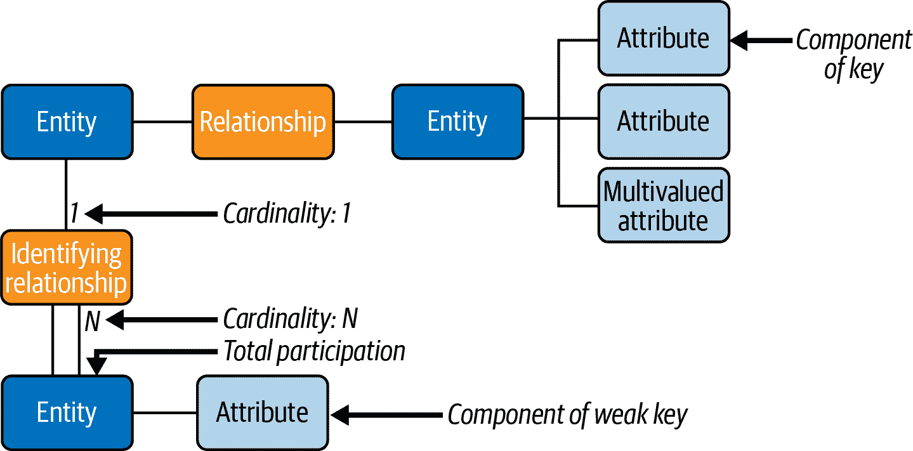
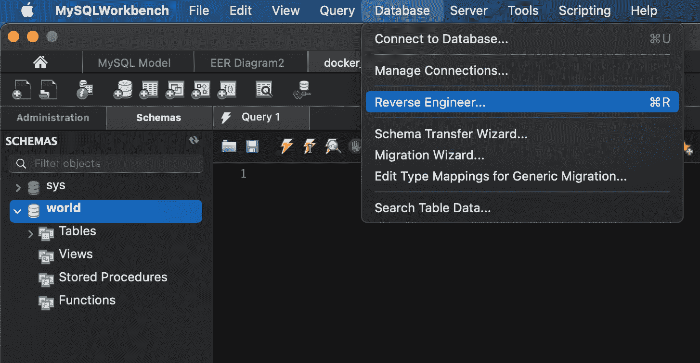
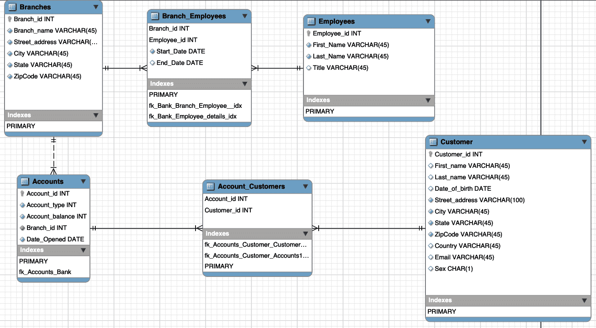

# 第二章：建模和设计数据库

在实施新数据库时，很容易陷入快速搭建并没有充分投入时间和精力进行设计的陷阱。这种粗心经常导致日后昂贵的重新设计和重新实施。设计数据库就像起草房子的蓝图；没有详细的计划就开始建造是愚蠢的。值得注意的是，良好的设计允许您扩展原始建筑，而无需拆除一切重新开始。正如您将看到的那样，糟糕的设计直接影响到数据库的性能不佳。

# 如何不开发数据库

数据库设计可能不是世界上最激动人心的任务，但确实成为了最重要的任务之一。在我们描述如何进行设计过程之前，让我们看一个动态设计数据库的例子。

想象一下，我们想为大学计算机科学系存储学生成绩的数据库。我们可以创建一个`Student_Grades`表，用于存储每个学生和每门课程的成绩。该表将为每位学生和他们所选课程的名字和姓氏，课程名称以及百分比结果（显示为`Pctg`）设置列。我们为每位学生的每门课程设置不同的行：

```
+------------+---------+-----------------------+------+
| GivenNames | Surname | CourseName            | Pctg |
+------------+---------+-----------------------+------+
| John Paul  | Bloggs  | Data Science          |   72 |
| Sarah      | Doe     | Programming 1         |   87 |
| John Paul  | Bloggs  | Computing Mathematics |   43 |
| John Paul  | Bloggs  | Computing Mathematics |   65 |
| Sarah      | Doe     | Data Science          |   65 |
| Susan      | Smith   | Computing Mathematics |   75 |
| Susan      | Smith   | Programming 1         |   55 |
| Susan      | Smith   | Computing Mathematics |   80 |
+------------+---------+-----------------------+------+
```

列表很简洁，我们可以轻松访问任何学生或任何课程的成绩，看起来类似于电子表格。然而，我们可能会有多个同名学生。例如，示例数据中的 Susan Smith 和 Computing Mathematics 课程有两个条目。哪个 Susan Smith 获得了 75%，哪个获得了 80%？区分重复数据条目的常见方法是为每个条目分配唯一编号。在这里，我们可以为每个学生分配一个唯一的`StudentID`编号：

```
+------------+------------+---------+-----------------------+------+
| StudentID  | GivenNames | Surname | CourseName            | Pctg |
+------------+------------+---------+-----------------------+------+
| 12345678   | John Paul  | Bloggs  | Data Science          |   72 |
| 12345121   | Sarah      | Doe     | Programming 1         |   87 |
| 12345678   | John Paul  | Bloggs  | Computing Mathematics |   43 |
| 12345678   | John Paul  | Bloggs  | Computing Mathematics |   65 |
| 12345121   | Sarah      | Doe     | Data Science          |   65 |
| 12345876   | Susan      | Smith   | Computing Mathematics |   75 |
| 12345876   | Susan      | Smith   | Programming 1         |   55 |
| 12345303   | Susan      | Smith   | Computing Mathematics |   80 |
+------------+------------+---------+-----------------------+------+
```

现在我们知道哪个 Susan Smith 获得了 80%：那位学生 ID 编号为 12345303 的 Susan Smith。

还有另一个问题。在我们的表中，John Paul Bloggs 在 Computing Mathematics 课程中有两个分数：他第一次以 43%不及格，然后第二次以 65%及格。在关系型数据库中，行形成一个集合，它们之间没有隐含的顺序。查看这张表时，我们可能会猜测通过发生在失败之后，但我们不能确定。不能保证更新的成绩会在较旧的成绩之后出现，因此我们需要添加每个成绩授予的时间信息，比如添加年份（`Year`）和学期（`Sem`）：

```
+------------+------------+---------+-----------------------+------+-----+------+
| StudentID  | GivenNames | Surname | CourseName            | Year | Sem | Pctg |
+------------+------------+---------+-----------------------+------+-----+------+
| 12345678   | John Paul  | Bloggs  | Data Science          | 2019 |   2 |   72 |
| 12345121   | Sarah      | Doe     | Programming 1         | 2020 |   1 |   87 |
| 12345678   | John Paul  | Bloggs  | Computing Mathematics | 2019 |   2 |   43 |
| 12345678   | John Paul  | Bloggs  | Computing Mathematics | 2020 |   1 |   65 |
| 12345121   | Sarah      | Doe     | Data Science          | 2020 |   1 |   65 |
| 12345876   | Susan      | Smith   | Computing Mathematics | 2019 |   1 |   75 |
| 12345876   | Susan      | Smith   | Programming 1         | 2019 |   2 |   55 |
| 12345303   | Susan      | Smith   | Computing Mathematics | 2020 |   1 |   80 |
+------------+------------+---------+-----------------------+------+-----+------+
```

注意，`Student_Grades`表变得有些臃肿。我们为每年重复了学生 ID、名字和姓氏。我们可以拆分信息并创建一个`Student_Details`表：

```
+------------+------------+---------+
| StudentID  | GivenNames | Surname |
+------------+------------+---------+
| 12345121   | Sarah      | Doe     |
| 12345303   | Susan      | Smith   |
| 12345678   | John Paul  | Bloggs  |
| 12345876   | Susan      | Smith   |
+------------+------------+---------+
```

我们可以在`Student_Grades`表中保留更少的信息：

```
+------------+-----------------------+------+-----+------+
| StudentID  | CourseName            | Year | Sem | Pctg |
+------------+-----------------------+------+-----+------+
| 12345678   | Data Science          | 2019 |   2 |   72 |
| 12345121   | Programming 1         | 2020 |   1 |   87 |
| 12345678   | Computing Mathematics | 2019 |   2 |   43 |
| 12345678   | Computing Mathematics | 2020 |   1 |   65 |
| 12345121   | Data Science          | 2020 |   1 |   65 |
| 12345876   | Computing Mathematics | 2019 |   1 |   75 |
| 12345876   | Programming 1         | 2019 |   2 |   55 |
| 12345303   | Computing Mathematics | 2020 |   1 |   80 |
+------------+-----------------------+------+-----+------+
```

要查找学生的成绩，我们首先需要从`Student_Details`表中查找他们的学生 ID，然后从`Student_Grades`表中读取该学生 ID 的成绩。

尽管如此，仍然有一些问题我们尚未考虑。例如，我们是否应该保留学生的入学日期、邮政地址和电子邮件地址、费用或出勤信息？我们应该如何存储地址以避免学生更改地址时出现问题？

以这种方式实施数据库是有问题的；我们会不断遇到之前未考虑到的问题，并不得不不断更改我们的数据库结构。通过仔细记录需求并逐步解决它们以开发一致的设计，我们可以节省大量重复工作。

# 数据库设计过程

数据库设计有三个主要阶段，每个阶段都会产生一个逐步降低级别的描述：

需求分析

首先，我们确定并写下了从数据库中所需的数据，我们将存储哪些数据以及数据项之间的关系。在实践中，这可能涉及详细研究应用程序需求，并与将与数据库和应用程序交互的各种角色的人员进行交谈。

概念设计

一旦我们知道了数据库的需求，我们就会将它们提炼成数据库设计的正式描述。在本章的后面，我们将看到如何使用建模来产生概念设计。

逻辑设计

最后，我们将数据库设计映射到现有的数据库管理系统和数据库表中。

在本章末尾，我们将看看如何使用开源 MySQL Workbench 工具将概念设计转换为 MySQL 数据库模式。

# 实体关系模型

在基本层面上，数据库存储关于不同对象或*实体*及这些实体之间的关系或*关系*的信息。例如，大学数据库可能存储关于学生、课程和注册的信息。学生和课程是实体，而注册是学生和课程之间的关系。类似地，库存和销售数据库可能存储关于产品、客户和销售的信息。产品和客户是实体，销售是客户和产品之间的关系。在开始时，混淆实体和关系是很常见的，您可能会把关系设计为实体，反之亦然。提高数据库设计技能的最佳方法是多加练习。

一种流行的概念设计方法使用*实体关系*（ER）模型，帮助将需求转化为数据库中实体和关系的正式描述。我们将首先了解 ER 建模过程的工作原理，然后在“实体关系建模示例”中观察三个样本数据库的应用。

## 实体表示

为了帮助可视化设计，ER 建模方法涉及绘制 ER 图。在 ER 图中，我们通过包含实体名称的矩形来表示实体集。对于我们的销售数据库示例，ER 图将显示产品和客户实体集，如图 2-1 所示。


###### 图 2-1。实体集由一个命名的矩形表示

通常，我们使用数据库来存储实体的特定特征或*属性*。在销售数据库中，我们可以记录每个客户的姓名、电子邮件地址、邮寄地址和电话号码。在更复杂的客户关系管理（CRM）应用程序中，我们还可以存储客户配偶和子女的姓名、客户所会说的语言、客户与公司互动的历史等信息。属性描述了它们所属的实体。

我们可以从较小的部分形成属性；例如，我们将街道号码、城市、邮政编码和国家组成邮寄地址。如果属性是以这种方式由较小的部分组成的，则我们将其分类为*复合*属性；否则为*简单*属性。

一些属性可以针对给定实体具有多个值——例如，一个客户可以提供多个电话号码，因此电话号码属性是*多值的*。

属性有助于区分同一类型的实体。我们可以使用姓名属性来区分客户，但这可能是一个不够充分的解决方案，因为有几个客户可能具有相同的姓名。为了区分它们，我们需要一个保证每个客户都唯一的属性（或最小组合的属性）。这些唯一标识属性形成一个唯一键，特别情况下称为*主键*。

在我们的示例中，我们可以假设没有两个客户具有相同的电子邮件地址，因此电子邮件地址可以作为主键。然而，在设计数据库时，我们需要仔细考虑我们选择的影响。例如，如果我们决定通过电子邮件地址识别客户，我们将如何处理一个客户拥有多个电子邮件地址的情况？我们构建的任何应用程序可能会将每个电子邮件地址视为一个独立的人。难以适应所有人可以有多个电子邮件地址的情况。使用电子邮件地址作为键还意味着每个客户必须有一个电子邮件地址；否则，我们无法区分没有电子邮件地址的客户。

查看可以作为备用键的其他属性时，我们看到虽然两个客户可能具有相同的电话号码（因此不能将电话号码作为键），但可能拥有相同电话号码的人不会有相同的姓名，因此我们可以使用电话号码和姓名的组合作为复合键。

显然，可能有几个可能的键可以用来标识一个实体；我们选择其中一个备选键，或*候选键*，作为我们的主键。通常我们选择的标准是属性对于每个实体来说是否非空且唯一，并且键的长度多大（较短的键在维护和使用查找操作时更快）。

在 ER 图中，属性表示为标记的椭圆形与它们的实体连接，如图 2-2 所示。组成主键的属性显示为下划线。任何组合属性的部分都画在组合属性的椭圆形上，而多值属性显示为双线椭圆形。


###### 图 2-2\. 客户实体的 ER 图表示

属性值是从合法值的域中选择的。例如，我们可以指定客户的名字和姓氏属性每个都可以是最多 100 个字符的字符串，而电话号码可以是最多 40 个字符的字符串。同样，产品价格可以是正有理数。

属性可以是空的；例如，有些客户可能不提供他们的电话号码。但是，实体的主键（包括多属性主键的组成部分）绝不能是未知的（技术上来说，必须是`NOT NULL`）。因此，如果一个客户可能不提供电子邮件地址，我们就不能将电子邮件地址作为键。

当将属性分类为多值时，你应该仔细思考：所有值是否等同，或者它们实际上代表了不同的事物？例如，当为客户列出多个电话号码时，它们是否更有用地分别标记为客户的办公电话号码、家庭电话号码、手机电话号码等？

让我们看另一个例子。销售数据库需求可能指定产品具有名称和价格。我们可以看到产品是一个实体，因为它是一个独立的对象。然而，产品的名称和价格不是独立的对象；它们是描述产品实体的属性。请注意，如果我们想为不同的市场设置不同的价格，则价格不再仅仅与产品实体相关，我们需要以不同的方式对其进行建模。

对于某些应用程序，没有组合属性可以唯一标识一个实体（或者使用大型复合键将会太麻烦），因此我们创建了一个被定义为唯一的人造属性，可以作为键使用：学生编号、社会保障号码、驾驶证号码和图书卡号码是为各种应用程序创建的唯一属性的例子。在我们的库存和销售应用程序中，我们可能会存储名称和价格相同但型号不同的不同产品。例如，我们可以销售两款售价均为每件$4.95 的“四口 USB 2.0 集线器”。为了区分这些产品，我们可以为每个我们库存的物品分配一个唯一的产品 ID 号码；这将成为主键。每个产品实体将具有名称、价格和产品 ID 属性。这在 ER 图中显示为图 2-3。


###### 图 2-3\. 产品实体的 ER 图表示

## 表示关系

实体可以参与与其他实体的关系。例如，客户可以购买产品，学生可以选修课程，员工可以有地址等等。

像实体一样，关系也可以具有属性：我们可以定义销售关系为客户实体（通过唯一的电子邮件地址标识）和给定产品实体（通过唯一的产品 ID 标识）之间的关系，这些产品在特定的日期和时间（时间戳）存在。

我们的数据库可以记录每笔销售，并告诉我们，例如在周三，3 月 22 日下午 3:13，Marcos Albe 购买了一个“Raspberry Pi 4”，一个“500 GB SSD M.2 NVMe”和两组“2000 瓦 5.1 声道重低音喇叭”。

不同数量的实体可以出现在关系的每一侧。例如，每个客户都可以购买任意数量的产品，每个产品也可以被任意数量的客户购买。这被称为*多对多*关系。我们还可以有*一对多*关系。例如，一个人可以有多张信用卡，但每张信用卡只属于一个人。从另一个角度看，*一对多*关系变成了*多对一*关系；例如，多张信用卡属于一个人。最后，汽车发动机上的序列号是*一对一*关系的一个例子；每个发动机只有一个序列号，每个序列号只属于一个发动机。我们使用简写术语*1:1*，*1:N*和*M:N*分别表示一对一，一对多和多对多关系。

关系的每一侧的实体数量（关系的基数）定义了关系的*键约束*。仔细考虑关系的基数非常重要。有许多关系乍看起来可能是一对一的，但事实上更为复杂。例如，人们有时会更改他们的姓名；在一些应用程序中，如警方数据库，这尤为重要，因此可能需要对人实体和姓名实体之间建模为多对多的关系。如果假设关系比实际情况简单，重设计数据库可能会很昂贵且耗时。

在 ER 图中，我们用一个带有名称的菱形表示关系集。关系的基数通常在关系菱形旁边标示；这是本书中使用的风格。（另一种常见的风格是在连接实体的“1”侧到关系菱形的线上有箭头头。）图 2-4 展示了顾客和产品实体之间的关系，以及销售关系的数量和时间戳属性。


###### 图 2-4\. 顾客和产品实体之间的 ER 图表示，以及它们之间的销售关系

## 部分和全参与

实体之间的关系可以是可选的或强制的。在我们的例子中，我们可以决定一个人只有在购买了产品后才被视为顾客。另一方面，我们也可以说顾客是我们知道并且希望可能购买东西的人，也就是说，在我们的数据库中可以列出从未购买产品的顾客。在第一种情况下，顾客实体在购买关系中具有*全参与*（所有顾客都购买了产品，我们不能有一个未购买产品的顾客），而在第二种情况下，它具有*部分参与*（顾客可以购买产品）。这些被称为关系的*参与约束*。在 ER 图中，我们用实体框和关系菱形之间的双线表示全参与。

## 实体还是属性？

偶尔我们会遇到这样的情况，我们在思考一个项目应该是属性还是自己的实体时会产生疑问。例如，电子邮件地址可以作为一个独立的实体进行建模。当有疑问时，请考虑以下经验法则：

*该项目是否直接关注数据库？*

直接关注的对象应该是实体，并且描述它们的信息应该存储在属性中。我们的库存和销售数据库真正关心的是顾客，而不是他们的电子邮件地址，因此最好将电子邮件地址建模为顾客实体的属性。

*项目本身是否有组成部分？*

如果是这样，我们必须找到一种表示这些组件的方法；一个独立的实体可能是最好的解决方案。在本章开头的学生成绩示例中，我们为每门学生选修的课程存储了课程名称、年份和学期。将课程视为一个独立的实体，并创建一个课程 ID 号来标识每次向学生提供课程（“提供”）可能更为紧凑。

*对象可以有多个实例吗？*

如果是这样，我们必须找到一种方法来在每个实例上存储数据。最清晰的做法是将对象表示为一个独立的实体。在我们的销售示例中，我们必须询问客户是否允许拥有多个电子邮件地址；如果是的话，我们应该将电子邮件地址建模为一个独立的实体。

*对象经常不存在或未知吗？*

如果是这样，它实际上只是一些实体的属性，并且最好将其建模为一个独立的实体，而不是经常为空的属性。考虑一个简单的例子：为了存储学生在不同课程中的成绩，我们可以在每门可能的课程中为学生的成绩设置一个属性，如图 2-5 所示。但是因为大多数学生只会在其中几门课程中有成绩，所以最好将成绩表示为一个独立的实体集，如图 2-6 所示。


###### 图 2-5\. 将学生成绩表示为学生实体的 ER 图


###### 图 2-6\. 学生成绩的实体关系图表示

## 实体还是关系？

确定对象应该是实体还是关系的一个简单方法是将需求中的名词映射到实体，并将动词映射到关系。例如，在语句“A degree program is made up of one or more courses”中，我们可以识别实体“program”和“course”，以及关系“is made up of”。类似地，在语句“A student enrolls in one program”中，我们可以识别实体“student”和“program”，以及关系“enrolls in”。当然，我们可以选择不同于出现在关系中的实体和关系的术语，但最好不要偏离需求中使用的命名约定，以便可以根据需求检查设计。在其他一切相等的情况下，尽量保持设计简单，并尽量避免引入不必要的实体。也就是说，在我们可以将其建模为现有学生和项目实体之间的关系时，没有必要为学生的注册单独引入一个独立的实体。

## 中间实体

通过用一个新的*中间*实体（有时称为*关联*实体）替换它，通过多对一和一对多关系连接原始实体，通常可以在概念上简化多对多关系。

考虑这个声明：“一个乘客可以预订一个航班的座位。”这是“乘客”和“航班”之间的多对多关系。相关的 ER 图片段显示在图 2-7 中。


###### 图 2-7\. 乘客参与 M:N 关系的航班

然而，让我们从关系的两个方面来看：

+   任何给定的航班都可以有多名预订乘客。

+   任何给定的乘客都可以在多个航班上预订。

因此，我们可以认为多对多关系实际上是两个单对多关系，各自的一条。这指向了一个隐藏的中间实体存在，即预订，在航班和乘客实体之间。需求可以更好地表述为：“一个乘客可以为一个航班预订座位。”更新后的 ER 图片段显示在图 2-8 中。


###### 图 2-8\. 位于乘客和航班实体之间的中间预订实体

每位乘客可以参与多个预订，但每个预订只属于一位乘客，因此此关系的基数是 1:N。类似地，一个给定航班可以有多个预订，但每个预订只属于一架航班，所以这个关系也有 1:N 的基数。由于每个预订必须与特定的乘客和航班相关联，预订实体在与这些实体的关系中完全参与（如第 77 页的“部分和完全参与”中描述的）。在图 2-7 的表示中无法有效捕捉这种完全参与。

## 弱实体和强实体

在我们日常互动中，背景信息非常重要；如果了解背景，我们就可以处理更少量的信息。例如，我们通常只用名字或昵称称呼家庭成员。在存在歧义时，我们会添加更多信息，比如姓氏，以澄清我们的意图。在数据库设计中，我们可以省略某些依赖于其他实体的关键信息。例如，如果我们想存储客户孩子的名字，我们可以创建一个子实体，并且仅存储足够的关键信息以在其父实体的上下文中标识它。我们可以简单地列出孩子的名字，假设客户不会有几个同名的孩子。在这里，子实体是*弱*实体，它与客户实体的关系被称为*标识关系*。弱实体完全参与标识关系，因为它们无法独立于所属实体存在于数据库中。

在 ER 图中，我们用双线显示弱实体和标识关系，并用虚线下划线表示弱实体的部分键，如图 2-9 所示。在其拥有（或*强*）实体的上下文中，弱实体可以唯一标识，因此弱实体的完整键是其自身（部分）键与其拥有实体的键的组合。例如，在我们的示例中唯一标识子实体需要子实体的名字和父母的电子邮件地址。

图 2-10 显示了我们为 ER 图解释的符号总结。


###### 图 2-9\. 弱实体的 ER 图表示



###### 图 2-10\. ER 图符号的总结

# 数据库规范化

数据库规范化是设计关系数据结构时的重要概念。关系数据库模型的发明者埃德加·F·科德博士在 70 年代初提出了这些规范形式，现在仍被广泛应用于行业。即使随着 NoSQL 数据库的出现，短期或中期内也没有证据表明关系数据库会消失或规范形式会不再使用。

规范形式的主要目标是减少数据冗余并提高数据完整性。规范化还便于重设计和扩展数据库结构的过程。

正式地说，有六个规范形式，但大多数数据库架构师只处理前三种形式。这是因为规范化过程是渐进的，除非满足了前几个级别，否则无法达到更高级别的数据库规范化。使用所有六种规范形式会过于束缚数据库模型，并且一般情况下，它们实现起来非常复杂。

在实际工作负载中，通常会出现性能问题。这是提取、转换和加载（*ETL*）作业存在的一个原因：它们对数据进行去规范化以处理它。

让我们来看看前三个范式：

第一范式（*1NF*）的目标如下

+   消除各个表中的重复组

+   为每组相关数据创建单独的表。

+   使用主键标识每组相关数据。

如果一个关系包含复合或多值属性，则违反了第一范式。反之，如果一个关系不包含任何复合或多值属性，则处于第一范式中。因此，如果该关系中的每个属性都具有适当类型的单个值，则该关系处于第一范式中。

第二范式（*2NF*）的目标是

+   为适用于多个记录的值集创建单独的表。

+   用外键将这些表关联起来。

记录不应依赖于除表的主键（必要时是复合键）之外的任何内容。

第三范式（*3NF*）增加了一个目标

+   消除不依赖于键的字段。

记录中的值如果不是记录的关键字，则不应该在表中。一般情况下，如果一组字段的内容可能适用于表中多个记录，则应考虑将这些字段放入单独的表中。

表 2-1 列出了从最不归一化到最归一化的各种范式。未归一化形式（UNF）是一个不符合数据库归一化条件的数据库模型。还有其他的归一化形式，但它们超出了本讨论的范围。

表 2-1. 各种范式（从最不归一化到最归一化）

|  | UNF（1970 年） | 1NF（1970 年） | 2NF（1971 年） | 3NF（1971 年） | 4NF（1977 年） | 5NF（1979 年） | 6NF（2003 年） |
| --- | --- | --- | --- | --- | --- | --- | --- |
| 主键（无重复元组） | 可能 | 是 | 是 | 是 | 是 | 是 | 是 |
| 无重复组 | 否 | 是 | 是 | 是 | 是 | 是 | 是 |
| 原子列（单元格只有单一值） | 否 | 是 | 是 | 是 | 是 | 是 | 是 |
| 每个非平凡的功能依赖要么不以候选键的真子集开始，要么以主属性结尾（不允许非主属性对候选键的部分功能依赖） | 否 | 否 | 是 | 是 | 是 | 是 | 是 |
| 每个非平凡的功能依赖要么以超键开始，要么以主属性结尾（不允许非主属性对候选键的传递功能依赖） | 否 | 否 | 否 | 是 | 是 | 是 | 是 |
| 每个非平凡的功能依赖要么以超键开始，要么以基本主属性结尾 | 否 | 否 | 否 | 否 | 是 | 是 | 不适用 |
| 每个非平凡的功能依赖都以超键开始 | 否 | 否 | 否 | 否 | 是 | 是 | 不适用 |
| 每个非平凡的多值依赖都以超键开始 | 否 | 否 | 否 | 否 | 是 | 是 | 不适用 |
| 每个连接依赖都有一个超键组件 | 否 | 否 | 否 | 否 | 否 | 是 | 不适用 |
| 每个连接依赖只有超键组件 | 否 | 否 | 否 | 否 | 否 | 是 | 不适用 |
| 每个约束都是领域约束和关键约束的结果 | 否 | 否 | 否 | 否 | 否 | 否 | 不适用 |
| 每个连接依赖都是平凡的 | 否 | 否 | 否 | 否 | 否 | 否 | 是 |

# 归一化示例表

为了更清楚地说明这些概念，让我们通过一个虚构的学生表的归一化示例来详细讨论。

我们将从未归一化的表开始：

```
Student#   Advisor   Adv-Room   Class1   Class2   Class3
1022       Jones     412        101-07   143-01   159-02
4123       Smith     216        201-01   211-02   214-01
```

## 第一范式：无重复组

每个属性应该在表中只有一个字段。因为一个学生有多门课程，这些课程应该在单独的表中列出。在我们未归一化的表中，字段`Class1`，`Class2`和`Class3`表明设计存在问题。

电子表格通常对同一属性有多个字段（例如 `address1`、`address2`、`address3`），但表不应如此。在一个一对多关系中，不要将一方和多方放在同一表中。而是通过消除重复组来创建第一范式中的另一个表，例如 `Class#`，如下所示：

```
Student#   Advisor   Adv-Room   Class#
1022       Jones     412        101-07
1022       Jones     412        143-01
1022       Jones     412        159-02
4123       Smith     216        201-01
4123       Smith     216        211-02
4123       Smith     216        214-01
```

## 第二范式：消除冗余数据

注意前表中每个 `Student#` 值的多个 `Class#` 值。`Class#` 不是对 `Student#`（主键）的功能依赖，因此这种关系不符合第二范式。

下面两张表演示了转换为第二范式。我们现在有一个 `Students` 表：

```
Student#    Advisor   Adv-Room
1022        Jones     412
4123        Smith     216
```

以及 `Registration` 表：

```
Student#  Class#
1022      101-07
1022      143-01
1022      159-02
4123      201-01
4123      211-02
4123      214-01
```

## 第三范式：消除不依赖于键的数据

在前面的示例中，`Adv-Room`（顾问的办公室号码）对 `Advisor` 属性具有功能依赖。解决方案是将该属性从 `Students` 表移至 `Faculty` 表，如下所示。

`Students` 表现在看起来像这样：

```
Student#  Advisor
1022      Jones
4123      Smith
```

这是 `Faculty` 表：

```
Name  Room  Dept
Jones 412 42
Smith 216 42
```

# 实体关系建模示例

在前几节中，我们通过假设示例帮助您了解数据库设计、ER 图和规范化的基础知识。现在我们将看一些 MySQL 可用示例数据库中的 ER 示例以可视化 ER 图。为了可视化 ER 图，我们将使用 [*MySQL Workbench*](https://oreil.ly/1971c)。

MySQL Workbench 使用物理 ER 表示。物理 ER 图模型更加细粒度化，显示向数据库添加信息所需的过程。与使用符号不同，我们在 ER 图中使用表，使其更接近真实数据库。MySQL Workbench 更进一步使用 *增强实体-关系（EER）图*。EER 图是 ER 图的扩展版本。

我们不会详细讨论，但 EER 图的主要优点是，它提供了 ER 图的所有元素，并增加了对以下内容的支持：

+   属性和关系继承

+   类别或联合类型

+   专业化和泛化

+   子类和超类

让我们从下载示例数据库并在 MySQL Workbench 中可视化其 EER 图的过程开始。

我们将使用的第一个是 `sakila` 数据库。该数据库的开发始于 2005 年。早期设计基于戴尔白皮书 [“三种在戴尔 PowerEdge 服务器上使用 MySQL 应用的方法”](https://oreil.ly/aDDlO)，该白皮书设计用于代表在线 DVD 商店。类似地，`sakila` 示例数据库设计用于代表 DVD 租赁店，并借用了戴尔示例数据库的电影和演员名称。您可以使用以下命令将 `sakila` 数据库导入到您的 MySQL 实例中：

```
# wget https://downloads.mysql.com/docs/sakila-db.tar.gz
# tar -xvf sakila-db.tar.gz
# mysql -uroot -pmsandbox < sakila-db/sakila-schema.sql
# mysql -uroot -pmsandbox < sakila-db/sakila-data.sql
```

`sakila`还提供了 EER 模型，在*sakila.mwb*文件中。您可以使用 MySQL Workbench 打开该文件，如图 2-11 所示。


###### 图 2-11\. `sakila`数据库的 EER 模型；注意实体的物理表示而不是使用符号

接下来是`world`数据库，使用来自[芬兰统计局](https://oreil.ly/0Y9tZ)的样本数据。

以下命令将`world`数据库导入到您的 MySQL 实例中：

```
# wget https://downloads.mysql.com/docs/world-db.tar.gz
# tar -xvf world-db.tar.gz
# mysql -uroot -plearning_mysql < world-db/world.sql
```

`world`数据库没有像`sakila`那样的 EER 文件，但是您可以使用 MySQL Workbench 从数据库创建 EER 模型。要执行此操作，请从数据库菜单中选择反向工程，如图 2-12 所示。



###### 图 2-12\. 从`world`数据库进行反向工程

Workbench 将连接到数据库（如果尚未连接），并提示您选择要反向工程的模式，如图 2-13 所示。

点击“继续”，然后在下一个屏幕上点击“执行”，如图 2-14 所示。


###### 图 2-13\. 选择模式


###### 图 2-14\. 点击*执行*以启动反向工程过程

这产生了`world`数据库的 ER 模型，如图 2-15 所示。


###### 图 2-15\. `world`数据库的 ER 模型

您将导入的最后一个数据库是`employees`数据库。Fusheng Wang 和 Carlo Zaniolo 在 Siemens Corporate Research 创建了[原始数据](https://oreil.ly/1rvPc)，Giuseppe Maxia 制作了关系模式，Patrick Crews 以关系格式导出了数据。

要导入数据库，首先您需要克隆 Git 仓库：

```
# git clone https://github.com/datacharmer/test_db.git
# cd test_db
# cat employees.sql | mysql -uroot -psekret
```

然后，您可以再次使用 MySQL Workbench 的反向工程过程为`employees`数据库创建 ER 模型，如图 2-16 所示。


###### 图 2-16\. `employees`数据库的 ER 模型

您必须仔细审查此处显示的 ER 模型，以便理解实体及其属性之间的关系。一旦概念确立，开始实践。在下一节中，我们将向您展示如何在您的 MySQL 服务器上创建数据库，详见第四章。

# 使用实体关系模型

本节讨论创建 ER 模型并将其部署到数据库表所需的步骤。我们之前看到 MySQL Workbench 允许我们对现有数据库进行反向工程。但是，如何建模新数据库并部署它呢？我们可以使用 MySQL Workbench 工具自动化这个过程。

## 将实体和关系映射到数据库表

在将 ER 模型转换为数据库模式时，我们根据以下部分讨论的规则处理每个实体，然后处理每个关系，以最终得到一组数据库表。

### 将实体映射到数据库表

对于每个强实体，创建一个包含其属性的表，并指定主键。任何复合属性的部分也包括在此处。

对于每个弱实体，创建一个包含其属性的表，并包括其所属实体的主键。所属实体的主键在此处是外键，因为它不是本表的键，而是另一张表的键。弱实体的表主键是外键和弱实体部分键的组合。如果与所属实体的关系具有任何属性，请将它们添加到此表中。

对于每个实体的多值属性，创建一个包含实体主键和属性的表。

### 将关系映射到数据库表

两个实体之间的每个一对一关系在属于另一个实体的表中包含一个实体的主键作为外键。如果一个实体完全参与关系，请将外键放置在其表中。如果两者都完全参与关系，请考虑将它们合并成一个单一表。

对于两个实体之间的每个非标识一对多关系，在“1”侧的实体的主键作为外键包含在“N”侧实体的表中。在外键旁边的表中添加关系的任何属性。请注意，标识一对多关系（弱实体与其所属实体之间的关系）作为实体映射阶段的一部分进行捕捉。

对于两个实体之间的每个多对多关系，请创建一个新表，其中包含每个实体的主键作为主键，并添加关系的任何属性。此步骤有助于识别中间实体。

对于涉及多于两个实体的每个关系，创建一个包含所有参与实体的主键的表，并添加任何关系属性。

## 创建银行数据库 ER 模型

我们已经讨论了学生成绩和客户信息的数据库模型，以及三个适用于 MySQL 的开源 EER。现在让我们看看如何建模银行数据库。我们从利益相关者那里收集了所有必要信息，并为在线银行系统定义了我们的需求，我们决定需要以下实体：

+   员工

+   分支机构

+   客户

+   账户

现在，根据刚刚描述的映射规则，我们将为每个表创建表和属性。我们设定了主键，以确保每个表都有一个唯一的标识列用于其记录。接下来，我们需要定义表之间的关系。

### 多对多关系（N:M）

我们已经在分支和员工之间，以及账户和客户之间建立了这种类型的关系。员工可以在任意数量的分支工作，而一个分支可以拥有任意数量的员工。类似地，一个客户可以拥有多个账户，而一个账户可以是由两个以上客户持有的联合账户。

为了建模这些关系，我们需要两个更多的中间实体。我们如下创建它们：

+   account_customers

+   branch_employees

account_customers 和 branch_employees 实体将成为账户和客户实体以及分支和员工实体之间的桥梁。我们将 N:M 关系转换为两个 1:N 关系。你将在下一节看到设计的具体样子。

### 一对多关系（1:N）

分支和账户之间，以及客户和 account_customers 之间存在这种类型的关系。这引出了 *非标识关系* 的概念。例如，在 `accounts` 表中，`branch_id` 字段不是主键的一部分（原因之一是你可以将银行账户转移到另一个分支）。如今在每个表中保留一个代理键作为主键是很普遍的做法；因此，在数据模型中外键也是主键的真实标识关系比较罕见。

因为我们正在创建一个物理 EER 模型，我们也将定义主键。通常建议使用自增无符号字段作为主键。

图 2-17 展示了银行模型的最终表示。



###### 图 2-17\. `bank` 数据库的 EER 模型

请注意，有一些我们没有考虑到的项目。例如，我们的模型不支持客户拥有多个地址（比如工作地址和家庭地址）。我们有意为之，以突显在数据库部署之前收集需求的重要性。

你可以从本书的 [GitHub 仓库](https://oreil.ly/FJm12) 下载该模型。文件名为 *bank_model.mwb*。

## 使用 Workbench 将 EER 转换为 MySQL 数据库

使用工具绘制 ER 图是个好主意；这样一来，你可以轻松编辑和重新定义它们，直到最终图表清晰明了。一旦你对模型感到满意，可以进行部署。MySQL Workbench 允许将 EER 模型转换为数据定义语言（DDL）语句，用以创建 MySQL 数据库，使用数据库菜单中的正向工程选项（图 2-18）。


###### 图 2-18\. 在 MySQL Workbench 中进行正向工程设计数据库

你需要输入凭据来连接数据库，之后 MySQL Workbench 将展示一些选项。对于这个模型，我们将使用标准选项，如图 2-19 所示，除了最后一个选项外都取消选择。


###### 图 2-19\. 数据库创建选项

接下来的屏幕将询问我们希望生成模型的哪些元素。因为我们没有特别的需求如触发器、存储过程、用户等，我们只会创建表对象及其关系；其余选项都未选中。

MySQL Workbench 将会展示给我们执行以创建数据库的 SQL 脚本，如图 2-20 所示。


###### 图 2-20\. 用于创建数据库的生成脚本

当我们点击“继续”时，MySQL Workbench 将在我们的 MySQL 服务器上执行这些语句，如图 2-21 所示。

我们在 “创建表格” 中详细解释了此脚本中的语句。


###### 图 2-21\. MySQL Workbench 开始运行该脚本
