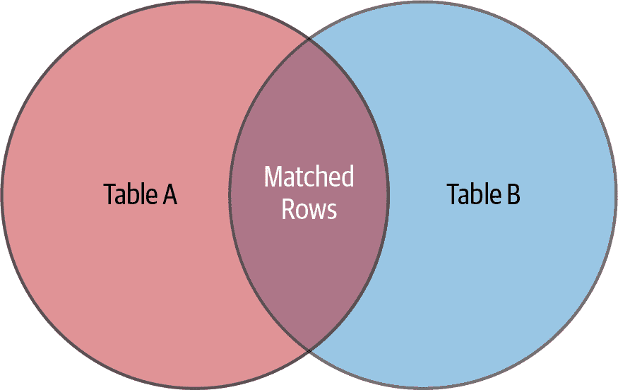

# 第三章：基本 SQL

如第二章所述，Edgar F. Codd 博士在 20 世纪 70 年代初提出了关系数据库模型及其规范形式。1974 年，IBM 旧金山实验室的研究人员开始了一个名为 System R 的旨在证明关系模型可行性的重大项目。同时，Donald Chamberlin 博士及其同事们也在努力定义一种数据库语言。他们开发了结构化英语查询语言（SEQUEL），允许用户使用明确定义的英语风格句子查询关系数据库。后来出于法律原因，这一语言被重命名为结构化查询语言（SQL）。

第一批基于 SQL 的数据库管理系统于 70 年代末商业化推出。随着围绕数据库语言开发活动的增加，标准化工作出现以简化事务，并最终社区统一了 SQL。美国和国际标准组织（ANSI 和 ISO）参与了标准化过程，并于 1986 年批准了第一个 SQL 标准。标准随后多次修订，版本名称（SQL:1999、SQL:2003、SQL:2008 等）表示对应年份发布的版本。我们将使用术语 *SQL 标准* 或 *标准 SQL* 表示任何时间的当前 SQL 标准版本。

MySQL 扩展了标准 SQL，提供了额外的功能。例如，MySQL 实现了[`STRAIGHT_JOIN`](https://oreil.ly/rAHrZ)，这是其他 DBMS 不认可的语法。

本章介绍了 MySQL 的 SQL 实现，我们通常将其称为 *CRUD* 操作：`create`、`read`、`update` 和 `delete`。我们将向您展示如何使用 `SELECT` 语句从数据库中读取数据，并选择要检索的数据以及显示顺序。我们还将向您展示如何使用 `INSERT` 语句添加数据，使用 `UPDATE` 修改数据，以及使用 `DELETE` 删除数据的基础知识。最后，我们将解释如何使用非标准的 `SHOW TABLES` 和 `SHOW COLUMNS` 语句来探索您的数据库。

# 使用 sakila 数据库

如第二章所示，我们向您展示了如何使用 ER 模型构建数据库图的原则。我们还介绍了将 ER 模型转换为适合构建关系数据库的格式的步骤。本节将向您展示 MySQL `sakila` 数据库的结构，以便您开始熟悉不同的数据库关系模型。我们不会在这里解释用于创建数据库的 SQL 语句；这是第四章的主题。

如果您还没有导入数据库，请按照“实体关系建模示例”中的步骤执行该任务。

要选择 `sakila` 数据库作为我们当前的数据库，我们将使用 `USE` 语句。输入以下命令：

```
mysql> `USE` `sakila``;`
```

```
Database changed
mysql>
```

通过输入**`SELECT DATABASE();`**命令可以查看当前活动的数据库：

```
mysql> `SELECT` `DATABASE``(``)``;`
```

```
+------------+
| DATABASE() |
+------------+
| sakila     |
+------------+
1 row in set (0.00 sec)
```

现在，让我们使用`SHOW TABLES`语句探索构成`sakila`数据库的表格：

```
mysql> `SHOW` `TABLES``;`
```

```
+----------------------------+
| Tables_in_sakila           |
+----------------------------+
| actor                      |
| actor_info                 |
| ...                        |
| customer                   |
| customer_list              |
| film                       |
| film_actor                 |
| film_category              |
| film_list                  |
| film_text                  |
| inventory                  |
| language                   |
| nicer_but_slower_film_list |
| payment                    |
| rental                     |
| sales_by_film_category     |
| sales_by_store             |
| staff                      |
| staff_list                 |
| store                      |
+----------------------------+
23 rows in set (0.00 sec)
```

到目前为止，没有什么意外。让我们更多地了解构成`sakila`数据库的每个表。首先，让我们使用`SHOW COLUMNS`语句来探索`actor`表（请注意，输出已换行以适应页面边距）：

```
mysql> `SHOW` `COLUMNS` `FROM` `actor``;`
```

```
+-------------+-------------------+------+-----+-------------------+...
| Field       | Type              | Null | Key | Default           |...
+-------------+-------------------+------+-----+-------------------+...
| actor_id    | smallint unsigned | NO   | PRI | NULL              |...
| first_name  | varchar(45)       | NO   |     | NULL              |...
| last_name   | varchar(45)       | NO   | MUL | NULL              |...
| last_update | timestamp         | NO   |     | CURRENT_TIMESTAMP |...
+-------------+-------------------+------+-----+-------------------+...
 ...+-----------------------------------------------+
 ...| Extra                                         |
 ...+-----------------------------------------------+
 ...| auto_increment                                |
 ...|                                               |
 ...|                                               |
 ...| DEFAULT_GENERATED on update CURRENT_TIMESTAMP |
 ...+-----------------------------------------------+
4 rows in set (0.01 sec)
```

`DESCRIBE`关键字与`SHOW COLUMNS FROM`相同，我们可以缩写为`DESC`，因此可以将前一个查询写成如下形式：

```
mysql> `DESC` `actor``;`
```

生成的输出相同。让我们更仔细地查看表的结构。`actor`表包含四列，`actor_id`、`first_name`、`last_name`和`last_update`。我们还可以提取列的类型：`actor_id`是`smallint`，`first_name`和`last_name`是`varchar(45)`，`last_update`是`timestamp`。没有任何列接受`NULL`（空）值，`actor_id`是主键（`PRI`），`last_name`是非唯一索引的第一列（`MUL`）。不必担心细节；现在重要的是我们将在 SQL 命令中使用的列名。

接下来，通过执行`DESC`语句来探索`city`表格：

```
mysql> `DESC` `city``;`
```

```
+-------------+-------------------+------+-----+-------------------+...
| Field       | Type              | Null | Key | Default           |...
+-------------+-------------------+------+-----+-------------------+...
| city_id     | smallint unsigned | NO   | PRI | NULL              |...
| city        | varchar(50)       | NO   |     | NULL              |...
| country_id  | smallint unsigned | NO   | MUL | NULL              |...
| last_update | timestamp         | NO   |     | CURRENT_TIMESTAMP |...
+-------------+-------------------+------+-----+-------------------+...
...+-----------------------------------------------+
...| Extra                                         |
...+-----------------------------------------------+
...| auto_increment                                |
...|                                               |
...|                                               |
...| DEFAULT_GENERATED on update CURRENT_TIMESTAMP |
...+-----------------------------------------------+
4 rows in set (0.01 sec)
```

###### 注意

在“额外”列中看到的`DEFAULT_GENERATED`表示该特定列使用默认值。这是 MySQL 8.0 的特殊标注，不适用于 MySQL 5.7 或 MariaDB 10.5。

再次强调的是要熟悉每个表中的列名，因为我们在讨论查询时会频繁使用这些列。

下一节将向您展示如何探索 MySQL 存储在`sakila`数据库及其表中的数据。

# `SELECT`语句与基本查询技术

前几章向您展示了如何安装和配置 MySQL，使用 MySQL 命令行，并介绍了 ER 模型。现在您已经准备好开始学习所有 MySQL 客户端都使用的 SQL 语言，用于探索和操作数据。本节介绍了最常用的 SQL 关键字：`SELECT`关键字。我们解释了风格和语法的基本要素以及`WHERE`子句、布尔运算符和排序的特性（这在我们后续讨论`INSERT`、`UPDATE`和`DELETE`时也大多适用）。这不是我们关于`SELECT`讨论的结束；在第五章中，我们将展示如何使用其高级功能。

## 单表查询

最基本的`SELECT`形式从表中读取所有行和列的数据。使用命令行连接到 MySQL 并选择`sakila`数据库：

```
mysql> `USE` `sakila``;`
```

```
Database changed
```

让我们检索`language`表中的所有数据：

```
mysql> `SELECT` `*` `FROM` `language``;`
```

```
+-------------+----------+---------------------+
| language_id | name     | last_update         |
+-------------+----------+---------------------+
|           1 | English  | 2006-02-15 05:02:19 |
|           2 | Italian  | 2006-02-15 05:02:19 |
|           3 | Japanese | 2006-02-15 05:02:19 |
|           4 | Mandarin | 2006-02-15 05:02:19 |
|           5 | French   | 2006-02-15 05:02:19 |
|           6 | German   | 2006-02-15 05:02:19 |
+-------------+----------+---------------------+
6 rows in set (0.00 sec)
```

输出有六行，每行包含表中所有列的值。我们现在知道有六种语言，可以看到语言、它们的标识符以及每种语言的最后更新时间。

简单的`SELECT`语句有四个组成部分：

1.  关键字`SELECT`。

1.  要显示的列。星号（`*`）符号是一个通配符，表示所有列。

1.  关键词`FROM`。

1.  表名。

在这个例子中，我们要求从`language`表中获取所有列，这就是 MySQL 返回给我们的结果。

让我们再试一个简单的`SELECT`。这次，我们将从`city`表中检索所有列：

```
mysql> `SELECT` `*` `FROM` `city``;`
```

```
+---------+------------------------+------------+---------------------+
| city_id | city                   | country_id | last_update         |
+---------+------------------------+------------+---------------------+
|       1 | A Corua (La Corua)     |         87 | 2006-02-15 04:45:25 |
|       2 | Abha                   |         82 | 2006-02-15 04:45:25 |
|       3 | Abu Dhabi              |        101 | 2006-02-15 04:45:25 |
|     ...                                                             |
|     599 | Zhoushan               |         23 | 2006-02-15 04:45:25 |
|     600 | Ziguinchor             |         83 | 2006-02-15 04:45:25 |
+---------+------------------------+------------+---------------------+
600 rows in set (0.00 sec)
```

有 600 个城市，输出与我们第一个例子的基本结构相同。

此示例提供了关于表之间关系如何工作的一些见解。考虑结果的第一行。在`country_id`列中，您将看到值 87。正如稍后将看到的那样，我们可以检查`country`表，找出代码为 87 的国家是西班牙。我们将在“连接两个表”中讨论如何编写关于表之间关系的查询。

如果查看完整的输出，您还会看到多个具有相同`country_id`的不同城市。重复的`country_id`值不是问题，因为我们期望一个国家有多个城市（一对多关系）。

现在您应该能够选择数据库，列出其表，并使用`SELECT`语句从表中检索所有数据。为了练习，您可能想尝试在`sakila`数据库中的其他表上进行实验。请记住，您可以使用`SHOW TABLES`语句查找表名。

## 选择列

早些时候，我们使用`*`通配符字符检索表中的所有列。如果您不想显示所有列，可以通过按照您想要的顺序以逗号分隔列出所需的列来更具体地操作。例如，如果您只想从`city`表中获取`city`列，您可以输入：

```
mysql> `SELECT` `city` `FROM` `city``;`
```

```
+--------------------+
| city               |
+--------------------+
| A Corua (La Corua) |
| Abha               |
| Abu Dhabi          |
| Acua               |
| Adana              |
+--------------------+
5 rows in set (0.00 sec)
```

如果您想要`city`和`city_id`两列，那么您将按照顺序使用：

```
mysql> `SELECT` `city``,` `city_id` `FROM` `city``;`
```

```
+--------------------+---------+
| city               | city_id |
+--------------------+---------+
| A Corua (La Corua) |       1 |
| Abha               |       2 |
| Abu Dhabi          |       3 |
| Acua               |       4 |
| Adana              |       5 |
+--------------------+---------+
5 rows in set (0.01 sec)
```

您甚至可以多次列出列：

```
mysql> `SELECT` `city``,` `city` `FROM` `city``;`
```

```
+--------------------+--------------------+
| city               | city               |
+--------------------+--------------------+
| A Corua (La Corua) | A Corua (La Corua) |
| Abha               | Abha               |
| Abu Dhabi          | Abu Dhabi          |
| Acua               | Acua               |
| Adana              | Adana              |
+--------------------+--------------------+
5 rows in set (0.00 sec)
```

尽管这看起来可能毫无意义，但结合在更高级查询中使用别名时，它可以很有用，正如您将在第五章中看到的那样。

您可以在`SELECT`语句中指定数据库、表和列名。这样可以避免使用`USE`命令，并直接在任何数据库和表上使用`SELECT`；它还有助于解决歧义，正如我们将在“连接两个表”中展示的那样。例如，假设您想从`sakila`数据库的`language`表中检索`name`列。您可以使用以下命令实现：

```
mysql> `SELECT` `name` `FROM` `sakila``.``language``;`
```

```
+----------+
| name     |
+----------+
| English  |
| Italian  |
| Japanese |
| Mandarin |
| French   |
| German   |
+----------+
6 rows in set (0.01 sec)
```

`FROM`关键字后面的`sakila.language`部分指定了`sakila`数据库及其`language`表。在运行此查询之前，无需输入**`USE sakila;`**命令。此语法也可用于其他 SQL 语句，包括我们稍后在本章讨论的`UPDATE`、`DELETE`、`INSERT`和`SHOW`语句。

## 使用 WHERE 子句选择行

本节介绍 `WHERE` 子句，并解释如何使用运算符编写表达式。你将在 `SELECT` 语句以及其他语句如 `UPDATE` 和 `DELETE` 中看到这些内容；我们稍后在本章中会展示示例。

### WHERE 基础

`WHERE` 子句是一个强大的工具，允许你从 `SELECT` 语句中过滤返回哪些行。你可以使用它来返回满足条件的行，比如具有完全匹配字符串的列值，大于或小于某个值的数字，或者是一个字符串是另一个字符串的前缀。几乎本章和后续章节的所有示例都包含 `WHERE` 子句，你会非常熟悉它们。

最简单的 `WHERE` 子句是完全匹配一个值的子句。考虑一个例子，你想查找 `language` 表中英语语言的详细信息。你会输入：

```
mysql> `SELECT` `*` `FROM` `sakila``.``language` `WHERE` `name` `=` `'English'``;`
```

```
+-------------+---------+---------------------+
| language_id | name    | last_update         |
+-------------+---------+---------------------+
|           1 | English | 2006-02-15 05:02:19 |
+-------------+---------+---------------------+
1 row in set (0.00 sec)
```

MySQL 返回所有匹配你搜索条件的行，本例中只返回一个行及其所有列。

再试一个精确匹配的例子。假设你想找出 `actor` 表中 `actor_id` 值为 4 的演员的名字。你会输入：

```
mysql> `SELECT` `first_name` `FROM` `actor` `WHERE` `actor_id` `=` `4``;`
```

```
+------------+
| first_name |
+------------+
| JENNIFER   |
+------------+
1 row in set (0.00 sec)
```

在这里，你提供了一个列和一行，包括在 `SELECT` 关键字之后的列 `first_name` 并指定 `WHERE actor_id = 4`。

如果一个值匹配多个行，结果将包含所有匹配项。假设你想查看所有属于 `country_id` 为 15 的巴西的城市，你会输入：

```
mysql> `SELECT` `city` `FROM` `city` `WHERE` `country_id` `=` `15``;`
```

```
+----------------------+
| city                 |
+----------------------+
| Alvorada             |
| Angra dos Reis       |
| Anpolis              |
| Aparecida de Goinia  |
| Araatuba             |
| Bag                  |
| Belm                 |
| Blumenau             |
| Boa Vista            |
| Braslia              |               |
| ...                  |
+----------------------+
28 rows in set (0.00 sec)
```

结果显示属于巴西的 28 个城市的名称。如果我们能将从 `city` 表获取的信息与从 `country` 表获取的信息连接起来，我们就能显示城市名称及其对应的国家。我们将在 “连接两个表” 中看到如何执行此类查询。

现在让我们检索属于范围的值。对于数值范围，检索多个值很简单，所以让我们从查找所有 `city_id` 小于 5 的城市名称开始。要执行此操作，请执行以下语句：

```
mysql> `SELECT` `city` `FROM` `city` `WHERE` `city_id` `<` `5``;`
```

```
+--------------------+
| city               |
+--------------------+
| A Corua (La Corua) |
| Abha               |
| Abu Dhabi          |
| Acua               |
+--------------------+
4 rows in set (0.00 sec)
```

对于数字，经常使用的运算符包括等于 (`=`)，大于 (`>`)，小于 (`<`)，小于或等于 (`<=`)，大于或等于 (`>=`)，不等于 (`<>` 或 `!=`)。

再考虑一个例子。如果你想找出所有没有 `language_id` 为 2 的语言，你会输入：

```
mysql> `SELECT` `language_id``,` `name` `FROM` `sakila``.``language`
    -> `WHERE` `language_id` `<``>` `2``;`
```

```
+-------------+----------+
| language_id | name     |
+-------------+----------+
|           1 | English  |
|           3 | Japanese |
|           4 | Mandarin |
|           5 | French   |
|           6 | German   |
+-------------+----------+
5 rows in set (0.00 sec)
```

前面的输出显示了表中的第一个、第三个和所有后续语言。请注意，你可以为 *不等于* 条件使用 `<>` 或 `!=` 运算符。

对于字符串，你可以使用相同的运算符。默认情况下，字符串比较不区分大小写，并使用当前字符集。例如：

```
mysql> `SELECT` `first_name` `FROM` `actor` `WHERE` `first_name` `<` `'B'``;`
```

```
+------------+
| first_name |
+------------+
| ALEC       |
| AUDREY     |
| ANNE       |
| ANGELA     |
| ADAM       |
| ANGELINA   |
| ALBERT     |
| ADAM       |
| ANGELA     |
| ALBERT     |
| AL         |
| ALAN       |
| AUDREY     |
+------------+
13 rows in set (0.00 sec)
```

“不区分大小写” 意味着 `B` 和 `b` 将被视为相同的过滤器，因此此查询将提供相同的结果：

```
mysql> `SELECT` `first_name` `FROM` `actor` `WHERE` `first_name` `<` `'b'``;`
```

```
+------------+
| first_name |
+------------+
| ALEC       |
| AUDREY     |
| ANNE       |
| ANGELA     |
| ADAM       |
| ANGELINA   |
| ALBERT     |
| ADAM       |
| ANGELA     |
| ALBERT     |
| AL         |
| ALAN       |
| AUDREY     |
+------------+
13 rows in set (0.00 sec)
```

另一个常见的字符串任务是查找以前缀开头、包含字符串或以后缀结尾的匹配项。例如，我们可能想要查找所有以词组 “Retro” 开头的专辑名称。我们可以在 `WHERE` 子句中使用 `LIKE` 运算符来实现这一点。让我们看一个例子，我们正在搜索标题包含单词 `family` 的电影：

```
mysql> `SELECT` `title` `FROM` `film` `WHERE` `title` `LIKE` `'%family%'``;`
```

```
+----------------+
| title          |
+----------------+
| CYCLONE FAMILY |
| DOGMA FAMILY   |
| FAMILY SWEET   |
+----------------+
3 rows in set (0.00 sec)
```

让我们看看这是如何工作的。`LIKE` 子句用于字符串，并表示匹配必须符合后面的字符串中的模式。在我们的示例中，我们使用了 `LIKE '%family%'`，这意味着字符串必须包含 `family`，并且可以在前后包含零个或多个字符。大多数与 `LIKE` 结合使用的字符串包含百分号字符 (`%`) 作为通配符字符，可以匹配所有可能的字符串。你可以用它来定义以后缀结尾的字符串，比如 `"%ing"`，或者以特定子串开头的字符串，比如 `"Corruption%"`。

例如，`"John%"` 将匹配所有以 `John` 开头的字符串，如 `John Smith` 和 `John Paul Getty`。模式 `"%Paul"` 匹配所有以 `Paul` 结尾的字符串。最后，模式 `"%Paul%"` 匹配所有包含 `Paul` 的字符串，包括在开头或结尾。

如果你想在 `LIKE` 子句中匹配恰好一个通配符字符，你可以使用下划线 (`_`) 字符。例如，如果你想要所有以 NAT 开头的演员名字的电影标题，你可以使用：

```
mysql> `SELECT` `title` `FROM` `film_list` `WHERE` `actors` `LIKE` `'NAT_%'``;`
```

```
+----------------------+
| title                |
+----------------------+
| FANTASY TROOPERS     |
| FOOL MOCKINGBIRD     |
| HOLES BRANNIGAN      |
| KWAI HOMEWARD        |
| LICENSE WEEKEND      |
| NETWORK PEAK         |
| NUTS TIES            |
| TWISTED PIRATES      |
| UNFORGIVEN ZOOLANDER |
+----------------------+
9 rows in set (0.04 sec)
```

###### 提示

通常，你应该避免在模式的开头使用百分号 (`%`) 通配符，就像以下例子中一样：

```
mysql> `SELECT` `title` `FROM` `film` `WHERE` `title` `LIKE` `'%day%'``;`
```

你将得到结果，但 MySQL 不会在此条件下使用索引。使用通配符将强制 MySQL 读取整个表以检索结果，如果表有数百万行，这可能会严重影响性能。

### 使用 AND、OR、NOT 和 XOR 结合条件

到目前为止，我们使用 `WHERE` 子句来测试一个条件，返回所有满足条件的行。你可以使用布尔运算符 `AND`、`OR`、`NOT` 和 `XOR` 来组合两个或更多条件。

让我们从一个例子开始。假设你想找到评级为 PG 的科幻电影的标题。这在使用 `AND` 运算符时非常简单：

```
mysql> `SELECT` `title` `FROM` `film_list` `WHERE` `category` `LIKE` `'Sci-Fi'`
    -> `AND` `rating` `LIKE` `'PG'``;`
```

```
+----------------------+
| title                |
+----------------------+
| CHAINSAW UPTOWN      |
| CHARADE DUFFEL       |
| FRISCO FORREST       |
| GOODFELLAS SALUTE    |
| GRAFFITI LOVE        |
| MOURNING PURPLE      |
| OPEN AFRICAN         |
| SILVERADO GOLDFINGER |
| TITANS JERK          |
| TROJAN TOMORROW      |
| UNFORGIVEN ZOOLANDER |
| WONDERLAND CHRISTMAS |
+----------------------+
12 rows in set (0.07 sec)
```

`WHERE` 子句中的 `AND` 操作将结果限制为满足两个条件的行。

`OR` 操作符用于查找满足多个条件之一的行。例如，现在想象一下你想要一个儿童或家庭类别电影的列表。你可以使用 `OR` 和两个 `LIKE` 子句来实现这一点：

```
mysql> `SELECT` `title` `FROM` `film_list` `WHERE` `category` `LIKE` `'Children'`
    -> `OR` `category` `LIKE` `'Family'``;`
```

```
+------------------------+
| title                  |
+------------------------+
| AFRICAN EGG            |
| APACHE DIVINE          |
| ATLANTIS CAUSE         |
...
| WRONG BEHAVIOR         |
| ZOOLANDER FICTION      |
+------------------------+
129 rows in set (0.04 sec)
```

`WHERE` 子句中的 `OR` 操作将答案限制为满足两个条件之一的答案。顺便说一句，我们可以观察到结果是有序的。这只是一个巧合；在这种情况下，它们按照添加到数据库中的顺序报告。我们将在 “排序子句” 返回到排序输出。

你可以结合使用`AND`和`OR`，但需要明确首先`AND`条件还是`OR`条件。括号可以将语句的部分聚集在一起，并帮助使表达式更易读；你可以像在基本数学中一样使用它们。假设现在你想要获取评级为 PG 的科幻或家庭电影。你可以将此查询写成以下形式：

```
mysql> `SELECT` `title` `FROM` `film_list` `WHERE` `(``category` `like` `'Sci-Fi'`
    -> `OR` `category` `LIKE` `'Family'``)` `AND` `rating` `LIKE` `'PG'``;`
```

```
+------------------------+
| title                  |
+------------------------+
| BEDAZZLED MARRIED      |
| CHAINSAW UPTOWN        |
| CHARADE DUFFEL         |
| CHASING FIGHT          |
| EFFECT GLADIATOR       |
...
| UNFORGIVEN ZOOLANDER   |
| WONDERLAND CHRISTMAS   |
+------------------------+
30 rows in set (0.07 sec)
```

括号清楚地表明了评估顺序：你希望获取来自科幻或家庭类别的电影，但它们都需要是 PG 级别的。

使用括号可以改变评估顺序。最简单的方法是通过计算进行一些操作：

```
mysql> `SELECT` `(``2``+``2``)``*``3``;`
```

```
+---------+
| (2+2)*3 |
+---------+
|      12 |
+---------+
1 row in set (0.00 sec)
```

```
mysql> `SELECT` `2``+``2``*``3``;`
```

```
+-------+
| 2+2*3 |
+-------+
|     8 |
+-------+
1 row in set (0.00 sec)
```

###### 注意

最难诊断的问题之一是运行没有语法错误但返回与预期值不同的查询。尽管括号不影响`AND`运算符，但`OR`运算符受其影响较大。例如，考虑以下语句的结果：

```
mysql> `SELECT` `*` `FROM` `sakila``.``city` `WHERE` `city_id` `=` `3`
    -> `OR` `city_id` `=` `4` `AND` `country_id` `=` `60``;`
```

```
+---------+-----------+------------+---------------------+
| city_id | city      | country_id | last_update         |
+---------+-----------+------------+---------------------+
|       3 | Abu Dhabi |        101 | 2006-02-15 04:45:25 |
|       4 | Acua      |         60 | 2006-02-15 04:45:25 |
+---------+-----------+------------+---------------------+
2 rows in set (0.00 sec)
```

如果改变运算符的顺序，将得到不同的结果：

```
mysql> `SELECT` `*` `FROM` `sakila``.``city` `WHERE` `country_id` `=` `60`
    -> `AND` `city_id` `=` `3` `OR` `city_id` `=` `4``;`
```

```
+---------+------+------------+---------------------+
| city_id | city | country_id | last_update         |
+---------+------+------------+---------------------+
|       4 | Acua |         60 | 2006-02-15 04:45:25 |
+---------+------+------------+---------------------+
1 row in set (0.00 sec)
```

使用括号使查询更易于理解，并增加了获得预期结果的可能性。我们建议在 MySQL 可能误解意图的情况下使用括号；依赖 MySQL 的隐式评估顺序没有充分的理由。

一元`NOT`运算符否定布尔语句。前面我们举了一个列出所有`language_id`不等于 2 的语言的例子。你也可以用`NOT`运算符编写此查询：

```
mysql> `SELECT` `language_id``,` `name` `FROM` `sakila``.``language`
    -> `WHERE` `NOT` `(``language_id` `=` `2``)``;`
```

```
+-------------+----------+
| language_id | name     |
+-------------+----------+
|           1 | English  |
|           3 | Japanese |
|           4 | Mandarin |
|           5 | French   |
|           6 | German   |
+-------------+----------+
5 rows in set (0.01 sec)
```

括号中的表达式`(language_id = 2)`给出匹配条件，并且`NOT`操作对其取反，因此你会得到除符合条件之外的所有结果。有几种其他方式可以编写带有相同思想的`WHERE`子句。在第五章中，你会看到其中一些具有比其他更好的性能。

再举一个使用`NOT`和括号的例子。假设你想获取所有`FID`小于 7 但不为 4 或 6 的电影标题列表，可以使用以下查询语句实现：

```
mysql> `SELECT` `fid``,``title` `FROM` `film_list` `WHERE` `FID` `<` `7` `AND` `NOT` `(``FID` `=` `4` `OR` `FID` `=` `6``)``;`
```

```
+------+------------------+
| fid  | title            |
+------+------------------+
|    1 | ACADEMY DINOSAUR |
|    2 | ACE GOLDFINGER   |
|    3 | ADAPTATION HOLES |
|    5 | AFRICAN EGG      |
+------+------------------+
4 rows in set (0.06 sec)
```

理解运算符优先级可能有些棘手，有时候 DBA 需要很长时间来调试查询并确定为何没有返回请求的值。以下列表显示了按优先级从高到低排列的可用运算符。同一行显示在一起的运算符具有相同的优先级：

+   `INTERVAL`

+   `BINARY`, `COLLATE`

+   `!`

+   `-`（一元减），`~`（一元位反转）

+   ^

+   `*`, `/`, `DIV`, `%`, `MOD`

+   `-`,`+`

+   `<<`, `>>`

+   `&`

+   `\`|

+   `=`（比较），`<=>`，`>=`，`>`，`<=`，`<`，`<>`，`!=`，`IS`，`LIKE`，`REGEXP`，`IN`，`MEMBER OF`

+   `BETWEEN`, `CASE`, `WHEN`, `THEN`, `ELSE`

+   `NOT`

+   `AND`, `&&`

+   `XOR`

+   `OR`, `\|\|`

+   `=`（赋值），`:=`

可以以多种方式组合这些运算符以获得所需的结果。例如，您可以编写查询来获取价格介于 $2 和 $4 之间，并属于纪录片或恐怖类别，且演员名为 Bob 的任何电影的标题：

```
mysql> `SELECT` `title`
    -> `FROM` `film_list`
    -> `WHERE` `price` `BETWEEN` `2` `AND` `4`
    -> `AND` `(``category` `LIKE` `'Documentary'` `OR` `category` `LIKE` `'Horror'``)`
    -> `AND` `actors` `LIKE` `'%BOB%'``;`
```

```
+------------------+
| title            |
+------------------+
| ADAPTATION HOLES |
+------------------+
1 row in set (0.08 sec)
```

最后，在我们继续排序之前，请注意，可以执行不匹配任何结果的查询。在这种情况下，查询将返回一个空集：

```
mysql> `SELECT` `title` `FROM` `film_list`
    -> `WHERE` `price` `BETWEEN` `2` `AND` `4`
    -> `AND` `(``category` `LIKE` `'Documentary'` `OR` `category` `LIKE` `'Horror'``)`
    -> `AND` `actors` `LIKE` `'%GRIPPA%'``;`

```

```
Empty set (0.04 sec)
```

## ORDER BY 子句

我们已经讨论了如何选择列和返回作为查询结果的行，但没有讨论如何控制结果的显示方式。在关系型数据库中，表中的行形成一个集合；行之间没有固有的顺序，因此如果要按特定顺序返回结果，必须要求 MySQL 对其进行排序。本节将解释如何使用 `ORDER BY` 子句来实现这一点。排序不影响返回的*内容*，只影响返回结果的*顺序*。

###### 提示

MySQL 中的 InnoDB 表有一个称为*聚集索引*的特殊索引，用于存储行数据。当您在表上定义主键时，InnoDB 将其用作聚集索引。假设您基于主键执行查询。那么返回的行将按主键升序排序。但是，如果您希望强制执行特定顺序，我们始终建议使用 `ORDER BY` 子句。

假设您想要返回 `sakila` 数据库中按 `name` 字母顺序排序的前 10 位客户列表。这是您要输入的内容：

```
mysql> `SELECT` `name` `FROM` `customer_list`
    -> `ORDER` `BY` `name`
    -> `LIMIT` `10``;`
```

```
+-------------------+
| name              |
+-------------------+
| AARON SELBY       |
| ADAM GOOCH        |
| ADRIAN CLARY      |
| AGNES BISHOP      |
| ALAN KAHN         |
| ALBERT CROUSE     |
| ALBERTO HENNING   |
| ALEX GRESHAM      |
| ALEXANDER FENNELL |
| ALFRED CASILLAS   |
+-------------------+
10 rows in set (0.01 sec)
```

`ORDER BY` 子句表示需要排序，后跟应用作排序键的列。在这个示例中，按照字母顺序升序排列名字——默认排序不区分大小写且升序，MySQL 会自动按字母顺序排序，因为列是字符字符串。字符串的排序方式由使用的字符集和排序顺序确定。我们在“排序和字符集”中讨论这些内容。在本书的大部分内容中，我们假设您使用默认设置。

让我们看另一个例子。这一次，您将按 `address` 表中 `last_update` 列的升序排列输出，并仅显示前五个结果：

```
mysql> `SELECT` `address``,` `last_update` `FROM` `address`
    -> `ORDER` `BY` `last_update` `LIMIT` `5``;`
```

```
+-----------------------------+---------------------+
| address                     | last_update         |
+-----------------------------+---------------------+
| 1168 Najafabad Parkway      | 2014-09-25 22:29:59 |
| 1031 Daugavpils Parkway     | 2014-09-25 22:29:59 |
| 1924 Shimonoseki Drive      | 2014-09-25 22:29:59 |
| 757 Rustenburg Avenue       | 2014-09-25 22:30:01 |
| 1892 Nabereznyje Telny Lane | 2014-09-25 22:30:02 |
+-----------------------------+---------------------+
5 rows in set (0.00 sec)
```

如您所见，可以对不同类型的列进行排序。此外，我们可以将排序与两个或更多列结合起来。例如，假设您要按字母顺序对地址进行排序，但按区分组：

```
mysql> `SELECT` `address``,` `district` `FROM` `address`
    -> `ORDER` `BY` `district``,` `address``;`
```

```
+----------------------------------------+----------------------+
| address                                | district             |
+----------------------------------------+----------------------+
| 1368 Maracabo Boulevard                |                      |
| 18 Duisburg Boulevard                  |                      |
| 962 Tama Loop                          |                      |
| 535 Ahmadnagar Manor                   | Abu Dhabi            |
| 669 Firozabad Loop                     | Abu Dhabi            |
| 1078 Stara Zagora Drive                | Aceh                 |
| 663 Baha Blanca Parkway                | Adana                |
| 842 Salzburg Lane                      | Adana                |
| 614 Pak Kret Street                    | Addis Abeba          |
| 751 Lima Loop                          | Aden                 |
| 1157 Nyeri Loop                        | Adygea               |
| 387 Mwene-Ditu Drive                   | Ahal                 |
| 775 ostka Drive                        | al-Daqahliya         |
| ...                                                           |
| 1416 San Juan Bautista Tuxtepec Avenue | Zufar                |
| 138 Caracas Boulevard                  | Zulia                |
+----------------------------------------+----------------------+
603 rows in set (0.00 sec)
```

您还可以按降序排序，并且可以针对每个排序键控制此行为。假设您希望按字母逆序对地址进行排序，并按区升序进行排序。您将输入以下内容：

```
mysql> `SELECT` `address``,``district` `FROM` `address`
    -> `ORDER` `BY` `district` `ASC``,` `address` `DESC`
    -> `LIMIT` `10``;`
```

```
+-------------------------+-------------+
| address                 | district    |
+-------------------------+-------------+
| 962 Tama Loop           |             |
| 18 Duisburg Boulevard   |             |
| 1368 Maracabo Boulevard |             |
| 669 Firozabad Loop      | Abu Dhabi   |
| 535 Ahmadnagar Manor    | Abu Dhabi   |
| 1078 Stara Zagora Drive | Aceh        |
| 842 Salzburg Lane       | Adana       |
| 663 Baha Blanca Parkway | Adana       |
| 614 Pak Kret Street     | Addis Abeba |
| 751 Lima Loop           | Aden        |
+-------------------------+-------------+
10 rows in set (0.01 sec)
```

如果发生值的冲突，并且您没有指定另一个排序键，那么排序顺序是未定义的。这对您可能并不重要；您可能不关心两个姓名相同的客户“John A. Smith”出现的顺序。如果您希望在这种情况下强制执行特定顺序，您需要向`ORDER BY`子句添加更多列，如前面的示例所示。

## `LIMIT`子句

正如你可能注意到的，前几个查询使用了`LIMIT`子句。这是一个有用的非标准 SQL 语句，允许你控制输出多少行。它的基本形式允许你限制从`SELECT`语句返回的行数，在你想要限制通过网络通信或输出到屏幕的数据量时非常有用。例如，你可以使用它从表中获取数据样本，如下所示：

```
mysql> `SELECT` `name` `FROM` `customer_list` `LIMIT` `10``;`
```

```
+------------------+
| name             |
+------------------+
| VERA MCCOY       |
| MARIO CHEATHAM   |
| JUDY GRAY        |
| JUNE CARROLL     |
| ANTHONY SCHWAB   |
| CLAUDE HERZOG    |
| MARTIN BALES     |
| BOBBY BOUDREAU   |
| WILLIE MARKHAM   |
| JORDAN ARCHULETA |
+------------------+
```

`LIMIT`子句可以有两个参数。在这种情况下，第一个参数指定要返回的第一行，第二个参数指定要返回的最大行数。第一个参数被称为*偏移量*。假设你想要五行，但是你想跳过前五行，这意味着结果将从第六行开始。`LIMIT`的记录偏移从 0 开始，所以你可以这样做：

```
mysql> `SELECT` `name` `FROM` `customer_list` `LIMIT` `5``,` `5``;`
```

```
+------------------+
| name             |
+------------------+
| CLAUDE HERZOG    |
| MARTIN BALES     |
| BOBBY BOUDREAU   |
| WILLIE MARKHAM   |
| JORDAN ARCHULETA |
+------------------+
5 rows in set (0.00 sec)
```

输出是`SELECT`查询的第 6 到第 10 行。

还有一个您可能看到的`LIMIT`关键字的替代语法：而不是写`LIMIT 10, 5`，你可以写`LIMIT 10 OFFSET 5`。`OFFSET`语法丢弃其中指定的*N*值。

这是一个没有偏移量的例子：

```
mysql> `SELECT` `id``,` `name` `FROM` `customer_list`
    -> `ORDER` `BY` `id` `LIMIT` `10``;`
```

```
+----+------------------+
| ID | name             |
+----+------------------+
|  1 | MARY SMITH       |
|  2 | PATRICIA JOHNSON |
|  3 | LINDA WILLIAMS   |
|  4 | BARBARA JONES    |
|  5 | ELIZABETH BROWN  |
|  6 | JENNIFER DAVIS   |
|  7 | MARIA MILLER     |
|  8 | SUSAN WILSON     |
|  9 | MARGARET MOORE   |
| 10 | DOROTHY TAYLOR   |
+----+------------------+
10 rows in set (0.00 sec)
```

这是一个偏移量为 5 的结果：

```
mysql> `SELECT` `id``,` `name` `FROM` `customer_list`
    -> `ORDER` `BY` `id` `LIMIT` `10` `OFFSET` `5``;`
```

```
+----+----------------+
| ID | name           |
+----+----------------+
|  6 | JENNIFER DAVIS |
|  7 | MARIA MILLER   |
|  8 | SUSAN WILSON   |
|  9 | MARGARET MOORE |
| 10 | DOROTHY TAYLOR |
| 11 | LISA ANDERSON  |
| 12 | NANCY THOMAS   |
| 13 | KAREN JACKSON  |
| 14 | BETTY WHITE    |
| 15 | HELEN HARRIS   |
+----+----------------+
10 rows in set (0.01 sec)
```

## 连接两个表

到目前为止，我们在`SELECT`查询中只使用了一个表。然而，大多数情况下需要从多个表中获取信息。当我们探索`sakila`数据库中的表时，通过使用关系，可以回答更有趣的查询变得显而易见。例如，了解每个城市所在的国家将是有用的。本节将向您展示如何通过连接两个表来回答这类查询。我们将在第五章中作为更长、更高级讨论的一部分返回这个问题。

在本章中，我们只使用了一种连接语法。还有两种更多（`LEFT JOIN`和`RIGHT JOIN`），每一种都可以让您以不同的方式将两个或更多表的数据组合在一起。我们在这里使用的语法是`INNER JOIN`，它是日常活动中最常用的。让我们看一个例子，然后我们将更详细地解释它是如何工作的：

```
mysql> `SELECT` `city``,` `country` `FROM` `city` `INNER` `JOIN` `country`
    -> `ON` `city``.``country_id` `=` `country``.``country_id`
    -> `WHERE` `country``.``country_id` `<` `5`
    -> `ORDER` `BY` `country``,` `city``;`
```

```
+----------+----------------+
| city     | country        |
+----------+----------------+
| Kabul    | Afghanistan    |
| Batna    | Algeria        |
| Bchar    | Algeria        |
| Skikda   | Algeria        |
| Tafuna   | American Samoa |
| Benguela | Angola         |
| Namibe   | Angola         |
+----------+----------------+
7 rows in set (0.00 sec)
```

输出显示了每个国家中`country_id`低于 5 的城市。你可以首次看到每个国家中有哪些城市。

`INNER JOIN`如何工作？该语句由两部分组成：首先是由`INNER JOIN`关键字分隔的两个表名；其次是`ON`关键字，指定组成条件的必需列。在这个例子中，要连接的两个表是`city`和`country`，表示为`city INNER JOIN country`（对于基本的`INNER JOIN`，表的列名顺序无关紧要，因此使用`country INNER JOIN city`效果相同）。`ON`子句（`ON city.country_id = country.country_id`）告诉 MySQL 两个表之间的关系列；您应该从我们的设计中回忆这一点，以及我们在第二章中的先前讨论。

如果在连接条件中用于匹配的两个表中的列名相同，则可以改用`USING`子句：

```
mysql> `SELECT` `city``,` `country` `FROM` `city`
    -> `INNER` `JOIN` `country` `using` `(``country_id``)`
    -> `WHERE` `country``.``country_id` `<` `5`
    -> `ORDER` `BY` `country``,` `city``;`
```

```
+----------+----------------+
| city     | country        |
+----------+----------------+
| Kabul    | Afghanistan    |
| Batna    | Algeria        |
| Bchar    | Algeria        |
| Skikda   | Algeria        |
| Tafuna   | American Samoa |
| Benguela | Angola         |
| Namibe   | Angola         |
+----------+----------------+
7 rows in set (0.01 sec)
```

图 3-1 中的维恩图展示了内连接。

在我们离开`SELECT`之前，我们将让您尝试一个聚合值函数的例子。假设您想计算我们数据库中意大利城市的数量。您可以通过连接两个表并计算具有该`country_id`的行数来实现此目的。以下是它的工作原理：

```
mysql> `SELECT` `COUNT``(``1``)` `FROM` `city` `INNER` `JOIN` `country`
    -> `ON` `city``.``country_id` `=` `country``.``country_id`
    -> `WHERE` `country``.``country_id` `=` `49`
    -> `ORDER` `BY` `country``,` `city``;`
```

```
+----------+
| count(1) |
+----------+
|        7 |
+----------+
1 row in set (0.00 sec)
```

我们在第五章中详细解释了`SELECT`和聚合函数的更多特性。关于`COUNT()`函数的更多信息，请参见“聚合函数”。



###### 图 3-1\. 内连接的维恩图表示

# 插入语句

`INSERT`语句用于向表中添加新数据。本节介绍了其基本语法，并通过一些简单示例演示了如何向`sakila`数据库添加新行。在第四章中，我们将讨论如何从现有表或外部数据源加载数据。

## 插入基础

数据插入通常出现在两种情况下：在创建数据库时批量加载时和在使用数据库时按需添加数据时。在 MySQL 中，服务器内置了针对每种情况的不同优化。重要的是，不同的 SQL 语法可用于使您在这两种情况下轻松地与服务器进行交互。我们将在本节中解释基本的`INSERT`语法，并展示如何在批量和单记录插入中使用示例。

让我们从向`language`表中插入一个新行的基本任务开始。要做到这一点，您需要了解表的结构。正如我们在“使用 sakila 数据库”中解释的那样，您可以使用`SHOW COLUMNS`语句发现这一点：

```
mysql> `SHOW` `COLUMNS` `FROM` `language``;`
```

```
+-------------+-------------------+------+-----+-------------------+...
| Field       | Type             | Null | Key | Default            |...
+-------------+-------------------+------+-----+-------------------+...
| language_id | tinyint unsigned | NO   | PRI | NULL               |...
| name        | char(20)         | NO   |     | NULL               |...
| last_update | timestamp        | NO   |     | CURRENT_TIMESTAMP  |...
+-------------+-------------------+------+-----+-------------------+...
...+-----------------------------------------------+
...| Extra                                         |
...+-----------------------------------------------+
...| auto_increment                                |
...|                                               |
...| DEFAULT_GENERATED on update CURRENT_TIMESTAMP |
...+-----------------------------------------------+
3 rows in set (0.00 sec)
```

这告诉你`language_id`列是自动生成的，并且`last_update`列在每次`UPDATE`操作发生时都会更新。您将在第四章中了解更多关于`AUTO_INCREMENT`快捷方式的信息，以自动分配下一个可用的标识符。

让我们为葡萄牙语添加一行新记录。有两种方法可以做到这一点。最常见的方法是让 MySQL 填写`language_id`的默认值，如下所示：

```
mysql> `INSERT` `INTO` `language` `VALUES` `(``NULL``,` `'Portuguese'``,` `NOW``(``)``)``;`
```

```
Query OK, 1 row affected (0.10 sec)
```

如果我们现在对表执行`SELECT`，我们将看到 MySQL 已经插入了这一行：

```
mysql> `SELECT` `*` `FROM` `language``;`
```

```
+-------------+------------+---------------------+
| language_id | name       | last_update         |
+-------------+------------+---------------------+
|           1 | English    | 2006-02-15 05:02:19 |
|           2 | Italian    | 2006-02-15 05:02:19 |
|           3 | Japanese   | 2006-02-15 05:02:19 |
|           4 | Mandarin   | 2006-02-15 05:02:19 |
|           5 | French     | 2006-02-15 05:02:19 |
|           6 | German     | 2006-02-15 05:02:19 |
|           7 | Portuguese | 2020-09-26 09:11:36 |
+-------------+------------+---------------------+
7 rows in set (0.00 sec)
```

请注意，我们在`last_update`列中使用了函数[`NOW()`](https://oreil.ly/5YBth)。`NOW()`函数返回 MySQL 服务器当前的日期和时间。

第二种选择是手动插入`language_id`列的值。现在我们已经有了七种语言，我们应该为`language_id`的下一个值使用 8。我们可以用以下 SQL 指令来验证：

```
mysql> `SELECT` `MAX``(``language_id``)` `FROM` `language``;`
```

```
+------------------+
| max(language_id) |
+------------------+
|                7 |
+------------------+
1 row in set (0.00 sec)
```

`MAX()`函数告诉您作为参数提供的列的最大值。这比使用`SELECT language_id FROM language`更清晰，后者会打印出所有行并要求您检查它们以找到最大值。添加`ORDER BY`和`LIMIT`子句可以使这个过程更简单，但使用`MAX()`比`SELECT language_id FROM language ORDER BY language_id DESC LIMIT 1`简单得多，后者返回相同的答案。

现在我们可以插入这一行了。在这个`INSERT`中，我们也将手动插入`last_update`的值。以下是所需的命令：

```
mysql> `INSERT` `INTO` `language` `VALUES` `(``8``,` `'Russian'``,` `'2020-09-26 10:35:00'``)``;`
```

```
Query OK, 1 row affected (0.02 sec)
```

MySQL 报告已影响了一行（在这种情况下是添加），我们可以通过再次检查表的内容来确认：

```
mysql> `SELECT` `*` `FROM` `language``;`
```

```
+-------------+------------+---------------------+
| language_id | name       | last_update         |
+-------------+------------+---------------------+
|           1 | English    | 2006-02-15 05:02:19 |
|           2 | Italian    | 2006-02-15 05:02:19 |
|           3 | Japanese   | 2006-02-15 05:02:19 |
|           4 | Mandarin   | 2006-02-15 05:02:19 |
|           5 | French     | 2006-02-15 05:02:19 |
|           6 | German     | 2006-02-15 05:02:19 |
|           7 | Portuguese | 2020-09-26 09:11:36 |
|           8 | Russian    | 2020-09-26 10:35:00 |
+-------------+------------+---------------------+
8 rows in set (0.00 sec)
```

单行`INSERT`样式会检测主键重复，并在找到重复键时立即停止。例如，假设我们尝试插入另一行具有相同的`language_id`：

```
mysql> `INSERT` `INTO` `language` `VALUES` `(``8``,` `'Arabic'``,` `'2020-09-26 10:35:00'``)``;`
```

```
ERROR 1062 (23000): Duplicate entry '8' for key 'language.PRIMARY'
```

当检测到重复键时，`INSERT`操作会停止。如果需要，您可以添加一个`IGNORE`子句来防止错误，但请注意该行仍然不会被插入：

```
mysql> `INSERT` `IGNORE` `INTO` `language` `VALUES` `(``8``,` `'Arabic'``,` `'2020-09-26 10:35:00'``)``;`
```

```
Query OK, 0 rows affected, 1 warning (0.00 sec)
```

在大多数情况下，您可能希望了解可能的问题（毕竟，主键应该是唯一的），因此这种`IGNORE`语法很少使用。

也可以一次插入多个值：

```
mysql> `INSERT` `INTO` `language` `VALUES` `(``NULL``,` `'Spanish'``,` `NOW``(``)``)``,`
    -> `(``NULL``,` `'Hebrew'``,` `NOW``(``)``)``;`
```

```
Query OK, 2 rows affected (0.02 sec)
Records: 2  Duplicates: 0  Warnings: 0
```

请注意，MySQL 以不同于单次插入的方式报告了批量插入的结果。

第一行告诉您插入了多少行，而第二行的第一个条目告诉您实际处理了多少行（或记录）。如果使用`INSERT IGNORE`并尝试插入重复记录（其主键与现有行的主键匹配），MySQL 将悄悄地跳过插入它，并在第二行的第二个条目中报告它为重复：

```
mysql> `INSERT` `IGNORE` `INTO` `language` `VALUES` `(``9``,` `'Portuguese'``,` `NOW``(``)``)``,`
    `(``11``,` `'Hebrew'``,` `NOW``(``)``)``;`
```

```
Query OK, 1 row affected, 1 warning (0.01 sec)
Records: 2  Duplicates: 1  Warnings: 1
```

我们在第四章中讨论警告的原因，显示为输出第二行的第三个条目。

## 替代语法

在上一节中展示的`VALUES`语法有几种替代方法。本节将逐一介绍它们，并解释每种方法的优缺点。如果您对我们迄今描述的基本语法感到满意，并希望进入新的主题，请随时跳到“DELETE 语句”。

我们一直在使用的`VALUES`语法有一些优点：它适用于单行和批量插入，如果你忘记为所有列提供值，会得到错误消息，并且你不必输入列名。然而，它也有一些缺点：你需要记住列的顺序，每个列都需要提供一个值，并且语法与底层表结构紧密相关。也就是说，如果你改变了表的结构，就需要修改`INSERT`语句。幸运的是，我们可以通过改变语法来避免这些缺点。

假设你知道`actor`表有四列，并且记得它们的名称，但忘记了它们的顺序。你可以使用以下方法插入一行记录：

```
mysql> `INSERT` `INTO` `actor` `(``actor_id``,` `first_name``,` `last_name``,` `last_update``)`
    -> `VALUES` `(``NULL``,` `'Vinicius'``,` `'Grippa'``,` `NOW``(``)``)``;`
```

```
Query OK, 1 row affected (0.03 sec)
```

列名包含在表名后的括号内，并且这些列的值在`VALUES`关键字后的括号内列出。所以，在这个例子中，创建了一行新记录，`actor_id`存储为`201`（记住，`actor_id`具有`auto_increment`属性），`first_name`存储为`Vinicius`，`last_name`存储为`Grippa`，并且`last_update`列填充了当前时间戳。这种语法的优点是可读性强且灵活（解决了我们描述的第三个缺点），并且不受顺序影响（解决了第一个缺点）。缺点是你需要知道列名并手动输入。

这种新的语法也可以解决简单方法的第二个缺点——也就是说，它可以允许你仅为某些列插入值。为了理解这种方法可能有用的情况，让我们探讨一下`city`表：

```
mysql> `DESC` `city``;`
```

```
+-------------+----------------------+------+-----+-------------------+...
| Field       | Type                 | Null | Key | Default           |...
+-------------+----------------------+------+-----+-------------------+...
| city_id     | smallint(5) unsigned | NO   | PRI | NULL              |...
| city        | varchar(50)          | NO   |     | NULL              |...
| country_id  | smallint(5) unsigned | NO   | MUL | NULL              |...
| last_update | timestamp            | NO   |     | CURRENT_TIMESTAMP |...
+-------------+----------------------+------+-----+-------------------+...
...+-----------------------------------------------+
...| Extra                                         |
...+-----------------------------------------------+
...| auto_increment                                |
...|                                               |
...|                                               |
...| on update CURRENT_TIMESTAMP                   |
...|-----------------------------------------------+

4 rows in set (0.00 sec)
```

注意，`last_update`列的默认值是`CURRENT_TIMESTAMP`。这意味着如果你不插入`last_update`列的值，MySQL 会默认插入当前日期和时间。这正是我们想要的：当我们存储一条记录时，我们不想麻烦检查日期和时间并手动输入。让我们尝试插入一条不完整的记录：

```
mysql> `INSERT` `INTO` `city` `(``city``,` `country_id``)` `VALUES` `(``'Bebedouro'``,` `19``)``;`
```

```
Query OK, 1 row affected (0.00 sec)
```

我们没有为`city_id`列设置值，因此 MySQL 将其默认为下一个可用值（由于具有`auto_increment`属性），并且`last_update`存储当前日期和时间。你可以使用查询来验证这一点：

```
mysql> `SELECT` `*` `FROM` `city` `where` `city` `like` `'Bebedouro'``;`
```

```
+---------+-----------+------------+---------------------+
| city_id | city      | country_id | last_update         |
+---------+-----------+------------+---------------------+
|     601 | Bebedouro |         19 | 2021-02-27 21:34:08 |
+---------+-----------+------------+---------------------+
1 row in set (0.01 sec)
```

你也可以使用这种方法进行批量插入，如下所示：

```
mysql> `INSERT` `INTO` `city` `(``city``,``country_id``)` `VALUES`
    -> `(``'Sao Carlos'``,``19``)``,`
    -> `(``'Araraquara'``,``19``)``,`
    -> `(``'Ribeirao Preto'``,``19``)``;`
```

```
Query OK, 3 rows affected (0.00 sec)
Records: 3  Duplicates: 0  Warnings: 0
```

除了需要记住和输入列名之外，这种方法的缺点是你可能会意外地省略列的值。MySQL 将省略的列设置为默认值。MySQL 表中的所有列默认值为`NULL`，除非在创建或修改表时明确分配了其他默认值。

当你需要使用表列的默认值时，你可能想使用`DEFAULT`关键字（MySQL 5.7 及更高版本支持）。以下是使用`DEFAULT`向`country`表添加行的示例：

```
mysql> `INSERT` `INTO` `country` `VALUES` `(``NULL``,` `'Uruguay'``,` `DEFAULT``)``;`
```

```
Query OK, 1 row affected (0.01 sec)
```

关键词`DEFAULT`告诉 MySQL 使用该列的默认值，所以当前的日期和时间将被插入到我们的示例中。这种方法的优点是你可以使用默认值进行批量插入，并且你永远不会意外地省略列。

还有另一种`INSERT`语法的选择。在这种方法中，你将列名和值一起列出，因此你不必将值列表与前面的列名列表进行对应。这里有一个向`country`表添加新行的示例：

```
mysql> `INSERT` `INTO` `country` `SET` `country_id``=``NULL``,`
    -> `country``=``'Bahamas'``,` `last_update``=``NOW``(``)``;`
```

```
Query OK, 1 row affected (0.01 sec)
```

语法要求你列出表名，关键词`SET`，然后是由逗号分隔的列=值对。未提供值的列将被设置为它们的默认值。同样，缺点是你可能会意外地省略列的值，并且需要记住和输入列名。一个显著的额外缺点是你不能用这种方法进行大批量插入。

你也可以使用从查询返回的值进行插入。我们将在第七章讨论这个。

# 删除语句

`DELETE`语句用于从表中移除一个或多个行。我们在这里解释单表删除，并在第七章讨论多表删除——它通过一个语句从两个或更多表中删除数据。

## 删除基础

`DELETE`的最简单用法是删除表中的所有行。假设你想清空你的`rental`表。你可以这样做：

```
mysql> `DELETE` `FROM` `rental``;`
```

```
Query OK, 16044 rows affected (2.41 sec)
```

`DELETE`语法不包括列名，因为它用于移除整行而不仅仅是行中的值。要重置或修改行中的值，你可以使用在“更新语句”中描述的`UPDATE`语句。请注意，`DELETE`语句不会移除表本身。例如，删除了`rental`表中的所有行后，你仍然可以查询该表：

```
mysql> `SELECT` `*` `FROM` `rental``;`
```

```
Empty set (0.00 sec)
```

你也可以继续使用`DESCRIBE`或`SHOW CREATE TABLE`来探索其结构，并使用`INSERT`插入新的行。要删除表，你可以使用在第四章中描述的`DROP`语句。

如果表与另一张表有关联，删除可能会因为外键约束而失败：

```
mysql> `DELETE` `FROM` `language``;`
```

```
ERROR 1451 (23000): Cannot delete or update a parent row: a foreign key
constraint fails (`sakila`.`film`, CONSTRAINT `fk_film_language` FOREIGN KEY
(`language_id`) REFERENCES `language` (`language_id`) ON UPDATE CASCADE)
```

## 使用 WHERE、ORDER BY 和 LIMIT

如果你在前面的章节中删除了行，请按照“实体关系建模示例”中的说明重新加载你的`sakila`数据库。你将需要在本节的示例中恢复`rental`表中的行。

要移除一张表中的一个或多个行，但不是所有行，请使用`WHERE`子句。这与`SELECT`的工作方式相同。例如，假设你想从`rental`表中移除所有`rental_id`小于 10 的行。你可以这样做：

```
mysql> `DELETE` `FROM` `rental` `WHERE` `rental_id` `<` `10``;`
```

```
Query OK, 9 rows affected (0.01 sec)
```

结果是符合条件的九行将被移除。

假设现在你想从数据库中删除名为 Mary Smith 的客户的所有付款记录。首先，使用 `INNER JOIN` 在 `customer` 和 `payment` 表中执行 `SELECT` 操作（如 “连接两个表” 所述）：

```
mysql> `SELECT` `first_name``,` `last_name``,` `customer``.``customer_id``,`
    -> `amount``,` `payment_date` `FROM` `payment` `INNER` `JOIN` `customer`
    -> `ON` `customer``.``customer_id``=``payment``.``customer_id`
    -> `WHERE` `first_name` `like` `'Mary'`
    -> `AND` `last_name` `like` `'Smith'``;`
```

```
+------------+-----------+-------------+--------+---------------------+
| first_name | last_name | customer_id | amount | payment_date        |
+------------+-----------+-------------+--------+---------------------+
| MARY       | SMITH     |           1 |   2.99 | 2005-05-25 11:30:37 |
| MARY       | SMITH     |           1 |   0.99 | 2005-05-28 10:35:23 |
| MARY       | SMITH     |           1 |   5.99 | 2005-06-15 00:54:12 |
| MARY       | SMITH     |           1 |   0.99 | 2005-06-15 18:02:53 |
...
| MARY       | SMITH     |           1 |   1.99 | 2005-08-22 01:27:57 |
| MARY       | SMITH     |           1 |   2.99 | 2005-08-22 19:41:37 |
| MARY       | SMITH     |           1 |   5.99 | 2005-08-22 20:03:46 |
+------------+-----------+-------------+--------+---------------------+
32 rows in set (0.00 sec)
```

接下来，执行以下 `DELETE` 操作，从 `payment` 表中删除 `customer_id` 为 1 的行：

```
mysql> `DELETE` `FROM` `payment` `where` `customer_id``=``1``;`
```

```
Query OK, 32 rows affected (0.01 sec)
```

你可以在 `DELETE` 语句中使用 `ORDER BY` 和 `LIMIT` 子句。通常在想要限制删除行数时使用这种方式。例如：

```
mysql> `DELETE` `FROM` `payment` `ORDER` `BY` `customer_id` `LIMIT` `10000``;`
```

```
Query OK, 10000 rows affected (0.22 sec)
```

###### 提示

我们强烈建议对小数据集使用 `DELETE` 和 `UPDATE` 操作，由于性能问题。适当的值取决于硬件，但一个良好的经验法则是每批约 20,000 到 40,000 行。

## 使用 TRUNCATE 删除所有行

如果要删除表中的所有行，有一种比使用 `DELETE` 更快的方法。当你使用 `TRUNCATE TABLE` 语句时，MySQL 采取了快捷方式，直接删除表，移除表结构，然后重新创建。当表中有许多行时，这种方法要快得多。

###### 注意

有趣的是，在 MySQL 5.6 中存在一个 bug，当配置了大的 InnoDB 缓冲池（200 GB 或更多）时，执行 `TRUNCATE` 操作可能会导致 MySQL 陷入停滞。详细信息请参见 [bug 报告](https://oreil.ly/I40U9)。

如果要删除 `payment` 表中的所有数据，可以执行以下操作：

```
mysql> `TRUNCATE` `TABLE` `payment``;`
```

```
Query OK, 0 rows affected (0.07 sec)
```

请注意，受影响的行数显示为零：为了加快操作，MySQL 不统计删除的行数，因此显示的数字不反映实际删除的行数。

`TRUNCATE TABLE` 语句在很多方面与 `DELETE` 不同，但值得一提的是几点：

+   `TRUNCATE` 操作会删除并重新创建表，相比逐行删除，特别是对于大表来说速度要快得多。

+   `TRUNCATE` 操作会造成隐式提交，因此无法回滚。

+   如果会话持有活动的表锁，则无法执行 `TRUNCATE` 操作。

表类型、事务和锁定在 第五章 中有讨论。这些限制并不影响大多数应用程序的实际应用，你可以使用 `TRUNCATE TABLE` 来加速处理过程。当然，在正常运行中删除整个表并不常见。一个例外是临时表，用于临时存储某个用户会话的查询结果，可以在不丢失原始数据的情况下删除。

# 更新语句

`UPDATE` 语句用于更改数据。在本节中，我们将向你展示如何在单个表中更新一个或多个行。多表更新在 “更新” 中有讨论。

如果已从 `sakila` 数据库中删除行，请在继续之前重新加载。

## 例子

`UPDATE`语句的最简单用法是更改表中的所有行。假设您需要通过执行以下操作向`payment`表的`amount`列添加 10%的所有付款。您可以这样做：

```
mysql> `UPDATE` `payment` `SET` `amount``=``amount``*``1``.``1``;`
```

```
Query OK, 16025 rows affected, 16025 warnings (0.41 sec)
Rows matched: 16049  Changed: 16025  Warnings: 16025
```

请注意，我们忘记更新`last_update`状态。为了使其与预期的数据库模型一致，您可以通过执行以下语句来修复此问题：

```
mysql> `UPDATE` `payment` `SET` `last_update``=``'2021-02-28 17:53:00'``;`
```

```
Query OK, 16049 rows affected (0.27 sec)
Rows matched: 16049  Changed: 16049  Warnings: 0
```

###### 提示

您可以使用`NOW()`函数将`last_update`列更新为执行时的当前时间戳。例如：

```
mysql> `UPDATE` `payment` `SET` `last_update``=``NOW``(``)``;`
```

`UPDATE`语句报告的第二行显示了语句的整体效果。在我们的示例中，您可以看到：

```
Rows matched: 16049  Changed: 16049  Warnings: 0
```

第一列报告了作为匹配结果检索到的行数；在这种情况下，由于没有`WHERE`或`LIMIT`子句，表中的所有行都匹配查询。第二列报告了需要更改的行数，这总是等于或小于匹配的行数。如果您重复执行该语句，您会看到不同的结果：

```
mysql> `UPDATE` `payment` `SET` `last_update``=``'2021-02-28 17:53:00'``;`
```

```
Query OK, 0 rows affected (0.07 sec)
Rows matched: 16049  Changed: 0  Warnings: 0
```

这一次，由于日期已设置为`2021-02-28 17:53:00`并且没有`WHERE`条件，所有行仍然与查询匹配，但没有更改。请注意输出的第一行报告的更改行数始终等于受影响行数。

## 使用 WHERE、ORDER BY 和 LIMIT

通常，您不希望更改表中的所有行。相反，您希望更新一个或多个与条件匹配的行。与`SELECT`和`DELETE`一样，`WHERE`子句用于此任务。此外，与`DELETE`类似，您可以使用`ORDER BY`和`LIMIT`一起来控制从排序列表中更新多少行。

让我们尝试修改表中的一行的示例。假设演员 Penelope Guiness 已更改了她的姓氏。要在数据库的`actor`表中更新她的姓氏，您需要执行：

```
mysql> `UPDATE` `actor` `SET` `last_name``=` `UPPER``(``'cruz'``)`
    -> `WHERE` `first_name` `LIKE` `'PENELOPE'`
    -> `AND` `last_name` `LIKE` `'GUINESS'``;`
```

```
Query OK, 1 row affected (0.01 sec)
Rows matched: 1  Changed: 1  Warnings: 0
```

如预期，MySQL 匹配了一行并更改了一行。

要控制更新操作的数量，您可以使用`ORDER BY`和`LIMIT`的组合：

```
mysql> `UPDATE` `payment` `SET` `last_update``=``NOW``(``)` `LIMIT` `10``;`
```

```
Query OK, 10 rows affected (0.01 sec)
Rows matched: 10  Changed: 10  Warnings: 0
```

与`DELETE`类似，您可能会因为要将操作分成小块或仅修改某些行而执行此操作。在这里，您可以看到匹配并更改了 10 行。

前面的查询还说明了更新的一个重要方面。正如您所见，更新有两个阶段：匹配阶段，在此阶段找到与`WHERE`子句匹配的行，以及修改阶段，在此阶段更新需要更改的行。

# 使用 SHOW 和 mysqlshow 探索数据库和表

我们已经解释过如何使用`SHOW`命令获取有关数据库、表及其列结构的信息。在本节中，我们将简要介绍使用`sakila`数据库的`SHOW`语句的最常见类型，并进行简短的示例。`mysqlshow`命令行程序执行与几个`SHOW`命令变体相同的功能，但无需启动 MySQL 客户端。

`SHOW DATABASES`语句列出您可以访问的数据库。如果您按照我们的示例数据库安装步骤在“实体关系建模示例”中和在“创建银行数据库 ER 模型”中部署了银行模型，您的输出应如下所示：

```
mysql> `SHOW` `DATABASES``;`
```

```
+--------------------+
| Database           |
+--------------------+
| information_schema |
| bank_model         |
| employees          |
| mysql              |
| performance_schema |
| sakila             |
| sys                |
| world              |
+--------------------+
8 rows in set (0.01 sec)
```

这些是您可以使用`USE`命令访问的数据库（在第四章讨论）；如果您对服务器上其他数据库有访问权限，则这些也将列出。您只能查看您具有某些权限的数据库，除非您具有全局的`SHOW DATABASES`权限。您可以通过命令行使用`mysqlshow`程序来获得相同的效果：

```
$ mysqlshow -uroot -pmsandbox -h 127.0.0.1 -P 3306
```

可以在`SHOW DATABASES`中添加一个`LIKE`子句。如果你有很多数据库并且希望输出一个简短的列表，这将非常有用。例如，要仅查看名称以`s`开头的数据库，运行：

```
mysql> `SHOW` `DATABASES` `LIKE` `'s%'``;`
```

```
+---------------+
| Database (s%) |
+---------------+
| sakila        |
| sys           |
+---------------+
2 rows in set (0.00 sec)
```

`LIKE`语句的语法与其在`SELECT`中的用法完全相同。

要查看用于创建数据库的语句，您可以使用`SHOW CREATE DATABASE`语句。例如，要查看如何创建`sakila`，请键入：

```
mysql> `SHOW` `CREATE` `DATABASE` `sakila``;`
```

```
************************** 1\. row ***************************
       Database: sakila
Create Database: CREATE DATABASE `sakila` /*!40100 DEFAULT CHARACTER SET
utf8mb4 COLLATE utf8mb4_0900_ai_ci */ /*!80016 DEFAULT ENCRYPTION='N' */
1 row in set (0.00 sec)
```

这可能是最不令人兴奋的`SHOW`语句；它只显示语句本身。但请注意，还包括一些额外的注释，`/*!`和`*/`：

```
40100 DEFAULT CHARACTER SET utf8mb4 COLLATE utf8mb4_0900_ai_ci
80016 DEFAULT ENCRYPTION='N'
```

这些注释包含 MySQL 特定的关键字，提供其他数据库程序不太可能理解的指令。除 MySQL 外的数据库服务器将忽略此注释文本，因此该语法可同时用于 MySQL 和其他数据库服务器软件。注释开头的可选数字表示能处理该特定指令的 MySQL 最低版本（例如，`40100`表示版本 4.01.00）；较旧的 MySQL 版本将忽略这类指令。您将在第四章了解有关创建数据库的内容。

`SHOW TABLES`语句列出数据库中的表。要检查`sakila`中的表，请键入：

```
mysql> `SHOW` `TABLES` `FROM` `sakila``;`
```

```
+----------------------------+
| Tables_in_sakila           |
+----------------------------+
| actor                      |
| actor_info                 |
| address                    |
| category                   |
| city                       |
| country                    |
| customer                   |
| customer_list              |
| film                       |
| film_actor                 |
| film_category              |
| film_list                  |
| film_text                  |
| inventory                  |
| language                   |
| nicer_but_slower_film_list |
| payment                    |
| rental                     |
| sales_by_film_category     |
| sales_by_store             |
| staff                      |
| ...                 |
+----------------------------+
23 rows in set (0.01 sec)
```

如果您已使用`USE sakila`命令选择了`sakila`数据库，则可以使用以下快捷方式：

```
mysql> `SHOW` `TABLES``;`
```

您还可以通过向`mysqlshow`程序指定数据库名称来获得类似的结果：

```
$ mysqlshow -uroot -pmsandbox -h 127.0.0.1 -P 3306 sakila
```

与`SHOW DATABASES`一样，您无法查看没有权限的表。这意味着您无法查看无法访问的数据库中的表，即使您具有`SHOW DATABASES`全局权限。

`SHOW COLUMNS`语句列出表中的列。例如，要检查`country`表的列，请键入：

```
mysql> `SHOW` `COLUMNS` `FROM` `country``;`
```

```
*************************** 1\. row ***************************
  Field: country_id
   Type: smallint unsigned
   Null: NO
    Key: PRI
Default: NULL
  Extra: auto_increment
*************************** 2\. row ***************************
  Field: country
   Type: varchar(50)
   Null: NO
    Key:
Default: NULL
  Extra:
*************************** 3\. row ***************************
  Field: last_update
   Type: timestamp
   Null: NO
    Key:
Default: CURRENT_TIMESTAMP
  Extra: DEFAULT_GENERATED on update CURRENT_TIMESTAMP
3 rows in set (0.00 sec)
```

输出报告了所有列的名称、类型和大小、是否可以为 `NULL`、是否是键的一部分、它们的默认值以及任何额外信息。类型、键、`NULL` 值和默认值将在第四章中进一步讨论。如果尚未使用 `USE` 命令选择 `sakila` 数据库，则可以在表名前添加数据库名，例如 `sakila.country`。与前面的 `SHOW` 命令不同，如果您可以访问表，则始终可以看到所有列名；不需要为所有列获得某些特权。

使用 `mysqlshow` 命令和数据库名以及表名，您可以获得类似的结果：

```
$ mysqlshow -uroot -pmsandbox -h 127.0.0.1 -P 3306 sakila country
```

您可以使用 `SHOW CREATE TABLE` 命令查看创建特定表的语句（我们也将在第四章中讨论创建表）。有些用户更喜欢这种输出而不是 `SHOW COLUMNS` 的输出，因为它具有 `CREATE TABLE` 语句的熟悉格式。以下是 `country` 表的示例：

```
mysql> `SHOW` `CREATE` `TABLE` `country``\``G`
```

```
*************************** 1\. row ***************************
       Table: country
Create Table: CREATE TABLE `country` (
  `country_id` smallint unsigned NOT NULL AUTO_INCREMENT,
  `country` varchar(50) NOT NULL,
  `last_update` timestamp NOT NULL DEFAULT CURRENT_TIMESTAMP ON UPDATE
  CURRENT_TIMESTAMP,
  PRIMARY KEY (`country_id`)
) ENGINE=InnoDB AUTO_INCREMENT=110 DEFAULT CHARSET=utf8mb4
  COLLATE=utf8mb4_0900_ai_ci
1 row in set (0.00 sec)
```
