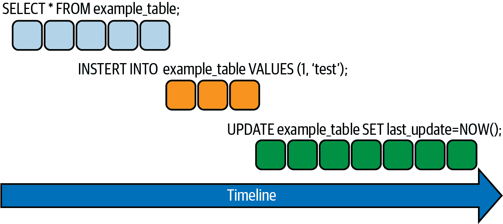
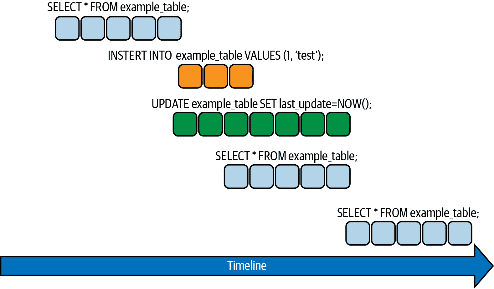

# 第六章：事务和锁定

使用锁定进行事务隔离是 SQL 数据库的支柱——但这也是一个可能会导致很多混淆的领域，特别是对于新手来说。开发人员经常认为锁定是数据库问题，属于 DBA 领域。而 DBA 则认为这是应用程序问题，因此属于开发人员的责任。本章将澄清在不同进程尝试同时写入同一行时发生的情况。它还将阐明在 MySQL 中不同隔离级别下事务中读取查询的行为。

首先，让我们定义关键概念。*事务* 是对数据库执行的一个（或多个）SQL 语句作为单个逻辑工作单元的操作。事务中所有 SQL 语句的修改要么全部提交（应用于数据库），要么全部回滚（从数据库撤销），永远不会部分提交。数据库事务必须具有原子性、一致性、隔离性和持久性（著名的缩写 *ACID*）。

*锁* 是用于确保与数据库中存储的数据进行交互时应用程序和用户的数据完整性的机制。我们将看到有不同类型的锁，有些比其他的更为限制性。

如果请求按顺序串行发出并逐个处理（一个 `SELECT`，然后一个 `INSERT`，然后一个 `UPDATE`等），数据库将不需要事务和锁定。我们在图 6-1 中展示了这种行为。

然而，现实情况（幸运的是！）是 MySQL 可以处理每秒数千个请求并并行处理它们，而不是按顺序逐个处理。本章讨论了 MySQL 为实现这种并行性所做的工作，例如当对同一行进行 `SELECT` 和 `UPDATE` 请求同时到达，或者一个在执行时另一个到达时的情况。图 6-2 展示了这种情况的外观。



###### 图 6-1。SQL 语句的串行执行



###### 图 6-2。SQL 语句的并行执行

在本章中，我们特别关注 MySQL 如何 *隔离* 事务（ACID 的 *I*）。我们将展示常见的锁定发生场景，进行调查，并讨论控制事务等待锁定授予的 MySQL 参数。

# 隔离级别

*隔离级别* 是在多个事务同时进行更改和执行查询时，平衡性能、可靠性、一致性和结果可重现性的设置。

标准 SQL:1992 定义了四种经典的隔离级别，并且 MySQL 支持所有这些隔离级别。InnoDB 使用不同的锁定策略支持这里描述的每个事务隔离级别。用户也可以使用语句 `SET [GLOBAL/SESSION] TRANSACTION` 来更改单个会话或所有后续连接的隔离级别。

对于数据操作中 ACID 合规性至关重要的情况，我们可以通过默认的 `REPEATABLE READ` 隔离级别来强制实现高度一致性；在诸如大规模报告这类场景中，可以通过 `READ COMMITTED` 或甚至 `READ UNCOMMITTED` 隔离级别放宽一致性规则，此时精确一致性和可重复的结果比锁定的开销更不重要。`SERIALIZABLE` 隔离级别比 `REPEATABLE READ` 更严格，主要用于故障排除等特殊情况。在深入了解细节之前，让我们看看一些更多的术语：

脏读

当一个事务能够从另一个尚未执行 `COMMIT` 的事务修改的行中读取数据时，会发生这种情况。如果进行修改的事务被回滚，那么另一个事务将看到不正确的结果，这些结果不反映数据库的状态。数据完整性受到损害。

不可重复读取

当事务中的两个查询执行 `SELECT` 时，如果由于另一个事务的更改导致返回的值不同，则会发生这种情况（如果您在时间 T1 读取一行，然后在时间 T2 再次尝试读取它，则该行可能已经被更新）。与脏读的区别在于，在这种情况下存在 `COMMIT`。初始的 `SELECT` 查询是不可重复的，因为第二次执行时返回的值不同。

幻读

当一个事务正在运行时，另一个事务向正在读取的记录添加行或删除行时会发生这种情况（同样，在这种情况下，修改数据的事务会进行 `COMMIT`）。这意味着如果在同一事务中再次执行相同的查询，它将返回不同数量的行。如果没有范围锁来保证数据的一致性，则可能会发生幻读。

有了这些概念，让我们更仔细地看看 MySQL 中不同的隔离级别。

## REPEATABLE READ

`REPEATABLE READ` 是 InnoDB 的默认隔离级别。它确保在同一事务中进行一致的读取——也就是说，事务中的所有查询将看到由第一次读取建立的数据快照。在这种模式下，InnoDB 锁定索引范围扫描，使用间隙锁或下一键锁（在“锁定”中描述）来阻止其他会话向该范围内的任何间隙插入。

例如，假设在一个会话（会话 1）中，我们执行以下 `SELECT`：

```
session1 > `SELECT` `*` `FROM` `person` `WHERE` `i` `BETWEEN` `1` `AND` `4``;`
```

```
+---+----------+
| i | name     |
+---+----------+
| 1 | Vinicius |
| 2 | Sergey   |
| 3 | Iwo      |
| 4 | Peter    |
+---+----------+
4 rows in set (0.00 sec)
```

并在另一个会话（会话 2）中，我们更新第二行中的名称：

```
session2 > `UPDATE` `person` `SET` `name` `=` `'Kuzmichev'` `WHERE` `i``=``2``;`
```

```
Query OK, 1 row affected (0.00 sec)
Rows matched: 1  Changed: 1  Warnings: 0
```

```
session2> `COMMIT``;`
```

```
Query OK, 0 rows affected (0.00 sec)
```

我们可以在会话 2 中确认变更：

```
session2 > `SELECT` `*` `FROM` `person` `WHERE` `i` `BETWEEN` `1` `AND` `4``;`
```

```
+---+-----------+
| i | name      |
+---+-----------+
| 1 | Vinicius  |
| 2 | Kuzmichev |
| 3 | Iwo       |
| 4 | Peter     |
+---+-----------+
4 rows in set (0.00 sec)
```

但是会话 1 仍然显示其对数据的原始快照中的旧值：

```
session1> `SELECT` `*` `FROM` `person` `WHERE` `i` `BETWEEN` `1` `AND` `4``;`
```

```
+---+----------+
| i | name     |
+---+----------+
| 1 | Vinicius |
| 2 | Sergey   |
| 3 | Iwo      |
| 4 | Peter    |
+---+----------+
```

使用`可重复读`隔离级别，因此不存在脏读或不可重复读。每个事务都读取由第一次读取建立的快照。

## 读已提交

作为一个好奇心，`读已提交`隔离级别是许多数据库的默认级别，如 Postgres、Oracle 和 SQL Server，但不是 MySQL。因此，那些迁移到 MySQL 的人必须意识到默认行为的这种差异。

`读已提交`和`可重复读`的主要区别在于，使用`读已提交`时，即使在同一个事务内，每次一致性读取也会创建并读取自己的新鲜快照。当在事务内执行多个查询时，这种行为可能导致幻读。让我们看一个例子。在会话 1 中，第一行看起来是这样的：

```
session1 > `SELECT` `*` `FROM` `person` `WHERE` `i` `=` `1``;`
```

```
+---+----------+
| i | name     |
+---+----------+
| 1 | Vinicius |
+---+----------+
1 row in set (0.00 sec)
```

现在假设在会话 2 中，我们更新了`person`表的第一行并提交了事务：

```
session2 > `UPDATE` `person` `SET` `name` `=` `'Grippa'` `WHERE` `i` `=` `1``;`
```

```
Query OK, 1 row affected (0.00 sec)
Rows matched: 1  Changed: 1  Warnings: 0
```

```
session2 > `COMMIT``;`
```

```
Query OK, 0 rows affected (0.00 sec)
```

如果我们再次检查会话 1，我们将看到第一行的值已经改变：

```
session1 > `SELECT` `*` `FROM` `person` `WHERE` `i` `=` `1``;`
```

```
+---+--------+
| i | name   |
+---+--------+
| 1 | Grippa |
+---+--------+
```

`读已提交`的显著优势在于没有间隙锁，允许在锁定记录旁边自由插入新记录。

## 读未提交

在`读未提交`隔离级别下，MySQL 以非锁定方式执行`SELECT`语句，这意味着同一事务中的两个`SELECT`语句可能不会读取同一行的相同版本。正如我们之前看到的，这种现象称为脏读。考虑一下前面的例子，使用`读未提交`时会发生什么。主要区别在于会话 1 可以在提交之前看到会话 2 更新的结果。让我们再举一个例子。假设在会话 1 中，我们执行以下`SELECT`语句：

```
session1 > `SELECT` `*` `FROM` `person` `WHERE` `i` `=` `5``;`
```

```
+---+---------+
| i | name    |
+---+---------+
| 5 | Marcelo |
+---+---------+
1 row in set (0.00 sec)
```

而在会话 2 中，我们执行此更新*而不进行*提交：

```
session2 > `UPDATE` `person` `SET` `name` `=` `'Altmann'` `WHERE` `i` `=` `5``;`
```

```
Query OK, 1 row affected (0.00 sec)
Rows matched: 1  Changed: 1  Warnings: 0
```

如果我们现在在会话 1 中再次执行`SELECT`，我们将看到以下情况：

```
session1 > `SELECT` `*` `FROM` `person` `WHERE` `i` `=` `5``;`
```

```
+---+---------+
| i | name    |
+---+---------+
| 5 | Altmann |
+---+---------+
1 row in set (0.00 sec)
```

我们可以看到，即使会话 1 处于瞬态状态，它也能读取修改后的数据，这种更改可能会被回滚而不会被提交。

## 可串行化

MySQL 中最受限制的隔离级别是`可串行化`。这类似于`可重复读`，但额外限制了不允许一个事务干扰另一个的情况。因此，通过这种锁定机制，不再可能出现不一致的数据场景。

###### 注

对于使用`可串行化`的应用程序，重试策略非常重要。

为了更清晰地说明，想象一个财务数据库，在其中我们在`accounts`表中注册客户的账户余额。如果两个事务同时尝试更新客户账户余额会发生什么？以下示例说明了这种情况。假设我们已经使用默认隔离级别`可重复读`启动了两个会话，并在每个会话中显式地开始了事务。在会话 1 中，我们选择了`accounts`表中的所有账户：

```
session1> `SELECT` `*` `FROM` `accounts``;`
```

```
+----+--------+---------+----------+---------------------+
| id | owner  | balance | currency | created_at          |
+----+--------+---------+----------+---------------------+
|  1 | Vinnie |      80 | USD      | 2021-07-13 20:39:27 |
|  2 | Sergey |     100 | USD      | 2021-07-13 20:39:32 |
|  3 | Markus |     100 | USD      | 2021-07-13 20:39:39 |
+----+--------+---------+----------+---------------------+
3 rows in set (0.00 sec)
```

然后，在会话 2 中，我们选择所有至少有 80 美元余额的帐户：

```
session2> `SELECT` `*` `FROM` `accounts` `WHERE` `balance` `>``=` `80``;`
```

```
+----+--------+---------+----------+---------------------+
| id | owner  | balance | currency | created_at          |
+----+--------+---------+----------+---------------------+
|  1 | Vinnie |      80 | USD      | 2021-07-13 20:39:27 |
|  2 | Sergey |     100 | USD      | 2021-07-13 20:39:32 |
|  3 | Markus |     100 | USD      | 2021-07-13 20:39:39 |
+----+--------+---------+----------+---------------------+
3 rows in set (0.00 sec)
```

现在，在会话 1 中，我们从帐户 1 中减去 10 美元并检查结果：

```
session1> `UPDATE` `accounts` `SET` `balance` `=` `balance` `-` `10` `WHERE` `id` `=` `1``;`
Query OK, 1 row affected (0.00 sec)
Rows matched: 1  Changed: 1  Warnings: 0

session1> `SELECT` `*` `FROM` `accounts``;`
```

```
+----+--------+---------+----------+---------------------+
| id | owner  | balance | currency | created_at          |
+----+--------+---------+----------+---------------------+
|  1 | Vinnie |      70 | USD      | 2021-07-13 20:39:27 |
|  2 | Sergey |     100 | USD      | 2021-07-13 20:39:32 |
|  3 | Markus |     100 | USD      | 2021-07-13 20:39:39 |
+----+--------+---------+----------+---------------------+
3 rows in set (0.00 sec)
```

我们可以看到帐户 1 的余额已经减少到 70 美元。因此，我们提交会话 1，然后转到会话 2，看看它是否可以读取会话 1 所做的新更改：

```
session1> `COMMIT``;`
```

```
Query OK, 0 rows affected (0.01 sec)
```

```
session2> `SELECT` `*` `FROM` `accounts` `WHERE` `id` `=` `1``;`
```

```
+----+--------+---------+----------+---------------------+
| id | owner  | balance | currency | created_at          |
+----+--------+---------+----------+---------------------+
|  1 | Vinnie |      80 | USD      | 2021-07-13 20:39:27 |
+----+--------+---------+----------+---------------------+
1 row in set (0.01 sec)
```

即使事务 1 成功提交并将其更改为 70 美元，这个`SELECT`查询仍然返回帐户 1 的旧数据，余额为 80 美元。这是因为`REPEATABLE READ`隔离级别确保事务中的所有读取查询都是可重复的，这意味着它们始终返回相同的结果，即使其他已提交的事务进行了更改。

但是，如果我们在会话 2 中也运行`UPDATE`查询，从帐户 1 的余额中减去 10 美元，会发生什么？它会将余额更改为 70 美元、60 美元还是抛出错误？让我们看一下：

```
session2> `UPDATE` `accounts` `SET` `balance` `=` `balance` `-` `10` `WHERE` `id` `=` `1``;`
```

```
Query OK, 1 row affected (0.00 sec)
Rows matched: 1  Changed: 1  Warnings: 0
```

```
session2> `SELECT` `*` `FROM` `accounts` `WHERE` `id` `=` `1``;`
```

```
+----+--------+---------+----------+---------------------+
| id | owner  | balance | currency | created_at          |
+----+--------+---------+----------+---------------------+
|  1 | Vinnie |      60 | USD      | 2021-07-13 20:39:27 |
+----+--------+---------+----------+---------------------+
1 row in set (0.01 sec)
```

没有错误，帐户余额现在是 60 美元，这是正确的值，因为事务 1 已经提交了修改余额为 70 美元的更改。

然而，从事务 2 的角度来看，这是不合理的：在最后一个`SELECT`查询中，它看到的是 80 美元的余额，但在从帐户中扣除 10 美元之后，现在看到的是 60 美元的余额。这里的数学不成立，因为该事务仍受到其他事务的并发更新的影响。

这就是使用`SERIALIZABLE`可以帮助的情况。让我们倒回到我们没有进行任何更改的情况。这次我们将明确将两个会话的隔离级别设置为`SERIALIZABLE`，在使用`BEGIN`开始事务之前用`SET SESSION TRANSACTION ISOLATION LEVEL SERIALIZABLE`。同样，在会话 1 中，我们选择所有的帐户：

```
session1> `SELECT` `*` `FROM` `accounts``;`
```

```
+----+--------+---------+----------+---------------------+
| id | owner  | balance | currency | created_at          |
+----+--------+---------+----------+---------------------+
|  1 | Vinnie |      80 | USD      | 2021-07-13 20:39:27 |
|  2 | Sergey |     100 | USD      | 2021-07-13 20:39:32 |
|  3 | Markus |     100 | USD      | 2021-07-13 20:39:39 |
+----+--------+---------+----------+---------------------+
3 rows in set (0.00 sec)
```

而在会话 2 中，我们选择所有余额大于 80 美元的帐户：

```
session2> `SELECT` `*` `FROM` `accounts` `WHERE` `balance` `>``=` `80``;`
```

```
+----+--------+---------+----------+---------------------+
| id | owner  | balance | currency | created_at          |
+----+--------+---------+----------+---------------------+
|  1 | Vinnie |      80 | USD      | 2021-07-13 20:39:27 |
|  2 | Sergey |     100 | USD      | 2021-07-13 20:39:32 |
|  3 | Markus |     100 | USD      | 2021-07-13 20:39:39 |
+----+--------+---------+----------+---------------------+
3 rows in set (0.00 sec)
```

现在，在会话 1 中，我们从帐户 1 中减去 10 美元：

```
session1> `UPDATE` `accounts` `SET` `balance` `=` `balance` `-` `10` `WHERE` `id` `=` `1``;`
```

然后什么都不会发生。这次`UPDATE`查询被阻塞了——会话 1 中的`SELECT`查询锁定了这些行，阻止了会话 2 中的`UPDATE`成功执行。因为我们明确地用`BEGIN`开始了我们的事务（这与禁用自动提交的效果相同），InnoDB 会隐式地将每个事务中的普通`SELECT`语句转换为`SELECT ... FOR SHARE`。它事先不知道事务是否仅执行读取操作还是修改行，因此 InnoDB 需要对其进行锁定，以避免我们在前面示例中演示的问题。在本例中，如果启用了自动提交，会话 2 中的`SELECT`查询将不会阻塞我们试图在会话 1 中执行的更新：MySQL 会识别出这个查询是一个普通的`SELECT`，并且不需要阻塞其他查询，因为它不会修改任何行。

然而，第二个会话的更新不会永远挂起；这个锁有一个由[`innodb_lock_wait_timeout`参数](https://oreil.ly/rfrv0)控制的超时时长。因此，如果第一个会话没有提交或回滚其事务以释放锁定，一旦会话超时到达，MySQL 将抛出以下错误：

```
ERROR 1205 (HY000): Lock wait timeout exceeded; try restarting transaction
```

# 锁定

现在我们已经看到每个隔离级别是如何工作的，让我们来看看 InnoDB 用来实现它们的不同锁定策略。

锁定用于在数据库中保护共享资源或对象。它们可以在不同的级别上起作用，比如：

+   表锁定

+   元数据锁定

+   行锁定

+   应用程序级锁定

MySQL 使用元数据锁来管理对数据库对象的并发访问以及确保数据一致性。当表上存在活动事务（显式或隐式）时，MySQL 不允许对元数据进行写操作（例如 DDL 语句更新表的元数据）。它通过这种方式在并发环境中维护元数据的一致性。

如果在会话执行以下列表中提到的操作时有活动事务（运行中、未提交或回滚），那么请求数据写入的会话将处于`等待表元数据锁定`状态。元数据锁等待可能发生在以下任何情况下：

+   当您创建或删除索引时

+   当您修改表结构时

+   当您执行表维护操作（`OPTIMIZE TABLE` `REPAIR TABLE`等）时

+   当您删除一个表时

+   当您尝试在表上获取表级写锁（`LOCK TABLE table_name WRITE`）

为了支持多个会话的同时写访问，InnoDB 支持行级锁定。

应用程序级或用户级锁定，比如由`GET_LOCK()`提供的锁，可以用来模拟诸如记录锁定之类的数据库锁定。

本书侧重于元数据和行锁定，因为它们影响大多数用户并且是最常见的。

## 元数据锁

[MySQL 文档](https://oreil.ly/zjDjG)提供了对元数据锁的最佳定义：

> 为了确保事务的串行化，服务器不能允许一个会话在另一个会话中的未完成的显式或隐式启动的事务中使用的表上执行数据定义语言（DDL）语句。服务器通过获取用于事务中使用的表的元数据锁，并推迟锁的释放直到事务结束来实现这一点。表的元数据锁定阻止对表结构的更改。这种锁定方法意味着，一个会话中正在使用的表在事务结束之前不能被其他会话用于 DDL 语句。

在这个定义的基础上，让我们看看元数据锁在实际中的运作。首先，我们将创建一个虚拟表，并加载一些行进去：

```
`USE` `test``;`

`DROP` `TABLE` `IF` `EXISTS` `` `joinit` ```;`

`CREATE` `TABLE` `` `joinit` `` `(`

`` `i` `` `int``(``11``)` `NOT` `NULL` `AUTO_INCREMENT``,`

`` `s` `` `varchar``(``64``)` `默认` `NULL``,`

`` `t` `` `时间` `非` `NULL``,`

`` `g` `` `int``(``11``)` `非` `NULL``,`

`主` `键` `(``` `i` ```)`

`)` `引擎``=``InnoDB`  `默认` `字符集``=``latin1``;`

`INSERT` `INTO` `joinit` `VALUES` `(``NULL``,` `uuid``(``)``,` `time``(``now``(``)``)``,`  `(``FLOOR``(` `1` `+`

`RAND``(` `)` `*``60` `)``)``)``;`

`INSERT` `INTO` `joinit` `SELECT` `NULL``,` `uuid``(``)``,` `time``(``now``(``)``)``,`  `(``FLOOR``(` `1` `+` `RAND``(` `)` `*``60` `)``)`

`FROM` `joinit``;`

`INSERT` `INTO` `joinit` `SELECT` `NULL``,` `uuid``(``)``,` `time``(``now``(``)``)``,`  `(``FLOOR``(` `1` `+` `RAND``(` `)` `*``60` `)``)`

`FROM` `joinit``;`

`INSERT` `INTO` `joinit` `SELECT` `NULL``,` `uuid``(``)``,` `time``(``now``(``)``)``,`  `(``FLOOR``(` `1` `+` `RAND``(` `)` `*``60` `)``)`

`FROM` `joinit``;`

`INSERT` `INTO` `joinit` `SELECT` `NULL``,` `uuid``(``)``,` `time``(``now``(``)``)``,`  `(``FLOOR``(` `1` `+` `RAND``(` `)` `*``60` `)``)`

`FROM` `joinit``;

`INSERT` `INTO` `joinit` `SELECT` `NULL``,` `uuid``(``)``,` `time``(``now``(``)``)``,`  `(``FLOOR``(` `1` `+` `RAND``(` `)` `*``60` `)``)`

`FROM` `joinit``;`

`INSERT` `INTO` `joinit` `SELECT` `NULL``,` `uuid``(``)``,` `time``(``now``(``)``)``,`  `(``FLOOR``(` `1` `+` `RAND``(` `)` `*``60` `)``)`

`FROM` `joinit``;`

`INSERT` `INTO` `joinit` `SELECT` `NULL``,` `uuid``(``)``,` `time``(``now``(``)``)``,`  `(``FLOOR``(` `1` `+` `RAND``(` `)` `*``60` `)``)`

`FROM` `joinit``;`

`INSERT` `INTO` `joinit` `SELECT` `NULL``,` `uuid``(``)``,` `time``(``now``(``)``)``,`  `(``FLOOR``(` `1` `+` `RAND``(` `)` `*``60` `)``)`

`FROM` `joinit``;`

```

Now that we have some dummy data, we will open one session (session 1) and execute an `UPDATE`:

```

session1> `UPDATE` `joinit` `SET` `t``=``now``(``)``;`

```

Then, in a second session, we will try to add a new column to this table while the `UPDATE` is still running:

```

session2> `ALTER` `TABLE` `joinit` `ADD` `COLUMN` `b` `整数``;`

```

And in a third session, we can execute the `SHOW PROCESSLIST` command to visualize the metadata lock:

```

session3> `显示` `进程列表``;`

```

```

+----+----------+-----------+------+---------+------+...

| Id | 用户     | 主机      | db   | 命令 | 时间 |...

+----+----------+-----------+------+---------+------+...

| 10 | msandbox | localhost | test | 查询   |    3 |...

| 11 | msandbox | localhost | test | 查询   |    1 |...

| 12 | msandbox | localhost | NULL | 查询   |    0 |...

+----+----------+-----------+------+---------+------+...

...+---------------------------------+-------------------------------------+...

...| 状态                           | 信息                                |...

...+---------------------------------+-------------------------------------+...

| 更新                       | UPDATE joinit SET t=now()           |...

...| 等待表元数据锁               | ALTER TABLE joinit ADD COLUMN b INT |...

...| 开始                          | 显示进程列表                    |...

...+---------------------------------+-------------------------------------+...

...+-----------+---------------+

...| 发送行 | 检查行 |

...+-----------+---------------+

...|         0 |        179987 |

...|         0 |             0 |

...|         0 |             0 |

...+-----------+---------------+

```

Note that a long-running query or a query that is not using autocommit will have the same effect. For example, suppose we have an `UPDATE` running in session 1:

```

mysql > `SET` `SESSION` `autocommit``=``0``;`

```

```

Query OK, 0 rows affected (0.00 sec)

```

```

mysql > `UPDATE` `joinit` `SET` `t``=``NOW``(``)` `LIMIT` `1``;`

```

```

Query OK, 1 row affected (0.00 sec)

Rows matched: 1  Changed: 1  Warnings: 0

```

And we execute a DML statement in session 2:

```

mysql > `ALTER` `TABLE` `joinit` `ADD` `COLUMN` `b` `INT``;`

```

If we check the process list in session 3, we can see the DDL waiting on the metadata lock (thread 11), while thread 10 has been sleeping since it executed the `UPDATE` (still not committed):

```

mysql > `SHOW` `PROCESSLIST``;`

```

###### Note

MySQL is multithreaded, so there may be many clients issuing queries for a given table simultaneously. To minimize the problem with multiple client sessions having different states for the same table, each concurrent session opens the table independently. This uses additional memory but typically increases performance.

Before we start using the `sys` schema, it is necessary to enable MySQL instrumentation to monitor these locks. To do this, run the following command:

```

mysql> `UPDATE` `performance_schema``.``setup_instruments` `SET` `enabled` `=` `'YES'`

    -> `WHERE` `NAME` `=` `'wait/lock/metadata/sql/mdl'``;`

Query OK, 0 rows affected (0.00 sec)

Rows matched: 1 Changed: 0 Warnings: 0

```

The following query uses the `schema_table_lock_waits` view from the `sys` schema to illustrate how to observe metadata locks in the MySQL database:

```

mysql> `SELECT` `*`  `FROM` `sys``.``schema_table_lock_waits``;`

```

This view displays which sessions are blocked waiting on metadata locks and what is blocking them. Rather than selecting all fields, the following example shows a more compact view:

```

mysql> `SELECT` `object_name``,` `waiting_thread_id``,` `waiting_lock_type``,`

    -> `waiting_query``,` `sql_kill_blocking_query``,` `blocking_thread_id`

    -> `FROM` `sys``.``schema_table_lock_waits``;`

```

```

+-------------+-------------------+-------------------+...

| object_name | waiting_thread_id | waiting_lock_type |...

+-------------+-------------------+-------------------+...

| joinit      |                29 | EXCLUSIVE         |...

| joinit      |                29 | EXCLUSIVE         |...

+-------------+-------------------+-------------------+...

...+-------------------------------------------------------------------+...

...| 等待查询                                                     |...

...+-------------------------------------------------------------------+...

...| 修改表 joinit 添加列  ...  CHAR(32) 默认 'dummy_text' |...

...| ALTER TABLE joinit ADD COLUMN  ...  CHAR(32) 默认 'dummy_text' |...

...|-------------------------------------------------------------------+...

```

```

...+-------------------------+--------------------+

...| sql_kill_blocking_query | blocking_thread_id |

...+-------------------------+--------------------+

...| KILL QUERY 3            |                 29 |

...| KILL QUERY 5            |                 31 |

...+-------------------------+--------------------+

2 rows in set (0.00 sec)

```

###### Note

The MySQL `sys` schema is a set of objects that helps DBAs and developers interpret data collected by the Performance Schema, a feature for monitoring MySQL Server execution at a low level. It is available for MySQL 5.7 and MySQL 8.0\. If you want to use the `sys` schema in MySQL 5.6, it is possible to install it using the `sys` project available on GitHub:

```

# git clone https://github.com/mysql/mysql-sys.git

# cd mysql-sys/

# mysql -u root -p < ./sys_56.sql

```

Let’s see what happens when we query the `metadata_locks` table:

```

mysql> `SELECT` `*` `FROM` `performance_schema``.``metadata_locks``\``G`

```

```

*************************** 1\. row ***************************

        OBJECT_TYPE: GLOBAL

        OBJECT_SCHEMA: NULL

        OBJECT_NAME: NULL

OBJECT_INSTANCE_BEGIN: 140089691017472

            LOCK_TYPE: INTENTION_EXCLUSIVE

        LOCK_DURATION: STATEMENT

        LOCK_STATUS: GRANTED

            SOURCE:

    OWNER_THREAD_ID: 97

    OWNER_EVENT_ID: 34

...

*************************** 6\. row ***************************

        OBJECT_TYPE: TABLE

        OBJECT_SCHEMA: performance_schema

        OBJECT_NAME: metadata_locks

OBJECT_INSTANCE_BEGIN: 140089640911984

            LOCK_TYPE: SHARED_READ

        LOCK_DURATION: TRANSACTION

        LOCK_STATUS: GRANTED

            SOURCE:

    OWNER_THREAD_ID: 98

    OWNER_EVENT_ID: 10

6 rows in set (0.00 sec)

```

Note that a `SHARED_UPGRADABLE` lock is set on the `joinit` table, and an `EXCLUSIVE` lock is pending on the same table.

We can get a nice view of all metadata locks from other sessions, excluding our current one, with the following query:

```

mysql> `SELECT` `object_type``,` `object_schema``,` `object_name``,` `lock_type``,`

    -> `lock_status``,` `thread_id``,` `processlist_id``,` `processlist_info` `FROM`

    -> `performance_schema``.``metadata_locks` `INNER` `JOIN` `performance_schema``.``threads`

    -> `ON` `thread_id` `=` `owner_thread_id` `WHERE` `processlist_id` `<``>` `connection_id``(``)``;`

```

```

+-------------+---------------+-------------+---------------------+...

| 对象类型 | 对象模式 | 对象名称 | 锁类型           |...

+-------------+---------------+-------------+---------------------+...

| 全局      | NULL          | NULL        | 意图独占 |...

| 模式      | 测试          | NULL        | 意图独占 |...

| 表       | 测试          | joinit      | 共享升级   |...

| 备份      | NULL          | NULL        | 意图独占 |...

| 表       | 测试          | joinit      | 独占           |...

+-------------+---------------+-------------+---------------------+...

...+-------------+-----------+----------------+...

...| 锁状态 | 线程 ID | 进程列表 ID |...

...+-------------+-----------+----------------+...

...| 授予     |        97 |             71 |...

...| 授予     |        97 |             71 |...

...| 授予     |        97 |             71 |...

...| 授予     |        97 |             71 |...

...| 待定     |        97 |             71 |...

...+-------------+-----------+----------------+...

...+-------------------------------------+

...| 进程列表信息                    |

...+-------------------------------------+

...| alter table joinit add column b int |

...| alter table joinit add column b int |

...| alter table joinit add column b int |

...| alter table joinit add column b int |

...| alter table joinit add column b int |

...+-------------------------------------+

5 行已设置（0.00 秒）

```

If we look carefully, a DDL statement waiting for a query on its own is not a problem: it will have to wait until it can acquire the metadata lock, which is expected. The problem is that while waiting, it blocks every other query from accessing the resource.

We recommend the following actions to avoid long metadata locks:

*   Perform DDL operations in non-busy times. This way you reduce the concurrency in the database between the regular application workload and the extra workload that the operation carries.

*   Always use autocommit. MySQL has autocommit enabled by default. This will avoid transactions with pending commits.

*   When performing a DDL operation, set a low value for `lock_wait_timeout` at the session level. Then, if the metadata lock can’t be acquired, it won’t block for a long time waiting. For example:

    ```

    mysql> `SET` `lock_wait_timeout` `=` `3``;`

    mysql> `CREATE` `INDEX` `idx_1` `ON` `example` `(``col1``)``;`

    ```

You might also want to consider using the [`pt-kill` tool](https://oreil.ly/C4rMb) to kill queries that have been running for a long time. For example, to kill queries that have been running for more than 60 seconds, issue this command:

```

$ `pt``-``kill` `-``-``busy``-``time` `60` `-``-``kill`

```

## Row Locks

InnoDB implements standard row-level locking. This means that, in general terms, there are two types of locks:

*   A *shared* (S) lock permits the transaction that holds the lock to read a row.

*   An *exclusive* (X) lock permits the transaction that holds the lock to update or delete a row.

The names are self-explanatory: exclusive locks don’t allow multiple transactions to acquire an exclusive lock in the same row while sharing a shared lock. That is why it is possible to have parallel reads for the same row, while parallel writes are not allowed.

InnoDB also supports multiple granularity locking, which permits the coexistence of row locks and table locks. Granular locking is possible due to the existence of *intention locks*, which are table-level locks that indicate which type of lock (shared or exclusive) a transaction requires later for a row in a table. There are two types of intention locks:

*   An *intention shared* (IS) lock indicates that a transaction intends to set a shared lock on individual rows in a table.

*   An *intention exclusive* (IX) lock indicates that a transaction intends to set an exclusive lock on individual rows in a table.

Before a transaction can acquire a shared or an exclusive lock, it is necessary to obtain the respective intention lock (IS or IX).

To make things a bit easier to understand, take a look at Table 6-1.

Table 6-1\. Lock type compatibility matrix

|  | X | IX | S | IS |
| --- | --- | --- | --- | --- |
| X | Conflict | Conflict | Conflict | Conflict |
| IX | Conflict | Compatible | Conflict | Compatible |
| S | Conflict | Conflict | Compatible | Compatible |
| IS | Conflict | Compatible | Compatible | Compatible |

Another important concept is the *gap lock*, which is a lock on the gap between index records. Gap locks ensure that no new rows are added in the interval specified by the query; this means that when you run the same query twice, you get the same number of rows, regardless of other sessions’ modifications to that table. They make the reads consistent and therefore make the replication between servers consistent. If you execute `SELECT * FROM example_table WHERE id > 1000 FOR UPDATE` twice, you expect to get the same result twice. To accomplish that, InnoDB locks all index records found by the `WHERE` clause with an exclusive lock and the gaps between them with a shared gap lock.

Let’s see an example of a gap lock in action. First, we will execute a `SELECT` statement on the `person` table:

```

mysql> `SELECT` `*` `FROM` `PERSON``;`

```

```

+----+-----------+

| i  | 名称      |
| --- | --- |

+----+-----------+

|  1 | Vinicius  |
| --- | --- |
|  2 | Kuzmichev |
|  3 | Iwo       |
|  4 | Peter     |
|  5 | Marcelo   |
|  6 | Guli      |
|  7 | Nando     |
| 10 | Jobin     |
| 15 | Rafa      |
| 18 | Leo       |

+----+-----------+

10 行已设置（0.00 秒）

```

Now, in session 1, we will perform a delete operation, but we will *not* commit:

```

session1> `DELETE` `FROM` `person` `WHERE` `name` `LIKE` `'Jobin'``;`

```

```

Query OK, 1 行受影响（0.00 秒）

```

And if we check in session 2, we can still see the row with Jobin:

```

session2> `SELECT` `*` `FROM` `person``;`

```

```

+----+-----------+

| i  | 名称      |
| --- | --- |

+----+-----------+

|  1 | Vinicius  |
| --- | --- |
|  2 | Kuzmichev |
|  3 | Iwo       |
|  4 | Peter     |
|  5 | Marcelo   |
|  6 | Guli      |
|  7 | Nando     |
| 10 | Jobin     |
| 15 | Rafa      |
| 18 | Leo       |

+----+-----------+

10 行已设置（0.00 秒）

```

The results show that there are gaps in the values of the primary key column that in theory are available to be used to insert new records. So what happens if we try to insert a new row with a value of 11? The insert will be locked and will fail:

```

transaction2 > `INSERT` `INTO` `person` `VALUES` `(``11``,` `'Bennie'``)``;`

```

```

错误 1205 (HY000): 锁等待超时；请尝试重新启动事务

```

If we run `SHOW ENGINE INNODB STATUS`, we will see the locked transaction in the `TRANSACTIONS` section:

```

------- 事务等待 17 秒以便授予此锁：

记录锁 空间 ID 28 页号 3 n 位 80 索引 PRIMARY of table

`test`.`person` 事务 ID 4773 锁模式 X 锁间隙插入前

意图等待

```

Note that MySQL does not need gap locking for statements that lock rows using a unique index to search for a unique row. (This does not include the case where the search condition includes only some columns of a multiple-column unique index; in that case, gap locking does occur.) For example, if the `name` column has a unique index, the following `DELETE` statement uses only an index-record lock:

```

mysql> `CREATE` `UNIQUE` `INDEX` `idx` `ON` `PERSON` `(``name``)``;`

```

```

Query OK, 0 行受影响 (0.01 秒)

Records: 0  Duplicates: 0  Warnings: 0

```

```

mysql> `DELETE` `FROM` `person` `WHERE` `name` `LIKE` `'Jobin'``;`

```

```

Query OK, 1 行受影响 (0.00 秒)

```

## Deadlocks

A *deadlock* is a situation where two (or more) competing actions are waiting for the other to finish. As a consequence, neither ever does. In computer science, the term refers to a specific condition where two or more processes are each waiting for another to release a resource. In this section, we will talk specifically about transaction deadlocks and how InnoDB solves this issue.

For a deadlock to happen, four conditions (known as the *Coffman conditions*) must exist:

1.  *Mutual exclusion*. The process must hold at least one resource in a non-shareable mode. Otherwise, MySQL would not prevent the process from using the resource when necessary. Only one process can use the resource at any given moment in time.

2.  *Hold and wait or resource holding*. A process is currently holding at least one resource and requesting additional resources held by other processes.

3.  *No preemption*. A resource can be released only voluntarily by the process holding it.

4.  *Circular wait*. Each process must be waiting for a resource held by another process, which in turn is waiting for the first process to release the resource.

Before moving on to an example, there are some misconceptions that you might hear and that it is essential to clarify. They are:

Transaction isolation levels are responsible for deadlocks.

The possibility of deadlocks is not affected by the isolation level. The `READ COMMITTED` isolation level sets fewer locks, and hence it can help you avoid certain lock types (e.g., gap locking), but it won’t prevent deadlocks entirely.

Small transactions are not affected by deadlocks.

Small transactions are less prone to deadlocks because they run fast, so the chance of a conflict occurring is smaller than with more prolonged operations. However, it can still happen if transactions do not use the same order of operations.

Deadlocks are terrible things.

It’s problematic to have deadlocks in a database, but InnoDB can resolve them automatically, unless deadlock detection is disabled (by changing the value of `innodb_deadlock_detect`). A deadlock is a a bad situation, but resolution through the termination of one of the transactions ensures that processes cannot hold onto the resources for a long time, slowing or stalling the database completely until the offending query gets canceled by the `innodb_lock_wait_timeout` setting.

To illustrate deadlocks, we’ll use the `world` database. If you need to import it, you can do so now by following the instructions in “Entity Relationship Modeling Examples”.

Let’s start by getting a list of Italian cities in the province of Toscana:

```

mysql> `SELECT` `*` `FROM` `city` `WHERE` `CountryCode` `=` `'ITA'` `AND` `District``=``'Toscana'``;`

```

```

+------+---------+-------------+----------+------------+

| ID   | Name    | CountryCode | District | Population |
| --- | --- | --- | --- | --- |

+------+---------+-------------+----------+------------+

| 1471 | Firenze | ITA         | Toscana  |     376662 |
| --- | --- | --- | --- | --- |
| 1483 | Prato   | ITA         | Toscana  |     172473 |
| 1486 | Livorno | ITA         | Toscana  |     161673 |
| 1516 | Pisa    | ITA         | Toscana  |      92379 |
| 1518 | Arezzo  | ITA         | Toscana  |      91729 |

+------+---------+-------------+----------+------------+

5 rows in set (0.00 秒)

```

Now let’s say we have two transactions trying to update the populations of the same two cities in Toscana at the same time, but in different orders:

```

session1> `UPDATE` `city` `SET` `Population``=``Population` `+` `1` `WHERE` `ID` `=` `1471``;`

```

```

Query OK, 1 行受影响 (0.00 秒)

Rows matched: 1  Changed: 1  Warnings: 0

```

```

session2> `UPDATE` `city` `SET` `Population``=``Population` `+` `1` `WHERE` `ID` `=``1516``;`

```

```

Query OK, 1 行受影响 (0.00 秒)

Rows matched: 1  Changed: 1  Warnings: 0

```

```

session1> `UPDATE` `city` `SET` `Population``=``Population` `+` `1` `WHERE` `ID` `=``1516``;`

```

```

ERROR 1213 (40001): 死锁，尝试获取锁定；请重启事务

```

```

session2> `UPDATE` `city` `SET` `Population``=``Population` `+` `1` `WHERE` `ID` `=` `1471``;`

```

```

Query OK, 1 行受影响 (5.15 秒)

Rows matched: 1  Changed: 1  Warnings: 0

```

And we had a deadlock in session 1\. It is important to note that it is not always the second transaction that will fail. In this example, session 1 was the one that MySQL aborted. We can get information on the latest deadlock that happened in the MySQL database by running `SHOW ENGINE INNODB STATUS`:

```

mysql> `SHOW` `ENGINE` `INNODB` `STATUS``\``G`

```

```

------------------------

最近检测到死锁

------------------------

2020-12-05 16:08:19 0x7f6949359700

*** (1) 事务:

事务 10502342, 活动 34 秒开始索引读取

mysql tables in use 1, locked 1

LOCK WAIT 3 lock struct(s), heap size 1136, 2 row lock(s), undo log

entries 1

MySQL 线程 id 71, OS 线程句柄 140090386671360, 查询 id 5979282

localhost msandbox updating

update city set Population=Population + 1 where ID = 1471

*** (1) WAITING FOR THIS LOCK TO BE GRANTED:

RECORD LOCKS space id 6041 page no 15 n bits 248 index PRIMARY of table

`world`.`city` trx id 10502342 lock_mode X locks rec but not gap waiting

*** (2) 事务:

事务 10502341, 活动 62 秒开始索引读取

mysql tables in use 1, locked 1

3 lock struct(s), heap size 1136, 2 row lock(s), undo log entries 1

MySQL 线程 id 75, OS 线程句柄 140090176542464, 查询 id 5979283

localhost msandbox updating

update city set Population=Population + 1 where ID =1516

*** (2) 持有锁定:

RECORD LOCKS space id 6041 page no 15 n bits 248 index PRIMARY of table

`world`.`city` trx id 10502341 lock_mode X locks rec but not gap

*** (2) WAITING FOR THIS LOCK TO BE GRANTED:

RECORD LOCKS space id 6041 page no 16 n bits 248 index PRIMARY of table

`world`.`city` trx id 10502341 lock_mode X locks rec but not gap waiting

*** 事务回滚 (2)

...

```

If you want, you can log all the deadlocks that happen in MySQL in the MySQL error log. Using the `innodb_print_all_deadlocks` parameter, MySQL records all information about deadlocks from InnoDB user transactions in the error log. Otherwise, you see information about only the last deadlock using the `SHOW ENGINE INNODB STATUS` command.

# MySQL Parameters Related to Isolation and Locks

To round out this chapter, let’s take a look at a few MySQL parameters that are related to isolation behavior and lock duration:

`transaction_isolation`

Sets the transaction isolation level. This parameter can change the behavior at the `GLOBAL`, `SESSION`, or `NEXT_TRANSACTION` level:

```

mysql> `SET` `SESSION` `transaction_isolation``=``'READ-COMMITTED'``;

```

```

查询完成，影响行数：0，耗时 (0.00 秒)

```

```

mysql> `SHOW` `SESSION` `VARIABLES` `LIKE` `'%isol%'``;

```

```

+-----------------------+----------------+

| Variable_name         | Value          |
| --- | --- |

+-----------------------+----------------+

| transaction_isolation | READ-COMMITTED |
| --- | --- |
| tx_isolation          | READ-COMMITTED |

+-----------------------+----------------+

```

###### Note

`transaction_isolation` was added in MySQL 5.7.20 as a synonym for `tx_isolation`, which is now deprecated and has been removed in MySQL 8.0\. Applications should be adjusted to use `transaction_isolation` in preference to `tx_isolation`.

`innodb_lock_wait_timeout`

Specifies the amount of time in seconds an InnoDB transaction waits for a row lock before giving up. The default value is 50 seconds. The transaction raises the following error if the time waiting for the lock exceeds the `innodb_lock_wait_timeout` value:

```

ERROR 1205 (HY000): Lock wait timeout exceeded; try restarting transaction

```

`innodb_print_all_deadlocks`

Causes MySQL to record information about all deadlocks resulting from InnoDB user transactions in the MySQL error log. We can enable this dynamically with the following command:

```

mysql> `SET` `GLOBAL` `innodb_print_all_deadlocks` `=` `1``;`

```

`lock_wait_timeout`

Specifies the timeout in seconds for attempts to acquire metadata locks. To avoid long metadata locks stalling the database, we can set `lock_wait_timeout=1` at the session level before executing the DDL statement. In this case, if the operation can’t acquire the lock, it will give up and let other requests execute. For example:

```

mysql> `SET` `SESSION` `lock_wait_timeout``=``1``;

mysql> `CREATE` `TABLE` `t1``(``i` `INT` `NOT` `NULL` `AUTO_INCREMENT` `PRIMARY` `KEY``)`

    -> `ENGINE``=``InnoDB``;

```

`innodb_deadlock_detect`

禁用死锁监控。请注意，这仅意味着 MySQL 不会终止查询以撤销死锁，而禁用死锁检测*不会*阻止死锁发生，但会使 MySQL 依赖于`innodb_lock_wait_timeout`设置来在发生死锁时回滚事务。
