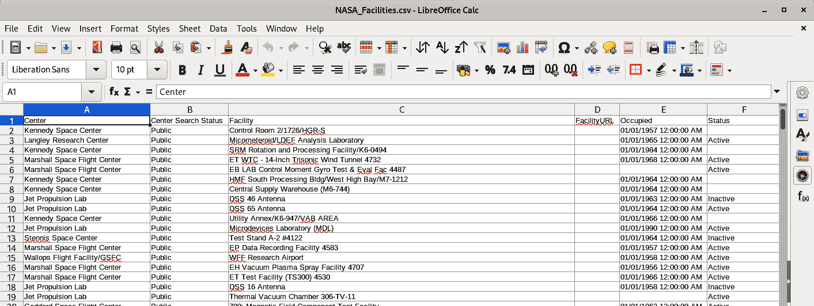

# 第七章：更多 MySQL 操作

MySQL 功能丰富。在过去的三章中，你已经看到了用于查询、修改和管理数据的多种技术。然而，MySQL 还有更多功能等待探索，本章将重点介绍其中一些附加功能。

在本章中，您将学习以下内容：

+   从其他来源（包括查询和文本文件）向数据库中插入数据。

+   使用单个语句在多个表中执行更新和删除操作。

+   替换数据。

+   在查询中使用 MySQL 函数，以满足更复杂的信息需求。

+   使用`EXPLAIN`语句分析查询，然后通过简单的优化技术提高性能。

+   使用替代存储引擎更改表属性。

# 使用查询插入数据

大部分时间，您将使用来自其他来源的数据创建表。因此，您在第三章中看到的示例只是问题的一部分：它们向您展示了如何插入已经以 SQL `INSERT`语句格式化的数据。插入数据的其他方法包括使用 SQL `SELECT`语句从其他表或数据库中读取文件。本节将向您展示如何处理前一种插入数据方法；您将在下一节“从逗号分隔文件加载数据”中学习如何插入来自逗号分隔值文件的数据。

假设我们决定在`sakila`数据库中创建一个新表。它将存储我们想要更多宣传的电影随机列表。在现实世界中，您可能希望使用一些数据科学方法找出要突出显示的电影，但我们将坚持基础知识。这些电影列表将是客户查看目录的不同部分、重新发现一些老片以及了解他们尚未探索的隐藏宝藏的一种方式。我们决定将表结构化如下：

```
mysql> `CREATE` `TABLE` `recommend`
    ->    `film_id` `SMALLINT` `UNSIGNED``,`
    ->    `language_id` `TINYINT` `UNSIGNED``,`
    ->    `release_year` `YEAR``,`
    ->    `title` `VARCHAR``(``128``)``,`
    ->    `length` `SMALLINT` `UNSIGNED``,`
    ->    `sequence_id` `SMALLINT` `AUTO_INCREMENT``,`
    ->    `PRIMARY` `KEY` `(``sequence_id``)`
    -> `)``;`
```

```
Query OK, 0 rows affected (0.05 sec)
```

此表存储每部电影的少量详细信息，使您可以通过对其他表的简单查询找到演员、类别和其他信息。它还存储了一个`sequence_id`，这是一个唯一的数字，用于枚举电影在我们的短列表中的位置。当您开始使用推荐功能时，您将首先看到序列号为 1 的电影，然后是 2，依此类推。您可以看到我们正在使用 MySQL 的`AUTO_INCREMENT`功能来分配`sequence_id`的值。

现在，我们需要用一些随机选择的电影填充我们的新`recommend`表。重要的是，我们将在一条语句中同时执行`SELECT`和`INSERT`。我们开始吧：

```
mysql> `INSERT` `INTO` `recommend` `(``film_id``,` `language_id``,` `release_year``,` `title``,` `length``)`
    -> `SELECT` `film_id``,` `language_id``,` `release_year``,` `title``,` `length`
    -> `FROM` `film` `ORDER` `BY` `RAND``(``)` `LIMIT` `10``;`
```

```
Query OK, 10 rows affected (0.02 sec)
Records: 10  Duplicates: 0  Warnings: 0
```

现在，让我们先了解这条命令如何工作之前发生了什么：

```
mysql> `SELECT` `*` `FROM` `recommend``;`
```

```
+---------+-----+--------------------+--------+-------------+
| film_id | ... | title              | length | sequence_id |
+---------+-----+--------------------+--------+-------------+
|     542 | ... | LUST LOCK          |     52 |           1 |
|     661 | ... | PAST SUICIDES      |    157 |           2 |
|     613 | ... | MYSTIC TRUMAN      |     92 |           3 |
|     757 | ... | SAGEBRUSH CLUELESS |    106 |           4 |
|     940 | ... | VICTORY ACADEMY    |     64 |           5 |
|     917 | ... | TUXEDO MILE        |    152 |           6 |
|     709 | ... | RACER EGG          |    147 |           7 |
|     524 | ... | LION UNCUT         |     50 |           8 |
|      30 | ... | ANYTHING SAVANNAH  |     82 |           9 |
|     602 | ... | MOURNING PURPLE    |    146 |          10 |
+---------+-----+--------------------+--------+-------------+
10 rows in set (0.00 sec)
```

您可以看到我们的推荐列表中有 10 部电影，其`sequence_id`值从 1 到 10。我们准备开始推荐随机选择的电影。如果您的结果不同，不要担心；这是`RAND()`函数工作方式的结果。

SQL 语句有两部分用于填充表格：一个 `INSERT INTO` 和一个 `SELECT`。`INSERT INTO` 语句列出了数据将要存储的目标表，后面跟着一个可选的列名列表在括号中；如果省略列名，则假定所有列按照它们在 `DESCRIBE TABLE` 或 `SHOW CREATE TABLE` 语句输出中的顺序排列。`SELECT` 语句输出的列必须与为 `INSERT INTO` 语句提供的列表的类型和顺序匹配（或者如果未提供，则是隐式完整列表）。总体效果是从 `SELECT` 语句输出的行被 `INSERT INTO` 语句插入到目标表中。在我们的示例中，`film` 表中的 `film_id`、`language_id`、`release_year`、`title` 和 `length` 值被插入到具有相同名称和类型的 `recommend` 表的五列中；`sequence_id` 是使用 MySQL 的 `AUTO_INCREMENT` 功能自动创建的，因此在语句中未指定。

我们的示例包括子句 `ORDER BY RAND()`；这会按照 MySQL 函数 `RAND()` 的结果对结果进行排序。`RAND()` 函数返回范围在 0 到 1 之间的伪随机数：

```
mysql> `SELECT` `RAND``(``)``;`
```

```
+--------------------+
| RAND()             |
+--------------------+
| 0.4593397513584604 |
+--------------------+
1 row in set (0.00 sec)
```

伪随机数生成器并不生成真正的随机数，而是基于系统的某些属性（如时间）生成数字。对于大多数应用来说，这已经足够随机；一个显著的例外是依赖数字真实随机性的密码学应用。

如果在 `SELECT` 操作中请求 `RAND()` 值，你将得到每个返回行的随机值：

```
mysql> `SELECT` `title``,` `RAND``(``)` `FROM` `film` `LIMIT` `5``;`
```

```
+------------------+---------------------+
| title            | RAND()              |
+------------------+---------------------+
| ACADEMY DINOSAUR |  0.5514843506286706 |
| ACE GOLDFINGER   | 0.37940252980161693 |
| ADAPTATION HOLES |  0.2425596278557178 |
| AFFAIR PREJUDICE | 0.07459058060738312 |
| AFRICAN EGG      |  0.6452740502034072 |
+------------------+---------------------+
5 rows in set (0.00 sec)
```

由于值是有效随机的，你几乎肯定会看到与我们这里显示的不同的结果。此外，如果你重复执行语句，你也会看到不同的返回值。可以向 `RAND()` 传递一个整数参数称为 *seed*。这将导致 `RAND()` 函数在每次使用相同输入时生成相同的值—虽然这对我们这里试图实现的目标不是真正有用，但这也是一个可能性。你可以尝试运行以下语句任意次数，结果都不会改变：

```
`SELECT` `title``,` `RAND``(``1``)` `FROM` `film` `LIMIT` `5``;`
```

让我们回到 `INSERT` 操作。当我们要求结果按 `RAND()` 排序时，`SELECT` 语句的结果以伪随机顺序排序。`LIMIT 10` 用于限制 `SELECT` 返回的行数；在这个示例中，我们仅仅是为了可读性而限制了数量。

`INSERT INTO`语句中的`SELECT`语句可以使用所有常规的`SELECT`语句特性。您可以使用连接、聚合、函数和任何其他您选择的功能。您还可以通过在表名前加上数据库名称后跟一个点（`.`）字符，从一个数据库中的数据查询另一个数据库中的数据。例如，如果要将`film`数据库中的`actor`表插入到新的`art`数据库中，可以执行以下操作：

```
mysql> `CREATE` `DATABASE` `art``;`
```

```
Query OK, 1 row affected (0.01 sec)
```

```
mysql> `USE` `art``;`
```

```
Database changed
```

```
mysql> `CREATE` `TABLE` `people`
    ->   `person_id` `SMALLINT` `UNSIGNED``,`
    ->   `first_name` `VARCHAR``(``45``)``,`
    ->   `last_name` `VARCHAR``(``45``)``,`
    ->   `PRIMARY` `KEY` `(``person_id``)`
    -> `)``;`
```

```
Query OK, 0 rows affected (0.03 sec)
```

```
mysql> `INSERT` `INTO` `art``.``people` `(``person_id``,` `first_name``,` `last_name``)`
    -> `SELECT` `actor_id``,` `first_name``,` `last_name` `FROM` `sakila``.``actor``;`
```

```
Query OK, 200 rows affected (0.01 sec)
Records: 200  Duplicates: 0  Warnings: 0
```

新的`people`表被称为`art.people`（尽管不需要这样，因为`art`是当前正在使用的数据库），`actor`表被称为`sakila.actor`（这是必需的，因为这不是当前使用的数据库）。注意，`SELECT`和`INSERT`中的列名不需要相同。

有时，在使用`SELECT`语句插入时会遇到重复的问题。如果尝试两次插入相同的主键值，MySQL 将中止。这在`recommend`表中不会发生，只要您使用`AUTO_INCREMENT`功能自动分配新的`sequence_id`即可。但是，我们可以强制将重复项插入到表中以显示其行为：

```
mysql> `USE` `sakila``;`
```

```
Database changed
```

```
mysql> `INSERT` `INTO` `recommend` `(``film_id``,` `language_id``,` `release_year``,`
    -> `title``,` `length``,` `sequence_id` `)`
    -> `SELECT` `film_id``,` `language_id``,` `release_year``,` `title``,` `length``,` `1`
    -> `FROM` `film` `LIMIT` `1``;`
```

```
ERROR 1062 (23000): Duplicate entry '1' for key 'recommend.PRIMARY'
```

如果要 MySQL 忽略这一点并继续进行，请在`INSERT`之后添加`IGNORE`关键字：

```
mysql> `INSERT` `IGNORE` `INTO` `recommend` `(``film_id``,` `language_id``,` `release_year``,`
    -> `title``,` `length``,` `sequence_id` `)`
    -> `SELECT` `film_id``,` `language_id``,` `release_year``,` `title``,` `length``,` `1`
    -> `FROM` `film` `LIMIT` `1``;`
```

```
Query OK, 0 rows affected, 1 warning (0.00 sec)
Records: 1  Duplicates: 1  Warnings: 1
```

MySQL 不会抱怨，但它会报告遇到了重复。请注意，数据并未更改；我们所做的只是忽略了错误。这在大量加载操作中非常有用，您不希望在运行插入一百万行的脚本时半途而废。我们可以检查警告，看到现在将`*Duplicate entry*`错误作为警告：

```
mysql> `SHOW` `WARNINGS``;`
```

```
+---------+------+-------------------------------------------------+
| Level   | Code | Message                                         |
+---------+------+-------------------------------------------------+
| Warning | 1062 | Duplicate entry '1' for key 'recommend.PRIMARY' |
+---------+------+-------------------------------------------------+
1 row in set (0.00 sec)
```

最后，请注意，可以插入到`SELECT`语句中列出的表中，但仍然需要避免重复的主键：

```
mysql> `INSERT` `INTO` `actor` `SELECT`
    -> `actor_id``,` `first_name``,` `last_name``,` `NOW``(``)` `FROM` `actor``;`
```

```
ERROR 1062 (23000): Duplicate entry '1' for key 'actor.PRIMARY'
```

避免出现错误有两种方法。首先，`actor`表为`actor_id`启用了`AUTO_INCREMENT`，因此如果完全省略`INSERT`中的此列，就不会出现错误，因为新值将自动生成。（`INSERT`语句的语法在“Alternative Syntaxes”中有解释。）这是一个仅插入一条记录的示例（由于`LIMIT`子句）：

```
`INSERT` `INTO` `actor``(``first_name``,` `last_name``,` `last_update``)`
`SELECT` `first_name``,` `last_name``,` `NOW``(``)` `FROM` `actor` `LIMIT` `1``;`
```

第二种方法是在`SELECT`查询中修改`actor_id`，以避免冲突。让我们试试这个：

```
mysql> `INSERT` `INTO` `actor` `SELECT`
    -> `actor_id``+``200``,` `first_name``,` `last_name``,` `NOW``(``)` `FROM` `actor``;`
```

```
Query OK, 200 rows affected (0.01 sec)
Records: 200  Duplicates: 0  Warnings: 0
```

在这里，我们复制了行，但在插入它们之前将它们的`actor_id`值增加了 200，因为我们记得最初有 200 行。这是结果：

```
mysql> `SELECT` `*` `FROM` `actor``;`
```

```
+----------+-------------+--------------+---------------------+
| actor_id | first_name  | last_name    | last_update         |
+----------+-------------+--------------+---------------------+
|        1 | PENELOPE    | GUINESS      | 2006-02-15 04:34:33 |
|        2 | NICK        | WAHLBERG     | 2006-02-15 04:34:33 |
|      ...                                                    |
|      198 | MARY        | KEITEL       | 2006-02-15 04:34:33 |
|      199 | JULIA       | FAWCETT      | 2006-02-15 04:34:33 |
|      200 | THORA       | TEMPLE       | 2006-02-15 04:34:33 |
|      201 | PENELOPE    | GUINESS      | 2021-02-28 10:24:49 |
|      202 | NICK        | WAHLBERG     | 2021-02-28 10:24:49 |
|      ...                                                    |
|      398 | MARY        | KEITEL       | 2021-02-28 10:24:49 |
|      399 | JULIA       | FAWCETT      | 2021-02-28 10:24:49 |
|      400 | THORA       | TEMPLE       | 2021-02-28 10:24:49 |
+----------+-------------+--------------+---------------------+
400 rows in set (0.00 sec)
```

您可以看到`actor_id`从 201 开始，姓氏、名字和`last_update`值开始重复。

在`INSERT SELECT`语句中还可以使用子查询。例如，下一条语句是有效的：

```
*INSERT INTO actor SELECT * FROM*
*(SELECT actor_id+400, first_name, last_name, NOW() FROM actor) foo;*
```

# 从逗号分隔文件加载数据

如今，数据库通常不再是一个事后补救的问题。它们无处不在，比以往任何时候都更容易使用，大多数 IT 专业人员都知道它们。尽管如此，最终用户发现它们很难使用，除非创建了专门的用户界面，否则大量的数据输入和分析将在各种电子表格程序中进行。这些程序通常具有独特的文件格式，开放或封闭，但它们大多数允许您将数据导出为逗号分隔的值（CSV），也称为 *逗号分隔格式*。然后，您可以通过一点努力将数据导入 MySQL。

另一个常见的通过处理 CSV 完成的任务是在异构环境中传输数据。如果您的设置中运行着各种数据库软件，尤其是在云中使用 DBaaS，那么在这些系统之间传输数据可能会让人望而却步。然而，基本的 CSV 数据可以成为它们的最低公共分母。请注意，在任何数据传输的情况下，您应始终记住 CSV 没有模式、数据类型或约束的概念。但作为一种扁平的数据文件格式，它表现良好。

如果您不使用电子表格程序，通常仍然可以使用命令行工具，如 `sed` 和 `awk` —— 这些是非常古老和强大的 Unix 实用工具 —— 将文本数据转换为适合 MySQL 导入的 CSV 格式。一些云数据库允许直接将其数据导出为 CSV。在其他一些情况下，可能需要编写小程序来读取数据并生成 CSV 文件。本节将向您展示如何将 CSV 数据导入 MySQL 的基础知识。

让我们通过一个例子来详细说明。我们有一个包含 NASA 设施及其地址和联系信息的列表，我们希望将其存储在一个数据库中。目前，它存储在一个名为 *NASA_Facilities.csv* 的 CSV 文件中，并且其格式如 图 7-1 所示。



###### 图 7-1\. 存储在电子表格文件中的 NASA 设施列表

您可以看到，每个设施都与一个中心相关联，可能列出了其占用日期及可选的状态。完整的列列表如下：

+   中心

+   中心搜索状态

+   设施

+   FacilityURL

+   占用

+   状态

+   URL 链接

+   记录日期

+   最后更新

+   国家

+   联系人

+   Phone

+   位置

+   城市

+   州

+   邮政编码

该示例直接来自 NASA 的公开数据门户 [Open Data Portal](https://oreil.ly/xIm3A)，文件在本书的 [GitHub 仓库](https://oreil.ly/ayDai) 中可用。由于这已经是一个 CSV 文件，我们不需要将其从其他文件格式（如 XLS）转换过来。但是，如果您在自己的项目中需要这样做，通常只需使用电子表格程序的“另存为”命令即可；只需别忘记选择 CSV 作为输出格式。

如果您使用文本编辑器打开*NASA_facilities.csv*文件，您会看到每个电子表格行都有一行，每列的值由逗号分隔。如果您在非 Windows 平台上，可能会发现在某些 CSV 文件中，每行以`^M`结尾，但不必担心这一点；这是 Windows 起源的遗留物。这种格式的数据通常称为*DOS 格式*，大多数软件应用程序可以处理它而无需问题。在我们的情况下，数据处于*Unix 格式*，因此在 Windows 上，您可能会看到所有行都被连接在一起。如果情况如此，您可以尝试使用另一个文本编辑器。以下是从*NASA_Facilities.csv*中选择的一些宽度截断行：

```
Center,Center Search Status,Facility,FacilityURL,Occupied,Status,...
Kennedy Space Center,Public,Control Room 2/1726/HGR-S ,,...
Langley Research Center,Public,Micometeroid/LDEF Analysis Laboratory,,...
Kennedy Space Center,Public,SRM Rotation and Processing Facility/K6-0494 ,...
Marshall Space Flight Center,..."35812(34.729538, -86.585283)",Huntsville,...
```

如果值中有逗号或其他特殊符号，则整个值将用引号括起来，如所示的最后一行。

让我们将这些数据导入到 MySQL 中。首先，创建新的`nasa`数据库：

```
mysql> `CREATE` `DATABASE` `nasa``;`
```

```
Query OK, 1 row affected (0.01 sec)
```

选择此数据库作为活动数据库：

```
mysql> `USE` `nasa``;`
```

```
Database changed
```

现在，创建`facilities`表来存储数据。这需要处理 CSV 文件中看到的所有字段，该文件方便地具有标题：

```
mysql> `CREATE` `TABLE` `facilities` `(`
    ->   `center` `TEXT``,`
    ->   `center_search_status` `TEXT``,`
    ->   `facility` `TEXT``,`
    ->   `facility_url` `TEXT``,`
    ->   `occupied` `TEXT``,`
    ->   `status` `TEXT``,`
    ->   `url_link` `TEXT``,`
    ->   `record_date` `DATETIME``,`
    ->   `last_update` `TIMESTAMP` `NULL``,`
    ->   `country` `TEXT``,`
    ->   `contact` `TEXT``,`
    ->   `phone` `TEXT``,`
    ->   `location` `TEXT``,`
    ->   `city` `TEXT``,`
    ->   `state` `TEXT``,`
    ->   `zipcode` `TEXT`
    -> `)``;`
```

```
Query OK, 0 rows affected (0.03 sec)
```

这里我们在数据类型上有些作弊。NASA 提供了数据集的模式，但对于大多数字段，类型都被给定为“纯文本”，而我们实际上无法将“网站 URL”存储为除文本之外的任何东西。然而，我们并不知道每个列会容纳多少数据。因此，我们默认使用`TEXT`类型，这类似于将列定义为`VARCHAR(65535)`。两种类型之间存在一些差异，正如您可能从“字符串类型”中记得的那样，但在这个例子中并不重要。我们不定义任何索引，也不在表上设置任何约束。如果您要加载一个完全新的数据集，它相当小，先加载它然后再进行分析可能会有益。对于较大的数据集，请确保表结构尽可能良好，否则您将花费相当多的时间来修改它。

现在我们已经设置了数据库表，可以使用`LOAD DATA INFILE`命令从文件中导入数据：

```
mysql> `LOAD` `DATA` `INFILE` `'NASA_Facilities.csv'` `INTO` `TABLE` `facilities`
    -> `FIELDS` `TERMINATED` `BY` `','``;`
```

```
ERROR 1290 (HY000): The MySQL server is running with
the --secure-file-priv option so it cannot execute this statement
```

哦，不！我们遇到了一个错误。默认情况下，MySQL 不允许您使用`LOAD DATA INFILE`命令加载*任何*数据。该行为由`secure_file_priv`系统变量控制。如果该变量设置了路径，则要加载的文件应位于该特定路径中，并且 MySQL 服务器应能够读取它。如果未设置该变量，则认为它是不安全的，那么要加载的文件应仅由 MySQL 服务器可读取。默认情况下，Linux 上的 MySQL 8.0 设置该变量如下：

```
mysql> `SELECT` `@``@``secure_file_priv``;`
```

```
+-----------------------+
| @@secure_file_priv    |
+-----------------------+
| /var/lib/mysql-files/ |
+-----------------------+
1 row in set (0.00 sec)
```

在 Windows 上：

```
mysql> `SELECT` `@``@``secure_file_priv``;`
```

```
+------------------------------------------------+
| @@secure_file_priv                             |
+------------------------------------------------+
| C:\ProgramData\MySQL\MySQL Server 8.0\Uploads\ |
+------------------------------------------------+
1 row in set (0.00 sec)
```

###### 注意

`secure_file_priv`系统变量的值可能因您的 MySQL 安装而异，甚至可能为空。对于`secure_file_priv`的`NULL`值意味着 MySQL 将允许在任何位置加载文件，只要 MySQL 服务器能访问到该文件。在 Linux 上，这意味着文件必须对`mysqld`进程可读，通常该进程以`mysql`用户身份运行。您可以通过更新 MySQL 配置并重新启动服务器来更改`secure_file_priv`变量的值。有关如何配置 MySQL 的信息，请参阅第九章。

在 Linux 或其他类 Unix 系统上，您需要将文件复制到该目录中，可能需要使用`sudo`以允许该操作，然后更改其权限，以便`mysqld`程序可以访问该文件。在 Windows 上，您只需将文件复制到正确的目标位置即可。

让我们开始吧。在 Linux 或类似系统上，您可以运行如下命令：

```
$ ls -lh $HOME/Downloads/NASA_Facilities.csv
-rw-r--r--. 1 skuzmichev skuzmichev 114K
    Feb 28 14:19 /home/skuzmichev/Downloads/NASA_Facilities.csv
$ sudo cp -vip ~/Downloads/NASA_Facilities.csv /var/lib/mysql-files
[sudo] password for skuzmichev:
'/home/skuzmichev/Downloads/NASA_Facilities.csv'
    -> '/var/lib/mysql-files/NASA_Facilities.csv'
$ sudo chown mysql:mysql /var/lib/mysql-files/NASA_Facilities.csv
$ sudo ls -lh /var/lib/mysql-files/NASA_Facilities.csv
-rw-r--r--. 1 mysql mysql 114K
    Feb 28 14:19 /var/lib/mysql-files/NASA_Facilities.csv
```

在 Windows 上，您可以使用文件管理器复制或移动文件。

现在我们准备再次尝试加载。当目标文件不在当前目录中时，我们需要将完整路径传递给命令：

```
mysql> `LOAD` `DATA` `INFILE` `'/var/lib/mysql-files/NASA_Facilities.csv'`
    -> `INTO` `TABLE` `facilities` `FIELDS` `TERMINATED` `BY` `','``;`
```

```
ERROR 1292 (22007): Incorrect datetime value:
'Record Date' for column 'record_date' at row 1
```

嗯，看起来不对：`Record Date`确实不是日期，而是列名。我们犯了一个愚蠢但常见的错误，加载包含标题的 CSV 文件。我们需要告诉 MySQL 省略它：

```
mysql> `LOAD` `DATA` `INFILE` `'/var/lib/mysql-files/NASA_Facilities.csv'`
    -> `INTO` `TABLE` `facilities` `FIELDS` `TERMINATED` `BY` `','`
    -> `IGNORE` `1` `LINES``;`
```

```
ERROR 1292 (22007): Incorrect datetime value:
'03/01/1996 12:00:00 AM' for column 'record_date' at row 1
```

结果表明，我们拥有的日期格式不符合 MySQL 的期望。这是一个非常常见的问题。有几种解决方法。首先，我们可以将`record_date`列更改为`TEXT`类型。我们将失去正确日期时间数据类型的优势，但我们将能够将数据导入数据库。其次，我们可以在数据从文件中摄取时进行转换。为了展示结果的不同，我们指定了`occupied`列（这是一个日期字段）为`TEXT`。尽管我们将进入转换的复杂性之前，让我们尝试在 Windows 上运行相同的命令：

```
mysql> `LOAD` `DATA` `INFILE`
    -> `'C:\ProgramData\MySQL\MySQL Server 8.0\Uploads\NASA_Facilities.csv'`
    -> `INTO` `TABLE` `facilities` `FIELDS` `TERMINATED` `BY` `','``;`
```

```
ERROR 1290 (HY000): The MySQL server is running with
the --secure-file-priv option so it cannot execute this statement
```

即使文件存在于该目录中，`LOAD DATA INFILE`也会报错。这是因为 MySQL 在 Windows 上处理路径的方式。我们不能简单地使用常规的 Windows 风格路径来执行此或其他 MySQL 命令。我们需要用另一个反斜杠(`\`)转义每个反斜杠，或者改用正斜杠(`/`)作为路径。两者都可以……或者说，在这种情况下，两者都会由于预期的`record_date`转换问题而报错：

```
mysql> `LOAD` `DATA` `INFILE`
    -> `'C:\\ProgramData\\MySQL\\MySQL Server 8.0\\Uploads\\NASA_Facilities.csv'`
    -> `INTO` `TABLE` `facilities` `FIELDS` `TERMINATED` `BY` `','``;`
```

```
ERROR 1292 (22007): Incorrect datetime value:
'Record Date' for column 'record_date' at row 1
```

```
mysql> `LOAD` `DATA` `INFILE`
    -> `'C:/ProgramData/MySQL/MySQL Server 8.0/Uploads/NASA_Facilities.csv'`
    -> `INTO` `TABLE` `facilities` `FIELDS` `TERMINATED` `BY` `','``;`
```

```
ERROR 1292 (22007): Incorrect datetime value:
'Record Date' for column 'record_date' at row 1
```

说完这些，让我们回到日期转换问题上。正如我们所提到的，这是一个极为常见的问题。您将不可避免地遇到类型转换问题，因为 CSV 是无类型的，不同的数据库对各种类型有不同的期望。在这种情况下，我们获得的开放数据集中的日期格式如下：`03/01/1996 12:00:00 AM`。尽管这将使我们的操作更加复杂，但我们认为从 CSV 文件中转换日期值是一个很好的练习。为了将任意字符串转换为日期，或至少尝试这样的转换，我们可以使用`STR_TO_DATE()`函数。在查阅了文档后，我们得出了以下转换：

```
mysql> `SELECT` `STR_TO_DATE``(``'03/01/1996 12:00:00 AM'``,`
    -> `'%m/%d/%Y %h:%i:%s %p'``)` `converted``;`
```

```
+---------------------+
| converted           |
+---------------------+
| 1996-03-01 00:00:00 |
+---------------------+
1 row in set (0.01 sec)
```

由于函数在转换失败时返回`NULL`，我们知道我们已经成功找到了正确的调用方法。现在我们需要找出如何在`LOAD DATA INFILE`命令中使用该函数。使用函数的更长版本看起来像这样：

```
mysql> `LOAD` `DATA` `INFILE` `'/var/lib/mysql-files/NASA_Facilities.csv'`
    -> `INTO` `TABLE` `facilities` `FIELDS` `TERMINATED` `BY` `','`
    -> `OPTIONALLY` `ENCLOSED` `BY` `'"'`
    -> `IGNORE` `1` `LINES`
    -> `(``center``,` `center_search_status``,` `facility``,` `facility_url``,`
    -> `occupied``,` `status``,` `url_link``,` `@``var_record_date``,` `@``var_last_update``,`
    -> `country``,` `contact``,` `phone``,` `location``,` `city``,` `state``,` `zipcode``)`
    -> `SET` `record_date` `=` `IF``(`
    ->   `CHAR_LENGTH``(``@``var_record_date``)``=``0``,` `NULL``,`
    ->     `STR_TO_DATE``(``@``var_record_date``,` `'%m/%d/%Y %h:%i:%s %p'``)`
    -> `)``,`
    -> `last_update` `=` `IF``(`
    ->   `CHAR_LENGTH``(``@``var_last_update``)``=``0``,` `NULL``,`
    ->     `STR_TO_DATE``(``@``var_last_update``,` `'%m/%d/%Y %h:%i:%s %p'``)`
    -> `)``;`
```

```
Query OK, 485 rows affected (0.05 sec)
Records: 485  Deleted: 0  Skipped: 0  Warnings: 0
```

这是一条很长的命令！让我们来分解一下。第一行指定了我们的`LOAD DATA INFILE`命令及文件路径。第二行指定了目标表，并开始`FIELDS`规范，以`TERMINATED BY ','`开头，这表示我们的字段是以逗号分隔的，符合 CSV 的预期。第三行在`FIELDS`规范中添加了另一个参数，并告诉 MySQL 一些字段（但不是所有字段）由`"`符号包围。这很重要，因为我们的数据集中有些条目在`"..."`字段内包含逗号。在第四行，我们指定跳过文件的第一行，我们知道标题位于其中。

第 5 至 7 行是列列表规范。我们需要转换两个日期时间列，并且为此需要将它们的值读入变量，然后将变量设置为`nasa.facilities`表的列值。然而，如果我们没有同时指定所有其他列或者顺序不正确，MySQL 将无法正确分配值。CSV 本质上是基于位置的格式。默认情况下，当未给出`FIELDS`规范时，MySQL 将读取每个 CSV 行，并期望所有行中的每个字段按照目标表中列的顺序（由`DESCRIBE`或`SHOW CREATE TABLE`命令给出）映射到列中。通过更改此规范中的列顺序，我们可以从具有字段错位的 CSV 文件填充表。通过指定较少的列，我们可以从缺少某些字段的文件中填充表。

第 8 至 15 行是我们的函数调用，用于转换日期时间值。在前面的列规范中，我们定义了字段 8 被读入 `@var_record_date` 变量，字段 9 被读入 `@var_last_update`。我们知道字段 8 和 9 是我们的问题日期时间字段。有了填充的变量，我们可以定义 `SET` 参数，根据从 CSV 文件中读取的字段修改目标表列的值。在这个非常基本的示例中，您可以将特定值乘以二。在我们的情况下，我们执行了两个函数转换：首先，我们检查一个变量是否为空（在 CSV 中是 `,,`），通过评估从文件中读取的字符数，然后，如果前面的检查不返回零，则调用实际的转换。如果我们发现长度为零，则将该值设置为 `NULL`。

最后，执行命令后，可以检查结果：

```
mysql> `SELECT` `facility``,` `occupied``,` `last_update`
    -> `FROM` `facilities`
    -> `ORDER` `BY` `last_update` `DESC` `LIMIT` `5``;`
```

```
+---------------------...+------------------------+---------------------+
| facility            ...| occupied               | last_update         |
+---------------------...+------------------------+---------------------+
| Turn Basin/K7-1005  ...| 01/01/1963 12:00:00 AM | 2015-06-22 00:00:00 |
| RPSF Surge Building ...| 01/01/1984 12:00:00 AM | 2015-06-22 00:00:00 |
| Thermal Protection S...| 01/01/1988 12:00:00 AM | 2015-06-22 00:00:00 |
| Intermediate Bay/M7-...| 01/01/1995 12:00:00 AM | 2015-06-22 00:00:00 |
| Orbiter Processing F...| 01/01/1987 12:00:00 AM | 2015-06-22 00:00:00 |
+---------------------...+------------------------+---------------------+
5 rows in set (0.00 sec)
```

记住我们提到过 `occupied` 保持为 `TEXT`。您可以在此处看到。虽然它可用于排序，但此列中的值如果未显式转换为 `DATETIME`，则无法使用日期函数。

这是一个复杂的例子，但它显示了加载数据的意外复杂性以及 `LOAD DATA INFILE` 命令的强大功能。

# 将数据写入逗号分隔的文件

您可以使用 `SELECT INTO OUTFILE` 语句将查询结果写入 CSV 文件，该文件可以被电子表格或其他程序打开。

让我们将当前 `employees` 数据库中的管理者列表导出为 CSV 文件。用于列出所有当前管理者的查询如下所示：

```
mysql> `USE` `employees``;`
```

```
Database changed
```

```
mysql> `SELECT` `emp_no``,` `first_name``,` `last_name``,` `title``,` `from_date`
    -> `FROM` `employees` `JOIN` `titles` `USING` `(``emp_no``)`
    -> `WHERE` `title` `=` `'Manager'` `AND` `to_date` `=` `'9999-01-01'``;`
```

```
+--------+------------+------------+---------+------------+
| emp_no | first_name | last_name  | title   | from_date  |
+--------+------------+------------+---------+------------+
| 110039 | Vishwani   | Minakawa   | Manager | 1991-10-01 |
| 110114 | Isamu      | Legleitner | Manager | 1989-12-17 |
| 110228 | Karsten    | Sigstam    | Manager | 1992-03-21 |
| 110420 | Oscar      | Ghazalie   | Manager | 1996-08-30 |
| 110567 | Leon       | DasSarma   | Manager | 1992-04-25 |
| 110854 | Dung       | Pesch      | Manager | 1994-06-28 |
| 111133 | Hauke      | Zhang      | Manager | 1991-03-07 |
| 111534 | Hilary     | Kambil     | Manager | 1991-04-08 |
| 111939 | Yuchang    | Weedman    | Manager | 1996-01-03 |
+--------+------------+------------+---------+------------+
9 rows in set (0.13 sec)
```

我们可以稍微修改这个 `SELECT` 查询，以将这些数据写入一个输出文件作为逗号分隔值。 `INTO OUTFILE` 受 `LOAD DATA INFILE` 相同的 `--secure-file-priv` 选项规则限制。默认情况下，文件路径是有限的，并且我们在 “从逗号分隔的文件加载数据” 中列出了默认选项：

```
mysql> `SELECT` `emp_no``,` `first_name``,` `last_name``,` `title``,` `from_date`
    -> `FROM` `employees` `JOIN` `titles` `USING` `(``emp_no``)`
    -> `WHERE` `title` `=` `'Manager'` `AND` `to_date` `=` `'9999-01-01'`
    -> `INTO` `OUTFILE` `'/var/lib/mysql-files/managers.csv'`
    -> `FIELDS` `TERMINATED` `BY` `','``;`
```

```
Query OK, 9 rows affected (0.14 sec)
```

我们将结果保存在 */var/lib/mysql-files* 目录下的文件 *managers.csv* 中；MySQL 服务器必须能够写入您指定的目录，并且它应该是 `secure_file_priv` 系统变量中列出的一个目录（如果已设置）。在 Windows 系统上，请指定类似 *C:\ProgramData\MySQL\MySQL Server 8.0\Uploads\managers.csv* 的路径。如果省略了 `FIELDS TERMINATED BY` 子句，服务器将使用制表符作为数据值之间的默认分隔符。

您可以在文本编辑器中查看 *managers.csv* 文件的内容，或将其导入电子表格程序中：

```
110039,Vishwani,Minakawa,Manager,1991-10-01
110114,Isamu,Legleitner,Manager,1989-12-17
110228,Karsten,Sigstam,Manager,1992-03-21
110420,Oscar,Ghazalie,Manager,1996-08-30
110567,Leon,DasSarma,Manager,1992-04-25
110854,Dung,Pesch,Manager,1994-06-28
111133,Hauke,Zhang,Manager,1991-03-07
111534,Hilary,Kambil,Manager,1991-04-08
111939,Yuchang,Weedman,Manager,1996-01-03
```

当我们的数据字段包含逗号或其他我们选择的分隔符时，默认情况下，MySQL 将会转义字段中的分隔符。让我们切换到 `sakila` 数据库并测试这一点：

```
mysql> `USE` `sakila``;`
```

```
Database changed
```

```
mysql> `SELECT` `title``,` `special_features` `FROM` `film` `LIMIT` `10`
    -> `INTO` `OUTFILE` `'/var/lib/mysql-files/film.csv'`
    -> `FIELDS` `TERMINATED` `BY` `','``;`
```

```
Query OK, 10 rows affected (0.00 sec)
```

如果您现在查看 *film.csv* 文件中的数据（再次，可以使用文本编辑器、电子表格程序或 Linux 上的 `head` 命令），您将看到以下内容：

```
ACADEMY DINOSAUR,Deleted Scenes\,Behind the Scenes
ACE GOLDFINGER,Trailers\,Deleted Scenes
ADAPTATION HOLES,Trailers\,Deleted Scenes
AFFAIR PREJUDICE,Commentaries\,Behind the Scenes
AFRICAN EGG,Deleted Scenes
AGENT TRUMAN,Deleted Scenes
AIRPLANE SIERRA,Trailers\,Deleted Scenes
AIRPORT POLLOCK,Trailers
ALABAMA DEVIL,Trailers\,Deleted Scenes
ALADDIN CALENDAR,Trailers\,Deleted Scenes
```

请注意，在第二个字段包含逗号的行中，逗号已自动使用反斜杠进行转义，以区分其与分隔符。某些电子表格程序可能会理解这一点，并在导入文件时移除反斜杠，而有些则不会。MySQL 将尊重转义并不将这样的逗号视为分隔符。请注意，如果我们指定了 `FIELDS TERMINATED BY '^'`，则所有字段中的 `^` 符号将会被转义；这并不局限于逗号。

由于并非所有程序都可以优雅地处理转义字符，我们可以请求 MySQL 使用 `ENCLOSED` 选项显式定义字段：

```
mysql> `SELECT` `title``,` `special_features` `FROM` `film` `LIMIT` `10`
    -> `INTO` `OUTFILE` `'/var/lib/mysql-files/film_quoted.csv'`
    -> `FIELDS` `TERMINATED` `BY` `','` `ENCLOSED` `BY` `'"'``;`
```

```
Query OK, 10 rows affected (0.00 sec)
```

我们在加载数据时曾使用过此选项。查看文件 *film_quoted.csv* 中的结果。

```
"ACADEMY DINOSAUR","Deleted Scenes,Behind the Scenes"
"ACE GOLDFINGER","Trailers,Deleted Scenes"
"ADAPTATION HOLES","Trailers,Deleted Scenes"
"AFFAIR PREJUDICE","Commentaries,Behind the Scenes"
"AFRICAN EGG","Deleted Scenes"
"AGENT TRUMAN","Deleted Scenes"
"AIRPLANE SIERRA","Trailers,Deleted Scenes"
"AIRPORT POLLOCK","Trailers"
"ALABAMA DEVIL","Trailers,Deleted Scenes"
"ALADDIN CALENDAR","Trailers,Deleted Scenes"
```

我们的分隔符—逗号—现在不再被转义，这可能更适合现代电子表格程序。您可能会想知道，如果导出字段中包含双引号会发生什么：MySQL 将会转义这些引号而不是逗号，这可能会再次引起问题。在进行数据导出时，请务必确保生成的输出对您的消费者有效。

# 使用查询创建表格

您可以使用查询创建表格或轻松创建表格的副本。这在您希望使用现有数据构建新数据库时非常有用，例如，您可能希望复制一些国家的列表，或者在某种原因下重新组织数据。数据重新组织在生成报告、合并两个或更多表的数据以及动态重设计时非常常见。本小节展示了如何操作。

###### 提示

我们所有的示例都基于未修改的 `sakila` 数据库。在继续之前，请重复执行 “实体关系建模示例” 中给出的步骤，使数据库恢复到其干净的状态。

在 MySQL 中，您可以使用 `CREATE TABLE` 语法的变体轻松复制表的结构：

```
mysql> `USE` `sakila``;`
```

```
Database changed
```

```
mysql> `CREATE` `TABLE` `actor_2` `LIKE` `actor``;`
```

```
Query OK, 0 rows affected (0.24 sec)
```

```
mysql> `DESCRIBE` `actor_2``;`
```

```
+-------------+-------------------+------+-----+...
| Field       | Type              | Null | Key |...
+-------------+-------------------+------+-----+...
| actor_id    | smallint unsigned | NO   | PRI |...
| first_name  | varchar(45)       | NO   |     |...
| last_name   | varchar(45)       | NO   | MUL |...
| last_update | timestamp         | NO   |     |...
+-------------+-------------------+------+-----+...
```

```
...+-------------------+-----------------------------------------------+
...| Default           | Extra                                         |
...+-------------------+-----------------------------------------------+
...| NULL              | auto_increment                                |
...| NULL              |                                               |
...| NULL              |                                               |
...| CURRENT_TIMESTAMP | DEFAULT_GENERATED on update CURRENT_TIMESTAMP |
...+-------------------+-----------------------------------------------+
4 rows in set (0.01 sec)
```

```
mysql> `SELECT` `*` `FROM` `actor_2``;`
```

```
Empty set (0.00 sec)
```

`LIKE` 语法允许您创建一个新表，其结构与另一个表完全相同，包括键。可以看到，它不会复制数据。您还可以在此语法中使用 `IF NOT EXISTS` 和 `TEMPORARY` 特性。

如果您想创建一个表并复制一些数据，您可以结合使用 `CREATE TABLE` 和 `SELECT` 语句来实现。让我们删除 `actor_2` 表，并使用这种新方法重新创建它：

```
mysql> `DROP` `TABLE` `actor_2``;`
```

```
Query OK, 0 rows affected (0.08 sec)
```

```
mysql> `CREATE` `TABLE` `actor_2` `AS` `SELECT` `*` `from` `actor``;`
```

```
Query OK, 200 rows affected (0.03 sec)
Records: 200  Duplicates: 0  Warnings: 0
```

```
mysql> `SELECT` `*` `FROM` `actor_2` `LIMIT` `5``;`
```

```
+----------+------------+--------------+---------------------+
| actor_id | first_name | last_name    | last_update         |
+----------+------------+--------------+---------------------+
|        1 | PENELOPE   | GUINESS      | 2006-02-15 04:34:33 |
|        2 | NICK       | WAHLBERG     | 2006-02-15 04:34:33 |
|        3 | ED         | CHASE        | 2006-02-15 04:34:33 |
|        4 | JENNIFER   | DAVIS        | 2006-02-15 04:34:33 |
|        5 | JOHNNY     | LOLLOBRIGIDA | 2006-02-15 04:34:33 |
+----------+------------+--------------+---------------------+
5 rows in set (0.01 sec)
```

通过 `SELECT` 语句创建了一个完全相同的 `actor_2` 表，并将所有数据复制过去。`CREATE TABLE AS SELECT` 或 `CTAS` 是此操作的常见名称，但实际上并非必须指定 `AS` 部分，稍后我们会省略它。

这种技术非常强大。您可以创建具有新结构的新表，并使用强大的查询将其填充数据。例如，这里是一个 `report` 表，用于包含我们数据库中电影的名称及其类别的信息：

```
mysql> `CREATE` `TABLE` `report` `(``title` `VARCHAR``(``128``)``,` `category` `VARCHAR``(``25``)``)`
    -> `SELECT` `title``,` `name` `AS` `category` `FROM`
    -> `film` `JOIN` `film_category` `USING` `(``film_id``)`
    -> `JOIN` `category` `USING` `(``category_id``)``;`
```

```
Query OK, 1000 rows affected (0.06 sec)
Records: 1000  Duplicates: 0  Warnings: 0
```

你可以看到，这个语法与前面的例子有些不同。在这个例子中，新的表名`report`后面跟着一个列名和类型的列表，用括号括起来；这是必要的，因为我们不是复制现有表的结构。此外，我们实际上将`name`改为了`category`。然后，`SELECT`语句跟着，其输出与新表中的新列匹配。你可以检查新表的内容来查看结果：

```
mysql> `SELECT` `*` `FROM` `report` `LIMIT` `5``;`
```

```
+---------------------+----------+
| title               | category |
+---------------------+----------+
| AMADEUS HOLY        | Action   |
| AMERICAN CIRCUS     | Action   |
| ANTITRUST TOMATOES  | Action   |
| ARK RIDGEMONT       | Action   |
| BAREFOOT MANCHURIAN | Action   |
+---------------------+----------+
5 rows in set (0.00 sec)
```

因此，在这个例子中，`SELECT`语句中的`title`和`name`值用于填充`report`表中的新`title`和`category`列。

使用查询创建表有一个主要的注意事项，你需要注意：它不会复制索引（或外键，如果使用）。这是一个特性，因为它给你很大的灵活性，但如果你忘记了，它可能是一个陷阱。看看我们的`actor_2`示例：

```
mysql> `DESCRIBE` `actor_2``;`
```

```
+-------------+-------------------+------+-----+...
| Field       | Type              | Null | Key |...
+-------------+-------------------+------+-----+...
| actor_id    | smallint unsigned | NO   |     |...
| first_name  | varchar(45)       | NO   |     |...
| last_name   | varchar(45)       | NO   |     |...
| last_update | timestamp         | NO   |     |...
+-------------+-------------------+------+-----+...
...+-------------------+-----------------------------------------------+
...| Default           | Extra                                         |
...+-------------------+-----------------------------------------------+
...| 0                 |                                               |
...| NULL              |                                               |
...| NULL              |                                               |
...| CURRENT_TIMESTAMP | DEFAULT_GENERATED on update CURRENT_TIMESTAMP |
...+-------------------+-----------------------------------------------+
4 rows in set (0.00 sec)
```

```
mysql> `SHOW` `CREATE` `TABLE` `actor_2``\``G`
```

```
*************************** 1\. row ***************************
       Table: actor_2
Create Table: CREATE TABLE `actor_2` (
  `actor_id` smallint unsigned NOT NULL DEFAULT '0',
  `first_name` varchar(45) NOT NULL,
  `last_name` varchar(45) NOT NULL,
  `last_update` timestamp NOT NULL
    DEFAULT CURRENT_TIMESTAMP
    ON UPDATE CURRENT_TIMESTAMP
) ENGINE=InnoDB DEFAULT CHARSET=utf8mb4
    COLLATE=utf8mb4_0900_ai_ci
1 row in set (0.00 sec)
```

你可以看到这里没有主键；`idx_actor_last_name`键也丢失了，`actor_id`列的`AUTO_INCREMENT`属性也没有了。

要将索引复制到新表中，至少有三件事情可以做。第一种是使用`LIKE`语句创建带有索引的空表，如前面描述的那样，然后使用带有`SELECT`语句的`INSERT`将数据复制到新表中，如“使用查询插入数据”所述。

第二件事情是使用带有`SELECT`语句的`CREATE TABLE`，然后使用`ALTER TABLE`添加索引，如第四章所述。

第三个选项是结合`CREATE TABLE`和`SELECT`使用`UNIQUE`（或`PRIMARY KEY`或`KEY`）关键字来添加主键索引。以下是此方法的示例：

```
mysql> `DROP` `TABLE` `actor_2``;`
```

```
Query OK, 0 rows affected (0.04 sec)
```

```
mysql> `CREATE` `TABLE` `actor_2` `(``UNIQUE``(``actor_id``)``)`
    -> `AS` `SELECT` `*` `from` `actor``;`
```

```
Query OK, 200 rows affected (0.05 sec)
Records: 200  Duplicates: 0  Warnings: 0
```

```
mysql> `DESCRIBE` `actor_2``;`
```

```
+-------------+-------------------+------+-----+...
| Field       | Type              | Null | Key |...
+-------------+-------------------+------+-----+...
| actor_id    | smallint unsigned | NO   | PRI |...
| first_name  | varchar(45)       | NO   |     |...
| last_name   | varchar(45)       | NO   |     |...
| last_update | timestamp         | NO   |     |...
+-------------+-------------------+------+-----+...
```

```
...+-------------------+-----------------------------------------------+
...| Default           | Extra                                         |
...+-------------------+-----------------------------------------------+
...| 0                 |                                               |
...| NULL              |                                               |
...| NULL              |                                               |
...| CURRENT_TIMESTAMP | DEFAULT_GENERATED on update CURRENT_TIMESTAMP |
...+-------------------+-----------------------------------------------+
4 rows in set (0.01 sec)
```

`UNIQUE`关键字应用于`actor_id`列，使其成为新创建表中的主键。关键字`UNIQUE`和`PRIMARY KEY`可以互换使用。

当你使用这些技术创建表时，可以使用不同的修饰符。例如，这里是使用默认和其他设置创建的表：

```
mysql> `CREATE` `TABLE` `actor_3` `(`
    ->   `actor_id` `SMALLINT` `UNSIGNED` `NOT` `NULL` `AUTO_INCREMENT``,`
    ->   `first_name` `VARCHAR``(``45``)` `NOT` `NULL``,`
    ->   `last_name` `VARCHAR``(``45``)` `NOT` `NULL``,`
    ->   `last_update` `TIMESTAMP` `NOT` `NULL`
    ->     `DEFAULT` `CURRENT_TIMESTAMP` `ON` `UPDATE` `CURRENT_TIMESTAMP``,`
    ->   `PRIMARY` `KEY` `(``actor_id``)``,`
    ->   `KEY` `idx_actor_last_name` `(``last_name``)`
    -> `)` `SELECT` `*` `FROM` `actor``;`
```

```
Query OK, 200 rows affected (0.05 sec)
Records: 200  Duplicates: 0  Warnings: 0
```

在这里，我们为新列设置了`NOT NULL`，在`actor_id`上使用了`AUTO_INCREMENT`特性，并创建了两个键。在常规`CREATE TABLE`语句中可以做的任何事情，在这个变体中都可以做到；只需记住显式添加这些索引即可！

# 使用多个表执行更新和删除

在第三章中，我们向你展示了如何更新和删除数据。在那里的例子中，每次更新和删除都影响一个表，并使用该表的属性来决定要修改的内容。本节将向您展示更复杂的更新和删除操作。正如您将看到的，您可以在一个语句中从多个表中删除或更新行，并且您可以使用那些表或其他表来决定要更改哪些行。

## 删除

想象一下你正在清理数据库，也许是因为你的空间不够了。解决这个问题的一种方法是删除一些数据。例如，在`sakila`数据库中，删除那些在我们的库存中存在但从未被租出的电影可能是有意义的。不幸的是，这意味着你需要使用`rental`表中的信息从`inventory`表中删除数据。

到目前为止，在本书中我们描述的技术中，没有办法做到这一点，而不创建一个合并两个表的表（可能使用`INSERT`与`SELECT`），删除不需要的行，并将数据复制回其源。本节展示了如何执行此过程以及其他更高级的删除类型。

考虑你需要写的查询，以查找`inventory`表中从未出租过的电影。一种方法是使用嵌套查询，采用我们在第五章中展示的技术，带有`NOT EXISTS`子句。以下是查询：

```
mysql> `SELECT` `*` `FROM` `inventory` `WHERE` `NOT` `EXISTS`
    -> `(``SELECT` `1` `FROM` `rental` `WHERE`
    -> `rental``.``inventory_id` `=` `inventory``.``inventory_id``)``;`
```

```
+--------------+---------+----------+---------------------+
| inventory_id | film_id | store_id | last_update         |
+--------------+---------+----------+---------------------+
|            5 |       1 |        2 | 2006-02-15 05:09:17 |
+--------------+---------+----------+---------------------+
1 row in set (0.01 sec)
```

你可能已经看到它是如何工作的，但在我们继续之前，让我们简要讨论一下。你可以看到，这个查询使用了一个相关子查询，在外部查询中正在处理的当前行被子查询引用；你可以看出这一点，因为从`inventory`中的`inventory_id`列被引用，但`inventory`表没有列在子查询的`FROM`子句中。当在`rental`表中有一行与外部查询中的当前行匹配时（因此出租了库存条目），子查询会生成输出。然而，由于查询使用了`NOT EXISTS`，当出现这种情况时，外部查询不会生成输出，因此总体结果是为未出租的电影库存记录输出行。

现在让我们将我们的查询转换为一个`DELETE`语句。这里是它：

```
mysql> `DELETE` `FROM` `inventory` `WHERE` `NOT` `EXISTS`
    -> `(``SELECT` `1` `FROM` `rental` `WHERE`
    -> `rental``.``inventory_id` `=` `inventory``.``inventory_id``)``;`
```

```
Query OK, 1 row affected (0.04 sec)
```

你可以看到子查询保持不变，但外部的`SELECT`查询被`DELETE`语句替换。在这里，我们遵循标准的`DELETE`语法：关键字`DELETE`之后是`FROM`和应该删除行的表的规范，然后是`WHERE`子句（以及其他查询子句，如`GROUP BY`或`HAVING`）。在此查询中，从`inventory`表中删除行，但在`WHERE`子句中指定了一个`NOT EXISTS`语句内的子查询。

虽然这个语句确实根据另一张表中的数据删除行，但它基本上是一个常规`DELETE`的变体。要将此特定语句转换为多表`DELETE`，我们应该从嵌套子查询切换到`LEFT JOIN`，如下所示：

```
`DELETE` `inventory` `FROM` `inventory` `LEFT` `JOIN` `rental`
`USING` `(``inventory_id``)` `WHERE` `rental``.``inventory_id` `IS` `NULL``;`
```

注意语法如何更改以包括我们希望删除找到的行的特定表（或表）。这些表在`DELETE`之后但在`FROM`和查询规范之前指定。然而，有另一种写这个查询的方式，这是我们更喜欢的一种：

```
`DELETE` `FROM` `inventory` `USING` `inventory`
`LEFT` `JOIN` `rental` `USING` `(``inventory_id``)`
`WHERE` `rental``.``inventory_id` `IS` `NULL``;`
```

此查询是前两个查询的混合体。我们在`DELETE`和`FROM`之间没有指定删除目标，并将它们写成了一个常规的删除。相反，我们使用了一个特殊的`USING`子句，指示接下来将使用一个过滤查询（连接或其他方式）。我们认为这比之前的`DELETE` *`table`* `FROM` *`table`*稍微清晰一些。使用`USING`关键字的一个缺点是，它可能会与`JOIN`语句的`USING`关键字混淆。然而，通过一些实践，你绝对不会犯这种错误。

现在我们知道了两种多表语法变体，我们可以构造一个确实需要多表删除的查询。需要这样一个语句的一个例子是从涉及外键关系的表中删除记录。在`sakila`数据库中，有一些在`film`表中有记录但在`inventory`表中没有关联记录的电影。也就是说，有些电影有信息，但不能被租用。假设作为数据库清理操作的一部分，我们的任务是删除这样的悬空数据。最初看起来这似乎很简单：

```
mysql> `DELETE` `FROM` `film` `WHERE` `NOT` `EXISTS`
    -> `(``SELECT` `1` `FROM` `inventory` `WHERE`
    -> `film``.``film_id` `=` `inventory``.``film_id``)``;`
```

```
ERROR 1451 (23000): Cannot delete or update a parent row:
a foreign key constraint fails (
`sakila`.`film_actor`, CONSTRAINT `fk_film_actor_film`
FOREIGN KEY (`film_id`) REFERENCES `film` (`film_id`)
ON DELETE RESTRICT ON UPDATE CASCADE)
```

遗憾的是，完整性约束阻止了此次删除。我们不仅需要删除电影，还需要删除这些电影与演员之间的关系。这可能会导致孤立的演员出现，这些演员可以在接下来被删除。我们可以尝试一次性删除电影和演员的引用，就像这样：

```
`DELETE` `FROM` `film_actor``,` `film` `USING`
`film` `JOIN` `film_actor` `USING` `(``film_id``)`
`LEFT` `JOIN` `inventory` `USING` `(``film_id``)`
`WHERE` `inventory``.``film_id` `IS` `NULL``;`
```

不幸的是，即使`film_actor`表在`film`表之前列出，从`film`表中删除仍然失败。无法告诉优化器按特定顺序处理表。即使这个例子能够成功执行，依赖这种行为也不是一个好的实践，因为优化器可能随后会不可预测地改变表的顺序，导致失败。这个例子突显了 MySQL 和 SQL 标准之间的差异：标准指定在事务提交时检查外键，而 MySQL 立即检查它们，阻止这个语句成功执行。即使我们能够解决这个问题，电影也与分类相关联，因此也必须处理这个问题。

MySQL 允许通过几种方法摆脱这种情况。第一种方法是在一个事务中执行一系列的`DELETE`语句（我们在第六章更详细地讨论了事务）：

```
mysql> `BEGIN``;`
```

```
Query OK, 0 rows affected (0.00 sec)
```

```
mysql> `DELETE` `FROM` `film_actor` `USING`
    -> `film` `JOIN` `film_actor` `USING` `(``film_id``)`
    -> `LEFT` `JOIN` `inventory` `USING` `(``film_id``)`
    -> `WHERE` `inventory``.``film_id` `IS` `NULL``;`
```

```
Query OK, 216 rows affected (0.01 sec)
```

```
mysql> `DELETE` `FROM` `film_category` `USING`
    -> `film` `JOIN` `film_category` `USING` `(``film_id``)`
    -> `LEFT` `JOIN` `inventory` `USING` `(``film_id``)`
    -> `WHERE` `inventory``.``film_id` `IS` `NULL``;`
```

```
Query OK, 42 rows affected (0.00 sec)
```

```
mysql> `DELETE` `FROM` `film` `USING`
    -> `film` `LEFT` `JOIN` `inventory` `USING` `(``film_id``)`
    -> `WHERE` `inventory``.``film_id` `IS` `NULL``;`
```

```
Query OK, 42 rows affected (0.00 sec)
```

```
mysql> `ROLLBACK``;`
```

```
Query OK, 0 rows affected (0.02 sec)
```

你可以看到，我们执行了`ROLLBACK`而不是`COMMIT`来保留行。实际上，你当然会使用`COMMIT`来“保存”你的操作结果。

第二种选择是危险的。可以通过在会话级别临时设置`foreign_key_checks`系统变量为`0`来暂停外键约束。我们建议不要采用这种做法，但这是同时从这三个表中删除数据的唯一方法：

```
mysql> `SET` `foreign_key_checks``=``0``;`
```

```
Query OK, 0 rows affected (0.00 sec)
```

```
mysql> `BEGIN``;`
```

```
Query OK, 0 rows affected (0.00 sec)
```

```
mysql> `DELETE` `FROM` `film``,` `film_actor``,` `film_category`
    -> `USING` `film` `JOIN` `film_actor` `USING` `(``film_id``)`
    -> `JOIN` `film_category` `USING` `(``film_id``)`
    -> `LEFT` `JOIN` `inventory` `USING` `(``film_id``)`
    -> `WHERE` `inventory``.``film_id` `IS` `NULL``;`
```

```
Query OK, 300 rows affected (0.03 sec)
```

```
mysql> `ROLLBACK``;`
```

```
Query OK, 0 rows affected (0.00 sec)
```

```
mysql> `SET` `foreign_key_checks``=``1``;`
```

```
Query OK, 0 rows affected (0.00 sec)
```

虽然我们不建议禁用外键检查，但这样做可以展示多表删除的强大功能。在这里，一个查询就可以实现在前一个示例中需要三个查询才能完成的任务。

让我们分解这个查询。如果匹配，将从`film`、`film_actor`和`film_category`表中删除行。我们在`DELETE FROM`和`USING`之间明确指定了它们，以便清楚地表达。`USING`启动我们的查询，即`DELETE`语句的过滤部分。在这个示例中，我们构建了一个四表连接。我们使用`INNER JOIN`连接了`film`、`film_actor`和`film_category`，因为我们只需要匹配的行。然后，我们将结果与`inventory`表进行了`LEFT JOIN`。在这种情况下，使用左连接非常重要，因为我们实际上只对`inventory`中没有记录的行感兴趣。我们通过`WHERE inventory.film_id IS NULL`表达了这一点。这个查询的结果是，我们得到了所有不在`inventory`中的电影，以及这些电影的所有演员关系和类别关系。

是否可能使此查询与外键安全使用？不幸的是，除非我们将其分解，否则无法做到，但我们可以比运行三个查询更好：

```
mysql> `BEGIN``;`
```

```
Query OK, 0 rows affected (0.00 sec)
```

```
mysql> `DELETE` `FROM` `film_actor``,` `film_category` `USING`
    -> `film` `JOIN` `film_actor` `USING` `(``film_id``)`
    -> `JOIN` `film_category` `USING` `(``film_id``)`
    -> `LEFT` `JOIN` `inventory` `USING` `(``film_id``)`
    -> `WHERE` `inventory``.``film_id` `IS` `NULL``;`
```

```
Query OK, 258 rows affected (0.02 sec)
```

```
mysql> `DELETE` `FROM` `film` `USING`
    -> `film` `LEFT` `JOIN` `inventory` `USING` `(``film_id``)`
    -> `WHERE` `inventory``.``film_id` `IS` `NULL``;`
```

```
Query OK, 42 rows affected (0.01 sec)
```

```
mysql> `ROLLBACK``;`
```

```
Query OK, 0 rows affected (0.01 sec)
```

我们在这里做的是将从`film_actor`和`film_category`表中的删除合并为一个单独的`DELETE`语句，从而允许在没有任何错误的情况下从`film`中删除。与之前的示例不同之处在于，我们从两个表中`DELETE FROM`，而不是三个表。

让我们谈谈受影响的行数。在第一个示例中，我们从`film`表中删除了 42 行，从`film_category`表中删除了 42 行，从`film_actor`表中删除了 216 行。在第二个示例中，我们的单个`DELETE`查询删除了 300 行。在最后一个示例中，我们从`film_category`和`film_actor`表中合计删除了 258 行，并从`film`表中删除了 42 行。现在你可能已经猜到了，对于多表删除，MySQL 将输出删除的总行数，而不是单独的每个表。这使得很难准确地跟踪每个表中触及的行数。

此外，在多表删除中，不能使用`ORDER BY`或`LIMIT`子句。

## 更新

现在，我们将构建一个使用`sakila`数据库来说明多表更新的示例。我们决定将所有恐怖电影的评级更改为 R 级，不考虑原始评级。首先，让我们显示恐怖电影及其评级：

```
mysql> `SELECT` `name` `category``,` `title``,` `rating`
    -> `FROM` `film` `JOIN` `film_category` `USING` `(``film_id``)`
    -> `JOIN` `category` `USING` `(``category_id``)`
    -> `WHERE` `name` `=` `'Horror'``;`
```

```
+----------+-----------------------------+--------+
| category | title                       | rating |
+----------+-----------------------------+--------+
| Horror   | ACE GOLDFINGER              | G      |
| Horror   | AFFAIR PREJUDICE            | G      |
| Horror   | AIRPORT POLLOCK             | R      |
| Horror   | ALABAMA DEVIL               | PG-13  |
| ...                                             |
| Horror   | ZHIVAGO CORE                | NC-17  |
+----------+-----------------------------+--------+
56 rows in set (0.00 sec)
```

```
mysql> `SELECT` `COUNT``(``title``)`
    -> `FROM` `film` `JOIN` `film_category` `USING` `(``film_id``)`
    -> `JOIN` `category` `USING` `(``category_id``)`
    -> `WHERE` `name` `=` `'Horror'` `AND` `rating` `<``>` `'R'``;`
```

```
+--------------+
| COUNT(title) |
+--------------+
|           42 |
+--------------+
1 row in set (0.00 sec)
```

我们不知道你们怎么想，但我们很想看一部适合全年龄段观看的恐怖电影！现在，让我们将这个查询放入一个`UPDATE`语句中：

```
mysql> `UPDATE` `film` `JOIN` `film_category` `USING` `(``film_id``)`
    -> `JOIN` `category` `USING` `(``category_id``)`
    -> `SET` `rating` `=` `'R'` `WHERE` `category``.``name` `=` `'Horror'``;`
```

```
Query OK, 42 rows affected (0.01 sec)
Rows matched: 56  Changed: 42  Warnings: 0
```

让我们来看一下语法。多表更新看起来类似于 `SELECT` 查询。`UPDATE` 语句后面是一个包含所需联接条件的表列表；在这个例子中，我们使用了 `JOIN`（记住，这是 `INNER JOIN`）来联合 `film` 和 `film_category` 表。然后是关键字 `SET`，对各个列进行赋值。在这里你可以看到只有一个列被修改（将评级改为 R），所以除了 `film` 表之外的所有其他表的列都没有被修改。接下来的 `WHERE` 是可选的，但在这个例子中是必需的，以便只操作类别名为 `Horror` 的行。

注意 MySQL 报告匹配了 56 行，但只更新了 42 行。如果你查看前面的 `SELECT` 查询的结果，你会看到它们显示了 `Horror` 类别中的电影数（56），以及该类别中评级不是 R 的电影数（42）。只有 42 行被更新，因为其他电影已经有了那个评级。

与多表删除一样，多表更新也有一些限制：

+   你不能使用 `ORDER BY`。

+   你不能使用 `LIMIT`。

+   你不能在嵌套子查询中使用读取的表更新表。

除此之外，多表更新与单表更新基本相同。

# 替换数据

有时候你会想要覆盖数据。你可以使用我们之前展示的技术以两种方式做到这一点：

+   使用其主键删除现有行，然后插入具有相同主键的替代行。

+   使用其主键更新一行，替换一些或所有的值（除主键外）。

`REPLACE` 语句为你提供了第三种便捷的修改数据的方式。本节解释了它的工作原理。

`REPLACE` 语句就像 `INSERT`，但有一个区别。如果表中已经存在具有相同主键的行，则无法 `INSERT` 新行。你可以通过 `REPLACE` 查询来解决这个问题，它首先删除具有相同主键的任何现有行，然后插入新行。

让我们尝试一个例子，在这个例子中，我们将替换 `sakila` 数据库中女演员 `PENELOPE GUINESS` 的行：

```
mysql> `REPLACE` `INTO` `actor` `VALUES` `(``1``,` `'Penelope'``,` `'Guiness'``,` `NOW``(``)``)``;`
```

```
ERROR 1451 (23000): Cannot delete or update a parent row:
a foreign key constraint fails (`sakila`.`film_actor`,
CONSTRAINT `fk_film_actor_actor` FOREIGN KEY (`actor_id`)
REFERENCES `actor` (`actor_id`) ON DELETE RESTRICT ON UPDATE CASCADE)
```

不幸的是，如你在读完前面一段后所猜到的那样，`REPLACE` 实际上必须执行 `DELETE`。如果你的数据库有很多约束引用，就像 `sakila` 数据库一样，`REPLACE` 往往无法工作。我们不要在这里与数据库对抗，而是使用我们在 “使用查询创建表” 中创建的 `actor_2` 表：

```
mysql> `REPLACE` `actor_2` `VALUES` `(``1``,` `'Penelope'``,` `'Guiness'``,` `NOW``(``)``)``;`
```

```
Query OK, 2 rows affected (0.00 sec)
```

你可以看到 MySQL 报告说影响了两行：首先删除了旧行，然后插入了新行。你可以看到我们所做的改动很小——我们只是改变了名字的大小写——因此很容易使用 `UPDATE` 完成。由于 `sakila` 数据库中的表相对较小，很难构建一个 `REPLACE` 看起来比 `UPDATE` 更简单的例子。

您可以使用不同的`INSERT`语法与`REPLACE`，包括使用`SELECT`查询。以下是一些示例：

```
mysql> `REPLACE` `INTO` `actor_2` `VALUES` `(``1``,` `'Penelope'``,` `'Guiness'``,` `NOW``(``)``)``;`
```

```
Query OK, 2 rows affected (0.00 sec)
```

```
mysql> `REPLACE` `INTO` `actor_2` `(``actor_id``,` `first_name``,` `last_name``)`
    -> `VALUES` `(``1``,` `'Penelope'``,` `'Guiness'``)``;`
```

```
Query OK, 2 rows affected (0.00 sec)
```

```
mysql> `REPLACE` `actor_2` `(``actor_id``,` `first_name``,` `last_name``)`
    -> `VALUES` `(``1``,` `'Penelope'``,` `'Guiness'``)``;`
```

```
Query OK, 2 rows affected (0.00 sec)
```

```
mysql> `REPLACE` `actor_2` `SET` `actor_id` `=` `1``,`
    -> `first_name` `=` `'Penelope'``,` `last_name` `=` `'Guiness'``;`
```

```
Query OK, 2 rows affected (0.00 sec)
```

第一个变体与我们之前的示例几乎相同，除了包括可选的`INTO`关键字（可以说是提高了语句的可读性）。第二个变体明确列出了应将匹配值插入的列名。第三个变体与第二个相同，但没有可选的`INTO`关键字。最后一个变体使用了`SET`语法；如果需要，可以在此变体中添加可选关键字`INTO`。请注意，如果不为列指定值，则其被设置为其默认值，就像`INSERT`一样。

你还可以批量替换成表格，移除并插入多行。以下是一个示例：

```
mysql> `REPLACE` `actor_2` `(``actor_id``,` `first_name``,` `last_name``)`
    -> `VALUES` `(``2``,` `'Nick'``,` `'Wahlberg'``)``,`
    -> `(``3``,` `'Ed'``,` `'Chase'``)``;`
```

```
Query OK, 4 rows affected (0.00 sec)
Records: 2  Duplicates: 2  Warnings: 0
```

请注意，影响了四行：两个删除和两个插入。您还可以看到找到了两个重复项，这意味着成功替换了现有行。相比之下，如果在`REPLACE`语句中没有匹配的行，则其行为就像`INSERT`一样：

```
mysql> `REPLACE` `actor_2` `(``actor_id``,` `first_name``,` `last_name``)`
    -> `VALUES` `(``1000``,` `'William'``,` `'Dyer'``)``;`
```

```
Query OK, 1 row affected (0.00 sec)
```

你可以看到仅插入了一行，因为只有一行受到了影响。

替换也适用于`SELECT`语句。回想一下本章开头的“使用查询插入数据”中的`recommend`表。假设您已向其添加了 10 部电影，但不喜欢列表中的第七部电影的选择。以下是如何使用随机选择的另一部电影替换它：

```
mysql> `REPLACE` `INTO` `recommend` `SELECT` `film_id``,` `language_id``,`
    -> `release_year``,` `title``,` `length``,` `7` `FROM` `film`
    -> `ORDER` `BY` `RAND``(``)` `LIMIT` `1``;`
```

```
Query OK, 2 rows affected (0.00 sec)
Records: 1  Duplicates: 1  Warnings: 0
```

语法与`INSERT`相同，但是在插入之前尝试（并成功！）删除。请注意，我们保留了`sequence_id`的值为 7。

如果表没有主键或其他唯一键，则替换操作没有意义。这是因为无法唯一标识匹配行以便删除。当在此类表上使用`REPLACE`时，其行为与`INSERT`相同。此外，与`INSERT`类似，不能在子查询中替换表中的行。最后，请注意`INSERT IGNORE`和`REPLACE`之间的区别：第一个会保留具有重复键的现有数据，并且不会插入新行，而第二个会删除现有行并替换为新行。

当为`REPLACE`指定列的列表时，您必须列出每个没有默认值的列。在我们的示例中，我们不得不指定`actor_id`、`first_name`和`last_name`，但我们省略了具有默认值`CURRENT_TIMESTAMP`的`last_update`列。

###### 警告

`REPLACE`是一条强大的语句，但在使用时要小心，因为结果可能出乎意料。特别是在具有自动增量列和多个唯一键定义的情况下，请特别注意。

MySQL 提供了另一个 SQL 的非标准扩展：`INSERT ... ON DUPLICATE KEY UPDATE`。它类似于`REPLACE`，但不是执行`DELETE`后跟`INSERT`，而是在发现重复键时执行`UPDATE`。在本节的开始，我们曾遇到过在`actor`表格中替换行的问题。MySQL 拒绝运行`REPLACE`，因为从`actor`表格中删除行将违反外键约束。但是，通过以下语句轻松实现所需的结果：

```
mysql> `INSERT` `INTO` `actor_3` `(``actor_id``,` `first_name``,` `last_name``)`
    -> `VALUES` `(``1``,` `'Penelope'``,` `'Guiness'``)`
    -> `ON` `DUPLICATE` `KEY` `UPDATE` `first_name` `=` `'Penelope'``,` `last_name` `=` `'Guiness'``;`
```

```
Query OK, 2 rows affected (0.00 sec)
```

注意，我们在“使用查询创建表格”中创建的`actor_3`表格，因为它具有与原始`actor`表格相同的所有约束条件。我们刚刚展示的语句在语义上与`REPLACE`非常相似，但有一些关键的不同之处。在`REPLACE`命令中，如果未为字段指定值，该字段必须具有`DEFAULT`值，并且将设置该默认值。这自然地由完全插入新行的事实而来。在`INSERT ... ON DUPLICATE KEY UPDATE`的情况下，我们正在更新现有行，因此不需要列出每一列。不过，如果我们愿意，我们也可以这样做：

```
mysql> `INSERT` `INTO` `actor_3` `VALUES` `(``1``,` `'Penelope'``,` `'Guiness'``,` `NOW``(``)``)`
    -> `ON` `DUPLICATE` `KEY` `UPDATE`
    -> `actor_id` `=` `1``,` `first_name` `=` `'Penelope'``,`
    -> `last_name` `=` `'Guiness'``,` `last_update` `=` `NOW``(``)``;`
```

```
Query OK, 2 rows affected (0.01 sec)
```

为了最小化这个命令所需的输入量，并允许插入多行，我们可以在`UPDATE`子句中引用新的字段值。以下是一个包含多行的示例，其中有一行是新的：

```
mysql> `INSERT` `INTO` `actor_3` `(``actor_id``,` `first_name``,` `last_name``)` `VALUES`
    -> `(``1``,` `'Penelope'``,` `'Guiness'``)``,` `(``2``,` `'Nick'``,` `'Wahlberg'``)``,`
    -> `(``3``,` `'Ed'``,` `'Chase'``)``,` `(``1001``,` `'William'``,` `'Dyer'``)`
    -> `ON` `DUPLICATE` `KEY` `UPDATE` `first_name` `=` `VALUES``(``first_name``)``,`
    -> `last_name` `=` `VALUES``(``last_name``)``;`
```

```
Query OK, 5 rows affected (0.01 sec)
Records: 4  Duplicates: 2
```

让我们更详细地审查这个查询。我们正在向`actor_3`表格中插入四行，并且通过使用`ON DUPLICATE KEY UPDATE`告诉 MySQL 在找到任何重复行时运行更新。然而，与我们之前的示例不同的是，这一次我们没有显式设置更新列的值。相反，我们使用特殊的`VALUES()`函数来获取我们传递给`INSERT`的每行中每列的值。例如，对于第二行`2, Nick, Walhberg`，`VALUES(first_name)`将返回`Nick`。请注意，MySQL 报告我们已经更新了奇数行：五行。每当插入新行时，受影响的行数会增加一行。每当更新旧行时，受影响的行数会增加两行。由于我们已经通过运行之前的查询更新了`Penelope`的记录，我们的新插入也没有添加任何新内容，MySQL 也会跳过更新。对于重复行，我们留下两次更新和完全新行的插入，总共影响了五行。

###### 提示

在大多数情况下，我们建议您默认使用`INSERT ... ON DUPLICATE KEY UPDATE`而不是`REPLACE`。

# EXPLAIN 语句

有时您会发现，MySQL 的查询速度不如您期望的快。例如，您经常会注意到嵌套查询运行缓慢。您可能也会发现——或者至少怀疑——MySQL 并未如您希望的那样运行，因为您知道索引存在，但查询仍然显得很慢。您可以使用`EXPLAIN`语句来诊断和解决查询优化问题。

分析查询计划、理解优化器的决策以及调优查询性能都是高级主题，更多地是艺术而非科学：没有一种固定的方法。我们添加了这一部分，让你知道这种能力的存在，但我们不会深入探讨这个主题。

`EXPLAIN`语句帮助您了解`SELECT`或任何其他查询。具体来说，它告诉您 MySQL 在索引、键和执行步骤方面将如何执行查询。`EXPLAIN`实际上不会执行查询（除非您要求执行），通常不需要花费很多时间来运行。

让我们尝试一个简单的例子来说明这个概念：

```
mysql> `EXPLAIN` `SELECT` `*` `FROM` `actor``\``G`
```

```
*************************** 1\. row ***************************
           id: 1
  select_type: SIMPLE
        table: actor
   partitions: NULL
         type: ALL
possible_keys: NULL
          key: NULL
      key_len: NULL
          ref: NULL
         rows: 200
     filtered: 100.00
        Extra: NULL
1 row in set, 1 warning (0.00 sec)
```

该语句提供了大量信息。它告诉您：

+   `id`为 1，意味着输出中的这行引用了查询中的第一个（也是唯一的）`SELECT`语句。如果使用子查询，`EXPLAIN`输出中的每个`SELECT`语句将具有不同的`id`值（尽管某些子查询不会导致报告多个`id`，因为 MySQL 可能会重写查询）。稍后我们将展示一个使用子查询和不同`id`值的示例。

+   `select_type`是`SIMPLE`，表示它不使用`UNION`或子查询。

+   这行正在引用的`table`是`actor`。

+   `partitions`列是空的，因为没有表进行了分区。

+   连接的`type`是`ALL`，表示这个`SELECT`语句将处理表中的所有行。通常情况下这是不好的，但在这种情况下不是；稍后我们会解释原因。

+   列出了可能被使用的`possible_keys`。在这种情况下，没有索引可以帮助查找表中的所有行，所以报告为`NULL`。

+   列出了实际使用的`key`，取自`possible_keys`列表。在这种情况下，由于没有可用的键，因此未使用任何键。

+   列出了 MySQL 计划使用的`key_len`（键的长度）。同样地，没有键意味着报告一个`NULL`的`key_len`。

+   列出了与键一起使用的`ref`（引用）列或常量。同样，在此示例中没有使用任何引用列。

+   MySQL 认为需要处理的`rows`列出了它认为需要处理以获取答案的行数。

+   `filtered`列告诉我们该阶段将返回表中行的百分比：100 表示将返回所有行。由于我们请求的是所有行，这是预期的结果。

+   关于查询解析的任何`Extra`信息都将列出。在这里，没有额外信息。

总结来说，`EXPLAIN SELECT * FROM actor`的输出告诉您将处理`actor`表中的所有行（共有 200 行），并且不会使用索引来解析查询。这是合理的，并且可能正是您预期会发生的事情。

请注意，每个`EXPLAIN`语句都会报告一个警告。我们发送到 MySQL 的每个查询在执行之前都会被重写，警告消息将包含重写后的查询。例如，`*`可能会扩展为列的显式列表，或者子查询可能会隐式地优化为`JOIN`。这里是一个例子：

```
mysql> `EXPLAIN` `SELECT` `*` `FROM` `actor` `WHERE` `actor_id` `IN`
    -> `(``SELECT` `actor_id` `FROM` `film_actor`
    -> `WHERE` `film_id` `=` `11``)``;`
```

```
+----+-------------+------------+------------+--------+...
| id | select_type | table      | partitions | type   |...
+----+-------------+------------+------------+--------+...
|  1 | SIMPLE      | film_actor | NULL       | ref    |...
|  1 | SIMPLE      | actor      | NULL       | eq_ref |...
+----+-------------+------------+------------+--------+...
...+------------------------+----------------+---------+...
...| possible_keys          | key            | key_len |...
...+------------------------+----------------+---------+...
...| PRIMARY,idx_fk_film_id | idx_fk_film_id | 2       |...
...| PRIMARY                | PRIMARY        | 2       |...
...+------------------------+----------------+---------+...
```

```
...+----------------------------+------+----------+-------------+
...| ref                        | rows | filtered | Extra       |
...+----------------------------+------+----------+-------------+
...| const                      |    4 |   100.00 | Using index |
...| sakila.film_actor.actor_id |    1 |   100.00 | NULL        |
...+----------------------------+------+----------+-------------+
2 rows in set, 1 warning (0.00 sec)
```

```
mysql> `SHOW` `WARNINGS``\``G`
```

```
*************************** 1\. row ***************************

  Level: Note
   Code: 1003
Message: /* select#1 */ select
`sakila`.`actor`.`actor_id` AS `actor_id`,
`sakila`.`actor`.`first_name` AS `first_name`,
`sakila`.`actor`.`last_name` AS `last_name`,
`sakila`.`actor`.`last_update` AS `last_update`
from `sakila`.`film_actor` join `sakila`.`actor` where
((`sakila`.`actor`.`actor_id` = `sakila`.`film_actor`.`actor_id`)
and (`sakila`.`film_actor`.`film_id` = 11))
1 row in set (0.00 sec)
```

我们提到将展示一个具有不同`id`值和子查询的示例。以下是查询：

```
mysql> `EXPLAIN` `SELECT` `*` `FROM` `actor` `WHERE` `actor_id` `IN`
    -> `(``SELECT` `actor_id` `FROM` `film_actor` `JOIN`
    -> `film` `USING` `(``film_id``)`
    -> `WHERE` `title` `=` `'ZHIVAGO CORE'``)``;`
```

```
+----+--------------+-------------+------------+------+...
| id | select_type  | table       | partitions | type |...
+----+--------------+-------------+------------+------+...
|  1 | SIMPLE       | <subquery2> | NULL       | ALL  |...
|  1 | SIMPLE       | actor       | NULL       | ALL  |...
|  2 | MATERIALIZED | film        | NULL       | ref  |...
|  2 | MATERIALIZED | film_actor  | NULL       | ref  |...
+----+--------------+-------------+------------+------+...
...+------------------------+----------------+---------+---------------------+...
...| possible_keys          | key            | key_len | ref                 |...
...+------------------------+----------------+---------+---------------------+...
...| NULL                   | NULL           | NULL    | NULL                |...
...| PRIMARY                | NULL           | NULL    | NULL                |...
...| PRIMARY,idx_title      | idx_title      | 514     | const               |...
...| PRIMARY,idx_fk_film_id | idx_fk_film_id | 2       | sakila.film.film_id |...
...+------------------------+----------------+---------+---------------------+...
```

```
...+------+----------+--------------------------------------------+
...| rows | filtered | Extra                                      |
...+------+----------+--------------------------------------------+
...| NULL |   100.00 | NULL                                       |
...|  200 |     0.50 | Using where; Using join buffer (hash join) |
...|    1 |   100.00 | Using index                                |
...|    5 |   100.00 | Using index                                |
...+------+----------+--------------------------------------------+
4 rows in set, 1 warning (0.01 sec)
```

在这个示例中，您可以看到`id`为 1 用于`actor`和`<subquery2>`表，`id`为 2 用于`film`和`film_actor`。但`<subquery2>`是什么？这是一个虚拟表名，在此处使用，因为优化器将子查询的结果实体化，或者换句话说，在内存中存储它们的临时表。您可以看到具有`id`为 2 的查询具有`select_type`为`MATERIALIZED`。外部查询(`id`为 1)将从此临时表中查找内部查询(`id`为 2)的结果。这只是 MySQL 在执行复杂查询时可以执行的许多优化之一。

接下来，我们将让`EXPLAIN`语句实际发挥作用。让我们要求它解释`actor`、`film_actor`、`film`、`film_category`和`category`之间的`INNER JOIN`：

```
mysql> `EXPLAIN` `SELECT` `first_name``,` `last_name` `FROM` `actor`
    -> `JOIN` `film_actor` `USING` `(``actor_id``)`
    -> `JOIN` `film` `USING` `(``film_id``)`
    -> `JOIN` `film_category` `USING` `(``film_id``)`
    -> `JOIN` `category` `USING` `(``category_id``)`
    -> `WHERE` `category``.``name` `=` `'Horror'``;`
```

```
+----+-------------+---------------+------------+--------+...
| id | select_type | table         | partitions | type   |...
+----+-------------+---------------+------------+--------+...
|  1 | SIMPLE      | category      | NULL       | ALL    |...
|  1 | SIMPLE      | film_category | NULL       | ref    |...
|  1 | SIMPLE      | film          | NULL       | eq_ref |...
|  1 | SIMPLE      | film_actor    | NULL       | ref    |...
|  1 | SIMPLE      | actor         | NULL       | eq_ref |...
+----+-------------+---------------+------------+--------+...
...+-----------------------------------+---------------------------+---------+...
...| possible_keys                     | key                       | key_len |...
...+-----------------------------------+---------------------------+---------+...
...| PRIMARY                           | NULL                      | NULL    |...
...| PRIMARY,fk_film_category_category | fk_film_category_category | 1       |...
...| PRIMARY                           | PRIMARY                   | 2       |...
...| PRIMARY,idx_fk_film_id            | idx_fk_film_id            | 2       |...
...| PRIMARY                           | PRIMARY                   | 2       |...
...+-----------------------------------+---------------------------+---------+...
```

```
...+------------------------------+------+----------+-------------+
...| ref                          | rows | filtered | Extra       |
...+------------------------------+------+----------+-------------+
...| NULL                         |   16 |    10.00 | Using where |
...| sakila.category.category_id  |   62 |   100.00 | Using index |
...| sakila.film_category.film_id |    1 |   100.00 | Using index |
...| sakila.film_category.film_id |    5 |   100.00 | Using index |
...| sakila.film_actor.actor_id   |    1 |   100.00 | NULL        |
...+------------------------------+------+----------+-------------+
5 rows in set, 1 warning (0.00 sec)
```

在讨论输出之前，请考虑查询如何评估。MySQL 可以逐行检查`actor`表，然后将其与`film_actor`匹配，然后与`film`、`film_category`和最后是`category`匹配。我们在`category`表上有一个过滤器，所以在这种想象中，MySQL 在到达该表时只能匹配较少的行。这是一个低效的执行策略。你能想到更好的策略吗？

现在让我们看看 MySQL 实际上决定做什么。这次有五行，因为有五个表在连接中。让我们重点关注与之前示例不同的部分：

+   第一行与之前看到的类似。MySQL 将从`category`表中读取所有 16 行。这次，在`Extra`列中的值是`Using where`。这意味着将应用基于`WHERE`子句的过滤器。在此示例中，`filtered`列显示 10，意味着大约表中的 10%行将被此阶段生成以进行进一步的操作。MySQL 优化器预计表中有 16 行，并预计此处将返回 1 到 2 行。

+   现在让我们看看第 2 行。`film_category`表的连接类型是`ref`，意味着`film_category`表中与`category`表中的行匹配的所有行将被读取。实际上，这意味着将为`category`表中的每个`category_id`读取一个或多个`film_category`表中的行。`possible_keys`列显示了`PRIMARY`和`fk_film_category_category`，而后者被选择为索引。`film_category`表的主键有两列，第一列是`film_id`，使得该索引在`category_id`上的过滤不太优化。用于搜索`film_category`的键具有`key_len`为 1，并使用`category`表中的`sakila.category.category_id`值进行搜索。

+   转向下一行，我们可以看到 `film` 表的连接 `type` 是 `eq_ref`。这意味着对于我们从前一阶段（扫描 `film_category`）获得的每一行，我们在这个阶段将读取一行。MySQL 可以保证这一点，因为用于访问 `film` 表的索引是 `PRIMARY`。一般来说，如果使用了 `UNIQUE NOT NULL` 索引，`eq_ref` 是可能的。这是最佳的连接策略之一。

输出中的两个嵌套行并未显示任何新内容。最终，我们看到 MySQL 选择了一个最佳的执行计划。通常情况下，在执行的第一步中读取的行数越少，查询速度越快。

MySQL 8.0 引入了一个新的 `EXPLAIN PLAN` 输出格式，可通过 `EXPLAIN ANALYZE` 语句获取。虽然这种格式可能更容易阅读，但需要注意的是，实际上必须执行该语句，这与常规的 `EXPLAIN` 不同。我们不会深入讨论这种新格式的细节，但在这里我们会展示一个例子：

```
mysql> `EXPLAIN` `ANALYZE` `SELECT` `first_name``,` `last_name`
    -> `FROM` `actor` `JOIN` `film_actor` `USING` `(``actor_id``)`
    -> `JOIN` `film` `USING` `(``film_id``)`
    -> `WHERE` `title` `=` `'ZHIVAGO CORE'``\``G`
```

```
*************************** 1\. row ***************************
EXPLAIN:
-> Nested loop inner join
   (cost=3.07 rows=5)
   (actual time=0.036..0.055 rows=6 loops=1)
  -> Nested loop inner join
     (cost=1.15 rows=5)
     (actual time=0.028..0.034 rows=6 loops=1)
    -> Index lookup on film
       using idx_title (title='ZHIVAGO CORE')
       (cost=0.35 rows=1)
       (actual time=0.017..0.018 rows=1 loops=1)
    -> Index lookup on film_actor
       using idx_fk_film_id (film_id=film.film_id)
       (cost=0.80 rows=5)
       (actual time=0.010..0.015 rows=6 loops=1)
  -> Single-row index lookup on actor
     using PRIMARY (actor_id=film_actor.actor_id)
     (cost=0.27 rows=1)
     (actual time=0.003..0.003 rows=1 loops=6)

1 row in set (0.00 sec)
```

这个输出比常规的 `EXPLAIN` 输出更加高级，因为它提供了更多的数据。我们将分析留给读者作为一个练习。基于我们对常规 `EXPLAIN` 输出的解释，您应该能够理解它。

# 备选存储引擎

MySQL 的一个特性是支持不同的存储引擎，这将其区别于许多其他关系型数据库管理系统。MySQL 支持多引擎的机制较为复杂，要适当地解释这一点，我们需要深入探讨其架构和实现，超出了此处的篇幅。然而，我们可以试着从鸟瞰角度为您概述可用的引擎，为什么您可能希望使用非默认引擎，以及为什么有这种选择是重要的。

与其说 *存储引擎*，听起来复杂，我们可以说 *表类型*。简单来说，MySQL 允许您创建不同类型的表，每种类型给这些表赋予不同的特性。没有普适的好表类型，因为每种存储引擎都有其利弊。

到目前为止，我们的书中仅使用了默认的 InnoDB 表类型。原因很简单：几乎您可能需要的现代数据库功能都可以通过 InnoDB 实现。它通常快速、可靠，是一种经过验证和良好支持的引擎，在广泛的评估中（包括我们自己的评估）被认为提供了最佳的利弊平衡。我们已经看到这个引擎被成功地应用于需要非常高吞吐量的短查询的应用程序，以及运行少量但“大型”查询的数据仓库应用程序。

在撰写本文时，官方 MySQL 文档记录了 8 个额外的存储引擎，而 MariaDB 记录了 18 个额外的引擎。实际上，可用的存储引擎更多，但并非所有引擎都包含在主要 MySQL 版本的文档中。在这里，我们只描述那些我们认为有用并且至少有些常用的引擎。也许最适合您用例的存储引擎不在我们描述的范围内。请不要介意；因为引擎种类繁多，我们无法全面覆盖。

在我们深入了解不同引擎的概述之前，让我们简要地看一下为什么这很重要。MySQL 中存储引擎的可插拔性以及使用不同类型创建表的能力很重要，因为它允许您统一数据库访问层。您可以只使用 MySQL，通过更改表类型来实现不同的行为，而不是使用具有各自驱动程序、查询语言、配置、管理、备份等的多个数据库产品。您的应用程序甚至可能无需知道表具有哪些类型。然而，情况并非那么简单和美好。您可能无法使用我们将在第十章中解释的所有备份解决方案。您还需要理解每种引擎提供的权衡。不过，我们仍认为能够更改表类型的能力比不能更改要好。

我们将根据不同存储引擎的重要属性定义广泛的分类开始我们的审查。其中最重要的一个分类是引擎支持事务的能力（您可以在第六章中了解有关事务、锁定及其重要性的更多信息）。

目前可用的事务性引擎包括默认的 InnoDB、活跃开发中的 MyRocks 和已弃用的 TokuDB。在主要 MySQL 版本中提供的所有不同引擎中，只有这三种支持事务。其他每个引擎都是非事务性的。

我们可以进行的下一个广泛划分是基于崩溃安全性，或者说引擎保证 ACID 特性集中耐用性属性的能力。如果表使用了崩溃安全引擎，那么我们可以预期在未经清洁的实例重启后，每个提交事务已写入的数据位将可用。崩溃安全引擎包括前面提到的 InnoDB、MyRocks 和 TokuDB，以及 Aria 引擎。其他可用的引擎均不保证崩溃安全性。

我们可以举更多示例来说明如何对表类型进行分组，但让我们实际描述一些引擎及其属性。首先要做的事情是看看如何实际查看可用引擎列表。为了实现这一点，我们使用特殊的 `SHOW ENGINES` 命令。以下是它在默认 MySQL 8.0.23 Linux 安装上的输出：

```
mysql> `SHOW` `ENGINES``;`
```

```
+--------------------+---------+...
| Engine             | Support |...
+--------------------+---------+...
| ARCHIVE            | YES     |...
| BLACKHOLE          | YES     |...
| MRG_MYISAM         | YES     |...
| FEDERATED          | NO      |...
| MyISAM             | YES     |...
| PERFORMANCE_SCHEMA | YES     |...
| InnoDB             | DEFAULT |...
| MEMORY             | YES     |...
| CSV                | YES     |...
+--------------------+---------+...
...+----------------------------------------------------------------+...
...| Comment                                                        |...
...+----------------------------------------------------------------+...
...| Archive storage engine                                         |...
...| /dev/null storage engine (anything you write to it disappears) |...
...| Collection of identical MyISAM tables                          |...
...| Federated MySQL storage engine                                 |...
...| MyISAM storage engine                                          |...
...| Performance Schema                                             |...
...| Supports transactions, row-level locking, and foreign keys     |...
...| Hash based, stored in memory, useful for temporary tables      |...
...| CSV storage engine                                             |...
...+----------------------------------------------------------------+...
...+--------------+------+------------+
...| Transactions | XA   | Savepoints |
...+--------------+------+------------+
...| NO           | NO   | NO         |
...| NO           | NO   | NO         |
...| NO           | NO   | NO         |
...| NULL         | NULL | NULL       |
...| NO           | NO   | NO         |
...| NO           | NO   | NO         |
...| YES          | YES  | YES        |
...| NO           | NO   | NO         |
...| NO           | NO   | NO         |
...+--------------+------+------------+
9 rows in set (0.00 sec)
```

你可以看到 MySQL 方便地告诉我们一个引擎是否支持事务。`XA`列用于分布式事务，我们不会在本书中涉及这些内容。保存点基本上是在事务内创建小事务的能力，另一个高级主题。作为一个练习，考虑在 MariaDB 和 Percona Server 安装中执行`SHOW ENGINES;`。

## InnoDB

在我们讨论“备选”存储引擎之前，让我们讨论默认的引擎：InnoDB。 InnoDB 是可靠的、高效的，并且功能齐全的。几乎所有你期望从现代关系数据库管理系统中获得的功能都可以通过 InnoDB 以某种方式实现。在本书中，我们从不更改表的引擎，因此每个示例都使用 InnoDB。在学习 MySQL 时，我们建议你坚持使用这种引擎。了解其缺点很重要，但除非它们对你造成问题，否则几乎没有理由不始终使用它。

InnoDB 表类型包括以下功能：

事务支持

这在第六章中详细讨论。

高级崩溃恢复功能

InnoDB 表类型使用日志文件，这些文件记录了 MySQL 为改变数据库所采取的操作。日志使得 MySQL 能够有效地从断电、崩溃和其他基本数据库故障中恢复。当然，没有什么能够帮助你从机器丢失、磁盘驱动器故障或其他灾难性故障中恢复。对于这些情况，你需要离线备份和新硬件。我们在第十章探讨的每个备份工具都与 InnoDB 兼容。

行级锁定

不同于以前的默认引擎 MyISAM（我们将在下一节中探讨），InnoDB 提供了精细级别的锁定基础设施。最低级别的锁定是行级别的，这意味着一个运行中的查询或事务可以锁定一个单独的行。这对于大多数写入密集型在线事务处理（OLTP）应用程序非常重要；如果你在更高的级别，比如表级别上进行锁定，可能会导致太多并发问题。

外键支持

InnoDB 目前是唯一支持外键的 MySQL 表类型。如果你正在构建一个需要通过引用约束实施高级数据安全性的系统，InnoDB 是你唯一的选择。

加密支持

InnoDB 表可以通过 MySQL 进行透明加密。

分区支持

InnoDB 支持*分区*，即根据某些规则在多个数据文件之间物理分布数据。这使得 InnoDB 能够高效地处理巨大的表格。

这有很多优点，但也有一些缺点：

复杂性

InnoDB 相对复杂。这意味着有很多配置和理解的内容。在 MySQL 的近千个服务器选项中，有超过两百个是特定于 InnoDB 的。然而，这个缺点远远被该引擎提供的好处所抵消。

数据占用空间

InnoDB 是一个相对于磁盘需求较高的存储引擎，因此不太适合存储极大的数据集。

数据库大小的扩展

当所谓的“热”数据集或频繁访问的数据存在于其缓冲池中时，InnoDB 的性能会非常出色。这限制了其可伸缩性。

## MyISAM 和 Aria

MyISAM 长期以来是 MySQL 的默认存储引擎，也是这个数据库的主要组成部分。它使用简单，设计简洁，性能相当不错，并且开销低。那么为什么它停止成为默认存储引擎呢？实际上有几个很好的理由，当我们讨论其局限性时，你将会看到。

现在，我们不建议使用 MyISAM，除非出于遗留原因需要。您可能在互联网上读到它的性能比 InnoDB 更好的信息。不幸的是，大多数这样的信息都非常古老，并且已经不再适用——在绝大多数情况下，今天并非如此。其中一个原因是在 2018 年 1 月 Spectre 和 Meltdown 安全漏洞导致的 Linux 内核更改，这导致 MyISAM 的性能降低了多达 90%。

直到 MySQL 8.0，MyISAM 在 MySQL 中用于所有数据字典对象。从该版本开始，数据字典现在完全采用 InnoDB，以支持原子 DDL 等高级功能。

Aria 是 MariaDB 中提供的重制 MyISAM。除了承诺提供更好的性能并持续改进外，Aria 最重要的特性是其崩溃安全性。与 InnoDB 不同，MyISAM 在写入成功后不能保证数据安全，这是此存储引擎的一个重大缺点。另一方面，Aria 允许创建持久表，并支持全局事务日志。未来，Aria 可能还会支持完整的事务，但目前尚未实现。

MyISAM 表类型包括以下特性：

表级锁定

与 InnoDB 不同，MyISAM 只支持在整个表的高级别上锁定。这比行级锁定简单得多，少有微妙之处，并且具有更低的开销和内存需求。然而，在高并发、写入密集的工作负载中，存在一个显著的缺点：即使每个会话更新或插入单独的行，它们也会依次执行。在 MyISAM 中，读取可以同时共存，但会阻塞并发的写入。写入也会阻塞读取。

支持分区

直到 MySQL 8.0，MyISAM 支持分区。在 MySQL 8.0 中，情况已不再如此，为实现此目的，必须使用不同的存储引擎（Merge 或 MRG_MyISAM）。

压缩

可以使用 `myisampack` 实用工具创建只读压缩表，这些表比不使用压缩的等效 InnoDB 表要小得多。然而，由于 InnoDB 支持压缩，我们建议您首先检查该选项是否能够带来更好的结果。

MyISAM 类型有以下限制：

崩溃安全性和恢复

MyISAM 表不具备崩溃安全性。MySQL 不保证写操作成功后数据实际上已经到达磁盘上的文件。如果 MySQL 没有正常退出，MyISAM 表可能会损坏，需要修复并可能会丢失数据。

事务

MyISAM 不支持事务。因此，MyISAM 仅为每个单独的语句提供原子性，这在您的情况下可能不足够。

加密

MyISAM 表不支持加密。

## MyRocks 和 TokuDB

InnoDB 最显著的问题之一是处理大数据集的相对困难。我们已经提到，将经常访问的数据保存在内存中是理想的，但这并不总是可行。此外，当数据量达到多 TB 时，InnoDB 的磁盘性能也会受到影响。InnoDB 中的对象在大小方面的开销也相当大。近年来，出现了几个不同的项目，试图通过基于不同数据结构的存储引擎来修复 InnoDB 基本数据结构中固有的问题。这些项目包括基于 LSM 树的 MyRocks 和基于专有分形树数据结构的 TokuDB。

###### 注意

我们在这一部分提到了 TokuDB，以确保完整性，但其开发者 Percona 已经弃用了这个存储引擎，其未来不明确。TokuDB 具有与 MyRocks 类似的属性，实际上 MyRocks 是从 TokuDB 迁移的首选路径。

数据结构如何影响存储引擎的属性是一个复杂的话题，可以说超出了数据库管理和运营的范围。在本书中，我们试图保持事情相对简单，因此不会深入探讨这个特定主题。您也应该记住我们之前关于 InnoDB 的内容：默认设置并不算不合理，并且更多时候使用 InnoDB 将为您提供最好的折衷选择。我们继续建议您在学习 MySQL 时使用 InnoDB，以及在此之后，但我们也认为我们应该涵盖其他选择。

MyRocks 表类型包括以下特性：

支持事务

MyRocks 是一个支持常规事务和分布式事务的事务性存储引擎。并不完全支持保存点。

高级崩溃恢复功能

MyRocks 依赖于称为 WAL 文件（“预写式日志”）的内部日志文件，以提供崩溃恢复保证。在数据库在崩溃后重新启动时，您可以期望所有已提交的内容都存在。

加密支持

MyRocks 表可以加密。

分区支持

MyRocks 表可以进行分区。

数据压缩和紧凑性

MyRocks 表的存储占用通常低于 InnoDB 表的存储占用。这有两个原因：它使用更紧凑的存储结构，以及该存储结构中的数据可以进行压缩。虽然压缩不是 MyRocks 独有的功能，实际上 InnoDB 也提供了压缩选项，但 MyRocks 始终显示出更好的结果。

大规模一致的写入性能

这个解释起来比较复杂，不过简要来说，MyRocks 的写入性能几乎不受数据量影响。在现实世界中，这意味着直到数据大小远远超过内存，MyRocks 表的性能才会比 InnoDB 表差。随后发生的是，InnoDB 的性能下降速度比 MyRocks 快，最终落后。

MyRocks 表类型有以下限制：

事务和锁定

MyRocks 不支持`SERIALIZABLE`隔离级别或在第六章中描述的间隙锁定。

外键

只有 InnoDB 支持外键约束。

性能权衡

MyRocks 在处理读重和分析工作负载时表现不佳。InnoDB 提供了更好的通用性能。

复杂性

我们提到 InnoDB 比 MyISAM 更复杂。然而，在某些方面，MyRocks 比 InnoDB 更复杂。它的文档不够完善，正在积极开发中（因此不够稳定），并且操作起来可能很困难。

一般可用性

MyRocks 不在 Community 或 Enterprise MySQL 中提供；要使用它，您需要使用另一个 MySQL 版本，如 MariaDB 或 Percona Server。这可能会导致操作困难。打包版本滞后于开发，并且要使用当前所有功能，必须使用 MyRocks 源码构建专用的 MySQL 服务器。

## 其他表类型

我们已经介绍了所有主要的表类型，但是还有一些我们会简要总结的表类型。其中一些存储引擎很少被使用，可能存在文档问题和错误。

内存

此类型的表完全存储在内存中，永远不会持久化到磁盘上。显而易见的优势是性能：内存比磁盘快得多，而且可能永远如此。缺点是数据在 MySQL 重新启动或崩溃时会丢失。内存表通常用作临时表。除此之外，内存表还可以用来存储小型、频繁访问的热数据，例如某种字典。

存档

此类型提供了一种以高度压缩和仅追加方式存储数据的方法。您无法使用 Archive 存储引擎的表中修改或删除数据。顾名思义，它主要用于长期存储数据。实际上，它很少被使用，并且在主键和自增处理方面存在一些问题。使用压缩表的 InnoDB 和 MyRocks 可能提供更好的替代方案。

CSV

这种存储引擎将表格以 CSV 格式存储在磁盘上。这使得你可以使用电子表格应用程序或文本编辑器查看和操作这些表格。虽然它不常用，但可以作为我们在“从逗号分隔文件加载数据”中所解释的方法的替代方案，并且也可以用于数据导出。

联合存储引擎

这种类型提供了一种查询远程 MySQL 系统数据的方式。联合表格不包含任何数据，只包含与连接详细信息相关的元数据。这是一种有趣的获取或修改远程数据的方式，而无需设置复制。与仅连接到远程 MySQL 相比，它的好处在于同时提供对本地和远程表格的访问。

黑洞

这种存储引擎丢弃其表中本应存储的每一位数据。换句话说，写入黑洞表的任何内容都会立即丢失。听起来并不是特别有用，但对于这种引擎有其用例。通常用于通过中间服务器过滤复制，其中不需要的表被置为黑洞。另一个潜在的用例是在闭源应用程序中删除表：你不能简单地删除表，因为这会破坏应用程序，但通过将其设为黑洞，你可以消除任何处理和存储开销。

这些存储引擎相当特别，很少在实际应用中见到。然而，你应该知道它们的存在，因为你永远不知道什么时候会有用起来。
