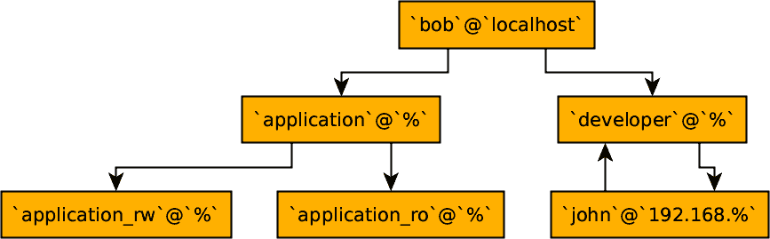

# 第八章：管理用户和权限

最简单的数据库系统只是一堆文件，其中包含一些数据，并且没有统一的访问过程。在任何关系型数据库管理系统中，我们期望有更高级别的复杂性和抽象性。例如，我们希望能够从多个客户端同时访问数据库。然而，并非所有客户端都相似，并且并非每个客户端都必需访问数据库中的所有数据。可以想象一个数据库，其中每个用户都是超级用户，但这意味着您必须为每个应用程序和数据集安装专用数据库：这是一种浪费。因此，数据库已经发展到支持多个用户和角色，并提供了一种非常精细的级别来控制特权和访问，以保证安全的共享环境。

理解用户和权限是高效处理数据库系统的重要组成部分。精心规划和管理角色可以确保系统安全且易于管理和操作。在本章中，我们将回顾大多数用户和权限管理相关的事项，从基础开始逐步介绍如角色等新功能。完成本章后，您将具备管理 MySQL 数据库访问所需的所有基础知识。

# 理解用户和权限

共享系统基础的第一个构建块是*用户*的概念。大多数现代操作系统都有基于用户的访问控制，因此您很可能已经了解其含义。MySQL 中的用户是专用对象，用于以下目的：

+   认证（确保用户可以访问 MySQL 服务器）

+   授权（确保用户可以与数据库中的对象交互）

使 MySQL 与其他数据库管理系统不同的一点是用户不*拥有*模式对象。

让我们更详细地考虑这些观点。每次访问 MySQL 服务器时，您必须指定一个用户用于认证。一旦您经过认证并确认了您的身份，您就可以访问数据库。通常，在与模式对象交互时，您将作为操作的用户与进行身份验证的用户相同，但这并非绝对必要，这就是我们将第二点分开的原因。代理用户是用于检查权限和实际在数据库内部操作的用户，当在认证过程中使用另一个用户时。这是一个相当复杂的主题，需要非默认配置，但仍然可能。

认证和授权之间有一个重要的区别需要记住。虽然您可以使用一个用户进行认证，但可以作为另一个用户进行授权，并具有或不具有各种权限。

有了这两个内容，让我们讨论最后一点。一些数据库管理系统支持对象所有权的概念。也就是说，当用户创建数据库对象（数据库或模式、表或存储过程）时，该用户自动成为新对象的所有者。所有者通常有权修改其拥有的对象，并授予其他用户对其的访问权限。这里重要的是 MySQL 在任何情况下都没有对象所有权的概念。

这种缺乏所有权概念使得更加重要的是有灵活的规则，以便用户可以创建对象，然后可能与其他用户分享对这些对象的访问。这是通过*权限*来实现的。权限可以被视为一组规则，控制用户被允许执行的操作以及可以访问的数据。重要的是要理解，默认情况下，在 MySQL 中，数据库用户根本没有任何权限。授予权限意味着允许默认情况下禁止的某些操作。

MySQL 中的用户与其他数据库中的用户也有些不同，因为用户对象包含一个网络访问控制列表（ACL）。通常，一个 MySQL 用户不仅仅用其名称表示，比如`bob`，而是附加了网络地址，例如`bob@localhost`。这个特定的示例定义了一个仅能通过回环接口或 Unix 套接字连接本地访问的用户。当我们讨论用于创建和操作现有用户的 SQL 语法时，我们稍后会详细讨论这个主题。

MySQL 将所有与用户和权限相关的信息存储在`mysql`系统数据库中的特殊表中，称为*授权表*。稍后我们将更深入地讨论这个概念，详见“授权表”。

这个简短的理论基础应该足以形成对 MySQL 用户和权限系统的基本理解。让我们来实际操作，回顾一下数据库提供的用于管理用户和权限的命令和功能。

# 根用户

每个 MySQL 安装都默认安装了一些用户。大多数情况下，你根本不需要触碰它们，但有一个用户非常频繁地被使用。有些人甚至会说它被过度使用了，但这不是我们想要在这里讨论的话题。我们要谈论的用户是无处不在且全能的`root`用户。与默认的 Unix 和 Linux 超级用户具有相同的名称，在 MySQL 中，这个用户就是那样：默认情况下可以执行任何操作的用户。

更具体地说，用户是`root@localhost`，有时被称为*初始用户*。正如你现在所知，用户名中的`localhost`部分限制了其仅能在本地连接中使用。当你安装 MySQL 时，根据具体的 MySQL 版本和操作系统，你可能可以通过仅执行`mysql`命令从操作系统的 root 账户访问`root@localhost`。在某些情况下，会为这个用户生成一个临时密码。

初始用户并不是你能创建的唯一超级用户，正如你将在“SUPER 权限”中看到的那样。虽然你可以创建一个`root@<ip>`用户，甚至是`root@%`用户，但我们强烈建议你不要这样做，因为这是一个等待被利用的安全漏洞。并非每个 MySQL 服务器都需要在除回环（即 localhost）之外的接口上监听，更不用说有一个默认名称的超级用户可用于登录。当然，你可以为所有用户设置安全密码，可能还应该为`root`设置一个，但如果可能的话，不允许远程超级用户访问可能会更安全一点。

就功能而言，`root@localhost`只是一个拥有所有授权的常规用户。你甚至可以删除它，这可能会不小心发生。当运行 MySQL 时，失去`root@localhost`用户访问权限是一个相当常见的问题。你可能设置了密码却忘记了它，或者继承了一个服务器但没有得到密码，或者可能发生了其他事情。我们在“更改 root 的密码和不安全的启动”中介绍了恢复忘记密码的`root@localhost`初始用户的过程。如果你删除了最后一个可用的超级用户，你将不得不按照相同的步骤进行操作，但是要创建一个新用户而不是更改现有用户。

# 创建和使用新用户

我们将首先介绍创建新用户的任务。让我们从一个相当简单的例子开始，逐步审视每个部分：

```
CREATE USER 
'bob'@'10.0.2.%' 
IDENTIFIED BY 'password'; 
```


创建用户的 SQL 语句


用户和主机定义


密码规范

这是一个更复杂的例子：

```
CREATE USER 
'bob'@'10.0.2.%' 
IDENTIFIED WITH mysql_native_password 
BY 'password' 
DEFAULT ROLE 'user_role' 
REQUIRE SSL 
AND CIPHER 'EDH-RSA-DES-CBC3-SHA' 
WITH MAX_USER_CONNECTIONS 10 
PASSWORD EXPIRE NEVER; 
```


创建用户的 SQL 语句


用户和主机定义


认证插件规范


认证字符串/密码


用户认证和连接后设置的默认角色


要求此用户的连接使用 SSL


要求使用特定的加密算法


限制此用户的最大连接数


覆盖全局密码过期设置

这只是冰山一角，但应该让你了解可以在用户创建过程中更改的参数。这些参数非常多。让我们稍微详细地审视该语句的特定部分：

用户和主机定义

我们在“理解用户和权限”中提到，MySQL 中的用户不仅由其名称定义，还由主机名定义。在前面的示例中，用户是`'bob'@'10.0.2.%'`，其中`*bob*`是用户名，`*10.0.2.%*`是主机名规范。实际上，它是带通配符的主机名规范。每当有人使用 TCP 连接使用用户名`*bob*`连接时，MySQL 会执行几项操作：

1.  获取连接客户端的 IP 地址。

1.  对 IP 地址执行反向 DNS 查找，以获取主机名。

1.  执行该主机名的 DNS 查找（以确保反向查找未被篡改）。

1.  检查主机名或 IP 地址与用户的主机名规范。

仅当主机名匹配时才授予访问权限。对于我们的用户`*bob*`，来自 IP 地址`10.0.2.121`的连接将被允许，而来自`10.0.3.22`的连接将被拒绝。事实上，要允许来自另一个主机名的连接，应创建一个新用户。在内部，`'bob'@'10.0.2.%'`是一个完全不同的用户，而不是`'bob'@'10.0.3.%'`。在主机名规范中还可以使用完全限定域名（FQDN），例如`'bob'@'acme.com'`，但 DNS 查找需要时间，通常会完全禁用它们以进行常见优化。

指定所有用户连接的所有可能主机名可能会很麻烦，但这是一个有用的安全功能。但是，有时数据库设置在防火墙后面，或者仅仅指定主机名是不切实际的。为了完全颠覆此系统，可以在主机规范中使用单个通配符，如`'bob'@'10.0.2%'`。`'%'`通配符也在您根本不指定主机时使用(`'bob'@'%'`)。

###### 注意

在代理连接到 MySQL 时，请注意 MySQL“看到”的传入连接的 IP 地址。例如，当使用 HAProxy 时，默认情况下所有连接将来自于运行 HAProxy 的机器的 IP 地址。在配置用户时应考虑此事实。我们在第十五章中讨论了 MySQL 的 HAProxy 配置。

您会注意到，我们在单引号(`''`)中同时包含了用户名和主机规范。这并非强制性要求，用户名和主机规范遵循与我们在“创建和使用数据库”和“别名”中概述的表名和列名以及别名相似的规则集。例如，在创建或更改用户`bob@localhost`或`bob@172.17.0.2`时，无需使用任何引号。但是，不能创建不使用引号的此用户：`'username with a space'@'172.%'`。双引号、单引号或反引号可用于包含具有特殊符号的用户名和主机名。

认证插件规范

MySQL 支持通过其认证插件系统的多种方式对用户进行认证。这些插件还为开发人员提供了一种在不更改 MySQL 本身的情况下实现新的认证方式的方法。您可以在创建阶段或之后为用户设置特定的插件。

您可能永远不需要更改用户的插件，但了解此子系统仍然是值得的。特别是，使用特殊认证插件可以实现与 MySQL 的 LDAP 认证。MySQL 企业版支持一流的 LDAP 插件，其他 MySQL 版本和变种可以使用 PAM 作为中间人。

###### 注意

*PAM*代表可插拔认证模块。这是 Unix-like 系统上的标准接口，简单来说，它允许 MySQL 通过各种方法提供认证，例如操作系统密码或 LDAP。PAM 隐藏了这些认证方法的复杂性，像 MySQL 这样的程序只需要与 PAM 本身进行接口交互。

MySQL 8.0 默认使用`caching_sha2_password`插件，与传统的`mysql_native_password`相比，提供了更优越的安全性和性能，但不兼容每个客户端库。要更改默认插件，您可以配置`default_authentication_plugin`变量，这将导致新用户使用指定的插件创建。

认证字符串/密码

一些认证插件，包括默认插件，要求您为用户设置密码。其他插件，如 PAM 插件，要求您定义从操作系统用户到 MySQL 用户的映射。在这两种情况下都将使用`auth_string`。让我们看一个使用 PAM 的示例映射：

```
mysql> `CREATE` `USER` `''``@``''` `IDENTIFIED` `WITH` `auth_pam`
    -> `AS` `'mysqld, dba=dbausr, dev=devusr'``;`
```

```
Query OK, 0 row affected (0.01 sec)
```

这里定义的映射可以按照以下方式阅读：PAM 配置文件*mysqld*将被使用（通常位于*/etc/pam.d/mysqld*）；具有`dba`组的操作系统用户将映射到 MySQL 用户`dbausr`，具有`dev`组的操作系统用户将映射到`devusr`。然而，仅仅映射是不够的，因为必须分配必要的权限。

请注意，要使此功能正常工作，需要使用 Percona PAM 插件或 MySQL 企业版。此示例创建了一个代理用户，我们在“理解用户和权限”中简要讨论过。

使用非默认认证插件是一个相对高级的主题，所以我们只在这里提到 PAM，以向您展示认证字符串并非总是密码。

###### 提示

您可以查阅有关安装[Percona 插件](https://oreil.ly/A5rbp)和 MySQL[企业版插件](https://oreil.ly/oihnX)的详细文档。

默认角色设置

角色是 MySQL 的一个相对较新的添加。您可以将角色视为权限集合。我们在“角色”中讨论它们。

SSL 配置

您可以通过向`CREATE USER`或`ALTER USER`命令传递`REQUIRE SSL`来强制特定用户的连接使用 SSL。用户的未加密连接将被禁止。此外，您可以像我们所示的示例那样指定一个特定的密码套件或一组可用于该用户的套件。理想情况下，您应该在系统级别设置可接受的密码套件，但在用户级别设置此项对于允许某些较不安全的套件进行特定连接是有用的。您不需要指定`REQUIRE SSL`来指定`REQUIRE CIPHER`，在这种情况下可以建立未加密的连接。但是，如果建立了加密连接，它将仅使用您提供的特定密码集合：

```
mysql> `CREATE` `USER` `'john'``@``'192.168.%'` `IDENTIFIED` `BY` `'P@ssw0rd#'`
    -> `REQUIRE` `CIPHER` `'EDH-RSA-DES-CBC3-SHA'``;`
```

```
Query OK, 0 row affected (0.02 sec)
```

还有一些可用的额外可配置选项，包括以下内容：

`X509`

强制客户端提供有效证书。这一点以及以下选项都意味着使用`SSL`。

`ISSUER` `*issuer*`

强制客户端提供由特定`**issuer**`指定的特定 CA 颁发的有效证书。

`SUBJECT` `*subject*`

强制客户端提供具有特定主题的有效证书。

这些选项可以组合使用，以指定非常特定的证书和加密要求：

```
mysql> `CREATE` `USER` `'john'``@``'192.168.%'`
    -> `REQUIRE` `SUBJECT` `'/C=US/ST=NC/L=Durham/` -> `O=BI Dept certificate/` -> `CN=client/emailAddress=john@nonexistent.com'`
    -> `AND` `ISSUER` `'/C=US/ST=NC/L=Durham/` -> `O=MySQL/CN=CA/emailAddress=ca@nonexistent.com'`
    -> `AND` `CIPHER` `'EDH-RSA-DES-CBC3-SHA'``;`
```

资源消耗限制

您可以定义资源消耗限制。在我们的示例中，我们通过此用户将最大并发连接数限制为 10。这些和其他资源选项默认为 0，意味着无限制。其他可能的约束条件包括`MAX_CONNECTIONS_PER_HOUR`、`MAX_QUERIES_PER_HOUR`和`MAX_UPDATES_PER_HOUR`。所有这些选项都是`WITH`规范的一部分。

让我们创建一个相当受限的用户，在每个小时内仅能运行 10 次查询，只能有一个并发连接，并且每小时最多只能连接两次：

```
mysql> `CREATE` `USER` `'john'``@``'192.168.%'`
    -> `WITH` `MAX_QUERIES_PER_HOUR` `10`
    -> `MAX_CONNECTIONS_PER_HOUR` `2`
    -> `MAX_USER_CONNECTIONS` `1``;`
```

注意`MAX_QUERIES_PER_HOUR`的数量包括`MAX_UPDATES_PER_HOUR`，并且还将限制更新。查询数量还包括 MySQL CLI 执行的所有内容，因此不建议设置一个非常低的值。

密码管理选项覆盖

对于处理存储在授权表中的密码的身份验证插件（在“授权表”中涵盖），您可以指定与密码相关的各种选项。在我们的示例中，我们正在设置一个用户，其具有`PASSWORD EXPIRE NEVER`策略，意味着其密码不会因时间而过期。您还可以创建一个用户，其密码每隔一天或每周过期一次。

MySQL 8.0 扩展了控制能力，包括跟踪失败的身份验证尝试并临时锁定帐户的能力。让我们考虑一个有严格控制的重要用户：

```
mysql> `CREATE` `USER` `'app_admin'``@``'192.168.%'`
    -> `IDENTIFY` `BY` `'...'`
    -> `WITH` `PASSWORD` `EXPIRE` `INTERVAL` `30` `DAY`
    -> `PASSWORD` `REUSE` `INTERVAL` `180` `DAY`
    -> `PASSWORD` `REQUIRE` `CURRENT`
    -> `FAILED_LOGIN_ATTEMPTS` `3`
    -> `PASSWORD_LOCK_TIME` `1``;`
```

这个用户的密码需要每 30 天更改一次，之前使用过的密码在 180 天内不能再次使用。在更改密码时，必须输入当前密码。为了安全起见，我们还只允许连续三次登录失败尝试，并且如果发生这些情况，将会封锁此用户一天。

请注意，这些是对默认系统选项的覆盖。手动设置每个个体用户是不现实的，因此我们建议您设置默认值，并仅对特定用户使用覆盖。例如，您可以使 DBA 用户的密码更频繁地过期。

还有一些其他用于用户创建的选项，我们在此不进行详述。随着 MySQL 的发展，会有更多选项可用，但我们认为迄今为止我们所涵盖的应该足够您在 MySQL 中学习的过程中使用。

由于本节不仅涉及创建新用户，还涉及使用新用户，让我们来谈谈这些用途。它们通常可以分为几类：

连接和认证

这是任何用户实体的默认和最广泛使用方式。您指定用户和密码，MySQL 将使用该用户和您的原始主机进行身份验证。然后，该对组成了授权表中定义的用户，在访问数据库对象时将用于授权。这是默认情况。您可以运行以下查询来查看当前验证的用户以及客户端提供的用户：

```
mysql> `SELECT` `CURRENT_USER``(``)``,` `USER``(``)``;`
```

```
+----------------+----------------+
| CURRENT_USER() | USER()         |
+----------------+----------------+
| root@localhost | root@localhost |
+----------------+----------------+
1 row in set (0.00 sec)
```

毫不奇怪，记录匹配。这是最常见的情况，但正如接下来您将看到的，这并不是唯一的可能性。

为存储对象提供安全性

当创建存储对象（如存储过程或视图）时，可以在该对象的`DEFINER`子句中指定任何用户。这允许您以另一个用户的身份执行对象：定义者，而不是调用者。这可以是提供某些特定操作的提升权限的有用方式，但也可能是系统中的安全漏洞。

当在对象的`DEFINER`子句中指定 MySQL 账户时，例如存储过程中，当执行存储过程或查询视图时，将使用该账户进行授权。换句话说，会话的当前用户会临时改变。正如我们提到的，这可以用来以受控方式提升权限。例如，与其授予用户从某些表中读取的权限，您可以创建一个视图，其`DEFINER`是您指定的账户，此时在查询视图时将允许访问表，但在其他情况下不允许。此外，视图本身也可以进一步限制返回的数据。对于存储过程也是如此。要与具有`DEFINER`的对象交互，调用者必须具有必要的权限。

让我们看一个例子。这是一个简单的存储过程，返回用于授权的当前用户以及已认证的用户。`DEFINER`设置为`'bob'@'localhost'`：

```
`DELIMITER` `;``;`
`CREATE` `DEFINER` `=` `'bob'``@``'localhost'` `PROCEDURE` `test_proc``(``)`
`BEGIN`
    `SELECT` `CURRENT_USER``(``)``,` `USER``(``)``;`
`END``;`
`;``;`
`DELIMITER` `;`
```

如果此过程由先前示例中的用户`john`执行，则将打印类似以下内容的输出：

```
mysql> `CALL` `test_proc``(``)``;`
```

```
+----------------+--------------------+
| CURRENT_USER() | USER()             |
+----------------+--------------------+
| bob@localhost  | john@192.168.1.174 |
+----------------+--------------------+
1 row in set (0.00 sec)
```

记住这一点非常重要。有时用户并非表面上看起来那样，并且需要注意保护您的数据库安全。

代理

某些认证方法，如 PAM 和 LDAP，不支持从认证用户到数据库用户的一对一映射。我们之前展示了如何创建一个使用 PAM 认证的用户 —— 让我们看看如果这样一个用户查询认证用户和提供用户时会看到什么：

```
mysql> `SELECT` `CURRENT_USER``(``)``,` `USER``(``)``;`
```

```
+------------------+------------------------+
| CURRENT_USER()   | USER()                 |
+------------------+------------------------+
| dbausr@localhost | localdbauser@localhost |
+------------------+------------------------+
1 row in set (0.00 sec)
```

在我们结束这一节之前，我们应该提到与`CREATE USER`语句相关的一些重要点。首先，可以使用单个命令创建多个用户账户，而不是逐个执行`CREATE USER`语句。其次，如果用户已经存在，`CREATE USER`不会失败，但会在细微的方面更改该用户。这可能是危险的。为了避免这种情况，您可以在命令中指定`IF NOT EXISTS`选项。通过这样做，您告诉 MySQL 仅在不存在此类用户时创建用户，如果存在则不执行任何操作。

到目前为止，您应该对 MySQL 用户及其使用有了很好的理解。接下来，我们将向您展示如何修改用户，但首先您需要了解内部存储的与用户相关的信息。

# 授予表

MySQL 将用户信息和权限存储为*授权表*中的记录。这些是`mysql`数据库中的特殊内部表，理论上不应该手动修改，而应在执行诸如`CREATE USER`或`GRANT`等语句时隐式修改。例如，这里是对`mysql.user`表执行`SELECT`查询的部分截断输出，其中包含用户记录，包括其密码（以哈希形式）：

```
mysql> `SELECT` `*` `FROM` `user` `WHERE` `user` `=` `'root'``\``G`
```

```
*************************** 1\. row ***************************
                    Host: localhost
                    User: root
             Select_priv: Y
             Insert_priv: Y
             Update_priv: Y
             Delete_priv: Y
...
     Create_routine_priv: Y
      Alter_routine_priv: Y
        Create_user_priv: Y
              Event_priv: Y
            Trigger_priv: Y
  Create_tablespace_priv: Y
                ssl_type:
              ssl_cipher: 0x
             x509_issuer: 0x
            x509_subject: 0x
           max_questions: 0
             max_updates: 0
         max_connections: 0
    max_user_connections: 0
                  plugin: mysql_native_password
   authentication_string: *E1206987C3E6057289D6C3208EACFC1FA0F2FA56
        password_expired: N
   password_last_changed: 2020-09-06 17:20:57
       password_lifetime: NULL
          account_locked: N
        Create_role_priv: Y
          Drop_role_priv: Y
  Password_reuse_history: NULL
     Password_reuse_time: NULL
Password_require_current: NULL
         User_attributes: NULL
1 row in set (0.00 sec)
```

您可以立即看到，许多字段直接对应于特定的`CREATE USER`或`ALTER USER`语句的具体调用。例如，您可以看到此`root`用户没有关于其密码生命周期的任何特定规则设置。您还可以看到相当多的权限，尽管我们出于简洁起见省略了一些。这些是不需要目标（如表）的权限，称为*全局*权限。稍后我们将向您展示如何查看针对性的权限。

自 MySQL 8.0 起，其他授予表包括：

`mysql.user`

用户账户、静态全局权限和其他非特权列

`mysql.global_grants`

动态全局权限

`mysql.db`

数据库级别的权限

`mysql.tables_priv`

表级权限

`mysql.columns_priv`

列级权限

`mysql.procs_priv`

存储过程和函数权限

`mysql.proxies_priv`

代理用户权限

`mysql.default_roles`

默认用户角色

`mysql.role_edges`

角色子图的边缘

`mysql.password_history`

密码更改历史

您无需记住所有这些表，更不用说它们的结构和内容，但您应记住它们的存在。在必要时，您可以轻松地在文档或数据库本身中查找必要的结构信息。

在内部，MySQL 在内存中缓存授权表，并在运行帐户管理语句并因此修改授权表时刷新此缓存表示。仅对受影响的特定用户进行缓存失效。理想情况下，您不应直接修改这些授权表，而且很少有使用情况。但是，如果不幸需要修改授权表，可以通过运行`FLUSH PRIVILEGES`命令告知 MySQL 重新读取它们。如果不这样做，意味着内存中的缓存不会更新，直到数据库重新启动，针对直接在授权表中更新的同一用户运行帐户管理语句，或出于其他目的执行`FLUSH PRIVILEGES`为止。尽管命令的名称暗示它仅影响特权，但 MySQL 将从所有表中重新读取信息并刷新其内存中的缓存。

# 用户管理命令和日志记录

事实上，我们在本章讨论的所有命令的直接后果是它们在幕后修改授权表。在某些方面，它们接近 DML 操作。它们是原子的：任何`CREATE USER`、`ALTER USER`、`GRANT`或其他此类操作要么成功，要么失败，而不会实际更改其目标。它们被记录：手动或通过相关命令对授权表进行的所有更改都记录在二进制日志中。因此，它们被复制（参见第十三章）并且还可以用于时点恢复（参见第十章）。

在源上应用这些语句可能会破坏复制，如果复制副本上不存在目标用户。因此，我们建议您保持副本与其源的一致性，不仅在数据上，还在用户和其他元数据上。当然，“元数据”仅在它存在于您的真实应用数据之外的意义上存在；用户是`mysql.user`表中的记录，设置复制时应记住这一点。

大多数情况下，复制副本是其源的完整副本。在像扇入这样的更复杂的拓扑中，可能不是这样，但即使在这种情况下，我们也建议在整个拓扑中保持用户的一致性。总体而言，这比修复损坏的副本或记住在更改用户之前是否需要禁用二进制日志更容易和更安全。

虽然我们说 `CREATE USER` 的执行类似于对 `mysql.user` 表进行 `INSERT` 操作，但 `CREATE USER` 语句本身在被记录之前并没有任何改变。这对二进制日志、慢查询日志（有一个警告）、通用查询日志和审计日志都是适用的。本章讨论的每个其他操作也是如此。慢查询日志的警告是，必须启用额外的服务器选项 `log_slow_admin_statements` 才能将管理语句记录在此处。

###### 提示

您可以在以下系统变量名称下找到我们提到的日志位置：`log_bin_basename`、`slow_query_log_file` 和 `general_log_file`。它们的值可以包括文件的完整路径或只是文件名。在后一种情况下，该文件将位于 MySQL 服务器的数据目录中。二进制日志始终具有数字后缀，例如 *binlog.000271*。本书不涵盖审计日志配置。

考虑以下示例：

```
mysql> `CREATE` `USER` `'vinicius'` `IDENTIFIED` `BY` `'...'``;`
```

```
Query OK, 0 rows affected (0.02 sec)
```

这里有一个示例，展示了相同的 `CREATE USER` 命令在通用、慢查询和二进制日志中的反映：

通用日志

```
2020-11-22T15:53:17.354270Z        29 Query
    CREATE USER 'vinicius'@'%' IDENTIFIED BY <secret>

```

慢查询日志

```
# Time: 2020-11-22T15:53:17.368010Z
# User@Host: root[root] @ localhost []  Id:    29
# Query_time: 0.013772  Lock_time: 0.000161 Rows_sent: 0  Rows_examined: 0
SET timestamp=1606060397;
CREATE USER 'vinicius'@'%' IDENTIFIED BY <secret>;

```

二进制日志

```
#201122 18:53:17 server id 1  end_log_pos 4113 CRC32 0xa12ac622
    Query   thread_id=29    exec_time=0     error_code=0    Xid = 243
SET TIMESTAMP=1606060397.354238/*!*/;
CREATE USER 'vinicius'@'%' IDENTIFIED WITH 'caching_sha2_password'
    AS '$A$005$|v>\ZKe^R...'
/*!*/;

```

如果二进制日志输出让您感到难以理解，请不要担心。它并不是为了方便人类阅读而设计的。但是，您可以看到密码的实际哈希值，正如它将出现在 `mysql.user` 中。我们将在第十章中详细讨论这个日志。

# 修改和删除用户

创建用户通常不是与之互动的终点。您可能会后来需要更改其属性，也许是要求加密连接。还有可能需要删除用户。这些操作与用户创建并没有太大不同，但您需要知道如何执行它们才能完全掌握用户管理。

## 修改用户

可以在稍后的时间修改任何在用户创建时可以设置的参数。通常可以使用 `ALTER USER` 命令实现这一点。MySQL 5.7 及之前版本还有 `RENAME USER` 和 `SET PASSWORD` 快捷方式，而 8.0 版本扩展了该列表以包括 `SET DEFAULT ROLE`（我们将在“角色”中介绍角色系统）。请注意，`ALTER USER` 可用于更改用户的所有内容，而其他命令只是运行常见维护操作的便捷方式。

###### 注意

我们称 `RENAME USER` 为快捷方式，但它在于没有“完整”的 `ALTER USER` 替代方式。正如您将看到的，运行 `RENAME USER` 命令所需的特权也不同，与用户创建时相同（我们将很快更多地讨论特权）。

我们将从常规的`ALTER USER`命令开始。在第一个例子中，我们将修改使用的认证插件。许多较旧的程序不支持 MySQL 8.0 中的新标准`caching_sha2_password`插件，并要求您在创建用户时使用较旧的`mysql_native_password`插件或在创建后修改它们以使用该插件。我们可以通过查询授权表中的一张表（有关这些信息，请参见“授权表”）来检查当前正在使用的插件：

```
mysql> `SELECT` `plugin` `FROM` `mysql``.``user` `WHERE`
    -> `user` `=` `'bob'` `AND` `host` `=` `'localhost'``;`
```

```
+-----------------------+
| plugin                |
+-----------------------+
| caching_sha2_password |
+-----------------------+
1 row in set (0.00 sec)
```

现在我们可以为此用户更改插件并确保更改反映出来：

```
mysql> `ALTER` `USER` `'bob'``@``'localhost'` `IDENTIFIED` `WITH` `mysql_native_password``;`
```

```
Query OK, 0 rows affected (0.01 sec)
```

```
mysql> `SELECT` `plugin` `FROM` `mysql``.``user` `WHERE`
    -> `user` `=` `'bob'` `AND` `host` `=` `'localhost'``;`
```

```
+-----------------------+
| plugin                |
+-----------------------+
| mysql_native_password |
+-----------------------+
1 row in set (0.00 sec)
```

由于更改是通过`ALTER`命令进行的，所以无需运行`FLUSH PRIVILEGES`。一旦该命令成功执行，每次新的认证尝试将使用新的插件。你可以直接修改用户记录来进行此更改，但我们仍然建议不要这样做。

`ALTER USER`可以修改的属性非常多，或者至少在“创建和使用新用户”中有所解释。然而，有一些经常需要的操作你应该更加了解：

更改用户的密码

这可能是对用户进行的最频繁的操作之一。更改用户的密码可以由具有必要特权的另一个用户执行，或者由授权为该用户的任何人使用以下命令执行：

```
mysql> `ALTER` `USER` `'bob'``@``'localhost'` `IDENTIFIED` `by` `'new password'``;`
```

```
Query OK, 0 rows affected (0.01 sec)
```

此更改立即生效，因此下次该用户进行认证时，他们将需要使用更新后的密码。这个命令也有一个`SET PASSWORD`的快捷方式。可以由已认证用户执行，无需任何目标规范，如下所示：

```
mysql> `SET` `PASSWORD` `=` `'new password'``;`
```

```
Query OK, 0 rows affected (0.01 sec)
```

或者可以由另一个具有目标规范的用户执行。

```
mysql> `SET` `PASSWORD` `FOR` `'bob'``@``'localhost'` `=` `'new password'``;`
```

```
Query OK, 0 rows affected (0.01 sec)
```

锁定和解锁用户

如果您需要暂时（或永久）阻止对特定用户的访问，可以使用`ALTER USER`的`ACCOUNT LOCK`选项来执行。在这种情况下，该用户只能在认证时被阻止。虽然没有人能够以被阻止的用户连接到 MySQL，但它仍然可以作为代理使用，并在`DEFINER`子句中使用。这使得此类用户稍微更安全且更易于管理。`ACCOUNT LOCK`也可以用来，例如，阻止作为特定用户连接的应用程序生成过多负载。

我们可以使用以下命令阻止`bob`进行认证：

```
mysql> `ALTER` `USER` `'bob'``@``'localhost'` `ACCOUNT` `LOCK``;`
```

```
Query OK, 0 rows affected (0.00 sec)
```

只有新连接会受到影响。MySQL 在这种情况下产生的消息非常清楚：

```
$ mysql -ubob -p
```

```
Enter password:
ERROR 3118 (HY000): Access denied for user 'bob'@'localhost'.
Account is locked.
```

与`ACCOUNT LOCK`相对应的是`ACCOUNT UNLOCK`。`ALTER USER`的此选项确切地执行其描述的功能。让我们再次允许`bob`访问：

```
mysql> `ALTER` `USER` `'bob'``@``'localhost'` `ACCOUNT` `UNLOCK``;`
```

```
Query OK, 0 rows affected (0.01 sec)
```

现在连接尝试将成功：

```
$ mysql -ubob -p
```

```
Enter password:
```

```
mysql>
```

让用户密码过期

不要完全阻止用户的访问或更改其密码，您可能希望强制其更改密码。在 MySQL 中，可以通过`ALTER USER`命令的`PASSWORD EXPIRE`选项实现这一点。执行此命令后，用户仍然可以使用先前的密码连接到服务器。然而，一旦他们从新连接运行查询——也就是说，一旦检查他们的权限——用户将会遇到错误，并被强制更改密码。现有的连接不受影响。

让我们看看这对用户是什么样子。首先，实际修改：

```
mysql> `ALTER` `USER` `'bob'``@``'localhost'` `PASSWORD` `EXPIRE``;`
```

```
Query OK, 0 rows affected (0.01 sec)
```

现在，用户得到了什么。注意成功的身份验证：

```
$ mysql -ubob -p
```

```
Enter password:
```

```
mysql> `SELECT` `id``,` `data` `FROM` `bobs_db``.``bobs_private_table``;`
```

```
ERROR 1820 (HY000): You must reset your password using ALTER USER
statement before executing this statement.
```

尽管错误声明你必须运行`ALTER USER`，但现在你知道可以改用`SET PASSWORD`。谁更改密码并不重要：问题用户还是另一个用户。`PASSWORD EXPIRE`选项只是强制密码更改。如果另一个用户更改了密码，那么在密码过期后仍使用旧密码进行身份验证的会话需要重新打开。正如我们早些时候看到的，经过验证的用户可以在没有目标规范的情况下更改密码，并且他们将能够继续正常进行会话（但新连接将需要使用新密码进行身份验证）：

```
mysql> `SET` `PASSWORD` `=` `'new password'``;`
```

```
Query OK, 0 rows affected (0.06 sec)
```

```
mysql> `SELECT` `id``,` `data` `FROM` `bobs_db``.``bobs_private_table``;`
```

```
Empty set (0.00 sec)
```

在这种情况下，你还应该注意，如果没有密码重用和历史控制措施，用户可以将密码重置为原始密码。

用户重命名

更改用户名是一个相对罕见的操作，但有时是必要的。这个操作有一个特殊的命令：`RENAME USER`。它需要`CREATE USER`权限，或者在`mysql`数据库或授权表上的`UPDATE`权限。对于这个命令，没有`ALTER USER`的替代方案。

你可以同时更改用户名的“名称”部分和“主机”部分。因为正如你现在所知，这个“主机”部分充当了防火墙的角色，在更改时要小心，可能会导致服务中断（实际上，“名称”部分也是如此）。让我们将我们的`bob`用户重命名为更正式的名称：

```
mysql> `RENAME` `USER` `'bob'``@``'localhost'` `TO` `'robert'``@``'172.%'``;`
```

```
Query OK, 0 rows affected, 1 warning (0.01 sec)
```

当用户名更改时，MySQL 会自动扫描其内部表，查看该用户是否在视图或存储对象的`DEFINER`子句中命名。每当出现这种情况时，会产生一个警告。由于我们在重命名`bob`时收到了警告，让我们来看看：

```
mysql> `SHOW` `WARNINGS``\``G`
```

```
*************************** 1\. row ***************************
  Level: Warning
   Code: 4005
Message: User 'bob'@'localhost' is referenced as a definer
  account in a stored routine.
1 row in set (0.00 sec)
```

如果不解决这个问题，可能会导致孤立的对象，在访问或执行时出错。我们将在下一节详细讨论这个问题。

## 删除用户

数据库用户生命周期的最后阶段是其结束。像任何数据库对象一样，用户可以被删除。在 MySQL 中，使用 `DROP USER` 命令来实现这一点。这是本章讨论的最简单的命令之一，可能也是整本书中最简单的命令。`DROP USER` 接受一个用户或者可选地一组用户作为参数，并且有一个修饰符：`IF NOT EXISTS`。成功执行该命令将从授权表中不可撤销地删除与用户相关的信息（我们稍后会讨论一个警告），从而防止进一步的登录。

当你删除一个仍然有一个或多个连接到数据库的用户时，即使删除成功，关联的记录只有在最后一个连接结束时才会被移除。下一次尝试使用该用户连接将导致`ERROR 1045 (28000): Access denied`错误信息。

`IF NOT EXISTS` 修饰符与 `CREATE USER` 的工作方式类似：如果目标用户不存在于 `DROP USER` 中，不会返回错误。这在无人值守脚本中非常有用。如果未指定用户名的主机部分，默认使用通配符 `%`。

在其最基本的形式中，`DROP USER` 命令如下所示：

```
mysql> `DROP` `USER` `'jeff'``@``'localhost'``;`
```

```
Query OK, 0 rows affected (0.02 sec)
```

再次执行相同的命令将导致错误：

```
mysql> `DROP` `USER` `'jeff'``@``'localhost'``;`
```

```
ERROR 1396 (HY000): Operation DROP USER failed for 'jeff'@'localhost'
```

如果你想构建一个不会失败的幂等命令，那么使用以下结构：

```
mysql> `DROP` `USER` `IF` `EXISTS` `'jeff'``@``'localhost'``;`
```

```
Query OK, 0 rows affected, 1 warning (0.01 sec)
```

```
mysql> `SHOW` `WARNINGS``;`
```

```
+-------+------+-----------------------------------------------------+
| Level | Code | Message                                             |
+-------+------+-----------------------------------------------------+
| Note  | 3162 | Authorization ID 'jeff'@'localhost' does not exist. |
+-------+------+-----------------------------------------------------+
1 row in set (0.01 sec)
```

同样地，如果你没有指定用户名的主机部分，MySQL 将假定默认为 `%`。也可以一次性删除多个用户：

```
mysql> `DROP` `USER` `'jeff'``,` `'bob'``@``'192.168.%'``;`
```

```
Query OK, 0 rows affected (0.01 sec)
```

在 MySQL 中，由于用户不拥有对象，因此可以相对容易地删除它们而无需做太多准备。然而，正如我们已经讨论过的，用户可以担任额外的角色。如果删除的用户用作代理用户或是某个对象的 `DEFINER` 子句的一部分，则删除它可能会创建一个孤立的记录。每当您删除的用户属于这种关系时，MySQL 会发出警告。请注意，`DROP USER` 命令仍将成功执行，因此您需要解决由此产生的不一致性并修复任何孤立的记录：

```
mysql> `DROP` `USER` `'bob'``@``'localhost'``;`
```

```
Query OK, 0 rows affected, 1 warning (0.01 sec)
```

```
mysql> `SHOW` `WARNINGS``\``G`
```

```
*************************** 1\. row ***************************
  Level: Warning
   Code: 4005
Message: User 'bob'@'localhost' is referenced as a definer
  account in a stored routine.
1 row in set (0.00 sec)
```

我们建议在实际删除用户之前检查这一点。如果你未能注意到警告并采取行动，这些对象将会变成孤立的。孤立的对象在使用时会产生错误：

```
mysql> `CALL` `test``.``test_proc``(``)``;`
```

```
ERROR 1449 (HY000): The user specified as a definer ('bob'@'localhost')
  does not exist
```

对于处于代理关系的用户，不会产生警告。然而，后续尝试使用代理用户将导致错误。由于代理用户用于身份验证，结果将是无法使用依赖于已删除用户的用户登录 MySQL。这可能比暂时失去调用存储过程或查询视图的能力更有影响力，但仍然不会发出警告。如果你使用依赖于代理用户的可插拔认证，请记住这一点。

如果您发现自己处于这样的情况，即删除了用户却意外地收到了警告，您可以轻松地重新创建用户以避免错误。注意下面的`CREATE USER`语句产生了现在熟悉的警告：

```
mysql> `CREATE` `USER` `'bob'``@``'localhost'` `IDENTIFIED` `BY` `'new password'``;`
```

```
Query OK, 0 rows affected, 1 warning (0.01 sec)
```

```
mysql> `SHOW` `WARNINGS``\``G`
```

```
*************************** 1\. row ***************************
  Level: Warning
   Code: 4005
Message: User 'bob'@'localhost' is referenced as a definer
  account in a stored routine.
1 row in set (0.00 sec)
```

然而，问题在于，如果您不知道或记得帐户的初始权限，新帐户可能会成为安全问题。

要识别孤立的记录，您需要手动查看 MySQL 的目录表。具体来说，您需要查看以下表的`DEFINER`列：

```
mysql> `SELECT` `table_schema``,` `table_name` `FROM` `information_schema``.``columns`
    -> `WHERE` `column_name` `=` `'DEFINER'``;`
```

```
+--------------------+------------+
| TABLE_SCHEMA       | TABLE_NAME |
+--------------------+------------+
| information_schema | EVENTS     |
| information_schema | ROUTINES   |
| information_schema | TRIGGERS   |
| information_schema | VIEWS      |
+--------------------+------------+
```

现在您知道了这一点，您可以轻松构建一个查询，以检查要删除或已经删除的用户是否在任何`DEFINER`子句中指定：

```
`SELECT` `EVENT_SCHEMA` `AS` `obj_schema`
    `,` `EVENT_NAME` `obj_name`
    `,` `'EVENT'` `AS` `obj_type`
`FROM` `INFORMATION_SCHEMA``.``EVENTS`
`WHERE` `DEFINER` `=` `'bob@localhost'`
`UNION`
`SELECT` `ROUTINE_SCHEMA` `AS` `obj_schema`
    `,` `ROUTINE_NAME` `AS` `obj_name`
    `,` `ROUTINE_TYPE` `AS` `obj_type`
`FROM` `INFORMATION_SCHEMA``.``ROUTINES`
`WHERE` `DEFINER` `=` `'bob@localhost'`
`UNION`
`SELECT` `TRIGGER_SCHEMA` `AS` `obj_schema`
    `,` `TRIGGER_NAME` `AS` `obj_name`
    `,` `'TRIGGER'` `AS` `obj_type`
`FROM` `INFORMATION_SCHEMA``.``TRIGGERS`
`WHERE` `DEFINER` `=` `'bob@localhost'`
`UNION`
`SELECT` `TABLE_SCHEMA` `AS` `obj_scmea`
    `,` `TABLE_NAME` `AS` `obj_name`
    `,` `'VIEW'` `AS` `obj_type`
`FROM` `INFORMATION_SCHEMA``.``VIEWS`
`WHERE` `DEFINER` `=` `'bob@localhost'``;`
```

这个查询看起来可能令人生畏，但是到目前为止，您应该已经看到了在“The Union”中使用的`UNION`，而该查询只是四个简单查询的联合。每个单独的查询都查找具有`DEFINER`值为`bob@localhost`的对象之一，分别是`EVENTS`、`ROUTINES`、`TRIGGERS`和`VIEWS`表中的一个。

在我们的示例中，查询为`bob@localhost`返回了单个记录：

```
+------------+-----------+-----------+
| obj_schema | obj_name  | obj_type  |
+------------+-----------+-----------+
| test       | test_proc | PROCEDURE |
+------------+-----------+-----------+
```

检查是否为该用户授予了代理权限同样很容易：

```
mysql> `SELECT` `user``,` `host` `FROM` `mysql``.``proxies_priv`
    -> `WHERE` `proxied_user` `=` `'bob'`
    -> `AND` `proxied_host` `=` `'localhost'``;`
```

```
+------+------+
| user | host |
+------+------+
| jeff | %    |
+------+------+
```

我们建议您在删除特定用户之前，始终检查可能存在的孤立对象和代理权限。数据库中留下的这些空白不仅会导致明显的问题（错误），而且实际上是安全风险。

# 权限

当用户连接到 MySQL 服务器时，将使用用户名和主机信息执行身份验证，如前所述。但是，在执行任何命令之前不会检查用户执行不同操作的权限。MySQL 根据连接用户的身份和其执行的操作授予权限。正如本章开头讨论的那样，权限是在各种对象上执行操作的权限集。默认情况下，用户没有任何权限，因此在执行`CREATE USER`后没有分配权限。

有很多特权可以授予用户，并且之后可以撤销。例如，您可以允许用户从表中读取或修改数据。您可以授予创建表和数据库的权限，以及创建存储过程的权限。清单非常广泛。有趣的是，你无法在任何地方找到连接权限：假设用户名的主机部分匹配，不可能阻止用户连接到 MySQL。这是前一段概述的直接结果：权限仅在执行操作时进行检查，因此它们的应用只有在用户通过身份验证后才会生效。

要获取您的 MySQL 安装支持和提供的所有权限列表，我们始终建议查阅手册。但是，我们将在此介绍少数广泛的权限类别。我们还将讨论权限级别，因为相同的权限可以在多个级别上允许。实际上，这是我们将要开始的内容。MySQL 中有四个权限级别：

全局权限

这些权限允许*被授予者*（被授予权限的用户，我们在 “权限管理命令” 中介绍 `GRANT` 命令）在每个数据库中的每个对象上操作，或者在整个集群上操作。后者适用于通常被视为管理性的命令。例如，您可以允许用户关闭集群。

此类别中的权限存储在 `mysql.user` 和 `mysql.global_grants` 表中。第一个表存储传统的静态权限，第二个表存储动态权限。后面的章节将详细解释其区别。MySQL 8.0 之前的版本将所有全局权限存储在 `mysql.user` 中。

数据库权限

在数据库级别授予的权限将允许用户在该数据库中操作对象。由于在这个级别下，没有必要将 `SHUTDOWN` 权限下降到全局级别，因此在此级别的权限列表较窄。这些权限的记录存储在 `mysql.db` 表中，包括在目标数据库中运行 DDL 和 DML 查询的能力。

对象权限

数据库级别权限的逻辑延伸，这些权限针对特定对象。分别在 `mysql.tables_priv`、`mysql.procs_priv` 和 `mysql.proxies_priv` 中跟踪，分别涵盖表和视图、所有类型的存储过程以及代理用户权限。代理权限是特殊的，但该类别中的其他权限再次是常规的 DDL 和 DML 权限。

列权限

存储在 `mysql.columns_priv` 中，这些是一组有趣的权限。您可以按列在特定表中分离权限。例如，报告用户可能不需要读取特定表的 `password` 列。这是一个强大的工具，但是列权限可能难以管理和维护。

完整的特权列表实际上非常长。建议您始终查阅 MySQL 文档，以获取特定版本的完整细节。您应该记住，用户可以执行的任何操作都将分配专用特权或由控制更广泛行为范围的特权所覆盖。一般来说，数据库和对象级别的特权将有一个您可以授予的专用特权名称（`UPDATE`、`SELECT`等），而全局特权则通常会广泛地分组在一起，允许一次执行多个操作。例如，`GROUP_REPLICATION_ADMIN`特权一次允许五种不同的操作。全局特权通常也会在系统级别（`.`对象）上授予。

您可以通过运行`SHOW PRIVILEGES`命令随时访问您的 MySQL 实例中可用的特权列表：

```
mysql> `SHOW` `PRIVILEGES``;`
```

```
+----------------------------+----------------------+--------------------+
| Privilege                  | Context              | Comment            |
+----------------------------+----------------------+--------------------+
| Alter                      | Tables               | To alter the table |
| Alter routine              | Functions,Procedures | ...                |
| ...                                                                    |
| REPLICATION_SLAVE_ADMIN    | Server Admin         |                    |
| AUDIT_ADMIN                | Server Admin         |                    |
+----------------------------+----------------------+--------------------+
58 rows in set (0.00 sec)
```

## 静态特权与动态特权

在我们继续查看在 MySQL 中管理特权所用到的命令之前，我们必须停下来谈谈一个重要的区别。从版本 8.0 开始，MySQL 中有两种类型的特权：静态和动态。*静态*特权内置于服务器中，每个安装都可以使用和利用。*动态*特权则是“不稳定”的：它们不能保证始终存在。

什么是这些动态特权？它们是在运行时在服务器内注册的特权。只有注册的特权才能被授予，因此某些特权可能永远不会被注册，也不会被授予。所有这些都是说，现在可以通过插件和组件扩展特权的一种高级方式。然而，目前在常规社区服务器安装中，默认情况下注册的大多数动态特权都是可用的。

MySQL 8.0 提供的动态特权的重要作用在于，它们旨在减少以前滥用的`SUPER`特权的必要性（我们将在下一节讨论此特权）。动态特权的另一个区别在于，它们通常控制用户可以执行的一组活动。例如，与直接对表进行`SELECT`特权不同，后者仅允许查询数据，`CONNECTION_ADMIN`特权允许执行一整套操作。在这个特定示例中，包括终止其他账户的连接、在只读服务器中更新数据，在达到连接限制时通过额外连接连接，等等。您可以轻松地辨认出这些差异。

## **超级特权**

这一节不长，但很重要。我们在“root 用户”中提到，每个 MySQL 安装默认创建一个超级用户：`root@localhost`。有时，您可能希望为另一个用户（例如 DBA 使用的用户）提供相同的功能。方便的内置方法是使用特殊的`SUPER`特权。

`SUPER`基本上是一个通用权限，使其被分配的用户成为超级用户。与任何权限一样，可以通过`GRANT`语句分配它，我们将在以下部分进行回顾。

然而，`SUPER`权限存在两个巨大的问题。首先，在 MySQL 8.0 开始，它已经被弃用，并且将在未来的 MySQL 版本中删除。其次，它是一个安全和操作上的噩梦。第一点很明显，现在让我们谈谈第二点，以及我们所拥有的替代方案。

使用`SUPER`权限会带来与使用默认的`root@localhost`用户相同的风险和问题。与仔细检查所需权限的范围不同，我们正在使用一个全能工具解决所有问题。`SUPER`的主要问题是其全面的范围。当您创建超级用户时，您正在创建一个责任：必须对用户进行限制，并在理想情况下进行审计，以及作为该用户进行认证的操作员和程序在其行动中必须极其精确和小心。伴随强大的权力而来的是巨大的责任，包括完全关闭 MySQL 实例的能力。想象一下误执行该操作的后果。

在 MySQL 8.0 之前的版本中，避免使用`SUPER`权限是不可行的，因为某些权限没有提供替代方法。从 8.0 版本开始，MySQL 提供了一整套动态权限，旨在消除单一通用权限的需求。如果可能的话，您应该尽量避免使用`SUPER`权限。

以控制组复制为例。在 MySQL 5.7 中，您需要向用户授予`SUPER`权限。然而，从 8.0 版本开始，您可以改为授予特殊的`GROUP_REPLICATION_ADMIN`权限，该权限仅允许用户执行与组复制相关的非常少量的操作。

有时，您仍然需要一个完整的 DBA 用户，可以执行任何操作。与其授予`SUPER`权限，不如查看`root@localhost`的权限并复制它们。我们会在“检查权限”中展示如何操作。更进一步，您可以跳过授予一些权限，比如`INNODB_REDO_LOG_ENABLE`权限，该权限授权用户基本上启用了一个不安全的崩溃模式。最安全的做法是根本不授予该权限，并且在绝对必要时可以自行授予。

## 权限管理命令

现在您已经了解了一些关于权限的信息，我们可以继续介绍基本命令，允许您控制它们。不过，请注意，您不能`ALTER`权限本身，因此在此处控制权限意味着向用户授予和移除权限。这些操作通过`GRANT`和`REVOKE`语句实现。

### GRANT

`GRANT` 语句用于授予用户（或角色）在通常或特定对象上执行活动的权限。同一语句也可以用于将角色分配给用户，但您不能同时修改权限和分配角色。为了能够授予权限（特权），您需要自己分配该特权，并拥有特殊的 `GRANT OPTION` 特权（稍后我们将进行讨论）。具有 `SUPER`（或更新的 `CONNECTION_ADMIN`）特权的用户可以授予任何内容，并且与授予表相关的特殊条件，我们稍后会讨论。

现在，让我们看一下 `GRANT` 语句的基本结构：

```
mysql> `GRANT` `SELECT` `ON` `app_db``.``*` `TO` `'john'``@``'192.168.%'``;`
```

```
Query OK, 0 row affected (0.01 sec)
```

该语句一旦执行，告诉 MySQL 用户 `'john'@'192.168.%'` 被允许在 `app_db` 数据库的任何表上执行只读查询 (`SELECT`)。请注意，我们在对象规范中使用了通配符。我们也可以通过为数据库指定通配符来允许特定用户访问每个数据库的每个表：

```
mysql> `GRANT` `SELECT` `ON` `*``.``*` `TO` `'john'``;`
```

```
Query OK, 0 row affected (0.01 sec)
```

前面的调用明显缺少用户 `'john'` 的主机规范。这个快捷方式相当于 `'john'@'%'`；因此，它不是我们之前使用的 `'john'@'192.168.%'` 用户。说到通配符和用户，不可能为用户的用户名部分指定通配符。相反，您可以像这样一次指定多个用户或角色：

```
mysql> `GRANT` `SELECT` `ON` `app_db``.``*` `TO` `'john'``@``'192.168.%'``,`
    -> `'kate'``@``'192.168.%'``;`
```

```
Query OK, 0 row affected (0.06 sec)
```

在前一节中，我们警告您不要授予太多权限，但是请记住有一个 `ALL` 快捷方式，允许您在一个对象或一组对象上授予所有可能的权限。当您为“owner”用户（例如，读/写应用程序用户）定义权限时，这可能会很方便：

```
mysql> `GRANT` `ALL` `ON` `app_db``.``*` `TO` `'app_db_user'``;`
```

```
Query OK, 0 row affected (0.06 sec)
```

您不能链式对象规范，因此除非可以使用通配符表达该语句，否则无法同时对两个表授予 `SELECT` 权限。正如您将在下一节中看到的，您可以结合通配符授权和特定撤销以获取额外的灵活性。

`GRANT` 命令的一个有趣特性是它不会检查您允许的对象是否存在。也就是说，通配符不会被扩展，而是永远保持为通配符。无论 `app_db` 数据库中添加了多少新表，`john` 和 `kate` 都能够对它们发出 `SELECT` 语句。在 MySQL 8.0 开始，先前版本的 MySQL 也会为授予权限的用户创建一个用户，如果在 `mysql.user` 表中找不到该用户，但该行为已经弃用。

如我们在 “授权表” 中深入讨论的那样，`GRANT` 语句会更新授权表。从更新授权表的事实可以得出一个结论，即如果用户对这些表有 `UPDATE` 权限，那么该用户可以为任何帐户授予任何权限。在 `mysql` 数据库的对象上赋予权限时要格外小心：在这里为用户授予任何权限的好处甚微。还要注意，当启用 `read_only` 系统变量时，任何授权都需要超级用户权限 (`SUPER` 或 `CONNECTION_ADMIN`)。

在继续之前，我们还想对 `GRANT` 提出几点建议。在本节的介绍中，我们提到了列权限。这组权限控制用户是否可以读取和更新表的特定列中的数据。与所有其他权限一样，它们可以使用 `GRANT` 命令授权：

```
mysql> `GRANT` `SELECT``(``id``)``,` `INSERT``(``id``,` `data``)`
    -> `ON` `bobs_db``.``bobs_private_table` `TO` `'kate'``@``'192.168.%'``;`
```

```
Query OK, 0 rows affected (0.01 sec)
```

用户 `kate` 现在可以执行语句 `SELECT id` `FROM` `bobs_db.bobs_private_table`，但不能执行 `SELECT *` 或 `SELECT data`。

最后，您可以通过运行 `GRANT ALL PRIVILEGES` 而不是逐个指定每个权限来授予特定对象或全局上的所有静态权限。`ALL PRIVILEGES` 只是一种简写，不像 `SUPER` 那样本身不是一种特权。

### 撤销

`REVOKE` 语句是 `GRANT` 语句的反义词：您可以使用它来撤销使用 `GRANT` 分配的权限和角色。除非另有规定，`GRANT` 的每个属性都适用于 `REVOKE`。例如，要撤销权限，您需要拥有 `GRANT OPTION` 权限以及要撤销的特定权限。

从 MySQL 版本 8.0.16 开始，可以撤销对全局授权用户的特定模式的权限。这使得可以轻松限制对某些数据库的访问，同时允许访问所有其他数据库，包括新创建的数据库。例如，考虑一个数据库系统，其中有一个受限模式。您需要为您的 BI 应用程序创建一个用户。您可以通过运行以下常规命令来开始：

```
mysql> `GRANT` `SELECT` `ON` `*``.``*` `TO` `'bi_app_user'``;`
```

```
Query OK, 0 rows affected (0.03 sec)
```

但是，此用户必须被禁止查询受限数据库中的任何数据。这可以通过部分撤销非常轻松地设置：

```
mysql> `REVOKE` `SELECT` `ON` `restricted_database``.``*` `FROM` `'bi_app_user'``;`
```

```
Query OK, 0 rows affected (0.03 sec)
```

在版本 8.0.16 之前，要实现这一点，您需要明确运行 `GRANT SELECT` 以允许每个允许的模式。

正如您可以授予所有权限一样，还存在一种特殊的 `REVOKE` 调用，允许从特定用户中删除所有权限。请记住，您需要拥有您正在撤销的所有权限，因此此选项可能仅由管理员用户使用。以下语句将从用户中剥夺其权限，包括分配任何权限的能力：

```
mysql> `REVOKE` `ALL` `PRIVILEGES``,` `GRANT` `OPTION` `FROM` `'john'``@``'192.168.%'``;`
```

```
Query OK, 0 rows affected (0.03 sec)
```

`REVOKE` 语句在任何情况下都不会删除用户本身。您可以使用前面在本章中描述的 `DROP USER` 语句来执行此操作。

## 检查权限

管理权限的一个重要部分是审查它们，但是要记住授予每个用户的每个权限是不可能的。您可以查询授予权限表以查看用户拥有的权限，但这并不总是方便。 （但这仍然是一种选择，并且可以成为查找例如在某个表上具有写权限的每个用户的良好方法。）查看授予特定用户的权限的更直接选项是使用内置的`SHOW GRANTS`命令。 让我们来看看它：

```
mysql> `SHOW` `GRANTS` `FOR` `'john'``@``'192.168.%'``;`
```

```
+--------------------------------------------------+
| Grants for john@192.168.%                        |
+--------------------------------------------------+
| GRANT UPDATE ON *.* TO `john`@`192.168.%`        |
| GRANT SELECT ON `sakila`.* TO `john`@`192.168.%` |
+--------------------------------------------------+
2 rows in set (0.00 sec)
```

一般情况下，您可以在此输出中看到每个权限，但也有一个特殊情况。 当用户对特定对象授予每个静态权限时，MySQL 将输出`ALL PRIVILEGES`而不是列出每个权限。 这不是特殊的权限本身，而是每个可能权限的简写。 内部，`ALL PRIVILEGES`只是将相应授权表中的每个权限设置为`Y`：

```
mysql> `SHOW` `GRANTS` `FOR` `'bob'``@``'localhost'``;`
```

```
+----------------------------------------------------------+
| Grants for bob@localhost                                 |
+----------------------------------------------------------+
...
| GRANT ALL PRIVILEGES ON `bobs_db`.* TO `bob`@`localhost` |
...
```

使用`SHOW GRANTS`命令，您也可以查看授予角色的权限，但我们将在“角色”中详细讨论此问题。要查看当前已验证和授权用户的权限，可以使用以下任一语句，这些语句是同义的：

```
`SHOW` `GRANTS``;`
`SHOW` `GRANTS` `FOR` `CURRENT_USER``;`
`SHOW` `GRANTS` `FOR` `CURRENT_USER``(``)``;`
```

每当您不记得特定权限的含义时，您可以查阅文档或运行`SHOW PRIVILEGES`命令，该命令将列出当前可用的每个权限。 这涵盖了静态对象权限和动态服务器权限。

有时您可能需要审查与所有帐户相关的权限或将这些权限转移到另一个系统。 您拥有的一个选项是使用 MySQL Server 为所有支持的平台提供的`mysqldump`命令。 我们将在第十章中详细审查该命令。 简而言之，您需要转储所有授予权限表，否则您可能会错过一些权限。 最安全的方法是转储`mysql`数据库中的所有数据：

```
$ mysqldump -uroot -p mysql
```

```
Enter password:
```

输出将包括所有表定义以及大量的`INSERT`语句。 此输出可以重定向到文件，然后用于种子新数据库。 我们在第十章中详细讨论这个问题。 如果您的服务器版本不匹配或目标服务器已经存储了一些用户和权限，则最好避免删除现有对象。 在`mysqldump`调用中添加`--no-create-info`选项，只接收`INSERT`语句。

通过使用`mysqldump`，您可以获得一个可移植的用户和权限列表，但它并不是易于阅读的。 这里是输出中一些行的示例：

```
--
-- Dumping data for table `tables_priv`
--

LOCK TABLES `tables_priv` WRITE;
/*!40000 ALTER TABLE `tables_priv` DISABLE KEYS */;
INSERT INTO `tables_priv` VALUES ('172.%','sakila','robert'...
'Select,Insert,Update,Delete,Create,Drop,Grant,References,...
('localhost','sys','mysql.sys','sys_config','root@localhost'
    '2020-07-13 07:14:57','Select','');
/*!40000 ALTER TABLE `tables_priv` ENABLE KEYS */;
UNLOCK TABLES;
```

另一个审查权限的选项是在授权表上编写自定义查询，如前所述。我们不会给出任何指导方针，因为没有一种大小适合所有的解决方案。

另一种方式是通过为数据库中的每个用户运行`SHOW GRANTS`。结合`SHOW CREATE USER`语句，您可以生成特权列表，这些特权也可以用于在另一个数据库中重新创建用户及其特权：

```
mysql> `SELECT` `CONCAT``(```"显示授予`"```,` `user``,` ``"`@`"```,` `host``,`

    -> ``"`; 显示创建用户 `"```,` `user``,` ``"`@`"```,` `host``,` ``"`;"```)` `grants`
    -> `FROM` `mysql``.``user` `WHERE` `user` `=` `"bob"``;`
```

```
+----------------------------------------------------------------+
| grants                                                         |
+----------------------------------------------------------------+
| SHOW GRANTS FOR bob@%; SHOW CREATE USER bob@%;                 |
| SHOW GRANTS FOR bob@localhost; SHOW CREATE USER bob@localhost; |
+----------------------------------------------------------------+
2 rows in set (0.00 sec)
```

正如您可以想象的那样，自动化这个过程的想法并不新鲜。事实上，在 Percona Toolkit 中有一个工具——`pt-show-grants`——正是如此，而且更多。不幸的是，这个工具只能在 Linux 上正式使用，并且可能在其他平台上根本无法工作：

```
$ pt-show-grants
```

```
-- Grants dumped by pt-show-grants
-- Dumped from server Localhost via Unix socket,
    MySQL 8.0.22 at 2020-12-12 14:32:33
-- Roles
CREATE ROLE IF NOT EXISTS `application_ro`;
-- End of roles listing
...
-- Grants for 'robert'@'172.%'
CREATE USER IF NOT EXISTS 'robert'@'172.%';
ALTER USER 'robert'@'172.%' IDENTIFIED WITH 'mysql_native_password'
AS '*E1206987C3E6057289D6C3208EACFC1FA0F2FA56' REQUIRE NONE
PASSWORD EXPIRE DEFAULT ACCOUNT UNLOCK PASSWORD HISTORY DEFAULT
PASSWORD REUSE INTERVAL DEFAULT PASSWORD REQUIRE CURRENT DEFAULT;
GRANT ALL PRIVILEGES ON `bobs_db`.* TO `robert`@`172.%`;
GRANT ALL PRIVILEGES ON `sakila`.`actor` TO `robert`@`172.%` WITH GRANT OPTION;
GRANT SELECT ON `sakila`.* TO `robert`@`172.%` WITH GRANT OPTION;
GRANT SELECT ON `test`.* TO `robert`@`172.%` WITH GRANT OPTION;
GRANT USAGE ON *.* TO `robert`@`172.%`;
...
```

## GRANT OPTION 特权

正如本章开头讨论的那样，MySQL 没有对象所有权的概念。因此，与其他一些系统不同，某个用户创建表并不意味着该用户自动可以允许另一个用户对该表执行任何操作。为了让这个过程稍微清晰一些，让我们来看一个例子。

假设用户`bob`有权限在名为`bobs_db`的数据库中创建表格：

```
mysql> `CREATE` `TABLE` `bobs_db``.``bobs_private_table`
    -> `(``id` `SERIAL` `PRIMARY` `KEY``,` `data` `TEXT``)``;`
```

```
Query OK, 0 rows affected (0.04 sec)
```

一个使用`bob`用户的操作员希望允许`john`用户读取新创建表中的数据——但很遗憾，这是不可能的：

```
mysql> `GRANT` `SELECT` `ON` `bobs_db``.``bobs_private_table` `TO` `'john'``@``'192.168.%'``;`
```

```
ERROR 1142 (42000): SELECT, GRANT command denied
to user 'bob'@'localhost' for table 'bobs_private_table'
```

让我们检查一下`bob`实际拥有哪些特权：

```
mysql> `SHOW` `GRANTS` `FOR` `'bob'``@``'localhost'``;`
```

```
+----------------------------------------------------------+
| Grants for bob@localhost                                 |
+----------------------------------------------------------+
| GRANT USAGE ON *.* TO `bob`@`localhost`                  |
| GRANT SELECT ON `sakila`.* TO `bob`@`localhost`          |
| GRANT ALL PRIVILEGES ON `bobs_db`.* TO `bob`@`localhost` |
+----------------------------------------------------------+
3 rows in set (0.00 sec)
```

这里缺少的一部分是一种特权，允许用户授予其他用户它已被授予的特权。如果 DBA 想要允许`bob`将其他用户访问`bobs_db`数据库中的表格，就需要授予额外的特权。`bob`不能将其授予自己，因此需要具有管理特权的用户：

```
mysql> `GRANT` `SELECT` `ON` `bobs_db``.``*` `TO` `'bob'``@``'localhost'`
    -> `WITH` `GRANT` `OPTION``;`
```

```
Query OK, 0 rows affected (0.01 sec)
```

注意`WITH GRANT OPTION`的添加。这正是我们正在寻找的特权。这个选项将允许`bob`用户将其特权传递给其他用户。让我们再次以`bob`的身份运行`GRANT SELECT`语句来确认一下：

```
mysql> `GRANT` `SELECT` `ON` `bobs_db``.``bobs_private_table` `TO` `'john'``@``'192.168.%'``;`
```

```
Query OK, 0 rows affected (0.02 sec)
```

如预期的那样，该语句被接受并执行。然而仍有一些澄清需要做。首先，我们可能想知道`GRANT OPTION`特权的粒度有多高。也就是说，除了在`bobs_private_table`上的`SELECT`，`bob`还能够授予其他用户什么特权？`SHOW GRANTS`可以为我们整洁地回答这个问题：

```
mysql> `SHOW` `GRANTS` `FOR` `'bob'``@``'localhost'``;`
```

```
+----------------------------------------------------------------------------+
| Grants for bob@localhost                                                   |
+----------------------------------------------------------------------------+
| GRANT USAGE ON *.* TO `bob`@`localhost`                                    |
| GRANT SELECT ON `sakila`.* TO `bob`@`localhost`                            |
| GRANT ALL PRIVILEGES ON `bobs_db`.* TO `bob`@`localhost` WITH GRANT OPTION |
+----------------------------------------------------------------------------+
3 rows in set (0.00 sec)
```

现在更清晰了。我们可以看到`WITH GRANT OPTION`应用于`bob`在特定数据库上拥有的特权。这一点很重要。尽管我们执行了`GRANT SELECT ... WITH GRANT OPTION`，`bob`获得了在`bobs_db`数据库中授予其每个特权的能力。

其次，我们可能想知道是否可能仅撤销`GRANT OPTION`特权：

```
mysql> `REVOKE` `GRANT` `OPTION` `ON` `bobs_db``.``*` `FROM` `'bob'``@``'localhost'``;`
```

```
Query OK, 0 rows affected (0.01 sec)
```

```
mysql> `SHOW` `GRANTS` `FOR` `'bob'``@``'localhost'``;`
```

```
+----------------------------------------------------------+
| Grants for bob@localhost                                 |
+----------------------------------------------------------+
| GRANT USAGE ON *.* TO `bob`@`localhost`                  |
| GRANT SELECT ON `sakila`.* TO `bob`@`localhost`          |
| GRANT ALL PRIVILEGES ON `bobs_db`.* TO `bob`@`localhost` |
+----------------------------------------------------------+
3 rows in set (0.00 sec)
```

最后，看一下如何撤销`GRANT OPTION`，我们可能想知道是否可以单独授予它。答案是可以，但有一个我们将会展示的警告。让我们给`bob`在`sakila`和`test`数据库上授予`GRANT OPTION`特权。正如您从前面的输出中可以看到的那样，`bob`当前在`sakila`上拥有`SELECT`特权，但在`test`数据库上没有任何特权：

```
mysql> `GRANT` `GRANT` `OPTION` `ON` `sakila``.``*` `TO` `'bob'``@``'localhost'``;`
```

```
Query OK, 0 rows affected (0.00 sec)
```

```
mysql> `GRANT` `GRANT` `OPTION` `ON` `test``.``*` `TO` `'bob'``@``'localhost'``;`
```

```
Query OK, 0 rows affected (0.01 sec)
```

两个语句都成功了。很明显，`bob` 在 `sakila` 上可以授予 `SELECT` 权限。然而，`test` 发生了什么就不那么清楚了。让我们来看看：

```
mysql> `SHOW` `GRANTS` `FOR` `'bob'``@``'localhost'``;`
```

```
+-------------------------------------------------------------------+
| Grants for bob@localhost                                          |
+-------------------------------------------------------------------+
| GRANT USAGE ON *.* TO `bob`@`localhost`                           |
| GRANT SELECT ON `sakila`.* TO `bob`@`localhost` WITH GRANT OPTION |
| GRANT USAGE ON `test`.* TO `bob`@`localhost` WITH GRANT OPTION    |
| GRANT ALL PRIVILEGES ON `bobs_db`.* TO `bob`@`localhost`          |
+-------------------------------------------------------------------+
4 rows in set (0.00 sec)
```

好的，所以仅仅单独使用 `GRANT OPTION` 只会给用户一个 `USAGE` 权限，这是“无权限”指定符。但是，`GRANT OPTION` 权限可以看作是一个开关，当“打开”时，它将适用于 `bob` 在 `test` 数据库中被授予的权限：

```
mysql> `GRANT` `SELECT` `ON` `test``.``*` `TO` `'bob'``@``'localhost'``;`
```

```
Query OK, 0 rows affected (0.00 sec)
```

```
mysql> `SHOW` `GRANTS` `FOR` `'bob'``@``'localhost'``;`
```

```
+-------------------------------------------------------------------+
| Grants for bob@localhost                                          |
+-------------------------------------------------------------------+
...
| GRANT SELECT ON `test`.* TO `bob`@`localhost` WITH GRANT OPTION   |
...
+-------------------------------------------------------------------+
4 rows in set (0.00 sec)
```

到目前为止，我们一直在使用通配符权限，但是也可以为特定表启用 `GRANT OPTION`：

```
mysql> `GRANT` `INSERT` `ON` `sakila``.``actor`
    -> `TO` `'bob'``@``'localhost'` `WITH` `GRANT` `OPTION``;`
```

```
Query OK, 0 rows affected (0.01 sec)
```

```
mysql> `SHOW` `GRANTS` `FOR` `'bob'``@``'localhost'``;`
```

```
+-------------------------------------------------------------------------+
| Grants for bob@localhost                                                |
+-------------------------------------------------------------------------+
...
| GRANT INSERT ON `sakila`.`actor` TO `bob`@`localhost` WITH GRANT OPTION |
+-------------------------------------------------------------------------+
5 rows in set (0.00 sec)
```

到现在为止，应该清楚 `GRANT OPTION` 是权限系统的一个强大补充。考虑到 MySQL 缺乏所有权的概念，这是确保非超级用户可以相互授予权限的唯一方式。然而，像往常一样，记住 `GRANT OPTION` 适用于用户拥有的每个权限是非常重要的。

# 角色

*角色*，在 MySQL 8.0 中引入，是权限的集合。它们通过将必要的权限分组和“容器化”来简化用户和权限管理。您可能有几个不同的 DBA 用户，他们都需要相同的权限。您可以创建一个角色，向该角色授予权限，并分配给用户该角色，而不是单独为每个用户授予权限。通过这样做，您还简化了管理，因为您不需要单独更新每个用户。如果您的 DBA 需要调整其权限，您只需调整角色即可。

角色在创建、存储和管理方式上与用户非常相似。要创建角色，您需要执行 `CREATE ROLE [IF NOT EXISTS]` *`role1`*[, *`role2`*[, *`role3`* …]] 语句。要删除角色，您需要执行 `DROP ROLE [IF EXISTS]` *`role1`*[, *`role2`*[, *`role3`* …]] 语句。当您删除角色时，将移除分配给所有用户的该角色的权限。创建角色所需的权限是 `CREATE ROLE` 或 `CREATE USER`。删除角色时，需要 `DROP ROLE` 或 `DROP USER` 权限。与用户管理命令一样，如果设置了 `read_only`，还需要管理员权限来创建和删除角色。对授予权限表的直接修改权限允许用户修改任何内容，正如我们之前讨论过的。

就像用户名一样，角色名由两部分组成：名称本身和主机规范。当未指定主机时，默认为 `%` 通配符。角色的主机规范不会以任何方式限制其使用。它存在的原因是因为角色与用户一样存储在 `mysql.user` 授权表中。因此，您不能将相同的 *`rolename`*@*`host`* 作为现有用户。要创建与现有用户同名的角色，请为角色指定不同的主机名。

与权限不同，角色并非始终处于活动状态。当用户被授予角色时，他们被授权使用该角色，但不一定要这样做。实际上，用户可以拥有多个角色，并且可以在同一连接中“启用”其中一个或多个角色。

可以在用户创建时或稍后通过`ALTER USER`命令向一个或多个角色分配一个或多个角色作为默认值。这些角色将在用户验证后立即生效。

让我们回顾与角色管理相关的命令、设置和术语：

`GRANT PRIVILEGE`和`REVOKE PRIVILEGE`命令

我们在“权限管理命令”中介绍了这些命令。在所有目的上，角色可以像用户一样使用`GRANT`和`REVOKE` `PRIVILEGE`命令。也就是说，您可以向角色分配与用户相同的所有特权，并撤销它们。

`GRANT` *`role`* [, *`role`* …] TO user` 命令

与角色管理相关的基本命令。通过运行此命令，您授权用户承担特定角色。正如前面提到的，用户无需使用该角色。让我们创建一些可以在`sakila`数据库上操作的角色：

```
mysql> `CREATE` `ROLE` `'application_rw'``;`
```

```
Query OK, 0 rows affected (0.01 sec)
```

```
mysql> `CREATE` `ROLE` `'application_ro'``;`
```

```
Query OK, 0 rows affected (0.00 sec)
```

```
mysql> `GRANT` `ALL` `ON` `sakila``.``*` `TO` `'application_rw'``;`
```

```
Query OK, 0 rows affected (0.06 sec)
```

```
mysql> `GRANT` `SELECT` `ON` `sakila``.``*` `TO` `'application_ro'``;`
```

```
Query OK, 0 rows affected (0.00 sec)
```

现在您可以将这些角色分配给任意数量的用户，并仅在需要时更改角色。在这里，我们允许我们的`bob`用户对`sakila`数据库进行只读访问：

```
mysql> `GRANT` `'application_ro'` `TO` `'bob'``@``'localhost'``;`
```

```
Query OK, 0 rows affected (0.00 sec)
```

您还可以在单个语句中授予多个角色。

`WITH ADMIN OPTION`修饰符

当您向用户授予角色时，该用户仅被允许激活角色，而不能以任何方式更改它。该用户可能不会将角色授予任何其他用户。如果您希望允许修改角色并有能力将其授予其他用户，则可以在`GRANT ROLE`命令中指定`WITH ADMIN OPTION`。其结果将反映在授予表中，并将显示在`SHOW GRANTS`命令的输出中：

```
mysql> `SHOW` `GRANTS` `FOR` `'bob'``@``'localhost'``;`
```

```
+-------------------------------------------------------------------+
| Grants for bob@localhost                                          |
+-------------------------------------------------------------------+
| GRANT USAGE ON *.* TO `bob`@`localhost`                           |
| GRANT `application_ro`@`%` TO `bob`@`localhost` WITH ADMIN OPTION |
+-------------------------------------------------------------------+
2 rows in set (0.00 sec)
```

`SHOW GRANTS`和角色

`SHOW GRANTS`命令，我们在“检查权限”中引入了，能够显示激活一个或多个角色的已分配角色和有效权限。这可以通过添加可选的`USING` *`role`*修饰符来实现。在这里，我们展示`bob`激活`application_ro`角色后将拥有的有效权限：

```
mysql> `SHOW` `GRANTS` `FOR` `'bob'``@``'localhost'` `USING` `'application_ro'``;`
```

```
+-------------------------------------------------------------------+
| Grants for bob@localhost                                          |
+-------------------------------------------------------------------+
| GRANT USAGE ON *.* TO `bob`@`localhost`                           |
| GRANT SELECT ON `sakila`.* TO `bob`@`localhost`                   |
| GRANT `application_ro`@`%` TO `bob`@`localhost` WITH ADMIN OPTION |
+-------------------------------------------------------------------+
3 rows in set (0.00 sec)
```

`SET ROLE DEFAULT | NONE | ALL | ALL EXCEPT` *`role`* [, *`role1`* …] | *`role`* [, *`role1`* …] 命令

`SET ROLE`角色管理命令由经过身份验证的用户调用，用于向自身分配特定角色或角色。一旦设置了角色，其权限将适用于用户。让我们继续使用我们的`bob`示例：

```
$ mysql -ubob
```

```
mysql> `SELECT` `staff_id``,` `first_name` `FROM` `sakila``.``staff``;`
```

```
ERROR 1142 (42000): SELECT command denied to user 'bob'@'localhost' for
table 'staff'
```

```
mysql> `SET` `ROLE` `'application_rw'``;`
```

```
ERROR 3530 (HY000): `application_rw`@`%` is not granted to
`bob`@`localhost`
```

```
mysql> `SET` `ROLE` `'application_ro'``;`
```

```
Query OK, 0 rows affected (0.00 sec)
```

```
mysql> `SELECT` `staff_id``,` `first_name` `FROM` `sakila``.``staff``;`
```

```
+----------+------------+
| staff_id | first_name |
+----------+------------+
|        1 | Mike       |
|        2 | Jon        |
+----------+------------+
2 rows in set (0.00 sec)
```

只有在分配了角色后，`bob`才能使用其权限。请注意，您不能使用`SET ROLE`为自己分配未经授权（通过`GRANT ROLE`）使用的角色。

没有 `UNSET ROLE` 命令，但是有几个扩展功能可以用于 `SET ROLE` 命令的这种行为。要取消所有角色，请执行 `SET ROLE NONE`。用户也可以通过执行 `SET ROLE DEFAULT` 返回到其默认角色集，或者通过运行 `SET ROLE ALL` 激活其所有可访问的角色。如果需要设置既非默认角色又非全部角色的子集角色，则可以构造 `SET ROLE ALL EXCEPT` *`role`* [, *`role1`* …] 语句，并显式避免设置一个或多个角色。

`DEFAULT ROLE` 用户选项

当您运行 `CREATE USER` 或稍后通过 `ALTER USER`，您可以设置一个或多个角色为特定用户的默认角色。一旦用户认证，这些角色将隐式设置，避免了 `SET ROLE` 命令。例如，对于大多数时间使用单个角色或已知角色集的应用程序用户，这很方便。让我们将 `application_ro` 设置为 `bob` 的默认角色：

```
$ mysql -uroot
```

```
mysql> `ALTER` `USER` `'bob'``@``'localhost'` `DEFAULT` `ROLE` `'application_ro'``;`
```

```
Query OK, 0 rows affected (0.02 sec)
```

```
$ mysql -ubob
```

```
mysql> `SELECT` `CURRENT_ROLE``(``)``;`
```

```
+----------------------+
| CURRENT_ROLE()       |
+----------------------+
| `application_ro`@`%` |
+----------------------+
1 row in set (0.00 sec)
```

一旦 `bob@localhost` 登录，`CURRENT_ROLE()` 函数将返回所需的 `application_ro`。

强制角色

可以通过设置 `mandatory_roles` 系统参数（全局范围内，动态变更）为角色列表来隐式地授予数据库中的每个用户一个或多个角色。通过 `mandatory_roles` 方式授予的角色在运行 `SET ROLE` 命令之前不会激活。无法撤销通过此方式分配的角色，但可以显式授予用户。在 `mandatory_roles` 中列出的角色在从设置中移除之前无法删除。

自动激活角色

默认情况下，角色在执行 `SET ROLE` 命令之前不会激活。但是，可以覆盖此行为，在用户认证时自动激活所有可用角色。这类似于登录时执行 `SET ROLE ALL` 的行为。可以通过更改 `activate_all_roles_on_login` 系统参数（全局范围内，动态变更）来启用或禁用此行为，默认情况下为禁用。当 `activate_all_roles_on_login` 设置为 `ON` 时，对每个用户都会激活通过显式或隐式（通过 `mandatory_roles`）授予的角色。

级联角色权限

角色可以授予给其他角色。然后，授予角色的所有权限都会被授予接受角色。一旦用户激活了接受角色，您可以将该用户视为已激活授予角色。让我们稍微复杂化我们的例子。我们将有一个 `application` 角色，该角色被授予 `application_ro` 和 `application_rw` 角色。`application` 角色本身没有直接的权限分配。我们将 `application` 角色分配给我们的 `bob` 用户并检查结果：

```
mysql> `CREATE` `ROLE` `'application'``;`
```

```
Query OK, 0 rows affected (0.01 sec)
```

```
mysql> `GRANT` `'application_rw'``,` `'application_ro'` `TO` `'application'``;`
```

```
Query OK, 0 rows affected (0.01 sec)
```

```
mysql> `REVOKE` `'application_ro'` `FROM` `'bob'``@``'localhost'``;`
```

```
Query OK, 0 rows affected (0.02 sec)
```

```
mysql> `GRANT` `'application'` `TO` `'bob'``@``'localhost'``;`
```

```
Query OK, 0 rows affected (0.00 sec)
```

当 `bob` 激活 `application` 角色时，现在的情况是，它将同时具备 `rw` 和 `ro` 角色的权限。我们可以轻松验证这一点。请注意，`bob` 无法激活任何间接授予其的角色：

```
$ mysql -ubob
```

```
mysql> `SET` `ROLE` `'application'``;`
```

```
Query OK, 0 rows affected (0.00 sec)
```

```
mysql> `SELECT` `staff_id``,` `first_name` `FROM` `sakila``.``staff``;`
```

```
+----------+------------+
| staff_id | first_name |
+----------+------------+
|        1 | Mike       |
|        2 | Jon        |
+----------+------------+
2 rows in set (0.00 sec)
```

角色图

由于角色可以授予角色，因此生成的层次结构可能非常难以跟踪。您可以通过检查 `mysql.role_edges` 授予表来查看它：

```
mysql> `SELECT` `*` `FROM` `mysql``.``role_edges``;`
```

```
+-----------+----------------+-----------+-------------+----------------+
| FROM_HOST | FROM_USER      | TO_HOST   | TO_USER     | WITH_ADMIN_... |
+-----------+----------------+-----------+-------------+----------------+
| %         | application    | localhost | bob         | N              |
| %         | application_ro | %         | application | N              |
| %         | application_rw | %         | application | N              |
| %         | developer      | 192.168.% | john        | N              |
| %         | developer      | localhost | bob         | N              |
| 192.168.% | john           | %         | developer   | N              |
+-----------+----------------+-----------+-------------+----------------+
6 rows in set (0.00 sec)
```

对于更复杂的层次结构，MySQL 方便地包含了一个内置函数，允许您生成一个有效的 GraphML 格式的 XML 文档。您可以使用任何能力强大的软件来可视化输出。以下是函数调用及其生成的高度格式化输出（XML 在书籍中的效果不佳）：

```
mysql> `SELECT` `*` `FROM` `mysql``.``roles_graphml``(``)``\``G`
```

```
*************************** 1\. row ***************************
roles_graphml(): <?xml version="1.0" encoding="UTF-8"?>
<graphml xmlns="...
...
    <node id="n0">
      <data key="key1">`application`@`%`</data>
    </node>
    <node id="n1">
      <data key="key1">`application_ro`@`%`</data>
    </node>
...
```

理想情况下，您应该使用 `SELECT ... INTO OUTFILE`（参见“将数据写入逗号分隔文件”）。然后可以使用诸如 [yEd 图形编辑器](https://oreil.ly/VpIYA) 这样的工具来可视化输出。您可以看到完整图表的放大部分，重点放在我们的 `bob` 用户和周围的角色上，见 图 8-1。运行此功能所需的权限是 `ROLE_ADMIN`。



###### 图 8-1\. MySQL 角色图可视化部分

角色与用户之间的区别

之前我们提到 `CREATE USER` 和 `DROP USER` 权限允许修改角色。考虑到角色与用户存储在 `mysql.user` 中，您可能也会猜到常规用户管理命令对角色也适用。这很容易测试和确认：只需在角色上运行 `RENAME USER` 或 `DROP USER`。另一个需要注意的是，`GRANT` 和 `REVOKE` `PRIVILEGE` 命令如何以角色为目标，就像它们是用户一样。

角色在本质上只是普通用户。事实上，可以使用 `GRANT ROLE` 将一个解锁的用户授予另一个解锁的用户或角色：

```
mysql> `CREATE` `ROLE` `'developer'``;`
```

```
Query OK, 0 rows affected (0.02 sec)
```

```
mysql> `GRANT` `'john'``@``'192.168.%'` `TO` `'developer'``;`
```

```
Query OK, 0 rows affected (0.01 sec)
```

```
mysql> `SELECT` `from_user``,` `to_user` `FROM` `mysql``.``role_edges``;`
```

```
+-----------+-----------+
| from_user | to_user   |
+-----------+-----------+
| john      | developer |
+-----------+-----------+
1 row in set (0.00 sec)
```

角色是 MySQL 用户和权限系统的强大而灵活的补充。与几乎任何功能一样，它们可能会被滥用，导致不必要复杂的层次结构，难以跟踪。但是，如果保持简单，角色可以节省大量工作。

# 更改 root 的密码和不安全的启动

有时可能需要访问 MySQL 实例而不知道任何用户的密码。或者您可能会意外删除数据库中的每个用户，从而有效地将自己锁在外面。在这种情况下，MySQL 提供了一个解决方法，但需要您能够更改其配置并重新启动相应的实例。您可能会认为这很可疑或危险，但实际上只是为了防止数据库管理员经常遇到的最简单的问题之一：忘记密码。想象一下运行着没有超级用户访问权限的生产实例：这显然是不可取的。幸运的是，在必要时可以绕过授权。

要执行身份验证和权限绕过操作，您必须使用指定了`--skip-grant-tables`选项重新启动 MySQL 实例。由于大多数安装使用服务脚本来启动实例，您可以在*my.cnf*配置文件的`[mysqld]`部分指定`skip-grant-tables`。当以这种模式启动`mysqld`时（相当明显地），它将跳过读取授权表，具体效果如下：

+   不执行身份验证，因此不需要知道任何用户名或密码。

+   不加载权限，并且不检查权限。

+   在运行在不安全配置下的情况下，MySQL 将隐式设置`--skip-networking`以阻止除本地访问外的任何访问。

当您连接到使用`--skip-grant-tables`运行的 MySQL 实例时，您将作为特殊用户授权。此用户可以访问每个表并可以更改任何用户。例如，在更改`root`用户的丢失密码之前，您需要运行`FLUSH PRIVILEGES`；否则，`ALTER`将失败：

```
mysql> `SELECT` `current_user``(``)``;`
```

```
+-----------------------------------+
| current_user()                    |
+-----------------------------------+
| skip-grants user@skip-grants host |
+-----------------------------------+
1 row in set (0.00 sec)
```

```
mysql> `ALTER` `USER` `'root'``@``'localhost'` `IDENTIFIED` `BY` `'P@ssw0rd!'``;`
```

```
ERROR 1290 (HY000): The MySQL server is running with the --skip-grant-tables
option so it cannot execute this statement
```

```
mysql> `FLUSH` `PRIVILEGES``;`
```

```
Query OK, 0 rows affected (0.02 sec)
```

```
mysql> `ALTER` `USER` `'root'``@``'localhost'` `IDENTIFIED` `BY` `'P@ssw0rd!'``;`
```

```
Query OK, 0 rows affected (0.01 sec)
```

重置密码后，建议以正常模式重新启动 MySQL 实例。

还有一种恢复`root`密码的方法，可能更安全。`mysqld`可以使用的众多命令行参数之一是`--init-file`（或者通过*my.cnf*使用`init_file`）。该参数指定一个包含一些 SQL 语句的文件路径，在 MySQL 启动时将执行这些语句。此时不进行特权检查，因此可以在那里放置一个`ALTER USER root`语句。建议在恢复访问或创建新的`root`用户后删除该文件并取消该选项。

###### 警告

这里介绍的两种选项都可能导致安全问题，请谨慎使用！

# 一些安全设置的想法

在本章节中，我们概述了与用户和权限管理相关的一些实践，这些实践可以帮助使您的服务器更安全和稳定。这里我们将简要总结这些技术以及我们对它们的推荐。

从管理方面来看，我们有以下建议：

+   避免过度使用内置超级用户`root@localhost`。想象一下五个人都能访问这个用户。即使在 MySQL 启用了审计，您也无法有效地区分哪个特定的人访问了用户以及何时访问的。这个用户也将是潜在攻击者首先尝试利用的用户。

+   从 MySQL 8.0 开始，避免通过`SUPER`特权创建新的超级用户。相反，可以创建一个特殊的 DBA 角色，该角色可以分配所有动态权限或仅分配经常需要的部分权限。

+   将 DBA 功能的特权组织成单独的角色考虑一下。例如，`INNODB_REDO_LOG_ARCHIVE` 和 `INNODB_REDO_LOG_ENABLE` 权限可以作为 `innodb_redo_admin` 角色的一部分。由于角色默认不会自动激活，运行潜在危险的管理命令之前，需要显式地使用 `SET ROLE`。

对于普通用户，推荐基本相似：

+   努力减少权限的范围。始终询问这个用户是否需要访问集群中的每个数据库，甚至是特定数据库中的每张表。

+   在 MySQL 8.0 中，使用角色是一种方便且可以说更安全的方式来分组和管理权限。如果有三个用户需要相同或类似的权限，他们可以共享一个角色。

+   绝不允许任何非超级用户在 `mysql` 数据库中修改表的权限。这是一个简单的错误，源自于本列表中的第一个建议。授予 `UPDATE` 权限于 `*.*` 将允许授权用户自行授予任何权限。

+   为了使事情更加安全和可见，您可以考虑定期保存当前分配给用户的所有权限，并将结果与先前保存的样本进行比较。您可以轻松地比较 `pt-show-grants` 的输出，甚至是 `mysqldump` 的输出。

完成本章后，您应该能够轻松管理 MySQL 中的用户和权限。
