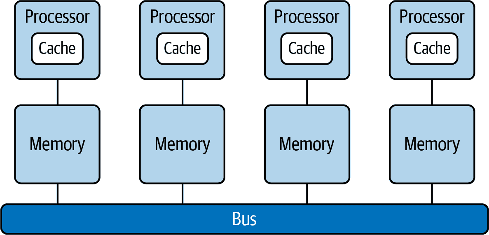

# 第十一章：配置和调优服务器

MySQL 安装过程（参见第一章）提供了安装 MySQL 进程并开始使用所需的一切。但是，对于生产系统，需要进行一些微调，调整 MySQL 参数和操作系统以优化 MySQL 服务器的性能。本章将涵盖不同安装的推荐最佳实践，并展示需要根据预期或当前工作负载调整的参数。正如您将看到的那样，不需要记忆所有 MySQL 参数。基于[*帕累托原则*](https://oreil.ly/1d58s)，该原则表明，对于许多事件，大约 80%的效果来自 20%的原因，我们将集中关注大多数性能问题的 MySQL 和操作系统参数。本章还涉及与计算机体系结构相关的一些高级主题（如 NUMA）；这里的目的是向您介绍一些可能影响 MySQL 性能的组件，这些组件在您的职业生涯中迟早需要与之互动。

# MySQL 服务器守护程序

自 2015 年以来，大多数 Linux 发行版已经采用了 `systemd`。因此，Linux 操作系统不再使用 `mysqld_safe` 进程来启动 MySQL。`mysqld_safe` 被称为*天使进程*，因为它增加了一些安全功能，例如在发生错误时重新启动服务器，并将运行时信息记录到 MySQL 错误日志中。对于使用 `systemd`（通过 `systemctl` 命令进行控制和配置）的操作系统，这些功能已经集成到 `systemd` 和 `mysqld` 进程中。

`mysqld` 是 MySQL 服务器的核心进程。它是一个单一的多线程程序，负责服务器的大部分工作。它不会生成额外的进程——我们谈论的是一个带有多个线程的单一进程，这使得 MySQL 成为一个*多线程进程*。

让我们仔细看看一些术语。*程序*是设计用来完成特定目标的代码。有许多类型的程序，包括用于辅助操作系统部分以及设计用于用户需求（如网页浏览）的程序。

*进程*是我们称之为加载到内存中并具有所有运行所需资源的程序。操作系统为其分配内存和其他资源。

*线程*是进程内的执行单元。一个进程可以有一个线程或多个线程。在单线程进程中，进程包含一个线程，因此一次只能执行一个命令。

因为现代 CPU 拥有多个核心，它们可以同时执行多个线程，因此多线程进程现在非常普遍。了解这一概念对理解以下几节中提议的设置非常重要。

总之，MySQL 是单进程软件，为了执行用户活动和执行后台任务等各种目的，生成多个线程。

# MySQL 服务器变量

MySQL 服务器有许多变量允许调整其操作。例如，MySQL 服务器 8.0.25 有令人印象深刻的 *588* 个服务器变量！

每个系统变量都有一个默认值。此外，我们可以动态调整大多数系统变量（或者“即时”调整）；然而，有些是静态的，这意味着我们需要修改 *my.cnf* 文件并重新启动 MySQL 进程，以便它们生效（如 第九章 中所讨论的）。

系统变量可以有两种不同的作用域：`SESSION` 和 `GLOBAL`。也就是说，系统变量可以有一个全局值，影响整个服务器的操作，比如 `innodb_log_file_size`，或者一个会话值，仅影响特定会话，比如 `sql_mode`。

## 检查服务器设置

数据库不是静态实体；相反，它们的工作负载是动态的，并随着时间的推移而变化，有增长的趋势。这种有机行为需要不断的监控、分析和调整。显示 MySQL 设置的命令是：

```
SHOW [GLOBAL|SESSION] VARIABLES;
```

当您使用 `GLOBAL` 修饰符时，该语句显示全局系统变量值。当您使用 `SESSION` 时，它显示影响当前连接的系统变量值。请注意，不同的连接可以具有不同的值。

如果没有修饰符出现，默认为 `SESSION`。

## 最佳实践

数据库中有许多优化方面。如果数据库运行在 *裸金属*（物理主机）上，我们可以控制硬件和操作系统资源。当我们转移到虚拟化机器时，由于无法控制底层主机的发生情况，我们对这些资源的控制能力会减少。最后一个选项是云中的托管数据库，例如亚马逊关系数据库服务（RDS），那里只有少量的数据库设置可用。在能够进行细粒度调整以提取最佳性能和享受自动化大部分任务（代价是额外花费）之间存在权衡。

让我们首先审查一些操作系统级别的设置。之后，我们将检查 MySQL 参数。

### 操作系统最佳实践

有几个操作系统设置可能会影响 MySQL 的性能。我们将在这里列出其中一些最重要的。

#### `swappiness` 设置和交换使用

`swappiness` 参数控制 Linux 操作系统在交换区域中的行为。交换是在内存和磁盘之间传输数据的过程。这可能对性能产生显著影响，因为即使使用 NVMe 磁盘，磁盘访问速度至少比内存访问慢一个数量级。

默认设置为 `60` 会促使服务器进行交换。出于性能原因，您希望 MySQL 服务器尽可能减少交换。建议的值是 `1`，这意味着在操作系统必须功能正常之前不进行交换。要调整此参数，请以 root 用户身份执行以下命令：

```
# echo 1 > /proc/sys/vm/swappiness
```

注意这是一个非持久性更改；在重新启动操作系统后，设置将恢复到其原始值。要在操作系统重新启动后使此更改持久化，请在 *sysctl.conf* 中调整设置：

```
# sudo sysctl -w vm.swappiness=1
```

您可以使用以下命令获取交换空间使用信息：

```
# free -m
```

或者，如果您想要更详细的信息，可以在 shell 中运行以下代码段：

```
#!/bin/bash
SUM=0
OVERALL=0
for DIR in `find /proc/ -maxdepth 1 -type d | egrep "^/proc/[0-9]"` ; do
        PID=`echo $DIR | cut -d / -f 3`
        PROGNAME=`ps -p $PID -o comm --no-headers`
        for SWAP in `grep Swap $DIR/smaps 2>/dev/null| awk '{ print $2 }'`
        do
                let SUM=$SUM+$SWAP
        done
        echo "PID=$PID - Swap used: $SUM - ($PROGNAME )"
        let OVERALL=$OVERALL+$SUM
        SUM=0
done
echo "Overall swap used: $OVERALL"
```

###### 注意

将 `vm.swappiness` 设置为 `1` 和 `0` 之间的差异微乎其微。我们选择了值 `1`，因为在一些内核中存在一个 bug，可能会导致当设置为 `0` 时，内存不足（OOM）杀手终止 MySQL。

#### I/O 调度器

I/O 调度器是内核用于将读取和写入提交到磁盘的算法。默认情况下，大多数 Linux 安装使用完全公平排队 (`cfq`) 调度器。这对许多一般用途情况效果良好，但提供的延迟保证较少。另外两个调度器是 `deadline` 和 `noop`。`deadline` 调度器在延迟敏感的用例（如数据库）中表现优异，而 `noop` 则接近于没有调度。对于裸金属安装，无论是 `deadline` 还是 `noop`（它们之间的性能差异不可感知），都比 `cfq` 更好。

如果您在虚拟机中运行 MySQL（其具有自己的 I/O 调度器），最好使用 `noop` 并让虚拟化层自行处理 I/O 调度。

首先，验证 Linux 当前正在使用的算法：

```
#  cat /sys/block/xvda/queue/scheduler
```

```
noop [deadline] cfq
```

要动态更改它，请以 root 用户身份运行以下命令：

```
# echo "noop" > /sys/block/xvda/queue/scheduler
```

为了使这种更改持久化，您需要编辑 GRUB 配置文件（通常为 */etc/sysconfig/grub*），并将 `elevator` 选项添加到 `GRUB_CMDLINE_LINUX_DEFAULT`。例如，您将替换此行：

```
GRUB_CMDLINE_LINUX="console=tty0 crashkernel=auto console=ttyS0,115200
```

有这行：

```
GRUB_CMDLINE_LINUX="console=tty0 crashkernel=auto console=ttyS0,115200
    elevator=noop"
```

在编辑 GRUB 配置时要格外小心。错误或不正确的设置可能使服务器无法使用，需要重新安装操作系统。

###### 注意

在某些情况下，I/O 调度器的值为 `none` —— 最明显的是在 AWS VM 实例类型中，EBS 卷作为 NVMe 块设备公开。这是因为在现代 PCIe/NVMe 设备中，具有大量内部队列并完全绕过 I/O 调度器的情况下，设置没有用处。在这些磁盘中，`none` 设置是最优的。

#### 文件系统和挂载选项

选择适合您的数据库的文件系统是一个重要的决策，因为有许多选项可供选择，涉及到的权衡。值得一提的是两个经常使用的重要选项：*XFS* 和 *ext4*。

XFS 是设计用于高扩展性的高性能日志文件系统。即使文件系统跨多个存储设备，它也提供接近原生的 I/O 性能。XFS 具有使其适合非常大的文件系统的功能，支持高达 8 EiB 大小的文件。其他功能包括快速恢复、快速事务、延迟分配以减少碎片化，以及直接 I/O 时几乎原始 I/O 性能。

[创建 XFS 文件系统命令](https://oreil.ly/IJ9em) (`mkfs.xfs`) 有几个选项可以配置文件系统。但是，默认的 `mkfs.xfs` 选项适合最佳速度，因此使用默认命令创建文件系统将提供良好的性能，同时确保数据完整性：

```
# mkfs.xfs /dev/target_volume
```

关于文件系统挂载选项，再次默认值应该适合大多数情况。在某些文件系统上，通过向 */etc/fstab* 文件添加 `noatime` 挂载选项可以提高性能。对于 XFS 文件系统，默认的 `atime` 行为是 `relatime`，与 `noatime` 相比几乎没有开销，仍保持理智的 `atime` 值。如果在具有电池备份的非易失性缓存的逻辑单元号（LUN）上创建 XFS 文件系统，则可以通过使用挂载选项 `nobarrier` 来进一步增加文件系统的性能。这些设置有助于避免过于频繁地刷新数据。但是，如果不存在备份电池单元（BBU），或者您对此不确定，请保留屏障；否则可能会危及数据一致性。以下示例显示了具有这些选项的两个虚构挂载点：

```
/dev/sda2              /datastore              xfs     noatime,nobarrier
/dev/sdb2              /binlog                 xfs     noatime,nobarrier
```

另一个流行的选择是 ext4，作为 ext3 的后继者，添加了性能改进。这是一个适合大多数工作负载的可靠选择。我们应该注意，它支持最大 16 TB 大小的文件，比 XFS 的限制小。如果过多的表空间大小/增长是要求的话，这是需要考虑的事项。关于挂载选项，相同的考虑适用。我们建议使用默认值来获得稳健的文件系统，而无需担心数据一致性的风险。但是，如果存在带有 BBU 缓存的企业存储控制器，以下挂载选项将提供最佳性能：

```
/dev/sda2              /datastore              ext4
noatime,data=writeback,barrier=0,nobh,errors=remount-ro
/dev/sdb2              /binlog                 ext4
noatime,data=writeback,barrier=0,nobh,errors=remount-ro
```

#### 透明巨大页面

操作系统以称为*页*的块管理内存。每页的大小为 4,096 字节（或 4 KB）；1 MB 的内存相当于 256 页，1 GB 的内存等于 256,000 页，以此类推。CPU 具有内置的内存管理单元，其中包含这些页的列表，每个页通过*页表项*引用。如今，常见的服务器通常具有数百或数千兆字节的内存。使系统能够管理大量内存有两种方法：

+   增加硬件内存管理单元中的页表项数。

+   增加页大小。

第一种方法很昂贵，因为现代处理器中的硬件内存管理单元只支持数百或数千个页表项。此外，那些在处理数千页（数兆字节内存）时表现良好的硬件和内存管理算法可能在处理数百万（甚至数十亿）页时表现不佳。为了解决可伸缩性问题，操作系统开始使用大页。简单来说，大页是可以为 2 MB、4 MB、1 GB 等大小的内存块。使用大页内存可以增加 CPU 高速缓存击中事务查找缓冲区（TLB）的次数。

您可以运行`cpuid`来验证处理器的高速缓存和 TLB：

```
# cpuid | grep "cache and TLB information" -A 5
   cache and TLB information (2):
      0x5a: data TLB: 2M/4M pages, 4-way, 32 entries
      0x03: data TLB: 4K pages, 4-way, 64 entries
      0x76: instruction TLB: 2M/4M pages, fully, 8 entries
      0xff: cache data is in CPUID 4
      0xb2: instruction TLB: 4K, 4-way, 64 entries
```

透明大页（THP）如其名称所示，旨在自动为应用程序引入大页支持，无需自定义配置。

特别对于 MySQL，不推荐使用 THP，原因有几个。首先，MySQL 数据库使用小内存页（16 KB），使用 THP 可能导致过多的 I/O，因为 MySQL 认为正在访问 16 KB，而 THP 正在扫描一个比此大的页面。此外，大页往往会变得碎片化并影响性能。多年来也报告过使用 THP 可能导致内存泄漏，最终导致 MySQL 崩溃。

要禁用 RHEL/CentOS 6 和 RHEL/CentOS 7 的 THP，请执行以下命令：

```
# echo "never" > /sys/kernel/mm/transparent_hugepage/enabled
# echo "never" > /sys/kernel/mm/transparent_hugepage/defrag
```

要确保此更改在服务器重新启动后仍然有效，您需要将标志`transparent_hugepage=never`添加到内核选项（*/etc/sysconfig/grub*）中：

```
GRUB_CMDLINE_LINUX="console=tty0 crashkernel=auto console=ttyS0,115200
elevator=noop transparent_hugepage=never"
```

备份现有的 GRUB2 配置文件（*/boot/grub2/grub.cfg*），然后重新构建它。在基于 BIOS 的机器上，您可以使用以下命令执行此操作：

```
# grub2-mkconfig -o /boot/grub2/grub.cfg
```

如果 THP 仍未禁用，可能需要禁用`tuned`服务：

```
# systemctl stop tuned
# systemctl disable tuned
```

要禁用 Ubuntu 20.04（Focal Fossa）的 THP，建议使用`sysfsutils`包。要安装它，请执行以下命令：

```
# apt install sysfsutils
```

然后将以下行追加到*/etc/sysfs.conf*文件中：

```
kernel/mm/transparent_hugepage/enabled = never
kernel/mm/transparent_hugepage/defrag = never
```

重新启动服务器并检查是否已设置：

```
# cat /sys/kernel/mm/transparent_hugepage/enabled
always madvise [never]
# cat /sys/kernel/mm/transparent_hugepage/defrag
always defer defer+madvise madvise [never]
```

#### jemalloc

MySQL 服务器使用动态内存分配，因此良好的内存分配器对于正确利用 CPU 和 RAM 资源至关重要。高效的内存分配器应该能够提高可伸缩性、增加吞吐量，并控制内存占用。

在这里需要提及 InnoDB 的一个特性。InnoDB 为每个事务创建一个读视图，并从`heap`区域分配内存以用于此结构。问题在于 MySQL 在每次提交时释放堆，因此读视图内存在下一个事务时重新分配，导致内存碎片化。

`jemalloc`是一个强调碎片避免和可扩展并发支持的内存分配器。

使用 `jemalloc`（禁用 THP），您可以减少内存碎片化并更有效地管理服务器可用内存资源。您可以从 [`jemalloc` 仓库](https://oreil.ly/NZMtb) 或 Percona 的 *yum* 或 *apt* 软件库安装 `jemalloc` 软件包。我们更喜欢使用 Percona 软件库，因为我们认为它更简单安装和管理。我们在 “安装 Percona Server 8.0” 和 “安装 Percona Server 8” 中描述了安装 *yum* 软件库和 *apt* 软件库的步骤。

一旦您有了软件库，您可以为您的操作系统运行安装命令。

###### 提示

在 CentOS 中，如果服务器安装了 Extra Packages for Enterprise Linux (EPEL) 软件库，则可以使用 `yum` 从该软件库安装 `jemalloc`。要安装 EPEL 软件包，请使用：

```
# yum install epel-release -y
```

如果您使用 Ubuntu 20.04，则需要执行以下步骤以启用 `jemalloc`：

1.  安装 `jemalloc`：

    ```
    # apt-get install libjemalloc2
    # dpkg -L libjemalloc2
    ```

1.  `dpkg` 命令将显示 `jemalloc` 库的位置：

    ```
    # dpkg -L libjemalloc2
    /.
    /usr
    /usr/lib
    /usr/lib/x86_64-linux-gnu
    /usr/lib/x86_64-linux-gnu/libjemalloc.so.2
    /usr/share
    /usr/share/doc
    /usr/share/doc/libjemalloc2
    /usr/share/doc/libjemalloc2/README
    /usr/share/doc/libjemalloc2/changelog.Debian.gz
    /usr/share/doc/libjemalloc2/copyright
    ```

1.  通过以下命令覆盖服务的默认配置：

    ```
    # systemctl edit mysql
    ```

    将创建 */etc/systemd/system/mysql.service.d/override.conf* 文件。

1.  将以下配置添加到文件中：

    ```
    [Service]
    Environment="LD_PRELOAD=/usr/lib/x86_64-linux-gnu/libjemalloc.so.2"
    ```

1.  重新启动 MySQL 服务以启用 `jemalloc` 库：

    ```
    # systemctl restart mysql
    ```

1.  要验证是否成功，确保 `mysqld` 进程在运行，执行以下命令：

    ```
    # lsof -Pn -p $(pidof mysqld) |  grep "jemalloc"
    ```

    您应该看到类似以下的输出：

    ```
    mysqld  3844 mysql  mem       REG              253,0   744776  36550
    /usr/lib/x86_64-linux-gnu/libjemalloc.so.2
    ```

如果您使用 CentOS/RHEL，需要执行以下步骤：

1.  安装 `jemalloc` 软件包：

    ```
    # yum install jemalloc
    # rpm -ql jemalloc
    ```

1.  `rpm -ql` 命令将显示库的位置：

    ```
    /usr/bin/jemalloc.sh
    /usr/lib64/libjemalloc.so.1
    /usr/share/doc/jemalloc-3.6.0
    /usr/share/doc/jemalloc-3.6.0/COPYING
    /usr/share/doc/jemalloc-3.6.0/README
    /usr/share/doc/jemalloc-3.6.0/VERSION
    /usr/share/doc/jemalloc-3.6.0/jemalloc.html
    ```

1.  通过以下命令覆盖服务的默认配置：

    ```
    # systemctl edit mysqld
    ```

    将创建 */etc/systemd/system/mysqld.service.d/override.conf* 文件。

1.  将以下配置添加到文件中：

    ```
    [Service]
    Environment="LD_PRELOAD=/usr/lib64/libjemalloc.so.1"
    ```

1.  重新启动 MySQL 服务以启用 `jemalloc` 库：

    ```
    # systemctl restart mysqld
    ```

1.  要验证是否成功，确保 `mysqld` 进程在运行，执行以下命令：

    ```
    # lsof -Pn -p $(pidof mysqld) |  grep "jemalloc"
    ```

    您应该看到类似以下的输出：

    ```
    mysqld  4784 mysql  mem       REG              253,0    212096  33985101
    /usr/lib64/libjemalloc.so.1
    ```

#### CPU 调度器

在系统上减少功耗和热量输出的最有效方法之一是使用 CPUfreq。CPUfreq，也称为 CPU 频率调整或 CPU 速度调整，允许在运行时调整处理器的时钟速度。此功能使系统能够以降低的时钟速度运行以节省功耗。关于何时以及何时转移到更快或更慢的时钟速度的转换规则由 CPUfreq *governor* 定义。这个调度器定义了系统 CPU 的功耗特性，进而影响 CPU 的性能。每个调度器都有其独特的行为、目的和适用于工作负载的适合性。然而，对于 MySQL 数据库，我们建议使用最大性能设置以获得最佳吞吐量。

对于 CentOS，您可以通过执行以下命令查看当前使用的 CPU 调度器：

```
# cat /sys/devices/system/cpu/cpu/cpufreq/scaling_governor
```

您可以通过运行以下命令启用性能模式：

```
# cpupower frequency-set --governor performance
```

对于 Ubuntu，我们建议安装 `linux-tools-common` 包，这样您就可以使用 `cpupower` 实用程序：

```
# apt install linux-tools-common
```

安装完成后，您可以使用以下命令将管理器设置为性能模式：

```
# cpupower frequency-set --governor performance
```

### MySQL 最佳实践

现在让我们来看看 MySQL 服务器设置。本节提出了对主要影响性能的主要 MySQL 参数推荐的值。您会看到对于大多数参数来说，不需要更改默认值。

#### 缓冲池大小

`innodb_buffer_pool_size` 参数控制 InnoDB 缓冲池的大小（以字节为单位），这是 InnoDB 缓存表和索引数据的内存区域。毫无疑问，对于调整 InnoDB，这是最重要的参数。通常的经验法则是将其设置为 MySQL 专用服务器可用总内存的约 70%。

然而，服务器越大，这样做可能会浪费更多的 RAM。例如，对于具有 512 GB RAM 的服务器，这将使得操作系统有 153 GB 的多余内存，这比其需要的要多得多。

那么什么是更好的经验法则？将 `innodb_buffer_pool_size` 设置得尽可能大，而不会在系统运行生产工作负载时引起交换。这将需要一些调整。

在 MySQL 5.7 及更高版本中，这是一个动态参数，因此您可以在不重启数据库的情况下即时更改它。例如，要将其设置为 1 GB，请使用以下命令：

```
mysql> `SET` `global` `innodb_buffer_pool_size` `=` `1024``*``1024``*``1024``;`

```

```
Query OK, 0 rows affected (0.00 sec)
```

要使更改在重启后生效，您需要将此参数添加到 *my.cnf* 文件的 `[mysqld]` 部分下：

```
[mysqld]
innodb_buffer_pool_size = 1G
```

#### `innodb_buffer_pool_instances` 参数

MySQL 中较为隐晦的一个参数是 `innodb_buffer_pool_instances`。此参数定义了 InnoDB 将缓冲池分割为多少个实例。对于具有多个千兆字节缓冲池的系统，将缓冲池分割为单独的实例可以通过减少不同线程对缓存页面的读写而提高并发性能。

然而，根据我们的经验，为此参数设置较高的值可能也会引入额外的开销。原因在于每个缓冲池实例管理其自己的空闲列表、刷新列表、LRU 列表和所有其他与缓冲池相关的数据结构，并由其自己的缓冲池互斥量保护。

除非您运行基准测试证明性能增益，否则建议使用默认值 (`8`)。

###### 注意

`innodb_buffer_pool_instances` 参数在 MariaDB 10.5.1 中已弃用，并在 MariaDB 10.6 中移除。根据 MariaDB 架构师 Marko Makela 的说法，这是因为现在大部分需要分割缓冲池的原因已经消失。您可以在 [MariaDB Jira ticket](https://oreil.ly/HOCNA) 中找到更多详细信息。

#### 重做日志大小

重做日志是在崩溃恢复期间使用的结构，用于纠正由不完整事务写入的数据。其主要目标是通过为已提交事务提供重做恢复来保证 ACID 事务的持久性（D）属性。因为重做文件记录了甚至在提交之前所有写入 MySQL 的数据，所以拥有合适的重做日志大小对于 MySQL 顺利运行至关重要。过小的重做日志甚至可能导致操作中出现错误！

以下是使用小的重做日志文件可能出现的错误示例：

```
[ERROR] InnoDB: The total blob data length (12299456) is greater than 10%
of the total redo log size (100663296). Please increase total redo log size.
```

在这种情况下，MySQL 使用了`innodb_log_file_size`参数的默认值，即 48 MB。为了估算最佳的重做日志大小，在大多数情况下我们可以使用以下公式。看一下以下命令：

```
mysql> `pager` `grep` `sequence`
PAGER set to 'grep sequence'
mysql> show engine innodb status\G select sleep(60);
    -> show engine innodb status\G

```

```
Log sequence number 3836410803
1 row in set (0.06 sec)

1 row in set (1 min 0.00 sec)

Log sequence number 3838334638
1 row in set (0.05 sec)
```

日志序列号是写入重做日志的总字节数。通过使用`SLEEP()`命令，我们可以计算该时间段的增量。然后，使用以下公式，我们可以得出一个估计值，用于存储大约一小时的日志所需的空间量（一个经验法则）。

```
mysql> `SELECT` `(``(``(``3838334638` `-` `3836410803``)``/``1024``/``1024``)``*``60``)``/``2`
    -> AS Estimated_innodb_log_file_size;

```

```
+--------------------------------+
| Estimated_innodb_log_file_size |
+--------------------------------+
|                55.041360855088 |
+--------------------------------+
1 row in set (0.00 sec)
```

我们通常会向上取整，因此最终的数字将是 56 MB。这是需要添加到`my.cnf`文件的值，在`[mysqld]`部分下：

```
[mysqld]
innodb_log_file_size=56M
```

#### `sync_binlog`参数

二进制日志是一组日志文件，包含对 MySQL 服务器实例进行的数据修改的信息。它们与重做文件不同，并且有其他用途。例如，它们用于创建副本和 InnoDB 集群，并有助于执行 PITR。

默认情况下，MySQL 服务器在提交事务之前将其二进制日志同步到磁盘（使用`fdatasync()`）。其优点在于，如果发生停电或操作系统崩溃，从二进制日志丢失的事务仅处于准备状态；这允许自动恢复例程回滚事务，确保不会丢失任何事务。然而，默认值（`sync_binlog = 1`）会带来性能损失。由于这是一个动态选项，您可以在服务器运行时使用以下命令进行更改：

```
mysql> `SET` `GLOBAL` `sync_binlog` `=` `0``;`

```

要使更改在重新启动后持久化，请将参数添加到`my.cnf`文件的`[mysqld]`部分下：

```
[mysqld]
sync_binlog=0
```

###### 注意

大多数情况下，当启用二进制日志时，使用`sync_binlog=0`会提供良好的性能。然而，性能变化可能会很大，因为 MySQL 将依赖于操作系统的刷新来刷新二进制日志。根据工作负载的不同，使用`sync_binlog=1000`或更高的值将比`sync_binlog=1`提供更好的性能，并且比`sync_binlog=0`具有更少的差异。

#### `binlog_expire_logs_seconds`和`expire_logs_days`参数

为了避免 MySQL 用二进制日志填满整个磁盘，您可以调整参数 `binlog_expire_logs_seconds` 和 `expire_logs_days` 的设置。`expire_logs_days` 指定在自动删除二进制日志文件之前的天数。然而，在 MySQL 8.0 中，此参数已被弃用，预计在将来的版本中将被移除。

因此，更好的选择是使用 `binlog_expire_logs_seconds`，该参数设置二进制日志的过期时间（以秒为单位）。此参数的默认值为 `2592000`（30 天）。MySQL 可以在到期后自动删除二进制日志文件，无论是在启动时还是在下次刷新二进制日志时。

###### 注意

如果您想手动刷新二进制日志，可以执行以下命令：

```
mysql> `FLUSH` `BINARY` `LOGS``;`

```

#### `innodb_flush_log_at_trx_commit` 参数

`innodb_flush_log_at_trx_commit` 控制提交操作的严格 ACID 兼容性与在重新排列并批量执行提交相关 I/O 操作时可能实现的更高性能之间的平衡。这是一个微妙的选项，许多人更喜欢在源服务器上使用默认值（`innodb_flush_log_at_trx_commit=1`），而在副本上使用值 `0` 或 `2`。值 `2` 指示 InnoDB 在每个事务提交后写入日志文件，但每秒仅刷新一次到磁盘。这意味着如果操作系统崩溃，您最多可能会丢失一秒的更新，对于支持每秒达到一百万次插入的现代硬件来说，这并不可忽视。值 `0` 更糟：日志每秒仅写入并刷新到磁盘一次，因此即使 `mysqld` 进程崩溃，您也可能会丢失一秒的事务。

###### 警告

许多操作系统和一些磁盘硬件在“刷入磁盘”的操作上表现得不可靠。它们可能会告诉 `mysqld` 刷入已完成，但实际上并未刷入。在这种情况下，即使使用推荐的设置，事务的耐久性也无法得到保证，最坏的情况下，断电可能会损坏 InnoDB 数据。在 SCSI 磁盘控制器或磁盘本身使用带电池后备的磁盘缓存可以加快文件刷入速度，并使操作更安全。如果电池工作不正常，还可以禁用硬件缓存中的磁盘写入缓存。

#### `innodb_thread_concurrency` 参数

`innodb_thread_concurrency` 默认设置为 `0`，这意味着 MySQL 内可以打开和执行无限数量（最多达到硬件限制）的线程。通常的建议是将此参数保持默认值，并仅在解决争用问题时进行更改。

如果您的工作负载始终很重或偶尔会有高峰，可以使用以下公式设置 `innodb_thread_concurrency` 的值：

```
innodb_thread_concurrency = Number of Cores * 2
```

因为 MySQL 不使用多个核心来执行单个查询（它是一对一的关系），每个核心在单个时间单位内运行一个查询。根据我们的经验，因为现代 CPU 性能通常较快，设置执行线程的最大数目为可用 CPU 数量的两倍是一个不错的起点。

当执行线程数达到此限制时，额外的线程会休眠一段由配置参数 `innodb_thread_sleep_delay` 设置的微秒数，然后被放入队列。

`innodb_thread_concurrency` 是一个动态变量，我们可以在运行时更改它：

```
mysql> `SET` `GLOBAL` `innodb_thread_concurrency` `=` `0``;`

```

要使更改持久化，您还需要将其添加到 *my.cnf* 文件中的 `[mysqld]` 部分：

```
[mysqld]
innodb-thread-concurrency=0
```

您可以使用以下命令验证 MySQL 是否应用了该设置：

```
mysql> `SHOW` `GLOBAL` `VARIABLES` `LIKE` `'%innodb_thread_concurrency%'``;`

```

###### 注意

MySQL 8.0.14 的 [发布说明](https://oreil.ly/EqPrG) 表示：“从 MySQL 8.0.14 开始，InnoDB 支持并行聚簇索引读取，这可以改善 `CHECK TABLE` 的性能。” 并行聚簇索引读取也适用于简单的 `COUNT(*)`（没有 `WHERE` 条件）。您可以通过 `innodb_parallel_read_threads` 参数来控制并行线程的数量。

此功能目前仅限于没有 `WHERE` 条件的查询（全表扫描）。然而，这对 MySQL 是一个很好的起点，为实现真正的并行查询打开了道路。

#### NUMA 架构

非统一内存访问（NUMA）是一种描述多处理器系统中主存储器模块相对于处理器放置方式的共享存储架构。在 NUMA 共享存储架构中，每个处理器都有自己的本地存储器模块，这带来了明显的性能优势，因为内存和处理器物理上更接近。同时，它还可以通过共享总线（或其他类型的互连）访问属于另一个处理器的任何存储器模块，如图 11-1 所示。

###### 注意

一个很好的替代方法，可以显示跨 NUMA 节点的内存使用情况，是使用 `numastat` 命令。您可以通过执行以下命令来获取每个节点的更详细的内存使用情况：

```
# numastat -m
```

另一种可视化方法是通过特定进程。例如，要检查 mysqld 进程在 NUMA 节点中的内存使用情况：

```
# numastat -p $(pidof mysqld)
```



###### 图 11-1\. NUMA 架构概述

以下命令显示了启用 NUMA 的服务器上可用节点的示例：

```
shell> numactl --hardware

available: 2 nodes (0-1)
node 0 cpus: 0 1 2 3 4 5 6 7 8 9 10 11 24 25 26 27 28 29 30 31 32 33 34 35
node 0 size: 130669 MB
node 0 free: 828 MB
node 1 cpus: 12 13 14 15 16 17 18 19 20 21 22 23 36 37 38 39 40 41 42 43 44 45 46
node 1 size: 131072 MB
node 1 free: 60 MB
node distances:
node   0   1
  0:  10  21
  1:  21  10
```

正如我们所见，节点 0 比节点 1 有更多的空闲内存。由于这一点导致操作系统即使有可用内存也进行交换，详细解释可以参考 Jeremy Cole 的优秀文章 [“MySQL *交换疯狂* 问题与 NUMA 架构的影响”](https://oreil.ly/lBRSk)。

在 MySQL 5.7 中，移除了 `innodb_buffer_pool_populate` 和 `numa_interleave` 参数，它们的功能现在由 `innodb_numa_interleave` 参数控制。启用后，我们可以在 NUMA 系统中平衡内存分配，避免交换内存的问题。

这个参数不是动态的，因此要启用它，我们需要将它添加到 *my.cnf* 文件的 `[mysqld]` 部分，并重新启动 MySQL：

```
[mysqld]
innodb_numa_interleave = 1
```
