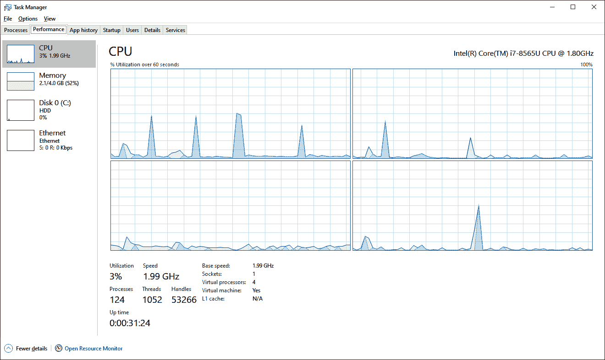
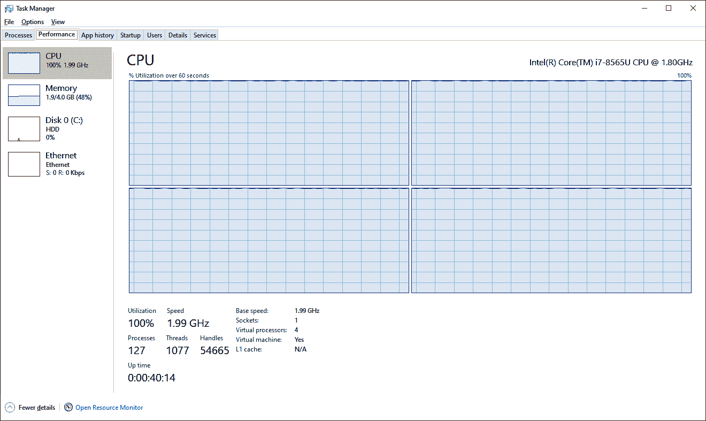
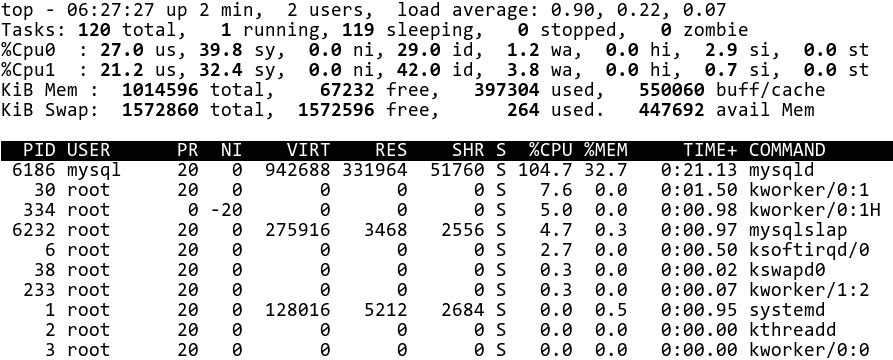
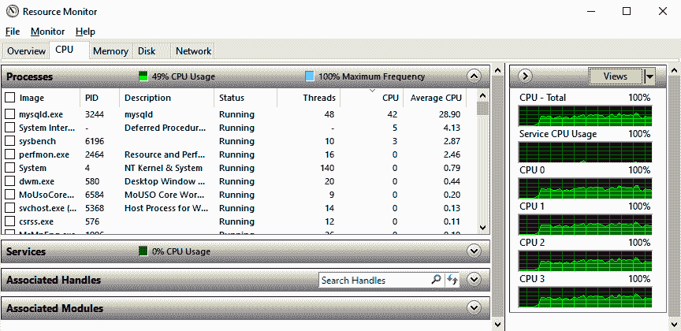
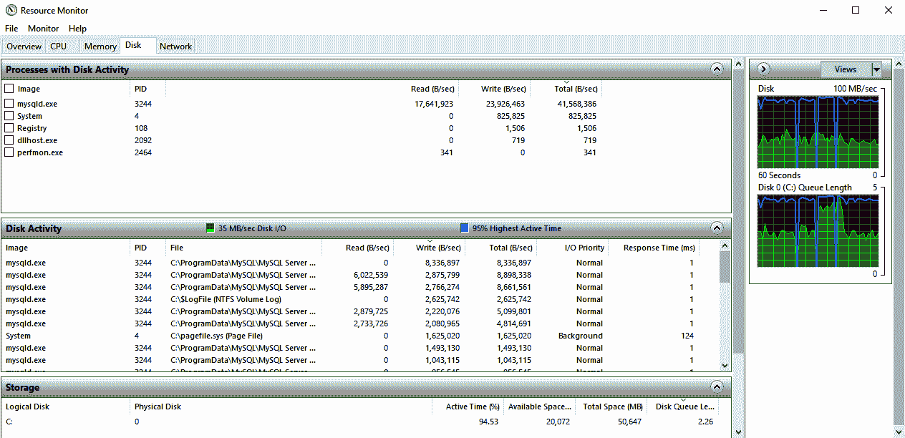
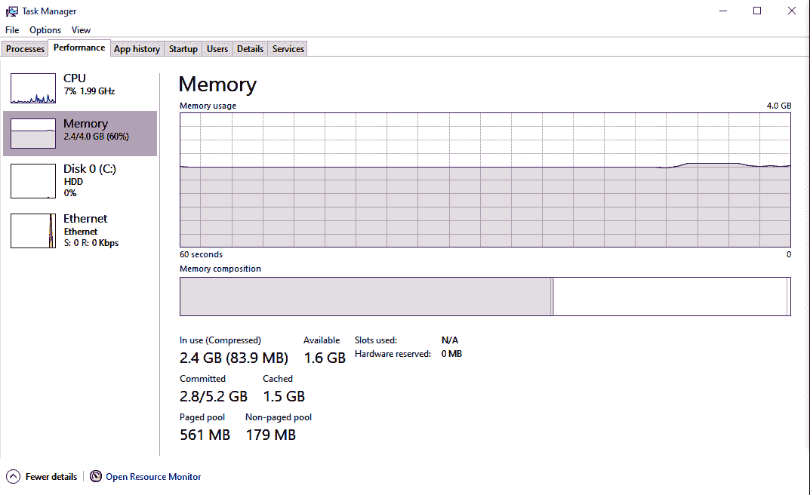
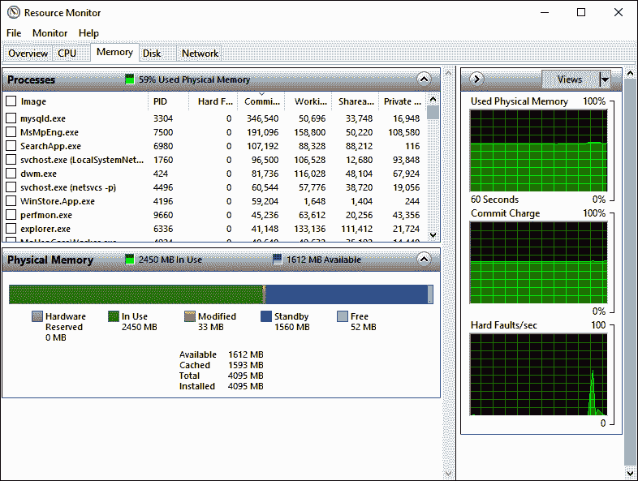
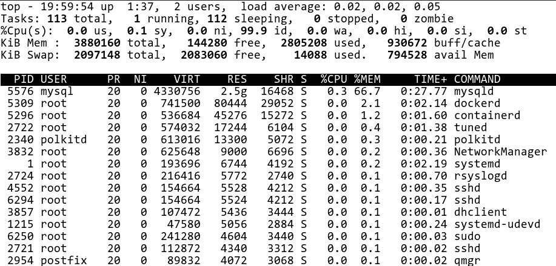
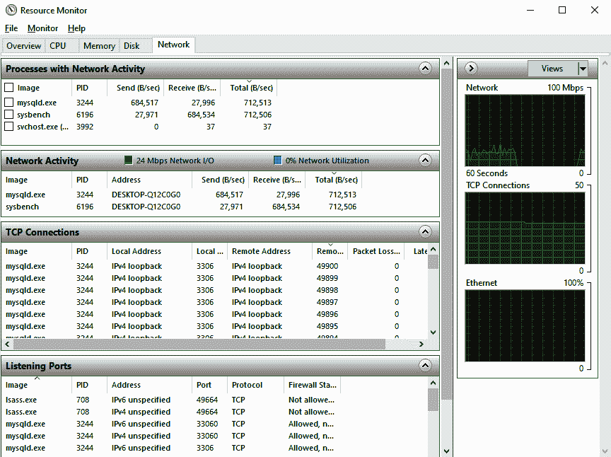

# 第十二章：监控 MySQL 服务器

*监控*可以定义为在一段时间内观察或检查某物的质量或进展。将这个定义应用于 MySQL，我们观察和检查的是服务器的“健康”和性能。因此，质量就是保持正常运行时间并使性能达到期望水平。因此，监控实际上是一个持续的努力，用于保持事物的观察和控制。通常认为监控是可选的，除非存在特别高的负载或高风险。然而，就像备份一样，几乎每个数据库的安装都会受益于监控。

我们认为，建立监控并理解从中获得的指标，对于任何操作数据库系统的人来说都是最重要的任务之一——可能仅次于设置正确的验证备份。就像没有备份的数据库操作一样，未能监控数据库也是危险的：一个提供不可预测性能并可能随机“宕机”的系统有什么用呢？数据可能是安全的，但可能无法使用。

在本章中，我们将试图为您提供一个有效监控 MySQL 的基础。这本书不叫*高性能 MySQL*，我们不会深入讨论不同指标的具体含义或如何对系统进行复杂分析。但我们将讨论一些应在每个 MySQL 安装中定期检查的基本指标，并讨论重要的操作系统级别指标和工具。然后我们将简要介绍几种广泛使用的评估系统性能的方法。之后，我们将回顾几种流行的开源监控解决方案，最后我们将展示如何手动收集数据以进行调查和监控目的。

完成本章后，您应该能够自如地选择一个监控工具，并理解它显示的一些最重要的指标。

# 操作系统性能指标

操作系统是一个复杂的计算机程序：在我们的情况下，主要是应用程序（主要是 MySQL）和硬件之间的接口。在早期，操作系统很简单；现在它们可以说相当复杂，但背后的思想从未真正改变过。操作系统试图隐藏或抽象掉处理底层硬件复杂性的细节。可以想象某些特殊用途的 RDBMS 直接在硬件上运行，成为自己的操作系统，但实际上你可能永远不会看到那样的东西。除了提供方便和强大的接口外，操作系统还公开了许多性能指标。你不需要了解每一个指标，但了解如何评估数据库下层性能的基本知识是很重要的。

通常，当我们讨论操作系统的性能和指标时，实际上讨论的是在操作系统级别评估的硬件性能。称之为“操作系统指标”没有问题，但请记住，归根结底它们主要显示的是硬件性能。

让我们看看您将要监视和大致了解的最重要的操作系统指标。在本节中，我们将涵盖两个主要操作系统：Linux 和 Windows。类 Unix 系统，如 macOS 和其他系统，将具有与 Linux 相同或至少显示相同或类似输出的工具。

## CPU

*中央处理单元*（CPU）是任何计算机的核心。如今，CPU 非常复杂，可以被看作是计算机内部的独立计算机。幸运的是，我们认为您应该理解的基本指标是普遍适用的。在本节中，我们将看看 Linux 和 Windows 报告的 CPU 利用率，并了解对总体负载的贡献。

在我们进入 CPU 利用率的测量之前，让我们快速回顾一下 CPU 的定义及其对数据库操作员最重要的特性。我们称它为“计算机的核心”，但这过于简化。事实上，CPU 是一个可以执行几个基本（和不那么基本）操作的设备，在这些操作的基础上，我们从机器代码到高级编程语言再到运行操作系统和最终（对我们来说）数据库系统，逐层堆叠复杂性。

计算机执行的每个操作都由 CPU 完成。正如[Kevin Closson](https://oreil.ly/8uwkg)所说，“一切都是 CPU 的问题。”当程序正在被执行时——例如，MySQL 解析查询——CPU 正在处理所有工作。当程序等待资源时——例如，MySQL 等待从磁盘读取数据——CPU 参与“告诉”程序数据何时可用。这样的列表可以无限延续。

这里是服务器（或一般计算机）CPU 的几个最重要的指标：

CPU 频率

CPU 频率是 CPU 核心每秒“唤醒”执行工作的次数。这基本上是 CPU 的“速度”。越多越好，但令人惊讶的是频率并不总是最重要的指标。

缓存内存

缓存大小定义了直接位于 CPU 内部的内存量，使其速度极快。同样，越多越好，增加缓存没有任何不利因素。

核心数量

这是单个 CPU“包裹”（一个物理项目）内执行单元的数量，以及我们可以放入服务器中的所有 CPU 的总和。如今，越来越难找到只有一个核心的 CPU：大多数 CPU 都是多核系统。有些甚至有“虚拟”核心，使“实际”CPU 数量与总核心数之间的差异更大。

通常情况下，拥有更多的核心是件好事，但其中也有一些注意事项。一般来说，可用的核心越多，操作系统可以调度的进程就越多，可以同时执行。对于 MySQL 来说，这意味着可以并行执行更多查询，并且后台操作对其影响较小。

但是如果一半的可用核心是“虚拟”的，你得不到你可能期望的 2 倍性能提升。相反，*可能* 会得到 2 倍增加，或者你可能会在 1 倍到 2 倍之间得到任何增加：不是每个工作负载（即使在 MySQL 内部）都会从虚拟核心中受益。

此外，在不同插槽中具有多个 CPU 会使得与内存（RAM）和其他板载设备（如网络卡）的接口更加复杂。通常，常规服务器在物理布局上会使一些 CPU（及其核心）能够更快地访问 RAM 的某些部分，这就是我们在前一章中讨论过的 NUMA 架构。对于 MySQL 来说，这意味着内存分配和与内存相关的问题可能成为痛点。我们在 “NUMA 架构” 中涵盖了 NUMA 系统上的必要配置。

CPU 的基本度量是其负载百分比。当有人告诉你“CPU 20”，你可以相当确定他们的意思是“CPU 当前忙碌 20%”。但你永远也不能完全确定，所以最好再确认一次。例如，在多核系统上的一个核心的 20% 可能只是整体负载的 1%。让我们尝试可视化这个负载。

在 Linux 上，获取 CPU 负载的基本命令是 `vmstat`。如果没有参数运行，它将输出当前的平均值然后退出。如果我们用一个数字参数（这里称为 `X`）运行它，它会每 `X` 秒打印一次值。我们建议你使用一个数字参数运行 `vmstat`，例如 `vmstat 1`，持续几秒钟。如果仅运行 `vmstat`，你会得到自启动以来的平均值，通常这些值会误导。`vmstat 1` 将持续执行直到中断（按 Ctrl+C 是最简单的方式）。

`vmstat` 程序不仅打印有关 CPU 负载的信息，还包括内存和磁盘相关指标，以及高级系统指标。我们很快将探讨 `vmstat` 输出的其他部分，但这里我们将集中在 CPU 和进程指标上。

首先，让我们看看空闲系统上的 `vmstat` 输出。CPU 部分被截断了；稍后我们将详细审查它：

```
$ vmstat 1
procs -----------memory---------- ---swap-- -----io---- -system-- ------cpu-----
 r  b   swpd   free   buff  cache   si   so    bi    bo   in   cs us sy id …
 2  0      0 1229924 1856608 6968268    0    0    39   125   61  144 18  7 75…
 1  0      0 1228028 1856608 6969384    0    0     0    84 2489 3047  2  1 97…
 0  0      0 1220972 1856620 6977688    0    0     0    84 2828 4712  3  1 96…
 0  0      0 1217420 1856644 6976796    0    0     0   164 2405 3164  2  2 96…
 0  0      0 1223768 1856648 6968352    0    0     0    84 2109 2762  2  1 97…
```

在标题之后的第一行输出是自启动以来的平均值，后面的行表示打印时的当前值。刚开始时输出可能难以阅读，但你很快就会习惯。为了清晰起见，在本节的其余部分中，我们将提供一个带有我们想要的信息的截断输出，包括 `procs` 和 `cpu` 部分：

```
procs ------cpu-----
 r  b us sy id wa st
 2  0 18  7 75  0  0
 1  0  2  1 97  0  0
 0  0  3  1 96  0  0
 0  0  2  2 96  0  0
 0  0  2  1 97  0  0
```

`r` 和 `b` 是进程指标：正在活动运行的进程数和被阻塞的进程数（通常是在等待 I/O）。其他列表示 CPU 利用率的百分比（从 0% 到 100%，即使在多核系统上也是如此）。这些列的值加起来将始终为 100。以下是 `cpu` 列的含义：

`us`（用户）

运行用户程序所花费的时间（或者说这些程序对系统的负载）。MySQL 服务器是一个用户程序，每个存在于内核之外的代码也是如此。重要的是，此指标显示的是纯粹在程序本身内部花费的时间。例如，当 MySQL 进行某些计算或解析复杂查询时，此值会增加。当 MySQL 想要执行磁盘或网络操作时，此值也会增加，但很快您将看到另外两个值也在增加。

`sy`（系统）

运行内核代码的时间。由于 Linux 和其他类 Unix 系统的组织方式，用户程序会增加此计数器。例如，每当 MySQL 需要进行磁盘读取时，操作系统内核将需要进行一些工作。花费在执行这些工作上的时间将包含在 `sy` 值中。

`id`（空闲）

无所事事的时间；空闲时间。在一个完全空闲的服务器上，这个指标将为 100。

`wa`（I/O 等待）

I/O 等待时间。这是 MySQL 的一个重要指标，因为读写各种文件占 MySQL 操作的相对较大部分。当 MySQL 进行磁盘读取时，会在 MySQL 的内部函数中花费一些时间，并反映在 `us` 中。然后会在内核中花费一些时间，并反映在 `sy` 中。最后，一旦内核向底层存储设备（可以是本地设备或网络设备）发送读取请求，并等待响应和数据时，所有花费的时间都累积在 `wa` 中。如果我们的程序和内核非常慢，而我们所做的一切都是 I/O 操作，理论上这个指标可能接近 100。实际上，两位数的数值很少见，通常表示某些 I/O 问题。我们将在 “磁盘” 中深入讨论 I/O。

`st`（窃取）

这是一个很难解释的指标，如果不深入细节。MySQL 参考手册将其定义为“从虚拟机中窃取的时间”。您可以将其视为虚拟机希望执行其指令但必须等待主机服务器分配 CPU 时间的时间段。此行为有多种原因，其中一些值得注意。首先是主机过度配置：运行过多的大型虚拟机，导致虚拟机需要的资源总和超过了主机的容量。其次是“吵闹的邻居”情况，其中一个或多个虚拟机受到特别负载的虚拟机的影响。

其他命令，如稍后将显示的 `top`，将有更精细的 CPU 负载分解。但是，刚刚列出的列是一个很好的起点，并涵盖了您需要了解的大部分正在运行的系统内容。

现在让我们回到在空闲系统上的 `vmstat 1` 输出：

```
procs ------cpu-----
 r  b us sy id wa st
 2  0 18  7 75  0  0
 1  0  2  1 97  0  0
 0  0  3  1 96  0  0
 0  0  2  2 96  0  0
 0  0  2  1 97  0  0
```

从这个输出中我们能得出什么结论呢？如前所述，第一行是从启动以来的平均值。平均来看，此系统上有两个进程运行（`r`），0 个被阻塞（`b`）；用户 CPU 利用率为 18%（`us`），系统 CPU 利用率为 7%（`sy`），总体上 CPU 空闲率为 75%（`id`）。I/O 等待（`wa`）和偷取时间（`st`）均为 0。

在第一个输出后，输出的每一行都是采样间隔内的平均值，例如我们的例子中是 1 秒。这与我们所谓的“当前”值相当接近。由于这是一台空闲的机器，我们可以看到整体值低于平均水平。只有一个或没有进程在运行或被阻塞，用户 CPU 时间为 2–3%，系统 CPU 时间为 1–2%，系统空闲时间为 96–97%。

为了进一步了解，让我们来看看在相同系统上进行 CPU 密集型计算的 `vmstat 1` 输出：

```
procs ------cpu-----
 r  b us sy id wa st
 2  0 18  7 75  0  0
 1  0 13  0 87  0  0
 1  0 13  0 86  0  0
 1  0 14  0 86  0  0
 1  0 15  0 84  0  0
```

从启动以来的平均值相同，但每个样本中我们都有一个单独的进程运行，并且它将用户 CPU 时间推到了 13–15%。 `vmstat` 的问题在于，我们无法从其输出中了解到底是哪个具体的进程在消耗 CPU。当然，如果这是专用的数据库服务器，你可以假设大部分，如果不是所有的用户 CPU 时间都由 MySQL 及其线程占用，但事情总是变化的。另一个问题是，在具有高 CPU 核心数的机器上，你可能会误认为 `vmstat` 输出的低读数是事实，但即使在 256 核心的机器上， `vmstat` 也会显示 0% 到 100% 的读数。如果这样的机器的 8 个核心都是 100% 负载，那么 `vmstat` 显示的用户时间将是 3%，但实际上某些工作负载可能已被限制。

在讨论这些问题的解决方案之前，让我们稍微谈谈 Windows。总体而言，我们在 CPU 利用率以及特别是 CPU 方面的许多内容可以推广到 Windows，但有一些显著的不同点：

+   Windows 中没有 I/O 等待的账户，因为 I/O 子系统本质上是不同的。线程等待 I/O 的时间会计入空闲计数器。

+   系统 CPU 时间的对应部分大致是特权 CPU 时间。

+   没有可用的偷取信息。

用户和空闲计数器保持不变，因此你可以基于 Windows 显示的用户、特权和空闲 CPU 时间进行 CPU 监控。还有其他可用的计数器和指标，但这应该已经很好地涵盖了。在 Windows 上获取当前 CPU 利用率可以使用许多不同的工具。最简单的一个，也可能是最接近 `vmstat` 精神的，是老牌的任务管理器，它是查看 Windows 性能指标的重要工具。它易于获取，简单易用，你可能以前已经使用过。任务管理器可以显示按 CPU 核心分割的百分比形式的 CPU 利用率，并分别显示用户和内核时间。

图 12-1 显示了在空闲系统上运行的任务管理器。



###### 图 12-1\. 任务管理器显示空闲 CPU

图 12-2 展示了在繁忙系统上运行的任务管理器。



###### 图 12-2\. 任务管理器显示繁忙 CPU

正如我们前面所说，`vmstat`存在一些问题：它不会分解每个进程或每个 CPU 核心的负载。解决这两个问题需要运行其他工具。为什么不立即运行它们呢？`vmstat`是通用的，提供的不仅仅是 CPU 读数，而且非常简洁。它是快速查看给定系统是否有严重问题的好方法。任务管理器也是如此，尽管它实际上比`vmstat`更为强大。

在 Linux 上，在`vmstat`之后使用的下一个最简单的工具是`top`，这是任何处理 Linux 服务器的人工具箱中的另一个基本元素。它扩展了我们讨论的基本 CPU 指标，并添加了每个核心负载分解和每个进程负载统计。当您在没有任何参数的情况下执行`top`时，它会以终端 UI 或 TUI 模式启动。按下`?`键查看帮助菜单。按`1`显示每个核心的负载分解。图 12-3 展示了`top`的输出内容。

在这里可以看到，每个进程都在`%CPU`列下显示其自己的整体 CPU 利用率。例如，`mysqld`正在使用总 CPU 时间的 104.7%。现在我们还可以看到这个负载是如何在服务器的多个核心之间分布的。在这种特定情况下，一个核心（`Cpu0`）的负载略高于另一个核心。当 MySQL 达到单 CPU 吞吐量限制时，单核心负载分解变得重要。如果怀疑某些恶意进程正在耗尽服务器的容量，了解负载在进程之间的分布就显得很重要。



###### 图 12-3\. TUI 模式下的`top`

还有许多其他工具可以显示更多数据。我们无法详细讨论所有这些工具，但我们会列出其中一些。`mpstat`可以提供非常深入的 CPU 统计信息。`pidstat`是一个通用工具，可以为每个正在运行的进程提供 CPU、内存、磁盘和网络利用率的统计数据。`atop`是`top`的高级版本。还有其他工具，每个人都有自己喜欢的工具集。我们坚信，真正重要的不是工具本身，尽管它们很有帮助，而是理解它们提供的核心指标和统计数据。

在 Windows 上，任务管理器程序实际上比`vmstat`更接近`top`，尽管我们刚刚做了这个比较。任务管理器显示每个核心负载和每个进程负载的能力使其在任何调查中都是一个非常有用的第一步。我们建议立即深入了解资源监视器，因为它提供了更多细节。访问它的最简单方法是单击任务管理器中的打开资源监视器链接。

图 12-4 显示了一个带有 CPU 负载详细信息的资源监视器窗口。

任务管理器和资源监视器并不是 Windows 上能够显示性能指标的唯一工具。以下是几个其他可能需要你熟悉的高级工具，这里不详细介绍：

性能监视器

这个内置工具是 Windows 中性能计数器子系统的图形用户界面。简而言之，你可以查看和绘制 Windows 测量的各种性能指标（不仅限于 CPU 相关的）。

进程资源管理器

这个工具是名为[Windows Sysinternals](https://oreil.ly/mKGKF)的高级系统实用工具套件的一部分。它比这里列出的其他工具更强大、更先进，对学习很有帮助。与其他工具不同，你需要单独从其[Sysinternals 网站上的主页](https://oreil.ly/C2tGo)安装 Process Explorer。



###### 图 12-4\. 资源监视器显示 CPU 负载详细信息

## 磁盘

对于数据库性能来说，磁盘或 I/O 子系统至关重要。尽管 CPU 支撑着系统上的每个操作，但特别是对于数据库而言，磁盘很可能是最棘手的瓶颈。这是很合乎逻辑的——毕竟，数据库将数据存储在磁盘上，然后从磁盘上提供数据。在慢速和持久的长期存储之上，有许多层缓存，但不能总是利用它们，而且它们也不是无限大的。因此，在处理数据库系统时，理解基本的磁盘性能非常重要。存储系统的另一个重要且经常被低估的属性与性能无关——那就是容量。我们将从这里开始。

磁盘容量和利用率是指可以存储在给定磁盘上（或者存储系统中的许多磁盘）的数据总量，以及已经存储了多少数据。这些指标虽然不那么有趣，但却非常重要。尽管监视磁盘容量并不是真正必要的，因为它不太可能在您注意不到的情况下发生变化，但您绝对必须关注磁盘的利用率和可用空间。

大多数数据库的大小会随时间增长。特别是 MySQL 需要足够的可用磁盘空间余地来适应表更改、长时间运行的事务和写入负载的突发增加。当 MySQL 数据库实例没有更多可用的磁盘空间时，可能会崩溃或停止工作，并且不太可能在没有释放空间或增加磁盘容量的情况下重新开始工作。根据您的情况，增加更多容量可能需要从几分钟到几天不等的时间。这是您可能想提前计划的事情。

在 Linux 上，幸运的是，监控磁盘空间使用非常容易。可以使用简单的`df`命令来完成。不带参数时，它将显示每个文件系统的容量和使用情况（以 1 KB 块为单位）。你可以添加`-h`参数以获取人类可读的测量结果，并指定一个挂载点（或者只是一个路径）来限制检查。以下是一个示例：

```
$ df -h /var/lib/mysql
Filesystem      Size  Used Avail Use% Mounted on
/dev/sda1        40G   18G   23G  45% /
```

`df` 命令的输出是不言自明的，是最容易使用的工具之一。我们建议您尝试将数据库挂载点保持在 90%的容量，除非您运行的是多 TB 系统。在这种情况下，可以选择更高的容量。您可以使用的一个技巧是在与数据库相同的文件系统上放置一些大型虚拟文件。如果开始空间不足，可以删除其中一个或多个文件以获得更多时间进行响应。但是，我们建议您建立一些磁盘空间监控来替代依赖这种技巧。

在 Windows 上，可信的文件资源管理器可以提供磁盘空间利用率和容量信息，如图 12-5 所示。


###### 图 12-5\. 文件资源管理器显示可用磁盘空间

在覆盖了磁盘空间之后，我们现在将探讨任何 I/O 子系统的关键性能特性：

带宽

每单位时间内可以推送（或从存储中拉取）多少字节的数据

每秒 I/O 操作数（IOPS）

磁盘（或其他存储系统）每单位时间内能够提供的操作数

延迟

存储系统提供读取或写入服务的时间长短

这三个属性足以描述任何存储系统，并开始形成对其优劣的理解。就像在 CPU 部分所做的那样，我们将向您展示几个工具来检查磁盘性能，并使用它们的输出来解释具体的度量指标。我们再次关注 Linux 和 Windows；其他系统将有类似的内容，因此这些知识是通用的。

在 Linux 上，`iostat` 是 `vmstat` 的 I/O 负载模拟。交互模式模式应该很熟悉：调用不带参数的命令，您将得到自启动以来的平均值；传递一个数字作为参数，您将得到采样期间的平均值。我们还建议使用 `-x` 参数运行该工具，它添加了许多有用的细节。与 `vmstat` 不同，`iostat` 提供按块设备细分的指标，类似于我们之前提到的 `mpstat` 命令。

###### 提示

`iostat` 通常作为 `sysstat` 包的一部分安装。在 Ubuntu/Debian 上使用 `apt`，在基于 RHEL 的操作系统上使用 `yum` 安装此包。在按照 第一章 中的说明后，您应该能够轻松使用这些工具。

让我们看一个示例输出。我们将使用 `iostat -dxyt 5` 命令，其含义是：打印设备利用报告，显示扩展统计信息，省略从启动以来的第一个带有平均值的报告，为每个报告添加时间戳，并报告每 5 秒钟的平均值，在负载系统上提供一些示例输出：

```
05/09/2021 04:45:09 PM
Device:        rrqm/s   wrqm/s   r/s       w/s    rkB/s      wkB/s...
sda              0.00     0.00  0.00   1599.00     0.00  204672.00...
...avgrq-sz avgqu-sz   await r_await  w_await  svctm   %util
...  256.00   141.67   88.63    0.00    88.63   0.63  100.00
```

这里有很多内容需要理解。我们不会覆盖每一列，但会突出显示与之前提到的属性对应的内容：

带宽

在`iostat`输出中，列`rkB/s`和`wkB/s`对应于带宽利用率（分别为读和写）。如果您了解底层存储的特性（例如，您可能知道它承诺的读写带宽为 200 MiB/s），您可以确定是否正在推动极限。在这里，您可以看到每秒仅写入超过 200,000 KB 到`/dev/sda`设备，且没有读操作正在进行。

IOPS

此度量由`r/s`和`w/s`列表示，分别给出每秒读和写操作的次数。我们的示例显示每秒发生 1,599 次写操作。如预期，没有读操作被注册。

延迟

以稍微复杂的方式显示，延迟被分解为四列（或者在更新的`iostat`版本中更多列）：`await`、`r_await`、`w_await`和`svctm`。对于基本分析，您应该查看`await`值，这是为任何请求提供服务的平均延迟。`r_await`和`w_await`将`await`按读和写分解。`svctime`是一个被弃用的度量，试图显示纯设备延迟而没有任何排队。

通过这些基本度量读取并了解所使用的存储的一些基本事实，可以知道正在发生什么。我们的示例正在一位作者笔记本电脑上运行现代消费级 NVMe SSD。虽然带宽相当不错，但每个请求的平均时间为 88 毫秒，这相当长。您还可以通过简单的数学运算从这些度量中得到 I/O 负载模式。例如，如果我们将带宽除以 IOPS，我们得到每个请求 128 KB 的数字。`iostat`确实包括在`avgrq-sz`列中，它显示了历史单位*扇区*（512 字节）的平均请求大小。您可以继续测量每秒 1,599 次写操作只能在约 40 毫秒/请求下服务，这意味着存在并行写入负载（同时表明我们的设备能够服务并行请求）。

I/O 模式——请求大小、并行度、随机与顺序——可以改变底层存储的上限。大多数设备将在特定条件下宣传最大带宽、最大 IOPS 和最小延迟，但这些条件对于最大 IOPS 和最大带宽的测量以及最佳延迟可能会有所变化。要确定指标读数是好是坏，是相当困难的。在不了解底层存储的情况下，评估饱和度是观察利用率的一种方式。饱和度，我们将在“USE 方法”中涉及，是资源过载程度的一种度量。对于现代存储，能够高效地并行服务长队列，这变得越来越复杂，但总体上，存储设备上的排队是饱和的迹象。在`iostat`输出中，这是`avgqu-sz`列（或者在较新版本的`iostat`中是`aqu-sz`），数值大于 1 通常意味着设备饱和。我们的例子显示了一个队列有 146 个请求，这是很多，可能告诉我们 I/O 被高度利用并可能成为瓶颈。

不幸的是，正如您可能注意到的那样，没有关于 I/O 利用率的简单直接的度量：每个指标似乎都有一个特例。衡量存储性能是一项困难的任务！

同样的指标定义了 Linux、Windows 和任何其他操作系统上的存储设备。

现在让我们看一下评估 I/O 性能的基本 Windows 工具。现在这些读数应该很熟悉了。我们建议使用资源监视器，在 CPU 部分中展示过，但这次切换到磁盘选项卡。图 12-6 显示 MySQL 在高写入负载下的视图。



###### 图 12-6. 资源监视器显示的 I/O 负载详细信息

资源监视器显示的指标与`iostat`类似。您可以查看带宽、延迟和请求队列长度。一个缺少的指标是 IOPS。要获取这些信息，您需要使用性能监视器(`perfmon`)，但我们将其留作练习。

实际上，资源监视器显示的视图比`iostat`稍微详细。有每个进程的 I/O 负载细分，以及进一步的每个文件的负载细分。我们不知道 Linux 上有一个能够同时显示这样负载细分的单一工具。要获取每个程序的负载细分，您可以使用 Linux 上的`pidstat`工具，我们之前提到过。以下是一些示例输出：

```
# pidstat -d 5
...
10:50:01 AM   UID       PID   kB_rd/s   kB_wr/s kB_ccwr/s  Command
10:50:06 AM    27      4725      0.00  30235.06      0.00  mysqld

10:50:06 AM   UID       PID   kB_rd/s   kB_wr/s kB_ccwr/s  Command
10:50:11 AM    27      4725      0.00  23379.20      0.00  mysqld
...
```

在 Linux 上通过使用 BCC 工具包特别是`filetop`工具可以很容易地实现对每个文件的详细分解。工具包中还有许多更先进的工具可供探索。我们在这里展示的工具应该足以涵盖基本的调查和监控需求。

## 内存

内存或 RAM 对于任何数据库来说是另一个重要资源。与磁盘相比，内存在读写数据时提供了极大的性能优势，因此数据库尽可能地“在内存中”运行。不幸的是，内存不是持久的，因此最终每个操作都必须在磁盘上反映出来（有关磁盘性能的更多信息，请参阅前一节）。

与 CPU 和磁盘部分相比，我们不会详细讨论内存性能。尽管它很重要，但也是一个非常高级和深奥的话题。相反，我们将专注于内存利用。这也可能很快变得非常复杂，所以我们会保持专注。

让我们从一些基本前提开始。每个程序都需要一些内存来运行。包括 MySQL 在内的数据库系统通常需要*大量*内存。当内存不足时，应用程序开始出现性能问题，甚至可能失败，正如本节末尾所述。因此，监视内存利用对任何系统的稳定性至关重要，特别是对数据库系统而言。

在这种情况下，我们实际上将从 Windows 开始，因为表面上它的内存记账机制比 Linux 略微简单。要获取 Windows 上的整体操作系统内存利用情况，您只需启动任务管理器，如“CPU”中所述，转到“性能”选项卡，然后选择“内存”。您可以在图 12-7 中看到任务管理器的内存使用显示。

这台机器总共有 4 GB 内存，当前使用了 2.4 GB，可用 1.6 GB，总利用率为 60%。这是一个安全的量，我们甚至可能希望为 MySQL 分配更多内存，以减少“浪费”的空闲内存。有关 MySQL InnoDB 缓冲池大小的一些想法可以在“缓冲池大小”中找到。

在 Linux 上，获取内存利用详细信息的最简单工具是`free`命令。我们建议使用带有`-h`参数，将所有字段转换为人类可读格式。以下是在运行 CentOS 7 的机器上的示例输出：

```
$ free -h
              total        used        free      shared  buff/cache   available
Mem:           3.7G        2.7G        155M        8.5M        905M        787M
Swap:          2.0G         13M        2.0G
```



###### 图 12-7\. 任务管理器显示内存利用详情

现在，这比我们在 Windows 上看到的数据要多。实际上，Windows 拥有大多数这些计数器；它们只是不那么显眼。

让我们浏览一下输出。现在，我们将涵盖“Mem”行，稍后再讨论“Swap”。

这里的两个关键指标是`used`和`available`，它们对应于任务管理器的*正在使用*和*可用*。一个常见的错误，也是作者们过去常犯的错误，是查看`free`指标而不是`available`。这是不正确的！Linux（实际上，包括 Windows）不喜欢保持空闲内存。毕竟，空闲内存是一种浪费的资源。当有可用的内存，而应用程序并不直接需要时，Linux 将使用该内存来保持正在从磁盘读写的数据的缓存。我们将稍后展示 Windows 也在做同样的事情，但你无法从任务管理器看到。有关为什么专注于`free`指标是错误的更多信息，请参阅网站[“Linux ate my ram”](https://oreil.ly/qa88s)。

让我们进一步分解这个命令的输出。列是：

`total`

机器上可用的总内存量

`used`

应用程序当前使用的内存量

`free`

实际上系统未使用的空闲内存

`shared`

一种特殊类型的内存，需要专门请求和分配，多个进程可以共同访问；因为 MySQL 没有使用它，我们在这里跳过了细节

`buff/cache`

操作系统当前正在使用的内存作为缓存以提高 I/O 的数量

`available`

应用程序需要使用的内存量；通常是`free`和`buff/cache`的总和

一般来说，对于基本但健壮的监控，你只需要关注`total`、`used`和`available`这几个量。Linux 应该能够自行处理缓存的内存。在这里，我们故意不涉及页面缓存，因为那是一个高级主题。默认情况下，Linux 上的 MySQL 会利用页面缓存，因此你应该调整实例大小以适应这一点。然而，一个经常推荐的改变是告诉 MySQL 避免页面缓存（查看`innodb_flush_method`的文档），这将允许 MySQL 本身使用更多的内存。

我们已经提到 Windows 基本上具有相同的指标；它们只是被隐藏起来了。要查看这些，请打开资源监视器并导航到内存选项卡。图 12-8 显示了此选项卡的内容。

您将立即注意到，空闲内存量仅为 52 MB，并且有相当大的一部分是待机内存，还有一小部分是修改过的内存。下面列表中的 Cached 值是修改和待机数量的总和。当截图被拍摄时，缓存中使用了 1,593 MB 的内存，其中 33 MB 是脏（或修改过的）。像 Linux 一样，Windows 会缓存文件系统页面，以尽量减少和平滑 I/O，并充分利用内存的容量。

另一件你可以看到的事情是，按进程分解的内存利用情况，其中 `mysqld.exe` 占用的内存略低于 500 MB。在 Linux 上，可以通过 `top` 命令获得类似的输出，我们首先在“CPU”中使用了它。运行 `top` 后，按 Shift+M 可以按内存使用排序输出，并获得人类可读的数字。显示内存使用详细信息的 `top` 输出在图 12-9 中。



###### 图 12-8\. 资源监视器显示内存利用详细信息



###### 图 12-9\. `top` 显示内存利用详细信息

在这个系统上，输出并不是非常有趣，但你可以迅速看到，MySQL 通过它的 `mysqld` 进程消耗了最多的内存。

在结束本节之前，我们想讨论的是当内存耗尽时会发生什么。但在此之前，让我们先讨论交换或分页。我们应该在这里提到，大多数现代操作系统以一种方式实现内存管理，使得每个应用程序都有自己对系统内存的视图（因此你可能会看到应用程序内存被称为*虚拟*内存），而应用程序可以使用的虚拟内存总和超过了系统实际内存容量。关于前一点的讨论更适合于操作系统设计的大学课程，但后一点在运行数据库系统时非常重要。

这种设计的影响很重要，因为操作系统无法奇迹般地扩展系统内存容量。事实上，操作系统使用磁盘存储来扩展内存量，正如我们提到的，RAM 通常比最快的磁盘更有效率。因此，你可以想象，这种内存扩展是有代价的。*页面调度*可以以几种不同的方式发生，出于不同的原因。对 MySQL 来说，最重要的是一种称为*交换*的页面调度类型——将内存的部分写入到磁盘上的一个专用位置。在 Linux 上，这个位置可以是一个单独的分区或文件。在 Windows 上，有一个名为 *pagefile.sys* 的特殊文件，功能大致相同。

Swapping 本身并不是坏事，但对 MySQL 来说却是个问题。问题在于我们的数据库认为它正在从内存中读取某些数据，而实际上操作系统已经将部分数据换出到交换文件，并将从磁盘读取。MySQL 无法预测这种情况何时发生，也无法防止或优化访问。对于最终用户来说，这可能意味着查询响应时间突然下降而无法解释。但是，有*一些*交换空间是一项重要的保护措施，我们将会展示。

让我们继续回答当内存耗尽时到底会发生什么这个问题。简而言之：情况不妙。当系统即将耗尽内存时，MySQL 只有几种一般的结果，所以让我们逐一讨论它们：

+   MySQL 从操作系统请求更多内存，但没有可用的内存——所有可以页面出的内容都不在内存中，并且交换文件不存在或已满。通常情况下，这种情况会导致崩溃。这是一个非常糟糕的结果。

+   在 Linux 上，前面一点的变化是，操作系统检测到系统接近耗尽内存并强制终止——换句话说，终止一个或多个进程。通常终止的进程将是占用最多内存的进程，在数据库服务器上，通常是 MySQL 是最大的内存消耗者。这通常发生在前一点解释的情况之前。

+   MySQL 或其他某个程序，将内存填充到操作系统必须开始交换的程度。这假设已设置交换空间（或 Windows 中的页面文件）。正如前面几段解释的那样，当 MySQL 的内存被交换出去时，其性能将意外地和不可预测地下降。这可以说是比仅仅崩溃或终止 MySQL 更好的结果，但仍然是需要避免的问题。

因此，MySQL 将变慢、崩溃或被终止，就是这么简单。现在你应该清楚地看到为什么监控可用和使用的内存非常重要了。我们也建议在服务器上留出一些内存余量，并设置好交换/页面文件。有关 Linux 交换设置的建议，请参阅“操作系统最佳实践”。

## 网络

在所有操作系统资源中，网络可能是被随机未解释问题指责最多的一个资源。这其中有很好的原因：监控网络是困难的。理解网络问题有时需要对整个网络流进行详细分析。这是一个特殊的资源，因为与 CPU、磁盘和内存不同，它不局限于单个服务器。至少，你需要两台相互通信的机器才能谈论“网络”。当然，也有本地连接，但它们通常是稳定的。而且，可以共享磁盘存储，虚拟机的 CPU 和内存也可以共享，但网络总是涉及到多台机器。

由于本章是关于监控，我们在这里不会涵盖连接性问题——然而，令人惊讶的是，许多网络问题归结为一个简单的问题，即一台计算机无法与另一台计算机通信。不要认为连接性是理所当然的。网络拓扑通常复杂，每个数据包都会经过多台计算机的复杂路径。在云环境中，路由可能更加复杂且不明显。如果您认为存在某些网络问题，检查能否建立连接是明智的。

我们将涉及任何网络的以下属性：

带宽及其利用率（吞吐量）

这类似于在“Disk”中定义的相同概念。每个网络连接都有一个最大带宽容量，通常以每秒数据量的某个单位表达。互联网连接通常使用 Mbps 或兆位每秒，但也可以使用 MBps 或兆字节每秒。网络链路和设备对最大带宽设置了硬限制。例如，目前，普通家用网络设备很少超过 1 Gbps 带宽。更先进的数据中心设备通常支持 10 Gbps。还有专门的设备可以将带宽提升到数百 Gbps，但这类连接通常是两台服务器之间直连的未路由连接。

错误—它们的数量和来源

网络错误是不可避免的。事实上，传输控制协议（TCP），作为互联网的支柱和 MySQL 使用的协议，建立在数据包丢失的前提下。你肯定会时不时地看到错误，但是如果错误率高，连接会变慢，因为通信双方需要反复重发数据包。

继续与磁盘的类比，我们还可以包括延迟和发送接收的数据包数量（类似于 IOPS）。但是，数据包传输延迟只能由实际传输数据的应用程序进行测量。操作系统不能测量和显示网络的某种平均延迟。而数据包数量通常是多余的，因为它跟随带宽和吞吐量的数字。

查看网络时，有一个特别有用的度量指标是*重传*数据包的数量。当数据包丢失或损坏时会发生重传。这不是一个错误，但通常是由连接问题引起的。与带宽耗尽类似，重传数据包数量的增加会导致网络性能不稳定。

在 Linux 上，我们可以从查看网络接口统计开始。最简单的方法是运行`ifconfig`命令。它的默认输出将包括特定主机上的每个网络接口。由于我们知道在这种情况下所有的负载都通过`eth1`，我们可以只显示该接口的统计信息：

```
$ ifconfig eth1
...
eth1: flags=4163<UP,BROADCAST,RUNNING,MULTICAST>  mtu 1500
        inet 192.168.10.11  netmask 255.255.255.0  broadcast 192.168.10.255
        inet6 fe80::a00:27ff:fef6:b4f  prefixlen 64  scopeid 0x20<link>
        ether 08:00:27:f6:0b:4f  txqueuelen 1000  (Ethernet)
        RX packets 6217203  bytes 735108061 (701.0 MiB)
        RX errors 0  dropped 0  overruns 0  frame 0
        TX packets 11381894  bytes 18025086781 (16.7 GiB)
        TX errors 0  dropped 0 overruns 0  carrier 0  collisions 0
...
```

我们可以立即看到网络的状态相当良好，因为接收（RX）和发送（TX）数据包都没有错误。RX 和 TX 的总数据统计（分别为 701.0 MiB 和 16.7 GiB）每次运行`ifconfig`时都会增长，因此你可以通过随时间运行它来轻松测量带宽利用率。这并不是非常方便，而且常见的 Linux 发行版默认没有程序实时显示传输速率。要查看传输速率和错误的历史记录，可以使用`sar -n DEV`或`sar -n EDEV`命令，分别（`sar`是我们在谈论`iostat`时提到的`sysstat`软件包的一部分）：

```
$ sar -n DEV
                IFACE   rxpck/s   txpck/s    rxkB/s    txkB/s...
06:30:01 PM      eth0      0.16      0.08      0.01      0.01...
06:30:01 PM      eth1   7269.55  13473.28    843.84  21618.70...
06:30:01 PM        lo      0.00      0.00      0.00      0.00...
06:40:01 PM      eth0      0.48      0.28      0.03      0.05...
06:40:01 PM      eth1   7844.90  13941.09    893.95  19204.10...
06:40:01 PM        lo      0.00      0.00      0.00      0.00...
...rxcmp/s   txcmp/s  rxmcst/s
...   0.00      0.00      0.00
...   0.00      0.00      0.00
...   0.00      0.00      0.00
...   0.00      0.00      0.00
...   0.00      0.00      0.00
...   0.00      0.00      0.00
```

```
$ sar -n EDEV
04:30:01 PM     IFACE   rxerr/s   txerr/s    coll/s  rxdrop/s...
06:40:01 PM      eth0      0.00      0.00      0.00      0.00...
06:40:01 PM      eth1      0.00      0.00      0.00      0.00...
06:40:01 PM        lo      0.00      0.00      0.00      0.00...
...txdrop/s  txcarr/s  rxfram/s  rxfifo/s  txfifo/s
...    0.00      0.00      0.00      0.00      0.00
...    0.00      0.00      0.00      0.00      0.00
...    0.00      0.00      0.00      0.00      0.00
```

再次看到，在我们的示例接口中 `eth1` 负载相当高，但没有报告错误。如果我们保持在带宽限制内，网络性能应该是正常的。

要获取网络内发生的各种错误和问题的详细视图，可以使用 `netstat` 命令。使用 `-s` 标志，它会报告大量计数器。为了简化，我们只显示输出的 `Tcp` 部分，其中包括一些重传。要获取更详细的概述，请查看输出的 `TcpExt` 部分：

```
$ netstat -s
...
Tcp:
    55 active connections openings
    39 passive connection openings
    0 failed connection attempts
    3 connection resets received
    9 connections established
    14449654 segments received
    25994151 segments send out
    54 segments retransmitted
    0 bad segments received.
    19 resets sent
...
```

考虑到发送的片段数量庞大，重传率非常优秀。这个网络看起来很好。

在 Windows 上，我们再次借助资源监视器来检查，它提供了我们需要的大部分指标，甚至更多。图 12-10 展示了资源监视器在运行针对 MySQL 的合成负载的主机上提供的与网络相关的视图。



###### 图 12-10\. 资源监视器显示网络利用率详细信息

要获取 Windows 上错误数量的读数，可以使用 `netstat` 命令。请注意，即使它与我们先前使用的 Linux 工具同名，它们也略有不同。在这种情况下，我们没有错误：

```
C:\Users\someuser> netstat -e
Interface Statistics

                           Received            Sent

Bytes                      58544920         7904968
Unicast packets               62504           32308
Non-unicast packets               0             364
Discards                          0               0
Errors                            0               0
Unknown protocols                 0
```

`-s` 修改符对于 `netstat` 在 Windows 上也是存在的。在这里我们只展示了部分输出：

```
C:\Users\someuser> netstat -s
...
TCP Statistics for IPv4

  Active Opens                        = 457
  Passive Opens                       = 30
  Failed Connection Attempts          = 3
  Reset Connections                   = 121
  Current Connections                 = 11
  Segments Received                   = 61237201
  Segments Sent                       = 30866526
  Segments Retransmitted              = 0
...
```

根据我们强调的用于监控的指标——带宽利用率和错误——这个系统的网络运行完全正常。我们理解这仅仅触及了网络复杂性的表面。然而，这套最基本的工具可以极大地帮助你理解是否应该归咎于你的网络。

这就完成了对操作系统监控基础知识的相当长的概述。我们可能本可以更简洁一些，你可能会问为什么我们在一本关于 MySQL 的书中加入了这么多内容。答案很简单：因为这很重要。任何程序都与操作系统进行交互，并需要系统的一些资源。MySQL 通常是一个非常要求性能良好的程序。然而，为此，你需要确保你拥有必要的资源，并且在磁盘、CPU 或网络的性能容量上不会耗尽，或者仅在磁盘和内存容量上不足。有时，由 MySQL 导致的系统资源问题也可能导致你在 MySQL 本身内部发现问题。例如，一个编写不良的查询可能会在引起内存使用增加的同时，对 CPU 和磁盘造成大量负载。接下来的部分将展示一些监视和诊断运行中 MySQL 服务器的基本方法。

# MySQL 服务器可观察性

监控 MySQL 既简单又困难。简单是因为 MySQL 公开了将近 500 个状态变量，允许你几乎完全了解数据库内部的运行情况。此外，InnoDB 还有其自己的诊断输出。然而，监控是困难的，因为理解你所拥有的数据可能会有些棘手。

在本节中，我们将解释 MySQL 监控的基础知识，首先介绍状态变量是什么，以及如何获取它们，然后进入 InnoDB 的诊断。一旦涵盖了这些内容，我们将展示一些基本的配方，我们认为应该成为每个 MySQL 数据库监控套件的一部分。有了这些配方和你在上一节中学到的操作系统监控知识，你应该能够理解系统的运行情况。

## 状态变量

我们将从 MySQL 的*服务器状态变量*开始。这些变量与配置选项不同，是只读的，并且显示 MySQL 服务器当前状态的信息。它们的性质各不相同：大多数是递增计数器，或者值上下波动的仪表。但也有一些是静态文本字段，有助于理解当前服务器配置。所有状态变量都可以在全局服务器级别和当前会话级别访问。但并非每个变量在会话级别都有意义，有些变量在两个级别上显示相同的值。

`SHOW STATUS`用于获取当前状态变量的值。它有两个可选修饰符，`GLOBAL`和`SESSION`，默认为`SESSION`。你也可以指定变量的名称或模式，但这不是必须的。以下示例命令显示当前会话的所有状态变量值：

```
mysql> `SHOW` `STATUS``;`
```

```
+-----------------------------------------------+-----------------------+
| Variable_name                                 | Value                 |
+-----------------------------------------------+-----------------------+
| Aborted_clients                               | 0                     |
| Aborted_connects                              | 0                     |
| Acl_cache_items_count                         | 0                     |
| ...                                                                   |
| Threads_connected                             | 2                     |
| Threads_created                               | 2                     |
| Threads_running                               | 2                     |
| Uptime                                        | 305662                |
| Uptime_since_flush_status                     | 305662                |
| validate_password.dictionary_file_last_parsed | 2021-05-22 20:53:08   |
| validate_password.dictionary_file_words_count | 0                     |
+-----------------------------------------------+-----------------------+
482 rows in set (0.01 sec)
```

滚动浏览数百行输出是不理想的，因此让我们使用通配符来限制我们请求的变量数量。在`SHOW STATUS`中使用`LIKE`与常规`SELECT`语句中的用法相同，详细解释见第三章。

```
mysql> `SHOW` `STATUS` `LIKE` `'Created%'``;`
```

```
+-------------------------+-------+
| Variable_name           | Value |
+-------------------------+-------+
| Created_tmp_disk_tables | 0     |
| Created_tmp_files       | 7     |
| Created_tmp_tables      | 0     |
+-------------------------+-------+
3 rows in set (0.01 sec)
```

现在输出变得更易于阅读了。要读取单个变量的值，只需在引号内指定其完整名称，不使用通配符，像这样：

```
mysql> `SHOW` `STATUS` `LIKE` `'Com_show_status'``;`
```

```
+-----------------+-------+
| Variable_name   | Value |
+-----------------+-------+
| Com_show_status | 11    |
+-----------------+-------+
1 row in set (0.00 sec)
```

你可能会注意到`Created%`状态变量的输出中，MySQL 显示了`Created_tmp_files`为`7`的值。这意味着本次会话创建了七个临时文件，而没有创建临时表吗？实际上，`Created_tmp_files`状态变量只有全局范围。这是 MySQL 目前已知的问题：你总是看到所有状态变量，无论请求的范围如何，但它们的值将正确地限定在其作用域内。MySQL 文档包含一个有用的[“服务器状态变量参考”](https://oreil.ly/kgYBx)，可以帮助你理解不同变量的范围。

与`Created_tmp_files`不同，`Com_show_status`变量的范围是“both”，这意味着你可以得到全局计数器以及每个会话的值。让我们看看实际操作：

```
mysql> `SHOW` `STATUS` `LIKE` `'Com_show_status'``;`
```

```
+-----------------+-------+
| Variable_name   | Value |
+-----------------+-------+
| Com_show_status | 13    |
+-----------------+-------+
1 row in set (0.00 sec)
```

```
mysql> `SHOW` `GLOBAL` `STATUS` `LIKE` `'Com_show_status'``;`
```

```
+-----------------+-------+
| Variable_name   | Value |
+-----------------+-------+
| Com_show_status | 45    |
+-----------------+-------+
1 row in set (0.00 sec)
```

当查看状态变量时，另一个重要的注意事项是，大多数状态变量可以在会话级别上重置为零。这可以通过运行`FLUSH STATUS`命令来实现。此命令将会话中的状态变量重置为零，然后将它们当前的值添加到全局计数器中。因此，`FLUSH STATUS`在会话级别上操作，但适用于所有会话。为了说明这一点，我们将在之前使用过的会话中重置状态变量的值：

```
mysql> `FLUSH` `STATUS``;`
```

```
Query OK, 0 rows affected (0.00 sec)
```

```
mysql> `SHOW` `STATUS` `LIKE` `'Com_show_status'``;`
```

```
+-----------------+-------+
| Variable_name   | Value |
+-----------------+-------+
| Com_show_status | 1     |
+-----------------+-------+
1 row in set (0.00 sec)
```

```
mysql> `SHOW` `GLOBAL` `STATUS` `LIKE` `'Com_show_status'``;`
```

```
+-----------------+-------+
| Variable_name   | Value |
+-----------------+-------+
| Com_show_status | 49    |
+-----------------+-------+
1 row in set (0.00 sec)
```

尽管全局计数器持续增加，但会话计数器在运行`SHOW STATUS`命令时被重置为`0`，并仅在运行时增加到`1`。例如，运行单个查询如何改变状态变量值（特别是`Handler_*`系列状态变量），这种隔离显示是有用的。

请注意，无法在不重新启动的情况下重置全局计数器。

## 基本监控方案

您可以监控多种不同组合的指标。然而，我们认为每个数据库操作者的工具箱中必须包含一些指标。当您学习 MySQL 时，这些指标应该足以让您合理地了解数据库的运行情况。大多数现有的监控系统应该包括这些指标，并通常包括更多指标。您可能永远不会自己设置集合，但我们的解释也应该使您更好地理解监控系统向您报告的内容。

我们将在接下来的小节中列出几个广泛的指标类别，在其中详细说明我们认为的一些更重要的计数器。

### MySQL 服务器的可用性

这是您应该监控的最重要的事情。如果 MySQL 服务器不接受连接或不运行，那么所有其他指标都毫无意义。

MySQL 服务器是一款强大的软件，可以运行数月甚至数年的时间。然而，有些情况可能导致提前非计划关闭（或者更直接地说，崩溃）。例如，在“Memory”中我们讨论了内存不足条件可能导致 MySQL 崩溃或被杀死。还会发生其他事故。虽然 MySQL 中的崩溃性错误现在很少见，但确实存在。还有操作失误：谁在计划维护后忘记启动数据库？硬件故障，服务器重启——许多因素都可能影响 MySQL 的可用性。

监控 MySQL 可用性有几种方法，没有单一的最佳方法；最好结合几种方法。一个非常简单的基本方法是检查 `mysqld`（或 `mysqld.exe`）进程是否实际在运行并在操作系统级别可见。在类 Unix 系统上，您可以使用 `ps` 命令进行检查，在 Windows 上，您可以检查任务管理器或运行 `Get-Service` PowerShell 命令。这不是一个无用的检查，但它也有其问题。首先，MySQL 正在运行并不意味着它确实在做它应该做的事情——即处理客户端的查询。MySQL 可能被负载淹没或受到磁盘故障的影响，运行速度非常慢。从操作系统的角度来看，进程正在运行，但从客户端的角度来看，它几乎就像已经关闭了一样。

第二种方法是从应用程序的角度检查 MySQL 的可用性。通常，通过运行 MySQL 监控器并执行一些简单的短查询来实现。与前一种检查不同，此方法确保可以建立新的 MySQL 连接并且数据库正在处理查询。您可以将这些检查定位在应用程序端，使它们更接近应用程序看到的数据库。应用程序可以调整以探测 MySQL 并将明确的错误报告给操作员或监控系统。

第三种方法介于前两种之间，重点放在数据库端。在监控 MySQL 时，您至少需要对数据库执行简单的查询以检查状态变量。如果这些查询失败，您的监控系统应该发出警报，因为 MySQL 可能开始出现问题。另一种方法是检查最近几分钟内目标实例是否向您的监控系统接收到任何数据。

这些检查的理想结果不仅仅是在适当时候发出“MySQL 已停止运行”的警报，还包括一些关于为何停止运行的线索。例如，如果第二种检查无法启动新连接，因为 MySQL 连接已经用完，那么这应该成为警报的一部分。如果第三种检查失败，但第一种检查正常，则情况就不同于崩溃。

### 客户端连接

MySQL 服务器是一个多线程程序，正如在“MySQL 服务器守护程序”中深入讲解的那样。每个连接到数据库的客户端都会在 MySQL 服务器的进程中产生一个新线程（`mysqld` 或 `mysqld.exe`）。该线程将负责执行客户端发送的语句，理论上可以有多个并发查询正在执行，就像有多个客户端线程一样。

每个连接及其线程即使在空闲时也会对 MySQL 服务器产生一些低开销。除此之外，从数据库的角度来看，每个连接都是一个责任：数据库无法知道何时会发送语句。*并发性*，即同时运行的事务和查询的数量，通常随着建立连接数的增加而增加。并发性本身并不是坏事，但每个系统都有可扩展性的限制。正如您会从“操作系统度量”中记得的那样，CPU 和磁盘资源有性能限制，超过这些限制是不可能的。即使具有无限的操作系统资源，MySQL 本身也有内部的可扩展性限制。

简单地说：连接数，特别是活动连接数，理想情况下应该保持最小化。从 MySQL 方面来看，没有连接是完美的情况，但从应用程序方面来说这是不可接受的。一些应用程序尽管不会尝试限制它们建立和发送的连接数和查询数量，认为数据库会处理负载。这可能会产生一个危险的情况，被称为*雷鸣般的兽群*：由于某种原因，查询运行时间更长，应用程序反应是发送越来越多的查询，从而过载数据库。

最后，MySQL 有一个客户端连接数的上限，由系统变量`max_connections`控制。一旦现有连接数达到该变量的值，MySQL 将拒绝创建新连接。这是一个坏事情。`max_connections`应该被用作防止服务器完全崩溃的保护，如果客户端建立成千上万的连接。但理想情况下，您应该监控连接数，并与应用团队合作，保持该数字低。

让我们回顾 MySQL 公开的具体连接和线程计数器：

`Threads_connected`

当前连接的客户端线程数，或者换句话说，已建立的客户端连接数。在过去的几段中，我们一直在解释这一点的重要性，所以您应该知道为什么必须检查它。

`Threads_running`

当前正在执行语句的客户端线程数。而`Threads_connected`指示高并发的潜力，`Threads_running`实际上显示了并发的当前度量。此计数器的波动表明应用程序负载增加或数据库查询缓慢导致查询堆积。

`Max_used_connections`

自 MySQL 服务器上次重启以来记录的建立的最大连接数。如果您怀疑发生了连接洪泛，但没有记录`Threads_connected`的变化历史，您可以检查此状态变量以查看记录的最高峰值。

`Max_used_connections_time`

自上次重启以来，MySQL 服务器看到的连接数最大值的日期和时间。

关于连接的另一个重要指标是它们的失败率。错误率增加可能表明您的应用程序在与数据库通信时遇到问题。MySQL 区分了客户端未能建立的连接和由于超时等原因失败的现有连接，例如：

`Aborted_clients`

已建立连接中被中止的数量。MySQL 文档提到“客户端未正确关闭连接而死亡”，但如果服务器和客户端之间存在网络问题，也会发生这种情况。此计数器增加的常见原因包括 `max_allowed_packet` 违规（参见 “Options 范围”）和会话超时（参见 `wait_timeout` 和 `interactive_timeout` 系统变量）。某些错误是可以预期的，但应检查突然激增的情况。

`Aborted_connects`

无法建立的新连接数量。导致此问题的原因包括密码错误、用户无权限连接到数据库、协议不匹配、`connect_timeout` 超时以及达到 `max_connections` 等。还包括各种网络相关问题。在 `Connection_errors_%` 通配符下有一系列状态变量，可以更深入地了解一些特定问题。应检查 `Aborted_connects` 的增加情况，因为它可能表明应用程序配置问题（错误的用户/密码）或数据库问题（连接用尽）。

###### 注意

MySQL Enterprise Edition、Percona Server 和 MariaDB 都提供了线程池功能。这改变了连接和线程计数。使用线程池后，连接数保持不变，但在 MySQL 内运行的线程数受池大小限制。当连接需要执行语句时，它将从池中获取一个可用线程，并在没有可用线程时等待。使用线程池可以改善 MySQL 在数百或数千个连接时的性能。由于这个功能在常规 MySQL 中不可用，我们认为它是高级功能，因此本书不涵盖这部分内容。

### 查询计数

下一个广泛的指标类别是与查询相关的指标。`Threads_running` 显示同时活动的会话数量，而此类别中的指标将显示这些会话产生的负载质量。在这里，我们将首先查看总体查询量，然后逐步分析查询类型，并最后查看查询的执行方式。

监控查询计数非常重要。30 个正在运行的线程可能每个执行一个时长为一小时的查询，或者每秒执行几十个查询。在每种情况下，您得出的结论完全不同，负载特性也可能发生变化。以下是显示执行查询数量的重要指标：

`Queries`

这个全局状态变量，简单地说，提供了服务器执行的语句数量（不包括`COM_PING`和`COM_STATISTICS`）。如果您在空闲服务器上运行`SHOW GLOBAL STATUS LIKE 'Queries'`，您将看到每次执行`SHOW STATUS`命令时计数器值增加。

`Questions`

与`Queries`几乎相同，但不包括在存储过程中执行的语句，以及以下类型的查询：`COM_PING`、`COM_STATISTICS`、`COM_STMT_PREPARE`、`COM_STMT_CLOSE`或`COM_STMT_RESET`。除非您的数据库客户端广泛使用存储过程，否则`Questions`指标更接近服务器实际执行的查询量，与`Queries`中的语句数量相比。此外，`Questions`既是会话级别的全局状态变量。

###### 提示

当查询开始执行时，`Queries`和`Questions`都会增加，因此还需要查看`Threads_running`值，以了解当前实际执行的查询数量。

QPS

每秒查询数。这是一个合成度量标准，您可以通过观察`Queries`变量随时间的变化来得出。基于`Queries`的 QPS 将包括服务器执行的几乎所有语句。

QPS 指标并不告诉我们有关执行的查询质量的信息——即它们对服务器的影响程度——但它仍然是一个有用的衡量标准。通常，应用程序对数据库的负载是规律性的。它可能呈波浪形（白天更多，夜间更少），但在一周或一个月的时间内，随着时间的推移，查询数量的模式将显示出来。当您收到有关数据库变慢的报告时，查看 QPS 可能会快速指示是否在应用程序负载中突然出现了意外的增长。另一方面，QPS 的下降可能表明问题出现在数据库端，因为它无法在相同的时间内处理与通常一样多的查询。

### 查询类型和质量

从了解 QPS 的下一个逻辑步骤是理解客户端执行的查询类型以及这些查询对服务器的影响。并非所有查询都相同，有些可以说是*不好的*，或者对系统产生不必要的负载。查找和捕获这样的查询是监控的重要部分。在本节中，我们试图回答“是否有很多不良查询？”的问题，在“慢查询日志”中，我们将向您展示如何捕获具体的违规行为。

#### 查询类型

MySQL 执行的每个查询都有一个类型。更重要的是，你可以执行的任何*命令*都有一个类型。MySQL 使用`Com_%`系列状态变量跟踪执行的不同类型的命令和查询。在 MySQL 8.0.25 中有 172 个这些变量，占所有状态变量的近三分之一。从这个数字可以看出，MySQL 计数了许多你可能甚至不会考虑的命令：例如，`Com_uninstall_plugin`计算了调用`UNINSTALL PLUGIN`的次数，而`Com_help`计算了`HELP`语句的使用次数。

每个`Com_%`状态变量在全局和会话级别都可用，就像在“状态变量”中展示的`Com_show_status`一样。然而，MySQL 不会暴露其他线程的`Com_%`变量计数器，因此在监控目的上，这里假定为全局状态变量。可以通过性能模式事件系列`statement/sql/%`获取其他会话的语句计数器，但这需要一些高级操作，更多属于调查而非监控。你可以在 MySQL 文档的[“性能模式状态变量表”章节](https://oreil.ly/6wif5)中找到更多细节。

由于有这么多的`Com_%`状态变量，监控每种类型的命令既会引起太多噪音，又是不必要的。然而，你应该尝试存储它们的所有值。你可以通过两种方式来查看这些计数器。

第一种选择是选择与你的数据库负载配置相关的命令类型，并对其进行监控。例如，如果你的数据库客户端不使用存储过程，那么查看`Com_call_procedure`就是浪费时间。一个好的起始选择是覆盖`SELECT`和基本的 DML 语句，这通常包括任何数据库系统负载的大部分内容，例如`Com_select`、`Com_insert`、`Com_update`和`Com_delete`（这些状态变量的名称在这里都很自解释）。MySQL 的一件有趣的事情是单独计算多表更新和删除（参见“使用多表进行更新和删除”），分别使用`Com_update_multi`和`Com_delete_multi`；除非你确信系统中从不运行这些语句，否则也应该对其进行监控。

你可以查看所有的`Com_%`状态变量，看看哪些在增长，并将它们添加到你监控的变量选择中。不幸的是，这种方法的缺陷在于可能会错过一些意外的峰值。

另一种查看这些计数器的方法是随时间查看前 5 或前 10 名。这样，负载模式的突然变化就更难被忽视了。

了解正在运行的查询类型对于形成对给定数据库负载的整体理解非常重要。此外，它会改变您调整数据库的方式，例如，与只读或大部分读取负载相比，插入密集型工作负载可能需要不同的设置。查询负载配置的变化，例如每秒执行成千上万次`UPDATE`语句的突然出现，可能表明应用程序端发生了变化。

#### 查询质量

了解正在运行的查询后的下一步是了解它们的质量或对系统的影响。我们提到过这一点，但值得重申：并非所有查询都相同。有些查询会对系统施加更大的负担。查看整体与查询相关的指标可能会提前发现数据库中正在增加的问题。通过监控几个计数器，您可以注意到可能存在的问题行为。

`Select_scan` 统计了导致全表扫描的查询次数，或者换句话说，强制 MySQL 读取整个表来形成结果的查询。现在，我们应该立即承认全表扫描并不总是问题。毕竟，有时只需读取表中的所有数据就是一种可行的查询执行策略，特别是当行数较少时。您还可以预期始终会看到某些全表扫描发生，因为许多 MySQL 目录表都是以这种方式读取的。例如，仅运行 `SHOW GLOBAL STATUS` 查询将导致 `Select_scan` 增加两个。然而，通常情况下，全表扫描暗示存在影响数据库性能的查询：要么它们编写不当且不能有效过滤数据，要么根本没有可用于查询的索引。我们在“解释语句”中提供更多有关查询执行详细信息和计划的信息。

`Select_full_join` 类似于 `Select_scan`，但是统计了在 `JOIN` 查询中导致引用表进行全表扫描的查询次数。被引用的表是 `JOIN` 条件中最右边的表，请参阅“两个表的连接”以获取更多信息。与 `Select_scan` 类似，高 `Select_full_join` 次数并不总是坏事。例如，在大型数据仓库系统中，紧凑的字典表通常可以全表读取而不会出现问题。然而，通常情况下，这个状态变量的高值表明存在执行不良查询的可能性。

`Select_range` 计数了使用某些范围条件扫描数据的查询次数（在“使用 WHERE 子句选择行”中介绍）。通常情况下，这根本不是问题。如果范围条件无法利用索引满足，那么`Select_scan`或`Select_full_join`的值将与此状态变量同时增长。也许唯一可能表示问题的时候是当你看到该计数器的值在增长，尽管你知道数据库中运行的大多数查询实际上并不利用范围。只要相关的表扫描计数器没有增长，问题很可能仍然是良性的。

`Select_full_range_join` 结合了`Select_range`和`Select_full_join`。该变量统计了在`JOIN`查询中导致引用表上的范围扫描的查询次数。

到目前为止，我们一直在计算单个查询，但 MySQL 也会对它从存储引擎中读取的*每一行*做类似的统计！显示这些计数器的状态变量家族是`Handler_%`变量。简单来说，MySQL 读取的每一行都会增加一些`Handler_%`变量。将这些信息与你到目前为止看到的查询类型和查询质量计数器结合起来，可以告诉你，例如，在你的数据库中运行的全表扫描是否是一个问题。

我们首先要看的处理器是`Handler_read_rnd_next`，它统计了执行全表或部分表扫描时读取的行数。与`Select_%`状态变量不同，`Handler_%`变量没有简单易记的名称，因此需要一些记忆。通常情况下，`Handler_read_rnd_next`状态变量中的高值表明可能有许多表未正确建立索引，或者许多查询未利用现有的索引。请记住，在解释`Select_scan`时我们提到，有些全表扫描并不是问题。要查看在你的情况下是否属实，可以查看`Handler_read_rnd_next`与其他处理器的比例。你希望看到该计数器的值较低。如果你的数据库平均每分钟返回一百万行数据，那么你可能希望通过全扫描返回的行数是几千，而不是几万或几十万。

`Handler_read_rnd` 统计了在执行结果集排序时通常读取的行数。高值可能表明存在许多全表扫描和未使用索引的连接。然而，与`Handler_read_rnd_next`不同，这并不一定表示存在问题。

`Handler_read_first` 记录了读取第一个索引条目的次数。该计数器的高值表示正在发生大量的全索引扫描。这比全表扫描要好，但仍然是一个问题行为。很可能是一些查询在其`WHERE`子句中缺少过滤器。这个状态变量的值应该再次与其他处理器的值进行比较，因为一些全索引扫描是不可避免的。

`Handler_read_key`计算通过索引读取的行数。您希望此处理程序的值相比其他读取相关处理程序高。一般来说，这里的高数字意味着您的查询正确使用了索引。

请注意，处理程序仍然可能隐藏一些问题。如果一个查询仅使用索引读取行，但效率低下，那么`Select_scan`不会增加，而`Handler_read_key`——我们的好读取处理程序——将增加，但最终结果仍然是一个慢查询。我们将解释如何在“慢查询日志”中找到特定的慢查询，但也有一个专门的计数器：`Slow_queries`。此状态变量计算执行时间超过`Long_query_time`值的查询次数，无论是否启用慢查询日志。您可以逐渐降低`Long_query_time`的值，并查看`Slow_queries`何时开始接近服务器执行的总查询数。这是一种评估系统中有多少查询，例如超过一秒钟的好方法，而不需要实际启用慢查询日志，因为这会增加开销。

并非每个执行的查询都是只读的，MySQL 还根据分别是`Handler_insert`、`Handler_update`和`Handler_delete`状态变量计算插入、更新或删除的行数。与`SELECT`查询不同，仅根据状态变量就很难对写入语句的质量做出结论。但是，您可以监视这些变量，以查看例如数据库客户端开始更新更多行是否有变化。如果没有`UPDATE`语句的数量变化（`Com_update`和`Com_update_multi`状态变量），这可能表明对相同查询传递的参数进行了更改：范围更广，在`IN`子句中的项目更多等等。这本身可能不表示问题，但在调查性能问题时可以使用它来查看数据库是否承受了更多的压力。

除了`INSERT`语句外，`UPDATE`、`DELETE`，甚至`INSERT SELECT`语句都必须查找要更改的行。因此，例如，`DELETE`语句将增加与读相关的计数器，并可能导致意外情况：`Select_scan`不增长，但`Handler_read_rnd_next`值增加。如果在状态变量之间存在差异，请不要忘记这一特点。慢查询日志将包括`SELECT`以及 DML 语句。

#### 临时对象

有时，当执行查询时，MySQL 需要创建和使用临时对象，这些对象可能驻留在内存或磁盘上。创建临时对象的原因包括使用 `UNION` 子句、派生表、公共表达式以及某些 `ORDER BY` 和 `GROUP BY` 子句的变体等。本章节几乎讨论了所有事物，但临时对象不是问题：某些数量的临时对象是不可避免的，实际上是期望的。然而，它们会消耗服务器资源：如果临时表足够小，它们将保留在内存中并使用它，如果它们增大，MySQL 将开始将其卸载到磁盘，使用磁盘空间并影响性能。

MySQL 维护了三个与查询执行期间创建的临时对象相关的状态变量。注意，这不包括通过 `CREATE TEMPORARY TABLE` 语句显式创建的临时表；这些请查看 `Com_create_table` 计数器。

`Created_tmp_tables` 计数 MySQL 服务器在执行各种查询时隐式创建的临时表数量。你不知道为什么或为哪些查询创建了这些表，但这里会统计每张表。在稳定的工作负载下，你应该看到创建的临时表数量基本一致，因为大致相同的查询运行相同次数。这个计数器的增长通常与查询或其执行计划的变化有关，例如数据库的增长，可能会带来问题。尽管有用，即使在内存中创建临时表也会消耗资源。你无法完全避免临时表的创建，但应该通过慢查询日志等手段，检查为何临时表数量增长，进行查询审计。

`Created_tmp_disk_tables` 计数临时表“溢出”或在其大小超过配置的内存临时表上限后写入磁盘的数量。使用旧版 Memory 引擎时，上限由 `tmp_table_size` 或 `max_heap_table_size` 控制。MySQL 8.0 默认移动到新的 TempTable 引擎处理临时表，这种情况下，默认情况下不会像 Memory 表那样溢出到磁盘。如果 `temptable_use_mmap` 变量设置为其默认值 `ON`，那么 TempTable 临时表即使写入磁盘也不会增加此变量。

`Created_tmp_files` 计数 MySQL 创建的临时文件数量。这与 Memory 引擎临时表溢出到磁盘不同，但将会计入 TempTable 表写入到磁盘的情况。我们理解这可能看起来复杂，确实如此，但主要变化通常不会没有一些缺点而来。

无论您使用何种配置，调整临时表的大小都很重要，监控它们的创建和溢出速率也很关键。如果工作负载创建了大量大约 32 MB 大小的临时表，但内存表的上限为 16 MB，那么服务器将因为这些表被写入和从磁盘读取而增加 I/O 的速率。对于内存不足的服务器来说这是可以接受的，但如果有足够的内存则是浪费。相反，设置上限过高可能会导致服务器交换或直接崩溃，如 “Memory” 中所述。

我们曾经看到由于内存暴增导致服务器崩溃的情况，当大量同时打开的连接运行需要临时表的查询时。我们还见过大部分 I/O 负载是由临时表溢出到磁盘引起的服务器。与操作数据库相关的大多数事情一样，表大小决策是一个权衡考量。我们展示的这三个计数器可以帮助您做出明智的选择。

### InnoDB I/O 和事务指标

到目前为止，我们大多数时间都在讨论总体 MySQL 指标，忽略了事务和锁定等内容。在这个小节中，我们将看一些 InnoDB 存储引擎提供的有用指标。其中一些指标涉及 InnoDB 读写数据的量及原因。然而，有些指标可以显示有关锁定的重要信息，这些信息可以与 MySQL 全局计数器结合，以深入了解数据库中当前的锁定情况。

InnoDB 存储引擎提供了 61 个状态变量，显示关于其内部状态的各种信息。通过观察它们随时间的变化，您可以看到 InnoDB 的负载情况及其对操作系统产生的负载。鉴于 InnoDB 是默认的存储引擎，这可能是 MySQL 所产生的大部分负载。

或许我们应该把这些放在有关查询质量的部分中，但 InnoDB 维护其自己的计数器来统计已读取、插入、更新或删除的行数。相应的变量是 `Inndb_rows_read`、`Inndb_rows_inserted`、`Inndb_rows_updated` 和 `Inndb_rows_deleted`。通常它们的值与相关的 `Handler_%` 变量的值相对应得很好。如果您主要使用 InnoDB 表，使用 `Innodb_rows_%` 计数器而不是 `Handler_%` 计数器来监控查询处理的行数可能更简单。

InnoDB 提供的其他重要且有用的状态变量显示存储引擎读取和写入的数据量。在 “Disk” 中，我们已经看到如何检查和监控总体和每个进程的 I/O 利用率。InnoDB 允许您准确查看它读取和写入数据的原因及其数量：

`Innodb_data_read`

自服务器启动以来从磁盘读取的数据量，以字节表示。如果你随时间测量此变量的值，可以将其转换为字节/秒的带宽利用率。这个指标与 InnoDB 缓冲池的大小及其效率密切相关，我们稍后会详细讨论。所有这些数据都可以假定是从数据文件中读取以满足查询。

`Innodb_data_written`

自服务器启动以来写入磁盘的数据量，以字节表示。与 `Innodb_data_read` 相同，但方向相反。通常情况下，此值将占据 MySQL 生成的写入带宽的大部分。与读取数据不同，InnoDB 在多种情况下写出数据；因此，有额外的变量指定这种 I/O 的部分，以及其他 I/O 的来源。

`Innodb_os_log_written`

InnoDB 写入其重做日志的数据量，以字节表示。这个量也包含在 `Innodb_data_written` 中，但单独监控它可以看出你的重做日志是否需要调整大小。详情请见 “重做日志大小”。

`Innodb_pages_written`

InnoDB 操作期间写入的数据量，以页面（默认为 16 KiB）表示。这是 `Innodb_data_written` 状态变量的后半部分。查看 InnoDB 生成的非重做 I/O 的量非常有用。

`Innodb_buffer_pool_pages_flushed`

由于刷新而由 InnoDB 写入的页面数。与前两个计数器覆盖的写入不同，刷新引起的写入不会立即在执行实际写入后发生。刷新是一个复杂的后台操作，其详细信息超出了本书的范围。然而，你至少应该知道刷新的存在以及它会生成与其他计数器无关的 I/O。

结合 `Innodb_data_written` 和 `Innodb_buffer_pool_pages_flushed`，你应该能够得出 InnoDB 和 MySQL 服务器使用的磁盘带宽利用率的相当准确的数据。加上 `Innodb_data_read` 完成 InnoDB 的 I/O 概况。MySQL 不仅使用 InnoDB，系统的其他部分也可能有 I/O，例如我们之前讨论的临时表溢出到磁盘。然而，通常情况下，InnoDB 的 I/O 与从操作系统观察到的 MySQL 服务器的 I/O 匹配。

这些信息的一个用途是查看 MySQL 服务器距离达到存储系统性能容量极限有多近。这在云环境中尤为重要，因为存储通常有严格的限制。在与数据库性能相关的事件期间，您可以检查与 I/O 相关的计数器，以查看 MySQL 是否正在写入或读取更多数据，这可能表明负载增加，或者反而减少实际的 I/O 操作。后者可能意味着 MySQL 当前受到其他资源（如 CPU）的限制，或者受到锁定等其他问题的影响。不幸的是，减少的 I/O 也可能意味着存储存在问题。

在 InnoDB 中有一些状态变量可能有助于发现存储或其性能方面的问题：`Innodb_data_pending_fsyncs`、`Innodb_data_pending_reads`、`Innodb_data_pending_writes`、`Innodb_os_log_pending_fsyncs` 和 `Innodb_os_log_pending_writes`。您可以预期会看到一定数量的挂起数据读取和写入，尽管像往常一样，查看趋势和先前的数据是有帮助的。其中最重要的是 `Innodb_os_log_pending_fsyncs`。重做日志经常进行同步，同步操作的性能对 InnoDB 的整体性能和事务吞吐量非常重要。

与许多其他状态变量不同，所有这些都是计量器，即它们的值上升和下降，并不仅仅增加。您应该对这些变量进行采样，并查看有多少挂起的操作，特别是对于重做日志同步。即使是 `Innodb_os_log_pending_fsyncs` 的微小增加也可能表明存储存在严重问题：要么是性能容量不足，要么是硬件问题。

在讨论 `Innodb_data_read` 变量时，我们提到 InnoDB 读取的数据量与其缓冲池大小和使用情况有关。让我们详细说明一下。InnoDB 将从磁盘读取的页面缓存在其缓冲池中。缓冲池越大，存储在其中的页面就越多，从磁盘读取页面的频率就越低。我们在 “缓冲池大小” 中进行了讨论。在这里，讨论监视时，让我们看看如何监视缓冲池的效果。只需查看两个状态变量即可轻松完成：

`Innodb_buffer_pool_read_requests`

MySQL 文档将其定义为“逻辑读取请求的数量”。简单来说，这是 InnoDB 内部各种操作希望从缓冲池中读取的页面数量。通常大部分页面是由于查询活动而读取的。

`Innodb_buffer_pool_reads`

这是 InnoDB 为满足查询或其他操作的读取请求而必须从磁盘读取的页面数量。即使在完全空（或“冷”）的缓冲池中，此计数器的值通常也小于或等于 `Innodb_buffer_pool_read_requests`，因为从磁盘读取用于满足读取请求。

在正常情况下，即使缓冲池很小，这些变量之间也不会有 1:1 的比例。也就是说，至少可以从缓冲池中满足一些读取。理想情况下，您应该尽量将磁盘读取的数量保持在最低限度。这可能并非总是可能的，特别是如果数据库大小远大于服务器内存时。

您可以尝试估算缓冲池命中率，网上有公式可用。然而，比较这两个变量的值并不完全正确，就像比较苹果和橙子一样。如果您认为您的`Innodb_buffer_pool_reads`太高，可能值得检查系统上运行的查询（例如使用慢查询日志），而不是试图增加缓冲池的大小。当然，您应该尽量保持缓冲池尽可能大，以覆盖数据库中的大部分或全部热数据。然而，仍然会有一些查询可能会通过从磁盘获取页面（并增加`Innodb_buffer_pool_reads`）导致高读取 I/O，并尝试通过进一步增加缓冲池大小来修复它们将带来递减的回报。

最后，在我们讨论完 InnoDB 之后，我们将继续讨论事务和锁定。在第六章中提供了大量关于这两个主题的信息，因此在这里我们将对相关的状态变量进行简要概述：

与事务相关的命令计数器

`BEGIN`、`COMMIT`和`ROLLBACK`都是特殊的 MySQL 命令。因此，MySQL 将使用`Com_%`状态变量计算它们被执行的次数：`Com_begin`、`Com_commit`和`Com_rollback`。通过查看这些计数器，您可以看到显式启动的事务以及提交或回滚的次数。

与锁定相关的状态变量

您现在知道 InnoDB 提供了以行级粒度的锁定。这是比 MyISAM 的表级锁定有了巨大的改进，因为每个单独锁的影响被最小化了。尽管如此，如果事务彼此等待甚至很短时间，仍然可能会有影响。

InnoDB 提供了一些状态变量，让您可以看到正在创建的锁的数量，并提供关于正在发生的锁等待的详细信息：

`Innodb_row_lock_current_waits`显示目前正在等待由其他事务释放的锁的操作 InnoDB 表上的事务数。当有阻塞会话时，此变量的值会从零上升，然后在锁定解决后立即返回零。

`Innodb_row_lock_waits`显示自服务器启动以来，在 InnoDB 表上的事务等待行级锁的次数。此变量是一个计数器，将在 MySQL 服务器重新启动之前持续增加。

`Innodb_row_lock_time`显示了会话尝试在 InnoDB 表上获取锁所花费的总毫秒数。

`Innodb_row_lock_time_avg` 显示会话在获取 InnoDB 表上行级锁定时的平均时间（以毫秒为单位）。您可以通过将`Innodb_row_lock_time`除以`Innodb_row_lock_waits`来得到相同的值。这个值可能会上下波动，这取决于遇到多少锁等待以及累积锁时间的增长。

`Innodb_row_lock_time_max` 显示获取 InnoDB 表上锁的最长时间（以毫秒为单位）。只有在某些不幸的事务打破了记录时，这个值才会增加。

这是一个运行中等读写负载的 MySQL 服务器的示例：

```
mysql> `SHOW` `GLOBAL` `STATUS` `LIKE` `'Innodb_row_lock%'``;`
```

```
+-------------------------------+--------+
| Variable_name                 | Value  |
+-------------------------------+--------+
| Innodb_row_lock_current_waits | 0      |
| Innodb_row_lock_time          | 367465 |
| Innodb_row_lock_time_avg      | 165    |
| Innodb_row_lock_time_max      | 51056  |
| Innodb_row_lock_waits         | 2226   |
+-------------------------------+--------+
5 rows in set (0.00 sec)
```

有 2,226 个单独的事务等待锁，获取所有这些锁共耗时 367,465 毫秒，平均锁获取持续时间为 165 毫秒，最长持续时间略超过 51 秒。当前没有会话在等待锁。单独这些信息并不能告诉我们太多：既不多也不少。但是，我们知道与此同时，这个 MySQL 服务器执行了超过 100,000 个事务。由此产生的锁定度量值对并发级别来说是合理的。

锁定问题是数据库管理员和应用程序开发人员头疼的常见来源。尽管这些指标，如我们迄今讨论的一切，都是跨每个正在运行的会话进行的汇总，但与正常值的偏差可能有助于您找出其中的一些问题。要查找和调查单个锁定情况，您可以使用 InnoDB 状态报告；有关更多详细信息，请参阅 “InnoDB 引擎状态报告”。

## 慢查询日志

在 “查询类型和质量” 中，我们展示了如何查找 MySQL 中未经优化的查询的显著标志。然而，这还不足以开始优化这些查询。我们需要具体的示例。有几种方法可以做到这一点，但可能最强大的方法是使用慢查询日志功能。慢查询日志正是其字面意思：MySQL 将有关*慢*查询的信息放入一个特殊的文本日志中。可以控制这些查询的慢速程度，并且可以记录每个查询。

要启用慢查询日志，您必须将`slow_query_log`系统变量的设置从默认的`OFF`更改为`ON`。默认情况下，当启用慢查询日志时，MySQL 将记录执行时间超过 10 秒的查询。这可以通过更改`long_query_time`变量来配置，其最小值为 0，意味着服务器执行的每个查询都将被记录。日志位置由`slow_query_log_file`变量控制，默认值为`*hostname*``-slow.log`。当慢查询日志的路径是相对路径时，即不以 Linux 上的`/`或 Windows 上的`C:\`开头，那么该文件将位于 MySQL 数据目录中。

您还可以告诉 MySQL 记录不使用索引的查询，而不管它们执行的时间。为此，`log_queries_not_using_indexes`变量必须设置为`ON`。默认情况下，DDL 和管理语句不会被记录，但可以通过将`log_slow_admin_statements`设置为`ON`来更改此行为。

MariaDB 和 Percona Server 通过添加过滤功能、速率限制和增强的详细性扩展了慢查询日志的功能。如果您正在使用这些产品，值得阅读有关此主题的文档，以查看是否可以利用增强的慢查询日志。

这是慢查询日志中一条记录的示例，显示一个`SELECT`语句的执行时间超过了配置的`long_query_time`值 1 秒：

```
# Time: 2021-05-29T17:21:12.433992Z
# User@Host: root[root] @ localhost []  Id:    11
# Query_time: 1.877495  Lock_time: 0.000823 Rows_sent: 9  Rows_examined: 3473725
use employees;
SET timestamp=1622308870;
SELECT
        dpt.dept_name
      , emp.emp_no
      , emp.first_name
      , emp.last_name
      , sal.salary
FROM
        departments dpt
    JOIN dept_emp ON dpt.dept_no = dept_emp.dept_no
    JOIN employees emp ON dept_emp.emp_no = emp.emp_no
    JOIN salaries sal ON emp.emp_no = sal.emp_no
    JOIN (SELECT dept_emp.dept_no, MAX(sal.salary) maxsal
        FROM dept_emp JOIN salaries sal
            ON dept_emp.emp_no = sal.emp_no
        WHERE
                sal.from_date < now()
            AND sal.to_date > now()
        GROUP BY dept_no
    ) largest_sal_by_dept ON dept_emp.dept_no = largest_sal_by_dept.dept_no
        AND sal.salary = largest_sal_by_dept.maxsal;
```

通过分析这个输出，您可以立即开始对这个查询做出结论。这比查看整个服务器的指标要详细得多。例如，我们可以看到这个查询在 UTC 时间 17:21:12 由用户`root@localhost`在`employees`数据库中执行，花费了 1.88 秒，并且生成了 9 行结果，但需要扫描 3,473,725 行才能得出这个结果。这些信息本身就可以告诉您很多关于查询的信息，特别是在您对 MySQL 有了更多经验之后。现在您也可以得到完整的查询文本，您可以将其转换为执行计划信息，以了解 MySQL 如何执行此查询。您可以在“EXPLAIN 语句”中找到关于该过程的更多详细信息。

如果将`long_query_time`设置得很低，慢查询日志可能会变得很大。有时这可能是合理的，但如果查询数量很大，则阅读生成的日志几乎是不可能的。有一个名为`mysqldumpslow`的工具可以解决这个问题。它将慢查询日志文件的路径作为参数，并会总结和排序查询（默认按时间排序）。在以下示例中，命令被运行以显示按返回的行数排序的前两个查询：

```
$ mysqldumpslow -s r -t 2 /var/lib/mysql/mysqldb1-slow.log
```

```
Reading mysql slow query log from /var/lib/mysql/mysqldb1-slow.log
Count: 2805  Time=0.00s (0s)  Lock=0.00s (0s)  Rows=100.0 (280500), sbuser[
sbuser]@localhost
  SELECT c FROM sbtest1 WHERE id BETWEEN N AND N

Count: 2760  Time=0.00s (0s)  Lock=0.00s (0s)  Rows=100.0 (276000), sbuser[
sbuser]@localhost
  SELECT c FROM sbtest1 WHERE id BETWEEN N AND N ORDER BY c
```

您可以看到仅这两个查询就在慢查询日志中记录了 5,565 次。试图在没有帮助的情况下获取这些信息的想象力！另一个可以帮助总结慢查询日志中信息的工具是 Percona Toolkit 中的`pt-query-digest`。这个工具更为先进，比`mysqldumpslow`更难使用，但提供了大量信息并具有许多功能。它生成的报告从一个总结开始：

```
$ pt-query-digest /var/lib/mysql/mysqldb1-slow.log
```

```
# 7.4s user time, 60ms system time, 41.96M rss, 258.35M vsz
# Current date: Sat May 29 22:36:47 2021
# Hostname: mysqldb1
# Files: /var/lib/mysql/mysqldb1-slow.log
# Overall: 109.42k total, 15 unique, 7.29k QPS, 1.18x concurrency ________
# Time range: 2021-05-29T19:28:57 to 2021-05-29T19:29:12
# Attribute          total     min     max     avg     95%  stddev  median
# ============     ======= ======= ======= ======= ======= ======= =======
# Exec time            18s     1us    10ms   161us     1ms   462us    36us
# Lock time             2s       0     7ms    16us    14us   106us     5us
# Rows sent          1.62M       0     100   15.54   97.36   34.53    0.99
# Rows examine       3.20M       0     200   30.63  192.76   61.50    0.99
# Query size         5.84M       5     245   55.93  151.03   50.37   36.69

# Profile
# Rank Query ID                            Response time Calls R/Call V/M
# ==== =================================== ============= ===== ====== ====
#    1 0xFFFCA4D67EA0A78…  11.1853 63.1%  5467 0.0020  0.00 COMMIT
#    2 0xB2249CB854EE3C2…   1.5985  9.0%  5467 0.0003  0.00 UPDATE sbtest?
#    3 0xE81D0B3DB4FB31B…   1.5600  8.8% 54670 0.0000  0.00 SELECT sbtest?
#    4 0xF0C5AE75A52E847…   0.8853  5.0%  5467 0.0002  0.00 SELECT sbtest?
#    5 0x9934EF6887CC7A6…   0.5959  3.4%  5467 0.0001  0.00 SELECT sbtest?
#    6 0xA729E7889F57828…   0.4748  2.7%  5467 0.0001  0.00 SELECT sbtest?
#    7 0xFF7C69F51BBD3A7…   0.4511  2.5%  5467 0.0001  0.00 SELECT sbtest?
#    8 0x6C545CFB5536512…   0.3092  1.7%  5467 0.0001  0.00 INSERT sbtest?
# MISC 0xMISC               0.6629  3.7% 16482 0.0000   0.0 <7 ITEMS>
```

然后，每个查询被总结如下：

```
# Query 2: 546.70 QPS, 0.16x concurrency, ID 0xB2249CB854E… at byte 1436377
# Scores: V/M = 0.00
# Time range: 2021-05-29T19:29:02 to 2021-05-29T19:29:12
# Attribute    pct   total     min     max     avg     95%  stddev  median
# ============ === ======= ======= ======= ======= ======= ======= =======
# Count          4    5467
# Exec time      9      2s    54us     7ms   292us     1ms   446us    93us
# Lock time     61      1s     7us     7ms   203us     1ms   437us     9us
# Rows sent      0       0       0       0       0       0       0       0
# Rows examine   0   5.34k       1       1       1       1       0       1
# Query size     3 213.55k      40      40      40      40       0      40
# String:
# Databases    sysbench
# Hosts        localhost
# Users        sbuser
# Query_time distribution
#   1us
#  10us  ################################################################
# 100us  ###############################################
#   1ms  ############
#  10ms
# 100ms
#    1s
#  10s+
# Tables
#    SHOW TABLE STATUS FROM `sysbench` LIKE 'sbtest2'\G
#    SHOW CREATE TABLE `sysbench`.`sbtest2`\G
UPDATE sbtest2 SET k=k+1 WHERE id=497658\G
# Converted for EXPLAIN
# EXPLAIN /*!50100 PARTITIONS*/
select  k=k+1 from sbtest2 where  id=497658\G
```

这是一个密集格式中的大量有价值的信息。此输出的一个显著特征之一是查询持续时间分布的可视化，这使您可以快速查看查询是否存在依赖参数的性能问题。解释`pt-query-digest`的每个功能将需要另一章，这是一个高级工具，所以我们留给您在学习 MySQL 完成后尝试。

慢查询日志是一个强大的工具，可以让您详细查看 MySQL 服务器执行的查询。我们建议如下使用慢查询日志：

+   将`long_query_time`设置为一个足以覆盖系统中正常运行的大多数查询的值，但足够小以捕获异常情况。例如，在 OLTP 系统中，大多数查询预计在毫秒内完成，`0.5`可能是合理的值，仅捕获相对较慢的查询。另一方面，如果系统中的查询需要几分钟才能完成，那么应相应地设置`long_query_time`。

+   记录到慢查询日志会带来一定的性能成本，您应避免记录比需要的更多查询。如果启用了慢查询日志，请确保在日志过于喧闹时调整`long_query_time`设置。

+   有时您可能想进行“查询审计”，在此期间（几分钟内）将`long_query_time`临时设置为`0`以捕获每个查询。这是获取数据库负载快照的好方法。这些快照可以保存并稍后进行比较。但我们强烈建议不要将`long_query_time`设置得太低。

+   如果已经设置了慢查询日志，我们建议定期运行`mysqldumpslow`、`pt-query-digest`或类似工具，以查看是否出现新查询或现有查询表现比平常更差。

## InnoDB 引擎状态报告

InnoDB 存储引擎具有内置报告，可以深入了解引擎的当前状态的技术细节。仅通过阅读此报告，就可以对 InnoDB 的负载和性能做出很多评价。阅读 InnoDB 状态报告是一个高级主题，需要比我们的书中能传达的更多指导，还需要大量实践。但我们仍然认为您应该知道此报告的存在，并为您提供一些查找内容的提示。

要查看报告，只需运行一个命令。我们建议使用垂直结果显示：

```
mysql> `SHOW` `ENGINE` `INNODB` `STATUS``\``G`
```

```
*************************** 1\. row ***************************
  Type: InnoDB
  Name:
Status:
=====================================
2021-05-31 12:21:05 139908633830976 INNODB MONITOR OUTPUT
=====================================
Per second averages calculated from the last 35 seconds
-----------------
BACKGROUND THREAD
-----------------
srv_master_thread loops: 121 srv_active, 0 srv_shutdown, 69961 srv_idle
...
--------------
ROW OPERATIONS
--------------
0 queries inside InnoDB, 0 queries in queue
2 read views open inside InnoDB
Process ID=55171, Main thread ID=139908126139968 , state=sleeping
Number of rows inserted 2946375, updated 87845, deleted 46063, read 88688110
572.50 inserts/s, 1145.00 updates/s, 572.50 deletes/s, 236429.64 reads/s
Number of system rows inserted 109, updated 367, deleted 60, read 13218
0.00 inserts/s, 0.00 updates/s, 0.00 deletes/s, 0.00 reads/s
----------------------------
END OF INNODB MONITOR OUTPUT
============================
```

输出在此处被截断，以部分展示。它以各个部分的方式呈现。起初可能显得令人畏惧，但随着时间的推移，您将开始欣赏这些细节。现在，我们将逐步介绍几个部分，我们相信这些信息将使任何经验水平的操作者受益：

事务

此部分提供有关每个会话的事务信息，包括持续时间、当前查询、持有的锁数以及锁等待信息。您还可以在此处找到一些关于事务可见性的数据，但这很少需要。通常，您希望查看事务部分，以查看 InnoDB 中活动事务的当前状态。此部分的示例记录如下：

```
---TRANSACTION 252288, ACTIVE (PREPARED) 0 sec
5 lock struct(s), heap size 1136, 3 row lock(s), undo log entries 4
MySQL thread id 82, OS thread handle 139908634125888,...
...query id 925076 localhost sbuser waiting for handler commit
COMMIT
Trx read view will not see trx with id >= 252287, sees < 252285
```

这告诉我们，事务当前正在等待 `COMMIT` 完成，它持有三个行锁，并且非常快，可能在一秒钟内就能完成。有时，在这里你会看到长时间的事务：你应该尽量避免这种情况。InnoDB 无法很好地处理长时间的事务，即使是空闲事务保持打开状态太长时间也会对性能造成影响。

如果有事务在等待获取锁，本节还会显示当前的锁定行为信息。这里有一个例子：

```
---TRANSACTION 414311, ACTIVE 4 sec starting index read
mysql tables in use 1, locked 1
LOCK WAIT 2 lock struct(s), heap size 1136, 1 row lock(s)
MySQL thread id 84, OS thread handle 139908634125888,...
...query id 2545483 localhost sbuser updating
UPDATE sbtest1 SET k=k+1 WHERE id=347110
Trx read view will not see trx with id >= 414310, sees < 413897
------- TRX HAS BEEN WAITING 4 SEC FOR THIS LOCK TO BE GRANTED:
RECORD LOCKS space id 333 page no 4787 n bits 144 index PRIMARY of...
...table `sysbench`.`sbtest1` trx id 414311 lock_mode X locks...
...rec but not gap waiting
Record lock, heap no 33
------------------
```

不幸的是，状态报告并没有直接指出锁的持有者，因此你需要单独查找阻塞事务的信息。关于这方面的一些信息可以在 第六章 中找到。通常，如果你看到一个事务在活动，而其他事务在等待，这是一个很好的指示，表明是这个活动事务在持有锁。

文件 I/O

本节包含当前 I/O 操作的信息，以及随时间的汇总摘要。我们在 “InnoDB I/O 和事务度量” 中详细讨论了这一点，但这是另一种检查 InnoDB 是否有未决数据和日志操作的方式。

缓冲池和内存

在这一部分，InnoDB 打印关于其缓冲池和内存使用情况的信息。如果配置了多个缓冲池实例，那么这一部分将显示总量和每个实例的详细信息。这里有很多信息，包括缓冲池大小和缓冲池的内部状态：

```
Total large memory allocated 274071552
Dictionary memory allocated 1377188
Buffer pool size   16384
Free buffers       1027
Database pages     14657
Old database pages 5390
Modified db pages  4168
```

这些也作为 `Innodb_buffer_pool_%` 变量公开。

信号量

本节包括关于内部 InnoDB 信号量或同步原语的信息。简单来说，*信号量* 是允许多个线程在不相互干扰的情况下操作的特殊内部内存结构。除非系统存在信号量争用，否则在这一部分很少会看到有价值的内容。通常情况下，这种情况发生在 InnoDB 承受极端负载时，因此每个操作都需要更长的时间，状态输出中有更多机会看到活跃的信号量等待。

# 调查方法

有这么多可用的需要监控、检查和理解的度量标准，可能会让你头晕。你可能注意到，我们并没有定义一个单一的度量标准，从好到坏都有明确的范围。锁定是否不好？可能是，但这也是预期和正常的。关于 MySQL 的几乎每个方面都可以这样说，除了服务器的可用性。

这个问题并不局限于 MySQL 服务器监控，事实上，任何复杂系统都存在类似的情况。有大量的度量标准、复杂的依赖关系，几乎没有严格可定义的规则来判断某些事物是好是坏。为了解决这个问题，我们需要一些方法，一些方法论，可以应用于丰富的数据，快速轻松地得出关于当前系统性能的结论。

幸运的是，这样的方法论已经存在。在本节中，我们将简要描述其中的两种，并提出如何将它们应用于监控 MySQL 和操作系统指标的想法。

## USE 方法

利用率、饱和度和错误（USE）方法由 Brendan Gregg 推广，是一种通用的方法论，可以应用于任何系统。虽然更适合具有明确定义性能特征的资源如 CPU 或磁盘，但也可以应用于 MySQL 的某些部分。

使用 USE 方法最好通过为系统的每个独立部分创建检查表来实现。首先，我们需要定义用于衡量利用率、饱和度和错误的指标。Linux 的一些示例检查表可以在 USE 首页找到：[Gregg 的网站](https://oreil.ly/MeF2B)。

让我们看看磁盘 I/O 示例的三个不同类别：

利用率

对于磁盘子系统，正如我们在“磁盘”中所述，我们可能会查看任何以下指标：

+   总体存储带宽利用率

+   每个进程的存储带宽利用率

+   当前 IOPS（已知设备的 IOPS 上限）

饱和度

我们在讨论`iostat`输出和磁盘指标时提到了饱和度。这是资源无法处理的工作量的度量，并且通常是排队的。对于磁盘，这表现为 I/O 请求队列大小（`iostat`输出中的`avgqu-sz`）。在大多数系统上，值大于 1 意味着磁盘已饱和，因此某些请求将排队，并浪费时间无所作为。

错误

对于磁盘设备，这可能意味着由于硬件退化导致的 I/O 错误。

使用 USE 方法的问题在于，将其应用于整个复杂系统是困难的。以 MySQL 为例：我们可以使用哪些指标来衡量总体利用率、饱和度和错误？可以尝试将 USE 方法应用于 MySQL 整体，但更适合用于系统的某些独立部分。

让我们来看看一些可能的 MySQL 应用：

用于客户端连接的 USE 方法

用于 USE 方法的一个很好的例子是理解我们在“基本监控配方”中讨论的客户端连接指标。

利用率指标包括`Threads_connected`和`Threads_running`。

饱和度可以根据`Threads_running`任意定义。例如，在读密集且不生成大量 I/O 的 OLTP 系统中，`Threads_running`的饱和点可能接近可用 CPU 核心数。在大多数 I/O 绑定系统中，起始点可能是两倍的可用 CPU 核心数，但最好找出同时运行的线程数量，开始饱和存储子系统。

错误通过 `Aborted_clients` 和 `Aborted_connects` 指标来衡量。一旦 `Threads_connected` 状态变量的值等于 `max_connections` 系统变量的值，将拒绝创建新连接的请求，并且客户端将收到错误。连接也可能由于其他原因失败，并且现有客户端可能未等待 MySQL 响应就不干净地终止其连接。

事务和锁定的 USE 方法

另一个应用 USE 方法的例子是查看与系统处理的查询数量相关的 InnoDB 锁定相关指标。

利用率可以使用我们之前定义的合成 QPS 指标来衡量。

饱和度可能是一定数量的锁等待正在发生。请记住，根据 USE 定义，饱和度是无法执行的工作的衡量，并且必须在队列中等待。这里没有队列，但事务正在等待获取锁。或者，可以将常规锁等待量乘以两倍来构建任意阈值，或者更好地，可以执行一些实验，找出与 QPS 相对应的锁等待数量，导致发生锁等待超时。

错误可以通过会话超时等待锁或终止以解决死锁情况的次数来衡量。与前面提到的指标不同，这两者不是作为全局状态变量公开的，而是可以在 `information_schema.innodb_metrics` 表中找到，其中 `lock_deadlocks` 表示死锁注册数量，`lock_timeouts` 表示锁等待超时次数。

仅通过监控指标确定错误率可能很困难，因此通常仅使用 USE 方法中的 US 部分。正如您所见，此方法允许我们从预定义的视角查看系统。在发生事件时，可以审查现有的检查表，而不是分析每个可能的指标，从而节省时间和精力。

## RED 方法

Rate, Errors, and Duration (RED) 方法是为了解决 USE 方法的缺点而创建的。该方法类似，但更容易应用于复杂的系统和服务。

将 RED 方法逻辑应用于 MySQL 是通过查看查询性能来完成的：

速率

数据库的每秒查询率

错误

错误和失败查询的数量或速率

持续时间

平均查询延迟

RED 在本书和一般 MySQL 学习的背景下的一个问题是，应用此方法需要监控无法仅通过读取状态变量获得的数据。尽管并非每个现有的 MySQL 监控解决方案都能提供所需的数据，您可以在 Peter Zaitsev 的博客文章[“RED 方法用于 MySQL 性能分析”](https://oreil.ly/TVT2x)中看到其操作方法的示例。将 RED 应用于 MySQL 或任何其他数据库系统的一种方法是从应用程序的角度而不是数据库的角度查看度量指标。多种监控解决方案允许您手动或自动地为应用程序提供数据，例如查询数量、失败率和查询延迟。这正是 RED 所需的内容！

您可以同时使用 RED 和 USE。在解释 RED 的文章中，[RED 方法：如何为您的服务进行仪表化](https://oreil.ly/dHHMS)，其作者汤姆·威尔基提到：“这实际上只是同一系统的两种不同视角。”

应用 RED、USE 或任何其他方法的一个可能意想不到的好处是，在事故发生之前就这样做。因此，您被迫理解您要监控和测量的内容，以及这与您的系统及其用户实际关心的内容的关系。

# MySQL 监控工具

本章中，我们一直在讨论度量和监控方法，但我们还没有提到可以将这些度量转化为仪表板或警报的任何实际工具。换句话说，我们还没有讨论实际的监控工具和系统。这其中的第一个原因很简单：我们认为在开始阶段，了解*什么*需要监控以及*为什么*比*如何*更为重要。如果我们集中讨论*如何*，我们可能会用整章的篇幅来讲解各种监控工具的特点和差异。第二个原因是，MySQL 和操作系统的度量指标并不经常变化，但如果你在 2025 年阅读本书，我们选择的监控工具可能已经显得过时。

尽管如此，作为一个起点，我们已经整理了一个可以用于监控 MySQL 可用性和性能的知名开源监控工具列表。我们不会深入讨论其设置或配置的具体细节，也不会进行比较。我们也无法列出所有可能的监控解决方案：简短的研究显示，几乎所有被称为“监控工具”或“监控系统”的东西都可以以某种方式监控 MySQL。我们也不涵盖非开源和非免费的监控解决方案，Oracle Enterprise Monitor 是唯一的例外。总体而言，我们对这类系统并不持有任何成见，它们中的大多数都非常出色。但其中大多数都有出色的文档和支持可用，因此您应该能够迅速熟悉它们。

这里将提到以下监控系统：

+   Prometheus

+   InfluxDB 和 TICK 堆栈

+   Zabbix

+   Nagios 核心

+   Percona 监控与管理

+   Oracle 企业监控

我们将从 Prometheus 和 InfluxDB 及其 TICK 栈开始。这两个系统都是监控的现代化解决方案，非常适合监控微服务和广泛的云部署，但也广泛用作通用监控解决方案：

Prometheus

诞生于谷歌内部监控系统 Borgmon 的 [Prometheus](https://oreil.ly/em47V) 是一个极其流行的通用监控和警报系统。其核心是一个时间序列数据库和基于拉取模型的数据收集引擎。这意味着是 Prometheus 服务器积极从其监控目标获取数据。

实际从 Prometheus 目标收集数据的是称为 *导出器* 的特殊程序。导出器专为特定用途构建：有专用的 MySQL 导出器、PostgreSQL 导出器、基本的操作系统指标/节点导出器等。这些程序的功能是从它们被设计监控的系统收集指标，并以适合 Prometheus 服务器消费的格式呈现这些指标。

使用 Prometheus 进行 MySQL 监控是通过运行 [`mysqld_exporter` 程序](https://oreil.ly/tvltY) 完成的。像 Prometheus 生态系统的大多数部分一样，它是用 Go 编写的，并适用于 Linux、Windows 和许多其他操作系统，使其成为异构环境的良好选择。

MySQL 导出器收集了本章涵盖的所有指标（以及更多！），由于它积极尝试从 MySQL 获取信息，因此它还可以报告 MySQL 服务器的可用性。除了标准指标外，还可以提供自定义查询，导出器将执行这些查询，并将结果转换为额外的指标。

Prometheus 提供的仅是非常基本的可视化功能，因此通常会添加 [Grafana 分析与数据可视化 Web 应用](https://oreil.ly/YAIpl) 到设置中。

InfluxDB 和 TICK 栈

基于 [InfluxDB 时间序列数据库](https://oreil.ly/jv0ZC)，TICK，代表 Telegraf、InfluxDB、Chronograf 和 Kapacitor，是一个完整的时间序列和监控平台。与 Prometheus 相比，Telegraf 取代了导出器；它是一个统一的程序，能够监控多种目标。与导出器不同，Telegraf 将数据主动推送到 InfluxDB 而不是由服务器拉取数据。Chronograf 是管理和数据界面。Kapacitor 是数据处理和警报引擎。

在 MySQL 需要安装专用导出器的情况下，Telegraf 使用插件进行扩展。[MySQL 插件](https://oreil.ly/ciQVF) 是标准捆绑包的一部分，提供了 MySQL 数据库指标的详细概述。不幸的是，它不能运行任意查询，因此扩展性有限。作为一种变通方法，可以使用 [`exec` 插件](https://oreil.ly/83QgS)。Telegraf 还是一个多平台程序，支持 Windows 等其他操作系统。

TICK 堆栈经常部分使用，与 Grafana 一起添加到 InfluxDB 和 Telegraf。

Prometheus 和 TICK 的一个共同特点是它们是一组构建模块，允许您构建自己的监控解决方案。它们都没有提供现成的仪表板、警报等解决方案。它们非常强大，但可能需要一些时间适应。除此之外，它们都非常注重自动化和基础设施即代码。特别是 Prometheus，但 TICK 同样如此，提供了一个简约的 GUI，最初并不是为数据探索和可视化而设计。它的监控方式是通过警报来响应指标值的变化，而不是通过视觉检查各种指标。将 Grafana 加入其中，特别是使用自制或社区的 MySQL 仪表板，可以实现可视化检查。然而，大部分配置和设置并不在 GUI 中完成。

这两个系统在 2010 年中后期迎来了流行度激增，随着从少数大型服务器转向运行大量小服务器的变化。这种转变要求调整监控方法，这些系统几乎成为了许多公司的事实标准监控解决方案。

接下来我们来看几种更“老派”的监控解决方案：

Zabbix

一款完全免费且开源的监控系统，于 2001 年首次发布，[Zabbix](https://oreil.ly/ZLi1Q)经过验证且功能强大。它支持广泛的监控目标、高级自动发现和警报功能。

使用 Zabbix 可以通过插件或官方[MySQL 模板](https://oreil.ly/GMgSo)进行 MySQL 监控。Zabbix 收集的标准 MySQL 指标覆盖范围相当广泛，包括我们定义的每个配置。然而，`mysqld_exporter`和 Telegraf 提供了更多数据。标准 MySQL 指标 Zabbix 收集足以设置基本的 MySQL 监控，但如需深入了解，则需要自定义或使用一些社区模板和插件。

Zabbix 代理是跨平台的，因此您可以监控几乎任何操作系统上运行的 MySQL。

虽然 Zabbix 提供了相当强大的警报功能，但其可视化能力可能略显陈旧。可以基于 MySQL 数据设置自定义仪表板，并且可以将 Zabbix 用作 Grafana 的数据源。

Zabbix 可以通过其 GUI 进行完全配置。商业版提供了各种支持和咨询服务级别。

Nagios Core

与 Zabbix 类似，[Nagios](https://oreil.ly/jwE5S)是一款老牌的监控系统，首次发布于 2002 年。与迄今为止我们看到的其他系统不同，Nagios 是一个“开放核心”系统。Nagios Core 分发版是免费且开源的，但也有一个商业化的 Nagios 系统。

使用插件设置 MySQL 监控。它们应提供足够的数据来设置类似于官方 Zabbix 模板的基本监控。如有必要，可以扩展收集的指标。

告警、可视化和配置与 Zabbix 相似。Nagios 的一个显著特点是在其流行高峰期间被多次分叉。一些最流行的 Nagios 分支包括 Icinga 和 Shinken。Check_MK 最初也是 Nagios 的扩展，最终发展成为独立的商业产品。

Nagios 及其分支以及 Zabbix 都可以并且成功地被许多公司用来监控 MySQL。尽管它们在架构和数据表示上可能显得过时，但它们可以完成任务。它们最大的问题是，它们收集的标准数据可能与替代方案相比感觉有限，并且您将需要使用社区插件和扩展。Percona 曾经维护一组用于 Nagios 和 Zabbix 的[监控插件](https://oreil.ly/bocia)，但已经弃用，并且现在集中于自己的监控产品 Percona Monitoring and Management（PMM），我们稍后将讨论。

到目前为止，我们所涵盖的所有系统有一个共同点：它们都是通用的监控解决方案，而不是专为数据库监控量身定制的。这是它们的优势，也是它们的弱点。当涉及监控和调查深层数据库内部时，您经常会被迫手动扩展这些系统的功能。例如，其中没有一个系统具有存储个别查询执行统计信息的功能。从技术上讲，可以添加此功能，但可能会很麻烦和有问题。

我们将通过查看两个面向数据库的监控解决方案来完成本节，分别是来自 Oracle 的 MySQL 企业监控器和 Percona Monitoring and Management。正如您将看到的那样，它们在提供的功能上非常相似，并且都比非专业化的监控系统有了很大的改进：

MySQL 企业监控器

作为 MySQL 企业版的一部分，[企业监控器](https://oreil.ly/cQ8tQ)是一个完整的 MySQL 数据库监控和管理平台。

在监控方面，MySQL 企业监控器通过添加关于 MySQL 内存利用率、每个文件 I/O 详情以及基于 InnoDB 状态变量的各种仪表板，扩展了监控系统收集的常规指标。数据是直接从 MySQL 获取，不需要任何代理程序。从理论上讲，任何其他监控系统也可以收集和可视化相同的数据，但这里的数据被紧密地整合在精心设计的仪表板和类别中。

企业监控器包括事件子系统，这是一组预定义的警报。除了特定于数据库的功能外，企业监控器还包括用于常规和多源复制、组复制和 NDB 集群的复制拓扑概述的监控。另一个特性是监控使用 MySQL 企业备份进行的备份执行状态。

我们提到通常通用监控系统中缺少单个查询执行统计和查询历史记录。MySQL Enterprise Monitor 包括一个查询分析器，提供有关随时间执行的查询历史的洞察，以及收集的有关查询的统计信息。可以查看诸如平均读取和返回行数以及持续时间分布的信息，甚至可以查看查询的执行计划。

Enterprise Monitor 是一个优秀的数据库监控系统。它最大的缺点实际上是它仅在 MySQL 的企业版中可用。不幸的是，大多数 MySQL 安装无法从 Enterprise Monitor 及其提供的对数据库和操作系统指标的深入洞察中受益。它也不适合监控除 MySQL 之外的任何内容，包括其执行的查询和其运行的操作系统，而且 MySQL 监控的范围仅限于 Oracle 的产品。

MySQL Enterprise Edition 提供了 30 天的试用期，其中包括 Enterprise Monitor，Oracle 还维护有系统的[视觉演示列表](https://oreil.ly/AC58l)。

Percona 监控与管理

Percona 的监控解决方案，[PMM](https://oreil.ly/3cu2k)，在功能上类似于 Oracle 的 Enterprise Monitor，但完全免费且开源。旨在成为“单一视图”，它试图提供对 MySQL 和操作系统性能的深入洞察，并可用于监控 MongoDB 和 PostgreSQL 数据库。

PMM 基于现有的开源组件构建，如已审查的 Prometheus 及其导出器和 Grafana。Percona 维护了它使用的数据库导出器的分支，包括 MySQL 的导出器，并添加了在原始版本中缺少的功能和指标。除此之外，PMM 隐藏了通常与部署和配置这些工具相关的复杂性，而是提供了自己的捆绑软件包和配置界面。

像 Enterprise Monitor 一样，PMM 提供了一系列仪表板，可视化 MySQL 和 InnoDB 运作的几乎每个方面，并提供了关于底层操作系统状态的大量细节。这已扩展到包括像 PXC/Galera（见第十三章）和 ProxySQL（见第十五章）等技术。由于 PMM 使用 Prometheus 和导出器，可以通过添加外部导出器扩展监控的数据库范围。除此之外，PMM 还支持像 RDS 和 CloudSQL 这样的 DBaaS 系统。

PMM 配备了一个名为查询分析（QAN）的自定义应用程序，这是一个查询监控和指标系统。与企业监视器的查询分析器类似，QAN 显示了在给定系统中执行的查询的整体历史，以及有关单个查询的信息。其中包括查询随时间执行次数的历史记录，读取和发送的行数，锁定以及创建的临时表等信息。QAN 允许您查看查询计划和涉及表的结构。

到目前为止，PMM 的*管理*部分仅存在于其名称中，因为在撰写本文时，它仅仅是一个监控系统。PMM 支持通过 Prometheus 的标准 AlertManager 或通过内部模板进行警报。

PMM 的一个显著问题是，它默认仅支持运行在 Linux 上的目标。由于 Prometheus 导出器是跨平台的，您可以将 Windows（或其他操作系统）目标添加到 PMM 中，但您将无法利用该工具的某些好处，例如简化的导出器配置和客户端软件的捆绑安装。

本书的两位作者目前都在 Percona 工作，因此您可能会认为我们对 PMM 的描述是广告。然而，我们尝试公正地概述了几个监控系统，并不断言 PMM 是完美的。如果您的公司已经使用 MySQL 企业版，则应该首先了解 MySQL 企业监视器提供了什么。

在我们结束这一部分之前，我们想指出，在许多情况下，您使用的实际监控系统并不太重要。我们提到的每个系统都提供 MySQL 可用性监控，以及对内部指标的某种程度的洞察力，足以选择我们之前提供的配方。特别是在您学习 MySQL 的使用方式，并且可能开始在生产中操作其安装时，您应该尝试利用现有的监控基础设施。仓促地改变一切去追求最好的往往会导致不尽如人意的结果。随着您变得更有经验，您将看到现有工具中缺少的更多数据，并能够就选择新工具做出明智的决策。

# 事件/诊断和手动数据收集

有时，您可能没有为数据库设置监控系统，或者您可能不信任它包含您可能需要调查的所有信息。或者您可能正在运行一个 DBaaS 实例，并希望获取比您的云提供商给出的更多数据。在这种情况下，手动数据收集可能是短期内快速获取系统中一些数据的可行选项。我们将向您展示几种工具，您可以使用这些工具快速地从任何 MySQL 实例中收集大量诊断信息。

接下来的几节是简短而有用的配方，您可以带走并在日常使用 MySQL 数据库工作中使用。

## 定期收集系统状态变量值

在“状态变量”和“基本监控配方”中，我们详细讨论了如何查看不同状态变量的值随时间的变化。前一节提到的每个监控工具都会累积数据，然后用于绘图和警报。如果您想查看原始数据或者只是按比监控系统使用的间隔取样，可以手动执行相同的状态变量取样。

您可以编写一个简单的脚本，在循环中运行 MySQL 监视器，但更好的方法是使用内置的`mysqladmin`实用程序。该程序可以对运行中的 MySQL 服务器执行各种管理操作，尽管我们应该注意，这些操作也可以通过常规的`mysql`完成。然而，`mysqladmin`可以轻松地取样全局状态变量，这正是我们在这里要使用它的方式。

`mysqladmin`包含两种状态输出：常规和扩展。常规输出信息较少：

```
$ mysqladmin status
Uptime: 176190  Threads: 5  Questions: 5287160 ...
... Slow queries: 5114814  Opens: 761  Flush tables: 3 ...
... Open tables: 671  Queries per second avg: 30.008
```

扩展输出在此时对您来说已经很熟悉了。它与`SHOW GLOBAL STATUS`的输出相同：

```
$ mysqladmin extended-status
```

```
+-----------------------------------------------+---------------------+
| Variable_name                                 | Value               |
+-----------------------------------------------+---------------------+
| Aborted_clients                               | 2                   |
| Aborted_connects                              | 30                  |
| ...                                                                 |
| Uptime                                        | 176307              |
| Uptime_since_flush_status                     | 32141               |
| validate_password.dictionary_file_last_parsed | 2021-05-29 21:50:38 |
| validate_password.dictionary_file_words_count | 0                   |
+-----------------------------------------------+---------------------+
```

方便的是，`mysqladmin`能够在给定间隔内重复运行特定命令的功能。例如，以下命令将导致`mysqladmin`每秒打印一次状态变量值，持续一分钟（`ext`是*extended-status*的缩写）：

```
$ mysqladmin -i1 -c60 ext
```

通过将其输出重定向到文件，您可以获得数据库指标变化的一分钟样本。与正规的监控系统相比，文本文件不太易于处理，但通常是在特殊情况下执行的操作。长期以来，像这样使用`mysqladmin`收集 MySQL 信息是标准做法，因此有一个称为[`pt-mext`](https://oreil.ly/6MnC5)的工具，可以将普通的`SHOW GLOBAL STATUS`输出转换为更适合人类消费的格式。不幸的是，该工具仅适用于 Linux。这里是它输出的一个示例：

```
$ pt-mext -r -- cat mysqladmin.output | grep Bytes_sent
Bytes_sent 10836285314 15120 15120 31080 15120 15120 31080 15120 15120
```

初始的大数字是第一次取样时的状态变量值，之后的数值表示相对于初始数值的变化。如果数值减少，则显示负数。

## 使用`pt-stalk`收集 MySQL 和操作系统指标

[`pt-stalk`](https://oreil.ly/SU9bG)是 Percona Toolkit 的一部分，通常与 MySQL 一起运行，并用于持续检查指定条件。一旦满足条件，例如`Threads_running`的值大于 15，`pt-stalk`会触发数据收集例程，收集有关 MySQL 和操作系统的详尽信息。但是，可以利用数据收集部分，而不实际跟踪 MySQL 服务器。虽然这不是使用`pt-stalk`的正确方式，但这是快速查看未知服务器或尝试在表现不佳的服务器上收集尽可能多信息的有用方法。

`pt-stalk`，像 Percona Toolkit 中的其他工具一样，仅适用于 Linux，即使目标 MySQL 服务器可以在任何操作系统上运行。要实现这一点的基本调用`pt-stalk`是简单的：

```
$ sudo pt-stalk --no-stalk --iterations=2 --sleep=30 \
--dest="/tmp/collected_data" \
-- --user=root --password=*<root password>*;
```

实用程序将运行两轮数据收集，每轮持续一分钟，它们之间将休眠 30 秒。如果你不需要操作系统信息，或者因为目标是 DBaaS 实例而无法获取它们，你可以使用`--mysql-only`标志：

```
$ sudo pt-stalk --no-stalk --iterations=2 --sleep=30 \
--mysql-only --dest="/tmp/collected_data" \
-- --user=root --password=*<root password>* \
--host=*<mysql host>* --port=*<mysql port>*;
```

这是单次收集生成的文件列表。我们有意省略了与操作系统相关的文件，但这些文件确实有相当多：

```
2021_04_15_04_33_44-innodbstatus1
2021_04_15_04_33_44-innodbstatus2
2021_04_15_04_33_44-log_error
2021_04_15_04_33_44-mutex-status1
2021_04_15_04_33_44-mutex-status2
2021_04_15_04_33_44-mysqladmin
2021_04_15_04_33_44-opentables1
2021_04_15_04_33_44-opentables2
2021_04_15_04_33_44-processlist
2021_04_15_04_33_44-slave-status
2021_04_15_04_33_44-transactions
2021_04_15_04_33_44-trigger
2021_04_15_04_33_44-variables
```

## 扩展手动数据收集

`pt-stalk`并非始终可用，并且并非在所有平台上都可以运行。有时，您可能还想添加（或删除）它收集的一些数据。您可以使用此前介绍的`mysqladmin`命令收集更多数据，并将其整合到一个简单的脚本中。本书作者在日常工作中经常使用此脚本的一个版本。

此脚本应在任何 Linux 或类 Unix 系统上运行，将持续执行，直到被终止或者发现`/tmp/exit-flag`文件存在为止。您可以运行`touch /tmp/exit-flag`来优雅地结束此脚本的执行。我们建议将其放入文件中，并通过`nohup` … `&`运行，或在`screen`或`tmux`会话中执行。如果您对我们刚提到的术语不熟悉，它们都是确保脚本在会话断开时继续执行的方法。以下是脚本内容：

```
DATADEST="/tmp/collected_data";
MYSQL="mysql --host=127.0.0.1  -uroot -proot";
MYSQLADMIN="mysqladmin  --host=127.0.0.1 -uroot -proot";
[ -d "$DATADEST" ] || mkdir $DATADEST;
while true; do {
  [ -f /tmp/exit-flag ] \
    && echo "exiting loop (/tmp/exit-flag found)" \
    && break;
  d=$(date +%F_%T |tr ":" "-");
  $MYSQL -e "SHOW ENGINE INNODB STATUS\G" > $DATADEST/$d-innodbstatus &
  $MYSQL -e "SHOW ENGINE INNODB MUTEX;" > $DATADEST/$d-innodbmutex &
  $MYSQL -e "SHOW FULL PROCESSLIST\G" > $DATADEST/$d-processlist &
  $MYSQLADMIN -i1 -c15 ext > $DATADEST/$d-mysqladmin ;
} done;
$MYSQL -e "SHOW GLOBAL VARIABLES;" > $DATADEST/$d-variables;
```

###### 警告

在执行这些脚本之前，不要忘记调整用户凭据。请注意，脚本生成的输出文件可能占用大量磁盘空间。在关键服务器上执行之前，请务必在安全环境中测试所有脚本。

我们还创建了一个基于 PowerShell 的 Windows 版本的相同脚本。它与之前的脚本行为完全相同，并将在发现*C:\tmp\exit-flag*文件时自行终止。

```
$mysqlbin='C:\Program Files\MySQL\MySQL Server 8.0\bin\mysql.exe'
$mysqladminbin='C:\Program Files\MySQL\MySQL Server 8.0\bin\mysqladmin.exe'

$user='root'
$password='root'
$mysqlhost='127.0.0.1'

$destination='C:\tmp\collected_data'
$stopfile='C:\tmp\exit-flag'

if (-Not (Test-Path -Path '$destination')) {
  mkdir -p '$destination'
}

Start-Process -NoNewWindow $mysqlbin -ArgumentList `
  '-h$mysqlhost','-u$user','-p$password','-e 'SHOW GLOBAL VARIABLES;' `
 -RedirectStandardOutput '$destination\variables'

while(1) {
 if (Test-Path -Path '$stopfile') {
 echo 'Found exit monitor file, aborting'
 break;
 }
 $d=(Get-Date -Format 'yyyy-MM-d_HHmmss')
 Start-Process -NoNewWindow $mysqlbin -ArgumentList `
 '-h$mysqlhost','-u$user','-p$password','-e 'SHOW ENGINE INNODB STATUS\G'' `
 -RedirectStandardOutput '$destination\$d-innodbstatus'
 Start-Process -NoNewWindow $mysqlbin -ArgumentList `
 '-h$mysqlhost','-u$user','-p$password','-e 'SHOW ENGINE INNODB MUTEX;'' `
 -RedirectStandardOutput '$destination\$d-innodbmutex'
 Start-Process -NoNewWindow $mysqlbin -ArgumentList `
 '-h$mysqlhost','-u$user','-p$password','-e 'SHOW FULL PROCESSLIST\G'' `
 -RedirectStandardOutput '$destination\$d-processlist'
 & $mysqladminbin '-h$mysqlhost' -u'$user' -p'$password' `
 -i1 -c15 ext > '$destination\$d-mysqladmin';
}
```

您应该记住，基于脚本的数据收集不能替代适当的监控。它有其用处，我们在本节开头描述了它的用途，但它应始终作为您已有监控的补充，而不是查看 MySQL 指标的唯一方式。

通过阅读本章，你现在应该对如何进行 MySQL 监控有了很好的理解。请记住，问题、事故和停机是不可避免的。然而，通过适当的监控，你可以确保同样的问题不会再次发生，因为你可以在第一次发生后找到根本原因。当然，通过改变系统来解决 MySQL 监控揭示的问题，你也可以避免一些问题。

最后，我们留给你一个思考：完美的监控是不可达到的，但即使是相当基本的监控也比没有监控好。
