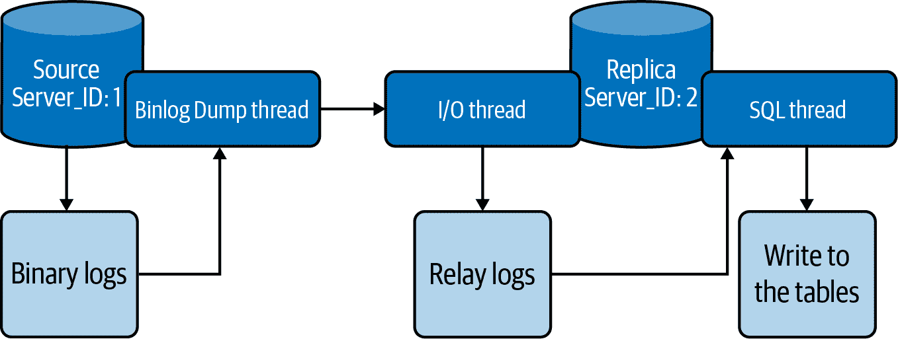
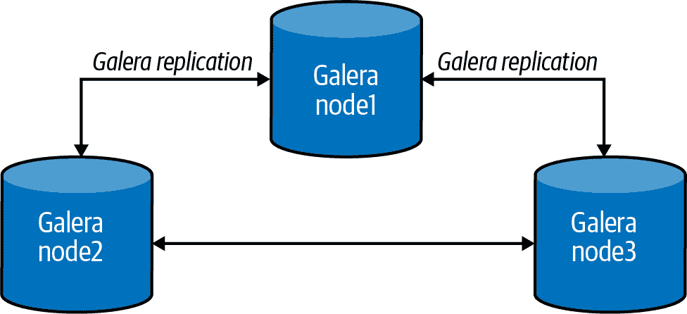

# 第十三章：高可用性

在 IT 上下文中，术语*高可用性*定义了在指定时间内持续运行的状态。目标不是消除失败的风险——那是不可能的。相反，我们试图保证在故障情况下系统仍然可用，以便操作可以继续进行。我们经常根据 100%运行或永不失败的标准来衡量可用性。一个常见的可用性标准被称为*五个 9*，或 99.999%的可用性。两个 9 表示保证 99%的可用性，允许高达 1%的停机时间。在一年的时间内，这将转化为 3.65 天的不可用时间。

*可靠性工程*使用系统设计的三个原则来帮助实现高可用性：消除单点故障（SPOF）、可靠的交叉或故障转移点，以及故障检测能力（包括监控，在第十二章中讨论）。

为了实现高可用性，许多组件都需要冗余。一个简单的例子是具有两个引擎的飞机。如果一台引擎在飞行过程中故障，飞机仍然可以降落在机场。更复杂的例子是核电站，那里有大量冗余的协议和组件，以避免灾难性故障。类似地，为了实现数据库的高可用性，我们需要网络冗余、磁盘冗余、不同的电源供应、多个应用程序和数据库服务器等等。

本章将重点介绍 MySQL 数据库提供的实现高可用性的选项。

# 异步复制

*复制*使得一个 MySQL 数据库服务器（称为*源*）的数据可以复制到一个或多个其他 MySQL 数据库服务器（称为*复制端*）。MySQL 复制默认是异步的。在异步复制中，源服务器将事件写入其二进制日志，复制端在准备好时请求这些事件。不能保证任何事件会到达任何复制端。这是一种松耦合的源/复制端关系，其中以下内容为真：

+   源端不等待复制端追赶。

+   复制端决定从二进制日志中读取多少数据及从哪个点开始读取。

+   复制端在读取或应用更改时可以任意落后于源端。这个问题称为*复制延迟*，我们将探讨减少它的方法。

异步复制提供较低的写入延迟，因为写入在被复制端确认之前由源端本地确认。

MySQL 通过三个主要线程来实现其复制功能，一个在源服务器上，两个在复制端上：

*二进制日志转储线程*

源端创建一个线程，在复制端连接时将二进制日志内容发送到复制端。我们可以在源端的`SHOW PROCESSLIST`输出中识别这个线程为`Binlog Dump`线程。

二进制日志传输线程在读取每个发送到副本的事件时会在源的二进制日志上获取锁定。当源读取事件时，锁定会被释放，甚至在源将事件发送到副本之前。

*复制 I/O 线程*

当我们在副本服务器上执行`START SLAVE`语句时，副本创建一个 I/O 线程连接到源，并请求它发送其二进制日志中记录的更新。

复制 I/O 线程读取源的`Binlog Dump`线程发送的更新（见上一项）并将其复制到本地文件，组成副本的中继日志。

MySQL 在`SHOW SLAVE STATUS`的输出中显示这个线程的状态为`Slave_IO_running`。

*复制 SQL 线程*

副本创建一个 SQL 线程来读取由复制 I/O 线程写入的中继日志，并执行其中包含的事务。

###### 注意

正如在第一章中提到的，Oracle、Percona 和 Maria DB 正在努力删除其产品中带有负面含义的传统术语。文档已经使用了像本书中一样的*源*和*副本*术语，但由于需要保持向后兼容性和对旧版本的支持，不可能在一个发布版中完全更改术语。这是一个持续进行的工作。

在本章后面您将看到提高复制并行性的方法。

图 13-1 展示了 MySQL 复制架构的外观。



###### 图 13-1\. 异步复制架构流程

复制工作是因为写入二进制日志的事件从源读取并在副本上处理，如图 13-1 所示。根据事件类型，事件以不同的格式记录在二进制日志中。MySQL 复制有三种二进制日志格式：

基于行的复制（RBR）

源将事件写入二进制日志，指示如何更改单个表行。将源复制到副本的复制通过复制代表副本表行变更的事件来进行。对于 MySQL 5.7 和 8.0，默认的复制格式如下。

基于语句的复制（SBR）

源将 SQL 语句写入二进制日志。将源复制到副本的复制通过在副本上执行 SQL 语句来进行。

混合复制

您还可以配置 MySQL 以使用基于语句和基于行的混合日志记录，具体取决于哪种日志记录更适合记录更改。使用混合格式日志记录时，默认情况下 MySQL 使用基于语句的日志，但对于某些具有不确定行为的不安全语句，会切换到基于行的日志。例如，假设我们有以下语句：

```
mysql> `UPDATE` `customer` `SET` `last_update``=``NOW``(``)` `WHERE` `customer_id``=``1``;`
```

我们知道函数`NOW()`返回当前日期和时间。想象一下，源服务器延迟 1 秒复制该语句（可能有各种原因，比如副本位于与源不同的大陆）。当副本接收并执行该语句时，函数返回的日期和时间将有 1 秒的差异，导致源和副本之间的数据不一致。在使用混合复制格式时，每当 MySQL 解析类似这样的非确定性函数时，它将将语句转换为基于行的复制。您可以在[文档](https://oreil.ly/RGyxB)中找到 MySQL 认为不安全的其他函数列表。

## 在源和副本上设置基本参数

有一些基本设置我们需要在源服务器和副本服务器上设置，以使复制工作。这些设置对本节中介绍的所有方法都是必需的。

在源服务器上，您必须启用二进制日志记录并定义唯一的服务器 ID。在进行这些更改后（如果尚未完成），您需要重新启动服务器，因为这些参数不是动态的。

###### 提示

服务器 ID 无需按顺序递增或处于任何顺序中，例如源服务器 ID 小于副本服务器 ID。唯一的要求是在复制拓扑中的每个服务器中都是唯一的。

这在*my.cnf*文件中的效果如下：

```
[mysqld]
log-bin=mysql-bin
server-id=1

```

您还需要为每个副本分配一个唯一的服务器 ID。与源服务器一样，如果尚未执行此操作，则需要在为其分配 ID 后重新启动副本服务器。在副本服务器中启用二进制日志不是强制性的，尽管这是一个建议的实践：

```
[mysqld]
log-bin=mysql-replica-bin
server-id=1617565330
binlog_format = ROW
log_slave_updates

```

使用`log_slave_updates`选项告诉副本服务器，来自源服务器的命令应记录到副本自己的二进制日志中。再次强调，这不是强制性的，但作为一个良好的实践建议使用。

每个副本使用 MySQL 用户名和密码连接到源服务器，因此您还需要在源服务器上创建一个用户账号，副本可以使用该账号进行连接（有关此操作的详细信息，请参阅第 317 页的“创建和使用新用户”）。任何账户都可以用于此操作，只要已授予`REPLICATION SLAVE`权限。以下是在源服务器上创建用户的示例：

```
mysql> `CREATE` `USER` `'repl'``@``'%'` `IDENTIFIED` `BY` `'P@ssw0rd!'``;`
mysql> `GRANT` `REPLICATION` `SLAVE` `ON` `*``.``*` `TO` `'repl'``@``'%'``;`
```

###### 提示

如果您正在使用像 Ansible 这样的自动化工具部署 MySQL，您可以使用以下 bash 命令创建服务器 ID：

```
# date '+%s'
```

```
1617565330
```

该命令将当前日期和时间转换为整数值，因此它是单调递增的。请注意，`date`命令不能保证值的唯一性，但您可能会发现它很方便，因为它提供了相对较好的唯一性水平。

在接下来的章节中，您将看到创建复制服务器的不同选项。

## 使用 PerconaXtraBackup 创建副本

正如我们在第十章中看到的，Percona XtraBackup 工具提供了在系统运行时执行 MySQL 数据热备份的方法。它还提供了诸如并行化、压缩和加密等高级功能。

第一步是复制当前源的副本，以便开始我们的复制。XtraBackup 工具执行源的物理备份（参见第 376 页的“物理和逻辑备份”）。我们将使用提供在“Percona XtraBackup”中的命令：

```
# xtrabackup --defaults-file=my.cnf -uroot -p_<password>_ \
    -H *<host>* -P 3306 --backup --parallel=4 \
    --datadir=./data/ --target-dir=./backup/
```

或者，您可以使用`rsync`、NFS 或您感觉舒适的任何其他方法。

一旦 XtraBackup 完成备份，我们将使用`scp`命令将文件发送到副本服务器上的备份目录。在本例中，我们将使用以下命令发送文件：

```
# scp -r ./backup/* *<user>@<host>*:/backup
```

在此时，我们已经完成了源的操作。接下来的步骤将仅在副本服务器上运行。下一步是准备我们的备份：

```
# xtrabackup --prepare --apply-log --target-dir=./
```

一切准备就绪后，我们将移动备份到数据目录：

```
# xtrabackup --defaults-file=/etc/my.cnf --copy-back --target-dir=./backup
```

###### 注意

在继续之前，请验证您的副本服务器的`server_id`与源不相同。如果您按照前一节中概述的步骤操作，应该已经处理过这个问题；如果没有，请立即处理。

在副本上，文件*xtrabackup_binlog_info*的内容将看起来像这样：

```
$ cat /backup/xtrabackup_binlog_info
mysql-bin.000003    156
```

这些信息至关重要，因为它告诉我们从哪里开始复制。请记住，当我们进行备份时，源仍在接收操作，因此我们需要知道备份完成时 MySQL 在二进制日志文件中的位置。

有了这些信息，我们可以运行命令来启动复制。它会看起来像这样：

```
mysql> `CHANGE` `MASTER` `TO` `MASTER_HOST``=``'192.168.1.2'``,` `MASTER_USER``=``'repl'``,`
    -> `MASTER_PASSWORD``=``'P@ssw0rd!'``,`
    -> `MASTER_LOG_FILE``=``'mysql-bin.000003'``,` `MASTER_LOG_POS``=``156``;`
mysql> `START` `SLAVE``;`
```

一旦开始，您可以运行`SHOW SLAVE STATUS`命令来检查复制是否正在工作：

```
mysql> `SHOW` `SLAVE` `STATUS``\``G`

```

```
             Slave_IO_Running: Yes
            Slave_SQL_Running: Yes
                   Last_Errno: 0
                   Last_Error:
                 Skip_Counter: 0
          Exec_Master_Log_Pos: 8332
              Relay_Log_Space: 8752
              Until_Condition: None
        Seconds_Behind_Master: 0
Master_SSL_Verify_Server_Cert: No
                Last_IO_Errno: 0
                Last_IO_Error:
               Last_SQL_Errno: 0
               Last_SQL_Error:
```

重要的是要检查两个线程是否正在运行（`Slave_IO_Running`和`Slave_SQL_Running`），是否有任何错误（`Last_Error`），以及副本落后源的秒数。对于具有密集写入工作负载的大型数据库，副本可能需要一些时间来追赶。

## 使用克隆插件创建副本

MySQL 8.0.17 引入了[克隆插件](https://oreil.ly/fBWth)，它可以用来使一个 MySQL 服务器实例成为另一个的*克隆*。我们将执行`CLONE`语句的服务器实例称为*接收者*，并将接收者将从中克隆数据的源服务器实例称为*捐赠者*。捐赠者实例可以是本地的或远程的。克隆过程通过在捐赠者上创建 InnoDB 存储引擎中存储的数据和元数据的物理快照，并将其传输到接收者来工作。本地和远程实例执行相同的克隆操作；两种选项之间与数据相关的差异。

让我们通过一个真实的例子来详细介绍。我们将沿途向您展示一些额外的细节，例如如何监视长时间运行的`CLONE`命令的进度，克隆所需的权限等等。以下示例使用经典 Shell。我们将在第十六章介绍 MySQL Shell，这是 MySQL 8.0 中引入的。

选择要从中克隆的 MySQL 服务器，并以`root`用户身份连接到它。然后安装克隆插件，创建一个用户以从捐赠服务器传输数据，并授予该用户`BACKUP_ADMIN`权限：

```
mysql> `INSTALL` `PLUGIN` `CLONE` `SONAME` `"mysql_clone.so"``;`
mysql> `CREATE` `USER` `clone_user``@``'%'` `IDENTIFIED` `BY` `"clone_password"``;`
mysql> `GRANT` `BACKUP_ADMIN` `ON` `*``.``*` `to` `clone_user``;`
```

接下来，为了观察克隆操作的进度，我们需要授予该用户权限以查看`performance_schema`数据库和执行函数：

```
mysql> `GRANT` `SELECT` `ON` `performance_schema``.``*` `TO` `clone_user``;`
mysql> `GRANT` `EXECUTE` `ON` `*``.``*` `to` `clone_user``;`
```

现在我们将转向接收服务器。如果您正在配置一个新节点，首先初始化数据目录并启动服务器。

以`root`用户身份连接到接收服务器。然后安装克隆插件，创建一个用户以替换当前实例数据，并授予该用户`CLONE_ADMIN`权限。我们还将提供接收方可以克隆的有效捐赠者列表（这里只有一个）：

```
mysql> `INSTALL` `PLUGIN` `CLONE` `SONAME` `"mysql_clone.so"``;`
mysql> `SET` `GLOBAL` `clone_valid_donor_list` `=` `"127.0.0.1:21122"``;`
mysql> `CREATE` `USER` `clone_user` `IDENTIFIED` `BY` `"clone_password"``;`
mysql> `GRANT` `CLONE_ADMIN` `ON` `*``.``*` `to` `clone_user``;`
```

我们将授予此用户与捐赠方相同的权限，以便在接收方观察进度：

```
mysql> `GRANT` `SELECT` `ON` `performance_schema``.``*` `TO` `clone_user``;`
mysql> `GRANT` `EXECUTE` `ON` `*``.``*` `to` `clone_user``;`
```

现在我们已经准备就绪，是时候开始克隆过程了。请注意，接收方必须能够从捐赠服务器访问。接收方将使用提供的地址和凭据连接到捐赠者并开始克隆：

```
mysql> `CLONE` `INSTANCE` `FROM` `clone_user``@``192``.``168``.``1``.``2``:``3306`
    -> `IDENTIFIED` `BY` `"clone_password"``;`
```

为了使克隆操作成功，接收方必须关闭并重新启动自身。我们可以使用以下查询监视进度：

```
SELECT STAGE, STATE, CAST(BEGIN_TIME AS TIME) as "START TIME",
CASE WHEN END_TIME IS NULL THEN
LPAD(sys.format_time(POWER(10,12) * (UNIX_TIMESTAMP(now()) -
    UNIX_TIMESTAMP(BEGIN_TIME))), 10,' *)
ELSE
LPAD(sys.format_time(POWER(10,12) * (UNIX_TIMESTAMP(END_TIME) -
    UNIX_TIMESTAMP(BEGIN_TIME))), 10,* *)
END AS DURATION,
LPAD(CONCAT(FORMAT(ROUND(ESTIMATE/1024/1024,0), 0)," MB"), 16,* *)
AS "Estimate",
CASE WHEN BEGIN_TIME IS NULL THEN LPAD('0%*, 7, ' *)
WHEN ESTIMATE > 0 THEN
LPAD(CONCAT(CAST(ROUND(DATA*100/ESTIMATE, 0) AS BINARY), "%"), 7, ' ')
WHEN END_TIME IS NULL THEN LPAD('0%*, 7, ' *)
ELSE LPAD('100%*, 7, ' ') END AS "Done(%)"
from performance_schema.clone_progress;
```

这将允许我们观察克隆过程的每个状态。输出将类似于这样：

```
+-----------+-----------+------------+-----------+----------+---------+
| STAGE     | STATE     | START TIME | DURATION  | Estimate | Done(%) |
+-----------+-----------+------------+-----------+----------+---------+
| DROP DATA | Completed | 14:44:46   |    1.33 s |     0 MB | 100%    |
+-----------+-----------+------------+-----------+----------+---------+
| FILE COPY | Completed | 14:44:48   |    5.62 s | 1,511 MB | 100%    |
+-----------+-----------+------------+-----------+----------+---------+
| PAGE COPY | Completed | 14:44:53   |  95.06 ms |     0 MB | 100%    |
+-----------+-----------+------------+-----------+----------+---------+
| REDO COPY | Completed | 14:44:54   |  99.71 ms |     0 MB | 100%    |
+-----------+-----------+------------+-----------+----------+---------+
| FILE SYNC | Completed | 14:44:54   |    6.33 s |     0 MB | 100%    |
+-----------+-----------+------------+-----------+----------+---------+
| RESTART   | Completed | 14:45:00   |    4.08 s |     0 MB | 100%    |
+-----------+-----------+------------+-----------+----------+---------+
| RECOVERY  | Completed | 14:45:04   | 516.86 ms |     0 MB | 100%    |
+-----------+-----------+------------+-----------+----------+---------+
7 rows in set (0.08 sec)
```

正如前面提到的，在最后会有一个重启。请注意，复制尚未启动。

除了克隆数据之外，克隆操作还会从捐赠服务器提取二进制日志位置和 GTID，并将它们传输给接收方。我们可以在捐赠服务器上执行以下查询，以查看最后一次应用的二进制日志位置或 GTID：

```
mysql> `SELECT` `BINLOG_FILE``,` `BINLOG_POSITION` `FROM` `performance_schema``.``clone_status``;`
```

```
+------------------+-----------------+
| BINLOG_FILE      | BINLOG_POSITION |
+------------------+-----------------+
| mysql-bin.000002 |       816804753 |
+------------------+-----------------+
1 row in set (0.01 sec)
```

```
mysql> `SELECT` `@``@``GLOBAL``.``GTID_EXECUTED``;`
```

```
+------------------------+
| @@GLOBAL.GTID_EXECUTED |
+------------------------+
|                        |
+------------------------+
1 row in set (0.00 sec)
```

在本例中，我们未使用 GTID，因此该查询不会返回任何内容。接下来，我们将运行命令以启动复制：

```
mysql> `CHANGE` `MASTER` `TO` `MASTER_HOST` `=` `'192.168.1.2'``,` `MASTER_PORT` `=` `3306``,`
    -> `MASTER_USER` `=` `'repl'``,` `MASTER_PASSWORD` `=` `'P@ssw0rd!'``,`
    -> `MASTER_LOG_FILE` `=` `'mysql-bin.000002'``,`
    -> `MASTER_LOG_POSITION` `=` `816804753``;`
mysql> `START` `SLAVE``;`

```

如前所述，我们可以通过运行`SHOW SLAVE STATUS`命令来检查复制是否正常工作。

这种方法的优点是克隆插件自动化整个过程，只有在最后需要执行`CHANGE MASTER`命令。缺点是该插件仅适用于 MySQL 8.0.17 及更高版本。虽然它仍然相对较新，但我们相信在未来几年，这个过程可能会成为默认设置。

## 使用 mysqldump 创建一个副本

这是我们可能称之为经典方法。对于那些刚开始使用 MySQL 并且仍在学习生态系统的人来说，这是一个典型的选择。通常情况下，我们假设您已经在“在源和复制品上设置基本参数”中执行了必要的设置。

让我们看一个使用`mysqldump`创建新复制品的示例。我们将从源服务器执行备份：

```
# mysqldump -uroot -p<*password*> --single-transaction \
    --all-databases --routines --triggers --events \
    --master-data=2 > backup.sql

```

如果在结尾出现`Dump completed`消息，则备份成功：

```
# tail -1f backup.sql
```

```
-- Dump completed on 2021-04-26 20:16:33
```

完成备份后，我们需要在复制服务器中导入它。例如，您可以使用以下命令：

```
$ mysql < backup.sql
```

完成后，您需要使用从备份中提取的坐标执行`CHANGE MASTER`命令（有关`mysqldump`的更多详细信息，请重访“mysqldump 程序”）。因为我们使用了`--master-data=2`选项，信息将写入备份的开头。例如：

```
$ head -n 35 out
-- MySQL dump 10.13  Distrib 5.7.31-34, for Linux (x86_64)
--
-- Host: 127.0.0.1    Database:
-- ------------------------------------------------------
-- Server version   5.7.33-log

...

--
-- Position to start replication or point-in-time recovery from
--

-- CHANGE MASTER TO MASTER_LOG_FILE='mysql-bin.000001', MASTER_LOG_POS=4089;
```

或者，如果您使用 GTIDs：

```
--
-- GTID state at the beginning of the backup
-- (origin: @@global.gtid_executed)
--

SET @@GLOBAL.GTID_PURGED=*00048008-1111-1111-1111-111111111111:1-16*;
```

接下来，我们将执行启动复制的命令。对于 GTID 场景，它看起来像这样：

```
mysql> `CHANGE` `MASTER` `TO` `MASTER_HOST``=``'192.168.1.2'``,` `MASTER_USER``=``'repl'``,`
    -> `MASTER_PASSWORD` `=` `'P@ssw0rd!'``,` `MASTER_AUTO_POSITION``=``1``;`
mysql> `START` `SLAVE``;`
```

对于传统复制，您可以从先前提取的二进制日志文件位置开始复制，如下所示：

```
mysql> `CHANGE` `MASTER` `TO` `MASTER_LOG_FILE``=``'mysql-bin.000001'``,` `MASTER_LOG_POS``=``4089``,`
    -> `MASTER_HOST``=``'192.168.1.2'``,` `MASTER_USER``=``'repl'``,`
    -> `MASTER_PASSWORD``=``'P@ssw0rd!'``;`
mysql> `START` `SLAVE``;`
```

要验证复制是否正常工作，请执行`SHOW SLAVE STATUS`命令。

## 使用 mydumper 和 myloader 创建复制品

`mysqldump`是初学者执行备份和构建复制品最常用的工具。但是有一种更有效的方法：`mydumper`。与`mysqldump`类似，这个工具生成逻辑备份，并可用于创建数据库的一致备份。`mydumper`与`mysqldump`的主要区别在于，配合`myloader`使用时，`mydumper`可以并行进行数据的导出和导入，从而提高了备份和特别是恢复的时间。想象一下，如果您的数据库有 500GB 的备份。使用`mysqldump`，您将得到一个巨大的单一文件。而使用`mydumper`，您将得到每个表一个文件，允许稍后并行执行恢复过程。

### 设置 mydumper 和 myloader 实用工具

您可以直接在源服务器上或从另一台服务器上运行`mydumper`，通常后者更好，因为它会避免在同一服务器上写入备份文件的存储系统开销。

要安装`mydumper`，请下载适用于您正在使用的操作系统版本的软件包。您可以在[`mydumper` GitHub 仓库](https://oreil.ly/7hakG)中找到发布版本。我们来看一个 CentOS 的例子：

```
# yum install https://github.com/maxbube/mydumper/releases/download/v0.10.3/ \
mydumper-0.10.3-1.el7.x86_64.rpm -y
```

现在您应该在服务器上安装了`mydumper`和`myloader`命令。您可以通过以下方式验证：

```
$ mydumper --version
mydumper 0.10.3, built against MySQL 5.7.33-36

$ myloader --version
myloader 0.10.3, built against MySQL 5.7.33-36
```

### 从源中提取数据

下面的命令将执行所有数据库（除了`mysql`、`test`和`sys`模式）的备份，使用 15 个并发线程，还将包括触发器、视图和函数：

```
# mydumper --regex '^(?!(mysql\.|test\.|sys\.))' --threads=15
--user=learning_user --password='learning_mysql' --host=192.168.1.2 \
    --port=3306 --trx-consistency-only --events --routines --triggers \
    --compress --outputdir /backup --logfile /tmp/log.out --verbose=2

```

###### 提示

您需要至少授予`mydumper`用户`SELECT`和`RELOAD`权限。

如果检查输出目录（`outputdir`），你会看到压缩文件。以下是作者其中一台机器上的输出：

```
# ls -l backup/
total 5008
-rw...1 vinicius.grippa percona   182 May  1 19:30 metadata
-rw...1 vinicius.grippa percona   258 May  1 19:30 sysbench.sbtest10-schema.sql.gz
-rw...1 vinicius.grippa percona 96568 May  1 19:30 sysbench.sbtest10.sql.gz
-rw...1 vinicius.grippa percona   258 May  1 19:30 sysbench.sbtest11-schema.sql.gz
-rw...1 vinicius.grippa percona 96588 May  1 19:30 sysbench.sbtest11.sql.gz
-rw...1 vinicius.grippa percona   258 May  1 19:30 sysbench.sbtest12-schema.sql.gz
...

```

###### 提示

根据数据库服务器和服务器负载的 CPU 核心数来决定线程数量。并行转储可能会消耗大量服务器资源。

### 在副本服务器中恢复数据

像使用`mysqldump`一样，我们需要确保副本 MySQL 实例已经正常运行。一旦数据准备好导入，我们可以执行以下命令：

```
# myloader --user=learning_user --password='learning_mysql'
--threads=25 --host=192.168.1.3 --port=3306
--directory=/backup --overwrite-tables --verbose 3

```

### 建立复制关系

现在我们已经恢复了数据，我们将设置复制。我们需要找到备份开始时的正确二进制日志位置。这些信息存储在`mydumper`元数据文件中：

```
$ cat backup/metadata
Started dump at: 2021-05-01 19:30:00
SHOW MASTER STATUS:
    Log: mysql-bin.000002
    Pos: 9530779
    GTID:00049010-1111-1111-1111-111111111111:1-319

Finished dump at: 2021-05-01 19:30:01

```

现在，我们就像之前对`mysqldump`所做的那样，简单地执行`CHANGE MASTER`命令：

```
mysql> `CHANGE` `MASTER` `TO` `MASTER_HOST``=``'192.168.1.2'``,` `MASTER_USER``=``'repl'``,`
    -> `MASTER_PASSWORD``=``'P@ssw0rd!'``,`  `MASTER_LOG_FILE``=``'mysql-bin.000002'``,`
    -> `MASTER_LOG_POS``=``9530779``,` `MASTER_PORT``=``49010``;`
mysql> `START` `SLAVE``;`
```

## Group Replication

将 Group Replication 包含在异步复制组中可能会有点有争议。这种选择的简短解释是 Group Replication 是异步的。这里的混淆可以通过与 Galera 的比较来解释（见“Galera/PXC Cluster”），Galera 声称是同步或准同步的。

更详细的理由是这取决于我们如何定义复制。在 MySQL 世界中，我们将复制定义为使一个数据库（源）中进行的更改自动复制到另一个数据库（副本）中的过程。整个过程涉及五个不同的步骤：

1.  在源上局部应用变更

1.  生成 binlog 事件

1.  将 binlog 事件发送到副本

1.  将 binlog 事件添加到副本的 relay log 中

1.  在副本上应用来自 relay log 的 binlog 事件

在 MySQL Group Replication 和 Galera 中（即使 Galera 缓存主要替换了 binlog 和 relay log 文件），只有第三步是同步的——将二进制日志事件（或在 Galera 中的写集）流式传输到副本。

因此，尽管将数据发送（复制/流式传输）到其他服务器的过程是同步的，但对这些更改的应用仍然完全是异步的。

###### 提示

Group Replication 自 MySQL 5.7 起就已经可用。然而，当产品发布时，它的成熟度不够，导致持续的性能问题和崩溃。如果您想测试 Group Replication，我们强烈建议使用 MySQL 8.0 版本。

### 安装 Group Replication

与 Galera 相比，Group Replication 的第一个优点是您无需安装不同的二进制文件。MySQL Server 提供 Group Replication 作为插件。它还适用于 Oracle MySQL 和 Percona Server for MySQL；有关安装这些的详细信息，请参见第一章。

要确认 Group Replication 插件是否已启用，请运行以下查询：

```
mysql> `SELECT` `PLUGIN_NAME``,` `PLUGIN_STATUS``,` `PLUGIN_TYPE`
    -> `FROM` `INFORMATION_SCHEMA``.``PLUGINS`
    -> `WHERE` `PLUGIN_NAME` `LIKE` `'group_replication'``;`
```

输出应该显示`ACTIVE`，如你在这里所见：

```
+-------------------+---------------+-------------------+
| PLUGIN_NAME       | PLUGIN_STATUS | PLUGIN_TYPE       |
+-------------------+---------------+-------------------+
| group_replication | ACTIVE        | GROUP REPLICATION |
+-------------------+---------------+-------------------+
1 row in set (0.00 sec)
```

如果未安装插件，请运行以下命令进行安装：

```
mysql> `INSTALL` `PLUGIN` `group_replication` `SONAME` `'group_replication.so'``;`
```

在插件激活的情况下，我们将在服务器上设置启动 Group Replication 所需的最小参数。在服务器 1 上打开*my.cnf*并添加以下内容：

```
[mysqld]
server_id=175907211
log-bin=mysqld-bin
enforce_gtid_consistency=ON
gtid_mode=ON
log-slave-updates
transaction_write_set_extraction=XXHASH64
master_info_repository=TABLE
relay_log_info_repository=TABLE
binlog_checksum=NONE
```

让我们逐个讨论这些参数：

`server_id`

与传统复制类似，此参数有助于使用唯一 ID 标识组中的每个成员。每个参与 Group Replication 的服务器必须使用不同的值。

`log_bin`

在 MySQL 8.0 中，默认启用此参数。它负责记录数据库中的所有更改到二进制日志文件中。

`enforce_gtid_consistency`

此值必须设置为`ON`，以指示 MySQL 执行事务安全语句，确保在复制数据时的一致性。

`gtid_mode`

当设置为`ON`时，此指令启用基于全局事务标识符的日志记录。Group Replication 需要此功能。

`log_slave_updates`

此值设置为`ON`以允许成员记录彼此的更新。换句话说，此指令将复制服务器链接在一起。

`transaction_write_set_extraction`

这指示 MySQL 服务器收集写集并使用哈希算法对其进行编码。在这种情况下，我们使用 XXHASH64 算法。写集由每个记录上的主键定义。

`master_info_repository`

当设置为`TABLE`时，此指令允许 MySQL 将源二进制日志文件和位置的详细信息存储到表中，而不是文件中，以便通过 InnoDB 的 ACID 属性实现更快的复制和保证一致性。在 MySQL 8.0.23 中，这是默认设置，`FILE`选项已不推荐使用。

`relay_log_info_repository`

当设置为`TABLE`时，此配置指示 MySQL 将复制信息存储为 InnoDB 表。在 MySQL 8.0.23 中，这是默认设置，`FILE`选项已不推荐使用。

`binlog_checksum`

将此设置为`NONE`告诉 MySQL 不要为二进制日志中的每个事件写入校验和。服务器将在写入时通过检查其长度来验证事件。在 MySQL 8.0.20 及更早版本中，Group Replication 无法使用校验和。如果您正在使用更新版本并希望使用校验和，可以省略此设置并使用默认的`CRC32`。

接下来，我们将添加一些特定于 Group Replication 的参数：

```
[mysqld]

loose-group_replication_group_name="8dc32851-d7f2-4b63-8989-5d4b467d8251"
loose-group_replication_start_on_boot=OFF
loose-group_replication_local_address="10.124.33.139:33061"
loose-group_replication_group_seeds="10.124.33.139:33061,
10.124.33.90:33061, 10.124.33.224:33061"
loose-group_replication_bootstrap_group=OFF
bind-address = "0.0.0.0"
report_host = "10.124.33.139"
```

###### 注意

我们使用`loose-`前缀来指示服务器在尚未安装和配置 MySQL Group Replication 插件时启动，避免在完成所有设置之前遇到服务器错误。

让我们看看每个参数的作用：

`group_replication_group_name`

这是我们正在创建的组的名称。我们将使用内置的 Linux `uuidgen`命令生成通用唯一标识符(UUID)。它产生如下输出：

```
$ uuidgen

```

```
8dc32851-d7f2-4b63-8989-5d4b467d8251
```

`group_replication_start_on_boot`

当设置为`OFF`时，此值指示插件在服务器启动时不自动开始工作。在完成所有组成员的配置后，您可以将此值设置为`ON`。

`loose-group_replication_local_address`

这是用于与组中其他 MySQL 服务器成员通信的内部 IP 地址和端口组合。Group Replication 推荐的端口是 33061。

`group_replication_group_seeds`

这配置了参与组复制的成员的 IP 地址或主机名，以及它们的通信端口。新成员使用该值来加入组。

`group_replication_bootstrap_group`

此选项指示服务器是否创建组。我们将仅在服务器 1 上按需启用此选项，以避免创建多个组。因此，暂时保持关闭状态。

`bind_address`

`0.0.0.0`的值告诉 MySQL 监听所有网络。

`report_host`

这是组成员在注册组时彼此报告的 IP 地址或主机名。

### 设置 MySQL 组复制

首先，我们将设置`group_replication_recovery`通道。MySQL 组复制使用此通道在成员之间传输事务。因此，我们必须在每个服务器上为复制用户设置`REPLICATION SLAVE`权限。

因此，在服务器 1 上，登录 MySQL 控制台并执行以下命令：

```
mysql> `SET` `SQL_LOG_BIN``=``0``;`
mysql> `CREATE` `USER` `replication_user``@``'%'` `IDENTIFIED` `BY` `'P@ssw0rd!'``;`
mysql> `GRANT` `REPLICATION` `SLAVE` `ON` `*``.``*` `TO` `'replication_user'``@``'%'``;`
mysql> `FLUSH` `PRIVILEGES``;`
mysql> `SET` `SQL_LOG_BIN``=``1``;`

```

我们首先将`SQL_LOG_BIN`设置为`0`，以防止新用户的详细信息记录到二进制日志中，然后在最后重新启用它。

要指示 MySQL 服务器使用我们为`group_replication_recovery`通道创建的复制用户，运行以下命令：

```
mysql> `CHANGE` `MASTER` `TO` `MASTER_USER``=``'replication_user'``,`
    -> `MASTER_PASSWORD``=``'P@ssw0rd!'` `FOR` `CHANNEL`
    -> `'group_replication_recovery'``;`

```

这些设置将允许加入组的成员运行分布式恢复过程，使其达到与其他成员（提供者）相同的状态。

现在我们将在服务器 1 上启动组复制服务。我们将使用以下命令引导组：

```
mysql> `SET` `GLOBAL` `group_replication_bootstrap_group``=``ON``;`
mysql> `START` `GROUP_REPLICATION``;`
mysql> `SET` `GLOBAL` `group_replication_bootstrap_group``=``OFF``;`
```

为了避免启动更多的组，我们在成功启动组后将`group_replication_bootstrap_group`设置回`OFF`。

要检查新成员的状态，请使用此命令：

```
mysql> `SELECT` `*` `FROM` `performance_schema``.``replication_group_members``;`

```

```
+---------------------------+--------------------------------------+...
| CHANNEL_NAME              | MEMBER_ID                            |...
+---------------------------+--------------------------------------+...
| group_replication_applier | d58b2766-ab90-11eb-ba00-00163ed02a2e |...
+-------------+-------------+--------------+-------------+---------+...
...+---------------+-------------+--------------+-------------+----------------+
...| MEMBER_HOST   | MEMBER_PORT | MEMBER_STATE | MEMBER_ROLE | MEMBER_VERSION |
...+---------------+-------------+--------------+-------------+----------------+
...| 10.124.33.139 |        3306 | ONLINE       | PRIMARY     | 8.0.22         |
...+---------------+-------------+--------------+-------------+----------------+
1 row in set (0.00 sec)
```

很好。到目前为止，我们已经引导并初始化了一个组成员。让我们继续进行第二台服务器的设置。确保您已安装与服务器 1 相同的 MySQL 版本，并将以下设置添加到*my.cnf*文件中：

```
[mysqld]
loose-group_replication_group_name="8dc32851-d7f2-4b63-8989-5d4b467d851"
loose-group_replication_start_on_boot=OFF
loose-group_replication_local_address="10.124.33.90:33061"
loose-group_replication_group_seeds="10.124.33.139:33061,
10.124.33.90:33061, 10.124.33.224:33061"
loose-group_replication_bootstrap_group=OFF
bind-address = "0.0.0.0"
```

我们修改的只是`group_replication_local_address`；其他设置保持不变。请注意，其他 MySQL 配置对于服务器 2 也是必需的，我们强烈建议在所有节点上保持它们相同。

配置完成后，重新启动 MySQL 服务：

```
# systemctl restart mysqld
```

在服务器 2 上执行以下命令配置恢复用户的凭据：

```
mysql> `SET` `SQL_LOG_BIN``=``0``;`
mysql> `CREATE` `USER` `'replication_user'``@``'%'` `IDENTIFIED` `BY` `'P@ssw0rd!'``;`
mysql> `GRANT` `REPLICATION` `SLAVE` `ON` `*``.` TO 'replication_user'@'%';*
mysql> `SET` `SQL_LOG_BIN``=``1``;`
mysql> `CHANGE` `MASTER` `TO` `MASTER_USER``=``'replication_user'``,`
`MASTER_PASSWORD``=``'PASSWORD'` `FOR` `CHANNEL`
`'group_replication_recovery'``;`
```

接下来，将服务器 2 添加到之前引导引导的组中：

```
mysql> `START` `GROUP_REPLICATION``;`
```

并运行查询以检查成员的状态：

```
mysql> `SELECT` `*` `FROM` `performance_schema``.``replication_group_members``;`

```

```
+---------------------------+--------------------------------------+...
| CHANNEL_NAME              | MEMBER_ID                            |...
+---------------------------+--------------------------------------+...
| group_replication_applier | 9e971ba0-ab9d-11eb-afc6-00163ec43109 |...
| group_replication_applier | d58b2766-ab90-11eb-ba00-00163ed02a2e |...
+-------------+-------------+--------------+-------------+---------+...
...+---------------+-------------+--------------+...
...| MEMBER_HOST   | MEMBER_PORT | MEMBER_STATE |...
...+---------------+-------------+--------------+...
...| 10.124.33.90  |        3306 | ONLINE       |...
...| 10.124.33.139 |        3306 | ONLINE       |...
...+---------------+-------------+--------------+...
...+-------------+----------------+
...| MEMBER_ROLE | MEMBER_VERSION |
...+-------------+----------------+
...| SECONDARY   | 8.0.22         |
...| PRIMARY     | 8.0.22         |
...+-------------+----------------+
2 rows in set (0.00 sec)
```

现在，您可以为服务器 3 执行与服务器 2 相同的步骤，再次更新本地地址。完成后，您可以通过插入一些虚拟数据来验证所有服务器是否响应：

```
mysql> `CREATE` `DATABASE` `learning_mysql``;`

```

```
Query OK, 1 row affected (0.00 sec)
```

```
mysql> `USE` `learning_mysql`

```

```
Database changed
```

```
mysql> `CREATE` `TABLE` `test` `(``i` `int` `primary` `key``)``;`

```

```
Query OK, 0 rows affected (0.01 sec)
```

```
mysql> `INSERT` `INTO` `test` `VALUES` `(``1``)``;`

```

```
Query OK, 1 row affected (0.00 sec)
```

然后连接到其他服务器，查看是否可以可视化数据。

# 同步复制

Galera 集群使用同步复制，其中我们有多个 MySQL 服务器，但它们对应用程序而言作为单个实体。图 13-2 说明了一个具有三个节点的 Galera 集群的拓扑。



###### 图 13-2\. 在 Galera 集群中，所有节点彼此通信

同步和异步复制的主要区别在于，同步复制保证如果集群中的一个节点发生更改，则其他节点中也会同步或同时发生相同的更改。异步复制则不对在源节点应用更改和在复制节点传播更改之间的延迟做任何保证。异步复制的延迟可以很短也可以很长。这也意味着如果异步复制拓扑中的源节点崩溃，可能会丢失一些最新的更改。这些源和复制的概念在 Galera 集群中不存在。所有节点都可以接收读取和写入。

理论上，同步复制比异步复制具有几个优势：

+   使用同步复制的集群始终高可用。如果其中一个节点崩溃，则不会丢失数据。此外，所有集群节点始终保持一致。

+   使用同步复制的集群允许事务在所有节点上并行执行。

+   使用同步复制的集群可以保证整个集群的因果关系。这意味着如果在一个集群节点上执行事务后在另一个集群节点上执行`SELECT`，它应该能看到该事务的效果。

然而，同步复制也有缺点。传统上，急切的复制协议一次协调一个节点的操作，使用两阶段提交或分布式锁定。增加集群中节点的数量会导致事务响应时间增加，节点之间的冲突和死锁的概率增加。这是因为所有节点都需要认证事务并回复 OK 消息。

因此，异步复制出于数据库性能、可伸缩性和可用性的原因仍然是主要的复制协议。不理解或低估同步复制的影响是某些公司放弃使用 Galera 集群并回到使用异步复制的原因之一。

在撰写本文时，有两家公司支持 Galera 集群：Percona 和 MariaDB。以下示例显示如何设置 Percona XtraDB Cluster。

## Galera/PXC 集群

安装 Percona XtraDB Cluster（PXC）与安装 Percona Server 类似（区别在于软件包），因此我们不会深入讨论所有平台的详细信息。您可能希望重新访问第一章以审查安装过程。我们将在此处遵循的配置过程假定有三个 PXC 节点。

表 13-1\. 三个 PXC 节点

| 节点 | 主机 | IP |
| --- | --- | --- |
| 节点 1 | pxc1 | 172.16.2.56 |
| 节点 2 | pxc2 | 172.16.2.198 |
| 节点 3 | pxc3 | 172.16.3.177 |

连接到其中一个节点并安装存储库：

```
# `yum install https://repo.percona.com/yum/percona-release-latest.noar` `ch``.``rpm` `-``y`
```

安装存储库后，安装二进制文件：

```
# `yum install Percona-XtraDB-Cluster-57 -y`
```

接下来，您可以应用您将用于常规 MySQL 进程的典型配置（参见第十一章）。完成更改后，启动`mysqld`进程并获取临时密码：

```
# 'systemctl start mysqld'
# 'grep temporary password'/var/log/mysqld.log'

```

使用以前的密码作为`root`登录并更改密码：

```
$ mysql -u root -p
```

```
mysql> `ALTER` `USER` `'root'``@``'localhost'` `IDENTIFIED` `BY` `'P@ssw0rd!'``;`

```

停止`mysqld`进程：

```
# systemctl stop mysql

```

重复前面的步骤，对其他两个节点执行相同操作。

二进制文件和基本配置就绪后，我们可以开始配置集群参数。

我们需要将以下配置变量添加到第一个节点的*/etc/my.cnf*中：

```
[mysqld]
 wsrep_provider=/usr/lib64/galera3/libgalera_smm.so
 wsrep_cluster_name=pxc-cluster
 wsrep_cluster_address=gcomm://172.16.2.56,172.16.2.198,172.16.3.177

 wsrep_node_name=pxc1
 wsrep_node_address=172.16.2.56

 wsrep_sst_method=xtrabackup-v2
 wsrep_sst_auth=sstuser:P@ssw0rd!

 pxc_strict_mode=ENFORCING

 binlog_format=ROW
 default_storage_engine=InnoDB
 innodb_autoinc_lock_mode=2
```

使用相同的配置来配置第二和第三个节点，除了`wsrep_node_name`和`wsrep_node_address`变量。

对于第二个节点，请使用：

```
wsrep_node_name=pxc2
wsrep_node_address=172.16.2.198
```

对于第三个节点，请使用：

```
wsrep_node_name=pxc3
wsrep_node_address=172.16.3.177
```

像常规的 MySQL 一样，Percona XtraDB Cluster 有许多可配置参数，我们展示的是启动集群所需的最小设置。我们正在配置节点的名称和 IP 地址，集群地址以及在节点之间进行内部通信时将使用的用户。您可以在[文档](https://oreil.ly/Ap8Rr)中找到更详细的信息。

我们此时已经配置了所有节点，但是任何节点上都没有运行`mysqld`进程。PXC 要求您在其他节点可以加入并形成集群之前，首先启动一个节点作为其他节点的参考点。此节点必须以*bootstrap*模式启动。引导是将一个服务器作为主要组件引入的初始步骤，以便其他服务器可以使用它作为同步数据的参考点。

使用以下命令启动第一个节点：

```
# systemctl start mysql@bootstrap
```

在将其他节点添加到新集群之前，请连接到刚刚启动的节点，为 State Snapshot Transfer（SST）创建一个用户，并为其提供必要的权限。凭据必须与您之前设置的`wsrep_sst_auth`配置中指定的凭据匹配：

```
mysql> `CREATE` `USER` `'sstuser'``@``'localhost'` `IDENTIFIED` `BY` `'P@ssw0rd!'``;`
mysql> `GRANT` `RELOAD``,` `LOCK` `TABLES``,` `PROCESS``,` `REPLICATION` `CLIENT` `ON` `.`
    -> `TO` `'sstuser'``@``'localhost'``;`
mysql> `FLUSH` `PRIVILEGES``;`
```

###### 注意

集群使用 SST 过程通过从一个节点向另一个节点传输完整数据副本来配置节点。当新节点加入集群时，新节点会启动 SST 以将其数据与已经是集群成员的节点同步。

然后，您可以正常初始化其他节点：

```
# systemctl start mysql
```

要验证集群是否正常运行，我们可以执行一些检查，如在第一个节点上创建一个数据库，在第二个节点上创建一个表并插入一些数据，并在第三个节点上检索该表中的一些行。首先，在第一个节点（`pxc1`）上创建数据库：

```
mysq> `CREATE` `DATABASE` `learning_mysql``;`

```

```
Query ok, 1 row affected (0.01 sec)
```

在第二个节点（`pxc2`）上创建一个表并插入一些数据：

```
mysql> `USE` `learning_mysql``;`

```

```
Database changed
```

```
mysql> `CREATE` `TABLE` `example` `(``node_id` `INT` `PRIMARY` `KEY``,` `node_name` `VARCHAR``(``30``)``)``;`

```

```
Query ok, 0 rows affected (0.05 sec)
```

```
mysql> `INSERT` `INTO` `learning_mysql``.``example` `VALUES` `(``1``,` `"Vinicius1"``)``;`

```

```
Query OK, 1 row affected (0.02 sec)
```

然后在第三个节点上检索该表中的一些行：

```
mysql> `SELECT` `*` `FROM` `learning_mysql``.``example``;`
```

```
+---------+-----------+
| node_id | node_name |
+---------+-----------+
|       1 | Vinicius1 |
+---------+-----------+
1 row in set (0.00 sec)
```

另一个更优雅的解决方案是检查`wsrep_%`全局状态变量，特别是`wsrep_cluster_size`和`wsrep_cluster_status`：

```
mysql> `SHOW` `GLOBAL` `STATUS` `LIKE` `'wsrep_cluster_size'``;`

```

```
+--------------------+-------+
| Variable_name      | Value |
+--------------------+-------+
| wsrep_cluster_size | 3     |
+--------------------+-------+
1 row in set (0.00 sec)
```

```
mysql> `SHOW` `GLOBAL` `STATUS` `LIKE` `'wsrep_cluster_status'``;`

```

```
+----------------------+---------+
| Variable_name        | Value   |
+----------------------+---------+
| wsrep_cluster_status | Primary |
+----------------------+---------+
1 row in set (0.00 sec)
```

这些命令的输出告诉我们，集群有三个节点，并处于主状态（可以接收读取和写入）。

除了使用 Galera 集群外，您可能考虑同时使用 ProxySQL 来确保应用程序的透明性（见第十五章）。

本章的目标只是让您熟悉不同的拓扑结构，以便您知道它们的存在。集群维护和优化是超出本书范围的高级主题。
