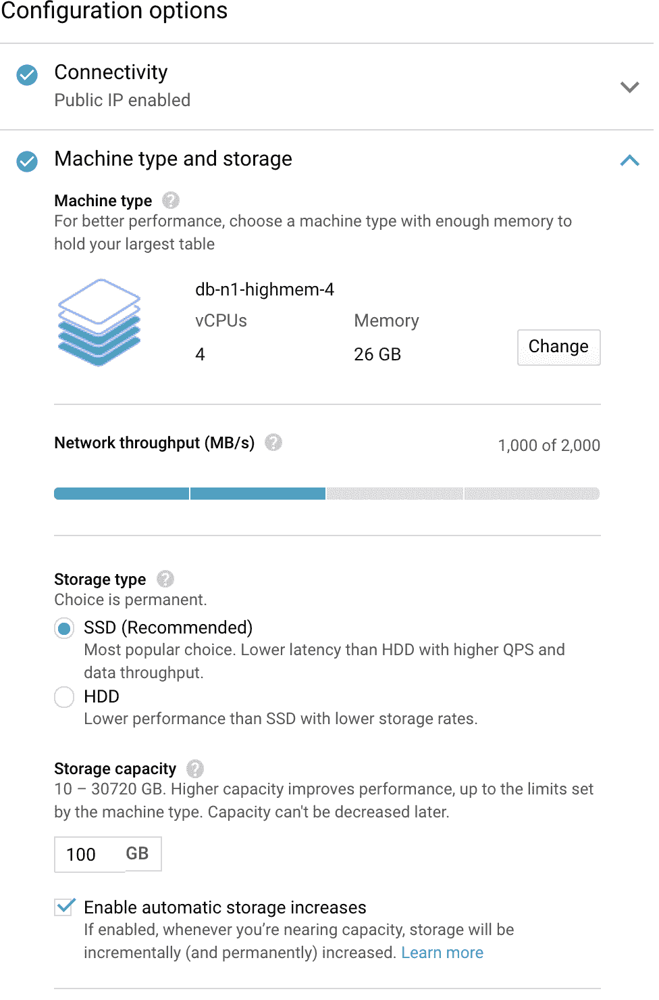

# 第十四章：云中的 MySQL

“不用担心，这都在云端”是我们经常听到的一句话。这让我们想起一个关于一位女士的故事，她担心她的 iPhone 在马桶里淹没后丢失了多年的家庭和旅行照片。令她惊讶的是，当她买了新手机时，设备“恢复”了所有照片。她正在使用苹果的 iCloud 备份解决方案将设备内容备份到云端。（她可能另一个惊讶是她没意识到自己在支付服务订阅账单。）

作为计算机工程师，我们不能冒险是否能够恢复数据。云存储是一种可扩展和可靠的解决方案。在本章中，我们将讨论公司在云中使用 MySQL 的几种选择。这些选择从易于扩展并提供自动备份和高可用性功能的数据库即服务（DBaaS）选项到提供更精细控制的传统选择，如 EC2 实例。一般来说，初创公司，其核心业务不是技术，更倾向于使用 DBaaS 选项，因为这些选项更易于实施和使用。另一方面，那些需要更严格控制其数据的公司可能更喜欢使用 EC2 实例或自己的云基础设施。

# 数据库即服务（DBaaS）

DBaaS 是一种外包选项，公司支付云提供商来为他们启动和维护云数据库。付款通常是按使用量计算，数据所有者可以随意访问他们的应用数据。DBaaS 提供与标准关系型或非关系型数据库相同的功能。对于那些试图避免配置、维护和升级数据库和服务器的公司来说，它通常是一个不错的解决方案（尽管这并不总是正确的）。DBaaS 属于软件即服务（SaaS）的范畴，类似于平台即服务（PaaS）和基础设施即服务（IaaS），在这些服务中，像数据库这样的产品成为服务。

## Amazon RDS for MySQL/MariaDB

最受欢迎的 DBaaS 是 Amazon RDS for MySQL。开始使用 RDS 几乎就像在网站上配置新车一样。您选择主产品，并添加您想要的选项，直到它看起来您喜欢的样子，然后启动。图 14-1 展示了可用的产品。在本例中，我们将选择 MySQL（MariaDB 版本的部署设置类似）。


###### 图 14-1\. 选择产品

我们还可以选择版本——在这里，我们选择了 8.0.21\. 接下来，我们需要设置主用户（类似于 `root`）及其密码。确保选择一个强密码，特别是如果您将数据库暴露给公众。图 14-2 展示了如何定义主用户的用户名和密码。


###### 图 14-2\. 配置主用户的用户名和密码

接下来是实例大小，这将直接影响最终价格。我们将选择一个顶级配置，以便让您了解使用 DBaaS 可能会有多昂贵。图 14-3 展示了可用的实例类别；有多种选择，成本各异。


###### 图 14-3\. 选择实例类别

另一个可能直接影响计费的选项是存储选项。自然而然，更高的性能（更多的 IOPS）和更大的存储空间会导致更高的成本。图 14-4 展示了选择的内容。您还可以选择是否启用自动扩展。

下一个选项是一个重要的选择：您是否要使用多可用区部署？多可用区选项关乎高可用性。当您提供一个多可用区的 DB 实例时，Amazon RDS 会自动创建一个主 DB 实例，并同步将数据复制到不同可用区的备用实例中。这些可用区在物理上是独立的，并且具有独立的基础设施，这增加了整体可用性。

如果您不想使用多可用区部署，RDS 将安装单个实例。在发生故障时，它将启动一个新实例并重新挂载其数据卷。此过程需要一些时间，在此期间您的数据库将不可用。即使是大型云提供商也无法保证绝对安全，灾难也可能发生，因此建议始终配置备用服务器。图 14-5 展示了如何配置复制实例。


###### 图 14-4\. 配置存储大小及其 IOPS 性能


###### 图 14-5\. 配置备用复制

接下来是设置一般的网络配置。我们建议配置 RDS 使用私有网络，只有应用服务器和开发人员的 IP 可以访问。图 14-6 展示了网络选项。


###### 图 14-6\. 配置网络设置

最后，不可避免地是估算成本。图 14-7 展示了您为配置选择每月支付的金额。


###### 图 14-7\. 在特定配置下，账单可能飙升至天文数字！

## Google Cloud SQL for MySQL

Google Cloud SQL 提供了与 Amazon RDS（和 Azure）类似的托管数据库服务，但存在细微差异。Google Cloud 针对 MySQL 的选项更为简单，因为可选择的选项较少。例如，您不能在 MySQL 和 MariaDB 之间进行选择，也不能选择 MySQL 的小版本（只能选择主版本）。如图 14-8 所示，您可以通过创建新实例或将现有数据库迁移到 Google Cloud 来开始使用。


###### 图 14-8\. Google Cloud SQL

在创建新实例时，您需要填写几个选项。第一步是选择产品。图 14-9 展示了 MySQL 可用的选项。


###### 图 14-9\. 选择产品

在选择 MySQL 之后，您需要指定实例名称、`root`密码、数据库版本和位置。图 14-10 显示了如何配置这些设置。


###### 图 14-10\. 设置基本配置

接下来是可能影响性能和成本的设置——在这里找到正确的平衡非常关键。图 14-11 显示了可用的存储、内存和 CPU 选项。



###### 图 14-11\. 配置机器类型和存储

现在实例已准备在 Google Cloud 中启动。

## Azure SQL

前三大云服务提供商之一是 Azure SQL。图 14-12 显示了 Azure 中可用的数据库产品。您会想选择“Azure Database for MySQL servers”。


###### 图 14-12\. 在 Azure 中选择 MySQL

Azure 提供两个选项，可以选择简单服务器或更强大的高可用性设置。图 14-13 显示了这两个选项之间的区别。


###### 图 14-13\. 选择单一服务器或灵活服务器

选择后续与服务性能和成本相关的类似配置。图 14-14 显示了 MySQL 托管服务的选项。


###### 图 14-14\. 配置我们的 MySQL 托管服务实例

# 亚马逊极光

亚马逊极光是亚马逊提供的一个与 MySQL 和 PostgreSQL 兼容的关系数据库解决方案，使用商业许可提供。它提供类似于 MySQL 的功能，并且还包括一些亚马逊开发的额外功能。

其中两个功能值得一提。首先是 Aurora Parallel Query（PQ），这是一项能够并行处理数据密集型查询中涉及的部分 I/O 和计算的功能。

极光 PQ 通过进行全表扫描（存储级别执行并行读取）来工作。当我们使用并行查询时，查询不使用 InnoDB 缓冲池。相反，它将查询处理推送到存储层并进行并行化。

优点在于将处理过程移到数据附近可以减少网络流量和延迟。然而，这个功能并非银弹，对所有情况都不适用——它最适合需要在大量数据上运行的分析查询。

PQ 功能并非适用于所有 AWS 实例。对于支持此功能的实例，它们的实例类别决定了可以同时处于活动状态的并行查询数量。以下是支持 PQ 功能的实例：

+   `db.r*.large`: 1 个并发并行查询会话

+   `db.r*.xlarge`: 2 个并发并行查询会话

+   `db.r*.2xlarge`: 4 个并发并行查询会话

+   `db.r*.4xlarge`: 8 个并发并行查询会话

+   `db.r*.8xlarge`: 16 个并发并行查询会话

+   `db.r4.16xlarge`: 16 个并发并行查询会话

另一个显著特点是 Amazon Aurora 全局数据库，专为具有全球足迹的应用程序设计。它允许单个 Aurora 数据库跨多个 AWS 区域，快速复制以实现低延迟全球读取，并从区域范围内的故障中进行灾难恢复。Aurora 全局数据库使用基于存储的复制，在其全球数据中心的专用 Amazon 基础设施中进行复制。

# MySQL 云实例

一个 *云实例* 就是一个虚拟服务器。不同的云服务提供商有不同的名称：Amazon Elastic Compute Cloud (EC2) 实例、Google Compute Engine 实例和 Azure 虚拟机。

根据用户的业务需求，它们提供不同类型的实例，从浅显基本的配置到惊人的限制。例如，Compute Engine `m2-megamem-416` 机型拥有 416 个 CPU 和 5,888 GB 的 RAM。

这些实例的 MySQL 安装过程与 第一章 中描述的标准过程相同。在这种情况下，与 DBaaS 解决方案相比，使用云实例的最大优势在于根据您的需求自定义 MySQL 和操作系统，而无需受到托管数据库的限制。

# Kubernetes 中的 MySQL

部署 MySQL 实例的最新选项是 Kubernetes。Kubernetes 和 OpenShift 平台增加了一种管理容器化系统（包括数据库集群）的方式。通过在配置文件中声明的控制器实现管理。这些控制器提供自动化功能，用于创建对象，如容器或称为 *pod* 的一组容器，以监听特定事件并执行任务。

这种自动化增加了基于容器的架构和状态应用程序（如数据库）的复杂性。Kubernetes *operator* 是一种特殊类型的控制器，旨在简化复杂的部署。该 operator 通过自定义资源扩展 Kubernetes API。

有许多关于 Kubernetes 工作原理的好书。为了尽可能简洁，我们将讨论与 Percona Kubernetes Operator 相关的重要组件。要快速了解 Kubernetes，请查看 Linux 基金会的 [文档](https://oreil.ly/WdWsD)。图 14-15 展示了 Kubernetes 中 Percona XtraDB Cluster 的组件。


###### 图 14-15\. Kubernetes 中的 Percona XtraDB Cluster 组件

下一节描述如何为 Percona XtraDB Cluster 部署 Percona Kubernetes Operator，该方案被认为是生产就绪的。还有其他 operator 可用。例如：

+   [Oracle](https://oreil.ly/wOjgy)为 MySQL InnoDB Cluster 提供了一个 Kubernetes 操作器。在撰写本文时，该操作器处于预览状态，不建议用于生产环境。

+   [MariaDB](https://oreil.ly/BkCF9)有一个操作器，但目前还处于 Alpha 阶段，请在生产环境使用之前检查其成熟度。

+   [Presslabs](https://oreil.ly/pgAdN)已发布了一个操作器，可以部署 MySQL 实例以及编排器和备份功能。这个操作器已经可以投入生产使用。

## 在 Kubernetes 中部署 Percona XtraDB Cluster

本节将指导您使用 Google Cloud SDK 和[Percona Kubernetes Operator for PXC](https://oreil.ly/olzY9)部署 Kubernetes 集群的步骤。

1.  安装 Google Cloud SDK。

    SDK 提供了与 Google Cloud 产品和服务进行交互所需的工具和库。[下载适合您平台的二进制文件](https://oreil.ly/czdsU)并安装它。这里是 macOS 的一个示例：

    ```
    $ wget https://dl.google.com/dl/cloudsdk/channels/rapid/downloads/ \
         google-cloud-sdk-341.0.0-darwin-x86_64.tar.gz
    $ tar -xvf google-cloud-sdk-341.0.0-darwin-x86_64.tar.gz
    $ cd google-cloud-sdk/
    $ ./install.sh
    ```

1.  使用`gcloud`安装`kubectl`。

    安装了`gcloud`之后，使用以下命令安装`kubectl`组件：

    ```
    $ gcloud components install kubectl
    ```

1.  创建 Kubernetes 集群。

    要创建 Kubernetes 集群，首先需要在 Google Cloud 服务中进行身份验证：

    ```
    $ gcloud auth login
    ```

    认证通过后，创建集群。该命令接受许多参数，但在这种情况下，我们将使用基本选项来创建一个 Kubernetes 集群：

    ```
    $ gcloud container clusters create --machine-type n1-standard-4 \
        --num-nodes 3 --zone us-central1-b --project support-211414 \
        --cluster-version latest vinnie-k8
    ```

    ###### 注意

    帐户需要具有创建集群所需的必要权限。此外，您需要用自己的名称替换此处使用的项目和集群名称。您可能还需要编辑区域位置，在此示例中设置为`us-central1-b`。

    此处使用的参数仅是可用选项的一个小子集——您可以通过运行`gcloud container clusters --help`来查看所有选项。在这种情况下，我们只请求了一个由三个`*n1-standard-4*`类型实例节点组成的集群。

    这个过程可能需要一段时间，特别是如果有很多节点。输出将如下所示：

    ```
    Creating cluster vinnie-k8 in us-central1-b... Cluster is being
    health-checked (master is healthy)...done.
    Created [https://container.googleapis.com/v1/projects/support-211414/
    zones/us-central1-b/clusters/vinnie-k8].
    To inspect the contents of your cluster, go to:
    https://console.cloud.google.com/kubernetes/workload_/gcloud/
    us-central1-b/vinnie-k8?project=support-211414
    kubeconfig entry generated for vinnie-k8.
    +-----------+---------------+------------------+---------------+...
    | NAME      | LOCATION      | MASTER_VERSION   | MASTER_IP     |...
    +-----------+---------------+------------------+---------------+...
    | vinnie-k8 | us-central1-b | 1.19.10-gke.1000 | 34.134.67.128 |...
    +-----------+---------------+------------------+---------------+...
    ...+---------------------------------+-----------+---------+
    ...| MACHINE_TYPE NODE_VERSION       | NUM_NODES | STATUS  |
    ...+---------------------------------+-----------+---------+
    ...| n1-standard-4  1.19.10-gke.1000 | 3         | RUNNING |
    ...+---------------------------------+-----------+---------+
    ```

    我们还可以在 Google Cloud 中检查我们的 Kubernetes 集群的 Pod：

    ```
    $ kubectl get nodes
    ```

    ```
    NAME                                       STATUS   ROLES    AGE
    VERSION
    gke-vinnie-k8-default-pool-376c2051-5xgz   Ready    <none>   62s
    v1.19.10-gke.1000
    gke-vinnie-k8-default-pool-376c2051-w2tk   Ready    <none>   61s
    v1.19.10-gke.1000
    gke-vinnie-k8-default-pool-376c2051-wxd7   Ready    <none>   62s
    v1.19.10-gke.1000
    ```

    也可以使用 Google Cloud 界面来部署集群，如图 14-16 所示。

    

    ###### 图 14-16。从主菜单选择 Kubernetes Engine，然后选择 Clusters

    要创建一个新的集群，请在图 14-17 顶部选择 CREATE 选项。

    

    ###### 图 14-17。通过点击 CREATE 来创建 Kubernetes 集群

最后一步是安装 PXC 操作器。部署操作器的[文档](https://oreil.ly/fBJq3)提供了非常详细的说明。我们将按照推荐步骤进行操作。

首先，配置 Cloud Identity 和 Access Management（Cloud IAM）以控制对集群的访问。以下命令将允许您创建角色和角色绑定：

```
$ kubectl create clusterrolebinding cluster-admin-binding --clusterrole \
    cluster-admin --user $(gcloud config get-value core/account)
```

返回语句确认了创建：

```
clusterrolebinding.rbac.authorization.k8s.io/cluster-admin-binding created
```

接下来，创建一个命名空间并设置命名空间的上下文：

```
$ kubectl create namespace learning-mysql
$ kubectl config set-context $(kubectl config current-context) \
   --namespace=learning-mysql
```

现在，克隆存储库并切换到目录：

```
$ git clone -b v1.8.0 \
    https://github.com/percona/percona-xtradb-cluster-operator
$ cd percona-xtradb-cluster-operator
```

使用以下命令部署操作员：

```
$ kubectl apply -f deploy/bundle.yaml
```

应该返回以下确认信息：

```
customresourcedefinition.apiextensions.k8s.io/perconaxtradbclusters.pxc.
percona.com created
customresourcedefinition.apiextensions.k8s.io/perconaxtradbclusterbackups.
pxc.percona.com created
customresourcedefinition.apiextensions.k8s.io/perconaxtradbclusterrestores.
pxc.percona.com created
customresourcedefinition.apiextensions.k8s.io/perconaxtradbbackups.pxc.
percona.com created
role.rbac.authorization.k8s.io/percona-xtradb-cluster-operator created
serviceaccount/percona-xtradb-cluster-operator created
rolebinding.rbac.authorization.k8s.io/service-account-percona-xtradb-
cluster-operator created
deployment.apps/percona-xtradb-cluster-operator created
```

操作员已启动，您可以通过运行以下命令进行确认：

```
$ kubectl get pods
```

现在，创建 Percona XtraDB 集群：

```
$ kubectl apply -f deploy/cr.yaml
```

此步骤可能需要一些时间。之后，您将看到所有的 Pod 都在运行：

```
$ kubectl get pods
NAME                               READY   STATUS    RESTARTS   AGE
cluster1-haproxy-0                 2/2     Running   0          4m54s
cluster1-haproxy-1                 2/2     Running   0          3m15s
cluster1-haproxy-2                 2/2     Running   0          2m52s
cluster1-pxc-0                     3/3     Running   0          4m54s
cluster1-pxc-1                     3/3     Running   0          3m16s
cluster1-pxc-2                     3/3     Running   0          105s
percona-xtradb-cluster-operator-   1/1     Running   0          7m18s
77bfd8cdc5-d7zll
```

在前面的步骤中，操作员已生成多个密钥，包括用于访问集群的`root`用户密码。要获取生成的密钥，请运行以下命令：

```
$ kubectl get secret my-cluster-secrets -o yaml
```

你将会看到如下输出：

```
apiVersion: v1
data:
  clustercheck: UFZjdjk0SU4xWGtBSTR2VlVJ
  monitor: ZWZja01mOWhBTXZ4bTB0bUZ4eQ==
  operator: Vm10R0IxbHA4cVVZTkxqVVI4Mg==
  proxyadmin: VXVFbkx1S3RmUTEzVlNOd1c=
  root: eU53aWlKT3ZXaXJaeG16OXJK
  xtrabackup: V3VNNWRnWUdIblVWaU1OWGY=
...
secrets/my-cluster-secrets
  uid: 9d78c4a8-1926-4b7a-84a0-43087a601066
type: Opaque
```

实际密码是 base64 编码的，因此您需要运行以下命令获取`root`密码：

```
$ echo 'eU53aWlKT3ZXaXJaeG16OXJK' | base64 --decode
yNwiiJOvWirZxmz9rJ
```

现在您有了密码，为了检查与集群的连接性，您可以创建一个客户端 Pod：

```
$ kubectl run -i --rm --tty percona-client --image=percona:8.0 \
    --restart=Never -- bash -il
```

然后连接到 MySQL：

```
$ mysql -h cluster1-haproxy -uroot -pyNwiiJOvWirZxmz9rJ
```

注意操作员与 HAProxy 一起提供，HAProxy 是一个负载均衡器（我们将在下一章讨论负载均衡）。
