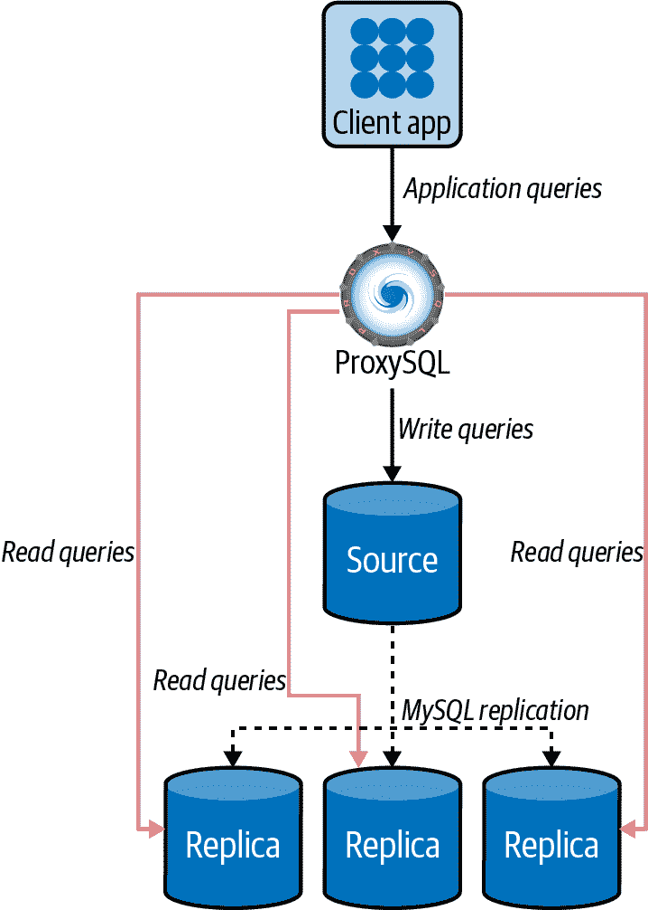
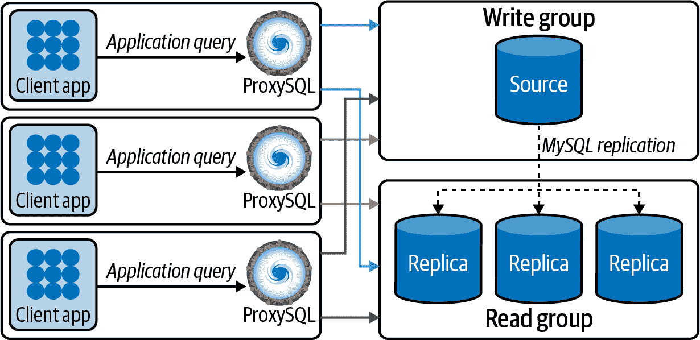
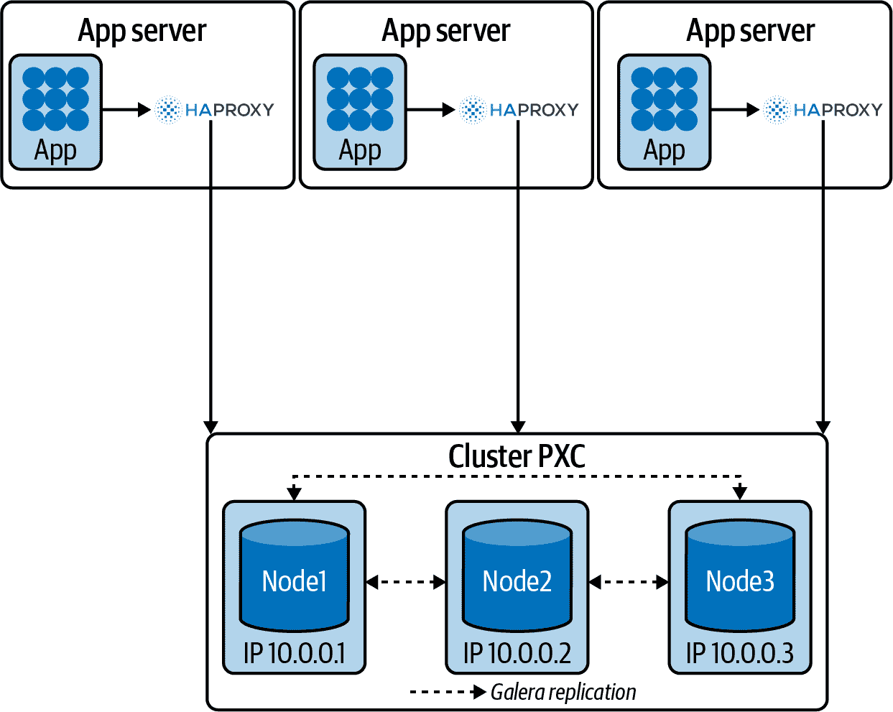
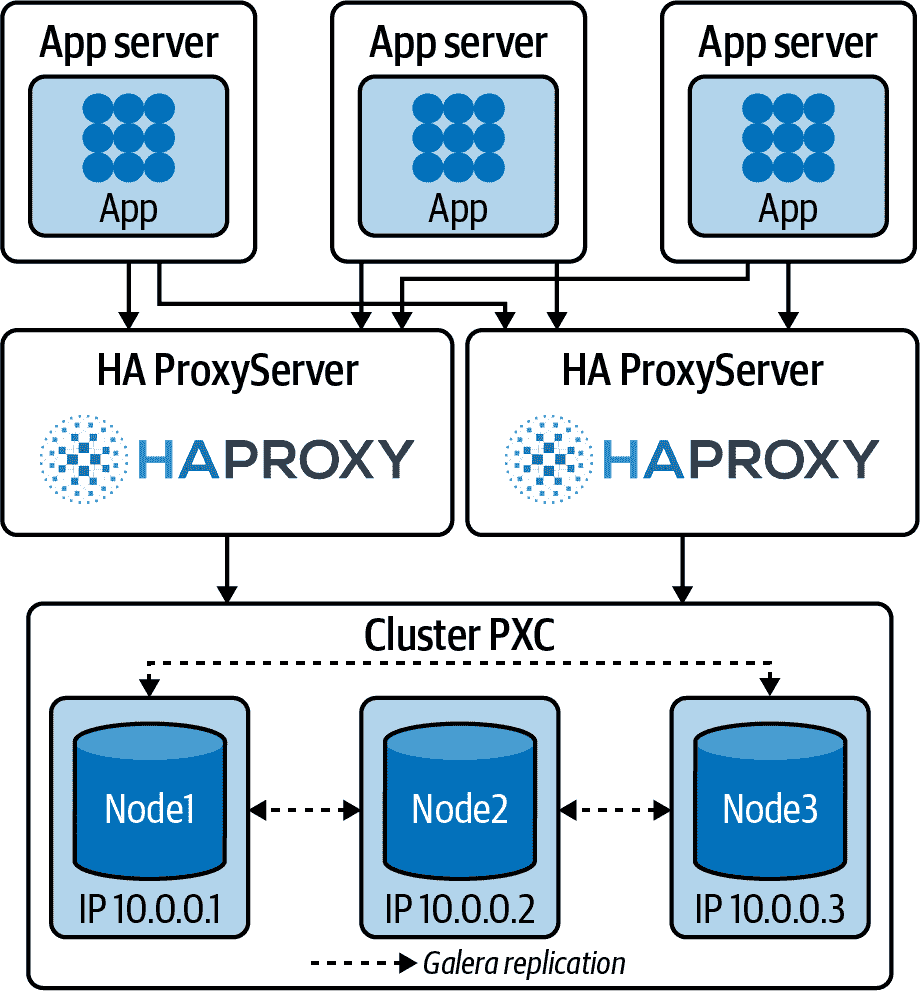
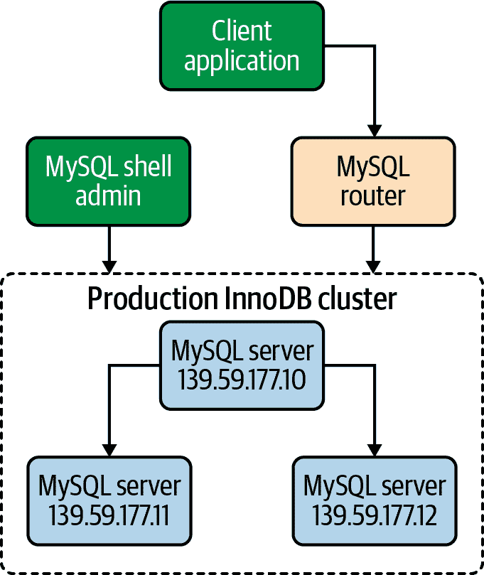

# 第十五章：负载均衡 MySQL

连接到 MySQL 有不同的方式。例如，为了执行写入测试，会创建一个连接，执行语句，然后关闭连接。为了避免每次需要时都打开连接的成本，发展了*连接池*的概念。连接池是一种创建和管理一组准备供应用程序的任何线程使用的连接的技术。

将在第十三章中讨论的高可用性概念扩展到连接，以提高生产系统的弹性，可以使用*负载均衡器*连接到数据库集群。通过负载均衡和 MySQL 高可用性，可以使应用程序持续运行而不中断（或仅有轻微的停机时间）。基本上，如果源服务器或数据库集群的一个节点失败，客户端只需连接到另一个数据库节点，就可以继续提供服务。

负载均衡器旨在为客户端连接到 MySQL 基础设施提供透明性。这样，应用程序不需要了解 MySQL 的拓扑结构；无论你使用经典复制、组复制还是 Galera 集群都无关紧要。负载均衡器将提供一个在线节点，可以进行读写查询。拥有强大的 MySQL 架构和适当的负载均衡器可以帮助数据库管理员避免彻夜未眠。

# 使用应用程序驱动程序进行负载均衡

要将应用程序连接到 MySQL，你需要一个驱动程序。*驱动程序*是一个适配器，用于将应用程序连接到不同的系统类型。这类似于将视频卡连接到计算机；你可能需要下载并安装一个驱动程序才能使其与你的应用程序配合工作。

现代常用编程语言的 MySQL 驱动程序支持连接池、负载均衡和故障转移。例如，[MySQL 的 JDBC 驱动程序（MySQL Connector/J）](https://oreil.ly/kaAXI)和[PDO_MYSQL](https://oreil.ly/xbC7B)驱动程序实现了 PHP 数据对象（PDO）接口，使 PHP 能够访问 MySQL 数据库。

我们提到的数据库驱动程序旨在为客户端连接到独立的 MySQL 服务器或 MySQL 复制设置提供透明性。我们不会向你展示如何在代码中使用它们，因为那超出了本书的范围；然而，你应该知道添加一个驱动程序库有助于代码开发，因为驱动程序为开发人员抽象了大量的工作。

但对于其他拓扑结构，例如 Galera Cluster 用于 MySQL 或 MariaDB 的集群设置，JDBC 和 PHP 驱动程序不了解内部 Galera 状态信息。例如，Galera 捐赠节点在帮助另一个节点重新同步时可能处于只读模式（如果 SST 方法是`mysqldump`或`rsync`），或者在分裂大脑发生时可能处于非主状态。另一种解决方案是在客户端和数据库集群之间使用负载均衡器。

# ProxySQL 负载均衡器

ProxySQL 是一个 SQL 代理。ProxySQL 实现了 MySQL 协议，因此可以执行其他代理无法执行的操作。以下是其一些优点：

+   它提供对多个数据库的应用程序请求的“智能”负载平衡。

+   它理解通过它传递的 MySQL 流量，并可以将读取操作与写入操作分离。在源/副本复制设置中，理解 MySQL 协议尤其有用，其中写入应仅发送到源，读取应发送到副本，或者在 Galera 集群的情况下均匀分配读取查询（线性读取扩展）。

+   它了解底层数据库拓扑结构，包括实例是否运行，因此可以将请求路由到健康的数据库。

+   它提供查询工作负载分析和查询缓存，对于分析和提升性能非常有用。

+   它为管理员提供了强大且丰富的查询规则定义，以高效分发查询并缓存数据，从而最大化数据库服务的效率。

ProxySQL 作为一个守护进程运行，并由监控进程监视。该进程监控守护进程，在崩溃时重新启动以最小化停机时间。守护进程接受来自 MySQL 客户端的传入流量并将其转发到后端 MySQL 服务器。

代理设计为持续运行，无需重新启动。大多数配置可以在运行时使用类似 SQL 语句的查询在 ProxySQL 管理界面进行。这些包括运行时参数、服务器分组和与流量相关的设置。

虽然通常将 ProxySQL 安装在应用程序和数据库之间的独立节点上，但由于网络跳数增加而影响查询性能。图 15-1 显示了 ProxySQL 作为中间层。



###### 图 15-1\. 应用程序与 MySQL 之间的 ProxySQL

为了减少对性能的影响（并避免额外的网络跳数），另一种架构选项是将 ProxySQL 安装在应用程序服务器上。应用程序然后通过 Unix 域套接字连接到本地主机上的 ProxySQL（充当 MySQL 服务器），避免额外的延迟。它使用其路由规则与具有连接池的实际 MySQL 服务器进行通信。应用程序对 ProxySQL 之外的情况一无所知。图 15-2 显示了 ProxySQL 与应用程序位于同一服务器上的情况。



###### 图 15-2\. 与应用程序位于同一服务器上的 ProxySQL

## 安装和配置 ProxySQL

让我们看看如何为源/复制配置部署 ProxySQL。

工具的开发者在他们的[GitHub 发行页面](https://oreil.ly/2EFKJ)上为各种 Linux 发行版提供官方包，适用于所有 ProxySQL 版本的发布，因此我们将从那里下载最新的软件包版本并安装它。

在安装之前，以下实例是我们在此过程中将要使用的实例：

```
+---------------------------------------+----------------------+
| vinicius-grippa-default(mysql)        | 10.124.33.5 (eth0)   |
+---------------------------------------+----------------------+
| vinicius-grippa-node1(mysql)          | 10.124.33.169 (eth0) |
+---------------------------------------+----------------------+
| vinicius-grippa-node2(mysql)          | 10.124.33.130 (eth0) |
+---------------------------------------+----------------------+
| vinicius-grippa-node3(proxysql)       | 10.124.33.170 (eth0) |
+---------------------------------------+----------------------+
```

要开始，找到适合您操作系统的适当分发。在本例中，我们将为 CentOS 7 安装。首先，我们将成为 root 用户，安装 MySQL 客户端以连接 ProxySQL，并安装 ProxySQL 本身。我们从下载页面获取 URL 并将其引用到 `yum`：

```
$ sudo su - root
# yum -y install https://repo.percona.com/yum/percona-release-latest.noarch.rpm
# yum -y install Percona-Server-client-57
# yum install -y https://github.com/sysown/proxysql/releases/download/v2.0.15/ \
     proxysql-2.0.15-1-centos7.x86_64.rpm
```

我们已经具备运行 ProxySQL 的所有要求，但安装后服务不会自动启动，因此我们手动启动它：

```
# sudo systemctl start proxysql
```

ProxySQL 现在应该按照其默认配置运行。我们可以通过运行此命令来检查它：

```
# systemctl status proxysql
```

ProxySQL 进程处于活动状态的输出应类似于以下内容：

```
 proxysql.service - High Performance Advanced Proxy for MySQL
   Loaded: loaded (/etc/systemd/system/proxysql.service; enabled; vendor...
   Active: active (running) since Sun 2021-05-23 18:50:28 UTC; 15s ago
  Process: 1422 ExecStart=/usr/bin/proxysql --idle-threads -c /etc/proxysql...
 Main PID: 1425 (proxysql)
   CGroup: /system.slice/proxysql.service
           ├─1425 /usr/bin/proxysql --idle-threads -c /etc/proxysql.cnf
           └─1426 /usr/bin/proxysql --idle-threads -c /etc/proxysql.cnf

May 23 18:50:27 vinicius-grippa-node3 systemd[1]: Starting High Performance...
May 23 18:50:27 vinicius-grippa-node3 proxysql[1422]: 2021-05-23 18:50:27...
May 23 18:50:27 vinicius-grippa-node3 proxysql[1422]: 2021-05-23 18:50:27...
May 23 18:50:27 vinicius-grippa-node3 proxysql[1422]: 2021-05-23 18:50:27...
May 23 18:50:28 vinicius-grippa-node3 systemd[1]: Started High Performance...
```

ProxySQL 将应用程序接口与管理接口分开。这意味着 ProxySQL 将监听两个网络端口：管理接口将监听 6032 端口，应用程序将监听 6033 端口（为了更容易记住，这是 MySQL 默认端口 3306 的反向）。

接下来，ProxySQL 需要与 MySQL 节点通信以能够检查其状态。为实现此目的，ProxySQL 需要连接到每个服务器，并使用专用用户。

首先，在源服务器上创建用户。连接到 MySQL 源实例并运行以下命令：

```
mysql> `CREATE` `USER` `'proxysql'``@``'%'` `IDENTIFIED` `by` `'$3Kr$t'``;`
mysql> `GRANT` `USAGE` `ON` `*``.``*` `TO` `'proxysql'``@``'%'``;`
```

接下来，我们将配置 ProxySQL 参数以识别用户。首先连接到 ProxySQL：

```
# mysql -uadmin -padmin -h 127.0.0.1 -P 6032
```

然后设置参数：

```
proxysql> `UPDATE` `global_variables` `SET` `variable_value``=``'proxysql'`
       -> `WHERE` `variable_name``=``'mysql-monitor_username'``;`
proxysql> `UPDATE` `global_variables` `SET` `variable_value``=``'$3Kr$t'`
       -> `WHERE` `variable_name``=``'mysql-monitor_password'``;`
proxysql> `LOAD` `MYSQL` `VARIABLES` `TO` `RUNTIME``;`
proxysql> `SAVE` `MYSQL` `VARIABLES` `TO` `DISK``;`
```

现在我们在数据库和 ProxySQL 中设置了用户，现在是时候告诉 ProxySQL 数据库中存在哪些 MySQL 服务器了：

```
proxysql> `INSERT` `INTO` `mysql_servers``(``hostgroup_id``,` `hostname``,` `port``)`
       -> `VALUES` `(``10``,``'10.124.33.5'``,``3306``)``;`
proxysql> `INSERT` `INTO` `mysql_servers``(``hostgroup_id``,` `hostname``,` `port``)`
       -> `VALUES` `(``11``,``'10.124.33.169'``,``3306``)``;`
proxysql> `INSERT` `INTO` `mysql_servers``(``hostgroup_id``,` `hostname``,` `port``)`
       -> `VALUES` `(``11``,``'10.124.33.130'``,``3306``)``;`
proxysql> `LOAD` `MYSQL` `SERVERS` `TO` `RUNTIME``;`
proxysql> `SAVE` `MYSQL` `SERVERS` `TO` `DISK``;`
```

下一步是定义我们的写入组和读取组。位于写入组的服务器将能够接收 DML 操作，而 `SELECT` 查询将使用读取组中的服务器。在本例中，主机组 10 将是写入组，主机组 11 将是读取组：

```
proxysql> `INSERT` `INTO` `mysql_replication_hostgroups`
       -> `(``writer_hostgroup``,` `reader_hostgroup``)` `VALUES` `(``10``,` `11``)``;`
proxysql> `LOAD` `MYSQL` `SERVERS` `TO` `RUNTIME``;`
proxysql> `SAVE` `MYSQL` `SERVERS` `TO` `DISK``;`
```

接下来，ProxySQL 必须具有能够访问后端节点以管理连接的用户。让我们在后端源服务器上创建用户：

```
mysql> `CREATE` `USER` `'app'``@``'%'` `IDENTIFIED` `by` `'$3Kr$t'``;`
mysql> `GRANT` `ALL` `PRIVILEGES` `ON` `*``.``*` `TO` `'app'``@``'%'``;`
```

现在我们将使用用户配置 ProxySQL：

```
proxysql> `INSERT` `INTO` `mysql_users` `(``username``,``password``,``default_hostgroup``)`
       -> `VALUES` `(``'app'``,``'$3Kr$t'``,``10``)``;`
proxysql> `LOAD` `MYSQL` `USERS` `TO` `RUNTIME``;`
proxysql> `SAVE` `MYSQL` `USERS` `TO` `DISK``;`
```

接下来的步骤是最令人兴奋的，因为在这里我们定义规则。规则将告诉 ProxySQL 将写入和读取查询发送到哪里，从而平衡服务器的负载：

```
proxysql> `INSERT` `INTO` `mysql_query_rules`
       -> `(``rule_id``,``username``,``destination_hostgroup``,``active``,``match_digest``,``apply``)`
       -> `VALUES``(``1``,``'app'``,``10``,``1``,``'^SELECT.*FOR UPDATE'``,``1``)``;`
proxysql> `INSERT` `INTO` `mysql_query_rules`
       -> `(``rule_id``,``username``,``destination_hostgroup``,``active``,``match_digest``,``apply``)`
       -> `VALUES``(``2``,``'app'``,``11``,``1``,``'^SELECT '``,``1``)``;`
proxysql> `LOAD` `MYSQL` `QUERY` `RULES` `TO` `RUNTIME``;`
proxysql> `SAVE` `MYSQL` `QUERY` `RULES` `TO` `DISK``;`
```

ProxySQL 在 `mysql_servers` 表中每个服务器连接上都有一个线程负责，并检查 `read_only` 变量的值。假设复制品显示在写入组中，如下所示：

```
proxysql> `SELECT` `*` `FROM` `mysql_servers``;`
```

```
+--------------+---------------+------+-----------+...
| hostgroup_id | hostname      | port | gtid_port |...
+--------------+---------------+------+-----------+...
| 10           | 10.124.33.5   | 3306 | 0         |...
| 11           | 10.124.33.169 | 3306 | 0         |...
| 11           | 10.124.33.130 | 3306 | 0         |...
+--------------+---------------+------+-----------+...
...+--------------+---------------+------+-----------+
...| status | weight | compression | max_connections |...
...+--------+--------+-------------+-----------------+...
...| ONLINE | 1      | 0           | 1000            |...
...| ONLINE | 1      | 0           | 1000            |...
...| ONLINE | 1      | 0           | 1000            |...
...+--------+--------+-------------+-----------------+...
...+---------------------+---------+----------------+---------+
...| max_replication_lag | use_ssl | max_latency_ms | comment |
...+---------------------+---------+----------------+---------+
...| 0                   | 0       | 0              |         |
...| 0                   | 0       | 0              |         |
...| 0                   | 0       | 0              |         |
...+---------------------+---------+----------------+---------+
3 rows in set (0.00 sec)
```

因为我们不希望 ProxySQL 向副本服务器写入数据，这会导致数据不一致，所以我们需要在副本服务器中设置`read_only`选项，这样这些服务器只会处理读取查询。

```
mysql> `SET` `GLOBAL` `read_only``=``1``;`
```

现在我们可以使用我们的应用程序了。运行以下命令应该返回 ProxySQL 连接的主机名：

```
$ `mysql` `-``uapp` `-``p``'$3Kr$t'` `-``h` `127``.``0``.``0``.``1` `-``P` `6033` `-``e` `"select @@hostname;"`
```

```
+-----------------------+
| @@hostname            |
+-----------------------+
| vinicius-grippa-node1 |
+-----------------------+
```

ProxySQL 拥有比我们在这里展示的更多功能和灵活性；我们本节的目标只是介绍这个工具，以便您在决定架构时考虑这个选项。

###### 注意

正如我们在配置第十三章复制时提到的，我们要强调 ProxySQL 需要能够访问 MySQL 服务器；否则，它将无法工作。

# HAProxy 负载均衡器

*HAProxy* 代表高可用性代理，它是一个 TCP/HTTP 负载均衡器。它将工作负载分布到一组服务器上，以最大化性能并优化资源使用。

为了扩展关于 MySQL 架构和不同拓扑结构的知识，本节我们将配置 Percona XtraDB 集群（Galera 集群），而不是传统的复制拓扑。

架构选项类似于 ProxySQL。HAProxy 可以与应用程序一起放置或者放在中间层。图 15-3 展示了一个示例，其中 HAProxy 与应用程序放在同一台服务器上。



###### 图 15-3\. HAProxy 与应用程序一起

并且 图 15-4 显示了一个中间层中带有 HAProxy 的拓扑结构。

同样，这些是具有不同优缺点的架构。在第一个架构中，我们没有额外的跳跃（从而减少延迟），但会增加应用服务器的负载。此外，您需要在每台应用服务器上配置 HAProxy。

另一方面，将 HAProxy 放在中间层有助于管理并增加可用性，因为应用程序可以连接到任何 HAProxy 服务器。然而，额外的跳跃会增加延迟。



###### 图 15-4\. 在专用服务器上运行中间层中的 HAProxy

## 安装和配置 HAProxy

常见操作系统如 Red Hat/CentOS 和 Debian/Ubuntu 提供了 HAProxy 包，你可以使用包管理器安装它。安装过程相对比较简单。

对于 Debian 或 Ubuntu，请使用以下命令：

```
# apt update
# apt install haproxy
```

对于 Red Hat 或 CentOS，请使用：

```
# sudo yum update
# sudo yum install haproxy
```

安装完成后，HAProxy 将设置配置文件的默认路径为*/etc/haproxy/haproxy.cfg*。

在启动 HAProxy 之前，我们需要对其进行配置。在这个演示中，我们的第一个场景中，HAProxy 将位于与应用程序相同的服务器上。以下是我们三节点 Galera 集群的 IP 地址：

```
172.16.3.45/Port:3306
172.16.1.72/Port:3306
172.16.0.161/Port:3306
```

让我们打开我们的*/etc/haproxy/haproxy.cfg*文件并查看它。有许多参数可以自定义，分为三个部分：

`global`

进程全局参数的配置文件中的一个部分

`defaults`

配置文件中用于默认参数的一个部分

`listen`

配置文件中定义完整代理（包括其前端和后端部分）的部分

表 15-1 显示了基本的 HAProxy 参数。

表 15-1\. HAProxy 选项（附带链接到 HAProxy 文档）

| 参数 | 描述 |
| --- | --- |
| [`balance`](https://oreil.ly/Ej25a) | 定义在后端使用的负载平衡算法。 |
| [`clitimeout`](https://oreil.ly/HRlC5) | 设置客户端端的最大不活动时间 |
| [`contimeout`](https://oreil.ly/Hjwtm) | 设置连接到服务器尝试成功的最长等待时间 |
| [`daemon`](https://oreil.ly/75stw) | 使进程在后台分叉（推荐的操作模式） |
| [`gid`](https://oreil.ly/ikswS) | 将进程的组 ID 更改为`*<number>*` |
| [`log`](https://oreil.ly/ovcK5) | 添加全局 syslog 服务器 |
| [`maxconn`](https://oreil.ly/94uQr) | 设置每个进程的并发连接数上限为`*<number>*` |
| [`mode`](https://oreil.ly/c3CaJ) | 设置实例的运行模式或协议 |
| [`option dontlognull`](https://oreil.ly/DplEm) | 禁止记录空连接 |
| [`optiontcplog`](https://oreil.ly/BA2mL) | 启用带有会话状态和计时器的 TCP 连接的高级日志记录 |

要使 HAProxy 工作，我们将根据我们的设置使用以下配置文件：

```
global
    log /dev/log   local0
    log /dev/log   local1 notice
    maxconn 4096
    #debug
    #quiet
    chroot      /var/lib/haproxy
    pidfile     /var/run/haproxy.pid
    user        haproxy
    group       haproxy
    daemon

    # turn on stats unix socket
    stats socket /var/lib/haproxy/stats

#---------------------------------------------------------------------
# common defaults that all the 'listen' and 'backend' sections will
# use if not designated in their block
#---------------------------------------------------------------------
defaults
     log     global
     mode    http
     option  tcplog
     option  dontlognull
     retries 3
     redispatch
     maxconn 2000
     contimeout      5000
     clitimeout      50000
     srvtimeout      50000

#---------------------------------------------------------------------
# round robin balancing between the various backends
#---------------------------------------------------------------------
listen mysql-pxc-cluster 0.0.0.0:3307
     mode tcp
     bind *:3307
     timeout client  10800s
     timeout server  10800s
     balance roundrobin
     option httpchk

     server vinicius-grippa-node2 172.16.0.161:3306 check port 9200
     inter 12000 rise 3 fall 3
     server vinicius-grippa-node1 172.16.1.72:3306 check port 9200 inter 12000

     rise 3 fall 3
     server vinicius-grippa-default 172.16.3.45:3306 check port 9200
     inter 12000 rise 3 fall 3
```

要启动 HAProxy，我们使用`haproxy`命令。我们可以在命令行上传递任意数量的配置参数。要使用配置文件，请使用`-f`选项。例如，我们可以传递一个配置文件：

```
# sudo haproxy -f /etc/haproxy/haproxy.cfg
```

或者多个配置文件：

```
# sudo haproxy -f /etc/haproxy/haproxy.cfg /etc/haproxy/haproxy-2.cfg
```

或者一个目录：

```
# sudo haproxy -f conf-dir
```

使用这个配置，HAProxy 将在三个节点之间平衡负载。在这种情况下，它仅检查`mysqld`进程是否在 3306 端口上监听，但不考虑节点的状态。因此，即使节点处于`JOINING`或`DISCONNECTED`状态，它也可能向运行`mysqld`的节点发送查询。

要检查节点的当前状态，我们需要更复杂的东西。这个想法来自[Codership 的 Google 小组](https://oreil.ly/7xj0N)。

要实施此设置，我们将需要两个脚本：

+   `clustercheck`位于*/usr/local/bin*，并配置了`xinetd`

+   `mysqlchk`位于每个节点的*/etc/xinetd.d*中

[这两个脚本都可用](https://oreil.ly/iN1La)在 Percona XtraDB 的二进制和源分发中。

通过为每个节点添加以下行来更改*/etc/services*文件：

```
mysqlchk        9200/tcp                # mysqlchk
```

如果*/etc/services*文件不存在，则可能未安装`xinetd`。

要为 CentOS/Red Hat 安装它，请使用：

```
# yum install -y xinetd
```

对于 Debian/Ubuntu，请使用：

```
# sudo apt-get install -y xinetd
```

接下来，我们需要创建一个 MySQL 用户，以便脚本可以检查节点是否健康。理想情况下，出于安全原因，此用户应具有所需的最低权限：

```
mysql> CREATE USER 'clustercheckuser'@'localhost' IDENTIFIED BY
               'clustercheckpassword!';
    -> GRANT PROCESS ON *.* TO 'clustercheckuser'@'localhost';

```

要验证我们的节点在健康检查上的表现，我们可以运行以下命令并观察输出：

```
# /usr/bin/clustercheck
```

```
HTTP/1.1 200 OK
Content-Type: text/plain
Connection: close
Content-Length: 40

Percona XtraDB Cluster Node is synced.
```

如果我们对所有节点都这样做，就准备好测试我们的 HAProxy 设置是否有效了。最简单的方法是连接到它并执行一些 MySQL 命令。让我们运行一个检索我们所连接的主机名的命令：

```
# mysql -uroot -psecret -h 127.0.0.1 -P 3307 -e "select @@hostname"
```

```
+-----------------------+
| @@hostname            |
+-----------------------+
| vinicius-grippa-node1 |
+-----------------------+
```

第二次运行得到：

```
$ mysql -uroot -psecret -h 127.0.0.1 -P 3307 -e "select @@hostname"
```

```
mysql: [Warning] Using a password on the command line interface can be
insecure.
+-----------------------+
| @@hostname            |
+-----------------------+
| vinicius-grippa-node2 |
+-----------------------+
```

第三次我们得到：

```
$ mysql -uroot -psecret -h 127.0.0.1 -P 3307 -e "select @@hostname"
```

```
mysql: [Warning] Using a password on the command line interface can be
insecure.
+-------------------------+
| @@hostname              |
+-------------------------+
| vinicius-grippa-default |
+-------------------------+
```

如您所见，我们的 HAProxy 以循环方式进行连接。如果我们关闭其中一个节点，HAProxy 将只路由到剩余的节点。

# MySQL Router

MySQL Router 负责在 InnoDB 集群的成员之间分发流量。它是一个类似代理的解决方案，用于隐藏应用程序对集群拓扑的了解，因此应用程序无需知道集群的哪个成员是主节点，哪些是从节点。请注意，MySQL Router 不适用于 Galera 集群；它仅为 InnoDB 集群开发。

MySQL Router 能够通过公开不同的接口执行读写分离。常见的设置是有一个读写接口和一个只读接口。这是默认行为，同时还公开了两个类似的接口以使用 X 协议（用于 CRUD 操作和异步调用）。

读写分离是通过*角色*的概念来完成的：主要用于写入，次要用于只读。这类似于集群成员的命名方式。此外，每个接口通过 TCP 端口公开，因此应用程序只需知道用于写入的 IP:端口组合和用于读取的 IP:端口组合。然后 MySQL Router 将根据流量类型管理与集群成员的连接。

在生产环境中工作时，构成 InnoDB 集群的 MySQL 服务器实例运行在多台主机上，作为网络的一部分，而不是单台机器上。因此，与 ProxySQL 和 HAProxy 一样，MySQL 路由器可以作为架构中的中间层。

图 15-5 说明了生产场景的工作原理。



###### 图 15-5\. MySQL InnoDB 集群生产部署

现在，为了启动我们的示例，让我们查看作为 InnoDB 集群一部分的 MySQL 成员：

```
mysql> `SELECT` `member_host``,` `member_port``,` `member_state``,` `member_role`
    -> `FROM` `performance_schema``.``replication_group_members``;`
```

```
+--------------+-------------+--------------+-------------+
| member_host  | member_port | member_state | member_role |
+--------------+-------------+--------------+-------------+
| 172.16.3.9   |        3306 | ONLINE       | SECONDARY   |
| 172.16.3.127 |        3306 | ONLINE       | SECONDARY   |
| 172.16.3.120 |        3306 | ONLINE       | PRIMARY     |
+--------------+-------------+--------------+-------------+
3 rows in set (0.00 sec)
```

```
mysql> `SELECT` `cluster_name` `FROM` `mysql_innodb_cluster_metadata``.``clusters``;`
```

```
+--------------+
| cluster_name |
+--------------+
| cluster1     |
+--------------+
1 row in set (0.00 sec)
```

现在我们已经有了 MySQL 节点的配置和集群名称，可以开始配置 MySQL Router 了。出于性能考虑，建议将 MySQL Router 设置在与应用程序相同的位置，假设每个应用服务器都有一个实例，因此我们将把路由器放置在应用服务器上。首先，我们将确定适用于我们操作系统的 MySQL Router 版本：

```
# cat /etc/*release
```

```
CentOS Linux release 7.9.2009 (Core)
```

现在，我们将检查[下载页面](https://oreil.ly/eCH08)，并使用`yum`进行安装：

```
# yum install -y https://dev.mysql.com/get/Downloads/MySQL-Router/mysql-
```

```
router-community-8.0.23-1.el7.x86_64.rpm
Loaded plugins: fastestmirror
mysql-router-community-8.0.23-1.el7.x86_64.rpm                                                                                                                                           |  34 MB  00:00:01
Examining /var/tmp/yum-root-_ljdTQ/mysql-router-community-8.0.23-1.el7.x
86_64.rpm: mysql-router-community-8.0.23-1.el7.x86_64
Marking /var/tmp/yum-root-_ljdTQ/mysql-router-community-8.0.23-1.el7.x86
_64.rpm to be installed
Resolving Dependencies
--> Running transaction check
...
Running transaction
  Installing : mysql-router-community-8.0.23-1.el7.x86_64
  1/1
  Verifying  : mysql-router-community-8.0.23-1.el7.x86_64
  1/1

Installed:
  mysql-router-community.x86_64 0:8.0.23-1.el7

Complete!
```

现在 MySQL Router 已经安装好，我们需要为其操作创建一个专用目录：

```
# mkdir /var/lib/mysqlrouter
```

接下来，我们将进行 MySQL Router 的引导操作。引导将配置路由器以与 MySQL InnoDB 集群一起运行：

```
# mysqlrouter --bootstrap root@172.16.3.120:3306 \
    --directory /var/lib/mysqlrouter --conf-use-sockets \
    --account app_router --account-create always \
    --user=mysql
```

```
Please enter MySQL password for root:
# Bootstrapping MySQL Router instance at '/var/lib/mysqlrouter'...

Please enter MySQL password for app_router:
- Creating account(s)
- Verifying account (using it to run SQL queries that would be run by
Router)
- Storing account in keyring
- Adjusting permissions of generated files
- Creating configuration /var/lib/mysqlrouter/mysqlrouter.conf

...

## MySQL Classic protocol

- Read/Write Connections: localhost:6446, /var/lib/mysqlrouter/mysql.sock
- Read/Only Connections:  localhost:6447,
/var/lib/mysqlrouter/mysqlro.sock

## MySQL X protocol

- Read/Write Connections: localhost:64460,
/var/lib/mysqlrouter/mysqlx.sock
- Read/Only Connections:  localhost:64470,
/var/lib/mysqlrouter/mysqlxro.sock
```

在命令行中，我们正在告诉路由器使用用户 `root` 连接到我们的主服务器（`172.16.3.120`），端口为 3306。我们还告诉路由器创建一个套接字文件，以便我们可以使用它进行连接。最后，我们创建一个新用户（`app_router`）用于我们的应用程序。

让我们看看引导过程在我们的配置目录（*/var/lib/mysqlrouter*）中创建的内容。

```
# ls -l | awk '{print $9}'
```

```
data
log
mysqlrouter.conf
mysqlrouter.key
run
start.sh
stop.sh
```

生成的 MySQL Router 配置文件（*mysqlrouter.conf*）看起来类似于这样：

```
# cat mysqlrouter.conf
```

```
# File automatically generated during MySQL Router bootstrap
[DEFAULT]
user=mysql
logging_folder=/var/lib/mysqlrouter/log
runtime_folder=/var/lib/mysqlrouter/run

...

[rest_routing]
require_realm=default_auth_realm

[rest_metadata_cache]
require_realm=default_auth_realm
```

在这个例子中，MySQL Router 配置了四个端口（两个端口用于使用常规 MySQL 协议进行读/写，另外两个端口用于使用 X 协议进行读/写），以及四个套接字。端口是默认添加的，套接字是因为我们传入了 `--conf-use-sockets` 参数。InnoDB 集群命名为 `cluster1` 是元数据的来源，目标是使用 InnoDB 集群元数据缓存来动态配置主机信息。

通过执行 *start.sh* 脚本，我们可以启动 MySQL 路由器守护进程：

```
# ./start.sh
```

```
# PID 1684 written to '/var/lib/mysqlrouter/mysqlrouter.pid'
logging facility initialized, switching logging to loggers specified in
configuration
```

现在，我们可以观察到进程正在运行：

```
# ps -ef | grep -i mysqlrouter
```

```
root      1683     1  0 17:36 pts/0    00:00:00 sudo
ROUTER_PID=/var/lib/mysqlrouter/mysqlrouter.pid /usr/bin/mysqlrouter -c
/var/lib/mysqlrouter/mysqlrouter.conf --user=mysql
mysql     1684  1683  0 17:36 pts/0    00:00:17 /usr/bin/mysqlrouter -c
/var/lib/mysqlrouter/mysqlrouter.conf --user=mysql
root      1733  1538  0 17:41 pts/0    00:00:00 grep --color=auto -i
mysqlrouter
```

端口已打开：

```
# netstat -tulnp | grep -i mysqlrouter
```

```
tcp   0   0 0.0.0.0:64470   0.0.0.0:*   LISTEN   1684/mysqlrouter
tcp   0   0 0.0.0.0:8443    0.0.0.0:*   LISTEN   1684/mysqlrouter
tcp   0   0 0.0.0.0:64460   0.0.0.0:*   LISTEN   1684/mysqlrouter
tcp   0   0 0.0.0.0:6446    0.0.0.0:*   LISTEN   1684/mysqlrouter
tcp   0   0 0.0.0.0:6447    0.0.0.0:*   LISTEN   1684/mysqlrouter
```

我们已经使用 InnoDB 集群配置了 MySQL Router，现在可以通过读和读/写连接进行测试。首先，我们将连接到写入端口（6446）：

```
# mysql -uroot -psecret -h 127.0.0.1 -P 6446 \
    -e "create database learning_mysql;"
# mysql -uroot -psecret -h 127.0.0.1 -P 6446 \
    -e "use learning_mysql; select database()"
```

```
+----------------+
| database()     |
+----------------+
| learning_mysql |
+----------------+
```

如您所见，可以在写入端口执行读和写操作。

现在我们将使用 `SELECT` 语句检查读端口（6447）：

```
# mysql -uroot -psecret -h 127.0.0.1 -P 6447 \
    -e "use learning_mysql; select database()"
```

```
+----------------+
| database()     |
+----------------+
| learning_mysql |
+----------------+
```

这是有效的，但让我们尝试执行一个写操作：

```
# mysql -uroot -psecret -h 127.0.0.1 -P 6447 \
    -e "create database learning_mysql_write;"
```

```
ERROR 1290 (HY000) at line 1: The MySQL server is running with the
--super-read-only option so it cannot execute this statement
```

因此，读端口仅接受读操作。还可以看到路由器在负载均衡读操作：

```
# mysql -uroot -psecret -h 127.0.0.1 -P 6447 -e "select @@hostname"
```

```
+-----------------------+
| @@hostname            |
+-----------------------+
| vinicius-grippa-node1 |
+-----------------------+
```

```
# mysql -uroot -psecret -h 127.0.0.1 -P 6447 -e "select @@hostname"
```

```
insecure.
+-----------------------+
| @@hostname            |
+-----------------------+
| vinicius-grippa-node2 |
+-----------------------+
```

当一个 MySQL 节点发生任何停机情况时，MySQL Router 将路由查询到其余的活跃节点。
