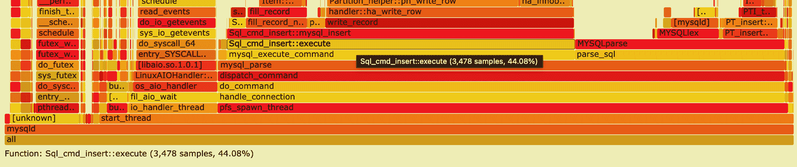

# 第十六章：杂项主题

本章的目的是超越故障排除查询、过载系统或设置不同的 MySQL 拓扑结构。我们希望向您展示可用于使日常任务更轻松或调查复杂问题的工具库。让我们从 MySQL Shell 开始。

# MySQL Shell

MySQL Shell 是 MySQL 的高级客户端和代码编辑器。它扩展了传统 MySQL 客户端的功能，大多数 DBA 在 MySQL 5.6 和 5.7 中使用过。MySQL Shell 支持 Python、JavaScript 和 SQL 等编程语言。它还通过 API 命令语法扩展功能。例如，可以定制脚本以管理 InnoDB Cluster。通过 MySQL Shell，还可以启动和配置 MySQL 沙盒实例。

## 安装 MySQL Shell

对于支持的 Linux 发行版，安装 MySQL Shell 的最简单方法是使用 MySQL *yum*或*apt*仓库。让我们看看如何在 Ubuntu 和 CentOS 上安装它。

## 在 Ubuntu 20.04 Focal Fossa 上安装 MySQL Shell

在 Ubuntu 中安装 MySQL Shell 相对简单，因为它是常规仓库的一部分。

首先，我们需要配置 MySQL 仓库。我们可以使用这些命令将*apt*仓库[下载](https://oreil.ly/K7eq8)到我们的服务器并安装它：

```
# wget  https://dev.mysql.com/get/mysql-apt-config_0.8.16-1_all.deb
# dpkg -i mysql-apt-config_0.8.16-1_all.deb
```

安装完成后，更新我们的软件包信息：

```
# apt-get update
```

然后执行`install`命令安装 MySQL Shell：

```
# apt-get install mysql-shell
```

我们现在可以使用命令行启动 MySQL Shell：

```
# mysqlsh
```

```
MySQL Shell 8.0.23

Copyright (c) 2016, 2021, Oracle and/or its affiliates.
Oracle is a registered trademark of Oracle Corporation and/or its affiliates.
Other names may be trademarks of their respective owners.

Type '\help' or '\?' for help; '\quit' to exit.
 MySQL  JS >
```

## 在 CentOS 8 上安装 MySQL Shell

要在 CentOS 8 中安装 MySQL Shell，我们需要遵循与 Ubuntu 描述相同的步骤，但首先需要确保 CentOS 8 中存在的默认 MySQL 软件包被禁用：

```
# yum remove mysql-community-release -y
```

```
No match for argument: mysql-community-release
No packages marked for removal.
Dependencies resolved.
Nothing to do.
Complete!
```

```
# dnf erase mysql-community-release
```

```
No match for argument: mysql-community-release
No packages marked for removal.
Dependencies resolved.
Nothing to do.
Complete!
```

接下来，我们将配置我们的*yum*仓库。我们需要从[下载页面](https://oreil.ly/YvW74)获取正确的操作系统版本：

```
# yum install \
    https://dev.mysql.com/get/mysql80-community-release-el8-1.noarch.rpm -y
```

安装了仓库后，我们将安装 MySQL Shell 二进制文件：

```
# yum install mysql-shell -y
```

我们可以通过运行它来验证安装是否成功：

```
# mysqlsh
```

```
MySQL Shell 8.0.23

Copyright (c) 2016, 2021, Oracle and/or its affiliates.
Oracle is a registered trademark of Oracle Corporation and/or its affiliates.
Other names may be trademarks of their respective owners.

Type '\help' or '\?' for help; '\quit' to exit.
 MySQL  JS >
```

## 使用 MySQL Shell 部署 Sandbox InnoDB Cluster

MySQL Shell 通过提供`dba.deploySandboxInstance(`*`port_number`*`)`命令自动化部署沙盒实例。

默认情况下，沙盒实例放置在名为*$HOME/mysql-sandboxes/port*的目录中。让我们看看如何更改目录：

```
# mkdir /var/lib/sandboxes
# mysqlsh
```

```
 MySQL  JS > `shell``.``options``.``sandboxDir``=``'/var/lib/sandboxes'`
```

```
/var/lib/sandboxes
```

部署沙盒实例的先决条件是安装 MySQL 二进制文件。如果需要，详细信息请查看第一章。您需要输入`root`用户的密码以完成部署：

```
MySQL  JS > `dba``.``deploySandboxInstance``(``3310``)`
```

```
A new MySQL sandbox instance will be created on this host in
/var/lib/sandboxes/3310

Warning: Sandbox instances are only suitable for deploying and
running on your local machine for testing purposes and are not
accessible from external networks.

Please enter a MySQL root password for the new instance: ******

Deploying new MySQL instance...

Instance localhost:3310 successfully deployed and started.
Use shell.connect('root@localhost:3310') to connect to the instance.
```

我们打算部署另外两个实例：

```
 MySQL  JS > `dba``.``deploySandboxInstance``(``3320``)`
 MySQL  JS > `dba``.``deploySandboxInstance``(``3330``)`
```

下一步是在连接到种子 MySQL 服务器实例时创建 InnoDB 集群。*种子*实例是我们通过 MySQL Shell 连接的实例，我们希望将其复制到其他实例。在此示例中，沙盒实例都是空白实例，因此我们可以选择任何实例。在生产设置中，种子实例将是包含要复制到集群中其他实例的现有数据集的实例。

我们使用此命令将 MySQL Shell 连接到种子实例，本例中的端口为 3310：

```
MySQL  JS > `\``connect` `root``@``localhost``:``3310`
```

```
Creating a session to *root@localhost:3310*
Please provide the password for *root@localhost:3310*: 
Save password for *root@localhost:3310*? [Y]es/[N]o/Ne[v]er (default No): Y
Fetching schema names for autocompletion... Press ^C to stop.
Your MySQL connection id is 12
Server version: 8.0.21 Source distribution
No default schema selected; type \use <schema> to set one.
```

**接下来，我们将使用`createCluster()`方法创建 InnoDB 集群，当前连接的实例将作为种子：**

```
MySQL localhost:3310 ssl  JS > `var` `cluster` `=` `dba``.``createCluster``(``'learning_mysql'``)`
```

```
A new InnoDB cluster will be created on instance 'localhost:3310'.

Validating instance configuration at localhost:3310...
NOTE: Instance detected as a sandbox.
Please note that sandbox instances are only suitable for deploying test clusters
for use within the same host.

This instance reports its own address as 127.0.0.1:3310

Instance configuration is suitable.
NOTE: Group Replication will communicate with other members using
'127.0.0.1:33101'. Use the localAddress option to override.

Creating InnoDB cluster 'learning_mysql' on '127.0.0.1:3310'...

Adding Seed Instance...
Cluster successfully created. Use Cluster.addInstance() to add MySQL instances.
At least 3 instances are needed for the cluster to be able to withstand up to
one server failure.
```

正如我们在输出中所看到的，三个实例能够在一台服务器故障时保持数据库在线，这就是为什么我们部署了三个沙盒实例。

下一步是将次要实例添加到我们的`learning_mysql` InnoDB 集群中。由种子实例执行的任何事务都将在添加每个次要实例时重新执行。

本示例中的种子实例最近创建，因此几乎为空。因此，需要从种子实例复制的数据很少。如果需要复制数据，MySQL 将使用[克隆插件](https://oreil.ly/VUASS)（在“使用克隆插件创建副本”中讨论）自动配置实例。

让我们添加一个次要实例来看看实际操作过程。要将第二个实例添加到 InnoDB 集群中：

```
MySQL  localhost:3310 ssl  JS >  `cluster``.``addInstance``(``'root@localhost:3320'``)`
```

```
...

* Waiting for clone to finish...
NOTE: 127.0.0.1:3320 is being cloned from 127.0.0.1:3310
** Stage DROP DATA: Completed
** Clone Transfer
    FILE COPY  ############################################################
    100%  Completed
    PAGE COPY  ############################################################
    100%  Completed
    REDO COPY  ############################################################
    100%  Completed

NOTE: 127.0.0.1:3320 is shutting down...

* Waiting for server restart... ready
* 127.0.0.1:3320 has restarted, waiting for clone to finish...
** Stage RESTART: Completed
* Clone process has finished: 59.62 MB transferred in about 1 second
(~59.62 MB/s)

State recovery already finished for '127.0.0.1:3320'

The instance '127.0.0.1:3320' was successfully added to the cluster
```

然后添加第三个实例：

```
 MySQL  localhost:3310 ssl  JS >  `cluster``.``addInstance``(``'root@localhost:3320'``)`
```

到目前为止，我们已创建了一个包含三个实例的集群：一个主实例和两个次要实例。我们可以通过运行以下命令来查看状态：

```
 MySQL  localhost:3310 ssl  JS > `cluster``.``status``(``)`
```

```
{
    "clusterName": "learning_mysql",
    "defaultReplicaSet": {
        "name": "default",
        "primary": "127.0.0.1:3310",
        "ssl": "REQUIRED",
        "status": "OK",
        "statusText": "Cluster is ONLINE and can tolerate up to ONE failure.",
        "topology": {
            "127.0.0.1:3310": {
                "address": "127.0.0.1:3310",
                "mode": "R/W",
                "readReplicas": {},
                "replicationLag": null,
                "role": "HA",
                "status": "ONLINE",
                "version": "8.0.21"
            },
            "127.0.0.1:3320": {
                "address": "127.0.0.1:3320",
                "mode": "R/O",
                "readReplicas": {},
                "replicationLag": null,
                "role": "HA",
                "status": "ONLINE",
                "version": "8.0.21"
            },
            "127.0.0.1:3330": {
                "address": "127.0.0.1:3330",
                "mode": "R/O",
                "readReplicas": {},
                "replicationLag": null,
                "role": "HA",
                "status": "ONLINE",
                "version": "8.0.21"
            }
        },
        "topologyMode": "Single-Primary"
    },
    "groupInformationSourceMember": "127.0.0.1:3310"
```

假设 MySQL Router 已安装（请参阅“MySQL Router”），唯一需要的步骤是使用 InnoDB 集群元数据服务器的位置引导它。

我们观察到路由器正在引导启动：

```
# mysqlrouter --bootstrap root@localhost:3310 --user=mysqlrouter
```

```
Please enter MySQL password for root:
# Bootstrapping system MySQL Router instance...

- Creating account(s) (only those that are needed, if any)
...

## MySQL Classic protocol

- Read/Write Connections: localhost:6446
- Read/Only Connections:  localhost:6447

...
```**  **## MySQL Shell 工具

正如我们所说，MySQL Shell 是 MySQL 的强大高级客户端和代码编辑器。在其众多功能中，包括创建整个数据库实例的逻辑转储和逻辑恢复以及用户。与例如`mysqldump`相比，其优势在于具有并行化能力，极大地提高了转储和恢复速度。

这里是执行转储和恢复过程的工具：

`util.dumpInstance()`

转储整个数据库实例，包括用户

`util.dumpSchemas()`

转储一组模式

`util.loadDump()`

将转储加载到目标数据库

`util.dumpTables()`

加载特定的表和视图

让我们依次更仔细地看看每一个。

### util.dumpInstance()

`dumpInstance()` 实用工具将导出 MySQL 数据目录中存在的所有数据库（参见 “MySQL 目录的内容”）。在导出时，将排除 `information_schema`、`mysql_`、`ndbinfo`、`performance_schema` 和 `sys` 这些模式。

还有一个干运行选项，允许您检查模式并查看兼容性问题，然后运行导出并应用适当的兼容性选项以消除问题。现在让我们尝试一下——我们将检查可能的错误并查看导出实用程序的选项。

若要开始导出，请执行以下命令：

```
 MySQL  JS > `shell``.``connect``(``'root@localhost:48008'``)``;`
 MySQL  localhost:48008 ssl  JS > `util``.``dumpInstance``(``"/backup"``,`
                                > `{``ocimds``:` `true``,` `compatibility``:`                                       `>` `[``"strip_restricted_grants"``]``,`
                                    `dryRun``:` `true``}``)`
```

```
Acquiring global read lock
Global read lock acquired
Gathering information - done
All transactions have been started
Locking instance for backup
...
NOTE: Database test had unsupported ENCRYPTION option commented out
ERROR: Table 'test'.'sbtest1' uses unsupported storage engine MyISAM
(fix this with 'force_innodb' compatibility option)
Compatibility issues with MySQL Database Service 8.0.23 were found.
Please use the 'compatibility' option to apply compatibility adaptations
to the dumped DDL.
Util.dumpInstance: Compatibility issues were found (RuntimeError)
```

当设置 `ocimds` 选项为 `true` 时，导出实用程序将检查数据字典和索引字典。DDL 文件中的 `CREATE TABLE` 语句中的加密选项已被注释，以确保所有表位于 MySQL 数据目录中，并使用默认模式加密。`strip_restricted_grants` 删除由 MySQL 数据库服务限制的特定权限，这些权限在用户创建过程中可能导致错误。`dryRun` 是不言自明的：它仅执行验证，实际上不会导出任何数据。

因此，我们在 `test` 数据库中有一个 MyISAM 表。干运行选项明显会抛出错误。

为了修复这个错误，我们将使用 `force_innodb` 选项，在 `CREATE TABLE` 语句中将所有不受支持的引擎转换为 InnoDB：

```
 MySQL  localhost:48008 ssl  JS > `util``.``dumpInstance``(``"backup"``,`
                                > `{``ocimds``:` `true``,` `compatibility``:`
                                > `[``"strip_restricted_grants"``,``"force_innodb"``]``,`
                                `dryRun``:` `true``}``)`
```

现在干运行不会抛出任何错误，也没有异常。让我们运行 `dumpInstance()` 命令来备份一个实例。在执行导出之前，目标目录必须为空。如果父目录中的目录尚不存在，则实用程序会创建它。

我们将并行处理导出。为此，我们将使用 `threads` 选项并设置 10 个线程：

```
 MySQL  localhost:48008 ssl  JS > `util``.``dumpInstance``(``"/backup"``,`
                                > `{``ocimds``:` `true``,` `compatibility``:`
                                > `[``"strip_restricted_grants"``,``"force_innodb"``]``,`
                                > `threads` `:` `10` `}``)`
```

如果我们观察输出的最后部分，我们会看到：

```
1 thds dumping - 100% (10.00K rows / ~10.00K rows), 0.00 rows/s, 0.00 B/s
uncompressed, 0.00 B/s

uncompressed
Duration: 00:00:00s
Schemas dumped: 1
Tables dumped: 10
Uncompressed data size: 1.88 MB
Compressed data size: 598.99 KB
Compression ratio: 3.1
Rows written: 10000
Bytes written: 598.99 KB
Average uncompressed throughput: 1.88 MB/s
Average compressed throughput: 598.99 KB/s
```

如果我们使用 `mysqldump`，我们会得到一个单一的文件。正如我们在这里看到的，备份目录中有多个文件：

```
@.done.json
@.json
@.post.sql
@.sql
test.json
test@sbtest10@@0.tsv.zst
test@sbtest10@@0.tsv.zst.idx
test@sbtest10.json
test@sbtest10.sql
...
test@sbtest1@@0.tsv.zst
test@sbtest1@@0.tsv.zst.idx
test@sbtest1.json
test@sbtest1.sql
test@sbtest9@@0.tsv.zst
test@sbtest9@@0.tsv.zst.idx
test@sbtest9.json
test@sbtest9.sql
test.sql
```

让我们看一下这些内容：

+   *@.json* 文件包含服务器详细信息以及用户列表、数据库名称及其字符集。

+   *@.post.sql* 和 *@.sql* 文件包含 MySQL 服务器版本详细信息。

+   *test.json* 文件包含视图、存储过程和函数名称以及表格列表。

+   *@.users.sql* 文件（未显示）包含数据库用户列表。

+   *test@sbtest10.json* 文件包含列名称和字符集。每个导出的表都会有一个类似命名的文件。

+   *test@sbtest1.sql* 文件包含表结构。每个导出的表都会有一个这样的文件。

+   *test@sbtest10@@0.tsv.zst* 文件是一个二进制文件。它存储数据。每个导出的表格都会有一个同样命名的文件。

+   *test@sbtest10@@0.tsv.zst.idx* 文件是一个二进制文件。它存储表索引统计信息。每个导出表格都会有一个同名文件。

+   *@.done.json* 文件包含备份结束时间和数据文件大小（KB）。

+   *test.sql* 文件包含数据库语句。

### util.dumpSchemas()

此实用程序类似于`dumpInstance()`，但允许我们指定要转储的模式。它支持相同的选项：

```
 MySQL  localhost:48008 ssl  JS > `util``.``dumpSchemas``(``[``"test"``]``,``"/backup"``,`
                                > `{``ocimds``:` `true``,` `compatibility``:`
                                > `[``"strip_restricted_grants"``,``"force_innodb"``]``,`
                                > `threads` `:` `10` `,` `dryRun``:` `true``}``)`
```

如果我们想要指定多个模式，可以通过运行以下命令实现：

```
 MySQL  localhost:48008 ssl  JS > `util``.``dumpSchemas``(``[``"test"``,``"percona"``,`
                                  `"learning_mysql"``]``,``"/backup"``,`
                                > `{``ocimds``:` `true``,` `compatibility``:`
                                > `[``"strip_restricted_grants"``,``"force_innodb"``]``,`
                                > `threads` `:` `10` `,` `dryRun``:` `true``}``)`
```

### util.dumpTables()

如果我们想要提取更精细的数据，比如特定表格，我们可以使用`dumpTables()`工具。与`mysqldump`相比，其主要优势是可以并行从 MySQL 中提取数据：

```
 MySQL  localhost:48008 ssl  JS > `util``.``dumpTables``(``"test"``,` `[` `"sbtest1"``,`
                                > `"sbtest2"` `]``,``"/backup"``,`
                                > `{``ocimds``:` `true``,` `compatibility``:`
                                > `[``"strip_restricted_grants"``,``"force_innodb"``]``,`
                                > `threads` `:` `2` `,` `dryRun``:` `true``}``)`
```

### util.loadDump(url[, options])

我们已经看到了所有提取数据的工具，但还有一个剩下的：将数据加载到 MySQL 的工具。

`loadDump()` 提供数据流式传输到远程存储，表或表块的并行加载，进度状态跟踪。它还提供了恢复和重置功能，并在转储仍在进行时提供并发加载选项。

注意，此实用程序使用`LOAD DATA LOCAL INFILE`语句，因此我们需要在导入时全局启用[`local_infile`](https://oreil.ly/vm445)参数。

`loadDump()` 实用程序检查是否设置了[`sql_require_primary_key`系统变量](https://oreil.ly/2Si8y)为`ON`，如果是，则在转储文件中存在无主键的表时返回错误：

```
 MySQL  localhost:48008 ssl  JS > `util``.``loadDump``(``"/backup"``,`
                                > `{``progressFile` `:``"/backup` > `restore.json"``,``threads` `:``12``}``)`
```

输出的最后部分将类似于这样：

```
[Worker006] percona@sbtest7@@0.tsv.zst: Records: 400000 Deleted: 0  Skipped: 0
Warnings: 0
[Worker007] percona@sbtest4@@0.tsv.zst: Records: 400000 Deleted: 0  Skipped: 0
Warnings: 0
[Worker002] percona@sbtest13@@0.tsv.zst: Records: 220742 Deleted: 0  Skipped: 0
Warnings: 0
Executing common postamble SQL

23 chunks (5.03M rows, 973.06 MB) for 23 tables in 3 schemas were loaded in
1 min 24 sec (avg throughput 11.58 MB/s)
0 warnings were reported during the load.
```

一定要检查最后报告的警告，以防有任何出现。**  **# 火焰图

引用 [Brendan Gregg](https://oreil.ly/STGxb)，确定 CPU 为何繁忙是性能分析的日常任务，通常涉及对*堆栈跟踪*进行分析。通过固定采样率进行分析是查看哪些代码路径*热点*（CPU 繁忙）的粗略但有效的方法。通常通过创建定时中断来收集当前程序计数器、函数地址或整个堆栈跟踪，并在打印摘要报告时将其转换为可读的内容。*火焰图*是一种可视化采样堆栈跟踪的方式，可以快速识别热门代码路径。

*堆栈跟踪*（又称*堆栈回溯*或*堆栈追踪*）是程序执行过程中某一时刻活动的堆栈帧报告。有许多工具可用于收集堆栈跟踪。这些工具也被称为*CPU 分析器*。我们将使用的 CPU 分析器是[`perf`](https://oreil.ly/T7qZl)。

`perf` 是针对基于 Linux 2.6+ 的系统的性能分析工具，它在 Linux 性能测量中抽象了 CPU 硬件差异，并提供了简单的命令行接口。`perf` 基于 Linux 内核最新版本导出的`perf_events`接口。

`perf_events` 是一个面向事件的可观测性工具，可以帮助解决高级性能和故障排除任务。可以回答的问题包括：

+   为什么内核在 CPU 上运行得这么多？哪些代码路径是热点？

+   哪些代码路径导致 CPU 二级缓存未命中？

+   CPU 是否因内存 I/O 而停滞？

+   哪些代码路径在分配内存，分别分配了多少？

+   是什么触发了 TCP 重传？

+   某个内核函数是否被调用，以及调用频率？

+   为什么线程会离开 CPU？

注意，在本书中，我们只是浅尝 `perf` 的功能。我们强烈建议查看 [Brendan Gregg 的网站](https://oreil.ly/STGxb)，那里有关于 `perf` 和其他 CPU 分析工具更详细的信息。

要生成火焰图，我们需要在 MySQL 服务器上使用 `perf` 开始收集堆栈跟踪报告。此操作需要在 MySQL 主机上完成。我们将收集 60 秒的数据：

```
# perf record -a -g -F99 -p $(pgrep -x mysqld) -- sleep 60;
# perf report > /tmp/perf.report;
# perf script > /tmp/perf.script;
```

如果我们检查 */tmp* 目录，我们会看到 `perf` 文件：

```
# ls -l /tmp/perf*
-rw-r--r-- 1 root root  502100 Feb 13 22:01 /tmp/perf.report
-rw-r--r-- 1 root root 7303290 Feb 13 22:01 /tmp/perf.script
```

下一步不需要在 MySQL 主机上执行；我们可以将文件复制到另一个 Linux 主机，甚至是 macOS。

要生成火焰图，我们可以使用 [Brendan 的 GitHub 仓库](https://oreil.ly/llqVS)。在这个示例中，我们将 Flame Graph 仓库克隆到包含我们 `perf` 报告的目录中：

```
# git clone https://github.com/brendangregg/FlameGraph
# ./FlameGraph/stackcollapse-perf.pl ./perf.script > perf.report.out.folded
# ./FlameGraph/flamegraph.pl ./perf.report.out.folded > perf.report.out.svg
```

我们生成了一个名为 *perf.report.out.svg* 的文件。此文件可以在任何浏览器中打开进行可视化。图 16-1 是火焰图的一个示例。

火焰图显示了样本在 x 轴上的分布，堆栈深度在 y 轴上。每个函数（堆栈帧）都显示为一个矩形，宽度相对于样本数；因此，条形越大，花费在该函数上的 CPU 时间越多。x 轴跨越堆栈跟踪收集，但不显示时间的流逝，因此左到右的顺序没有特殊含义。按字母顺序对函数名称进行排序，从根到每个堆栈的叶子。

创建的文件是交互式的，因此我们可以探索内核 CPU 时间花在哪里。在前面的示例中，`INSERT` 操作消耗了 44% 的 CPU 时间，正如您可以在 图 16-2 中看到的。


###### 图 16-1\. 火焰图示例



###### 图 16-2\. **44%** 的 CPU 时间用于 `INSERT` 操作

# 从源代码构建 MySQL

如 第一章 所述，MySQL 在大多数常见操作系统上都有可用的发行版。一些公司也编译了自己的 MySQL 版本，例如 Facebook，他们在 RocksDB 引擎上工作，并将其集成到 MySQL 中。RocksDB 是一个嵌入式持久键值存储，用于快速存储，与 InnoDB 相比在空间效率上有几个优点。

尽管 RocksDB 具有其优点，但不支持复制或 SQL 层。这促使 Facebook 团队构建了 MyRocks，一个将 RocksDB 集成为 MySQL 存储引擎的开源项目。使用 MyRocks，可以将 RocksDB 作为后端存储，并仍然享受 MySQL 的所有功能。Facebook 的项目是开源的，可以在 [GitHub](https://oreil.ly/ssWon) 上找到。

另一个编译 MySQL 的动机是能够定制其构建。例如，针对一个非常特定的问题，我们总是可以尝试调试 MySQL 来收集额外信息。为此，我们需要使用 `-DWITH_DEBUG=1` 选项配置 MySQL。

## 为 Ubuntu Focal Fossa 和 ARM 处理器构建 MySQL

由于 ARM 处理器目前正在流行（尤其是由于苹果的 M1 芯片），我们将展示如何在运行 ARM 的 Ubuntu Focal Fossa 上编译 MySQL。

首先，我们将创建我们的目录。我们将创建一个用于源代码的目录，另一个用于编译二进制文件的目录，以及一个用于 `boost` 库的目录：

```
# cd /
# mkdir compile
# cd compile/
# mkdir build
# mkdir source
# mkdir boost
# mkdir basedir
# mkdir /var/lib/mysql
```

接下来，我们需要安装编译 MySQL 所需的额外 Linux 包：

```
# apt-get -y install dirmngr
# apt-get update -y
# apt-get -y install cmake
# apt-get -y install lsb-release wget
# apt-get -y purge eatmydata || true
# apt-get -y install psmisc pkg-config
# apt-get -y install libsasl2-dev libsasl2-modules libsasl2-modules-ldap || \
    apt-get -y install libsasl2-modules libsasl2-modules-ldap libsasl2-dev
# apt-get -y install dh-systemd || true
# apt-get -y install curl bison cmake perl libssl-dev gcc g++ libaio-dev \
    libldap2-dev libwrap0-dev gdb unzip gawk
# apt-get -y install lsb-release libmecab-dev libncurses5-dev libreadline-dev \
    libpam-dev zlib1g-dev
# apt-get -y install libldap2-dev libnuma-dev libjemalloc-dev libeatmydata \
    libc6-dbg valgrind libjson-perl  libsasl2-dev
# apt-get -y install libmecab2 mecab mecab-ipadic
# apt-get -y install build-essential devscripts libnuma-dev
# apt-get -y install cmake autotools-dev autoconf automake build-essential \
    devscripts debconf debhelper fakeroot
# apt-get -y install libcurl4-openssl-dev patchelf
# apt-get -y install libeatmydata1
# apt-get install libmysqlclient-dev -y
# apt-get install valgrind -y
```

这些包与我们将运行的 [CMake 标志](https://oreil.ly/GOnBJ) 相关。如果我们删除或添加某些标志，某些包可能就不再需要安装（例如，如果我们不想使用 Valgrind 进行编译，那么这个包就不需要了）。

接下来，我们将下载源代码。为此，我们将使用 [MySQL 仓库](https://oreil.ly/6Jb4c) 在 GitHub 上：

```
# cd source
# git clone https://github.com/mysql/mysql-server.git
```

输出将类似于以下内容：

```
Cloning into 'mysql-server'...
remote: Enumerating objects: 1639611, done.
remote: Total 1639611 (delta 0), reused 0 (delta 0), pack-reused 1639611
Receiving objects: 100% (1639611/1639611), 3.19 GiB | 42.88 MiB/s, done.
Resolving deltas: 100% (1346714/1346714), done.
Updating files: 100% (32681/32681), done.
```

要检查我们将编译哪个版本，可以运行以下命令：

```
# cd mysql-server/
# git branch
```

接下来，我们将进入我们的 *build* 目录，并使用我们选择的标志运行 `CMake`：

```
# cd /compile/build
# cmake ../source/mysql-server/  -DBUILD_CONFIG=mysql_release \
    -DCMake_BUILD_TYPE=${CMake_BUILD_TYPE:-RelWithDebInfo} \
    -DWITH_DEBUG=1 \
    -DFEATURE_SET=community \
    -DENABLE_DTRACE=OFF \
    -DWITH_SSL=system \
    -DWITH_ZLIB=system \
    -DCMake_INSTALL_PREFIX="/compile/basedir/" \
    -DINSTALL_LIBDIR="lib/" \
    -DINSTALL_SBINDIR="bin/" \
    -DWITH_INNODB_MEMCACHED=ON \
    -DDOWNLOAD_BOOST=1 \
    -DWITH_VALGRIND=1 \
    -DINSTALL_PLUGINDIR="plugin/" \
    -DMYSQL_DATADIR="/var/lib/mysql/" \
    -DWITH_BOOST="/compile/boost/"
```

这些各自是做什么的：

+   `DBUILD_CONFIG` 配置一个与 MySQL 发行版相同的源代码分发，我们将覆盖其中的一些选项。

+   `DCMake_BUILD_TYPE` 使用 `RelWithDebInfo` 选项启用优化并生成调试信息。

+   `DWITH_DEBUG` 在启动 MySQL 时启用 `--debug="d,parser_debug"` 选项。这会导致用于处理 SQL 语句的 Bison 解析器将解析跟踪转储到服务器的标准错误输出。通常，此输出会写入错误日志。

+   `DFEATURE_SET` 表示我们将安装社区功能。

+   `DENABLE_DTRACE` 包括对 DTrace 探针的支持。MySQL 服务器中的 DTrace 探针旨在提供有关 MySQL 中查询执行及其过程中使用的系统不同区域的信息。

+   `DWITH_SSL` 选项添加了对加密连接、生成随机数熵和其他加密相关操作的支持。

+   `DWITH_ZLIB` 启用压缩库支持 `COMPRESS()` 和 `UNCOMPRESS()` 函数，以及客户端/服务器协议的压缩。

+   `DCMake_INSTALL_PREFIX` 设置我们安装基础目录的位置。

+   `DINSTALL_LIBDIR` 指示库文件的安装位置。

+   `DINSTALL_SBINDIR`指定安装`mysqld`的位置。

+   `DWITH_INNODB_MEMCACHED`生成 memcached 共享库（*libmemcached.so*和*innodb_engine.so*）。

+   `DDOWNLOAD_BOOST`让 CMake 下载`boost`库，并将其放置在`DWITH_BOOST`指定的位置。

+   `DWITH_VALGRIND`启用 Valgrind，将 Valgrind API 暴露给 MySQL 代码。这对于分析内存泄漏很有用。

+   `DINSTALL_PLUGINDIR`定义编译器将放置插件库的位置。

+   `DMYSQL_DATADIR`定义 MySQL 数据目录的位置。

+   `DWITH_BOOST`定义 CMake 将下载`boost`库的目录。

###### 注意

如果你在 CMake 过程中错误地错过了一个步骤，并且为了防止旧的对象文件或配置信息在下一次尝试中被使用，你需要清理构建目录和先前的配置。也就是说，在 Unix 上重新运行 CMake 之前，你需要在构建目录中运行以下命令：

```
# cd /compile/build
# make clean
# rm CMakeCache.txt
```

CMake 运行后，我们将使用`make`命令编译 MySQL。为了优化编译过程，我们将使用`-j`选项，指定编译 MySQL 时要使用的线程数。因为我们的实例有 16 个 ARM 核心，我们将使用 15 个线程（留一个用于操作系统活动）：

```
# make  -j 15
# make install
```

这个过程可能需要一段时间，并且非常冗长。完成后，我们可以在*basedir*目录中看到二进制文件：

```
# ls -l /compile/basedir/bin
```

注意，我们在*/compile/build/bin/*目录中找不到*mysqld*二进制文件，而是会看到*mysqld-debug*。这是由于我们之前设置的`DWITH_DEBUG`选项：

```
# /compile/build/bin/mysqld-debug --version
```

```
/compile/build/bin/mysqld-debug  Ver 8.0.23-debug-valgrind for Linux on aarch64
(Source distribution)
```

现在，我们可以测试我们的二进制文件。为此，我们将手动创建目录并配置权限：

```
# mkdir /var/log/mysql/
# mkdir /var/run/mysqld/
# chown ubuntu: /var/log/mysql/
# chown ubuntu: /var/run/mysqld/
```

然后将这些设置添加到*/etc/my.cnf*中：

```
[mysqld]
pid-file        = /var/run/mysqld/mysqld.pid
socket          = /var/run/mysqld/mysqld.sock
datadir         = /var/lib/mysql
log-error       = /var/log/mysql/error.log
```

接下来，我们将初始化 MySQL 数据字典：

```
# /compile/basedir/bin/mysqld-debug --defaults-file=/etc/my.cnf --initialize \
--user ubuntu
```

现在，MySQL 已准备好启动：

```
# /compile/basedir/bin/mysqld-debug --defaults-file=/etc/my.cnf --user ubuntu &
```

将创建一个临时密码，我们可以从错误日志中提取它：

```
# grep "A temporary password" /var/log/mysql/error.log
```

```
2021-02-14T16:55:25.754028Z 6 [Note] [MY-010454] [Server] A temporary
password is generated for root@localhost: yGldRKoRf0%T
```

现在我们可以使用我们喜欢的 MySQL 客户端连接：

```
# mysql -uroot -p'yGldRKoRf0%T'
```

```
mysql: [Warning] Using a password on the command line interface can be
insecure. Welcome to the MySQL monitor. Commands end with ; or \g.
Your MySQL connection id is 8
Server version: 8.0.23-debug-valgrind

Copyright (c) 2000, 2021, Oracle and/or its affiliates.

Oracle is a registered trademark of Oracle Corporation and/or its
affiliates. Other names may be trademarks of their respective
owners.

Type 'help;' or '\h' for help. Type '\c' to clear the current input statement.

mysql>
```

# 分析 MySQL 崩溃

当*mysqld*进程在没有正确关闭命令的情况下死掉时，我们称 MySQL 发生*崩溃*。MySQL 可能因多种原因而崩溃，包括以下几种：

+   硬件故障（内存、磁盘、处理器）

+   分段错误（无效内存访问）

+   Bugs

+   被`OOM`进程杀死

+   其他各种原因，如[宇宙射线](https://oreil.ly/Lq09r)。

MySQL 进程可以从 Linux 接收多种信号。以下是最常见的几种：

信号 15 (`SIGTERM`)

导致服务器关闭。这就像执行`SHUTDOWN`语句而无需连接服务器（用于关闭需要具有`SHUTDOWN`权限的帐户）。例如，以下两个命令会导致常规关闭：

```
# systemctl stop mysql
# kill -15 -p $(pgrep -x mysqld)
```

信号 1 (`SIGHUP`)

导致服务器重新加载授权表并刷新表、日志、线程缓存和主机缓存。这些操作类似于各种形式的`FLUSH`语句：

```
mysql> `FLUSH` `LOGS``;`
```

或者：

```
# kill -1 -p $(pgrep -x mysqld)
```

信号 6 (`SIGABRT`)

由于出现了问题而导致的。这通常由 `libc` 和其他库在遇到严重错误时使用。例如，如果检测到双重释放或其他堆内存损坏，`glibc` 将发送 `SIGABRT`。如果 MySQL 检测到 `SIGABRT`，它将在错误日志中写入崩溃详细信息，如下所示：

```
18:03:28 UTC - mysqld got signal 6 ;
Most likely, you have hit a bug, but this error can also be caused by...
Thread pointer: 0x7fe6b4000910
Attempting backtrace. You can use the following information to find out
where mysqld died. If you see no messages after this, something went
terribly wrong...
stack_bottom = 7fe71845fbc8 thread_stack 0x46000
/opt/mysql/8.0.23/bin/mysqld(my_print_stacktrace(unsigned char const*...
/opt/mysql/8.0.23/bin/mysqld(handle_fatal_signal+0x323) [0x1032cc3]
/lib64/libpthread.so.0(+0xf630) [0x7fe7244e5630]
/lib64/libc.so.6(gsignal+0x37) [0x7fe7224fa387]
/lib64/libc.so.6(abort+0x148) [0x7fe7224fba78]
/opt/mysql/8.0.23/bin/mysqld() [0xd52c3d]
/opt/mysql/8.0.23/bin/mysqld(MYSQL_BIN_LOG::new_file_impl(bool...
/opt/mysql/8.0.23/bin/mysqld(MYSQL_BIN_LOG::rotate(bool, bool*)+0x35)...
/opt/mysql/8.0.23/bin/mysqld(MYSQL_BIN_LOG::rotate_and_purge(THD*...
/opt/mysql/8.0.23/bin/mysqld(handle_reload_request(THD*, unsigned...
/opt/mysql/8.0.23/bin/mysqld(signal_hand+0x2ea) [0xe101da]
/opt/mysql/8.0.23/bin/mysqld() [0x25973dc]
/lib64/libpthread.so.0(+0x7ea5) [0x7fe7244ddea5]
/lib64/libc.so.6(clone+0x6d) [0x7fe7225c298d]

Trying to get some variables.
Some pointers may be invalid and cause the dump to abort.
Query (0): Connection ID (thread ID): 0
Status: NOT_KILLED

The manual page at http://dev.mysql.com/doc/mysql/en/crashing.html
contains information that should help you find out what is causing
the crash.
2021-02-14T18:03:29.120726Z mysqld_safe mysqld from pid file...
```

信号 11 (`SIGSEGV`)

表示分段错误、总线错误或访问违规问题。这通常是尝试访问 CPU 无法物理寻址的内存，或者是访问违规。当 MySQL 收到 `SIGSEGV` 时，如果配置了 `core-file` 参数，将创建核心转储文件。

信号 9 (`SIGKILL`)

导致进程立即终止（杀死）。这可能是最著名的信号。与 `SIGTERM` 和 `SIGINT` 不同，该信号无法被捕获或忽略，并且接收进程在收到此信号后无法执行任何清理操作。除了可能损坏 MySQL 数据的机会外，`SIGKILL` 还将在重新启动时强制 MySQL 执行恢复过程，使其恢复到可操作状态。以下示例显示如何手动向 MySQL 进程发送 `SIGKILL`：

```
# kill -9 -p $(pgrep -x mysqld)
```

此外，Linux 的 `OOM` 进程执行 `SIGKILL` 来终止 MySQL 进程。

让我们尝试分析 MySQL 收到信号 11 导致崩溃的情况：

```
11:47:47 UTC - mysqld got signal 11 ;
Most likely, you have hit a bug, but this error can also be caused by...
Build ID: Not Available
Server Version: 8.0.22-13 Percona Server (GPL), Release 13, Revision 6f7822f
Thread pointer: 0x7f0e46c73000
Attempting backtrace. You can use the following information to find out
where mysqld died. If you see no messages after this, something went
terribly wrong...
stack_bottom = 7f0e664ecd10 thread_stack 0x46000
/usr/sbin/mysqld(my_print_stacktrace(unsigned char const*, unsigned...
/usr/sbin/mysqld(handle_fatal_signal+0x3c3) [0x1260d33]
/lib/x86_64-linux-gnu/libpthread.so.0(+0x128a0) [0x7f0e7acd58a0]
/usr/sbin/mysqld(Item_splocal::this_item()+0x14) [0xe36ad4]
/usr/sbin/mysqld(Item_sp_variable::val_str(String*)+0x20) [0xe38e60]
/usr/sbin/mysqld(Arg_comparator::compare_string()+0x27) [0xe5c127]
/usr/sbin/mysqld(Item_func_ne::val_int()+0x30) [0xe580e0]
/usr/sbin/mysqld(Item::val_bool()+0xcc) [0xe3ddbc]
/usr/sbin/mysqld(sp_instr_jump_if_not::exec_core(THD*, unsigned int*)+0x2d)...
/usr/sbin/mysqld(sp_lex_instr::reset_lex_and_exec_core(THD*, unsigned int*...
/usr/sbin/mysqld(sp_lex_instr::validate_lex_and_execute_core(THD*, unsigned...
/usr/sbin/mysqld(sp_head::execute(THD*, bool)+0x5c7) [0x1068e37]
/usr/sbin/mysqld(sp_head::execute_trigger(THD*, MYSQL_LEX_CSTRING const&...
/usr/sbin/mysqld(Trigger::execute(THD*)+0x10b) [0x12288cb]
/usr/sbin/mysqld(Trigger_chain::execute_triggers(THD*)+0x18) [0x1229c98]
/usr/sbin/mysqld(Table_trigger_dispatcher::process_triggers(THD*...
/usr/sbin/mysqld(fill_record_n_invoke_before_triggers(THD*, COPY_INFO*...
/usr/sbin/mysqld(Sql_cmd_update::update_single_table(THD*)+0x1e98) [0x11ec138]
/usr/sbin/mysqld(Sql_cmd_update::execute_inner(THD*)+0xd5) [0x11ec5f5]
/usr/sbin/mysqld(Sql_cmd_dml::execute(THD*)+0x6c0) [0x116f590]
/usr/sbin/mysqld(mysql_execute_command(THD*, bool)+0xaf8) [0x110e588]
/usr/sbin/mysqld(mysql_parse(THD*, Parser_state*, bool)+0x4ec) [0x111327c]
/usr/sbin/mysqld(dispatch_command(THD*, COM_DATA const*...
/usr/sbin/mysqld(do_command(THD*)+0x204) [0x1116554]
/usr/sbin/mysqld() [0x1251c20]
/usr/sbin/mysqld() [0x2620e84]
/lib/x86_64-linux-gnu/libpthread.so.0(+0x76db) [0x7f0e7acca6db]
/lib/x86_64-linux-gnu/libc.so.6(clone+0x3f) [0x7f0e78c95a3f]
Trying to get some variables.
Some pointers may be invalid and cause the dump to abort.
Query (7f0e46cb4dc8): update table1 set c2_id='R', c3_description='testing...
Connection ID (thread ID): 111
Status: NOT_KILLED
Please help us make Percona Server better by reporting any
bugs at https://bugs.percona.com/
```

###### 注意

有时堆栈可能不包含完全解析的符号或仅包含地址。这取决于 mysqld 二进制文件是否经过剥离以及调试符号是否可用。作为经验法则，我们建议安装调试符号，因为这除了占用一些磁盘空间外没有任何缺点。但是，官方的 MySQL 8.0 构建始终是带有符号的，因此您无需担心。

从堆栈跟踪的顶部到底部进行分析。从崩溃中可以看出，这是 Percona Server v8.0.22。接下来，我们看到在此时在操作系统级别创建了一个线程：

```
/lib/x86_64-linux-gnu/libpthread.so.0(+0x76db) [0x7f0e7acca6db]
```

继续沿着堆栈向上，代码路径进入 MySQL 并开始执行命令：

```
/usr/sbin/mysqld(do_command(THD*)+0x204)...
```

引起崩溃的代码路径是 `Item_splocal` 函数：

```
/usr/sbin/mysqld(Item_splocal::this_item()+0x...
```

通过对[MySQL 代码](https://oreil.ly/OjTUs)的稍加调查，我们发现 `Item_splocal` 是存储过程代码的一部分。如果我们查看堆栈跟踪的末尾，我们会看到一个查询：

```
Query (7f0e46cb4dc8): update table1 set c2_id='R', c3_description='testing...
```

*触发器* 也可以在包含变量的存储过程路径中使用。如果我们检查这个表是否有触发器，我们会看到这个：

```
CREATE DEFINER=`root`@`localhost` TRIGGER `table1_update_trigger`
BEFORE UPDATE ON `table1` FOR EACH ROW BEGIN
DECLARE vc1_id VARCHAR(2);
SELECT c2_id FROM table1 WHERE c1_id = new.c1_id INTO vc1_id;
IF vc1_id <> *P* THEN
INSERT INTO table1_hist(
c1_id,
c2_id,
c3_description)
VALUES(
old.c1_id,
old.c2_id,
new.c3_description);
END IF;
END
;;
```

有了所有这些信息，我们可以创建一个测试案例并报告这个 Bug：

```
USE test;

CREATE TABLE `table1` (
  `c1_id` int primary key auto_increment,
  `c2_id` char(1) NOT NULL,
   `c3_description` varchar(255));

CREATE TABLE `table1_hist` (
  `c1_id` int,
  `c2_id` char(1) NOT NULL,
  `c3_description` varchar(255));
  insert into table1 values (1, *T*,  *test crash*);

delimiter ;;

CREATE DEFINER=`root`@`localhost` TRIGGER `table1_update_trigger`
BEFORE UPDATE ON `table1` FOR EACH ROW BEGIN
DECLARE vc1_id VARCHAR(2);
SELECT c2_id FROM table1 WHERE c1_id = new.c1_id INTO vc1_id;
IF vc1_id <> *P* THEN
INSERT INTO table1_hist(
c1_id,
c2_id,
c3_description)
VALUES(
old.c1_id,
old.c2_id,
new.c3_description);
END IF;
END
;;
```

要复现它，我们在同一表中同时运行多个命令，直到发生错误：

```
$ mysqlslap --user=msandbox --password=msandbox \
    --socket=/tmp/mysql_sandbox37515.sock \
    --create-schema=test --port=37515 \
    --query="update table1 set c2_id='R',
    *c3_description='testing crash' where c1_id=1" \
    --concurrency=50 --iterations=200
```

此 Bug 相对容易复现，我们建议您进行测试。您可以在 Percona 的 [Jira 系统](https://oreil.ly/cAWbG) 中找到有关此 Bug 的更多详细信息。

Oracle 在版本 8.0.23 中修复了该 Bug，详情请参阅[发布说明](https://oreil.ly/izg4K)：

> 涉及存储程序的预编译语句可能会导致堆使用后释放内存问题（Bug #32131022，Bug #32045681，Bug #32051928）。

有时候，bug 不容易重现，调查起来真的很让人沮丧。即使是有经验的工程师，在调查内存泄漏时也会遇到问题。希望我们激发了你对调查崩溃的好奇心。
