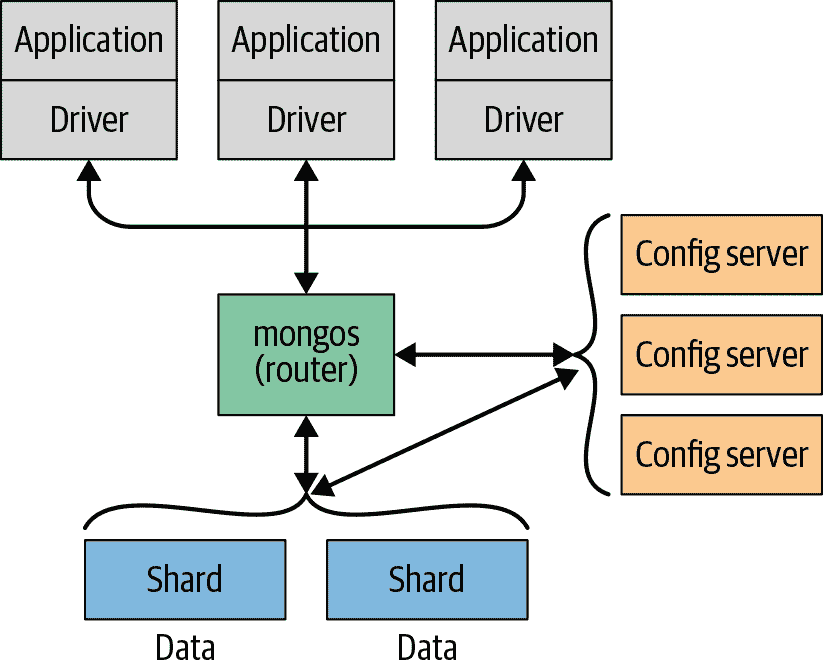

# 第一章：介绍

MongoDB 是一款强大、灵活且可扩展的通用数据库。它结合了横向扩展的能力和诸如次要索引、范围查询、排序、聚合和地理空间索引等功能。本章介绍了使 MongoDB 成为现在的主要设计决策。

# 使用便捷

MongoDB 是一个*面向文档*的数据库，而不是关系型数据库。摆脱关系模型的主要原因是为了更容易地进行横向扩展，但也有其他一些优点。

面向文档的数据库用更灵活的“文档”模型替代了“行”的概念。通过允许嵌入式文档和数组，面向文档的方法可以用单个记录表示复杂的层次关系。这与现代面向对象语言中开发者的数据思维方式自然契合。

同时也没有预定义的模式：文档的键和值不是固定类型或大小的。没有固定的模式，根据需要添加或删除字段变得更加容易。通常情况下，这使得开发速度更快，因为开发者可以快速迭代。这也更容易进行实验。开发者可以尝试数十种数据模型，然后选择最佳模型进行进一步开发。

# 设计用于扩展

应用程序的数据集大小正在以惊人的速度增长。带宽的增加和廉价存储的出现创造了一个环境，即使是小规模应用程序也需要存储比许多数据库所能处理的数据量还要多的数据。一千兆字节的数据，曾经是一个难以置信的信息量，现在却很普遍。

随着开发者需要存储的数据量增加，他们面临一个困难的决定：他们应该如何扩展他们的数据库？扩展数据库涉及选择在扩展上（获取更大的机器）和横向扩展（在更多机器之间分区数据）之间的折衷。扩展上通常是最容易的路径，但有缺点：大型机器通常非常昂贵，并且最终会达到物理极限，即使有再多的资金也无法购买更强大的机器。另一种选择是横向扩展：增加存储空间或增加读写操作的吞吐量，购买额外的服务器，并将它们添加到集群中。这既便宜又可扩展；然而，管理一千台机器比照顾一台机器更困难。

MongoDB 设计用于横向扩展。面向文档的数据模型使得更容易地将数据分割到多个服务器上。MongoDB 会自动处理集群中数据和负载的平衡，自动重新分配文档，并将读写操作路由到正确的机器上，如图 1-1 所示。

###### 图 1-1 横向扩展 MongoDB 通过在多个服务器上进行分片

MongoDB 集群的拓扑结构，或者说是否存在集群而不是仅仅是数据库连接的另一端，对应用程序是透明的。这使开发人员可以专注于编程应用程序，而不是扩展它。同样，如果现有部署的拓扑结构需要更改，以支持更大的负载，应用程序逻辑可以保持不变。

# 功能丰富…

MongoDB 是一个通用数据库，因此除了创建、读取、更新和删除数据外，它还提供了大多数数据库管理系统所期望的功能，以及许多其他使其与众不同的功能。这些包括：

索引

MongoDB 支持通用的二级索引，并提供唯一、复合、地理空间和全文索引的能力。还支持嵌套文档和数组等层次结构上的二级索引，并使开发人员能够充分利用按其应用程序最合适的方式进行建模的能力。

聚合

MongoDB 提供基于数据处理管道概念的聚合框架。聚合管道允许您通过一系列相对简单的阶段在服务器端处理数据，充分利用数据库优化，从而构建复杂的分析引擎。

特殊集合和索引类型

MongoDB 支持生存时间（TTL）集合，用于应在某个特定时间过期的数据，例如会话，以及固定大小（capped）集合，用于保存最近的数据，例如日志。MongoDB 还支持仅限于匹配特定条件筛选器的部分索引，以增加效率并减少所需的存储空间。

文件存储

MongoDB 支持用于存储大文件和文件元数据的易于使用的协议。

MongoDB 中没有出现在关系数据库中常见的某些功能，特别是复杂的连接。MongoDB 通过在 3.2 版本中引入的`$lookup`聚合操作符有非常有限的方式支持连接。在 3.6 版本中，通过多个连接条件以及无关子查询，可以实现更复杂的连接。MongoDB 对连接的处理是为了允许更大的可伸缩性而进行的架构决策，因为在分布式系统中提供这两个功能都很难有效地实现。

# …而不损害速度

性能是 MongoDB 的主要目标，也塑造了其设计的很大部分。它在其 WiredTiger 存储引擎中使用机会锁定以最大化并发性和吞吐量。它尽可能多地使用 RAM 作为其缓存，并尝试自动选择适合查询的正确索引。简而言之，MongoDB 的几乎每个方面都是为了保持高性能而设计的。

尽管 MongoDB 强大，集成了许多关系系统的特性，但并不意味着它要完成关系数据库所能做的一切。在某些功能上，数据库服务器将处理和逻辑卸载到客户端（由驱动程序或用户的应用程序代码处理）。它保持这种简化设计的维护是 MongoDB 能够实现如此高性能的原因之一。

# 哲学

在本书中，我们将花时间记录 MongoDB 开发过程中做出的特定决策背后的推理或动机。通过这些注释，我们希望分享 MongoDB 背后的哲学。然而，总结 MongoDB 项目的最佳方式是引用其主要关注点——创建一个可扩展、灵活且快速的全功能数据存储。
