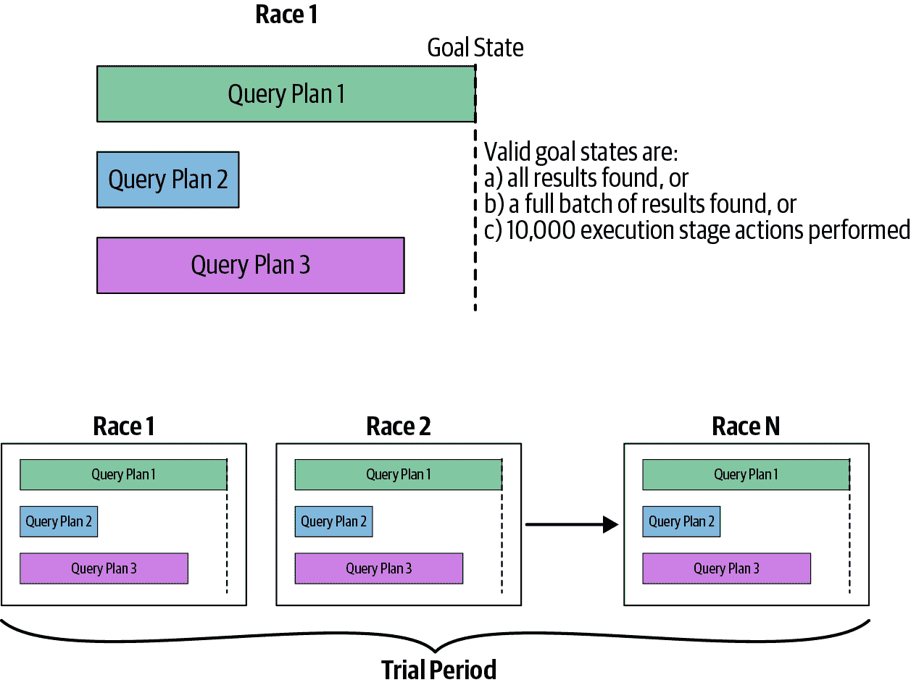

# 第五章：索引

本章介绍了 MongoDB 索引。索引使您能够高效执行查询。它们是应用程序开发的重要组成部分，甚至对某些类型的查询是必需的。本章将涵盖：

+   索引是什么以及为什么要使用它们

+   如何选择要索引的字段

+   如何强制和评估索引使用

+   创建和删除索引的管理细节

如您所见，为您的集合选择合适的索引非常关键以提升性能。

# 索引简介

数据库索引类似于书的索引。与查阅整本书不同，数据库采用一种快捷方式，只查看一个有序列表，并引用其内容。这使得 MongoDB 能够进行数量级更快的查询。

不使用索引的查询称为*集合扫描*，这意味着服务器必须“浏览整本书”以找到查询结果。这个过程基本上就是在没有索引的书中查找信息时所做的事情：从第一页开始阅读整本书。一般情况下，您希望避免使服务器进行集合扫描，因为对于大型集合来说这个过程非常慢。

让我们看一个例子。为了开始，我们将创建一个包含 100 万个文档的集合（或者如果您有耐心，可以是 1000 万或 1 亿个文档）：

```
> for (i=0; i<1000000; i++) {
...     db.users.insertOne(
...         {
...              "i" : i, 
...              "username" : "user"+i,
...              "age" : Math.floor(Math.random()*120), 
...              "created" : new Date()
...         }
...     );
... }
```

接下来我们将查看在此集合上查询的性能差异，首先是没有索引的情况，然后是有索引的情况。

如果我们在这个集合上进行查询，可以使用 `explain` 命令来查看 MongoDB 在执行查询时的操作。使用 `explain` 命令的首选方式是通过包装此命令的游标辅助方法。`explain` 游标方法提供了关于执行各种 CRUD 操作的信息。我们将查看 `executionStats` 模式，因为这有助于我们理解使用索引来满足查询的效果。尝试查询特定用户名以查看示例：

```
> db.users.find({"username": "user101"}).explain("executionStats")
{
    "queryPlanner" : {
        "plannerVersion" : 1,
        "namespace" : "test.users",
        "indexFilterSet" : false,
        "parsedQuery" : {
            "username" : {
                "$eq" : "user101"
            }
        },
        "winningPlan" : {
            "stage" : "COLLSCAN",
            "filter" : {
                "username" : {
                    "$eq" : "user101"
                }
            },
            "direction" : "forward"
        },
        "rejectedPlans" : [ ]
    },
    "executionStats" : {
        "executionSuccess" : true,
        "nReturned" : 1,
        "executionTimeMillis" : 419,
        "totalKeysExamined" : 0,
        "totalDocsExamined" : 1000000,
        "executionStages" : {
            "stage" : "COLLSCAN",
            "filter" : {
                "username" : {
                    "$eq" : "user101"
                }
            },
            "nReturned" : 1,
            "executionTimeMillisEstimate" : 375,
            "works" : 1000002,
            "advanced" : 1,
            "needTime" : 1000000,
            "needYield" : 0,
            "saveState" : 7822,
            "restoreState" : 7822,
            "isEOF" : 1,
            "invalidates" : 0,
            "direction" : "forward",
            "docsExamined" : 1000000
        }
    },
    "serverInfo" : {
        "host" : "eoinbrazil-laptop-osx",
        "port" : 27017,
        "version" : "4.0.12",
        "gitVersion" : "5776e3cbf9e7afe86e6b29e22520ffb6766e95d4"
    },
    "ok" : 1
}
```

“explain 输出” 将解释输出字段；目前您可以忽略其中的几乎所有内容。对于本例子，我们想查看作为 `"executionStats"` 字段值的嵌套文档。在这个文档中，`"totalDocsExamined"` 是 MongoDB 在尝试满足查询时查看的文档数，正如您所看到的，是集合中的每个文档。也就是说，MongoDB 必须查看每个文档中的每个字段。这在我的笔记本电脑上花费了将近半秒钟（`"executionTimeMillis"` 字段显示执行查询花费的毫秒数）。

`"executionStats"` 文档的 `"nReturned"` 字段显示返回的结果数为 `1`，这是有道理的，因为只有一个用户名为 `"user101"` 的用户。请注意，MongoDB 必须查看集合中的每个文档以匹配，因为它不知道用户名是唯一的。

为了使 MongoDB 能够高效地响应查询，在您的应用程序中所有的查询模式都应该有相应的索引支持。所谓查询模式，简单来说，就是应用程序向数据库提出的不同类型的问题。在这个例子中，我们通过用户名查询了 *users* 集合。这是一个具体的查询模式示例。在许多应用程序中，单个索引可以支持多个查询模式。我们将在后面的章节讨论如何根据查询模式定制索引。

## 创建索引

现在让我们尝试在 `"username"` 字段上创建一个索引。要创建索引，我们将使用 `createIndex` 集合方法：

```
> db.users.createIndex({"username" : 1})
{
    "createdCollectionAutomatically" : false,
    "numIndexesBefore" : 1,
    "numIndexesAfter" : 2,
    "ok" : 1
}
```

创建索引不应该花费超过几秒钟的时间，除非你的集合特别大。如果 `createIndex` 调用几秒钟后没有返回，请在另一个 shell 中运行 `db.currentOp()` 或检查 *mongod* 的日志，查看索引构建的进度。

索引建立完成后，请尝试重复原始查询：

```
> db.users.find({"username": "user101"}).explain("executionStats")
{
    "queryPlanner" : {
        "plannerVersion" : 1,
        "namespace" : "test.users",
        "indexFilterSet" : false,
        "parsedQuery" : {
            "username" : {
                "$eq" : "user101"
            }
        },
        "winningPlan" : {
            "stage" : "FETCH",
            "inputStage" : {
                "stage" : "IXSCAN",
                "keyPattern" : {
                    "username" : 1
                },
                "indexName" : "username_1",
                "isMultiKey" : false,
                "multiKeyPaths" : {
                    "username" : [ ]
                },
                "isUnique" : false,
                "isSparse" : false,
                "isPartial" : false,
                "indexVersion" : 2,
                "direction" : "forward",
                "indexBounds" : {
                    "username" : [
                        "[\"user101\", \"user101\"]"
                    ]
                }
            }
        },
        "rejectedPlans" : [ ]
    },
    "executionStats" : {
        "executionSuccess" : true,
        "nReturned" : 1,
        "executionTimeMillis" : 1,
        "totalKeysExamined" : 1,
        "totalDocsExamined" : 1,
        "executionStages" : {
            "stage" : "FETCH",
            "nReturned" : 1,
            "executionTimeMillisEstimate" : 0,
            "works" : 2,
            "advanced" : 1,
            "needTime" : 0,
            "needYield" : 0,
            "saveState" : 0,
            "restoreState" : 0,
            "isEOF" : 1,
            "invalidates" : 0,
            "docsExamined" : 1,
            "alreadyHasObj" : 0,
            "inputStage" : {
                "stage" : "IXSCAN",
                "nReturned" : 1,
                "executionTimeMillisEstimate" : 0,
                "works" : 2,
                "advanced" : 1,
                "needTime" : 0,
                "needYield" : 0,
                "saveState" : 0,
                "restoreState" : 0,
                "isEOF" : 1,
                "invalidates" : 0,
                "keyPattern" : {
                    "username" : 1
                },
                "indexName" : "username_1",
                "isMultiKey" : false,
                "multiKeyPaths" : {
                    "username" : [ ]
                },
                "isUnique" : false,
                "isSparse" : false,
                "isPartial" : false,
                "indexVersion" : 2,
                "direction" : "forward",
                "indexBounds" : {
                    "username" : [
                        "[\"user101\", \"user101\"]"
                    ]
                },
                "keysExamined" : 1,
                "seeks" : 1,
                "dupsTested" : 0,
                "dupsDropped" : 0,
                "seenInvalidated" : 0
            }
        }
    },
    "serverInfo" : {
        "host" : "eoinbrazil-laptop-osx",
        "port" : 27017,
        "version" : "4.0.12",
        "gitVersion" : "5776e3cbf9e7afe86e6b29e22520ffb6766e95d4"
    },
    "ok" : 1
}
```

这个 `explain` 输出比较复杂，但目前你可以忽略除了 `"nReturned"`、`"totalDocsExamined"` 和 `"executionTimeMillis"` 在 `"executionStats"` 嵌套文档中的所有字段。正如你所见，现在查询几乎是瞬时的，而且在查询任何用户名时运行时间相似：

```
>  db.users.find({"username": "user999999"}).explain("executionStats")
```

索引可以显著提高查询时间。然而，索引也有其代价：修改索引字段的写操作（插入、更新和删除）会花费更长时间。这是因为除了更新文档外，MongoDB 还必须在数据变化时更新索引。通常情况下，这种权衡是值得的。难点在于找出哪些字段需要建立索引。

###### 提示

MongoDB 的索引工作方式几乎与典型的关系数据库索引相同，因此如果您熟悉这些内容，您可以仅仅浏览本节以获取语法的具体信息。

要选择哪些字段创建索引，请浏览您频繁查询和需要快速响应的查询，并尝试找到一个共同的键集。例如，在前面的例子中，我们正在查询 `"username"`。如果这是一个特别常见的查询或者成为瓶颈，建立 `"username"` 索引是一个不错的选择。但是，如果这是一个不寻常的查询或者只由不关心花费多长时间的管理员执行的查询，那么建立索引并不是一个好选择。

## 复合索引简介

索引的目的是尽可能提高您的查询效率。对于许多查询模式，基于两个或更多键构建索引是必要的。例如，索引将其所有值保持在排序顺序中，因此通过索引键排序文档速度更快。但是，只有当索引是排序的前缀时，索引才能帮助排序。例如，索引在`"username"`上对于这种排序帮助不大：

```
> db.users.find().sort({"age" : 1, "username" : 1})
```

这按`"age"`然后按`"username"`排序，因此严格按`"username"`排序并不特别有帮助。为了优化这种排序，您可以在`"age"`和`"username"`上建立索引：

```
> db.users.createIndex({"age" : 1, "username" : 1})
```

这被称为*复合索引*，如果您的查询具有多个排序方向或多个条件键，则非常有用。复合索引是对多个字段的索引。

假设我们有一个类似以下这样的*users*集合，如果我们运行一个没有排序的查询（称为自然顺序）：

```
> db.users.find({}, {"_id" : 0, "i" : 0, "created" : 0})
{ "username" : "user0", "age" : 69 }
{ "username" : "user1", "age" : 50 }
{ "username" : "user2", "age" : 88 }
{ "username" : "user3", "age" : 52 }
{ "username" : "user4", "age" : 74 }
{ "username" : "user5", "age" : 104 }
{ "username" : "user6", "age" : 59 }
{ "username" : "user7", "age" : 102 }
{ "username" : "user8", "age" : 94 }
{ "username" : "user9", "age" : 7 }
{ "username" : "user10", "age" : 80 }
...
```

如果我们按`{"age" : 1, "username" : 1}`索引这个集合，索引将有以下形式：

```
[0, "user100020"] -> 8623513776
[0, "user1002"] -> 8599246768
[0, "user100388"] -> 8623560880
...
[0, "user100414"] -> 8623564208
[1, "user100113"] -> 8623525680
[1, "user100280"] -> 8623547056
[1, "user100551"] -> 8623581744
...
[1, "user100626"] -> 8623591344
[2, "user100191"] -> 8623535664
[2, "user100195"] -> 8623536176
[2, "user100197"] -> 8623536432
...
```

每个索引条目包含一个年龄和一个用户名，并指向一个记录标识符。记录标识符由存储引擎内部使用，用于定位文档的数据。注意`"age"`字段被排序为严格升序，并且在每个年龄内，用户名也是按升序排列的。在这个示例数据集中，每个年龄大约有 8,000 个关联的用户名。这里我们只包含了传达一般思想所必需的部分。

MongoDB 使用此索引的方式取决于您正在执行的查询类型。以下是三种最常见的方法：

`db.users.find({"age" : 21}).sort({"username" : -1})`

这是一个等值查询，搜索单个值。可能存在多个具有该值的文档。由于索引中的第二个字段，结果已按正确的排序顺序排列：MongoDB 可以从`{"age" : 21}`的最后匹配开始，并按顺序遍历索引：

```
[21, "user100154"] -> 8623530928
[21, "user100266"] -> 8623545264
[21, "user100270"] -> 8623545776
[21, "user100285"] -> 8623547696
[21, "user100349"] -> 8623555888
...
```

这种类型的查询非常高效：MongoDB 可以直接跳转到正确的年龄，而不需要对结果进行排序，因为遍历索引会按正确顺序返回数据。

注意排序方向无关紧要：MongoDB 可以以任意方向遍历索引。

`db.users.find({"age" : {"$gte" : 21, "$lte" : 30}})`

这是一个范围查询，查找匹配多个值的文档（在本例中，所有年龄在 21 到 30 之间的）。MongoDB 将使用索引中的第一个键`"age"`返回匹配的文档，如下所示：

```
[21, "user100154"] -> 8623530928
[21, "user100266"] -> 8623545264
[21, "user100270"] -> 8623545776
...
[21, "user999390"] -> 8765250224
[21, "user999407"] -> 8765252400
[21, "user999600"] -> 8765277104
[22, "user100017"] -> 8623513392
...
[29, "user999861"] -> 8765310512
[30, "user100098"] -> 8623523760
[30, "user100155"] -> 8623531056
[30, "user100168"] -> 8623532720
...
```

一般来说，如果 MongoDB 为查询使用索引，它将按索引顺序返回结果文档。

`db.users.find({"age" : {"$gte" : 21, "$lte" : 30}}).sort({"username" : 1})`

这是一个多值查询，与之前的查询类似，但这次有一个排序。与之前一样，MongoDB 将使用索引来匹配条件。然而，索引不会按照用户名的顺序返回用户名，而查询要求结果按用户名排序。这意味着 MongoDB 需要在返回结果之前在内存中对结果进行排序，而不是简单地遍历一个已按所需顺序排序的索引中的文档。因此，这种类型的查询通常效率较低。

当然，速度取决于有多少结果符合您的条件：如果您的结果集只有几个文档，MongoDB 将不需要太多工作来对它们进行排序，但如果结果更多，速度会较慢，甚至可能根本无法工作。如果结果超过 32 MB，MongoDB 将直接报错，拒绝对如此多的数据进行排序：

```
Error: error: {
    "ok" : 0,
    "errmsg" : "Executor error during find command: OperationFailed: 
Sort operation used more than the maximum 33554432 bytes of RAM. Add 
an index, or specify a smaller limit.",
    "code" : 96,
    "codeName" : "OperationFailed"
}
```

###### 小贴士

如果您需要避免此错误，则必须创建一个支持排序操作的索引（[*https://docs.mongodb.com/manual/reference/method/cursor.sort/index.html#sort-index-use*](https://docs.mongodb.com/manual/reference/method/cursor.sort/index.html#sort-index-use)）或者在使用 `sort` 与 `limit` 结合以将结果减少到 32 MB 以下。

在上一个例子中，您可以使用的另一个索引是相同键的倒序排列：`{"username" : 1, "age" : 1}`。MongoDB 将遍历所有索引条目，但按您希望它们返回的顺序进行。它将使用索引的`"age"`部分来选择匹配的文档：

```
[user0, 4]
[user1, 67]
[user10, 11]
[user100, 92]
[user1000, 10]
[user10000, 31]
[user100000, 21] -> 8623511216
[user100001, 52]
[user100002, 69]
[user100003, 27] -> 8623511600
[user100004, 22] -> 8623511728
[user100005, 95]
...
```

这样做的好处是不需要任何大内存排序。然而，它必须扫描整个索引以找到所有匹配项。将排序键放在首位通常是设计复合索引时的一个好策略。稍后我们会看到，在考虑如何构建考虑等值查询、多值查询和排序的复合索引时，这是几个最佳实践之一。

## MongoDB 如何选择索引

现在让我们看看 MongoDB 是如何选择索引来满足查询的。假设我们有五个索引。当一个查询进来时，MongoDB 会看这个查询的*形状*。形状涉及到搜索哪些字段以及额外的信息，比如是否有排序。根据这些信息，系统确定了一组可能用于满足查询的候选索引。

假设我们有一个查询进来，我们的五个索引中有三个被标识为该查询的候选索引。MongoDB 随后会为这三个索引创建三个查询计划，并在三个并行线程中运行查询，每个线程使用不同的索引。这里的目标是看哪个能够最快地返回结果。

从视觉上来看，我们可以把这个过程想象成一场比赛，如图 5-1 所示。这里的想法是，首个达到目标状态的查询计划将获胜。但更重要的是，未来将选择它作为具有相同查询形状的查询所使用的索引。这些计划在一段时间内进行比赛（称为试验期），之后每场比赛的结果将用于计算总体获胜计划。



###### 图 5-1\. MongoDB 查询规划器如何选择索引，视觉化为一场比赛

要赢得比赛，查询线程必须首先返回所有查询结果或按顺序返回一定数量的试验结果。考虑到在内存中执行排序的昂贵性，排序顺序部分尤为重要。

将几个查询计划相互比赛的真正价值在于，对于具有相同查询形状的后续查询，MongoDB 服务器将知道选择哪个索引。服务器维护一个查询计划的缓存。获胜计划将存储在缓存中，以备将来用于该形状的查询。随着集合的变化和索引的变化，随着时间的推移，某个查询计划可能会从缓存中删除，MongoDB 会再次尝试可能的查询计划，以找到最适合当前集合和索引集的计划。导致计划从缓存中删除的其他事件包括重建给定索引、添加或删除索引，或显式清除计划缓存。最后，查询计划缓存在 *mongod* 进程重新启动后不会保留。

## 使用复合索引

在之前的章节中，我们一直在使用复合索引，即在其中具有多个键的索引。复合索引比单键索引更加复杂，但它们非常强大。本节将更深入地介绍它们。

在这里，我们将通过一个例子来逐步说明当您设计复合索引时需要考虑的思路类型。我们的目标是使我们的读取和写入操作尽可能高效——但与许多事物一样，这需要一些前期思考和实验。

确保我们放置正确的索引非常重要，有必要在某些真实工作负载下测试我们的索引，并从中进行调整。然而，在设计我们的索引时，我们可以应用一些最佳实践。

首先，我们需要考虑索引的选择性。我们对于特定的查询模式，索引在最小化扫描记录数方面的作用感兴趣。我们需要在考虑满足查询所需的所有操作时，有时需要进行权衡。例如，我们需要考虑如何处理排序操作。

让我们来看一个例子。为此，我们将使用包含约一百万条记录的学生数据集。该数据集中的文档如下所示：

```
{
    "_id" : ObjectId("585d817db4743f74e2da067c"),
    "student_id" : 0,
    "scores" : [
    {
        "type" : "exam",
        "score" : 38.05000060199827
    },
    {
        "type" : "quiz",
        "score" : 79.45079445008987
    },
    {
        "type" : "homework",
        "score" : 74.50150548699534
    },
    {
        "type" : "homework",
        "score" : 74.68381684615845
    }
    ],
    "class_id" : 127
}
```

我们将从两个索引开始，并查看 MongoDB 如何使用（或不使用）这些索引来满足查询。这两个索引的创建方式如下：

```
> db.students.createIndex({"class_id": 1})
> db.students.createIndex({student_id: 1, class_id: 1})
```

在处理这个数据集时，我们将考虑以下查询，因为它展示了我们在设计索引时需要考虑的几个问题：

```
> db.students.find({student_id:{$gt:500000}, class_id:54})
...          .sort({student_id:1})
...          .explain("executionStats")
```

请注意，在此查询中，我们要求所有 ID 大于 500,000 的记录，大约占记录总数的一半。我们还限制搜索以查找 ID 为 `54` 的类别的记录。在这个数据集中，大约有 500 个类别。最后，我们按照 `"student_id"` 的升序排序。请注意，这是我们进行多值查询的同一字段。在本例中，我们将查看 `explain` 方法提供的执行统计信息，以说明 MongoDB 如何处理此查询。

如果我们运行此查询，`explain` 方法的输出告诉我们 MongoDB 如何使用索引来满足它：

```
{
  "queryPlanner": {
    "plannerVersion": 1,
    "namespace": "school.students",
    "indexFilterSet": false,
    "parsedQuery": {
      "$and": [
        {
          "class_id": {
            "$eq": 54
          }
        },
        {
          "student_id": {
            "$gt": 500000
          }
        }
      ]
    },
    "winningPlan": {
      "stage": "FETCH",
      "inputStage": {
        "stage": "IXSCAN",
        "keyPattern": {
          "student_id": 1,
          "class_id": 1
        },
        "indexName": "student_id_1_class_id_1",
        "isMultiKey": false,
        "multiKeyPaths": {
          "student_id": [ ],
          "class_id": [ ]
        },
        "isUnique": false,
        "isSparse": false,
        "isPartial": false,
        "indexVersion": 2,
        "direction": "forward",
        "indexBounds": {
          "student_id": [
            "(500000.0, inf.0]"
          ],
          "class_id": [
            "[54.0, 54.0]"
          ]
        }
      }
    },
    "rejectedPlans": [
      {
        "stage": "SORT",
        "sortPattern": {
          "student_id": 1
        },
        "inputStage": {
          "stage": "SORT_KEY_GENERATOR",
          "inputStage": {
            "stage": "FETCH",
            "filter": {
              "student_id": {
                "$gt": 500000
              }
            },
            "inputStage": {
              "stage": "IXSCAN",
              "keyPattern": {
                "class_id": 1
              },
              "indexName": "class_id_1",
              "isMultiKey": false,
              "multiKeyPaths": {
                "class_id": [ ]
              },
              "isUnique": false,
              "isSparse": false,
              "isPartial": false,
              "indexVersion": 2,
              "direction": "forward",
              "indexBounds": {
                "class_id": [
                  "[54.0, 54.0]"
                ]
              }
            }
          }
        }
      }
    ]
  },
  "executionStats": {
    "executionSuccess": true,
    "nReturned": 9903,
    "executionTimeMillis": 4325,
    "totalKeysExamined": 850477,
    "totalDocsExamined": 9903,
    "executionStages": {
      "stage": "FETCH",
      "nReturned": 9903,
      "executionTimeMillisEstimate": 3485,
      "works": 850478,
      "advanced": 9903,
      "needTime": 840574,
      "needYield": 0,
      "saveState": 6861,
      "restoreState": 6861,
      "isEOF": 1,
      "invalidates": 0,
      "docsExamined": 9903,
      "alreadyHasObj": 0,
      "inputStage": {
        "stage": "IXSCAN",
        "nReturned": 9903,
        "executionTimeMillisEstimate": 2834,
        "works": 850478,
        "advanced": 9903,
        "needTime": 840574,
        "needYield": 0,
        "saveState": 6861,
        "restoreState": 6861,
        "isEOF": 1,
        "invalidates": 0,
        "keyPattern": {
          "student_id": 1,
          "class_id": 1
        },
        "indexName": "student_id_1_class_id_1",
        "isMultiKey": false,
        "multiKeyPaths": {
          "student_id": [ ],
          "class_id": [ ]
        },
        "isUnique": false,
        "isSparse": false,
        "isPartial": false,
        "indexVersion": 2,
        "direction": "forward",
        "indexBounds": {
          "student_id": [
            "(500000.0, inf.0]"
          ],
          "class_id": [
            "[54.0, 54.0]"
          ]
        },
        "keysExamined": 850477,
        "seeks": 840575,
        "dupsTested": 0,
        "dupsDropped": 0,
        "seenInvalidated": 0
      }
    }
  },
  "serverInfo": {
    "host": "SGB-MBP.local",
    "port": 27017,
    "version": "3.4.1",
    "gitVersion": "5e103c4f5583e2566a45d740225dc250baacfbd7"
  },
  "ok": 1
}
```

与大多数从 MongoDB 输出的数据一样，`explain` 的输出是 JSON 格式的。让我们首先看看输出的底部，几乎完全是执行统计信息。`"executionStats"` 字段包含描述已完成的查询执行的统计信息，用于获胜查询计划。稍后我们将查看查询计划和 `explain` 输出中的查询计划输出。

在 `"executionStats"` 中，首先我们将查看 `"totalKeysExamined"`。这是 MongoDB 为了生成结果集而遍历的索引键的数量。我们可以将 `"totalKeysExamined"` 与 `"nReturned"` 进行比较，以了解 MongoDB 为了找到与查询匹配的文档而必须遍历索引的多少部分。在这种情况下，检查了 850,477 个索引键以定位 9,903 个匹配的文档。

这意味着用于满足此查询的索引选择性不高。这一点进一步强调了查询运行超过 4.3 秒的事实，如 `"executionTimeMillis"` 字段所示。在设计索引时，选择性是我们的主要目标之一，因此让我们找出我们在为此查询设计的现有索引出了什么问题。

在 `explain` 输出的顶部附近是获胜的查询计划（参见 `"winningPlan"` 字段）。查询计划描述了 MongoDB 用于满足查询的步骤。这是几种不同查询计划竞争的具体结果，以 JSON 形式呈现。特别是，我们对使用了哪些索引以及 MongoDB 是否需要在内存中排序感兴趣。在获胜计划下面是被拒绝的计划。我们将查看这两者。

在这种情况下，获胜计划使用了基于 `"student_id"` 和 `"class_id"` 的复合索引。这在 `explain` 输出的以下部分中明显可见：

```
"winningPlan": {
  "stage": "FETCH",
  "inputStage": {
    "stage": "IXSCAN",
    "keyPattern": {
      "student_id": 1,
      "class_id": 1
    },
```

`explain`输出将查询计划表示为一个阶段树。一个阶段可以有一个或多个输入阶段，这取决于它有多少子阶段。一个输入阶段向其父级提供文档或索引键。在本例中，有一个输入阶段，即索引扫描，该扫描为与查询匹配的文档提供了记录 ID，传递给其父级`"FETCH"`阶段。然后，`"FETCH"`阶段将检索文档本身，并根据客户端请求逐批返回它们。

失败的查询计划——只有一个——本应使用基于`"class_id"`的索引，但随后需要在内存中进行排序。这就是特定查询计划的以下部分的含义。当你在查询计划中看到`"SORT"`阶段时，意味着 MongoDB 无法使用索引对结果集进行排序，而必须在内存中进行排序：

```
"rejectedPlans": [
  {
    "stage": "SORT",
    "sortPattern": {
      "student_id": 1
    },
```

对于这个查询，获胜的索引是能够返回排序输出的索引。要赢得它，它只需达到一定数量的已排序结果文档的试验号。对于另一个计划要获胜，那个查询线程必须首先返回整个结果集（将近 10,000 个文档），因为然后需要在内存中对其进行排序。

这里的问题是选择性的问题。我们正在运行的多值查询指定了一个广泛范围的`"student_id"`值，因为它请求`"student_id"`大于 500,000 的记录，这大约占我们收藏中的一半记录。这里再次为了方便，列出我们正在运行的查询：

```
> db.students.find({student_id:{$gt:500000}, class_id:54})
...          .sort({student_id:1})
...          .explain("executionStats")
```

现在，我相信你可以看出我们将要讨论的内容。此查询包含多值部分和相等部分。相等部分是我们要求所有`"class_id"`等于`54`的记录。在这个数据集中只有大约 500 个班级，尽管有许多学生在这些班级中获得了成绩，`"class_id"`作为执行此查询的更为选择性的依据。正是这个值将我们的结果集约束在不到 10,000 条记录，而不是此查询的多值部分所识别的大约 850,000 条记录。

换句话说，考虑到我们拥有的索引，如果我们使用仅基于`"class_id"`的索引——即失败的查询计划中的索引——会更好。MongoDB 提供了两种强制数据库使用特定索引的方法。但是，我强调你应该谨慎使用这些方式，以覆盖查询规划器的结果。这些不是你应该在生产环境中使用的技术。

游标 `hint` 方法使我们能够指定要使用的特定索引，可以通过指定其形状或名称来实现。索引过滤器使用查询形状，这是查询、排序和投影规范的组合。`planCacheSetFilter` 函数可以与索引过滤器一起使用，以限制查询优化器仅考虑索引过滤器中指定的索引。如果查询形状存在索引过滤器，MongoDB 将忽略 `hint`。索引过滤器仅在 *mongod* 服务器进程的持续时间内存在；它们在关闭后不会持续存在。

如果我们稍微改变查询，使用 `hint`，如下例所示，`explain` 输出将会有很大不同：

```
> db.students.find({student_id:{$gt:500000}, class_id:54})
...          .sort({student_id:1})
...          .hint({class_id:1})
...          .explain("executionStats")
```

结果输出显示，我们现在从扫描大约 850,000 个索引键减少到大约 20,000 个，以便获得我们少于 10,000 个结果集。此外，执行时间仅为 272 毫秒，而不是使用其他索引的查询计划时的 4.3 秒：

```
{
  "queryPlanner": {
    "plannerVersion": 1,
    "namespace": "school.students",
    "indexFilterSet": false,
    "parsedQuery": {
      "$and": [
        {
          "class_id": {
            "$eq": 54
          }
        },
        {
          "student_id": {
            "$gt": 500000
          }
        }
      ]
    },
    "winningPlan": {
      "stage": "SORT",
      "sortPattern": {
        "student_id": 1
      },
      "inputStage": {
        "stage": "SORT_KEY_GENERATOR",
        "inputStage": {
          "stage": "FETCH",
          "filter": {
            "student_id": {
              "$gt": 500000
            }
          },
          "inputStage": {
            "stage": "IXSCAN",
            "keyPattern": {
              "class_id": 1
            },
            "indexName": "class_id_1",
            "isMultiKey": false,
            "multiKeyPaths": {
              "class_id": [ ]
            },
            "isUnique": false,
            "isSparse": false,
            "isPartial": false,
            "indexVersion": 2,
            "direction": "forward",
            "indexBounds": {
              "class_id": [
                "[54.0, 54.0]"
              ]
            }
          }
        }
      }
    },
    "rejectedPlans": [ ]
  },
  "executionStats": {
    "executionSuccess": true,
    "nReturned": 9903,
    "executionTimeMillis": 272,
    "totalKeysExamined": 20076,
    "totalDocsExamined": 20076,
    "executionStages": {
      "stage": "SORT",
      "nReturned": 9903,
      "executionTimeMillisEstimate": 248,
      "works": 29982,
      "advanced": 9903,
      "needTime": 20078,
      "needYield": 0,
      "saveState": 242,
      "restoreState": 242,
      "isEOF": 1,
      "invalidates": 0,
      "sortPattern": {
        "student_id": 1
      },
      "memUsage": 2386623,
      "memLimit": 33554432,
      "inputStage": {
        "stage": "SORT_KEY_GENERATOR",
        "nReturned": 9903,
        "executionTimeMillisEstimate": 203,
        "works": 20078,
        "advanced": 9903,
        "needTime": 10174,
        "needYield": 0,
        "saveState": 242,
        "restoreState": 242,
        "isEOF": 1,
        "invalidates": 0,
        "inputStage": {
          "stage": "FETCH",
          "filter": {
            "student_id": {
              "$gt": 500000
            }
          },
          "nReturned": 9903,
          "executionTimeMillisEstimate": 192,
          "works": 20077,
          "advanced": 9903,
          "needTime": 10173,
          "needYield": 0,
          "saveState": 242,
          "restoreState": 242,
          "isEOF": 1,
          "invalidates": 0,
          "docsExamined": 20076,
          "alreadyHasObj": 0,
          "inputStage": {
            "stage": "IXSCAN",
            "nReturned": 20076,
            "executionTimeMillisEstimate": 45,
            "works": 20077,
            "advanced": 20076,
            "needTime": 0,
            "needYield": 0,
            "saveState": 242,
            "restoreState": 242,
            "isEOF": 1,
            "invalidates": 0,
            "keyPattern": {
              "class_id": 1
            },
            "indexName": "class_id_1",
            "isMultiKey": false,
            "multiKeyPaths": {
              "class_id": [ ]
            },
            "isUnique": false,
            "isSparse": false,
            "isPartial": false,
            "indexVersion": 2,
            "direction": "forward",
            "indexBounds": {
              "class_id": [
                "[54.0, 54.0]"
              ]
            },
            "keysExamined": 20076,
            "seeks": 1,
            "dupsTested": 0,
            "dupsDropped": 0,
            "seenInvalidated": 0
          }
        }
      }
    }
  },
  "serverInfo": {
    "host": "SGB-MBP.local",
    "port": 27017,
    "version": "3.4.1",
    "gitVersion": "5e103c4f5583e2566a45d740225dc250baacfbd7"
  },
  "ok": 1
}
```

然而，我们真正希望看到的是 `"nReturned"` 接近 `"totalKeysExamined"`。此外，我们希望避免使用 `hint` 以更有效地执行此查询。解决这两个问题的方法是设计一个更好的索引。

对于问题中的查询模式，更好的索引是基于 `"class_id"` 和 `"student_id"` 的索引，按照这个顺序。以 `"class_id"` 作为前缀，我们在查询中使用等值过滤器来限制在索引中考虑的键。这是查询中最具选择性的组件，因此有效地限制了 MongoDB 需要考虑的键的数量以满足此查询。我们可以如下构建这个索引：

```
> db.students.createIndex({class_id:1, student_id:1})
```

尽管对于绝对每个数据集都不是真实的，但通常你应该设计复合索引，使得那些你将使用等值过滤器的字段位于你的应用程序将使用多值过滤器的字段之前。

有了我们的新索引，如果重新运行我们的查询，这次不需要提示，我们可以从 `explain` 输出的 `"executionStats"` 字段看到，我们有一个快速的查询（37 毫秒），其中返回的结果数 (`"nReturned"`) 等于索引中扫描的键数 (`"totalKeysExamined"`)。我们还可以看到，这是因为 `"executionStages"` 反映了获胜的查询计划，其中包含使用我们创建的新索引的索引扫描：

```
...
"executionStats": {
  "executionSuccess": true,
  "nReturned": 9903,
  "executionTimeMillis": 37,
  "totalKeysExamined": 9903,
  "totalDocsExamined": 9903,
  "executionStages": {
    "stage": "FETCH",
    "nReturned": 9903,
    "executionTimeMillisEstimate": 36,
    "works": 9904,
    "advanced": 9903,
    "needTime": 0,
    "needYield": 0,
    "saveState": 81,
    "restoreState": 81,
    "isEOF": 1,
    "invalidates": 0,
    "docsExamined": 9903,
    "alreadyHasObj": 0,
    "inputStage": {
      "stage": "IXSCAN",
      "nReturned": 9903,
      "executionTimeMillisEstimate": 0,
      "works": 9904,
      "advanced": 9903,
      "needTime": 0,
      "needYield": 0,
      "saveState": 81,
      "restoreState": 81,
      "isEOF": 1,
      "invalidates": 0,
      "keyPattern": {
        "class_id": 1,
        "student_id": 1
      },
      "indexName": "class_id_1_student_id_1",
      "isMultiKey": false,
      "multiKeyPaths": {
        "class_id": [ ],
        "student_id": [ ]
      },
      "isUnique": false,
      "isSparse": false,
      "isPartial": false,
      "indexVersion": 2,
      "direction": "forward",
      "indexBounds": {
        "class_id": [
          "[54.0, 54.0]"
        ],
        "student_id": [
          "(500000.0, inf.0]"
        ]
      },
      "keysExamined": 9903,
      "seeks": 1,
      "dupsTested": 0,
      "dupsDropped": 0,
      "seenInvalidated": 0
    }
  }
},
```

考虑到我们对索引构建方式的了解，你可能能够理解为什么这会奏效。`[class_id, student_id]` 索引由以下类似的键对组成。由于学生 ID 在这些键对中是有序的，为了满足我们的排序，MongoDB 只需遍历以 `class_id` `54` 开头的所有键对：

```
...
[53, 999617]
[53, 999780]
[53, 999916]
[54, 500001]
[54, 500009]
[54, 500048]
...
```

在考虑复合索引设计时，我们需要知道如何处理常见查询模式的等值过滤器、多值过滤器和排序组件。对于所有复合索引，必须考虑这三个因素，如果您设计您的索引以正确平衡这些问题，您将获得 MongoDB 查询的最佳性能。虽然我们已经通过`[class_id, student_id]`索引解决了我们示例查询的所有三个因素，但是由于我们正在对其中一个我们也正在过滤的字段进行排序，所以该查询作为复合索引问题的一个特例。

为了消除这个示例的特例性质，让我们改为按照最终成绩排序，修改我们的查询如下：

```
> db.students.find({student_id:{$gt:500000}, class_id:54})
...          .sort({final_grade:1})
...          .explain("executionStats")
```

如果我们运行此查询并查看`explain`输出，我们会看到我们现在正在执行内存排序。虽然查询仍然快速，只需 136 毫秒，但比在`"student_id"`上排序慢一个数量级，因为我们现在正在执行内存排序。我们可以看到我们正在执行内存排序，因为获胜查询计划现在包含一个`"SORT"`阶段：

```
...
"executionStats": {
  "executionSuccess": true,
  "nReturned": 9903,
  "executionTimeMillis": 136,
  "totalKeysExamined": 9903,
  "totalDocsExamined": 9903,
  "executionStages": {
    "stage": "SORT",
    "nReturned": 9903,
    "executionTimeMillisEstimate": 36,
    "works": 19809,
    "advanced": 9903,
    "needTime": 9905,
    "needYield": 0,
    "saveState": 315,
    "restoreState": 315,
    "isEOF": 1,
    "invalidates": 0,
    "sortPattern": {
      "final_grade": 1
    },
    "memUsage": 2386623,
    "memLimit": 33554432,
    "inputStage": {
      "stage": "SORT_KEY_GENERATOR",
      "nReturned": 9903,
      "executionTimeMillisEstimate": 24,
      "works": 9905,
      "advanced": 9903,
      "needTime": 1,
      "needYield": 0,
      "saveState": 315,
      "restoreState": 315,
      "isEOF": 1,
      "invalidates": 0,
      "inputStage": {
        "stage": "FETCH",
        "nReturned": 9903,
        "executionTimeMillisEstimate": 24,
        "works": 9904,
        "advanced": 9903,
        "needTime": 0,
        "needYield": 0,
        "saveState": 315,
        "restoreState": 315,
        "isEOF": 1,
        "invalidates": 0,
        "docsExamined": 9903,
        "alreadyHasObj": 0,
        "inputStage": {
          "stage": "IXSCAN",
          "nReturned": 9903,
          "executionTimeMillisEstimate": 12,
          "works": 9904,
          "advanced": 9903,
          "needTime": 0,
          "needYield": 0,
          "saveState": 315,
          "restoreState": 315,
          "isEOF": 1,
          "invalidates": 0,
          "keyPattern": {
            "class_id": 1,
            "student_id": 1
          },
          "indexName": "class_id_1_student_id_1",
          "isMultiKey": false,
          "multiKeyPaths": {
            "class_id": [ ],
            "student_id": [ ]
          },
          "isUnique": false,
          "isSparse": false,
          "isPartial": false,
          "indexVersion": 2,
          "direction": "forward",
          "indexBounds": {
            "class_id": [
              "[54.0, 54.0]"
            ],
            "student_id": [
              "(500000.0, inf.0]"
            ]
          },
          "keysExamined": 9903,
          "seeks": 1,
          "dupsTested": 0,
          "dupsDropped": 0,
          "seenInvalidated": 0
        }
      }
    }
  }
},
...
```

如果我们可以通过更好的索引设计避免内存排序，那就应该这么做。这将使我们能够更轻松地应对数据集大小和系统负载。

但是要做到这一点，我们将不得不做出一个权衡。这在设计复合索引时通常是必要的。

对于复合索引经常必须做的是，为了避免内存排序，我们需要检查更多的键比我们返回的文档数目。为了使用索引进行排序，MongoDB 需要能够按顺序遍历索引键。这意味着我们需要在复合索引键中包括排序字段。

我们新的复合索引中键的顺序应该如下：`[class_id, final_grade, student_id]`。请注意，我们在等值过滤器之后但在多值过滤器之前包括排序组件。这个索引将非常有选择地缩小此查询考虑的键集合。然后，通过遍历与此索引中等值过滤器匹配的键三元组，MongoDB 可以识别匹配多值过滤器的记录，并且这些记录将按照最终成绩升序正确排序。

这个复合索引强制 MongoDB 检查的键比最终将在我们的结果集中结束的文档数多。然而，通过使用索引来确保我们已经排序的文档，我们节省了执行时间。我们可以使用以下命令构建新索引：

```
> db.students.createIndex({class_id:1, final_grade:1, student_id:1})
```

现在，如果我们再次发出我们的查询：

```
> db.students.find({student_id:{$gt:500000}, class_id:54})
...          .sort({final_grade:1})
...          .explain("executionStats")
```

我们从`explain`输出中得到以下`"executionStats"`。这会根据您的硬件和系统中的其他活动而变化，但您可以看到获胜计划不再包括内存排序。相反，它使用我们刚刚创建的索引来满足查询，包括排序：

```
"executionStats": {
  "executionSuccess": true,
  "nReturned": 9903,
  "executionTimeMillis": 42,
  "totalKeysExamined": 9905,
  "totalDocsExamined": 9903,
  "executionStages": {
    "stage": "FETCH",
    "nReturned": 9903,
    "executionTimeMillisEstimate": 34,
    "works": 9905,
    "advanced": 9903,
    "needTime": 1,
    "needYield": 0,
    "saveState": 82,
    "restoreState": 82,
    "isEOF": 1,
    "invalidates": 0,
    "docsExamined": 9903,
    "alreadyHasObj": 0,
    "inputStage": {
      "stage": "IXSCAN",
      "nReturned": 9903,
      "executionTimeMillisEstimate": 24,
      "works": 9905,
      "advanced": 9903,
      "needTime": 1,
      "needYield": 0,
      "saveState": 82,
      "restoreState": 82,
      "isEOF": 1,
      "invalidates": 0,
      "keyPattern": {
        "class_id": 1,
        "final_grade": 1,
        "student_id": 1
      },
      "indexName": "class_id_1_final_grade_1_student_id_1",
      "isMultiKey": false,
      "multiKeyPaths": {
        "class_id": [ ],
        "final_grade": [ ],
        "student_id": [ ]
      },
      "isUnique": false,
      "isSparse": false,
      "isPartial": false,
      "indexVersion": 2,
      "direction": "forward",
      "indexBounds": {
        "class_id": [
          "[54.0, 54.0]"
        ],
        "final_grade": [
          "[MinKey, MaxKey]"
        ],
        "student_id": [
          "(500000.0, inf.0]"
        ]
      },
      "keysExamined": 9905,
      "seeks": 2,
      "dupsTested": 0,
      "dupsDropped": 0,
      "seenInvalidated": 0
    }
  }
},
```

本节提供了设计复合索引的一些最佳实践的具体示例。虽然这些指南并不适用于每一种情况，但对大多数情况有效，并且应该是你在构建复合索引时首先考虑的想法。

总结一下，在设计复合索引时：

+   用于等值过滤器的键应该首先出现。

+   用于排序的键应该出现在多值字段之前。

+   用于多值过滤器的键应该最后出现。

根据这些指南设计你的复合索引，然后在真实的工作负载下测试它，以支持索引设计的查询模式范围。

### 选择键的方向

到目前为止，我们所有的索引条目都按升序或最小至最大的顺序排序。然而，如果你需要根据两个（或更多）标准进行排序，可能需要让索引键以不同的方向排列。例如，回到我们早期的例子，假设我们想按年龄从小到大和按名称从 Z 到 A 对集合进行排序。我们之前的索引对于这个问题不是很有效：在每个年龄组内，用户按用户名升序（A-Z，而不是 Z-A）排序。到目前为止，我们使用的复合索引没有以任何有用的顺序保存值，以获得`"age"`升序和`"username"`降序。

要优化不同方向的复合排序，我们需要使用具有匹配方向的索引。在这个例子中，我们可以使用`{"age" : 1, "username" : -1}`，这将按以下方式组织数据：

```
[21, user999600] -> 8765277104
[21, user999407] -> 8765252400
[21, user999390] -> 8765250224
...
[21, user100270] -> 8623545776
[21, user100266] -> 8623545264
[21, user100154] -> 8623530928
...
[30, user100168] -> 8623532720
[30, user100155] -> 8623531056
[30, user100098] -> 8623523760
```

年龄从小到大排列，在每个年龄段内，用户名从 Z 到 A 排序（或者说是从 9 到 0，鉴于我们的用户名）。

如果我们的应用程序还需要优化`{"age" : 1, "username" : 1}`的排序，我们需要创建一个带有这些方向的第二个索引。要确定索引使用的方向，只需匹配你的排序使用的方向。请注意，反向索引（每个方向乘以-1）是等效的：`{"age" : 1, "username" : -1}`适用于与`{"age" : -1, "username" : 1}`相同的查询。

索引方向只在基于多个标准进行排序时才真正重要。如果仅按单个键排序，MongoDB 可以轻松地以相反顺序读取索引。例如，如果你按`{"age" : -1}`排序并且有一个`{"age" : 1}`的索引，MongoDB 可以像在`{"age" : -1}`上创建索引一样进行优化（因此不要同时创建两者！）。方向仅对多键排序有效。

### 使用覆盖查询

在前面的例子中，索引总是用于查找正确的文档，然后跟随指针返回以获取实际文档。但是，如果您的查询只是查找索引中包含的字段，它就不需要获取文档。当索引包含查询请求的所有值时，该查询被认为是*covered*。在实际操作中，优先使用 covered 查询，而不是返回文档。这样可以显著减少您的工作集。

要确保查询只使用索引，您应该使用投影（限制返回的字段仅限于查询中指定的字段；参见“指定要返回的键”）来避免返回`"_id"`字段（除非它是索引的一部分）。您可能还需要对未查询的字段创建索引，因此您应该在提高查询速度和写入开销之间取得平衡。

如果在一个 covered 查询上运行`explain`，结果会有一个不是`"FETCH"`阶段后代的`"IXSCAN"`阶段，并且在`"executionStats"`中，`"totalDocsExamined"`的值为`0`。

### 隐式索引

复合索引可以“双重职能”，对不同的查询起到不同的索引作用。例如，如果我们在`{"age": 1, "username": 1}`上有一个索引，则`"age"`字段的排序方式与仅在`{"age": 1}`上有索引时相同。因此，复合索引可以像仅在`{"age": 1}`上有索引时那样使用。

这可以推广到任意数量的键：如果一个索引有*N*个键，您可以在这些键的任何前缀上获得一个“免费”的索引。例如，如果我们有一个看起来像`{"a": 1, "b": 1, "c": 1, ..., "z": 1}`的索引，我们实际上有`{"a": 1}`、`{"a": 1, "b" : 1}`、`{"a": 1, "b": 1, "c": 1}`等索引。

注意，这并不适用于*任何*键的子集：例如，使用索引`{"b": 1}`或`{"a": 1, "c": 1}`的查询都不会被优化。只有能使用索引前缀的查询才能利用它。

## $操作符如何使用索引

一些查询可以比其他查询更有效地使用索引；有些查询根本不能使用索引。本节介绍了 MongoDB 如何处理各种查询操作符。

### 低效的操作符

总的来说，否定操作效率低下。`"$ne"`查询可以使用索引，但效果不佳。它们必须查看除了`"$ne"`指定的条目之外的所有索引条目，因此基本上必须扫描整个索引。例如，对于一个具有字段名为`"i"`的集合，在这样一个查询中遍历的索引范围如下：

```
db.example.find({"i" : {"$ne" : 3}}).explain()
{
    "queryPlanner" : {
        ...,
        "parsedQuery" : {
            "i" : {
                "$ne" : "3"
            }
        },
        "winningPlan" : {
        {
            ...,
            "indexBounds" : {
                "i" : [
                    [
                        {
                            "$minElement" : 1
                        },
                        3
                    ],
                    [
                        3,
                        {
                            "$maxElement" : 1
                        }
                    ]
                ]
                }
            }
        },
        "rejectedPlans" : [ ]
    },
    "serverInfo" : {        
        ...,
    }
}
```

此查询查看所有小于`3`的索引条目和所有大于`3`的索引条目。如果集合中有大量的`3`，这可能是有效的，但否则它必须几乎检查所有内容。

`"$not"`有时可以使用索引，但通常不知道如何。它可以反转基本范围（``{"*`key`*" : {"$lt" : 7}}``变成``{"*`key`*" : {"$gte" : 7}}``）和正则表达式。但是，大多数带有`"$not"`的其他查询将退回到扫描表。`"$nin"`始终使用扫描表。

如果需要快速执行此类查询，请查看是否有其他子句可以添加到查询中，以使用索引将结果集过滤到少量文档，然后再尝试进行非索引匹配。

### 范围

复合索引可以帮助 MongoDB 高效地执行具有多个子句的查询。设计具有多个字段的索引时，首先放置将在精确匹配中使用的字段（例如`"x" : 1`），然后放置范围字段（例如`"y": {"$gt" : 3, "$lt" : 5}`）。这允许查询找到第一个索引键的精确值，然后在其中搜索第二个索引范围。例如，假设我们使用`{"age" : 1, "username" : 1}`索引查询特定年龄和用户名范围。我们将得到相当精确的索引边界：

```
> db.users.find({"age" : 47, "username" : 
... {"$gt" : "user5", "$lt" : "user8"}}).explain('executionStats')
{
    "queryPlanner" : {
        "plannerVersion" : 1,
        "namespace" : "test.users",
        "indexFilterSet" : false,
        "parsedQuery" : {
            "$and" : [
                {
                    "age" : {
                        "$eq" : 47
                    }
                },
                {
                    "username" : {
                        "$lt" : "user8"
                    }
                },
                {
                    "username" : {
                        "$gt" : "user5"
                    }
                }
            ]
        },
        "winningPlan" : {
            "stage" : "FETCH",
            "inputStage" : {
                "stage" : "IXSCAN",
                "keyPattern" : {
                    "age" : 1,
                    "username" : 1
                },
                "indexName" : "age_1_username_1",
                "isMultiKey" : false,
                "multiKeyPaths" : {
                    "age" : [ ],
                    "username" : [ ]
                },
                "isUnique" : false,
                "isSparse" : false,
                "isPartial" : false,
                "indexVersion" : 2,
                "direction" : "forward",
                "indexBounds" : {
                    "age" : [
                        "[47.0, 47.0]"
                    ],
                    "username" : [
                        "(\"user5\", \"user8\")"
                    ]
                }
            }
        },
        "rejectedPlans" : [
            {
                "stage" : "FETCH",
                "filter" : {
                    "age" : {
                        "$eq" : 47
                    }
                },
                "inputStage" : {
                    "stage" : "IXSCAN",
                    "keyPattern" : {
                        "username" : 1
                    },
                    "indexName" : "username_1",
                    "isMultiKey" : false,
                    "multiKeyPaths" : {
                        "username" : [ ]
                    },
                    "isUnique" : false,
                    "isSparse" : false,
                    "isPartial" : false,
                    "indexVersion" : 2,
                    "direction" : "forward",
                    "indexBounds" : {
                        "username" : [
                            "(\"user5\", \"user8\")"
                        ]
                    }
                }
            }
        ]
    },
    "executionStats" : {
        "executionSuccess" : true,
        "nReturned" : 2742,
        "executionTimeMillis" : 5,
        "totalKeysExamined" : 2742,
        "totalDocsExamined" : 2742,
        "executionStages" : {
            "stage" : "FETCH",
            "nReturned" : 2742,
            "executionTimeMillisEstimate" : 0,
            "works" : 2743,
            "advanced" : 2742,
            "needTime" : 0,
            "needYield" : 0,
            "saveState" : 23,
            "restoreState" : 23,
            "isEOF" : 1,
            "invalidates" : 0,
            "docsExamined" : 2742,
            "alreadyHasObj" : 0,
            "inputStage" : {
                "stage" : "IXSCAN",
                "nReturned" : 2742,
                "executionTimeMillisEstimate" : 0,
                "works" : 2743,
                "advanced" : 2742,
                "needTime" : 0,
                "needYield" : 0,
                "saveState" : 23,
                "restoreState" : 23,
                "isEOF" : 1,
                "invalidates" : 0,
                "keyPattern" : {
                    "age" : 1,
                    "username" : 1
                },
                "indexName" : "age_1_username_1",
                "isMultiKey" : false,
                "multiKeyPaths" : {
                    "age" : [ ],
                    "username" : [ ]
                },
                "isUnique" : false,
                "isSparse" : false,
                "isPartial" : false,
                "indexVersion" : 2,
                "direction" : "forward",
                "indexBounds" : {
                    "age" : [
                        "[47.0, 47.0]"
                    ],
                    "username" : [
                        "(\"user5\", \"user8\")"
                    ]
                },
                "keysExamined" : 2742,
                "seeks" : 1,
                "dupsTested" : 0,
                "dupsDropped" : 0,
                "seenInvalidated" : 0
            }
        }
    },
    "serverInfo" : {
        "host" : "eoinbrazil-laptop-osx",
        "port" : 27017,
        "version" : "4.0.12",
        "gitVersion" : "5776e3cbf9e7afe86e6b29e22520ffb6766e95d4"
    },
    "ok" : 1
}
```

查询直接转到`"age" : 47`，然后在其中搜索用户名在`"user5"`和`"user8"`之间。

相反，假设我们使用`{"username" : 1, "age" : 1}`的索引。这会改变查询计划，因为查询必须查看所有用户名在`"user5"`和`"user8"`之间的用户，并挑选出`"age" : 47`的用户：

```
> db.users.find({"age" : 47, "username" : {"$gt" : "user5", "$lt" : "user8"}})
                .explain('executionStats')
{
    "queryPlanner" : {
        "plannerVersion" : 1,
        "namespace" : "test.users",
        "indexFilterSet" : false,
        "parsedQuery" : {
            "$and" : [
                {
                    "age" : {
                        "$eq" : 47
                    }
                },
                {
                    "username" : {
                        "$lt" : "user8"
                    }
                },
                {
                    "username" : {
                        "$gt" : "user5"
                    }
                }
            ]
        },
        "winningPlan" : {
            "stage" : "FETCH",
            "filter" : {
                "age" : {
                    "$eq" : 47
                }
            },
            "inputStage" : {
                "stage" : "IXSCAN",
                "keyPattern" : {
                    "username" : 1
                },
                "indexName" : "username_1",
                "isMultiKey" : false,
                "multiKeyPaths" : {
                    "username" : [ ]
                },
                "isUnique" : false,
                "isSparse" : false,
                "isPartial" : false,
                "indexVersion" : 2,
                "direction" : "forward",
                "indexBounds" : {
                    "username" : [
                        "(\"user5\", \"user8\")"
                    ]
                }
            }
        },
        "rejectedPlans" : [
            {
                "stage" : "FETCH",
                "inputStage" : {
                    "stage" : "IXSCAN",
                    "keyPattern" : {
                        "username" : 1,
                        "age" : 1
                    },
                    "indexName" : "username_1_age_1",
                    "isMultiKey" : false,
                    "multiKeyPaths" : {
                        "username" : [ ],
                        "age" : [ ]
                    },
                    "isUnique" : false,
                    "isSparse" : false,
                    "isPartial" : false,
                    "indexVersion" : 2,
                    "direction" : "forward",
                    "indexBounds" : {
                        "username" : [
                            "(\"user5\", \"user8\")"
                        ],
                        "age" : [
                            "[47.0, 47.0]"
                        ]
                    }
                }
            }
        ]
    },
    "executionStats" : {
        "executionSuccess" : true,
        "nReturned" : 2742,
        "executionTimeMillis" : 369,
        "totalKeysExamined" : 333332,
        "totalDocsExamined" : 333332,
        "executionStages" : {
            "stage" : "FETCH",
            "filter" : {
                "age" : {
                    "$eq" : 47
                }
            },
            "nReturned" : 2742,
            "executionTimeMillisEstimate" : 312,
            "works" : 333333,
            "advanced" : 2742,
            "needTime" : 330590,
            "needYield" : 0,
            "saveState" : 2697,
            "restoreState" : 2697,
            "isEOF" : 1,
            "invalidates" : 0,
            "docsExamined" : 333332,
            "alreadyHasObj" : 0,
            "inputStage" : {
                "stage" : "IXSCAN",
                "nReturned" : 333332,
                "executionTimeMillisEstimate" : 117,
                "works" : 333333,
                "advanced" : 333332,
                "needTime" : 0,
                "needYield" : 0,
                "saveState" : 2697,
                "restoreState" : 2697,
                "isEOF" : 1,
                "invalidates" : 0,
                "keyPattern" : {
                    "username" : 1
                },
                "indexName" : "username_1",
                "isMultiKey" : false,
                "multiKeyPaths" : {
                    "username" : [ ]
                },
                "isUnique" : false,
                "isSparse" : false,
                "isPartial" : false,
                "indexVersion" : 2,
                "direction" : "forward",
                "indexBounds" : {
                    "username" : [
                        "(\"user5\", \"user8\")"
                    ]
                },
                "keysExamined" : 333332,
                "seeks" : 1,
                "dupsTested" : 0,
                "dupsDropped" : 0,
                "seenInvalidated" : 0
            }
        }
    },
    "serverInfo" : {
        "host" : "eoinbrazil-laptop-osx",
        "port" : 27017,
        "version" : "4.0.12",
        "gitVersion" : "5776e3cbf9e7afe86e6b29e22520ffb6766e95d4"
    },
    "ok" : 1
}
```

这迫使 MongoDB 扫描比使用先前索引大 100 倍的索引条目数。在查询中使用两个范围基本上总是强制执行这种效率较低的查询计划。

### OR 查询

截至本文撰写时，MongoDB 每次查询只能使用一个索引。也就是说，如果您在`{"x" : 1}`上创建了一个索引，并在`{"y" : 1}`上创建了另一个索引，然后进行`{"x" : 123, "y" : 456}`的查询，MongoDB 将使用您创建的其中一个索引，而不是两个。唯一的例外是`"$or"`。`"$or"`可以每个`"$or"`子句使用一个索引，因为`"$or"`执行两次查询然后合并结果：

```
db.foo.find({"$or" : [{"x" : 123}, {"y" : 456}]}).explain()
{
    "queryPlanner" : {
        "plannerVersion" : 1,
        "namespace" : "foo.foo",
        "indexFilterSet" : false,
        "parsedQuery" : {
            "$or" : [
                {
                    "x" : {
                        "$eq" : 123
                    }
                },
                {
                    "y" : {
                        "$eq" : 456
                    }
                }
            ]
        },
        "winningPlan" : {
            "stage" : "SUBPLAN",
            "inputStage" : {
                "stage" : "FETCH",
                "inputStage" : {
                    "stage" : "OR",
                    "inputStages" : [
                        {
                            "stage" : "IXSCAN",
                            "keyPattern" : {
                                "x" : 1
                            },
                            "indexName" : "x_1",
                            "isMultiKey" : false,
                            "multiKeyPaths" : {
                                "x" : [ ]
                            },
                            "isUnique" : false,
                            "isSparse" : false,
                            "isPartial" : false,
                            "indexVersion" : 2,
                            "direction" : "forward",
                            "indexBounds" : {
                                "x" : [
                                    "[123.0, 123.0]"
                                ]
                            }
                        },
                        {
                            "stage" : "IXSCAN",
                            "keyPattern" : {
                                "y" : 1
                            },
                            "indexName" : "y_1",
                            "isMultiKey" : false,
                            "multiKeyPaths" : {
                                "y" : [ ]
                            },
                            "isUnique" : false,
                            "isSparse" : false,
                            "isPartial" : false,
                            "indexVersion" : 2,
                            "direction" : "forward",
                            "indexBounds" : {
                                "y" : [
                                    "[456.0, 456.0]"
                                ]
                            }
                        }
                    ]
                }
            }
        },
        "rejectedPlans" : [ ]
    },
    "serverInfo" : {
    ...,
     },
    "ok" : 1
}
```

正如您所见，此`explain`需要在两个索引上执行两个单独的查询（由两个`"IXSCAN"`阶段指示）。通常情况下，执行两次查询并合并结果比执行单个查询效率低得多；因此，尽可能使用`"$in"`而不是`"$or"`。

如果必须使用`"$or"`，请记住 MongoDB 需要查看两个查询的结果并删除任何重复项（匹配多个`"$or"`子句的文档）。

在运行`"$in"`查询时，除了排序之外，没有其他方法控制返回文档的顺序。例如，`{"x" : {"$in" : [1, 2, 3]}}`将以与`{"x" : {"$in" : [3, 2, 1]}}`相同的顺序返回文档。

## 对象和数组的索引

MongoDB 允许您深入到文档中并在嵌套字段和数组上创建索引。嵌入对象和数组字段可以与顶级字段结合在复合索引中，尽管它们在某些方面很特殊，但它们大多数情况下的行为与“普通”索引字段相同。

### 索引嵌入文档

可以像在普通键上创建索引一样，在嵌入文档的键上创建索引。如果我们有一个集合，每个文档代表一个用户，我们可能有一个描述每个用户位置的嵌入文档：

```
{
    "username" : "sid",
    "loc" : {
        "ip" : "1.2.3.4",
        "city" : "Springfield",
        "state" : "NY"
    }
}
```

我们可以在`"loc"`的子字段之一，比如`"loc.city"`上创建一个索引，以加快使用该字段的查询：

```
> db.users.createIndex({"loc.city" : 1})
```

如果您愿意，您可以深入到`"x.y.z.w.a.b.c"`（等等）进行索引。

注意，索引嵌入文档本身（`"loc"`）与索引该嵌入文档的字段（`"loc.city"`）有非常不同的行为。仅对整个子文档进行索引将仅帮助查询整个子文档的情况。查询优化器只能在描述整个子文档且字段顺序正确的查询中使用`"loc"`上的索引（例如，`db.users.find({"loc" : {"ip" : "123.456.789.000", "city" : "Shelbyville", "state" : "NY"}})`）。对于类似于`db.users.find({"loc.city" : "Shelbyville"})`的查询，它无法使用该索引。

### 索引数组

您还可以对数组进行索引，这使您能够高效地搜索特定的数组元素。

假设我们有一个博客文章的集合，每个文档都是一篇帖子。每篇帖子都有一个`"comments"`字段，其中包含嵌套的`"comment"`子文档数组。如果我们希望能够找到最近评论的博客文章，我们可以在博客文章集合的嵌入式`"comments"`文档数组中的`"date"`键上创建一个索引：

```
> db.blog.createIndex({"comments.date" : 1})
```

对数组进行索引会为数组的每个元素创建一个索引条目，因此如果一篇帖子有 20 条评论，它将有 20 个索引条目。这使得数组索引比单值索引更昂贵：对于单个插入、更新或删除操作，可能需要更新每个数组条目（潜在的数千个索引条目）。

不像前一节中的`"loc"`示例，您不能将整个数组作为单个实体进行索引：对数组字段的索引会索引数组的每个元素，而不是数组本身。

数组元素的索引不保留位置概念：您不能使用索引来查询特定的数组元素，比如`"comments.4"`。

顺便说一句，您可以像这样对特定数组条目进行索引：

```
> db.blog.createIndex({"comments.10.votes": 1})
```

然而，这个索引仅对查询第 11 个数组元素的情况有用（数组从索引 0 开始）。

索引条目中只能有一个字段来自数组。这是为了避免多个多键索引产生爆炸性的索引条目数量：每个文档将产生*n*m*个索引条目。例如，假设我们在`{"x" : 1, "y" : 1}`上有一个索引：

```
> // x is an array - legal
> db.multi.insert({"x" : [1, 2, 3], "y" : 1})
>
> // y is an array - still legal
> db.multi.insert({"x" : 1, "y" : [4, 5, 6]})
>
> // x and y are arrays - illegal!
> db.multi.insert({"x" : [1, 2, 3], "y" : [4, 5, 6]})
cannot index parallel arrays [y] [x]
```

如果 MongoDB 要对最终示例创建索引，它必须为`{"x" : 1, "y" : 4}`, `{"x" : 1, "y" : 5}`, `{"x" : 1, "y" : 6}`, `{"x" : 2, "y" : 4}`, `{"x" : 2, "y" : 5}`, `{"x" : 2, "y" : 6}`, `{"x" : 3, "y" : 4}`, `{"x" : 3, "y" : 5}`, 和 `{"x" : 3, "y" : 6}`创建索引条目（这些数组只有三个元素长）。

### 多键索引的影响

如果任何文档具有一个数组字段作为索引键，则该索引立即被标记为多键索引。您可以从`explain`的输出中看到索引是否是多键的：如果使用了多键索引，那么`"isMultikey"`字段将为`true`。一旦索引被标记为多键索引，即使移除了该字段中包含数组的所有文档，它也永远无法取消多键标记。唯一的解除多键标记方法是删除并重新创建索引。

多键索引可能比非多键索引稍慢一些。许多索引条目可以指向同一个文档，因此 MongoDB 在返回结果之前可能需要进行一些去重操作。

## 索引基数

*基数* 指集合中字段的不同值数量。一些字段，如`"gender"`或`"newsletter opt-out"`，可能只有两个可能的值，这被认为是非常低的基数。而其他一些字段，如`"username"`或`"email"`，可能在集合中每个文档中有唯一的值，这是高基数。还有一些字段介于两者之间，如`"age"`或`"zip code"`。

一般来说，字段的基数越大，索引在该字段上就越有帮助。这是因为索引可以快速缩小搜索空间，得到一个更小的结果集。对于低基数字段，索引通常无法消除许多可能的匹配。

例如，假设我们在`"gender"`上建立了一个索引，并正在寻找名为 Susan 的女性。在查看个别文档之前，我们只能将结果空间缩小约 50%。相反，如果我们按`"name"`索引，我们可以立即将结果集缩小到名为 Susan 的极小用户群体，然后可以参考这些文档以检查性别。

作为一个经验法则，尽量在高基数键上创建索引，或者至少将高基数键放在复合索引的前面（低基数键之前）。

# explain 输出

正如你所见，`explain` 为你的查询提供了大量信息。它是慢查询中最重要的诊断工具之一。通过查看查询的 `"explain"` 输出，你可以找出哪些索引被使用以及它们如何被使用。对于任何查询，你可以在末尾添加一个 `explain` 调用（就像你会添加 `sort` 或 `limit` 一样，但 `explain` 必须是最后一个调用）。

有两种常见的 `explain` 输出类型：对于使用索引和未使用索引的查询。特殊的索引类型可能会创建略有不同的查询计划，但大多数字段应该是相似的。此外，分片会返回一个 `explain` 的总合（如 第十四章 中所述），因为它在多个服务器上运行查询。

`explain` 最基本的类型是在不使用索引的查询上。你可以通过它使用了 `"COLLSCAN"` 来判断一个查询是否使用了索引。

对使用索引的查询进行 `explain` 的输出有所不同，但在最简单的情况下，如果我们在 `imdb.rating` 上添加了索引，它看起来会像这样：

```
> db.users.find({"age" : 42}).explain('executionStats')
{
    "queryPlanner" : {
        "plannerVersion" : 1,
        "namespace" : "test.users",
        "indexFilterSet" : false,
        "parsedQuery" : {
            "age" : {
                "$eq" : 42
            }
        },
        "winningPlan" : {
            "stage" : "FETCH",
            "inputStage" : {
                "stage" : "IXSCAN",
                "keyPattern" : {
                    "age" : 1,
                    "username" : 1
                },
                "indexName" : "age_1_username_1",
                "isMultiKey" : false,
                "multiKeyPaths" : {
                    "age" : [ ],
                    "username" : [ ]
                },
                "isUnique" : false,
                "isSparse" : false,
                "isPartial" : false,
                "indexVersion" : 2,
                "direction" : "forward",
                "indexBounds" : {
                    "age" : [
                        "[42.0, 42.0]"
                    ],
                    "username" : [
                        "[MinKey, MaxKey]"
                    ]
                }
            }
        },
        "rejectedPlans" : [ ]
    },
    "executionStats" : {
        "executionSuccess" : true,
        "nReturned" : 8449,
        "executionTimeMillis" : 15,
        "totalKeysExamined" : 8449,
        "totalDocsExamined" : 8449,
        "executionStages" : {
            "stage" : "FETCH",
            "nReturned" : 8449,
            "executionTimeMillisEstimate" : 10,
            "works" : 8450,
            "advanced" : 8449,
            "needTime" : 0,
            "needYield" : 0,
            "saveState" : 66,
            "restoreState" : 66,
            "isEOF" : 1,
            "invalidates" : 0,
            "docsExamined" : 8449,
            "alreadyHasObj" : 0,
            "inputStage" : {
                "stage" : "IXSCAN",
                "nReturned" : 8449,
                "executionTimeMillisEstimate" : 0,
                "works" : 8450,
                "advanced" : 8449,
                "needTime" : 0,
                "needYield" : 0,
                "saveState" : 66,
                "restoreState" : 66,
                "isEOF" : 1,
                "invalidates" : 0,
                "keyPattern" : {
                    "age" : 1,
                    "username" : 1
                },
                "indexName" : "age_1_username_1",
                "isMultiKey" : false,
                "multiKeyPaths" : {
                    "age" : [ ],
                    "username" : [ ]
                },
                "isUnique" : false,
                "isSparse" : false,
                "isPartial" : false,
                "indexVersion" : 2,
                "direction" : "forward",
                "indexBounds" : {
                    "age" : [
                        "[42.0, 42.0]"
                    ],
                    "username" : [
                        "[MinKey, MaxKey]"
                    ]
                },
                "keysExamined" : 8449,
                "seeks" : 1,
                "dupsTested" : 0,
                "dupsDropped" : 0,
                "seenInvalidated" : 0
            }
        }
    },
    "serverInfo" : {
        "host" : "eoinbrazil-laptop-osx",
        "port" : 27017,
        "version" : "4.0.12",
        "gitVersion" : "5776e3cbf9e7afe86e6b29e22520ffb6766e95d4"
    },
    "ok" : 1
}
```

输出首先告诉你使用了哪个索引：`imdb.rating`。接下来是作为结果实际返回的文档数：`"nReturned"`。请注意，这不一定反映了 MongoDB 为回答查询所做的工作量（即它必须搜索多少个索引和文档）。`"totalKeysExamined"` 报告了扫描的索引条目数，而 `"totalDocsExamined"` 表示扫描的文档数。扫描的文档数反映在 `"nscannedObjects"` 中。

输出还显示没有 `rejectedPlans`，并且它在索引中使用了有界搜索，搜索值为 42.0。

`"executionTimeMillis"` 报告了查询执行的速度，从服务器接收请求到发送响应为止。然而，它可能并不总是你要找的数字。如果 MongoDB 尝试了多个查询计划，`"executionTimeMillis"` 将反映所有计划运行的时间，而不是选择的最佳计划的时间。

现在你已经了解了基础知识，接下来详细解释一些更重要的字段的分解：

`"isMultiKey" : false`

如果此查询使用了多键索引（参见 “对象和数组的索引”）。

`"nReturned" : 8449"`

查询返回的文档数。

`"totalDocsExamined" : 8449`

MongoDB 必须跟随索引指针到实际存储在磁盘上的文档的次数。如果查询包含不是索引的一部分的条件或请求不包含在索引中的字段，那么 MongoDB 必须查找每个索引条目指向的文档。

`"totalKeysExamined" : 8449"`

如果使用了索引，则查看的索引条目数。如果这是表扫描，则是扫描的文档数。

`"stage" : "IXSCAN"`

如果 MongoDB 能够使用索引来完成此查询；否则 `"COLSCAN"` 将表明它必须执行集合扫描来完成查询。

在这个例子中，MongoDB 使用索引找到了所有匹配的文档，我们知道这一点是因为 `"totalKeysExamined"` 等于 `"totalDocsExamined"`。然而，查询被告知返回匹配文档的每个字段，而索引只包含 `"age"` 和 `"username"` 字段。

`"needYield" : 0`

此查询暂停的次数（让步）以允许写入请求继续。如果有待写入的内容，查询会定期释放其锁并允许其继续。在此系统中，没有待写入内容，因此查询从未让步。

`"executionTimeMillis" : 15`

数据库执行查询所需的毫秒数。此数值越低越好。

`"indexBounds" : {...}`

描述索引使用方式的说明，给出索引遍历的范围。在此示例中，由于查询的第一个子句是精确匹配，因此索引只需要查看该值：`42`。第二个索引键是自由变量，因为查询没有指定任何对它的限制。因此，数据库寻找了用户名在 `"age" : 42` 内的 `-无穷大（`` `"$minElement" : 1` ``）到无穷大（`` `"$maxElement" : 1` ``）之间的值。

让我们看一个稍微复杂的例子。假设您在 `{"username" : 1, "age" : 1}` 和 `{"age" : 1, "username" : 1}` 上都有索引。如果查询 `"username"` 和 `"age"`，会发生什么？好吧，这取决于查询：

```
> db.users.find({"age" : {$gt : 10}, "username" : "user2134"}).explain()
{
    "queryPlanner" : {
        "plannerVersion" : 1,
        "namespace" : "test.users",
        "indexFilterSet" : false,
        "parsedQuery" : {
            "$and" : [
                {
                    "username" : {
                        "$eq" : "user2134"
                    }
                },
                {
                    "age" : {
                        "$gt" : 10
                    }
                }
            ]
        },
        "winningPlan" : {
            "stage" : "FETCH",
            "filter" : {
                "age" : {
                    "$gt" : 10
                }
            },
            "inputStage" : {
                "stage" : "IXSCAN",
                "keyPattern" : {
                    "username" : 1
                },
                "indexName" : "username_1",
                "isMultiKey" : false,
                "multiKeyPaths" : {
                    "username" : [ ]
                },
                "isUnique" : false,
                "isSparse" : false,
                "isPartial" : false,
                "indexVersion" : 2,
                "direction" : "forward",
                "indexBounds" : {
                    "username" : [
                        "[\"user2134\", \"user2134\"]"
                    ]
                }
            }
        },
        "rejectedPlans" : [
            {
                "stage" : "FETCH",
                "inputStage" : {
                    "stage" : "IXSCAN",
                    "keyPattern" : {
                        "age" : 1,
                        "username" : 1
                    },
                    "indexName" : "age_1_username_1",
                    "isMultiKey" : false,
                    "multiKeyPaths" : {
                        "age" : [ ],
                        "username" : [ ]
                    },
                    "isUnique" : false,
                    "isSparse" : false,
                    "isPartial" : false,
                    "indexVersion" : 2,
                    "direction" : "forward",
                    "indexBounds" : {
                        "age" : [
                            "(10.0, inf.0]"
                        ],
                        "username" : [
                            "[\"user2134\", \"user2134\"]"
                        ]
                    }
                }
            }
        ]
    },
    "serverInfo" : {
        "host" : "eoinbrazil-laptop-osx",
        "port" : 27017,
        "version" : "4.0.12",
        "gitVersion" : "5776e3cbf9e7afe86e6b29e22520ffb6766e95d4"
    },
    "ok" : 1
}
```

我们正在查询 `"username"` 的精确匹配和 `"age"` 的一系列值，因此数据库选择使用 `{"username" : 1, "age" : 1}` 索引，颠倒查询的条件。另一方面，如果我们查询一个确切的年龄和一系列名称，MongoDB 将使用另一个索引：

```
> db.users.find({"age" : 14, "username" : /.*/}).explain()
{
    "queryPlanner" : {
        "plannerVersion" : 1,
        "namespace" : "test.users",
        "indexFilterSet" : false,
        "parsedQuery" : {
            "$and" : [
                {
                    "age" : {
                        "$eq" : 14
                    }
                },
                {
                    "username" : {
                        "$regex" : ".*"
                    }
                }
            ]
        },
        "winningPlan" : {
            "stage" : "FETCH",
            "inputStage" : {
                "stage" : "IXSCAN",
                "filter" : {
                    "username" : {
                        "$regex" : ".*"
                    }
                },
                "keyPattern" : {
                    "age" : 1,
                    "username" : 1
                },
                "indexName" : "age_1_username_1",
                "isMultiKey" : false,
                "multiKeyPaths" : {
                    "age" : [ ],
                    "username" : [ ]
                },
                "isUnique" : false,
                "isSparse" : false,
                "isPartial" : false,
                "indexVersion" : 2,
                "direction" : "forward",
                "indexBounds" : {
                    "age" : [
                        "[14.0, 14.0]"
                    ],
                    "username" : [
                        "[\"\", {})",
                        "[/.*/, /.*/]"
                    ]
                }
            }
        },
        "rejectedPlans" : [
            {
                "stage" : "FETCH",
                "filter" : {
                    "age" : {
                        "$eq" : 14
                    }
                },
                "inputStage" : {
                    "stage" : "IXSCAN",
                    "filter" : {
                        "username" : {
                            "$regex" : ".*"
                        }
                    },
                    "keyPattern" : {
                        "username" : 1
                    },
                    "indexName" : "username_1",
                    "isMultiKey" : false,
                    "multiKeyPaths" : {
                        "username" : [ ]
                    },
                    "isUnique" : false,
                    "isSparse" : false,
                    "isPartial" : false,
                    "indexVersion" : 2,
                    "direction" : "forward",
                    "indexBounds" : {
                        "username" : [
                            "[\"\", {})",
                            "[/.*/, /.*/]"
                        ]
                    }
                }
            }
        ]
    },
    "serverInfo" : {
        "host" : "eoinbrazil-laptop-osx",
        "port" : 27017,
        "version" : "4.0.12",
        "gitVersion" : "5776e3cbf9e7afe86e6b29e22520ffb6766e95d4"
    },
    "ok" : 1
}
```

如果发现 Mongo 在查询时使用不同于您希望的索引，您可以通过使用 `hint` 强制其使用特定索引。例如，如果要确保 MongoDB 在上一个查询中使用 `{"username" : 1, "age" : 1}` 索引，可以这样说：

```
> db.users.find({"age" : 14, "username" : /.*/}).hint({"username" : 1, "age" : 1})
```

###### 警告

如果查询没有使用您希望的索引，并且您使用提示更改它，请在部署之前对提示的查询运行 `explain`。如果强制 MongoDB 在不知道如何使用索引的查询上使用索引，可能会使查询的效率不如没有索引时高。

# 何时不要索引

索引在检索少量数据子集时效果最佳，并且某些类型的查询在没有索引的情况下更快。随着需要获取集合较大百分比的数据时，索引效率逐渐降低，因为使用索引需要两次查找：一次查看索引条目，一次跟随索引指针查看文档。而集合扫描只需要一次查找：查看文档。在最坏的情况下（返回集合中的所有文档），使用索引将需要两倍的查找次数，并且通常比集合扫描慢得多。

不幸的是，并没有一个确切的规则来说明索引何时有帮助，何时有阻碍，因为这确实取决于您的数据大小、索引、文档和平均结果集的大小（见表 5-1）。作为经验法则，如果查询返回的集合占比达到 30%或更多，索引通常会加速查询。但是，这个数字可以在 2%到 60%之间变化。表 5-1 总结了索引或集合扫描更有效的条件。

表 5-1\. 影响索引效果的属性

| 索引通常很有效 | 集合扫描通常很有效 |
| --- | --- |
| 大型集合 | 小型集合 |
| 大型文档 | 小型文档 |
| 选择性查询 | 非选择性查询 |

假设我们有一个收集统计数据的分析系统。我们的应用程序查询系统，为了生成从一小时前到时间开始的所有数据的漂亮图表：

```
> db.entries.find({"created_at" : {"$lt" : hourAgo}})
```

我们对"`created_at`"进行索引以加快此查询速度。

当我们首次启动时，结果集很小，查询立即返回。但是几周后，数据量开始增加，一个月后，这个查询运行时间已经太长。

对于大多数应用程序来说，这可能是“错误”的查询：您真的希望一个查询返回大部分数据集吗？大多数应用程序，特别是那些具有大型数据集的应用程序，不会这样做。但是，有一些合法的情况，您可能需要大部分或全部数据。例如，您可能正在将此数据导出到报告系统或将其用于批处理作业。在这些情况下，您希望尽快返回数据集的大部分。

# 索引类型

在构建索引时，您可以指定几种索引选项，这些选项会改变索引的行为方式。最常见的变体在以下各节中描述，更高级或特殊情况的选项在下一章节中描述。

## 唯一索引

唯一索引确保索引中的每个值最多只会出现一次。例如，如果您希望确保没有两个文档可以在`"username"`键中具有相同的值，您可以创建一个带有`partialFilterExpression`的唯一索引，仅适用于具有`firstname`字段的文档（关于此选项的更多信息将在本章后面介绍）：

```
> db.users.createIndex({"firstname" : 1}, 
... {"unique" : true, "partialFilterExpression":{ 
     "firstname": {$exists: true } } } )
{
    "createdCollectionAutomatically" : false,
    "numIndexesBefore" : 3,
    "numIndexesAfter" : 4,
    "ok" : 1
}
```

例如，假设您尝试将以下文档插入到*users*集合中：

```
> db.users.insert({firstname: "bob"})
WriteResult({ "nInserted" : 1 })
> db.users.insert({firstname: "bob"})
WriteResult({
  "nInserted" : 0,
  "writeError" : {
    "code" : 11000,
    "errmsg" : "E11000 duplicate key error collection: test.users index: 
 firstname_1 dup key: { : \"bob\" }"
  }
})
```

如果您检查集合，您会看到只存储了第一个`"bob"`。抛出重复键异常并不高效，因此请将唯一约束用于偶尔的重复，而不是过滤大量重复的数据。

你可能已经很熟悉的一个唯一索引是在创建集合时自动创建的`"_id"`索引。这是一个普通的唯一索引（除了它不能像其他唯一索引那样被删除）。

###### 警告

如果键不存在，索引会将其值存储为该文档的 `null`。这意味着如果您创建了一个唯一索引，并尝试插入超过一个缺少索引字段的文档，插入将失败，因为您已经有一个值为 `null` 的文档。有关处理此问题的建议，请参阅 “部分索引”。

在某些情况下，某个值可能不会被索引。索引桶的大小是有限的，如果索引条目超出了它，它就不会被包含在索引中。这可能会导致混淆，因为它使文档对使用索引的查询“不可见”。在 MongoDB 4.2 之前，字段的大小必须小于 1,024 字节才能包含在索引中。在 MongoDB 4.2 及更高版本中，取消了此约束。如果文档的字段由于大小而无法索引，MongoDB 不会返回任何错误或警告。这意味着长度超过 8 KB 的键不会受到唯一索引约束的影响：例如，您可以插入相同的 8 KB 字符串。

### 复合唯一索引

您也可以创建复合唯一索引。如果这样做，单个键可以具有相同的值，但在索引条目中，跨所有键的值组合最多只能出现一次。

例如，如果我们在 `{"username" : 1, "age" : 1}` 上有一个唯一索引，则以下插入将是合法的：

```
> db.users.insert({"username" : "bob"})
> db.users.insert({"username" : "bob", "age" : 23})
> db.users.insert({"username" : "fred", "age" : 23})
```

然而，尝试插入任何这些文档的第二份副本将引发重复键异常。

GridFS 是在 MongoDB 中存储大文件的标准方法（参见 “使用 GridFS 存储文件”），它使用复合唯一索引。包含文件内容的集合在 `{"files_id" : 1, "n" : 1}` 上有一个唯一索引，允许部分如下所示的文档：

```
{"files_id" : ObjectId("4b23c3ca7525f35f94b60a2d"), "n" : 1}
{"files_id" : ObjectId("4b23c3ca7525f35f94b60a2d"), "n" : 2}
{"files_id" : ObjectId("4b23c3ca7525f35f94b60a2d"), "n" : 3}
{"files_id" : ObjectId("4b23c3ca7525f35f94b60a2d"), "n" : 4}
```

请注意，`"files_id"` 的所有值都相同，但`"n"` 不同。

### 去除重复项

如果您尝试在现有集合上构建唯一索引，并且存在任何重复值，则构建将失败：

```
> db.users.createIndex({"age" : 1}, {"unique" : true})
WriteResult({
    "nInserted" : 0,
    "writeError" : {
        "code" : 11000,
        "errmsg" : "E11000 duplicate key error collection: 
 test.users index: age_1 dup key: { : 12 }"
    }
})
```

一般来说，您需要处理您的数据（聚合框架可以帮助）并找出重复项及其处理方法。

## 部分索引

如前一节所述，唯一索引将 `null` 视为一个值，因此不能有一个缺少该键的文档的唯一索引。但是，在许多情况下，您可能希望仅在键存在时强制执行唯一索引。如果有一个字段可能存在也可能不存在，但在存在时必须是唯一的，您可以将 `"unique"` 选项与 `"partial"` 选项结合使用。

###### 注意

MongoDB 中的部分索引仅在数据子集上创建。这与关系数据库中的稀疏索引不同，后者创建少量指向数据块的索引条目，但所有数据块都将在 RDBMS 中有一个关联的稀疏索引条目。

要创建部分索引，请包含`"partialFilterExpression"`选项。部分索引提供了稀疏索引所提供功能的超集，使用文档表示您希望在其上创建过滤器表达式。例如，如果提供电子邮件地址是可选的但是如果提供了应该是唯一的，我们可以这样做：

```
> db.users.ensureIndex({"email" : 1}, {"unique" : true, "partialFilterExpression" : 
... { email: { $exists: true } }})
```

部分索引不一定非得是唯一的。要创建非唯一的部分索引，只需不包含`"unique"`选项。

需要注意的一点是，同一个查询可能会根据是否使用部分索引返回不同的结果。例如，假设我们有一个集合，其中大多数文档具有`"x"`字段，但有一个文档没有：

```
> db.foo.find()
{ "_id" : 0 }
{ "_id" : 1, "x" : 1 }
{ "_id" : 2, "x" : 2 }
{ "_id" : 3, "x" : 3 }
```

当我们在`"x"`上进行查询时，它将返回所有匹配的文档：

```
> db.foo.find({"x" : {"$ne" : 2}})
{ "_id" : 0 }
{ "_id" : 1, "x" : 1 }
{ "_id" : 3, "x" : 3 }
```

如果我们在`"x"`上创建了部分索引，`"_id" : 0`文档将不会包含在索引中。现在如果我们在`"x"`上查询，MongoDB 将使用该索引并且不返回`{"_id" : 0}`文档：

```
> db.foo.find({"x" : {"$ne" : 2}})
{ "_id" : 1, "x" : 1 }
{ "_id" : 3, "x" : 3 }
```

如果需要具有缺失字段的文档，可以使用`hint`来强制进行表扫描。

# 索引管理

如前一节所示，您可以使用`createIndex`函数创建新索引。每个集合只需创建一次索引。如果尝试再次创建相同的索引，将不会发生任何操作。

数据库索引的所有信息都存储在*system.indexes*集合中。这是一个保留集合，因此您不能修改其文档或删除其中的文档。您只能通过`createIndex`、`createIndexes`和`dropIndexes`数据库命令来操作它。

创建索引时，可以在*system.indexes*中看到其元信息。您还可以运行``db.*`collectionName`*.getIndexes()``来查看给定集合上所有索引的信息：

```
> db.students.getIndexes()
[
    {
        "v" : 2,
        "key" : {
            "_id" : 1
        },
    "name" : "_id_",
    "ns" : "school.students"
    },
    {
    "v" : 2,
    "key" : {
        "class_id" : 1
    },
    "name" : "class_id_1",
    "ns" : "school.students"
    },
    {
    "v" : 2,
    "key" : {
        "student_id" : 1,
        "class_id" : 1
    },
    "name" : "student_id_1_class_id_1",
    "ns" : "school.students"
    }
]
```

重要字段是`"key"`和`"name"`。`key`可用于提示和其他需要指定索引的地方。这是字段顺序很重要的地方：`{"class_id" : 1, "student_id" : 1}`的索引与`{"student_id" : 1, "class_id" : 1}`的索引不同。索引名称用作许多管理索引操作的标识符，例如`dropIndexes`。索引是否为多键未在其规范中指定。

`"v"`字段用于索引版本管理。如果您有任何索引没有至少一个` `"v"` : 1 `字段，它们将以较旧、不太有效的格式存储。您可以通过确保运行至少 MongoDB 版本 2.0 并删除和重建索引来升级它们。

## 索引识别

集合中的每个索引都有一个唯一标识该索引的名称，并且服务器用此名称来删除或操作它。默认情况下，索引名称为 ``*`keyname1`*_*`dir1`*_*`keyname2`*_*`dir2`*_..._*`keynameN`*_*`dirN`*``，其中 ``*`keynameX`*`` 是索引的键， ``*`dirX`*`` 是索引的方向（`1` 或 `-1`）。如果索引包含超过几个键，这可能会变得难以管理，因此可以在`createIndex`的选项中指定自定义名称：

```
> db.soup.createIndex({"a" : 1, "b" : 1, "c" : 1, ..., "z" : 1}, 
... {"name" : "alphabet"})
```

索引名称中的字符数有限，因此复杂的索引可能需要自定义名称来创建。调用`getLastError`可以显示索引创建是否成功或未成功的原因。

## 更改索引

随着应用程序的增长和变化，您可能会发现数据或查询已经发生变化，过去工作良好的索引现在可能不再适用。您可以使用`dropIndex`命令删除不需要的索引：

```
> db.people.dropIndex("x_1_y_1")
{ "nIndexesWas" : 3, "ok" : 1 }
```

使用索引描述中的`"name"`字段来指定要删除的索引。

建立新索引是耗时且资源密集的工作。在版本 4.2 之前，MongoDB 会尽可能快地构建索引，在此过程中会阻塞数据库上的所有读写操作，直到索引构建完成。如果希望数据库在构建索引过程中对读写操作保持响应性，可以在构建索引时使用`"background"`选项。这会强制索引构建偶尔让步给其他操作，但仍可能严重影响应用程序（详见“构建索引”）。与前台索引构建相比，后台索引构建速度要慢得多。MongoDB 4.2 版本引入了一种新方法，混合索引构建。它只在索引构建的开始和结束时持有独占锁。在其余构建过程中，允许交错读写操作。这取代了 MongoDB 4.2 中的前台和后台索引构建类型。

如果可以选择，直接在现有文档上创建索引比先创建索引然后插入所有文档要稍快一些。

关于构建索引的操作方面还有更多内容请参阅第十九章。
