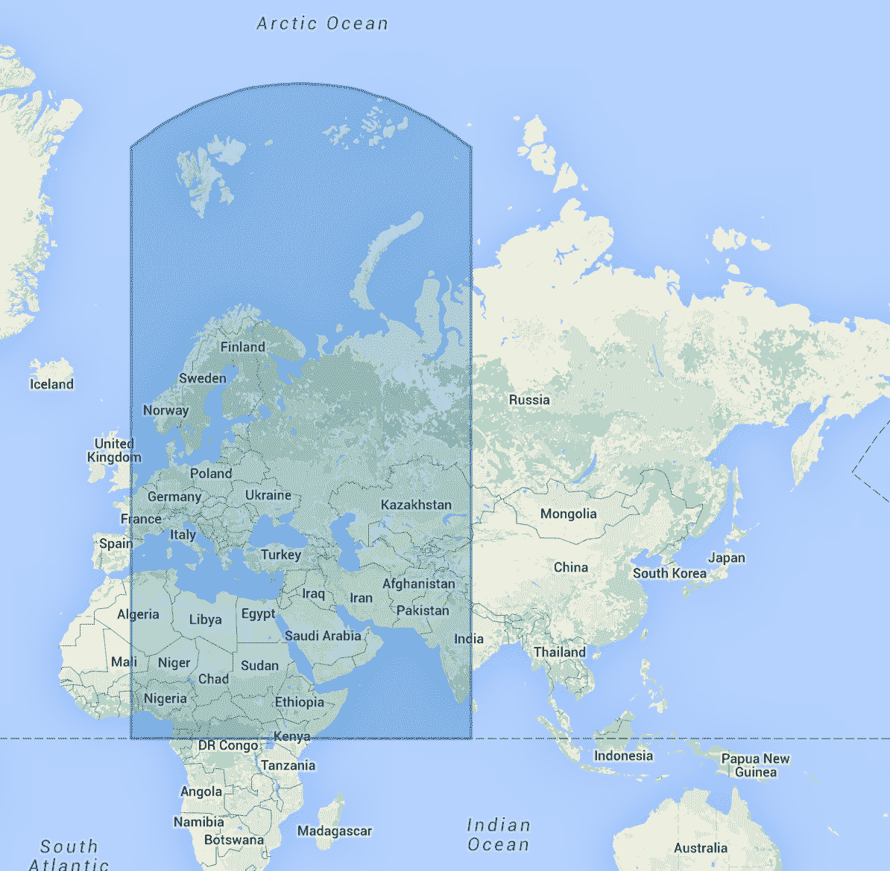
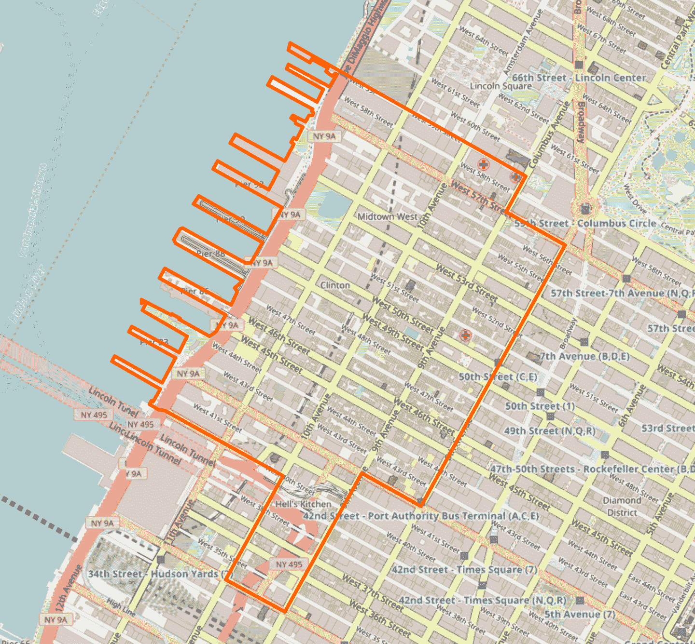
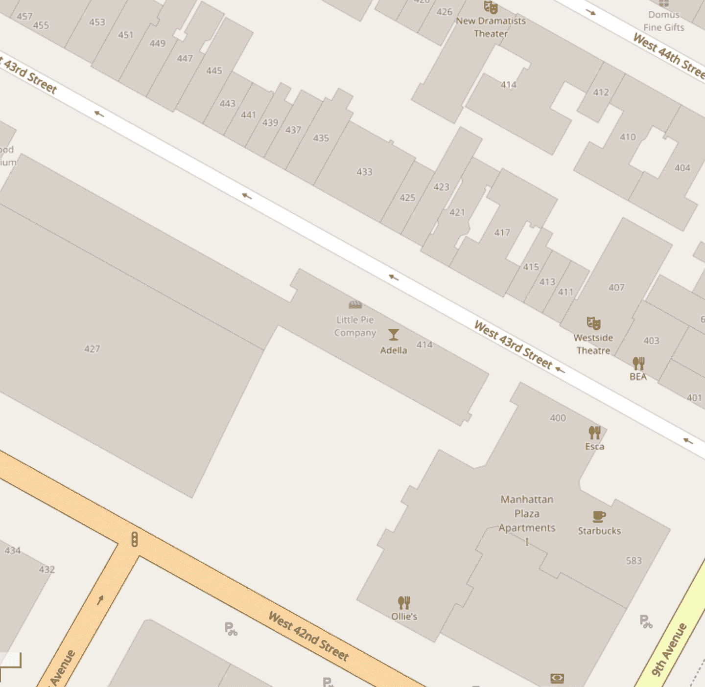
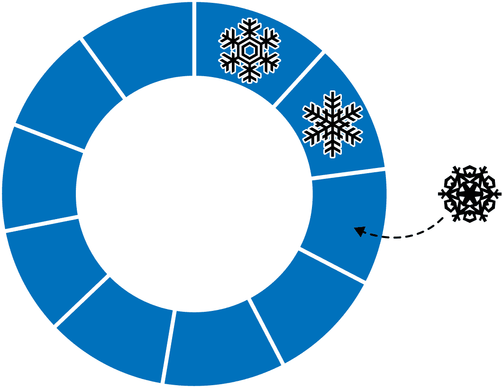
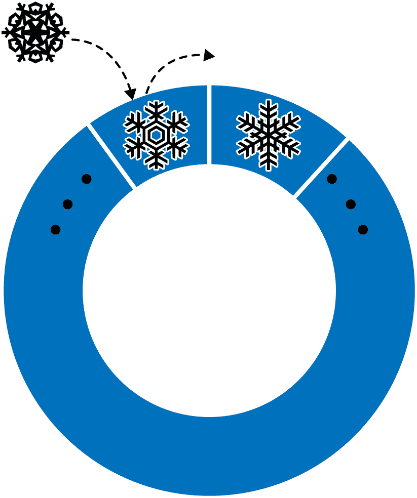

# 第六章：特殊索引和集合类型

本章涵盖了 MongoDB 提供的特殊集合和索引类型，包括：

+   带有队列特性的有上限的集合

+   用于缓存的 TTL 索引

+   简单字符串搜索的全文索引

+   用于 2D 和球形几何的地理空间索引

+   用于存储大文件的 GridFS

# 地理空间索引

MongoDB 有两种类型的地理空间索引：`2dsphere`和`2d`。`2dsphere`索引使用球形几何模型化地球表面，基于 WGS84 数据。此数据模型将地球表面建模为一个扁球体，这意味着在极点有一些扁平化。因此，使用`2sphere`索引进行距离计算可以考虑地球的形状，并提供比`2d`索引更准确的城市间距离处理，例如两个城市之间的距离。对于存储在二维平面上的点，请使用`2d`索引。

`2dsphere`允许您在[GeoJSON 格式](http://www.geojson.org/)中指定点、线和多边形的几何形状。一个点由一个表示[*`经度`*，*`纬度`*]的两元素数组给出：

```
{
    "name" : "New York City",
    "loc" : {
        "type" : "Point",
        "coordinates" : [50, 2]
    }
}
```

一条线由一系列点组成：

```
{
    "name" : "Hudson River",
    "loc" : {
        "type" : "LineString",
        "coordinates" : [[0,1], [0,2], [1,2]]
    }
}
```

多边形的指定方式与线相同（一个点数组），但具有不同的`"type"`：

```
{
    "name" : "New England",
    "loc" : {
        "type" : "Polygon",
        "coordinates" : [[0,1], [0,2], [1,2]]
    }
}
```

我们在此示例中命名的字段`"loc"`可以是任何名称，但嵌入对象中的字段名称由 GeoJSON 指定，不可更改。

使用`"`2dsphere`"`类型和`` `createIndex` ``可以创建地理空间索引：

```
> db.openStreetMap.createIndex({"loc" : "2dsphere"})
```

要创建`2dsphere`索引，请向`createIndex`传递一个文档，该文档指定要为特定集合中的几何图形创建索引的字段，并将`"2dsphere"`指定为值。

## 地理空间查询类型

您可以执行三种类型的地理空间查询：交集、包含和邻近。您可以指定要查找的内容作为一个类似于``{"$geometry" : *`geoJsonDesc`*}``的 GeoJSON 对象。

例如，您可以使用`"$geoIntersects"`操作符找到与查询位置相交的所有文档：

```
> var eastVillage = {
... "type" : "Polygon",
... "coordinates" : [
...  [
...    [ -73.9732566, 40.7187272 ],
...    [ -73.9724573, 40.7217745 ],
...    [ -73.9717144, 40.7250025 ],
...    [ -73.9714435, 40.7266002 ],
...    [ -73.975735, 40.7284702 ],
...    [ -73.9803565, 40.7304255 ],
...    [ -73.9825505, 40.7313605 ],
...    [ -73.9887732, 40.7339641 ],
...    [ -73.9907554, 40.7348137 ],
...    [ -73.9914581, 40.7317345 ],
...    [ -73.9919248, 40.7311674 ],
...    [ -73.9904979, 40.7305556 ],
...    [ -73.9907017, 40.7298849 ],
...    [ -73.9908171, 40.7297751 ],
...    [ -73.9911416, 40.7286592 ],
...    [ -73.9911943, 40.728492 ],
...    [ -73.9914313, 40.7277405 ],
...    [ -73.9914635, 40.7275759 ],
...    [ -73.9916003, 40.7271124 ],
...    [ -73.9915386, 40.727088 ],
...    [ -73.991788, 40.7263908 ],
...    [ -73.9920616, 40.7256489 ],
...    [ -73.9923298, 40.7248907 ],
...    [ -73.9925954, 40.7241427 ],
...    [ -73.9863029, 40.7222237 ],
...    [ -73.9787659, 40.719947 ],
...    [ -73.9772317, 40.7193229 ],
...    [ -73.9750886, 40.7188838 ],
...    [ -73.9732566, 40.7187272 ]
...  ]
... ]}
> db.openStreetMap.find(
... {"loc" : {"$geoIntersects" : {"$geometry" : eastVillage}}})
```

这将查找所有包含东村点的点、线和多边形文档。

您可以使用`"$geoWithin"`查询完全包含在区域内的事物（例如，“东村有哪些餐馆？”）：

```
> db.openStreetMap.find({"loc" : {"$geoWithin" : {"$geometry" : eastVillage}}})
```

与我们的第一个查询不同，这不会返回仅通过东村的事物（例如街道）或部分重叠它的事物（例如描述曼哈顿的多边形）。

最后，您可以使用`"$near"`查询附近的位置：

```
> db.openStreetMap.find({"loc" : {"$near" : {"$geometry" : eastVillage}}})
```

注意`"$near"`是唯一一个暗示排序的地理空间操作符：`"$near"`的结果始终按距离从近到远返回。

## 使用地理空间索引

MongoDB 的地理空间索引允许您在包含地理空间形状和点的集合上高效执行空间查询。为展示地理空间特性的能力并比较不同的方法，我们将逐步编写一个简单地理空间应用的查询过程。我们将深入介绍几个地理空间索引的核心概念，并展示它们如何与 `"$geoWithin"`、`"$geoIntersects"` 和 `"$geoNear"` 一起使用。

假设我们正在设计一个移动应用程序，帮助用户在纽约市找到餐馆。该应用程序必须：

+   确定用户当前所在的社区。

+   显示该社区内的餐馆数量。

+   在指定距离内查找餐馆。

我们将使用 `2dsphere` 索引在这些球形几何数据上进行查询。

### 查询中的 2D 对比球形几何。

地理空间查询可以根据查询和索引类型使用球形或 2D（平面）几何。表 6-1 显示了每个地理空间操作符使用的几何类型。

表 6-1\. MongoDB 中的查询类型和几何形状

| 查询类型 | 几何类型 |
| --- | --- |
| `$near`（GeoJSON 点，`2dsphere` 索引） | 球面 |
| `$near`（旧版坐标，`2d` 索引） | 平面 |
| `$geoNear`（GeoJSON 点，`2dsphere` 索引） | 球面 |
| `$geoNear`（旧版坐标，`2d` 索引） | 平面 |
| `$nearSphere`（GeoJSON 点，`2dsphere` 索引） | 球面 |
| `$nearSphere`（旧版坐标，`2d` 索引）^(a) | 球面 |
| `$geoWithin : { $geometry: ... }` | 球面 |
| `$geoWithin: { $box: ... }` | 平面 |
| `$geoWithin: { $polygon: ... }` | 平面 |
| `$geoWithin : { $center: ... }` | 平面 |
| `$geoWithin : { $centerSphere: ... }` | 球面 |
| `$geoIntersects` | 球面 |
| ^(a) 使用 GeoJSON 点代替。 |

还需注意，`2d` 索引支持平面几何和仅在球面上进行距离计算（即使用 `$nearSphere`）。然而，使用球形几何的查询在 `2dsphere` 索引下性能更佳且更精确。

还需注意，`$geoNear` 操作符是一个聚合操作符。聚合框架在 第七章 中进行了讨论。除了 `$near` 查询操作外，`$geoNear` 聚合操作符和特殊命令 `geoNear` 还能让我们查询附近位置。请记住，`$near` 查询操作符无法在使用分片的集合上工作，MongoDB 的分片解决方案（参见 第十五章）。

`geoNear` 命令和 `$geoNear` 聚合操作要求集合最多只能有一个 `2dsphere` 索引和一个 `2d` 索引，而地理空间查询操作符（如 `$near` 和 `$geoWithin`）允许集合拥有多个地理空间索引。

`geoNear`命令和`$geoNear`聚合运算符的地理空间索引限制存在，因为`geoNear`命令和`$geoNear`语法都不包括位置字段。因此，在多个`2d`索引或`2dsphere`索引中选择索引是不明确的。

对于地理空间查询操作符，不存在此类限制；这些操作符需要一个位置字段，从而消除了歧义。

### 扭曲

由于将三维球体（例如地球）投影到平面上的性质，球形几何在地图上显示时会出现扭曲。

例如，考虑由经度、纬度点（0,0）、（80,0）、（80,80）和（0,80）定义的球形广场的规范。图 6-1 描述了该区域的覆盖区域。



###### 图 6-1\. 由点（0,0）、（80,0）、（80,80）和（0,80）定义的球形广场

### 搜索餐馆

在这个例子中，我们将使用基于纽约市的[社区](https://oreil.ly/rpGna)和[餐馆](https://oreil.ly/JXYd-)数据集进行操作。您可以从 GitHub 下载示例数据集。

我们可以使用`mongoimport`工具将数据集导入数据库，方法如下：

```
$ mongoimport *`<path to neighborhoods.json>`* -c neighborhoods
$ mongoimport *`<path to restaurants.json>`* -c restaurants
```

我们可以在[*mongo* shell](https://oreil.ly/NMUhn)中使用`createIndex`命令在每个集合上创建`2dsphere`索引。

```
> db.neighborhoods.createIndex({location:"2dsphere"})
> db.restaurants.createIndex({location:"2dsphere"})
```

### 探索数据

我们可以通过在*mongo* shell 中执行一些快速查询来了解这些集合中文档的模式使用。

```
> db.neighborhoods.find({name: "Clinton"})
{
  "_id": ObjectId("55cb9c666c522cafdb053a4b"),
  "geometry": {
    "coordinates": [
      [
        [-73.99,40.77],
        .
        .
        .
        [-73.99,40.77],
        [-73.99,40.77]]
      ]
    ],
    "type": "Polygon"
  },
  "name": "Clinton"
}

> db.restaurants.find({name: "Little Pie Company"})
{
  "_id": ObjectId("55cba2476c522cafdb053dea"),
  "location": {
    "coordinates": [
      -73.99331699999999,
      40.7594404
    ],
    "type": "Point"
  },
  "name": "Little Pie Company"
}
```

前面代码中的社区文档对应于图 6-2 中显示的纽约市地区。



###### 图 6-2\. 纽约市的 Hell's Kitchen（克林顿）社区

面包店对应于图 6-3 中所示的位置。



###### 图 6-3\. 位于西 43 街 424 号的小派公司

### 查找当前社区

假设用户的移动设备可以提供一个相当精确的位置信息，使用`$geoIntersects`可以简单地找到用户当前的社区。

假设用户位于经度-73.93414657 和纬度 40.82302903。要找到当前社区（Hell's Kitchen），我们可以使用 GeoJSON 格式中的特殊`$geometry`字段指定一个点：

```
> db.neighborhoods.findOne({geometry:{$geoIntersects:{$geometry:{type:"Point",
... coordinates:[-73.93414657,40.82302903]}}}})
```

此查询将返回以下结果：

```
{
  "_id":ObjectId("55cb9c666c522cafdb053a68"),
  "geometry":{
    "type":"Polygon",
    "coordinates":[[[-73.93383000695911,40.81949109558767],...]]},
    "name":"Central Harlem North-Polo Grounds"
}
```

### 查找社区内所有餐馆

我们还可以查询以查找包含在特定社区内的所有餐馆。为此，我们可以在*mongo* shell 中执行以下操作，以查找包含用户的社区，并计算该社区内的餐馆数量。例如，要查找 Hell's Kitchen 社区中的所有餐馆：

```
> var neighborhood = db.neighborhoods.findOne({
  geometry: {
    $geoIntersects: {
      $geometry: {
        type: "Point",
        coordinates: [-73.93414657,40.82302903]
      }
    }
  }
});

> db.restaurants.find({
    location: {
      $geoWithin: {
        // Use the geometry from the neighborhood object we retrieved above
        $geometry: neighborhood.geometry
      }
    }
  },
  // Project just the name of each matching restaurant
  {name: 1, _id: 0});
```

此查询将告诉您，在请求的社区中有 127 家餐馆，这些餐馆的名称如下：

```
{
  "name": "White Castle"
}
{
  "name": "Touch Of Dee'S"
}
{
  "name": "Mcdonald'S"
}
{
  "name": "Popeyes Chicken & Biscuits"
}
{
  "name": "Make My Cake"
}
{
  "name": "Manna Restaurant Ii"
}
...
{
  "name": "Harlem Coral Llc"
}
```

### 在一定距离内找到餐馆

要找到距某点指定距离内的餐厅，可以使用`"$geoWithin"`和`"$centerSphere"`来返回无序结果，或者使用`"$nearSphere"`和`"$maxDistance"`来按距离排序需要结果。

要在圆形区域内查找餐厅，请使用`"$geoWithin"`和`"$centerSphere"`。`"$centerSphere"`是 MongoDB 特定的语法，用于通过指定中心和弧度半径来表示圆形区域。`"$geoWithin"`不会以任何特定顺序返回文档，因此可能首先返回最远的文档。

以下将查找用户五英里范围内的所有餐厅：

```
> db.restaurants.find({
  location: {
    $geoWithin: {
      $centerSphere: [
        [-73.93414657,40.82302903],
        5/3963.2
      ]
    }
  }
})
```

`"$centerSphere"`的第二个参数接受以弧度表示的半径。该查询通过将距离除以地球的近似赤道半径 3963.2 英里来转换为弧度。

应用程序可以使用`"$centerSphere"`而不需要地理空间索引。但是，地理空间索引支持比未索引的等效操作更快的查询。`2dsphere`和`2d`地理空间索引均支持`"$centerSphere"`。

您还可以使用`"$nearSphere"`并指定`"$maxDistance"`项以米为单位。这将按从最近到最远的顺序返回所有距离用户五英里范围内的餐厅：

```
> var METERS_PER_MILE = 1609.34;
db.restaurants.find({
  location: {
    $nearSphere: {
      $geometry: {
        type: "Point",
        coordinates: [-73.93414657,40.82302903]
      },
      $maxDistance: 5*METERS_PER_MILE
    }
  }
});
```

## 复合地理空间索引

与其他类型的索引一样，可以将地理空间索引与其他字段结合使用，以优化更复杂的查询。前面提到的一个可能的查询是：“Hell’s Kitchen 里有什么餐厅？”仅使用地理空间索引，我们可以将范围缩小到 Hell’s Kitchen 内的所有内容，但将其缩小到仅“餐厅”或“披萨”则需要索引中的另一个字段：

```
> db.openStreetMap.createIndex({"tags" : 1, "location" : "2dsphere"})
```

然后我们可以快速找到 Hell’s Kitchen 的披萨店：

```
> db.openStreetMap.find({"loc" : {"$geoWithin" : 
... {"$geometry" : hellsKitchen.geometry}}, 
... "tags" : "pizza"})
```

我们可以在`"2dsphere"`字段之前或之后有“普通”的索引字段，这取决于我们想先按照哪个字段过滤，是按照普通字段还是位置。选择更具选择性的项（即作为第一个索引项将过滤掉更多结果）。

## 2d 索引

对于非球形地图（视频游戏地图、时间序列数据等），可以使用`"2d"`索引代替`"2dsphere"`：

```
> db.hyrule.createIndex({"tile" : "2d"})
```

`2d`索引假设一个完全平坦的表面，而不是一个球体。因此，除非不介意极点周围的严重畸变，否则不应将`2d`索引与球体一起使用。

文档应使用两元素数组作为其`"2d"`索引字段。该数组中的元素应分别反映经度和纬度坐标。示例文档可能如下所示：

```
{
    "name" : "Water Temple",
    "tile" : [ 32, 22 ]
}
```

如果计划存储 GeoJSON 数据，请勿使用`2d`索引——它们只能索引点。您可以存储一个点数组，但它将被完全存储为一个点数组，而不是一条线。这对于`"$geoWithin"`查询尤为重要。如果将街道存储为点数组，则文档将在给定形状内的点匹配`"$geoWithin"`。但是，由这些点创建的线可能不完全包含在形状内。

默认情况下，`2d` 索引假定您的值将在从−180 到 180 的范围内。如果您期望较大或较小的边界，则可以将最小值和最大值作为 `createIndex` 的选项进行指定：

```
> db.hyrule.createIndex({"light-years" : "2d"}, {"min" : -1000, "max" : 1000})
```

这将创建一个适用于 2,000 × 2,000 正方形的空间索引。

`2d` 索引支持 `"$geoWithin"`, `"$nearSphere"`, 和 `"$near"` 查询选择器。使用 `"$geoWithin"` 查询在平面上定义的形状内的点。`"$geoWithin"` 可以查询矩形、多边形、圆或球内的所有点；它使用 `"$geometry"` 运算符来指定 GeoJSON 对象。回到我们的网格索引如下：

```
> db.hyrule.createIndex({"tile" : "2d"})
```

以下查询用于文档位于由底部左下角 [10, 10] 和顶部右上角 [100, 100] 定义的矩形内：

```
> db.hyrule.find({
  tile: {
    $geoWithin: {
      $box: [[10, 10], [100, 100]]
    } 
   }
})
```

`$box` 接受一个两元素数组：第一个元素指定左下角的坐标，第二个元素指定右上角的坐标。

要查询位于以 [−17 , 20.5] 为中心且半径为 25 的圆内的文档，可以执行以下命令：

```
> db.hyrule.find({
  tile: {
    $geoWithin: {
      $center: [[-17, 20.5] , 25]
    }
  }
})
```

以下查询返回所有坐标位于由 [0, 0], [3, 6], 和 [6 , 0] 定义的多边形内的文档：

```
> db.hyrule.find({
  tile: {
    $geoWithin: {
      $polygon: [[0, 0], [3, 6], [6, 0]]
    }
  }
})
```

将多边形定义为点数组。列表中的最后一个点将与第一个点“连接”，形成多边形。此示例将定位包含在给定三角形内的所有文档。

由于历史原因，MongoDB 还支持对平面 `2d` 索引进行基本的球面查询。一般来说，球面计算应使用如 “2D versus spherical geometry in queries” 中所述的 2dsphere 索引。然而，要查询球内的传统坐标对，请使用带有 “`$centerSphere”` 运算符的 `"$geoWithin"`。指定一个包含以下内容的数组：

+   圆心点的网格坐标

+   以弧度测量的圆的半径

例如：

```
> db.hyrule.find({
  loc: {
    $geoWithin: {
      $centerSphere: [[88, 30], 10/3963.2]
    }
  }
})
```

要查询附近的点，请使用 `"$near"`。接近查询返回与定义点最接近的坐标对应的文档，并按距离排序。这将从点 (20, 21) 开始按距离从近到远返回 *hyrule* 集合中的所有文档：

```
> db.hyrule.find({"tile" : {"$near" : [20, 21]}})
```

如果未指定限制，则默认应用 100 个文档的限制。如果您不需要那么多结果，应设置一个限制以节省服务器资源。例如，以下代码返回最接近 (20, 21) 的 10 个文档：

```
> db.hyrule.find({"tile" : {"$near" : [20, 21]}}).limit(10)
```

# 全文搜索索引

在 MongoDB 中，`text` 索引支持全文搜索要求。这种类型的 `text` 索引不应与 MongoDB Atlas 全文搜索索引混淆，后者利用 Apache Lucene 进行附加文本搜索能力，与 MongoDB text 索引相比具有更多的功能。如果您的应用程序需要允许用户提交关键字查询以匹配集合中标题、描述和其他字段中的文本，则应使用 `text` 索引。

在之前的章节中，我们使用精确匹配和正则表达式来查询字符串，但是这些技术有一些限制。使用正则表达式搜索大文本块速度较慢，并且难以考虑人类语言的形态（例如，“entry”应该匹配“entries”）和其他挑战。`text`索引使您能够快速搜索文本，并提供对语言适当的分词、停用词和词干提取等常见搜索引擎要求的支持。

`text`索引需要的键数量与索引字段中的单词数成正比。因此，创建`text`索引可能会消耗大量系统资源。您应在不会对用户应用程序性能造成负面影响的时间创建此类索引，或者如果可能的话在后台构建索引。与所有索引一样，为了确保良好的性能，您还应注意任何创建的`text`索引是否适合 RAM。有关在不影响应用程序的情况下创建索引的更多信息，请参阅第十九章。

写入集合需要更新所有索引。如果您使用文本搜索，字符串将被分词和词干提取，并在多个位置更新索引。因此，与单字段、复合字段甚至多键索引相比，涉及`text`索引的写入通常更昂贵。因此，您会发现`text`索引的写入性能较差。如果您进行分片，它们还会减慢数据移动：在迁移到新的分片时，所有文本都必须重新建立索引。

## 创建文本索引

假设我们有一组维基百科文章需要索引。要在文本上运行搜索，我们首先需要创建一个`text`索引。以下对`createIndex`的调用将基于`"title"`和`"body"`字段中的术语创建索引：

```
> db.articles.createIndex({"title": "text",
                           "body" : "text"})
```

这不像“普通”的复合索引，其中键有顺序。默认情况下，`text`索引中每个字段都被赋予相等的考虑权重。您可以通过指定权重来控制 MongoDB 赋予每个字段的相对重要性：

```
> db.articles.createIndex({"title": "text", 
                           "body": "text"},
                          {"weights" : {
                               "title" : 3, 
                               "body" : 2}})
```

这将以 3:2 的比例权重`"title"`字段相对于`"body"`字段。

在索引创建后无法更改字段权重（除非删除索引并重新创建），因此您可能希望在生产数据上创建索引之前在样本数据集上调整权重。

对于某些集合，您可能不知道文档将包含哪些字段。您可以通过在`"$**"`上创建索引来在文档中的所有字符串字段上创建全文索引——这不仅索引所有顶级字符串字段，还搜索嵌入文档和数组中的字符串字段：

```
> db.articles.createIndex({"$**" : "text"})
```

## 文本搜索

使用`"$text"`查询运算符在具有`text`索引的集合上执行文本搜索。`"$text"`将使用空格和大多数标点符号作为分隔符对搜索字符串进行标记，并对搜索字符串中的所有这些标记执行逻辑 OR 操作。例如，您可以使用以下查询查找包含术语“impact”，“crater”或“lunar”的所有文章。请注意，因为我们的索引基于文章标题和正文中的术语，此查询将匹配那些术语在任一字段中找到的文档。为了本示例的目的，我们将投影标题，以便我们可以在页面上放置更多结果：

```
> db.articles.find({"$text": {"$search": "impact crater lunar"}}, 
                   {title: 1}
                  ).limit(10)
{ "_id" : "170375", "title" : "Chengdu" }
{ "_id" : "34331213", "title" : "Avengers vs. X-Men" }
{ "_id" : "498834", "title" : "Culture of Tunisia" }
{ "_id" : "602564", "title" : "ABC Warriors" }
{ "_id" : "40255", "title" : "Jupiter (mythology)" }
{ "_id" : "80356", "title" : "History of Vietnam" }
{ "_id" : "22483", "title" : "Optics" }
{ "_id" : "8919057", "title" : "Characters in The Legend of Zelda series" }
{ "_id" : "20767983", "title" : "First inauguration of Barack Obama" }
{ "_id" : "17845285", "title" : "Kushiel's Mercy" }
```

你可以看到，我们初始查询的结果并不是非常相关。像所有技术一样，了解 MongoDB 中`text`索引的工作原理是使用它们有效的关键。在这种情况下，我们发出查询存在两个问题。首先是，我们的查询相当广泛，因为 MongoDB 使用“impact”，“crater”和“lunar”的逻辑 OR 发出查询。第二个问题是，默认情况下，文本搜索不会按相关性排序。

我们可以通过在查询中使用短语来解决查询本身的问题。您可以通过用双引号括起来来搜索精确短语。例如，以下查询将找到所有包含短语“impact crater”的文档。也许令人惊讶的是，MongoDB 将此查询发布为“impact crater” AND “lunar”：

```
> db.articles.find({$text: {$search: "\"impact crater\" lunar"}},
                   {title: 1}
                     ).limit(10)
{ "_id" : "2621724", "title" : "Schjellerup (crater)" }
{ "_id" : "2622075", "title" : "Steno (lunar crater)" }
{ "_id" : "168118", "title" : "South Pole–Aitken basin" }
{ "_id" : "1509118", "title" : "Jackson (crater)" }
{ "_id" : "10096822", "title" : "Victoria Island structure" }
{ "_id" : "968071", "title" : "Buldhana district" }
{ "_id" : "780422", "title" : "Puchezh-Katunki crater" }
{ "_id" : "28088964", "title" : "Svedberg (crater)" }
{ "_id" : "780628", "title" : "Zeleny Gai crater" }
{ "_id" : "926711", "title" : "Fracastorius (crater)" }
```

为了确保这一语义清楚，让我们看一个扩展的例子。对于以下查询，MongoDB 将作为“impact crater” AND (“lunar” OR “meteor”)发布查询。MongoDB 对搜索字符串中的短语与搜索字符串中的各个术语进行逻辑 AND 操作，并对各个术语与彼此进行逻辑 OR 操作：

```
> db.articles.find({$text: {$search: "\"impact crater\" lunar meteor"}},
                 {title: 1}
		).limit(10)
```

如果您希望在查询中的各个术语之间发出逻辑 AND，请将每个术语视为短语并用引号括起来。以下查询将返回包含“impact crater” AND “lunar” AND “meteor”的文档：

```
> db.articles.find({$text: {$search: "\"impact crater\" \"lunar\" \"meteor\""}},
                   {title: 1}
		     ).limit(10)
{ "_id" : "168118", "title" : "South Pole–Aitken basin" }
{ "_id" : "330593", "title" : "Giordano Bruno (crater)" }
{ "_id" : "421051", "title" : "Opportunity (rover)" }
{ "_id" : "2693649", "title" : "Pascal Lee" }
{ "_id" : "275128", "title" : "Tektite" }
{ "_id" : "14594455", "title" : "Beethoven quadrangle" }
{ "_id" : "266344", "title" : "Space debris" }
{ "_id" : "2137763", "title" : "Wegener (lunar crater)" }
{ "_id" : "929164", "title" : "Dawes (lunar crater)" }
{ "_id" : "24944", "title" : "Plate tectonics" }
```

现在你对在查询中使用短语和逻辑 AND 有了更好的理解，让我们回到结果没有按相关性排序的问题。虽然前面的结果确实相关，但这主要是因为我们发出了相当严格的查询。我们可以通过按相关性排序来做得更好。

文本查询会导致与每个查询结果相关联的一些元数据。除非我们使用`$meta`运算符显式投影它，否则这些元数据不会显示在查询结果中。因此，除了标题之外，我们还将投影每个文档计算的相关性分数。相关性分数存储在名为`"textScore"`的元数据字段中。对于本示例，我们将返回我们的“impact crater” AND “lunar”的查询：

```
> db.articles.find({$text: {$search: "\"impact crater\" lunar"}},
                   {title: 1, score: {$meta: "textScore"}}
		     ).limit(10)
{"_id": "2621724", "title": "Schjellerup (crater)", "score": 2.852987132352941}
{"_id": "2622075", "title": "Steno (lunar crater)", "score": 2.4766639610389607}
{"_id": "168118", "title": "South Pole–Aitken basin", "score": 2.980198136295181}
{"_id": "1509118", "title": "Jackson (crater)", "score": 2.3419137286324787}
{"_id": "10096822", "title": "Victoria Island structure", 
 "score": 1.782051282051282}
{"_id": "968071", "title": "Buldhana district", "score": 1.6279783393501805}
{"_id": "780422", "title": "Puchezh-Katunki crater", "score": 1.9295977011494254}
{"_id": "28088964", "title": "Svedberg (crater)", "score": 2.497767857142857}
{"_id": "780628", "title": "Zeleny Gai crater", "score": 1.4866071428571428}
{"_id": "926711", "title": "Fracastorius (crater)", "score": 2.7511877111486487}
```

现在你可以看到每个结果的标题与相关性分数的投影。请注意它们没有排序。要按相关性分数的顺序对结果进行排序，我们必须添加一个`sort`调用，再次使用`$meta`来指定`"textScore"`字段的值。请注意，我们在排序中必须使用与投影中使用的字段名称相同的字段名称。在这种情况下，我们在搜索结果中显示的相关性分数值的字段名称为`"score"`。正如您所见，结果现在按相关性的降序排序：

```
> db.articles.find({$text: {$search: "\"impact crater\" lunar"}},
                   {title: 1, score: {$meta: "textScore"}}
		     ).sort({score: {$meta: "textScore"}}).limit(10)
{"_id": "1621514", "title": "Lunar craters", "score": 3.1655242042922014}
{"_id": "14580008", "title": "Kuiper quadrangle", "score": 3.0847527829208814}
{"_id": "1019830", "title": "Shackleton (crater)", "score": 3.076471119932001}
{"_id": "2096232", "title": "Geology of the Moon", "score": 3.064981949458484}
{"_id": "927269", "title": "Messier (crater)", "score": 3.0638183133686008}
{"_id": "206589", "title": "Lunar geologic timescale", "score": 3.062029540854157}
{"_id": "14536060", "title": "Borealis quadrangle", "score": 3.0573010719646687}
{"_id": "14609586", "title": "Michelangelo quadrangle", 
 "score": 3.057224063486582}
{"_id": "14568465", "title": "Shakespeare quadrangle", 
 "score": 3.0495256481056443}
{"_id": "275128", "title": "Tektite", "score" : 3.0378807169646915}
```

文本搜索也可以在聚合管道中使用。我们在第七章讨论了聚合管道。

## 优化全文搜索

有几种优化全文搜索的方法。如果您可以首先通过其他条件缩小搜索结果，那么可以创建一个带有这些条件前缀的复合索引，然后是全文字段：

```
> db.blog.createIndex({"date" : 1, "post" : "text"})
```

这被称为将全文索引*分区*，因为它将其分解为基于`"date"`（在此示例中）的多个较小的树。这使得针对特定日期或日期范围的全文搜索速度更快。

你也可以使用其他条件的后缀来覆盖索引查询。例如，如果我们只返回`"author"`和`"post"`字段，我们可以在这两个字段上创建一个复合索引：

```
> db.blog.createIndex({"post" : "text", "author" : 1})
```

这些前缀和后缀形式可以结合使用：

```
> db.blog.createIndex({"date" : 1, "post" : "text", "author" : 1})
```

## 在其他语言中搜索

当插入文档（或首次创建索引）时，MongoDB 会查看索引字段并对每个单词进行词干处理，将其缩减为基本单位。然而，不同语言以不同方式处理单词的词干，因此必须指定索引或文档所在的语言。`text`索引允许指定`"default_language"`选项，默认为`"english"`，但可以设置为多种其他语言（详见[在线文档](https://oreil.ly/eUt0Z)获取最新列表）。

例如，要创建一个法语索引，我们可以这样说：

```
> db.users.createIndex({"profil" : "text", 
                        "intérêts" : "text"}, 
                       {"default_language" : "french"})
```

除非另有规定，否则将使用法语进行词干处理。您可以在每个文档上指定另一种词干处理语言，方法是具有描述文档语言的`"language"`字段：

```
> db.users.insert({"username" : "swedishChef", 
... "profile" : "Bork de bork", language : "swedish"})
```

# 容量限制集合

在 MongoDB 中，“普通”集合是动态创建的，并自动增长以适应额外数据。MongoDB 还支持一种称为*容量限制集合*的不同类型集合，它是预先创建的并且大小固定（见图 6-4）。



###### 图 6-4\. 新文档插入队列末尾

拥有固定大小的集合提出了一个有趣的问题：当我们尝试向已满的限制集合插入数据时会发生什么？答案是，限制集合表现得像循环队列：如果空间不足，最旧的文档将被删除，新文档将占据其位置（见图 6-5）。这意味着，随着插入新文档，限制集合会自动使最老的文档过时。

一些操作在限制集合上是不允许的。文档不能被移除或删除（除了前面描述的自动过时），并且不允许导致文档增长大小的更新操作。通过阻止这两个操作，我们保证限制集合中的文档按插入顺序存储，并且不需要维护从删除文档中的空闲列表的需求。



###### 图 6-5. 当队列满时，最老的元素将被最新元素替换

限制集合与大多数 MongoDB 集合具有不同的访问模式：数据按顺序写入固定的磁盘部分。这使它们倾向于在旋转磁盘上快速执行写入操作，特别是如果它们可以获得自己的磁盘（以免受其他集合随机写入的“干扰”）。

通常，推荐使用 MongoDB TTL 索引而不是限制集合，因为它们在使用 WiredTiger 存储引擎时性能更好。 TTL 索引根据日期类型字段的值和索引的 TTL 值在普通集合中过期并删除数据。这些内容稍后在本章节中会更深入地介绍。

###### 注意

限制集合无法分片。如果更新或替换操作在限制集合中改变了文档大小，该操作将失败。

限制集合通常用于日志记录，尽管它们缺乏灵活性：除了在创建集合时设置大小外，无法控制数据何时过时。

## 创建限制集合

不同于普通集合，必须在使用之前显式地创建限制集合。要创建一个限制集合，可以使用`create`命令。在 Shell 中，可以使用`createCollection`来完成：

```
> db.createCollection("my_collection", {"capped" : true, "size" : 100000});
```

前面的命令创建了一个名为*my_collection*的限制集合，其固定大小为 100,000 字节。

`createCollection`还可以指定限制集合中文档的数量限制：

```
> db.createCollection("my_collection2", 
                      {"capped" : true, "size" : 100000, "max" : 100});
```

您可以使用它来保留最新的 10 篇新闻文章或限制用户为 1,000 个文档。

一旦创建了限制集合，就无法更改它（如果希望更改其属性，必须删除并重新创建）。因此，在创建大型集合之前，应仔细考虑其大小。

###### 注意

当限制限制集合中文档的数量时，必须同时指定大小限制。根据首先达到的限制，自动使过期取决于它可以"最大"文档数量不能持有，以及不能多于"大小"空间。

创建固定大小的集合的另一种选择是将现有的常规集合转换为固定大小的集合。可以使用`convertToCapped`命令来完成这个操作——在下面的示例中，我们将 *test* 集合转换为一个固定大小为 10,000 字节的集合：

```
> db.runCommand({"convertToCapped" : "test", "size" : 10000});
{ "ok" : true }
```

无法“取消”固定大小的集合（除非删除它）。

## 可追溯的游标

可追溯的游标是一种特殊类型的游标，当其结果耗尽时不会关闭。它们受`tail -f`命令启发，并且类似于该命令，会尽可能地持续获取输出。由于游标在耗尽结果后不会终止，它们可以在向集合添加文档时继续获取新结果。只能在固定大小的集合上使用可追溯的游标，因为普通集合不追踪插入顺序。对于绝大多数用途，建议使用第十六章中介绍的变更流，因为它们提供更多控制和配置选项，并且适用于普通集合。

可追溯的游标经常用于处理文档，因为它们被插入到“工作队列”（固定大小的集合）。因为可追溯的游标在没有结果的情况下会在 10 分钟后超时，所以重要的是在逻辑中包含重新查询集合的步骤，以防它们中断。*mongo* shell 不允许使用可追溯的游标，但在 PHP 中使用类似以下内容：

```
$cursor = $collection->find([], [
    'cursorType' => MongoDB\Operation\Find::TAILABLE_AWAIT,
    'maxAwaitTimeMS' => 100,
]);

while (true) {
   if ($iterator->valid()) {
      $document = $iterator->current();
      printf("Consumed document created at: %s\n", $document->createdAt);
   }

   $iterator->next();
}
```

游标将处理结果或等待更多结果到达，直到超时或有人终止查询操作。

# 生命周期索引

正如前一节所述，固定大小的集合对于其内容何时被覆盖具有有限的控制能力。如果需要更灵活的过期系统，TTL 索引允许您为每个文档设置超时时间。当文档达到预配置的年龄时，将会删除它。这种索引类型对于缓存用例（如会话存储）非常有用。

可以通过在`createIndex`的第二个参数中指定`"expireAfterSeconds"`选项来创建 TTL 索引：

```
> // 24-hour timeout
> db.sessions.createIndex({"lastUpdated" : 1}, {"expireAfterSeconds" : 60*60*24})
```

这将在`"lastUpdated"`字段上创建一个 TTL 索引。如果文档的`"lastUpdated"`字段存在且为日期，则一旦服务器时间比文档时间晚`"expireAfterSeconds"`秒，文档将被删除。

为了防止活动会话被删除，可以在有活动时将`"lastUpdated"`字段更新为当前时间。一旦`"lastUpdated"`超过 24 小时，文档将被移除。

MongoDB 每分钟扫描一次 TTL 索引，因此不应依赖于到秒的精度。可以使用`collMod`命令更改`"expireAfterSeconds"`：

```
> db.runCommand( {"collMod" : "someapp.cache" , "index" : { "keyPattern" : 
... {"lastUpdated" : 1} , "expireAfterSeconds" : 3600 } } );
```

在给定集合上可以有多个 TTL 索引。它们不能是复合索引，但可以像“普通”索引一样用于排序和查询优化。

# 使用 GridFS 存储文件

GridFS 是在 MongoDB 中存储大型二进制文件的机制。以下是您考虑使用 GridFS 进行文件存储的几个原因：

+   使用 GridFS 可以简化您的堆栈。如果您已经在使用 MongoDB，则可能可以使用 GridFS 而不是单独的文件存储工具。

+   GridFS 将利用您为 MongoDB 设置的任何现有复制或自动分片，因此更容易实现文件存储的故障转移和扩展。

+   GridFS 可以减轻某些文件系统在用于存储用户上传时可能出现的问题。例如，GridFS 不会在同一目录中存储大量文件时出现问题。

当然也有一些缺点：

+   性能较慢。从 MongoDB 访问文件不会像直接通过文件系统那样快。

+   您只能通过删除并重新保存整个文档来修改文档。MongoDB 将文件存储为多个文档，因此无法同时锁定文件中的所有块。

当您有大型文件需要按顺序访问且不会经常更改时，通常最适合使用 GridFS。

## 入门 GridFS：mongofiles

尝试 GridFS 最简单的方法是使用 *mongofiles* 实用程序。*mongofiles* 包含在所有 MongoDB 发行版中，并可用于上传、下载、列出、搜索或删除 GridFS 中的文件。

与其他命令行工具一样，运行 `mongofiles --help` 查看 *mongofiles* 的可用选项。

以下会话显示了如何使用 *mongofiles* 将文件从文件系统上传到 GridFS，列出 GridFS 中的所有文件，并下载先前上传的文件：

```
$ echo "Hello, world" > foo.tx
$ mongofiles put foo.txt 
2019-10-30T10:12:06.588+0000  connected to: localhost
2019-10-30T10:12:06.588+0000  added file: foo.txt
$  mongofiles list
2019-10-30T10:12:41.603+0000  connected to: localhost
foo.txt 13
$ rm foo.txt
$ mongofiles get foo.txt
2019-10-30T10:13:23.948+0000  connected to: localhost
2019-10-30T10:13:23.955+0000  finished writing to foo.txt
$ cat foo.txt
Hello, world
```

在前面的示例中，我们使用 *mongofiles* 执行了三个基本操作：`put`、`list` 和 `get`。`put` 操作将文件从文件系统添加到 GridFS。`list` 将列出已添加到 GridFS 的任何文件。`get` 的作用与 `put` 相反：它从 GridFS 中取出文件并将其写入文件系统。*mongofiles* 还支持另外两个操作：`search` 用于按文件名在 GridFS 中查找文件，`delete` 用于从 GridFS 中删除文件。

## 使用 MongoDB 驱动程序操作 GridFS

所有客户端库都有 GridFS API。例如，使用 PyMongo（MongoDB 的 Python 驱动程序），您可以执行与我们使用 *mongofiles* 相同的一系列操作（假设使用 Python 3 并在端口 27017 上本地运行 *mongod*）。

```
>>> import pymongo
>>> import gridfs
>>> client = pymongo.MongoClient()
>>> db = client.test
>>> fs = gridfs.GridFS(db)
>>> file_id = fs.put(b"Hello, world", filename="foo.txt")
>>> fs.list()
['foo.txt']
>>> fs.get(file_id).read()
b'Hello, world'
```

从 PyMongo 使用 GridFS 的 API 与 *mongofiles* 非常相似：您可以轻松执行基本的 `put`、`get` 和 `list` 操作。几乎所有 MongoDB 驱动程序都遵循此基本模式来处理 GridFS，通常还公开更高级的功能。有关特定驱动程序的 GridFS 信息，请查阅您正在使用的特定驱动程序的文档。

## 在幕后

GridFS 是建立在普通 MongoDB 文档之上的轻量级文件存储规范。MongoDB 服务器实际上几乎不进行任何“特殊处理”来处理 GridFS 请求；所有工作都由客户端驱动程序和工具处理。

GridFS 的基本思想是，通过将大文件分割成*块*并将每个块存储为单独的文档，我们可以存储大文件。由于 MongoDB 支持在文档中存储二进制数据，我们可以将块的存储开销降到最低。除了存储文件的每个块外，我们还存储一个单独的文档，将这些块组合在一起，并包含有关文件的元数据。

GridFS 的块存储在它们自己的集合中。默认情况下，块将使用*fs.chunks*集合，但可以进行覆盖。在块集合中，各个文档的结构非常简单：

```
{
    "_id" : ObjectId("..."),
    "n" : 0,
    "data" : BinData("..."),
    "files_id" : ObjectId("...")
}
```

像任何其他 MongoDB 文档一样，一个块有其自己独特的`"_id"`。此外，它还有几个其他键：

`"files_id"`

包含该块所属文件元数据的文件文档的`"_id"`。

`"n"`

文件在文件中的位置，相对于其他文件块

`"data"`

文件块中的字节。

每个文件的元数据存储在单独的集合中，默认为*fs.files*。文件集合中的每个文档代表 GridFS 中的单个文件，并可以包含应与该文件关联的任何自定义元数据。除了任何用户定义的键之外，还有几个由 GridFS 规范强制的键：

`"_id"`

文件的唯一 ID —— 这是将作为`"files_id"`键的值存储在每个块中的内容。

`"length"`

构成文件内容的总字节数。

`"chunkSize"`

构成文件的每个块的大小（以字节为单位）。默认值为 255 KB，但可以根据需要进行调整。

`"uploadDate"`

表示此文件存储在 GridFS 中的时间戳。

`"md5"`

在服务器端生成的此文件内容的 MD5 校验和。

在所需的所有键中，也许最有趣（或者说最不容易理解）的是`"md5"`。`"md5"`键的值是由 MongoDB 服务器使用`filemd5`命令生成的，该命令计算上传块的 MD5 校验和。这意味着用户可以检查`"md5"`键的值，以确保文件已正确上传。

正如前面提到的，*fs.files*中并不限于所需字段：可以随意在此集合中保留任何其他文件元数据。您可能希望在文件的元数据中保留下载次数、MIME 类型或用户评分等信息。

一旦理解了底层的 GridFS 规范，就可以轻松地实现您使用的驱动程序可能没有提供帮助器的功能。例如，您可以使用`distinct`命令获取存储在 GridFS 中的唯一文件名列表：

```
> db.fs.files.distinct("filename")
[ "foo.txt" , "bar.txt" , "baz.txt" ]
```

这使得您的应用程序在加载和收集文件信息时具有很大的灵活性。在接下来的一章中，我们将稍作调整，介绍聚合框架。它提供了一系列数据分析工具，用于处理数据库中的数据。
