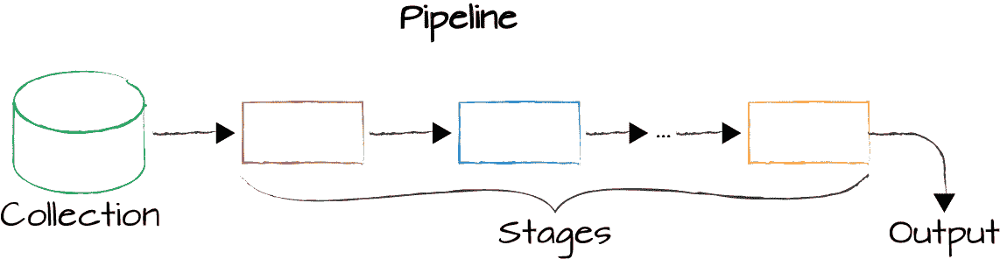
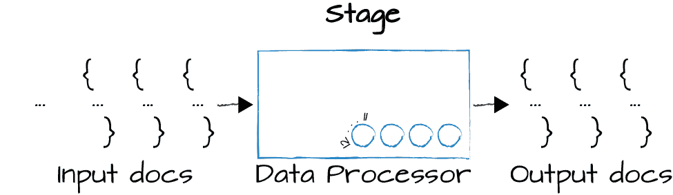
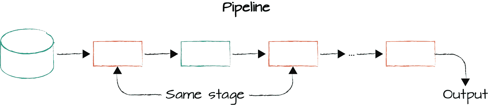
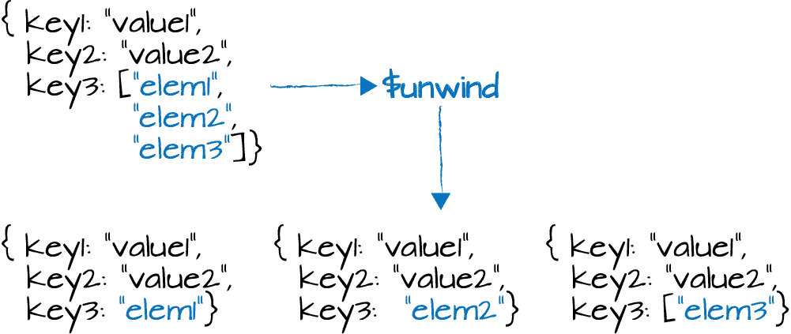
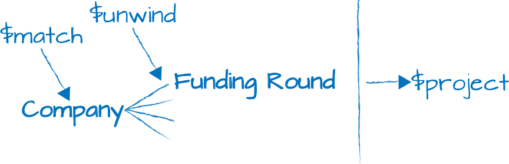

# 第七章：聚合框架简介

许多应用程序需要进行某种形式的数据分析。MongoDB 通过聚合框架提供强大的本机分析支持。在本章中，我们介绍这个框架及其提供的一些基本工具。我们将涵盖：

+   聚合框架

+   聚合阶段

+   聚合表达式

+   聚合累加器

在下一章中，我们将深入探讨更高级的聚合特性，包括能够在集合之间执行联接的能力。

# 管道、阶段和可调参数

聚合框架是 MongoDB 中的一组分析工具，允许您对一个或多个集合中的文档进行分析。

聚合框架基于管道的概念。通过聚合管道，我们从 MongoDB 集合中获取输入，并将这些文档通过一个或多个阶段，每个阶段在其输入上执行不同的操作（图 7-1）。每个阶段的输入是前一个阶段产生的输出。所有阶段的输入和输出都是文档——可以说是文档流。



###### 图 7-1。聚合管道

如果您熟悉 Linux Shell（如 bash）中的管道，那么这个概念非常类似。每个阶段都有它要执行的特定任务。它期望特定形式的文档，并产生一个特定的输出，这本身就是文档流。在管道的末端，我们可以访问输出，这与执行查找查询时的方式非常相似。也就是说，我们得到了一系列文档，我们可以用来进行其他工作，无论是创建报告、生成网站还是其他类型的任务。

现在，让我们深入了解并考虑单个阶段。聚合管道的单个阶段是一个数据处理单元。它逐个接收输入文档流，逐个处理每个文档，并逐个生成输出文档流（图 7-2）。



###### 图 7-2。聚合管道的各个阶段

每个阶段提供了一组旋钮，或称为*tunables*，我们可以控制这些旋钮来参数化阶段，以执行我们感兴趣的任务。一个阶段执行某种通用的、多功能的任务，并且我们根据我们正在处理的特定集合以及我们希望该阶段对这些文档执行的确切操作来参数化该阶段。

这些可调参数通常采用我们可以提供的运算符的形式，这些运算符将修改字段、执行算术运算、重塑文档，或执行某种累积任务或其他多种操作。

在我们开始查看一些具体示例之前，有一个管道的另一个方面尤为重要，在您开始使用它们时特别要牢记。经常情况下，我们希望在单个管道中多次包含相同类型的阶段（图 7-3）。例如，我们可能希望执行初始过滤，这样我们就不必将整个集合传递到我们的管道中。稍后，在进行了一些额外处理之后，我们可能希望进一步过滤，应用不同的条件。



###### 图 7-3\. 聚合管道中的重复阶段

总结一下，管道适用于 MongoDB 集合。它们由多个阶段组成，每个阶段对其输入执行不同的数据处理任务，并生成文档作为输出传递到下一个阶段。最终，在处理结束时，管道产生的输出可以用于我们的应用程序中的某些操作，或者可以发送到集合以供以后使用。在许多情况下，为了执行我们需要做的分析，我们会在单个管道内多次包含相同类型的阶段。

# 开始阶段：熟悉的操作

要开始开发聚合管道，我们将看看构建一些涉及您已经熟悉的操作的管道。为此，我们将查看 *match*、*project*、*sort*、*skip* 和 *limit* 阶段。

为了通过这些聚合示例，我们将使用一个公司数据集合。该集合有多个字段，指定了关于公司的详细信息，例如名称、公司的简短描述以及公司成立的时间。

还有描述公司经历的融资轮次、公司的重要里程碑、公司是否进行了首次公开发行（IPO），以及如果进行了首次公开发行，则 IPO 的详细信息的字段。这里有一个包含 Facebook, Inc. 数据的示例文档：

```
{
  "_id" : "52cdef7c4bab8bd675297d8e",
  "name" : "Facebook",
  "category_code" : "social",
  "founded_year" : 2004,
  "description" : "Social network",
  "funding_rounds" : [{
      "id" : 4,
      "round_code" : "b",
      "raised_amount" : 27500000,
      "raised_currency_code" : "USD",
      "funded_year" : 2006,
      "investments" : [
        {
          "company" : null,
          "financial_org" : {
            "name" : "Greylock Partners",
            "permalink" : "greylock"
          },
          "person" : null
        },
        {
          "company" : null,
          "financial_org" : {
            "name" : "Meritech Capital Partners",
            "permalink" : "meritech-capital-partners"
          },
          "person" : null
        },
        {
          "company" : null,
          "financial_org" : {
            "name" : "Founders Fund",
            "permalink" : "founders-fund"
          },
          "person" : null
        },
        {
          "company" : null,
          "financial_org" : {
            "name" : "SV Angel",
            "permalink" : "sv-angel"
          },
          "person" : null
        }
      ]
    },
    {
      "id" : 2197,
      "round_code" : "c",
      "raised_amount" : 15000000,
      "raised_currency_code" : "USD",
      "funded_year" : 2008,
      "investments" : [
        {
          "company" : null,
          "financial_org" : {
            "name" : "European Founders Fund",
            "permalink" : "european-founders-fund"
          },
          "person" : null
        }
      ]
    }],
  "ipo" : {
    "valuation_amount" : NumberLong("104000000000"),
    "valuation_currency_code" : "USD",
    "pub_year" : 2012,
    "pub_month" : 5,
    "pub_day" : 18,
    "stock_symbol" : "NASDAQ:FB"
  }
}
```

作为我们的第一个聚合示例，让我们做一个简单的过滤，寻找所有在 2004 年成立的公司：

```
db.companies.aggregate([
    {$match: {founded_year: 2004}},
])
```

这等同于使用 `find` 进行以下操作：

```
db.companies.find({founded_year: 2004})
```

现在让我们向我们的管道中添加一个 project 阶段，将输出减少到每个文档的几个字段。我们将排除 `"_id"` 字段，但包括 `"name"` 和 `"founded_year"`。我们的管道如下所示：

```
db.companies.aggregate([
  {$match: {founded_year: 2004}},
  {$project: {
    _id: 0,
    name: 1,
    founded_year: 1
  }}
])
```

如果我们运行这个操作，我们将得到如下所示的输出：

```
{"name": "Digg", "founded_year": 2004 }
{"name": "Facebook", "founded_year": 2004 }
{"name": "AddThis", "founded_year": 2004 }
{"name": "Veoh", "founded_year": 2004 }
{"name": "Pando Networks", "founded_year": 2004 }
{"name": "Jobster", "founded_year": 2004 }
{"name": "AllPeers", "founded_year": 2004 }
{"name": "blinkx", "founded_year": 2004 }
{"name": "Yelp", "founded_year": 2004 }
{"name": "KickApps", "founded_year": 2004 }
{"name": "Flickr", "founded_year": 2004 }
{"name": "FeedBurner", "founded_year": 2004 }
{"name": "Dogster", "founded_year": 2004 }
{"name": "Sway", "founded_year": 2004 }
{"name": "Loomia", "founded_year": 2004 }
{"name": "Redfin", "founded_year": 2004 }
{"name": "Wink", "founded_year": 2004 }
{"name": "Techmeme", "founded_year": 2004 }
{"name": "Eventful", "founded_year": 2004 }
{"name": "Oodle", "founded_year": 2004 }
...
```

让我们稍微详细解释一下这个聚合管道。你会注意到的第一件事是，我们正在使用 `aggregate` 方法。这是当我们想要运行聚合查询时调用的方法。要进行聚合，我们传入一个聚合管道。管道是一个具有文档作为元素的数组。每个文档必须规定一个特定的阶段操作符。在这个示例中，我们有一个包含两个阶段的管道：一个用于过滤的 match 阶段和一个 project 阶段，我们在其中将输出限制为每个文档的两个字段。

匹配阶段根据集合进行过滤，并一次将结果文档传递给项目阶段。然后，项目阶段执行其操作，重塑文档，并将输出传递出流水线，返回给我们。

现在让我们进一步扩展我们的流水线，包括一个限制阶段。我们将使用相同的查询进行匹配，但我们将把结果集限制为五个，然后投影出我们想要的字段。为简单起见，让我们的输出仅限于每家公司的名称：

```
db.companies.aggregate([
  {$match: {founded_year: 2004}},
  {$limit: 5},
  {$project: {
    _id: 0,
    name: 1}}
])
```

结果如下：

```
{"name": "Digg"}
{"name": "Facebook"}
{"name": "AddThis"}
{"name": "Veoh"}
{"name": "Pando Networks"}
```

注意，我们设计这个流水线的方式是在项目阶段之前进行限制。如果我们先运行项目阶段，然后再进行限制，就像下面的查询一样，我们会得到完全相同的结果，但是在最终将结果限制为五个之前，我们需要通过项目阶段传递数百个文档：

```
db.companies.aggregate([
  {$match: {founded_year: 2004}},
  {$project: {
    _id: 0,
    name: 1}},
  {$limit: 5}
])
```

不管 MongoDB 查询规划器在特定版本中可能有什么类型的优化，您都应始终考虑聚合流水线的效率。确保在构建流水线时限制需要从一个阶段传递到另一个阶段的文档数量。

这需要仔细考虑整个文档在流水线中的流动。在前面的查询中，我们只对匹配查询的前五个文档感兴趣，无论它们如何排序，所以在第二阶段进行限制是完全可以的。

但是，如果顺序很重要，那么我们需要在限制阶段之前进行排序。排序工作方式与我们已经看到的类似，不同之处在于在聚合框架中，我们将排序作为流水线中的一个阶段来指定（在本例中，我们将按名称升序排序）：

```
db.companies.aggregate([
    { $match: { founded_year: 2004 } },
    { $sort: { name: 1} },
    { $limit: 5 },
    { $project: {
        _id: 0,
        name: 1 } }
])
```

我们从我们的*companies*集合中得到以下结果：

```
{"name": "1915 Studios"}
{"name": "1Scan"}
{"name": "2GeeksinaLab"}
{"name": "2GeeksinaLab"}
{"name": "2threads"}
```

注意，我们现在正在查看一组不同的五家公司，而是按名称的字母顺序获取前五个文档。

最后，让我们看看如何包含跳过阶段。在这里，我们首先进行排序，然后跳过前 10 个文档，再次将我们的结果集限制为 5 个文档：

```
db.companies.aggregate([
  {$match: {founded_year: 2004}},
  {$sort: {name: 1}},
  {$skip: 10},
  {$limit: 5},
  {$project: {
    _id: 0,
    name: 1}},
])
```

让我们再次审视我们的流水线。我们有五个阶段。首先，我们正在过滤*companies*集合，只寻找`"founded_year"`为`2004`的文档。然后，我们按名称升序排序，跳过前 10 个匹配项，并将最终结果限制为 5 个。最后，我们将这五个文档传递给项目阶段，在那里重塑文档，使我们的输出文档仅包含公司名称。

在这里，我们已经看过如何使用阶段来构建管道，这些阶段执行的操作应该已经对你来说很熟悉了。这些操作在聚合框架中提供，因为它们对于我们后面讨论的阶段所要完成的分析类型是必需的。在本章剩余部分的过程中，我们将深入探讨聚合框架提供的其他操作。

# 表达式

当我们深入讨论聚合框架时，重要的是要了解可用于构建聚合管道的不同类型的表达式。聚合框架支持许多不同类别的表达式：

+   *布尔* 表达式允许我们使用 AND、OR 和 NOT 表达式。

+   *集合* 表达式允许我们使用数组作为集合进行工作。特别是，我们可以获取两个或多个集合的交集或并集。我们还可以取两个集合的差集并执行许多其他集合操作。

+   *比较* 表达式使我们能够表示许多不同类型的范围过滤器。

+   *算术* 表达式使我们能够计算天花板、地板、自然对数和对数，以及执行简单的算术运算，如乘法、除法、加法和减法。我们甚至可以进行更复杂的操作，比如计算一个值的平方根。

+   *字符串* 表达式允许我们连接、查找子字符串，并执行与大小写和文本搜索操作相关的操作。

+   *数组* 表达式提供了许多操作数组的强大功能，包括过滤数组元素、切片数组或仅获取特定数组的值范围。

+   *变量* 表达式，我们不会深入探讨，允许我们使用文字、解析日期值的表达式和条件表达式进行工作。

+   *累加器* 提供了计算总和、描述统计以及许多其他类型数值的能力。

# $project

现在我们将深入探讨项目阶段和重塑文档，探索在你开发的应用程序中应该最常见的重塑操作类型。我们已经在聚合管道中看到了一些简单的投影，现在我们将看一些更复杂的投影。

首先，让我们来看看如何提升嵌套字段。在以下的管道中，我们正在进行匹配：

```
db.companies.aggregate([
  {$match: {"funding_rounds.investments.financial_org.permalink": "greylock" }},
  {$project: {
    _id: 0, 
    name: 1,
    ipo: "$ipo.pub_year",
    valuation: "$ipo.valuation_amount",
    funders: "$funding_rounds.investments.financial_org.permalink"
  }}
]).pretty()
```

作为我们 *companies* 集合文档中相关字段的示例，让我们再次看一下 Facebook 文档的一部分：

```
{
  "_id" : "52cdef7c4bab8bd675297d8e",
  "name" : "Facebook",
  "category_code" : "social",
  "founded_year" : 2004,
  "description" : "Social network",
  "funding_rounds" : [{
      "id" : 4,
      "round_code" : "b",
      "raised_amount" : 27500000,
      "raised_currency_code" : "USD",
      "funded_year" : 2006,
      "investments" : [
        {
          "company" : null,
          "financial_org" : {
            "name" : "Greylock Partners",
            "permalink" : "greylock"
          },
          "person" : null
        },
        {
          "company" : null,
          "financial_org" : {
            "name" : "Meritech Capital Partners",
            "permalink" : "meritech-capital-partners"
          },
          "person" : null
        },
        {
          "company" : null,
          "financial_org" : {
            "name" : "Founders Fund",
            "permalink" : "founders-fund"
          },
          "person" : null
        },
        {
          "company" : null,
          "financial_org" : {
            "name" : "SV Angel",
            "permalink" : "sv-angel"
          },
          "person" : null
        }
      ]
    },
    {
      "id" : 2197,
      "round_code" : "c",
      "raised_amount" : 15000000,
      "raised_currency_code" : "USD",
      "funded_year" : 2008,
      "investments" : [
        {
          "company" : null,
          "financial_org" : {
            "name" : "European Founders Fund",
            "permalink" : "european-founders-fund"
          },
          "person" : null
        }
      ]
    }],
  "ipo" : {
    "valuation_amount" : NumberLong("104000000000"),
    "valuation_currency_code" : "USD",
    "pub_year" : 2012,
    "pub_month" : 5,
    "pub_day" : 18,
    "stock_symbol" : "NASDAQ:FB"
  }
}
```

回到我们的匹配过程：

```
db.companies.aggregate([
  {$match: {"funding_rounds.investments.financial_org.permalink": "greylock" }},
  {$project: {
    _id: 0, 
    name: 1,
    ipo: "$ipo.pub_year",
    valuation: "$ipo.valuation_amount",
    funders: "$funding_rounds.investments.financial_org.permalink"
  }}
]).pretty()
```

我们正在过滤所有那些参与过 Greylock Partners 融资轮次的公司。"greylock" 的永久链接值是这些文档的唯一标识符。这里是 Facebook 文档的另一视图，只显示了相关字段：

```
{
  ...
  "name" : "Facebook",
  ...
  "funding_rounds" : [{
    ...
    "investments" : [{
      ...
      "financial_org" : {
        "name" : "Greylock Partners",
        "permalink" : "greylock"
      },
      ...
    },
    {
      ...
      "financial_org" : {
        "name" : "Meritech Capital Partners",
        "permalink" : "meritech-capital-partners"
      },
      ...
    },
    {
      ...
      "financial_org" : {
        "name" : "Founders Fund",
        "permalink" : "founders-fnd"
      },
      ...
    },
    {
      "company" : null,
      "financial_org" : {
        "name" : "SV Angel",
        "permalink" : "sv-angel"
      },
      ...
    }],
    ...
  ]},
  {
    ...
    "investments" : [{
      ...
      "financial_org" : {
        "name" : "European Founders Fund",
        "permalink" : "european-founders-fund"
      },
      ...
    }]
  }],
  "ipo" : {
    "valuation_amount" : NumberLong("104000000000"),
    "valuation_currency_code" : "USD",
    "pub_year" : 2012,
    "pub_month" : 5,
    "pub_day" : 18,
    "stock_symbol" : "NASDAQ:FB"
  }
}
```

我们在这个聚合管道中定义的投影阶段将抑制`"_id"`并包括`"name"`。它还将提升一些嵌套字段。此投影使用点表示法来表达字段路径，以从`"ipo"`字段和`"funding_rounds"`字段中选择那些嵌套文档和数组中的值。此投影阶段将使这些值成为所生成输出文档中的顶级字段值，如下所示：

```
{
  "name" : "Digg",
  "funders" : [
    [
      "greylock",
      "omidyar-network"
    ],
    [
      "greylock",
      "omidyar-network",
      "floodgate",
      "sv-angel"
    ],
    [
      "highland-capital-partners",
      "greylock",
      "omidyar-network",
      "svb-financial-group"
    ]
  ]
}
{
  "name" : "Facebook",
  "ipo" : 2012,
  "valuation" : NumberLong("104000000000"),
  "funders" : [
    [
      "accel-partners"
    ],
    [
      "greylock",
      "meritech-capital-partners",
      "founders-fund",
      "sv-angel"
    ],
    ...
    [
      "goldman-sachs",
      "digital-sky-technologies-fo"
    ]
  ]
}
{
  "name" : "Revision3",
  "funders" : [
    [
      "greylock",
      "sv-angel"
    ],
    [
      "greylock"
    ]
  ]
}
...
```

在输出中，每个文档都有一个`"name"`字段和一个`"funders"`字段。对于那些已经进行了 IPO 的公司，`"ipo"`字段包含公司上市的年份，`"valuation"`字段包含公司在 IPO 时的估值。请注意，在所有这些文档中，这些都是顶层字段，并且这些字段的值是从嵌套文档和数组中提升而来的。

在我们的投影阶段中，用于指定`ipo`、`valuation`和`funders`值的`$`字符表示这些值应被解释为字段路径，并用于选择每个字段应投影的值，分别如此。

你可能已经注意到的一件事是，我们看到了多个值打印出来作为`funders`。事实上，我们看到的是一个数组的数组。根据我们对 Facebook 示例文档的审查，我们知道所有的投资者都列在一个名为`"investments"`的数组中。我们的阶段指定，我们要为每个资金轮次中的每个条目投影`financial_org.permalink`值。因此，建立了一个投资者名称数组的数组。

在后续章节中，我们将看看如何在字符串、日期和其他多种值类型上执行算术和其他操作，以投影各种形状和大小的文档。从投影阶段唯一不能做到的事情几乎是更改值的数据类型。

# $unwind

在聚合管道中处理数组字段时，通常需要包括一个或多个`$unwind`阶段。这使得我们可以生成输出，使得指定的数组字段中的每个元素都有一个输出文档。



###### 图 7-4\. $unwind 从输入文档中获取一个数组，并为该数组中的每个元素创建一个输出文档。

在示例 图 7-4 中，我们有一个输入文档，其中包含三个键及其对应的值。第三个键的值是一个包含三个元素的数组。如果在这种输入文档上运行 `$unwind` 并配置为展开 `key3` 字段，将生成类似于 图 7-4 底部显示的文档。关于这一点可能对你不直观的是，在每个这些输出文档中将会有一个 `key3` 字段，但该字段将包含一个单独的值而不是一个数组值，并且每个数组元素都会生成一个单独的文档。换句话说，如果数组中有 10 个元素，展开阶段将生成 10 个输出文档。

现在让我们回到我们的 *公司* 示例，并看看展开阶段的使用。我们将从以下聚合管道开始。请注意，在这个管道中，与前一节一样，我们只是在特定的资助者上进行匹配，并使用项目阶段提升嵌入的 `funding_rounds` 文档的值：

```
db.companies.aggregate([
  {$match: {"funding_rounds.investments.financial_org.permalink": "greylock"} },
  {$project: {
    _id: 0,
    name: 1,
    amount: "$funding_rounds.raised_amount",
    year: "$funding_rounds.funded_year"
  }}
])
```

再次，这里是该集合中文档的数据模型示例：

```
{
  "_id" : "52cdef7c4bab8bd675297d8e",
  "name" : "Facebook",
  "category_code" : "social",
  "founded_year" : 2004,
  "description" : "Social network",
  "funding_rounds" : [{
      "id" : 4,
      "round_code" : "b",
      "raised_amount" : 27500000,
      "raised_currency_code" : "USD",
      "funded_year" : 2006,
      "investments" : [
        {
          "company" : null,
          "financial_org" : {
            "name" : "Greylock Partners",
            "permalink" : "greylock"
          },
          "person" : null
        },
        {
          "company" : null,
          "financial_org" : {
            "name" : "Meritech Capital Partners",
            "permalink" : "meritech-capital-partners"
          },
          "person" : null
        },
        {
          "company" : null,
          "financial_org" : {
            "name" : "Founders Fund",
            "permalink" : "founders-fund"
          },
          "person" : null
        },
        {
          "company" : null,
          "financial_org" : {
            "name" : "SV Angel",
            "permalink" : "sv-angel"
          },
          "person" : null
        }
      ]
    },
    {
      "id" : 2197,
      "round_code" : "c",
      "raised_amount" : 15000000,
      "raised_currency_code" : "USD",
      "funded_year" : 2008,
      "investments" : [
        {
          "company" : null,
          "financial_org" : {
            "name" : "European Founders Fund",
            "permalink" : "european-founders-fund"
          },
          "person" : null
        }
      ]
    }],
  "ipo" : {
    "valuation_amount" : NumberLong("104000000000"),
    "valuation_currency_code" : "USD",
    "pub_year" : 2012,
    "pub_month" : 5,
    "pub_day" : 18,
    "stock_symbol" : "NASDAQ:FB"
  }
}
```

我们的聚合查询将生成如下结果：

```
{
  "name" : "Digg",
  "amount" : [
    8500000,
    2800000,
    28700000,
    5000000
  ],
  "year" : [
    2006,
    2005,
    2008,
    2011
  ]
}
{
  "name" : "Facebook",
  "amount" : 
    500000,
    12700000,
    27500000,
    ...
```

查询会生成文档，其中 `"amount"` 和 `"year"` 都是数组，因为我们访问了 `"funding_rounds"` 数组中每个元素的 `"raised_amount"` 和 `"funded_year"`。

要解决这个问题，我们可以在聚合管道的项目阶段之前包含一个展开阶段，并通过指定应展开的 `"funding_rounds"` 数组来参数化此过程（参见 [图 7-5）。



###### 图 7-5\. 到目前为止我们聚合管道的轮廓，匹配“greylock”，然后展开“funding_rounds”，最后为每一轮融资项目投影出名称、金额和年份

再次回到我们的 Facebook 示例，我们可以看到每一轮融资都有一个 `"raised_amount"` 字段和一个 `"funded_year"` 字段。

展开阶段将为 `"funding_rounds"` 数组的每个元素生成一个输出文档。在这个例子中，我们的值是字符串，但无论值的类型如何，展开阶段都会为每个值生成一个输出文档。以下是更新后的聚合查询：

```
db.companies.aggregate([
  { $match: {"funding_rounds.investments.financial_org.permalink": "greylock"} },
  { $unwind: "$funding_rounds" },
  { $project: {
    _id: 0,
    name: 1,
    amount: "$funding_rounds.raised_amount",
    year: "$funding_rounds.funded_year"
  } }
])
```

展开阶段会生成输入的每一个文档的精确副本。所有字段将具有相同的键和值，除了 `"funding_rounds"` 字段。该字段不再是一个 `"funding_rounds"` 文档的数组，而是包含一个单独文档的值，该文档对应于单个的融资轮次：

```
{"name": "Digg", "amount": 8500000, "year": 2006 }
{"name": "Digg", "amount": 2800000, "year": 2005 }
{"name": "Digg", "amount": 28700000, "year": 2008 }
{"name": "Digg", "amount": 5000000, "year": 2011 }
{"name": "Facebook", "amount": 500000, "year": 2004 }
{"name": "Facebook", "amount": 12700000, "year": 2005 }
{"name": "Facebook", "amount": 27500000, "year": 2006 }
{"name": "Facebook", "amount": 240000000, "year": 2007 }
{"name": "Facebook", "amount": 60000000, "year": 2007 }
{"name": "Facebook", "amount": 15000000, "year": 2008 }
{"name": "Facebook", "amount": 100000000, "year": 2008 }
{"name": "Facebook", "amount": 60000000, "year": 2008 }
{"name": "Facebook", "amount": 200000000, "year": 2009 }
{"name": "Facebook", "amount": 210000000, "year": 2010 }
{"name": "Facebook", "amount": 1500000000, "year": 2011 }
{"name": "Revision3", "amount": 1000000, "year": 2006 }
{"name": "Revision3", "amount": 8000000, "year": 2007 }
...
```

现在让我们在输出文档中添加一个额外的字段。这样做时，我们实际上会发现当前编写的聚合管道中存在一个小问题：

```
db.companies.aggregate([
  { $match: {"funding_rounds.investments.financial_org.permalink": "greylock"} },
  { $unwind: "$funding_rounds" },
  { $project: {
    _id: 0,
    name: 1,
    funder: "$funding_rounds.investments.financial_org.permalink",
    amount: "$funding_rounds.raised_amount",
    year: "$funding_rounds.funded_year"
  } }
])
```

在添加了 `"funder"` 字段之后，我们现在有一个字段路径值，可以访问来自解开阶段的 `"funding_rounds"` 嵌入式文档的 `"investments"` 字段，并选择永久链接值作为金融机构。请注意，这与我们在匹配过滤器中所做的非常相似。让我们来看看我们的输出：

```
{
  "name" : "Digg",
  "funder" : [
    "greylock",
    "omidyar-network"
  ],
  "amount" : 8500000,
  "year" : 2006
}
{
  "name" : "Digg",
  "funder" : [
    "greylock",
    "omidyar-network",
    "floodgate",
    "sv-angel"
  ],
  "amount" : 2800000,
  "year" : 2005
}
{
  "name" : "Digg",
  "funder" : [
    "highland-capital-partners",
    "greylock",
    "omidyar-network",
    "svb-financial-group"
  ],
  "amount" : 28700000,
  "year" : 2008
}
...
{
  "name" : "Farecast",
  "funder" : [
    "madrona-venture-group",
    "wrf-capital"
  ],
  "amount" : 1500000,
  "year" : 2004
}
{
  "name" : "Farecast",
  "funder" : [
    "greylock",
    "madrona-venture-group",
    "wrf-capital"
  ],
  "amount" : 7000000,
  "year" : 2005
}
{
  "name" : "Farecast",
  "funder" : [
    "greylock",
    "madrona-venture-group",
    "par-capital-management",
    "pinnacle-ventures",
    "sutter-hill-ventures",
    "wrf-capital"
  ],
  "amount" : 12100000,
  "year" : 2007
}
```

要理解我们在这里看到的内容，我们需要回到我们的文档并查看 `"investments"` 字段。

`"funding_rounds.investments"` 字段本身就是一个数组。每一轮融资都可能有多个资助者参与，所以 `"investments"` 将列出所有这些资助者。查看结果，正如我们最初看到的 `"raised_amount"` 和 `"funded_year"` 字段一样，现在我们看到了 `"funder"` 的数组，因为 `"investments"` 是一个数组值字段。

另一个问题是，由于我们编写流水线的方式，许多文档被传递到项目阶段，这些文档代表了 Greylock 没有参与的融资轮次。我们可以通过查看 Farecast 的融资轮次来看到这一点。这个问题源于我们的匹配阶段选择了所有 Greylock 至少参与了一轮融资的公司。如果我们只关注 Greylock 实际参与的那些融资轮次，我们需要找出一种不同的过滤方式。

有一种可能性是颠倒我们的解开和匹配阶段的顺序——也就是说，先解开然后再匹配。这样可以确保我们只匹配出解开阶段产生的文档。但是通过这种方法的思考很快就会明显，将解开设为第一阶段时，我们将会扫描整个集合。

出于效率考虑，我们希望在流水线中尽早进行匹配。这样可以使聚合框架能够利用索引，例如。因此，为了仅选择 Greylock 参与的那些融资轮次，我们可以包含第二个匹配阶段：

```
db.companies.aggregate([
  { $match: {"funding_rounds.investments.financial_org.permalink": "greylock"} },
  { $unwind: "$funding_rounds" },
  { $match: {"funding_rounds.investments.financial_org.permalink": "greylock"} },
  { $project: {
    _id: 0,
    name: 1,
    individualFunder: "$funding_rounds.investments.person.permalink",
    fundingOrganization: "$funding_rounds.investments.financial_org.permalink",
    amount: "$funding_rounds.raised_amount",
    year: "$funding_rounds.funded_year"
  } }
])
```

这个流水线首先会筛选出 Greylock 至少参与了一轮融资的公司。然后解开融资轮次并再次筛选，以便只传递那些实际上 Greylock 参与的融资轮次的文档到项目阶段。

如本章开头所述，我们经常需要包含同一类型的多个阶段。这是一个很好的例子：我们通过筛选来减少最初查看的文档数量，通过缩小我们考虑的文档集合，只选择那些格雷洛克参与至少一轮融资的文档。然后，通过我们的展开阶段，我们最终得到一些文档，这些文档代表了格雷洛克确实资助的公司的融资轮次，但格雷洛克没有参与的个别融资轮次。我们可以通过简单地包括另一个过滤器来摆脱我们不感兴趣的所有融资轮次，使用第二个匹配阶段。

# 数组表达式

现在让我们转向数组表达式。作为我们深入研究的一部分，我们将看看如何在项目阶段中使用数组表达式。

我们将要检查的第一个表达式是一个过滤表达式。过滤表达式基于过滤条件从数组中选择子集元素。

再次使用我们*companies*数据集，我们将使用相同的资金轮次的条件进行匹配，看看此管道中的`rounds`字段：

```
db.companies.aggregate([
  { $match: {"funding_rounds.investments.financial_org.permalink": "greylock"} },
  { $project: {
    _id: 0,
    name: 1,
    founded_year: 1,
    rounds: { $filter: {
      input: "$funding_rounds",
      as: "round",
      cond: { $gte: ["$$round.raised_amount", 100000000] } } }
  } },
  { $match: {"rounds.investments.financial_org.permalink": "greylock" } },
]).pretty()
```

`rounds`字段使用了一个过滤表达式。`$filter`运算符设计用于处理数组字段，并指定我们必须提供的选项。`$filter`的第一个选项是`input`。对于`input`，我们简单地指定一个数组。在本例中，我们使用字段路径指示符来识别我们*companies*集合中的文档中找到的`"funding_rounds"`数组。接下来，我们指定我们希望在后续过滤表达式中使用的此`"funding_rounds"`数组的名称。然后，作为第三个选项，我们需要指定一个条件。条件应该提供用于过滤我们提供的任何数组的标准，选择一个子集。在本例中，我们通过过滤器来选择`"raised_amount"`大于或等于 1 亿的`"funding_round"`元素。

在指定条件时，我们使用了`$$`。我们使用`$$`来引用在我们正在工作的表达式中定义的变量。`as`子句在我们的过滤表达式中定义了一个变量。这个变量的名称是`"round"`，因为这是我们在`as`子句中标记它的名称。这是为了消除对变量引用与字段路径的歧义。在本例中，我们的比较表达式接受两个值的数组，并且如果提供的第一个值大于或等于第二个值，则返回`true`。

现在让我们考虑一下此管道的项目阶段将会生成哪些文档，考虑到此过滤条件。输出文档将具有`"name"`、`"founded_year"`和`"rounds"`字段。`"rounds"`的值将是由符合我们的过滤条件的元素组成的数组：即筹集金额大于$100,000,000 的元素。

在接下来的匹配阶段中，就像我们之前做的那样，我们将简单地过滤那些以某种方式由 Greylock 资助的输入文档。由此管道输出的文档将类似于以下内容：

```
{
  "name" : "Dropbox",
  "founded_year" : 2007,
  "rounds" : [
    {
      "id" : 25090,
      "round_code" : "b",
      "source_description" : 
        "Dropbox Raises $250M In Funding, Boasts 45 Million Users",
      "raised_amount" : 250000000,
      "raised_currency_code" : "USD",
      "funded_year" : 2011,
      "investments" : [
        {
          "financial_org" : {
            "name" : "Index Ventures",
            "permalink" : "index-ventures"
          }
        },
        {
          "financial_org" : {
            "name" : "RIT Capital Partners",
            "permalink" : "rit-capital-partners"
          }
        },
        {
          "financial_org" : {
            "name" : "Valiant Capital Partners",
            "permalink" : "valiant-capital-partners"
          }
        },
        {
          "financial_org" : {
            "name" : "Benchmark",
            "permalink" : "benchmark-2"
          }
        },
        {
          "company" : null,
          "financial_org" : {
            "name" : "Goldman Sachs",
            "permalink" : "goldman-sachs"
          },
          "person" : null
        },
        {
          "financial_org" : {
            "name" : "Greylock Partners",
            "permalink" : "greylock"
          }
        },
        {
          "financial_org" : {
            "name" : "Institutional Venture Partners",
            "permalink" : "institutional-venture-partners"
          }
        },
        {
          "financial_org" : {
            "name" : "Sequoia Capital",
            "permalink" : "sequoia-capital"
          }
        },
        {
          "financial_org" : {
            "name" : "Accel Partners",
            "permalink" : "accel-partners"
          }
        },
        {
          "financial_org" : {
            "name" : "Glynn Capital Management",
            "permalink" : "glynn-capital-management"
          }
        },
        {
          "financial_org" : {
            "name" : "SV Angel",
            "permalink" : "sv-angel"
          }
        }
      ]
    }
  ]
}
```

仅超过 100,000,000 美元的`"rounds"`数组项将通过过滤器。在 Dropbox 的情况下，只有一轮符合此标准。您在设置过滤器表达式时有很大的灵活性，但这是基本形式，并提供了此特定数组表达式的用例的具体示例。

接下来，让我们看一下数组元素运算符。我们将继续处理融资轮次，但在这种情况下，我们只想提取第一轮和最后一轮。例如，我们可能对看到这些轮次发生的时间或比较它们的金额感兴趣。我们可以通过日期和算术表达式来完成这些操作，正如我们将在下一节中看到的那样。

`$arrayElemAt` 运算符使我们能够选择数组中特定插槽的元素。以下管道提供了使用 `$arrayElemAt` 的示例：

```
db.companies.aggregate([
  { $match: { "founded_year": 2010 } },
  { $project: {
    _id: 0,
    name: 1,
    founded_year: 1,
    first_round: { $arrayElemAt: [ "$funding_rounds", 0 ] },
    last_round: { $arrayElemAt: [ "$funding_rounds", -1 ] }
  } }
]).pretty()
```

注意在项目阶段使用 `$arrayElemAt` 的语法。我们定义一个要投影出的字段，并指定一个包含 `$arrayElemAt` 作为字段名和一个两元素数组作为值的文档。第一个元素应该是一个字段路径，指定我们想要选择的数组字段。第二个元素标识我们想要的数组中的插槽。请记住，数组是从 0 开始索引的。

在许多情况下，数组的长度并不容易得到。要从数组末尾选择数组插槽，使用负整数。数组中的最后一个元素用 `-1` 标识。

此聚合管道的简单输出文档将类似于以下内容：

```
{
  "name" : "vufind",
  "founded_year" : 2010,
  "first_round" : {
    "id" : 19876,
    "round_code" : "angel",
    "source_url" : "",
    "source_description" : "",
    "raised_amount" : 250000,
    "raised_currency_code" : "USD",
    "funded_year" : 2010,
    "funded_month" : 9,
    "funded_day" : 1,
    "investments" : [ ]
  },
  "last_round" : {
    "id" : 57219,
    "round_code" : "seed",
    "source_url" : "",
    "source_description" : "",
    "raised_amount" : 500000,
    "raised_currency_code" : "USD",
    "funded_year" : 2012,
    "funded_month" : 7,
    "funded_day" : 1,
    "investments" : [ ]
  }
}
```

`$arrayElemAt` 表达式相关的是 `$slice` 表达式。这允许我们按顺序从数组中返回不止一个，而是多个项，从特定索引开始：

```
db.companies.aggregate([
  { $match: { "founded_year": 2010 } },
  { $project: {
    _id: 0,
    name: 1,
    founded_year: 1,
    early_rounds: { $slice: [ "$funding_rounds", 1, 3 ] }
  } }
]).pretty()
```

在这里，再次使用 `funding_rounds` 数组，我们从索引 1 开始，从数组中取三个元素。也许我们知道在这个数据集中，第一个融资轮并不那么有趣，或者我们只是想要一些早期的轮次但不包括第一个。

对数组进行过滤和选择单个元素或数组切片是我们需要在数组上执行的更常见的操作之一。然而，可能最常见的操作是确定数组的大小或长度。为了做到这一点，我们可以使用 `$size` 运算符：

```
db.companies.aggregate([
  { $match: { "founded_year": 2004 } },
  { $project: {
    _id: 0,
    name: 1,
    founded_year: 1,
    total_rounds: { $size: "$funding_rounds" }
  } }
]).pretty()
```

当在项目阶段使用 `$size` 表达式时，它将简单地提供一个值，即数组中元素的数量。

在本节中，我们探讨了一些最常见的数组表达式。还有许多其他表达式，且每个版本都在增加列表。请查看 [MongoDB 文档中的聚合管道快速参考](https://oreil.ly/ZtUES) 来获取所有可用表达式的摘要。

# 累加器

到目前为止，我们已经涵盖了几种不同类型的表达式。接下来，让我们看看聚合框架提供了哪些累加器。累加器本质上是另一种类型的表达式，但我们将它们视为自己的类别，因为它们从多个文档中找到的字段值计算值。

聚合框架提供的累加器使我们能够执行诸如在特定字段中求和(`$sum`)、计算平均值(`$avg`)等操作。我们还考虑`$first`和`$last`也是累加器，因为它们考虑通过它们使用的阶段中的所有文档中的值。`$max`和`$min`是另外两个考虑文档流并仅保存一个值的累加器的例子。我们可以使用`$mergeObjects`将多个文档合并成一个文档。

我们还有用于数组的累加器。我们可以在通过管道阶段的文档上`$push`值到数组中。`$addToSet`与`$push`非常相似，不同之处在于它确保结果数组中不包含重复值。

接下来有一些用于计算描述统计量的表达式⁠—例如，用于计算样本和总体标准偏差的表达式。这两种表达式都可以处理通过管道阶段的文档流。

在 MongoDB 3.2 之前，累加器仅在 group 阶段可用。MongoDB 3.2 引入了在 project 阶段访问累加器子集的功能。group 阶段和 project 阶段累加器的主要区别在于，在 project 阶段，诸如`$sum`和`$avg`的累加器必须在单个文档的数组上操作，而在 group 阶段，正如我们将在后面的部分中看到的，累加器允许您在多个文档上执行值的计算。

这是对累加器的快速概述，为我们深入探讨示例提供一些背景和舞台设定。

## 在项目阶段使用累加器

我们将从在项目阶段使用累加器的示例开始。请注意，我们的匹配阶段过滤包含`"funding_rounds"`字段且`funding_rounds`数组不为空的文档：

```
db.companies.aggregate([
  { $match: { "funding_rounds": { $exists: true, $ne: [ ]} } },
  { $project: {
    _id: 0,
    name: 1,
    largest_round: { $max: "$funding_rounds.raised_amount" }
  } }
])
```

因为`$funding_rounds`的值是每个公司文档中的一个数组，所以我们可以使用一个累加器。请记住，在项目阶段，累加器必须在一个数组值字段上工作。在这种情况下，我们可以做些很酷的事情。我们可以轻松地通过访问该数组中的嵌入文档来识别数组中的最大值，并在输出文档中投影出最大值。

```
{ "name" : "Wetpaint", "largest_round" : 25000000 }
{ "name" : "Digg", "largest_round" : 28700000 }
{ "name" : "Facebook", "largest_round" : 1500000000 }
{ "name" : "Omnidrive", "largest_round" : 800000 }
{ "name" : "Geni", "largest_round" : 10000000 }
{ "name" : "Twitter", "largest_round" : 400000000 }
{ "name" : "StumbleUpon", "largest_round" : 17000000 }
{ "name" : "Gizmoz", "largest_round" : 6500000 }
{ "name" : "Scribd", "largest_round" : 13000000 }
{ "name" : "Slacker", "largest_round" : 40000000 }
{ "name" : "Lala", "largest_round" : 20000000 }
{ "name" : "eBay", "largest_round" : 6700000 }
{ "name" : "MeetMoi", "largest_round" : 2575000 }
{ "name" : "Joost", "largest_round" : 45000000 }
{ "name" : "Babelgum", "largest_round" : 13200000 }
{ "name" : "Plaxo", "largest_round" : 9000000 }
{ "name" : "Cisco", "largest_round" : 2500000 }
{ "name" : "Yahoo!", "largest_round" : 4800000 }
{ "name" : "Powerset", "largest_round" : 12500000 }
{ "name" : "Technorati", "largest_round" : 10520000 }
...
```

举个例子，让我们使用`$sum`累加器来计算我们集合中每家公司的总资金：

```
db.companies.aggregate([
  { $match: { "funding_rounds": { $exists: true, $ne: [ ]} } },
  { $project: {
    _id: 0,
    name: 1,
    total_funding: { $sum: "$funding_rounds.raised_amount" }
  } }
])
```

这只是使用项目阶段中累加器的一小部分功能。再次建议您查阅 MongoDB 文档中的 [聚合管道快速参考](https://oreil.ly/SZiFx)，了解可用的累加器表达式的完整概述。

# 分组介绍

历史上，累加器是 MongoDB 聚合框架中小组阶段的特色。小组阶段执行类似于 SQL `GROUP BY` 命令的功能。在小组阶段中，我们可以聚合多个文档的值，并对它们执行某种类型的聚合操作，例如计算平均值。让我们看一个例子：

```
db.companies.aggregate([
  { $group: {
    _id: { founded_year: "$founded_year" },
    average_number_of_employees: { $avg: "$number_of_employees" }
  } },
  { $sort: { average_number_of_employees: -1 } }

])
```

在这里，我们使用一个小组阶段根据公司成立的年份聚合所有公司，然后计算每年的平均员工人数。这个管道的输出类似于以下内容：

```
{ "_id" : { "founded_year" : 1847 }, "average_number_of_employees" : 405000 }
{ "_id" : { "founded_year" : 1896 }, "average_number_of_employees" : 388000 }
{ "_id" : { "founded_year" : 1933 }, "average_number_of_employees" : 320000 }
{ "_id" : { "founded_year" : 1915 }, "average_number_of_employees" : 186000 }
{ "_id" : { "founded_year" : 1903 }, "average_number_of_employees" : 171000 }
{ "_id" : { "founded_year" : 1865 }, "average_number_of_employees" : 125000 }
{ "_id" : { "founded_year" : 1921 }, "average_number_of_employees" : 107000 }
{ "_id" : { "founded_year" : 1835 }, "average_number_of_employees" : 100000 }
{ "_id" : { "founded_year" : 1952 }, "average_number_of_employees" : 92900 }
{ "_id" : { "founded_year" : 1946 }, "average_number_of_employees" : 91500 }
{ "_id" : { "founded_year" : 1947 }, "average_number_of_employees" : 88510.5 }
{ "_id" : { "founded_year" : 1898 }, "average_number_of_employees" : 80000 }
{ "_id" : { "founded_year" : 1968 }, "average_number_of_employees" : 73550 }
{ "_id" : { "founded_year" : 1957 }, "average_number_of_employees" : 70055 }
{ "_id" : { "founded_year" : 1969 }, "average_number_of_employees" : 67635.1 }
{ "_id" : { "founded_year" : 1928 }, "average_number_of_employees" : 51000 }
{ "_id" : { "founded_year" : 1963 }, "average_number_of_employees" : 50503 }
{ "_id" : { "founded_year" : 1959 }, "average_number_of_employees" : 47432.5 }
{ "_id" : { "founded_year" : 1902 }, "average_number_of_employees" : 41171.5 }
{ "_id" : { "founded_year" : 1887 }, "average_number_of_employees" : 35000 }
...
```

输出包括具有文档作为其 `"_id"` 值的文档，然后是员工平均数的报告。这是我们可能作为评估公司成立年份与其增长之间相关性的第一步分析类型，可能会标准化公司的年龄。

如您所见，我们构建的管道有两个阶段：小组阶段和排序阶段。小组阶段的基础是我们作为文档一部分指定的 `"_id"` 字段。这是 `$group` 操作符本身的值，使用非常严格的解释。

我们使用这个字段来定义小组阶段用于组织其所见文档的方式。由于小组阶段位于首位，`aggregate` 命令将通过这一阶段传递 *companies* 集合中的所有文档。小组阶段将获取每个具有相同 `"founded_year"` 值的文档，并将它们视为单一分组。在构建该字段的值时，此阶段将使用 `$avg` 累加器计算具有相同 `"founded_year"` 的所有公司的平均员工人数。

您可以这样想。每当小组阶段遇到具有特定成立年份的文档时，它将从该文档中的 `"number_of_employees"` 值添加到员工数量的累加和，并将该年份文档数量的计数加一。一旦所有文档都通过小组阶段，它便可以使用该累加和和计数计算出每个根据成立年份标识出的文档分组的平均值。

在此管道的最后，我们按 `average_number_of_employees` 的降序对文档进行排序。

让我们看另一个例子。在 *companies* 数据集中，我们尚未考虑的一个字段是关系。`relationships` 字段出现在以下形式的文档中：

```
{
  "_id" : "52cdef7c4bab8bd675297d8e",
  "name" : "Facebook",
  "permalink" : "facebook",
  "category_code" : "social",
  "founded_year" : 2004,
  ...
  "relationships" : [
    {
      "is_past" : false,
      "title" : "Founder and CEO, Board Of Directors",
      "person" : {
        "first_name" : "Mark",
        "last_name" : "Zuckerberg",
        "permalink" : "mark-zuckerberg"
      }
    },
    {
      "is_past" : true,
      "title" : "CFO",
      "person" : {
        "first_name" : "David",
        "last_name" : "Ebersman",
        "permalink" : "david-ebersman"
      }
    },
    ...
  ],
  "funding_rounds" : [
    ...
    {
      "id" : 4,
      "round_code" : "b",
      "source_url" : "http://www.facebook.com/press/info.php?factsheet",
      "source_description" : "Facebook Funding",
      "raised_amount" : 27500000,
      "raised_currency_code" : "USD",
      "funded_year" : 2006,
      "funded_month" : 4,
      "funded_day" : 1,
      "investments" : [
        {
          "company" : null,
          "financial_org" : {
            "name" : "Greylock Partners",
            "permalink" : "greylock"
          },
          "person" : null
        },
        {
          "company" : null,
          "financial_org" : {
            "name" : "Meritech Capital Partners",
            "permalink" : "meritech-capital-partners"
          },
          "person" : null
        },
        {
          "company" : null,
          "financial_org" : {
            "name" : "Founders Fund",
            "permalink" : "founders-fund"
          },
          "person" : null
        },
        {
          "company" : null,
          "financial_org" : {
            "name" : "SV Angel",
            "permalink" : "sv-angel"
          },
          "person" : null
        }
      ]
    },
    ...
  "ipo" : {
    "valuation_amount" : NumberLong("104000000000"),
    "valuation_currency_code" : "USD",
    "pub_year" : 2012,
    "pub_month" : 5,
    "pub_day" : 18,
    "stock_symbol" : "NASDAQ:FB"
  },
  ...
}
```

`"relationships"` 字段使我们能够深入挖掘并寻找与相对较多公司有关联的人员。让我们看看这个聚合：

```
db.companies.aggregate( [
  { $match: { "relationships.person": { $ne: null } } },
  { $project: { relationships: 1, _id: 0 } },
  { $unwind: "$relationships" },
  { $group: {
    _id: "$relationships.person",
    count: { $sum: 1 }
  } },
  { $sort: { count: -1 } }
]).pretty()
```

我们在 `relationships.person` 上进行匹配。如果我们看看我们的 Facebook 示例文档，我们可以看到关系是如何构造的，并了解进行此操作的含义。我们正在过滤所有 `"person"` 不为空的关系。然后我们投射出所有匹配文档的所有关系。我们只会将关系传递到管道的下一个阶段，即展开。我们展开关系，以便数组中的每个关系都通过到接下来的分组阶段。在分组阶段，我们使用字段路径来识别每个 `"relationship"` 文档中的人员。所有具有相同 `"person"` 值的文档将被分组在一起。正如我们之前看到的那样，一个文档可以完全成为我们分组的值。因此，每个与一个人的名字、姓氏和永久链接匹配的文档都将被聚合在一起。我们使用 `$sum` 累加器来计算每个人参与的关系数量。最后，我们按降序排序。该管道的输出类似于以下内容：

```
{
  "_id" : {
    "first_name" : "Tim",
    "last_name" : "Hanlon",
    "permalink" : "tim-hanlon"
  },
  "count" : 28
}
{
  "_id" : {
    "first_name" : "Pejman",
    "last_name" : "Nozad",
    "permalink" : "pejman-nozad"
  },
  "count" : 24
}
{
  "_id" : {
    "first_name" : "David S.",
    "last_name" : "Rose",
    "permalink" : "david-s-rose"
  },
  "count" : 24
}
{
  "_id" : {
    "first_name" : "Saul",
    "last_name" : "Klein",
    "permalink" : "saul-klein"
  },
  "count" : 24
}
...
```

Tim Hanlon 是这个集合中参与最多公司关系的个人。可能是因为汉隆先生实际上与 28 家公司有关系，但我们无法确定，因为他可能与一家或多家公司有多个关系，每个关系都有不同的职位。这个例子说明了聚合管道的一个非常重要的点：在进行计算时，特别是使用累加器表达式计算聚合值时，一定要充分理解你所处理的内容。

在这种情况下，我们可以说 Tim Hanlon 在我们收集的公司的 `"relationships"` 文档中出现了 28 次。我们需要深入挖掘一下，以查看他究竟与多少个独特的公司有关联，但是我们将把构建该管道的任务留给您作为练习。

## 在分组阶段的 `_id` 字段

在继续讨论分组阶段之前，让我们再谈谈 `_id` 字段，并查看一些在组合聚合阶段为该字段构造值的最佳实践。我们将演示几个示例，说明我们通常如何组合文档。作为我们的第一个例子，请考虑以下管道：

```
db.companies.aggregate([
  { $match: { founded_year: { $gte: 2013 } } },
  { $group: {
    _id: { founded_year: "$founded_year"},
    companies: { $push: "$name" }
  } },
  { $sort: { "_id.founded_year": 1 } }
]).pretty()
```

该管道的输出类似于以下内容：

```
{
  "_id" : {
    "founded_year" : 2013
  },
  "companies" : [
    "Fixya",
    "Wamba",
    "Advaliant",
    "Fluc",
    "iBazar",
    "Gimigo",
    "SEOGroup",
    "Clowdy",
    "WhosCall",
    "Pikk",
    "Tongxue",
    "Shopseen",
    "VistaGen Therapeutics"
  ]
}
...
```

在我们的输出中，我们有两个字段的文档：`"_id"` 和 `"companies"`。每个文档包含了一个数组，这些数组包含了根据 `"founded_year"` 的公司名称列表。

注意这里我们如何在组阶段构建`"_id"`字段。为什么不直接提供成立年份，而是将其放在一个带有标记为`"founded_year"`的字段的文档中？我们之所以不这样做的原因是，如果我们不标记组值，那么就不明确我们是在公司成立年份上进行分组。为了避免混淆，明确标记我们分组的值是一个最佳实践。

在某些情况下，可能需要使用另一种方法，其中我们的`_id`值是由多个字段组成的文档。在这种情况下，我们实际上是根据它们的成立年份和类别代码对文档进行分组：

```
db.companies.aggregate([
  { $match: { founded_year: { $gte: 2010 } } },
  { $group: {
    _id: { founded_year: "$founded_year", category_code: "$category_code" },
    companies: { $push: "$name" }
  } },
  { $sort: { "_id.founded_year": 1 } }
]).pretty()
```

在组阶段使用多字段文档作为我们的`_id`值是完全可以的。在其他情况下，可能也需要像这样做：

```
db.companies.aggregate([
  { $group: {
    _id: { ipo_year: "$ipo.pub_year" },
    companies: { $push: "$name" }
  } },
  { $sort: { "_id.ipo_year": 1 } }
]).pretty()
```

在这种情况下，我们根据公司进行首次公开募股的年份对文档进行分组，而那一年实际上是嵌入文档的一个字段。在组阶段使用到嵌入文档的字段路径作为分组值是一种常见做法。在这种情况下，输出将类似于以下内容：

```
{
  "_id" : {
    "ipo_year" : 1999
  },
  "companies" : [
    "Akamai Technologies",
    "TiVo",
    "XO Group",
    "Nvidia",
    "Blackberry",
    "Blue Coat Systems",
    "Red Hat",
    "Brocade Communications Systems",
    "Juniper Networks",
    "F5 Networks",
    "Informatica",
    "Iron Mountain",
    "Perficient",
    "Sitestar",
    "Oxford Instruments"
  ]
}
```

请注意，本节中的示例使用了我们以前没有见过的累加器`$push`。在组阶段处理其输入流中的文档时，`$push`表达式将把结果值添加到它在运行过程中构建的数组中。在前述管道的情况下，组阶段正在构建一个由公司名称组成的数组。

我们的最后一个例子是我们已经看过的，但是为了完整起见，这里包括了它：

```
db.companies.aggregate( [
  { $match: { "relationships.person": { $ne: null } } },
  { $project: { relationships: 1, _id: 0 } },
  { $unwind: "$relationships" },
  { $group: {
    _id: "$relationships.person",
    count: { $sum: 1 }
  } },
  { $sort: { count: -1 } }
] )
```

在前面的例子中，我们是根据首次公开募股年份进行分组，使用的是解析为标量值的字段路径 — 首次公开募股年份。在这种情况下，我们的字段路径解析为包含三个字段的文档："first_name"，"last_name"和"permalink"。这表明组阶段支持在文档值上进行分组。

您现在已经看到了在组阶段如何构建`_id`值的几种方式。总的来说，要记住我们在这里想要做的是确保在输出中，我们的`_id`值的语义是清晰的。

## 组与项目

为了完善我们对组聚合阶段的讨论，我们将看一看一些在项目阶段不可用的额外累加器。这是为了鼓励您更深入地思考在项目阶段和组阶段对累加器可以做什么。例如，考虑以下聚合查询：

```
db.companies.aggregate([
  { $match: { funding_rounds: { $ne: [ ] } } },
  { $unwind: "$funding_rounds" },
  { $sort: { "funding_rounds.funded_year": 1,
    "funding_rounds.funded_month": 1,
    "funding_rounds.funded_day": 1 } },
  { $group: {
    _id: { company: "$name" },
    funding: {
      $push: {
        amount: "$funding_rounds.raised_amount",
        year: "$funding_rounds.funded_year"
      } }
  } },
] ).pretty()
```

在这里，我们首先过滤数组`funding_rounds`不为空的文档。然后展开`funding_rounds`。因此，排序和分组阶段将为每个公司的`funding_rounds`数组的每个元素看到一个文档。

在这个流水线中的排序阶段按照年、月、日的升序排序。这意味着这个阶段将首先输出最早的融资轮次。正如您在第五章中了解到的，我们可以使用复合索引来支持这种类型的排序。

在排序后的组阶段中，我们按公司名称分组，并使用`$push`累加器构建一个排序后的`funding_rounds`数组。因为我们在排序阶段全局排序了所有的融资轮次，所以每家公司的`funding_rounds`数组都会被排序。

从这个流水线输出的文档将类似于以下内容：

```
{
  "_id" : {
    "company" : "Green Apple Media"
  },
  "funding" : [
    {
      "amount" : 30000000,
      "year" : 2013
    },
    {
      "amount" : 100000000,
      "year" : 2013
    },
    {
      "amount" : 2000000,
      "year" : 2013
    }
  ]
}
```

在这个流水线中，使用`$push`，我们正在累积一个数组。在这种情况下，我们已经指定了我们的`$push`表达式，使其将文档添加到累积数组的末尾。由于融资轮次是按时间顺序排列的，将文档推送到数组的末尾可以确保每家公司的融资金额按时间顺序排序。

`$push`表达式只能在组阶段中使用。这是因为组阶段旨在接受文档的输入流，并通过依次处理每个文档来累积值。相反，投影阶段是逐个处理其输入流中的每个文档。

让我们再看一个例子。这个例子有点长，但是它是在前一个例子的基础上构建的：

```
db.companies.aggregate([
  { $match: { funding_rounds: { $exists: true, $ne: [ ] } } },
  { $unwind: "$funding_rounds" },
  { $sort: { "funding_rounds.funded_year": 1,
    "funding_rounds.funded_month": 1,
    "funding_rounds.funded_day": 1 } },
  { $group: {
    _id: { company: "$name" },
    first_round: { $first: "$funding_rounds" },
    last_round: { $last: "$funding_rounds" },
    num_rounds: { $sum: 1 },
    total_raised: { $sum: "$funding_rounds.raised_amount" }
  } },
  { $project: {
    _id: 0,
    company: "$_id.company",
    first_round: {
      amount: "$first_round.raised_amount",
      article: "$first_round.source_url",
      year: "$first_round.funded_year"
    },
    last_round: {
      amount: "$last_round.raised_amount",
      article: "$last_round.source_url",
      year: "$last_round.funded_year"
    },
    num_rounds: 1,
    total_raised: 1,
  } },
  { $sort: { total_raised: -1 } }
] ).pretty()
```

再次，我们正在解开`funding_rounds`并按时间顺序排序。但在这种情况下，我们不是累积条目数组，每个条目代表一个`funding_rounds`，而是使用了两个我们尚未看到实际运行的累加器：`$first`和`$last`。`$first`表达式简单地保存通过阶段输入流的第一个值。`$last`表达式简单地跟踪通过组阶段的值，并保留最后一个。

与`$push`一样，我们不能在投影阶段中使用`$first`和`$last`，因为投影阶段不是根据流经它们的多个文档累积值的设计。相反，它们被设计为单独重塑文档。

除了`$first`和`$last`，我们在这个例子中还使用了`$sum`来计算融资轮次的总数。对于这个表达式，我们只需指定值`1`。这样的`$sum`表达式简单地用于计算每个分组中看到的文档数量。

最后，此管道包含一个相当复杂的项目阶段。然而，它真正做的只是使输出更美观。不是显示 `first_round` 的值，或者整个首轮和最后一轮融资轮次的文档，这个项目阶段创建了一个摘要。请注意，这保持了良好的语义，因为每个值都有明确的标签。对于 `first_round`，我们将生成一个简单的嵌入文档，其中包含金额、文章和年份的基本细节，这些值来自将成为 `$first_round` 值的原始融资轮次文档。项目阶段对于 `$last_round` 也执行类似的操作。最后，这个项目阶段只是将输入流中接收到的文档的 `num_rounds` 和 `total_raised` 值传递到输出文档中。

从此管道输出的文档如下所示：

```
{
  "first_round" : {
    "amount" : 7500000,
    "article" : "http://www.teslamotors.com/display_data/pressguild.swf",
    "year" : 2004
  },
  "last_round" : {
    "amount" : 10000000,
    "article" : "http://www.bizjournals.com/sanfrancisco/news/2012/10/10/
 tesla-motors-to-get-10-million-from.html",
    "year" : 2012
  },
  "num_rounds" : 11,
  "total_raised" : 823000000,
  "company" : "Tesla Motors"
}
```

至此，我们已经完成了对组阶段的概述。

# 将聚合管道结果写入集合

在聚合管道中，有两个特定阶段，`$out` 和 `$merge`，可以将文档写入集合。你只能使用这两个阶段中的一个，并且它必须是聚合管道的最后一个阶段。`$merge` 是 MongoDB 版本 4.2 引入的首选阶段，用于向集合写入数据（如果可用）。`$out` 存在一些限制：只能写入同一数据库，会覆盖现有集合（如果存在），且无法写入分片集合。`$merge` 能够向任何数据库和集合写入数据，无论是否分片。在处理现有集合时，`$merge` 还可以包含以下结果（插入新文档、与现有文档合并、操作失败、保留现有文档或使用自定义更新处理所有文档）。但是，使用 `$merge` 的真正优势在于它可以创建按需的物化视图，当运行管道时增量更新输出集合的内容。

在本章中，我们涵盖了许多不同的累加器，一些累加器在项目阶段可用，我们还讨论了在考虑各种累加器时何时使用组和项目的思考方式。接下来，我们将看看 MongoDB 中的事务。
