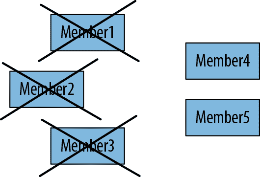
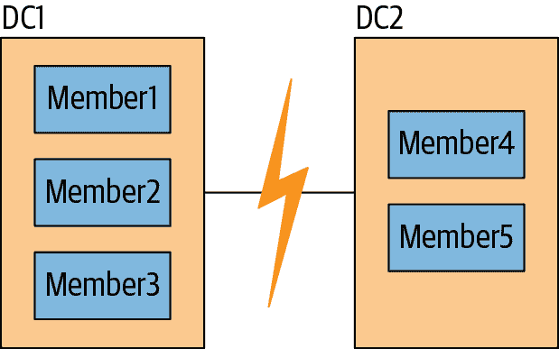

# 第十章：设置副本集

本章介绍了 MongoDB 的高可用性系统：副本集。它涵盖了：

+   什么是副本集

+   如何设置副本集

+   副本集成员的配置选项有哪些

# 引入复制

自从第一章以来，我们一直在使用独立服务器，即单个*mongod*服务器。这是一个快速入门的方式，但在生产环境中运行是有风险的。如果服务器崩溃或不可用，您的数据库将在一段时间内无法访问。如果硬件出现问题，可能需要将数据迁移到另一台机器。在最坏的情况下，磁盘或网络问题可能导致数据损坏或无法访问。

复制是将数据的完全相同副本存储在多个服务器上的一种方式，并且建议在所有生产部署中使用。即使一台或多台服务器发生故障，复制也能保持应用程序运行和数据安全。

在 MongoDB 中，通过创建*副本集*来设置复制。副本集是一组服务器，其中包括一个*主服务器*（负责写入数据）和多个*从服务器*（负责保留主服务器数据的副本）。如果主服务器崩溃，从服务器可以从自身选举新的主服务器。

如果您正在使用复制，并且一台服务器出现故障，仍然可以从集合中的其他服务器访问数据。如果服务器上的数据受损或无法访问，则可以从集合中的其他成员制作数据的新副本。

本章介绍了副本集，并涵盖了如何在您的系统上设置复制。如果您对复制机制不太感兴趣，只是想为测试/开发或生产创建一个副本集，可以使用 MongoDB 的云解决方案，[MongoDB Atlas](https://atlas.mongodb.com)。它易于使用，并提供免费的试用选项供实验。或者，要在自己的基础架构中管理 MongoDB 集群，可以使用[Ops Manager](https://oreil.ly/-X6yp)。

# 设置副本集，第一部分

在本章中，我们将向您展示如何在单台机器上设置一个三节点复制集，以便您可以开始实验复制集机制。这种设置可能只是为了快速启动和运行一个复制集，然后在*mongo* shell 中使用管理命令或模拟网络分区或服务器故障，以更好地了解 MongoDB 如何处理高可用性和灾难恢复。在生产环境中，您应该始终使用复制集，并为每个成员分配一个专用主机，以避免资源争用并提供对服务器故障的隔离。为了提供进一步的弹性，您还应该使用[DNS 种子连接格式](https://oreil.ly/cCORE)来指定应用程序如何连接到您的复制集。使用 DNS 的优势在于，托管 MongoDB 复制集成员的服务器可以轮换更改，而无需重新配置客户端（特别是它们的连接字符串）。

鉴于现有的虚拟化和云选项的多样性，几乎可以像为每个成员在专用主机上创建一个测试副本集一样简单。我们提供了一个 Vagrant 脚本，让您可以尝试这个选项。^(1)

要开始测试我们的复制集，请首先为每个节点创建单独的数据目录。在 Linux 或 macOS 上，在终端中运行以下命令来创建这三个目录：

```
$ mkdir -p ~/data/rs{1,2,3}
```

这将创建目录*~/data/rs1*、*~/data/rs2*和*~/data/rs3*（`~`表示您的主目录）。

在 Windows 上，要创建这些目录，请在命令提示符（cmd）或 PowerShell 中运行以下命令：

```
> md c:\data\rs1 c:\data\rs2 c:\data\rs3
```

然后，在 Linux 或 macOS 上，需要在单独的终端中运行以下每个命令：

```
$ mongod --replSet mdbDefGuide --dbpath ~/data/rs1 --port 27017 \
    --smallfiles --oplogSize 200
$ mongod --replSet mdbDefGuide --dbpath ~/data/rs2 --port 27018 \
    --smallfiles --oplogSize 200
$ mongod --replSet mdbDefGuide --dbpath ~/data/rs3 --port 27019 \
    --smallfiles --oplogSize 200
```

在 Windows 上，每个命令都需要在单独的命令提示符或 PowerShell 窗口中运行：

```
> mongod --replSet mdbDefGuide --dbpath c:\data\rs1 --port 27017 \
    --smallfiles --oplogSize 200
> mongod --replSet mdbDefGuide --dbpath c:\data\rs2 --port 27018 \
    --smallfiles --oplogSize 200
> mongod --replSet mdbDefGuide --dbpath c:\data\rs3 --port 27019 \
    --smallfiles --oplogSize 200
```

启动后，您应该有三个独立的*mongod*进程在运行。

###### 注意

一般来说，我们将在本章剩余部分介绍的原则适用于在生产部署中使用的复制集，其中每个*mongod*都有一个专用的主机。然而，在保护复制集的相关细节方面，我们会在第十九章中简要提及一些额外的细节。

# 网络考虑事项

集合的每个成员必须能够与集合中的每个其他成员（包括自身）建立连接。如果出现有关无法连接正在运行的其他成员的错误，请检查您的网络配置，确保允许它们之间的连接。

您启动的进程同样可以轻松运行在单独的服务器上。但是，从 MongoDB 3.6 版本开始，默认情况下*mongod*仅绑定到*localhost*（127.0.0.1）。为了使复制集的每个成员能够与其他成员通信，您还必须绑定到其他成员可达的 IP 地址。如果我们在具有 IP 地址为 198.51.100.1 的网络接口的服务器上运行*mongod*实例，并且希望将其作为复制集的成员与不同服务器上的每个成员一起运行，则可以指定命令行参数`--bind_ip`或在该实例的配置文件中使用`bind_ip`：

```
$ mongod --bind_ip localhost,192.51.100.1 --replSet mdbDefGuide \
    --dbpath ~/data/rs1 --port 27017 --smallfiles --oplogSize 200
```

在这种情况下，无论我们运行在 Linux、macOS 还是 Windows 上，我们都会对其他*mongod*进行类似的修改。

# 安全注意事项

在绑定到除*localhost*以外的 IP 地址之前，在配置复制集时，应启用授权控制并指定身份验证机制。此外，建议对磁盘上的数据以及复制集成员之间和集合与客户端之间的通信进行加密。我们将在第十九章中详细讨论保护复制集的问题。

# 设置复制集，第二部分

回到我们的例子，到目前为止我们所做的工作，每个*mongod*都还不知道其他实例的存在。为了告诉它们彼此的存在，我们需要创建一个列出每个成员的配置，并将此配置发送给我们的一个*mongod*进程。它将负责将配置传播到其他成员。

在第四个终端、Windows 命令提示符或 PowerShell 窗口中，启动连接到运行中的*mongod*实例之一的*mongo* shell。您可以通过输入以下命令来执行此操作。使用此命令，我们将连接到运行在端口 27017 上的*mongod*：

```
$ mongo --port 27017
```

然后，在*mongo* shell 中，创建一个配置文档，并将其传递给`rs.initiate()`助手以初始化一个复制集。这将启动一个包含三个成员的复制集，并将配置传播到其余的*mongod*实例，从而形成一个复制集：

```
> rsconf = {
    _id: "mdbDefGuide",
    members: [
      {_id: 0, host: "localhost:27017"},
      {_id: 1, host: "localhost:27018"},
      {_id: 2, host: "localhost:27019"} 
    ]
  }
> rs.initiate(rsconf)
{ "ok" : 1, "operationTime" : Timestamp(1501186502, 1) }
```

复制集配置文档有几个重要部分。配置的`"_id"`是您在命令行中传递的复制集名称（在本例中为`"mdbDefGuide"`）。确保此名称完全匹配。

文档的下一部分是一组集合成员的数组。每个成员都需要两个字段：一个`"_id"`，它是复制集成员之间唯一的整数，以及一个主机名。

请注意，我们在本套中使用*localhost*作为成员的主机名。这仅供示例目的。在稍后讨论安全复制集的章节中，我们将探讨更适合生产部署的配置。MongoDB 允许用于本地测试的全*localhost*复制集，但如果尝试在配置中混合*localhost*和非*localhost*服务器，则会有问题。

此配置文档是您的复制集配置。运行在 *localhost:27017* 上的成员将解析配置并向其他成员发送消息，通知它们有新的配置。一旦它们加载了配置，它们将选举主节点并开始处理读写操作。

###### 提示

不幸的是，您无法在不重启并初始化集合的情况下将独立服务器转换为复制集。因此，即使您一开始只有一个服务器，您可能希望将其配置为单成员复制集。这样，如果以后想添加更多成员，也可以在无需停机的情况下执行。

如果您正在启动全新的集合，可以将配置发送到集合中的任何成员。如果您在其中一个成员上拥有数据，则必须将配置发送到具有数据的成员。您无法在具有多个成员数据的情况下启动复制集。

一旦初始化完成，您应该拥有一个完全功能的复制集。复制集应该会选举一个主节点。您可以使用 `rs.status()` 查看复制集的状态。`rs.status()` 的输出会告诉您很多关于复制集的信息，包括我们尚未涵盖的许多内容，但不用担心，我们会介绍的！现在，先看看 `members` 数组。请注意，此输出中列出了我们的三个 *mongod* 实例，其中一个（在本例中是运行在端口 27017 上的 *mongod*）已经被选为主节点。其他两个是从节点。如果您自己尝试，可能会发现输出中的 `"date"` 和多个 `Timestamp` 值不同，甚至可能会发现不同的 *mongod* 被选为主节点（这完全正常）：

```
> rs.status()
{
    "set" : "mdbDefGuide",
    "date" : ISODate("2017-07-27T20:23:31.457Z"),
    "myState" : 1,
    "term" : NumberLong(1),
    "heartbeatIntervalMillis" : NumberLong(2000),
    "optimes" : {
        "lastCommittedOpTime" : {
            "ts" : Timestamp(1501187006, 1),
            "t" : NumberLong(1)
        },
        "appliedOpTime" : {
            "ts" : Timestamp(1501187006, 1),
            "t" : NumberLong(1)
        },
        "durableOpTime" : {
            "ts" : Timestamp(1501187006, 1),
            "t" : NumberLong(1)
        }
    },
    "members" : [
        {
            "_id" : 0,
            "name" : "localhost:27017",
            "health" : 1,
            "state" : 1,
            "stateStr" : "PRIMARY",
            "uptime" : 688,
            "optime" : {
                "ts" : Timestamp(1501187006, 1),
                "t" : NumberLong(1)
            },
            "optimeDate" : ISODate("2017-07-27T20:23:26Z"),
            "electionTime" : Timestamp(1501186514, 1),
            "electionDate" : ISODate("2017-07-27T20:15:14Z"),
            "configVersion" : 1,
            "self" : true
        },
        {
            "_id" : 1,
            "name" : "localhost:27018",
            "health" : 1,
            "state" : 2,
            "stateStr" : "SECONDARY",
            "uptime" : 508,
            "optime" : {
                "ts" : Timestamp(1501187006, 1),
                "t" : NumberLong(1)
            },
            "optimeDurable" : {
                "ts" : Timestamp(1501187006, 1),
                "t" : NumberLong(1)
            },
            "optimeDate" : ISODate("2017-07-27T20:23:26Z"),
            "optimeDurableDate" : ISODate("2017-07-27T20:23:26Z"),
            "lastHeartbeat" : ISODate("2017-07-27T20:23:30.818Z"),
            "lastHeartbeatRecv" : ISODate("2017-07-27T20:23:30.113Z"),
            "pingMs" : NumberLong(0),
            "syncingTo" : "localhost:27017",
            "configVersion" : 1
        },
        {
            "_id" : 2,
            "name" : "localhost:27019",
            "health" : 1,
            "state" : 2,
            "stateStr" : "SECONDARY",
            "uptime" : 508,
            "optime" : {
                "ts" : Timestamp(1501187006, 1),
                "t" : NumberLong(1)
            },
            "optimeDurable" : {
                "ts" : Timestamp(1501187006, 1),
                "t" : NumberLong(1)
            },
            "optimeDate" : ISODate("2017-07-27T20:23:26Z"),
            "optimeDurableDate" : ISODate("2017-07-27T20:23:26Z"),
            "lastHeartbeat" : ISODate("2017-07-27T20:23:30.818Z"),
            "lastHeartbeatRecv" : ISODate("2017-07-27T20:23:30.113Z"),
            "pingMs" : NumberLong(0),
            "syncingTo" : "localhost:27017",
            "configVersion" : 1
        }
    ],
    "ok" : 1,
    "operationTime" : Timestamp(1501187006, 1)
}
```

# 观察复制

如果您的复制集选举端口为 27017 上的 *mongod* 为主节点，则用于启动复制集的 *mongo* shell 当前已连接到主节点。您应该看到提示更改为以下内容：

```
mdbDefGuide:PRIMARY>
```

这表明我们已连接到复制集的主节点，其 `"_id"` 为 `"mdbDefGuide"`。为了简化和清晰起见，我们将在复制示例中仅使用 `>` 来表示 *mongo* shell 提示。

如果您的复制集选举了其他节点作为主节点，请退出 shell 并在命令行中指定正确的端口号连接到主节点，就像我们在启动 *mongo* shell 时所做的那样。例如，如果您的集合的主节点在端口 27018 上，请使用以下命令连接：

```
$ mongo --port 27018
```

现在您已连接到主节点，请尝试执行一些写操作并查看发生了什么。首先，插入 1000 个文档：

```
> use test
> for (i=0; i<1000; i++) {db.coll.insert({count: i})}
>
> // make sure the docs are there
> db.coll.count()
1000
```

现在检查其中一个从节点，并验证它是否拥有所有这些文档的副本。您可以退出 shell 并使用其中一个从节点的端口号连接来执行此操作，但是通过在已运行的 shell 中使用 `Mongo` 构造函数实例化连接对象，即可轻松获得连接到其中一个从节点的连接。

首先，在主服务器上使用你连接到*test*数据库来运行`isMaster`命令。这将以比`rs.status()`更为简洁的形式显示副本集的状态。在编写应用程序代码或脚本时，这也是一个方便的确定主成员的方式：

```
> db.isMaster()
{
    "hosts" : [
        "localhost:27017",
        "localhost:27018",
        "localhost:27019"
    ],
    "setName" : "mdbDefGuide",
    "setVersion" : 1,
    "ismaster" : true,
    "secondary" : false,
    "primary" : "localhost:27017",
    "me" : "localhost:27017",
    "electionId" : ObjectId("7fffffff0000000000000004"),
    "lastWrite" : {
        "opTime" : {
            "ts" : Timestamp(1501198208, 1),
            "t" : NumberLong(4)
        },
        "lastWriteDate" : ISODate("2017-07-27T23:30:08Z")
    },
    "maxBsonObjectSize" : 16777216,
    "maxMessageSizeBytes" : 48000000,
    "maxWriteBatchSize" : 1000,
    "localTime" : ISODate("2017-07-27T23:30:08.722Z"),
    "maxWireVersion" : 6,
    "minWireVersion" : 0,
    "readOnly" : false,
    "compression" : [
        "snappy"
    ],
    "ok" : 1,
    "operationTime" : Timestamp(1501198208, 1)
}
```

如果在任何时候发生选举，你连接的*mongod*成为辅助服务器，你可以使用`isMaster`命令确定哪个成员已成为主服务器。这里的输出告诉我们，*localhost:27018*和*localhost:27019*都是辅助服务器，因此我们可以使用任何一个来实现我们的目的。让我们实例化一个连接到*localhost:27019*：

```
> secondaryConn = new Mongo("localhost:27019")
connection to localhost:27019
>
> secondaryDB = secondaryConn.getDB("test")
test
```

现在，如果我们试图在已复制到辅助服务器的集合上进行读取，我们会收到一个错误。让我们尝试在这个集合上进行`find`操作，然后查看错误及其原因：

```
> secondaryDB.coll.find()
Error: error: {
    "operationTime" : Timestamp(1501200089, 1),
    "ok" : 0,
    "errmsg" : "not master and slaveOk=false",
    "code" : 13435,
    "codeName" : "NotMasterNoSlaveOk"
}
```

辅助服务器可能落后于主服务器（或*滞后*），因此可能没有最新的写操作，所以默认情况下，辅助服务器将拒绝读请求，以防止应用程序意外读取陈旧数据。因此，如果你尝试查询一个辅助服务器，你会收到一个错误，指示它不是主服务器。这是为了保护你的应用程序免受意外连接到辅助服务器并读取陈旧数据的影响。为了允许在辅助服务器上进行查询，我们可以设置一个“我允许从辅助服务器读取”的标志，像这样：

```
> secondaryConn.setSlaveOk()
```

注意，`slaveOk`设置在连接（`secondaryConn`）上，而不是数据库（`secondaryDB`）上。

现在你已经准备好从这个成员读取了。正常查询它：

```
> secondaryDB.coll.find()
{ "_id" : ObjectId("597a750696fd35621b4b85db"), "count" : 0 }
{ "_id" : ObjectId("597a750696fd35621b4b85dc"), "count" : 1 }
{ "_id" : ObjectId("597a750696fd35621b4b85dd"), "count" : 2 }
{ "_id" : ObjectId("597a750696fd35621b4b85de"), "count" : 3 }
{ "_id" : ObjectId("597a750696fd35621b4b85df"), "count" : 4 }
{ "_id" : ObjectId("597a750696fd35621b4b85e0"), "count" : 5 }
{ "_id" : ObjectId("597a750696fd35621b4b85e1"), "count" : 6 }
{ "_id" : ObjectId("597a750696fd35621b4b85e2"), "count" : 7 }
{ "_id" : ObjectId("597a750696fd35621b4b85e3"), "count" : 8 }
{ "_id" : ObjectId("597a750696fd35621b4b85e4"), "count" : 9 }
{ "_id" : ObjectId("597a750696fd35621b4b85e5"), "count" : 10 }
{ "_id" : ObjectId("597a750696fd35621b4b85e6"), "count" : 11 }
{ "_id" : ObjectId("597a750696fd35621b4b85e7"), "count" : 12 }
{ "_id" : ObjectId("597a750696fd35621b4b85e8"), "count" : 13 }
{ "_id" : ObjectId("597a750696fd35621b4b85e9"), "count" : 14 }
{ "_id" : ObjectId("597a750696fd35621b4b85ea"), "count" : 15 }
{ "_id" : ObjectId("597a750696fd35621b4b85eb"), "count" : 16 }
{ "_id" : ObjectId("597a750696fd35621b4b85ec"), "count" : 17 }
{ "_id" : ObjectId("597a750696fd35621b4b85ed"), "count" : 18 }
{ "_id" : ObjectId("597a750696fd35621b4b85ee"), "count" : 19 }
Type "it" for more
```

你可以看到所有我们的文档都在这里。

现在，尝试向辅助服务器写入：

```
> secondaryDB.coll.insert({"count" : 1001})
WriteResult({ "writeError" : { "code" : 10107, "errmsg" : "not master" } })
> secondaryDB.coll.count()
1000
```

你可以看到辅助服务器不接受写操作。辅助服务器只会执行通过复制获取的写操作，而不会执行来自客户端的写操作。

还有一个有趣的功能需要你尝试：自动故障转移。如果主服务器宕机，其中一个辅助服务器将自动被选为主服务器。为测试此功能，请停止主服务器：

```
> db.adminCommand({"shutdown" : 1})
```

当你运行此命令时，你会看到一些错误消息，因为运行在端口 27017 上的*mongod*（我们连接到的成员）将终止，我们使用的 shell 会失去连接：

```
2017-07-27T20:10:50.612-0400 E QUERY    [thread1] Error: error doing query: 
 failed: network error while attempting to run command 'shutdown' on host 
 '127.0.0.1:27017'  :
DB.prototype.runCommand@src/mongo/shell/db.js:163:1
DB.prototype.adminCommand@src/mongo/shell/db.js:179:16
@(shell):1:1
2017-07-27T20:10:50.614-0400 I NETWORK  [thread1] trying reconnect to 
 127.0.0.1:27017 (127.0.0.1) failed
2017-07-27T20:10:50.615-0400 I NETWORK  [thread1] reconnect 
 127.0.0.1:27017 (127.0.0.1) ok
MongoDB Enterprise mdbDefGuide:SECONDARY> 
2017-07-27T20:10:56.051-0400 I NETWORK  [thread1] trying reconnect to 
 127.0.0.1:27017 (127.0.0.1) failed
2017-07-27T20:10:56.051-0400 W NETWORK  [thread1] Failed to connect to 
 127.0.0.1:27017, in(checking socket for error after poll), reason: 
 Connection refused
2017-07-27T20:10:56.051-0400 I NETWORK  [thread1] reconnect 
 127.0.0.1:27017 (127.0.0.1) failed failed 
MongoDB Enterprise > 
MongoDB Enterprise > secondaryConn.isMaster()
2017-07-27T20:11:15.422-0400 E QUERY    [thread1] TypeError: 
 secondaryConn.isMaster is not a function :
@(shell):1:1
```

这不是问题。它不会导致 shell 崩溃。继续在辅助服务器上运行`isMaster`，看看谁已成为新的主服务器：

```
> secondaryDB.isMaster()
```

`isMaster`命令的输出应该看起来像这样：

```
{
    "hosts" : [
        "localhost:27017",
        "localhost:27018",
        "localhost:27019"
    ],
    "setName" : "mdbDefGuide",
    "setVersion" : 1,
    "ismaster" : true,
    "secondary" : false,
    "primary" : "localhost:27018",
    "me" : "localhost:27019",
    "electionId" : ObjectId("7fffffff0000000000000005"),
    "lastWrite" : {
        "opTime" : {
            "ts" : Timestamp(1501200681, 1),
            "t" : NumberLong(5)
        },
        "lastWriteDate" : ISODate("2017-07-28T00:11:21Z")
    },
    "maxBsonObjectSize" : 16777216,
    "maxMessageSizeBytes" : 48000000,
    "maxWriteBatchSize" : 1000,
    "localTime" : ISODate("2017-07-28T00:11:28.115Z"),
    "maxWireVersion" : 6,
    "minWireVersion" : 0,
    "readOnly" : false,
    "compression" : [
        "snappy"
    ],
    "ok" : 1,
    "operationTime" : Timestamp(1501200681, 1)
}
```

注意，主服务器已切换到 27018 端口。你的主服务器可能是另一个服务器；首先注意到主服务器已下线的任何辅助服务器都将被选为主服务器。现在你可以向新的主服务器发送写操作。

###### 小贴士

`isMaster`是一个非常古老的命令，早于 MongoDB 只支持主/从复制的复制集。因此，它在使用复制集术语时并不一致：它仍然将主服务器称为“master”。你可以通常将“master”等同于“primary”，将“slave”等同于“secondary”。

继续并重新启动我们在 *localhost:27017* 上运行的服务器。您只需要找到启动它的命令行界面。您将看到一些指示它已终止的消息。只需再次使用最初启动它时使用的相同命令来运行它。

恭喜！您刚刚设置、使用甚至稍微试验了一下复制集，以强制关闭并选举新的主服务器。

有几个关键概念需要记住：

+   客户端可以向主服务器发送与独立服务器相同的所有操作（读取、写入、命令、索引构建等）。

+   客户端无法向次要节点写入。

+   默认情况下，客户端无法从次要节点读取。您可以通过在连接上显式设置“我知道我正在从次要节点读取”选项来启用此功能。

# 更改您的复制集配置

复制集配置可以随时更改：可以添加、移除或修改成员。对于一些常见操作，有 shell 辅助工具。例如，要向集合添加新成员，可以使用 `rs.add`：

```
> rs.add("localhost:27020")
```

同样，您也可以删除成员：

```
> rs.remove("localhost:27017")
{ "ok" : 1, "operationTime" : Timestamp(1501202441, 2) }
```

您可以通过在 shell 中运行 `rs.config()` 来检查重新配置是否成功。它将打印当前配置：

```
> rs.config()
{
    "_id" : "mdbDefGuide",
    "version" : 3,
    "protocolVersion" : NumberLong(1),
    "members" : [
        {
            "_id" : 1,
            "host" : "localhost:27018",
            "arbiterOnly" : false,
            "buildIndexes" : true,
            "hidden" : false,
            "priority" : 1,
            "tags" : {

            },
            "slaveDelay" : NumberLong(0),
            "votes" : 1
        },
        {
            "_id" : 2,
            "host" : "localhost:27019",
            "arbiterOnly" : false,
            "buildIndexes" : true,
            "hidden" : false,
            "priority" : 1,
            "tags" : {

            },
            "slaveDelay" : NumberLong(0),
            "votes" : 1
        },
        {
            "_id" : 3,
            "host" : "localhost:27020",
            "arbiterOnly" : false,
            "buildIndexes" : true,
            "hidden" : false,
            "priority" : 1,
            "tags" : {

            },
            "slaveDelay" : NumberLong(0),
            "votes" : 1
        }
    ],
    "settings" : {
        "chainingAllowed" : true,
        "heartbeatIntervalMillis" : 2000,
        "heartbeatTimeoutSecs" : 10,
        "electionTimeoutMillis" : 10000,
        "catchUpTimeoutMillis" : -1,
        "getLastErrorModes" : {

        },
        "getLastErrorDefaults" : {
            "w" : 1,
            "wtimeout" : 0
        },
        "replicaSetId" : ObjectId("597a49c67e297327b1e5b116")
    }
}
```

每次更改配置时，`"version"`字段都会增加。它从版本 1 开始。

您还可以修改现有成员，而不仅仅是添加和删除它们。要进行修改，请在 shell 中创建您想要的配置文档，然后调用 `rs.reconfig()`。例如，假设我们有如下配置：

```
> rs.config()
{
    "_id" : "testReplSet",
    "version" : 2,
    "members" : [
        {
            "_id" : 0,
            "host" : "198.51.100.1:27017"
        },
        {
            "_id" : 1,
            "host" : "localhost:27018"
        },
        {
            "_id" : 2,
            "host" : "localhost:27019"
        }
    ]
}
```

某人意外地通过 IP 地址添加了成员 0，而不是其主机名。要更改此设置，首先在 shell 中加载当前配置，然后更改相关字段：

```
> var config = rs.config()
> config.members[0].host = "localhost:27017"
```

现在配置文档正确后，我们需要使用 `rs.reconfig()` 辅助函数将其发送到数据库：

```
> rs.reconfig(config)
```

`rs.reconfig()` 在复杂操作（如修改成员配置或同时添加/删除多个成员）中通常比 `rs.add()` 和 `rs.remove()` 更有用。您可以使用它进行任何合法的配置更改：只需创建表示所需配置的配置文档，并将其传递给 `rs.reconfig()`。

# 如何设计一个集合

为了规划您的集合，您必须熟悉某些概念。下一章将更详细地讨论这些概念，但最重要的是复制集主要与多数派有关：您需要大多数成员来选举主服务器，主服务器只能在能够达到多数派时保持主要地位，并且在写入被复制到多数派时是安全的。这个多数派被定义为“集合中所有成员的一半以上”，如 表 10-1 所示。

表 10-1\. 什么是多数派？

| 集合中的成员数量 | 集合的多数派 |
| --- | --- |
| 1 | 1 |
| 2 | 2 |
| 3 | 2 |
| 4 | 3 |
| 5 | 3 |
| 6 | 4 |
| 7 | 4 |

请注意，成员数量如何无关紧要或不可用；多数是基于集合的配置。

例如，假设我们有一个五成员集合，三个成员下线，如图 10-1 所示。仍然有两个成员在线。这两个成员无法达到集合的多数（至少三个成员），因此无法选举主节点。如果其中一个是主节点，它会在注意到无法达到多数后下台。几秒钟后，您的集合将由两个次要成员和三个不可达成员组成。



###### 图 10-1。当集合中少数成员可用时，所有成员将成为次要节点。

许多用户觉得这很令人沮丧：为什么剩下的两个成员不能选举出一个主节点？问题在于，可能并非其他三个成员实际宕机，而是网络宕机，如图 10-2 所示。在这种情况下，左侧的三个成员将选举出一个主节点，因为他们能够达到集合的多数（五个成员中的三个）。在网络分区的情况下，我们不希望分区的两侧都选举出一个主节点，因为那样集合将会有两个主节点。两个主节点将都在写入数据库，并且数据集会发散。要求多数选举或保持主节点是避免出现多个主节点的一个巧妙方法。



###### 图 10-2。对于成员来说，网络分区看起来与分区另一侧的服务器宕机是相同的。

非常重要的是，要配置您的集合，以便通常能够拥有一个主节点。例如，在这里描述的五成员集合中，如果成员 1、2 和 3 位于一个数据中心，成员 4 和 5 位于另一个数据中心，第一个数据中心几乎总是可以获得多数（在数据中心之间更有可能发生网络中断而非在它们内部）。

有几种常见的推荐配置：

+   在一个数据中心中占据大多数，如图 10-2 所示。如果您有一个主要数据中心，您总是希望将副本集的主节点放置在那里，这是一个很好的设计。只要您的主要数据中心健康，您就会有一个主节点。但是，如果该数据中心不可用，您的次要数据中心将无法选举新的主节点。

+   每个数据中心中有相同数量的服务器，加上第三个位置的决策性服务器。如果您的数据中心具有“相等”的偏好，这是一个很好的设计，因为通常来自任何数据中心的服务器都能看到集合的多数。但它涉及在服务器的三个单独位置。

更复杂的需求可能需要不同的配置，但您应该记住在逆境条件下，您的集合如何获得多数。

如果 MongoDB 支持多个主节点，则所有这些复杂性将消失。然而，这会带来自己的一系列复杂性。有了两个主节点，您必须处理冲突写入（例如，如果某人在一个主节点上更新文档，而在另一个主节点上删除它）。在支持多个写入者的系统中，处理冲突的两种流行方法是：手动协调或让系统随意选择“赢家”。这两个选项都不是开发人员编码的非常简单模型，因为您不能确定您编写的数据不会在您下面更改。因此，MongoDB 选择仅支持单个主节点。这使开发变得更简单，但可能导致复制集在某些时期变为只读状态。

## 选举工作原理

当次要节点无法联系主节点时，它将联系所有其他成员并请求被选为主节点。这些其他成员进行几项健全检查：它们是否能联系到寻求选举的成员无法联系的主节点？寻求选举的成员是否保持与复制的最新状态？是否有任何具有更高优先级的可用成员应该被选为主节点？

在版本 3.2 中，MongoDB 引入了复制协议的第一个版本。协议版本 1 基于 Diego Ongaro 和 John Ousterhout 在斯坦福大学开发的 RAFT 共识协议。它最适合描述为类似 RAFT 的协议，并专门设计以包括一些 MongoDB 特有的复制概念，如仲裁者、优先级、非投票成员、写入关注等。协议版本 1 为新功能提供了基础，如较短的故障切换时间，并极大地减少了检测错误主节点情况的时间。它还通过使用术语 ID 防止了双重投票。

###### 注意

RAFT 是一个共识算法，可分为相对独立的子问题。共识是多个服务器或进程就数值达成一致的过程。RAFT 确保共识，使得相同的一系列命令产生相同的一系列结果，并在部署的成员之间达到相同的一系列状态。

复制集成员每两秒向彼此发送心跳（ping）。如果在 10 秒内没有从成员收到心跳，则其他成员将标记该不良成员为不可访问。选举算法将“尽力”尝试让优先级最高的次要成员发起选举。成员的优先级影响选举的时间和结果；具有较高优先级的次要成员相对较早地发起选举，并且更有可能获胜。然而，即使有更高优先级的次要实例可用，较低优先级的实例也可能在短时间内被选为主节点。复制集成员持续发起选举，直到可用的优先级最高的成员成为主节点为止。

要被选为主节点，成员必须在复制上保持最新状态，就像它能够到达的成员所知道的那样。所有复制的操作都严格按升序标识符排序，因此候选者的操作必须晚于或等于任何它能够到达的成员的操作。

# 成员配置选项

到目前为止，我们设置的副本集在每个成员的配置上都相当统一。然而，在许多情况下，你可能不希望成员完全相同：你可能希望一个成员优先成为主节点，或者使一个成员对客户端不可见，以便不会将读取请求路由到它。这些以及其他许多配置选项可以在副本集配置的成员子文档中指定。本节概述了可以设置的成员选项。

## 优先级

优先级是指这个成员“希望”成为主节点的程度。它的值可以从`0`到`100`，默认为`1`。将`"priority"`设置为`0`具有特殊含义：具有优先级为`0`的成员永远不能成为主节点。这些被称为*passive*成员。

优先级最高的成员将始终被选为主节点（只要它能够达到集合的大多数，并具有最新的数据）。例如，假设你向集合中添加了优先级为`1.5`的成员，如下所示：

```
> rs.add({"host" : "server-4:27017", "priority" : 1.5})
```

假设集合中的其他成员的优先级是`1`，一旦*server-4*赶上了集合的其他部分，当前的主节点将自动下台，*server-4*将选举自己。如果由于某种原因*server-4*无法赶上，当前的主节点将继续保持主节点状态。设置优先级永远不会导致你的集合没有主节点。它也永远不会导致落后的成员成为主节点（直到它赶上为止）。

`"priority"`的绝对值只关系到它是大于还是小于集合中其他优先级的值：具有优先级为`100`、`1`和`1`的成员将与具有优先级为`2`、`1`和`1`的另一个集合中的成员表现相同。

## 隐藏成员

客户端不会向隐藏成员发送请求，隐藏成员也不会作为复制源首选（尽管如果没有更理想的源可用，则会使用它们）。因此，许多人会隐藏较不强大或备用的服务器。

例如，假设你有一个看起来像这样的集合：

```
> rs.isMaster()
{
    ...
    "hosts" : [
        "server-1:27107",
        "server-2:27017",
        "server-3:27017"
    ],
    ...
}
```

要隐藏*server-3*，你可以在其配置中添加`hidden: true`字段。成员必须具有优先级`0`才能被隐藏（不能有隐藏的主节点）：

```
> var config = rs.config()
> config.members[2].hidden = true
0
> config.members[2].priority = 0
0
> rs.reconfig(config)
```

现在运行`isMaster`将显示：

```
> rs.isMaster()
{
    ...
    "hosts" : [
        "server-1:27107",
        "server-2:27017"
    ],
    ...
}
```

`rs.status()`和`rs.config()`仍会显示该成员；它只是在`isMaster`中消失。当客户端连接到副本集时，它们会调用`isMaster`来确定集合的成员。因此，隐藏成员永远不会用于读取请求。

要取消隐藏一个成员，将`hidden`选项更改为`false`或完全删除该选项。

## 选举仲裁者

两成员集在多数需求上有明显的缺点。然而，许多小型部署的人并不想保留三份数据副本，他们认为两份足够了，保留第三份副本并不值得管理、运维和财务成本。

对于这些部署，MongoDB 支持一种特殊类型的成员称为*仲裁者*，其唯一目的是参与选举。仲裁者不持有任何数据，也不被客户端使用：它们只是为两成员集提供多数。一般来说，没有仲裁者的部署更为理想。

由于仲裁者没有*mongod*服务器的传统责任，因此可以在比一般用于 MongoDB 的服务器更轻量的服务器上运行仲裁者作为一个轻量级进程。如果可能的话，通常建议将仲裁者运行在与其他成员不同的故障域中，这样它对集合有一个“外部视角”，正如在“如何设计一个集合”中描述的部署建议中所述。

启动仲裁者的方法与启动普通的*mongod*相同，使用``--replSet *`name`*``选项和一个空数据目录。您可以使用`rs.addArb()`助手将其添加到集合中：

```
> rs.addArb("server-5:27017")
```

同样地，您可以在成员配置中指定`"arbiterOnly"`选项：

```
> rs.add({"_id" : 4, "host" : "server-5:27017", "arbiterOnly" : true})
```

一旦将仲裁者添加到集合中，它将永远是仲裁者：您无法重新配置仲裁者成为非仲裁者，反之亦然。

仲裁者另一个好处是在更大的集群中打破平局。如果节点数量是偶数，可能会有一半节点投票支持一个成员，另一半支持另一个成员。仲裁者可以做出决定性的投票。然而，在使用仲裁者时有几件事情需要记住；我们接下来会讨论这些事情。

### 最多使用一个仲裁者

请注意，在刚刚描述的两种用例中，您最多只需要一个仲裁者。如果节点数为奇数，则不需要仲裁者。一个常见的误解似乎是应该“预防性地”添加额外的仲裁者。然而，增加额外的仲裁者既不能加快选举速度，也不能提供额外的数据安全性。

假设您有一个三成员集。需要两个成员来选举主节点。如果添加一个仲裁者，您将得到一个四成员集，因此需要三个成员来选择主节点。因此，您的集合可能不够稳定：现在不再需要 67%的集合在线，而是需要 75%。

添加额外的成员也可能导致选举时间更长。如果节点数量是偶数因为您添加了仲裁者，您的仲裁者可能导致平局，而非阻止它们。

### 使用仲裁者的缺点

如果您在数据节点和仲裁者之间可以选择，选择数据节点。在小型集群中使用仲裁者而不是数据节点可能会使一些操作任务更加困难。例如，假设您正在运行一个包含两个“普通”成员和一个仲裁者的副本集，并且其中一个数据持有成员宕机。如果该成员确实已经彻底死亡（数据不可恢复），则必须将数据从当前主服务器复制到将用作次要服务器的新服务器上。复制数据可能会给服务器带来很大压力，从而减慢应用程序的运行速度。（通常情况下，将几十个 GB 复制到新服务器是微不足道的，但超过一百个 GB 就变得不切实际了。）

相反，如果您有三个数据持有成员，如果一个服务器完全崩溃，会有更多的“呼吸空间”。您可以使用剩余的次要成员引导一个新的服务器，而不是依赖于主服务器。

在两成员加仲裁者的场景中，主服务器是您数据的最后一个良好副本，同时也是尝试处理应用程序负载的服务器，当您尝试将另一个数据副本上线时。

因此，如果可能的话，使用奇数个“普通”成员而不是仲裁者。

###### 警告

在具有主-次-仲裁者（PSA）架构的三成员副本集或具有三成员 PSA 分片的分片集群中，存在一个已知问题：如果其中任何两个数据节点之一宕机，并启用了`"majority"`读关注，那么缓存压力会增加。理想情况下，对于这些部署，您应该用数据节点替换仲裁者。或者，为了防止存储缓存压力，可以在部署或分片的每个*mongod*实例上禁用[`"majority"`读关注](https://oreil.ly/p6nUm)。

## 创建索引

有时，次要节点不需要与主节点上存在的索引相同（或者根本不需要索引）。如果您仅将次要节点用于备份数据或离线批处理作业，则可能需要在成员配置中指定`"buildIndexes" : false`。此选项可防止次要节点构建任何索引。

这是一个永久设置：已指定`"buildIndexes" : false`的成员将永远无法重新配置为“正常”索引构建成员。如果您想将非索引构建成员更改为索引构建成员，则必须从集合中删除它，删除其所有数据，然后将其重新添加到集合中，并允许其重新同步。

与隐藏成员一样，此选项要求成员的优先级为`0`。

^(1) 请参阅[*https://github.com/mongodb-the-definitive-guide-3e/mongodb-the-definitive-guide-3e*](https://github.com/mongodb-the-definitive-guide-3e/mongodb-the-definitive-guide-3e)。
