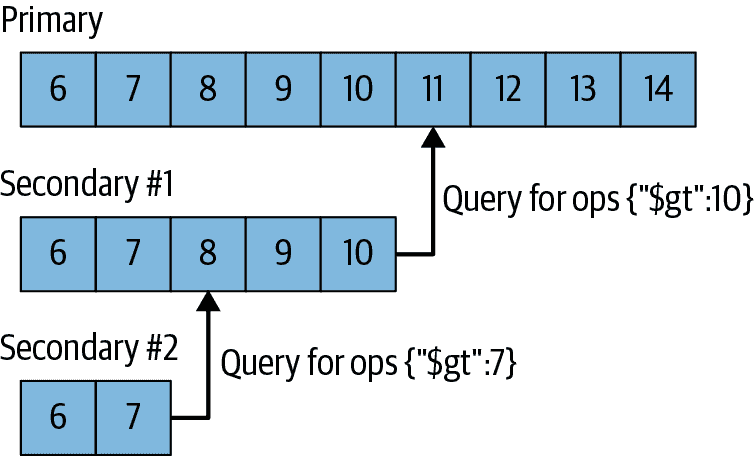
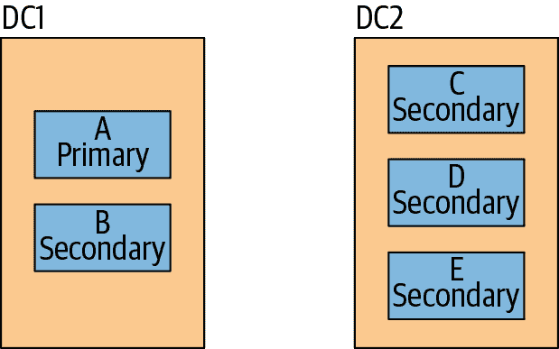
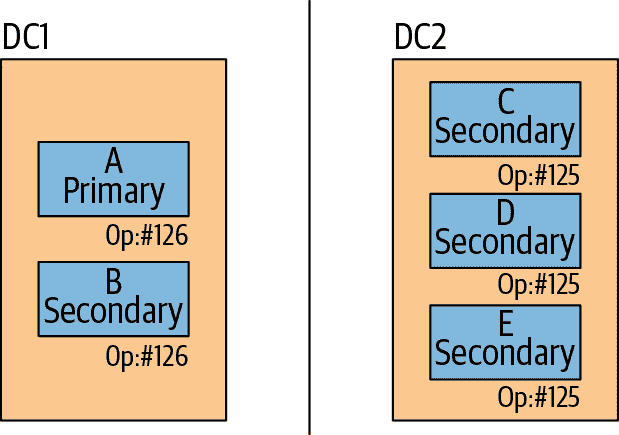
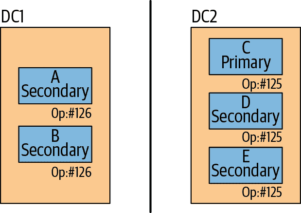
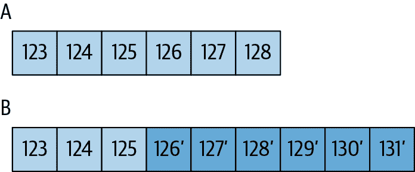

# 第十一章：复制集的组件

本章介绍了复制集中各个部件的组成，包括：

+   复制集成员如何复制新数据

+   如何启动新成员的工作原理

+   选举的工作原理

+   可能的服务器和网络故障场景

# 同步

复制关注于在多个服务器上保持数据的相同副本。MongoDB 实现这一目标的方式是通过保持操作日志（oplog）的操作日志的记录，其中包含主服务器执行的每个写操作。这是一个固定大小的集合，存在于主服务器上的本地数据库中。从服务器查询此集合以获取要复制的操作。

每个从服务器维护自己的操作日志，记录从主服务器复制的每个操作。这使得任何成员都可以作为任何其他成员的同步源，如 图 11-1 所示。从服务器从它们同步的成员获取操作，将这些操作应用于其数据集，然后将这些操作写入它们的操作日志。如果应用操作失败（这只会在底层数据已损坏或以某种方式与主服务器不同的情况下发生），从服务器将退出。



###### 图 11-1\. 操作日志（oplog）保持已发生写操作的有序列表；每个成员都有其自己的操作日志副本，应该与主服务器的相同（除了一些滞后）。

如果任何原因导致辅助服务器宕机，在重新启动时，它将从其操作日志（oplog）中的最后一个操作开始同步。随着操作被应用到数据并写入操作日志，辅助服务器可能会重放已经应用到其数据的操作。MongoDB 设计上能够正确处理这种情况：多次重放操作日志操作会产生与单次重放相同的结果。操作日志中的每个操作都是幂等的。也就是说，操作日志操作无论应用一次还是多次到目标数据集，都会产生相同的结果。

因为操作日志（oplog）是固定大小的，它只能容纳一定数量的操作。一般来说，操作日志的使用空间速率大致与系统中写入的速率相同：如果在主服务器上每分钟写入 1 KB，你的操作日志可能以每分钟约 1 KB 的速度填满。然而，也有几个例外情况：影响多个文档的操作，如删除或多文档更新，将会被分解为多个操作日志条目。主服务器上的单个操作将被拆分为每个受影响文档一个操作日志条目。因此，如果你使用 `db.coll.remove()` 从集合中删除 1,000,000 个文档，它将变成 1,000,000 个逐个删除文档的操作日志条目。如果你执行大量的批量操作，这可能比你预期的更快地填满你的操作日志。

在大多数情况下，默认的操作日志大小已经足够。如果您能预测您的副本集工作负载类似以下哪种模式，那么您可能需要创建一个大于默认大小的操作日志。相反，如果您的应用程序主要执行读取操作，并且写入操作很少，则较小的操作日志可能足够。这些是可能需要较大操作日志大小的工作负载类型：

同时更新多个文档

操作日志必须将多个更新转换为单个操作，以保持幂等性。这可能会在不增加数据大小或磁盘使用的情况下使用大量操作日志空间。

删除和插入的数据量相等。

如果您删除的数据量与插入的数据量大致相等，则数据库在磁盘使用方面不会显著增长，但操作日志的大小可能会非常大。

大量的原地更新

如果工作负载的一个重要部分是更新操作，但文档大小不增加，数据库记录的操作数量很多，但磁盘上的数据量不会改变。

在*mongod*创建操作日志之前，您可以使用`oplogSizeMB`选项指定其大小。但是，在首次启动副本集成员之后，只能使用[“更改操作日志大小”过程](https://oreil.ly/mh5SX)更改操作日志的大小。

MongoDB 使用两种形式的数据同步：初始同步用于将新成员填充完整数据集，复制用于将持续变化应用于整个数据集。让我们更详细地看看每个过程。

## 初始同步

MongoDB 执行初始同步，将所有数据从复制集的一个成员复制到另一个成员。当集合的成员启动时，它会检查是否处于可以开始从其他人同步的有效状态。如果处于有效状态，则会尝试从集合的另一个成员复制数据的完整副本。此过程包括几个步骤，您可以在*mongod*的日志中跟踪这些步骤。

首先，MongoDB 克隆除*local*数据库之外的所有数据库。 *mongod*会扫描每个源数据库中的每个集合，并将所有数据插入到目标成员的这些集合的副本中。在开始克隆操作之前，目标成员上的任何现有数据都将被删除。

###### 警告

如果你不想在数据目录中存储数据或已将其移动到其他位置，只需为成员进行初始同步，因为*mongod*的第一步操作是将其全部删除。

在 MongoDB 3.4 及更高版本中，初始同步会在为每个集合复制文档时构建所有集合索引（在早期版本中，仅在此阶段构建`"_id"`索引）。在数据复制期间还会拉取新增的操作日志记录，因此您应确保目标成员在此数据复制阶段具有足够的磁盘空间来存储*local*数据库中的这些记录。

一旦所有数据库被克隆，*mongod*使用源的操作日志更新其数据集，以反映副本集的当前状态，将在复制过程中发生的所有更改应用于数据集。这些更改可能包括任何类型的写入（插入、更新和删除），这个过程可能意味着*mongod*必须重新克隆某些因为移动而被克隆器错过的文档。

如果某些文档必须重新克隆，则日志大致如下所示。根据同步源的流量级别和正在进行的操作类型，可能会有遗漏的对象或者不会有遗漏的对象。

```
Mon Jan 30 15:38:36 [rsSync] oplog sync 1 of 3
Mon Jan 30 15:38:36 [rsBackgroundSync] replSet syncing to: server-1:27017
Mon Jan 30 15:38:37 [rsSyncNotifier] replset setting oplog notifier to 
    server-1:27017
Mon Jan 30 15:38:37 [repl writer worker 2] replication update of non-mod
    failed: 
    { ts: Timestamp 1352215827000|17, h: -5618036261007523082, v: 2, op: "u", 
      ns: "db1.someColl", o2: { _id: ObjectId('50992a2a7852201e750012b7') }, 
      o: { $set: { count.0: 2, count.1: 0 } } }
Mon Jan 30 15:38:37 [repl writer worker 2] replication info 
    adding missing object
Mon Jan 30 15:38:37 [repl writer worker 2] replication missing object
    not found on source. presumably deleted later in oplog
```

在这一点上，数据应该与主服务器在某个时间点存在的数据集完全匹配。成员完成初始同步过程并转换为正常同步，允许其成为次要成员。

从操作员的角度来看，执行初始同步非常简单：只需启动一个干净的数据目录下的*mongod*。然而，通常更倾向于从备份中恢复，如第二十三章所述。从备份中恢复通常比通过*mongod*复制所有数据快。

此外，克隆可能会破坏同步源的工作集。许多部署最终会得到一个数据的子集，经常访问并始终在内存中（因为操作系统经常访问它）。执行初始同步会强制成员将其所有数据分页到内存中，驱逐经常使用的数据。这可能会显著减慢成员的速度，因为原本在 RAM 中处理的请求突然被迫访问磁盘。然而，对于小数据集和具有一定空间的服务器，初始同步是一个好的、简单的选择。

初次同步过程中，人们经常遇到的一个最常见问题是花费的时间过长。在这些情况下，新成员可能会“掉队”，无法跟上同步源的操作日志的末尾：它落后于同步源，因为同步源的操作日志已经覆盖了成员需要使用的数据，无法继续复制。

除了在较不忙的时候尝试初始同步或从备份中恢复外，没有其他修复此问题的方法。如果成员已经掉队同步源的操作日志，初始同步将无法继续。“处理过时数据”将更深入地讨论此问题。

## 复制

MongoDB 执行的第二种同步类型是复制。从节点在初始同步后持续复制数据。它们从其同步源复制操作日志，并在异步过程中应用这些操作。从节点可能会根据需要自动更改它们的同步源，以响应 ping 时间和其他成员复制状态的变化。有几条规则决定了给定节点可以从哪些成员进行同步。例如，具有一个投票的复制集成员不能从零投票的成员进行同步，而从节点避免从延迟成员和隐藏成员进行同步。选举和不同类别的复制集成员在后续部分中讨论。

## 处理过时状态

如果一个从节点在同步源执行的实际操作中落后太多，它将会变得*过时*。一个过时的从节点无法追赶上来，因为同步源的操作日志中每个操作都太过超前：如果继续同步，它将会跳过操作。这可能发生在从节点停机期间、写入操作过多超出其处理能力，或者处理读取请求过于繁忙。

当从节点过时时，它将依次尝试从集合中的每个成员复制数据，以查看是否有更长操作日志可以引导它进行引导式同步。如果没有任何一个成员有足够长的操作日志，该成员的复制将停止，并且需要完全重新同步（或者从最近的备份进行恢复）。

为了避免从节点不同步，有一个大的操作日志非常重要，这样主节点可以存储长时间的操作历史。一个较大的操作日志显然会使用更多的磁盘空间，但总体而言，这是一个很好的权衡，因为磁盘空间往往便宜，而且操作日志通常只有少量在使用，因此不会占用太多的内存。一个一般的经验法则是操作日志应该提供两到三天正常操作的覆盖范围（复制窗口）。有关调整操作日志大小的更多信息，请参阅“调整操作日志大小”。

# 心跳

成员需要了解其他成员的状态：谁是主节点、可以从谁同步，以及谁宕机。为了保持集合的最新视图，每个成员每两秒向集合中的每个其他成员发送一个*心跳请求*。心跳请求是一个简短的消息，用于检查每个人的状态。

心跳的最重要功能之一是让主节点知道它是否能够联系到大多数集合成员。如果主节点不能再联系到大多数服务器，它将自动降级并成为从节点（参见“如何设计一个集合”）。

## 成员状态

成员还通过心跳来传达它们的状态。我们已经讨论了两种状态：主节点和从节点。还有几种其他常见状态，你经常会看到成员处于其中：

启动

这是成员在首次启动时的状态，此时 MongoDB 正在尝试加载其副本集配置。一旦加载了配置，它将转换到 STARTUP2 状态。

STARTUP2

此状态持续整个初始同步过程，通常仅需几秒钟。成员分叉出几个线程来处理复制和选举，然后转入下一个状态：RECOVERING。

RECOVERING

这个状态表明成员操作正常，但不可用于读取。您可能会在各种情况下看到它。

在启动时，成员必须进行一些检查，以确保其处于有效状态，然后才能接受读取操作；因此，在成为从属之前，所有成员在启动时都会短暂地经历 RECOVERING 状态。在长时间运行的操作（如压缩）期间或响应于[replSetMaintenance 命令](https://oreil.ly/6mJu-)时，成员也可能进入此状态。

如果一个成员落后于其他成员太多而无法追上，它也会进入 RECOVERING 状态。这通常是一个失败状态，需要重新同步该成员。此时成员不会进入错误状态，因为它依然希望某人在线上，有一个足够长的操作日志，可以使自己回到非陈旧状态。

ARBITER

仲裁者（参见“选举仲裁者”）具有特殊状态，在正常运行期间应始终处于此状态。

还有一些状态表示系统存在问题。这些包括：

DOWN

如果一个成员曾经在线但后来变得无法访问，它将进入此状态。请注意，报告为“down”的成员实际上可能仍然在线，只是由于网络问题无法访问。

UNKNOWN

如果一个成员从未能够联系另一个成员，它将不知道自己处于什么状态，因此会报告为 UNKNOWN。这通常表明未知成员已经宕机或两个成员之间存在网络问题。

REMOVED

这是一个从集合中删除的成员的状态。如果将已删除的成员重新添加到集合中，则它将重新转换为其“正常”状态。

ROLLBACK

此状态用于成员回滚数据，如“回滚”中所述。在回滚过程结束时，服务器将转换回 RECOVERING 状态，然后成为从属。

# 选举

如果一个成员无法达到主节点（并且本身有资格成为主节点），它将寻求选举。寻求选举的成员会向其能够联系到的所有成员发送通知。这些成员可能知道为什么此成员不适合作为主节点：它可能在复制中落后，或者可能已经有一个主节点，而此成员无法达到。在这些情况下，其他成员将反对候选者。

假设没有反对意见，其他成员将投票给寻求选举的成员。如果寻求选举的成员得到了大多数成员的投票，选举就成功了，该成员将过渡到主节点状态。如果没有获得多数票，它将保持次级状态，并可能稍后再次尝试成为主节点。主节点将保持主节点状态，直到无法与大多数成员通信、宕机、降级或设置重新配置。

假设网络健康且大多数服务器正常运行，选举应该很快。一旦某个成员注意到主节点宕机（由之前提到的心跳引起），它会立即开始选举，整个过程应该只需要几毫秒。然而，情况通常不尽如人意：可能由于网络问题或过载服务器响应缓慢而触发选举。在这些情况下，选举可能需要更长时间——甚至可能达到几分钟。

# 回滚

在上一节描述的选举过程中，如果一个主节点在次级节点有机会复制之前崩溃，下一个选出的主节点可能没有该写操作。例如，假设我们有两个数据中心，一个有主节点和一个次级节点，另一个有三个次级节点，如图 11-2 所示。



###### 图 11-2\. 可能的两数据中心配置

假设两个数据中心之间存在网络分区，如图 11-3 所示。第一个数据中心的服务器已经运行到操作 126，但该数据中心尚未将数据复制到另一个数据中心的服务器。



###### 图 11-3\. 跨数据中心的复制速度可能比单个数据中心内部慢

另一个数据中心的服务器仍然可以与一半以上的服务器（五台中的三台）通信。因此，它们中的一个可能会被选为主节点。这个新的主节点开始接受自己的写操作，如图 11-4 所示。



###### 图 11-4\. 未复制的写操作可能与网络分区另一侧的写操作不匹配

当网络修复后，第一个数据中心中的服务器将查找操作 126 以开始从其他服务器同步，但找不到它。在这种情况下，*A* 和 *B* 将开始一个名为 *rollback* 的进程。回滚用于撤消在故障转移前未复制的操作。其 oplogs 中具有操作 126 的服务器将回溯到另一个数据中心的服务器的 oplogs，寻找一个共同点。它们将发现操作 125 是最新匹配的操作。图 11-5 显示了 oplogs 的情况。显然，A 在复制操作 126−128 之前崩溃了，因此这些操作不在 B 上，而 B 具有更新的操作。A 在恢复同步之前必须回滚这三个操作。



###### 图 11-5\. 具有冲突操作日志的两个成员⁠—最后一个公共操作是 125，因此由于 B 具有更新操作，A 需要回滚操作 126-128。

在此时，服务器将检查其操作，并将受这些操作影响的每个文档的版本写入数据目录的 *rollback* 目录中的 *.bson* 文件中。因此，例如，如果操作 126 是更新操作，则它将写入由 126 更新的文档到 *<collectionName>.bson*。然后，它将从当前主节点复制该文档的版本。

以下是生成的典型回滚日志条目的粘贴：

```
Fri Oct  7 06:30:35 [rsSync] replSet syncing to: server-1
Fri Oct  7 06:30:35 [rsSync] replSet our last op time written: Oct  7 
    06:30:05:3 
Fri Oct  7 06:30:35 [rsSync] replset source's GTE: Oct  7 06:30:31:1
Fri Oct  7 06:30:35 [rsSync] replSet rollback 0
Fri Oct  7 06:30:35 [rsSync] replSet ROLLBACK
Fri Oct  7 06:30:35 [rsSync] replSet rollback 1
Fri Oct  7 06:30:35 [rsSync] replSet rollback 2 FindCommonPoint
Fri Oct  7 06:30:35 [rsSync] replSet info rollback our last optime:   Oct  7 
    06:30:05:3
Fri Oct  7 06:30:35 [rsSync] replSet info rollback their last optime: Oct  7 
    06:30:31:2
Fri Oct  7 06:30:35 [rsSync] replSet info rollback diff in end of log times: 
    -26 seconds
Fri Oct  7 06:30:35 [rsSync] replSet rollback found matching events at Oct  7 
    06:30:03:4118
Fri Oct  7 06:30:35 [rsSync] replSet rollback findcommonpoint scanned : 6
Fri Oct  7 06:30:35 [rsSync] replSet replSet rollback 3 fixup
Fri Oct  7 06:30:35 [rsSync] replSet rollback 3.5
Fri Oct  7 06:30:35 [rsSync] replSet rollback 4 n:3
Fri Oct  7 06:30:35 [rsSync] replSet minvalid=Oct  7 06:30:31 4e8ed4c7:2
Fri Oct  7 06:30:35 [rsSync] replSet rollback 4.6
Fri Oct  7 06:30:35 [rsSync] replSet rollback 4.7
Fri Oct  7 06:30:35 [rsSync] replSet rollback 5 d:6 u:0
Fri Oct  7 06:30:35 [rsSync] replSet rollback 6
Fri Oct  7 06:30:35 [rsSync] replSet rollback 7
Fri Oct  7 06:30:35 [rsSync] replSet rollback done
Fri Oct  7 06:30:35 [rsSync] replSet RECOVERING
Fri Oct  7 06:30:36 [rsSync] replSet syncing to: server-1
Fri Oct  7 06:30:36 [rsSync] replSet SECONDARY
```

服务器开始从另一个成员（在本例中是 *server-1*）同步，并意识到在同步源上找不到其最新操作。此时，它通过进入 ROLLBACK 状态 (`replSet ROLLBACK`) 开始回滚过程。

在步骤 2 中，它找到了两个 oplogs 之间的共同点，即 26 秒前。然后，它开始撤消其 oplog 中最后 26 秒的操作。一旦回滚完成，它将过渡到 RECOVERING 状态并开始正常同步。

要将已回滚的操作应用到当前主节点上，请首先使用 *mongorestore* 将它们加载到临时集合中：

```
$ mongorestore --db stage --collection stuff \
    /data/db/rollback/important.stuff.2018-12-19T18-27-14.0.bson
```

使用 shell 检查文档，并将其与它们所属的集合的当前内容进行比较。例如，如果有人在回滚成员上创建了“普通”索引，并在当前主键上创建了唯一索引，则需要确保回滚数据中没有重复项，并在有重复时解决它们。

一旦您在暂存集合中获得满意的文档版本，请将其加载到主集合中：

```
> staging.stuff.find().forEach(function(doc) {
...     prod.stuff.insert(doc);
... })
```

如果您有任何仅支持插入的集合，可以直接将回滚文档加载到该集合中。但是，如果您在集合上执行更新操作，则需要更加注意如何合并回滚数据。

一个经常被误用的成员配置选项是每个成员拥有的投票数。几乎总是不希望去操控投票数，并导致大量的回滚（这就是为什么它没有包含在上一章成员配置选项列表中）。除非你准备好处理常规回滚，否则不要更改投票数。

要了解更多关于预防回滚的信息，请参阅第十二章。

## 当回滚失败时

在较旧的 MongoDB 版本中，它可能会决定回滚的数据量太大而无法执行。自 MongoDB 版本 4.0 起，可以回滚的数据量没有限制。在 4.0 之前的版本中，如果有超过 300 MB 的数据或大约 30 分钟的操作需要回滚，回滚可能会失败。在这些情况下，必须重新同步陷入回滚状态的节点。

这种情况最常见的原因是当次要节点滞后而主节点宕机时。如果其中一个次要节点成为主节点，它将缺少旧主节点的许多操作。确保不会让成员陷入回滚的最佳方法是尽可能保持次要节点的最新状态。
