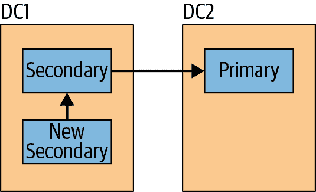
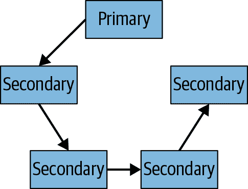

# 第十三章：管理

本章涵盖副本集管理，包括：

+   对各个成员执行维护

+   在各种情况下配置集合

+   获取关于和调整你的操作日志（oplog）大小的信息

+   进行一些更复杂的集合配置

+   转换从主/从（master/slave）到副本集

# 在独立模式下启动成员

许多维护任务无法在辅助节点上执行（因为它们涉及写操作），也不应该在主节点上执行，因为这可能会影响应用程序性能。因此，以下各节经常提到启动服务器为独立模式。这意味着重新启动成员，使其成为独立服务器，而不是副本集成员（暂时）。

要在独立模式下启动成员，请首先查看用于启动它的命令行选项。假设它们看起来像这样：

```
> db.serverCmdLineOpts()
{
    "argv" : [ "mongod", "-f", "/var/lib/mongod.conf" ],
    "parsed" : {
        "replSet": "mySet",
        "port": "27017",
        "dbpath": "/var/lib/db"
    },
    "ok" : 1
}
```

要在该服务器上执行维护操作，我们可以在不使用`replSet`选项的情况下重新启动它。这将允许我们像普通独立的*mongod*一样读写它。我们不希望集合中的其他服务器能够联系到它，因此我们将使其监听不同的端口（以便其他成员无法找到它）。最后，我们希望保持`dbpath`不变，因为我们假定以这种方式启动它来某种方式地操作服务器的数据。

首先，我们从*mongo* shell 中关闭服务器：

```
> db.shutdownServer()
```

然后，在操作系统 shell（例如，bash）中，我们在另一个端口上重新启动*mongod*并且不使用`replSet`参数：

```
$ mongod --port 30000 --dbpath /var/lib/db
```

现在它将作为独立服务器运行，监听端口 30000 以进行连接。该集合的其他成员将尝试在端口 27017 上连接它并认为它已经停止。

当我们完成对服务器的维护时，我们可以关闭它并使用其原始选项重新启动它。它将自动与集合的其余部分同步，复制其在“离线”期间错过的任何操作。

# 副本集配置

副本集配置始终保留在*local.system.replset*集合的文档中。此文档在集合的所有成员上都相同。永远不要使用`update`来更新此文档。始终使用`rs`助手或`replSetReconfig`命令。

## 创建副本集

通过启动你想要作为成员的*mongods*并通过`rs.initiate()`传递配置来创建副本集：

```
> var config = {
... "_id" : <setName>,
... "members" : [
...     {"_id" : 0, "host" : <host1>},
...     {"_id" : 1, "host" : <host2>},
...     {"_id" : 2, "host" : <host3>}
... ]}
> rs.initiate(config)
```

###### 警告

你应该总是向`rs.initiate()`传递一个配置对象。如果不这样做，MongoDB 将尝试自动生成一个单成员副本集的配置；它可能不使用你想要的主机名或者正确配置该集合。

你只在集合的一个成员上调用`rs.initiate()`。接收配置的成员将将其传递给其他成员。

## 更改集合成员

当你添加一个新的集合成员时，它应该在其数据目录中要么为空—这种情况下它将执行初始同步—要么拥有来自另一个成员的数据的副本（有关备份和恢复复制集成员的更多信息，请参阅第二十三章）。

连接到主服务器，并按以下方式添加新成员：

```
> rs.add("spock:27017")
```

或者，你可以将更复杂的成员配置指定为一个文档：

```
> rs.add({"host" : "spock:27017", "priority" : 0, "hidden" : true})
```

你也可以通过它们的 `"host"` 字段移除成员：

```
> rs.remove("spock:27017")
```

你可以通过重新配置来更改成员的设置。在更改成员设置时有一些限制：

+   你不能改变成员的 `"_id"`。

+   你不能使你发送重新配置的成员（通常是主服务器）的优先级为 0。

+   你不能将裁判转换为非裁判，反之亦然。

+   你不能将成员的 `"buildIndexes"` 字段从 `false` 改为 `true`。

值得注意的是，你*可以*改变成员的 `"host"` 字段。因此，如果你错误地指定了主机（比如说，如果你使用了公共 IP 而不是私有 IP），你可以稍后返回并简单地更改配置以使用正确的 IP。

要更改主机名，你可以像这样做：

```
> var config = rs.config()
> config.members[0].host = "spock:27017"
spock:27017
> rs.reconfig(config)
```

这个策略同样适用于改变任何其他选项：获取配置信息 `rs.config()`，修改任何你希望修改的部分，然后通过传递新配置给 `rs.reconfig()` 来重新配置集合。

## 创建更大的集合

复制集总共限制为 50 个成员，只能有 7 个投票成员。这是为了减少每个人需要相互心跳的网络流量，并限制选举所需的时间。

如果你正在创建一个超过七个成员的复制集，那么每个额外的成员必须被赋予零票。你可以通过在成员配置中指定来做到这一点：

```
> rs.add({"_id" : 7, "host" : "server-7:27017", "votes" : 0})
```

这将阻止这些成员在选举中投出正面票。

## 强制重新配置

当你永久丢失了一个集合的大部分时，你可能希望在没有主服务器的情况下重新配置该集合。这有点棘手，因为通常你会把重新配置发送到主服务器。但在这种情况下，你可以通过向次级服务器发送带有 `"force"` 选项的重新配置命令来强制重新配置集合。在 shell 中连接到次级服务器，并传递一个带有 `"force"` 选项的重新配置：

```
> rs.reconfig(config, {"force" : true})
```

强制重新配置遵循与正常重新配置相同的规则：你必须发送一个有效且格式良好的配置，带有正确的选项。`"force"` 选项不允许无效的配置；它只允许次级服务器接受重新配置。

强制重新配置会显著增加复制集的 `"version"` 数字。你可能会看到它跳动几万甚至几十万。这是正常的：它是为了防止版本号冲突（以防网络分区的情况下有重新配置）。

当次要成员接收到重新配置时，它将更新其配置并将新配置传递给其他成员。如果其他集合成员将发送服务器识别为其当前配置的成员，它们才能检测到配置更改。因此，如果您的一些成员已更改主机名，您应该从保留其旧主机名的成员强制重新配置。如果每个成员都有新的主机名，您应该关闭集合中的每个成员，在独立模式下启动一个新的成员，手动更改其*local.system.replset*文档，然后重新启动成员。

# 操控成员状态

有几种方式可以手动更改成员的状态以进行维护或响应负载。请注意，除了通过适当配置集合来配置副本集成员的优先级高于任何其他成员之外，没有其他方法可以强制成员成为主服务器。

## 将主服务器转为次要服务器

您可以使用`stepDown`函数将主服务器降级为次要服务器：

```
> rs.stepDown()
```

这使得主服务器降为次要状态，持续 60 秒。如果在该时间段内没有选举出其他主服务器，它将能够尝试重新选举。如果您希望它在次要状态下停留更长或更短的时间，您可以为其指定自己的秒数：

```
> rs.stepDown(600) // 10 minutes
```

## 防止选举

如果您需要对主服务器进行一些维护，但不希望其他符合条件的成员在此期间成为主服务器，您可以通过在每个成员上运行`freeze`来强制它们保持次要状态：

```
> rs.freeze(10000)
```

同样，这需要一些时间使成员保持次要状态。

如果您在此时间段到期之前完成了对主服务器的任何维护，并希望解冻其他成员，只需在每个成员上再次运行该命令，指定超时为 0 秒即可。

```
> rs.freeze(0)
```

一个未冻结的成员将能够进行选举，如果它选择这样做。

您还可以通过运行`rs.freeze(0)`来解冻已被降级为次要服务器的主服务器。

# 监控复制

能够监视集合的状态非常重要：不仅要确保所有成员处于活动状态，还要知道它们的状态及复制的最新情况。有几个命令可用于查看副本集信息。MongoDB 托管服务和管理工具包括 Atlas、Cloud Manager 和 Ops Manager（参见第二十二章）还提供了监视复制和关键复制指标的仪表板机制。

复制问题通常是暂时的：一个服务器可能无法连接另一个服务器，但现在可以了。查看日志是发现这类问题的最简单方法。确保您知道日志存储在哪里（以及确实被存储），并且可以访问它们。

## 获取状态

您可以运行的最有用的命令之一是 `replSetGetStatus`，它获取集合的每个成员的当前信息（从您运行它的成员的视角）。在 shell 中有一个此命令的辅助程序：

```
> rs.status()

   "set" : "replset",
   "date" : ISODate("2019-11-02T20:02:16.543Z"),
   "myState" : 1,
   "term" : NumberLong(1),
   "heartbeatIntervalMillis" : NumberLong(2000),
   "optimes" : {
         "lastCommittedOpTime" : {
            "ts" : Timestamp(1478116934, 1),
            "t" : NumberLong(1)
         },
         "readConcernMajorityOpTime" : {
            "ts" : Timestamp(1478116934, 1),
            "t" : NumberLong(1)
         },
         "appliedOpTime" : {
            "ts" : Timestamp(1478116934, 1),
            "t" : NumberLong(1)
         },
         "durableOpTime" : {
            "ts" : Timestamp(1478116934, 1),
            "t" : NumberLong(1)
         }
      },

   "members" : [
      {
            "_id" : 0,
            "name" : "m1.example.net:27017",
            "health" : 1,
            "state" : 1,
            "stateStr" : "PRIMARY",
            "uptime" : 269,
            "optime" : {
                        "ts" : Timestamp(1478116934, 1),
                        "t" : NumberLong(1)
            },
            "optimeDate" : ISODate("2019-11-02T20:02:14Z"),
            "infoMessage" : "could not find member to sync from",
            "electionTime" : Timestamp(1478116933, 1),
            "electionDate" : ISODate("2019-11-02T20:02:13Z"),
            "configVersion" : 1,
            "self" : true
      },
      {
            "_id" : 1,
            "name" : "m2.example.net:27017",
            "health" : 1,
            "state" : 2,
            "stateStr" : "SECONDARY",
            "uptime" : 14,
            "optime" : {
               "ts" : Timestamp(1478116934, 1),
               "t" : NumberLong(1)
            },
            "optimeDurable" : {
               "ts" : Timestamp(1478116934, 1),
               "t" : NumberLong(1)
            },
            "optimeDate" : ISODate("2019-11-02T20:02:14Z"),
            "optimeDurableDate" : ISODate("2019-11-02T20:02:14Z"),
            "lastHeartbeat" : ISODate("2019-11-02T20:02:15.618Z"),
            "lastHeartbeatRecv" : ISODate("2019-11-02T20:02:14.866Z"),
            "pingMs" : NumberLong(0),
            "syncingTo" : "m3.example.net:27017",
            "configVersion" : 1
      },
      {
            "_id" : 2,
            "name" : "m3.example.net:27017",
            "health" : 1,
            "state" : 2,
            "stateStr" : "SECONDARY",
            "uptime" : 14,
            "optime" : {
               "ts" : Timestamp(1478116934, 1),
               "t" : NumberLong(1)
            },
            "optimeDurable" : {
               "ts" : Timestamp(1478116934, 1),
               "t" : NumberLong(1)
            },
            "optimeDate" : ISODate("2019-11-02T20:02:14Z"),
            "optimeDurableDate" : ISODate("2019-11-02T20:02:14Z"),
            "lastHeartbeat" : ISODate("2019-11-02T20:02:15.619Z"),
            "lastHeartbeatRecv" : ISODate("2019-11-02T20:02:14.787Z"),
            "pingMs" : NumberLong(0),
            "syncingTo" : "m1.example.net:27018",
            "configVersion" : 1
      }
   ],
   "ok" : 1
}
```

这些是一些最有用的字段之一：

`"self"`

此字段仅出现在运行 `rs.status()` 的成员中——在本例中，即 *server-2* (*m1.example.net:27017*)。

`"stateStr"`

描述服务器状态的字符串。有关各种状态的描述，请参阅“成员状态”。

`"uptime"`

成员可达的秒数，或者对于 `"self"` 成员来说，自服务器启动以来的时间。因此，*server-1* 已经运行了 269 秒，*server-2* 和 *server-3* 运行了 14 秒。

`"optimeDate"`

每个成员操作日志中每个成员的最后 `optime`（该成员同步到的地方）。请注意，这是由心跳报告的每个成员的状态，因此这里报告的 `optime` 可能会比实际少几秒钟。

`"lastHeartbeat"`

此服务器上次从 `"self"` 成员接收到心跳的时间。如果存在网络问题或服务器忙碌，这可能比两秒钟之前更长。

`"pingMs"`

向此服务器发出心跳所花费的平均时间。这用于确定从哪个成员进行同步。

`"errmsg"`

成员选择在心跳请求中返回的任何状态消息。这些通常只是信息性的，不是错误消息。例如，*server-3* 中的 `"errmsg"` 字段指示此服务器正在进行初始同步的过程中。十六进制数字 507e9a30:851 是此成员需要达到以完成初始同步的操作的时间戳。

有几个字段提供了重叠的信息。`"state"` 与 `"stateStr"` 相同；它只是状态的内部 ID。`"health"` 只是反映了给定服务器是否可达（`1`）或不可达（`0`），这也可以通过 `"state"` 和 `"stateStr"` 来显示（如果服务器不可达，则它们将显示为 `UNKNOWN` 或 `DOWN`）。类似地，`"optime"` 和 `"optimeDate"` 是以两种方式表示的相同值：一个表示自纪元以来的毫秒数（`"t" : 135...`），另一个是更易读的日期。

###### 警告

注意，此报告是从您运行它的集合成员的视角来看的：它包含的信息可能由于网络问题而不正确或过时。

## 可视化复制图

如果在辅助节点上运行 `rs.status()`，将会有一个顶级字段称为 `"syncingTo"`。这显示了此成员正在复制的主机。通过在集合的每个成员上运行 `replSetGetStatus` 命令，您可以了解复制图。例如，假设 `server1` 是连接到 *server1*，`server2` 是连接到 *server2*，依此类推，可能会有如下内容：

```
> server1.adminCommand({replSetGetStatus: 1})['syncingTo']
server0:27017
> server2.adminCommand({replSetGetStatus: 1})['syncingTo']
server1:27017
> server3.adminCommand({replSetGetStatus: 1})['syncingTo']
server1:27017
> server4.adminCommand({replSetGetStatus: 1})['syncingTo']
server2:27017
```

因此，*server0*是*server1*的复制源，*server1*是*server2*和*server3*的复制源，*server2*是*server4*的复制源。

MongoDB 根据 ping 时间确定同步到哪个成员。当一个成员心跳另一个成员时，它计算该请求花费的时间。MongoDB 会维护这些时间的运行平均值。当一个成员必须选择另一个成员进行同步时，它会选择距离自己最近且在复制中领先的成员（因此，不能出现复制循环：成员只会从主服务器或进展较快的辅助服务器进行复制）。

这意味着，如果您在次要数据中心中启动了新的成员，它更有可能从该数据中心的另一个成员进行同步，而不是从主数据中心的成员进行同步（从而最小化广域网流量），如图 13-1 所示。

然而，自动复制链的一个缺点是：复制的跳数越多，将写操作复制到所有服务器的时间就会稍长一些。例如，假设所有内容都在一个数据中心，但由于网络速度的不确定性，当您添加成员时，MongoDB 最终以线性方式进行复制，如图 13-2 所示。



###### 图 13-1\. 新的辅助服务器通常会选择从同一数据中心的成员进行同步



###### 图 13-2\. 随着复制链变得越来越长，所有成员获取数据的时间也会变得更长

这种情况极为罕见，但并非不可能。然而，这可能是不可取的：链中的每个辅助服务器都比其前面的辅助服务器落后一些。您可以通过使用`replSetSyncFrom`命令（或`rs.syncFrom()`辅助工具）来修改成员的复制源来解决这个问题。

连接到要更改其复制源的辅助服务器，并运行以下命令，传递您希望此成员同步的服务器：

```
> secondary.adminCommand({"replSetSyncFrom" : "server0:27017"})
```

切换同步源可能需要几秒钟，但如果您再次在该成员上运行`rs.status()`，您应该会看到`"syncingTo"`字段现在显示为`"server0:27017"`。

此成员（*server4*）现在将从*server0*继续复制，直到*server0*不可用或者（如果它恰好是辅助服务器）落后于其他成员。

## 复制环路

*复制环路*是指成员最终彼此进行复制，例如，*A*从*B*同步，*B*从*C*同步，*C*又从*A*同步。由于复制环路中的成员都不能成为主服务器，因此这些成员将无法接收到任何新的操作来进行复制，并且会落后。

复制环路应该是不可能的，当成员选择自动同步时，但是，你可以使用 `replSetSyncFrom` 命令强制创建复制环路。在手动更改同步目标之前，仔细检查 `rs.status()` 输出，并注意不要创建环路。如果您不选择严格领先的成员进行同步，`replSetSyncFrom` 命令将会提醒您，但仍将允许该操作。

## 禁用链式同步

*链式同步* 是指次要服务器从另一个次要服务器同步（而不是从主服务器）。如前所述，成员可能决定自动从其他成员同步。您可以通过将 `"chainingAllowed"` 设置为 `false`（如果未指定，默认为 `true`）来禁用链式同步，强制所有成员从主服务器同步：

```
> var config = rs.config()
> // create the settings subobject, if it does not already exist
> config.settings = config.settings || {}
> config.settings.chainingAllowed = false
> rs.reconfig(config)
```

当 `"chainingAllowed"` 设置为 `false` 时，所有成员将从主服务器同步。如果主服务器不可用，它们将退回到从次要服务器同步。

## 计算滞后

对于复制而言，最重要的度量之一是跟踪次要服务器与主服务器的同步情况。*滞后* 是指次要服务器落后于主服务器执行的最后一个操作的时间戳与次要服务器应用的最后一个操作的时间戳之间的差异。

您可以使用 `rs.status()` 查看成员的复制状态，但也可以通过运行 `rs.printReplicationInfo()` 或 `rs.printSlaveReplicationInfo()` 获取快速摘要。

`rs.printReplicationInfo()` 提供了主要操作日志的摘要，包括其大小和操作的日期范围：

```
> rs.printReplicationInfo();
    configured oplog size:   10.48576MB
    log length start to end: 3590 secs (1.00hrs)
    oplog first event time:  Tue Apr 10 2018 09:27:57 GMT-0400 (EDT)
    oplog last event time:   Tue Apr 10 2018 10:27:47 GMT-0400 (EDT)
    now:                     Tue Apr 10 2018 10:27:47 GMT-0400 (EDT)
```

在此示例中，操作日志约为 10 MB（10 MiB），仅能够容纳约一小时的操作。

如果这是一个真实的部署，操作日志（oplog）可能应该更大（请参阅下一节有关更改 oplog 大小的说明）。我们希望日志长度*至少*与执行完整重新同步所需的时间一样长。这样，我们就不会遇到在次要服务器完成初始同步之前，次要服务器已经落后于操作日志结尾的情况。

###### 注意

日志长度是通过在操作日志填满后计算第一个和最后一个操作之间的时间差来计算的。如果服务器刚刚启动且操作日志中没有任何内容，则最早的操作可能相对较新。在这种情况下，尽管操作日志可能仍然有空闲空间可用，但日志长度较小。对于已经运行足够长时间以至少完整写入其整个操作日志的服务器来说，长度是一个更有用的度量。

您还可以使用 `rs.printSlaveReplicationInfo()` 函数获取每个成员的 `syncedTo` 值以及最后一个操作日志条目写入每个次要服务器的时间，如下例所示：

```
> rs.printSlaveReplicationInfo();
source: m1.example.net:27017
    syncedTo: Tue Apr 10 2018 10:27:47 GMT-0400 (EDT)
    0 secs (0 hrs) behind the primary
source: m2.example.net:27017
    syncedTo: Tue Apr 10 2018 10:27:43 GMT-0400 (EDT)
    0 secs (0 hrs) behind the primary
source: m3.example.net:27017
    syncedTo: Tue Apr 10 2018 10:27:39 GMT-0400 (EDT)
    0 secs (0 hrs) behind the primary
```

请记住，副本集成员的滞后是相对于主节点计算的，而不是相对于“墙上的时间”。这通常是无关紧要的，但在非常低写入系统上，这可能会导致幻影复制滞后“峰值”。例如，假设你每小时写入一次。在该写入之后，但在其被复制之前，次要节点看起来落后主节点一小时。然而，它将能够在几毫秒内赶上那“小时”的操作。在监视低吞吐量系统时，这有时可能会导致混淆。

## 调整操作日志大小

你的主要操作日志应该被视为维护窗口。如果你的主要操作日志长度为一小时，那么在你的次要节点落后太多并必须从头同步之前，你只有一小时来修复任何出现的问题。因此，通常希望操作日志能够保存几天到一周的数据，以便在出现问题时有所缓冲。

不幸的是，没有简单的方法可以预测操作日志在填满之前会有多长。WiredTiger 存储引擎允许在服务器运行时在线调整操作日志的大小。你应该先在每个次要副本集成员上执行这些步骤；一旦这些步骤完成，然后才应该对主节点进行更改。请记住，每个可能成为主节点的服务器都应该有足够大的操作日志，以便为你提供合理的维护窗口。

增加操作日志（oplog）的大小，请执行以下步骤：

1.  连接到副本集成员。如果启用了认证，请确保使用具有修改`local`数据库权限的用户。

1.  验证当前操作日志的大小：

    ```
    > use local
    > db.oplog.rs.stats(1024*1024).maxSize
    ```

    ###### 注意

    这将显示以兆字节为单位的集合大小。

1.  更改副本集成员的操作日志大小：

    ```
    > db.adminCommand({replSetResizeOplog: 1, size: 16000})
    ```

    ###### 注意

    下面的操作将副本集成员的操作日志大小更改为 16 GB，即 16000 MB。

1.  最后，如果你减少了操作日志的大小，可能需要运行`compact`以回收分配的磁盘空间。请参阅[MongoDB 文档中的“更改操作日志大小”教程](https://oreil.ly/krv0R)以获取更多关于此案例和整个过程的详细信息。

通常不应减少操作日志的大小：尽管它可能长达数月，但通常有足够的磁盘空间，并且不会使用 RAM 或 CPU 等宝贵资源。

## 建立索引

如果向主服务器发送索引构建请求，则主服务器将正常构建索引，然后在复制“构建索引”操作时次要节点将构建索引。尽管这是构建索引的最简单方法，但索引构建是资源密集型操作，可能会使成员不可用。如果所有次要节点同时开始构建索引，那么集合的几乎每个成员都将离线，直到索引构建完成。此过程仅适用于副本集；对于分片集群，请参阅[MongoDB 文档中关于在分片集群上构建索引的教程](https://oreil.ly/wJNeE)。

###### 警告

创建`"unique"`索引时，必须停止向集合写入。如果不停止写入，则可能导致副本集成员之间的数据不一致。

因此，您可能希望逐个成员构建索引，以最小化对应用程序的影响。为此，请执行以下操作：

1.  关闭一个次要节点。

1.  重新启动为独立服务器。

1.  在独立服务器上构建索引。

1.  当索引构建完成时，将服务器重新启动为副本集的成员。重新启动此成员时，如果您的命令行选项或配置文件中存在`disableLogicalSessionCacheRefresh`参数，则需要将其删除。

1.  对副本集中的每个次要节点重复步骤 1 至 4。

现在，您应该有一个每个成员（主服务器除外）都构建了索引的集合。现在有两个选项，您应该选择对生产系统影响最小的选项之一：

1.  在主服务器上构建索引。如果您有交通量较少的“关闭”时间，那可能是构建索引的好时机。您还可能希望暂时修改读取偏好设置，将更多负载转移至次要节点，同时进行构建。

    主服务器将索引构建复制到次要节点，但它们已经拥有该索引，因此对它们来说是无操作。

1.  首先降低主服务器，然后按照先前概述的步骤 2 至 4 进行操作。这需要进行故障切换，但旧主服务器正在构建其索引时，您将拥有一个正常运行的主服务器。索引构建完成后，您可以将其重新引入集合。

请注意，您还可以使用此技术在次要节点上构建与其余集合不同的索引。这对离线处理可能很有用，但请确保具有不同索引的成员永远不能成为主服务器：其优先级应始终为`0`。

如果正在构建唯一索引，请确保主服务器未插入重复项，或者首先在主服务器上构建索引。否则，主服务器可能会插入重复项，然后在次要节点上会导致复制错误。如果发生这种情况，则次要节点将自行关闭。您将需要将其重新启动为独立服务器，删除唯一索引，然后重新启动。

## 紧缩预算的复制

如果很难获得超过一个高质量的服务器，请考虑获取一个仅用于灾难恢复的次级服务器，具有较少的 RAM 和 CPU，较慢的磁盘 I/O 等。优质服务器始终将是您的主服务器，并且更便宜的服务器永远不会处理任何客户端流量（请配置您的客户端将所有读取发送到主服务器）。以下是为更便宜的机器设置的选项：

`"priority" : 0`

您不希望此服务器成为主服务器。

`"hidden" : true`

您不希望客户端向此次级发送读取请求。

`"buildIndexes" : false`

这是可选项，但可以显著减少此服务器需要处理的负载。如果您需要从此服务器进行恢复，则需要重建索引。

`"votes" : 0`

如果您只有两台机器，请将此次级设置为`0`，以便主机在此机器宕机时保持主机状态。如果有第三台服务器（即使只是您的应用服务器），请在该服务器上运行仲裁者，而不是将`"votes"`设置为`0`。

这将为您提供具有次级备份的安全性和保障，而无需投资于两台高性能服务器。
