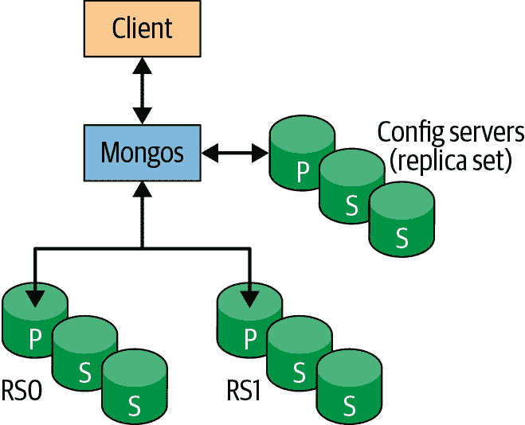
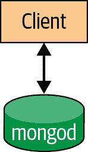
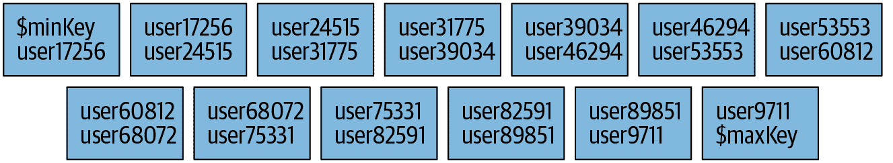
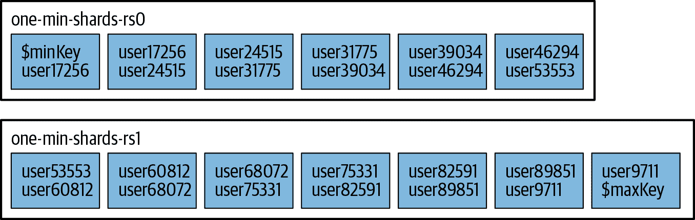

# 第十四章：介绍分片

本章涵盖了如何使用 MongoDB 进行扩展。我们将看看：

+   什么是分片，以及集群的组件

+   如何配置分片

+   分片与应用程序交互的基础知识

# 什么是分片？

*分片*（Sharding）指的是将数据分散存储在多台机器上的过程；有时也会用术语*分区*（partitioning）来描述这个概念。将数据的子集放在每台机器上，可以在不需要更大或更强大的机器的情况下存储更多数据并处理更多负载，只需更多数量的性能较弱的机器。分片也可用于其他目的，包括将访问频率较高的数据放在性能更好的硬件上，或者基于地理位置将数据集分割，将集合中的一部分文档（例如针对特定地区用户的文档）放在最常访问它们的应用服务器附近。

几乎所有数据库软件都可以进行手动分片。使用这种方法，应用程序维护与多个不同的数据库服务器的连接，每个服务器都是完全独立的。应用程序管理将不同的数据存储在不同的服务器上，并针对合适的服务器进行查询以获取数据。这种设置可以很好地工作，但在向集群添加或移除节点、数据分布或负载模式发生变化时，维护变得困难。

MongoDB 支持自动分片，试图在某种程度上将架构与应用程序抽象化，并简化此类系统的管理。MongoDB 允许您的应用程序在一定程度上忽略它并非在与独立的 MongoDB 服务器交互。在运维方面，MongoDB 自动平衡数据跨分片，并简化增加和移除容量的操作。

从开发和操作的角度看，分片是配置 MongoDB 最复杂的方式。需要配置和监控许多组件，并且数据在集群中自动移动。在尝试部署或使用分片集群之前，您应该对独立服务器和副本集感到满意。此外，与副本集一样，建议配置和部署分片集群的方法是通过 MongoDB Ops Manager 或 MongoDB Atlas。如果您需要维护对计算基础设施的控制，推荐使用 Ops Manager。如果您可以将基础设施管理交给 MongoDB，则推荐使用 MongoDB Atlas（您可以选择在 Amazon AWS、Microsoft Azure 或 Google Compute Cloud 上运行）。

## 理解集群的组件

MongoDB 的分片功能允许您创建一个由多台机器（分片）组成的集群，并在它们之间分割集合，将数据的子集放在每个分片上。这使得您的应用程序能够超越独立服务器或副本集的资源限制。

###### 注意

许多人对复制和分片之间的区别感到困惑。请记住，复制在多个服务器上创建数据的精确副本，因此每个服务器都是其他服务器的镜像。相反，每个分片包含不同的数据子集。

分片的一个目标是使 2、3、10 甚至数百个分片看起来对应你的应用程序像是单一的机器。为了将这些细节隐藏在应用程序之外，我们在分片前面运行一个或多个路由进程，称为*mongos*。*mongos*维护一个“目录”，告诉它哪个分片包含哪些数据。应用程序可以连接到这个路由器并正常发出请求，就像在图 14-1 中展示的那样。路由器知道哪些数据在哪个分片上，能够将请求转发到适当的分片。如果请求有响应，路由器收集它们并在必要时合并它们，然后将它们发送回应用程序。对于应用程序而言，它连接的就像是一个独立的*mongod*，如图 14-2 所示。



###### 图 14-1\. 分片客户端连接



###### 图 14-2\. 非分片客户端连接

# 单机集群上的分片

我们将在单台机器上快速设置一个集群。首先，使用`--nodb`和`--norc`选项启动一个*mongo* shell：

```
$ mongo --nodb --norc
```

要创建一个集群，请使用`ShardingTest`类。在刚刚启动的*mongo* shell 中运行以下命令：

```
st = ShardingTest({
  name:"one-min-shards",
  chunkSize:1,
  shards:2,
  rs:{
    nodes:3,
    oplogSize:10
  },
  other:{
    enableBalancer:true
  }
});
```

`chunksize`选项在第十七章中有详细说明。现在，简单地将其设置为`1`。至于这里传递给`ShardingTest`的其他选项，`name`仅提供我们分片集群的标签，`shards`指定我们的集群由两个分片组成（我们这样做是为了降低此示例的资源需求），而`rs`定义每个分片为三节点副本集，并设置了 10 MiB 的`oplogSize`（同样是为了保持资源利用率低）。尽管可以为每个分片运行一个独立的*mongod*，但如果我们将每个分片创建为副本集，这将更清晰地展示分片集群的典型架构。在指定的最后一个选项中，我们指示`ShardingTest`在集群启动后启用平衡器。这将确保数据均匀分布在两个分片之间。

`ShardingTest`是 MongoDB 工程内部使用的类，因此在外部未记录文档。但是，因为它与 MongoDB 服务器一起提供，它提供了最直接的方法来实验分片集群。`ShardingTest`最初是为支持服务器测试套件而设计的，并且仍然用于此目的。默认情况下，它提供了许多便利功能，帮助尽可能减少资源利用，并设置分片集群的相对复杂的架构。它假设您的机器上存在`/data /db`目录；如果`ShardingTest`运行失败，请创建此目录，然后重新运行命令。

运行此命令时，`ShardingTest`将会自动为您完成许多工作。它将创建一个包含两个副本集的新集群。它将配置副本集，并使用必要的选项启动每个节点以建立复制协议。它将启动一个*mongos*来管理跨分片的请求，以便客户端可以与集群交互，就像与独立的*mongod*通信一样，在某种程度上。最后，它将启动一个额外的副本集，用于配置服务器，这些服务器维护了确保查询定向到正确分片的路由表信息。请记住，分片的主要用例是为了将数据集分割以解决硬件和成本约束，或者为应用程序提供更好的性能（例如，地理分区）。MongoDB 的分片功能在许多方面以对应用程序无缝的方式提供这些能力。

一旦`ShardingTest`完成了集群的设置，您将有 10 个正在运行的进程可以连接：两个包含三个节点的副本集，一个包含三个节点的配置服务器副本集，以及一个*mongos*。默认情况下，这些进程应从端口 20000 开始。*mongos*应该在端口 20009 运行。您本地机器上运行的其他进程和之前对`ShardingTest`的调用可能会影响`ShardingTest`使用的端口，但您应该不会在确定集群进程运行的端口时遇到太多困难。

接下来，您将连接到*mongos*以在集群中进行操作。整个集群将将其日志转储到当前 shell，因此请打开第二个终端窗口并启动另一个*mongo* shell：

```
$ mongo --nodb
```

使用此 shell 连接到您集群的*mongos*。再次提醒，您的*mongos*应该在端口 20009 上运行：

```
> db = (new Mongo("localhost:20009")).getDB("accounts")
```

请注意，您的 *mongo* shell 提示符应更改以反映您已连接到 *mongos*。现在，您处于之前显示的情况，参见图 14-1：shell 是客户端，并连接到 *mongos*。您可以开始将请求传递给 *mongos*，它将适当地路由到分片。您实际上不需要了解分片的任何信息，例如它们有多少或其地址是什么。只要有一些分片存在，您就可以将请求传递给 *mongos*，并允许它适当地转发它们。

首先插入一些数据：

```
> for (var i=0; i<100000; i++) {
...     db.users.insert({"username" : "user"+i, "created_at" : new Date()});
... }
> db.users.count()
100000
```

正如您可以看到的，与 *mongos* 交互的方式与与独立服务器交互的方式相同。

您可以通过运行`sh.status()`来获取集群的整体视图。它会为您提供关于分片、数据库和集合的摘要：

```
> sh.status()
--- Sharding Status --- 
sharding version: {
  "_id": 1,
  "minCompatibleVersion": 5,
  "currentVersion": 6,
  "clusterId": ObjectId("5a4f93d6bcde690005986071")
}
shards:
{
  "_id" : "one-min-shards-rs0", 
  "host" : 
    "one-min-shards-rs0/MBP:20000,MBP:20001,MBP:20002",
  "state" : 1 }
{  "_id" : "one-min-shards-rs1",  
   "host" : 
     "one-min-shards-rs1/MBP:20003,MBP:20004,MBP:20005",
   "state" : 1 }
active mongoses:
  "3.6.1" : 1
autosplit:
  Currently enabled: no
balancer:
  Currently enabled:  no
  Currently running:  no
  Failed balancer rounds in last 5 attempts:  0
  Migration Results for the last 24 hours: 
    No recent migrations
databases:
  {  "_id" : "accounts",  "primary" : "one-min-shards-rs1",  
     "partitioned" : false }
  {  "_id" : "config",  "primary" : "config",  
     "partitioned" : true }
  config.system.sessions
shard key: { "_id" : 1 }
unique: false
balancing: true
chunks:
  one-min-shards-rs0	1
  { "_id" : { "$minKey" : 1 } } -->> { "_id" : { "$maxKey" : 1 } } 
  on : one-min-shards-rs0 Timestamp(1, 0)
```

###### 注意

`sh`类似于`rs`，但用于分片：它是一个全局变量，定义了许多分片助手函数，您可以通过运行`sh.help()`查看这些函数。正如从`sh.status()`输出中可以看出的那样，您有两个分片和两个数据库（*config*将自动创建）。

您的 *accounts* 数据库可能具有与此处显示的不同的主分片。主分片是随机为每个数据库选择的“主基地”分片。所有数据都将位于此主分片上。MongoDB 目前无法自动分配数据，因为它不知道（或不知道）您希望如何分配数据。您必须告诉它，对于每个集合，您希望如何分配数据。

###### 注意

主分片与副本集的主服务器不同。主分片指的是组成一个分片的整个副本集。副本集中的主服务器是可以进行写操作的单个服务器。

要分片特定集合，首先在集合的数据库上启用分片。要执行此操作，请运行`enableSharding`命令：

```
> sh.enableSharding("accounts")
```

现在 *accounts* 数据库已启用分片，这使您可以在数据库内分片集合。

当您分片一个集合时，您需要选择一个分片键。这是 MongoDB 用来拆分数据的一个字段或两个字段。例如，如果您选择在`"username"`上分片，MongoDB 将根据用户名范围将数据分为几段：从`"a1-steak-sauce"`到`"defcon"`，从`"defcon1"`到`"howie1998"`等。选择分片键可以视为选择集合数据的排序方式。这与索引类似，并且有其道理：分片键成为集合中最重要的索引，特别是在集合变大时。要创建分片键，字段（们）必须被索引。

因此，在启用分片之前，您必须为要分片的关键字创建索引：

```
> db.users.createIndex({"username" : 1})
```

现在，您可以通过`"username"`来分片集合：

```
> sh.shardCollection("accounts.users", {"username" : 1})
```

尽管我们在这里选择分片键并没有仔细考虑，但在实际系统中，这是一个需要仔细考虑的重要决定。请参阅第十六章获取有关选择分片键的更多建议。

如果等待几分钟然后再次运行`sh.status()`，你会发现显示的信息比之前多得多：

```
> sh.status()
--- Sharding Status --- 
sharding version: {
  "_id" : 1,
  "minCompatibleVersion" : 5,
  "currentVersion" : 6,
  "clusterId" : ObjectId("5a4f93d6bcde690005986071")
}
shards:
  {  "_id" : "one-min-shards-rs0", 
     "host" : 
       "one-min-shards-rs0/MBP:20000,MBP:20001,MBP:20002",  
     "state" : 1 }
  {  "_id" : "one-min-shards-rs1",  
     "host" : 
       "one-min-shards-rs1/MBP:20003,MBP:20004,MBP:20005",
     "state" : 1 }
active mongoses:
  "3.6.1" : 1
autosplit:
  Currently enabled: no
balancer:
  Currently enabled:  yes
  Currently running:  no
  Failed balancer rounds in last 5 attempts:  0
  Migration Results for the last 24 hours: 
    6 : Success
databases:
  {  "_id" : "accounts",  "primary" : "one-min-shards-rs1",  
     "partitioned" : true }
accounts.users
  shard key: { "username" : 1 }
  unique: false
  balancing: true
  chunks:
    one-min-shards-rs0	6
    one-min-shards-rs1	7
    { "username" : { "$minKey" : 1 } } -->> 
      { "username" : "user17256" } on : one-min-shards-rs0 Timestamp(2, 0) 
    { "username" : "user17256" } -->> 
      { "username" : "user24515" } on : one-min-shards-rs0 Timestamp(3, 0) 
    { "username" : "user24515" } -->> 
      { "username" : "user31775" } on : one-min-shards-rs0 Timestamp(4, 0) 
    { "username" : "user31775" } -->> 
      { "username" : "user39034" } on : one-min-shards-rs0 Timestamp(5, 0) 
    { "username" : "user39034" } -->> 
      { "username" : "user46294" } on : one-min-shards-rs0 Timestamp(6, 0) 
    { "username" : "user46294" } -->> 
      { "username" : "user53553" } on : one-min-shards-rs0 Timestamp(7, 0) 
    { "username" : "user53553" } -->> 
      { "username" : "user60812" } on : one-min-shards-rs1 Timestamp(7, 1) 
    { "username" : "user60812" } -->> 
      { "username" : "user68072" } on : one-min-shards-rs1 Timestamp(1, 7) 
    { "username" : "user68072" } -->> 
      { "username" : "user75331" } on : one-min-shards-rs1 Timestamp(1, 8) 
    { "username" : "user75331" } -->> 
      { "username" : "user82591" } on : one-min-shards-rs1 Timestamp(1, 9) 
    { "username" : "user82591" } -->> 
      { "username" : "user89851" } on : one-min-shards-rs1 Timestamp(1, 10) 
    { "username" : "user89851" } -->> 
      { "username" : "user9711" } on : one-min-shards-rs1 Timestamp(1, 11) 
    { "username" : "user9711" } -->> 
      { "username" : { "$maxKey" : 1 } } on : one-min-shards-rs1 Timestamp(1, 12) 
    {  "_id" : "config",  "primary" : "config",  "partitioned" : true }
config.system.sessions
  shard key: { "_id" : 1 }
  unique: false
  balancing: true
  chunks:
    one-min-shards-rs0	1
    { "_id" : { "$minKey" : 1 } } -->> 
      { "_id" : { "$maxKey" : 1 } } on : one-min-shards-rs0 Timestamp(1, 0)
```

这个集合已经分割成了 13 个块，每个块都是你的数据的一个子集。这些块按照分片键范围列出（`{"username" : *`minValue`*} -->> {"username" : *`maxValue`*}`表示每个块的范围）。查看输出的`"on" : *`shard`*`部分，你可以看到这些块已经在分片之间均匀分布。

这个集合被分成块的过程在图 14-3 到 14-5 中以图形方式显示。在分片之前，集合本质上是一个单一的块。分片将其分成基于分片键的较小块，如 图 14-4 所示。这些块然后可以分布在集群中，如 图 14-5 所示。


###### 图 14-3\. 在集合分片之前，可以将其视为从分片键的最小值到最大值的单个块



###### 图 14-4\. Sharding 根据分片键范围将集合分割成多个块



###### 图 14-5\. 块均匀分布在可用分片之间

注意块列表开头和结尾的键：`$minKey` 和 `$maxKey`。`$minKey` 可以被视为“负无穷”。它比 MongoDB 中的任何其他值都小。类似地，`$maxKey` 就像“正无穷”。它比任何其他值都大。因此，你会始终看到它们作为块范围的“上下限”。你的分片键的值将始终在`$minKey`和`$maxKey`之间。这些值实际上是 BSON 类型，不应在应用程序中使用；它们主要用于内部使用。如果你希望在 shell 中引用它们，请使用`MinKey`和`MaxKey`常量。

现在数据已分布在多个分片上，让我们尝试进行一些查询。首先，尝试查询特定用户名：

```
> db.users.find({username: "user12345"})
{ 
    "_id" : ObjectId("5a4fb11dbb9ce6070f377880"), 
    "username" : "user12345", 
    "created_at" : ISODate("2018-01-05T17:08:45.657Z") 
}
```

如你所见，查询正常工作。然而，让我们运行一个`explain`来查看 MongoDB 在幕后的操作：

```
> db.users.find({username: "user12345"}}).explain()
{
  "queryPlanner" : {
    "mongosPlannerVersion" : 1,
    "winningPlan" : {
      "stage" : "SINGLE_SHARD",
      "shards" : [{
    "shardName" : "one-min-shards-rs0",
    "connectionString" :
      "one-min-shards-rs0/MBP:20000,MBP:20001,MBP:20002",
    "serverInfo" : {
        "host" : "MBP",
        "port" : 20000,
      "version" : "3.6.1",
      "gitVersion" : "025d4f4fe61efd1fb6f0005be20cb45a004093d1"
    },
    "plannerVersion" : 1,
    "namespace" : "accounts.users",
    "indexFilterSet" : false,
    "parsedQuery" : {
        "username" : {
         "$eq" : "user12345"
       }
    },
    "winningPlan" : {
      "stage" : "FETCH",
      "inputStage" : {
        "stage" : "SHARDING_FILTER",
          "inputStage" : {
              "stage" : "IXSCAN",
          "keyPattern" : {
            "username" : 1
          },
          "indexName" : "username_1",
          "isMultiKey" : false,
          "multiKeyPaths" : {
                "username" : [ ]
          },
          "isUnique" : false,
              "isSparse" : false,
            "isPartial" : false,
          "indexVersion" : 2,
          "direction" : "forward",
          "indexBounds" : {
            "username" : [
                  "[\"user12345\", \"user12345\"]"
        ]
          }
        }
          }
    },
    "rejectedPlans" : [ ]
      }]
    }
  },
  "ok" : 1,
  "$clusterTime" : {
    "clusterTime" : Timestamp(1515174248, 1),
    "signature" : {
      "hash" : BinData(0,"AAAAAAAAAAAAAAAAAAAAAAAAAAA="),
      "keyId" : NumberLong(0)
    }
  },
  "operationTime" : Timestamp(1515173700, 201)
}
```

从`explain`输出中的`"winningPlan"`字段，我们可以看到我们的集群使用了单个分片*one-min-shards-rs0*来满足这个查询。根据之前显示的`sh.status()`输出，我们可以看到*user12345*确实落在我们集群中为该分片列出的第一个块的键范围内。

因为`"username"`是分片键，*mongos*能够直接将查询路由到正确的分片。与查询所有用户的结果相比，可以看到：

```
> db.users.find().explain()
{
  "queryPlanner":{
    "mongosPlannerVersion":1,
    "winningPlan":{
      "stage":"SHARD_MERGE",
      "shards":[
        {
          "shardName":"one-min-shards-rs0",
          "connectionString": 
            "one-min-shards-rs0/MBP:20000,MBP:20001,MBP:20002",
          "serverInfo":{
            "host":"MBP.fios-router.home",
            "port":20000,
            "version":"3.6.1",
            "gitVersion":"025d4f4fe61efd1fb6f0005be20cb45a004093d1"
          },
          "plannerVersion":1,
          "namespace":"accounts.users",
          "indexFilterSet":false,
          "parsedQuery":{

          },
          "winningPlan":{
            "stage":"SHARDING_FILTER",
            "inputStage":{
              "stage":"COLLSCAN",
              "direction":"forward"
            }
          },
          "rejectedPlans":[

          ]
        },
        {
          "shardName":"one-min-shards-rs1",
          "connectionString":
            "one-min-shards-rs1/MBP:20003,MBP:20004,MBP:20005",
          "serverInfo":{
            "host":"MBP.fios-router.home",
            "port":20003,
            "version":"3.6.1",
            "gitVersion":"025d4f4fe61efd1fb6f0005be20cb45a004093d1"
          },
          "plannerVersion":1,
          "namespace":"accounts.users",
          "indexFilterSet":false,
          "parsedQuery":{

          },
          "winningPlan":{
            "stage":"SHARDING_FILTER",
            "inputStage":{
              "stage":"COLLSCAN",
              "direction":"forward"
            }
          },
          "rejectedPlans":[

          ]
        }
      ]
    }
  },
  "ok":1,
  "$clusterTime":{
    "clusterTime":Timestamp(1515174893, 1),
    "signature":{
      "hash":BinData(0, "AAAAAAAAAAAAAAAAAAAAAAAAAAA="),
      "keyId":NumberLong(0)
    }
  },
  "operationTime":Timestamp(1515173709, 514)
}
```

如你从这个`explain`中所见，这个查询必须访问两个分片来找到所有的数据。通常情况下，如果我们在查询中没有使用分片键，*mongos* 将不得不将查询发送到每个分片。

包含分片键并可以发送到单个分片或一组分片的查询称为*定向查询*。必须发送到所有分片的查询称为*分散-聚合*（广播）查询：*mongos*将查询分散到所有分片，然后收集结果。

实验完成后，关闭集群。切换回原始 Shell 并按几次 Enter 返回命令行，然后运行`st.stop()`以干净地关闭所有服务器：

```
> st.stop()
```

如果你不确定一个操作会做什么，使用`ShardingTest`快速启动本地集群进行尝试会很有帮助。
