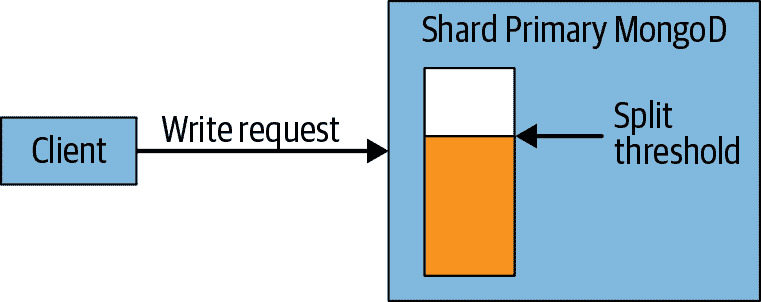
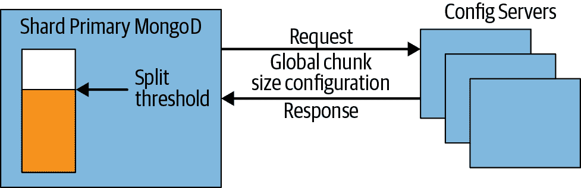
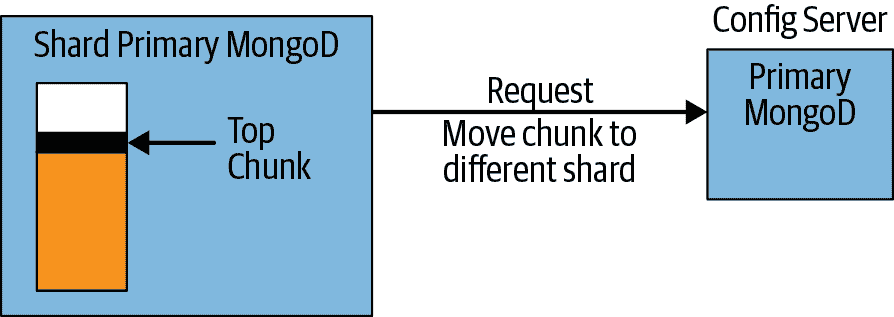

# 第十五章：配置分片

在上一章中，您在一台机器上设置了一个“集群”。本章将介绍如何设置一个更真实的集群以及每个组件的作用。特别是，您将了解：

+   如何设置配置服务器、分片和 *mongos* 进程

+   如何向集群添加容量

+   数据如何存储和分布

# 何时分片

决定何时进行分片是一个权衡考量。通常不希望过早进行分片，因为这会增加部署的操作复杂性，并迫使您做出后续难以更改的设计决策。另一方面，也不希望等待过长时间再进行分片，因为在系统超载的情况下进行分片会很困难且可能导致停机。

一般来说，分片用于：

+   增加可用内存

+   增加可用磁盘空间

+   减少服务器负载

+   以比单个 *mongod* 能处理的更大吞吐量读取或写入数据

因此，良好的监控对于确定何时需要进行分片至关重要。仔细测量每个指标。通常情况下，人们会更快地达到其中一个瓶颈，因此要确定您的部署将首先需要为哪一个瓶颈提供资源，并提前计划何时以及如何转换您的复制集。

# 启动服务器

创建集群的第一步是启动所需的所有进程。正如前一章提到的，您需要设置 *mongos* 和分片。还有第三个组件，即配置服务器，它们是一个重要组成部分。配置服务器是正常的 *mongod* 服务器，用于存储集群配置：哪些复制集托管分片、哪些集合被分片以及每个分块位于哪个分片上。MongoDB 3.2 引入了将复制集用作配置服务器的功能。复制集替代了配置服务器使用的原始同步机制；在 MongoDB 3.4 中删除了使用该机制的能力。

## 配置服务器

配置服务器是集群的大脑：它们保存关于哪些服务器持有哪些数据的所有元数据。因此，它们必须首先设置，并且它们持有的数据非常重要：确保它们启用了日志记录，并且它们的数据存储在非临时驱动器上。在生产部署中，您的配置服务器复制集应至少包含三个成员。每个配置服务器应位于单独的物理机器上，最好是地理分布均匀的。

在启动任何 *mongos* 进程之前，必须先启动配置服务器，因为 *mongos* 从配置服务器获取其配置。要开始，请在三台单独的机器上运行以下命令来启动您的配置服务器：

```
$ mongod --configsvr --replSet configRS --bind_ip localhost,198.51.100.51 mongod 
  --dbpath /var/lib/mongodb

$ mongod --configsvr --replSet configRS --bind_ip localhost,198.51.100.52 mongod 
  --dbpath /var/lib/mongodb

$ mongod --configsvr --replSet configRS --bind_ip localhost,198.51.100.53 mongod 
  --dbpath /var/lib/mongodb
```

然后，将配置服务器初始化为一个复制集。为此，请将 *mongo* shell 连接到其中一个复制集成员：

```
$ mongo --host *`<hostname>`* --port *`<port>`*
```

并使用 `rs.initiate()` 助手：

```
> rs.initiate(
  {
    _id: "configRS",
    configsvr: true,
    members: [
      { _id : 0, host : "cfg1.example.net:27019" },
      { _id : 1, host : "cfg2.example.net:27019" },
      { _id : 2, host : "cfg3.example.net:27019" }
    ]
  }
)
```

在这里我们将 *configRS* 用作复制集名称。请注意，此名称在每个配置服务器实例化时的命令行上显示，并且在调用 `rs.initiate()` 时也会出现。

`--configsvr`选项指示*mongod*您计划将其用作配置服务器。在运行此选项的服务器上，客户端（即其他集群组件）无法向除*config*或*admin*之外的任何数据库写入数据。

*admin*数据库包含与身份验证和授权相关的集合，以及其他用于内部用途的*system.*集合。*config*数据库包含保存分片集群元数据的集合。当元数据发生更改时（例如分块迁移或分块拆分后），MongoDB 将数据写入*config*数据库。

在写入配置服务器时，MongoDB 使用`writeConcern`级别为`"majority"`。类似地，从配置服务器读取时，MongoDB 使用`readConcern`级别为`"majority"`。这确保分片集群元数据不会提交到配置服务器副本集，直到无法回滚为止。它还确保只有在配置服务器失败后将幸存的元数据读取出来。这是确保所有*mongos*路由器在分片集群中组织数据的方式的一致视图的必要条件。

在配置方面，配置服务器应在网络和 CPU 资源方面充分配置。它们仅保存集群数据的目录，因此所需的存储资源很少。它们应该部署在单独的硬件上，以避免争用机器资源。

###### 警告

如果您的所有配置服务器都丢失了，您必须深入分析分片上的数据，以确定数据在哪里。这是可能的，但速度较慢且不愉快。定期备份配置服务器数据。在执行任何集群维护之前，务必备份配置服务器。

## mongos 进程

一旦您有三个配置服务器运行，就启动一个*mongos*进程供应用程序连接。*mongos*进程需要知道配置服务器的位置，因此您必须始终使用`--configdb`选项启动*mongos*：

```
$ mongos --configdb \
  configRS/cfg1.example.net:27019, \
  cfg2.example.net:27019,cfg3.example.net:27019 \
--bind_ip localhost,198.51.100.100 --logpath /var/log/mongos.log
```

默认情况下，*mongos*在端口 27017 上运行。请注意，它不需要数据目录（*mongos*本身不存储数据；它在启动时从配置服务器加载集群配置）。确保将`--logpath`设置为将*mongos*日志保存到安全的位置。

您应该启动少量的*mongos*进程，并将它们尽可能靠近所有分片。这可以提高需要访问多个分片或执行散列/聚合操作的查询性能。最小设置至少需要两个*mongos*进程以确保高可用性。可以运行数十个或数百个*mongos*进程，但这会在*配置服务器*上引起资源争用。推荐的方法是提供一个小型路由器池。

## 从副本集添加分片

最后，您准备好添加一个分片。有两种可能性：您可能有一个现有的副本集，也可能从头开始。我们将介绍从现有集开始的步骤。如果您从头开始，请初始化一个空集，并按照这里概述的步骤操作。

如果您已经有一个为应用程序服务的副本集，那么它将成为您的第一个分片。要将其转换为分片，您需要对成员进行一些小的配置修改，然后告诉*mongos*如何找到将组成该分片的副本集。

例如，如果您在*svr1.example.net*、*svr2.example.net*和*svr3.example.net*上有一个名为*rs0*的副本集，则首先使用*mongo* shell 连接到其中一个成员：

```
$ mongo srv1.example.net
```

然后使用`rs.status()`确定哪个成员是主节点，哪些是辅助节点：

```
> rs.status()
   "set" : "rs0",
   "date" : ISODate("2018-11-02T20:02:16.543Z"),
   "myState" : 1,
   "term" : NumberLong(1),
   "heartbeatIntervalMillis" : NumberLong(2000),
   "optimes" : {

         "lastCommittedOpTime" : {
            "ts" : Timestamp(1478116934, 1),
            "t" : NumberLong(1)
         },
         "readConcernMajorityOpTime" : {
            "ts" : Timestamp(1478116934, 1),
            "t" : NumberLong(1)
         },
         "appliedOpTime" : {
            "ts" : Timestamp(1478116934, 1),
            "t" : NumberLong(1)
         },
         "durableOpTime" : {
            "ts" : Timestamp(1478116934, 1),
            "t" : NumberLong(1)
         }
      },

   "members" : [
      {
            "_id" : 0,
            "name" : "svr1.example.net:27017",
            "health" : 1,
            "state" : 1,
            "stateStr" : "PRIMARY",
            "uptime" : 269,
            "optime" : {
                        "ts" : Timestamp(1478116934, 1),
                        "t" : NumberLong(1)
            },
            "optimeDate" : ISODate("2018-11-02T20:02:14Z"),
            "infoMessage" : "could not find member to sync from",
            "electionTime" : Timestamp(1478116933, 1),
            "electionDate" : ISODate("2018-11-02T20:02:13Z"),
            "configVersion" : 1,
            "self" : true
      },
      {
            "_id" : 1,
            "name" : "svr2.example.net:27017",
            "health" : 1,
            "state" : 2,
            "stateStr" : "SECONDARY",
            "uptime" : 14,
            "optime" : {
               "ts" : Timestamp(1478116934, 1),
               "t" : NumberLong(1)
            },
            "optimeDurable" : {
               "ts" : Timestamp(1478116934, 1),
               "t" : NumberLong(1)
            },
            "optimeDate" : ISODate("2018-11-02T20:02:14Z"),
            "optimeDurableDate" : ISODate("2018-11-02T20:02:14Z"),
            "lastHeartbeat" : ISODate("2018-11-02T20:02:15.618Z"),
            "lastHeartbeatRecv" : ISODate("2018-11-02T20:02:14.866Z"),
            "pingMs" : NumberLong(0),
            "syncingTo" : "m1.example.net:27017",
            "configVersion" : 1
      },
      {
            "_id" : 2,
            "name" : "svr3.example.net:27017",
            "health" : 1,
            "state" : 2,
            "stateStr" : "SECONDARY",
            "uptime" : 14,
            "optime" : {
               "ts" : Timestamp(1478116934, 1),
               "t" : NumberLong(1)
            },
            "optimeDurable" : {
               "ts" : Timestamp(1478116934, 1),
               "t" : NumberLong(1)
            },
            "optimeDate" : ISODate("2018-11-02T20:02:14Z"),
            "optimeDurableDate" : ISODate("2018-11-02T20:02:14Z"),
            "lastHeartbeat" : ISODate("2018-11-02T20:02:15.619Z"),
            "lastHeartbeatRecv" : ISODate("2018-11-02T20:02:14.787Z"),
            "pingMs" : NumberLong(0),
            "syncingTo" : "m1.example.net:27017",
            "configVersion" : 1
      }
   ],
   "ok" : 1
}
```

从 MongoDB 3.4 开始，对于分片集群，*mongod*实例必须使用`--shardsvr`选项进行配置，可以通过配置文件设置`sharding.clusterRole`或通过命令行选项`--shardsvr`进行设置。

您需要为正在转换为分片的副本集的每个成员执行此操作。您将首先使用`--shardsvr`选项依次重新启动每个辅助节点，然后让主节点下台并使用`--shardsvr`选项重新启动它。

在关闭辅助节点后，按以下步骤重新启动：

```
$ mongod --replSet "rs0" --shardsvr --port 27017 
    --bind_ip localhost,<*`ip address of member`*>
```

请注意，您需要为`--bind_ip`参数的每个辅助节点使用正确的 IP 地址。

现在连接到主节点的*mongo* shell：

```
$ mongo m1.example.net
```

并让其下台：

```
> rs.stepDown()
```

然后使用`--shardsvr`选项重新启动前主节点：

```
$ mongod --replSet "rs0" --shardsvr --port 27017 
    --bind_ip localhost,<*`ip address of the former primary`*>
```

现在您准备将您的副本集作为分片添加。连接到*mongos*的*admin*数据库的*mongo* shell：

```
$ mongo mongos1.example.net:27017/admin
```

并使用`sh.addShard()`方法向集群添加一个分片：

```
> sh.addShard(
    "rs0/svr1.example.net:27017,svr2.example.net:27017,svr3.example.net:27017" )
```

您可以指定集合中的所有成员，但不必如此。*mongos*将自动检测未包含在种子列表中的任何成员。如果运行`sh.status()`，您会看到 MongoDB 很快将分片列为

```
rs0/svr1.example.net:27017,svr2.example.net:27017,svr3.example.net:27017
```

集合名称*rs0*被用作此分片的标识符。如果您希望删除此分片或将数据迁移到它，可以使用*rs0*来描述它。这比使用特定服务器（例如*svr1.example.net*）更好，因为副本集成员资格和状态可能随时间而变化。

一旦将副本集添加为分片，您可以将应用程序从连接到副本集切换到连接到*mongos*。当您添加分片时，*mongos*会注册副本集中所有数据库为该分片的“所有权”，因此它将所有查询传递到您的新分片上。*mongos*还将自动处理应用程序的故障转移，就像您的客户端库一样：它会将错误传递给您。

在开发环境中测试分片的主节点故障转移，以确保您的应用程序正确处理从 *mongos* 接收的错误（它们应与直接与主节点交互时接收到的错误相同）。

###### 注意

添加了分片后，您必须设置所有客户端发送请求到 *mongos* 而不是直接连接到副本集。如果某些客户端仍然直接向副本集发出请求（而不通过 *mongos*），则分片功能将无法正常运行。在添加分片后立即切换所有客户端以联系 *mongos*，并设置防火墙规则以确保它们无法直接连接到分片。

在 MongoDB 3.6 之前，可以将独立的 *mongod* 作为一个分片。但是在 MongoDB 3.6 之后的版本中不再支持这个选项。所有的分片必须是副本集。

## 增加容量

当您需要增加更多的容量时，您需要添加更多的分片。要添加一个新的空分片，需要创建一个副本集。确保它的名称与您的其他任何分片不同。一旦初始化并有了主节点，通过 *mongos* 运行 `addShard` 命令，指定新副本集的名称和其主机作为种子，将其添加到集群中。

如果您有几个现有的副本集不是分片，只要它们没有任何公共数据库名称，就可以将它们全部添加为集群中的新分片。例如，如果您有一个带有 *blog* 数据库的副本集，一个带有 *calendar* 数据库，以及一个带有 *mail*、*tel* 和 *music* 数据库的副本集，您可以将每个副本集添加为一个分片，并最终得到一个有三个分片和五个数据库的集群。但是，如果您有第四个副本集，它也有一个名为 *tel* 的数据库，*mongos* 将拒绝将其添加到集群中。

## 分片数据

在告诉 MongoDB 如何分配数据之前，它不会自动分配您的数据。您必须明确告诉数据库和集合，您希望它们被分布。例如，假设您希望在 *music* 数据库的 *artists* 集合上按 `"name"` 键进行分片。首先，您需要为数据库启用分片：

```
> db.enableSharding("music")
```

在分片集合之前，分片数据库始终是先决条件。

一旦在数据库级别启用了分片，您可以通过运行 `sh.shardCollection()` 来为集合分片：

```
> sh.shardCollection("music.artists", {"name" : 1})
```

现在 *artists* 集合将按 `"name"` 键进行分片。如果要对现有集合进行分片，必须在 `"name"` 字段上存在一个索引；否则，`shardCollection` 调用将返回错误。如果出现错误，请创建索引（*mongos* 将在错误消息的一部分返回建议的索引）并重试 `shardCollection` 命令。

如果您要分片的集合尚不存在，*mongos* 将为您自动创建分片键索引。

`shardCollection`命令将集合分成分块，这些分块是 MongoDB 用于数据移动的单位。一旦命令成功返回，MongoDB 将开始在集群中的分片之间平衡集合。这个过程不是即时的。对于大集合，可能需要几个小时来完成初始平衡。可以通过预分片来减少这段时间，预分片是指在加载数据之前在分片上创建分块。在此之后加载的数据将直接插入到当前分片，而无需额外的平衡。

# MongoDB 如何跟踪集群数据

每个*mongos*都必须始终知道如何根据其分片键找到文档的位置。从理论上讲，MongoDB 可以追踪每个文档的存储位置，但对于包含数百万或数十亿文档的集合来说，这变得难以管理。因此，MongoDB 将文档分组成分块，即在给定分片键范围内的文档。每个分块始终驻留在单个分片上，因此 MongoDB 可以维护一个映射到分片的小表格。

例如，如果用户集合的分片键是`{"age" : 1}`，一个分块可能包含所有具有`"age"`字段在 3 和 17 之间的文档。如果*mongos*收到一个查询`{"age" : 5}`，它可以将查询路由到包含此分块的分片。

随着写入的发生，分块中文档的数量和大小可能会改变。插入操作可以使分块包含更多文档，而删除操作则减少文档数量。例如，如果我们为儿童和青少年制作游戏，我们的 3−17 岁的年龄分块可能会越来越大（希望如此）。几乎所有用户都会在该分块中，并且会在一个单独的分片上，这在某种程度上违背了分配数据的初衷。因此，一旦分块增长到一定大小，MongoDB 会自动将其拆分为两个较小的分块。例如，在此示例中，原始分块可能会被拆分为一个包含年龄 3 至 11 岁的分块，以及一个包含年龄 12 至 17 岁的分块。请注意，这两个分块仍然覆盖了原始分块所涵盖的整个年龄范围：3−17 岁。随着这些新分块的增长，它们可以进一步分成更小的分块，直到每个年龄段都有一个分块。

不能有重叠范围的分块，比如 3−15 和 12−17。如果允许存在这样的重叠，当尝试查找重叠中的年龄（例如 14）时，MongoDB 将需要检查两个分块，这样效率不高。只需在一个位置查找更有效，特别是一旦分块开始在集群中移动。

每个文档始终属于且仅属于一个分块。这一规则的一个结果是，不能使用数组字段作为分片键，因为 MongoDB 为数组创建多个索引条目。例如，如果文档的`"age"`字段中有`[5, 26, 83]`，它可能属于多达三个分块。

###### 注意

一种常见的误解是分块中的数据在物理上在磁盘上分组。这是不正确的：分块对*mongod*存储集合数据的方式没有影响。

## 分块范围

每个块由其包含的范围描述。新分片的集合从单个块开始，每个文档都位于此块中。此块的边界为负无穷到正无穷，显示为 Shell 中的`$minKey`和`$maxKey`。

当此块增长时，MongoDB 将自动将其分为两个块，范围为负无穷到*`<某个值>`*和*`<某个值>`*到正无穷。*`<某个值>`* 对于两个块都是相同的：下面的块包含一切直到（但不包括）*`<某个值>`*，上面的块包含*`<某个值>`*及更高的一切。

通过示例可能更容易理解。假设我们按照前述方式通过`"age"`进行分片。所有`"age"`在`3`和`17`之间的文档都包含在一个块中：`3 ≤ "age" < 17`。当此块被分割时，我们得到两个范围：一个块中的`3 ≤ "age" < 12`，另一个块中的`12 ≤ "age" < 17`。12 被称为*分割点*。

块信息存储在*config.chunks*集合中。如果您查看该集合的内容，您会看到类似以下内容的文档（为了清晰起见，某些字段已经省略）：

```
> db.chunks.find(criteria, {"min" : 1, "max" : 1})
{
    "_id" : "test.users-age_-100.0",
    "min" : {"age" : -100},
    "max" : {"age" : 23}
}
{
    "_id" : "test.users-age_23.0",
    "min" : {"age" : 23},
    "max" : {"age" : 100}
}
{
    "_id" : "test.users-age_100.0",
    "min" : {"age" : 100},
    "max" : {"age" : 1000}
}
```

根据显示的*config.chunks*文档，以下是各种文档可能存放的几个示例位置：

`{"_id" : 123, "age" : 50}`

此文档将位于第二个块中，因为该块包含所有年龄在`23`和`100`之间的文档。

`{"_id" : 456, "age" : 100}`

此文档将位于第三个块中，因为下界是包含的。第二个块包含所有年龄在`"age" : 100`之前的文档，但不包含`"age"`等于`100`的文档。

`{"_id" : 789, "age" : -101}`

此文档将不属于任何这些块。它将属于某个范围低于第一个块的块中。

使用复合分片键时，块范围的工作方式与按两个键排序的方式相同。例如，假设我们使用`{"username" : 1, "age" : 1}`作为分片键。然后我们可能会有如下块范围：

```
{
    "_id" : "test.users-username_MinKeyage_MinKey",
    "min" : {
        "username" : { "$minKey" : 1 },
        "age" : { "$minKey" : 1 }
    },
    "max" : {
        "username" : "user107487",
        "age" : 73
    }
}
{
    "_id" : "test.users-username_\"user107487\"age_73.0",
    "min" : {
        "username" : "user107487",
        "age" : 73
    },
    "max" : {
        "username" : "user114978",
        "age" : 119
    }
}
{
    "_id" : "test.users-username_\"user114978\"age_119.0",
    "min" : {
        "username" : "user114978",
        "age" : 119
    },
    "max" : {
        "username" : "user122468",
        "age" : 68
    }
}
```

因此，*mongos*可以轻松找到居住在具有给定用户名（或给定用户名和年龄）的人的块。但是，只给出一个年龄，*mongos*必须检查所有或几乎所有的块。如果我们希望能够将年龄的查询定位到正确的块上，我们必须使用“相反的”分片键：`{"age" : 1, "username" : 1}`。这常常是令人困惑的一点：在分片键的第二半范围内进行范围查询将跨越多个块。

## 分割块

每个分片主 *mongod* 跟踪其当前的块，并在达到一定阈值时检查是否需要分裂块，如图 15-1 和 15-2 所示。如果确实需要分裂块，则 *mongod* 将从配置服务器请求全局块大小配置值。然后执行块分裂并更新配置服务器上的元数据。新的块文档将在配置服务器上创建，旧块的范围 (`"max"`) 将被修改。如果块是分片的顶块，则 *mongod* 将请求平衡器将此块移动到另一个分片。其目的是防止分片变得“热”，其中分片键使用单调递增的键。

对于大块而言，有时分片可能无法找到任何分裂点，因为合法分裂块的方法有限。具有相同分片键的两个文档必须位于同一块中，因此块只能在分片键的值发生变化的文档之间进行分裂。例如，如果分片键是 `"age"`，则可以在分片键变化的点处分裂以下块，如下所示：

```
{"age" : 13, "username" : "ian"}
{"age" : 13, "username" : "randolph"}
------------ // split point
{"age" : 14, "username" : "randolph"}
{"age" : 14, "username" : "eric"}
{"age" : 14, "username" : "hari"}
{"age" : 14, "username" : "mathias"}
------------ // split point
{"age" : 15, "username" : "greg"}
{"age" : 15, "username" : "andrew"}
```

仅针对分片的主 *mongod* 请求在分片分裂时将顶部分片移动到平衡器。其他分片将保留在分片上，除非手动移动。

但是，如果块包含以下文档，则无法分裂（除非应用程序开始插入小数年龄）：

```
{"age" : 12, "username" : "kevin"}
{"age" : 12, "username" : "spencer"}
{"age" : 12, "username" : "alberto"}
{"age" : 12, "username" : "tad"}
```

因此，拥有多样化的分片键值对于您的分片键非常重要。其他重要属性将在下一章中介绍。

如果配置服务器之一在 *mongod* 尝试执行分裂时宕机，则 *mongod* 将无法更新元数据（如 图 15-3 所示）。所有配置服务器必须处于运行状态并且可访问才能进行分裂操作。如果 *mongod* 继续接收分片的写请求，则会继续尝试并失败。只要配置服务器不健康，分裂将继续无法正常工作，并且所有分裂尝试都会使 *mongod* 和涉及的分片变慢（这与图 15-1 到 15-3 中显示的过程重复）。 *mongod* 反复尝试分裂分片且无法成功的过程称为 *split storm*。防止分裂风暴的唯一方法是确保您的配置服务器尽可能保持运行和健康。



###### 图 15-1\. 当客户端写入块时，*mongod* 将检查其分裂阈值



###### 图 15-2\. 如果达到分裂阈值，则 *mongod* 将发送请求到平衡器以迁移顶部块；否则块保留在分片上



###### 图 15-3. mongod 选择一个拆分点并尝试通知配置服务器，但无法达到它；因此，它仍然超过其数据块的拆分阈值，并且任何后续写操作都将再次触发此过程。

# Balancer

*Balancer*负责数据迁移。它定期检查分片之间的不平衡，如果发现不平衡，将开始迁移数据块。在 MongoDB 3.4+版本中，Balancer 位于配置服务器副本集的主节点上；在此版本之前，每个*mongos*有时会扮演“Balancer”的角色。

Balancer 是配置服务器副本集的主节点上的后台进程，监视每个分片上的数据块数量。仅当分片的数据块数量达到特定的迁移阈值时，它才会变为活动状态。

###### 注意

在 MongoDB 3.4+中，并发迁移的数量增加到每个分片一个迁移，最大并发迁移数量为总分片数的一半。在早期版本中，仅支持总共一个并发迁移。

假设某些集合已达到阈值，Balancer 将开始迁移数据块。它从负载过多的分片中选择一个数据块，并询问该分片在迁移之前是否应拆分数据块。完成必要的拆分后，它将数据块迁移到拥有较少数据块的机器上。

使用集群的应用程序无需知道数据正在移动：所有读写操作都路由到旧的数据块，直到迁移完成。一旦元数据更新，任何尝试访问旧位置数据的*mongos*进程将收到错误。这些错误对客户端不可见：*mongos*会静默处理错误，并在新的分片上重试操作。

这是你可能在*mongos*日志中看到与“无法`setShardVersion`”相关的常见错误原因。当*mongos*收到此类错误时，它会从配置服务器查找数据的新位置，更新其数据块表，并再次尝试请求。如果成功从新位置检索数据，它将向客户端返回，就像什么都没有发生过一样（但会在日志中打印错误消息）。

如果*mongos*无法检索到新的数据块位置，因为配置服务器不可用，它将向客户端返回错误。这是始终保持配置服务器正常运行的另一个重要原因。

# Collations

MongoDB 中的*Collations*允许为字符串比较指定特定语言的规则。这些规则的示例包括如何比较大小写和重音符号。可以对具有默认排序规则的集合进行分片。有两个要求：集合必须有一个索引，其前缀是分片键，并且该索引还必须具有`{ locale: "simple" }`的排序规则。

# 变更流

*更改流* 允许应用程序跟踪数据库中数据的实时更改。在 MongoDB 3.6 之前，只能通过尾随 oplog 进行，并且是一个复杂且容易出错的操作。更改流为集合、一组集合、数据库或整个部署中的所有数据更改提供了订阅机制。聚合框架被这一功能所使用。它允许应用程序过滤特定的更改或转换接收到的更改通知。在跨片群集中，所有更改流操作必须针对一个*mongos*进行。

跨片群集上的更改通过全局逻辑时钟保持有序。这保证了更改的顺序，流通知可以安全地按照它们接收的顺序进行解释。*mongos* 在接收到更改通知时需要与每个片段进行核对，以确保没有片段看到更新的更改。群集的活动水平和片段的地理分布都可能影响此检查的响应时间。在这些情况下使用通知过滤器可以提高响应时间。

###### 注意

在使用跨片群集的更改流时有几点注意事项和警告。通过发出打开更改流操作来打开更改流。在分片部署中，这必须针对一个*mongos*进行。如果对带有打开更改流的分片集合运行具有 `multi: true` 的更新操作，则可能会发送孤立文档的通知。如果删除了一个片段，则可能会导致打开的更改流游标关闭——此外，该游标可能无法完全恢复。
