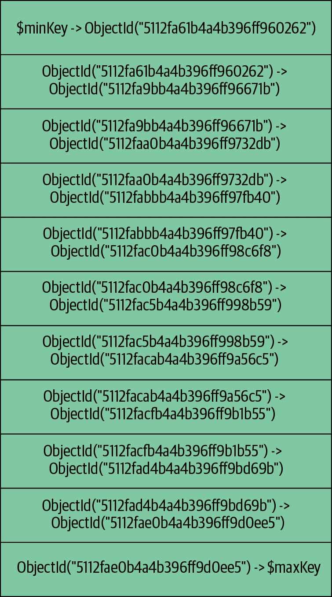
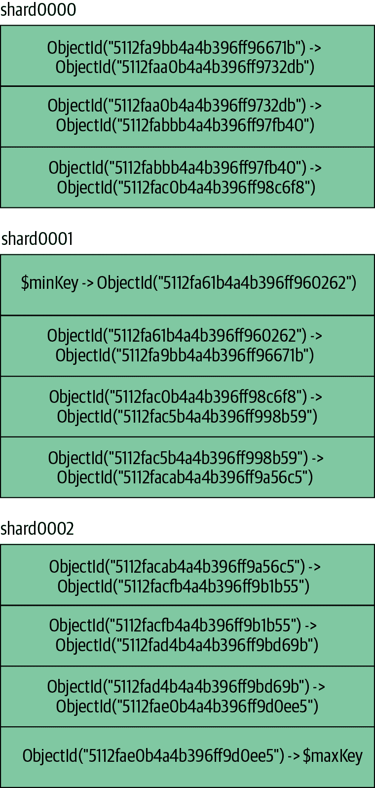
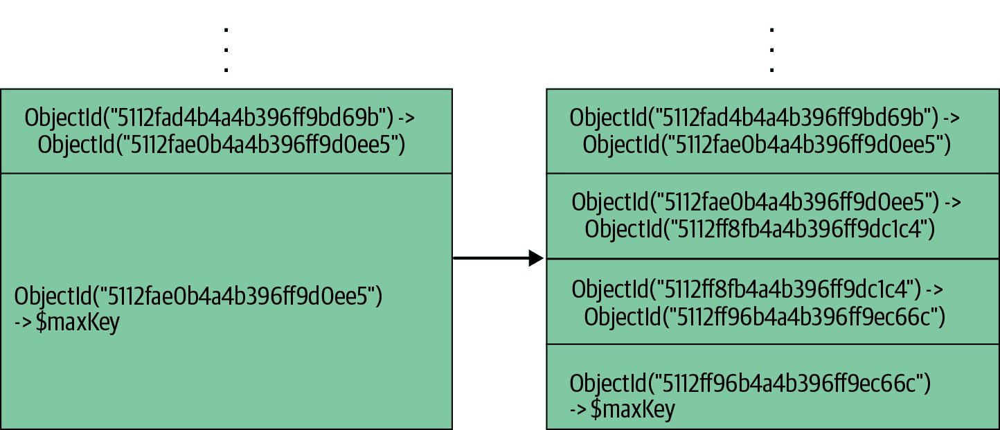
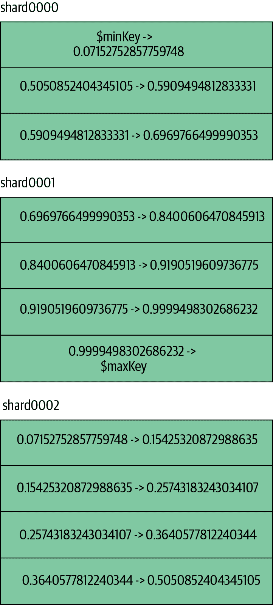
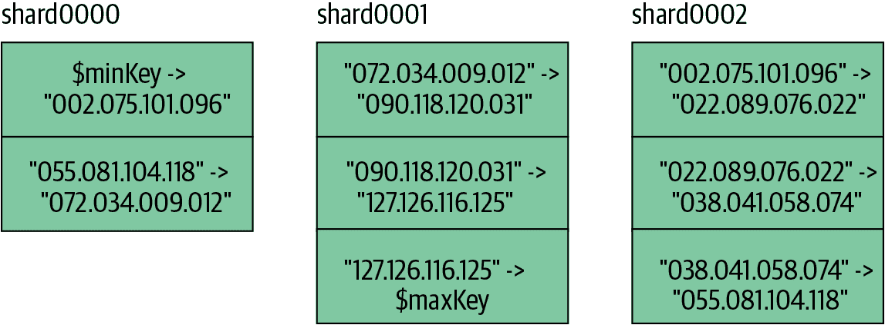
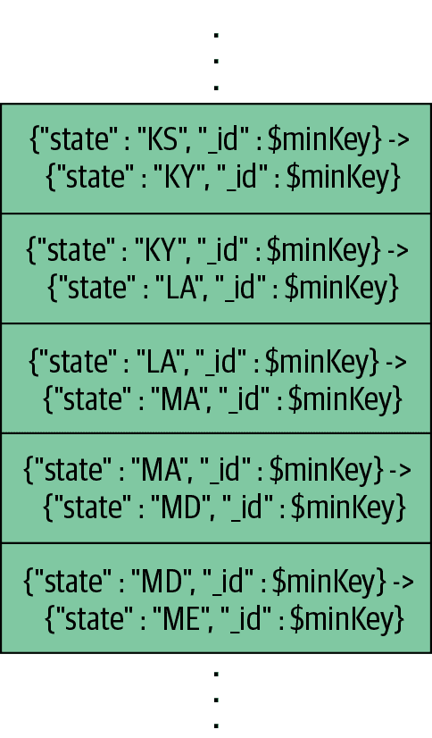
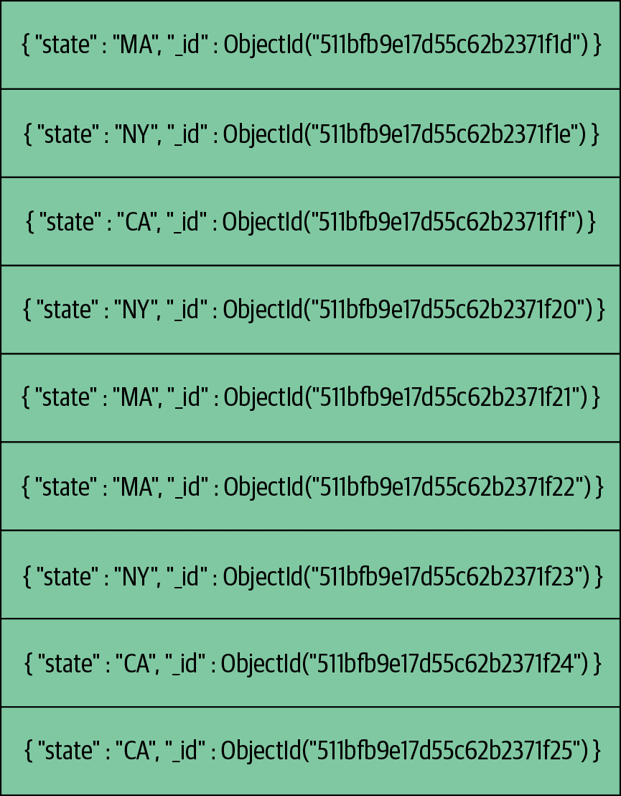
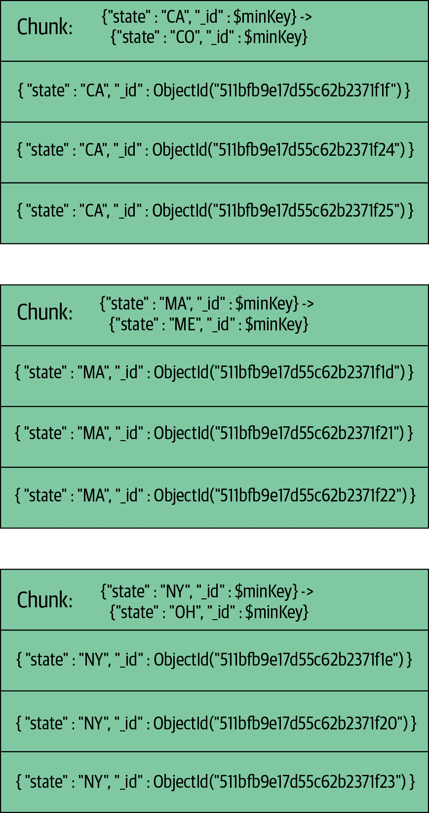

# 第十六章：选择一个分片键

当使用分片时，最重要的任务是选择数据分布方式。为了对此做出明智的选择，你必须了解 MongoDB 如何分布数据。本章通过以下内容帮助你选择一个好的分片键：

+   如何在多个可能的分片键之间做出决策

+   几种用例的分片键

+   不能作为分片键的内容

+   如果你想要定制数据分布的一些替代策略

+   如何手动分片数据

假设你已经理解了前两章中涵盖的分片的基本组成部分。

# 盘点你的使用情况

当你对一个集合进行分片时，你需要选择一个或两个字段来拆分数据。这个键（或键）被称为*分片键*。一旦你对一个集合进行了分片，你就无法更改你的分片键，因此选择正确非常重要。

要选择一个好的分片键，你需要了解你的工作负载以及你的分片键将如何分配你的应用程序请求。这可能很难理解，所以尝试一些示例或者更好的办法是在备份数据集上进行样本流量的尝试。本节包含大量图表和解释，但没有什么能代替在自己的数据上尝试。

对于每个你计划分片的集合，首先回答以下问题：

+   你计划增长到多少片？一个三片集群比一个千片集群具有更大的灵活性。随着集群的扩大，你不应该计划发出可以击中所有分片的查询，因此几乎所有查询必须包含分片键。

+   你是否在进行分片以减少读取或写入延迟？（延迟指某事物花费的时间；例如，写入需要 20 毫秒，但你希望它只需 10 毫秒。）减少写入延迟通常涉及将请求发送到地理位置更近或更强大的机器。

+   你是否在进行分片以增加读取或写入吞吐量？（吞吐量指集群能同时处理多少请求；例如，集群可以在 20 毫秒内执行 1,000 次写入，但你需要它在 20 毫秒内执行 5,000 次写入。）增加吞吐量通常涉及增加更多的并行处理，并确保请求在集群中均匀分布。

+   你是否正在进行分片以增加系统资源（例如，为 MongoDB 每 GB 数据增加更多 RAM）？如果是这样，你希望尽可能保持工作集大小尽可能小。

使用这些答案来评估以下分片键描述，并决定你正在考虑的分片键是否能在你的情况下很好地工作。它是否为你提供了所需的目标查询？它是否以你需要的方式改变了系统的吞吐量或延迟？如果你需要一个紧凑的工作集，它是否提供了这个？

# 图解分布

人们选择分割数据的最常见方式是通过升序、随机和基于位置的键。还有其他类型的键可以使用，但大多数用例都属于这些类别之一。不同类型的分布在接下来的章节中进行了讨论。

## 升序分片键

升序分片键通常是像`"date"`字段或`ObjectId`这样的东西——任何随着时间稳定增长的东西。自增主键是升序字段的另一个例子，尽管在 MongoDB 中并不常见（除非您从另一个数据库导入）。

假设我们在一个升序字段上进行分片，比如在一个使用`ObjectId`的集合的`"_id"`上进行分片。如果我们在`"_id"`上进行分片，那么数据将根据`"_id"`范围被分割成块，如图 16-1 所示。这些块将分布在我们的三个分片的分片集群中，如图 16-2 所示。



###### 图 16-1\. 集合被划分为 ObjectId 的范围；每个范围是一个块

假设我们创建一个新文档。它将在哪个块中？答案是包含范围为`ObjectId("5112fae0b4a4b396ff9d0ee5")`到`$maxKey`的块。这被称为*max chunk*，因为它是包含`$maxKey`的块。

如果我们插入另一个文档，它也将在最大块中。实际上，每个后续的插入都将在最大块中进行！每个插入的`"_id"`字段都将比前一个更接近无限（因为`ObjectId`总是增加的），所以它们都将进入最大块。



###### 图 16-2\. 块在随机顺序分布在分片之间

这有几个有趣（通常是不可取的）的特性。首先，所有的写入将被路由到一个分片（*shard0002*，在本例中）。这个块将是唯一增长和分裂的块，因为它是唯一接收插入的块。当您插入数据时，新的块将从这个块“掉落”，如图 16-3 所示。



###### 图 16-3\. 最大块持续增长并分裂成多个块

这种模式经常使 MongoDB 更难以保持块的均衡，因为所有的块都是由一个分片创建的。因此，MongoDB 必须不断地将块移动到其他分片，而不是纠正可能在更均匀分布的系统中出现的小不平衡。

###### 注

在 MongoDB 4.2 中，将自动分割功能移动到分片主节点的*mongod*中，添加了顶部块优化以解决升序分片键模式。均衡器将决定将顶部块放置在哪个其他分片中。这有助于避免所有新块都在同一个分片上创建的情况。

## 随机分布的分片键

在另一端是随机分布的分片键。随机分布的键可以是用户名、电子邮件地址、UUID、MD5 哈希或数据集中没有可识别模式的任何其他键。

假设分片键是介于 0 和 1 之间的随机数。我们会在各个分片上得到不同的块的随机分布，如 图 16-4 所示。



###### 图 16-4\. 如前所述，块在集群中随机分布

随着插入更多数据，数据的随机性意味着插入应该相对均匀地命中每个块。你可以通过插入 10,000 个文档来证明这一点，看看它们最终分布在哪里：

```
> var servers = {}
> var findShard = function (id) {
...     var explain = db.random.find({_id:id}).explain();
...     for (var i in explain.shards) {
...         var server = explain.shards[i][0];
...         if (server.n == 1) {
...             if (server.server in servers) {
...                 servers[server.server]++;
...             } else {
...                 servers[server.server] = 1;
...             }
...         }
...     }
... }
> for (var i = 0; i < 10000; i++) {
...     var id = ObjectId();
...     db.random.insert({"_id" : id, "x" : Math.random()});
...     findShard(id);
... }
> servers
{
    "spock:30001" : 2942,
    "spock:30002" : 4332,
    "spock:30000" : 2726
}
```

由于写入是随机分布的，分片应以大致相同的速度增长，从而限制需要发生的迁移数量。

随机分布的分片键唯一的缺点是 MongoDB 在超出 RAM 大小的随机访问数据方面效率不高。但是，如果您有能力或者不介意性能损失，随机键可以很好地分布负载在集群中。

## 基于位置的分片键

基于位置的分片键可能是用户的 IP、纬度和经度或地址等。它们不一定与物理位置字段相关联：这个“位置”可能是数据应该以更抽象的方式分组在一起的方式。无论如何，基于位置的键是一种键，其中具有某种相似性的文档根据此字段的范围落入。这对于将数据放置在靠近其用户的位置并在磁盘上保持相关数据在一起可能会很有用。这也可能是为了符合 GDPR 或其他类似的数据隐私立法的法律要求。MongoDB 使用区域分片来管理这一点。

###### 注意

在 MongoDB 4.0.3+ 中，您可以在对集合进行分片之前定义区域和区域范围，这将为区域范围和分片键值的块填充以及执行这些的初始块分布。这极大地简化了分片区域设置的复杂性。

例如，假设我们有一个基于 IP 地址分片的文档集合。文档将根据它们的 IP 组织成块，并随机分布在集群中，如 图 16-5 所示。



###### 图 16-5\. IP 地址集合中块的示例分布

如果我们希望某些块范围附加到特定的分片上，我们可以对这些分片进行区域划分，然后为每个区域分配块范围。例如，假设我们希望将某些 IP 区块保留在特定的分片上：例如，56.*.*.*（美国邮政服务的 IP 区块）在 *shard0000* 上，17.*.*.*（苹果的 IP 区块）在 *shard0000* 或 *shard0002* 上。我们不在乎其他 IP 位于何处。我们可以通过设置区域要求负载平衡器执行此操作：

```
> sh.addShardToZone("shard0000", "USPS")
> sh.addShardToZone("shard0000", "Apple")
> sh.addShardToZone("shard0002", "Apple")
```

接下来，我们创建规则：

```
> sh.updateZoneKeyRange("test.ips", {"ip" : "056.000.000.000"}, 
... {"ip" : "057.000.000.000"}, "USPS")
```

这将把所有大于或等于 56.0.0.0 且小于 57.0.0.0 的 IP 附加到标记为`"USPS"`的分片。接下来，我们为苹果添加一个规则：

```
> sh.updateZoneKeyRange("test.ips", {"ip" : "017.000.000.000"}, 
... {"ip" : "018.000.000.000"}, "Apple")
```

当均衡器移动块时，它将尝试将具有这些范围的块移动到这些分片。请注意，此过程不是立即的。没有被区域键范围覆盖的块将按正常方式移动。均衡器将继续尝试在分片之间均匀分布块。

# 分片键策略

本节介绍了各种类型应用程序的一些分片键选项。

## 哈希分片键

为了尽可能快地加载数据，哈希分片键是最佳选择。哈希分片键可以使任何字段随机分布，因此如果你要在许多查询中使用升序键但希望写入是随机分布的，则哈希分片键是一个不错的选择。

这种方式的权衡是你永远不能使用哈希分片键进行定向的范围查询。但如果你不打算进行范围查询，哈希分片键是一个不错的选择。

要创建哈希分片键，首先创建一个哈希索引：

```
> db.users.createIndex({"username" : "hashed"})
```

接下来，使用以下方式对集合进行分片：

```
> sh.shardCollection("app.users", {"username" : "hashed"})
{ "collectionsharded" : "app.users", "ok" : 1 }
```

如果你在不存在的集合上创建了一个哈希分片键，`shardCollection`的行为会变得很有趣：它会假设你希望均匀分布的块，因此它会立即创建一堆空块，并将它们分布在你的集群周围。例如，假设在创建哈希分片键之前我们的集群看起来是这样的：

```
> sh.status()
--- Sharding Status --- 
  sharding version: { "_id" : 1, "version" : 3 }
  shards:
        {  "_id" : "shard0000",  "host" : "localhost:30000" }
        {  "_id" : "shard0001",  "host" : "localhost:30001" }
        {  "_id" : "shard0002",  "host" : "localhost:30002" }
  databases:
        {  "_id" : "admin",  "partitioned" : false,  "primary" : "config" }
        {  "_id" : "test",  "partitioned" : true,  "primary" : "shard0001" }
```

立即在`shardCollection`返回后，每个分片上都有两个块，将键空间均匀分布在整个集群中：

```
> sh.status()
--- Sharding Status --- 
  sharding version: { "_id" : 1, "version" : 3 }
  shards:
    {  "_id" : "shard0000",  "host" : "localhost:30000" }
    {  "_id" : "shard0001",  "host" : "localhost:30001" }
    {  "_id" : "shard0002",  "host" : "localhost:30002" }
  databases:
    {  "_id" : "admin",  "partitioned" : false,  "primary" : "config" }
    {  "_id" : "test",  "partitioned" : true,  "primary" : "shard0001" }
        test.foo
            shard key: { "username" : "hashed" }
            chunks:
                shard0000       2
                shard0001       2
                shard0002       2
            { "username" : { "$MinKey" : true } } 
                -->> { "username" : NumberLong("-6148914691236517204") } 
                on : shard0000 { "t" : 3000, "i" : 2 } 
            { "username" : NumberLong("-6148914691236517204") } 
                -->> { "username" : NumberLong("-3074457345618258602") } 
                on : shard0000 { "t" : 3000, "i" : 3 } 
            { "username" : NumberLong("-3074457345618258602") } 
                -->> { "username" : NumberLong(0) } 
                on : shard0001 { "t" : 3000, "i" : 4 } 
            { "username" : NumberLong(0) } 
                -->> { "username" : NumberLong("3074457345618258602") } 
                on : shard0001 { "t" : 3000, "i" : 5 } 
            { "username" : NumberLong("3074457345618258602") } 
                -->> { "username" : NumberLong("6148914691236517204") } 
                on : shard0002 { "t" : 3000, "i" : 6 } 
            { "username" : NumberLong("6148914691236517204") } 
                -->> { "username" : { "$MaxKey" : true } } 
                on : shard0002 { "t" : 3000, "i" : 7 }
```

请注意，集合中目前没有文档，但当你开始插入它们时，写操作应该从一开始就均匀分布在所有分片上。通常情况下，你需要等待块增长、分割和移动到其他分片才能开始向其他分片写入。但通过这种自动启动，你将立即在所有分片上获得块范围。

###### 注意

如果使用哈希分片键，对于分片键的选择有一些限制。首先，你不能使用`unique`选项。与其他分片键一样，你不能使用数组字段。最后，请注意，在进行哈希之前，浮点数值会被四舍五入为整数，因此 1 和 1.999999 将被哈希为相同的值。

## 用于 GridFS 的哈希分片键

在尝试对 GridFS 集合进行分片之前，请确保你理解了 GridFS 如何存储数据（参见第六章进行解释）。

在接下来的解释中，“块”这个术语具有重载含义，因为 GridFS 将文件分割为块，而分片将集合分割为块。因此，这两种类型的块被称为“GridFS 块”和“分片块”。

GridFS 集合通常是分片的绝佳候选，因为它们包含大量的文件数据。然而，*fs.chunks*自动创建的索引中，`{"_id" : 1}`是一个升序键，`{"files_id" : 1, "n" : 1}`选取了*fs.files*的`"_id"`字段，因此也是一个升序键。

然而，如果你在`"files_id"`字段上创建了哈希索引，每个文件将会随机分布在整个集群中，并且每个文件始终会包含在单个分片中。这是两全其美的最佳选择：写操作会均匀分布到所有的分片上，而读取文件数据只需要访问单个分片。

要设置这个，你必须在`{"files_id" : "hashed"}`上创建一个新的索引（截至目前为止，*mongos*不能使用复合索引的子集作为分片键）。然后在这个字段上对集合进行分片：

```
> db.fs.chunks.ensureIndex({"files_id" : "hashed"})
> sh.shardCollection("test.fs.chunks", {"files_id" : "hashed"})
{ "collectionsharded" : "test.fs.chunks", "ok" : 1 }
```

顺便提一下，*fs.files*集合可能需要分片，也可能不需要，因为它的大小远小于*fs.chunks*。如果你愿意，你可以对其进行分片，但这可能并不是必要的。

## 消防栓策略

如果你有一些服务器比其他服务器更强大，你可能希望让它们处理比较多的负载。例如，假设你有一个分片可以处理其他机器 10 倍的负载。幸运的是，你还有其他 10 个分片。你可以强制所有的插入操作都发送到更强大的分片，然后允许负载均衡器将旧的块移动到其他分片上。这将带来更低延迟的写入操作。

要使用这种策略，我们必须将最高的块固定在最强大的分片上。首先，我们对这个分片进行区域设置：

```
> sh.addShardToZone("<shard-name>", "10x")
```

然后我们将升序键的当前值固定到那个分片上，所以所有的新写入操作都会发送到这里：

```
> sh.updateZoneKeyRange("<dbName.collName>", {"_id" : ObjectId()}, 
... {"_id" : MaxKey}, "10x")
```

现在所有的插入操作将会路由到最后一个块，它将始终存在于分片区域`"10x"`上。

然而，从现在开始直到无穷大的范围将会被困在这个分片上，除非我们修改区域键范围。为了避免这个问题，我们可以设置一个 cron 任务，每天更新一次键范围，例如：

```
> use config
> var zone = db.tags.findOne({"ns" : "<dbName.collName>", 
... "max" : {"<shardKey>" : MaxKey}})
> zone.min.<shardKey> = ObjectId()
> db.tags.save(zone)
```

随后，前一天的所有块都将能够移动到其他分片上。

这种策略的另一个缺点是，它需要一些扩展的变动。如果你的最强大服务器不能再处理所有写入的数量，那么在这台服务器和另一台服务器之间没有简单的方法来分担负载。

如果你没有高性能服务器用于输入流或者没有使用区域分片，不要将升序键作为分片键。如果这样做，所有的写操作都将集中在单个分片上。

## 多热点

独立的*mongod*服务器在进行升序写入时效率最高。这与分片冲突，因为分片在整个集群上均匀分布写入时效率最高。这里描述的技术基本上创建了多个热点——在每个分片上最好有几个——以便在集群中均匀分配写入，但在分片内部保持升序。

为了实现这一点，我们使用复合分片键。复合键中的第一个值是一个粗略的、具有较低基数的随机值。你可以把分片键的第一部分中的每个值想象成一个块，就像图 16-6 中展示的那样。随着插入更多数据，这将最终得到解决，尽管可能永远不会这么整齐地分割（恰好位于`$minKey`行上）。然而，如果插入足够的数据，最终每个随机值大约应该有一个块。随着继续插入数据，你最终会得到多个具有相同随机值的块，这将带我们来到分片键的第二部分。



###### 图 16-6\. 一些块的子集：每个块包含一个状态和一系列“_id”值的范围

第二部分的分片键是一个升序键。这意味着在一个块内，值始终是增加的，就像在图 16-7 的示例文档中所示。因此，如果每个分片只有一个块，你将拥有完美的设置：每个分片上都有升序写入，如图 16-8 所示。当然，拥有*n*个分片，每个分片有*n*个热点散布在其中并不是很可扩展的：添加一个新分片，它将无法获得任何写入，因为没有热点块可以放置在上面。因此，你希望每个分片有几个热点块（以便为你提供增长的空间），但不要太多。拥有几个热点块将保持升序写入的效果，但是，例如在一个分片上有一千个热点块最终会导致等同于随机写入。



###### 图 16-7\. 插入文档的样本列表（注意所有“_id”值都是增加的）



###### 图 16-8\. 插入的文档，分成块（注意，每个块内的“_id”值是增加的）

你可以把这个设置想象成每个块都是一堆升序文档。每个分片上有多个堆栈，每个堆栈都升序直至块被分割。一旦块被分割，新块中只有一个是热点块：另一个块本质上是“死”的，永远不会再增长。如果堆栈均匀分布在各个分片上，写入将均匀分布。

# 分片键的规则和指南

在选择分片键之前，需要注意几个实际限制。

确定用于分片的键以及创建分片键应该与索引类似，因为这两个概念是相似的。事实上，通常你的分片键可能只是你最常使用的索引（或者它的某种变体）。

## 分片键限制

分片键不能是数组。如果任何键具有数组值，`sh.shardCollection()`将失败，并且不允许将数组插入该字段。

一旦插入，文档的分片键值可能会被修改，除非分片键字段是不可变的`_id`字段。在 MongoDB 4.2 之前的旧版本中，无法修改文档的分片键值。

大多数特殊类型的索引不能用作分片键。特别是，您不能在地理空间索引上进行分片。使用哈希索引作为分片键是允许的，如前所述。

## Shard 键的基数

无论你的分片键是跳跃还是稳步增加，选择一个值会变化的键是很重要的。与索引类似，高基数字段在分片时表现更好。例如，如果你有一个`"logLevel"`键，只有`"DEBUG"`、`"WARN"`或`"ERROR"`这三个值，MongoDB 无法将你的数据分成超过三个块（因为分片键只有三个不同的值）。如果你有一个变化很少的键，并且仍然想将其用作分片键，你可以在该键上创建一个复合分片键，以及一个更有变化的键，比如`"logLevel"`和`"timestamp"`。重要的是这些键的组合具有高基数。

# 控制数据分发

有时，自动数据分发无法满足您的要求。本节提供了一些选择，超出了选择分片键并允许 MongoDB 自动执行所有操作的范围。

当您的集群变得更大或更繁忙时，这些解决方案变得不太实用。但是，对于小集群，您可能希望有更多的控制。

## 使用一个集群来处理多个数据库和集合

MongoDB 会在集群中的每个分片上均匀分布集合，这在存储同质数据时效果很好。但是，如果您有一个日志集合比其他数据“价值低”，您可能不希望它占用昂贵服务器的空间。或者，如果您有一个强大的分片，您可能只想用它来进行实时收集，而不允许其他集合使用它。您可以创建单独的集群，但您还可以向 MongoDB 指定您希望它将某些数据放置在哪里。

要设置这个，请在 shell 中使用`sh.addShardToZone()`辅助程序：

```
> sh.addShardToZone("shard0000", "high")
> // shard0001 - no zone
> // shard0002 - no zone
> // shard0003 - no zone
> sh.addShardToZone("shard0004", "low")
> sh.addShardToZone("shard0005", "low")
```

然后，您可以将不同的集合分配给不同的分片。例如，对于您的超级重要的实时集合：

```
> sh.updateZoneKeyRange("super.important", {"<shardKey>" : MinKey}, 
... {"<shardKey>" : MaxKey}, "high")
```

这句话说，“对于此集合的负无穷到正无穷，将其存储在标记为`"high"`的分片上。” 这意味着来自*super.important*集合的数据不会存储在其他服务器上。请注意，这不影响其他集合的分布方式：它们仍然会均匀分布在这个分片和其他分片之间。

您可以执行类似的操作，将日志集合保存在低质量服务器上：

```
> sh.updateZoneKeyRange("some.logs", {"<shardKey>" : MinKey}, 
... {"<shardKey>" : MaxKey}, "low")
```

日志集合现在将在*shard0004*和*shard0005*之间均匀分割。

将区域键范围分配给集合不会立即影响它。这是对平衡器的一项指示，即在其运行时，这些是移动集合的可行目标。因此，如果整个日志集合在*shard0002*上或在各个分片之间均匀分布，那么将所有块迁移到*shard0004*和*shard0005*将需要一些时间。

举个例子，也许你有一个不希望放在分区 `"high"` 的集合，但你不关心它放在哪个其他分片上。你可以将所有非高性能分片分区为一个新的组。分片可以有任意数量的分区：

```
> sh.addShardToZone("shard0001", "whatever")
> sh.addShardToZone("shard0002", "whatever")
> sh.addShardToZone("shard0003", "whatever")
> sh.addShardToZone("shard0004", "whatever")
> sh.addShardToZone("shard0005", "whatever")
```

现在，你可以指定你希望这个集合（称为 *normal.coll*）分布在这五个分片上：

```
> sh.updateZoneKeyRange("normal.coll", {"<shardKey>" : MinKey}, 
... {"<shardKey>" : MaxKey}, "whatever")
```

###### 提示

你不能动态分配集合，即你不能说：“当创建一个集合时，随机地将其分配到一个分片。” 但是，你可以编写一个 cron 作业来帮你完成这个工作。

如果你犯了一个错误或改变了主意，你可以使用 `sh.removeShardFromZone()` 从一个分区中移除一个分片：

```
> sh.removeShardFromZone("shard0005", "whatever")
```

如果你从一个区域中移除了所有分片（例如，如果你从区域 `"high"` 中移除了 *shard0000*），那么均衡器将不会将数据分布到任何地方，因为没有任何有效的位置可用。所有数据仍然可以读写；只是在修改标签或标签范围之前，无法进行迁移。

要从一个区域中移除一个键范围，请使用 `sh.removeRangeFromZone()`。以下是一个示例。指定的范围必须与之前为命名空间 *some.logs* 和给定区域定义的范围完全匹配：

```
> sh.removeRangeFromZone("some.logs", {"<shardKey>" : MinKey}, 
... {"<shardKey>" : MaxKey})
```

## 手动分片

有时候，对于复杂的需求或特殊情况，你可能更喜欢完全控制数据的分布。如果你不希望数据自动分布，你可以关闭均衡器，并使用 `moveChunk` 命令手动分布数据。

要关闭均衡器，请连接到任何 *mongos*（任何一个 *mongos* 都可以）使用 *mongo* shell，并使用 shell 辅助函数 `sh.stopBalancer()` 来禁用均衡器：

```
> sh.stopBalancer()
```

如果当前正在进行迁移操作，这个设置将在迁移完成后生效。然而，一旦所有正在进行中的迁移完成，均衡器将停止数据迁移。要验证禁用后没有迁移正在进行，在 *mongo* shell 中执行以下操作：

```
> use config
> while(sh.isBalancerRunning()) {
...  print("waiting...");
...  sleep(1000);
... }
```

一旦均衡器关闭，你可以手动移动数据（如果需要）。首先，通过查看 *config.chunks* 确定每个数据块的位置：

```
> db.chunks.find()
```

现在，使用 `moveChunk` 命令将数据块迁移到其他分片。指定要迁移的数据块的下限，并给出你想要将数据块迁移到的分片的名称：

```
> sh.moveChunk(
... "test.manual.stuff", 
... {user_id: NumberLong("-1844674407370955160")}, 
... "test-rs1")
```

不过，除非你处于特殊情况，你应该使用 MongoDB 的自动分片而不是手动操作。如果你在一个未预期的分片上出现热点，你可能会发现大部分数据都在那个分片上。

特别是，请不要将手动设置不寻常的分发与运行均衡器结合起来。如果均衡器检测到不均匀的块数，它将简单地重新洗牌所有工作以再次使集合均衡。如果您想要不均匀分布的块，请使用《使用集群进行多个数据库和集合》中讨论的区域分片技术（#shard-tags）。
